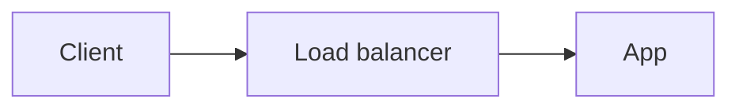

# Systemly

Think about systems systematically.

An educational PWA for developers learning system design, from first principles to distributed systems. The product specification is in [`MASTER-PROMPT.md`](./MASTER-PROMPT.md).

## Stack

- [Astro](https://astro.build) with static output: pages are HTML at build time, JavaScript only where a page needs interactivity.
- TypeScript (strict).
- Plain CSS with design tokens in `src/styles/tokens.css`.
- Self-hosted fonts: Lora (titles), Google Sans (body/UI), both SIL OFL 1.1.
- [MiniSearch](https://lucaong.github.io/minisearch/) for client-side search over a build-time index.
- Deployed on Vercel as static files (no adapter).

## Development

Requires Node 22.12 or newer.

```sh
npm install
npm run dev       # http://localhost:4321
npm test          # unit tests (Vitest)
npm run build     # type-check, test, then a full build to dist/
npm run preview   # serve dist/
```

## Structure

```text
content/          # canonical Markdown chapters (source of truth)
├── advisor/rules/  # Architecture Advisor rules, one YAML file each
├── evolution/      # Evolution Simulator scenarios, one YAML file each
├── playground/checks.yaml  # wording for the Playground's checks
├── decisions/      # Architecture Decision Records, one Markdown file each
├── why-not/        # "Why not?" comparisons, one YAML file per need
├── 00-foundations/ … 12-case-studies/   # one folder per roadmap level
└── _samples/     # dev-only rendering fixtures, never published
docs/
└── curriculum-map.md   # the approved curriculum map
src/
├── components/   # Astro components
├── config/       # site metadata and navigation
├── integrations/ # build-time content report and service-worker generator
├── layouts/      # page layouts
├── lib/
│   ├── advisor/  # Advisor inputs, components, rule schema and rules engine
│   ├── content/  # schema, publishing rules, catalog, related-topics graph, curriculum-map parser
│   ├── decisions/ # decision-record schema, section check, validation, supersedes links
│   ├── why-not/  # comparison schema, validation, chapter back-links
│   ├── evolution/ # scenario schema and stage comparison
│   ├── playground/ # component types, graph model, checks, Mermaid output
│   ├── markdown/ # Markdown pipeline and plugins (headings, callouts, tables, task lists)
│   ├── pwa/      # finds the files each page needs offline
│   └── search/   # index definition, document builder, Markdown-to-text
├── service-worker/ # sw.js source (the build prepends the version and file list)
├── pages/        # /, /roadmap, /learn (A–Z library), /learn/<slug>, /decisions, /decisions/<slug>, /why-not, /why-not/<id>, /search, /search-index.json
├── scripts/      # browser scripts (search page)
└── styles/       # tokens, global styles, prose styles
scripts/          # one-off asset scripts
tests/            # Vitest unit tests
```

`src/assets/logo.svg` (inlined by `Logo.astro`) is the wordmark rebuilt as vector outlines from Lora SemiBold, using the text settings in `logo.psd` (100 px, tracking −20 on "Systeml", −120 on "y."). It matches `logo.png` to within ~1% of pixels but is not cropped, stays sharp at any size, and its letters use the current text colour, so it follows the theme. `logo.png` and `logo.psd` remain as design sources.

## Navigation

Below 64rem (phones and tablets) the section links are a fixed bottom navigation bar in the style of Android's Material 3 navigation bar: Roadmap, Library, Search, Advisor and **More**, which opens a bottom sheet with the other sections. The sheet is a native `popover`, so it needs no JavaScript, and Escape or a tap outside closes it. "Why not?" is in the sheet. From 64rem the links are in the header. Both read from `src/config/site.ts`; icons are Lucide outline icons copied into `src/config/icons.ts` (ISC License), so there is no icon dependency.

## Installable app and offline reading

Systemly is a PWA: it can be installed from the browser ("Add to Home Screen" / "Install app") and reads offline.

- On first visit the service worker saves the home, roadmap, library, search, Advisor, Evolution, Playground, decision-record index, Why-not index and offline pages, the search index, icons, CSS, the Latin font files, and **every approved chapter and decision record, and every published comparison** (about 0.5 MB today).
- Pages are fetched from the network first, so online readers always get the latest text; offline, the saved copy is shown. Pages never opened and not approved show `/offline`.
- Files loaded on demand (e.g. Mermaid) are saved the first time they are used.
- Each build writes `dist/sw.js` with a version hash of the worker code and every saved file; a new version replaces the old cache automatically.
- The service worker is registered only in production builds (`npm run build` + `npm run preview` to test locally).

The favicon (`public/favicon-32.png`, `favicon-48.png`) and app icons (`public/icons/`) are generated from `app-icon.png`, the brand mark, placed on white: `node scripts/generate-icons.mjs`.

## Architecture Advisor

`/advisor` suggests a starting architecture and explains it. It is a rules engine, not a model: every component and every sentence shows which of the reader's answers produced it, and all applied rules are listed.

Each rule is one YAML file in `content/advisor/rules/` (the file name is its id):

```yaml
title: Cache repeated reads
status: draft            # draft (default) | approved — only approved rules are published
priority: 10             # when rules disagree about a component, higher wins
when:                    # every listed field must match one of its values; omit = always
  readWrite: [read-heavy]
  traffic: [100-1k, 1k-10k, over-10k]
architecture:
  add: [cache]           # components: see src/lib/advisor/components.ts
  omit: []               # components this rule says are not needed
sections:                # why, alternatives, notYet, bottlenecks, scalingPath,
  why:                   # lockIn, migration, measure, at10x, at100x
    - text: "Most requests read the same data…"
      chapters: [caching, cache-aside]
    - "Plain text items are fine too."
```

Input fields and their allowed values are defined in `src/lib/advisor/inputs.ts`; the build rejects unknown fields, values, components, sections and chapter links.

**Reviewing drafts:** build with `SHOW_DRAFTS=true` (e.g. a Vercel preview: `vercel deploy --build-env SHOW_DRAFTS=true`). Production builds never show drafts.

## Evolution Simulator

`/evolution` steps through a system as it grows. Each scenario is one YAML file in `content/evolution/`; each stage lists its components and the reasoning in Systemly's vocabulary:

```yaml
title: A web application grows
status: draft                # only approved scenarios are published
stages:
  - label: "10,000 users"
    title: "V2 — Several application instances"
    components: [client, load-balancer, app, multiple-app-instances, database]
    problem: "What forced the change."            # shown as Problem (Starting point for the first stage)
    measure: ["Signals that showed it."]           # Measure
    change: "The one change made."                 # Evolution
    tradeOff: "What the change costs."             # Trade-off
    chapters: [horizontal-scaling]
    advisor: { users: 10k-100k, traffic: 10-100 }  # optional: "Try this stage in the Advisor"
```

Components added since the previous stage are marked **New**. The page always shows that thresholds are not universal (MASTER-PROMPT §11). Stage switching works without JavaScript. Drafts are visible with `SHOW_DRAFTS=true`, as for Advisor rules.

## Architecture Playground

`/playground` lets readers build an architecture from the components in MASTER-PROMPT §12, connect them in the direction requests and messages flow, and set properties that matter (instances, where sessions and files live, cache invalidation, database network access). The diagram is drawn automatically (Mermaid) and the connections are also listed as text.

Checks run on every change (`src/lib/playground/checks.ts`). Their wording lives in `content/playground/checks.yaml`: `title` is the warning, taken from §12 and always published; `why` and `fix` are published only when the entry is `status: approved` (visible in `SHOW_DRAFTS` builds before that).

Presets follow §7 (V1–V4). The whole design is stored in the URL fragment, so "Copy link" shares it and nothing is sent to a server.

## Decision records

`/decisions` lists Architecture Decision Records (§13): one Markdown file each under `content/decisions/`. They are a separate collection, not chapters. Records use the same publishing statuses as chapters, and the same Markdown features (callouts, tables, diagrams).

```yaml
---
number: 4                    # required, never reused → shown as "ADR-004"
title: Introduce Redis       # the decision, without the "ADR-004:" prefix
slug: introduce-redis        # required, kebab-case, unique → /decisions/introduce-redis
status: approved             # approved | draft (default) | placeholder
outcome: accepted            # proposed | accepted (default) | rejected | deprecated
supersedes: [2]              # earlier records this one replaces
chapters: [redis, caching]   # chapters the decision relies on
summary: One sentence: what was decided.
tags: [caching]
date: 2026-09-25
---
```

Every written record uses these `##` sections, in order: Context, Problem, Options, Decision, Reasoning, Consequences, Failure Considerations, Reversal Plan. Other headings may sit between them. An approved record that is missing a section, or has them out of order, fails the build; a draft prints a warning.

- **Superseded** is never written by hand. A record shows as superseded once an *accepted* later record lists it in `supersedes`, and both pages link to each other.
- Each chapter in `chapters` lists the record under **Decisions that use this chapter**.
- Records are searchable (also by "ADR-004"), and approved ones are saved for offline reading.
- The build fails on a reused number or slug, a `chapters` slug that does not exist, or a `supersedes` number that is unpublished, the record itself, or a later record. Placeholder records print `CONTENT REQUIRED`.

`content/decisions/_samples/` holds two dev-only fixtures (ADR-998 and ADR-999) for checking the pages with `npm run dev`.

## Why not?

`/why-not` compares solutions to one problem (§14): train the reader to start from the need, not the technology. One YAML file per need in `content/why-not/`; the file name is the URL (`/why-not/<file-name>`).

```yaml
need: Reduce database read load   # the problem, stated as a need
status: approved                  # approved | draft (default) | placeholder
order: 1                          # position in the list
summary: Optional context.
solutions:                        # at least two, each named once
  - name: Add index
    chapter: database-indexes     # optional: the chapter that explains it
    why: When this solution makes sense.      # "Why this?"
    whyNot: When it does not, or what it costs.   # "Why not?"
```

- A **placeholder** may list solutions without `why` / `whyNot`; its page shows the planned solutions, and the build prints `CONTENT REQUIRED`. A **draft** may leave some out (the build warns). An **approved** comparison needs both for every solution.
- Each solution's chapter lists the comparison under **Compared with alternatives**.
- Comparisons are searchable by the need and by every solution's name, and every published comparison is saved for offline reading.
- The build fails on a `chapter` slug that does not exist, or on an unknown field (so a typo like `whynot` is caught).

`content/why-not/reduce-database-read-load.yaml` is a placeholder built from the example in §14: the need and the five solutions, with no explanations yet.

## Writing content

Chapters are Markdown files under `content/`, one folder per roadmap level. The folder is for organisation only; the URL comes from `slug`, so moving a file never breaks a link.

Every chapter in `docs/curriculum-map.md` already has a placeholder file. To write a chapter, fill in its file and change `status` to `approved`. When the map gains new chapters, run `node scripts/generate-chapters.ts` (add `--dry-run` to preview); it only creates missing files and never touches existing ones.

```yaml
---
title: Load Balancer
chapter: "02.06"             # curriculum number; must start with the level
slug: load-balancer          # required, kebab-case, unique → /learn/load-balancer
level: 2                     # required, 0–12 (roadmap level)
order: 4                     # position within the level
difficulty: intermediate     # beginner | intermediate | advanced
status: approved             # approved | draft (default) | placeholder
summary: One sentence.
tags: [scaling, networking]
aliases: [LB]
related: [reverse-proxy, health-checks]
topics: [L4 vs L7, Algorithms]   # outline shown on the roadmap and placeholder page
---
```

| Status | Production build | `npm run dev` |
|---|---|---|
| `approved` | Published | Shown |
| `draft` | Not published | Shown, marked as draft |
| `placeholder` | Published as "In preparation"; build prints `CONTENT REQUIRED` | Same |

The build fails on duplicate slugs, invalid frontmatter, or a `related` slug that does not exist (or points to the chapter itself).

### Search

`/search-index.json` is built from every published chapter, decision record and "Why not?" comparison, and is downloaded by the search page on first use. Fields are weighted: title > aliases > tags > map topics > headings > summary > connected chapters' titles > body text. Placeholder bodies are not indexed. Results are followed by chapters linked to the top matches, so adding `aliases`, `tags` and `related` is how a chapter becomes findable from the problems it solves (e.g. a search for "Redis" reaching rate limiting).

Press `/` anywhere to search.

### Related topics

List outgoing links once, in `related`. Each chapter page shows them as **Related topics**, and every chapter that links *to* a page is listed there automatically under **Referenced by**, so links never need to be written in both directions.

### Headings

Write chapters the way that reads best in the file; the renderer fits the outline under the page title:

- A leading `# Title` that repeats the frontmatter title is not rendered twice, also when it starts with the chapter number (`# 00.02 — Computer Fundamentals`) or adds an expansion in brackets (`# 00.05 — DNS (Domain Name System)` for the title `DNS`).
- If sections use `#`, every heading moves down one level.
- Skipped levels (e.g. `#` followed by `###`) are closed, so the page outline stays valid for screen readers.

### Callouts

GitHub alert syntax, so files still read correctly on GitHub:

```markdown
> [!TRADE-OFF]
> Replicas add read capacity but may serve stale data.

> [!FAILURE] When the cache is cold
> Text after the marker becomes a custom title.
```

Types: `MENTAL-MODEL`, `PROBLEM`, `TRADE-OFF`, `FAILURE`, `EVOLUTION`, `LOCK-IN`, and GitHub's `NOTE`, `TIP`, `IMPORTANT`, `WARNING`, `CAUTION`.

The renderer keeps text exactly as written: it does not convert quotes, `--` or `...` into typographic characters.

### Math

`$inline$` and `$$display$$` LaTeX are rendered at build time as MathML (remark-math + rehype-katex), which browsers draw natively: no math JavaScript, stylesheet or fonts are downloaded. Wide formulas scroll sideways on phones.

### Components from other editors

Self-closing component tags copied from other writing tools (e.g. `<AsyncImageGroup query={[…]} />`) cannot be rendered from Markdown, nor can a layout element that holds only such tags (e.g. `<row gap={3}>` around several `<AsyncImage … />`). They are left in the file, skipped when rendering, and reported in the build output, so the content owner can decide what should replace them (for example, an image file).

### Diagrams

Write diagrams as ````mermaid```` code blocks. They are drawn in the browser with Systemly's colours (connections in green), redraw when the theme changes, and keep their source under "Diagram as text" for screen readers and copying. Mermaid is only downloaded on pages that contain a diagram. If a diagram has a syntax error, the page shows its source instead.

Give each diagram an accessible title and description:

````markdown

````

To preview every supported format, run `npm run dev` and open `/learn/rendering-test`.
