# What Is a System?

## Learning Objective

By the end of this lesson, you should be able to:

* Explain **what a system is** in simple words.
* Identify the **main components** of a system.
* Understand how components **interact** with each other.
* Identify a system's **inputs and outputs**.
* Explain what **state** means and why systems need to remember things.
* Identify a system's **dependencies**.
* Understand the idea of a **system boundary** — what is inside the system and what is outside.
* Look at a simple application and start thinking about it as a **system**, not just a piece of code.

> **The goal is not to memorize definitions. The goal is to learn how to look at a system and see its parts, relationships, and responsibilities.**

## In One Sentence

**A system is made of components, interactions, inputs, outputs, state, dependencies, and boundaries.**

A useful mental model is:

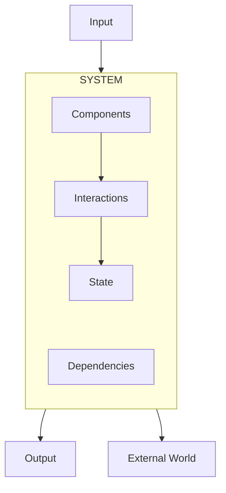


---

# 1. System vs Application

These words are often used interchangeably, but they are not the same thing.

An **application** is usually a piece of software built to perform a particular function.

A **system** is broader.

For example, an online shopping application may contain:

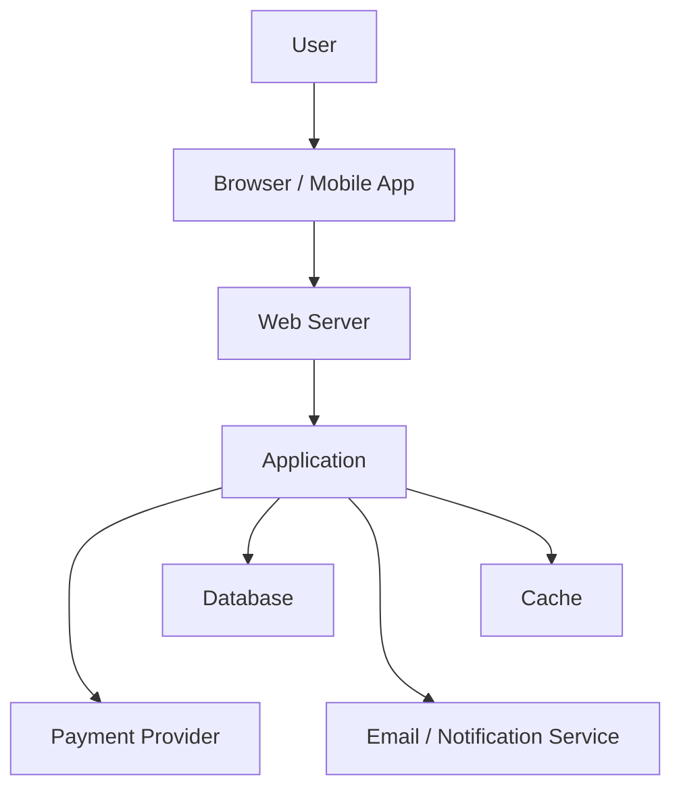

The application is only one part of the overall system.

The complete system includes:

* users
* client applications
* servers
* databases
* networks
* external services
* data
* processes
* rules
* operational procedures

### Important

When designing systems, don't ask only:

> “How do I build this application?”

Ask:

> **“What are all the parts involved in producing this outcome?”**

That shift in thinking is the beginning of system design.

---

# 2. Components

A **component** is a distinct part of a system that performs some responsibility.

For a simple web application:

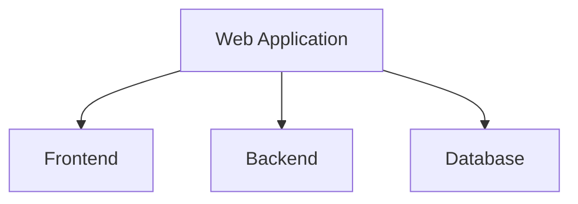

For a larger system:

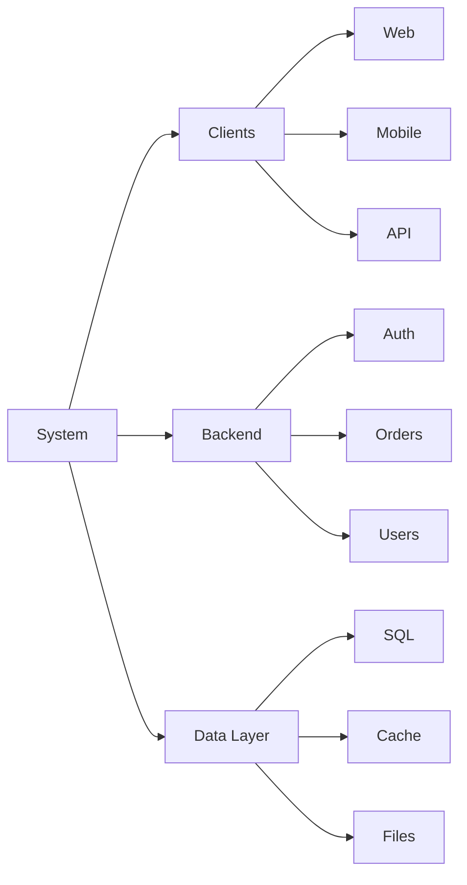

A component does not necessarily mean a separate server or application.

A function can be a component.

A database can be a component.

A service can be a component.

A complete system can itself become a component of a larger system.

### Key idea

> **The boundary of a component depends on what you are trying to understand.**

---

# 3. Interactions

Components become a system because they **interact**.

Consider a login:

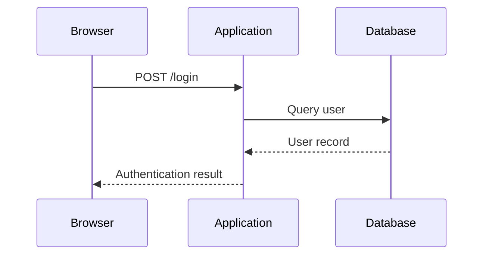

The database by itself does not authenticate the user.

The application by itself does not contain the user's stored record.

The result comes from their interaction.

Interactions can happen through:

* function calls
* HTTP requests
* database queries
* messages
* events
* files
* network connections
* shared memory

System design is largely about understanding these interactions.

---

# 4. Inputs and Outputs

Every useful system receives something and produces something.

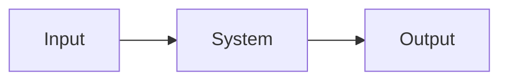

For an e-commerce system:

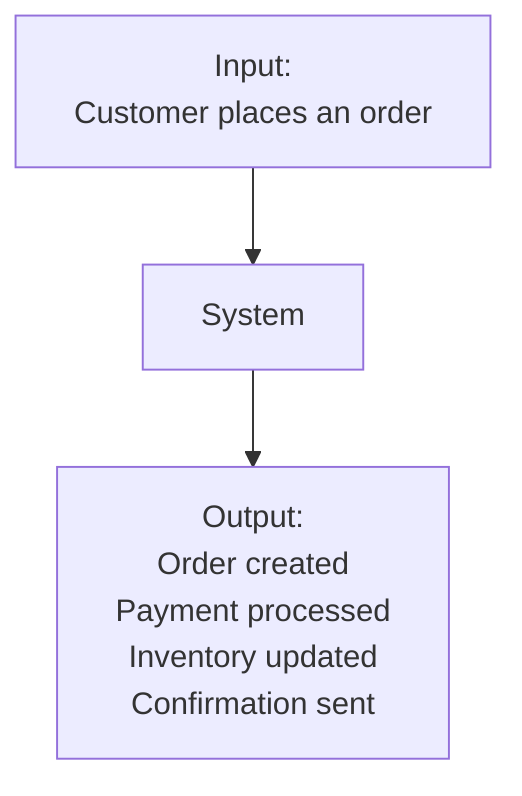

Inputs may include:

* user actions
* HTTP requests
* uploaded files
* messages
* sensor data
* scheduled jobs
* events from another system

Outputs may include:

* HTTP responses
* database changes
* messages
* notifications
* generated files
* external API requests

### Why this matters

If you clearly identify the inputs and outputs, you can begin asking:

* How much input will arrive?
* How quickly must the system respond?
* What happens if input increases?
* What happens if an output fails?
* Which component is responsible for producing the output?

These questions eventually lead to architecture decisions.

---

# 5. State

**State is information about what a system currently remembers.**

For example:

```text
User: Ranjit
Logged in: Yes
Cart items: 3
Order status: Paid
Account balance: ₹2,500
```

That information represents state.

A system can have state in many places:

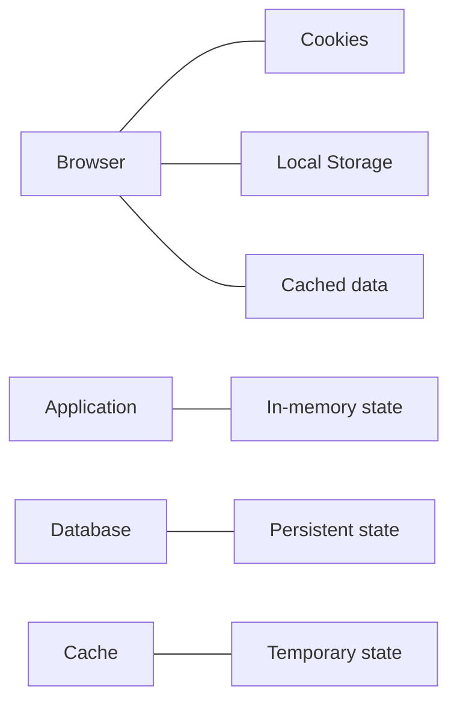

State is important because it affects how systems scale.

Suppose one application server stores a user's session in its memory:

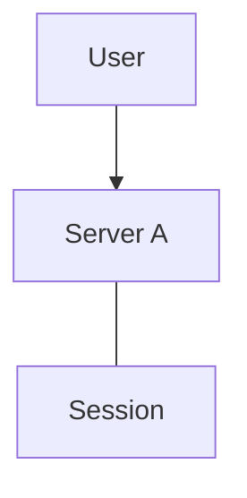

Now the next request reaches Server B:

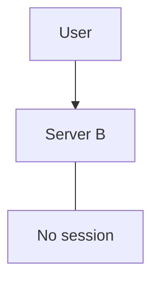

The system now has a problem.

This is one reason **stateless application design** becomes important when systems scale.

We will study that later.

---

# 6. Dependencies

A component rarely works completely by itself.

A **dependency** is something a component relies on to perform its job.

Example:

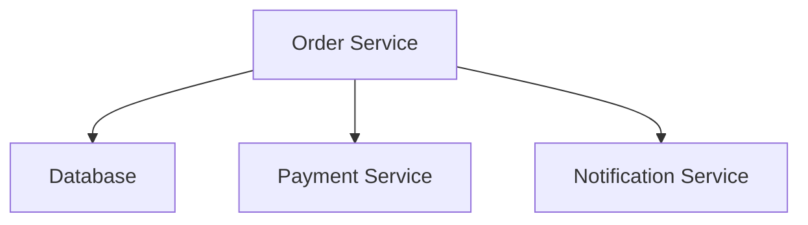

The Order Service depends on all three.

If the payment service becomes unavailable:

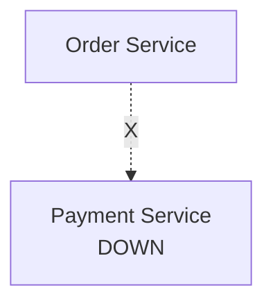

the order flow may be affected.

This leads to an important system-design question:

> **What happens when a dependency fails?**

Possible strategies include:

* timeout
* retry
* fallback
* queue the work
* return an error
* degrade functionality

Later chapters will build these ideas systematically.

---

# 7. Boundaries

A **boundary** defines what belongs to a system or component and what does not.

Consider an online store:

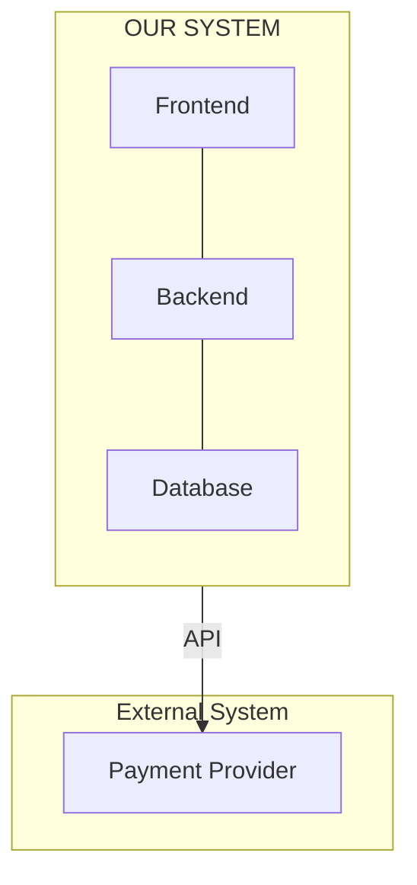

The payment provider is a dependency, but it is outside our system boundary.

Boundaries help answer:

* Who owns this component?
* Who controls this data?
* Who is responsible when it fails?
* How do components communicate?
* Where does one system end and another begin?

Poorly defined boundaries often create tightly coupled systems.

---

# 8. A System Is More Than Its Parts

Imagine:

```text
Database
+
Application
+
Network
```

Simply putting these components together does not automatically create a good system.

Their **relationships** matter.

For example:

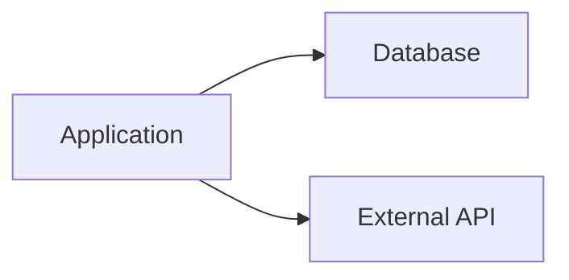

Now consider:

* How often does the application call the database?
* How much data does it transfer?
* What happens when the database is slow?
* What happens when the external API fails?
* Can the application continue without it?
* Where is state stored?

The architecture emerges from these relationships.

> **System design is not just choosing components. It is designing how components interact.**

---

# 9. A Small Real-World Example

Consider a food-ordering system.

A customer places an order.

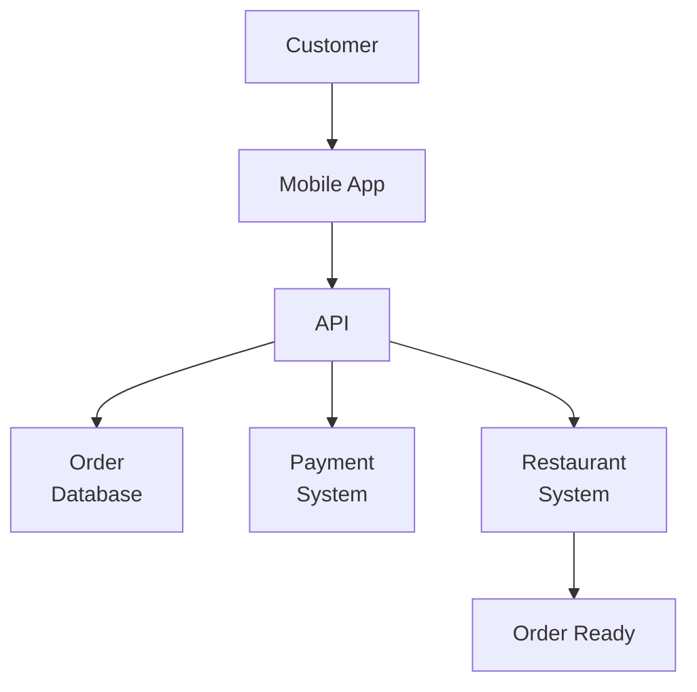

The system receives:

```text
Input:
"Customer wants one pizza."
```

It must maintain state:

```text
Order #1042
Status: Preparing
Payment: Paid
```

It depends on:

```text
Database
Payment provider
Restaurant system
```

It produces outputs:

```text
Order confirmation
Payment result
Restaurant notification
Customer notification
```

And it has boundaries:

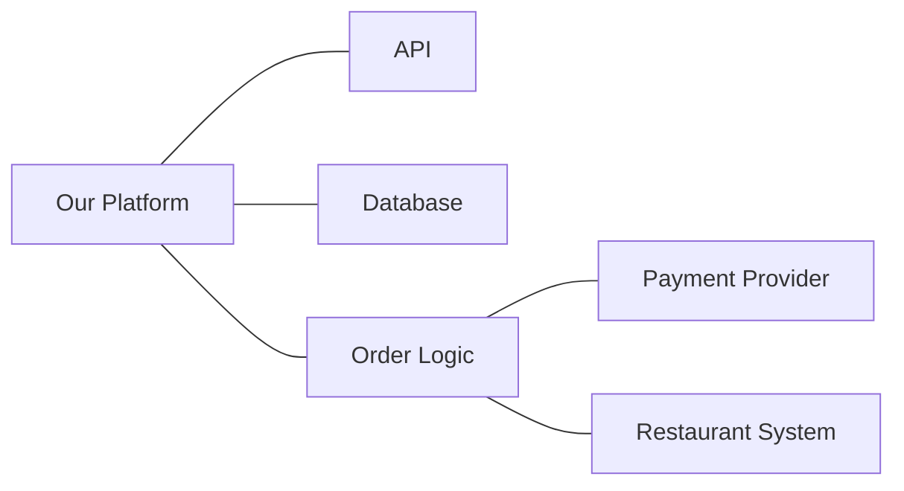

Now we can start asking architectural questions.

What happens if 10 customers order simultaneously?

What happens if 10,000 customers order simultaneously?

What happens if the payment service becomes slow?

What happens if the database fails?

What happens if the restaurant system is unavailable?

These are **system-design questions**.

---

# 10. The System Model

For Systemly, use this mental model whenever you encounter a new system:

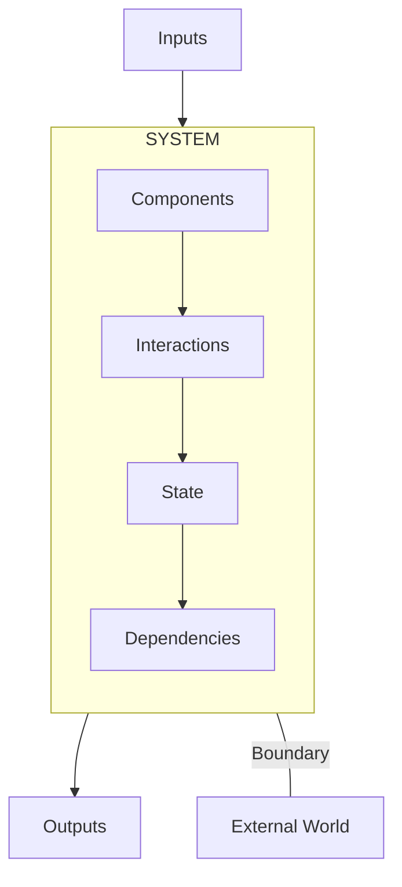

When looking at any architecture, identify these seven things:

| Element          | Ask                                    |
| ---------------- | -------------------------------------- |
| **Components**   | What are the parts?                    |
| **Interactions** | How do the parts communicate?          |
| **Inputs**       | What enters the system?                |
| **Outputs**      | What leaves the system?                |
| **State**        | What does the system need to remember? |
| **Dependencies** | What does it rely on?                  |
| **Boundary**     | What is inside and outside?            |

This simple checklist will remain useful even when systems become extremely complex.

---

# 11. Why This Matters for System Design

A beginner often sees an architecture like this:

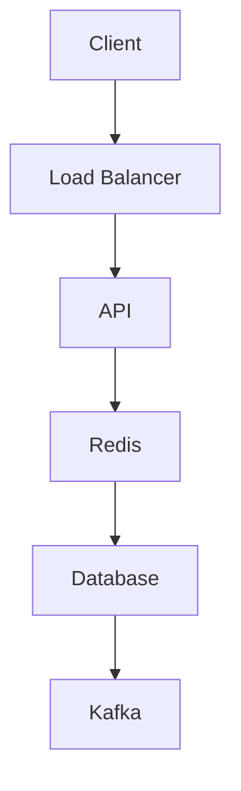

and thinks:

> “I need to learn what all these technologies are.”

That is the wrong starting point.

Instead ask:

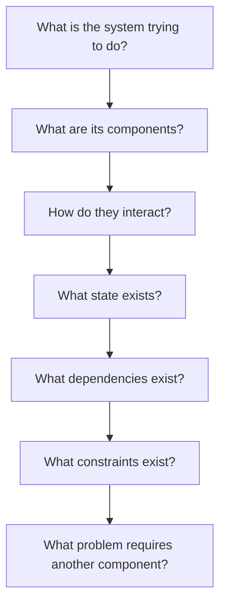

Only then should you decide whether something like Redis, Kafka, or a load balancer is necessary.

> **Architecture should emerge from the problem, not from a list of technologies.**

---

# 12. The First System-Design Habit

Whenever someone presents you with a system, resist the temptation to immediately draw a complex architecture.

Start with:

```text
1. What does the system do?

2. What goes into it?

3. What comes out?

4. What are its components?

5. How do those components interact?

6. What state must be remembered?

7. What does it depend on?

8. Where is the system boundary?
```

Then ask:

```text
What can become a bottleneck?

What can fail?

What happens when usage grows?

What must remain available?

What can be delayed?

What must happen immediately?
```

Those questions gradually turn a simple application into a system you can reason about.

---

# Quick Reference

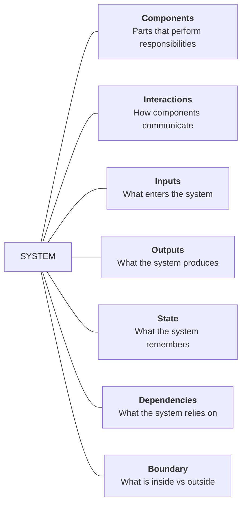

## Core Principle

> **Understand the system before choosing the architecture.**
