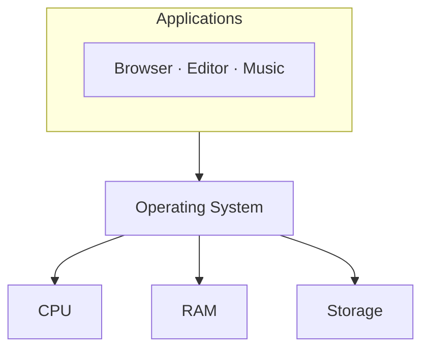
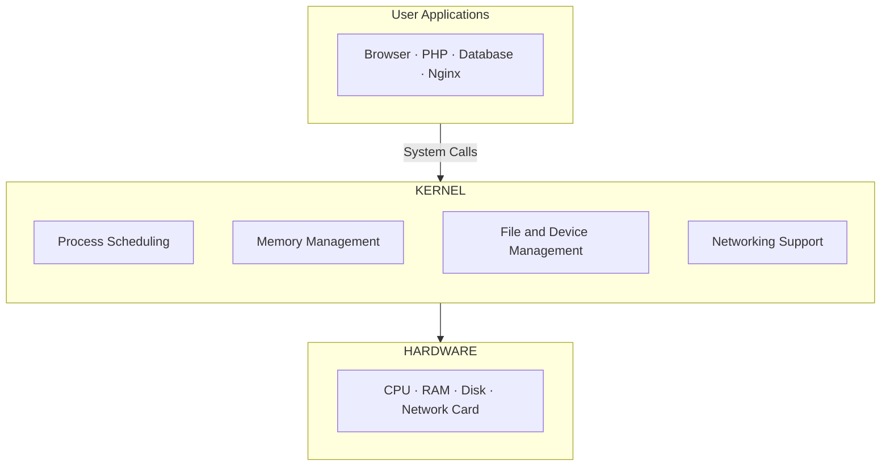
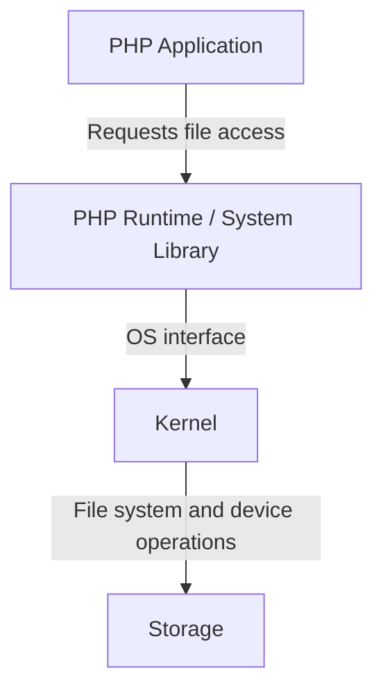
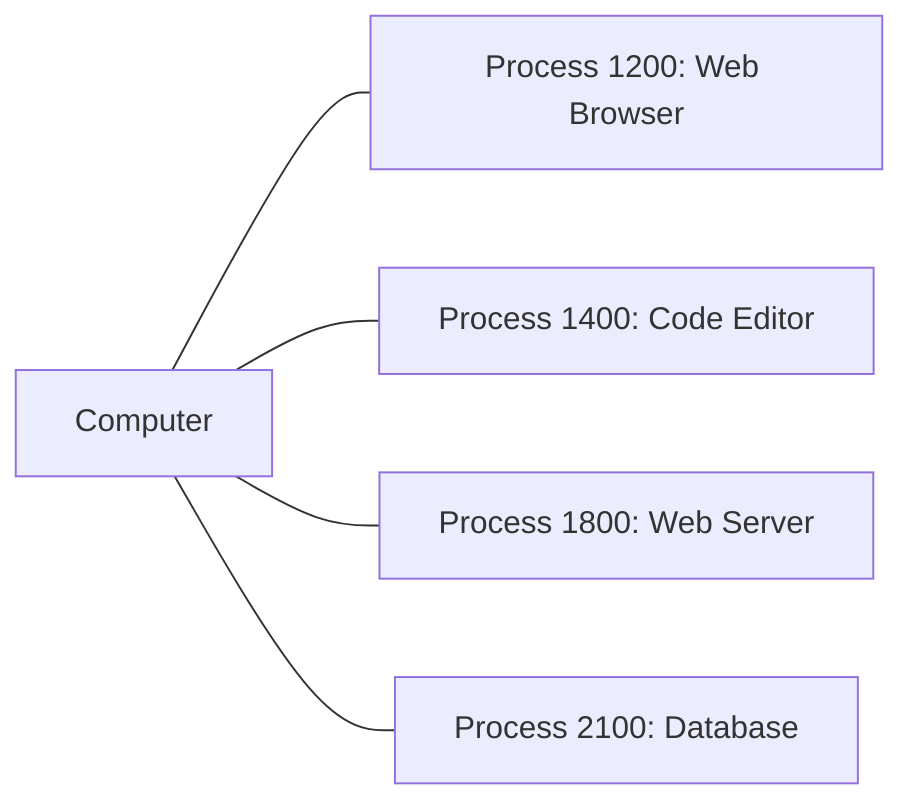
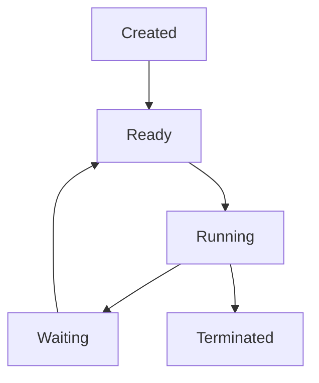
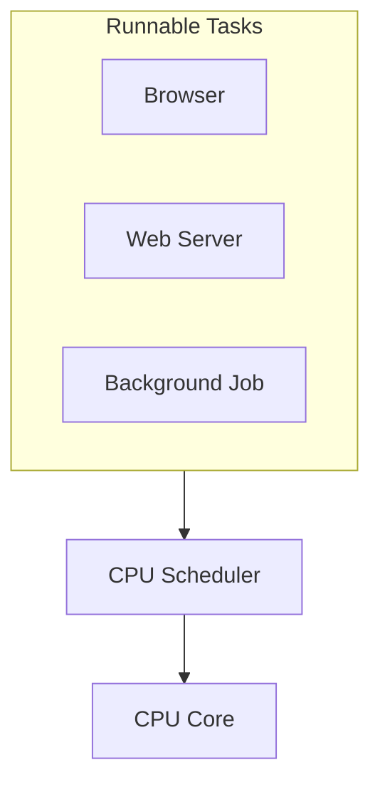
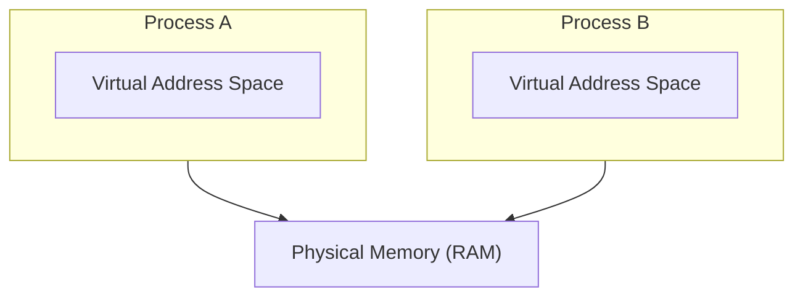
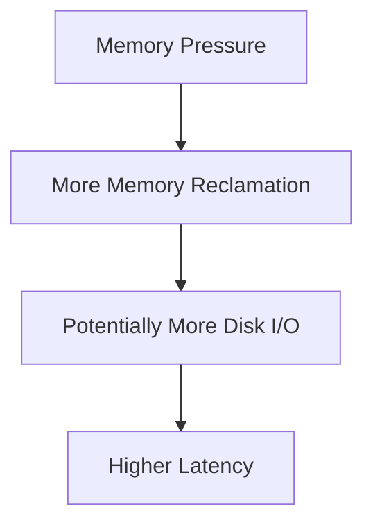
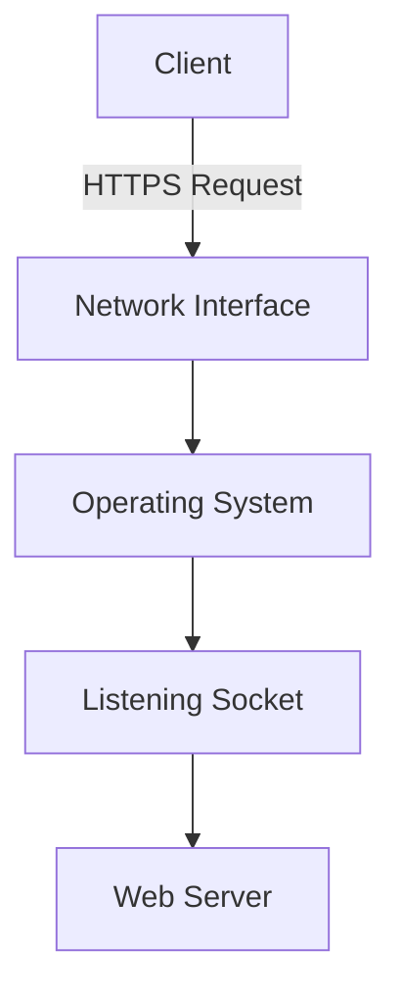
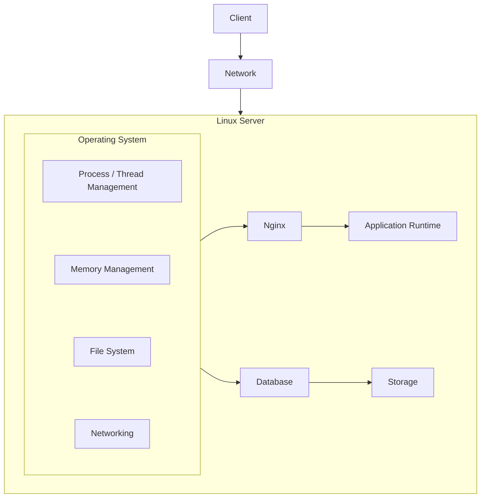

# 00.03 — Operating Systems

## Learning Objective

By the end of this lesson, you should be able to:

* Explain what an operating system does and why applications need one.
* Understand the role of the kernel.
* Distinguish between processes and threads.
* Explain how the operating system manages CPU time and memory.
* Understand how applications access files and hardware.
* Connect operating-system concepts to web servers and system design.

> The goal is to understand how the operating system makes it possible for many applications to share one computer safely and efficiently.

---

## 1. What Is an Operating System?

An **Operating System (OS)** is system software that manages a computer's hardware and provides services that applications use to run.

Examples include:

<row align="center" gap={3}>
  <AsyncImage query="Microsoft Windows 11 logo" aspectRatio="1:1" maxWidth="64px"/>
  <AsyncImage query="Ubuntu Linux logo" aspectRatio="1:1" maxWidth="64px"/>
  <AsyncImage query="Apple macOS logo" aspectRatio="1:1" maxWidth="64px"/>
  <AsyncImage query="Android operating system logo" aspectRatio="1:1" maxWidth="64px"/>
</row>

* Windows
* Linux
* macOS
* Android

Imagine opening a browser, a code editor, and a music player simultaneously.

All three applications need access to the CPU, memory, storage, and other hardware.

Who coordinates their access?

The operating system.



Without an operating system, ordinary applications would need to handle many low-level hardware details themselves.

The OS provides a common environment so applications can focus on their own responsibilities.

---

## 2. The Kernel

The **kernel** is the core part of an operating system.

It manages essential system resources and provides controlled access to hardware.

The kernel is responsible for important tasks such as:

* Scheduling processes and threads.
* Managing memory.
* Managing hardware access through device drivers.
* Handling system calls.
* Enforcing important isolation and protection mechanisms.

A simplified architecture:



This is a simplified view. Actual operating systems have additional layers, libraries, services, and subsystems.

### User space vs Kernel space

Operating systems commonly separate execution into two privilege levels.

**User space:** Where ordinary applications execute with restricted privileges.

**Kernel space:** Where the kernel executes with privileges needed to manage system resources.

Why separate them?

Suppose an ordinary application could directly modify arbitrary physical memory or control a disk device without restrictions.

A bug in that application could damage the entire system.

The separation helps prevent applications from freely interfering with one another or with critical operating-system resources.

> The kernel acts as a controlled gateway between applications and privileged hardware operations.

---

## 3. System Calls

An application often needs a service that only the operating system can safely provide.

For example:

* Opening a file.
* Creating a process.
* Sending data through a network socket.
* Requesting memory.
* Reading from a device.

A **system call** is a controlled mechanism through which a program requests a service from the kernel.

Consider a PHP application reading a file:

```php
<?php

$content = file_get_contents("message.txt");

echo $content;
```

The PHP code does not directly operate the physical storage device.

A simplified flow is:



The exact implementation depends on the operating system, runtime, and libraries.

The important idea is that applications use operating-system interfaces to access resources.

### Why this matters

A web server such as Nginx or Apache depends on OS services for networking, process management, and file access.

A database depends on OS services for memory, storage, and I/O.

Understanding this relationship helps explain why application performance and reliability are affected by operating-system configuration and resource limits.

---

## 4. Process Management

From the previous chapter:

* A program is a set of instructions.
* A process is a running instance of a program.

The operating system manages processes and allocates resources to them.

A process has information associated with its execution, such as:

* Process ID (PID).
* Memory address space.
* Open files and other resources.
* Security permissions.
* One or more threads.

Example:



Each process is managed independently by the OS, although processes can communicate and share certain resources.

### Why separate processes?

Suppose a browser and a database run as separate processes.

If the browser crashes, the operating system can terminate that process without necessarily terminating the database.

Process isolation helps limit the impact of failures.

It is not an absolute guarantee: processes can still compete for shared resources, and some failures can affect the entire machine.

### Process lifecycle

A simplified process lifecycle:



* **Created:** The OS is setting up the process.
* **Ready:** The process can run but is waiting for CPU time.
* **Running:** Its thread is executing on a CPU core.
* **Waiting:** It is waiting for an event, such as I/O completion.
* **Terminated:** Execution has ended.

Real operating systems use more detailed states, and individual threads may have their own scheduling states.

---

## 5. CPU Scheduling

A computer may have many runnable processes and threads but only a limited number of CPU cores.

The operating system's scheduler decides which runnable thread gets CPU time.

Imagine one CPU core and three runnable tasks:



The OS can switch the CPU between tasks.

This switching is called a **context switch**.

A simplified timeline:

```text
Time ──────────────────────────────►

CPU: | Browser | Server | Browser | Job |
```

Each task gets an opportunity to execute according to the operating system's scheduling policies.

On a multicore system, multiple threads can execute simultaneously on different cores.

### Context switching

When the OS switches from one thread to another, it saves and restores execution-related information.

This allows a thread to resume later.

Context switching has overhead.

If a system creates excessive runnable threads, spends too much time switching between them, or has insufficient CPU capacity, performance may suffer.

### Connection to web servers

A web server may receive thousands of requests.

It cannot assume that every request gets its own dedicated CPU core.

Depending on the server architecture, requests may be handled by threads, processes, event loops, or combinations of these.

The OS schedules the runnable work on available CPU cores.

**System-design lesson:** Concurrency allows a system to manage multiple tasks, but it does not create unlimited CPU capacity.

---

## 6. Memory Management

The operating system manages memory allocation and protects processes from directly accessing one another's memory without authorization.

Modern operating systems commonly provide each process with a virtual address space.

### What is virtual memory?

A process uses virtual addresses rather than directly addressing physical RAM.

The operating system and hardware memory-management mechanisms map virtual memory to physical memory as needed.



This diagram is conceptual. Virtual memory mappings are managed at page granularity and can involve physical memory, mapped files, and other mechanisms.

### Why virtual memory matters

It provides several benefits:

1. **Isolation:** Processes normally cannot freely read or overwrite another process's memory.
2. **Address-space flexibility:** Each process can work with its own virtual address space.
3. **Memory management:** The OS can manage physical memory and support mechanisms such as demand paging.

### What happens when RAM is insufficient?

The OS may reclaim memory and, on systems configured for it, move some memory pages to swap space or a page file.

Storage is generally much slower than RAM.

If a system repeatedly moves pages between RAM and storage, performance can deteriorate significantly. This condition is commonly associated with thrashing.

A simplified relationship:



Applications may become slow, unresponsive, or be terminated when memory pressure becomes severe.

### Connection to system design

Suppose a database server has insufficient RAM for its workload.

Its working data and indexes may not fit comfortably in memory.

More storage I/O may be required, increasing query latency.

The solution might involve reducing memory consumption, improving query behavior, adding RAM, or changing the data-access pattern.

The correct response depends on measurement and the actual bottleneck.

---

## 7. File Systems

Applications need a consistent way to create, read, modify, and organize files.

The OS provides file-system interfaces for this purpose.

Examples of file systems include:

| File system | Common context          |
| ----------- | ----------------------- |
| NTFS        | Windows                 |
| ext4        | Linux                   |
| XFS         | Linux                   |
| APFS        | Apple operating systems |

The file system organizes data and metadata on a storage device.

Example:

```text
/
├── var
│   ├── www
│   │   └── application
│   └── log
│       └── application.log
│
├── home
│   └── developer
│
└── etc
    └── application.conf
```

This illustrates a Linux-style directory layout.

The actual layout and directory conventions vary between operating systems.

### File permissions

Operating systems also control who can access files.

For example, a web server process may need permission to read application files but should not necessarily have permission to modify every file on the system.

Restricting file access reduces the damage that can result from a compromised or misconfigured application.

**Security principle:** Give a process only the file and resource permissions it needs.

---

## 8. Networking and the Operating System

A server application needs to communicate with clients and other services.

The OS provides networking facilities, including sockets, that applications can use to send and receive data.

A socket is an operating-system communication endpoint.

Consider a web server listening on port 443:



The web server uses OS networking interfaces to receive connections and exchange data.

The operating system handles many lower-level networking responsibilities, while the application and its libraries implement higher-level protocols and application logic.

### What happens under heavy load?

A server can encounter operating-system resource limits, including:

* Available file descriptors.
* Memory limits.
* Socket and connection-related limits.
* CPU capacity.
* Network bandwidth.

For example, if a server cannot obtain another file descriptor, it may be unable to accept a new connection or open another file.

The exact limit and behavior depend on the operating system and configuration.

This is why deploying an application is not just about writing code. The runtime environment matters too.

---

## 9. How This Connects to a Web Application

Let's connect the concepts to a typical web server.



This is a simplified single-server example. In production, these components may run on separate machines or managed services.

When a request arrives:

1. The network interface receives data.
2. The OS networking stack makes the data available to the appropriate application.
3. The web server processes the request.
4. The application may execute code, allocate memory, and access files or a database.
5. The OS schedules runnable work and manages resource access.
6. The response is sent back through the networking stack.

The operating system is not the business logic of the application. It provides the environment and resource-management mechanisms on which that business logic depends.

---

## 10. Why Operating Systems Matter in System Design

Imagine an application becoming slower as its traffic grows.

Without understanding the OS, you might assume the only solution is to purchase a larger server.

But several different problems could be responsible:

| Observation                             | Possible explanation                                   |
| --------------------------------------- | ------------------------------------------------------ |
| CPU usage stays near capacity           | CPU-bound workload or insufficient processing capacity |
| Memory usage grows continuously         | Memory leak or excessive memory consumption            |
| System spends substantial time swapping | Memory pressure                                        |
| New connections are rejected            | Connection, file-descriptor, or other resource limits  |
| Requests wait on disk access            | Storage or I/O bottleneck                              |
| Many threads compete for CPU            | Scheduling overhead or excessive concurrency           |

These are diagnostic possibilities, not conclusions. Measurements and investigation are required to identify the actual cause.

> **The operating system helps explain how application-level behavior becomes resource consumption at the machine level.**

---

## Quick Reference

| Concept          | Simple meaning                                                        |
| ---------------- | --------------------------------------------------------------------- |
| Operating system | Software that manages hardware and provides services to applications. |
| Kernel           | The core of the OS, responsible for essential resource management.    |
| System call      | A controlled request for a kernel service.                            |
| Process          | A running instance of a program.                                      |
| Thread           | An execution path within a process.                                   |
| Scheduler        | Selects runnable threads for CPU execution.                           |
| Context switch   | Switching CPU execution from one thread to another.                   |
| Virtual memory   | An abstraction that gives processes their own virtual address spaces. |
| File system      | Organizes and manages files and directories.                          |
| Socket           | An endpoint used for communication.                                   |

## Knowledge Check

Try answering these without looking back.

1. Why do applications need an operating system?
2. What is the difference between user space and kernel space?
3. What happens when a program makes a system call?
4. Why can a computer run many processes even when it has only a few CPU cores?
5. How does virtual memory help isolate processes?
6. Why can insufficient RAM make a database slower?
7. Why might a web server fail to accept new connections even when its application code has no obvious bug?
