# 00.04 — Networking Fundamentals

## Learning Objective

By the end of this lesson, you should be able to:

* Explain what a computer network is and why computers need one.
* Understand how IP addresses identify devices or network interfaces.
* Explain the purpose of ports and how they help deliver data to the right application.
* Understand how data travels in packets across networks.
* Explain the roles of routers and switches.
* Distinguish between TCP and UDP and understand when each is used.
* Trace the basic journey of a request from your computer to a remote server.

> The goal is to understand how computers find each other and exchange data — the foundation of every web application and distributed system.

---

# 1. What Is a Computer Network?

A **computer network** is a collection of devices connected so they can exchange data and share resources.

Devices can include:

* Desktop computers and laptops.
* Smartphones.
* Servers.
* Routers and switches.
* Printers and other connected equipment.

For example, when your laptop connects to Wi-Fi, it becomes part of a network.

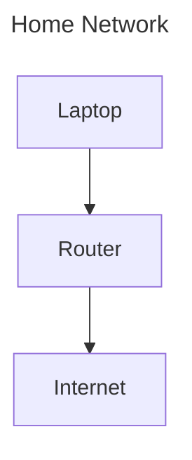

The network allows your laptop to communicate with other devices and remote servers.

### Why do networks exist?

Imagine you build a web application on your computer.

You want another person to open it from their laptop.

Your application now needs a way to exchange data with another computer.

That is what networking makes possible.

In system design, networking connects components that may run on entirely different machines.

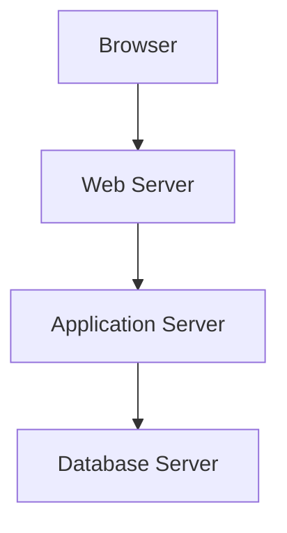

Each component may be running on a different machine, but they can work together through network communication.

**Key idea:** A distributed system depends on computers communicating over a network.

---

# 2. What Is the Internet?

The Internet is a global network of interconnected networks.

Your home network, an office network, and a cloud provider's network can communicate through infrastructure operated by different organizations.

A simplified view:

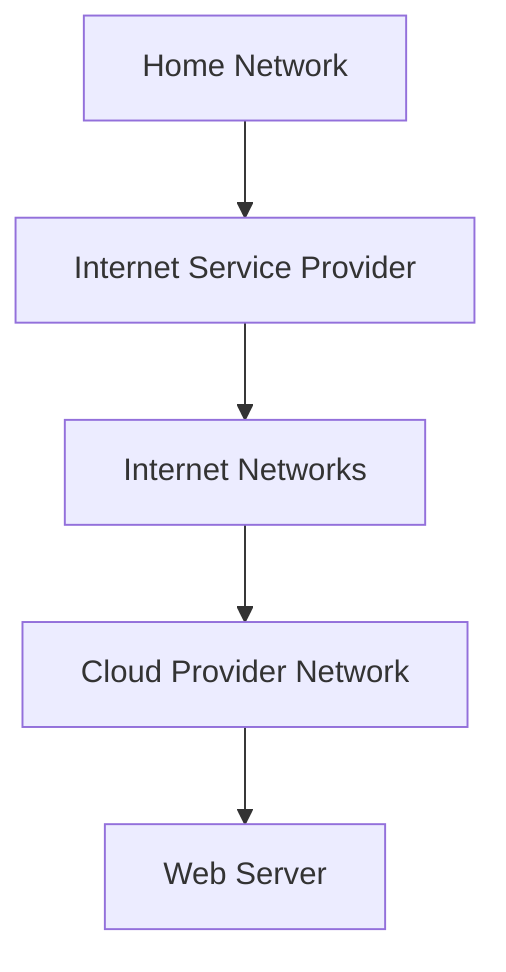

The Internet is not one giant computer or one central network.

It consists of many independently operated networks connected through routers and shared networking protocols.

### Local Network vs Internet

| Local network                                                  | Internet                                                            |
| -------------------------------------------------------------- | ------------------------------------------------------------------- |
| Connects devices within a limited network environment.         | Connects networks across the world.                                 |
| May be a home, office, or data-center network.                 | Uses interconnected networks and routing infrastructure.            |
| Devices can communicate without accessing the public Internet. | Enables communication between networks across geographic locations. |

A web server can communicate with another server inside the same private network without sending traffic over the public Internet.

This distinction becomes important when designing cloud infrastructure.

---

# 3. IP Addresses — Identifying Network Interfaces

When one computer sends data to another, the network needs addressing information to help deliver it.

An **IP address** is a logical network-layer address assigned to a network interface.

IP stands for Internet Protocol.

There are two major versions.

## IPv4

An IPv4 address contains 32 bits, commonly written as four decimal numbers separated by dots.

Example:

```text
192.168.1.10
```

Each number represents 8 bits and ranges from 0 to 255.

Conceptually:

```text
192      .168      .1        .10
 8 bits    8 bits    8 bits    8 bits

Total: 32 bits
```

An IPv4 address identifies a network interface within an addressing and routing context. It does not necessarily identify a physical computer permanently.

A computer can have multiple network interfaces and multiple IP addresses.

## IPv6

IPv6 uses 128-bit addresses.

Example:

```text
2001:db8:1234::10
```

IPv6 provides a vastly larger address space than IPv4.

It was designed partly to address the limitations of IPv4 address availability and supports modern Internet addressing and routing.

## Public vs Private IP Addresses

A private IP address is used within private network environments and is not directly globally routable on the public Internet.

Examples of common IPv4 private ranges:

| Range            | Common use               |
| ---------------- | ------------------------ |
| `10.0.0.0/8`     | Private networks         |
| `172.16.0.0/12`  | Private networks         |
| `192.168.0.0/16` | Home and office networks |

For example:

```text
Laptop:       192.168.1.10
Phone:        192.168.1.11
Printer:      192.168.1.12
```

These devices can use private addresses within the same home network.

Your router may use Network Address Translation (NAT) to allow devices with private IPv4 addresses to share a public IPv4 address for Internet communication.

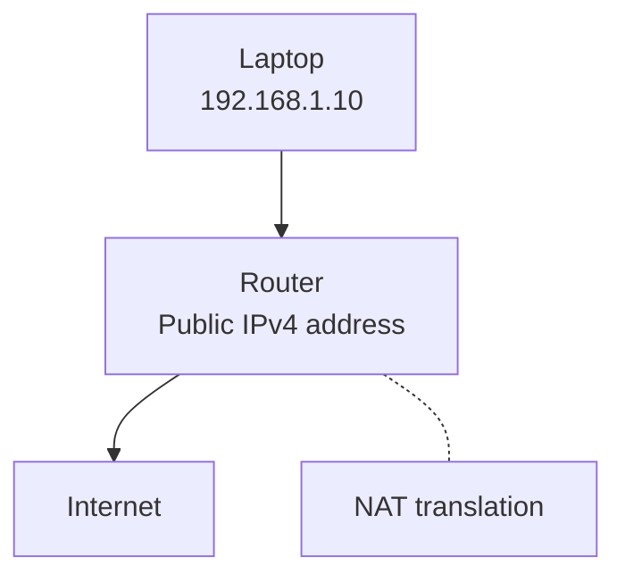

NAT is common in IPv4 networks, but it is not the same thing as a firewall. Security controls still need to be configured appropriately.

### Why IP addresses matter in system design

Suppose your application runs on three servers.

```text
Server A: 10.0.1.10
Server B: 10.0.1.11
Server C: 10.0.1.12
```

Other components need a way to communicate with those servers.

IP addressing provides the network-layer addressing needed to route packets toward the appropriate destination.

However, an IP address alone does not identify which application on the destination machine should receive the data.

That's where ports come in.

---

# 4. Ports — Reaching the Right Application

A computer can run many network applications at the same time.

For example:

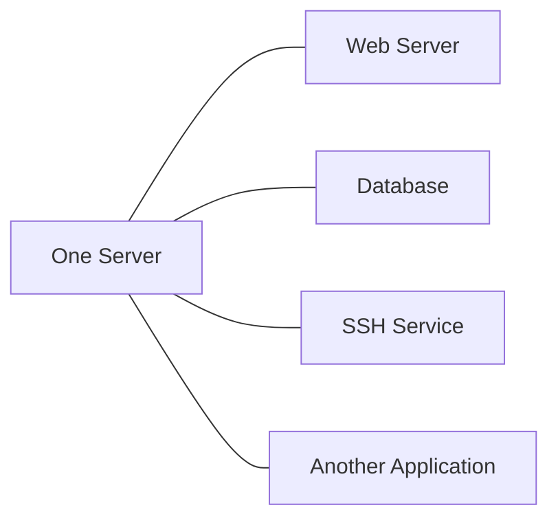

All of these may use the same network interface and IP address.

How does incoming data reach the intended application?

Through transport-layer information, including **port numbers**.

A port is a 16-bit number used by transport protocols such as TCP and UDP to identify a communication endpoint on a host.

Port numbers range from 0 to 65535.

Common examples:

| Port | Common service |
| ---- | -------------- |
| 22   | SSH            |
| 53   | DNS            |
| 80   | HTTP           |
| 443  | HTTPS          |
| 3306 | MySQL          |
| 5432 | PostgreSQL     |

These are conventional default ports. A service can often be configured to use another port.

## IP Address + Port

Think of the IP address as identifying the destination network interface and the port as helping identify the destination application endpoint.

For example:

```text
203.0.113.20:443
```

Here:

* `203.0.113.20` is the IPv4 address.
* `443` is the port number.

A browser connecting to a web server might establish a TCP connection to that IP address and port.

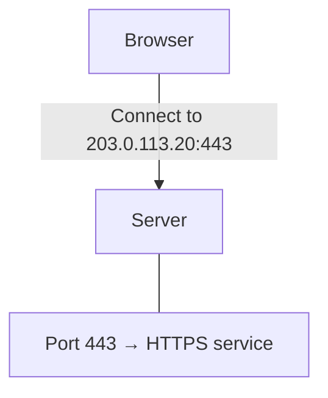

The exact delivery depends on the protocol, operating system, network configuration, and any intermediate infrastructure.

### What is a socket?

A socket is a communication endpoint provided through networking APIs.

For TCP, a connection is commonly identified by the combination of:

```text
Source IP
Source Port
Destination IP
Destination Port
Transport Protocol
```

For example:

```text
Client:
192.168.1.10:52000

Server:
203.0.113.20:443

Protocol:
TCP
```

This combination helps distinguish one communication flow from another.

Multiple clients can connect to the same server IP address and port because their connection details differ.

**Remember:** An IP address helps identify where network traffic should go. A port helps identify which transport endpoint should receive it.

---

# 5. Packets — How Data Travels

When you send a large amount of data across a network, it is not necessarily transmitted as one enormous block.

Network protocols organize data into smaller units.

At the IP layer, these units are called **IP packets**.

At other layers, you will encounter terms such as frames and TCP segments.

For now, think of packets as small units of data that travel through a network.

Imagine sending a large file:

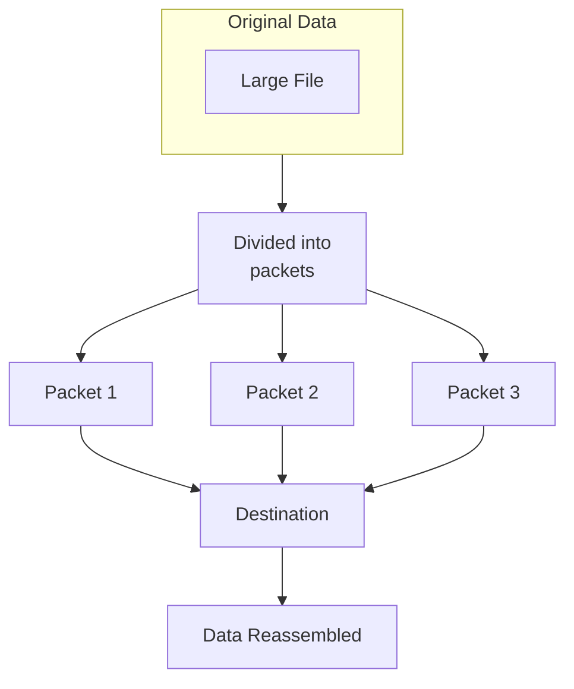

The exact segmentation and reassembly process depends on the protocol.

For example, TCP presents a reliable, ordered byte stream to the application. It does not guarantee that application writes correspond one-to-one with individual TCP segments or IP packets.

### What information does a packet carry?

An IP packet includes information such as:

* Source IP address.
* Destination IP address.
* Protocol information.
* Payload containing data from an upper-layer protocol.

A simplified illustration:

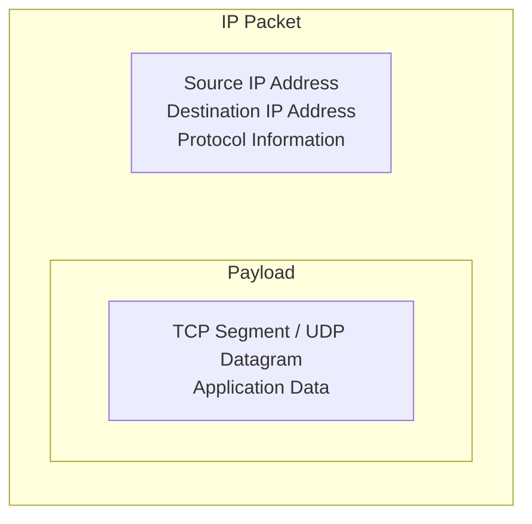

Actual packet headers contain additional fields, and encapsulation varies by protocol.

### Why use packets?

Packet-based networking allows network resources to be shared among many communication flows.

Routers can forward packets independently based on routing information.

This is fundamental to how the Internet operates.

### Important: Packets do not always take the same path

Packets between two endpoints may travel through multiple routers.

The route can change because of network conditions, routing decisions, or failures.

This means network communication involves uncertainty.

Packets can be delayed, dropped, duplicated, or delivered in an unexpected order at certain layers.

Reliable protocols such as TCP handle many of these issues for applications.

---

# 6. Switches and Routers

These devices help move data through networks, but they operate differently.

## Network Switch

A network switch commonly connects devices within a local network.

At the data-link layer, an Ethernet switch forwards frames using MAC address information.

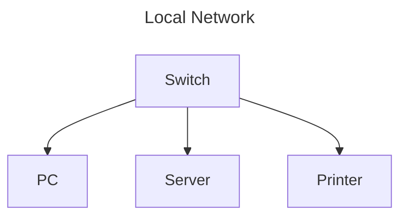

For example, a switch can forward traffic from one computer to another within the same Ethernet network.

## Router

A router connects different IP networks and forwards packets between them.

It uses routing information to determine the next hop toward a destination.

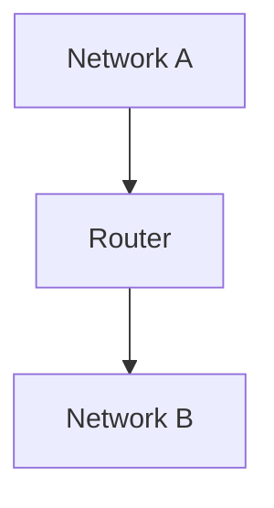

A home router often combines several functions:

* IP routing.
* Network Address Translation.
* Firewall features.
* DHCP services.
* Wi-Fi access point functionality.

These functions are conceptually different, even when one physical device provides them all.

### Switch vs Router

| Switch                                                    | Router                                                 |
| --------------------------------------------------------- | ------------------------------------------------------ |
| Commonly forwards Ethernet frames within a local network. | Forwards IP packets between networks.                  |
| Uses MAC address information for forwarding.              | Uses IP addresses and routing tables.                  |
| Primarily associated with Layer 2 in basic networking.    | Primarily associated with Layer 3 in basic networking. |

Modern switches and routers can support additional capabilities, but this distinction is enough for the foundation.

---

# 7. TCP — Reliable Communication

**TCP stands for Transmission Control Protocol.**

TCP is a transport-layer protocol that provides a reliable, ordered byte stream between endpoints.

It is widely used by web applications and many other Internet services.

Why do applications need reliability?

Imagine sending an order to an e-commerce server.

```text
Customer → "Place my order"
```

If some data is lost or arrives incorrectly, the application needs a way to handle that situation.

TCP provides mechanisms such as:

* Connection establishment.
* Sequence numbers.
* Acknowledgments.
* Retransmission.
* Flow control.
* Congestion control.

Together, these mechanisms help provide reliable, ordered delivery of bytes.

## TCP Connection Establishment

TCP commonly establishes a connection using a three-way handshake.

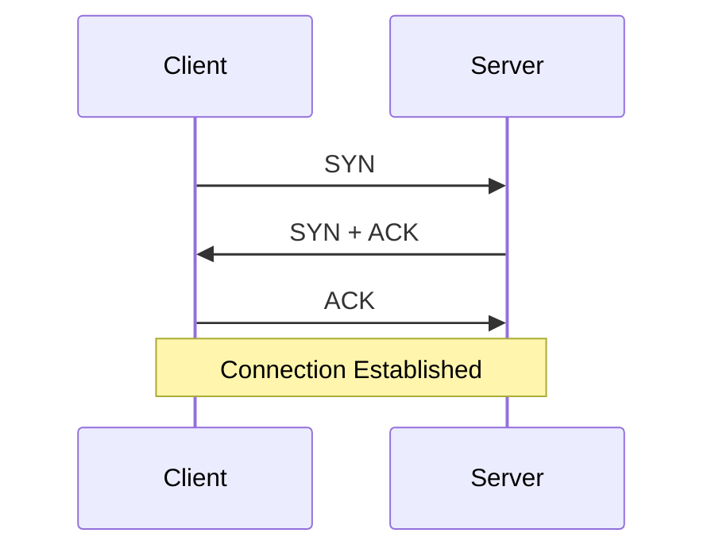

In simplified terms:

1. The client requests a connection.
2. The server acknowledges the request and responds.
3. The client acknowledges the response.

After the connection is established, the endpoints can exchange data.

The handshake also establishes initial sequence-number state and helps synchronize the connection.

### TCP Reliability

Suppose a sender transmits data:

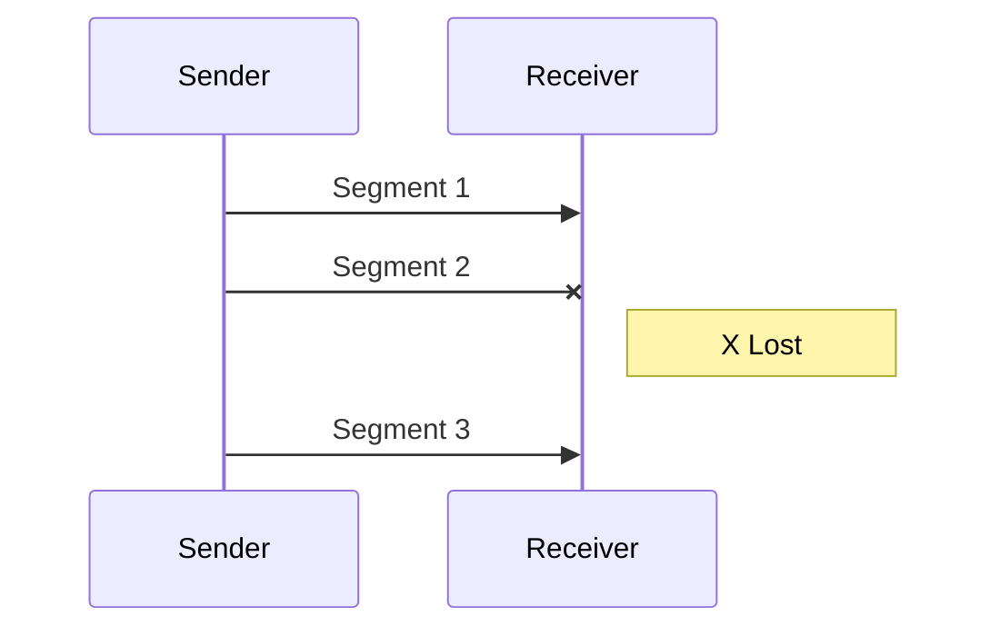

TCP can detect missing data through its acknowledgment and sequence mechanisms and retransmit data when appropriate.

The receiving application is presented with an ordered byte stream rather than arbitrary out-of-order pieces.

However, TCP cannot guarantee that communication will always succeed. If a connection fails or a timeout occurs, the application still needs to handle the error.

### Why TCP matters in system design

TCP reliability is useful, but it introduces considerations:

* Connection establishment takes time.
* Lost data can delay delivery of later bytes.
* Connections consume resources.
* Network congestion affects throughput and latency.
* Applications must handle connection failures and timeouts.

A TCP connection is not the same thing as an HTTP request. Multiple HTTP requests may use one persistent connection.

We will explore HTTP and HTTPS in later chapters.

---

# 8. UDP — Lightweight Datagrams

**UDP stands for User Datagram Protocol.**

UDP is a connectionless transport protocol that sends datagrams without providing TCP's built-in reliable, ordered byte-stream guarantees.

UDP does not perform TCP-style connection establishment.

It also does not provide TCP-style retransmission, ordered delivery, or congestion control as part of UDP itself.

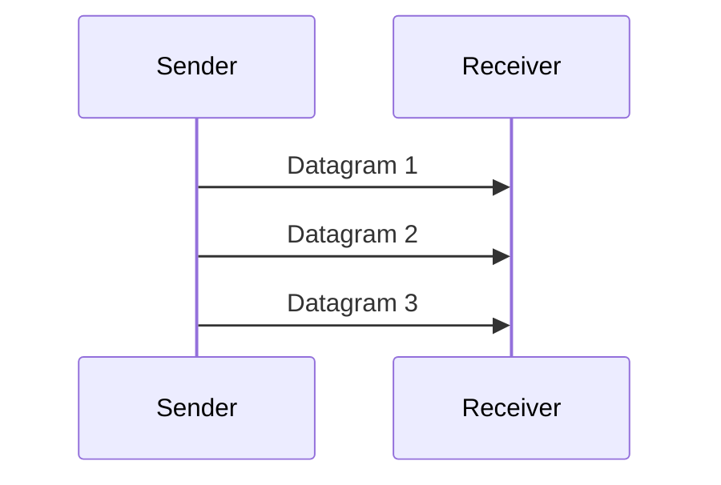

The sender transmits datagrams, but delivery is not guaranteed.

Datagrams may be lost, duplicated, or arrive out of order.

Applications that require reliability can implement suitable mechanisms above UDP.

## Where is UDP used?

Common examples include:

* DNS queries using UDP in many cases.
* Real-time voice and video communication.
* Online gaming.
* QUIC, which operates over UDP and provides its own transport features.

UDP is useful when applications want datagram-based communication or need to implement transport behavior suited to their requirements.

### TCP vs UDP

| TCP                                                            | UDP                                                                 |
| -------------------------------------------------------------- | ------------------------------------------------------------------- |
| Connection-oriented transport                                  | Connectionless transport                                            |
| Reliable, ordered byte stream                                  | Datagrams without built-in reliable ordering                        |
| Provides retransmission and flow/congestion-control mechanisms | Does not provide TCP-style reliability or congestion control itself |
| Commonly used by HTTP/1.1 and HTTP/2 over TCP                  | Used by protocols including DNS and QUIC                            |

One important correction to a common misconception:

**UDP is not automatically faster or better than TCP.**

The right choice depends on the application, network conditions, and the protocol built on top of it.

For example, HTTP/3 uses QUIC over UDP, but QUIC implements reliability, congestion control, and other transport functionality itself.

---

# 9. A Request's Journey Across the Network

Let's put everything together.

You type a website address into your browser.

The browser needs to communicate with a remote server.

A simplified journey:

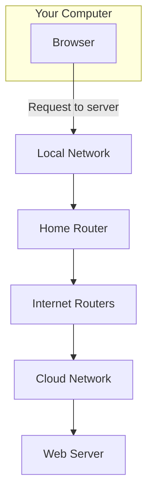

What happens along the way?

### Step 1: Identify the destination

The browser needs the destination IP address.

If you entered a domain name, DNS can help resolve that name to an IP address.

We will cover DNS in Chapter 00.05.

### Step 2: Establish transport communication

For a typical HTTPS connection using HTTP/2 over TCP, the client establishes a TCP connection to the server's IP address and port 443.

Other modern configurations, such as HTTP/3, use QUIC over UDP.

### Step 3: Send data

The browser sends application data through the networking stack.

The data is encapsulated into protocol units and transmitted over the network.

### Step 4: Route packets

Routers forward packets toward the destination based on routing information.

The traffic may cross multiple networks before reaching the server.

### Step 5: Deliver data to the server

The server's networking stack processes incoming traffic and delivers it to the appropriate communication endpoint.

The web server receives and processes the request.

### Step 6: Return the response

The server sends response data back through the network.

The browser receives the response and renders the result.

The complete journey involves multiple layers of software and hardware.

---

# 10. Network Latency and Reliability

Networking introduces delays.

Even if your application code executes quickly, a request can be slow because of network communication.

Consider this simplified request:

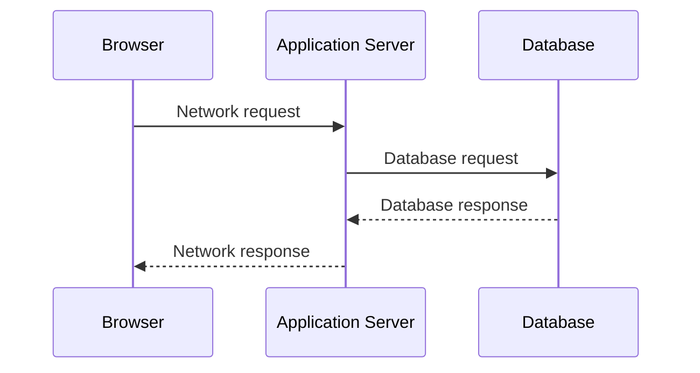

The total response time includes application processing, network delays, database work, and other factors.

If a request involves multiple sequential network calls, their delays can accumulate.

### What can go wrong?

| Problem                | Possible effect                                      |
| ---------------------- | ---------------------------------------------------- |
| Packet loss            | Retransmissions, delays, or failed communication     |
| High latency           | Slower request-response times                        |
| Network congestion     | Increased delays and reduced throughput              |
| Connection failure     | Application cannot communicate with the dependency   |
| DNS resolution failure | Client may be unable to resolve the destination name |

These are reasons distributed systems need timeouts, retries, and appropriate failure handling.

However, retries must be designed carefully. Retrying every failed request immediately can increase load on an already struggling system.

We will study these patterns in Level 2.

---

# 11. Key Takeaways

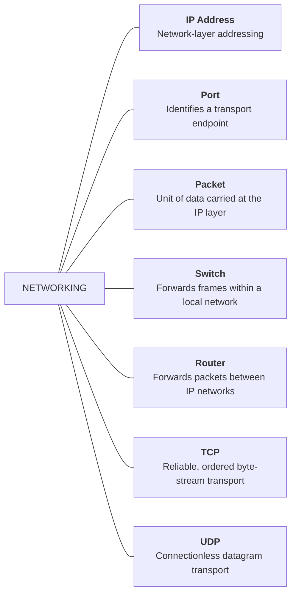

## Core Principle

> **A network allows independent computers to communicate, but communication introduces latency, resource limits, and the possibility of failure.**

A system designer must account for all three.

---

# Knowledge Check

Try answering these without looking back.

1. What is the difference between a private IP address and a public IP address?
2. Why does a server need ports when it already has an IP address?
3. What is the difference between a packet and a TCP connection?
4. What is the difference between a switch and a router?
5. Why does TCP use a three-way handshake?
6. Does UDP guarantee that every datagram will arrive? Why or why not?
7. Why can a network failure affect an application even when its server is running correctly?
8. What happens when a browser connects to a server at an IP address on port 443?
