# 00.05 — DNS (Domain Name System)

## Learning Objective

By the end of this lesson, you should be able to:

* Explain why computers use domain names instead of memorizing IP addresses.
* Understand how DNS translates domain names into IP addresses.
* Distinguish between recursive resolvers, root servers, TLD servers, and authoritative name servers.
* Trace a DNS lookup from your browser to the answer.
* Understand DNS records, TTL, and caching.
* Explain what happens when DNS is slow, misconfigured, or unavailable.

> The goal is to understand how a browser finds the server it needs to communicate with.

---

## 1. Why Does DNS Exist?

In the previous chapter, we learned that computers use IP addresses to communicate over networks.

For example, a server might be reachable through an IP address such as:

```text
203.0.113.20
```

But imagine having to remember an IP address for every website you visit.

Instead, we use domain names:

```text
example.com
google.com
learncomputer.in
```

A domain name is easier for humans to remember.

The problem is that network communication still needs an IP address to reach the destination.

**DNS solves this problem.**

DNS stands for Domain Name System. It is a distributed naming system that allows applications to look up information associated with domain names, including IP addresses.

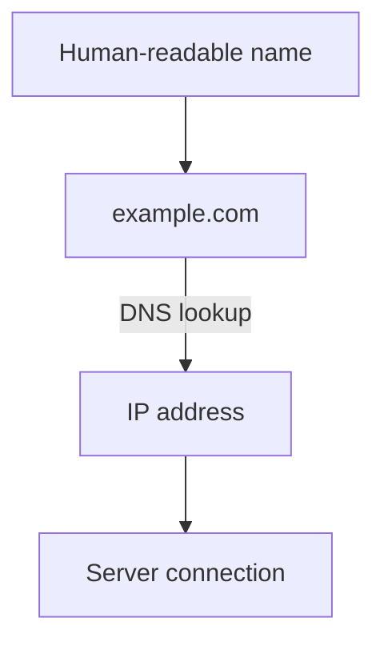

Think of DNS as a distributed directory for Internet names.

It does not carry your website's entire content. It helps your computer discover the information needed to locate the service.

---

## 2. Domain Name vs IP Address

Consider:

```text
https://example.com
```

The parts are:

```text
https://example.com
  │            │
  │            └── Domain name
  │
  └── Protocol / URL scheme
```

The domain name identifies the name you want to access.

DNS can resolve that name to an IP address.

For example, a DNS lookup may return an IPv4 address through an A record or an IPv6 address through an AAAA record.

| Term        | Meaning                                                     |
| ----------- | ----------------------------------------------------------- |
| Domain name | Human-readable name, such as `example.com`.                 |
| IP address  | Network-layer address used to route traffic.                |
| DNS         | System that stores and resolves domain-related information. |

A domain name is not permanently tied to one IP address.

One domain can resolve to multiple IP addresses. Different clients may receive different answers based on DNS configuration, geographic location, or traffic-management policies.

Likewise, multiple domain names can point to the same IP address.

This flexibility is important for load balancing, hosting, and infrastructure changes.

---

## 3. DNS Is a Distributed System

DNS does not rely on one central server containing every domain name on the Internet.

Instead, its information is distributed across a hierarchy of servers and administrative zones.

A simplified view:

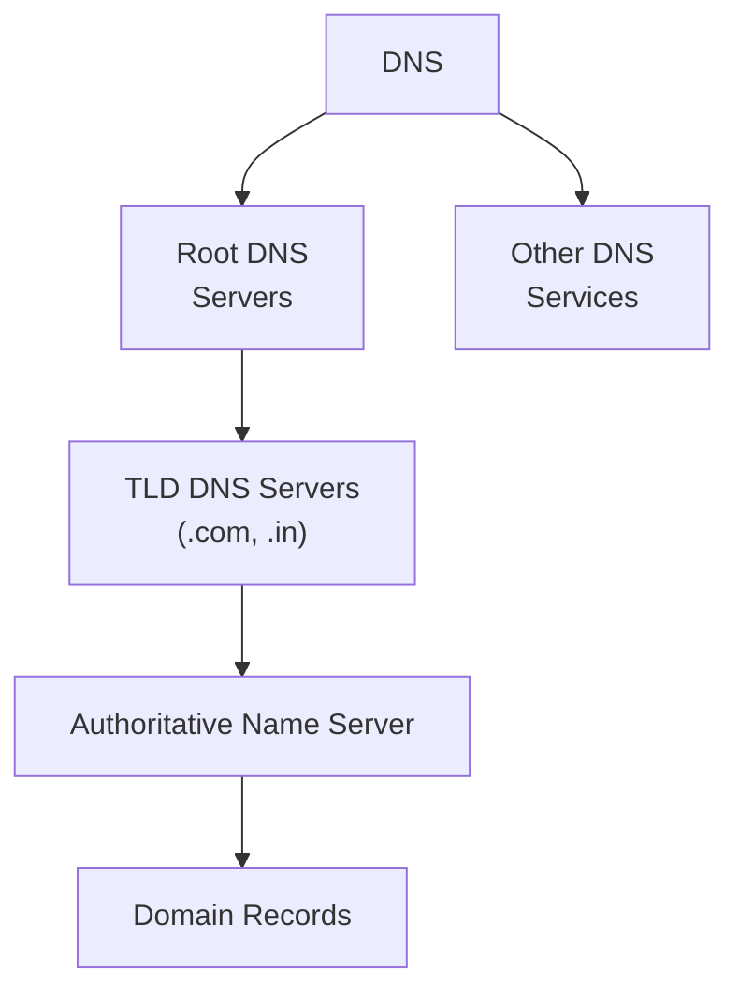

Each part has a different responsibility.

For example, the DNS hierarchy helps a resolver discover which authoritative servers are responsible for a domain.

The authoritative servers then provide DNS records for the zones they serve.

This distributed structure allows DNS to scale across a huge number of domains without every DNS server needing a complete copy of all records.

---

## 4. The Four Main DNS Participants

To understand a DNS lookup, you need to distinguish four important roles.

### 4.1 Stub Resolver

The stub resolver is the DNS client functionality used by your operating system or application.

When your browser needs to resolve a domain, it typically uses operating-system or application DNS facilities.

The stub resolver sends a query to a configured recursive resolver.

It generally does not perform the entire DNS hierarchy lookup itself.

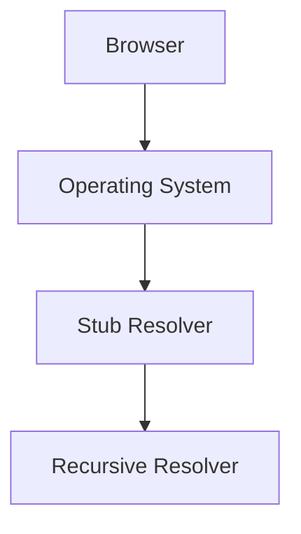

The configured recursive resolver may be provided by your ISP, organization, router, or a public DNS service.

### 4.2 Recursive Resolver

A recursive resolver receives DNS queries from clients and obtains answers on their behalf.

Its job is to return an answer or an appropriate DNS response.

If it already has a valid cached answer, it may respond immediately.

Otherwise, it may query other DNS servers to discover the answer.

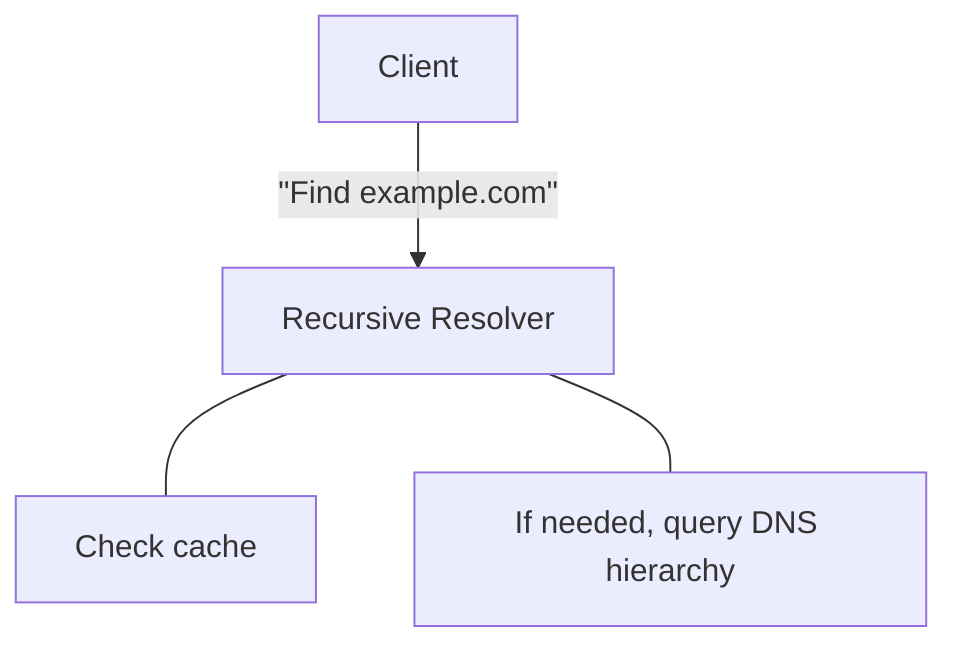

Examples of public recursive DNS services include services operated by Google and Cloudflare.

A recursive resolver is often the main DNS server your device communicates with during ordinary browsing.

### 4.3 Root DNS Server

Root DNS servers sit at the top of the DNS hierarchy.

They help resolvers discover which name servers are responsible for a top-level domain.

For example:

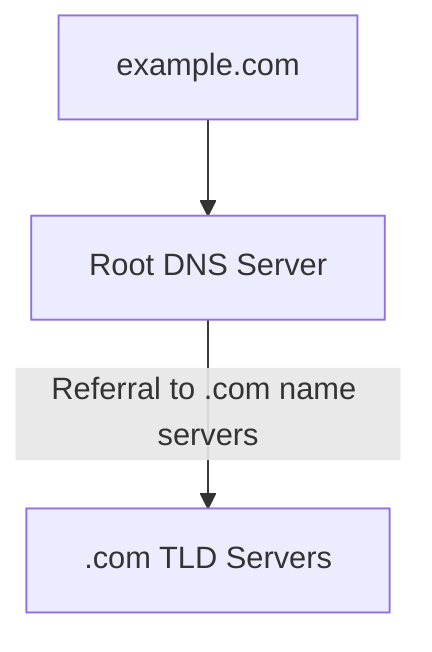

Root servers generally do not provide the final IP address for `example.com`.

Instead, they provide information that helps the resolver continue the lookup.

There are 13 named root-server identities, commonly represented by letters A through M. Each identity is served by many instances distributed around the world using anycast.

So, there are not merely 13 physical root-server machines.

### 4.4 Authoritative Name Server

An authoritative name server provides DNS information for the DNS zone it serves.

For example, the authoritative servers for a domain may contain records such as:

```text
example.com      A       203.0.113.20
www.example.com  CNAME   example.com
```

These are illustrative records, not necessarily the current records for a real domain.

The authoritative server is the source of authoritative DNS data for its zone.

It does not need to query the root servers to answer for records it already serves.

**Remember the difference:**

| Participant          | Main responsibility                                         |
| -------------------- | ----------------------------------------------------------- |
| Stub resolver        | Sends DNS queries on behalf of the local application or OS. |
| Recursive resolver   | Finds answers and caches them for clients.                  |
| Root server          | Refers resolvers toward the relevant TLD servers.           |
| Authoritative server | Provides DNS records for its zone.                          |

---

## 5. How a DNS Lookup Works

Let's follow a simplified lookup for:

```text
www.example.com
```

Assume the recursive resolver has no cached information that can answer the query.

### Step 1 — Your browser needs an IP address

You enter:

```text
https://www.example.com
```

Before connecting to the web server, the browser needs to resolve the hostname.

The browser or operating system checks available DNS caches and uses its configured DNS resolution mechanism.

If no usable cached answer exists, the query is sent to a recursive resolver.

### Step 2 — The recursive resolver contacts a root server

The recursive resolver asks a root server where it can find information about the `.com` domain.

The root server responds with a referral to the appropriate `.com` TLD name servers.

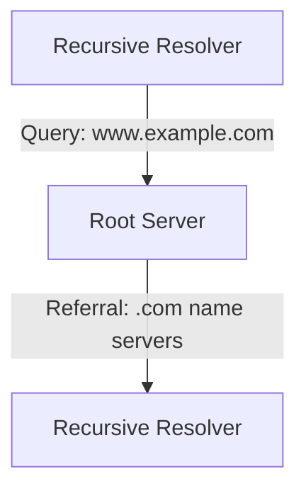

The root server does not need to know the final IP address.

It directs the resolver to the next level.

### Step 3 — The resolver contacts a TLD server

The resolver asks a `.com` TLD server about `www.example.com`.

The TLD server provides a referral to the authoritative name servers for `example.com`.

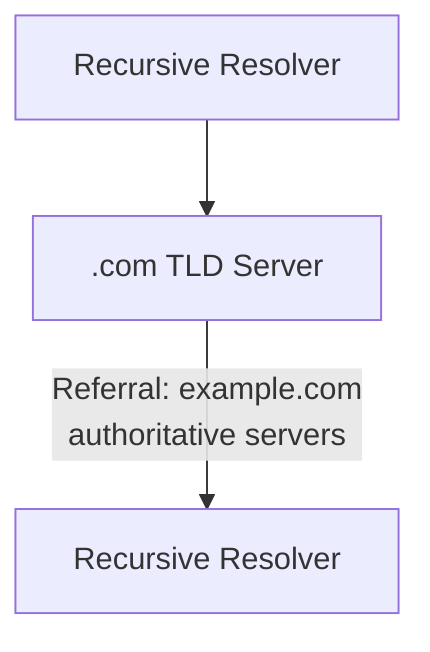

The TLD server helps identify which name servers are responsible for the domain.

### Step 4 — The resolver contacts the authoritative server

The resolver queries an authoritative name server for the requested record.

For example, it may request the A record for `www.example.com`.

The authoritative server returns the applicable DNS record, or another response such as a CNAME that requires further resolution.

Illustrative answer:

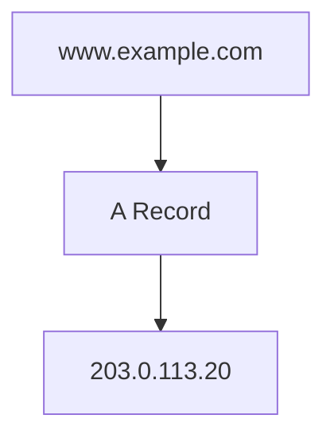

### Step 5 — The resolver caches and returns the answer

The recursive resolver can cache the result according to the record's TTL.

It then returns the answer to the client.

The browser can use the resulting IP address to establish a connection to the server.

### Complete Lookup

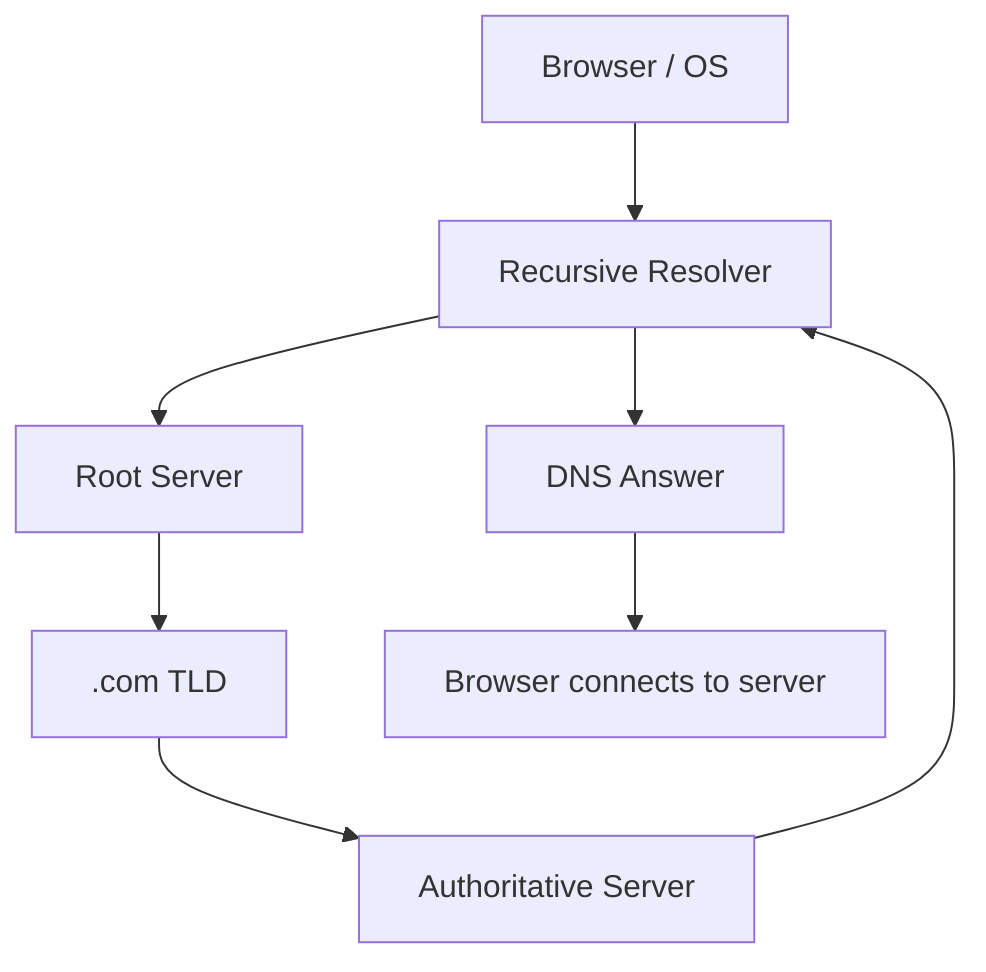

This diagram shows the conceptual lookup path. Actual lookups may involve fewer queries because of caching, referrals, CNAME chains, and other DNS behavior.

**Important:** Your browser does not normally contact the root, TLD, and authoritative servers directly for every website visit. A recursive resolver usually performs that work.

---

## 6. DNS Records

DNS stores different types of information in records.

Each record type serves a particular purpose.

Here are the most important ones for a web developer and system designer.

| Record | Purpose                                                           | Example                               |
| ------ | ----------------------------------------------------------------- | ------------------------------------- |
| A      | Maps a name to an IPv4 address.                                   | `example.com → 203.0.113.20`          |
| AAAA   | Maps a name to an IPv6 address.                                   | `example.com → 2001:db8::20`          |
| CNAME  | Makes one DNS name an alias of another name.                      | `www.example.com → example.com`       |
| MX     | Specifies mail servers for a domain.                              | Mail routing                          |
| NS     | Identifies authoritative name servers for a zone.                 | Domain delegation                     |
| TXT    | Stores text data, often used for verification and email policies. | Domain ownership verification         |
| SOA    | Contains important information about a DNS zone.                  | Zone authority and serial information |
| PTR    | Used for reverse DNS lookups.                                     | IP address to a DNS name              |

Let's understand the most relevant records.

### A Record

An A record associates a DNS name with an IPv4 address.

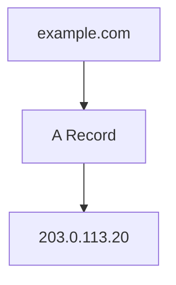

This is one of the common records used to direct web traffic.

### AAAA Record

An AAAA record associates a DNS name with an IPv6 address.

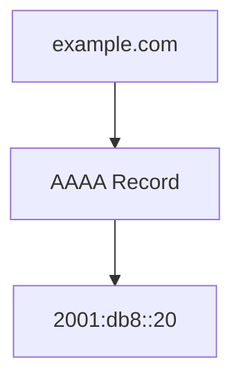

A domain can have both A and AAAA records.

The client and network determine which address family is used for a particular connection.

### CNAME Record

A CNAME record identifies another DNS name as the canonical name for an alias.

For example:

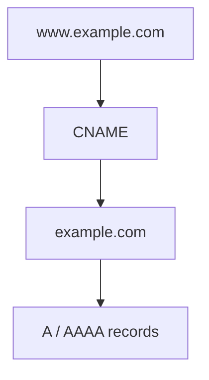

The resolver follows the alias to obtain the necessary address information.

A CNAME is not itself an IP address.

There are also DNS rules about where CNAME records can be placed. In particular, a conventional CNAME cannot coexist with other ordinary record data at the same owner name.

Some DNS providers offer special features such as ALIAS or CNAME flattening, but these are provider-specific behaviors rather than standard CNAME records.

### MX Record

MX records identify the mail servers responsible for receiving email for a domain.

For example:

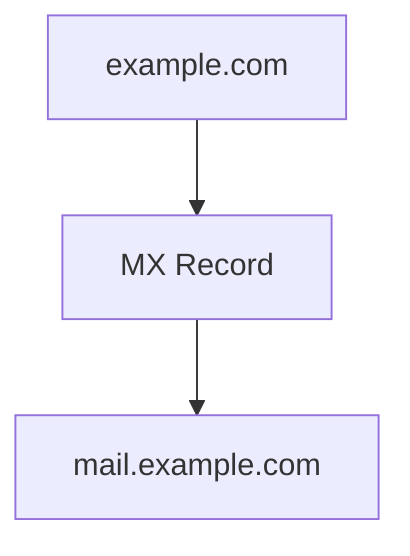

MX records contain preference values that help determine which mail server should be tried first.

They are used for email routing, not ordinary web-page delivery.

### NS Record

NS records identify name servers associated with a DNS zone.

They are important in DNS delegation.

For example, a parent zone can delegate responsibility for a domain to its authoritative name servers.

### TXT Record

TXT records store text data associated with a DNS name.

Common uses include:

* Domain ownership verification.
* SPF email policy information.
* Certain DKIM and DMARC-related configurations.

A TXT record does not automatically provide security. Its meaning depends on the application or service that checks it.

---

## 7. DNS Caching

Imagine every time you opened a website, your device had to contact root servers, TLD servers, and authoritative servers from the beginning.

That would introduce unnecessary network traffic and delays.

DNS uses caching to reduce repeated lookups.

A recursive resolver can temporarily store DNS answers and reuse them while they remain valid.

Your operating system, browser, and other network components may also maintain caches.

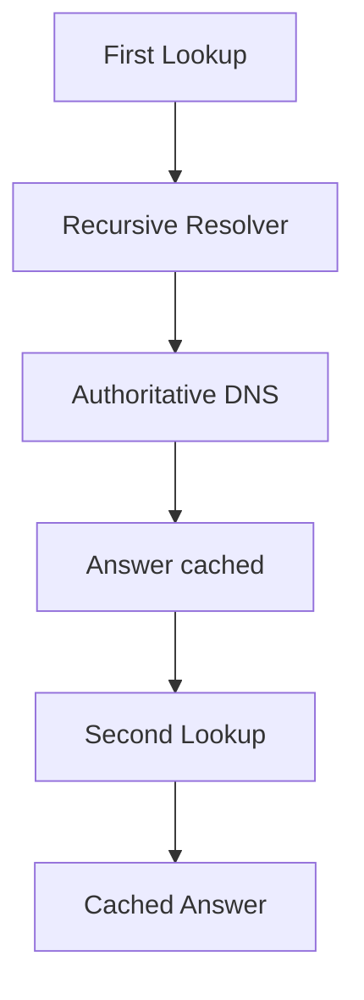

If a valid cached answer is available, the resolver may return it without contacting the authoritative server again.

### Why caching matters

Caching can:

* Reduce DNS lookup latency.
* Reduce traffic to authoritative servers.
* Reduce repeated work.
* Improve resilience to temporary upstream unavailability in some situations.

However, caching also means that DNS changes may not become visible to every client immediately.

That is a major consideration when changing server infrastructure.

---

## 8. TTL — Time to Live

DNS records commonly include a TTL value.

**TTL stands for Time to Live.**

In DNS caching, TTL specifies how long a record may be cached before it needs to be considered expired and refreshed.

For example:

```text
example.com
A: 203.0.113.20
TTL: 300 seconds
```

A TTL of 300 seconds means a resolver can generally cache the record for up to 300 seconds, subject to DNS caching rules.

After the cached record expires, the resolver may need to obtain fresh information.

### Example: Changing a server IP address

Suppose your website currently points to:

```text
example.com → 203.0.113.20
```

You migrate the application to another server:

```text
example.com → 203.0.113.50
```

If resolvers still have the old answer cached, some clients may continue using the previous IP address until their cached records expire.

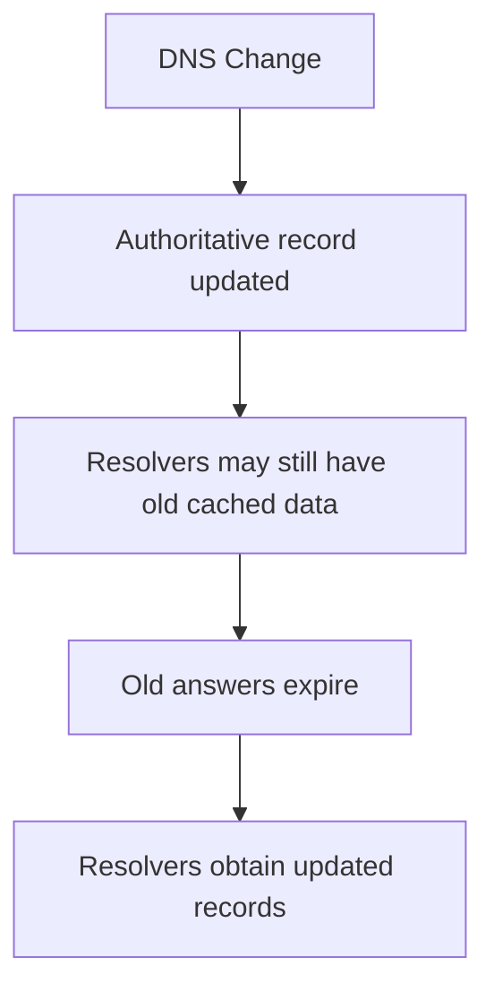

This is why changing a DNS record does not guarantee that every client immediately uses the new address.

### Does lowering TTL make migration instant?

No.

Lowering TTL in advance can reduce how long newly cached answers remain valid, but it does not invalidate records already cached under an earlier TTL.

Other factors can also affect the transition, including:

* Resolver caching behavior.
* Client-side caches.
* DNS provider propagation and configuration.
* Existing connections to the old server.

**System-design lesson:** DNS changes are not a substitute for a carefully planned infrastructure migration.

---

## 9. DNS and Infrastructure Changes

DNS is often used to direct users toward application infrastructure.

For example:

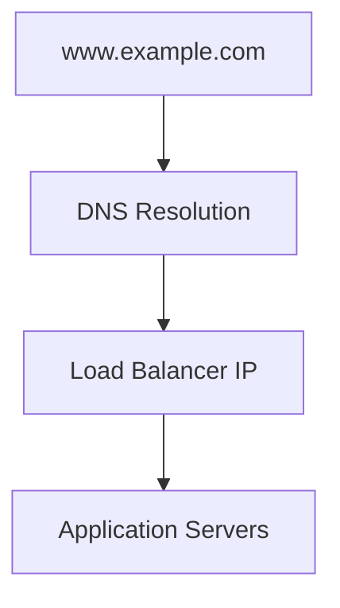

A domain can point toward a load balancer rather than directly toward an individual application server.

This allows the load balancer to distribute requests across multiple backend servers.

DNS can also return multiple addresses or use provider-specific traffic-management features.

However, DNS is not a replacement for a load balancer.

DNS answers are cached, and clients may maintain existing connections. DNS-based distribution generally cannot control each individual HTTP request in the same way that an application-layer load balancer can.

### Example: Scaling a web application

Initially:

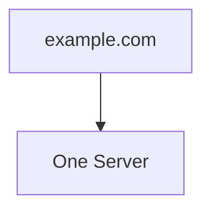

Later:

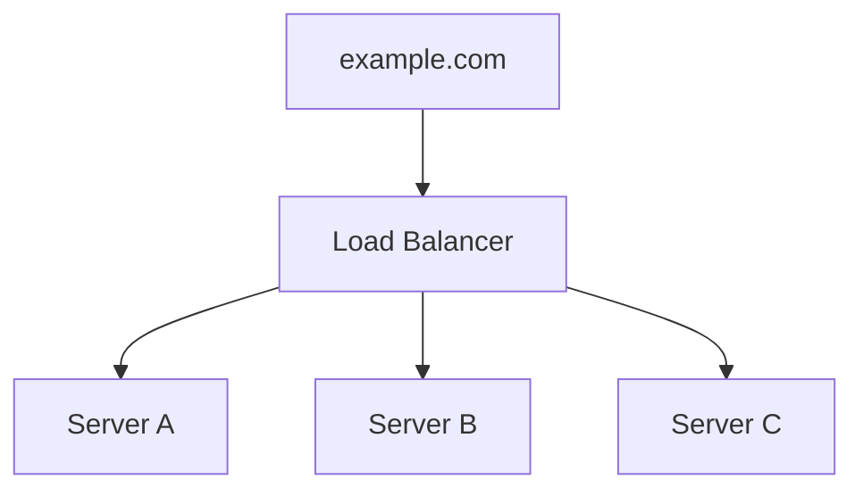

The DNS name can remain the same while the infrastructure behind it evolves.

This is an example of separating a stable service name from the underlying implementation.

---

## 10. What Can Go Wrong with DNS?

DNS is a dependency. If name resolution fails, clients may be unable to discover the address of a service even when the service itself is running.

### Scenario 1 — Incorrect DNS record

Suppose the domain points to the wrong IP address.

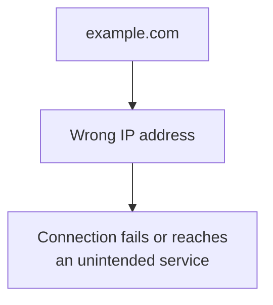

The application server may be healthy, but clients cannot reach it through the intended domain.

### Scenario 2 — DNS resolver unavailable

A client attempts to resolve a domain, but its configured recursive resolver is unavailable.

The client may be unable to obtain an answer until the resolver becomes available or another configured resolution path is used.

A browser can show a name-resolution error even when the destination server is functioning normally.

### Scenario 3 — Expired or incorrect delegation

If a domain's delegation or authoritative name-server configuration is incorrect, resolvers may fail to find the domain's records.

This can affect an entire domain or a portion of its DNS namespace.

### Scenario 4 — Stale cached records

A DNS record is changed, but some resolvers still return an older cached answer.

Users may reach the old infrastructure or encounter connection failures during a migration.

### Scenario 5 — DNS abuse or spoofing

DNS responses can be targeted by attackers.

Depending on the attack and the protections in place, users may be directed to an unintended destination.

DNSSEC can provide authentication and integrity protection for DNS data through a chain of trust. It does not encrypt DNS queries or responses and does not prevent every form of DNS attack.

DNS over HTTPS (DoH) and DNS over TLS (DoT) encrypt DNS communication between a client and a supporting resolver, but they solve a different problem from DNSSEC.

These security mechanisms will be useful to understand as we study security architecture later.

---

## 11. DNS in a Real Web Application

Let's connect DNS to the architecture of a web application.

Suppose your application is deployed on cloud infrastructure.

A user opens:

```text
https://shop.example.com
```

A simplified request flow:

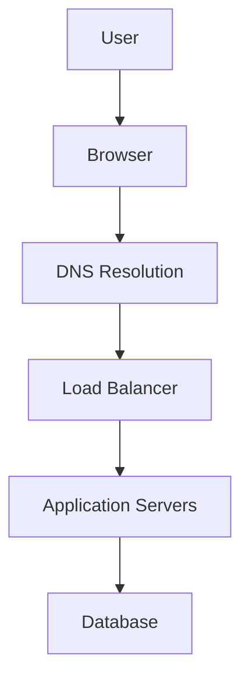

DNS helps the browser discover the destination address.

The browser then establishes a connection to the service.

The load balancer receives the traffic and routes it to an appropriate backend.

The application processes the request and may communicate with a database.

Each component has a distinct responsibility.

| Component          | Responsibility                                                      |
| ------------------ | ------------------------------------------------------------------- |
| DNS                | Resolves the domain name to DNS information, such as an IP address. |
| Load balancer      | Distributes or routes incoming traffic.                             |
| Application server | Executes application logic.                                         |
| Database           | Stores and retrieves application data.                              |

**Remember:** DNS gets the client to the network destination. It does not process the customer's order or execute the application's business logic.

---

## Quick Reference

```mermaid
flowchart LR
  accTitle: DNS quick reference
  accDescr: Domain name: human-readable name. Recursive resolver: finds answers and caches them. Root server: refers to TLD name servers. TLD server: refers to authoritative name servers. Authoritative server: provides DNS records for its zone. DNS record: stores information associated with a DNS name. TTL: controls how long a record can be cached.
  N["DNS"]
  N --- A["<b>Domain Name</b><br/>Human-readable name"]
  N --- B["<b>Recursive Resolver</b><br/>Finds answers and caches them"]
  N --- C["<b>Root Server</b><br/>Refers to TLD name servers"]
  N --- D["<b>TLD Server</b><br/>Refers to authoritative name servers"]
  N --- E["<b>Authoritative Server</b><br/>Provides DNS records for its zone"]
  N --- F["<b>DNS Record</b><br/>Stores information associated with a DNS name"]
  N --- G["<b>TTL</b><br/>Controls how long a record can be cached"]
```

### Core Principle

> **DNS separates a service's human-readable name from the IP addresses used to reach its infrastructure.**

That separation allows infrastructure to change without requiring users to memorize new addresses.

---

## Knowledge Check

Try answering these without looking back.

1. Why do we need DNS if computers already use IP addresses?
2. What is the difference between a recursive resolver and an authoritative name server?
3. Why does a root DNS server usually not return the final IP address for a website?
4. What is the difference between an A record and a CNAME record?
5. What does a DNS TTL control?
6. Why might some users continue reaching an old server after a DNS change?
7. If a website's application server is healthy but its DNS records are incorrect, what might users experience?
8. Why is DNS not a complete replacement for a load balancer?
