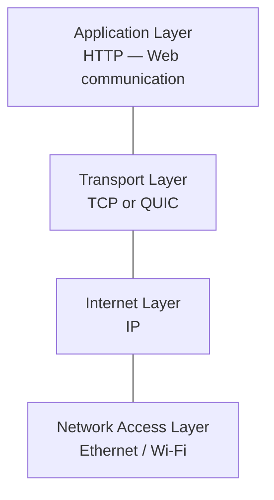
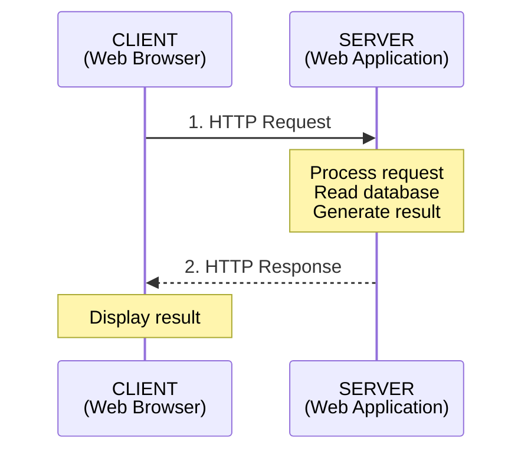
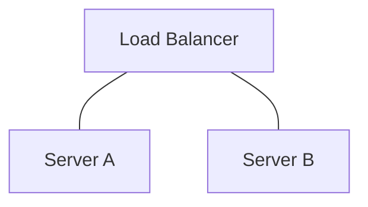
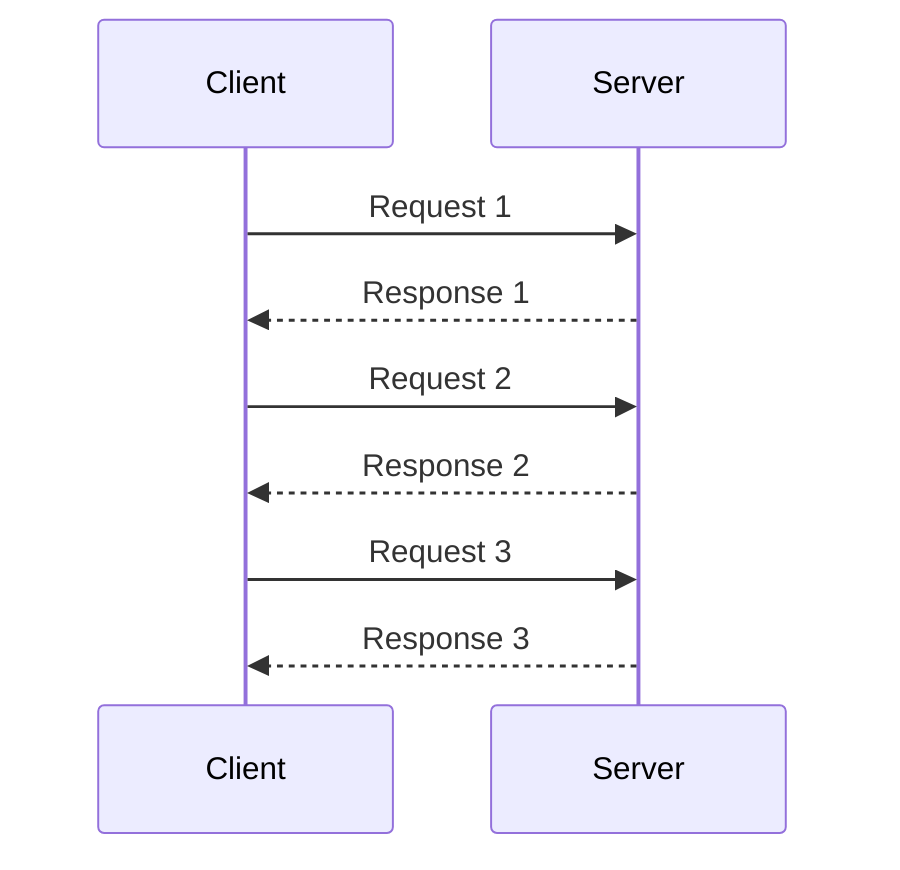
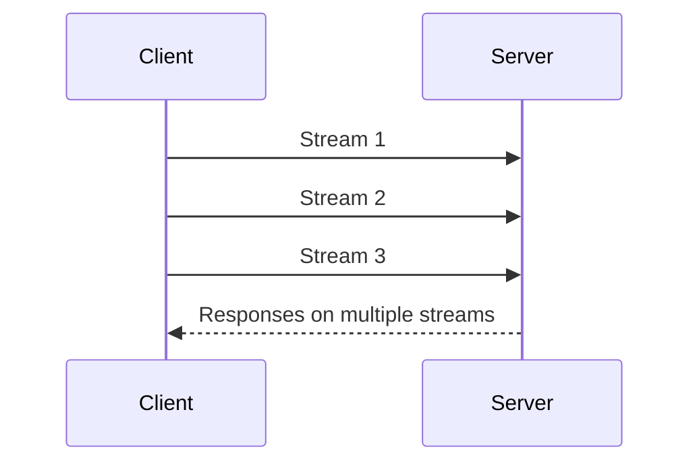
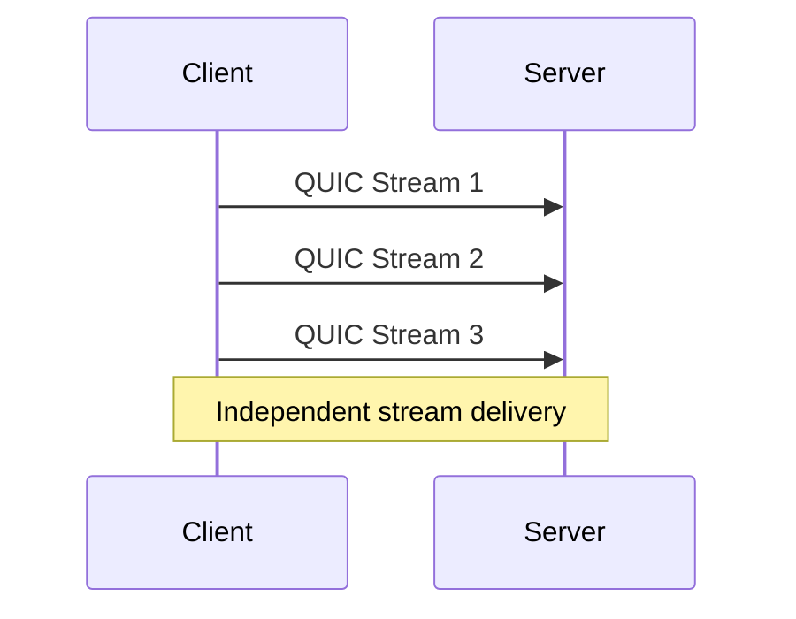
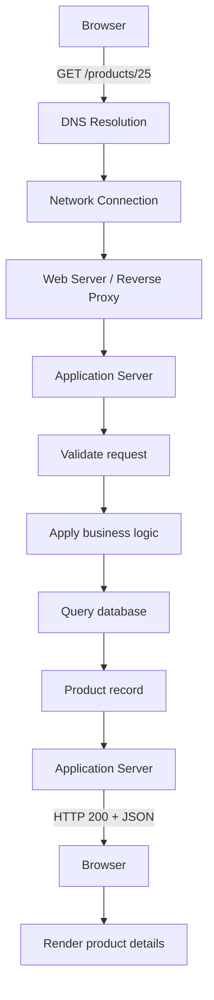
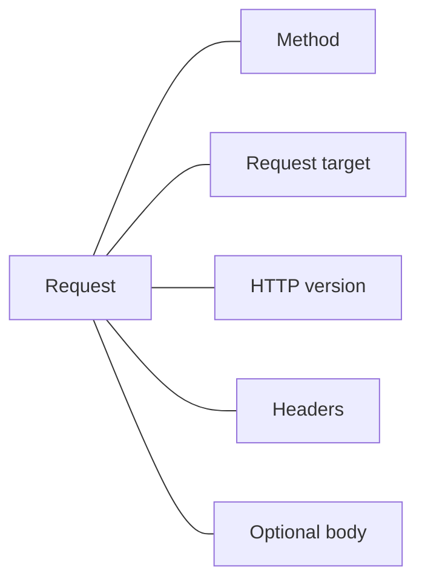
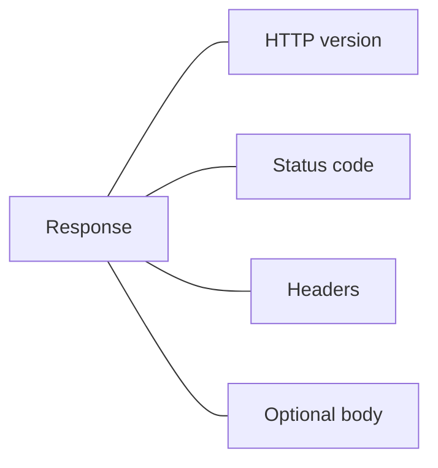

# 00.06 — HTTP: How the Web Communicates

## Learning Objectives

By the end of this chapter, you will be able to:

* Explain what HTTP is and how it enables communication between clients and servers.
* Understand the structure of HTTP requests and responses.
* Identify common HTTP methods, status codes, and headers.
* Explain how HTTP versions differ in their handling of connections.
* Understand why HTTP behavior matters when designing scalable and reliable systems.

---

## 1. What Is HTTP?

Imagine opening a website in your browser.

You type a URL, press Enter, and the browser displays a webpage. Behind that simple action, your browser and a server exchange messages.

The browser requests something. The server processes that request and sends back a response.

The protocol that defines how these messages are structured and exchanged is called **HTTP (Hypertext Transfer Protocol).**

In simple terms:

> HTTP is a set of rules that allows clients and servers to communicate over a network.

HTTP defines what a request looks like, what a response looks like, and how each side should interpret the messages.

It is an application-layer protocol.

### Where HTTP fits

Remember the networking layers from the previous chapters:



HTTP does not directly deliver electrical signals or route packets across the internet. It relies on lower layers to transport its messages.

The relationship depends on the HTTP version:

| HTTP version | Transport            |
| ------------ | -------------------- |
| HTTP/1.1     | TCP                  |
| HTTP/2       | TCP                  |
| HTTP/3       | QUIC, which uses UDP |

We will examine these differences later in this chapter.

---

## 2. The HTTP Request–Response Model

HTTP follows a request–response model.

A client sends a request to a server. The server returns a response.



For example, when you visit:

`https://example.com/products`

Your browser may send an HTTP request asking for the `/products` resource.

The server may respond with an HTML document containing the product page.

The browser then interprets the HTML and may make additional requests for CSS, JavaScript, images, and other resources.

**Important:** A single webpage can require many HTTP requests. One request does not necessarily mean one complete webpage.

### What can an HTTP request ask for?

A client might request:

* An HTML page.
* A list of products from an API.
* A user's profile information.
* An image or downloadable file.
* The creation, modification, or deletion of data.

HTTP is not limited to loading webpages. It is also widely used for APIs and communication between backend services.

---

## 3. Understanding a URL

Before sending a request, the client needs to know where the resource is located.

Consider this URL:

```text
https://shop.example.com:443/products?id=25#reviews
```

Its components are:

```text
https://shop.example.com:443/products?id=25#reviews
  │             │          │       │       │
  │             │          │       │       └── Fragment
  │             │          │       └────────── Query
  │             │          └────────────────── Path
  │             └───────────────────────────── Host
  └─────────────────────────────────────────── Scheme
```

| Component | Meaning                                                   |
| --------- | --------------------------------------------------------- |
| Scheme    | `https` — identifies the protocol scheme.                 |
| Host      | `shop.example.com` — identifies the destination host.     |
| Port      | `443` — identifies the destination port.                  |
| Path      | `/products` — identifies the requested resource or route. |
| Query     | `id=25` — provides additional parameters.                 |
| Fragment  | `reviews` — identifies a section within the resource.     |

The fragment is handled by the browser and is not sent as part of the HTTP request target.

For example, the request target may be:

```text
/products?id=25
```

The server does not receive `#reviews` through the ordinary HTTP request target.

Also, the port is not always written in a URL. HTTPS commonly uses port 443, and HTTP commonly uses port 80, unless another port is specified.

### How does the host become a destination?

The browser uses DNS to resolve the hostname to an IP address, as we learned in Chapter 00.05.

The network connection is then established using the appropriate transport protocol.

For HTTPS, TLS is also involved before ordinary HTTP application data is exchanged. We will cover that in Chapter 00.07.

---

## 4. Anatomy of an HTTP Request

An HTTP request contains information describing what the client wants and, when needed, data that the client wants to send.

A typical HTTP/1.1 request looks like this:

```http
GET /products?id=25 HTTP/1.1
Host: shop.example.com
Accept: application/json
User-Agent: ExampleBrowser/1.0

```

Let's break it down.

### 4.1 Request line

```http
GET /products?id=25 HTTP/1.1
```

It contains:

* Method: `GET`
* Request target: `/products?id=25`
* HTTP version: `HTTP/1.1`

The method communicates the intended operation. The request target identifies the resource, and the version indicates the HTTP protocol version.

### 4.2 Request headers

```http
Host: shop.example.com
Accept: application/json
User-Agent: ExampleBrowser/1.0
```

Headers provide additional information about the request.

| Header          | Purpose                                                                       |
| --------------- | ----------------------------------------------------------------------------- |
| `Host`          | Identifies the target host in HTTP/1.1.                                       |
| `Accept`        | Indicates which response media types the client can accept.                   |
| `Content-Type`  | Indicates the media type of the request body, when present.                   |
| `Authorization` | Carries authentication credentials or authorization information.              |
| `User-Agent`    | Identifies the client software, though its value may be absent or misleading. |

Headers help the server understand how to interpret and handle the request.

### 4.3 Request body

A request can also contain a body.

For example, a client may send data to create a new product:

```http
POST /api/products HTTP/1.1
Host: shop.example.com
Content-Type: application/json
Accept: application/json

{
  "name": "Mechanical Keyboard",
  "price": 2500
}
```

Here:

* `POST` indicates the intended operation.
* `Content-Type: application/json` tells the server how to interpret the body.
* The JSON body contains the product information.

The server reads the request, validates the input, applies business rules, and may store the new product in a database.

A request body is optional. Many GET requests do not have one, and some methods are commonly used without a body.

---

## 5. Anatomy of an HTTP Response

After receiving a request, the server sends an HTTP response.

A response communicates the result of processing the request.

Example:

```http
HTTP/1.1 200 OK
Content-Type: application/json
Content-Length: 57

{
  "id": 25,
  "name": "Mechanical Keyboard",
  "price": 2500
}
```

A response contains three main parts.

### 5.1 Status line

```http
HTTP/1.1 200 OK
```

It contains:

* HTTP version.
* Status code: `200`.
* Reason phrase: `OK`.

The status code tells the client the general outcome of the request.

The reason phrase is descriptive text. Modern HTTP clients should rely on the numeric status code, not the exact phrase.

### 5.2 Response headers

```http
Content-Type: application/json
Content-Length: 57
```

These headers describe the response.

`Content-Type` tells the client the media type of the response body.

For example:

| Content-Type             | Meaning            |
| ------------------------ | ------------------ |
| `text/html`              | HTML document      |
| `application/json`       | JSON data          |
| `text/css`               | CSS stylesheet     |
| `application/javascript` | JavaScript content |
| `image/png`              | PNG image          |

`Content-Length` indicates the message body length in bytes when provided and applicable.

### 5.3 Response body

The body contains the actual content returned by the server.

It might be:

* HTML for a webpage.
* JSON for an API response.
* An image or a file.
* Text describing an error.

Some responses, such as a `204 No Content` response, have no response body.

### Request versus response

| Request                      | Response                     |
| ---------------------------- | ---------------------------- |
| Sent by the client           | Sent by the server           |
| Contains a method and target | Contains a status code       |
| May contain request data     | May contain returned data    |
| Can include request headers  | Can include response headers |

---

## 6. HTTP Methods

HTTP methods describe the intended action on a resource.

Think of a product API:

```text
/api/products
/api/products/25
```

Different methods can be used to perform different operations on these resources.

| Method    | Typical purpose                                        | Example                 |
| --------- | ------------------------------------------------------ | ----------------------- |
| `GET`     | Retrieve a resource                                    | Fetch product 25        |
| `POST`    | Submit data or create a resource                       | Create a product        |
| `PUT`     | Replace a resource's representation                    | Replace product 25      |
| `PATCH`   | Partially modify a resource                            | Change product price    |
| `DELETE`  | Delete a resource                                      | Delete product 25       |
| `HEAD`    | Retrieve response headers without the response body    | Check resource metadata |
| `OPTIONS` | Discover communication options supported by a resource | Inspect allowed methods |

These are common conventions. The actual behavior of an endpoint depends on its implementation and API contract.

### 6.1 Safe methods

A method is considered safe when the client is not requesting a change to the server's application state.

`GET`, `HEAD`, and `OPTIONS` are defined as safe methods.

For example:

```http
GET /api/products/25
```

The intention is to retrieve product information, not modify it.

A server should not use GET to perform actions such as deleting an account or making a payment.

Why does this matter?

Browsers, crawlers, caches, and other clients may automatically issue GET requests. If GET changes important application data, unexpected actions can occur.

Safe does not mean that the request has absolutely no side effects. Logging and analytics, for example, may still occur.

### 6.2 Idempotent methods

An operation is idempotent when repeating the same request has the same intended effect on the server's state as performing it once.

For example:

```http
PUT /api/products/25
```

Suppose this request replaces the product with the same representation each time.

Sending it once or five times should leave the resource in the same intended state.

| Method  | Safe? | Idempotent?    |
| ------- | ----- | -------------- |
| GET     | Yes   | Yes            |
| HEAD    | Yes   | Yes            |
| OPTIONS | Yes   | Yes            |
| PUT     | No    | Yes            |
| DELETE  | No    | Yes            |
| POST    | No    | Not guaranteed |
| PATCH   | No    | Not guaranteed |

Idempotency is about the intended effect, not necessarily identical responses.

For example, the first DELETE request might return `204`, while a repeated DELETE could return `404`. The intended state—resource absent—can still be the same.

A POST request that creates a new order may create multiple orders if repeated.

**System design connection:** Idempotency becomes important when dealing with retries, payment processing, network failures, and asynchronous workers. We will explore it further in Level 5.

---

## 7. HTTP Status Codes

HTTP status codes tell the client how the server handled a request.

They are divided into five categories.

| Range | Category      | General meaning                                           |
| ----- | ------------- | --------------------------------------------------------- |
| 1xx   | Informational | The request is progressing.                               |
| 2xx   | Success       | The request was successfully handled.                     |
| 3xx   | Redirection   | Additional action or redirection is involved.             |
| 4xx   | Client error  | The request cannot be fulfilled as received.              |
| 5xx   | Server error  | The server failed to fulfill an apparently valid request. |

Let's examine the codes you will frequently encounter when building web applications.

### 7.1 Success — 2xx

| Code             | Meaning                                 | Example               |
| ---------------- | --------------------------------------- | --------------------- |
| `200 OK`         | Request succeeded                       | Product data returned |
| `201 Created`    | Resource created                        | New product created   |
| `204 No Content` | Request succeeded with no response body | Product deleted       |

A successful response does not always mean the server returned content. A 204 response intentionally has no content.

### 7.2 Redirection — 3xx

| Code                    | Meaning                             | Example                  |
| ----------------------- | ----------------------------------- | ------------------------ |
| `301 Moved Permanently` | Resource has a permanent redirect   | URL permanently changed  |
| `302 Found`             | Temporary redirect                  | Redirect to another page |
| `304 Not Modified`      | Cached representation can be reused | Browser cache validation |

A 304 response is used in conditional requests and does not contain a response body.

We will study HTTP caching in Level 3.

### 7.3 Client errors — 4xx

| Code                    | Meaning                                               | Example                              |
| ----------------------- | ----------------------------------------------------- | ------------------------------------ |
| `400 Bad Request`       | Request is invalid or malformed                       | Invalid JSON                         |
| `401 Unauthorized`      | Authentication is required or credentials are invalid | Missing or invalid login credentials |
| `403 Forbidden`         | Server refuses the requested action                   | User lacks permission                |
| `404 Not Found`         | Resource not found                                    | Product ID does not exist            |
| `409 Conflict`          | Request conflicts with current resource state         | Duplicate or conflicting operation   |
| `429 Too Many Requests` | Too many requests received                            | Rate limit exceeded                  |

Despite its name, `401 Unauthorized` generally concerns authentication: the client needs valid authentication credentials.

`403 Forbidden` means the server refuses the action. The client may already be authenticated, but authentication is not required for every possible 403 response.

For example, a logged-in customer may be forbidden from accessing an administrator-only endpoint.

### 7.4 Server errors — 5xx

| Code                        | Meaning                                                      | Example                                            |
| --------------------------- | ------------------------------------------------------------ | -------------------------------------------------- |
| `500 Internal Server Error` | Unexpected server failure                                    | Unhandled application exception                    |
| `502 Bad Gateway`           | Gateway received an invalid response from an upstream server | Reverse proxy receives malformed upstream response |
| `503 Service Unavailable`   | Server temporarily cannot handle the request                 | Service overloaded or undergoing maintenance       |
| `504 Gateway Timeout`       | Gateway did not receive a timely upstream response           | Application server takes too long                  |

These distinctions matter when diagnosing failures.

For example, a 504 from a reverse proxy does not necessarily mean the proxy itself is broken. The upstream application or one of its dependencies may be taking too long.

**System design connection:** Status codes are useful for monitoring, alerting, retries, and communicating failures to clients. Not every error should be retried. A retry policy must consider the error, request method, and whether the operation could have already succeeded.

---

## 8. HTTP Headers: Communicating Additional Information

Headers are metadata attached to HTTP messages.

They help the client and server agree on how data should be interpreted, which representation is preferred, and how the request should be handled.

### Content-Type versus Accept

These two headers are easy to confuse.

```http
Content-Type: application/json
```

This says:

"The body I am sending is JSON."

```http
Accept: application/json
```

This says:

"I would prefer a response in JSON format."

Consider an API request:

```http
POST /api/products HTTP/1.1
Host: shop.example.com
Content-Type: application/json
Accept: application/json

{
  "name": "Monitor",
  "price": 12000
}
```

The client sends JSON and asks the server to respond with JSON.

A server may use `Content-Type` to select the correct request-body parser. If the client sends malformed JSON, the server may return a 400 response.

### Headers are not the body

Consider:

```http
Content-Type: application/json

{"name":"Monitor"}
```

The header describes the body. The JSON itself is the body.

This distinction is important when debugging APIs, configuring reverse proxies, or writing backend request handlers.

---

## 9. Is HTTP Stateless?

HTTP is designed around independent request–response exchanges.

The protocol itself does not require the server to remember the application state of previous requests.

This is commonly described as HTTP being stateless.

Imagine a user making these requests:

```text
Request 1: GET /products
Request 2: GET /cart
Request 3: POST /checkout
```

The server cannot assume that every request will arrive at the same application server or that the server automatically remembers the earlier requests.

However, web applications often need to maintain state.

Examples include:

* A user remaining logged in.
* A shopping cart preserving its contents.
* A multi-step checkout process.
* User preferences and application settings.

Applications can maintain state using cookies, sessions, tokens, databases, or other mechanisms.

We will cover sessions and cookies in Chapter 01.07.

### Why this matters for scaling

Suppose your application runs on two application servers:



A user's first request may reach Server A, and the next request may reach Server B.

If the application relies exclusively on local memory on Server A to remember the user's state, Server B may not have that information.

This is one reason scalable applications often store shared state in an appropriate external system or use another deliberate state-management strategy.

The important idea is not that every application must be completely stateless. It is that state must be managed deliberately when requests can reach different servers.

---

## 10. HTTP Versions and Connection Behavior

HTTP has evolved to improve communication efficiency and reduce delays.

The message model remains recognizable, but the way messages are transported and multiplexed has changed.

### 10.1 HTTP/1.1

HTTP/1.1 introduced persistent connections as the default behavior unless the connection is closed or otherwise managed.

Instead of opening a new TCP connection for every request, a client can reuse an existing connection for multiple requests.



This reduces the overhead of repeatedly establishing TCP connections.

However, HTTP/1.1 has limitations in how requests and responses are handled on a single connection. In common usage, responses on one connection are ordered, which can cause head-of-line blocking.

Browsers have historically used multiple connections to a host to improve performance.

### 10.2 HTTP/2

HTTP/2 introduced binary framing and multiplexing.

Multiple request and response streams can share a single TCP connection.



This allows concurrent streams without requiring a separate TCP connection for every request.

HTTP/2 also introduced header compression and other protocol improvements.

But HTTP/2 still runs over TCP. If a TCP packet is lost, TCP's ordered delivery can delay data across streams on that connection until the missing data is recovered.

This is a form of transport-level head-of-line blocking.

### 10.3 HTTP/3

HTTP/3 uses QUIC, which runs over UDP.

QUIC provides reliable transport, encryption integration, and independent streams.



A lost packet affecting one QUIC stream does not necessarily block delivery of data on other independent streams.

QUIC also supports connection migration in situations such as a client changing network paths, subject to protocol and connection conditions.

### Comparison

| Feature                                              | HTTP/1.1                             | HTTP/2                              | HTTP/3                                                         |
| ---------------------------------------------------- | ------------------------------------ | ----------------------------------- | -------------------------------------------------------------- |
| Transport                                            | TCP                                  | TCP                                 | QUIC over UDP                                                  |
| Persistent connections                               | Yes                                  | Yes                                 | Yes                                                            |
| Multiple concurrent streams on one connection        | Limited, generally ordered responses | Yes                                 | Yes                                                            |
| Transport-level head-of-line blocking across streams | TCP ordering affects the connection  | TCP ordering affects the connection | Independent QUIC streams avoid cross-stream transport blocking |
| Header compression                                   | No HPACK/QPACK                       | HPACK                               | QPACK                                                          |

HTTP/3 does not mean HTTP is unreliable because it uses UDP. QUIC provides reliable delivery and congestion control above UDP.

Also, HTTP/3 does not automatically make every website faster in every situation. Performance depends on network conditions, server implementation, connection setup, workload, and other factors.

**Architecture insight:** Protocol versions influence connection management, latency, concurrency, and resource consumption. They are one part of the complete system, not a replacement for good application and database design.

---

## 11. HTTP in a Real Web Application

Let's connect the concepts to a practical product application.

A user opens a product page.



A simplified HTTP request:

```http
GET /api/products/25 HTTP/1.1
Host: shop.example.com
Accept: application/json
```

A successful response:

```http
HTTP/1.1 200 OK
Content-Type: application/json

{
  "id": 25,
  "name": "Mechanical Keyboard",
  "price": 2500
}
```

Now imagine the database is slow.

The browser waits longer for the response because the request must pass through the application and its dependencies.

If many requests arrive simultaneously, the application may consume more database connections, CPU, memory, and network resources.

HTTP tells us how the request and response are exchanged. It does not solve the database bottleneck itself.

That requires understanding the rest of the system.

This is why system design examines the entire request path rather than treating HTTP as an isolated technology.

---

## 12. Common HTTP Mistakes

| Mistake                                                                    | Why it matters                                                           |
| -------------------------------------------------------------------------- | ------------------------------------------------------------------------ |
| Using GET to change important data                                         | GET is defined as safe; clients may issue it automatically.              |
| Treating every 4xx response as a server failure                            | Many 4xx responses indicate a problem with the request or access rights. |
| Treating every 5xx response as retryable                                   | Some failures are persistent, and retries can increase load.             |
| Assuming HTTP/2 eliminates all head-of-line blocking                       | HTTP/2 still uses TCP.                                                   |
| Assuming HTTPS and HTTP are identical                                      | HTTPS uses TLS to protect HTTP communication.                            |
| Assuming the next request reaches the same server                          | Load balancing may route it elsewhere.                                   |
| Assuming a 200 response means the business operation succeeded as intended | The application must define and validate its business-level outcome.     |

---

## 13. Quick Reference

### HTTP request



### HTTP response



### Methods to remember

| Need             | Method |
| ---------------- | ------ |
| Read data        | GET    |
| Submit or create | POST   |
| Replace          | PUT    |
| Partially update | PATCH  |
| Delete           | DELETE |

### Status codes to remember

| Code | Meaning                            |
| ---- | ---------------------------------- |
| 200  | OK                                 |
| 201  | Created                            |
| 204  | No Content                         |
| 301  | Permanent redirect                 |
| 304  | Not Modified                       |
| 400  | Bad Request                        |
| 401  | Authentication required or invalid |
| 403  | Forbidden                          |
| 404  | Not Found                          |
| 409  | Conflict                           |
| 429  | Too Many Requests                  |
| 500  | Internal Server Error              |
| 502  | Bad Gateway                        |
| 503  | Service Unavailable                |
| 504  | Gateway Timeout                    |

### HTTP versions

```text
HTTP/1.1 → TCP + persistent connections
HTTP/2   → TCP + multiplexed streams
HTTP/3   → QUIC over UDP + independent streams
```

---

## 14. Knowledge Check

Try answering these before moving to the next chapter.

**1.** What is the difference between an HTTP request and an HTTP response?

**2.** A client sends `Content-Type: application/json`. What does that header describe?

**3.** What is the difference between `401 Unauthorized` and `403 Forbidden`?

**4.** Why is GET defined as a safe method? Does safe mean that absolutely no side effects can occur?

**5.** Why can repeating a POST request create duplicate resources?

**6.** What problem does HTTP/2 multiplexing address, and what transport-level limitation does it inherit from TCP?

**7.** Why might a user request reach Server A first and Server B next?

**8.** A reverse proxy returns a 504 response. What does that indicate about the upstream request?

---

**Key Principle:** HTTP defines how clients and servers exchange requests and responses. A reliable, scalable application depends on everything behind that exchange—networking, application logic, data storage, and deliberate handling of failures.
