# 00.07 — HTTPS & TLS

## Learning Objectives

By the end of this chapter, you will be able to:

* Explain why ordinary HTTP is insufficient for secure communication over the internet.
* Understand how HTTPS uses TLS to protect data in transit.
* Describe encryption, authentication, and integrity in simple terms.
* Understand how TLS certificates and certificate authorities establish trust.
* Explain the basic TLS handshake and its role in a web application.
* Recognize common TLS failures and their implications for system design.

---

## 1. Why Do We Need HTTPS?

In the previous chapter, we learned how HTTP allows a client and a server to exchange requests and responses.

For example, a user logs in to an e-commerce website:

```http
POST /login HTTP/1.1
Host: shop.example.com
Content-Type: application/json

{
  "email": "user@example.com",
  "password": "my-secret-password"
}
```

The browser sends the login request to the server.

But imagine that this communication travels across a network where someone can observe or interfere with the traffic.

If the communication is not protected, an attacker who can capture the traffic may be able to read sensitive information or modify messages.

That could expose:

* Login credentials.
* Session information.
* Personal data.
* Payment-related information.
* Private API requests and responses.

Ordinary HTTP does not provide encryption, server authentication, or cryptographic integrity protection for the connection.

**HTTPS solves this by using TLS to protect HTTP communication.**

HTTPS stands for Hypertext Transfer Protocol Secure.

In simple terms:

> HTTPS is HTTP communication protected by Transport Layer Security (TLS).

---

## 2. HTTP vs HTTPS

Let's compare the two.

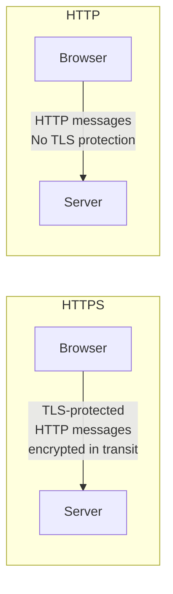

| Feature | HTTP | HTTPS |
|---|---|---|
| Application protocol | HTTP | HTTP |
| TLS protection | No | Yes |
| Encryption in transit | Not provided by HTTP | Provided by TLS |
| Server authentication | Not provided by HTTP | Normally uses certificate validation |
| Integrity protection | Not provided by HTTP | Provided by TLS |
| Common default port | 80 | 443 |

HTTPS does not replace HTTP.

The application still uses HTTP methods, headers, status codes, and request–response messages. TLS protects the communication carrying those messages.

A browser can still receive a `200 OK`, `404 Not Found`, or `500 Internal Server Error` over HTTPS.

The difference is that the communication is protected while it travels between the TLS endpoints.

---

## 3. What Is TLS?

TLS stands for Transport Layer Security.

It is a cryptographic protocol designed to protect communication between two endpoints.

TLS is used by HTTPS, but it is not limited to websites. Other protocols and services can also use TLS.

For example, TLS can protect communication involving email services, APIs, and other network applications.

TLS provides three important security properties.

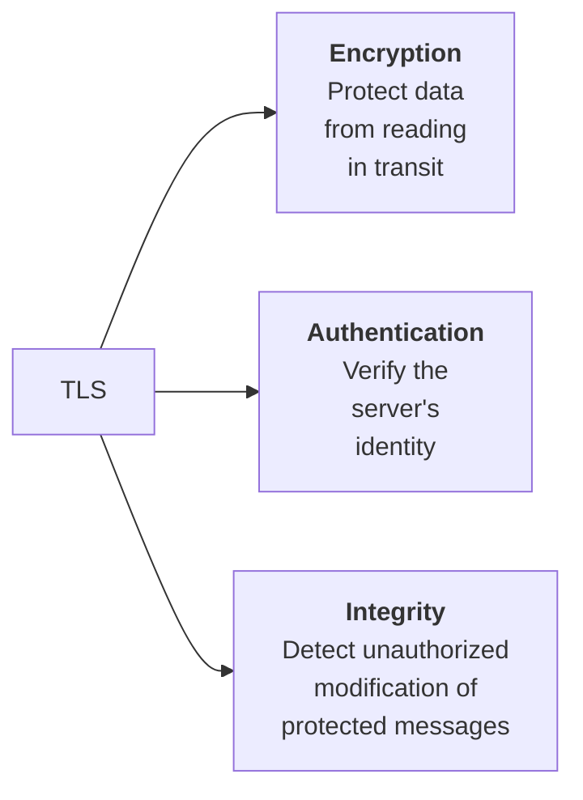

Let's understand each property.

### 3.1 Encryption — Keeping data confidential

Encryption transforms readable information into a form that cannot be understood without the appropriate cryptographic key.

Consider this message:

```text
Original message:

My password is secret123
```

When protected by TLS, the application data is encrypted before it travels across the network.

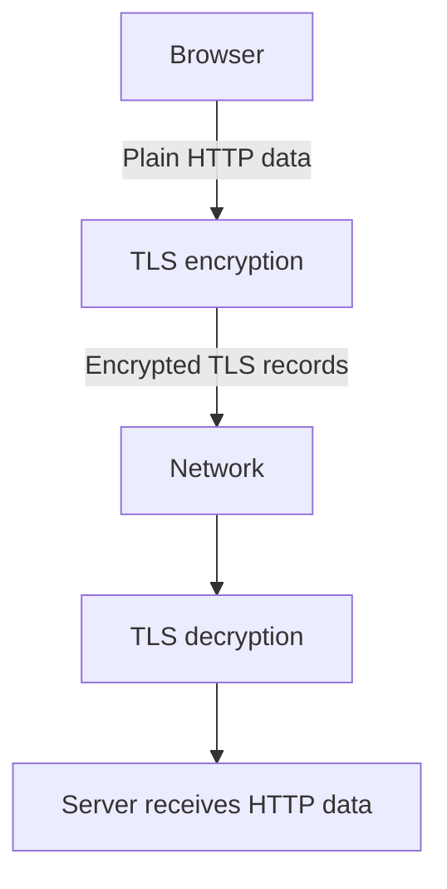

A network observer who captures the encrypted traffic should not be able to recover the original application data without the required keys, assuming secure algorithms and correct implementation.

This is called confidentiality.

**Important:** Encryption protects data in transit. It does not automatically protect data stored in a database or prevent an authorized application from reading it.

### 3.2 Authentication — Knowing whom you are communicating with

Encryption alone does not prove that you are connected to the intended server.

Imagine you want to visit:

`https://shop.example.com`

An attacker could attempt to impersonate that website.

TLS normally uses digital certificates to help the browser verify the server's identity.

The browser checks whether the certificate is valid for the requested hostname and whether it chains to a trusted certificate authority, along with other validation requirements.

This helps the browser establish that it is communicating with the intended server rather than an unauthenticated impostor.

We will explore certificates shortly.

### 3.3 Integrity — Detecting unauthorized modification

Suppose a user requests a product page.

An attacker who can modify unprotected traffic might try to change the response.

For example:

```text
Original response:
Product price = ₹2,500

Modified response:
Product price = ₹25
```

TLS uses cryptographic integrity protection to detect unauthorized modification of protected records.

If protected data is altered in transit, the receiver will reject the affected records rather than silently accepting the modified content.

Modern TLS uses authenticated encryption, which combines confidentiality and integrity protection.

---

## 4. What Is a Digital Certificate?

A digital certificate is an electronic document that binds an identity, such as a domain name, to a public key.

For HTTPS, a server presents a certificate during the TLS handshake.

A certificate typically contains information such as:

* The subject or identities for which the certificate is valid.
* The server's public key.
* The issuer that signed the certificate.
* The validity period.
* The digital signature of the issuer.

A certificate does not contain the server's private key.

The private key must be kept secret by the party that controls it.

### A simplified example

Imagine a certificate for:

`shop.example.com`

The certificate might indicate:

```text
Domain: shop.example.com
Public Key: Server's public key
Issuer: Example Certificate Authority
Valid From: ...
Valid Until: ...
Digital Signature: CA's signature
```

When the browser receives the certificate, it checks whether the certificate is trustworthy and valid for the hostname.

If the checks succeed, the browser can use the certificate's public key as part of the TLS authentication process.

### Public key vs private key

TLS uses cryptographic keys, but public and private keys have different roles.

| Key         | Description                                                                        |
| ----------- | ---------------------------------------------------------------------------------- |
| Public key  | Can be shared publicly and is included in the certificate.                         |
| Private key | Must remain secret and is controlled by the server or its authorized TLS endpoint. |

In modern TLS, the server's certificate private key is generally used to authenticate the handshake by creating a digital signature.

It is not normally used to directly encrypt all application data.

This distinction is important because older explanations of HTTPS sometimes incorrectly describe the browser encrypting the entire communication with the server's public key.

Modern TLS typically uses ephemeral key exchange to establish shared session keys, followed by symmetric authenticated encryption.

---

## 5. Certificate Authorities (CA)

How does a browser know whether a certificate should be trusted?

This is where Certificate Authorities come in.

A Certificate Authority (CA) is an organization trusted to issue or sign digital certificates according to its validation procedures.

Browsers and operating systems maintain trust stores containing trusted root certificates.

A simplified certificate chain looks like this:

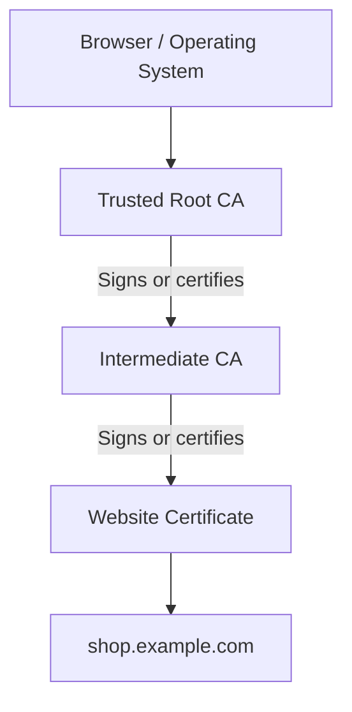

The browser validates the certificate chain back to a trusted root, subject to its trust rules and certificate validation requirements.

The website certificate is usually issued by an intermediate CA, rather than directly by a root CA.

### What does the browser check?

Certificate validation includes checks such as:

| Check | Purpose |
|---|---|
| Hostname | Does the certificate cover the domain being visited? |
| Validity period | Is the certificate currently within its validity period? |
| Certificate chain | Can the chain be validated to a trusted root? |
| Digital signatures | Are the certificate signatures valid? |
| Constraints and usage | Is the certificate appropriate for the intended purpose? |

Depending on the browser and environment, revocation information and other certificate policies may also be considered.

### What happens if validation fails?

Suppose the certificate is issued for:

`other.example.com`

But the browser is visiting:

`shop.example.com`

The hostname does not match.

The browser may display a security warning and refuse to establish a normal trusted HTTPS connection.

Similarly, an expired certificate or an untrusted certificate chain can cause a TLS validation error.

**System design connection:** Certificate management is part of operating a production system. An expired certificate can make an otherwise healthy website inaccessible to users.

---

## 6. The TLS Handshake

Before protected HTTP communication can begin, the client and server need to establish a TLS connection.

This initial process is called the TLS handshake.

It negotiates security parameters, authenticates the server, and establishes shared cryptographic keys.

We will use TLS 1.3 as the main example because it is a modern TLS version.

The handshake can be simplified as follows.

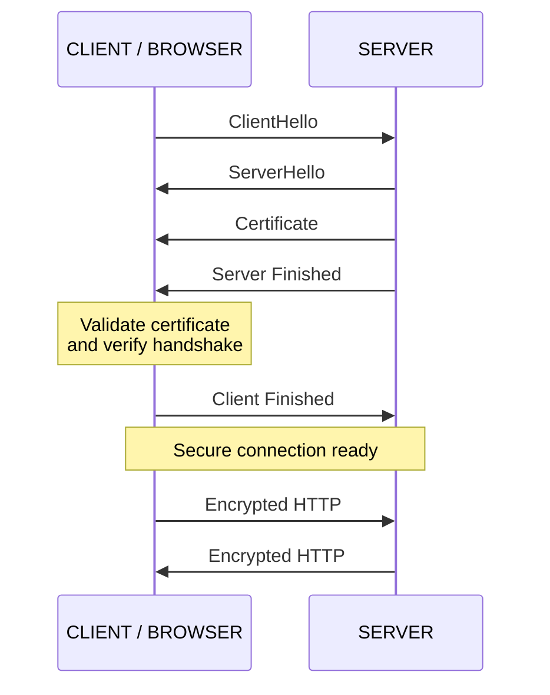

This is a simplified illustration. The exact messages and their ordering depend on the negotiated TLS version, extensions, and whether features such as session resumption are used.

Let's understand the main steps.

### Step 1 — ClientHello

The browser sends a ClientHello message.

It includes information such as:

- Supported TLS versions.
- Supported cryptographic algorithms and cipher suites.
- Key exchange information.
- Extensions, which can include the server name indication (SNI).

SNI allows a client to indicate the hostname it wants to connect to during the TLS handshake. This helps a server hosting multiple websites select the appropriate certificate.

### Step 2 — ServerHello

The server responds with a ServerHello message.

It selects compatible cryptographic parameters and provides its key exchange information.

Using the key exchange process, the client and server derive shared secrets from which traffic encryption keys are established.

In TLS 1.3, ephemeral Diffie–Hellman key exchange is commonly used to establish these shared secrets.

### Step 3 — Server certificate and authentication

The server sends its certificate and the other handshake messages needed to authenticate the handshake.

The browser validates the certificate chain, hostname, and relevant certificate properties.

The server proves possession of the corresponding private key through handshake authentication, typically using a digital signature.

This helps establish that the server controls the identity represented by the certificate.

### Step 4 — Handshake completion

The client and server verify the handshake messages and confirm that they have derived matching cryptographic secrets.

Once the handshake is complete, they can exchange protected application data.

For HTTPS, that application data contains HTTP requests and responses.

### Step 5 — Encrypted HTTP communication

The browser can now send an HTTP request through the TLS connection.

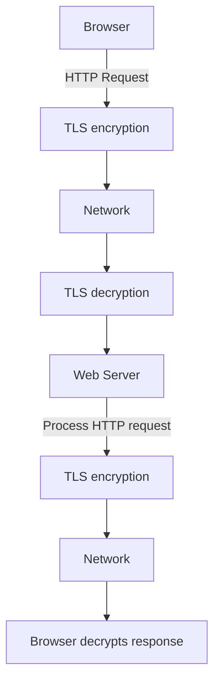

The HTTP application still works with its normal methods, headers, and bodies.

TLS protects the data exchanged between the TLS endpoints.

---

## 7. What Does HTTPS Actually Hide?

HTTPS protects HTTP application data in transit, but it does not make every aspect of a network connection invisible.

A network observer may still be able to see information such as:

* The IP addresses involved in the connection.
* The amount and timing of traffic.
* The transport protocol and connection metadata.
* In common configurations, the hostname through DNS queries or TLS handshake information.

For example, DNS queries may reveal the domain being resolved unless protected DNS is used.

TLS Server Name Indication can also expose the hostname in ordinary deployments, although Encrypted ClientHello (ECH), when supported and correctly deployed, can protect the relevant ClientHello information.

The exact visibility depends on the protocols, network configuration, and encryption features in use.

HTTPS does not guarantee anonymity.

It also does not protect data after it reaches a trusted TLS endpoint. If the application server is compromised, the attacker may be able to access decrypted application data.

**Key distinction:** HTTPS protects communication between TLS endpoints. It does not eliminate every security risk in the application or infrastructure.

---

## 8. Where Does TLS Terminate?

In a real production architecture, TLS does not always terminate directly at the application server.

Consider a typical deployment:

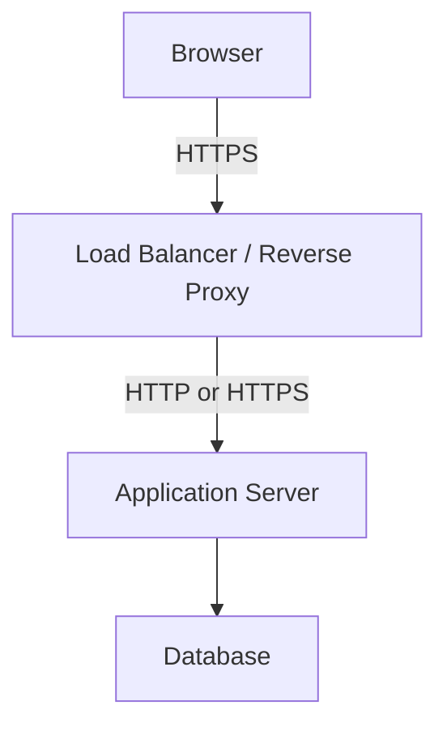

The load balancer or reverse proxy may handle TLS termination.

TLS termination means that the TLS connection is decrypted at that component.

The component can then forward the request to the application server.

### Option A — TLS termination at the load balancer

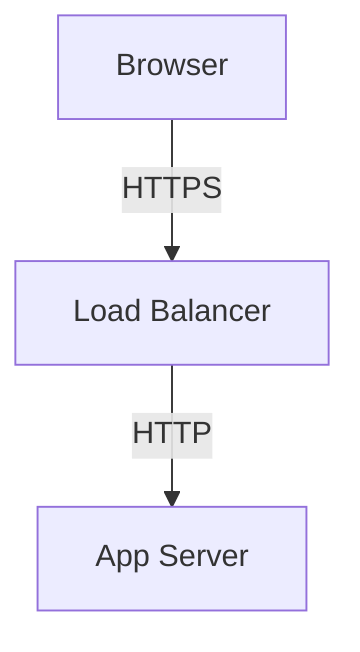

Advantages:

* Centralized certificate management.
* Reduced TLS processing requirements on application servers.
* Easier integration with load balancing and routing.

Considerations:

* The connection between the load balancer and application server is not encrypted by TLS.
* If that internal network requires confidentiality or stronger security boundaries, additional protection may be necessary.

### Option B — TLS between the load balancer and application server

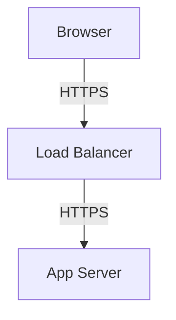

Here, the load balancer terminates the browser's TLS connection, then establishes a separate TLS connection to the application server.

This protects the internal communication in transit as well.

The two TLS connections are separate. The internal connection has its own handshake, certificates, and trust configuration.

### Option C — End-to-end TLS to the application endpoint

In some architectures, TLS can be passed through a load balancer or intermediary so that the application-side endpoint performs the TLS termination.

The intermediary routes the encrypted connection without decrypting its application data.

This can preserve TLS protection to the downstream endpoint, but it limits the intermediary's ability to inspect HTTP-level content.

### How do you decide?

It depends on the system's security requirements, network boundaries, operational complexity, and performance needs.

TLS termination is an architectural decision—not simply a checkbox in a hosting dashboard.

---

## 9. TLS Certificates in Production

For a production web application, HTTPS requires proper certificate and key management.

A typical lifecycle looks like this:

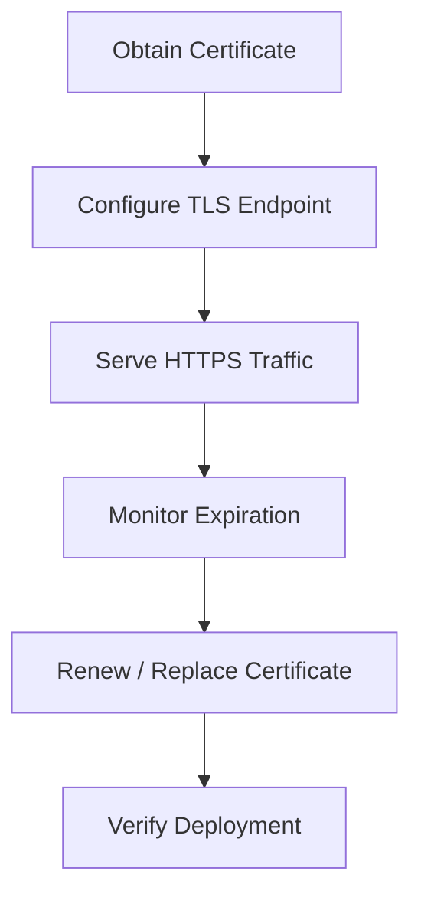

Certificates have validity periods and must be renewed or replaced before expiration.

Many hosting providers and certificate services automate this process.

However, automation does not remove the need for monitoring.

### Common TLS operational problems

| Problem                          | Possible result                                                                                                                |
| -------------------------------- | ------------------------------------------------------------------------------------------------------------------------------ |
| Expired certificate              | Browsers reject the certificate as invalid.                                                                                    |
| Hostname mismatch                | Browser cannot verify the certificate for the requested domain.                                                                |
| Missing intermediate certificate | Certificate chain validation may fail.                                                                                         |
| Incorrect server clock           | Certificate validity checks may fail.                                                                                          |
| Unsupported TLS configuration    | Client and server cannot agree on compatible security parameters.                                                              |
| Private key exposure             | An attacker may impersonate the server or compromise the security of the affected certificate, depending on the circumstances. |

Private keys should be stored securely and should not be committed to public source repositories.

In larger systems, secrets management, access control, rotation, and audit logging become important parts of certificate operations.

---

## 10. TLS and System Design

TLS provides essential security, but it also introduces operational and computational considerations.

### 10.1 Connection setup and latency

A new TLS connection requires a handshake before protected application data can be exchanged.

That handshake adds communication steps and processing.

For a request involving a new connection, the overall delay may include:

```text
DNS Resolution
      +
TCP Connection Setup (for TCP-based HTTPS)
      +
TLS Handshake
      +
HTTP Request / Response
```

For HTTP/3, the transport and TLS handshake behavior is integrated differently through QUIC.

Persistent connections and connection reuse reduce the need to repeat connection setup for every request.

TLS session resumption can also reduce the cost of establishing subsequent connections.

TLS 1.3 supports a 1-RTT handshake for a full handshake in the normal case and can support 0-RTT data for certain resumed connections.

However, 0-RTT data has replay considerations and should only be used for operations that are safe under the application's replay and idempotency requirements.

### 10.2 CPU and resource usage

TLS involves cryptographic operations.

These operations consume CPU and other resources on the TLS endpoints.

Modern hardware, optimized libraries, and TLS acceleration can make this overhead manageable, but it still belongs in capacity planning.

A busy load balancer handling thousands of new TLS connections per second may have different resource requirements from one serving mostly reused connections.

### 10.3 Security boundaries

Suppose your application handles customer payment information.

Protecting only the browser-to-load-balancer connection may not be sufficient if sensitive data crosses untrusted or insufficiently protected internal networks.

The system designer must identify:

* Where data is decrypted.
* Which components can access plaintext.
* Which network segments require encryption.
* Who can access private keys.
* How certificates and keys are rotated.

The objective is to protect the complete data path according to the system's threat model.

---

## 11. Common Misconceptions

| Misconception                                                              | Correct understanding                                                                                                     |
| -------------------------------------------------------------------------- | ------------------------------------------------------------------------------------------------------------------------- |
| HTTPS and HTTP are completely different application protocols.             | HTTPS is HTTP protected by TLS.                                                                                           |
| A certificate encrypts all website data by itself.                         | Certificates help authenticate identity and provide public-key information; TLS establishes traffic keys.                 |
| HTTPS means a website is trustworthy in every way.                         | HTTPS authenticates the configured endpoint and protects the connection; a malicious website can also use HTTPS.          |
| TLS prevents all attacks.                                                  | TLS protects communication but does not fix application vulnerabilities, compromised endpoints, or unsafe business logic. |
| TLS always encrypts the connection all the way to the application process. | TLS terminates wherever the configured TLS endpoint is located.                                                           |
| Using UDP means HTTP/3 has no reliable delivery.                           | QUIC provides reliable transport over UDP.                                                                                |
| A valid certificate means the website's business is legitimate.            | Certificate validation does not establish whether a business is honest or its application is secure.                      |

---

## 12. Quick Reference

### Security properties

| Property        | What it provides                                      |
| --------------- | ----------------------------------------------------- |
| Confidentiality | Protects application data from being read in transit. |
| Authentication  | Helps verify the identity of the TLS endpoint.        |
| Integrity       | Detects unauthorized modification of protected data.  |

### Important terminology

| Term                   | Meaning                                                                                         |
| ---------------------- | ----------------------------------------------------------------------------------------------- |
| TLS                    | Protocol that protects communication using cryptography.                                        |
| Certificate            | Binds an identity to a public key.                                                              |
| Certificate Authority  | Trusted organization that issues or signs certificates.                                         |
| Public key             | Key that can be shared publicly.                                                                |
| Private key            | Secret key controlled by its owner.                                                             |
| TLS handshake          | Process that negotiates parameters, authenticates the server, and establishes keys.             |
| TLS termination        | Point where a TLS connection is decrypted.                                                      |
| TLS session resumption | Mechanism that allows a client and server to establish subsequent connections more efficiently. |

### Remember the relationship

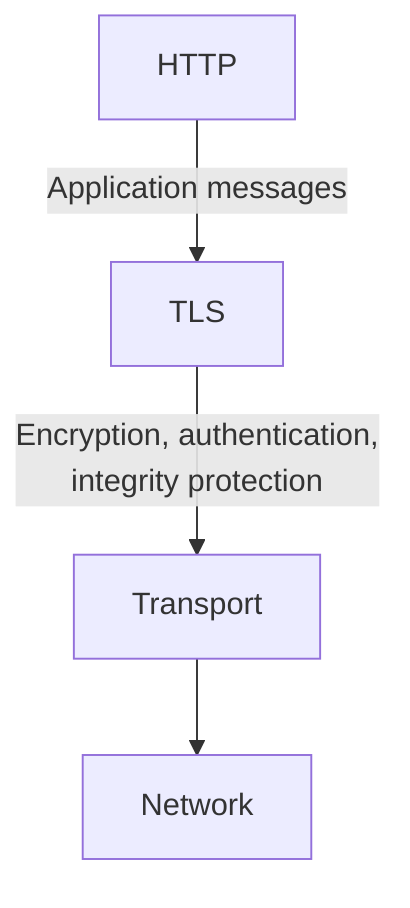

---

## 13. Knowledge Check

**1.** What security properties does HTTPS provide that ordinary HTTP does not provide by itself?

**2.** What is the difference between a certificate's public key and the server's private key?

**3.** Why does a browser check whether a certificate is valid for the hostname it is visiting?

**4.** What role does a Certificate Authority play in the certificate trust chain?

**5.** Why does a TLS 1.3 connection normally use key exchange to establish shared traffic keys instead of encrypting every HTTP message directly with the certificate's public key?

**6.** If TLS terminates at a load balancer and the load balancer forwards requests over HTTP to an application server, which part of the communication is protected by TLS?

**7.** Why does HTTPS not guarantee that a website is legitimate or free of vulnerabilities?

**8.** How can persistent connections and TLS session resumption reduce connection setup overhead?

---

**Key Principle:** HTTPS protects communication between TLS endpoints, but a secure system requires deliberate protection of the entire data path—including endpoints, internal connections, certificates, private keys, and application logic.
