# 00.08 — Client–Server Architecture

## Learning Objectives

By the end of this chapter, you will be able to:

* Explain the client–server architecture and why it is used.
* Identify the responsibilities of clients and servers.
* Understand how requests travel between clients, servers, and databases.
* Distinguish between two-tier, three-tier, and multi-tier architectures.
* Understand the difference between a client, a server, and a physical machine.
* Recognize the benefits, limitations, and architectural trade-offs of client–server systems.

---

## 1. What Is Client–Server Architecture?

Imagine you open an e-commerce website to purchase a laptop.

You use your browser to search for a product, view its price, add it to your cart, and place an order.

Your browser displays the interface, but it does not necessarily store the entire product catalog or process every business rule itself.

Instead, it communicates with another system that handles requests, processes information, and returns results.

This is the basic idea behind **client–server architecture**.

> Client–server architecture is a model in which one component, called the client, requests a service or resource from another component, called the server.

The client initiates a request. The server receives and processes it, then returns a response or performs the requested operation.

### A simple example

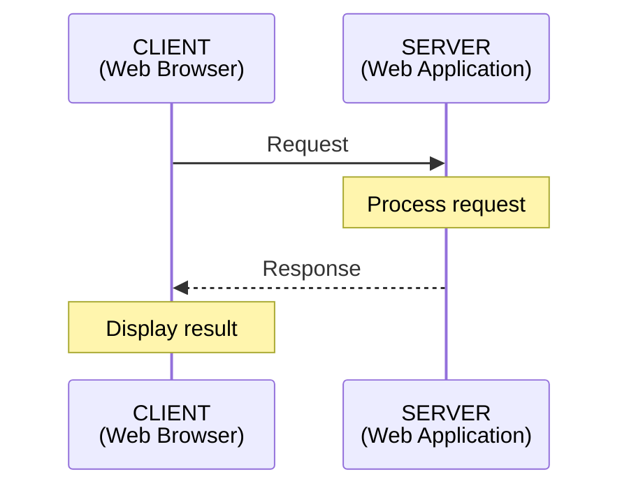

The client and server have different responsibilities, but they work together to provide a complete service.

Examples of clients include:

- A web browser.
- A mobile application.
- A desktop application.
- Another backend service.

Examples of servers include:

- A web server.
- An application server.
- A database server.
- A file server.

A client and a server are roles in a communication relationship. They are not necessarily separate physical computers.

---

## 2. Understanding the Client

The client is the component that requests a service.

In a web application, the browser is usually the client.

It is responsible for tasks such as:

- Displaying the user interface.
- Collecting user input.
- Sending HTTP requests.
- Receiving server responses.
- Rendering HTML and applying CSS.
- Running JavaScript in the browser.

Consider a product page.

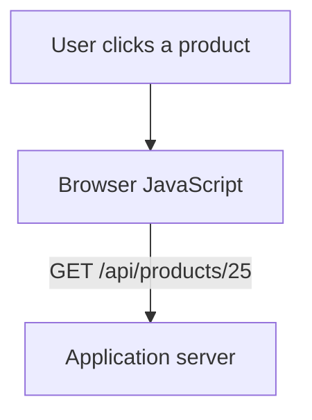

The browser may send a request using JavaScript's `fetch()` API:

```javascript
fetch("/api/products/25")
  .then(response => response.json())
  .then(product => {
    console.log(product.name);
  });
```

The browser sends the request and processes the response.

However, the client should not be trusted to enforce important business rules by itself.

For example, hiding an administrator button in the browser does not prevent a user from attempting to call an administrator API directly.

The server must enforce authorization and other critical rules.

### Is a mobile app also a client?

Yes.

A mobile application can request data from the same backend used by a website.

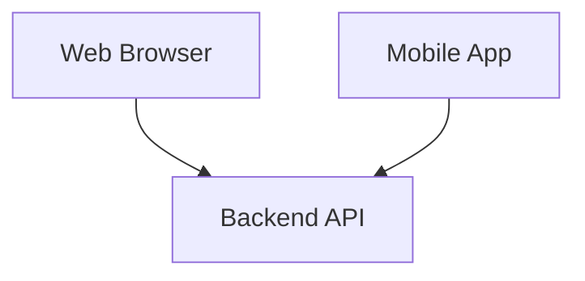

The web browser and mobile application are different clients, but both can use the same server-side business logic and data.

This is one reason APIs are important in modern application architecture.

---

## 3. Understanding the Server

A server provides services or resources to clients.

In a web application, the server receives requests, applies the appropriate logic, and returns responses.

For example, when a client requests a product:

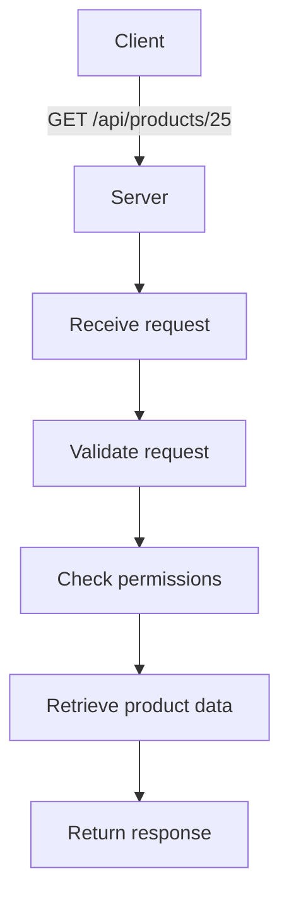

The server may communicate with other systems to fulfill the request.

A typical backend might interact with:

* A database to retrieve product information.
* A cache to avoid repeated database queries.
* A payment service to process an order.
* A message queue to schedule background work.

The server does not have to complete every task itself. It can delegate work to other components.

### A server is not necessarily one computer

The word "server" can refer to a software process, a role, or a machine.

For example, a web server such as Nginx can run on a virtual machine. An application server can run in a separate container. A database server can run on a managed cloud database service.

The logical architecture describes how these components communicate, not necessarily where every component physically resides.

---

## 4. A Complete Web Application Example

Let's examine a realistic e-commerce request.

A user opens the product page for a mechanical keyboard.

The browser needs product information from the backend.

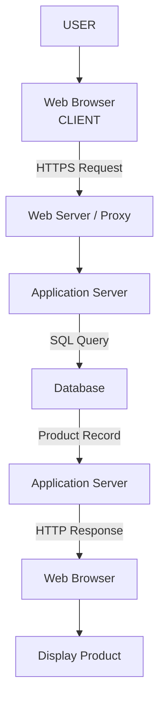

The browser is the client.

The web server and application server handle incoming requests and application logic.

The database stores persistent product information.

Let's follow the request step by step.

### Step 1 — The client initiates a request

The user visits:

`https://shop.example.com/products/25`

The browser resolves the hostname through DNS and establishes the necessary network connection.

For HTTPS, TLS protects the HTTP communication.

### Step 2 — The server receives the request

The request reaches the web server or reverse proxy.

The proxy may perform tasks such as routing, TLS termination, and forwarding the request to the appropriate application server.

### Step 3 — The application processes the request

The application server receives the request and determines which operation is required.

It may validate the input, apply business rules, and query the database.

### Step 4 — The database returns data

The database retrieves the relevant product record.

For example:

```text
id: 25
name: Mechanical Keyboard
price: 2500
stock: 18
```

### Step 5 — The server returns a response

The application server constructs an HTTP response.

For an API endpoint, the response might contain JSON:

```json
{
  "id": 25,
  "name": "Mechanical Keyboard",
  "price": 2500,
  "stock": 18
}
```

The browser receives the response and displays the product information.

The complete process involves several components, but from the client's perspective, it is still a request to a service and a response from that service.

---

## 5. Two-Tier Architecture

A two-tier architecture divides an application into two logical tiers.

A common arrangement is:

1. Client tier.
2. Server or data tier.

For example, a desktop application may connect directly to a database server.

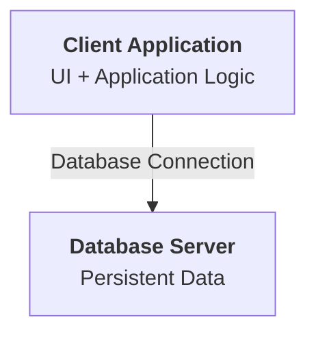

The client may contain a significant amount of application logic and communicate directly with the database.

### Advantages

- Simple architecture.
- Fewer components to deploy.
- Direct communication between client and database.

### Limitations

- Database credentials and access must be handled carefully.
- Business logic may be duplicated across clients.
- Database access becomes harder to control when many clients connect directly.
- Scaling and centralized authorization can become more difficult.

Two-tier systems can still be appropriate for certain internal tools, desktop applications, and controlled environments.

However, exposing a database directly to arbitrary internet clients is generally inappropriate for a typical public web application.

---

## 6. Three-Tier Architecture

Three-tier architecture separates an application into three logical tiers:

1. Presentation tier.
2. Application tier.
3. Data tier.

This is a common structure for web applications.

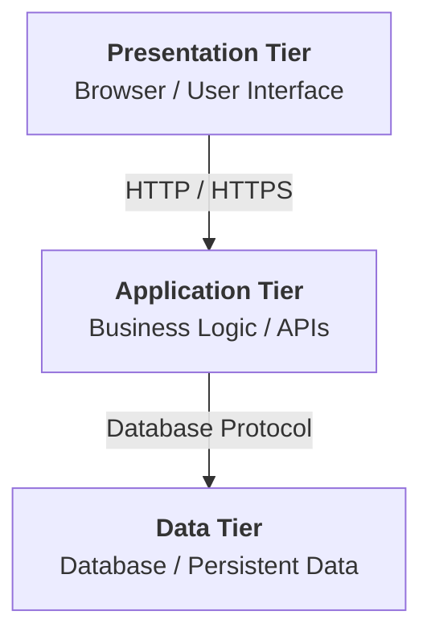

### Presentation tier

This is the part of the system that interacts with the user.

Examples:

- HTML, CSS, and JavaScript in a browser.
- A mobile application's interface.

Its primary responsibility is presenting information and collecting user input.

### Application tier

This tier handles the application's business logic.

Examples:

- Validating an order.
- Calculating a shopping cart total.
- Checking whether a user can perform an operation.
- Processing API requests.

The application tier communicates with the data tier when it needs to read or modify persistent data.

### Data tier

This tier manages persistent data.

Examples:

- MySQL.
- PostgreSQL.
- MongoDB.

It is responsible for storing, retrieving, and managing application data according to the database's capabilities and configuration.

### Why separate these tiers?

Consider a change to the user interface.

If the presentation layer is properly separated from business logic, the interface can be redesigned without rewriting the entire order-processing system.

Similarly, the database implementation can sometimes be changed without requiring a complete rewrite of the client interface.

This separation improves maintainability and gives the system more flexibility.

However, separation introduces communication overhead, deployment complexity, and additional failure points.

The appropriate architecture depends on the application's needs.

---

## 7. Multi-Tier Architecture

As applications grow, three logical tiers may no longer describe the full architecture.

Additional components can be introduced to handle specific responsibilities.

For example:

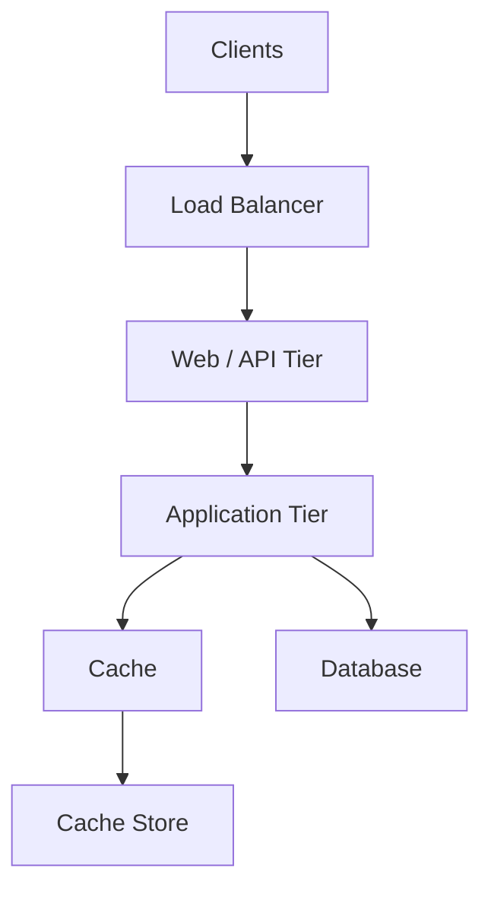

A larger architecture might also include:

- Authentication services.
- Message brokers.
- Background workers.
- Search services.
- Object storage.
- Monitoring and logging systems.

These components do not necessarily represent separate physical machines. They represent logical responsibilities and communication boundaries.

### An important distinction

A three-tier architecture does not mean that the system must run on exactly three servers.

You could deploy all three tiers on one physical machine, or distribute them across multiple machines, containers, and managed cloud services.

Similarly, a multi-tier architecture does not automatically mean microservices.

A modular monolith with a web server, application process, cache, and database can still be a multi-component system without being a microservices architecture.

The number of tiers, physical servers, and deployable services are different concepts.

---

## 8. Client–Server vs Peer-to-Peer

Client–server is not the only way systems communicate.

Another model is peer-to-peer (P2P).

In a peer-to-peer system, participating nodes can communicate directly and may act as both clients and servers.

### Client–server

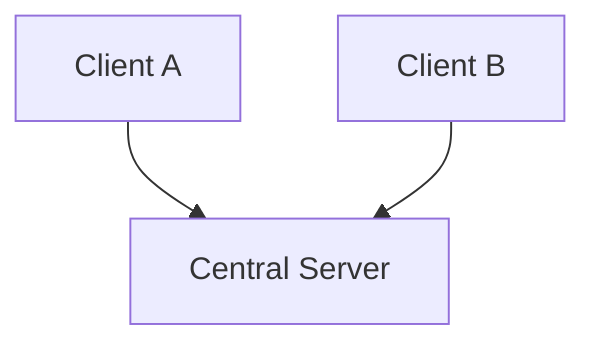

Clients generally request services from a server that provides a shared resource or coordination point.

### Peer-to-peer

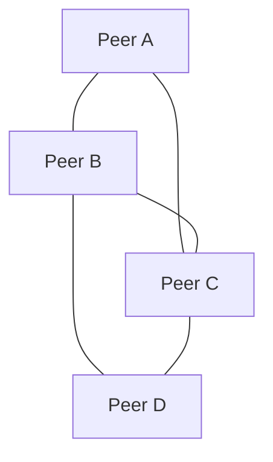

Peers can exchange data or services directly with one another.

Examples of peer-to-peer technologies include BitTorrent and certain distributed communication systems.

### Comparison

| Aspect       | Client–Server                                                      | Peer-to-Peer                                                   |
| ------------ | ------------------------------------------------------------------ | -------------------------------------------------------------- |
| Roles        | Client and server roles are distinct for a given interaction       | A node may act as both                                         |
| Coordination | Often centralized or organized around server services              | Often distributed among peers                                  |
| Management   | Centralized control can simplify management                        | Coordination and trust can be more complex                     |
| Failure      | A critical central server can become a bottleneck or failure point | Multiple peers may provide redundancy, depending on the design |

Peer-to-peer systems can still use central services for discovery, coordination, authentication, or other functions.

Real systems can also combine client–server and peer-to-peer patterns.

---

## 9. Benefits and Limitations of Client–Server Architecture

Client–server architecture is widely used because it allows responsibilities to be separated and services to be shared.

However, it also creates dependencies between components.

### Benefits

| Benefit                    | Explanation                                                                     |
| -------------------------- | ------------------------------------------------------------------------------- |
| Centralized business logic | Important application rules can be implemented and maintained on the server.    |
| Shared data                | Multiple clients can access the same backend data.                              |
| Easier updates             | Server-side logic can often be updated without installing a new client version. |
| Access control             | The server can enforce authentication and authorization.                        |
| Independent scaling        | Server-side components can be scaled according to their resource requirements.  |

### Limitations

| Limitation             | Explanation                                                                        |
| ---------------------- | ---------------------------------------------------------------------------------- |
| Network dependency     | Clients need network connectivity to communicate with remote services.             |
| Latency                | Requests require time to travel to the server and back.                            |
| Server bottlenecks     | A server can become overloaded by CPU, memory, network, or dependency constraints. |
| Failure propagation    | Failure of a critical backend dependency can affect many clients.                  |
| Operational complexity | Distributed deployments require monitoring, security, and failure handling.        |

The architecture does not eliminate complexity. It organizes complexity into components and communication boundaries.

---

## 10. What Happens When the Server Fails?

Imagine a shopping application with a single application server.

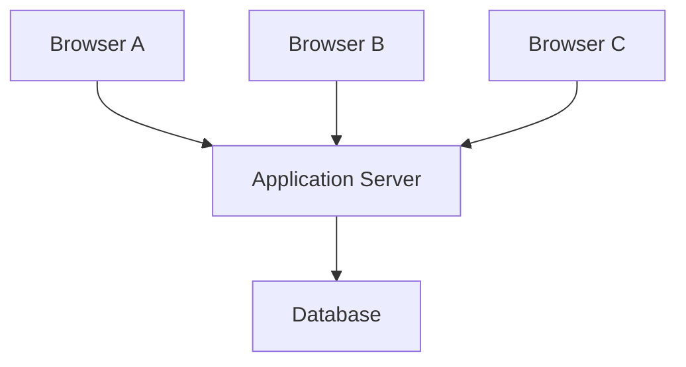

If the application server becomes unavailable, all three browsers may be unable to complete operations that depend on it.

The database might still be healthy, but the application service is unavailable.

This illustrates an important system design principle:

**A component can be healthy while the complete system is unavailable.**

Now suppose the application has multiple instances behind a load balancer.

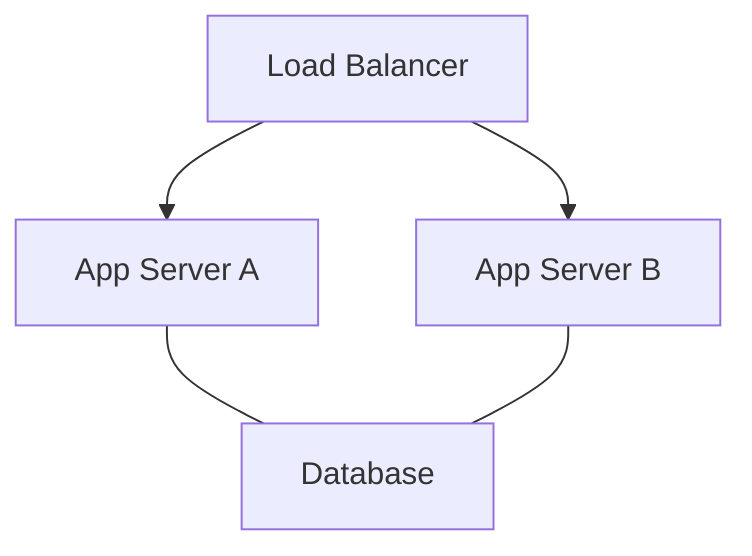

If one application server fails, the load balancer may route new requests to the remaining healthy instance, provided that the system has appropriate health checks and capacity.

This is an example of redundancy and failover.

However, multiple application servers do not automatically eliminate every failure.

The database, load balancer, network, or another shared dependency could still become a bottleneck or failure point.

We will study these topics in Level 2 and Level 9.

---

## 11. Architectural Decisions: Where Should Logic Live?

One of the important decisions in client–server design is deciding which component should perform a task.

Consider calculating the total price of an order.

A client could calculate:

```javascript
const total = price * quantity;
```

This is useful for displaying an estimated total immediately in the user interface.

But should the server trust that value when charging a customer?

No.

A client can be modified or manipulated. The server should independently validate the product price, quantity, discounts, and other business rules before creating the order or initiating payment.

A reasonable division is:

| Responsibility                      | Client               | Server                   |
| ----------------------------------- | -------------------- | ------------------------ |
| Display estimated total             | Yes                  | Can provide pricing data |
| Collect product quantity            | Yes                  | Validate it              |
| Calculate authoritative order total | May preview          | Yes                      |
| Enforce access permissions          | May hide UI elements | Must enforce             |
| Persist order                       | Sends request        | Validates and stores     |

This is not a rule that every calculation belongs on the server.

Client-side calculations can improve responsiveness and user experience.

The key is to distinguish between presentation convenience and authoritative business decisions.

### A useful principle

Keep user-interface responsibilities near the client, and enforce security-sensitive rules and authoritative business operations on the server.

The exact division depends on performance, offline requirements, security, and the application's architecture.

---

## 12. Quick Reference

### Core terms

| Term              | Meaning                                                           |
| ----------------- | ----------------------------------------------------------------- |
| Client            | Component requesting a service or resource.                       |
| Server            | Component providing a service or resource.                        |
| Tier              | Logical layer of responsibility in an architecture.               |
| Presentation tier | User interface and interaction.                                   |
| Application tier  | Business logic and request processing.                            |
| Data tier         | Persistent data management.                                       |
| Client–server     | Communication model involving requesters and service providers.   |
| Peer-to-peer      | Model where participating peers can provide and consume services. |

### Architecture patterns

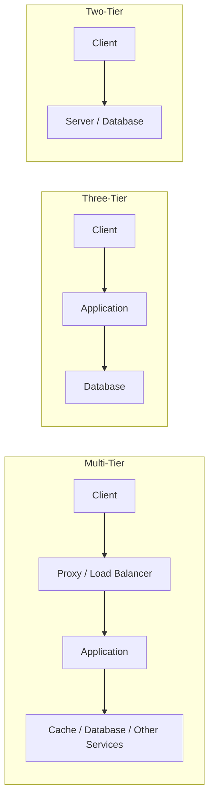

### Remember

* A client is not necessarily a browser.
* A server is not necessarily a physical machine.
* Three tiers do not mean three computers.
* Multi-tier architecture does not automatically mean microservices.
* A healthy database does not guarantee that the application is available.

---

## 13. Knowledge Check

**1.** What is the difference between a client and a server?

**2.** Can a mobile application and a web browser use the same backend? Explain how.

**3.** What are the three logical tiers of a typical web application?

**4.** Why is direct database access from an arbitrary public web client generally inappropriate?

**5.** Does a three-tier architecture require exactly three physical servers?

**6.** What is the difference between client–server and peer-to-peer communication?

**7.** Why should the server independently validate an order's total price, even if the browser already calculated it?

**8.** If an application server fails but the database remains healthy, is the complete application necessarily available?

**9.** What additional benefit can multiple application servers behind a load balancer provide?

---

**Key Principle:** Client–server architecture separates the responsibilities of requesting and providing services. Good system design determines where responsibilities belong, how components communicate, and how the system behaves when a component or dependency fails.
