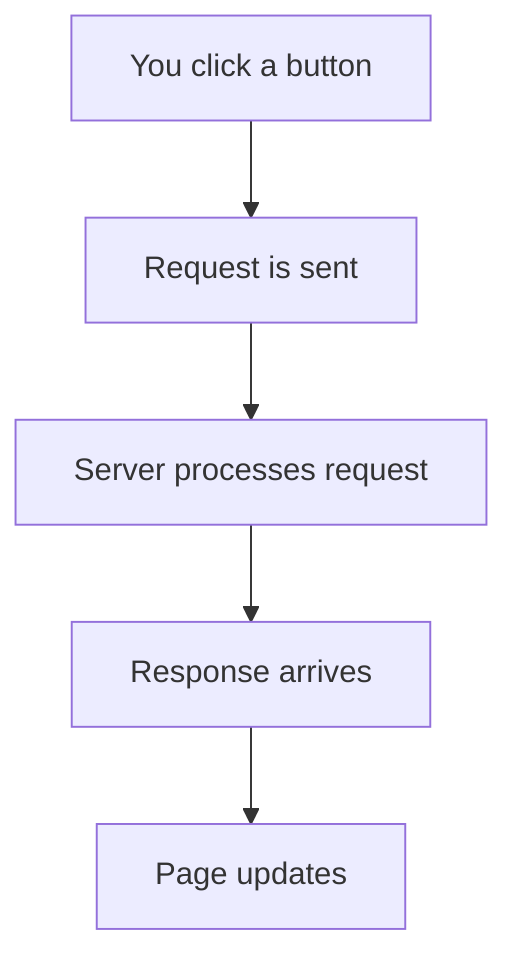
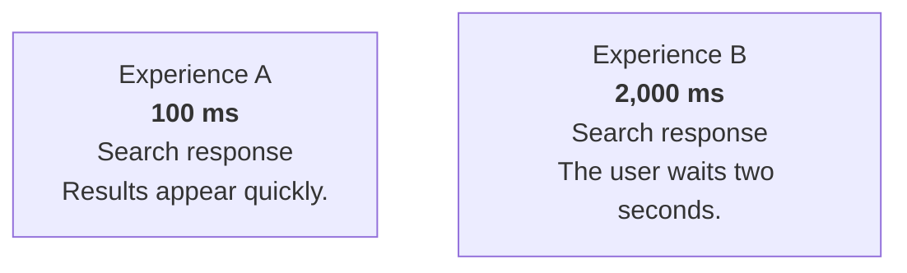
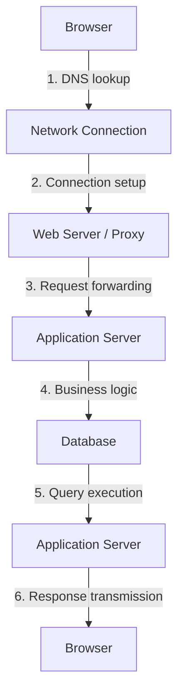
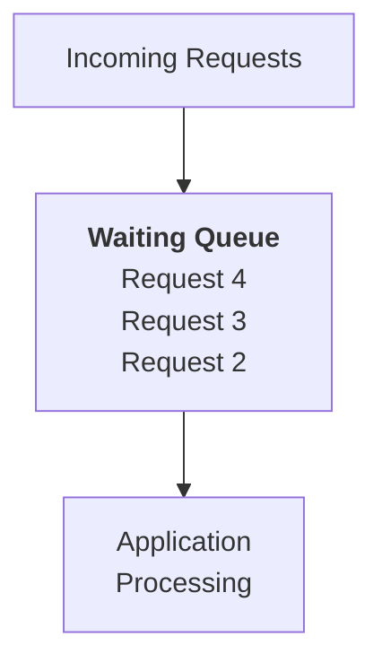
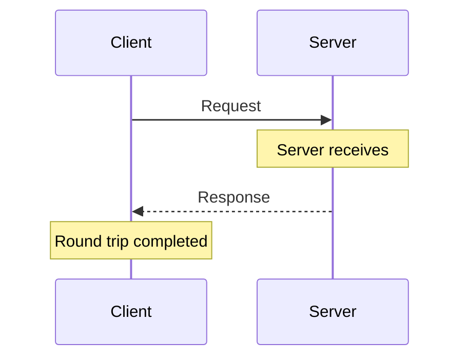
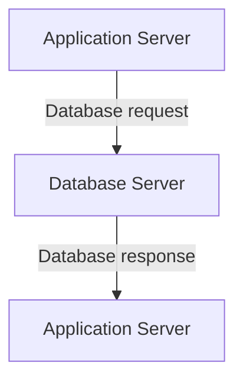
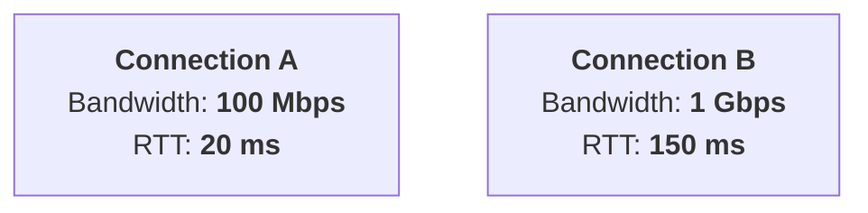
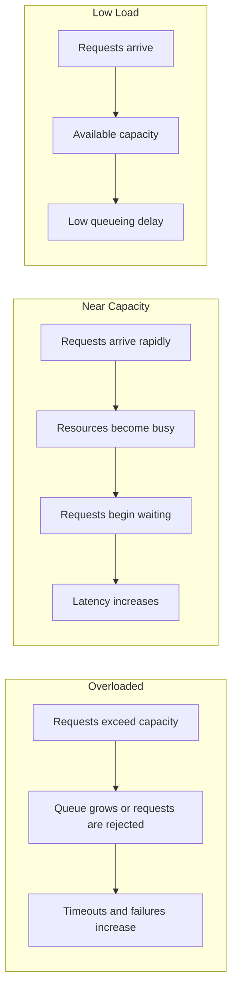
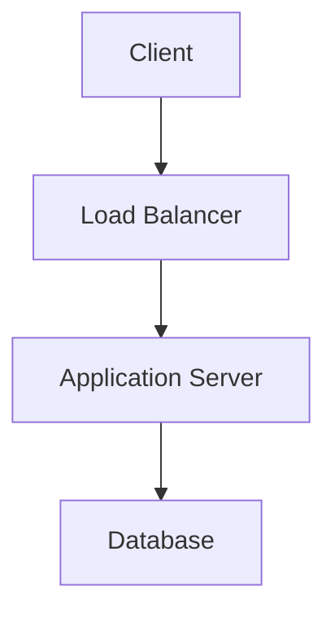

# 00.09 — Latency, Throughput & Bandwidth

## Learning Objectives

By the end of this chapter, you will be able to:

* Explain the difference between latency, throughput, and bandwidth.
* Understand how network delays affect application response times.
* Distinguish between response time, round-trip time (RTT), and processing time.
* Understand why high bandwidth does not necessarily mean low latency.
* Identify bottlenecks that limit application performance.
* Use these concepts to reason about system capacity, scalability, and user experience.

---

## 1. Why Do These Three Concepts Matter?

Imagine you are using an e-commerce website.

You click "Place Order."

The page takes five seconds to respond.

Now imagine that the same website can handle thousands of orders per minute, but your individual order still takes five seconds.

Is the website fast?

Is it scalable?

These questions involve different aspects of system performance.

Three fundamental concepts help us understand them:

| Concept    | Simple meaning                                                    |
| ---------- | ----------------------------------------------------------------- |
| Latency    | How long something takes to happen.                               |
| Throughput | How much work a system completes per unit of time.                |
| Bandwidth  | How much data a communication channel can carry per unit of time. |

They are related, but they are not interchangeable.

A system can have high throughput but high latency. A network can have high bandwidth but still respond slowly to a small request.

Understanding the difference is essential before studying scaling, caching, load balancing, and distributed systems.

---

## 2. What Is Latency?

**Latency is the time delay between an action and its corresponding result.**

In networking, it commonly refers to the time taken for data to travel between two points or for a request to receive a response, depending on the measurement being used.

For example:



If the user clicks a button at 10:00:00.000 and the result appears at 10:00:00.300, the observed delay is 300 milliseconds.

$$
\text{Observed latency} = 300\text{ ms}
$$

This is the user's perceived delay for that operation, assuming the measurement includes the full interval.

### Units of latency

| Unit               |         Equivalent |
| ------------------ | -----------------: |
| 1 second           | 1,000 milliseconds |
| 1 millisecond (ms) | 1,000 microseconds |
| 1 microsecond (µs) |  1,000 nanoseconds |

Web application latency is commonly measured in milliseconds.

Very small operations, such as CPU instructions or memory access, may be measured in nanoseconds.

### Why does latency matter?

Consider two search experiences:



Both systems might return the same search results. But the second system creates a much longer wait for the user.

In interactive applications, latency directly affects responsiveness.

---

## 3. Where Does Latency Come From?

A web request does not spend all its time doing useful application work.

It passes through several stages.

Consider a browser requesting product information from a backend.



Each stage can contribute to the total delay.

### 3.1 Network latency

Data takes time to travel across a network.

The delay depends on factors such as:

* Physical distance between endpoints.
* Network routing.
* Propagation speed.
* Congestion.
* Intermediate network equipment.
* Packet loss and retransmissions.

For example, a user in India accessing a server in Europe may experience more network delay than accessing a nearby server, all else being equal.

Physical distance is not the only factor, but it places a fundamental limit on how quickly information can travel.

### 3.2 Processing latency

A server needs time to process requests.

Processing may involve:

* Executing application code.
* Validating input.
* Performing calculations.
* Running database queries.
* Communicating with external services.

If an application performs a complex database query, processing time may dominate the request's total latency.

### 3.3 Queueing latency

Sometimes a request cannot begin processing immediately.

Imagine an application server that can process only a limited number of requests concurrently.

When more requests arrive than it can handle immediately, additional requests may wait in a queue.



The time spent waiting is queueing latency.

A request can take a long time even when its actual processing time is small.

This is especially important when a system approaches its capacity.

### 3.4 Connection setup latency

Before sending application data, the client may need to establish a network connection.

Depending on the protocol and connection state, this may involve:

* DNS resolution.
* TCP connection establishment.
* TLS handshake.
* Other protocol negotiation.

Persistent connections and connection reuse can reduce repeated setup overhead.

We discussed this in Chapters 00.06 and 00.07.

---

## 4. Understanding Round-Trip Time (RTT)

Round-trip time (RTT) is the time it takes for a signal or packet to travel from one endpoint to another and for the corresponding response to return.

For example:



If the measured RTT is 80 milliseconds, the round trip takes 80 milliseconds.

RTT is commonly measured using network tools such as `ping`, although the exact measurement depends on the protocol and endpoints involved.

### RTT is not the same as application response time

Suppose a network round trip takes 80 ms.

The application then requires another 120 ms to process a request and produce a response.

A simplified estimate is:

$$
80\text{ ms} + 120\text{ ms} = 200\text{ ms}
$$

The application response time could therefore be around 200 ms, excluding other delays.

In real systems, request and response transmission, server processing, connection reuse, and multiple network round trips interact. The exact timing depends on what the measurement includes.

### Why does RTT matter?

Many distributed operations require communication between components.

For example:



If a request requires several sequential network round trips, the delays can accumulate.

This is one reason applications often benefit from reducing unnecessary remote calls.

---

## 5. What Is Throughput?

**Throughput is the amount of work a system successfully completes per unit of time.**

For web applications, throughput is commonly measured in:

* Requests per second (RPS).
* Transactions per second (TPS).
* Messages processed per second.
* Jobs completed per minute.

For networks and storage systems, throughput may also be measured in data transferred per unit of time.

### Example: An API server

Suppose an API server successfully processes 500 requests in one second.

Its throughput during that interval is:

$$
\text{Throughput} = \frac{500\text{ requests}}{1\text{ second}}
$$

$$
= 500\text{ requests/second}
$$

If the server completes 30,000 requests in one minute:

$$
\frac{30,000}{60} = 500\text{ requests/second}
$$

The average throughput over that minute is 500 requests per second.

### Throughput is not the same as incoming traffic

Suppose 1,000 requests arrive every second, but the application completes only 700 requests per second.

```text
Incoming traffic:  1,000 requests/sec
Completed traffic:   700 requests/sec
                         │
                         ▼
                300 requests/sec
                may accumulate,
                be rejected, or time out
```

The exact outcome depends on the system's queueing and overload policies.

A useful distinction is:

* Offered load: the work clients attempt to submit.
* Throughput: the work the system actually completes.

A system that receives many requests but completes few of them is not necessarily performing well.

---

## 6. What Is Bandwidth?

Bandwidth describes the maximum or available data-carrying capacity of a communication channel, depending on the context.

It is commonly measured in bits per second.

Examples:

| Unit | Meaning             |
| ---- | ------------------- |
| Kbps | Kilobits per second |
| Mbps | Megabits per second |
| Gbps | Gigabits per second |

A network connection rated at 100 Mbps has a nominal capacity of 100 million bits per second under the relevant measurement convention.

Actual application throughput may be lower due to protocol overhead, congestion, packet loss, and other factors.

### Bandwidth vs data size

A file is measured in bytes.

Network bandwidth is measured in bits per second.

There are 8 bits in a byte.

For example, a 100 MB file contains approximately 800 megabits if we use decimal units.

On a 100 Mbps connection, the idealized transfer time would be:

$$
\frac{800\text{ megabits}}{100\text{ megabits/second}}
= 8\text{ seconds}
$$

This is an idealized calculation that ignores protocol overhead, congestion, and other real-world conditions.

The actual transfer may take longer.

### Bandwidth is not latency

Consider two connections:



Connection B has ten times the bandwidth, but its RTT is much higher.

For a small API request, Connection A may provide a faster response because the transfer itself requires very little bandwidth.

For a large file, Connection B may transfer the data faster once transmission is underway, assuming other conditions are comparable.

**Key distinction:** Bandwidth describes data-carrying capacity. Latency describes delay.

---

## 7. Latency, Throughput, and Bandwidth Together

Let's compare three different systems.

| System | Latency | Throughput | Bandwidth |
| ------ | ------- | ---------- | --------- |
| A      | Low     | Low        | High      |
| B      | High    | High       | High      |
| C      | Low     | High       | Low       |

These are conceptual examples. A real system's measurements depend on workload, resource constraints, and measurement boundaries.

### System A — Fast individual response, limited capacity

A database may respond to a query in 5 ms when lightly loaded.

However, it might support only a limited number of concurrent operations.

Individual requests are fast, but overall throughput is limited.

### System B — High throughput, slow individual requests

A service may process many requests concurrently.

Its throughput can be high even though each request spends a long time waiting for a worker or a downstream dependency.

High throughput does not guarantee low latency.

### System C — Low latency, limited data capacity

A network may have low RTT but limited bandwidth.

Small messages can travel quickly, but large file transfers may take a long time.

This is common when comparing a low-latency, low-capacity connection with a high-bandwidth connection over a longer distance.

---

## 8. The Relationship Between Concurrency, Latency, and Throughput

A useful concept in system design is the relationship between concurrency, throughput, and response time.

Little's Law expresses this relationship for a stable system:

$$
L = \lambda W
$$

Where:

* $L$ is the average number of items in the system.
* $\lambda$ is the average throughput or arrival rate in a stable system.
* $W$ is the average time an item spends in the system.

For a web application, we can interpret this as:

$$
\text{Average in-flight requests}
=
\text{Throughput}
\times
\text{Average response time}
$$

### Example

Suppose an API completes 200 requests per second.

The average response time is 0.5 seconds.

Then:

$$
L = 200 \times 0.5
$$

$$
L = 100
$$

The system has approximately 100 requests in progress on average, within the measurement boundary.

This does not mean the server must have exactly 100 worker threads. Requests may be waiting on I/O, queued, or handled asynchronously.

The equation helps us reason about the relationship between workload and time spent in the system.

### Interactive calculation

Try changing the throughput and response time to see the implied average number of in-flight requests.

```calculator
title: Little's Law Calculator
description: Adjust the values to calculate average in-flight requests.
inputs:
  - id: throughput
    label: Throughput
    unit: req/s
    min: 10
    max: 1000
    step: 10
    value: 200
  - id: response-time
    label: Average response time
    unit: ms
    min: 50
    max: 3000
    step: 50
    value: 500
    divisor: 1000
result:
  label: Average in-flight requests
  operation: product
  digits: 1
formula: "{throughput} × {response-time} seconds"
caption: Assumes a stable system and consistent measurement boundaries. This is an average, not a maximum capacity estimate.
```

### Why this matters

If latency increases while throughput remains constant, more requests are in progress on average.

Those requests may consume:

* Memory.
* Database connections.
* Worker capacity.
* File descriptors.
* Other limited resources.

As a result, increased latency can contribute to resource exhaustion and reduced reliability.

This is one reason latency and throughput must be monitored together.

---

## 9. What Happens Near System Capacity?

Imagine an application server that can comfortably process 500 requests per second.

At low traffic, requests are handled immediately.

As traffic increases, available workers, database connections, or CPU capacity become increasingly busy.

When the incoming load approaches the system's effective capacity, requests may start waiting.



The important point is that latency can increase sharply as a system approaches saturation.

A server may still be returning successful responses, but the user experience may already be deteriorating.

### A simple example

Suppose an application can process 500 requests per second.

|  Incoming rate | Possible behavior                                     |
| -------------: | ----------------------------------------------------- |
| 100 requests/s | Plenty of spare capacity                              |
| 300 requests/s | Higher utilization                                    |
| 480 requests/s | Limited headroom; bursts may create queues            |
| 600 requests/s | Incoming work exceeds the assumed processing capacity |

These values are illustrative, not universal thresholds.

Real capacity depends on the request mix, hardware, concurrency, downstream dependencies, and the latency target.

A system should not be designed solely around its maximum observed throughput. It also needs headroom for bursts, failures, and changing workloads.

---

## 10. Bottlenecks: What Limits Performance?

A bottleneck is the component or resource that limits the performance or capacity of the complete system under a particular workload.

Consider a web application:



Suppose the application servers can collectively process 2,000 requests per second, but the database can handle only 400 relevant queries per second.

If every incoming request requires one of those database queries, the database may limit the application's effective throughput to approximately 400 requests per second under that workload.

Adding more application servers may not improve throughput.

It could increase the load on the already constrained database.

### Common bottlenecks

| Resource     | Possible symptom                                        |
| ------------ | ------------------------------------------------------- |
| CPU          | High processing time and CPU utilization                |
| Memory       | Memory pressure, swapping, or out-of-memory failures    |
| Database     | Slow queries, lock contention, connection exhaustion    |
| Network      | High RTT, packet loss, or insufficient data capacity    |
| Worker pool  | Requests waiting for available workers                  |
| External API | Increased response times due to a downstream dependency |

The correct solution depends on the bottleneck.

For example:

* Slow database queries may require indexing or query optimization.
* Repeated database reads may benefit from caching.
* CPU-bound work may need more compute capacity or algorithmic improvements.
* Excessive sequential network calls may require reducing unnecessary round trips.

**System design principle:** Measure the bottleneck before choosing a scaling strategy.

---

## 11. How to Measure Performance

A performance measurement is meaningful only when you know what is being measured.

Consider an API endpoint.

You might measure:

| Metric          | What it tells you                                                 |
| --------------- | ----------------------------------------------------------------- |
| Response time   | How long an operation takes within a defined measurement boundary |
| RTT             | Network round-trip delay between endpoints                        |
| Throughput      | Number of completed requests per unit of time                     |
| Bandwidth       | Data-carrying capacity of a network connection                    |
| CPU utilization | How much CPU capacity is being used                               |
| Queue depth     | How much work is waiting                                          |
| Error rate      | Fraction or rate of failed requests                               |

### Average latency can be misleading

Suppose an API handles 100 requests:

* 95 requests take 100 ms.
* 5 requests take 2,000 ms.

The average response time is:

$$
\frac{95(100)+5(2000)}{100}
=195\text{ ms}
$$

The average is 195 ms, but 5% of users experienced a two-second delay.

This is why performance monitoring often uses latency percentiles.

For example:

* p50: the median response time.
* p95: the response time at or below which 95% of observations fall.
* p99: the response time at or below which 99% of observations fall.

We will cover these in detail in Level 10 — Observability.

### Measure at the right boundary

A browser's end-to-end response time may include DNS, connection setup, network transmission, server processing, and rendering.

An application server's processing time may exclude some of those stages.

Both measurements are useful, but they answer different questions.

When comparing measurements, make sure the time intervals and endpoints are defined consistently.

---

## 12. Quick Reference

### Core concepts

| Concept     | Definition                                              | Common units      |
| ----------- | ------------------------------------------------------- | ----------------- |
| Latency     | Time delay for an operation or communication            | ms, µs            |
| RTT         | Time for a signal to travel to a destination and return | ms                |
| Throughput  | Completed work per unit of time                         | RPS, TPS          |
| Bandwidth   | Data-carrying capacity                                  | Mbps, Gbps        |
| Concurrency | Number of operations in progress at the same time       | Requests, workers |

### Important relationships

$$
\text{Data transfer time}
\approx
\frac{\text{Data size in bits}}{\text{Available bandwidth in bits/s}}
$$

$$
\text{Average in-flight requests}
=
\text{Throughput}
\times
\text{Average response time}
$$

### Remember

* High bandwidth does not guarantee low latency.
* High throughput does not guarantee fast individual responses.
* Increasing concurrency does not automatically increase throughput.
* A bottleneck can limit the entire system.
* Queues can increase latency even when processing time is unchanged.
* Average latency alone may hide slow requests.

---

## 13. Knowledge Check

**1.** What is the difference between latency, throughput, and bandwidth?

**2.** Can a system have high throughput and high latency at the same time? Explain with an example.

**3.** Why is RTT not necessarily equal to the response time of a web application?

**4.** What is queueing latency, and why can it increase sharply near system capacity?

**5.** A file is 800 megabits in size, and the available bandwidth is 100 Mbps. What is the idealized transfer time, ignoring overhead?

**6.** An API processes 300 requests per second with an average response time of 200 ms. Using Little's Law, how many requests are in progress on average?

**7.** Why might adding more application servers fail to improve throughput if the database is already the bottleneck?

**8.** Why is p99 latency useful when an application's average response time appears acceptable?

---

**Key Principle:** Latency describes how long work takes, throughput describes how much work gets completed, and bandwidth describes data-carrying capacity. Understand which resource limits your system before attempting to improve its performance or scale.
