# 01.01 — Anatomy of a Web Application

## Learning Objectives

By the end of this chapter, you will be able to:

* Identify the major components of a web application.
* Explain the responsibilities of the frontend, backend, database, and infrastructure.
* Trace a request from the user's browser to the server and back.
* Understand how APIs connect different parts of an application.
* Distinguish logical application components from the physical machines running them.
* Recognize common architectural mistakes and potential bottlenecks.

---

## 1. What Is a Web Application?

Think about an online shopping website.

You open your browser, search for a product, add it to your cart, and place an order.

From your perspective, you are interacting with a single website.

But behind that website, several different components work together.

The browser displays the interface. The backend processes your actions. The database stores product and order information. Other components handle networking, security, caching, and infrastructure.

**A web application is a collection of cooperating components that deliver functionality to users over the web.**

A web application is not simply a collection of HTML, CSS, and JavaScript files. It is a complete system that accepts requests, processes information, manages data, and returns responses.

### Two ways to look at a web application

| Perspective          | What you see                                                  |
| -------------------- | ------------------------------------------------------------- |
| User's perspective   | Pages, buttons, forms, products, and results                  |
| System's perspective | Clients, servers, APIs, databases, networks, and dependencies |

System design focuses primarily on the second perspective.

The goal is to understand what happens behind the interface and how the different components cooperate.

---

## 2. The Major Components

A typical web application can be understood through five major components.

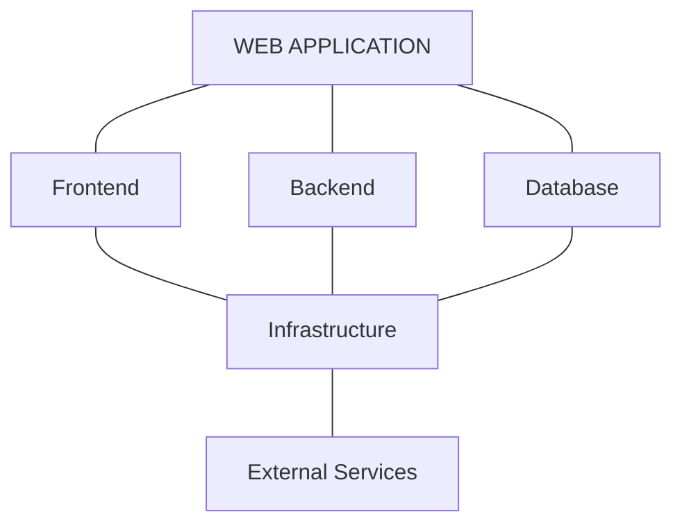

This is a logical view. It describes responsibilities, not necessarily separate physical machines.

Let's examine each component.

### 2.1 Frontend — The User Interface

The frontend is the part of the application that users interact with.

It commonly runs inside a web browser.

Its responsibilities include:

* Displaying pages, forms, images, and interactive elements.
* Collecting user input.
* Responding to clicks, typing, and other interactions.
* Sending requests to backend services.
* Displaying the results returned by the server.

Common technologies include HTML, CSS, JavaScript, React, and Next.js.

For example, on a product page, the frontend displays the product name, image, price, and Add to Cart button.

When the user clicks that button, the frontend may send a request to the backend to update the shopping cart.

**Important:** The frontend can improve the user experience, but it cannot be trusted to enforce important business rules.

A user can modify browser-side JavaScript or send requests without using the interface at all.

The backend must validate important operations independently.

### 2.2 Backend — The Application's Decision-Making Component

The backend processes requests and implements the application's business logic.

It usually runs on a server or within a managed compute environment.

Its responsibilities include:

* Receiving and validating requests.
* Applying business rules.
* Checking permissions.
* Reading and modifying data.
* Communicating with databases and external services.
* Producing responses.

Imagine a customer placing an order.

The frontend sends the customer's selected products and quantities.

The backend must verify that the products exist, check prices, validate the order, and apply the relevant business rules.

It must not blindly accept a total price supplied by the browser.

The backend may be built with PHP, Node.js, Python, Java, Go, or other technologies.

The language does not define the architecture. The responsibilities and interactions do.

### 2.3 Database — The Persistent Data Store

A database stores information that the application needs to retain.

Examples include:

* User accounts.
* Product details.
* Inventory.
* Orders and payment records.
* Application configuration.

Consider an e-commerce application.

When a customer opens a product page, the backend may retrieve the product's current price and availability from a database.

When the customer places an order, the backend may write a new order record.

The database is responsible for storing and retrieving data according to its supported operations and guarantees.

The backend decides what data to request and which business operations to perform.

**The database should not normally be exposed directly to the public browser.**

Requests should pass through an appropriately secured backend or data-access service.

This allows the application to enforce permissions, validate operations, and protect sensitive information.

### 2.4 Infrastructure — The Environment That Runs the Application

Infrastructure provides the resources and networking required to run the application.

It can include:

* Virtual machines and physical servers.
* Containers and serverless compute.
* Networks, firewalls, and load balancers.
* Storage and database infrastructure.
* Monitoring, logging, and deployment systems.

For example, an application might run on cloud virtual machines behind a load balancer, with a managed database and an object storage service.

Infrastructure is not the same thing as the application's business logic.

It provides the environment in which the application operates.

Infrastructure design becomes especially important when an application needs to handle more traffic, survive failures, or meet security and availability requirements.

### 2.5 External Services — Capabilities Provided by Other Systems

Many applications depend on systems they do not operate themselves.

Examples include:

* Payment gateways.
* Email delivery providers.
* SMS services.
* Maps and geolocation APIs.
* Identity providers.

Suppose a customer checks out.

The backend may communicate with a payment provider to initiate a payment.

The provider processes the request and returns a result.

The application then uses that result to determine the next step in the order workflow.

An external service is a dependency. It has its own infrastructure, availability, latency, and failure behavior.

That means the application must account for what happens when the external service is slow or unavailable.

---

## 3. How the Components Fit Together

Here is a simplified architecture of a typical web application.

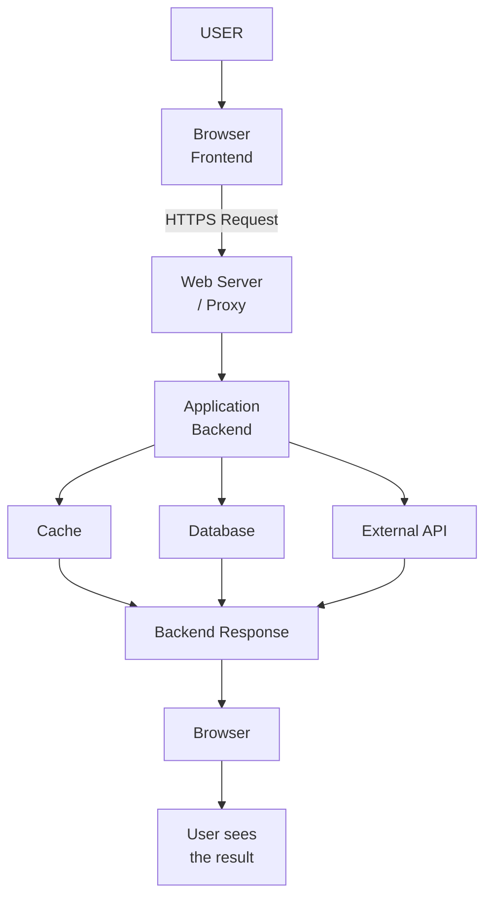

The diagram represents a common pattern, not a mandatory architecture.

A small application might not use a separate cache or reverse proxy.

A larger application might have multiple backend services, database replicas, queues, and other components.

The purpose of the diagram is to identify responsibilities and communication paths.

---

## 4. Follow a Real Request

Let's trace what happens when a customer opens a product page.

Assume the customer enters:

`https://shop.example.com/products/42`

### Step 1 — The browser prepares to connect

The browser interprets the URL and determines which server it needs to contact.

It may use DNS to resolve the hostname, establish a network connection, and negotiate HTTPS using TLS.

DNS, networking, HTTP, and TLS were covered in Level 0.

The important point here is that the browser must establish communication with the appropriate destination before it can exchange application data.

### Step 2 — The request reaches the web server

The browser sends an HTTP request.

A simplified example:

```http
GET /products/42 HTTP/1.1
Host: shop.example.com
Accept: text/html
```

A web server or reverse proxy receives the request.

Depending on the deployment, it may serve a static file, forward the request to an application server, or perform other routing operations.

### Step 3 — The backend processes the request

The application backend identifies the requested resource.

It may determine that the customer wants product number 42.

The backend applies the relevant application logic and decides what information is needed.

For example:

```text
Request: GET /products/42

Backend:
  1. Identify product ID 42.
  2. Check whether the product is available.
  3. Retrieve the product information.
  4. Prepare the response.
```

The exact steps depend on the application.

### Step 4 — The backend retrieves data

The backend may query a database.

For example:

```sql
SELECT id, name, price, stock
FROM products
WHERE id = 42;
```

The database returns the matching record, if one exists.

The backend may also use a cache to avoid repeatedly querying the database for frequently requested information.

A cache is not always present. It is introduced when its benefits justify its complexity and operational cost.

### Step 5 — The application creates a response

The backend uses the retrieved information to prepare a response.

Depending on the application's rendering approach, the response might contain:

* Complete HTML for the page.
* JSON data for the frontend to display.
* A redirect or an error response.

For example, an API response might look like:

```json
{
  "id": 42,
  "name": "Wireless Keyboard",
  "price": 1499,
  "inStock": true
}
```

This is illustrative JSON, not a complete API specification.

### Step 6 — The browser displays the result

The browser receives the response.

If it receives HTML, it can render the document.

If it receives JSON, frontend JavaScript can use the data to update the page.

The customer sees the product details.

The complete journey can be summarized as:

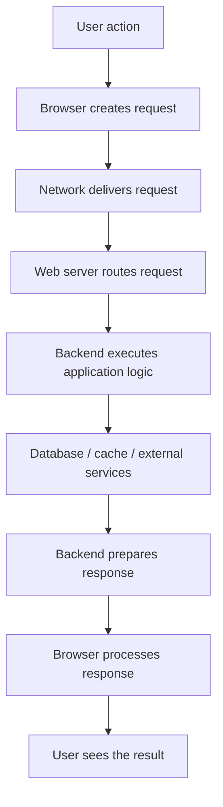

**System design connection:** Every step introduces work, dependencies, and potential delays. Understanding this journey helps us identify where performance problems and failures can occur.

---

## 5. Static and Dynamic Content

Not every request needs to execute backend business logic.

Web applications commonly deliver both static and dynamic content.

### Static content

Static content is delivered as stored files without requiring the application to calculate new business data for every request.

Examples:

* CSS files.
* JavaScript bundles.
* Logos and icons.
* Product images.
* Pre-generated HTML pages.

A web server or CDN can often deliver these files directly.

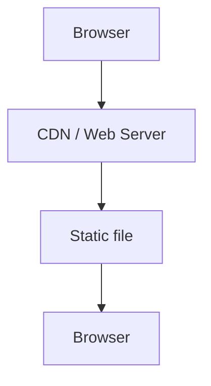

This can reduce backend workload and improve response times.

Static does not mean that the file can never change. It means the content is served as a file rather than dynamically generated for each request.

### Dynamic content

Dynamic content depends on data, user input, application logic, or current system state.

Examples:

* A customer's order history.
* The current stock of a product.
* A shopping cart.
* A payment status.

A simplified dynamic request:

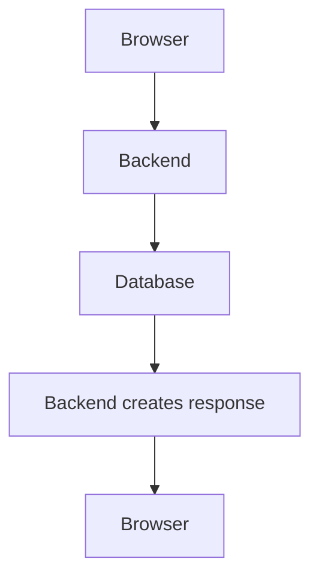

Many web applications combine static and dynamic delivery.

For example, a product page may use static CSS and JavaScript files while obtaining product availability from a backend API.

This distinction matters because static files can often be cached and distributed more easily than personalized or frequently changing data.

---

## 6. How Does the Browser Get the Page?

There are several ways an application can prepare the interface.

For this chapter, we only need the basic distinctions.

### Client-Side Rendering (CSR)

In client-side rendering, the browser downloads JavaScript that builds or updates the interface.

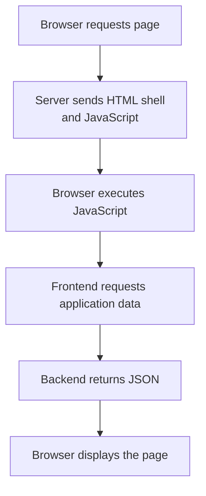

The browser performs much of the interface rendering.

This approach can support rich interactions, but it also means the browser may need to download and execute JavaScript and make additional requests before the page becomes fully useful.

### Server-Side Rendering (SSR)

In server-side rendering, a server generates HTML for the requested page.

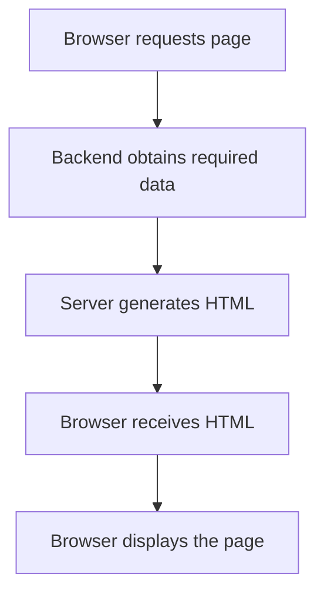

SSR can provide useful HTML earlier in the page lifecycle, but generating HTML on the server consumes server resources.

The actual performance depends on the implementation, caching, data access, and rendering workload.

### Static Site Generation (SSG)

In static site generation, HTML is generated ahead of time, usually during a build process.

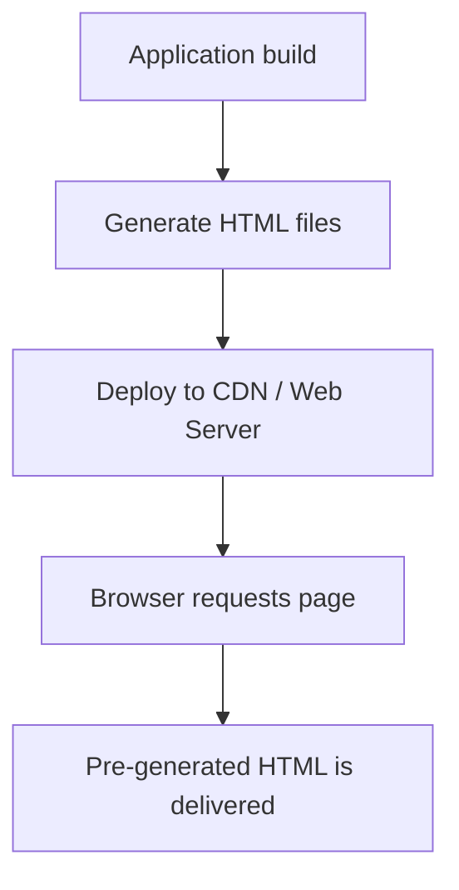

SSG works well for content that does not need to be regenerated for every visitor.

Content updates generally require a rebuild or an appropriate regeneration mechanism.

### Comparison

| Approach | Where HTML is generated        | Typical consideration                            |
| -------- | ------------------------------ | ------------------------------------------------ |
| CSR      | Primarily in the browser       | Client JavaScript workload and data requests     |
| SSR      | On the server during a request | Server rendering workload and data-fetch latency |
| SSG      | Ahead of time                  | Build and content-update strategy                |

These approaches are not mutually exclusive.

Modern applications can combine them on different pages or even within the same page.

**System design connection:** Rendering is an architectural decision. It affects where computation happens, how much data travels over the network, what can be cached, and which resources become bottlenecks.

---

## 7. What Is an API's Role?

An API defines how one component requests functionality or data from another component.

For example, a frontend might communicate with a backend through HTTP endpoints.

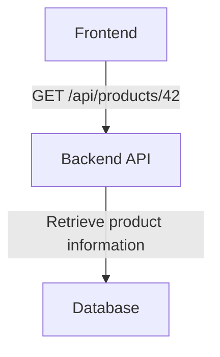

The frontend does not need to know how the backend stores the product.

It only needs to understand the API contract: the endpoint, the request format, and the response format.

This separation allows the backend to change its internal implementation without necessarily changing the frontend, as long as the API contract remains compatible.

An API can also connect systems beyond the browser and backend.

For example:

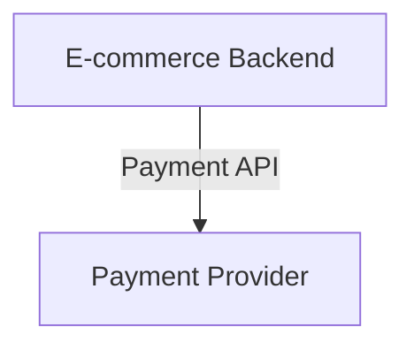

The backend sends a request to the payment provider and processes the response.

APIs therefore act as boundaries between components.

A well-defined boundary helps teams change, test, and operate components independently.

Detailed API design and REST will be covered in Chapters 01.05 and 01.06.

---

## 8. Logical Architecture vs Physical Deployment

This is one of the most important distinctions in system design.

A diagram may show a web server, an application server, and a database as three separate boxes.

That does not mean they must run on three separate machines.

### Logical architecture

Logical architecture describes the responsibilities and relationships of components.

For example:

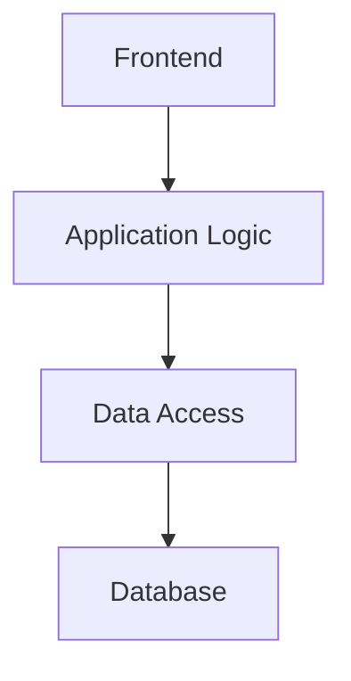

These are logical responsibilities.

### Physical deployment

Physical deployment describes where those responsibilities actually run.

A small application might use a single virtual machine:

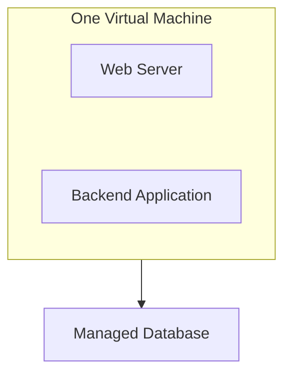

A larger deployment might separate the components:

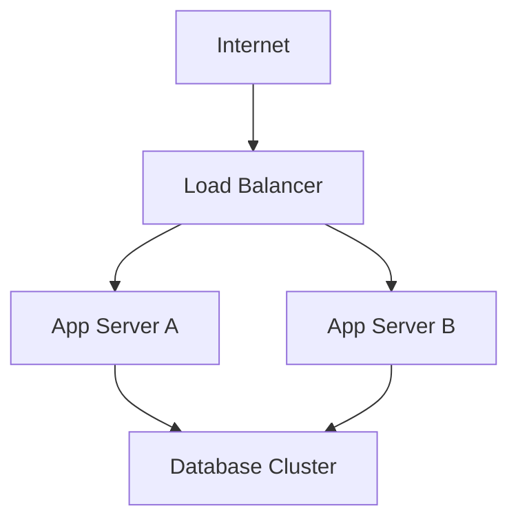

Both deployments can implement similar logical application responsibilities.

The difference lies in how the components are deployed and operated.

Separating components onto different machines may improve independent scaling or isolation, but it also introduces network communication, operational overhead, and additional failure modes.

**Key principle:** A component is a responsibility. A server is a place where software runs. They are not the same thing.

---

## 9. Example: An E-Commerce Application

Let's apply these ideas to a small online shopping system.

### Feature A — Browse Products

The customer opens a product listing.

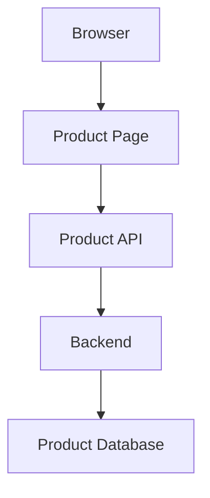

The backend retrieves product information and returns it to the frontend.

Product images and other static assets might be delivered through a CDN.

### Feature B — Log In

The customer submits a username and password.

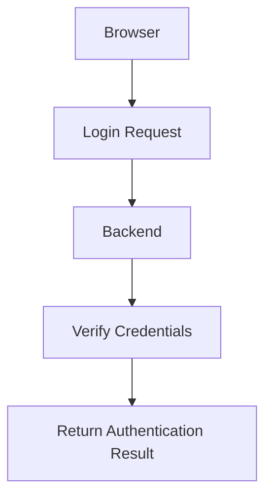

The backend verifies the credentials and establishes an appropriate authenticated state.

The browser must not decide for itself that a user is authenticated merely because a JavaScript variable says so.

Authentication and session handling are covered later in Level 1.

### Feature C — Place an Order

The customer clicks Place Order.

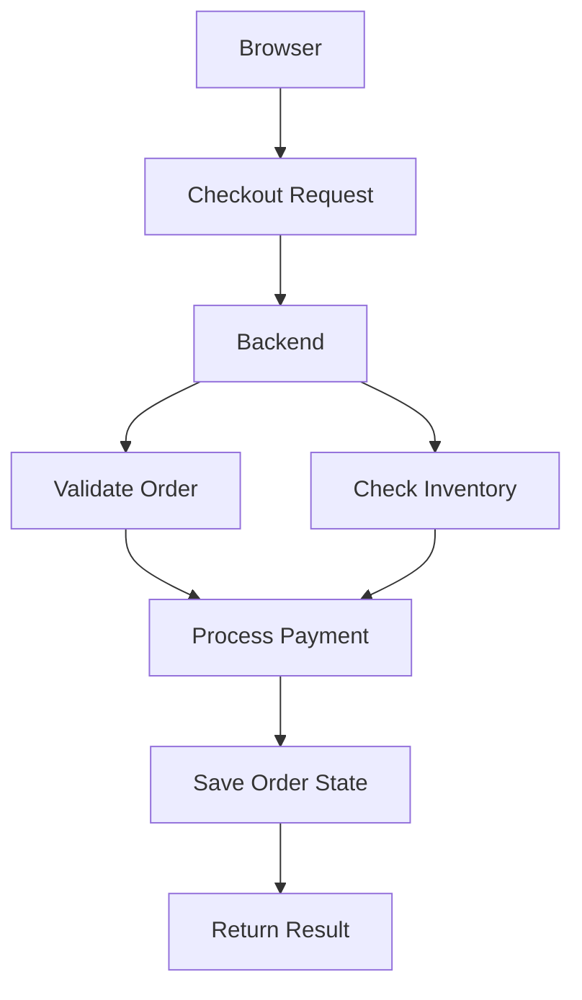

This is a conceptual flow, not a complete payment implementation.

A production checkout needs careful handling of payment confirmations, duplicate requests, inventory changes, and partial failures.

For example, a payment provider might accept a payment while the application's connection times out before the backend receives the response.

The application must not assume that a timeout means the payment failed.

This is why real-world system design must consider not only the normal request path but also failure scenarios and recovery.

Those topics will be explored in the scaling, asynchronous systems, distributed systems, and reliability levels.

---

## 10. Common Architectural Mistakes

| Mistake                                                         | Why it causes problems                                                                    |
| --------------------------------------------------------------- | ----------------------------------------------------------------------------------------- |
| Treating the frontend as the entire application                 | Ignores backend processing, data storage, and infrastructure dependencies.                |
| Trusting client-side validation alone                           | Users can modify requests or bypass browser-side checks.                                  |
| Connecting the public browser directly to a private database    | Exposes sensitive access and makes business-rule enforcement difficult.                   |
| Putting every responsibility into one giant backend module      | Makes changes, testing, and maintenance harder as complexity grows.                       |
| Assuming every component requires a separate server             | Can introduce unnecessary deployment and operational complexity.                          |
| Ignoring external services                                      | Misses latency, availability, and failure dependencies outside the application's control. |
| Assuming a successful HTTP response guarantees business success | A response may represent only one step in a larger workflow.                              |

A good architecture makes responsibilities clear without adding unnecessary components.

A small application does not need the same infrastructure as a global e-commerce platform.

The architecture should evolve as actual requirements and constraints change.

---

## 11. How to Analyze Any Web Application

When examining an unfamiliar web application, ask these questions in order.

### Understand the request

1. What action is the user performing?
2. Which frontend component initiates the request?
3. What endpoint or service receives it?

### Understand the processing

4. Which backend component applies the business logic?
5. What data or external services does it depend on?
6. Where are permissions and validation enforced?

### Understand the response

7. What does the backend return?
8. How does the browser display or use the response?
9. What happens if a dependency is slow, unavailable, or returns an error?

### Understand the deployment

10. Where do the components run?
11. Which components can scale independently?
12. Which components share resources or failure domains?

These questions turn a collection of technologies into an understandable system.

They also establish the foundation for later architectural decisions about scaling, caching, service boundaries, reliability, and security.

---

## Key Principle

**A web application is a system of cooperating components, not just a website or a collection of code files.**

Understand what each component is responsible for, how requests move between them, and which dependencies are required to deliver a successful user action.

Start with the simplest architecture that satisfies the requirements. Add complexity only when a real constraint or operational need justifies it.

---

## Quick Reference

| Component                  | Primary responsibility                                  |
| -------------------------- | ------------------------------------------------------- |
| Frontend                   | User interaction and presentation                       |
| Backend                    | Business logic and request processing                   |
| Database                   | Persistent data storage and retrieval                   |
| Web server / reverse proxy | HTTP handling, routing, and forwarding                  |
| Cache                      | Reducing repeated work and data-access latency          |
| CDN                        | Distributing content closer to users                    |
| External service           | Providing capabilities outside the application          |
| Infrastructure             | Running, connecting, securing, and operating components |
| API                        | Defining a communication contract between components    |

### Request lifecycle reminder

```text
Browser
  → Network
  → Web Server / Proxy
  → Backend
  → Cache / Database / External Services
  → Backend Response
  → Browser
  → User
```

Not every request follows every step. Static files may bypass the backend, and some backend operations may not require a database query.

---

## Knowledge Check

Try answering these questions without looking back at the chapter.

1. What is the difference between the frontend and the backend?
2. Why should the backend validate an order's price instead of trusting the browser?
3. What is the difference between static and dynamic content?
4. How do CSR, SSR, and SSG differ in where HTML is generated?
5. Does a three-component logical architecture require three physical machines?
6. Why is an external payment provider considered a system dependency?
7. What might happen if the database is unavailable while the backend is processing a request?

### Answers

1. The frontend handles user interaction and presentation. The backend processes requests and enforces application logic.
2. Browser-side data can be modified or bypassed. The backend must apply authoritative business rules.
3. Static content is served as stored content; dynamic content depends on application logic, data, or current state.
4. CSR builds much of the interface in the browser, SSR generates HTML on the server during a request, and SSG generates HTML ahead of time.
5. No. Logical components describe responsibilities; physical deployment describes where they run.
6. The application relies on that provider to complete part of its workflow, and the provider has its own latency and failure behavior.
7. The backend may fail to complete the request, return an appropriate error, or use another explicitly designed fallback if one exists.
