# 01.02 — Web Server

## Learning Objectives

By the end of this chapter, you will be able to:

* Explain what a web server is and why web applications need one.
* Understand how a web server handles incoming HTTP requests.
* Distinguish a web server from an application server.
* Understand static file delivery, request routing, and reverse proxying.
* Explain how Nginx and Apache fit into a web application's architecture.
* Identify common web server bottlenecks and failure scenarios.

---

## 1. What Is a Web Server?

Imagine you have built a website using HTML, CSS, and JavaScript.

You have created the files:

```text
my-website/
├── index.html
├── style.css
├── app.js
└── images/
    └── logo.png
```

These files exist on your computer.

But how can someone sitting in another city access them through a browser?

You need a way to receive HTTP requests over a network and deliver the appropriate resources.

That is one of the primary responsibilities of a web server.

**A web server is software that accepts HTTP requests and returns HTTP responses.**

It commonly listens for incoming connections on a network port and processes requests addressed to it.

A web server can deliver static files, return responses, and forward requests to other application components.

Two widely used web server software products are:

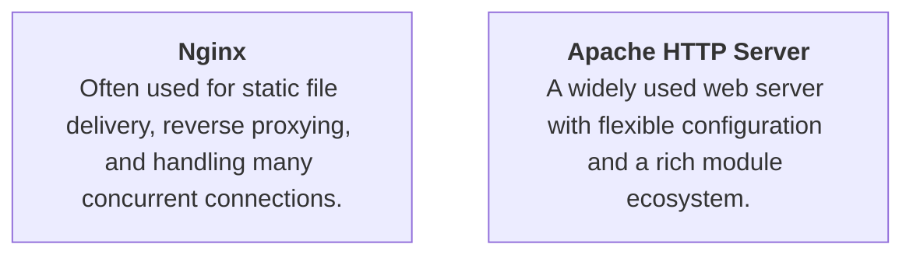

Both can serve static content and act as a front-facing component for web applications.

A web server is not necessarily a physical machine. It is software running on a machine or within an environment.

---

## 2. Where Does the Web Server Fit?

Recall the anatomy of a web application.

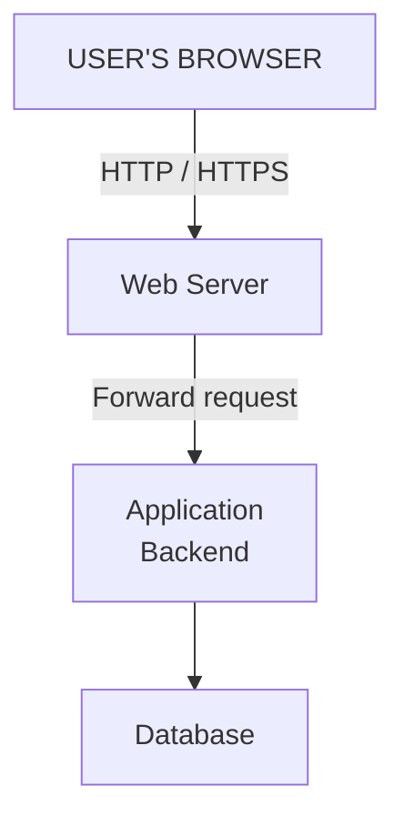

The web server is commonly the first application component that handles a request after the network connection reaches the server infrastructure.

It acts as an entry point into the application.

However, not every request must reach the backend.

For example, a CSS file might be served directly by the web server, while a checkout request might be forwarded to the backend.

This distinction helps avoid unnecessary application processing.

---

## 3. How a Web Server Handles a Request

Let's follow a simple example.

A user opens:

`https://example.com/about.html`

Assume DNS resolution and the HTTPS connection have already been established.

### Step 1 — The browser sends an HTTP request

```http
GET /about.html HTTP/1.1
Host: example.com
Accept: text/html
```

The browser asks the server for the resource at `/about.html`.

The request contains information such as the HTTP method, requested path, and headers.

### Step 2 — The web server receives the request

The web server accepts the connection and interprets the HTTP request.

It uses its configuration to determine how the request should be handled.

For example, it may:

* Serve a file from a configured directory.
* Forward the request to an application backend.
* Redirect the request to another URL.
* Reject the request because of access rules.
* Return an error if the requested resource is unavailable.

### Step 3 — The web server locates the resource

Suppose the web server is configured to use this document root:

```text
/var/www/example.com/
```

The requested path `/about.html` corresponds to a file within that directory:

```text
/var/www/example.com/about.html
```

The web server reads the file, assuming the request is permitted and the file exists.

The mapping between URLs and filesystem paths depends on server configuration. A URL path is not automatically a direct filesystem path.

### Step 4 — The web server sends the response

The server returns an HTTP response.

```http
HTTP/1.1 200 OK
Content-Type: text/html

<h1>About Us</h1>
<p>Welcome to our website.</p>
```

The browser receives the HTML and renders the page.

The complete flow:

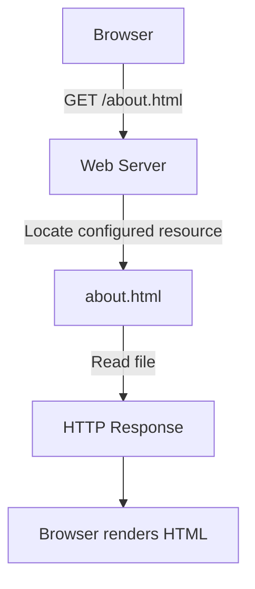

The backend does not need to execute business logic for this simple static request.

That can save application processing resources.

---

## 4. Static File Delivery

A static file is a resource that the server can deliver without generating new application-specific content for each request.

Examples:

* HTML documents.
* CSS stylesheets.
* JavaScript bundles.
* Images and fonts.
* Downloadable documents.

Imagine a website receives 1,000 requests for its logo.

If the logo is a static file, the web server or CDN can deliver the same file repeatedly without running the application's business logic for every request.

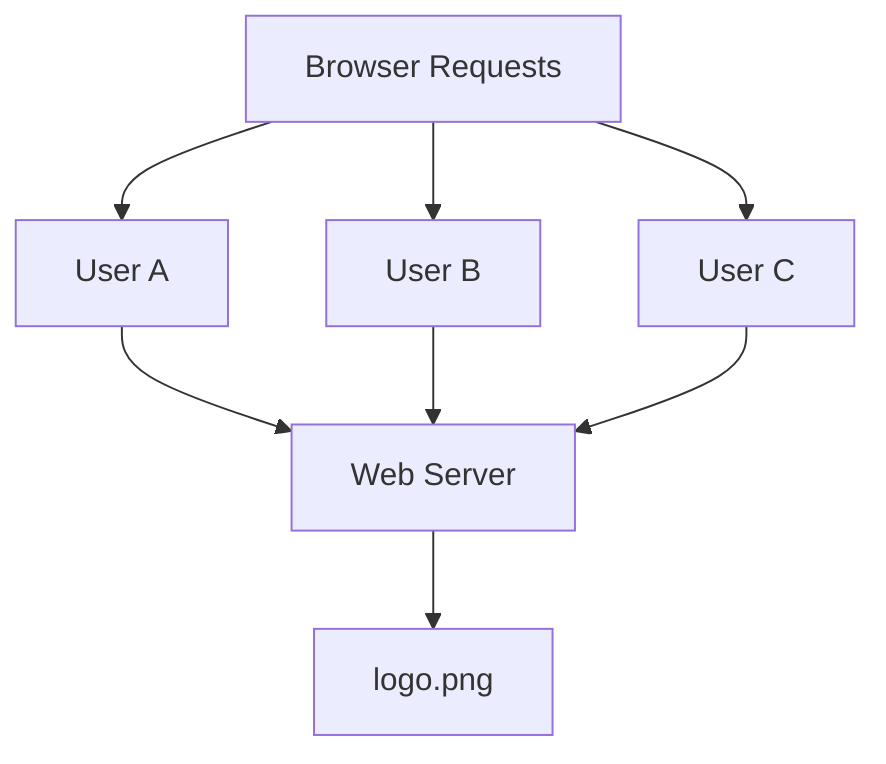

This is one reason web servers and CDNs are useful for performance.

They can serve suitable content without requiring the backend to perform unnecessary work.

### Static does not mean permanent

A file can change when a developer deploys a new version.

Static simply describes how the content is delivered, not whether the content can ever be updated.

### MIME types

A web server also needs to identify the type of content being returned.

For example:

| File    | Typical Content-Type |
| ------- | -------------------- |
| `.html` | `text/html`          |
| `.css`  | `text/css`           |
| `.js`   | `text/javascript`    |
| `.png`  | `image/png`          |
| `.json` | `application/json`   |

The browser uses the response headers to interpret the returned content appropriately.

Incorrect content types can cause resources to be interpreted incorrectly or rejected by browser security mechanisms.

---

## 5. Web Server vs Application Server

This is a common source of confusion.

A web server and an application server may both participate in handling HTTP requests, but their responsibilities are different conceptually.

| Web Server                                    | Application Server                                                           |
| --------------------------------------------- | ---------------------------------------------------------------------------- |
| Handles incoming HTTP requests and responses. | Executes application code and business logic.                                |
| Often serves static files directly.           | Processes operations such as login, checkout, and order creation.            |
| Can route or proxy requests.                  | Can access databases and external services.                                  |
| Examples: Nginx, Apache HTTP Server.          | Examples: PHP-FPM, Node.js application processes, Java application runtimes. |

The distinction is about responsibilities, not an absolute rule about software products.

A single software platform can perform both web-serving and application-processing roles.

For example, Node.js can serve HTTP requests and execute application logic within the same process.

Similarly, Apache can serve static files and execute application code through integrations.

### Example: PHP application

Consider a PHP-based website.

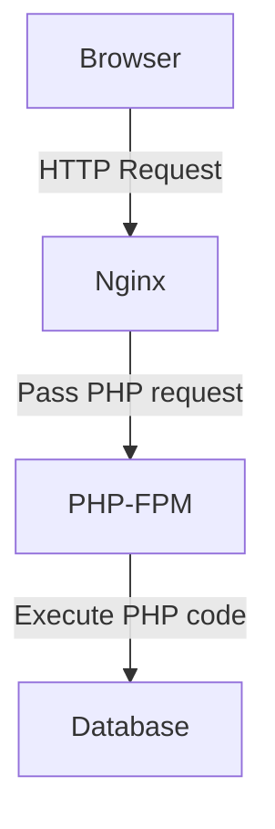

Nginx receives the request.

If the request is for a PHP page, Nginx can forward it to PHP-FPM.

PHP-FPM manages PHP worker processes that execute the PHP application.

The PHP application may query the database and generate HTML.

Nginx then returns the response to the browser.

**Remember:** PHP-FPM is a PHP process manager and FastCGI application runtime, not itself a traditional general-purpose web server.

### Example: Node.js application

A Node.js application can directly listen for HTTP requests.

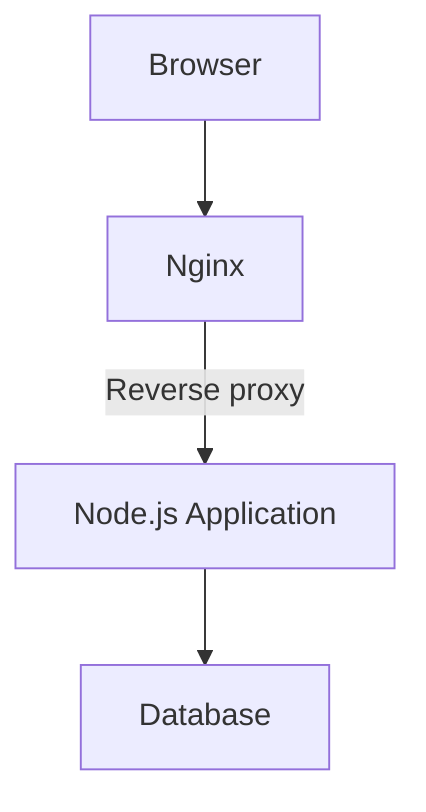

Here, Nginx handles the public-facing connection and forwards application requests to Node.js.

The Node.js process executes the backend logic.

This separation can be useful, but it is not mandatory for every application.

---

## 6. What Is a Reverse Proxy?

A reverse proxy is a server-side component that receives requests on behalf of one or more backend servers and forwards them to the appropriate destination.

The client communicates with the reverse proxy rather than directly with the backend.

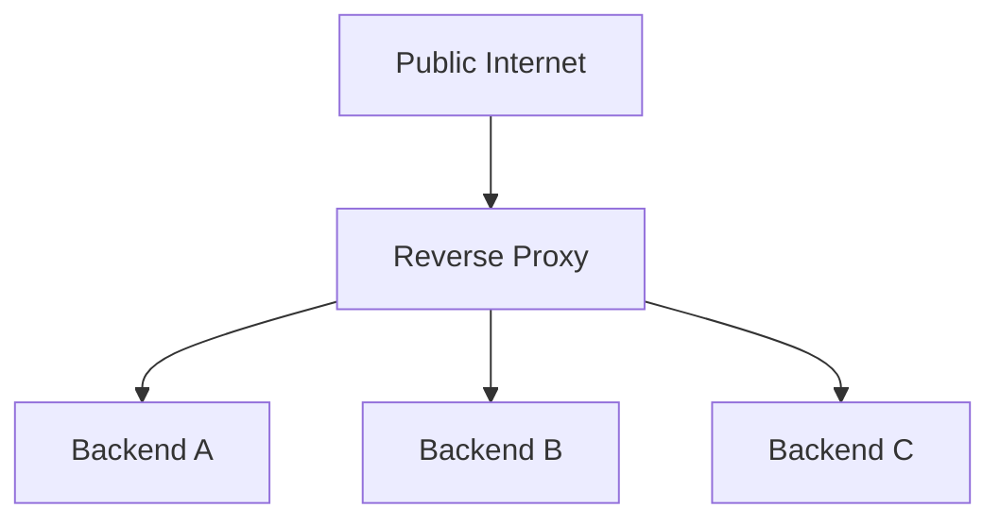

Nginx and Apache can both operate as reverse proxies.

### Why use a reverse proxy?

A reverse proxy can provide several useful capabilities.

#### 1. Hide backend details

The browser communicates with the public-facing endpoint.

The backend's internal address and deployment details do not need to be exposed to the public client.

This is not a substitute for proper authentication, authorization, or network security.

#### 2. Route requests

Different URL paths can be sent to different backend applications.

For example:

```text
/api/products/*  → Product Backend
/api/orders/*    → Order Backend
/images/*        → Static File Server
```

This can be useful when an application has multiple backend components.

#### 3. Handle TLS connections

A reverse proxy can terminate an HTTPS connection, process the encrypted traffic, and forward the request to a backend over a separately configured connection.

This is commonly called TLS termination.

The security of the internal connection still matters. Traffic between the proxy and backend may also require encryption and authentication, depending on the deployment and threat model.

#### 4. Centralize certain controls

A reverse proxy may help apply request-size limits, routing policies, connection limits, and other controls.

However, authentication and business authorization must still be enforced appropriately by the application or a trusted security layer.

---

## 7. Reverse Proxy vs Forward Proxy

The names sound similar, but the direction of representation differs.

### Forward proxy

A forward proxy acts on behalf of clients.

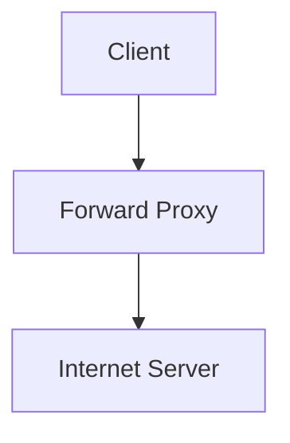

A company might use a forward proxy to control or monitor employees' outbound web access.

The destination server communicates with the proxy as the connecting client.

### Reverse proxy

A reverse proxy acts on behalf of servers.

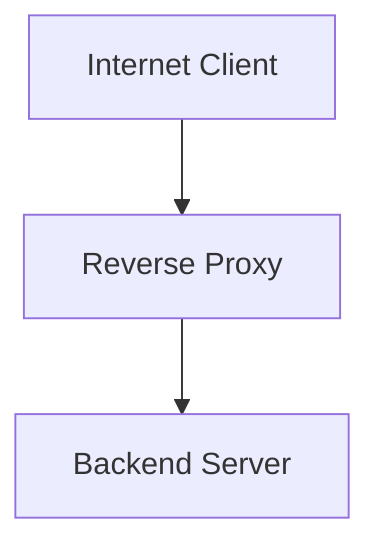

The reverse proxy receives requests for the application and forwards them to backend servers.

| Forward Proxy                                         | Reverse Proxy                                                        |
| ----------------------------------------------------- | -------------------------------------------------------------------- |
| Represents clients.                                   | Represents servers.                                                  |
| Usually controls or mediates outbound client traffic. | Usually receives inbound application traffic.                        |
| The client is configured to use it.                   | The application operator configures it in front of backend services. |

A reverse proxy is a common component in web application architecture.

---

## 8. Virtual Hosts and Multiple Websites

A single web server can serve multiple websites.

For example:

```text
example.com
shop.example.com
learn.example.com
```

All three hostnames may resolve to the same public IP address.

How does the server know which website the browser wants?

HTTP requests include a hostname, commonly through the `Host` header in HTTP/1.1. HTTPS also uses TLS mechanisms such as SNI to help select the appropriate TLS configuration.

The web server can use this information to select a matching virtual host or server configuration.

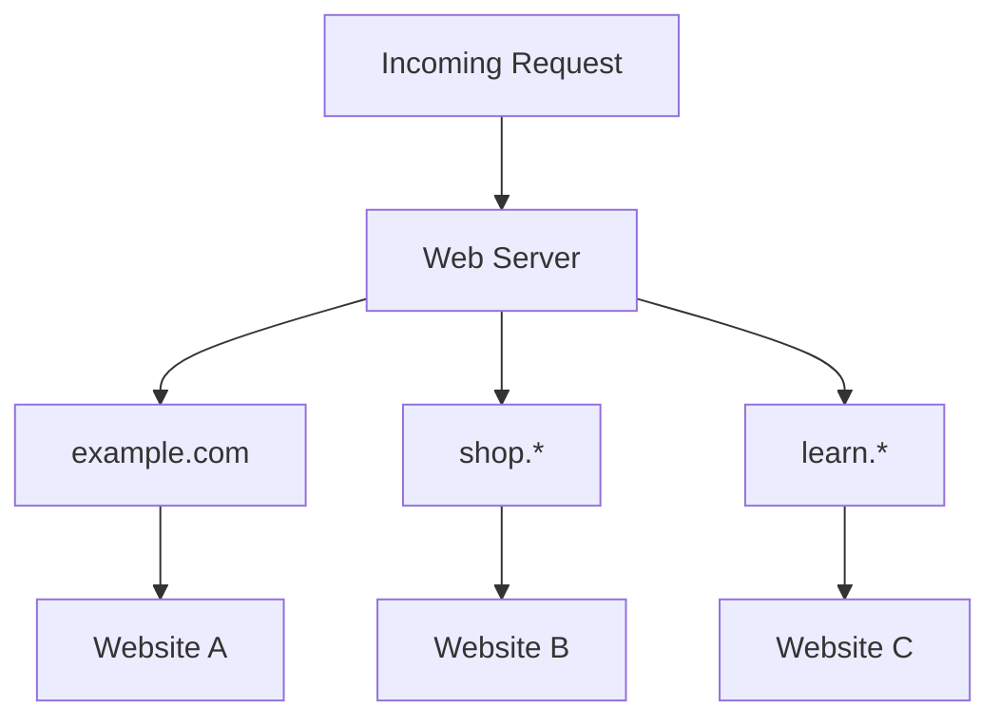

This allows multiple sites to share the same web server software and potentially the same machine.

Virtual hosting is one reason a dedicated physical server is not required for every website.

---

## 9. Web Server and Load Balancer

A reverse proxy can also distribute requests among multiple backend instances.

Suppose a web application runs on three backend servers.

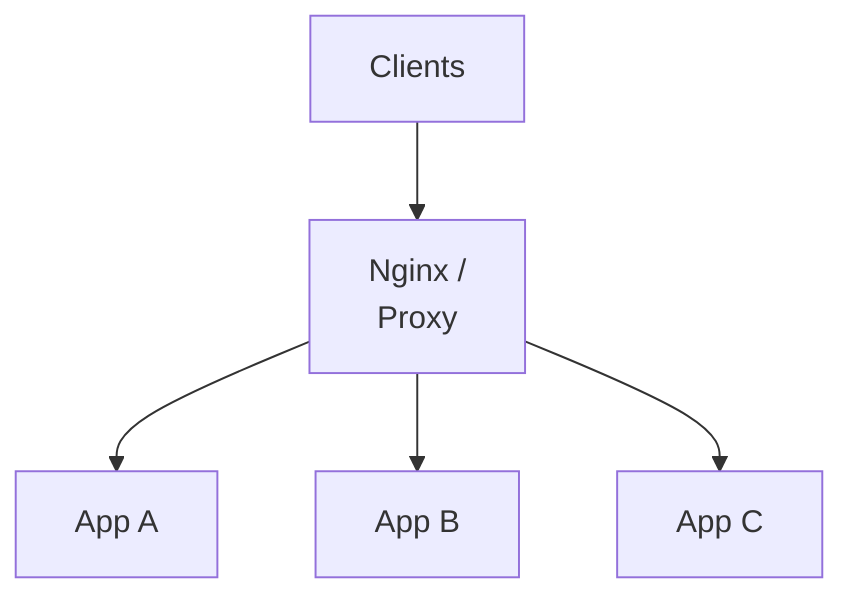

The proxy can forward requests to different backend instances according to its routing and balancing configuration.

This can help distribute workload and make use of multiple application instances.

However, the proxy itself becomes an important component to operate and monitor.

If it is deployed as a single instance without redundancy, its failure may prevent clients from reaching otherwise healthy backends.

Dedicated load balancing, health checks, failover, and horizontal scaling are covered in Level 2.

For now, remember that reverse proxying and load balancing are related capabilities, but they are not identical concepts.

---

## 10. Common Web Server Errors

Web servers frequently return HTTP error responses when a request cannot be completed.

| Status                    | Meaning                                                     | Example                                                     |
| ------------------------- | ----------------------------------------------------------- | ----------------------------------------------------------- |
| `200 OK`                  | Request succeeded.                                          | Static HTML file returned.                                  |
| `301 Moved Permanently`   | Permanent redirect.                                         | HTTP redirected to HTTPS.                                   |
| `403 Forbidden`           | Access is not permitted.                                    | File access denied by configuration.                        |
| `404 Not Found`           | Resource not found.                                         | Requested file or route does not exist.                     |
| `413 Content Too Large`   | Request body exceeds an allowed limit.                      | Upload exceeds configured request limit.                    |
| `502 Bad Gateway`         | Proxy received an invalid response from an upstream server. | Backend connection or response problem.                     |
| `503 Service Unavailable` | Service cannot currently handle the request.                | Application unavailable or deliberately marked unavailable. |
| `504 Gateway Timeout`     | Proxy did not receive a timely upstream response.           | Backend processing took too long.                           |

The exact status code depends on the server configuration and the nature of the failure.

For example, a `502` response does not automatically mean the database is down. The problem could be a backend crash, a connection issue, or an invalid upstream response.

Similarly, a `504` does not prove that a database query is slow. The backend may be waiting on another service or experiencing resource contention.

Correct diagnosis requires observing the complete request path.

---

## 11. Common Web Server Bottlenecks

A web server is itself a system component with finite resources.

It can become a bottleneck when its workload exceeds its capacity or when it is blocked by downstream dependencies.

### Connection and worker limits

Web server configurations impose limits on connections, workers, or other resources.

If all available request-processing capacity is occupied, new requests may wait or fail.

### Slow clients

Clients that send data slowly or read responses slowly can consume connection-related resources for longer periods.

Appropriate timeouts and connection-management settings help limit the impact.

### Large uploads

Large request bodies consume network bandwidth, processing time, and potentially memory or disk resources.

Upload size limits and suitable streaming strategies help manage this workload.

### Slow upstream applications

A web server forwarding requests to a backend may spend time waiting for the backend response.

If many requests are waiting simultaneously, connection and worker resources may become constrained.

### Incorrect caching

Serving stale or inappropriate cached content can produce incorrect results.

Not all responses are safe to cache, particularly personalized or sensitive content.

Cache policy must reflect the application's data and security requirements.

**System design lesson:** Increasing the number of web server workers does not necessarily fix a slow backend. It may simply allow more requests to wait on the same bottleneck.

---

## 12. Production Considerations

Before deploying a web server for a real application, consider the following.

| Area          | Questions to ask                                                                             |
| ------------- | -------------------------------------------------------------------------------------------- |
| Security      | Are private files protected? Are directory listings and unnecessary server details disabled? |
| TLS           | Are certificates valid and renewed? Is the HTTPS configuration appropriate?                  |
| Routing       | Are requests forwarded to the intended backend?                                              |
| Limits        | Are request sizes, connections, and timeouts configured appropriately?                       |
| Availability  | Can the application remain reachable if a web server instance fails?                         |
| Observability | Are access logs, error logs, and relevant metrics available?                                 |
| Deployment    | Can configuration changes be tested and rolled back safely?                                  |
| Caching       | Are static assets cached appropriately without exposing private content?                     |

Security configuration must be considered alongside application security.

A web server can restrict access to resources and enforce some request-level controls, but it cannot replace correct application authorization and data-access rules.

---

## Key Principle

**A web server is the entry point that handles HTTP traffic, serves suitable resources, and routes other requests to the components responsible for processing them.**

It does not have to execute every business operation itself.

A well-designed application uses the web server to handle its responsibilities efficiently while keeping application logic, data access, and infrastructure concerns appropriately separated.

Start simple. Add reverse proxies, additional instances, and more advanced routing when the application's requirements justify them.

---

## Quick Reference

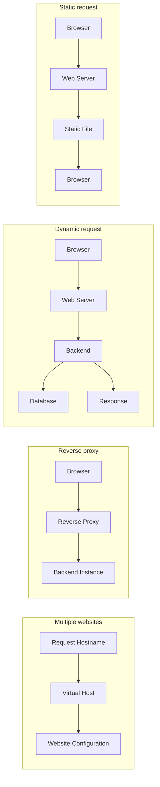

| Term             | Simple explanation                                                      |
| ---------------- | ----------------------------------------------------------------------- |
| Web server       | Receives HTTP requests and returns responses.                           |
| Document root    | Configured directory from which a server may serve files.               |
| Reverse proxy    | Receives requests on behalf of backend servers.                         |
| Forward proxy    | Mediates requests on behalf of clients.                                 |
| Virtual host     | Configuration that lets a server handle multiple websites.              |
| Upstream server  | Backend destination to which a proxy forwards requests.                 |
| TLS termination  | Decrypting and processing an HTTPS connection at a designated endpoint. |
| Upstream timeout | Time limit for waiting on a backend or upstream operation.              |

---

## Knowledge Check

1. What is the primary responsibility of a web server?
2. Why can a web server deliver a CSS file without executing the backend application?
3. How does a PHP application commonly use Nginx and PHP-FPM together?
4. What is the difference between a reverse proxy and a forward proxy?
5. How can a web server serve multiple websites using the same IP address?
6. Does a `504 Gateway Timeout` prove that the database is unavailable?
7. Why might increasing the number of web server workers fail to solve an overloaded backend?

### Answers

1. It accepts HTTP requests and returns HTTP responses.
2. The CSS file is static content that can be served directly.
3. Nginx receives the request and can forward PHP execution to PHP-FPM, which runs the PHP application code.
4. A forward proxy represents clients; a reverse proxy represents backend servers.
5. The server uses hostname and TLS-related information to select the appropriate virtual host configuration.
6. No. It indicates a timeout waiting for an upstream response; the actual cause must be investigated.
7. More workers may allow more requests to wait on the same overloaded dependency, increasing resource usage without increasing backend capacity.
