# 01.03 — Application Server

## Learning Objectives

By the end of this chapter, you will be able to:

* Explain what an application server does.
* Distinguish an application server from a web server.
* Understand how application code processes a request.
* Explain the role of runtime environments and application processes.
* Understand how application servers communicate with databases and external services.
* Recognize common application-server bottlenecks and failure scenarios.

---

# 1. What Is an Application Server?

A web server is primarily concerned with handling HTTP traffic and delivering or forwarding requests.

But something needs to actually **execute the application's code**.

For example, when a customer clicks:

> **Place Order**

the system may need to:

1. Validate the request.
2. Check the customer's permissions.
3. Check product availability.
4. Calculate the order total.
5. Create an order.
6. Save information in the database.
7. Start payment processing.
8. Return a result.

This is application logic.

> **An application runtime provides the environment required to execute backend application code. The running application process uses that runtime to handle application requests and execute business logic.**
>
> **“Application server” is a broader architectural term whose exact meaning depends on the technology and ecosystem. In system design, prefer precise terms such as web server, runtime, application process, or backend service whenever possible.**

The exact meaning of "application server" varies between technology ecosystems.

In system design, the important idea is not the product name.

The important question is:

> **Where does the backend application code execute?**

---

# Terminology

**“Application server” is overloaded** and can confuse beginners—especially with PHP, Node.js, Java, and modern cloud deployments.

It helps to distinguish **four concepts**:

| Term                    | What it actually means                                                            | Example                                                                 |
| ----------------------- | --------------------------------------------------------------------------------- | ----------------------------------------------------------------------- |
| **Web Server**          | Software that handles HTTP traffic, static files, and/or proxies requests         | Nginx, Apache                                                           |
| **Application Runtime** | The environment that executes application code                                    | PHP runtime, Node.js, Python                                            |
| **Application Process** | A running instance of that application                                            | `node server.js`, PHP worker                                            |
| **Application Server**  | A broader/less precise term for the component/service that runs application logic | Java application server, Node.js server, PHP application behind PHP-FPM |

An **application runtime** and an **application server** are related but not universally synonymous.

For example:

```text
PHP
```

is a programming language/runtime ecosystem.

```text
PHP-FPM
```

is a **FastCGI Process Manager** that manages PHP worker processes.

```text
Node.js
```

is a **JavaScript runtime** that can also provide HTTP-server functionality when the application creates an HTTP server.

```text
Tomcat
```

is commonly described as a **Java servlet container/application server**.

### How the pieces relate

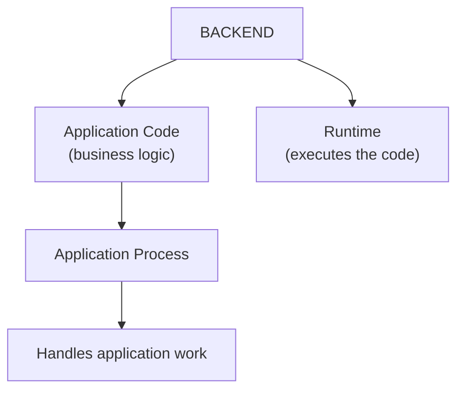

And then:

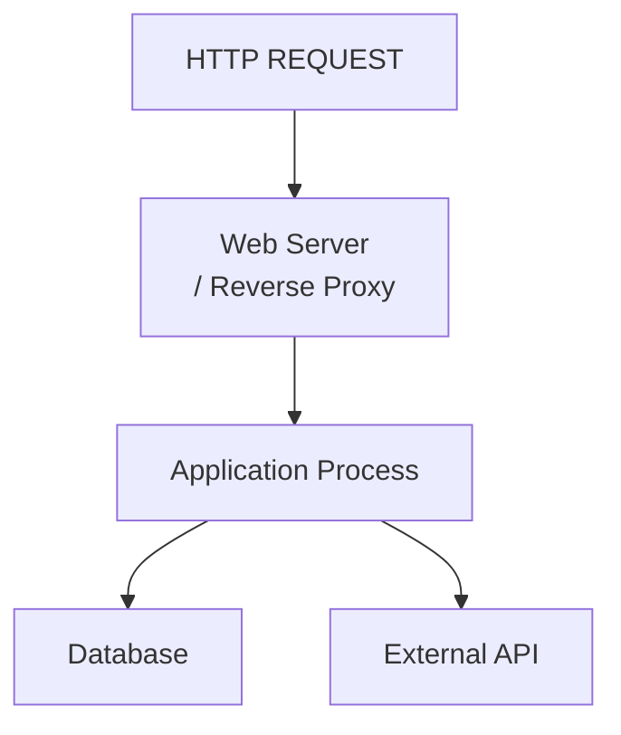

### Why this matters

Suppose we have:

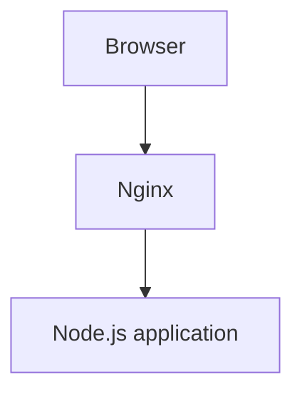

Calling Node.js simply an **“application server”** isn't wrong in everyday architectural discussion, but **Node.js itself is primarily a runtime**, and the running Node.js program is the application process/server.

Likewise:

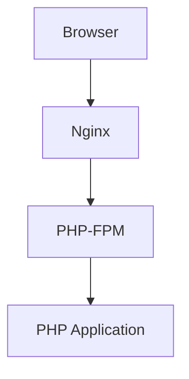

Calling PHP-FPM an “application server” can obscure what it actually does. It manages PHP worker processes and communicates using FastCGI.

---

# 2. Where Does It Fit?

A simplified architecture looks like this:

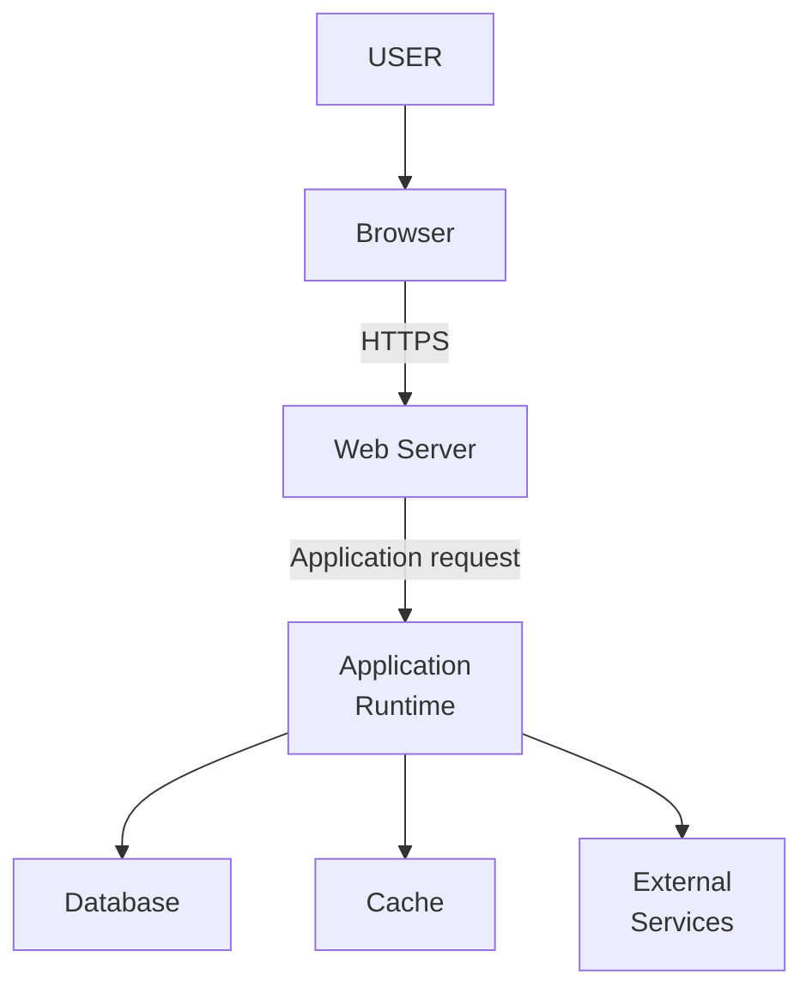

The web server and application runtime can be separate processes.

They can also run on the same machine.

They can even be combined into a single application process.

The architecture depends on the technology and deployment model.

---

# 3. Web Server vs Application Server

This distinction is easier when we focus on responsibility.

| Web Server                          | Application Server / Runtime                                 |
| ----------------------------------- | ------------------------------------------------------------ |
| Handles HTTP traffic.               | Executes application code.                                   |
| Often serves static files.          | Implements business logic.                                   |
| Can route requests.                 | Processes application operations.                            |
| Can act as a reverse proxy.         | Communicates with databases and services.                    |
| Example: Nginx, Apache HTTP Server. | Example: PHP-FPM, Node.js process, Java application runtime. |

Consider this request:

```text
GET /products/42
```

The web server may receive it first.

The application runtime may then execute something like:

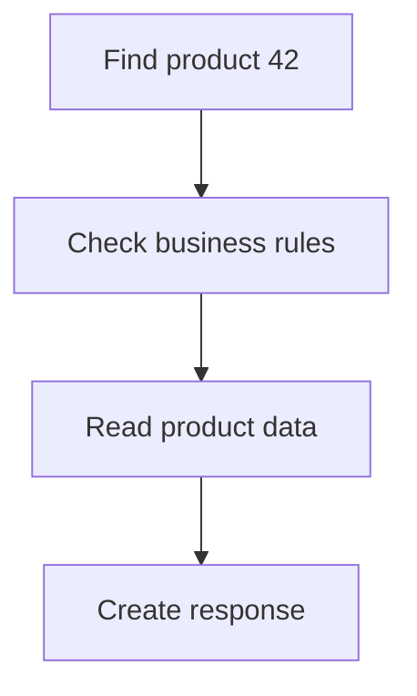

The web server does not need to understand the application's product business rules.

The application runtime does.

---

# 4. Application Runtime

An application cannot normally execute source code by itself.

It needs a **runtime environment**.

For example:

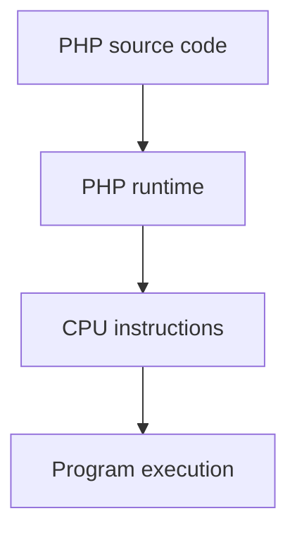

Similarly:

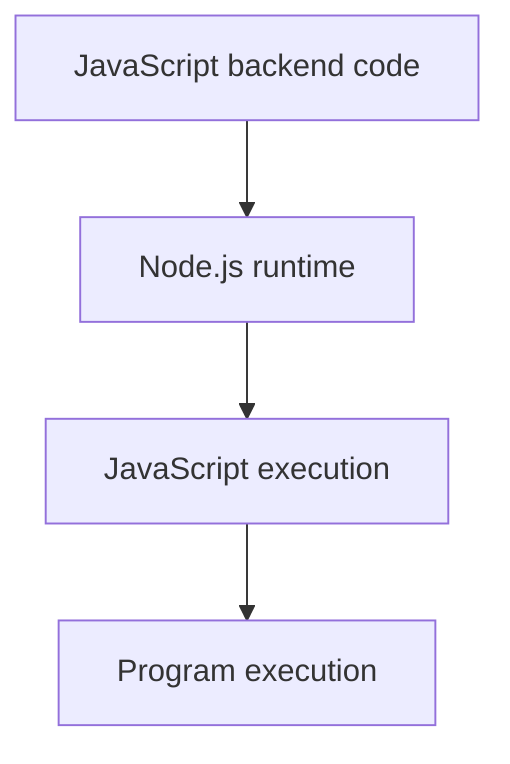

Or:

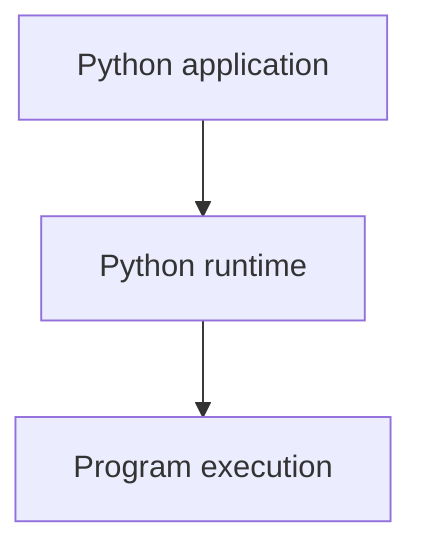

The runtime provides the mechanisms required to execute the application's code.

Depending on the language and runtime, this can include:

* Memory management.
* Networking APIs.
* File access.
* Database connectivity.
* Concurrency mechanisms.
* Libraries and modules.
* Error handling.
* Process management.

---

# 5. PHP Example

Suppose you have a PHP application.

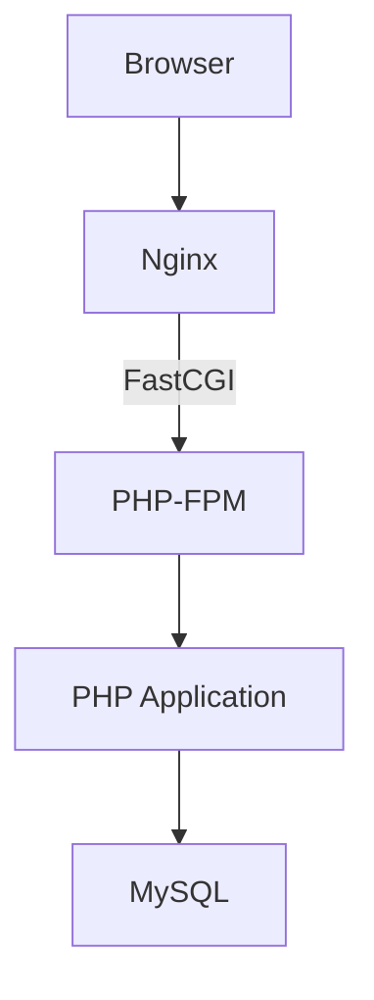

The request might be:

```http
GET /products.php?id=42
```

Nginx receives the request.

It determines that PHP code needs to execute.

Nginx passes the relevant request information to PHP-FPM.

PHP-FPM manages PHP worker processes that execute the PHP application.

The PHP application may then query MySQL.

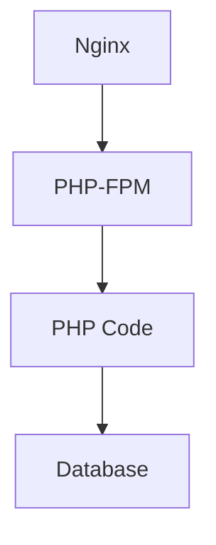

The result travels back through the application and eventually reaches the browser.

---

# 6. Node.js Example

A Node.js application can directly listen for HTTP requests.

For example:

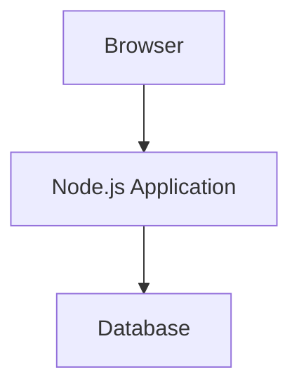

Node.js provides the runtime for executing JavaScript outside the browser.

In production, however, a reverse proxy may still be placed in front:

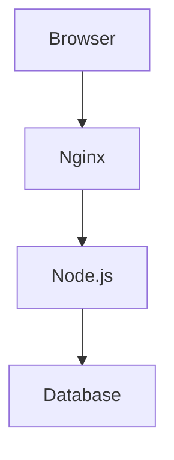

Nginx might handle:

* TLS termination.
* Static files.
* Request routing.
* Connection handling.
* Reverse proxying.

Node.js handles:

* Application logic.
* API endpoints.
* Database interaction.
* Business operations.

Again, this is an architectural choice rather than an absolute requirement.

---

# 7. What Happens Inside the Application Server?

Let's take a simple e-commerce request.

```http
POST /api/orders
```

The user wants to create an order.

A simplified application flow might look like:

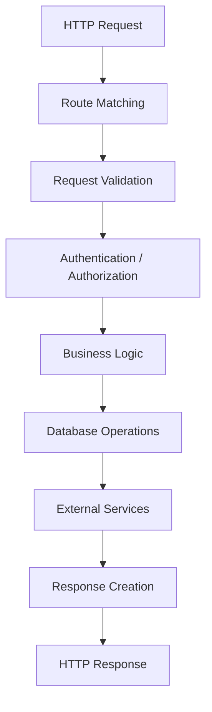

Each step performs a different responsibility.

---

# 8. Routing

The application needs to determine what code should handle the request.

For example:

```text
GET  /products
POST /orders
GET  /orders/123
DELETE /cart/items/42
```

The application maps these requests to appropriate handlers.

Conceptually:

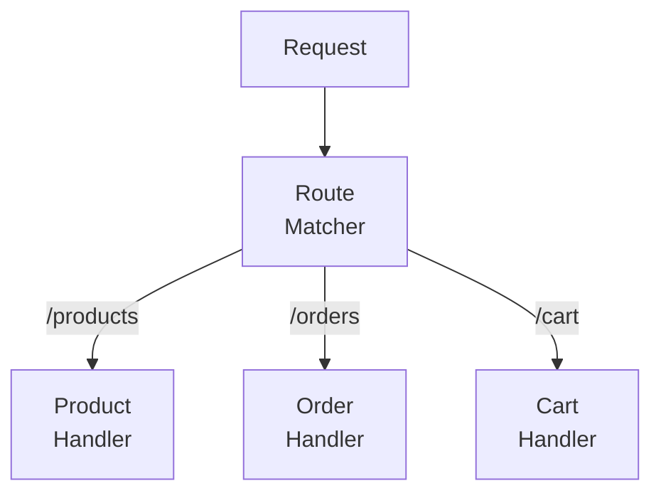

The web server can perform some routing based on URL paths.

Application-level routing is different: it determines which application code should execute.

---

# 9. Request Validation

The application should not blindly trust incoming data.

Suppose the client sends:

```json
{
  "productId": 42,
  "quantity": 3
}
```

The application may validate:

* Is `productId` valid?
* Does the product exist?
* Is `quantity` a valid number?
* Is the quantity within allowed limits?
* Is the product available?

The browser may perform validation too.

But browser-side validation is primarily for user experience.

The backend must enforce authoritative validation.

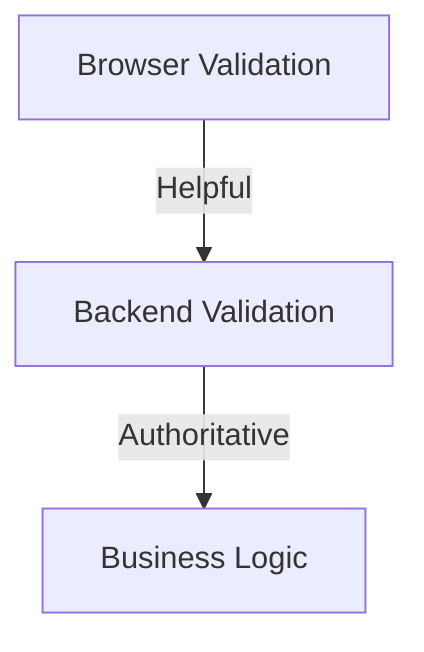

---

# 10. Business Logic

Business logic represents the rules that determine how the application behaves.

For example:

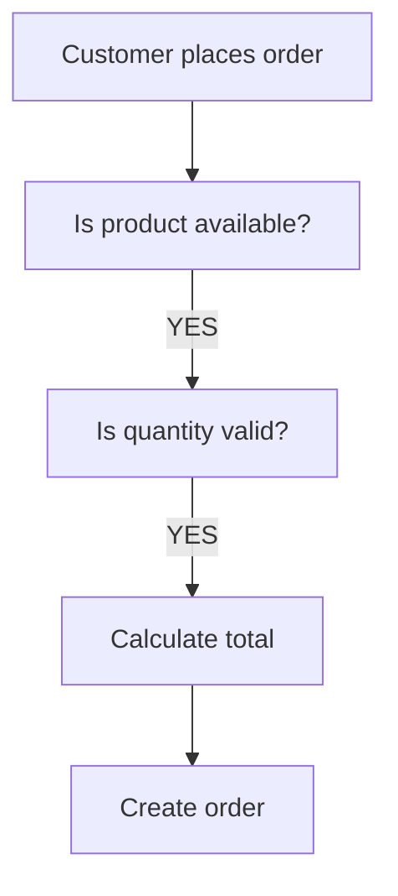

Business logic is not simply database code.

For example:

```text
price × quantity = subtotal
```

is application logic.

But:

```sql
SELECT price FROM products WHERE id = 42;
```

is a data-access operation.

Keeping these responsibilities understandable is important as an application grows.

---

# 11. Database Communication

The application server commonly communicates with the database.

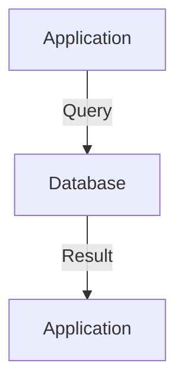

For example:

```sql
SELECT id, name, price
FROM products
WHERE id = 42;
```

The application receives the result and uses it as part of its processing.

The application server should generally not create a new database connection for every small operation without considering connection-management costs.

Database connections are limited resources.

This becomes particularly important when many application processes run simultaneously.

Connection management and pooling are covered in:

**01.11 — Database Connections**

and

**01.12 — Connection Pooling**

---

# 12. External Service Communication

Applications often need capabilities that they do not provide themselves.

For example:

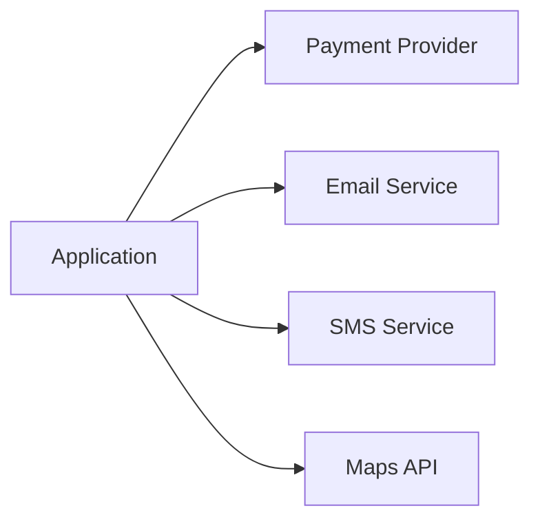

Suppose the application needs to send an email.

The application may send an HTTP request to an email provider.

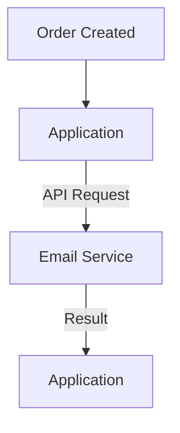

The external service becomes a dependency.

That dependency introduces:

* Network latency.
* Availability risk.
* Authentication requirements.
* Rate limits.
* Timeout handling.
* Error handling.

This is why application-server design cannot be considered independently from the systems it depends on.

---

# 13. Application Processes

An application server is usually not one magical "server."

There are processes executing application code.

For example:

```mermaid
flowchart TD
  accTitle: Processes in an application server
  accDescr: Inside the application server, process 1 handles request A, process 2 request B, process 3 request C and process 4 request D.
  subgraph S["Application Server"]
    direction LR
    P1["Process 1"] --> A["Request A"]
    P2["Process 2"] --> B["Request B"]
    P3["Process 3"] --> C["Request C"]
    P4["Process 4"] --> D["Request D"]
  end
```

The exact model depends on the runtime.

An application may use:

* Multiple processes.
* Multiple threads.
* Event loops.
* Worker pools.
* A combination of these.

The goal is to allow the application to handle multiple requests efficiently.

---

# 14. Concurrency

Suppose your application receives three requests at approximately the same time.

```mermaid
flowchart LR
  accTitle: Concurrent requests
  accDescr: Requests A, B and C all reach the application at the same time.
  A["Request A"] --> P["Application"]
  B["Request B"] --> P
  C["Request C"] --> P
```

The application needs some mechanism to make progress on these requests.

Different runtimes use different concurrency models.

### Process-based model

```mermaid
flowchart LR
  accTitle: Process-based model
  accDescr: Request A goes to process A, request B to process B and request C to process C.
  A["Request A"] --> PA["Process A"]
  B["Request B"] --> PB["Process B"]
  C["Request C"] --> PC["Process C"]
```

### Thread-based model

```mermaid
flowchart LR
  accTitle: Thread-based model
  accDescr: The application runs thread A for request A, thread B for request B and thread C for request C.
  P["Application"] --> TA["Thread A"] & TB["Thread B"] & TC["Thread C"]
  TA --> A["Request A"]
  TB --> B["Request B"]
  TC --> C["Request C"]
```

### Event-driven model

```mermaid
flowchart TD
  accTitle: Event-driven model
  accDescr: Requests A, B and C all go to one event loop, which runs async operations.
  A["Request A"] --> E["Event Loop"]
  B["Request B"] --> E
  C["Request C"] --> E
  E --> O["Async Operations"]
```

These models have different performance characteristics and programming implications.

For system design, the important point is:

> **Concurrency determines how an application uses available computing resources while handling multiple requests.**

---

# 15. CPU-Bound vs I/O-Bound Work

Not all application work behaves the same way.

## CPU-bound work

The application spends most of its time using the CPU.

Examples:

* Image processing.
* Complex calculations.
* Video encoding.
* Large data transformations.

```mermaid
flowchart TD
  accTitle: CPU-bound work
  accDescr: A request needs heavy CPU work before the response.
  N1["Request"] --> N2["Heavy CPU Work"] --> N3["Response"]
```

Adding more CPU capacity or more application workers may help, depending on the workload.

## I/O-bound work

The application spends significant time waiting for external operations.

Examples:

* Database queries.
* Network requests.
* File operations.
* External APIs.

```mermaid
flowchart TD
  accTitle: I/O-bound work
  accDescr: A request reaches the application, which waits on the database and waits on an external API.
  R["Request"] --> A["Application"]
  A --> D["Database<br/>WAIT"]
  A --> E["External API<br/>WAIT"]
```

Adding more workers does not automatically make the dependency faster.

If the database is the bottleneck, increasing application-server capacity may simply create more simultaneous database requests.

This is a fundamental system-design lesson:

> **Scaling the component in front of a bottleneck does not necessarily remove the bottleneck.**

---

# 16. The Application Server as a Bottleneck

Imagine one application instance can process approximately 100 requests per second under a particular workload.

Traffic grows:

```mermaid
flowchart TD
  accTitle: More traffic than capacity
  accDescr: Incoming traffic of 150 requests per second reaches an application with a capacity of 100 requests per second.
  N1["Incoming traffic"] --> N2["150 requests/sec"] --> N3["Application<br/>capacity:<br/>100 req/sec"]
```

Now requests begin to queue, slow down, or fail.

Possible symptoms include:

* Increasing response latency.
* Request timeouts.
* Higher CPU usage.
* Memory pressure.
* Increasing queue lengths.
* Increased error rates.

Before simply adding more servers, determine why the application is overloaded.

The problem might be:

```text
CPU bottleneck
Memory bottleneck
Database bottleneck
External API bottleneck
Connection limit
Lock contention
Slow code
Large requests
```

System design starts with finding the actual constraint.

---

# 17. Stateless Application Servers

An application server is easier to scale horizontally when it does not depend on important local memory surviving between requests.

Consider two application instances:

```mermaid
flowchart TD
  accTitle: Stateless servers behind a load balancer
  accDescr: A load balancer sends requests to server A and server B.
  L["Load Balancer"] --> A["Server A"] & B["Server B"]
```

If a request reaches Server A and the next request reaches Server B, both servers should be able to process the request correctly.

This is easier when application state is stored in shared or external systems rather than only in one server's memory.

For example:

```mermaid
flowchart TD
  accTitle: Shared state
  accDescr: Application A and application B both use a shared data store.
  A["Application A"] --> S["Shared Data Store"]
  B["Application B"] --> S
```

Stateless application design is covered later in:

**01.14 — Stateless Application Design**

and scaling it is covered in Level 2.

---

# 18. What Happens When the Application Server Fails?

Suppose the application server crashes.

```mermaid
flowchart TD
  accTitle: The application server fails
  accDescr: The browser reaches the web server, but the web server cannot reach the application server.
  B["Browser"] --> W["Web Server"] --x A["Application Server"]
```

The web server may return an error such as:

```text
502 Bad Gateway
```

or

```text
503 Service Unavailable
```

depending on the architecture and failure condition.

If there is another healthy application instance:

```mermaid
flowchart TD
  accTitle: One application server fails
  accDescr: A load balancer sends requests to app server A, which has failed, and app server B, which is healthy.
  L["Load Balancer"] --> A["App Server A<br/>X"] & B["App Server B<br/>✓"]
```

the system may continue serving requests through Server B.

This is one reason multiple application instances are useful.

But redundancy introduces additional complexity:

* Routing.
* Health checks.
* Deployment coordination.
* Shared state.
* Database connections.
* Logging and tracing.
* Failure handling.

Redundancy is not free.

---

# 19. Application Server vs Database

These two components perform very different jobs.

```text
Application Server
------------------
Understands:
- Business rules
- Requests
- Workflows
- APIs
- Application behavior


Database
------------------
Understands:
- Persistent data
- Queries
- Indexes
- Transactions
- Data consistency
```

For example:

```text
Application:
"Can this customer place this order?"

Database:
"Here is the stored customer/order/product data."
```

The application uses data from the database to make application-level decisions.

The database itself should not be expected to replace the application's entire business layer.

---

# 20. A Complete Example

Let's trace:

> **Customer adds three keyboards to the shopping cart.**

### Request

```mermaid
flowchart TD
  accTitle: The request
  accDescr: The browser sends POST /api/cart/items with productId=42 and quantity=3 to the web server.
  N1["Browser"] -->|"POST /api/cart/items<br/>productId=42<br/>quantity=3"| N2["Web Server"]
```

### Forwarding

```mermaid
flowchart TD
  accTitle: Forwarding
  accDescr: The web server forwards the request to the application server.
  N1["Web Server"] --> N2["Application Server"]
```

### Application processing

```mermaid
flowchart TD
  accTitle: Application processing
  accDescr: Route the request, validate the input, identify the customer, check the product, check availability and update the cart.
  N1["Route request"] --> N2["Validate input"] --> N3["Identify customer"] --> N4["Check product"] --> N5["Check availability"] --> N6["Update cart"]
```

### Database interaction

```mermaid
flowchart TD
  accTitle: Database interaction
  accDescr: The application sends an UPDATE or INSERT to the database, which returns a result to the application.
  N1["Application"] -->|"UPDATE / INSERT"| N2["Database"] -->|"Result"| N3["Application"]
```

### Response

```mermaid
flowchart TD
  accTitle: The response
  accDescr: The application creates an HTTP response, which goes through the web server to the browser.
  N1["Application"] --> N2["HTTP Response"] --> N3["Web Server"] --> N4["Browser"]
```

The user finally sees:

```text
✓ Added to cart
```

What looks like one simple button click actually involved multiple system components.

---

# 21. Common Mistakes

### Mistake 1 — Thinking the application server is the same as the web server

They can coexist in the same process or machine, but their responsibilities are conceptually different.

### Mistake 2 — Assuming more application servers always improve performance

If the database is already overloaded, adding application servers can increase database pressure.

### Mistake 3 — Treating application code as trusted input

Requests come from clients and must be validated.

### Mistake 4 — Ignoring slow dependencies

An application can be perfectly optimized and still respond slowly because it is waiting for a database or external API.

### Mistake 5 — Storing critical state only in local memory

If another application instance receives the next request, that state may not be available.

### Mistake 6 — Assuming a process equals a server

A single physical or virtual server can run many application processes.

Likewise, one application can run across many servers.

---

# 22. Production Considerations

When deploying an application runtime, consider:

| Area          | Question                                                        |
| ------------- | --------------------------------------------------------------- |
| Capacity      | How many requests can one instance handle?                      |
| CPU           | Is processing CPU-intensive?                                    |
| Memory        | Does each process consume significant memory?                   |
| Concurrency   | How many requests can be processed or waited on simultaneously? |
| Database      | How many database connections does each instance require?       |
| Timeouts      | How long should requests wait for dependencies?                 |
| Failures      | What happens when an instance crashes?                          |
| Scaling       | Can additional instances be started safely?                     |
| State         | Does the application depend on local memory or disk?            |
| Observability | Can slow requests and errors be identified?                     |
| Deployment    | Can a new version be deployed without unnecessary downtime?     |

These questions become increasingly important as traffic and system complexity grow.

---

# Key Principle

> **The application server is where application behavior comes to life.**

The web server handles and routes web traffic.

The application runtime executes the business logic.

The database stores persistent data.

External services provide capabilities outside the application.

Understanding these boundaries makes it easier to reason about performance, scaling, failures, and architecture.

And remember:

> **Do not scale blindly. Find the bottleneck first.**

---

# Quick Reference

```mermaid
flowchart TD
  accTitle: Where the application runtime sits
  accDescr: The browser reaches the web server, which forwards to the application runtime. The runtime uses the database, the cache and an external API.
  B["Browser"] --> W["Web Server"] --> A["Application Runtime"] --> D["Database"] & C["Cache"] & E["External API"]
```

| Concept            | Meaning                                                                 |
| ------------------ | ----------------------------------------------------------------------- |
| Application server | Environment that runs backend application code                          |
| Runtime            | Software environment required to execute application code               |
| Process            | Running instance of a program                                           |
| Routing            | Determining which application code handles a request                    |
| Business logic     | Rules governing application behavior                                    |
| CPU-bound          | Work dominated by CPU computation                                       |
| I/O-bound          | Work dominated by waiting for I/O                                       |
| Concurrency        | Ability to make progress on multiple operations                         |
| Stateless          | Important request state is not dependent on one instance's local memory |

---

# Knowledge Check

1. What is the primary responsibility of an application server?
2. How is an application server different from a web server?
3. Why does a Node.js application not necessarily require Nginx to execute?
4. What is the difference between CPU-bound and I/O-bound work?
5. Why can adding application servers make an overloaded database problem worse?
6. Why is local in-memory state a concern when running multiple application instances?
7. What happens when an application server is waiting for a slow external API?
8. Does one application server necessarily mean one physical machine?

### Answers

1. It provides the environment for executing backend application code and processing application operations.
2. A web server primarily handles HTTP traffic, static resources, and routing/proxying; an application runtime executes application code and business logic.
3. Node.js itself can listen for HTTP requests and execute the backend code.
4. CPU-bound work spends most of its time computing; I/O-bound work spends significant time waiting for databases, networks, files, or other I/O.
5. More application instances can create more simultaneous database requests, increasing pressure on the already constrained database.
6. Another instance may receive the next request and not have access to the first instance's local memory.
7. The request may remain active while waiting, increasing latency and consuming application resources; timeouts may eventually occur.
8. No. One application server can run on a physical machine, virtual machine, container, or other execution environment, and many application processes may run within one machine.
