# 01.04 — Request Lifecycle

## Learning Objectives

By the end of this chapter, you should be able to:

* Explain what happens when a user requests a web page or API.
* Trace a request from the browser to the backend and back.
* Understand the roles of DNS, TCP, TLS, HTTP, web servers, application processes, caches, and databases.
* Distinguish a **request** from a **response**.
* Identify where latency can be introduced.
* Understand why request flow matters in system design.
* Recognize common failure points in the request lifecycle.

---

# What Is a Request Lifecycle?

When you click a button, open a webpage, submit a form, or call an API, your computer does not magically receive the answer.

A series of steps happens between:

> **"I want this resource."**

and:

> **"Here is the response."**

This complete journey is called the **request lifecycle**.

A simplified version looks like this:

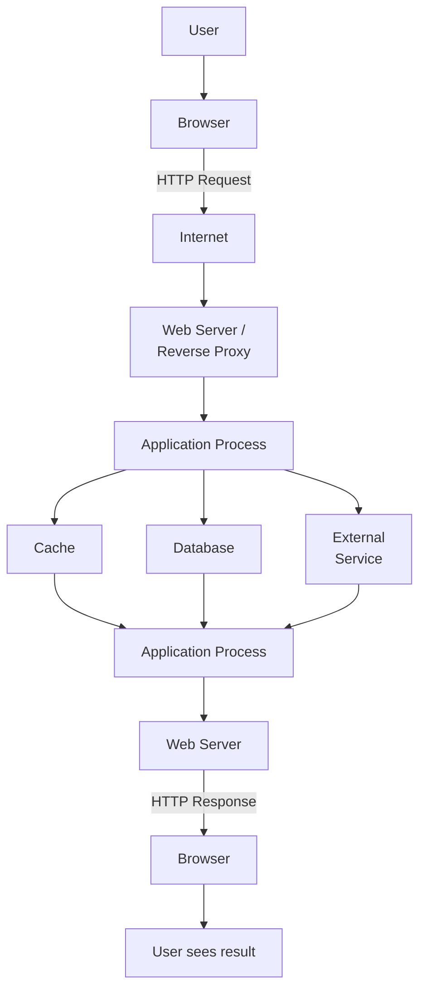

The exact path depends on the system.

A simple website may have only a few steps.

A large production system may involve:

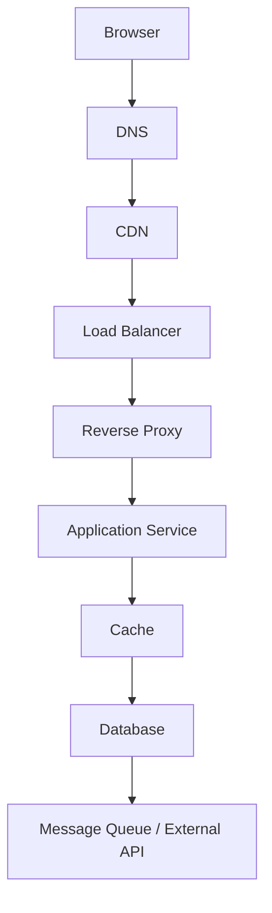

The important skill is learning to **trace the request**.

---

# 1. The User Starts an Action

Everything begins with an action.

For example:

```text
User opens:

https://example.com/products/42
```

Or:

```text
User clicks:

"Add to Cart"
```

Or:

```text
JavaScript sends:

GET /api/products/42
```

The browser now needs to communicate with a server.

---

# 2. The Browser Determines Where to Send the Request

Suppose the user requests:

```text
https://example.com/products/42
```

The browser needs to know where `example.com` is hosted.

This involves **DNS**.

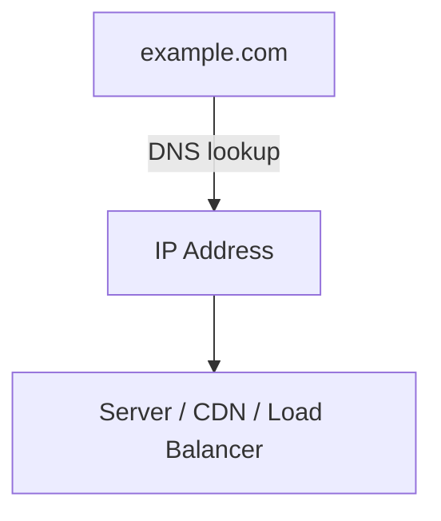

DNS translates a domain name into information that helps the client locate the destination.

For example:

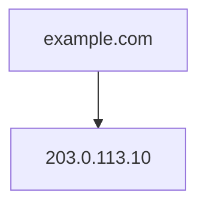

The actual infrastructure may be more complicated than a single IP address.

There may be:

* CDN
* load balancer
* multiple IP addresses
* geographic routing
* DNS-based failover

The key idea is:

> **DNS helps the client find where to send network traffic.**

DNS itself does not execute your application code.

---

# 3. A Network Connection Is Established

Once the destination is known, the browser needs to communicate with it.

For HTTPS, this involves several networking steps.

Conceptually:

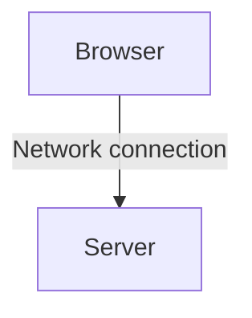

At the transport layer, TCP is commonly used for HTTP/1.1 and HTTP/2.

Modern HTTP/3 uses **QUIC**, which runs over UDP.

For now, the important system-design idea is:

> Before useful application data can flow, the client and server need a communication path.

---

# 4. TLS Secures HTTPS

If the URL is:

```text
https://example.com
```

the connection is protected using **TLS**.

Conceptually:

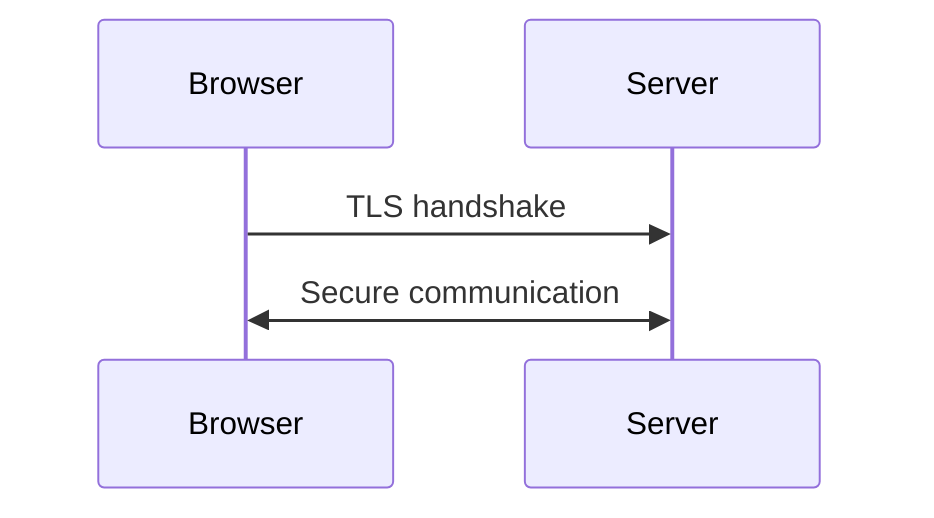

TLS provides important security properties such as:

* Encryption
* Server authentication
* Integrity protection

After the secure connection is established, HTTP messages can travel through it.

So:

```text
HTTP
+
TLS
=
HTTPS
```

More precisely, HTTPS means HTTP communication protected by TLS.

---

# 5. The Browser Sends an HTTP Request

Now the browser can send the actual application request.

A simplified request might look like:

```http
GET /products/42 HTTP/1.1
Host: example.com
Accept: text/html
Cookie: session_id=abc123
```

The request contains information such as:

* HTTP method
* URL/path
* headers
* cookies
* sometimes a request body

For example:

```text
GET /products/42
```

means:

> "Give me product 42."

Another request might be:

```http
POST /api/orders
```

with data describing the new order.

---

# 6. The Request Reaches the Edge

The request may not reach your application directly.

A production architecture often has components in front of the application:

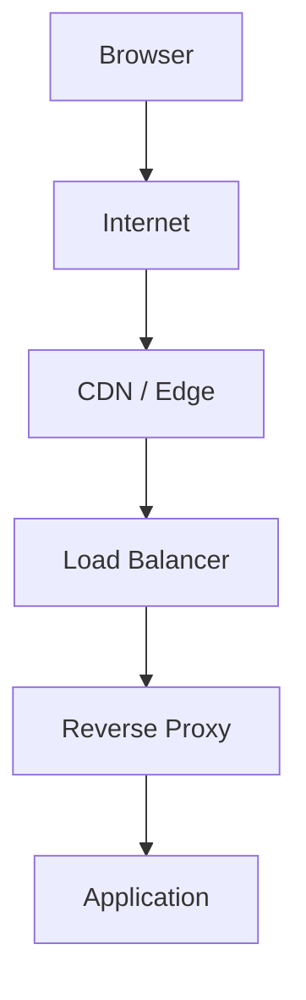

Not every system has all of these.

For example:

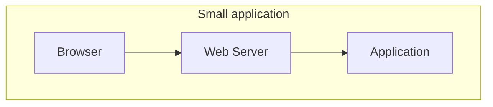

A larger system might use:

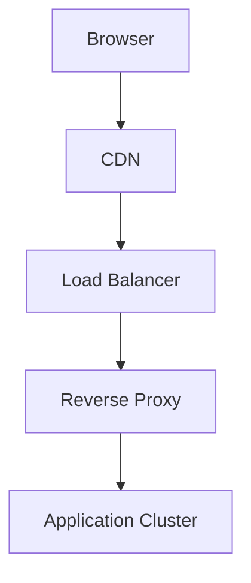

Each additional component exists for a reason.

---

# 7. CDN May Handle the Request

If the application uses a CDN, the CDN may receive the request first.

For example:

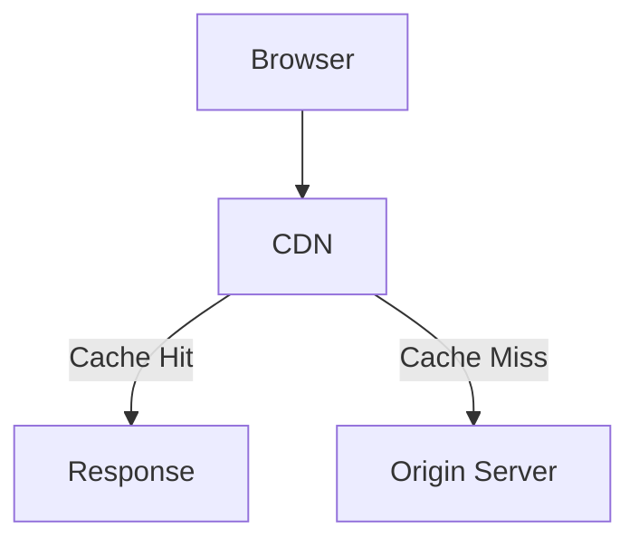

If the requested resource is already cached:

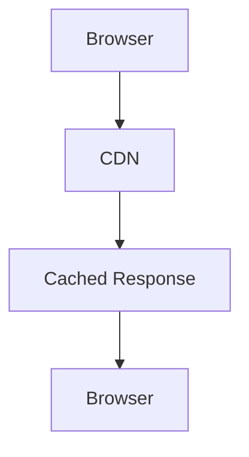

The application may never receive the request.

This is important.

A request does **not always reach the application server**.

---

# 8. Load Balancer Chooses an Application Instance

If there are multiple application instances:

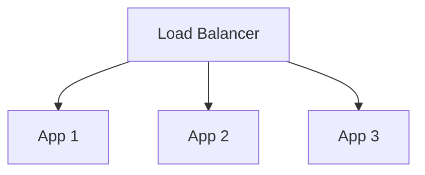

The load balancer selects an appropriate instance.

For example:

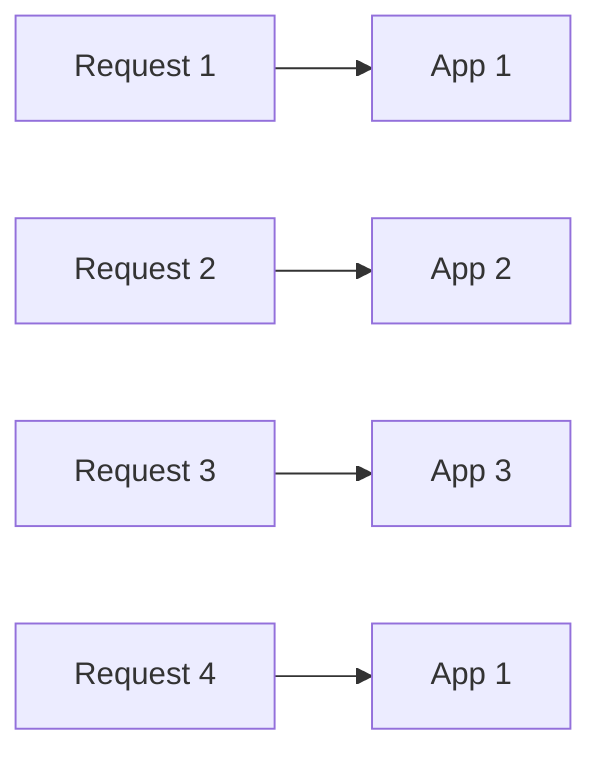

The exact decision depends on the load-balancing strategy.

The important idea is:

> **A load balancer distributes incoming requests across available application instances.**

This becomes important when systems scale horizontally.

---

# 9. The Web Server Receives the Request

The request may then reach a web server or reverse proxy such as Nginx or Apache.

The web server can perform tasks such as:

* Accepting HTTP connections
* Serving static files
* Routing requests
* Terminating TLS
* Proxying requests
* Applying basic access rules
* Forwarding requests to backend services

For example:

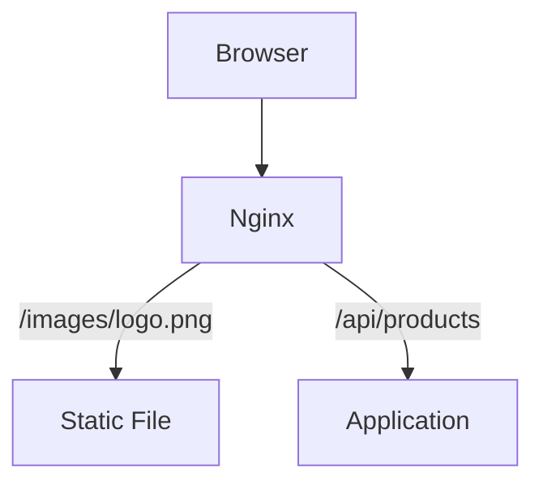

The web server determines what should happen next.

---

# 10. The Application Process Handles the Request

For a dynamic request, the web server forwards the request to the backend application.

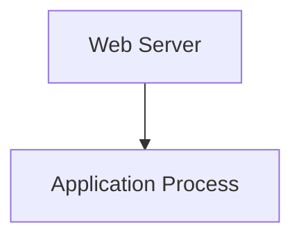

The application process may:

1. Parse the request.
2. Authenticate the user.
3. Validate input.
4. Execute business logic.
5. Read from a cache.
6. Query a database.
7. Call another service.
8. Construct a response.

For example:

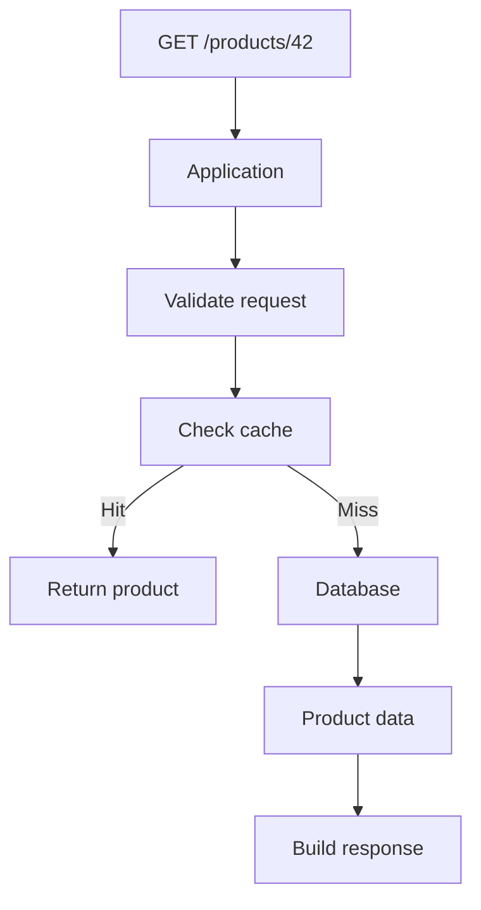

---

# 11. Authentication May Happen

Some requests require an authenticated user.

For example:

```text
GET /account/orders
```

The application may inspect:

```text
Cookie
Authorization header
Session
Token
```

For example:

```http
Authorization: Bearer <token>
```

The application verifies the user's identity.

Conceptually:

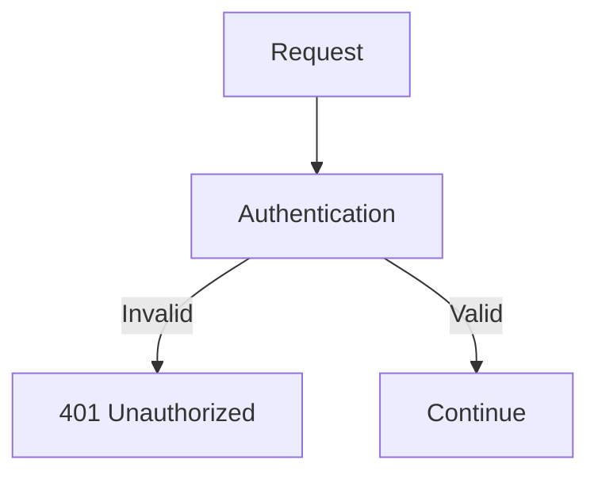

Authentication answers:

> **Who are you?**

Authorization answers:

> **Are you allowed to do this?**

These concepts are covered more deeply later.

---

# 12. Authorization May Happen

Suppose a user is authenticated but tries to access an administrator endpoint:

```text
DELETE /users/123
```

The application may check permissions.

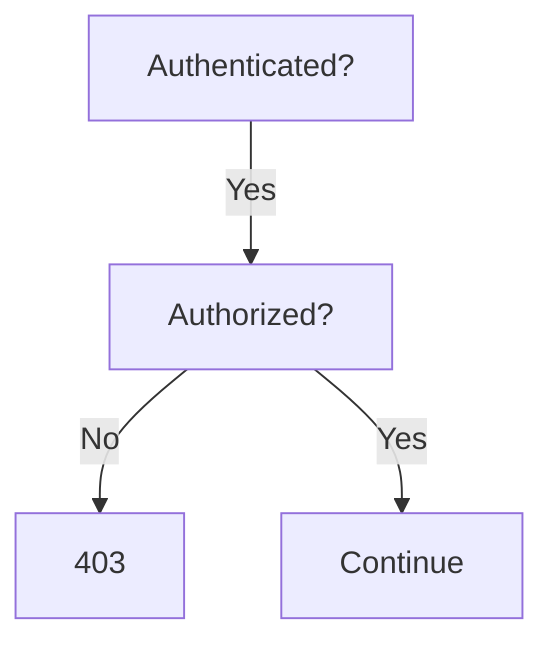

The application should not assume:

> "The user is logged in, therefore they can do everything."

Authentication and authorization are separate decisions.

---

# 13. Business Logic Runs

Now the application performs the actual work.

Suppose the request is:

```text
POST /checkout
```

The application might need to:

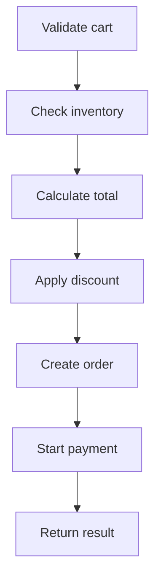

This is where the application's **business rules** live.

For example:

```text
IF stock >= requested_quantity
THEN
    allow purchase
ELSE
    reject purchase
```

The application is not simply "fetching data."

It is making decisions according to the rules of the business.

---

# 14. The Application May Check a Cache

Before querying a database, the application may check a cache.

For example:

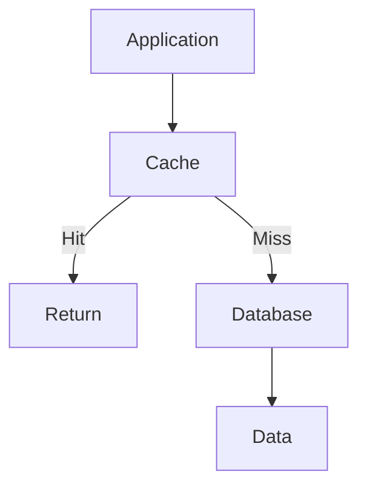

Suppose:

```text
GET /products/42
```

The application checks:

```text
Cache: product:42
```

If the data exists:

```mermaid
flowchart TD
  accTitle: A cache hit
  accDescr: A cache hit returns cached data.
  N0["Cache Hit"] --> N1["Return cached data"]
```

If it does not:

```mermaid
flowchart TD
  accTitle: A cache miss
  accDescr: A cache miss leads to a database query.
  N0["Cache Miss"] --> N1["Database query"]
```

Caching can reduce database work and improve response time.

Caching is covered in detail in Level 3.

---

# 15. The Application May Query the Database

If the required information is not available elsewhere, the application may query a database.

For example:

```sql
SELECT *
FROM products
WHERE id = 42;
```

The flow becomes:

```mermaid
flowchart TD
  accTitle: Querying the database
  accDescr: The application sends a SQL query to the database, and the result returns to the application.
  A["Application"] -->|"SQL query"| D["Database"] -->|"Result"| A2["Application"]
```

The database may then:

1. Parse the query.
2. Determine an execution plan.
3. Use indexes.
4. Read required data.
5. Return the result.

The application receives the data and continues processing.

---

# 16. The Application May Call External Services

A request may require another system.

For example, an e-commerce checkout may interact with:

```mermaid
flowchart LR
  accTitle: External services in a checkout
  accDescr: The application calls a payment provider, an email service, a shipping service and an inventory service.
  A["Application"] --> P["Payment Provider"] & E["Email Service"] & S["Shipping Service"] & I["Inventory Service"]
```

For example:

```mermaid
flowchart TD
  accTitle: Waiting on a payment provider
  accDescr: A checkout request reaches the application, which calls the payment provider and receives the payment result.
  N0["Checkout Request"] --> N1["Application"] --> N2["Payment Provider"] --> N3["Payment Result"]
```

This introduces another important system-design concept:

> **Your request may depend on systems you do not control.**

That creates potential problems involving:

* Network latency
* Timeouts
* Retries
* Service failures
* Rate limits
* Partial failure

These topics become important later in the curriculum.

---

# 17. The Application Builds a Response

Once the required work is complete, the application creates a response.

For example:

```http
HTTP/1.1 200 OK
Content-Type: application/json
```

```json
{
  "id": 42,
  "name": "Laptop",
  "price": 55000
}
```

The response may contain:

* Status code
* Headers
* Cookies
* Response body

The body might contain:

* HTML
* JSON
* XML
* text
* an image
* another resource

---

# 18. The Response Travels Back

The response travels back through the infrastructure.

Conceptually:

```mermaid
flowchart TD
  accTitle: The response path
  accDescr: From the database back to the application, the web server, the load balancer, the CDN or edge, the internet, and the browser.
  N0["Database"] --> N1["Application"] --> N2["Web Server"] --> N3["Load Balancer"] --> N4["CDN / Edge"] --> N5["Internet"] --> N6["Browser"]
```

Not every architecture has every component.

The important idea is:

> **The response follows the communication path back toward the client.**

---

# 19. The Browser Processes the Response

The browser receives the response.

If it is HTML:

```mermaid
flowchart TD
  accTitle: Processing an HTML response
  accDescr: The browser parses the HTML into the DOM, applies CSS, runs JavaScript, and renders, and the user sees the page.
  N0["HTML"] --> N1["Parse"] --> N2["DOM"] --> N3["CSS"] --> N4["JavaScript"] --> N5["Render"] --> N6["User sees page"]
```

If the browser receives JSON from an API:

```mermaid
flowchart TD
  accTitle: Processing a JSON response
  accDescr: JSON goes to JavaScript, which updates the UI.
  N0["JSON"] --> N1["JavaScript"] --> N2["Update UI"]
```

For example:

```mermaid
flowchart TD
  accTitle: From API call to screen
  accDescr: GET /api/products/42 returns JSON, which React or JavaScript passes to the product component, which appears on screen.
  N0["GET /api/products/42"] --> N1["JSON"] --> N2["React / JavaScript"] --> N3["Product component"] --> N4["Screen"]
```

The request lifecycle is therefore not finished merely when the server sends the response.

The browser still has work to do.

---

# The Complete Request Lifecycle

Let's put everything together.

```mermaid
flowchart TD
  accTitle: The complete request lifecycle
  accDescr: The user's browser uses DNS to find the destination, then connects with TCP or QUIC and TLS across the internet to a CDN or edge. On a cache hit the edge returns a response. Otherwise a load balancer passes the request to a web server or reverse proxy and then the application process, which handles authentication, authorization, business logic, a cache that either hits or misses to the database, and external services. The response returns through the web server, the load balancer or edge, and the internet to the browser, which renders or updates the UI for the user.
  subgraph REQ["REQUEST"]
    U["User"] --> B["Browser"] -->|"1#46; DNS"| D["Destination"] -->|"2#46; TCP / QUIC<br/>3#46; TLS"| I["Internet"] --> E["CDN / Edge"]
    E -->|"Cache Hit?<br/>YES"| R0["Response"]
    E -->|"NO"| L["Load Balancer"] --> W["Web Server /<br/>Reverse Proxy"] --> A["Application Process"] --> AP
    subgraph AP[" "]
      direction TB
      AU["Authentication"] ~~~ AZ["Authorization"] ~~~ BL["Business Logic"] ~~~ C["Cache"]
      C --> H["Hit"] & M["Miss"]
      M --> DB["Database"]
      DB ~~~ X["External Services"]
    end
    AP --> R["Response"] --> W2["Web Server"] --> L2["Load Balancer / Edge"] --> I2["Internet"] --> B2["Browser"] --> RU["Render / Update UI"] --> U2["User"]
  end
```

This diagram is intentionally simplified.

Real systems can be much more complicated.

---

# A Simple Example: Opening a Product Page

Suppose you open:

```text
https://shop.example/products/42
```

A simplified lifecycle could be:

```mermaid
flowchart TD
  accTitle: Opening a product page
  accDescr: 1 browser, 2 DNS, 3 TLS, 4 web server, 5 application, 6 cache, 7 database, 8 application, 9 web server, 10 browser, 11 render page.
  N0["1#46; Browser"] --> N1["2#46; DNS"] --> N2["3#46; TLS"] --> N3["4#46; Web Server"] --> N4["5#46; Application"] --> N5["6#46; Cache"] --> N6["7#46; Database"] --> N7["8#46; Application"] --> N8["9#46; Web Server"] --> N9["10#46; Browser"] --> N10["11#46; Render page"]
```

The application might perform:

```mermaid
flowchart TD
  accTitle: What the application does for the product page
  accDescr: The request GET /products/42 leads to finding product 42. The cache does not have it, so the application queries the database, finds the product, builds HTML, and sends an HTTP 200 response, and the browser renders the product.
  Q["Request:<br/>GET /products/42"] --> F["Find product 42"] --> C["Cache?"] -->|"No"| D["Database query"] --> P["Product found"] --> H["Build HTML"] --> O["HTTP 200 response"] --> R["Browser renders product"]
```

---

# What Happens When Something Goes Wrong?

The request lifecycle is also a **failure path**.

For example:

## DNS Failure

```mermaid
flowchart TD
  accTitle: DNS failure
  accDescr: The browser asks DNS, which fails: the domain cannot be resolved.
  B["Browser"] --> D["DNS"] -. "X" .-> F["Cannot resolve domain"]
```

The request never reaches your application.

---

## Application Failure

```mermaid
flowchart TD
  accTitle: Application failure
  accDescr: The browser reaches the web server, which forwards to the application, which fails: the application is unavailable.
  B["Browser"] --> W["Web Server"] --> A["Application"] -. "X" .-> F["Application unavailable"]
```

The web server may return:

```text
502 Bad Gateway
```

depending on the architecture and failure.

---

## Database Failure

```mermaid
flowchart TD
  accTitle: Database failure
  accDescr: The browser reaches the application, which calls the database, which fails: the database is unavailable.
  B["Browser"] --> A["Application"] --> D["Database"] -. "X" .-> F["Database unavailable"]
```

The application may return:

```text
500 Internal Server Error
```

or another application-specific response.

---

## External API Timeout

```mermaid
flowchart TD
  accTitle: External API timeout
  accDescr: The application calls the payment service and waits until the call fails with a timeout.
  A["Application"] --> P["Payment Service"] -. "waiting...<br/>X" .-> T["timeout"]
```

The application must decide what to do.

Possible strategies include:

* Return an error.
* Retry.
* Use a fallback.
* Queue the work.
* Fail gracefully.

This is why system design is largely about understanding **failure and dependencies**, not just drawing boxes.

---

# Where Does Latency Come From?

A request can spend time in many places.

For example:

```text
Total Request Time

DNS
 +
Network
 +
TLS
 +
Web Server
 +
Application
 +
Cache
 +
Database
 +
External API
 +
Response Network
 +
Browser Rendering
```

Imagine:

```text
DNS            10 ms
Network        30 ms
TLS            20 ms
Application    15 ms
Database       80 ms
External API  200 ms
Response       25 ms
--------------------
Total         380 ms
```

The numbers above are illustrative.

The important lesson is:

> **End-to-end latency is the result of many components working together.**

A developer who only looks at application code may miss the real bottleneck.

---

# Sequential vs Parallel Work

Not every operation must happen one after another.

Consider:

```mermaid
flowchart LR
  accTitle: One application, three dependencies
  accDescr: The application calls the database, the recommendation service and the inventory service.
  A["Application"] --> D["Database"] & R["Recommendation Service"] & I["Inventory Service"]
```

Some operations may be performed concurrently.

Conceptually:

```mermaid
flowchart TD
  accTitle: Calls made in parallel
  accDescr: The application calls the database, the inventory service and the recommendations service at the same time, and all three results feed the response.
  A["Application"] --> D["DB"] & I["Inventory"] & R["Recommendations"]
  D & I & R --> S["Response"]
```

Parallel work can reduce total latency when operations are independent.

But it also introduces complexity:

* More concurrent connections
* More failure possibilities
* More resource consumption
* More complicated error handling

System design is about understanding these trade-offs.

---

# Request Lifecycle vs Application Lifecycle

These are different concepts.

### Request lifecycle

Describes what happens to **one request**:

```mermaid
flowchart TD
  accTitle: Request lifecycle
  accDescr: A request is processed and produces a response.
  N0["Request"] --> N1["Processing"] --> N2["Response"]
```

### Application lifecycle

Describes what happens to the **application process**:

```mermaid
flowchart TD
  accTitle: Application lifecycle
  accDescr: The application process starts, initializes, runs, receives requests, and shuts down or restarts.
  N0["Start"] --> N1["Initialize"] --> N2["Run"] --> N3["Receive requests"] --> N4["Shutdown / Restart"]
```

Do not confuse them.

A single application process can handle thousands or millions of requests over its lifetime.

---

# One Request Does Not Necessarily Mean One Database Query

A common beginner assumption is:

```mermaid
flowchart TD
  accTitle: The beginner assumption
  accDescr: A request makes one query and returns a response.
  N0["Request"] --> N1["One Query"] --> N2["Response"]
```

Real applications may perform:

```mermaid
flowchart TD
  accTitle: A request with several steps
  accDescr: A request goes through authentication, a cache, database query 1, database query 2, an external API and business logic before the response.
  N0["Request"] --> N1["Authentication"] --> N2["Cache"] --> N3["Database Query 1"] --> N4["Database Query 2"] --> N5["External API"] --> N6["Business Logic"] --> N7["Response"]
```

Or:

```mermaid
flowchart TD
  accTitle: A request answered from cache
  accDescr: A request hits the cache and returns a response.
  N0["Request"] --> N1["Cache Hit"] --> N2["Response"]
```

The second case may be much faster.

This is why understanding the entire request path matters.

---

# Common Mistakes

## Mistake 1: Thinking the browser talks directly to the database

Usually:

```mermaid
flowchart LR
  accTitle: Browser straight to database
  accDescr: The browser talks directly to the database.
  N0["Browser"] --> N1["Database"]
```

is not the normal architecture for a web application.

More commonly:

```mermaid
flowchart TD
  accTitle: Browser, backend, database
  accDescr: The browser talks to the backend, which talks to the database.
  N0["Browser"] --> N1["Backend"] --> N2["Database"]
```

The backend controls business rules, authorization, validation, and data access.

---

## Mistake 2: Assuming every request reaches the application

A CDN or cache may answer the request before the application sees it.

```mermaid
flowchart TD
  accTitle: The CDN answers first
  accDescr: The browser reaches the CDN, which has a cache hit and returns the response.
  N0["Browser"] --> N1["CDN"] --> N2["Cache Hit"] --> N3["Response"]
```

---

## Mistake 3: Treating the network as instant

Network communication takes time.

It can also fail.

```mermaid
flowchart TD
  accTitle: The network in between
  accDescr: The application reaches the external service over the network.
  N0["Application"] --> N1["Network"] --> N2["External Service"]
```

The service may be slow or unavailable.

---

## Mistake 4: Assuming the database is always the bottleneck

The bottleneck could instead be:

* Network
* CPU
* External API
* Lock contention
* Connection pool
* Cache
* Serialization
* Application code

Always measure before deciding what to optimize.

---

## Mistake 5: Ignoring the response path

A request is not finished when the backend finishes processing.

The response still has to:

```mermaid
flowchart TD
  accTitle: The response path to the screen
  accDescr: The response goes from the server over the network to the browser, which parses and renders it.
  N0["Server"] --> N1["Network"] --> N2["Browser"] --> N3["Parse"] --> N4["Render"]
```

---

# Request Lifecycle as a System-Design Tool

When debugging or designing a system, ask:

```text
Where did the request go?

Where did it spend time?

Where could it fail?

Which component generated the response?

Which dependency did it wait for?
```

For example:

```text
User says:

"The product page is slow."
```

Do not immediately assume:

> "The database is slow."

Trace the request:

```mermaid
flowchart TD
  accTitle: Tracing a slow product page
  accDescr: Browser; DNS 5 ms; CDN 10 ms; load balancer 2 ms; application 20 ms; cache 3 ms; database 250 ms, marked to investigate; application 10 ms; browser 30 ms.
  N0["Browser"] --> N1["DNS<br/>5 ms"] --> N2["CDN<br/>10 ms"] --> N3["Load Balancer<br/>2 ms"] --> N4["Application<br/>20 ms"] --> N5["Cache<br/>3 ms"] --> N6["Database<br/>250 ms ← investigate"] --> N7["Application<br/>10 ms"] --> N8["Browser<br/>30 ms"]
```

Now there is evidence about where the time is going.

This leads to a fundamental system-design habit:

> **Trace first. Optimize second.**

---

# Key Principle

> **A web request is a journey through a system, not a single operation.**

The journey may involve:

```mermaid
flowchart TD
  accTitle: A request's journey
  accDescr: From the client over the network to the edge, the web server, the application, a cache, the database, external services, then the response back to the client.
  N0["Client"] --> N1["Network"] --> N2["Edge"] --> N3["Web Server"] --> N4["Application"] --> N5["Cache"] --> N6["Database"] --> N7["External Services"] --> N8["Response"] --> N9["Client"]
```

Every component adds:

* Work
* Latency
* Capacity requirements
* Failure possibilities
* Operational complexity

Understanding this journey is one of the foundations of system design.

---

# Quick Reference

| Component           | Main Responsibility                            |
| ------------------- | ---------------------------------------------- |
| Browser             | Creates requests and processes responses       |
| DNS                 | Helps locate the destination                   |
| TCP / QUIC          | Provides network transport                     |
| TLS                 | Secures HTTPS communication                    |
| CDN                 | Delivers cached content closer to users        |
| Load Balancer       | Distributes requests                           |
| Web Server          | Handles HTTP and/or proxies requests           |
| Application Process | Executes backend application logic             |
| Cache               | Provides fast access to frequently used data   |
| Database            | Stores and retrieves persistent data           |
| External Service    | Provides functionality owned by another system |

---

# Request vs Response

| Request                     | Response                  |
| --------------------------- | ------------------------- |
| Sent by client              | Sent by server            |
| Describes what client wants | Contains result           |
| Has method/path/headers     | Has status/headers/body   |
| May contain request body    | May contain response body |
| Example: `GET /products/42` | Example: `200 OK`         |

---

# Knowledge Check

### 1. Does every HTTP request reach the application?

**No.**

A CDN, cache, or other component may respond before the application receives it.

---

### 2. What does DNS do?

It helps the client locate the destination associated with a domain name.

---

### 3. What is the purpose of TLS?

It protects HTTPS communication by providing encryption, integrity, and server authentication.

---

### 4. Why does a load balancer exist?

To distribute traffic across available backend instances or services.

---

### 5. Can a request depend on another service?

Yes.

For example:

```mermaid
flowchart LR
  accTitle: A dependency
  accDescr: The application depends on a payment provider.
  N0["Application"] --> N1["Payment Provider"]
```

That dependency can introduce latency and failure.

---

### 6. Is the database always the slowest component?

No.

The bottleneck must be measured rather than assumed.

---

### 7. What is the most important system-design habit from this chapter?

> **Trace the request before trying to optimize or redesign the system.**

---

# Final Mental Model

Whenever you encounter a web application problem, start with:

```mermaid
flowchart TD
  accTitle: Questions to trace a request
  accDescr: Who made the request? Where did it go? Which components handled it? What dependencies did it use? Where did it spend time? Where could it fail? What response came back?
  N0["Who made the request?"] --> N1["Where did it go?"] --> N2["Which components handled it?"] --> N3["What dependencies did it use?"] --> N4["Where did it spend time?"] --> N5["Where could it fail?"] --> N6["What response came back?"]
```

That mental model will become increasingly valuable as systems grow from:

```mermaid
flowchart TD
  accTitle: A small system
  accDescr: The browser, the application, and the database.
  N0["Browser"] --> N1["Application"] --> N2["Database"]
```

into:

```mermaid
flowchart TD
  accTitle: A larger system
  accDescr: Users, then a CDN, a load balancer, the application cluster, a cache, the database cluster, a message queue, workers, and external services.
  N0["Users"] --> N1["CDN"] --> N2["Load Balancer"] --> N3["Application Cluster"] --> N4["Cache"] --> N5["Database Cluster"] --> N6["Message Queue"] --> N7["Workers"] --> N8["External Services"]
```

The architecture may become larger, but the fundamental question remains the same:

> **What happens to the request as it travels through the system?**
