# 01.05 — APIs (Application Programming Interfaces)

## Learning Objectives

By the end of this chapter, you should be able to:

* Explain what an API is and why applications need one.
* Understand how two software components communicate through an API.
* Distinguish an API from an API endpoint and an HTTP request.
* Understand how APIs connect frontend applications, backend services, and external systems.
* Identify the role of HTTP methods, headers, request bodies, and responses in an API.
* Understand API contracts, validation, authentication, and error handling.
* Recognize the trade-offs involved in designing and consuming APIs.

---

# 1. What Is an API?

API stands for **Application Programming Interface**.

An API is a defined way for one piece of software to interact with another piece of software.

Think of an API as an agreement between two software components.

One component says:

> "If you communicate with me in this defined way, I will perform a specific operation or provide specific information."

The other component does not need to know how the internal implementation works.

For example, imagine an e-commerce application.

The frontend needs product information. The backend has access to the product database.

The frontend should not need to know how the database is structured or how SQL queries work.

Instead, the backend exposes an API.

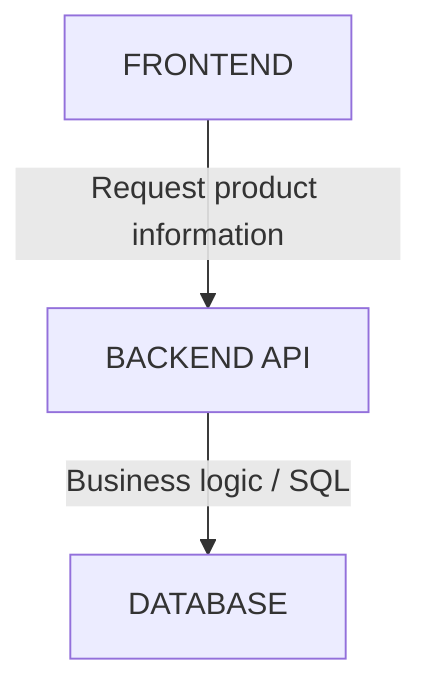

The frontend communicates with the API. The backend decides how to retrieve and return the data.

**Key idea:** An API defines how software components interact without requiring them to understand each other's internal implementation.

---

# 2. A Simple Real-World Analogy

Imagine a restaurant.

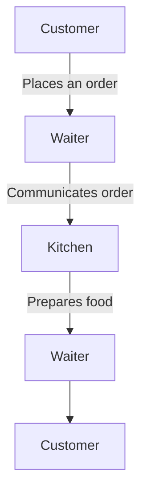

The customer does not enter the kitchen and manage the cooking process.

The customer uses the restaurant's defined ordering process.

In this analogy:

| Restaurant    | Software                                    |
| ------------- | ------------------------------------------- |
| Customer      | API consumer                                |
| Menu          | API documentation / contract                |
| Waiter        | Interface through which the request is made |
| Kitchen       | Internal implementation                     |
| Prepared food | Result                                      |

The analogy is useful, but remember: a software API is a technical interface, not necessarily a separate server or a person-like intermediary.

An API can exist inside one application, between two services, or across the internet.

---

# 3. API Is Not the Same as a Server

This is an important distinction.

An API is an interface. A server is a system or process that may implement that interface.

For example:

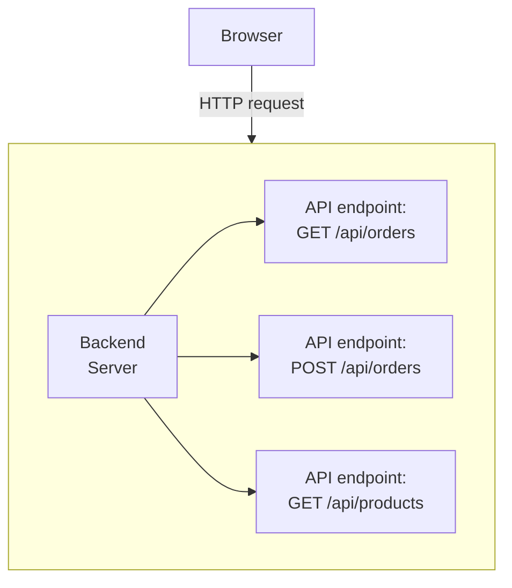

The server may expose many API endpoints.

A single application can provide hundreds of endpoints.

Likewise, one API may be implemented by multiple services behind a gateway or load balancer.

| Concept               | Meaning                                                |
| --------------------- | ------------------------------------------------------ |
| API                   | Defined interface for software interaction             |
| API endpoint          | A particular address or operation exposed by an API    |
| API server            | A server that implements or provides an API            |
| API client / consumer | Software that uses the API                             |
| API contract          | The agreed rules for requests, responses, and behavior |

An API does not have to use HTTP. APIs also exist in programming libraries, operating systems, databases, and other software environments.

This chapter focuses primarily on web APIs because they are central to web application architecture.

---

# 4. Why Do Applications Need APIs?

Consider an online shopping application.

The frontend needs to:

* Display products.
* Show product details.
* Register users.
* Log users in.
* Add items to a cart.
* Create orders.
* Check payment status.

Without a defined interface, the frontend would need to understand and directly manage backend implementation details.

That would create tight coupling.

An API provides a boundary.

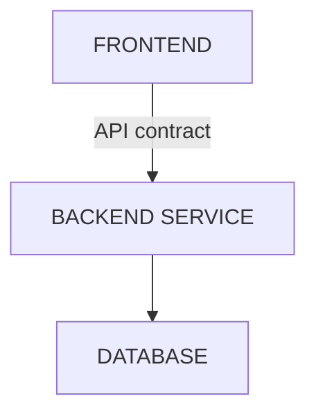

The frontend only needs to know:

1. Which operation is available.
2. What information to send.
3. What response to expect.
4. What errors may occur.

It does not need to know whether the backend uses PHP, Node.js, Python, Java, MySQL, or PostgreSQL.

For example, a frontend may call:

```http
GET /api/products/42
```

The backend could retrieve the product from MySQL today and from another storage system in the future.

If the API contract remains compatible, the frontend may not need to change.

**Architectural principle:** APIs help separate responsibilities and reduce direct dependencies between components.

---

# 5. How a Web API Works

Let's follow a simple request.

Suppose a user opens a product page.

The frontend needs product 42.

It sends:

```http
GET /api/products/42
```

The request travels to the backend.

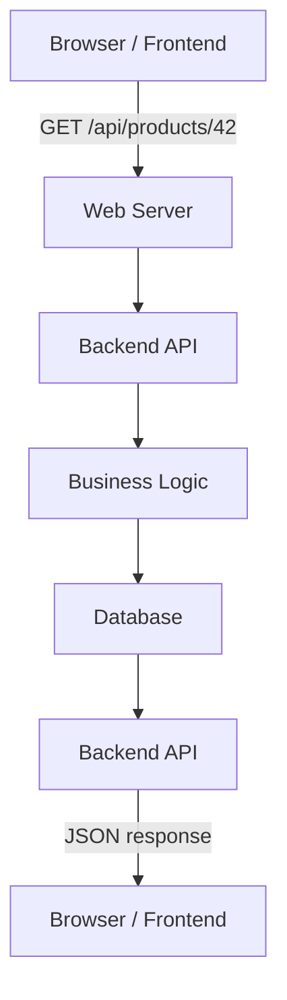

The backend might return:

```json
{
  "id": 42,
  "name": "Laptop",
  "price": 55000,
  "inStock": true
}
```

The frontend receives the JSON and displays the product.

Notice what the frontend does not receive:

* Database credentials
* SQL queries
* Database connection details
* Internal application classes
* Private business logic

The API exposes only the information and operations that the backend is designed to make available.

---

# 6. Understanding API Endpoints

An API endpoint identifies a particular resource or operation exposed by an API.

For example:

```text
GET    /api/products
GET    /api/products/42
POST   /api/products
PUT    /api/products/42
PATCH  /api/products/42
DELETE /api/products/42
```

These are example HTTP operations for a product API.

An endpoint is commonly understood through the combination of:

* HTTP method
* URL path
* Expected request format
* Expected response and behavior

The same URL path can support different operations.

For example:

```text
GET /api/products
```

might retrieve products.

While:

```text
POST /api/products
```

might create a product, provided the caller is authorized.

The path alone does not tell the whole story.

The method and API contract matter too.

## Endpoint vs URL

A URL identifies a resource or destination.

An API endpoint is an exposed interface through which a particular operation can be requested.

For example:

```text
https://shop.example.com/api/products/42
```

This is a URL that may be used to access a product API endpoint.

The API contract defines what the endpoint does and how clients should use it.

---

# 7. The Parts of an HTTP API Request

A web API request commonly contains several parts.

```http
POST /api/orders HTTP/1.1
Host: shop.example.com
Content-Type: application/json
Authorization: Bearer <token>

{
  "productId": 42,
  "quantity": 2
}
```

Let's break it down.

| Part    | Purpose                                           |
| ------- | ------------------------------------------------- |
| Method  | Indicates the requested operation                 |
| Path    | Identifies the resource or operation              |
| Headers | Carry metadata and additional request information |
| Body    | Carries data sent with the request, when needed   |

For this example:

* `POST` requests creation of an order.
* `/api/orders` identifies the order collection.
* `Content-Type` indicates the format of the request body.
* `Authorization` carries credentials.
* The JSON body contains the product and quantity.

The backend must still validate the request and check permissions.

A request containing a token does not automatically mean the user is authorized to create an order.

---

# 8. API Responses

An API response communicates the result of a request.

For HTTP APIs, a response typically contains:

```text
HTTP Status
     +
Response Headers
     +
Response Body (when applicable)
```

For example:

```http
HTTP/1.1 200 OK
Content-Type: application/json
```

```json
{
  "id": 42,
  "name": "Laptop",
  "price": 55000
}
```

The status code communicates the general outcome.

The response body may contain data, an error description, or other information defined by the API contract.

## Common HTTP Status Codes

| Status                      | Meaning                                                     |
| --------------------------- | ----------------------------------------------------------- |
| `200 OK`                    | Request succeeded                                           |
| `201 Created`               | A resource was created                                      |
| `204 No Content`            | Request succeeded with no response body                     |
| `400 Bad Request`           | Request is invalid or malformed                             |
| `401 Unauthorized`          | Valid authentication is missing or unsuccessful             |
| `403 Forbidden`             | Request is not permitted                                    |
| `404 Not Found`             | Requested resource was not found                            |
| `409 Conflict`              | Request conflicts with the current resource state           |
| `429 Too Many Requests`     | Request rate limit was exceeded                             |
| `500 Internal Server Error` | Server encountered an unexpected error                      |
| `502 Bad Gateway`           | Gateway or proxy received an invalid upstream response      |
| `503 Service Unavailable`   | Service is temporarily unable to handle the request         |
| `504 Gateway Timeout`       | Gateway or proxy timed out waiting for an upstream response |

Status codes describe the outcome at the HTTP level. The API contract may provide additional error codes and details.

---

# 9. API Contracts

An API contract defines how the consumer and provider are expected to interact.

Think of it as the agreement between the two sides.

A contract can specify:

```text
Endpoint:
GET /api/products/{id}

Input:
id = product identifier

Success:
200 OK

Response:
Product JSON

Possible errors:
400, 404, 500
```

A more complete contract may also define:

* Authentication requirements
* Authorization rules
* Request and response schemas
* Required and optional fields
* Validation rules
* Pagination
* Rate limits
* Error formats
* Versioning and compatibility

For example, a contract may require `quantity` to be a positive integer.

```json
{
  "productId": 42,
  "quantity": 2
}
```

If a client sends:

```json
{
  "productId": 42,
  "quantity": -5
}
```

the backend should reject the invalid input.

The frontend may perform validation for usability, but the backend must enforce the actual rules.

**Why contracts matter:** Without a clear contract, the frontend and backend can make incompatible assumptions about the same operation.

---

# 10. APIs Create Boundaries Between Systems

Consider a system with separate services:

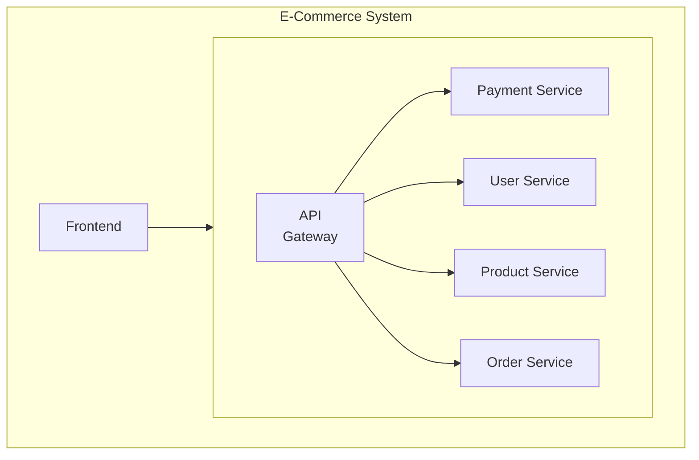

The frontend does not necessarily need to know how each service is implemented or deployed.

It communicates through the interfaces exposed to it.

Similarly, the Order Service may communicate with the Payment Service through another API.

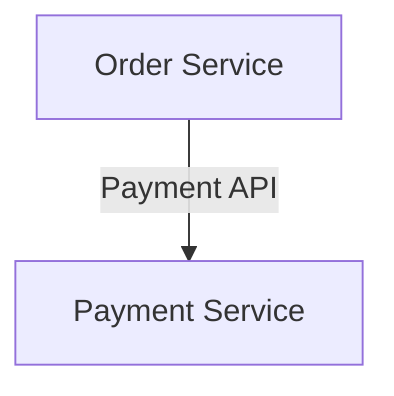

This boundary can allow teams to develop and deploy components independently.

However, APIs do not automatically make a system independent or easy to scale.

If services depend heavily on each other's availability, data structures, and timing, the system can still be tightly coupled.

An API is a boundary. Whether that boundary creates useful independence depends on its design and the dependencies behind it.

---

# 11. Internal APIs vs External APIs

APIs can be categorized by who uses them.

## Internal API

Used within an organization or system.

Example:

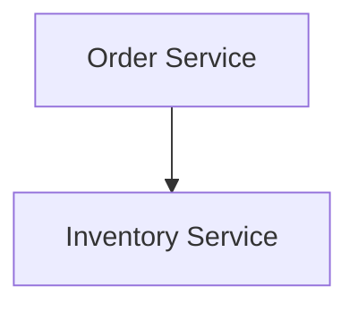

The Inventory Service may expose an internal API to check or reserve stock.

## External API

Exposed to clients or systems outside the organization.

Example:

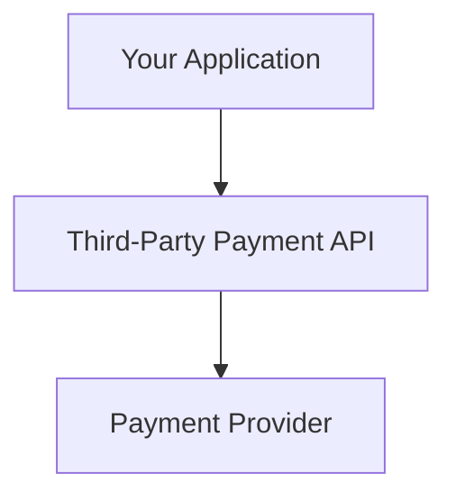

Your application may use an external payment provider's API to create a payment or retrieve payment status.

The provider defines the API contract.

Your application must follow that contract and handle the provider's errors, latency, authentication requirements, and availability.

The terms internal and external describe the relationship between the consumer and provider. They do not, by themselves, determine whether an API is secure or publicly accessible.

---

# 12. APIs Are Not Always REST

A common misconception is:

> "API means REST API."

That is incorrect.

An API is the broader concept of a software interface.

A web API can use different architectural styles or protocols.

| API Style / Technology | Basic Idea                                                             |
| ---------------------- | ---------------------------------------------------------------------- |
| REST                   | Uses resource-oriented interactions and HTTP semantics                 |
| GraphQL                | Lets clients request data through a defined query language and schema  |
| SOAP                   | Uses structured XML messaging and defined service contracts            |
| gRPC                   | Uses remote procedure calls, commonly with Protocol Buffers and HTTP/2 |

These approaches have different design goals, constraints, and trade-offs.

For example:

```text
REST:
GET /api/products/42
```

A GraphQL client might send a query to a GraphQL endpoint asking for selected product fields.

A gRPC client might invoke a defined remote method such as `GetProduct`.

The details of these technologies are covered separately where appropriate.

For now, remember:

**REST is one way to design web APIs. It is not the definition of an API.**

---

# 13. API vs Database

Another common mistake is confusing an API with a database interface.

Consider:

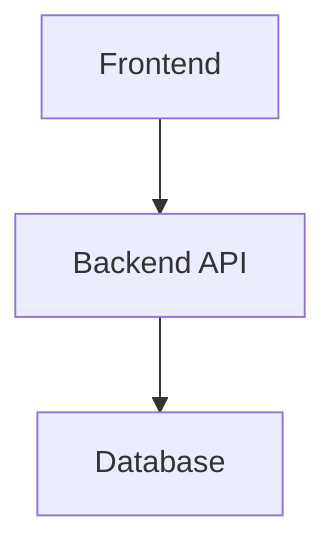

The API exposes selected application operations.

The database provides data storage and query capabilities.

For example:

```text
API:
GET /api/products/42

Database:
SELECT *
FROM products
WHERE id = 42;
```

The API may internally execute that SQL query, but the API is not the query itself.

The backend controls how the database is accessed.

This separation is important for:

* Security
* Business rules
* Data validation
* Database replacement
* Access control
* Maintaining a stable client interface

Directly exposing database credentials or unrestricted database access to an untrusted browser is not an appropriate substitute for a properly designed application interface.

---

# 14. API Security: The Boundary Must Be Enforced

An API is an interface, not a security guarantee.

A backend must treat incoming requests as untrusted.

For example:

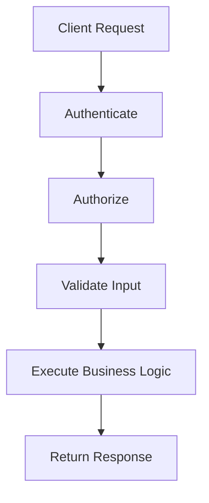

The exact order can vary by architecture, but the security checks must be enforced server-side.

Important considerations include:

* Authentication: Who is making the request?
* Authorization: Is this caller allowed to perform the operation?
* Validation: Is the supplied data acceptable?
* Rate limiting: Is the caller sending too many requests?
* Data exposure: Does the response contain only permitted information?
* Transport security: Is sensitive communication protected using HTTPS?

For example, hiding an administrator button in the frontend is not sufficient to protect an administrator API endpoint.

The backend must enforce the permission check.

---

# 15. API Design Trade-Offs

API design involves balancing different requirements.

| Design Decision              | Potential Benefit                    | Potential Cost                         |
| ---------------------------- | ------------------------------------ | -------------------------------------- |
| Smaller, focused endpoints   | Clear responsibilities               | More requests may be needed            |
| Larger, aggregated responses | Fewer client round trips             | More data and server work              |
| Strict request validation    | Consistent data and safer processing | Additional processing and maintenance  |
| Backward compatibility       | Existing clients continue working    | Old behavior may need to be supported  |
| More detailed responses      | Clients receive useful context       | Greater data exposure and payload size |
| Synchronous API calls        | Immediate result                     | Client waits for the operation         |

There is no single API design that fits every system.

The right choice depends on the consumer, workload, security requirements, latency constraints, and expected evolution.

For example, a mobile application on a slow network may benefit from fewer round trips.

A public API may place greater emphasis on stable contracts and backward compatibility.

A sensitive financial API may require stricter authorization, validation, and auditability.

The design should follow the actual constraints.

---

# 16. What Happens When an API Changes?

APIs evolve as applications grow.

Suppose the original response is:

```json
{
  "id": 42,
  "name": "Laptop"
}
```

Later, the backend changes the field:

```json
{
  "id": 42,
  "productName": "Laptop"
}
```

An older frontend that expects `name` may break.

This is an example of a potentially breaking API change.

API evolution requires attention to:

* Backward compatibility
* Client dependencies
* Deprecation
* Versioning where appropriate
* Documentation
* Testing

A compatible change, such as adding an optional field, is often easier for existing clients to tolerate than renaming or removing a field they rely on.

But compatibility depends on the contract and client behavior.

**System-design principle:** An API is a long-term boundary between components, so changing it can affect every consumer that depends on it.

---

# Key Principle

> An API is a defined interface that allows software components to interact while keeping their internal implementations separate.

Remember the distinction:

```text
API
  = The interface and interaction rules

API Endpoint
  = A particular exposed operation or resource address

API Consumer
  = Software that uses the interface

API Provider
  = Software that implements the interface

API Contract
  = The agreed request, response, and behavior rules
```

---

# Quick Reference

| Term          | Simple Explanation                                       |
| ------------- | -------------------------------------------------------- |
| API           | A defined way for software to interact                   |
| Endpoint      | A particular address or operation exposed by an API      |
| API Client    | Software that sends requests to an API                   |
| API Provider  | Software that implements the API                         |
| API Contract  | Rules governing requests, responses, and behavior        |
| HTTP Method   | Indicates the type of operation requested                |
| Request Body  | Data sent by the client                                  |
| Response Body | Data returned by the provider                            |
| REST          | One architectural style for designing APIs               |
| API Gateway   | A component that provides an entry point to backend APIs |

---

# Knowledge Check

## 1. What is an API?

A defined interface through which software components interact.

## 2. Is an API the same as a server?

No. A server may implement or expose an API, but an API is the interface itself.

## 3. Is every API a REST API?

No. REST is one API architectural style. APIs can use other styles and protocols.

## 4. Why should a frontend communicate with a backend API instead of directly accessing the application's database?

The backend can enforce business rules, authentication, authorization, validation, and controlled data access.

## 5. What is an API contract?

The agreed rules describing how a consumer should make requests and what responses and behavior it can expect.

## 6. Does an API automatically make a system secure?

No. The provider must enforce authentication, authorization, validation, and other necessary security controls.

## 7. What can happen if an API changes incompatibly?

Existing clients that depend on the old contract may stop working correctly.

---

# Final Mental Model

Whenever one software component needs something from another, ask:

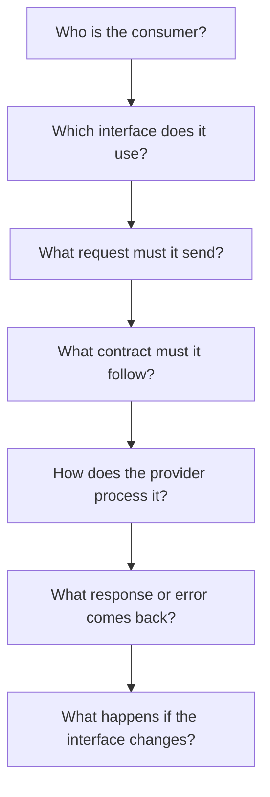

This is the foundation for understanding APIs, REST, service communication, API gateways, and distributed application architecture.
