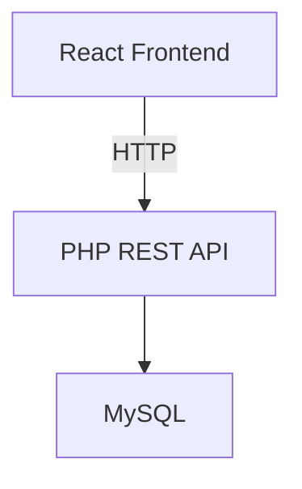
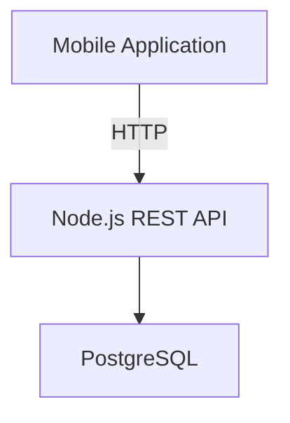
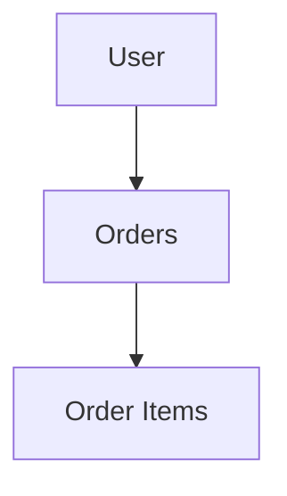
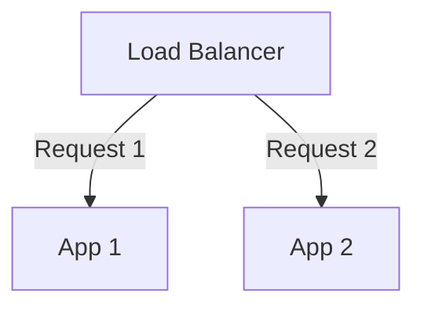
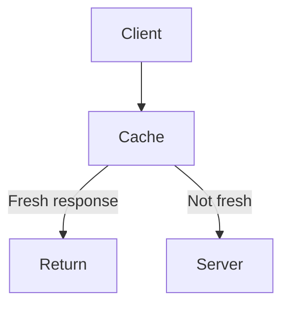
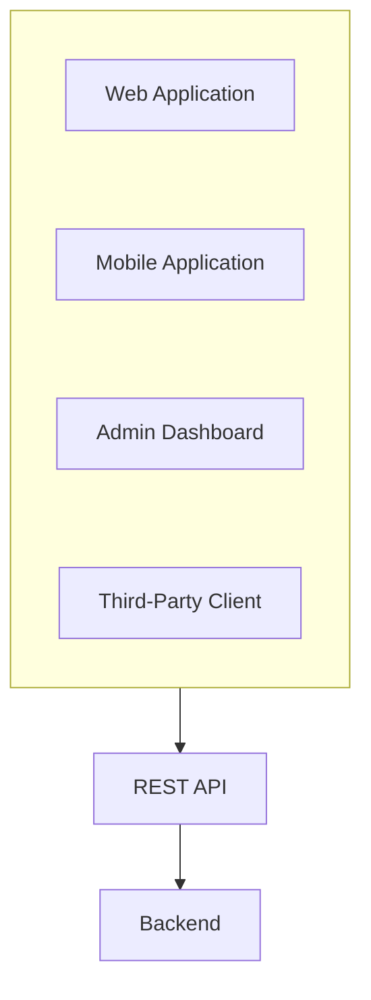
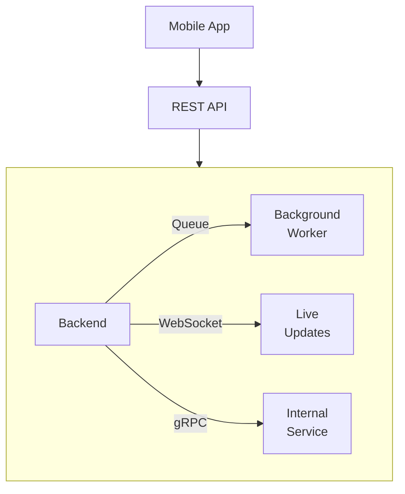
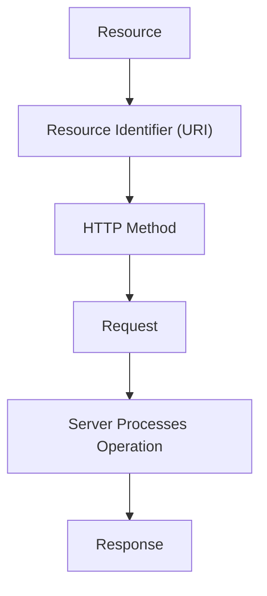
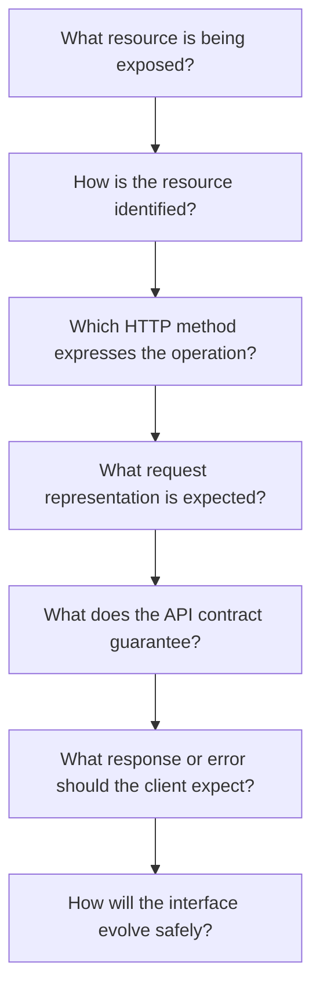

# 01.06 — REST (Representational State Transfer)

## Learning Objectives

By the end of this chapter, you should be able to:

* Explain what REST is and how it relates to web APIs.
* Understand resources, representations, and resource identifiers.
* Use HTTP methods appropriately in RESTful API design.
* Distinguish safe and idempotent HTTP methods.
* Understand HTTP status codes, resource relationships, and stateless communication.
* Design basic REST API endpoints for a real application.
* Recognize common REST design mistakes and trade-offs.

---

# 1. What Is REST?

REST stands for **Representational State Transfer**.

REST is an architectural style for designing networked applications, particularly web APIs.

It describes a set of architectural constraints that help software components communicate through a uniform interface.

In simpler words:

> REST provides a way to design APIs around resources, using a consistent set of rules for interacting with them.

For example, imagine an e-commerce application.

It has resources such as:

* Products
* Customers
* Orders
* Payments

A REST-style API exposes these resources through identifiable URLs and uses HTTP methods to describe the requested operations.

```text
GET    /api/products
GET    /api/products/42
POST   /api/orders
GET    /api/orders/1001
DELETE /api/cart/items/7
```

The API consumer does not need to know how the backend stores or processes the data.

It follows the interface exposed by the server.

## REST Is Not a Programming Language or Framework

REST is not:

* A programming language
* A database
* A web server
* A JavaScript framework
* A specific HTTP library

REST is an architectural style.

You can build REST-style APIs using PHP, Node.js, Python, Java, Go, or other technologies.

For example:



Or:



The programming language does not determine whether an API is RESTful.

Its architectural design and behavior do.

---

# 2. Start With Resources

The central idea in REST is the **resource**.

A resource is something identifiable that the system exposes through its interface.

For an e-commerce application:

```text
Product
Customer
Order
Payment
Review
```

Each resource represents something meaningful in the application domain.

For example:

```text
Product 42
```

is one particular product.

A collection might be:

```text
All Products
```

REST-style APIs commonly identify these resources using URLs.

```text
/api/products
/api/products/42
/api/orders
/api/orders/1001
```

Here:

| URI                | Resource           |
| ------------------ | ------------------ |
| `/api/products`    | Product collection |
| `/api/products/42` | Product 42         |
| `/api/orders`      | Order collection   |
| `/api/orders/1001` | Order 1001         |

The URL identifies the target resource.

The HTTP method indicates what kind of operation the client is requesting.

This distinction is fundamental.

---

# 3. Resources vs Representations

A resource and its representation are not necessarily the same thing.

Suppose the system contains a product:

```text
Product 42
```

Internally, the product may have:

```text
ID
Name
Price
Stock
Supplier
Internal Cost
Created At
Updated At
```

The API does not have to expose every internal field.

It might return:

```json
{
  "id": 42,
  "name": "Laptop",
  "price": 55000,
  "inStock": true
}
```

This JSON document is a **representation** of the resource.

```text
Resource:
Product 42
      |
      v
API Representation:
{
  "id": 42,
  "name": "Laptop",
  "price": 55000
}
```

The same resource could have different representations.

For example:

```text
JSON representation
HTML representation
XML representation
```

The underlying resource is still the same product.

The representation is how the resource's information is communicated to the client.

**Important:** A REST API does not need to expose its database tables directly. It exposes representations designed for its interface.

---

# 4. Resource-Oriented URL Design

REST-style URLs generally identify resources rather than describing individual actions.

Consider these two approaches.

## Action-Oriented Design

```text
/getProducts
/getProductById?id=42
/createNewProduct
/deleteProduct?id=42
```

These URLs emphasize the operation.

## Resource-Oriented Design

```text
GET    /api/products
GET    /api/products/42
POST   /api/products
DELETE /api/products/42
```

The resource-oriented approach uses a consistent URL structure.

The HTTP method communicates the operation.

For example:

```text
GET /api/products/42
```

means:

> Retrieve the representation of product 42.

While:

```text
DELETE /api/products/42
```

means:

> Request deletion of product 42.

The resource identifier stays the same. The method changes.

This makes the interface easier to understand and maintain.

## Use Nouns for Resources

Common resource names:

```text
/products
/users
/orders
/payments
/reviews
```

For nested resources:

```text
/users/15/orders
/orders/1001/items
/products/42/reviews
```

These paths express relationships between resources.

Avoid turning every endpoint into a sentence describing a backend function.

However, not every operation maps neatly to basic CRUD. Some domain operations may require action-oriented endpoints or other explicit modeling. REST does not require forcing every business operation into an artificial resource structure.

---

# 5. HTTP Methods in REST

HTTP methods provide standardized semantics for requests.

REST-style APIs commonly use:

* GET
* POST
* PUT
* PATCH
* DELETE

Let's understand each one.

## GET — Retrieve a Resource

Example:

```http
GET /api/products/42
```

The client requests the product representation.

Possible response:

```http
HTTP/1.1 200 OK
Content-Type: application/json
```

```json
{
  "id": 42,
  "name": "Laptop",
  "price": 55000
}
```

GET should not request a change to the server's resource state.

For example:

```text
GET /api/products/42
```

should retrieve product information, not decrease stock or create an order.

GET is a **safe** and **idempotent** method.

These terms are explained later.

## POST — Submit Data or Request Processing

Example:

```http
POST /api/products
Content-Type: application/json
```

```json
{
  "name": "Keyboard",
  "price": 1500
}
```

The server may create a new product.

Possible response:

```http
HTTP/1.1 201 Created
Location: /api/products/43
```

```json
{
  "id": 43,
  "name": "Keyboard",
  "price": 1500
}
```

POST is commonly used to create resources or submit data for processing.

However, POST is not limited to creating database records.

It can also be used for operations such as:

```text
POST /api/orders/1001/cancel
POST /api/reports/generate
POST /api/payments/1001/confirm
```

These examples model domain operations where a simple resource update may not fully express the intended behavior.

POST is generally not safe or idempotent by default.

Repeated POST requests may produce repeated effects unless the API implements appropriate safeguards.

## PUT — Replace a Resource Representation

Example:

```http
PUT /api/products/42
Content-Type: application/json
```

```json
{
  "name": "Laptop Pro",
  "price": 65000,
  "inStock": true
}
```

PUT requests that the target resource's state be created or replaced according to the method's semantics.

For an existing product, the API may treat this as replacing the relevant resource representation.

A common conceptual example:

```text
Before:
{
  "name": "Laptop",
  "price": 55000
}

PUT request:
{
  "name": "Laptop Pro",
  "price": 65000
}

After:
{
  "name": "Laptop Pro",
  "price": 65000
}
```

The exact handling of omitted fields depends on the API contract and resource model, but PUT is generally intended to represent replacement rather than a small partial modification.

PUT is idempotent.

## PATCH — Partially Modify a Resource

PATCH is used to apply partial modifications to a resource.

Example:

```http
PATCH /api/products/42
Content-Type: application/json
```

```json
{
  "price": 60000
}
```

The intended change is limited to the price.

Conceptually:

```text
Before:
{
  "name": "Laptop",
  "price": 55000,
  "inStock": true
}

PATCH:
{
  "price": 60000
}

After:
{
  "name": "Laptop",
  "price": 60000,
  "inStock": true
}
```

PATCH does not have a universally defined request-body format. The API must define how the patch document is interpreted.

PATCH is not guaranteed to be idempotent. It depends on the specific operation.

For example, setting a price to a fixed value is naturally idempotent, while an operation that increments a value may not be.

## DELETE — Remove a Resource

Example:

```http
DELETE /api/products/42
```

The client requests deletion of product 42.

Possible response:

```http
HTTP/1.1 204 No Content
```

The server may implement deletion as:

* Physical deletion
* Soft deletion
* A state transition
* Another domain-specific behavior

The API contract determines the actual behavior.

DELETE is defined as idempotent in HTTP semantics, even if repeated requests return different status codes.

For example:

```text
First DELETE:
204 No Content

Second DELETE:
404 Not Found
```

The responses differ, but the intended final state is still that the resource is absent.

---

# 6. HTTP Method Comparison

| Method | Typical Purpose                | Safe? | Idempotent?    |
| ------ | ------------------------------ | ----- | -------------- |
| GET    | Retrieve a resource            | Yes   | Yes            |
| POST   | Submit data / create / process | No    | No, by default |
| PUT    | Replace or create target state | No    | Yes            |
| PATCH  | Partially modify a resource    | No    | Not guaranteed |
| DELETE | Remove a resource              | No    | Yes            |

These properties come from HTTP semantics, not simply from how a developer chooses to implement a route.

An API should respect the semantics of the method it uses.

---

# 7. Safe vs Idempotent

These two terms are easy to confuse.

## Safe

A method is safe when the client is not requesting a change to the resource's state.

For example:

```http
GET /api/products/42
```

The client is requesting information.

The server may still create logs, update metrics, or perform other incidental internal work. Safe does not mean that absolutely nothing changes anywhere.

It means the requested operation is read-only with respect to the target resource state.

## Idempotent

An operation is idempotent if making the same request multiple times has the same intended effect on the resource state as making it once.

Mathematically:

$$
f(f(x)) = f(x)
$$

For example:

```http
PUT /api/products/42
```

with:

```json
{
  "price": 60000
}
```

Assuming the API defines the request as setting the same target state, sending it repeatedly leaves the product at the same price.

Compare this with:

```text
POST /api/counter/increment
```

If every request increments the counter, repeating the request changes the state repeatedly.

## Practical Difference

| Question                                             | Safe | Idempotent  |
| ---------------------------------------------------- | ---- | ----------- |
| Does the request intend to change resource state?    | No   | It may      |
| Can repeated requests have the same intended effect? | Yes  | Yes         |
| Example                                              | GET  | PUT, DELETE |

GET is both safe and idempotent.

PUT and DELETE are idempotent but not safe.

POST is not idempotent by default.

**System-design connection:** Idempotency becomes especially important when retries occur after timeouts or network failures.

---

# 8. Designing a Product REST API

Let's design a basic API for an online store.

Assume the system manages products.

## Retrieve All Products

```http
GET /api/products
```

Example response:

```json
{
  "data": [
    {
      "id": 42,
      "name": "Laptop",
      "price": 55000
    },
    {
      "id": 43,
      "name": "Keyboard",
      "price": 1500
    }
  ]
}
```

## Retrieve One Product

```http
GET /api/products/42
```

## Create a Product

```http
POST /api/products
```

Request:

```json
{
  "name": "Mouse",
  "price": 800
}
```

## Replace a Product

```http
PUT /api/products/42
```

## Partially Update a Product

```http
PATCH /api/products/42
```

Request:

```json
{
  "price": 750
}
```

## Delete a Product

```http
DELETE /api/products/42
```

The resulting interface is predictable because it consistently identifies the product resource and uses HTTP methods for the requested operation.

---

# 9. Resource Relationships and Nested URLs

Resources often have relationships.

For example:



A REST-style API can express these relationships through nested paths.

```text
GET /api/users/15/orders
GET /api/orders/1001/items
GET /api/products/42/reviews
```

These paths help communicate the relationship between resources.

However, deeply nested URLs can become difficult to maintain.

For example:

```text
/api/users/15/orders/1001/items/7/products/42/reviews
```

This is usually a sign that the API may be exposing too much of the internal relationship structure.

A simpler endpoint may be more appropriate:

```text
GET /api/products/42/reviews
```

or:

```text
GET /api/order-items/7
```

The right structure depends on the resource relationships and the operations clients actually need.

---

# 10. Filtering, Sorting, and Pagination

Collection endpoints can return large amounts of data.

Consider:

```http
GET /api/products
```

If the database contains one million products, returning every product in a single response would be inefficient.

REST-style APIs commonly use query parameters for filtering, sorting, and pagination.

## Filtering

```http
GET /api/products?category=laptops
```

The API returns products matching the category.

## Sorting

```http
GET /api/products?sort=price
```

The API may return products ordered by price.

The exact sorting rules should be documented.

## Pagination

```http
GET /api/products?page=2&limit=20
```

This example requests a page of results.

A response might be:

```json
{
  "data": [
    {
      "id": 42,
      "name": "Laptop",
      "price": 55000
    }
  ],
  "pagination": {
    "page": 2,
    "limit": 20,
    "total": 350
  }
}
```

The example response is abbreviated.

For large or frequently changing datasets, cursor-based pagination may be more appropriate than page-number pagination.

Pagination reduces response size and helps control database, network, and client resource usage.

---

# 11. Statelessness in REST

Statelessness is one of the central REST architectural constraints.

In REST, each request should contain the information necessary for the server to understand and process that request.

The server should not need to rely on hidden conversational context from a previous request to interpret the current request.

For example:

```http
GET /api/orders/1001
Authorization: Bearer <token>
```

The request carries the information required to identify the requested order and authenticate the caller, subject to the API's authentication design.

The server may still use databases, caches, session stores, and other persistent systems.

**Stateless does not mean the entire application has no stored state.**

It means the REST interaction does not depend on the server retaining client-specific conversational state between requests.

For example:

```text
Request 1:
GET /api/products/42

Request 2:
GET /api/orders/1001
```

Each request must be independently understandable.

This can make it easier to distribute requests across multiple application instances.



However, statelessness does not automatically guarantee scalability.

Shared database capacity, authentication infrastructure, network resources, and other dependencies still matter.

REST statelessness is covered further when we study stateless application design.

---

# 12. REST and HTTP Caching

REST-style systems can take advantage of HTTP caching.

For example:

```http
GET /api/products/42
```

The server may return:

```http
HTTP/1.1 200 OK
Cache-Control: public, max-age=300
```

This indicates that the response may be stored by permitted caches for up to 300 seconds, subject to HTTP caching rules.

For resources that change infrequently, caching can reduce repeated work.



Caching behavior must be designed carefully.

Sensitive, personalized, or authorization-dependent responses require appropriate cache directives and cache-key handling.

Incorrect caching can expose private data or return stale information.

HTTP caching is covered in detail in Level 3.

---

# 13. REST and API Versioning

APIs change over time.

Suppose version 1 returns:

```json
{
  "id": 42,
  "name": "Laptop"
}
```

A later version may change the response structure.

One approach is URL versioning:

```text
/api/v1/products/42
/api/v2/products/42
```

Another approach can use version information in headers or media types.

Versioning is not a mandatory REST constraint.

The goal is to manage incompatible changes while supporting existing consumers.

Before introducing a new version, consider whether the change can be made compatibly.

For example, adding an optional response field may not require a new version if existing clients tolerate additional fields.

Removing a required field or changing its meaning can be breaking.

Versioning adds operational and maintenance costs because multiple contracts may need to be supported simultaneously.

---

# 14. Common REST API Mistakes

## Mistake 1: Using GET to Change Data

Bad example:

```http
GET /api/products/42/delete
```

GET is defined as safe.

A client, browser, crawler, or cache may treat GET differently from a method intended to modify resource state.

Use an appropriate method, such as DELETE, when the operation represents resource deletion.

## Mistake 2: Treating Every Operation as CRUD

Not every business operation is simply create, read, update, or delete.

For example:

```text
Cancel an order
Approve a loan
Confirm a payment
Generate a report
```

These operations may involve workflows, authorization, validation, and state transitions.

Model them explicitly instead of forcing misleading CRUD semantics.

## Mistake 3: Exposing Database Tables Directly

A database schema is not automatically a good public API design.

Internal tables may change as the application evolves.

The API should expose meaningful resources and representations rather than blindly mirroring internal storage.

## Mistake 4: Ignoring HTTP Semantics

Using POST for everything or using GET to modify data removes useful meaning from the interface.

Correct method semantics improve predictability, caching, interoperability, and safe client behavior.

## Mistake 5: Returning Everything in One Response

Large responses can waste bandwidth, increase processing time, and make clients slower.

Use appropriate filtering, pagination, and response design.

## Mistake 6: Assuming REST Guarantees Security

REST does not automatically provide authentication, authorization, encryption, or validation.

These must be designed and implemented separately.

---

# 15. When REST Is Useful

REST-style APIs are often suitable when:

* The application exposes identifiable resources.
* Clients need predictable HTTP-based operations.
* The system benefits from standard HTTP methods and status codes.
* Multiple clients need to consume the same backend.
* HTTP caching and intermediaries are useful.
* The API should be understandable to a broad range of developers.

For example:



A single API contract can serve multiple types of clients, subject to authentication, authorization, and client-specific requirements.

---

# 16. When REST May Not Be the Best Fit

REST is not the answer to every communication problem.

Different requirements may favor different approaches.

| Requirement                                    | Other Approach to Consider               |
| ---------------------------------------------- | ---------------------------------------- |
| Complex client-controlled data selection       | GraphQL                                  |
| Strongly typed service-to-service RPC          | gRPC                                     |
| Continuous bidirectional communication         | WebSockets                               |
| Background event processing                    | Message queues or event-driven messaging |
| Internal function calls within one application | In-process function or method calls      |

These technologies solve different problems and can coexist in the same architecture.

For example:



The decision should be based on the communication requirements, not on the popularity of a technology.

---

# Key Principle

> REST organizes an API around resources and uses a consistent interface, including HTTP method semantics, to interact with those resources.

A useful mental model:



For example:

```http
PATCH /api/products/42
```

means the client is requesting a partial modification of the resource identified as product 42.

The API contract defines the accepted patch format and the resulting behavior.

---

# Quick Reference

| Concept        | Remember                                                      |
| -------------- | ------------------------------------------------------------- |
| REST           | Architectural style for networked systems                     |
| Resource       | Identifiable thing exposed through an interface               |
| Representation | Data describing a resource                                    |
| URI            | Identifier used to refer to a resource                        |
| GET            | Retrieve; safe and idempotent                                 |
| POST           | Submit data or request processing; not idempotent by default  |
| PUT            | Replace or create target state; idempotent                    |
| PATCH          | Apply partial modification; idempotency depends on operation  |
| DELETE         | Request removal; idempotent                                   |
| Statelessness  | Each request contains the information needed to understand it |
| HTTP caching   | Reuse eligible responses according to caching rules           |
| Versioning     | Manage incompatible API evolution                             |

---

# Knowledge Check

## 1. What is REST?

An architectural style for designing networked applications and APIs around a uniform interface and other architectural constraints.

## 2. What is a resource?

An identifiable entity or concept exposed through the API, such as a product or order.

## 3. What is the difference between a resource and its representation?

The resource is the thing being identified. The representation is the data format used to communicate information about it.

## 4. Why is GET considered safe?

Because it is not intended to change the target resource's state.

## 5. What does idempotent mean?

Repeated requests have the same intended effect on resource state as one request.

## 6. Is every PATCH request idempotent?

No. PATCH is not guaranteed to be idempotent; its behavior depends on the operation.

## 7. Does REST statelessness mean the application cannot store sessions or data?

No. It means each request must be independently understandable without relying on hidden conversational state from previous requests.

## 8. Is REST the same as CRUD?

No. CRUD describes basic data operations. REST is an architectural style, and RESTful APIs can represent more complex domain operations.

---

# Final Mental Model

When designing or evaluating a REST API, ask:



The goal is not simply to create URLs that work.

The goal is to create a predictable, understandable, and maintainable interface between software components.
