# 01.07 — Sessions & Cookies

## Learning Objectives

By the end of this chapter, you should be able to:

* Explain why websites need to remember information across HTTP requests.
* Understand cookies and how browsers store and send them.
* Understand server-side sessions and how session identifiers connect a browser to stored session data.
* Trace a login session from authentication to logout.
* Distinguish cookies, sessions, and tokens.
* Understand session expiration, session fixation, and session hijacking.
* Recognize how sessions affect application architecture, scaling, and security.

---

# 1. The Problem: HTTP Does Not Remember You

Imagine opening an online shopping website.

You log in, browse products, add items to your cart, and move to checkout.

The website needs to recognize that all these actions belong to the same user.

But HTTP is fundamentally a **stateless protocol**.

Each HTTP request is processed as an independent request. HTTP itself does not automatically remember the identity or previous actions of the client.

Consider:

```text
Request 1:
GET /login

Request 2:
POST /login

Request 3:
GET /account

Request 4:
GET /cart
```

Without an additional mechanism, the server does not automatically know that all four requests came from the same authenticated user.

The server needs a way to associate requests with a particular user or session.

Two important mechanisms help:

* Cookies
* Sessions

They are related, but they are not the same thing.

**Core idea:**

> A cookie is a small piece of data stored by the browser. A session is a way to maintain information associated with a client across multiple requests.

---

# 2. What Is a Cookie?

A cookie is a small piece of data that a website asks the browser to store.

The browser can send that cookie back to the website in subsequent HTTP requests, subject to the cookie's rules.

For example, a server sends:

```http
HTTP/1.1 200 OK
Set-Cookie: theme=dark; Path=/; Max-Age=86400
```

The browser stores the cookie.

When making a later eligible request, the browser may send:

```http
GET /account HTTP/1.1
Host: example.com
Cookie: theme=dark
```

The browser is effectively saying:

> "For this request, here is the cookie data associated with this website."

The server can use the cookie value to make decisions.

For example:

```text
Cookie:
theme=dark
```

The application may use it to remember the user's preferred theme.

A cookie can contain a preference, an identifier, or other small data. It is not automatically a server-side session.

---

# 3. How a Cookie Works

Let's follow the lifecycle.

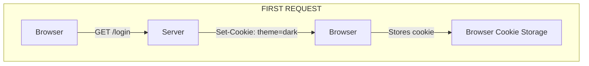

Later:

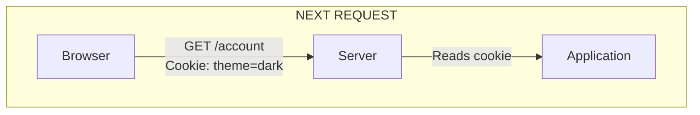

The browser handles storing and sending the cookie according to its attributes and browser policies.

The application decides what the cookie means.

For example, the application may interpret:

```text
theme=dark
```

as a user-interface preference.

Or it may interpret:

```text
session_id=abc123
```

as an identifier that refers to a server-side session.

The second example is the foundation of many traditional web login systems.

---

# 4. What Is a Session?

A session is a mechanism for associating information with a client across multiple requests.

In a traditional server-side session architecture, the session data is stored on the server or in a server-accessible store.

For example:

```text
Session ID:
abc123

Session Data:
{
    user_id: 42,
    role: "customer",
    cart_id: 901
}
```

The browser typically stores only the session identifier in a cookie.

The actual session data remains on the server.

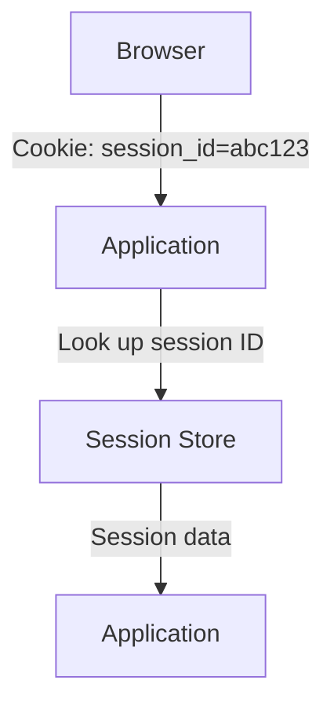

The session store might be:

* Application memory
* A database
* Redis
* Another shared storage system

The exact choice depends on the architecture.

**Important:** A session is not necessarily a cookie. A cookie is simply one common way to transport a session identifier between the browser and server.

---

# 5. Cookie vs Session

This distinction is essential.

| Cookie                                  | Session                                                          |
| --------------------------------------- | ---------------------------------------------------------------- |
| Stored by the browser                   | Often stored on the server or in a shared session store          |
| Sent with eligible HTTP requests        | Identified or accessed using information supplied by the request |
| Can contain preferences or identifiers  | Maintains information associated with a client                   |
| Has browser-enforced attributes         | Has application-defined lifecycle and storage behavior           |
| Can exist without a server-side session | Can be implemented without cookies, although cookies are common  |

A typical session-based login works like this:

```text
Browser Cookie:
session_id=abc123

Server Session Store:
abc123 → user_id=42
```

The cookie contains the identifier.

The server-side session store contains the associated information.

Do not confuse the session ID with the actual session data.

---

# 6. Building a Login Session

Let's use a simple example.

A user logs in to an e-commerce application.

## Step 1: User Submits Credentials

The browser sends:

```http
POST /login
Content-Type: application/json
```

```json
{
  "email": "user@example.com",
  "password": "user-password"
}
```

The credentials are sent over HTTPS in a properly secured production application.

The server validates the submitted credentials.

## Step 2: Server Authenticates the User

The backend checks the credentials against its user records.

Conceptually:

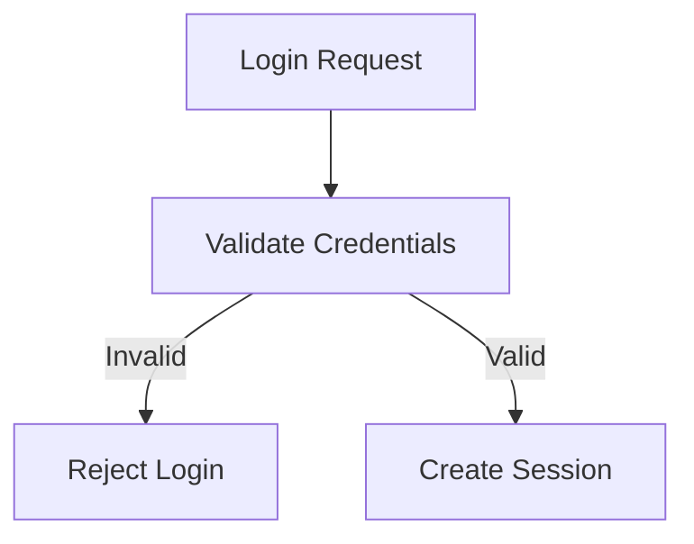

The server must never store plaintext passwords. Passwords should be stored using an appropriate password-hashing mechanism.

Authentication details are covered in the next chapter.

## Step 3: Server Creates a Session

After successful authentication, the application creates a session.

For example:

```text
Session ID:
random-session-id

Session Data:
{
    user_id: 42,
    authenticated: true
}
```

The session identifier must be unpredictable and generated securely.

## Step 4: Server Sends a Cookie

The server sends a session cookie:

```http
HTTP/1.1 200 OK
Set-Cookie: __Host-session=abc123; Path=/; Secure; HttpOnly; SameSite=Lax
```

This is an illustrative cookie value. Production session identifiers must be securely generated and protected.

The browser stores the cookie.

## Step 5: Browser Makes an Authenticated Request

The user opens the account page.

The browser sends:

```http
GET /account
Cookie: __Host-session=abc123
```

The server reads the session identifier and retrieves the associated session.

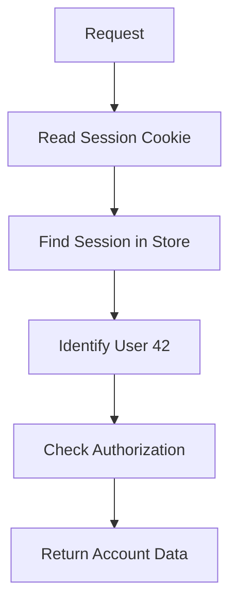

The browser does not need to send the user's password with every request.

Instead, it sends the session cookie, which refers to the authenticated session.

---

# 7. The Complete Session Lifecycle

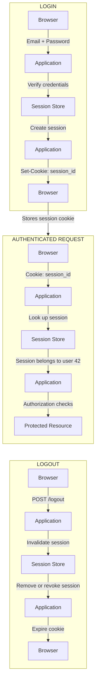

The server-side invalidation matters.

Simply deleting a cookie in the browser does not necessarily invalidate a session that still exists on the server.

If someone has copied the session identifier, that identifier might remain usable until the server invalidates or expires it.

---

# 8. Important Cookie Attributes

Cookies can have attributes that control when and how the browser stores and sends them.

Consider:

```http
Set-Cookie: __Host-session=abc123; Path=/; Secure; HttpOnly; SameSite=Lax
```

Let's examine the important attributes.

## Secure

```text
Secure
```

The browser sends the cookie only over secure channels, normally HTTPS.

This helps prevent the cookie from being sent over unencrypted HTTP.

Authentication cookies should generally use Secure in production.

## HttpOnly

```text
HttpOnly
```

This prevents ordinary JavaScript access through APIs such as `document.cookie`.

It reduces the risk of session cookies being stolen through certain types of client-side script injection.

However, HttpOnly does not prevent an attacker from performing actions through a compromised page in the victim's browser.

It is an important defense, not a complete solution to cross-site scripting.

## SameSite

```text
SameSite=Lax
```

SameSite controls when browsers send cookies in cross-site contexts.

Common values include:

| Value    | General Behavior                                                                     |
| -------- | ------------------------------------------------------------------------------------ |
| `Strict` | Restricts sending cookies in cross-site contexts                                     |
| `Lax`    | Allows cookies in certain cross-site top-level navigations, subject to browser rules |
| `None`   | Allows cross-site cookie use, subject to browser policies; requires Secure           |

SameSite can help reduce certain cross-site request forgery (CSRF) risks.

However, cookie behavior depends on the browser and request context. SameSite should not be treated as a complete replacement for CSRF defenses where those are needed.

## Path

```text
Path=/
```

Specifies the URL path scope for which the browser sends the cookie.

For example:

```text
Path=/account
```

restricts the cookie to matching paths under `/account`, subject to cookie path-matching rules.

Path is not a strong security boundary between applications on the same host.

## Domain

```text
Domain=example.com
```

Controls which hosts may receive the cookie.

Cookies without a Domain attribute are host-only cookies, which is generally preferable for sensitive session cookies.

Setting a Domain attribute can broaden the set of hosts that receive the cookie.

## Max-Age and Expires

These attributes control cookie persistence.

Example:

```text
Max-Age=3600
```

This specifies a lifetime of 3,600 seconds, or one hour, after which the browser should treat the cookie as expired.

A cookie without Max-Age or Expires is generally a session cookie, although exact browser behavior and session restoration can vary.

A browser cookie's lifetime and the server-side session's lifetime are separate concerns.

The server should enforce session expiration independently.

---

# 9. The __Host- Cookie Prefix

You may encounter:

```http
Set-Cookie: __Host-session=abc123; Path=/; Secure; HttpOnly; SameSite=Lax
```

The `__Host-` prefix is a browser-enforced cookie prefix with specific requirements.

For supporting browsers, a cookie using this prefix must:

* Be set over a secure connection.
* Include the Secure attribute.
* Use `Path=/`.
* Not include a Domain attribute.

This helps restrict the cookie to the host that set it.

It can be useful for sensitive session cookies when the application can meet these requirements.

---

# 10. Where Should Session Data Be Stored?

The storage location affects the architecture.

## Option A: Application Memory

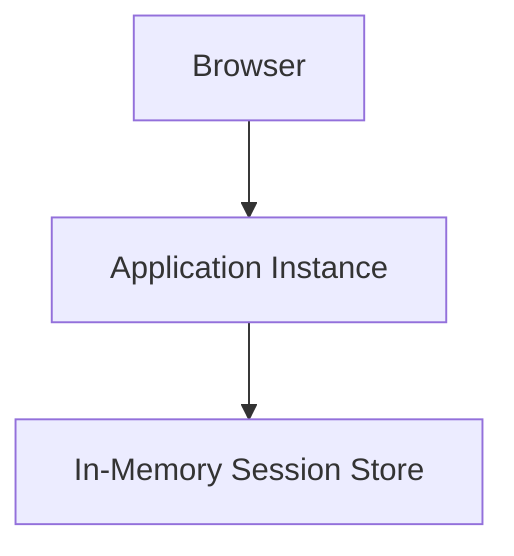

Session data is stored in the memory of an application process or instance.

Advantages:

* Fast access
* Simple for development and small deployments

Limitations:

* Session data may disappear when the process restarts.
* Other application instances cannot automatically access that memory.
* Horizontal scaling becomes more difficult.

Consider:

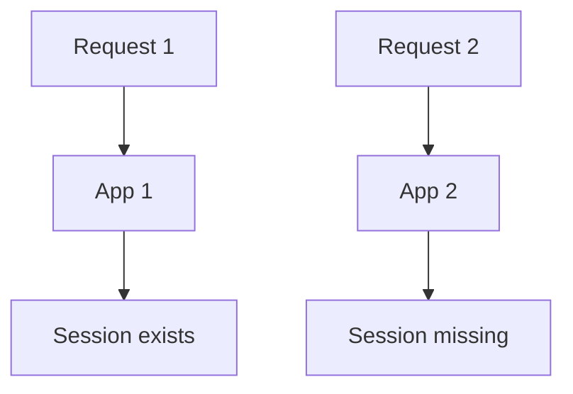

If App 2 does not share App 1's session data, the user may appear logged out.

## Option B: Database

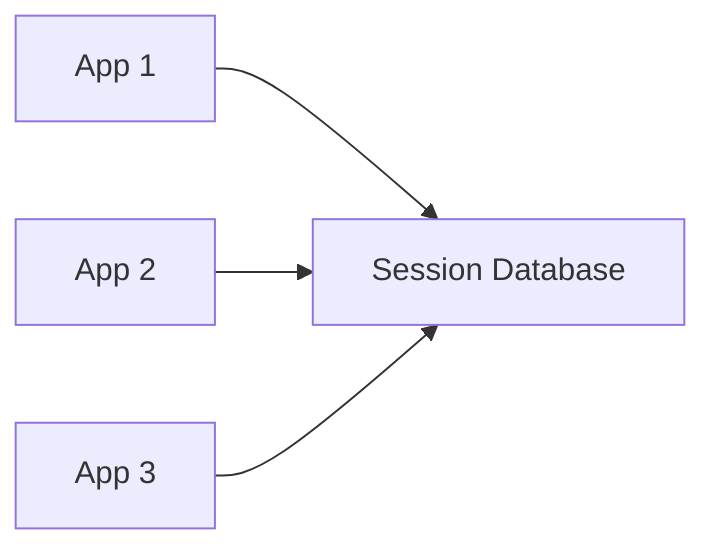

All application instances can retrieve session data from a shared database.

Advantages:

* Shared access
* Persistence
* Centralized session management

Costs:

* Database queries and storage
* Additional database load
* Expiration and cleanup management

## Option C: Redis

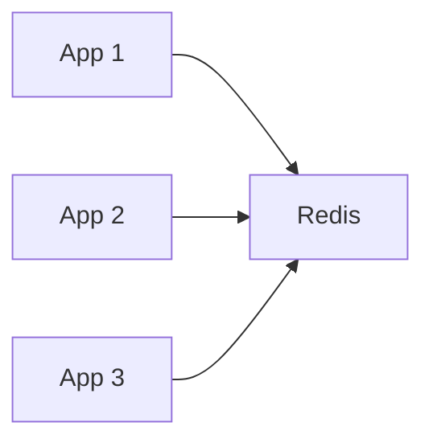

Redis is commonly used as a shared session store because it provides fast access to data in memory and supports expiration mechanisms.

Advantages:

* Shared session access
* Fast lookups
* Built-in expiration support
* Useful for horizontally scaled applications

Costs:

* Additional infrastructure
* Memory consumption
* Availability and failure considerations
* Operational complexity

Redis is not automatically the right choice for every application.

For a small application, an existing database or framework-managed session store may be sufficient.

The correct choice depends on traffic, persistence requirements, infrastructure, and operational needs.

---

# 11. Sessions and Horizontal Scaling

Let's connect sessions to the scaling concepts from Level 2.

Suppose your application has one instance:

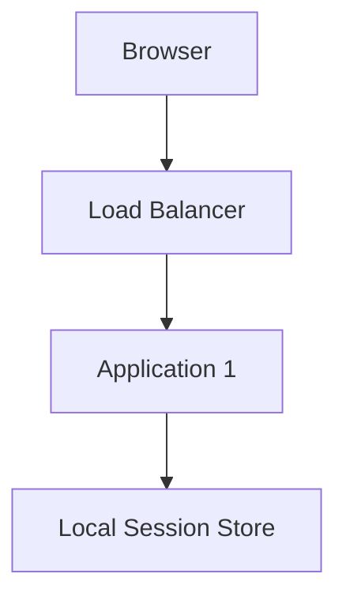

Everything works.

Now traffic increases, and you add two more instances.

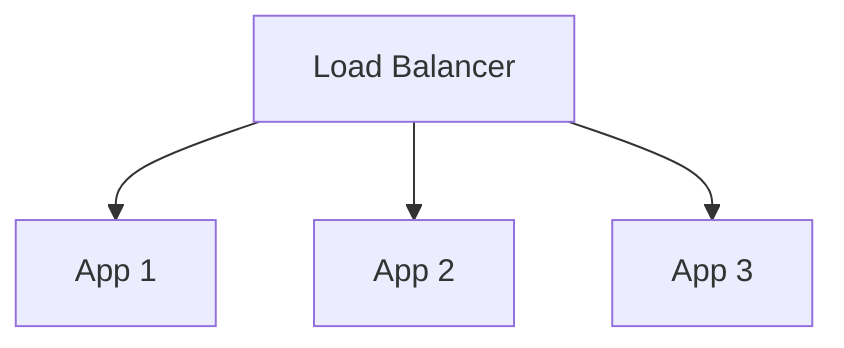

If sessions are stored only in local memory, the application may have a problem.

A user's next request may reach a different instance.

## Option 1: Sticky Sessions

The load balancer tries to send requests from a particular client to the same application instance.

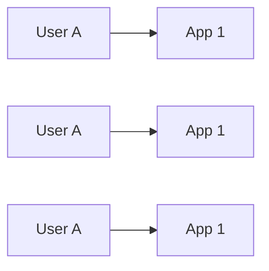

This can reduce session-sharing requirements for some deployments.

However:

* It does not eliminate the need to handle instance failure.
* It can lead to uneven traffic distribution.
* It can make scaling and failover more complicated.

Sticky sessions are a routing technique, not a complete session architecture.

## Option 2: Shared Session Store

All application instances use a common session store.

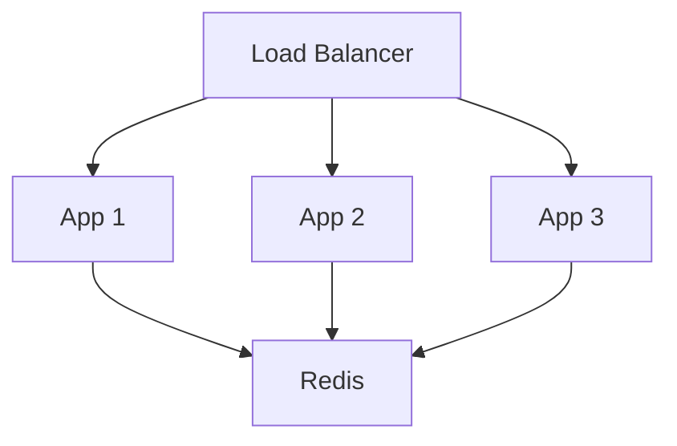

Now any application instance can retrieve the session.

This often supports more flexible horizontal scaling.

But the shared store becomes another dependency that must be sized, secured, monitored, and made sufficiently available.

**Key principle:** Scaling the application requires thinking about where its state lives.

---

# 12. Sessions vs Tokens

Sessions and tokens are often discussed together, but they represent different concepts.

A session is a mechanism for maintaining client-associated state.

A token is a piece of data that can carry claims, credentials, or other information used in an authentication or authorization system.

A traditional session-based design might work like this:

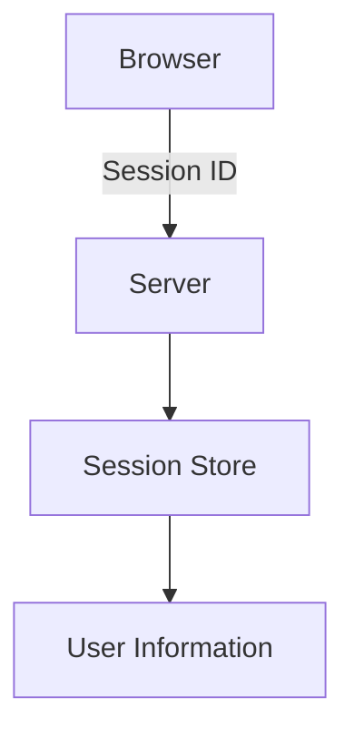

A token-based design might work like this:

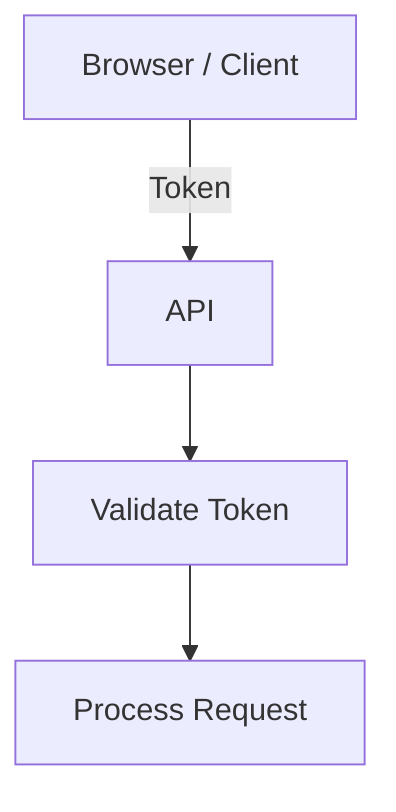

For example, a signed JWT may contain claims about a subject and expiration.

A server can validate its signature and claims without necessarily looking up a traditional server-side session record for every request.

However, token-based systems may still require server-side state for:

* Revocation
* Session management
* Refresh-token rotation
* Permission changes
* Risk controls

A token is not automatically a session, and a session is not automatically a token.

A cookie can carry a session identifier or a token. The transport mechanism and the authentication design are separate decisions.

---

# 13. Session Security

Session identifiers are sensitive credentials.

Anyone who obtains a valid session identifier may be able to act as the associated user, depending on the application's controls.

This makes session protection essential.

## Session Hijacking

Session hijacking occurs when an attacker obtains or takes control of a valid session identifier and uses it to impersonate the session owner.

For example:

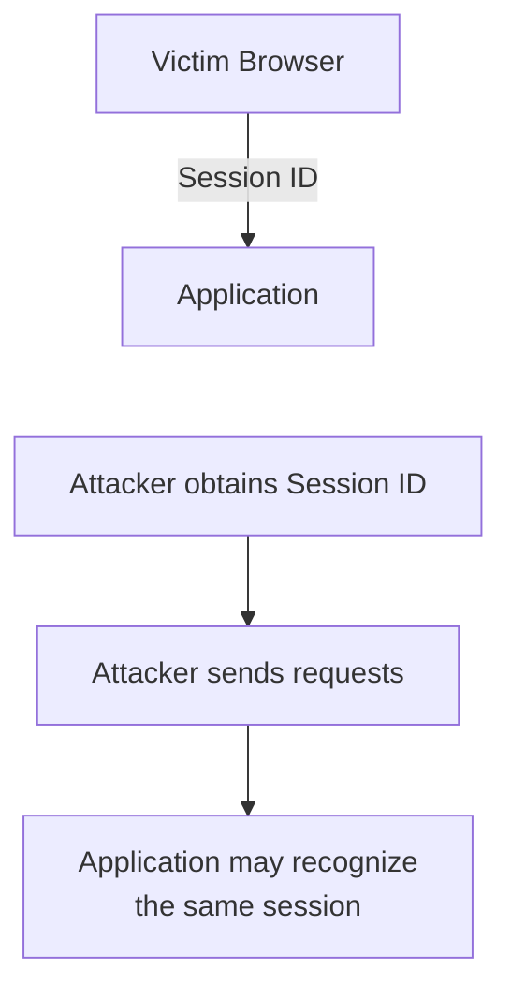

Possible defenses include:

* HTTPS
* Secure cookies
* HttpOnly cookies
* Appropriate SameSite settings
* Strong, unpredictable session identifiers
* Session expiration
* Session invalidation
* Protection against cross-site scripting
* Appropriate CSRF defenses

No single control eliminates every session attack.

## Session Fixation

Session fixation is an attack in which an attacker causes a victim to use a session identifier known to the attacker.

If the application authenticates the user without replacing that identifier, the attacker may be able to reuse it.

A key defense is:

> Regenerate the session identifier after successful authentication and other important privilege changes.

For example:

```text
Before Login:
Session ID A

Successful Login:
Invalidate A
Create Session ID B

Authenticated Session:
Session ID B
```

The new identifier should be securely generated.

This prevents an attacker from relying on a previously known anonymous session identifier.

## Session Expiration

Sessions should have an appropriate lifetime.

Two common policies are:

| Policy           | Meaning                                        |
| ---------------- | ---------------------------------------------- |
| Idle timeout     | Session expires after a period of inactivity   |
| Absolute timeout | Session expires after a maximum total lifetime |

For example:

```text
Idle timeout: 30 minutes
Absolute timeout: 12 hours
```

These values are illustrative, not universal recommendations.

The appropriate values depend on the sensitivity of the application, user experience, and threat model.

The server must enforce the expiration rules.

Expiring a browser cookie alone does not necessarily invalidate a server-side session.

---

# 14. Logout and Session Invalidation

A secure logout should invalidate the authenticated session on the server.

A typical flow:

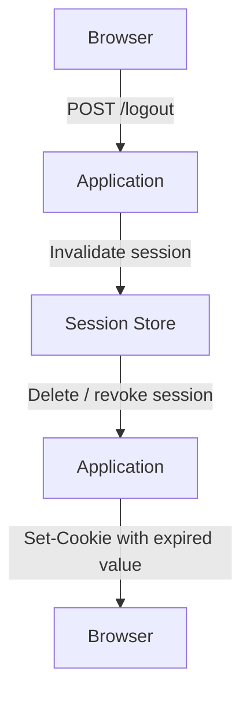

The browser can be instructed to remove its cookie:

```http
Set-Cookie: __Host-session=; Path=/; Max-Age=0; Secure; HttpOnly; SameSite=Lax
```

The cookie attributes should match the original cookie's scope where necessary for the browser to remove it.

But the most important operation for a server-side session is invalidating the server-side session record.

After logout, a previously issued session identifier should no longer authorize access.

For systems that support multiple devices, logging out one device and logging out all devices may require different session-management behavior.

---

# 15. Sessions and CSRF

CSRF stands for Cross-Site Request Forgery.

It involves tricking a user's browser into sending an unwanted request to a website where the user is authenticated.

Cookie-based authentication is relevant because browsers may automatically attach eligible cookies to requests.

Consider:

```text
User is logged in to:
bank.example

User visits:
malicious.example
```

If the malicious page causes the browser to send a request to the bank, the browser may attach eligible bank cookies depending on the request context and cookie settings.

The server must not assume that the presence of a valid session cookie proves the user intentionally initiated the action.

Possible defenses include:

* Appropriate SameSite cookie settings
* CSRF tokens
* Origin or Referer validation where appropriate
* Requiring appropriate request methods and content types
* Additional protections for sensitive operations

The exact defense depends on the application's architecture and browser interactions.

CSRF protection is separate from authentication.

A request can carry a valid session cookie and still be a forged request.

---

# 16. A Practical PHP Example

Consider a traditional PHP application.

After validating a user's credentials, the application can create a session:

```php
<?php

session_start();

session_regenerate_id(true);

$_SESSION['user_id'] = 42;
$_SESSION['authenticated'] = true;
```

Conceptually:

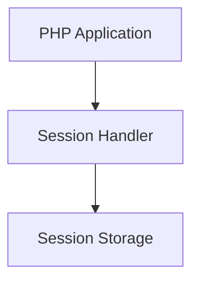

PHP manages the session using its configured session handler.

Depending on the configuration, session data may be stored in files or another configured backend.

The browser normally receives a session cookie containing the session identifier.

On a later request:

```php
<?php

session_start();

if (!isset($_SESSION['user_id'])) {
    http_response_code(401);
    exit('Not authenticated');
}

echo 'Authenticated user';
```

This is a simplified teaching example, not a complete production authentication system.

A real application must also handle credential verification, secure cookie configuration, authorization, CSRF protection where applicable, session expiration, and logout invalidation.

The example illustrates the relationship between a browser cookie, a session identifier, and server-managed session data.

---

# Common Mistakes

## Mistake 1: Thinking Cookies and Sessions Are the Same

A cookie is browser-side storage and transport.

A session is a mechanism for maintaining information across requests.

A cookie can carry a session identifier, but it is not the session itself.

## Mistake 2: Storing Sensitive Information Directly in an Ordinary Cookie

Cookies are sent by the browser and may be exposed through several attack paths.

Do not assume that a cookie is secret or trustworthy simply because the server created it.

Sensitive authentication information requires appropriate protection, validation, and secure design.

## Mistake 3: Assuming HttpOnly Prevents All Attacks

HttpOnly prevents ordinary JavaScript access to the cookie.

It does not prevent every form of cross-site scripting or stop malicious scripts from making requests through the user's browser.

## Mistake 4: Assuming Logout Means Deleting the Cookie

If the server-side session remains valid, a copied session identifier may still work.

Invalidate the session on the server as well.

## Mistake 5: Storing Sessions Only in Local Memory While Scaling Horizontally

Requests may reach different instances, and instance failures may destroy local session data.

Understand the application's session-storage and routing design before scaling.

## Mistake 6: Assuming Stateless Applications Cannot Use Sessions

Stateless application instances can use a shared session store.

The application process does not need to retain the session in its own memory between requests.

The important distinction is between application-instance-local state and shared or externally managed state.

---

# Key Principle

> A cookie carries information between the browser and server. A session associates requests with information maintained for a client.

A typical login architecture looks like this:

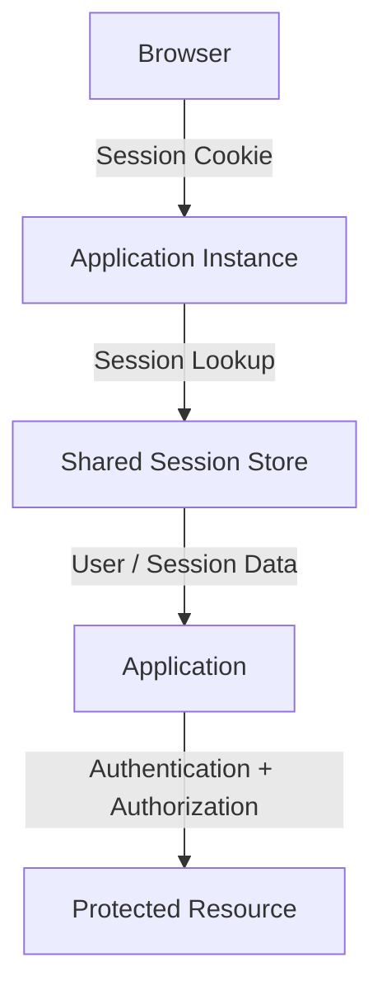

For system design, always ask:

* Where is the session stored?
* How is the session identifier protected?
* How does an application instance retrieve the session?
* What happens when the session expires?
* How is the session invalidated?
* What happens if the session store becomes unavailable?

---

# Quick Reference

| Concept           | Simple Explanation                                                           |
| ----------------- | ---------------------------------------------------------------------------- |
| Cookie            | Small data stored by the browser                                             |
| Session           | Mechanism for maintaining client-associated state across requests            |
| Session ID        | Identifier used to locate or refer to a session                              |
| Session Store     | Storage that maintains session information                                   |
| Secure            | Restricts cookie transmission to secure channels                             |
| HttpOnly          | Prevents ordinary JavaScript access to the cookie                            |
| SameSite          | Controls cookie sending in cross-site contexts                               |
| Session Hijacking | Attacker uses a stolen valid session identifier                              |
| Session Fixation  | Victim is induced to authenticate using an attacker-known session identifier |
| CSRF              | Tricks a browser into sending an unwanted authenticated request              |
| Idle Timeout      | Session expires after inactivity                                             |
| Absolute Timeout  | Session expires after a maximum total lifetime                               |

---

# Knowledge Check

## 1. Why do websites need sessions or similar mechanisms?

HTTP does not automatically remember the identity or previous actions of a client across requests.

## 2. What is the difference between a cookie and a session?

A cookie is browser-side data. A session is a mechanism for associating information with a client across requests.

## 3. What does a session cookie commonly contain?

A session identifier that refers to server-side session data.

## 4. Why should a session identifier be regenerated after login?

To reduce session fixation risks and prevent continued use of a previously known anonymous identifier.

## 5. Why can local-memory sessions cause problems with multiple application instances?

A request routed to another instance may not have access to the first instance's session data.

## 6. Does HttpOnly prevent CSRF?

No. HttpOnly restricts JavaScript access to the cookie. CSRF requires separate protections.

## 7. What should happen during logout?

The server should invalidate the authenticated session and the browser should be instructed to remove the corresponding cookie.

## 8. Can a stateless application use sessions?

Yes. It can retrieve session information from a shared or external session store instead of relying on instance-local state.

---

# Final Mental Model

Whenever a user logs in to a web application, trace the session:

```mermaid
flowchart TD
  accTitle: Tracing a session
  accDescr: Who authenticated the user? Where was the session created? What does the browser store? Where is the session data stored? How does the next request identify the session? How are permissions checked? How does the session expire or get revoked?
  N0["Who authenticated the user?"] --> N1["Where was the session created?"] --> N2["What does the browser store?"] --> N3["Where is the session data stored?"] --> N4["How does the next request identify the session?"] --> N5["How are permissions checked?"] --> N6["How does the session expire or get revoked?"]
```

Understanding this flow prepares you to design authentication systems, scale web applications, and protect user sessions without confusing browser storage, application state, and identity.
