# 01.08 — Authentication

## Learning Objectives

By the end of this chapter, you will understand:

* What authentication means and why applications need it.
* How login credentials are verified.
* How authentication works with sessions, cookies, and tokens.
* How password hashing, MFA, and secure password recovery work.
* How authentication failures affect an application.
* How authentication choices influence system architecture.

---

## 1. What Is Authentication?

Imagine you enter a bank.

Before the bank allows you to access your account, it needs to establish that you are the person you claim to be.

You might show your identity card, enter a PIN, or complete another verification step.

Web applications face the same problem.

**Authentication is the process of verifying the identity of a user, application, or system.**

When you log in to an application, it needs to answer:

> Is this really the user who claims to be Ranjit?

Authentication does not automatically determine what that user is allowed to do. That is a separate responsibility called authorization, which we will study in the next chapter.

### Authentication vs. Authorization

| Authentication                                           | Authorization                                                 |
| -------------------------------------------------------- | ------------------------------------------------------------- |
| Who are you?                                             | What are you allowed to do?                                   |
| Verifies identity.                                       | Checks permissions.                                           |
| Usually happens during login or credential verification. | Happens whenever access to a protected resource is evaluated. |
| Example: Verify a user's password.                       | Example: Check whether the user can delete a product.         |

Consider an e-commerce application:

* Authentication confirms that you are logged in as a particular user.
* Authorization determines whether you can access your orders, manage products, or administer the store.

A user can be successfully authenticated and still be denied access to a particular resource.

**Key principle:** A verified identity is not the same as permission to perform an action.

---

## 2. Why Do Applications Need Authentication?

Without authentication, an application may have no reliable way to distinguish one user's private data from another user's data.

Consider a learning management system.

It stores:

* Student profiles.
* Course enrollments.
* Examination results.
* Instructor information.
* Administrative settings.

If every visitor could access every record, private information could be exposed or modified.

Authentication allows the application to establish a user identity before associating requests with that identity.

A simplified request flow:

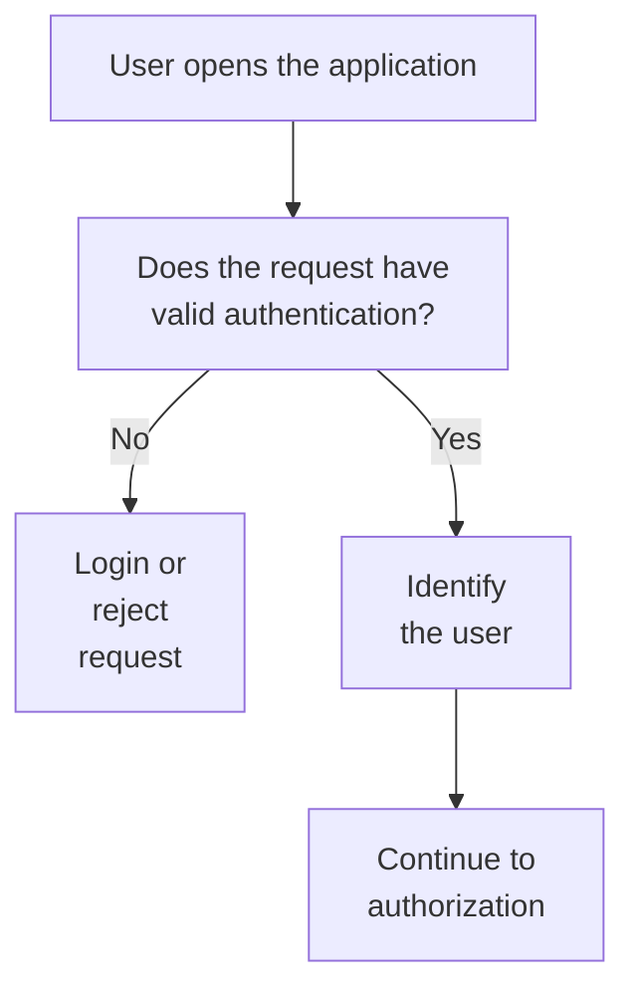

Authentication is not required for every endpoint. Public pages, product catalogs, and public documentation may be accessible without logging in.

The application should require authentication where identity is necessary.

---

## 3. The Three Authentication Factors

Authentication commonly relies on one or more categories of evidence.

| Factor             | Meaning                                              | Example                                             |
| ------------------ | ---------------------------------------------------- | --------------------------------------------------- |
| Something you know | Information only the user should know.               | Password, PIN.                                      |
| Something you have | A physical or digital item under the user's control. | Security key, authenticator app, registered device. |
| Something you are  | A biometric characteristic.                          | Fingerprint, facial recognition.                    |

Using two independent categories is called **multi-factor authentication (MFA)**.

For example:

```text
Password
   +
Authenticator app code
   |
   v
Two different authentication factors
```

A password and a PIN are generally two instances of the same factor category: something you know. They do not, by themselves, constitute two-factor authentication.

MFA can reduce the impact of stolen passwords, although phishing-resistant methods such as passkeys and security keys provide stronger protection against certain attacks.

---

## 4. The Basic Login Process

Let's examine what happens when a user logs in to a typical web application.

Suppose the application has a login form:

```text
Email:    user@example.com
Password: ************
```

The browser sends the credentials to the backend over HTTPS.

### Step-by-step flow

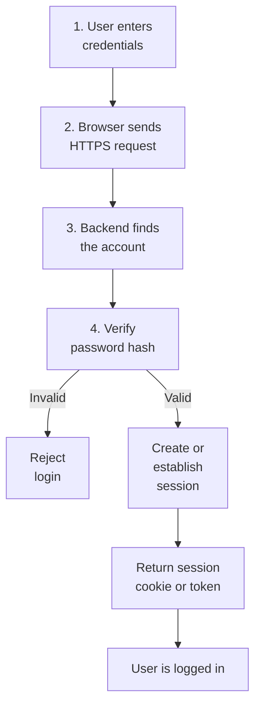

Let's understand the important steps.

### Step 1: Receive credentials

The browser sends the user's email and password to an authentication endpoint.

Example:

```http
POST /api/login
Content-Type: application/json

{
  "email": "user@example.com",
  "password": "user-entered-password"
}
```

The password is sensitive data. HTTPS protects it while it travels between the browser and server.

HTTPS does not make it safe to store the password in plaintext in the database.

### Step 2: Find the user

The backend searches for an account associated with the submitted email address.

Conceptually:

```sql
SELECT id, email, password_hash
FROM users
WHERE email = ?;
```

The placeholder represents a parameterized query. User input should not be concatenated directly into SQL.

If no account exists, the application should reject the login without revealing unnecessary information about registered accounts.

### Step 3: Verify the password

The database should contain a password hash, not the original password.

The application uses a suitable password-hashing algorithm to verify whether the submitted password matches the stored hash.

If verification succeeds, the backend has evidence that the user knows the correct password.

### Step 4: Establish authenticated state

After successful verification, the application establishes an authenticated identity.

For a traditional web application, this often means creating a session and sending a session cookie to the browser.

For an API-based application, it may involve issuing an access token.

The exact mechanism depends on the architecture.

---

## 5. Password Storage: Hashing, Not Plaintext

A common beginner mistake is to store passwords directly in the users table.

For example:

| id | email                                       | password      |
| -- | ------------------------------------------- | ------------- |
| 1  | user@example.com | mypassword123 |

This is dangerous.

If an attacker obtains the database, the original passwords are immediately exposed.

Instead, applications store password hashes.

### What is a password hash?

A cryptographic hashing function transforms input into a derived value.

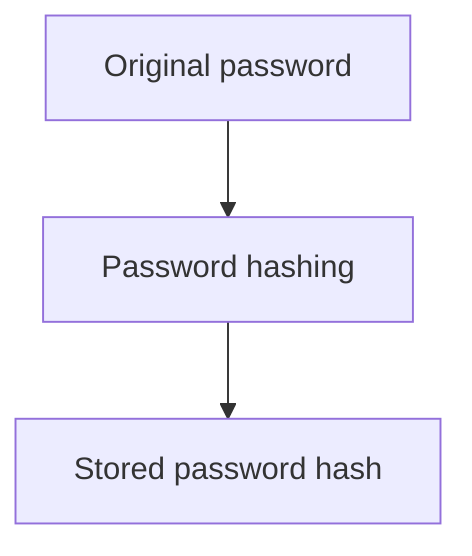

Password hashing is designed to make it computationally difficult to recover the original password from the stored result.

However, ordinary fast hashes such as SHA-256 are not suitable for password storage by themselves. Attackers can test large numbers of password guesses quickly.

Use a password-specific hashing algorithm such as:

* Argon2id.
* bcrypt.
* scrypt.
* PBKDF2, with an appropriate configuration.

These algorithms are designed to make password guessing more expensive.

### How password verification works

Suppose the user originally registered with:

```text
Password: my-secret-password
```

The application generates a password hash using a password-hashing algorithm and stores the resulting encoded value.

During login:

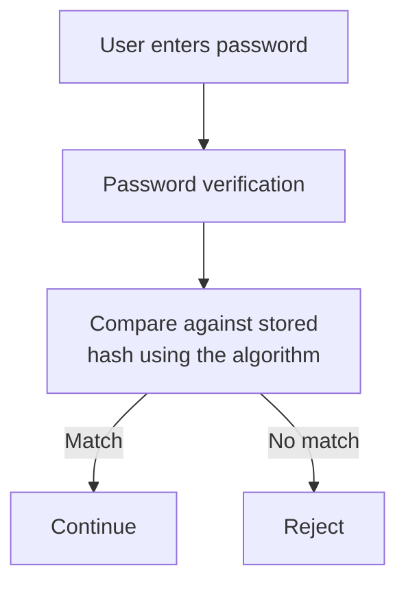

Modern password-hashing libraries handle salts and algorithm parameters as part of the stored hash representation.

A salt is a unique random value used during password hashing. It ensures that identical passwords do not produce identical stored hashes when different salts are used.

**Important:** Do not write your own password hashing or verification algorithm. Use the password-hashing facilities provided by a trusted framework or security library.

---

## 6. Authentication and Sessions

In the previous chapter, we learned that HTTP is stateless.

Each HTTP request is independent. The server does not automatically know which user made the previous request.

Authentication establishes identity, but the application also needs a way to recognize that identity on subsequent requests.

This is where sessions and cookies become important.

### Login with a session

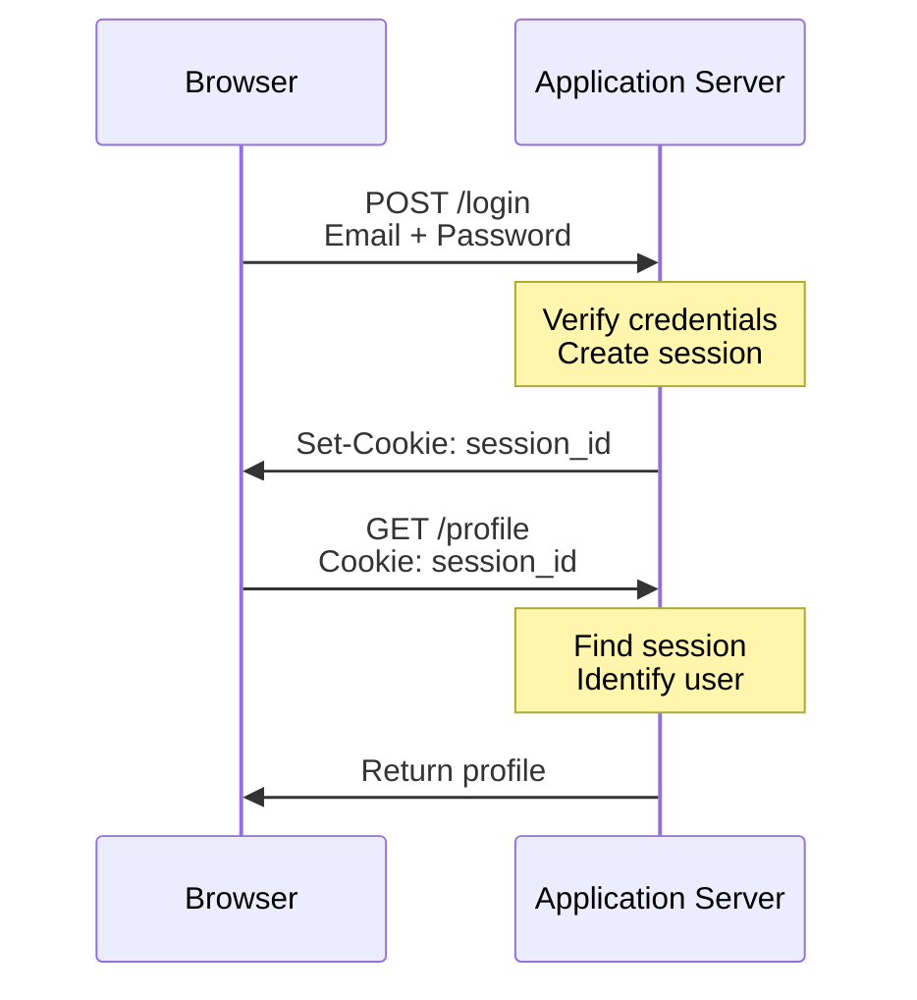

The server stores session information, often including the user ID and session expiration details.

The browser stores a session identifier in a cookie.

On subsequent requests, the browser sends that cookie automatically when its scope and cookie attributes allow it.

The backend uses the session identifier to locate the corresponding session and establish the user's identity.

### Why not store the whole session in the cookie?

A session cookie should generally contain an opaque, unpredictable session identifier, not sensitive session data.

For example:

```http
Set-Cookie: __Host-session=RANDOM_SESSION_ID;
            Path=/;
            Secure;
            HttpOnly;
            SameSite=Lax
```

The session identifier should be generated using a cryptographically secure random generator.

The server maintains the associated session data.

The cookie attributes serve different purposes:

| Attribute | Purpose                                                                |
| --------- | ---------------------------------------------------------------------- |
| Secure    | Sends the cookie only over HTTPS.                                      |
| HttpOnly  | Prevents JavaScript from reading the cookie directly.                  |
| SameSite  | Helps control cross-site cookie sending and reduce certain CSRF risks. |
| Path      | Limits the URL paths for which the cookie is sent.                     |

For production applications, also consider session expiration, rotation after login, logout invalidation, and protection against session fixation.

---

## 7. Authentication Using Tokens

Sessions are not the only way to maintain authenticated state.

Many API-based applications use access tokens.

A token is a credential that a client presents to a server to demonstrate authenticated access.

A simplified token-based flow:

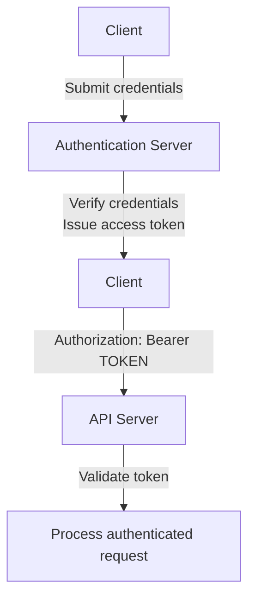

For example:

```http
GET /api/profile
Authorization: Bearer ACCESS_TOKEN
```

The API validates the token and establishes the identity associated with it.

Depending on the token format and architecture, validation may involve checking a signature, expiration, issuer, audience, or consulting a server-side token store.

### What is a JWT?

JWT stands for JSON Web Token.

It is a token format that can carry claims, such as a subject identifier and expiration time.

A JWT commonly contains three encoded sections:

```text
HEADER.PAYLOAD.SIGNATURE
```

The header describes the token type and signing algorithm. The payload contains claims. The signature helps the recipient verify integrity and authenticity.

A signed JWT is not automatically encrypted.

Anyone who obtains an ordinary signed JWT can generally decode and read its payload. Do not place passwords, secrets, or sensitive personal information in it.

A JWT also does not automatically solve logout or revocation. Short expiration periods, refresh-token rotation, revocation strategies, and secure storage must be considered.

### Sessions vs. tokens

| Sessions                                                         | Access tokens                                                                         |
| ---------------------------------------------------------------- | ------------------------------------------------------------------------------------- |
| Commonly use a server-side session store.                        | May be validated without a database lookup for each request, depending on the design. |
| Browser sends a session cookie.                                  | Client commonly sends a bearer token in an authorization header.                      |
| Server can invalidate a stored session.                          | Immediate revocation can require additional infrastructure or state.                  |
| Requires session storage and lookup in a typical implementation. | Token validation still requires correct signature and claim checks.                   |

Neither approach is universally superior.

A browser-based application can use secure cookies with sessions or a carefully designed token architecture. The decision depends on client type, security requirements, deployment, scaling, and operational constraints.

For browser applications, avoid storing long-lived authentication tokens in localStorage without carefully considering the consequences of cross-site scripting (XSS).

---

## 8. Authentication in a Scaled System

Consider an application running on three backend servers behind a load balancer.

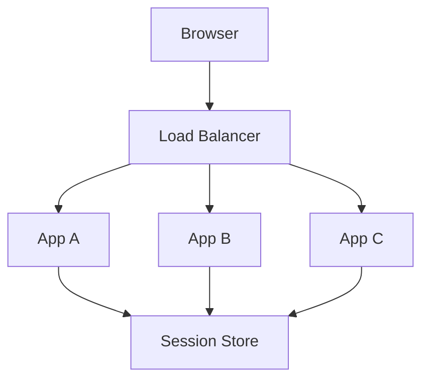

A user logs in through App A.

If the session exists only in App A's local memory, the next request might reach App B. App B would not know about the session.

The user could appear logged out even though the login succeeded.

### Shared session storage

One solution is to use a shared session store, such as Redis or a database.

All application instances can access the same session records.

This allows requests to be handled by different application instances without losing the authenticated state.

Another option is sticky sessions, where the load balancer tries to send a user's requests to the same backend instance.

Sticky sessions can reduce some session-sharing requirements, but they introduce operational constraints and do not provide the same flexibility as shared session storage.

Token-based architectures can reduce the need for centralized session lookups, but revocation, refresh, key management, and other requirements may still introduce shared state.

**System design connection:** Authentication is not just a login form. It creates state, storage, security, and scaling requirements across the application.

---

## 9. Multi-Factor Authentication (MFA)

Passwords can be stolen, guessed, reused, or obtained through phishing.

MFA adds another verification step.

Example:

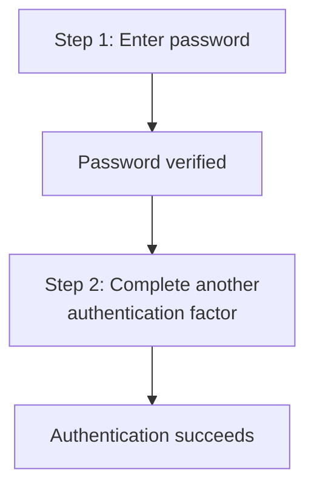

Common MFA methods include:

| Method            | Description                                                      |
| ----------------- | ---------------------------------------------------------------- |
| Authenticator app | Generates time-based one-time passwords (TOTP).                  |
| Security key      | Uses a hardware security key, often through FIDO2/WebAuthn.      |
| Passkey           | Uses public-key cryptography and device-based user verification. |
| SMS code          | Sends a one-time code to a registered phone number.              |

SMS-based verification is generally more vulnerable to attacks such as SIM swapping than phishing-resistant security keys and passkeys.

A system must also consider recovery codes, lost devices, device replacement, and account recovery. Otherwise, stronger authentication can accidentally lock legitimate users out of their accounts.

---

## 10. Password Reset and Account Recovery

Users forget passwords. Authentication systems need a secure recovery process.

A typical password-reset flow:

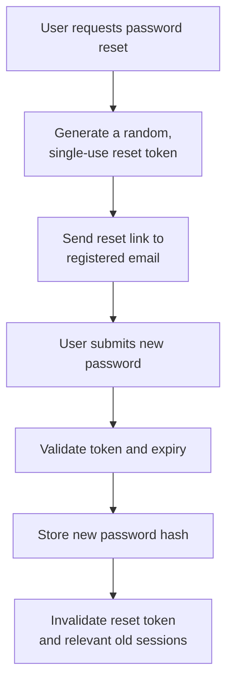

A secure reset token should be:

* Cryptographically random and difficult to guess.
* Single-use.
* Stored securely, preferably as a hash when appropriate.
* Limited by a short expiration period.
* Invalidated after successful use.

The application should avoid revealing whether an email address is registered.

For example, it can return a generic response:

> If an account exists for this email address, we will send password-reset instructions.

After a successful reset, the application should consider invalidating existing sessions and notifying the account owner.

Password recovery is part of the authentication system, not merely a convenience feature.

---

## 11. Common Authentication Threats

Authentication endpoints are attractive targets because they protect user accounts and private data.

| Threat              | What happens                                                                                  | Common defenses                                                       |
| ------------------- | --------------------------------------------------------------------------------------------- | --------------------------------------------------------------------- |
| Brute-force attack  | Repeated password guesses against an account.                                                 | Rate limiting, throttling, monitoring, MFA.                           |
| Credential stuffing | Stolen username/password combinations are tested across services.                             | MFA, breached-password checks, rate limits, anomaly detection.        |
| Phishing            | User is tricked into revealing credentials or approving a fraudulent login.                   | Passkeys, phishing-resistant MFA, user education.                     |
| Session hijacking   | An attacker obtains a valid session identifier.                                               | HTTPS, Secure and HttpOnly cookies, XSS prevention, session rotation. |
| Session fixation    | An attacker causes a victim to authenticate using a session identifier known to the attacker. | Regenerate the session ID after authentication and privilege changes. |
| Account enumeration | Login or recovery responses reveal whether an account exists.                                 | Generic responses, consistent behavior, rate limits.                  |

No single control solves every authentication threat.

For example, rate limiting helps slow repeated login attempts, but it should be designed carefully. Aggressive account lockouts can allow attackers to deny service to legitimate users by deliberately triggering them.

Authentication systems need layered defenses.

---

## 12. Authentication Errors: 401 vs. 403

HTTP status codes communicate the outcome of an API request.

Two status codes are particularly important.

| Status           | Meaning                                                       | Example                                                      |
| ---------------- | ------------------------------------------------------------- | ------------------------------------------------------------ |
| 401 Unauthorized | The request lacks valid authentication credentials.           | Missing or invalid access token.                             |
| 403 Forbidden    | The server understands the request but refuses to fulfill it. | An authenticated user lacks permission to perform an action. |

Despite its name, `401 Unauthorized` is primarily about authentication.

A typical flow:

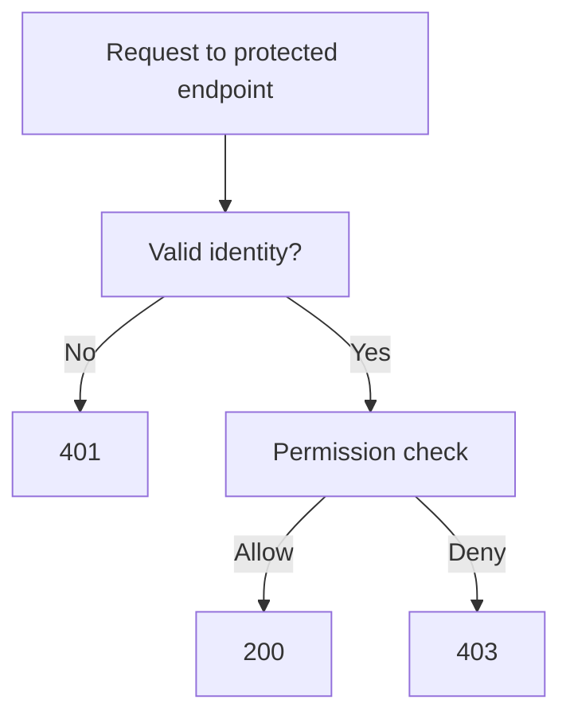

Actual application behavior may vary depending on API design and security requirements. For instance, a system may intentionally return a generic response to avoid revealing whether a protected resource exists.

The important distinction is that authentication establishes identity, while authorization evaluates access.

---

## 13. Architecture Decisions: Build or Use an Identity Provider?

As an application grows, managing authentication becomes more complex.

You may need:

* Password storage and verification.
* MFA and passkeys.
* Password recovery.
* Email verification.
* Social login.
* Single sign-on (SSO).
* Account lockout and suspicious-login detection.
* Session and token lifecycle management.

You can implement authentication within your application or use an external identity provider.

An identity provider (IdP) manages authentication and provides identity information to applications.

Examples of identity platforms include managed services and self-hosted identity solutions.

A simplified architecture:

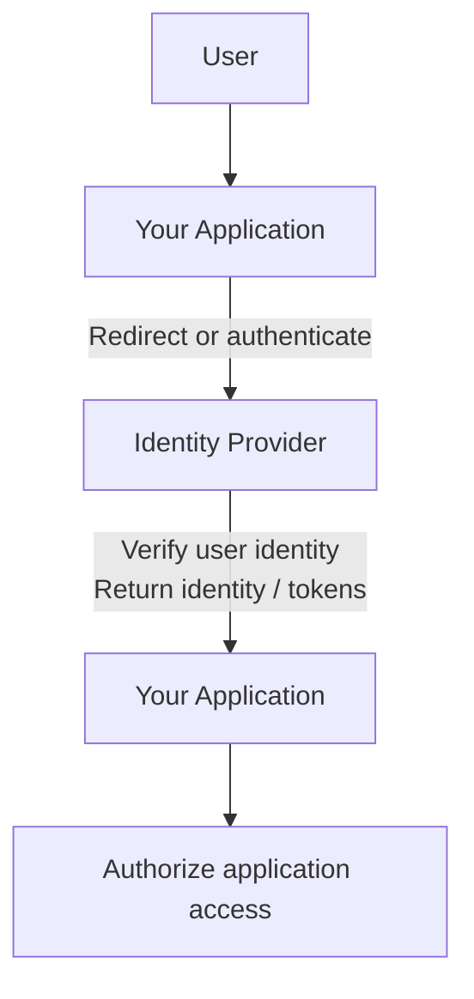

Common standards include:

* OAuth 2.0 — delegated authorization.
* OpenID Connect (OIDC) — an identity layer built on OAuth 2.0.
* SAML — an identity federation standard commonly used in enterprise SSO.

OAuth 2.0 alone is not a user-authentication protocol. When an application needs to authenticate a user through an OAuth-based identity flow, OpenID Connect is commonly used.

### The trade-off

| Build authentication yourself                                     | Use an identity provider                                                     |
| ----------------------------------------------------------------- | ---------------------------------------------------------------------------- |
| Greater control over implementation and user experience.          | Reduces the amount of authentication infrastructure you operate.             |
| Your team owns security updates and operational responsibilities. | Introduces provider cost, dependency, and integration requirements.          |
| Requires expertise in secure authentication design.               | Requires careful configuration, identity integration, and vendor evaluation. |

For many production applications, using a mature identity provider can reduce the amount of security-sensitive code the team must maintain.

However, external identity providers introduce dependencies, potential vendor lock-in, and availability considerations.

The choice should reflect the application's requirements, team expertise, and risk tolerance.

---

## 14. Putting It All Together

Let's trace authentication in a production-style web application.

A student opens a course dashboard.

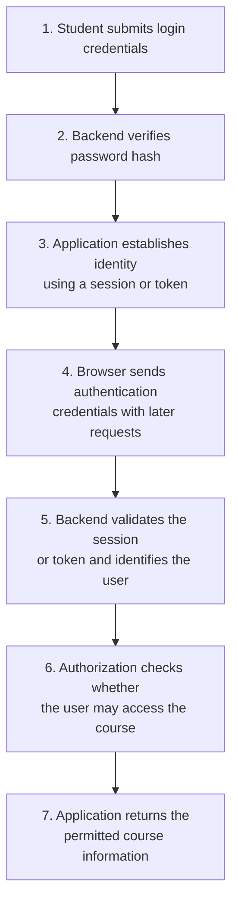

Several system components participate:

| Component                             | Responsibility                                           |
| ------------------------------------- | -------------------------------------------------------- |
| Browser                               | Collects credentials and sends requests.                 |
| HTTPS                                 | Protects data in transit.                                |
| Authentication service                | Verifies credentials and establishes identity.           |
| User database                         | Stores account information and password hashes.          |
| Session store or token infrastructure | Maintains or validates authenticated state.              |
| Authorization layer                   | Checks permissions for the requested action.             |
| Monitoring system                     | Records security events and detects suspicious patterns. |

Authentication is a system-wide concern because it touches application code, data storage, networking, security, and operations.

---

## Key Principles

1. **Authentication answers who you are.** Authorization answers what you can do.
2. Never store plaintext passwords. Use a suitable password-hashing algorithm.
3. Use HTTPS for credential transmission and protect session identifiers and tokens.
4. Choose sessions or tokens based on actual application requirements, not trends.
5. Design logout, expiration, recovery, and revocation as part of authentication.
6. MFA, rate limiting, secure password recovery, and monitoring provide layered defenses.
7. Authentication architecture must account for scaling, failure, and external dependencies.

---

## Quick Reference

| Term           | Simple meaning                                                   |
| -------------- | ---------------------------------------------------------------- |
| Authentication | Verifying identity.                                              |
| Credential     | Evidence used to authenticate.                                   |
| Password hash  | A protected representation used to verify a password.            |
| Salt           | A unique random value used during password hashing.              |
| Session        | Server-maintained state associated with an authenticated user.   |
| Session cookie | A browser cookie that carries a session identifier.              |
| Access token   | A credential presented to access a protected resource.           |
| JWT            | A token format that carries claims.                              |
| MFA            | Authentication using multiple factor categories.                 |
| IdP            | Identity provider that manages or verifies identities.           |
| OIDC           | An identity layer built on OAuth 2.0.                            |
| 401            | Authentication is missing or invalid.                            |
| 403            | Access is refused, typically because of insufficient permission. |

---

## Knowledge Check

Try answering these questions before moving to the next chapter.

**1.** A user logs in successfully but cannot delete a product. Is this an authentication problem or an authorization problem?

**2.** Why should an application store password hashes instead of plaintext passwords?

**3.** What happens if a user's session is stored only in the memory of one application server and their next request reaches another server?

**4.** Why is a signed JWT not necessarily secret?

**5.** What is the difference between a session cookie and the server-side session it identifies?

**6.** Why does adding an authenticator-app code to a password provide MFA, while adding a second password generally does not?

**7.** An API receives a request without valid authentication credentials. Which HTTP status is normally appropriate: 401 or 403?

### Answers

1. Authorization. The user's identity is established, but permission to delete the product is denied.
2. A password hash makes it substantially harder for someone who obtains the database to recover users' original passwords.
3. The second server may not recognize the session. Shared session storage or another suitable architecture can address this.
4. Signing protects integrity and authenticity; it does not inherently encrypt the payload.
5. The cookie carries a session identifier in the browser, while the server-side session contains the associated state.
6. A password and authenticator-app code belong to different authentication factor categories.
7. 401, when authentication is missing or invalid.
