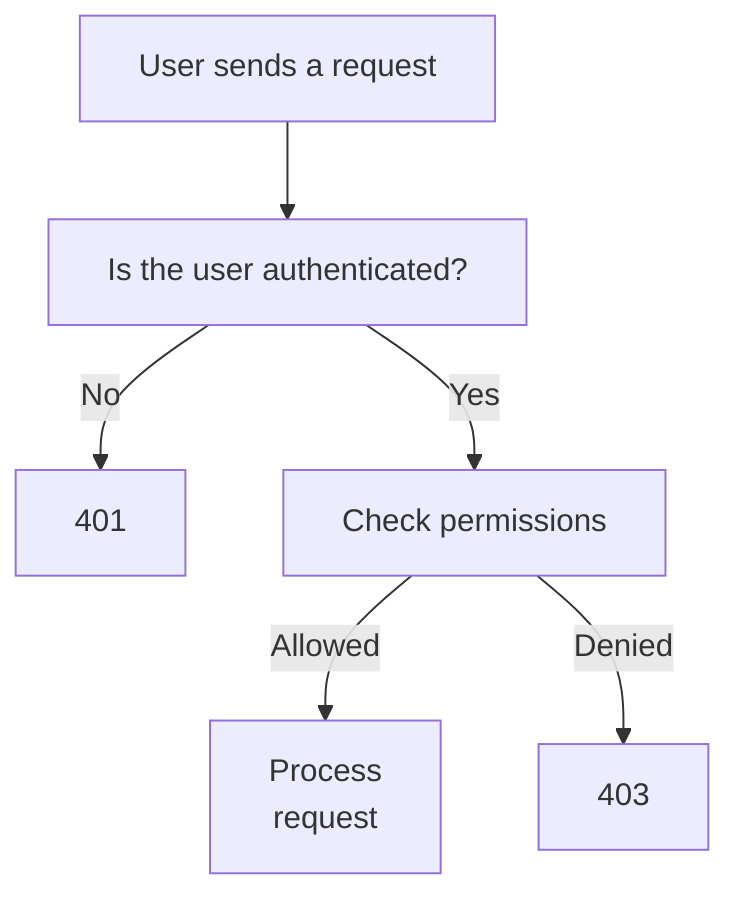
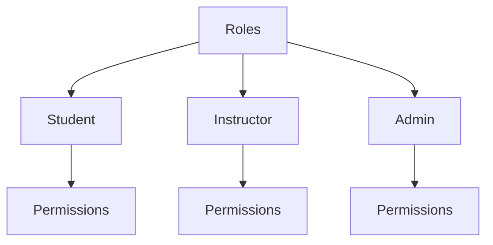
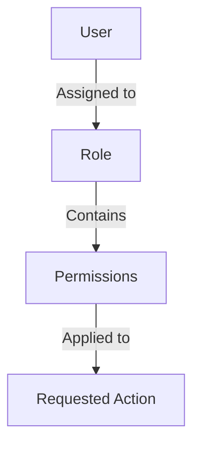
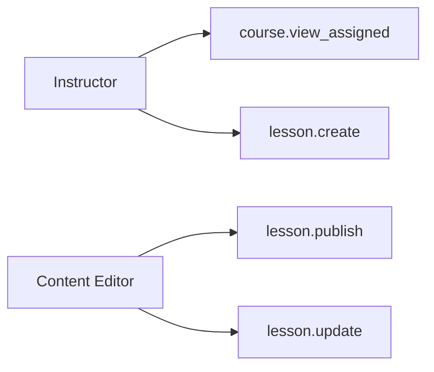
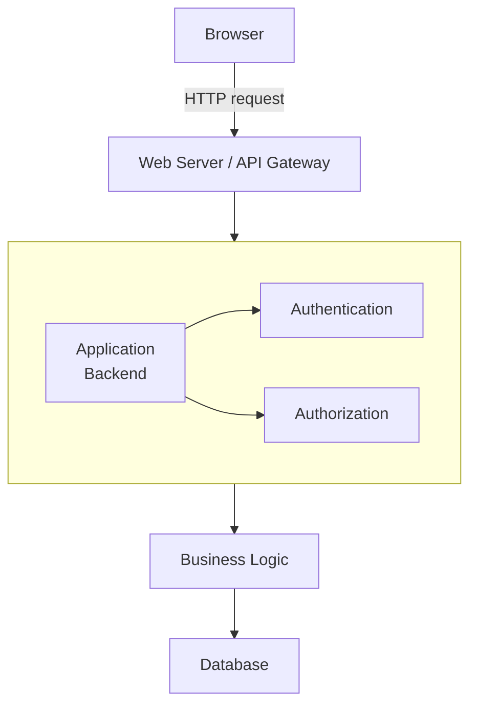
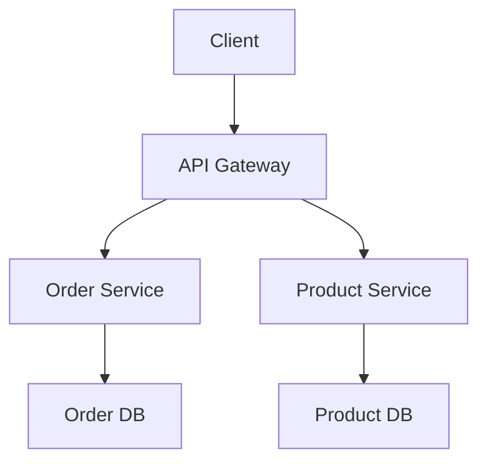
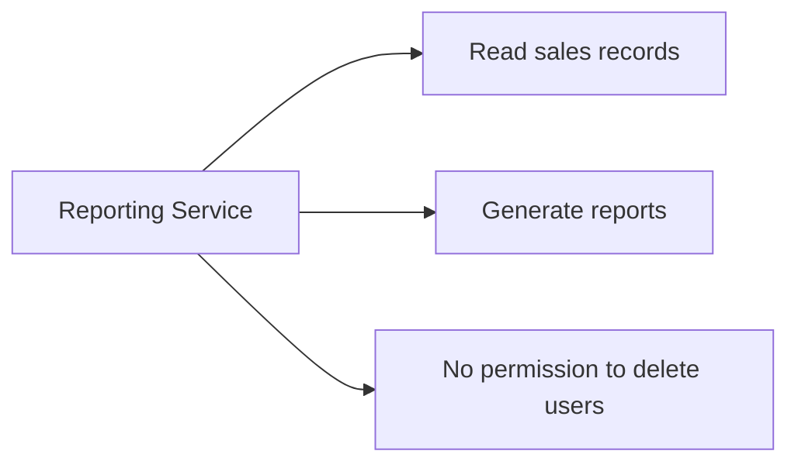

# 01.09 — Authorization

## Learning Objectives

By the end of this chapter, you will understand:

* What authorization is and how it differs from authentication.
* How applications determine whether a user can access a resource or perform an action.
* How permissions, roles, and policies work.
* How authorization is enforced in APIs and backend applications.
* What RBAC, ABAC, and resource ownership mean.
* How authorization failures and security mistakes affect system design.

---

## 1. What Is Authorization?

In the previous chapter, we learned that authentication verifies a user's identity.

But knowing who someone is does not automatically mean they can do everything in the application.

Imagine a college management system.

A student logs in successfully. The application knows the student's identity.

However, the student should not be able to:

* Change another student's examination results.
* Delete a teacher's account.
* Access administrative settings.
* Publish official examination results.

The application must decide what the authenticated user is allowed to do.

**Authorization is the process of determining whether an identity has permission to access a resource or perform an action.**

Authentication asks:

> Who are you?

Authorization asks:

> Given who you are, what are you allowed to do?

### Authentication vs. Authorization

| Authentication                                 | Authorization                                            |
| ---------------------------------------------- | -------------------------------------------------------- |
| Verifies identity.                             | Determines access rights.                                |
| Usually establishes an authenticated identity. | Evaluates an action against permissions or policies.     |
| Example: Verify a password.                    | Example: Allow an instructor to publish course material. |
| Failure may result in 401.                     | Failure may result in 403.                               |

A user can be authenticated but not authorized.

That distinction is fundamental to secure application design.

---

## 2. How Authorization Works

Consider a student attempting to access an administrative page.

The request passes through two separate decisions.



The backend must verify the user's identity before making an authorization decision that depends on that identity.

Public endpoints may not require authentication. Some authorization policies may also apply to anonymous users, such as access to publicly available resources.

The important point is that every protected operation must have an appropriate access-control decision.

---

## 3. The Three Parts of an Authorization Decision

Most authorization decisions involve three basic elements.

| Element  | Meaning                           | Example                    |
| -------- | --------------------------------- | -------------------------- |
| Subject  | Who is making the request?        | A student.                 |
| Resource | What is being accessed?           | An examination result.     |
| Action   | What does the subject want to do? | View or modify the result. |

A policy determines whether the action is permitted.

For example:

```text
Subject: Student #105
Resource: Result belonging to Student #105
Action: View

Decision: ALLOW
```

Now change the resource:

```text
Subject: Student #105
Resource: Result belonging to Student #208
Action: View

Decision: DENY
```

The same user is involved in both requests, but the resource is different.

This demonstrates why checking only whether a user is logged in is not enough.

Authorization often depends on the specific resource and action, not just the user's identity or role.

---

## 4. Permissions: What Can a User Do?

A permission represents an allowed action or capability.

For example, an e-commerce application might define these permissions:

| Permission       | Meaning                                         |
| ---------------- | ----------------------------------------------- |
| `product.view`   | View product information.                       |
| `product.create` | Create a product.                               |
| `product.update` | Modify product information.                     |
| `product.delete` | Delete a product.                               |
| `order.view`     | View permitted order information.               |
| `order.refund`   | Initiate a refund, subject to additional rules. |

Permissions describe what the application allows a subject to do.

They are often represented as strings, database records, or policy rules.

A simplified permission check:

```php
if ($user->hasPermission('product.delete')) {
    // Continue with the deletion.
} else {
    // Reject the request.
}
```

This is illustrative pseudocode. The actual implementation depends on the framework and authorization system.

Notice that a permission should be checked on the server.

Hiding a Delete button in the frontend does not prevent someone from sending a direct HTTP request to the backend.

---

## 5. Roles: Grouping Permissions

Managing permissions individually for every user can become difficult.

Imagine an application with 10,000 users and 40 different permissions.

Assigning every permission separately to every user would create considerable management overhead.

Roles provide a way to group permissions.

A role is a named collection of permissions that can be assigned to users.

For example:

| Role          | Permissions                                                     |
| ------------- | --------------------------------------------------------------- |
| Student       | View own courses, view own results.                             |
| Instructor    | View assigned courses, create lessons, grade assigned students. |
| Administrator | Manage users, manage courses, configure the application.        |

The relationship looks like this:



A user receives permissions through an assigned role.

For example:

```text
User: Ranjit
Role: Instructor

Permissions:
- course.view_assigned
- lesson.create
- lesson.update
- student.grade_assigned
```

This approach reduces duplication and makes access easier to manage.

However, roles alone are not always sufficient. An instructor may be allowed to grade students in their own course but not students in another instructor's course.

That requires resource-specific authorization.

---

## 6. Role-Based Access Control (RBAC)

Role-Based Access Control, or RBAC, is an authorization model in which permissions are associated with roles and users are assigned those roles.

The basic structure is:



A database might represent this using four tables:

```text
users
-----
id
name
email

roles
-----
id
name

user_roles
----------
user_id
role_id

permissions
-----------
id
name

role_permissions
----------------
role_id
permission_id
```

The `user_roles` table connects users to roles.

The `role_permissions` table connects roles to permissions.

This creates a many-to-many relationship:

* One user can have multiple roles.
* One role can belong to many users.
* One role can contain multiple permissions.
* One permission can be included in multiple roles.

### Example

Suppose an instructor has two roles:



The user's effective permissions may be derived from both roles.

A well-designed RBAC system should also define how conflicting or restricted permissions are handled.

**When RBAC is useful:** Applications with relatively stable job functions, such as students, instructors, support agents, managers, and administrators.

---

## 7. Resource Ownership: Can This User Access This Specific Record?

Roles answer questions such as:

> Is this user allowed to view orders?

But a more specific question is:

> Is this user allowed to view this particular order?

Consider an e-commerce application.

Two customers have accounts:

```text
Customer A: ID 101
Customer B: ID 202
```

The database contains:

| Order ID | Customer ID | Amount |
| -------- | ----------- | -----: |
| 5001     | 101         | ₹2,000 |
| 5002     | 202         | ₹3,500 |

Customer A requests:

```http
GET /api/orders/5001
```

The application should verify that the order belongs to Customer A.

Now Customer A changes the URL:

```http
GET /api/orders/5002
```

If the application checks only that the user is logged in, it may expose Customer B's order.

This is an authorization vulnerability.

The backend must verify ownership or another valid access relationship.

### Ownership check

```text
Authenticated user: 101
Requested order: 5002
Order owner: 202

101 != 202

Result: DENY
```

A conceptual SQL query could combine resource retrieval with the ownership condition:

```sql
SELECT *
FROM orders
WHERE id = ?
  AND customer_id = ?;
```

The first parameter is the requested order ID. The second is the authenticated user's ID, obtained from trusted server-side authentication state.

This pattern can reduce the risk of accidentally returning another user's record.

The application must still handle missing resources, permissions, and other policy requirements correctly.

### Important distinction

Knowing a record's ID does not grant permission to access it.

IDs are identifiers, not authorization credentials.

---

## 8. Attribute-Based Access Control (ABAC)

Sometimes authorization depends on more than a user's role or ownership.

For example, a manager may approve an expense only if:

* The expense belongs to their department.
* The amount is below their approval limit.
* The expense is in an approvable status.
* The manager's account is active.

Attribute-Based Access Control (ABAC) evaluates attributes of the subject, resource, action, and sometimes the environment.

An attribute is a property that can be used in a policy.

| Attribute category | Example                                             |
| ------------------ | --------------------------------------------------- |
| Subject            | User's department, clearance level, account status. |
| Resource           | Document classification, owner, department.         |
| Action             | Read, update, approve, delete.                      |
| Environment        | Request time, network location, device context.     |

An example policy:

```text
ALLOW expense.approve IF:

user.department == expense.department
AND user.approval_limit >= expense.amount
AND expense.status == "pending"
AND user.account_status == "active"
```

This is a conceptual policy, not a universal policy-language syntax.

ABAC allows more fine-grained decisions than simple role checks.

However, policies can become difficult to understand, test, and maintain if they are overly complicated.

### RBAC vs. ABAC

| RBAC                                                 | ABAC                                                          |
| ---------------------------------------------------- | ------------------------------------------------------------- |
| Decisions primarily depend on roles and permissions. | Decisions depend on attributes and policy conditions.         |
| Easier to understand for stable job functions.       | Useful for contextual and resource-specific rules.            |
| Can require many roles as complexity grows.          | Can require more sophisticated policy evaluation and testing. |

Real applications often combine both approaches.

For example, RBAC may establish that a user is an instructor, while ABAC or ownership checks determine whether that instructor can modify a particular course.

---

## 9. Where Should Authorization Be Enforced?

Authorization should be enforced at a trusted backend boundary before the protected operation is performed.

Consider a typical web application:



The browser can help improve the user experience by hiding unavailable actions.

For example, a student should not see an administrator-only menu item.

But the browser is controlled by the user. They can modify JavaScript, inspect network requests, or send requests using other tools.

Therefore:

**Frontend restrictions are usability features, not security boundaries.**

The backend must enforce the relevant authorization policy even if the frontend already checked it.

### Example: Protected API

Suppose the application exposes:

```http
DELETE /api/products/55
```

The backend should perform checks such as:

1. Is the request authenticated?
2. Does the authenticated identity have permission to delete products?
3. Is the user allowed to delete this particular product?
4. Is deletion allowed in the product's current state?
5. If all checks pass, perform the operation.

The exact sequence can vary, but all necessary security and business rules must be enforced before the operation is committed.

---

## 10. Authorization in a Multi-Service Architecture

In a distributed application, multiple services may be responsible for different resources.

For example:



The API gateway may authenticate requests and apply broad access policies.

However, the individual services should enforce authorization for the resources and operations they own.

Why?

Because services may be accessed through internal routes, background jobs, administrative tools, or other services. A gateway check alone may not protect every path to a sensitive operation.

### Example

The gateway verifies that the user is authenticated.

The Order Service still needs to determine whether the user can view the requested order.

The Product Service must determine whether the user can modify the requested product.

Each service should have a clearly defined security responsibility.

This does not mean every service must independently implement an entire authorization platform. Shared identity libraries, centralized policy engines, and consistent service-to-service authentication can help.

The architecture should avoid relying on an untrusted client or an easily bypassed network boundary for authorization.

---

## 11. Common Authorization Mistakes

| Mistake                                                            | Why it is dangerous                                            |
| ------------------------------------------------------------------ | -------------------------------------------------------------- |
| Checking only whether a user is logged in.                         | Any authenticated user may gain access to another user's data. |
| Hiding buttons without backend checks.                             | Direct API requests can bypass frontend restrictions.          |
| Trusting a role supplied by the browser.                           | A user can modify client-side data.                            |
| Assuming an unpredictable ID provides access control.              | IDs do not establish permission.                               |
| Giving every user administrator privileges.                        | A compromised account can cause extensive damage.              |
| Checking permissions only in the frontend or API gateway.          | Other request paths may bypass the check.                      |
| Forgetting authorization on background jobs or internal endpoints. | Non-browser execution paths may access protected resources.    |

### Broken Object Level Authorization (BOLA)

BOLA occurs when an API fails to properly verify whether the requester is authorized to access a particular object.

For example:

```http
GET /api/invoices/1001
```

Changing the invoice ID to another user's invoice should not grant access.

BOLA is especially relevant to APIs because clients often specify resource IDs directly in URLs, query parameters, or request bodies.

The correct defense is to enforce object-level authorization on the backend for every relevant operation.

---

## 12. The Principle of Least Privilege

The principle of least privilege means granting a user, service, or process only the permissions necessary to perform its intended responsibilities.

Consider a reporting service.

It may need permission to read sales data but not to delete customer accounts.

A suitable permission set might be:



This reduces the damage that can result from mistakes, compromised credentials, or vulnerable components.

Least privilege applies to:

* Human users.
* Backend services.
* Database accounts.
* Cloud identities.
* Background workers.
* Administrative tools.

It is not a one-time configuration. Permissions should be reviewed as responsibilities and application requirements change.

---

## 13. Authorization and System Design Trade-offs

Authorization is also an architectural decision.

A small application may enforce a few role checks directly in its backend.

A larger system may need centralized policy management, resource-level rules, audit trails, and consistent enforcement across services.

| Approach                       | Advantages                                           | Trade-offs                                                                        |
| ------------------------------ | ---------------------------------------------------- | --------------------------------------------------------------------------------- |
| Simple backend role checks     | Straightforward and easy to start with.              | Can become duplicated and inconsistent as the application grows.                  |
| Shared authorization module    | Reuses policy logic across application modules.      | Requires careful module boundaries and testing.                                   |
| Centralized policy engine      | Supports complex policies and consistent evaluation. | Adds infrastructure, latency, operational complexity, and failure considerations. |
| Database-level access controls | Can enforce certain restrictions close to the data.  | Database-specific behavior, policy complexity, and integration requirements.      |

There is no universal requirement to introduce a policy engine or microservice for authorization.

Start with the application's actual access-control requirements.

As the system grows, look for concrete problems such as duplicated rules, inconsistent enforcement, difficult audits, or complex resource-level policies.

Then evolve the architecture to address those problems.

---

## Key Principles

1. Authentication verifies identity; authorization evaluates permission.
2. Authorization decisions should consider the subject, resource, and requested action.
3. Roles group permissions, but resource-level access often needs additional checks.
4. Enforce authorization on the backend, not just in the frontend.
5. Never treat resource IDs or client-supplied roles as proof of permission.
6. Apply least privilege to users, services, and processes.
7. In distributed systems, define which component is responsible for each authorization decision.

---

## Quick Reference

| Term               | Simple meaning                                            |
| ------------------ | --------------------------------------------------------- |
| Authorization      | Deciding whether an action is permitted.                  |
| Permission         | A specific allowed capability.                            |
| Role               | A group of permissions assigned to users.                 |
| RBAC               | Access control based on roles and permissions.            |
| ABAC               | Access control based on attributes and policies.          |
| Resource ownership | A rule that limits access based on who owns a resource.   |
| BOLA               | Failure to enforce authorization for a particular object. |
| Least privilege    | Grant only the permissions necessary.                     |
| Policy engine      | A component that evaluates authorization rules.           |
| 401                | Authentication is missing or invalid.                     |
| 403                | The request is understood but access is refused.          |

---

## Knowledge Check

**1.** A student logs in successfully but attempts to view another student's examination result. Which security decision must the application make?

**2.** What is the difference between a role and a permission?

**3.** Why is hiding an administrator button in JavaScript insufficient to protect an administrative API?

**4.** An instructor can edit courses, but only courses assigned to them. Which additional authorization check is needed beyond the instructor role?

**5.** What is the difference between RBAC and ABAC?

**6.** Why should a backend service enforce authorization even when an API gateway has already authenticated the request?

**7.** What does the principle of least privilege mean?

### Answers

1. Object-level authorization: whether the student can access that specific result.
2. A permission defines an allowed action; a role groups permissions.
3. The user can bypass the frontend and send a direct request to the API.
4. A resource-level ownership or assignment check.
5. RBAC primarily uses roles and permissions; ABAC evaluates attributes and policy conditions.
6. The service may be reached through other paths, and it owns the protected resource and operation.
7. Grant only the permissions necessary for the user's or service's responsibilities.
