# 01.10 — Databases

## Learning Objectives

By the end of this chapter, you will understand:

* What a database is and why applications need one.
* How applications interact with databases.
* The difference between structured and less-structured data.
* The basic roles of tables, rows, columns, keys, and indexes.
* The difference between relational and NoSQL databases.
* How database choice affects application architecture.
* Why databases become important system bottlenecks as applications grow.

---

## 1. What Is a Database?

Most useful applications need to remember things.

An e-commerce application needs to remember:

* Customers.
* Products.
* Orders.
* Payments.
* Addresses.

A social application needs to remember:

* Users.
* Posts.
* Comments.
* Likes.
* Relationships.

A learning platform needs to remember:

* Students.
* Courses.
* Lessons.
* Enrollments.
* Progress.

This information must survive after the application stops running.

A **database is a system designed to store, organize, retrieve, and manage data.**

Instead of keeping important application data only in application memory:

```text
Application Memory

User = Ranjit
Order = #5001
Cart = ...
```

the application persists data in a database:

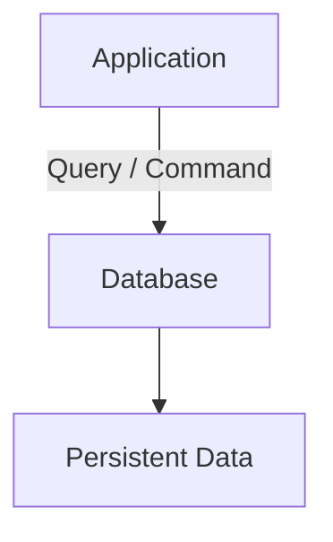

When the application restarts, the data can still be available.

---

## 2. Why Not Just Store Data in Files?

A beginner might ask:

> Why do we need a database? Can't we save everything in files?

Technically, applications can store data in files.

For example:

```text
users.json
products.json
orders.json
```

For a very small application, this may be perfectly reasonable.

But problems appear as the amount of data and number of users grow.

Imagine 100,000 users trying to update their profiles simultaneously.

A simple file-based system now has to deal with:

* Concurrent access.
* Data consistency.
* Searching.
* Updates.
* Relationships.
* Permissions.
* Transactions.
* Recovery.
* Indexing.
* Multiple application servers.

A database system provides mechanisms designed to solve many of these problems.

### File storage vs database

| File-based storage                                     | Database                                                     |
| ------------------------------------------------------ | ------------------------------------------------------------ |
| Simple to start.                                       | More infrastructure and concepts.                            |
| Good for small/simple data.                            | Designed for structured data operations at scale.            |
| Application manages much of the data logic.            | Database provides querying and data-management capabilities. |
| Searching may require scanning files.                  | Can use indexes and query optimization.                      |
| Concurrency is harder to manage correctly.             | Provides concurrency-control mechanisms.                     |
| Relationships are usually handled by application code. | Relational databases can represent relationships directly.   |

This does **not** mean files are bad.

Files are excellent for many things:

* Images.
* Videos.
* Documents.
* Backups.
* Configuration.
* Logs.

The important question is:

> What kind of data are you storing, and what operations must the system perform on it?

---

## 3. Database vs Database Management System

These terms are often used interchangeably, but they describe slightly different things.

### Database

The actual collection of stored data.

For example:

```text
users
products
orders
```

### Database Management System (DBMS)

The software that manages that data.

Examples include:

* PostgreSQL.
* MySQL.
* MariaDB.
* Microsoft SQL Server.
* Oracle Database.
* MongoDB.

A simplified architecture:

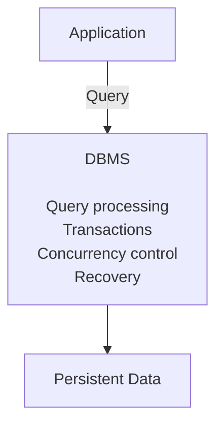

When developers say:

> "The application uses PostgreSQL."

they usually mean that PostgreSQL is the DBMS managing the application's database.

---

## 4. The Database Is Not the Application

A common architectural mistake is thinking of the database as simply another part of application code.

It has a different responsibility.

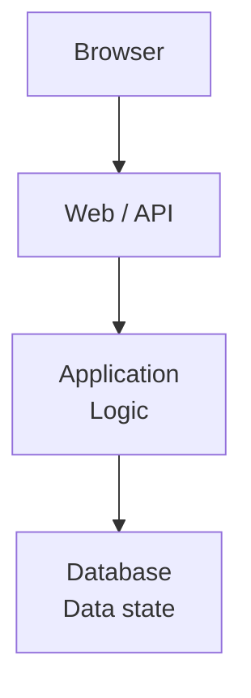

The application decides things such as:

* What an order means.
* Whether a discount is allowed.
* Whether a user can cancel an order.
* How business rules work.

The database is responsible for storing and retrieving data and, depending on the DBMS and design, enforcing important data integrity and transactional guarantees.

### Example

Suppose a customer places an order.

The application may decide:

```text
Customer wants to buy:
2 × Laptop
1 × Mouse
```

The database stores information such as:

```text
customers
orders
order_items
products
```

The application and database work together, but they have different responsibilities.

---

## 5. The Relational Database Model

One of the most widely used database models is the **relational model**.

Relational databases organize data into tables.

Consider a simple `users` table:

| id | name   | email                                           |
| -: | ------ | ----------------------------------------------- |
|  1 | Ranjit | ranjit@example.com |
|  2 | Priya  | priya@example.com   |
|  3 | Arjun  | arjun@example.com   |

A table consists of:

* Rows.
* Columns.

### Row

A row represents one record.

```text
1 | Ranjit | ranjit@example.com
```

### Column

A column represents an attribute of the records.

```text
id
name
email
```

Conceptually:

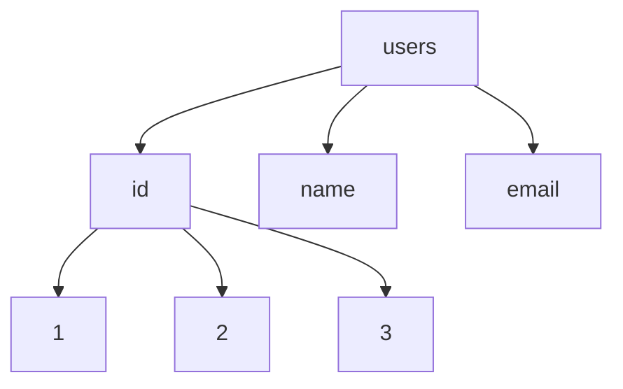

The relational model becomes particularly powerful when multiple tables are connected through relationships.

---

## 6. Tables and Relationships

An e-commerce application should not necessarily put everything into one enormous table.

Instead, related information can be separated.

```text
customers
---------
id
name
email

orders
------
id
customer_id
created_at

order_items
-----------
id
order_id
product_id
quantity

products
--------
id
name
price
```

The relationships might look like:

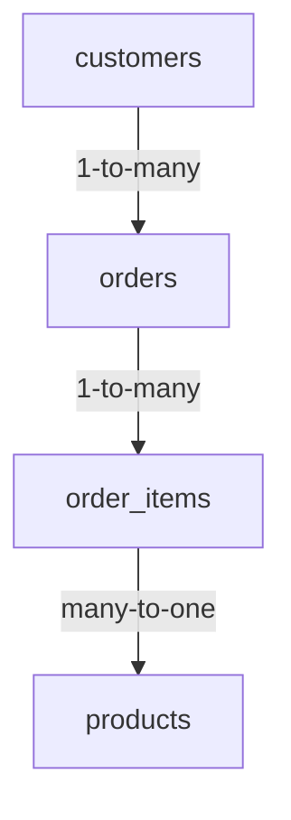

One customer can have many orders.

One order can contain many order items.

Each order item refers to a product.

This structure avoids unnecessary duplication and makes the relationships explicit.

---

## 7. Primary Keys

A **primary key** uniquely identifies a row in a table.

For example:

```text
users

id
--
1
2
3
```

Here, `id` can be the primary key.

Conceptually:

```sql
CREATE TABLE users (
    id BIGINT PRIMARY KEY,
    name VARCHAR(100),
    email VARCHAR(255)
);
```

A primary key provides a stable way to identify a record.

For example:

```text
User #42
Order #9001
Product #781
```

The exact type of primary key can vary.

Common choices include:

* Integer IDs.
* UUIDs.
* Other globally unique identifiers.

The choice affects storage, indexing, URL design, data distribution, and sometimes operational behavior.

---

## 8. Foreign Keys

A **foreign key** represents a relationship to another table.

For example:

```text
orders

id    customer_id
---   -----------
101   5
102   5
103   8
```

Here, `customer_id` refers to a customer.

Conceptually:

```text
customers                  orders

id                          id   customer_id
--                          --   -----------
5   Ranjit                  101      5
8   Priya                   102      5
                            103      8
```

The database can use a foreign key constraint to ensure that an order does not refer to a nonexistent customer.

For example:

```sql
CREATE TABLE orders (
    id BIGINT PRIMARY KEY,
    customer_id BIGINT NOT NULL,
    FOREIGN KEY (customer_id)
        REFERENCES users(id)
);
```

Foreign keys are one mechanism for protecting data integrity.

---

## 9. What Is SQL?

Relational databases commonly use **SQL — Structured Query Language**.

SQL allows applications and developers to work with relational data.

For example:

```sql
SELECT id, name, email
FROM users
WHERE id = 5;
```

This asks the database to return the specified columns for the user whose ID is `5`.

An insert:

```sql
INSERT INTO users (name, email)
VALUES ('Ranjit', 'ranjit@example.com');
```

An update:

```sql
UPDATE users
SET name = 'Ranjit Karmakar'
WHERE id = 5;
```

A delete:

```sql
DELETE FROM users
WHERE id = 5;
```

The application sends a query to the DBMS.

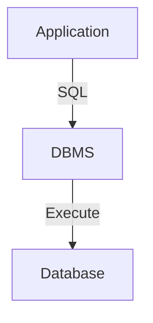

The DBMS parses, plans, and executes the request.

---

## 10. CRUD

A large number of application data operations can be described using CRUD.

| Operation | Meaning        | Example SQL |
| --------- | -------------- | ----------- |
| Create    | Add data.      | `INSERT`    |
| Read      | Retrieve data. | `SELECT`    |
| Update    | Modify data.   | `UPDATE`    |
| Delete    | Remove data.   | `DELETE`    |

For example, an application might perform:

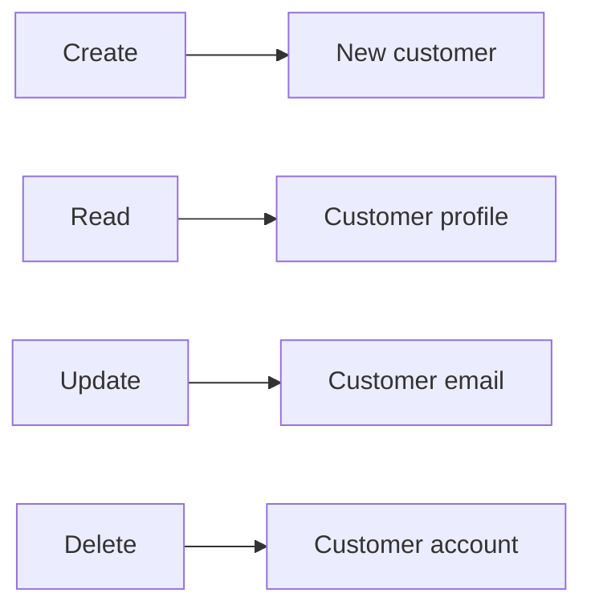

CRUD is useful for understanding application behavior, but real database systems provide much more than four operations.

They also support:

* Transactions.
* Constraints.
* Indexes.
* Aggregation.
* Concurrency control.
* Recovery.
* Replication.
* Security.
* Query optimization.

---

## 11. Indexes

Imagine a table containing 50 million users.

You run:

```sql
SELECT *
FROM users
WHERE email = 'ranjit@example.com';
```

Without a suitable index, the database may need to inspect a large portion of the table.

An index creates an additional data structure that can make certain lookups much faster.

Conceptually:

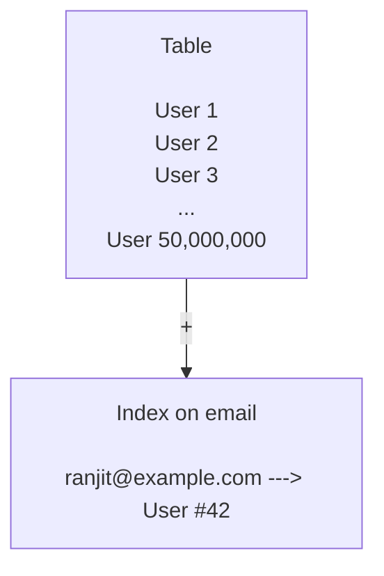

A simplified SQL example:

```sql
CREATE INDEX idx_users_email
ON users(email);
```

The database can use the index when it determines that doing so is beneficial.

### Indexes are not free

Indexes consume:

* Storage.
* Memory/cache space.
* Write processing.

When a row changes, relevant indexes may also need to be updated.

Therefore:

> An index can make reads faster while making writes more expensive.

Index design is a trade-off.

Database indexing will be studied in greater depth later in Systemly.

---

## 12. What Happens When an Application Queries a Database?

Suppose the application executes:

```sql
SELECT name
FROM users
WHERE id = 42;
```

A simplified flow is:

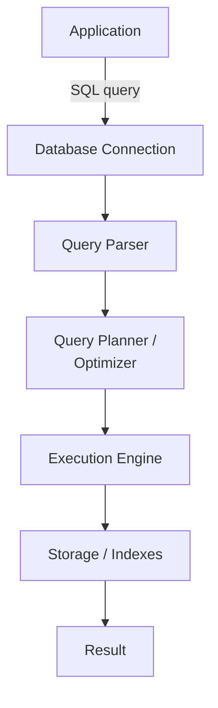

The actual internal architecture varies between database systems.

The important system-design idea is:

**A database query is not simply "read a row from disk."**

The DBMS may need to:

1. Parse the query.
2. Determine a query plan.
3. Choose indexes or other access paths.
4. Read data from memory or storage.
5. Apply filters.
6. Join tables if required.
7. Produce the result.
8. Return it to the application.

This becomes extremely important when diagnosing application performance.

---

## 13. Relational Databases

Popular relational database systems include:

* PostgreSQL.
* MySQL.
* MariaDB.
* Microsoft SQL Server.
* Oracle Database.

They differ in features, SQL dialects, operational models, extensions, and ecosystem integration, but they share the relational model.

Relational databases are particularly useful when applications have:

* Structured data.
* Strong relationships between entities.
* Complex queries.
* Transactional requirements.
* Strong data-integrity requirements.

Examples:

```text
Banking
E-commerce orders
Accounting
Inventory
Booking systems
Enterprise applications
```

A relational database is not automatically the right answer for every application.

The workload and requirements matter.

---

## 14. What Is NoSQL?

**NoSQL** is a broad category covering database systems that do not primarily use the traditional relational-table model.

Different NoSQL systems use different data models.

Common categories include:

| Type        | Basic idea                             | Example use                  |
| ----------- | -------------------------------------- | ---------------------------- |
| Document    | Stores document-like records.          | Product/catalog data.        |
| Key-value   | Stores values addressed by keys.       | Caching, sessions.           |
| Wide-column | Organizes data around column families. | Large distributed workloads. |
| Graph       | Stores nodes and relationships.        | Relationship-heavy data.     |

A document database might store something conceptually like:

```json
{
  "id": 101,
  "name": "Laptop",
  "price": 75000,
  "specifications": {
    "ram": "16GB",
    "storage": "1TB"
  }
}
```

Instead of:

```text
products
product_specs
product_ram
product_storage
...
```

The appropriate model depends on how the application reads and writes data.

---

## 15. SQL vs NoSQL

The decision is not:

> SQL is old and NoSQL is modern.

That is an oversimplification.

The real question is:

> Which data model and database behavior fit the workload?

| Requirement                         | Relational database                          | NoSQL                                                       |
| ----------------------------------- | -------------------------------------------- | ----------------------------------------------------------- |
| Structured relationships            | Strong fit.                                  | Depends on database type.                                   |
| Complex joins                       | Often strong fit.                            | Often limited or modeled differently.                       |
| Flexible document structure         | Possible, depending on DB.                   | Often a natural fit for document databases.                 |
| Strong transactions                 | Strong support in many systems.              | Varies significantly by product.                            |
| Horizontal scaling                  | Supported by some systems and architectures. | Many systems are designed with distributed scaling in mind. |
| Complex analytical queries          | Often strong.                                | Depends heavily on the product.                             |
| Rapidly changing document structure | Possible.                                    | Often convenient in document databases.                     |

There is no universal winner.

A production architecture may even use multiple database technologies.

For example:

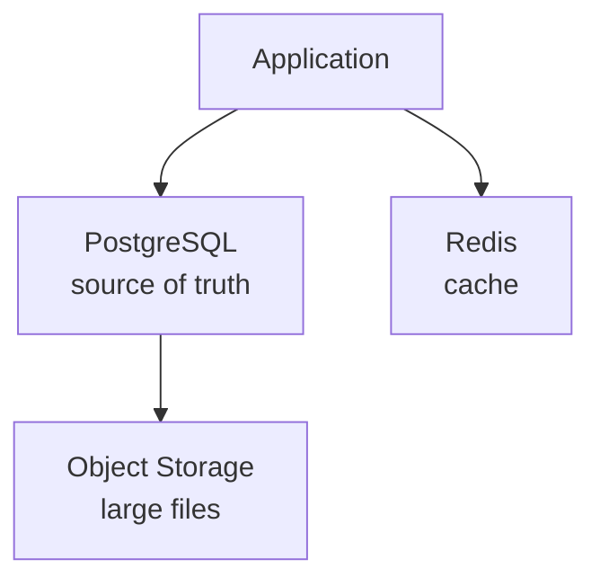

Using multiple technologies is sometimes useful, but each additional technology creates operational complexity.

---

## 16. Database as the Source of Truth

A **source of truth** is the authoritative location from which a particular piece of information is considered correct.

Suppose an application stores product prices.

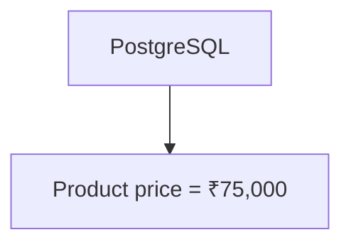

A cache may also contain:

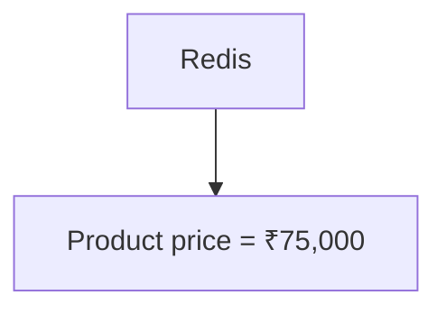

The cache is usually not the authoritative source.

If the cache disappears, the application should be able to rebuild it from the authoritative data source.

This distinction becomes important when introducing:

* Caching.
* Replication.
* Search indexes.
* Data warehouses.
* Event-driven systems.

A system may have multiple representations of data, but it should be clear which system owns the authoritative state.

---

## 17. Database and Application State

Not all application state belongs in a database.

Consider:

```text
User's current mouse position
```

This may not need permanent storage.

Compare that with:

```text
User's order history
```

This normally needs durable persistence.

A useful question is:

> Does this information need to survive application restarts and be available later?

If yes, persistent storage may be required.

But the final decision also depends on:

* Durability requirements.
* Performance.
* Cost.
* Data volume.
* Access patterns.
* Recovery requirements.

---

## 18. Database Connections

An application normally does not execute database queries magically.

It needs a connection to the DBMS.

Conceptually:

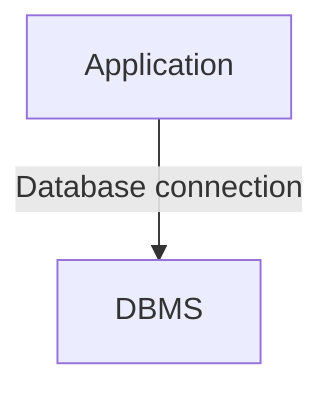

Creating a database connection has overhead.

The connection may involve:

* Network communication.
* Authentication.
* Session initialization.
* Resource allocation.

If every HTTP request creates a brand-new database connection, a busy application may waste significant resources.

For example:

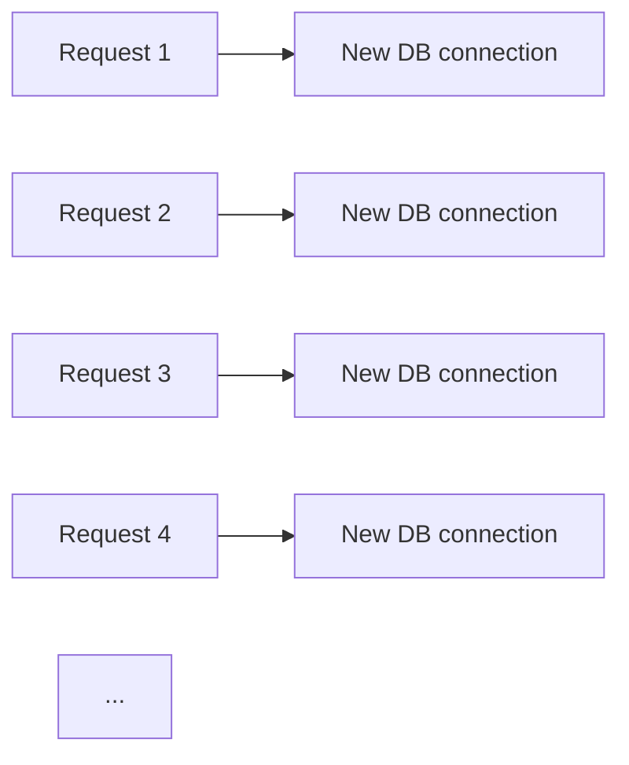

As applications grow, connection management becomes an architectural concern.

This leads directly into the next chapters on **Database Connections** and **Connection Pooling**.

---

## 19. Databases Can Become Bottlenecks

Consider an application:

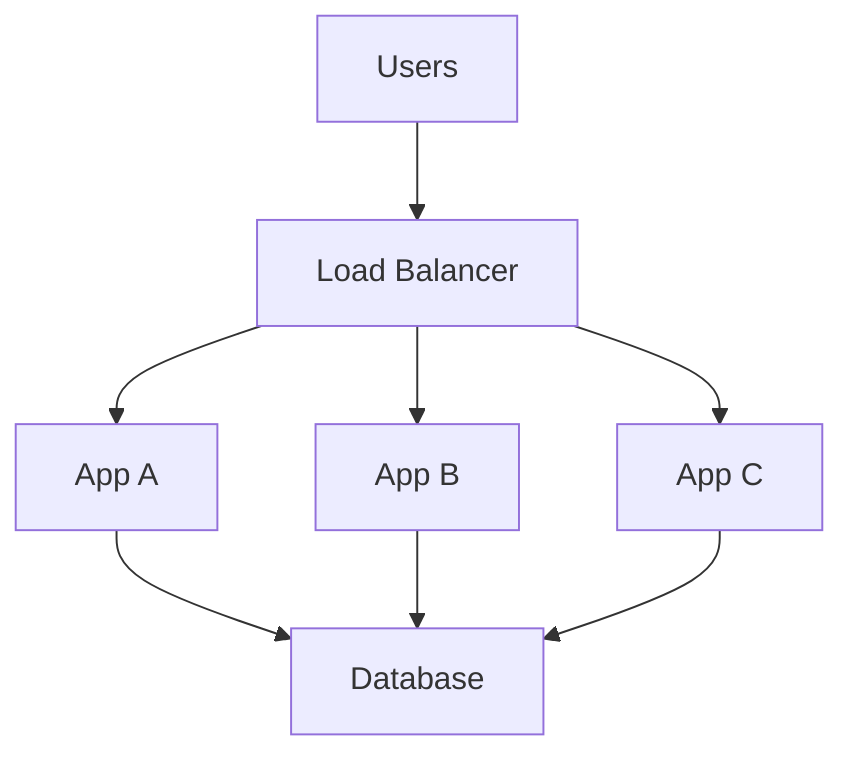

The application servers can scale horizontally.

But all of them may depend on one database.

If database capacity becomes the limiting factor:

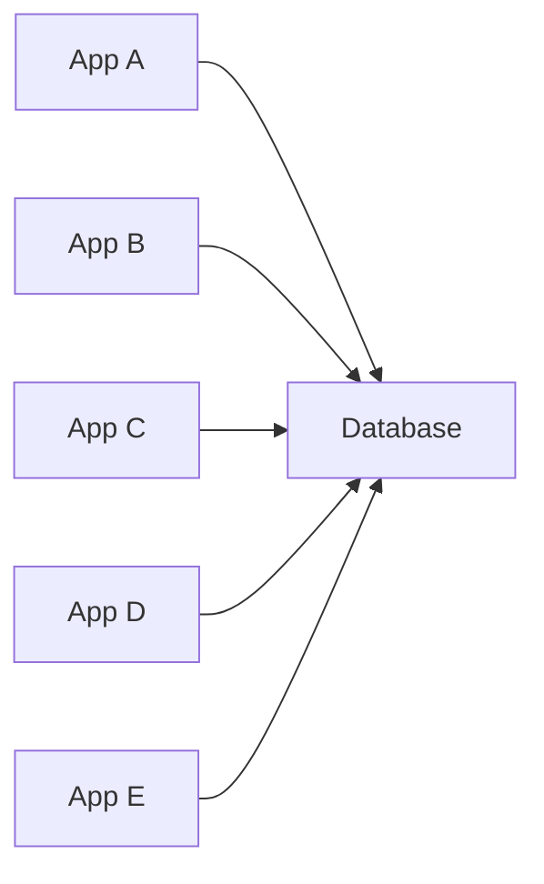

Adding more application servers may not solve the problem.

The database may become the bottleneck because of:

* CPU.
* Memory.
* Disk I/O.
* Lock contention.
* Connection limits.
* Poor queries.
* Missing indexes.
* Excessive writes.
* Large result sets.

This is a central system-design lesson:

> Scaling one layer does not automatically scale the entire system.

---

## 20. Database Failure

What happens if the database becomes unavailable?

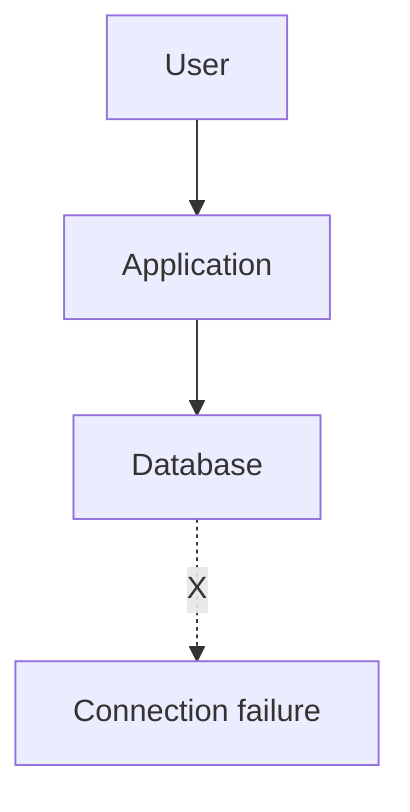

The application may be unable to:

* Log users in.
* Load profiles.
* Create orders.
* Save changes.
* Process payments.
* Retrieve important data.

A production system therefore needs to consider:

* Backups.
* Recovery.
* Replication.
* Monitoring.
* Failover.
* Data durability.
* Disaster recovery.

These topics appear later in the Systemly curriculum.

At this stage, remember that the database is often a critical dependency.

---

## 21. A Simple Production Architecture

A small production application might look like:

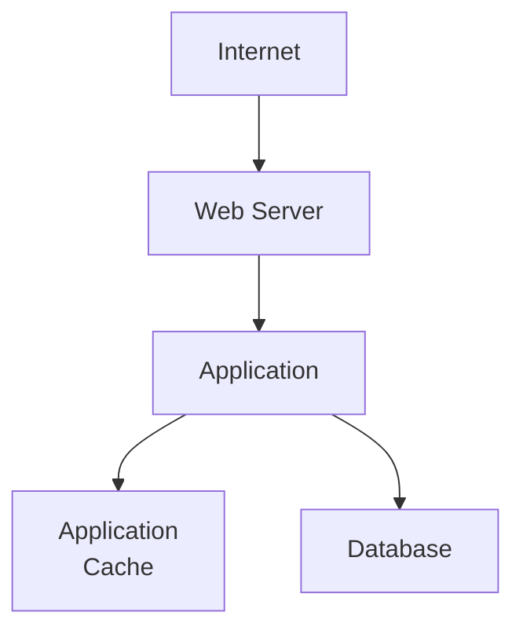

As the application grows:

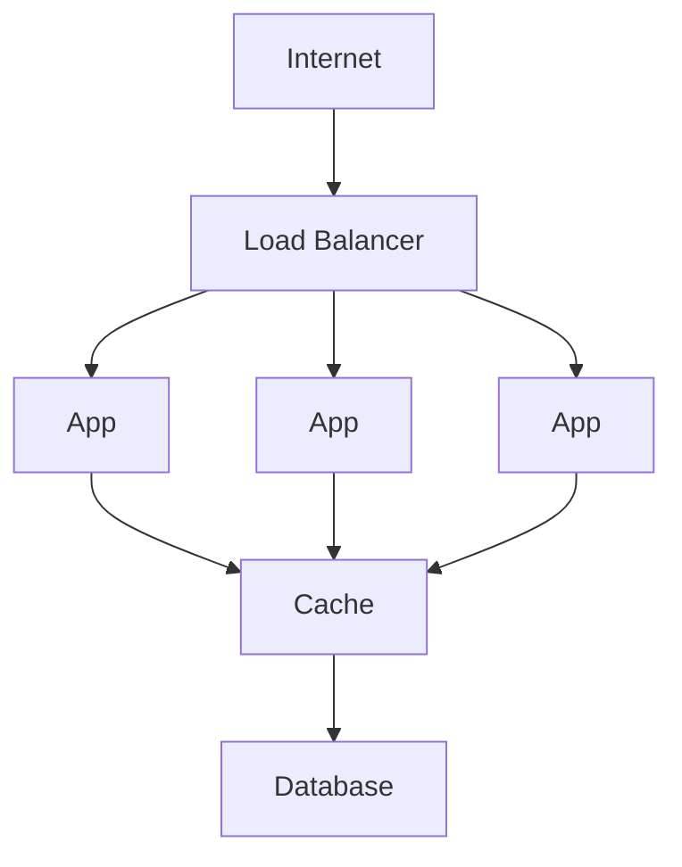

Later, additional components may appear:

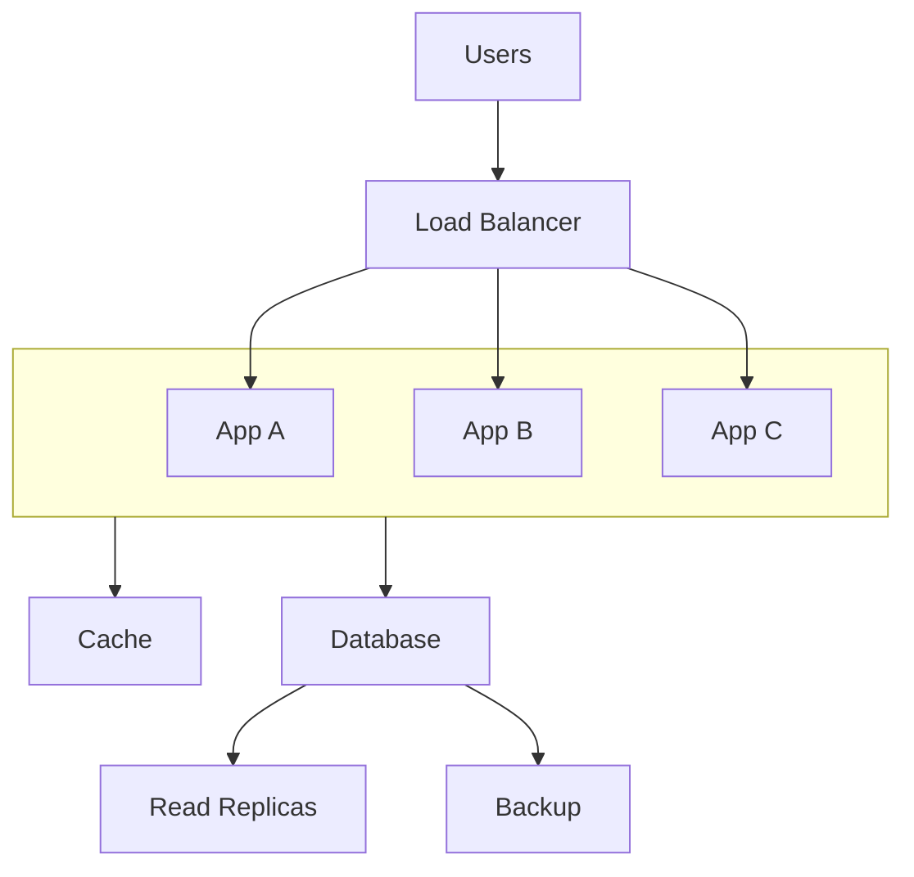

The architecture should evolve because of actual requirements and bottlenecks.

Do not add replicas, caches, sharding, or other infrastructure merely because a diagram looks more sophisticated.

---

## 22. The Database Decision Is a System Decision

Choosing a database is not simply choosing a product.

You are choosing:

* A data model.
* Query capabilities.
* Consistency behavior.
* Transaction behavior.
* Scaling characteristics.
* Operational requirements.
* Backup and recovery mechanisms.
* Cost.
* Team expertise.
* Migration difficulty.

For example:

```mermaid
flowchart TD
  accTitle: Choosing a database
  accDescr: Start from the requirement: what data do we have, how do we access it, what consistency do we need, what workload do we expect, how much must it scale, and which database behavior fits?
  N0["Requirement"] --> N1["What data do we have?"] --> N2["How do we access it?"] --> N3["What consistency do we need?"] --> N4["What workload do we expect?"] --> N5["How much must it scale?"] --> N6["Which database behavior fits?"]
```

This is system thinking.

The question is not:

> Which database is the best?

The useful question is:

> Which database characteristics match this system's requirements?

---

## Key Principles

1. **A database provides persistent data management for applications.**
2. The DBMS manages storage, queries, concurrency, transactions, and other database operations.
3. Relational databases organize data around tables and relationships.
4. NoSQL is a broad category containing several different data models.
5. Database choice should follow workload and requirements, not popularity.
6. Indexes can improve reads but add storage and write overhead.
7. A database can become a system bottleneck even when application servers scale horizontally.
8. Clearly identify the authoritative source of important data.
9. Database connections are resources and need careful management.
10. Architecture should evolve when real constraints require it.

---

## Quick Reference

| Concept             | Simple meaning                                            |
| ------------------- | --------------------------------------------------------- |
| Database            | Persistent system for storing and managing data.          |
| DBMS                | Software that manages a database.                         |
| Table               | Structured collection of relational records.              |
| Row                 | One record in a table.                                    |
| Column              | An attribute of a record.                                 |
| Primary key         | Unique identifier for a row.                              |
| Foreign key         | Reference to a row in another table.                      |
| SQL                 | Language commonly used with relational databases.         |
| CRUD                | Create, Read, Update, Delete.                             |
| Index               | Data structure that can speed up certain queries.         |
| Relational database | Database based on the relational model.                   |
| NoSQL               | Broad category of non-relational database systems.        |
| Source of truth     | Authoritative system for a piece of data.                 |
| Database bottleneck | When database capacity limits overall system performance. |

---

## Knowledge Check

**1.** Why might an application use a database instead of storing all persistent data in JSON files?

**2.** What is the difference between a database and a DBMS?

**3.** What is the purpose of a primary key?

**4.** What does a foreign key represent?

**5.** Why can adding an index improve query performance while also making writes more expensive?

**6.** Is NoSQL a single database technology?

**7.** If an application has ten application servers but one database is overloaded, will simply adding more application servers necessarily solve the problem?

**8.** Why is it useful to identify a source of truth?

### Answers

1. Databases provide mechanisms for querying, concurrency, integrity, transactions, indexing, recovery, and other data-management requirements.
2. The database is the stored data; the DBMS is the software that manages it.
3. It uniquely identifies a record.
4. It represents a relationship to a record in another table.
5. The index provides an additional structure for faster lookups, but it consumes storage and must often be maintained when data changes.
6. No. NoSQL is a broad category containing different database models and technologies.
7. No. The database may remain the bottleneck.
8. It establishes which system contains the authoritative version of the data when multiple representations exist.
