# 01.12 — Connection Pooling

## Learning Objectives

By the end of this chapter, you should understand:

* What connection pooling is and why it exists.
* How a connection pool works.
* What **acquire → use → release** means.
* The difference between pool size and database connection limits.
* Why making a pool larger does not always make an application faster.
* How multiple application instances multiply database connections.
* What happens when every connection in the pool is busy.
* Why stale, broken, or leaked connections are dangerous.
* How transactions and connection-specific state affect pooling.
* Which pool metrics matter in production.

---

# 1. The Problem: Creating a Connection Is Expensive

In the previous chapter, we saw that a database connection is a communication relationship between an application and a database.

A simplified connection process looks like:

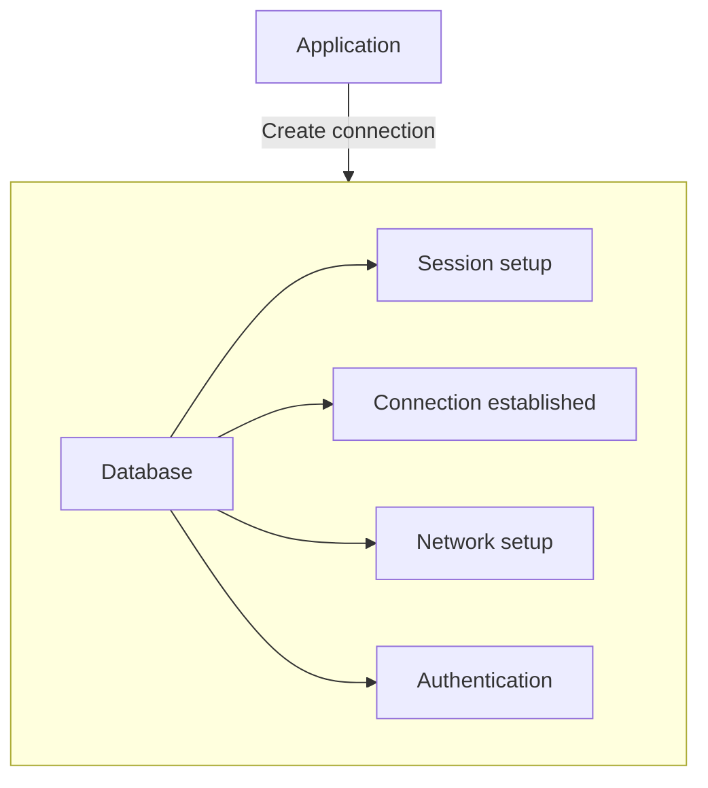

Doing this repeatedly can be expensive.

Imagine an application receiving 1,000 requests.

A naive design might behave like:

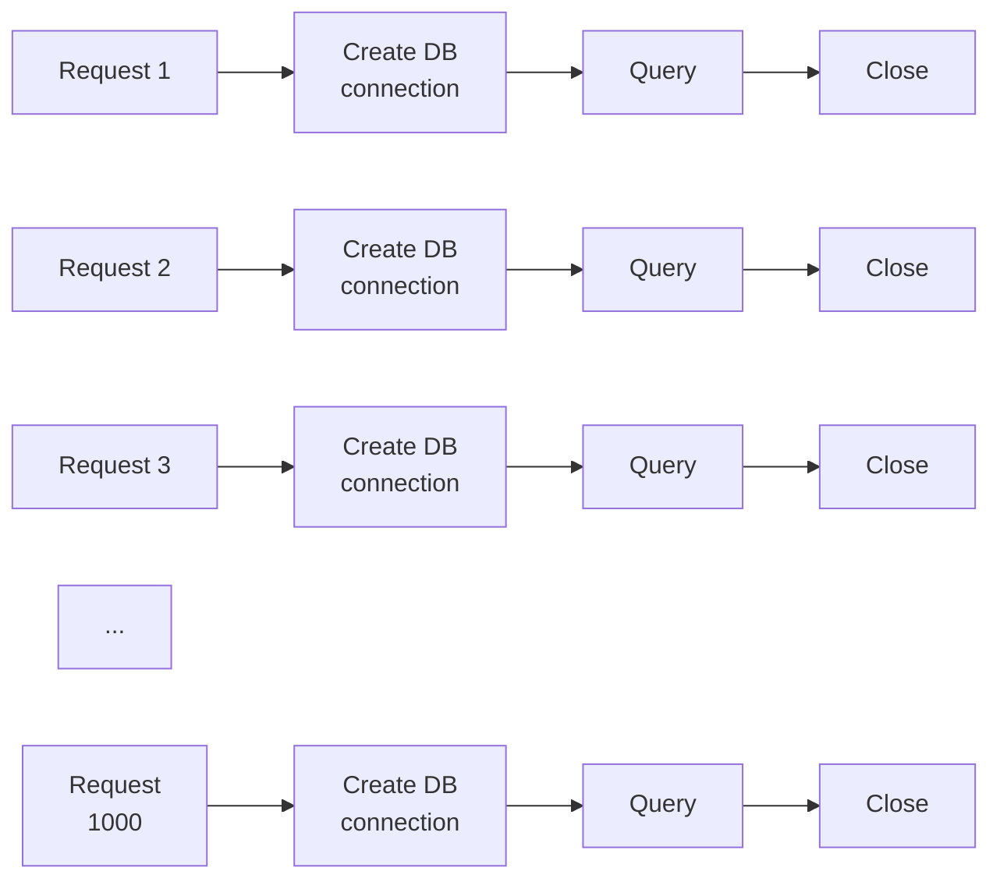

The application spends resources repeatedly creating connections.

But there is another problem:

> The database cannot handle an unlimited number of simultaneous connections.

This leads to the idea of **connection pooling**.

---

# 2. What Is Connection Pooling?

A **connection pool** is a managed collection of reusable database connections.

Instead of creating a new connection for every piece of database work, the application obtains an existing connection from the pool, uses it, and returns it.

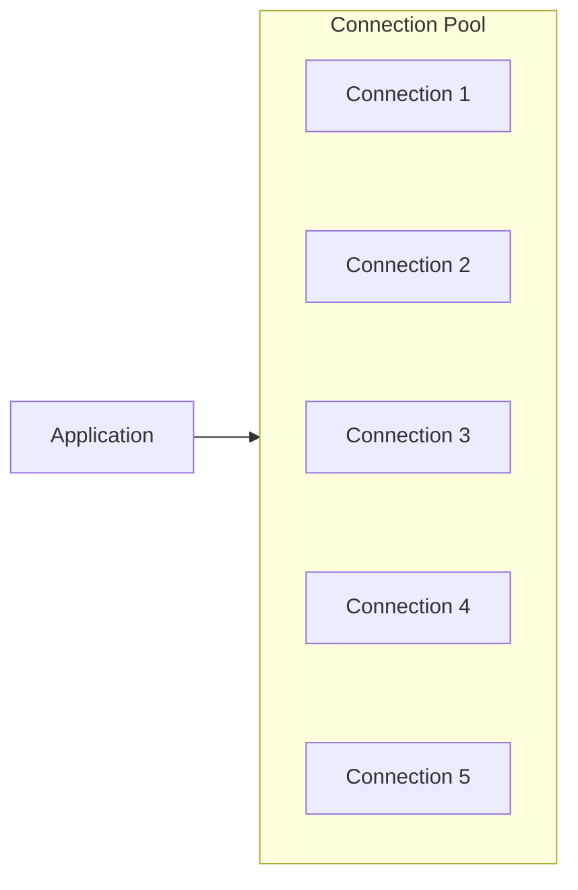

The basic lifecycle is:

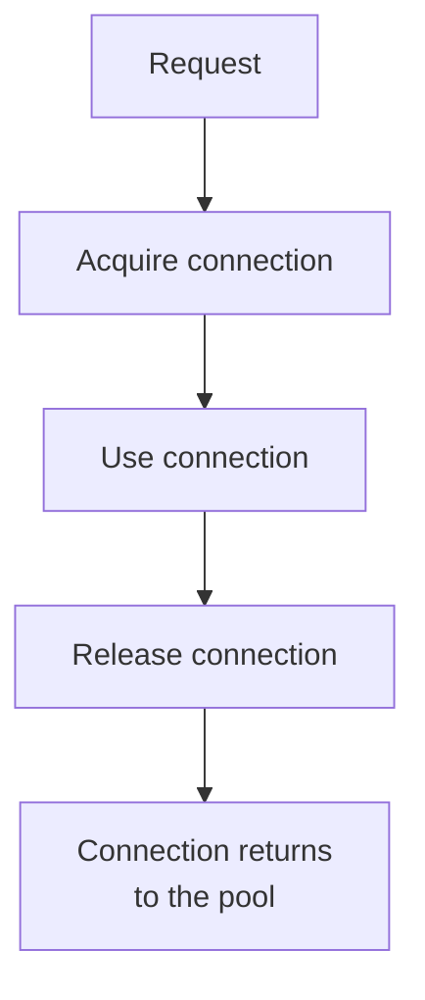

The connection is generally **not destroyed** when released.

It becomes available for another operation.

---

# 3. The Core Idea

Without pooling:

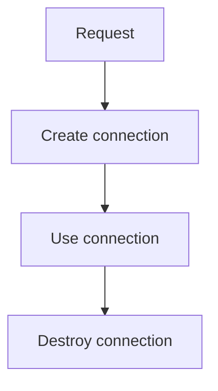

With pooling:

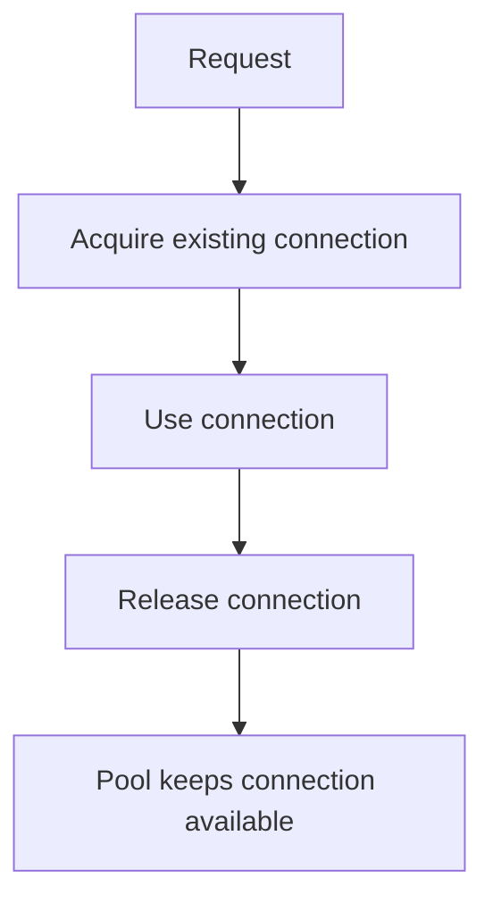

This is the most important difference.

> **Pooling changes connection management from "create and destroy" to "borrow and return."**

---

# 4. Acquire → Use → Release

A connection pool is easiest to understand through three actions.

## Acquire

The application asks the pool:

> "Give me a database connection I can use."

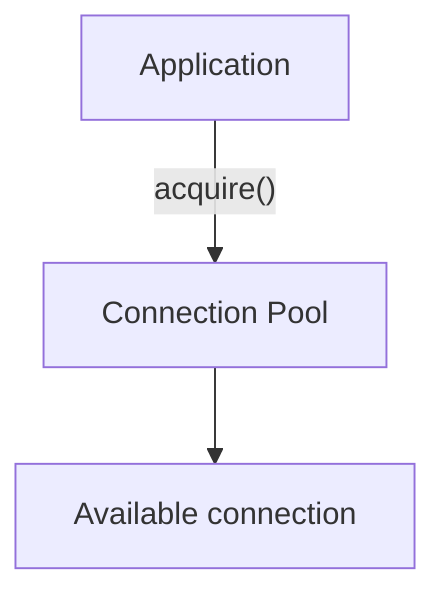

---

## Use

The application performs database work.

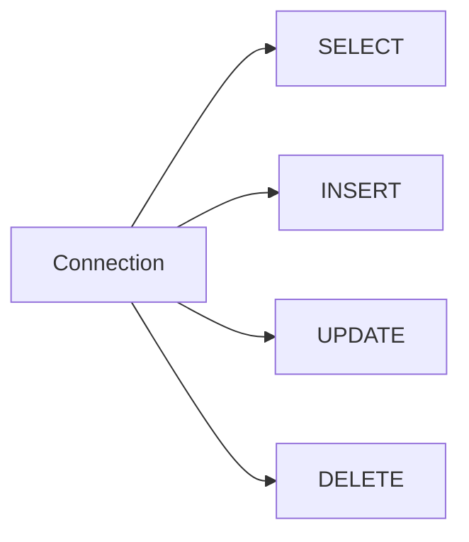

The connection remains assigned to that piece of work while it is being used.

---

## Release

When the work is finished, the application returns the connection.

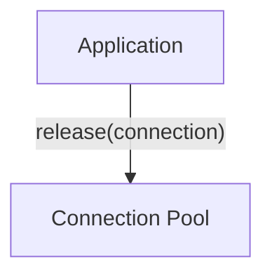

The pool can then give that connection to another request.

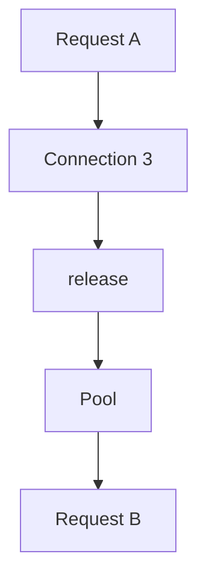

The physical connection was reused.

---

# 5. A Simple Analogy

Imagine a library with 10 study desks.

There are 100 students.

The library does **not** build 100 desks.

Instead:

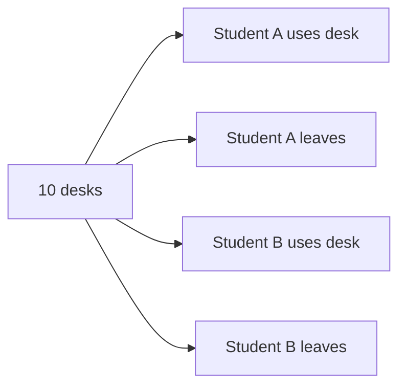

The desks are reusable resources.

A connection pool works similarly:

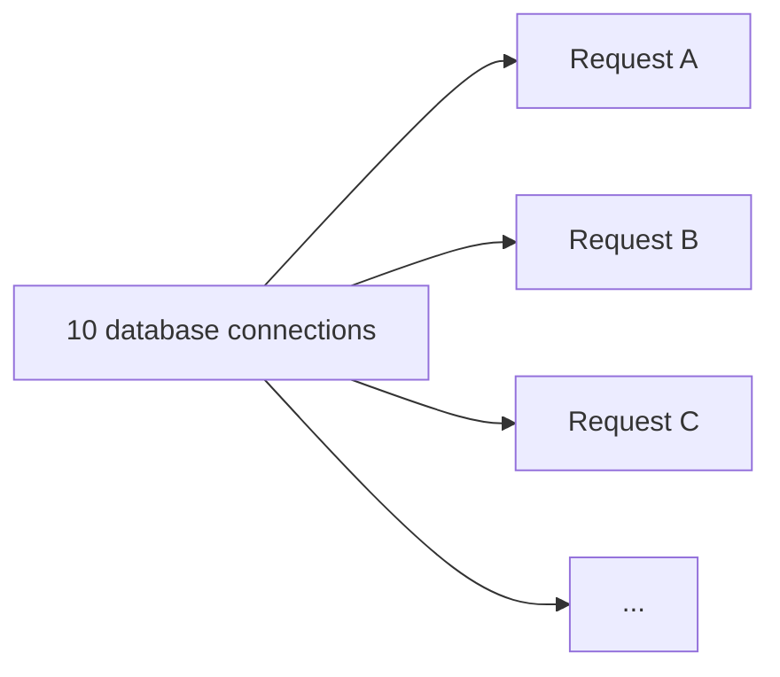

Many requests can use a smaller controlled set of connections over time.

---

# 6. Pool Size

A connection pool normally has a limit on how many connections it can maintain or use concurrently.

For example:

```text
Pool size = 10

┌─────────────────────────┐
│ DB Connections          │
├─────────────────────────┤
│ 1  ●                    │
│ 2  ●                    │
│ 3  ●                    │
│ 4  ●                    │
│ 5  ●                    │
│ 6  ●                    │
│ 7  ●                    │
│ 8  ●                    │
│ 9  ●                    │
│ 10 ●                    │
└─────────────────────────┘
```

At most 10 connections may be actively assigned at once, depending on the pool's implementation and configuration.

But that does **not** mean only 10 requests can exist.

You could have:

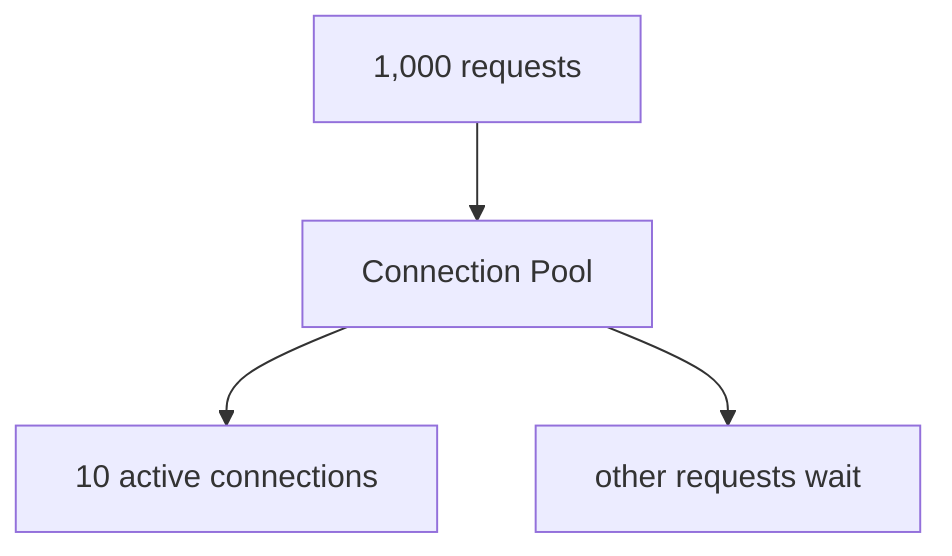

The pool becomes a controlled gateway to the database.

---

# 7. What Happens When All Connections Are Busy?

Suppose the pool has five connections.

```text
Pool = 5

Connection 1 → Request A
Connection 2 → Request B
Connection 3 → Request C
Connection 4 → Request D
Connection 5 → Request E
```

Now Request F needs a connection.

There is no free connection.

The pool may make Request F wait:

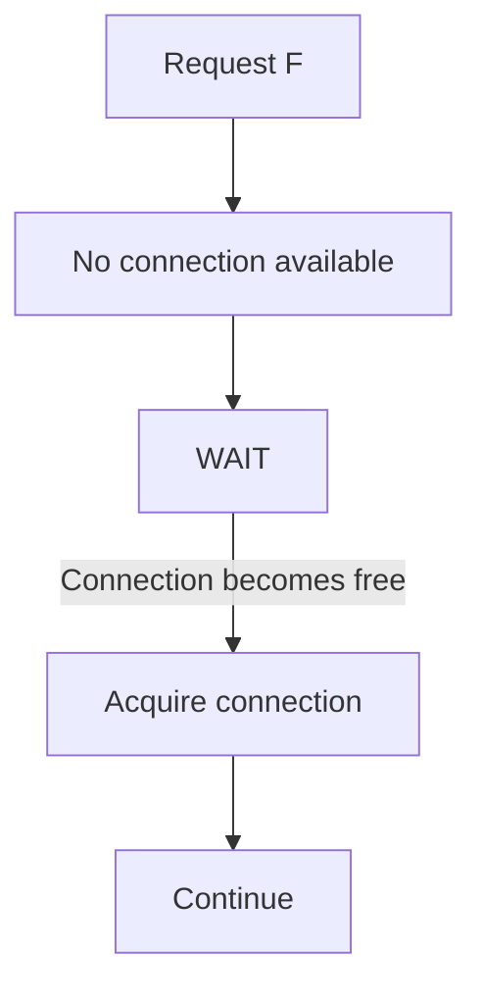

This is important.

The pool does not magically create unlimited capacity.

It introduces **controlled waiting**.

---

# 8. Pool Waiting Is Not Automatically a Failure

Suppose a connection is busy for 50 ms.

Another request waits 20 ms before receiving it.

That may be perfectly normal.

The important question is:

> **How long are requests waiting, and why?**

Healthy:

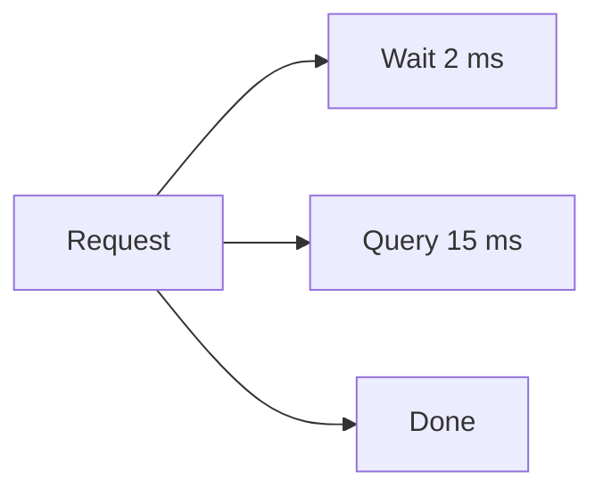

Potential problem:

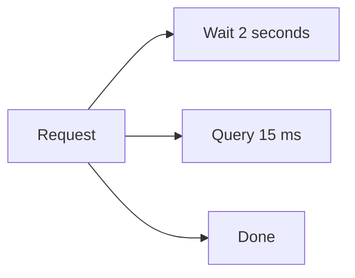

The second system may have a database bottleneck, oversized transactions, too-small pool, slow queries, or another capacity problem.

---

# 9. Pool Size vs Database Connection Limit

These are two different concepts.

Suppose the database allows:

```text
Maximum database connections = 200
```

Your application pool might be:

```text
Pool maximum = 20
```

That means one application instance can use at most 20 connections through that pool.

The pool protects the database from that application instance creating unlimited connections.

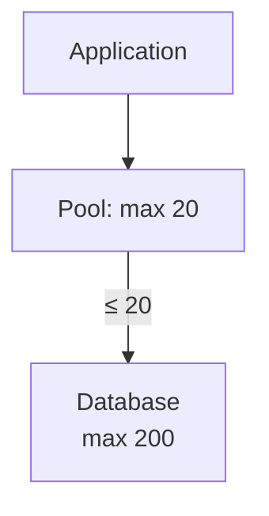

But there is an important scaling problem.

---

# 10. Multiple Application Instances

Suppose one application server has:

```text
Pool = 20
```

Now you deploy five application instances.

```text
Server 1 → Pool 20
Server 2 → Pool 20
Server 3 → Pool 20
Server 4 → Pool 20
Server 5 → Pool 20
```

Potential maximum:

```text
20 × 5 = 100 connections
```

So the database may see:

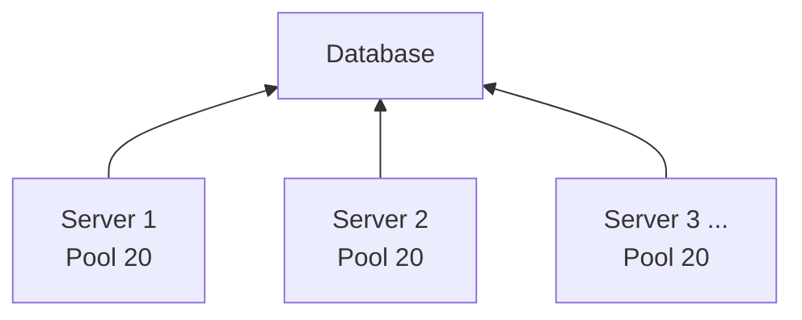

This gives us an important system-design lesson:

> **Pool size is usually local to an application process or instance.**

Increasing application instances can therefore multiply database connections.

---

# 11. A Simple Capacity Calculation

Imagine:

```text
Database connection limit = 100

Application instances = 4

Pool per instance = 20
```

Potential total:

```text
4 × 20 = 80 connections
```

That leaves:

```text
100 - 80 = 20 connections
```

But those 20 connections may also be needed by:

* administrative tools
* background workers
* reporting systems
* monitoring
* migrations
* other applications

Therefore:

> Do not treat the database's entire connection limit as application capacity.

You need operational headroom.

---

# 12. Why Bigger Pools Are Not Always Better

A common mistake is:

> "The application is waiting for connections. Increase the pool."

Sometimes that helps.

Sometimes it makes the system worse.

Consider:

```text
Pool = 10
Database = overloaded
```

Increasing the pool to:

```text
Pool = 100
```

may allow more queries to hit the database simultaneously.

If the database is already the bottleneck, this can increase contention rather than solve it.

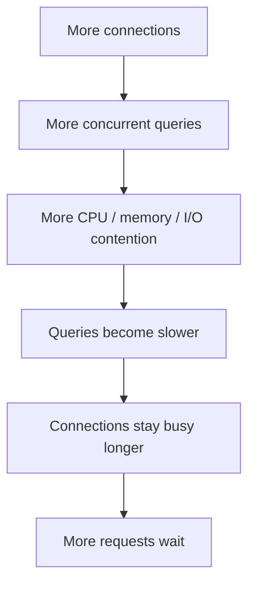

This is a feedback loop.

> **More concurrency does not automatically mean more throughput.**

---

# 13. Connection Pooling Does Not Make the Database Faster

Pooling primarily reduces the overhead of repeatedly establishing connections and provides controlled concurrency.

It does not automatically optimize:

* SQL queries
* indexes
* database schema
* disk I/O
* CPU
* memory
* locking
* transactions

For example:

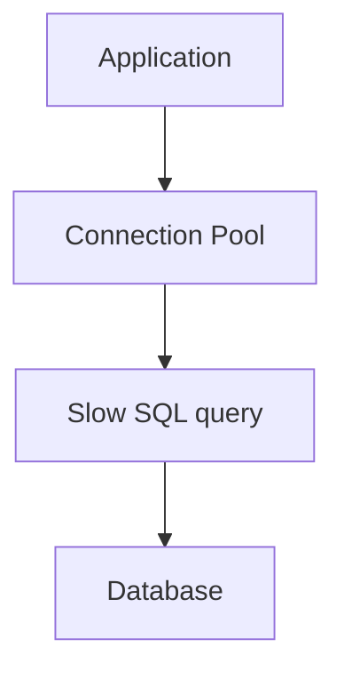

The pool cannot turn a 5-second query into a 5-millisecond query.

You still need query optimization and appropriate database architecture.

---

# 14. Connection Reuse

Suppose the pool contains three connections:

```text
Connection 1
Connection 2
Connection 3
```

Request A uses Connection 1:

```mermaid
flowchart LR
  accTitle: Request A on connection 1
  accDescr: Request A uses C1 for a query and releases it.
  N0["A"] --> N1["C1"] --> N2["Query"] --> N3["Release"]
```

Later Request B may use the same connection:

```mermaid
flowchart LR
  accTitle: Request B on connection 1
  accDescr: Request B uses the same C1 for a query and releases it.
  N0["B"] --> N1["C1"] --> N2["Query"] --> N3["Release"]
```

Then Request C:

```mermaid
flowchart LR
  accTitle: Request C on connection 1
  accDescr: Request C uses the same C1 for a query and releases it.
  N0["C"] --> N1["C1"] --> N2["Query"] --> N3["Release"]
```

The same underlying connection can serve many requests over its lifetime.

```mermaid
flowchart TD
  accTitle: One connection over its lifetime
  accDescr: Connection 1 serves request A, request B and request C.
  H["Connection 1"]
  I0["Request A"]
  I1["Request B"]
  I2["Request C"]
  H --> I0
  H --> I1
  H --> I2
```

This is the main efficiency benefit of pooling.

---

# 15. Minimum and Maximum Pool Size

Some pooling systems distinguish between a minimum and maximum number of connections.

For example:

```text
Minimum = 5
Maximum = 20
```

The pool may maintain some ready connections even when demand is low.

```text
Low traffic

Pool
├── C1
├── C2
├── C3
├── C4
└── C5
```

During higher demand:

```text
High traffic

Pool
├── C1
├── C2
├── C3
├── ...
├── C18
├── C19
└── C20
```

The exact behavior depends on the runtime and pool implementation.

The architectural idea is more important:

> **A pool can control how many database connections exist and how aggressively they are created.**

---

# 16. Idle Connections

A connection may be sitting in the pool without currently being used.

```text
Pool

C1 → Active
C2 → Active
C3 → Idle
C4 → Idle
C5 → Idle
```

Idle connections can be useful because they are already established.

A future request can acquire one immediately.

But too many idle connections consume database resources.

This creates another trade-off:

```mermaid
flowchart LR
  accTitle: The idle connection trade-off
  accDescr: More idle connections give faster reuse but consume more resources.
  H["More idle connections"]
  I0["Faster reuse"]
  I1["More resources consumed"]
  H --> I0
  H --> I1
```

---

# 17. Stale Connections

Connections can become invalid.

For example:

```mermaid
flowchart TD
  accTitle: A connection going stale
  accDescr: The application has a connection in the pool. A database or network problem breaks the connection.
  A["Application"] --> C["Connection in pool"] -->|"Database/network problem"| B["Connection becomes broken"]
```

If the pool blindly gives that connection to a request:

```mermaid
flowchart TD
  accTitle: Using a broken connection
  accDescr: A request receives a broken connection, and the database operation fails.
  N0["Request"] --> N1["Broken connection"] --> N2["Database operation fails"]
```

A robust pool may validate connections before use or detect failures and replace them.

The exact strategy depends on the database driver and pool implementation.

---

# 18. Connection Validation

A pool may perform a health check or validation before handing out a connection.

Conceptually:

```mermaid
flowchart TD
  accTitle: Validating before use
  accDescr: On acquire, the pool checks whether the connection is usable. If yes, it is used; if no, it is discarded and replaced.
  A["Acquire"] --> Q{"Is connection usable?"}
  Q -->|"YES"| U["Use"]
  Q -->|"NO"| X["Discard/replace"]
```

Validation has a cost, so it should not automatically be performed excessively.

The system needs to balance:

```text
Validation
    VS
Performance
```

---

# 19. Transactions and Connection Pools

This is one of the most important details.

Suppose a request starts a transaction:

```mermaid
flowchart TD
  accTitle: A transaction
  accDescr: BEGIN, update the order, update the inventory, COMMIT.
  N0["BEGIN"] --> N1["UPDATE order"] --> N2["UPDATE inventory"] --> N3["COMMIT"]
```

The transaction belongs to a particular database connection/session.

Therefore, the connection must not be released before the transaction is properly completed.

Correct:

```mermaid
flowchart TD
  accTitle: Releasing after the transaction
  accDescr: Correct: acquire, BEGIN, database work, COMMIT or ROLLBACK, cleanup, then release.
  N0["Acquire"] --> N1["BEGIN"] --> N2["Database work"] --> N3["COMMIT / ROLLBACK"] --> N4["Cleanup"] --> N5["Release"]
```

Incorrect:

```mermaid
flowchart TD
  accTitle: Releasing too early
  accDescr: Incorrect: acquire, BEGIN, database work, release too early, and another request gets the connection.
  N0["Acquire"] --> N1["BEGIN"] --> N2["Database work"] --> N3["Release too early"] --> N4["Another request gets connection"]
```

This can cause serious correctness problems.

---

# 20. Connection-Specific State

A database connection can have state associated with it.

For example:

* transaction state
* session variables
* temporary tables
* selected database/schema
* isolation settings
* session-level configuration

If that state is left behind when a connection returns to the pool, the next request may inherit it.

Conceptually:

```mermaid
flowchart TD
  accTitle: Inherited session state
  accDescr: Request A uses connection 3, changes its session state and releases it to the pool. Request B gets connection 3 with unexpected old state.
  A["Request A"] --> C["Connection 3"]
  C --> S["Changes session state"]
  C --> R["Releases connection"] --> P["Pool"] --> B["Request B"] --> G["Gets Connection 3"] --> O["Unexpected old state"]
```

Therefore:

> **A pooled connection must be returned in a clean, predictable state.**

This is one reason transaction cleanup is important.

---

# 21. Connection Leaks

A connection leak happens when application code acquires a connection but fails to release it properly.

Imagine:

```text
Pool = 10

Request 1 → C1 → never released
Request 2 → C2 → never released
Request 3 → C3 → never released
...
```

Eventually:

```text
C1 → Leaked
C2 → Leaked
...
C10 → Leaked
```

Now:

```mermaid
flowchart TD
  accTitle: An exhausted pool
  accDescr: The pool has no available connections, new requests wait, and they time out.
  N0["Pool"] --> N1["No available connections"] --> N2["New requests wait"] --> N3["Timeouts"]
```

The database itself may still be healthy.

The application has simply lost access to its connection resources.

---

# 22. How Applications Prevent Leaks

Good application code makes connection release part of the normal lifecycle.

Conceptually:

```mermaid
flowchart TD
  accTitle: A reliable release path
  accDescr: Acquire, then try to use the connection, and finally release the connection.
  N0["Acquire"] --> N1["try:<br/>use connection"] --> N2["finally:<br/>release connection"]
```

The exact syntax depends on the programming language.

The important principle is:

> **Every acquired connection needs a reliable release path, including error paths.**

---

# 23. Three Different Timeouts

Pooling introduces an important distinction.

### 1. Acquire Timeout

How long should a request wait for a connection from the pool?

```mermaid
flowchart TD
  accTitle: Acquire timeout
  accDescr: A request finds no free connection in the pool, waits, and hits the acquire timeout.
  N0["Request"] --> N1["Pool has no free connection"] --> N2["Wait"] --> N3["Acquire timeout"]
```

---

### 2. Connection Timeout

How long should the application wait while establishing a connection to the database?

```mermaid
flowchart TD
  accTitle: Connection timeout
  accDescr: The application connects to the database, the database does not respond, and the connection times out.
  N0["Application"] --> N1["Connect to database"] --> N2["Database does not respond"] --> N3["Connection timeout"]
```

---

### 3. Query Timeout

How long should a database operation be allowed to execute?

```mermaid
flowchart TD
  accTitle: Query timeout
  accDescr: On a connection, SELECT ... runs too long and hits the query timeout.
  N0["Connection"] --> N1["SELECT ..."] --> N2["Query runs too long"] --> N3["Query timeout"]
```

These are different failure points.

```mermaid
flowchart LR
  accTitle: Three failure points
  accDescr: A request acquires a connection, which can hit the acquire timeout; establishes a connection, which can hit the connection timeout; and executes a query, which can hit the query timeout.
  R["Request"] --> A["Acquire<br/>connection"] --> AT["Acquire<br/>timeout"]
  R --> E["Establish<br/>connection"] --> CT["Connection<br/>timeout"]
  R --> Q["Execute<br/>query"] --> QT["Query<br/>timeout"]
```

Understanding this distinction makes production troubleshooting much easier.

---

# 24. What Happens During Database Failure?

Suppose the database becomes unavailable.

```mermaid
flowchart TD
  accTitle: The database is unavailable
  accDescr: The application goes through the connection pool to the database, which has failed.
  A["Application"] --> P["Connection Pool"] --> D["Database<br/>X"]
```

Existing connections may fail.

New connections may also fail.

The pool should not respond by endlessly creating new connections.

Otherwise:

```mermaid
flowchart TD
  accTitle: Making a failure worse
  accDescr: The database is failing, connection attempts increase, pressure grows and the failure becomes worse.
  N0["Database failing"] --> N1["Connection attempts increase"] --> N2["More pressure"] --> N3["Failure becomes worse"]
```

A resilient system needs controlled failure behavior.

This may involve:

* connection limits
* connection timeouts
* retry limits
* backoff
* circuit breakers
* request timeouts
* graceful degradation

These concepts will appear again later in Systemly.

---

# 25. Pooling and Backpressure

Connection pooling naturally introduces a form of backpressure.

Suppose:

```text
Pool = 10

10 connections busy
```

Additional requests cannot immediately perform database work.

They must wait or fail according to the configured behavior.

```mermaid
flowchart TD
  accTitle: Backpressure
  accDescr: Incoming requests reach the connection pool with 10 busy, wait until a connection is released, and then the next request proceeds.
  N0["Incoming requests"] --> N1["Connection Pool<br/>10 busy"] --> N2["WAIT"] --> N3["Connection released"] --> N4["Next request proceeds"]
```

This can prevent the application from overwhelming the database.

But excessive waiting is itself a performance problem.

---

# 26. One Application Instance

Consider a simple architecture:

```mermaid
flowchart TD
  accTitle: One application instance
  accDescr: Users reach the application instance, whose pool of at most 10 connects to the database.
  N0["Users"] --> N1["Application<br/>Instance"] --> N2["Pool<br/>10 max"] --> N3["Database"]
```

The pool controls database concurrency for that application instance.

---

# 27. Multiple Application Instances

Now scale horizontally:

```mermaid
flowchart TD
  accTitle: Several application instances
  accDescr: A load balancer sends requests to App 1, App 2 and App 3, each with pool 10, and all connect to the database.
  L["Load Balancer"] --> A1["App 1<br/>Pool 10"] & A2["App 2<br/>Pool 10"] & A3["App 3<br/>Pool 10"]
  A1 & A2 & A3 --> D["Database"]
```

Potential maximum:

```text
3 × 10 = 30 connections
```

If you scale to 20 application instances:

```text
20 × 10 = 200 connections
```

A pool that looked small on one server can become large at system level.

This is why database connection planning must consider the **whole deployment**, not just one application process.

---

# 28. Multiple Workers on One Server

There is another subtle case.

One physical server may run multiple application workers or processes.

For example:

```text
Server
├── Worker 1 → Pool
├── Worker 2 → Pool
├── Worker 3 → Pool
└── Worker 4 → Pool
```

If each worker can maintain 10 connections:

```text
4 × 10 = 40 potential connections
```

So the calculation is often closer to:

```text
Total potential connections
≈
application instances
×
workers/processes per instance
×
maximum pool size
```

The exact model depends on the runtime and architecture.

But the system-design lesson remains:

> **Always calculate connection capacity across all processes that can create pools.**

---

# 29. Pooling Does Not Mean One Connection Per Request

This distinction is important.

Suppose:

```text
100 concurrent requests
Pool = 10
```

It does **not** mean:

```text
100 requests = 100 database connections
```

Instead:

```mermaid
flowchart TD
  accTitle: Requests compete for connections
  accDescr: 100 requests share 10 database connections and compete for controlled access.
  N0["100 requests"] --> N1["10 database connections"] --> N2["Requests compete for controlled access"]
```

Some requests may not currently need the database.

Some may be waiting.

Some may be using other resources.

This is why application concurrency and database concurrency are different concepts.

---

# 30. Pool Metrics

In production, engineers need to know what the pool is doing.

Useful metrics include:

| Metric              | What it tells you                           |
| ------------------- | ------------------------------------------- |
| Active connections  | Connections currently in use                |
| Idle connections    | Connections currently available             |
| Maximum connections | Pool capacity                               |
| Waiting requests    | Requests waiting for a connection           |
| Acquire latency     | Time spent obtaining a connection           |
| Connection errors   | Problems establishing/using connections     |
| Connection lifetime | How long connections remain in the pool     |
| Timeout count       | How often waits or operations exceed limits |

A simple operational view might look like:

```text
Connection Pool

Maximum:       20
Active:        17
Idle:           3
Waiting:       12
Acquire p95: 180ms
Errors:         2
```

This tells a much better story than simply saying:

> "The database is slow."

---

# 31. Diagnosing a Pool Bottleneck

Suppose users report slow requests.

You observe:

```text
CPU:             30%
Application:     40%
Pool active:     20/20
Pool waiting:    50
Database CPU:    95%
```

The pool is fully occupied.

But the real bottleneck may be the database.

The investigation should continue:

```mermaid
flowchart TD
  accTitle: Why are connections busy?
  accDescr: The pool is saturated. Why are connections busy? Slow queries, long transactions, database CPU, lock contention, external calls inside transactions, or too much concurrent work.
  P["Pool saturated"] --> G
  subgraph G[" "]
    direction LR
    W["Why are<br/>connections<br/>busy?"]
    %% Mermaid lays these out rotated, so they are declared out of order to keep the draft order.
    I4["External calls<br/>inside<br/>transactions?"]
    I5["Too much<br/>concurrent<br/>work?"]
    I0["Slow<br/>queries?"]
    I1["Long<br/>transactions?"]
    I2["Database<br/>CPU?"]
    I3["Lock<br/>contention?"]
    W --> I4 & I5 & I0 & I1 & I2 & I3
  end
```

Do not immediately increase the pool.

First find the bottleneck.

This follows Systemly's central principle:

> **Find the bottleneck before changing the architecture.**

---

# 32. A Realistic Example: E-Commerce Checkout

Imagine an online store.

A checkout request may need to:

```mermaid
flowchart TD
  accTitle: A checkout transaction
  accDescr: A request acquires a database connection and begins a transaction: check inventory, create order, create order items, update inventory. Then it commits and releases the connection.
  R["Request"] --> A["Acquire DB connection"] --> G
  subgraph G[" "]
    direction LR
    B["Begin<br/>transaction"]
    %% Mermaid lays these out rotated, so they are declared out of order to keep the draft order.
    I2["Create order<br/>items"]
    I3["Update<br/>inventory"]
    I0["Check<br/>inventory"]
    I1["Create order"]
    B --> I2 & I3 & I0 & I1
  end
  G --> C["Commit"] --> L["Release connection"]
```

If the transaction takes 500 ms, the connection remains occupied for that period.

With:

```text
Pool = 20
```

only around 20 such operations can actively hold connections at once.

If the transaction is unnecessarily long:

```mermaid
flowchart TD
  accTitle: A long transaction
  accDescr: A long transaction holds its connection longer, the pool becomes busy, and requests wait.
  N0["Long transaction"] --> N1["Connection held longer"] --> N2["Pool becomes busy"] --> N3["Requests wait"]
```

Therefore:

> **Connection pool performance is strongly affected by how long application code holds connections.**

---

# 33. The Hidden Cost of Holding a Connection

Suppose:

```mermaid
flowchart TD
  accTitle: Holding a connection during an external call
  accDescr: Acquire a connection, run a database query, call the external payment API, wait 2 seconds, update the database, then release.
  N0["Acquire connection"] --> N1["Database query"] --> N2["Call external payment API"] --> N3["Wait 2 seconds"] --> N4["Update database"] --> N5["Release"]
```

The connection may remain occupied while waiting for an external service.

That is usually undesirable, especially inside a transaction.

A better architecture may separate the external operation from database work when correctness allows.

```mermaid
flowchart TD
  accTitle: Releasing before the external call
  accDescr: Do the database work, release the connection, perform the external operation, then make a later database update.
  N0["Database work"] --> N1["Release connection"] --> N2["External operation"] --> N3["Later database update"]
```

The correct design depends on business requirements and consistency needs.

The broader lesson is:

> **Do not hold scarce resources longer than necessary.**

---

# 34. Connection Pool as a Resource Manager

A useful mental model is:

```mermaid
flowchart TD
  accTitle: The pool as a resource manager
  accDescr: The connection pool allocates through acquire, limits capacity, and reuses through release.
  P["Connection Pool"] --> A["Allocate"] & L["Limit"] & R["Reuse"]
  A --> A2["Acquire"]
  L --> L2["Capacity"]
  R --> R2["Release"]
```

The pool is not just a performance trick.

It is a **resource management mechanism**.

It controls access to a limited database resource.

---

# 35. Connection Pool vs Connection

These are not the same thing.

| Concept             | Meaning                                          |
| ------------------- | ------------------------------------------------ |
| Database connection | One communication relationship with the database |
| Connection pool     | Manager containing/reusing multiple connections  |
| Pool size           | Limit/configuration controlling pool capacity    |
| Acquire             | Request a connection from the pool               |
| Release             | Return the connection to the pool                |
| Query               | Database operation performed using a connection  |

Think:

```text
Pool
├── Connection
├── Connection
├── Connection
└── Connection
```

---

# 36. Connection Pool vs Database

Another important distinction:

```mermaid
flowchart TD
  accTitle: Where the pool sits
  accDescr: The application goes through the connection pool to the database.
  N0["Application"] --> N1["Connection Pool"] --> N2["Database"]
```

The pool belongs to the application/runtime side.

The database has its own resource limits.

Therefore:

```text
Application pool limit
          ≠
Database maximum connection limit
```

The application must be configured with awareness of the database's capacity.

---

# 37. Common Mistakes

## Mistake 1: Creating a new connection for every query

```text
Query 1 → new connection
Query 2 → new connection
Query 3 → new connection
```

This throws away connection reuse.

---

## Mistake 2: Making the pool extremely large

```text
Pool = 1,000
```

This does not automatically produce better performance.

It may overwhelm the database.

---

## Mistake 3: Ignoring multiple instances

```text
Pool = 20
```

does not necessarily mean the whole system has only 20 connections.

If there are 10 instances:

```text
10 × 20 = 200
```

---

## Mistake 4: Not releasing connections

This can exhaust the pool.

---

## Mistake 5: Returning dirty connections

A transaction or session state may leak into the next request.

---

## Mistake 6: Ignoring acquire time

A request may be slow because it is waiting for a connection, not because its SQL query is slow.

---

## Mistake 7: Increasing the pool before finding the bottleneck

If the database is already saturated, more connections can make the situation worse.

---

# 38. Production Mental Model

When thinking about connection pooling, ask these questions:

```mermaid
flowchart TD
  accTitle: Production questions
  accDescr: 1 how many application instances exist, 2 how many processes or workers can create pools, 3 the maximum pool size, 4 the database connection limit, 5 how many connections are actually active, 6 whether requests are waiting, 7 why connections are staying busy, 8 whether connections are released and cleaned correctly.
  N0["1#46; How many application instances exist?"] --> N1["2#46; How many processes/workers can create pools?"] --> N2["3#46; What is the maximum pool size?"] --> N3["4#46; What is the database connection limit?"] --> N4["5#46; How many connections are actually active?"] --> N5["6#46; Are requests waiting?"] --> N6["7#46; Why are connections staying busy?"] --> N7["8#46; Are connections released and cleaned correctly?"]
```

This turns connection pooling from a framework setting into a system-design question.

---

# 39. The Bigger Picture

Connection pooling fits into the larger request path:

```mermaid
flowchart TD
  accTitle: Pooling in the request path
  accDescr: A user goes through the load balancer to the application and its connection pool, whose connections 1, 2, 3 up to N lead to the database.
  U["User"] --> L["Load Balancer"] --> A["Application"] --> G
  subgraph G["Connection Pool"]
    direction TB
    C1["Connection 1"] ~~~ C2["Connection 2"] ~~~ C3["Connection 3"] ~~~ CN["Connection N"]
  end
  G --> D["Database"]
```

Each layer has limited resources.

The application has:

```text
CPU
Memory
Workers
Threads / Event Loop Capacity
```

The pool has:

```text
Connections
Waiting Capacity
```

The database has:

```text
CPU
Memory
I/O
Connections
Locks
Storage
```

A system works well when these limits are understood together.

---

# 40. Key Principle

> **A connection pool is a controlled shared resource: requests borrow database connections, use them for as little time as practical, clean up their state, and return them for reuse.**

And remember:

> **A larger connection pool is not automatically a faster system.**

The right pool size depends on:

* database capacity
* query duration
* transaction duration
* application concurrency
* number of application instances
* number of workers/processes
* workload characteristics

---

# Quick Reference

| Concept            | Simple Meaning                                |
| ------------------ | --------------------------------------------- |
| Connection pooling | Reusing database connections                  |
| Acquire            | Get a connection from the pool                |
| Use                | Perform database work                         |
| Release            | Return the connection                         |
| Pool size          | Maximum/target pool capacity                  |
| Idle connection    | Available connection waiting for work         |
| Active connection  | Currently being used                          |
| Waiting request    | Request waiting for a connection              |
| Connection leak    | Connection acquired but not properly returned |
| Stale connection   | Connection that is no longer usable           |
| Acquire timeout    | Maximum time waiting for a pool connection    |
| Connection timeout | Maximum time establishing a DB connection     |
| Query timeout      | Maximum time allowing a query to execute      |

---

# Knowledge Check

### 1. Why does connection pooling exist?

Because repeatedly creating and destroying database connections adds overhead, and the database has limited connection capacity.

### 2. What are the three basic pool operations?

```mermaid
flowchart LR
  accTitle: The three pool operations
  accDescr: Acquire, use, release.
  N0["Acquire"] --> N1["Use"] --> N2["Release"]
```

### 3. If a pool has 10 connections, can 1,000 requests exist?

Yes.

Only the database work requiring connections is constrained by the pool.

### 4. If five servers each have a pool of 20, what is the potential maximum?

```text
5 × 20 = 100 connections
```

### 5. Does increasing the pool always improve performance?

No.

If the database is already the bottleneck, more concurrent connections can increase contention.

### 6. Why must transactions be completed before releasing a connection?

Because transaction state belongs to the database connection/session.

### 7. What is a connection leak?

A connection that is acquired but never properly returned to the pool.

---

# Final Mental Model

When you see:

```mermaid
flowchart TD
  accTitle: When you see a pool
  accDescr: The application goes through the connection pool to the database.
  N0["Application"] --> N1["Connection Pool"] --> N2["Database"]
```

think:

```mermaid
flowchart TD
  accTitle: Think of it this way
  accDescr: Many requests, controlled access, limited database connections, reusable resources, database.
  N0["Many requests"] --> N1["Controlled access"] --> N2["Limited database connections"] --> N3["Reusable resources"] --> N4["Database"]
```

The goal is not:

> "Create as many connections as possible."

The goal is:

> **Use a controlled number of connections efficiently, keep them busy with useful database work, and release them quickly and safely.**
