# 01.13 — Transactions

## Learning Objectives

By the end of this chapter, you should understand:

* What a database transaction is.
* Why transactions are necessary in real applications.
* The difference between a single database operation and a transaction.
* `BEGIN`, `COMMIT`, and `ROLLBACK`.
* The ACID properties at a practical level.
* Atomicity, consistency, isolation, and durability.
* How transactions protect data during failures.
* How transactions interact with database connections.
* Why long transactions can become a system bottleneck.
* Common transaction mistakes and production considerations.

---

# 1. The Problem Transactions Solve

Imagine an online store.

A customer buys:

```text
1 Laptop
Price = ₹50,000
```

The system may need to perform several database operations:

```text
1. Create order
2. Create order item
3. Reduce inventory
4. Record payment/order status
```

For example:

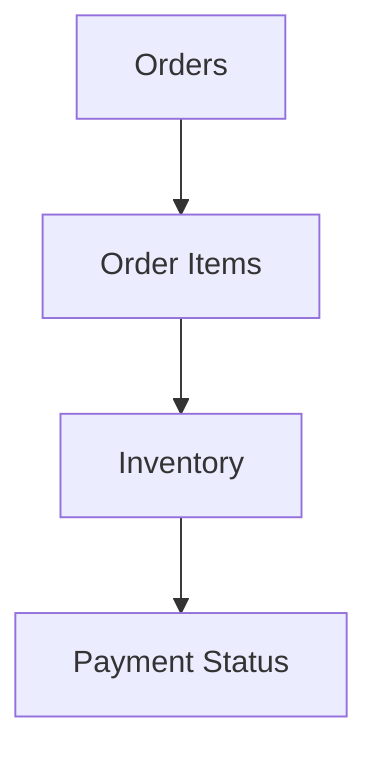

Now imagine this happens:

```text
Create order       ✓
Create order item  ✓
Reduce inventory   ✓
Record payment     ✗
```

The system has partially completed the operation.

What should happen?

Should the order remain?

Should the inventory remain reduced?

Should everything be undone?

This is the problem transactions help solve.

---

# 2. What Is a Transaction?

A **database transaction** is a group of database operations that the database treats as one logical unit of work.

Conceptually:

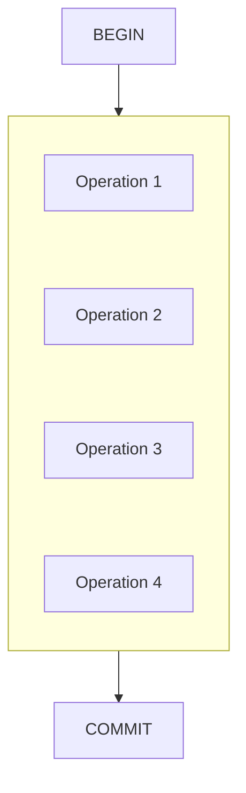

If the work cannot be completed safely:

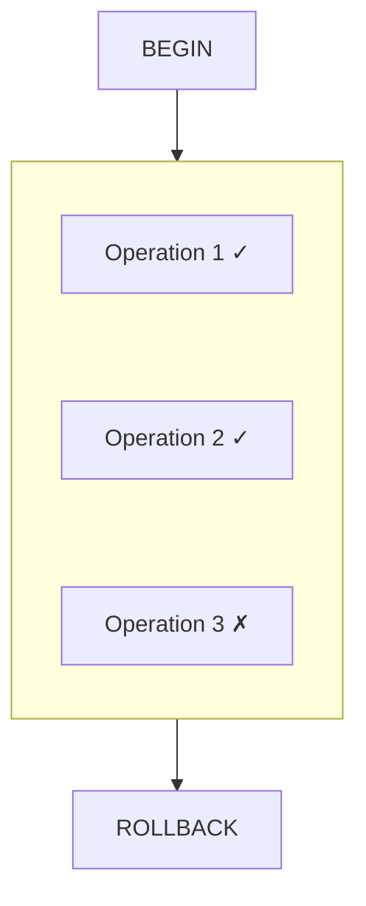

The transaction provides a controlled boundary around the work.

---

# 3. The Three Core Commands

At a simplified level, transactions revolve around three operations.

## BEGIN

Start a transaction.

```sql
BEGIN;
```

or, depending on the database:

```sql
START TRANSACTION;
```

---

## COMMIT

Make the transaction's changes permanent.

```sql
COMMIT;
```

Conceptually:

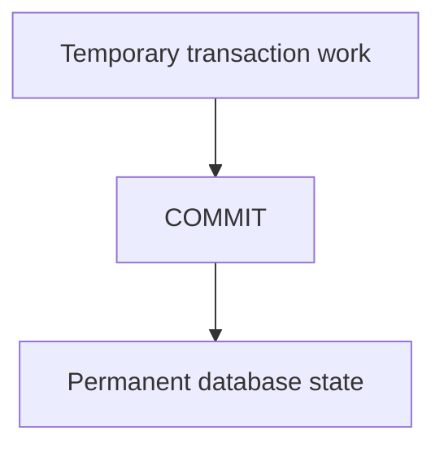

---

## ROLLBACK

Undo the transaction's changes.

```sql
ROLLBACK;
```

Conceptually:

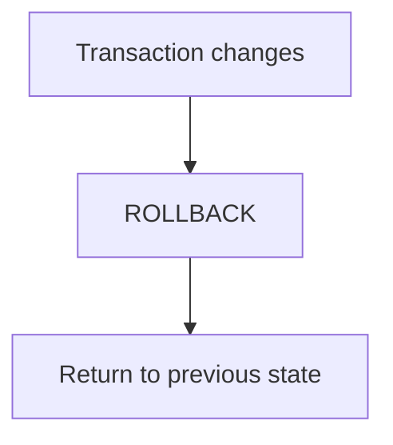

---

# 4. The Basic Transaction Lifecycle

A simple transaction looks like:

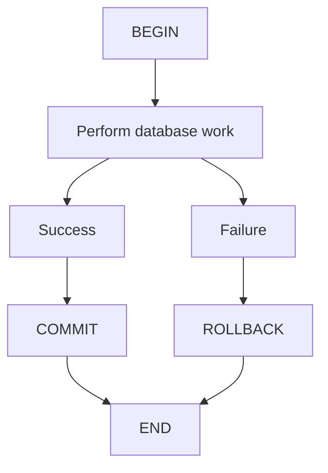

The application decides whether the logical operation succeeded.

The database then commits or rolls back the transaction.

---

# 5. A Simple Example

Suppose we transfer ₹1,000 from Account A to Account B.

The operation requires two changes:

```sql
UPDATE accounts
SET balance = balance - 1000
WHERE id = 1;

UPDATE accounts
SET balance = balance + 1000
WHERE id = 2;
```

If the first operation succeeds but the second fails, we have a serious problem:

```text
Account A: -₹1,000
Account B: +₹0
```

Money has effectively disappeared.

A transaction groups the operations:

```sql
BEGIN;

UPDATE accounts
SET balance = balance - 1000
WHERE id = 1;

UPDATE accounts
SET balance = balance + 1000
WHERE id = 2;

COMMIT;
```

If something goes wrong:

```sql
ROLLBACK;
```

The database can return the transaction to its previous state.

---

# 6. Atomicity

The first ACID property is **Atomicity**.

Atomicity means:

> A transaction is treated as one unit: its changes are either committed together or rolled back together.

Think:

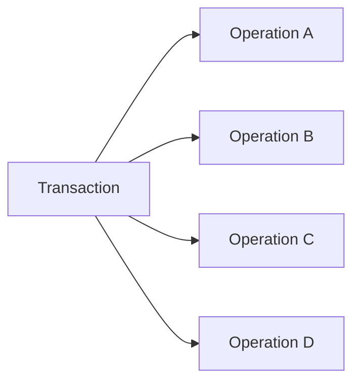

The desired outcome is:

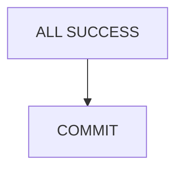

or:

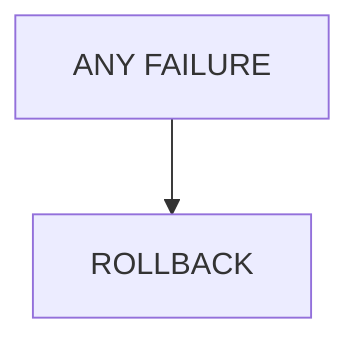

Not:

```text
A ✓
B ✓
C ✗
D ?
```

when the business operation requires all of them to succeed together.

---

# 7. Consistency

The second ACID property is **Consistency**.

Consistency means that a successfully committed transaction should leave the database satisfying its defined rules and constraints.

These rules may include:

* primary keys
* foreign keys
* unique constraints
* data types
* check constraints
* application-level business rules

For example:

```text
Inventory quantity >= 0
```

Suppose:

```text
Current stock = 5
```

A valid transaction should not leave:

```text
Stock = -20
```

if the system's rules prohibit negative inventory.

Consistency is not simply:

> "The data looks correct."

It means the transaction respects the database's defined integrity rules and the application's required invariants.

---

# 8. Isolation

The third ACID property is **Isolation**.

Multiple users may perform transactions at the same time.

For example:

```text
Customer A → Checkout
Customer B → Checkout
Customer C → Checkout
```

Their transactions may execute concurrently.

Isolation controls what one transaction can observe from other transactions while they are executing.

Conceptually:

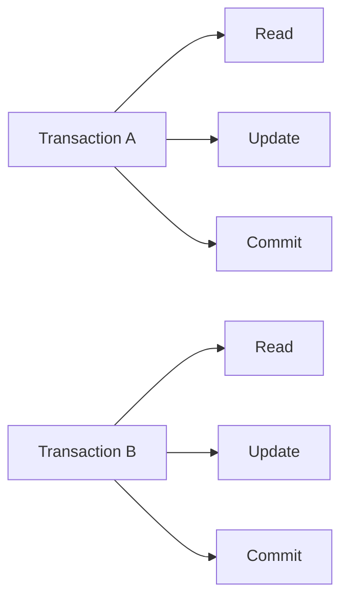

Without appropriate isolation, concurrent operations can produce incorrect results.

Isolation levels control this behavior.

We will study isolation levels in depth later in:

**04.09 — Isolation Levels**

For now, remember:

> **Isolation is about controlling interactions between concurrent transactions.**

---

# 9. Durability

The fourth ACID property is **Durability**.

Once a transaction is successfully committed, its changes are expected to survive subsequent failures according to the database's durability guarantees.

Conceptually:

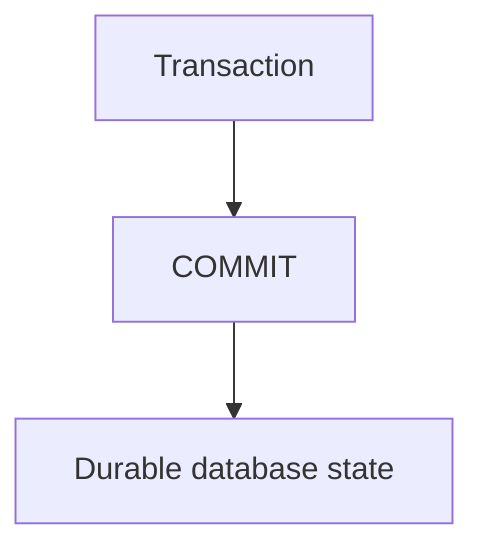

If the server crashes shortly after a successful commit, the database should be designed to recover the committed changes.

Databases commonly use mechanisms such as:

* transaction logs
* write-ahead logging
* recovery procedures
* persistent storage

The exact implementation varies by database.

---

# 10. ACID at a Glance

| Property    | Simple Meaning                                             |
| ----------- | ---------------------------------------------------------- |
| Atomicity   | All required changes happen together                       |
| Consistency | Rules and constraints remain satisfied                     |
| Isolation   | Concurrent transactions are controlled                     |
| Durability  | Committed changes survive failures according to guarantees |

Think:

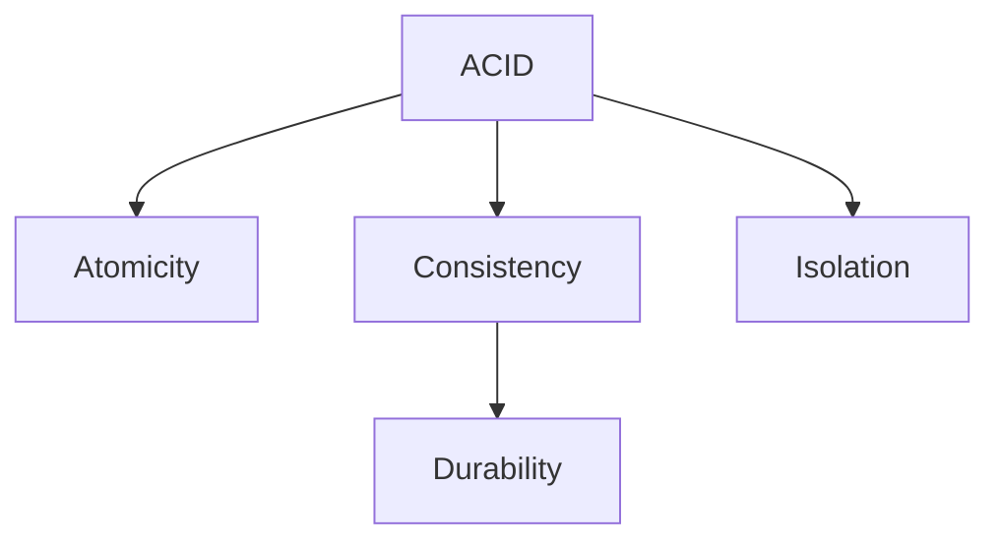

ACID is not a magic guarantee that makes every application correct.

The application still needs to define appropriate rules and use transactions correctly.

---

# 11. Transaction vs Query

These concepts are different.

A **query** is a database operation.

A **transaction** is a logical unit that can contain one or more operations.

For example:

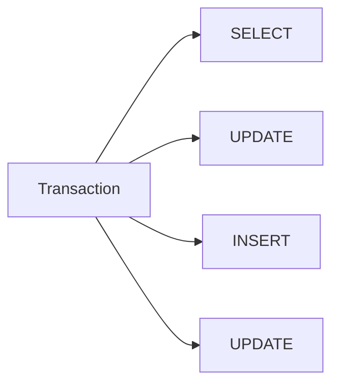

One transaction can contain multiple SQL statements.

A single SQL statement can also have transactional behavior depending on the database and configuration.

The important distinction is:

> **A query performs database work; a transaction controls a unit of database work.**

---

# 12. Transaction vs Connection

A transaction is also different from a connection.

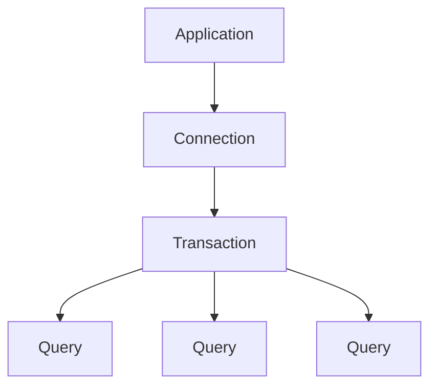

The transaction is associated with a particular database connection/session.

This becomes especially important when using connection pooling.

---

# 13. Transactions and Connection Pooling

Recall the previous chapter:

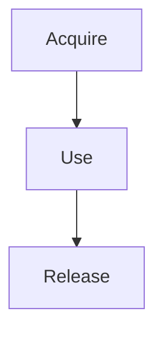

With a transaction:

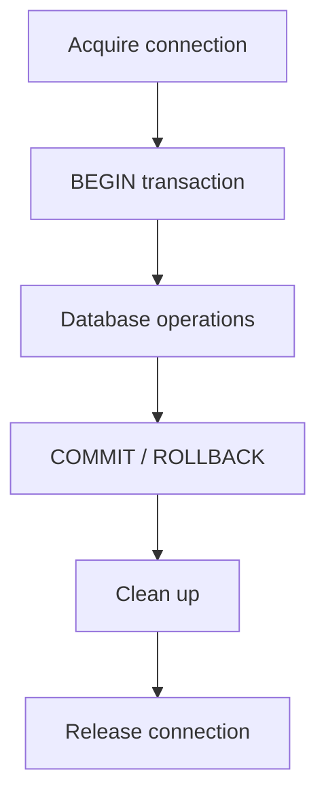

The connection should not be returned to the pool while the transaction is still active.

Correct:

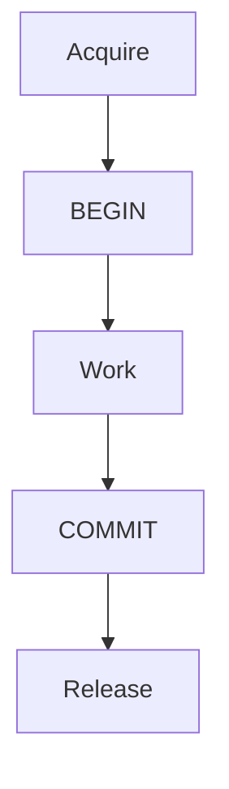

Incorrect:

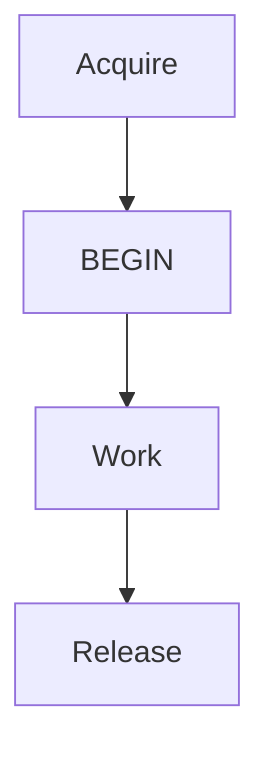

The second design can allow another request to receive a connection carrying unfinished transaction state.

---

# 14. What Happens on Application Failure?

Suppose:

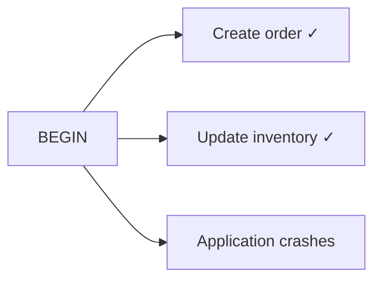

The transaction was never committed.

The database's transaction/recovery mechanisms can determine what should happen according to its guarantees and configuration.

Conceptually:

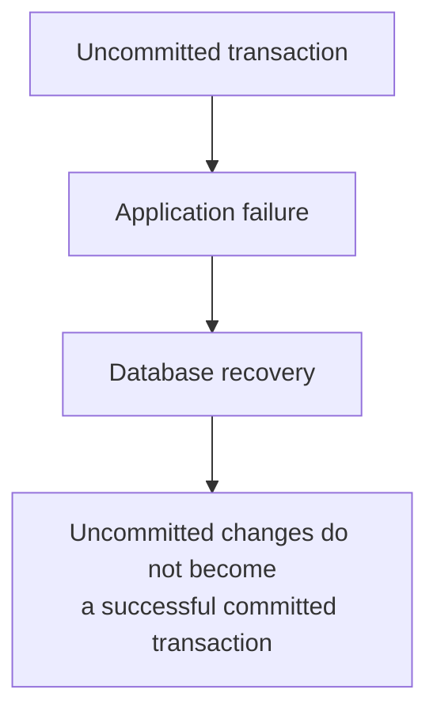

This is one reason transactions are fundamental to reliable data systems.

---

# 15. What If the Application Crashes After COMMIT?

Consider:

```mermaid
flowchart TD
  accTitle: A crash after COMMIT
  accDescr: BEGIN, operations, COMMIT, and then the application crashes.
  N0["BEGIN"] --> N1["Operations"] --> N2["COMMIT"] --> N3["Application crashes"]
```

If the commit successfully completed according to the database's guarantees, the changes are considered committed.

The database's durability mechanisms are responsible for preserving and recovering that committed state.

This is different from:

```mermaid
flowchart TD
  accTitle: A crash before COMMIT
  accDescr: Operations, then the application crashes, with no successful COMMIT.
  N0["Operations"] --> N1["Application crashes"] --> N2["No successful COMMIT"]
```

The distinction between committed and uncommitted work is fundamental.

---

# 16. Transactions Protect Business Operations

Transactions are not only about SQL.

They represent **business operations that must remain correct**.

Examples:

### Bank transfer

```text
Debit A
Credit B
```

### Order creation

```text
Create order
Create order items
Reserve inventory
```

### Ticket booking

```text
Create booking
Reserve seat
```

### Wallet operation

```text
Deduct balance
Create transaction record
```

### Inventory

```text
Decrease stock
Create stock movement
```

The transaction boundary should reflect the business operation's correctness requirements.

---

# 17. Choosing the Transaction Boundary

One of the most important design questions is:

> **Which operations must succeed or fail together?**

For example:

```text
Create order
Create order items
Update inventory
```

might belong in one transaction.

But:

```text
Send marketing email
```

may not need to be part of that same database transaction.

You might instead do:

```mermaid
flowchart TD
  accTitle: Email outside the transaction
  accDescr: The database transaction commits the order, then an event or job calls the email service.
  N0["Database transaction"] --> N1["Order committed"] --> N2["Event / job"] --> N3["Email service"]
```

This reduces the time the database transaction remains open.

The correct boundary depends on business correctness and architecture.

---

# 18. Transactions Should Usually Be Short

A transaction holds database resources while it is active.

Depending on the database and operations involved, it may hold:

* locks
* memory
* connection capacity
* transactional state

Therefore:

> **Long transactions can become a system bottleneck.**

Consider:

```mermaid
flowchart TD
  accTitle: A transaction waiting on an external API
  accDescr: BEGIN, update the database, call an external API, wait 5 seconds, do more database work, then COMMIT.
  N0["BEGIN"] --> N1["Update database"] --> N2["Call external API"] --> N3["Wait 5 seconds"] --> N4["More database work"] --> N5["COMMIT"]
```

The transaction remains open while the external API is running.

That can increase contention.

A better design may be:

```mermaid
flowchart TD
  accTitle: Committing before the external call
  accDescr: Database work, COMMIT, then the external operation.
  N0["Database work"] --> N1["COMMIT"] --> N2["External operation"]
```

when business correctness allows it.

---

# 19. Why Long Transactions Are Dangerous

Imagine:

```mermaid
flowchart LR
  accTitle: A transaction holding a lock
  accDescr: Transaction A holds a lock, waits, and eventually commits.
  H["Transaction A"]
  I0["Holds lock"]
  I1["Waits"]
  I2["Eventually commits"]
  H --> I0
  H --> I1
  H --> I2
```

Meanwhile:

```mermaid
flowchart TD
  accTitle: Transaction B waits
  accDescr: Transaction B needs the same resource and waits.
  N0["Transaction B"] --> N1["Needs the same resource"] --> N2["WAIT"]
```

Then:

```mermaid
flowchart TD
  accTitle: Transaction C waits
  accDescr: Transaction C waits.
  N0["Transaction C"] --> N1["WAIT"]
```

A single long-running transaction can therefore create a chain of waiting operations.

```mermaid
flowchart TD
  accTitle: A chain of waiting
  accDescr: A long transaction holds locks and resources longer, other transactions wait, latency increases, and connections remain occupied.
  N0["Long transaction"] --> N1["Locks/resources held longer"] --> N2["Other transactions wait"] --> N3["Latency increases"] --> N4["Connections remain occupied"]
```

This connects transactions directly to system performance.

---

# 20. Transactions and Deadlocks

Concurrent transactions can sometimes wait for each other.

For example:

```mermaid
flowchart TD
  accTitle: Two transactions waiting on each other
  accDescr: Transaction A locks row 1 and waits for row 2. Transaction B locks row 2 and waits for row 1.
  subgraph TA["Transaction A:"]
    A1["Locks Row 1"] --> A2["Waiting for Row 2"]
  end
  subgraph TB["Transaction B:"]
    B1["Locks Row 2"] --> B2["Waiting for Row 1"]
  end
  TA ~~~ TB
```

Conceptually:

```mermaid
flowchart LR
  accTitle: A deadlock
  accDescr: A waits for B, and B waits for A.
  A["A"] -->|"waits"| B["B"]
  B -->|"waits"| A
```

This is a **deadlock**.

Many relational databases can detect deadlocks and abort one of the transactions so the system can make progress.

The application may need to retry the aborted transaction when appropriate.

Deadlocks are not necessarily evidence of a broken database.

They can be a normal consequence of concurrent operations that require careful application design.

---

# 21. Transactions and Concurrency

Imagine two customers trying to buy the last item.

```text
Stock = 1
```

Both requests arrive:

```text
Customer A ──► Read stock = 1
Customer B ──► Read stock = 1
```

Both may think:

```text
"Item available."
```

Without appropriate concurrency control, both could attempt to purchase it.

Transactions and isolation mechanisms help control these race conditions.

This is why:

> **Transactions are closely connected to concurrency control.**

---

# 22. Transaction Isolation Preview

Isolation has several levels in common relational database systems.

A simplified progression is:

```mermaid
flowchart TD
  accTitle: Isolation trade-off
  accDescr: Lower isolation gives more concurrency. Higher isolation gives stronger visibility guarantees.
  L["Lower isolation"] --> M["More concurrency"] --- H["Higher isolation"] --> S["Stronger visibility guarantees"]
```

But stronger isolation can introduce more waiting, locking, or other costs depending on the database.

Systemly will study the details in:

**04.09 — Isolation Levels**

Do not memorize the levels yet.

First understand the problem they solve:

> **Multiple transactions are executing at the same time, and the database must define what each transaction is allowed to observe.**

---

# 23. Savepoints

Some databases support **savepoints** inside a transaction.

Conceptually:

```mermaid
flowchart LR
  accTitle: A savepoint
  accDescr: After BEGIN: operation A, SAVEPOINT X, operation B, operation C.
  H["BEGIN"]
  I0["Operation A"]
  I1["SAVEPOINT X"]
  I2["Operation B"]
  I3["Operation C"]
  H --> I0
  H --> I1
  H --> I2
  H --> I3
```

You may be able to roll back to the savepoint:

```text
ROLLBACK TO X
```

This allows part of the transaction to be undone without necessarily abandoning the entire transaction.

Savepoints are useful in some complex workflows, but they should not be introduced just to make simple transaction logic complicated.

---

# 24. Nested Transactions

Application frameworks sometimes expose APIs that look like:

```text
transaction()
   └── transaction()
```

This does not necessarily mean the database has true independent nested transactions.

Often the framework implements nested behavior using:

* savepoints
* transaction counters
* application-level abstractions

The underlying database semantics matter.

This is another reason to understand the database rather than blindly relying on framework terminology.

---

# 25. Transaction Errors

A transaction can fail because of many things:

```text
Application validation
Database constraint
Deadlock
Lock timeout
Connection failure
Query failure
Database failure
Transaction timeout
```

A simplified error flow is:

```mermaid
flowchart TD
  accTitle: A transaction error flow
  accDescr: BEGIN, then an operation. On success, continue. On failure, ROLLBACK and handle the error.
  B["BEGIN"] --> O["Operation"]
  O --> S["Success"] --> C["Continue"]
  O --> F["Failure"] --> R["ROLLBACK"] --> H["Handle error"]
```

Not every failure should automatically be retried.

For example, a business validation failure may need to be returned to the user rather than retried.

---

# 26. Transaction Retry

Some failures are transient.

For example:

```mermaid
flowchart TD
  accTitle: A transient failure
  accDescr: A transaction hits a deadlock, and the database aborts the transaction.
  N0["Transaction"] --> N1["Deadlock"] --> N2["Database aborts transaction"]
```

The application may retry the complete transaction.

Important:

> **Retry the transaction as a whole, not an arbitrary individual statement.**

Conceptually:

```mermaid
flowchart TD
  accTitle: Retrying the whole transaction
  accDescr: Attempt 1 fails, the application backs off, and attempt 2 succeeds.
  N0["Attempt 1"] --> N1["Failure"] --> N2["Backoff"] --> N3["Attempt 2"] --> N4["Success"]
```

Retry behavior must be bounded and carefully designed.

This topic connects later to:

* retries
* idempotency
* distributed systems
* failure recovery

---

# 27. Transactions and Idempotency

Suppose an application retries an operation.

For example:

```text
Create order
```

If the first attempt actually committed but the application did not receive the response, blindly retrying may create a duplicate order.

Therefore, database transactions alone do not solve every retry problem.

You may need:

* unique business identifiers
* idempotency keys
* unique constraints
* careful retry logic

Conceptually:

```mermaid
flowchart TD
  accTitle: A lost response
  accDescr: A request runs a transaction, which commits, but the response is lost, and the request is retried.
  R["Request"] --> T["Transaction"] --> C["Commit"] -. "X" .-> L["Response lost"] --> Y["Retry"]
```

The database needs a way to recognize that the business operation may already have been completed.

This becomes especially important in payment and order systems.

---

# 28. Transactions and External Services

A database transaction normally controls database state.

It does not automatically control an external service.

For example:

```mermaid
flowchart LR
  accTitle: A payment call inside a transaction
  accDescr: After BEGIN: update the database, call the payment service, COMMIT.
  H["BEGIN"]
  I0["Update database"]
  I1["Call payment service"]
  I2["COMMIT"]
  H --> I0
  H --> I1
  H --> I2
```

What happens if the payment service succeeds but the database transaction rolls back?

```text
Payment service → SUCCESS
Database        → ROLLBACK
```

The two systems now disagree.

This is a distributed systems problem.

You generally cannot assume:

> "One database transaction can atomically control every external system."

Later Systemly topics such as the **Saga Pattern** and **Outbox Pattern** address these larger architectural problems.

---

# 29. A Transaction Is Not a Distributed Transaction

Consider:

```mermaid
flowchart LR
  accTitle: Two separate systems
  accDescr: The application talks to the database and to the payment service separately.
  H["Application"]
  I0["Database"]
  I1["Payment Service"]
  H --> I0
  H --> I1
```

A local database transaction controls the database.

It does not automatically make the payment service part of the same atomic transaction.

Compare:

```mermaid
flowchart TD
  accTitle: Local transaction
  accDescr: Local transaction: the application uses the database.
  subgraph L["Local transaction"]
    A["Application"] --> D["Database"]
  end
```

with:

```mermaid
flowchart TD
  accTitle: Distributed workflow
  accDescr: Distributed workflow: the application uses the database, the payment service and the notification service.
  subgraph W["Distributed workflow"]
    direction LR
    A["Application"]
    %% Mermaid lays these out rotated, so they are declared out of order to keep the draft order.
    P["Payment Service"]
    N["Notification Service"]
    D["Database"]
    A --> P & N & D
  end
```

The second requires different coordination strategies.

---

# 30. Transaction and Connection Lifetime

Recall:

```mermaid
flowchart TD
  accTitle: A transaction inside a connection's lifetime
  accDescr: From the pool, acquire a connection, run the transaction, commit or roll back, then release.
  N0["Pool"] --> N1["Acquire connection"] --> N2["Transaction"] --> N3["Commit / Rollback"] --> N4["Release"]
```

A practical rule is:

> **A transaction should generally live within the lifetime of the connection that owns it.**

And:

> **The connection should only return to the pool after the transaction has ended and connection state has been cleaned up.**

This is one of the key connections between Chapters 01.11, 01.12, and 01.13.

---

# 31. A PHP Example

Using PDO, a simplified transaction can look like:

```php
$pdo->beginTransaction();

try {
    $pdo->prepare(
        "UPDATE accounts SET balance = balance - 1000 WHERE id = 1"
    )->execute();

    $pdo->prepare(
        "UPDATE accounts SET balance = balance + 1000 WHERE id = 2"
    )->execute();

    $pdo->commit();
} catch (Throwable $e) {
    if ($pdo->inTransaction()) {
        $pdo->rollBack();
    }

    throw $e;
}
```

The structure is more important than the exact PHP syntax:

```mermaid
flowchart TD
  accTitle: The shape of the PHP example
  accDescr: BEGIN, do related work, then COMMIT on success or ROLLBACK on failure.
  B["BEGIN"] --> W["Do related work"]
  W --> S["Success"] --> C["COMMIT"]
  W --> F["Failure"] --> R["ROLLBACK"]
```

---

# 32. What a Good Transaction Looks Like

A good transaction usually has:

```mermaid
flowchart TD
  accTitle: A good transaction
  accDescr: A clear business purpose, a small required set of operations, minimal transaction duration, correct concurrency behavior, commit or rollback, and clean connection state.
  N0["Clear business purpose"] --> N1["Small required set of operations"] --> N2["Minimal transaction duration"] --> N3["Correct concurrency behavior"] --> N4["Commit or rollback"] --> N5["Clean connection state"]
```

---

# 33. What a Bad Transaction Looks Like

For example:

```mermaid
flowchart LR
  accTitle: A bad transaction
  accDescr: After BEGIN: query, call an external API, wait 4 seconds, process an image, send an email, query, then COMMIT.
  H["BEGIN"]
  I0["Query"]
  I1["Call external API"]
  I2["Wait 4 seconds"]
  I3["Process image"]
  I4["Send email"]
  I5["Query"]
  I6["COMMIT"]
  H --> I0
  H --> I1
  H --> I2
  H --> I3
  H --> I4
  H --> I5
  H --> I6
```

This transaction is doing too much unrelated work.

Potential consequences:

```mermaid
flowchart LR
  accTitle: Consequences of a long transaction
  accDescr: A long transaction holds its connection and locks, causing more contention, more waiting and higher failure impact.
  H["Long transaction"]
  I0["Connection held"]
  I1["Locks held"]
  I2["More contention"]
  I3["More waiting"]
  I4["Higher failure impact"]
  H --> I0
  H --> I1
  H --> I2
  H --> I3
  H --> I4
```

The exact impact depends on the database and workload, but the architectural concern is clear.

---

# 34. Transactions and Performance

Transactions provide correctness, but correctness has resource costs.

Possible costs include:

* locks
* memory
* transaction log activity
* connection occupancy
* waiting
* contention
* reduced concurrency in some workloads

Therefore, system design is not:

> "Use transactions everywhere with maximum isolation."

Instead:

> **Use the transaction boundary and concurrency guarantees required by the business operation, while keeping the transaction as efficient and short as practical.**

---

# 35. Transactions and Connection Pool Saturation

Now connect everything we have learned.

Suppose:

```text
Pool = 20 connections
```

Each transaction takes:

```text
2 seconds
```

If many requests need transactions simultaneously:

```mermaid
flowchart TD
  accTitle: Long transactions exhaust the pool
  accDescr: 20 connections are taken by 20 long-running transactions, the pool is exhausted, and new requests wait.
  N0["20 connections"] --> N1["20 long-running transactions"] --> N2["Pool exhausted"] --> N3["New requests wait"]
```

If transactions are reduced to:

```text
200 ms
```

the same connections can cycle through work much more quickly.

Conceptually:

```mermaid
flowchart TD
  accTitle: Shorter transactions
  accDescr: A shorter transaction releases its connection sooner, giving higher resource turnover and less waiting.
  N0["Shorter transaction"] --> N1["Connection released sooner"] --> N2["Higher resource turnover"] --> N3["Less waiting"]
```

This does not mean transaction duration alone determines throughput, but it is an important factor.

---

# 36. Transaction Monitoring

In production, useful measurements may include:

| Metric                    | Why it matters                         |
| ------------------------- | -------------------------------------- |
| Transaction duration      | Identifies long-running transactions   |
| Rollback rate             | Shows failed/aborted work              |
| Commit rate               | Shows successful transactions          |
| Deadlocks                 | Shows concurrency conflicts            |
| Lock wait time            | Shows contention                       |
| Transaction timeout count | Shows transactions exceeding limits    |
| Database connection usage | Shows pressure on connection resources |

For example:

```text
Transactions

Active:              18
Average duration:    120 ms
p95 duration:        480 ms
Rollbacks:             3%
Deadlocks:             2
Lock wait p95:        90 ms
```

These measurements help engineers investigate real bottlenecks.

---

# 37. Common Mistakes

## Mistake 1: Treating every query as a transaction boundary

Not every operation needs a manually defined multi-step transaction.

Use a transaction when multiple operations need to be coordinated as one logical unit.

---

## Mistake 2: Keeping transactions open too long

Long transactions can consume resources and increase contention.

---

## Mistake 3: Performing external calls inside transactions unnecessarily

External services may be slow or unavailable.

This can keep database resources occupied.

---

## Mistake 4: Forgetting rollback handling

If application code encounters an error, the transaction needs appropriate cleanup.

---

## Mistake 5: Returning a connection with an active transaction

With connection pooling, this can corrupt the assumptions of the next user of that connection.

---

## Mistake 6: Assuming ACID solves business correctness automatically

The application still needs:

* correct business rules
* correct constraints
* correct transaction boundaries
* correct concurrency behavior

---

## Mistake 7: Retrying without considering duplicates

A retry can repeat a business operation.

Transactions do not automatically provide idempotency.

---

# 38. Production Mental Model

When designing a transaction, ask:

```mermaid
flowchart TD
  accTitle: Questions for designing a transaction
  accDescr: 1 what business operation am I protecting, 2 which database changes must succeed together, 3 which operations do not need to be inside it, 4 how long the transaction will remain open, 5 what happens if an operation fails, 6 what happens if two transactions run concurrently, 7 what happens if the application crashes, 8 what happens if the transaction is retried, 9 whether the connection is cleaned before returning to the pool.
  N0["1#46; What business operation am I protecting?"] --> N1["2#46; Which database changes must succeed together?"] --> N2["3#46; Which operations do NOT need to be inside it?"] --> N3["4#46; How long will the transaction remain open?"] --> N4["5#46; What happens if an operation fails?"] --> N5["6#46; What happens if two transactions run concurrently?"] --> N6["7#46; What happens if the application crashes?"] --> N7["8#46; What happens if the transaction is retried?"] --> N8["9#46; Is the connection cleaned before returning to the pool?"]
```

This is how transactions become a system-design concept rather than just SQL syntax.

---

# 39. The Bigger Picture

The current Systemly sequence is:

```mermaid
flowchart TD
  accTitle: The chapter sequence
  accDescr: 01.10 Databases, 01.11 Database Connections, 01.12 Connection Pooling, 01.13 Transactions, 01.14 Stateless Application Design.
  N0["01.10 Databases"] --> N1["01.11 Database Connections"] --> N2["01.12 Connection Pooling"] --> N3["01.13 Transactions"] --> N4["01.14 Stateless Application Design"]
```

Each chapter answers a different question:

```text
Database
"What stores my data?"

Connection
"How does my application communicate with it?"

Connection Pool
"How do I manage many database connections?"

Transaction
"How do I make related database changes behave as one unit?"

Stateless Application
"How do I design application instances that can scale horizontally?"
```

These concepts form a foundation for later scaling and distributed-system topics.

---

# 40. Key Principle

> **A transaction defines a boundary around database work that must remain correct as a unit.**

Remember the practical flow:

```mermaid
flowchart TD
  accTitle: The practical flow
  accDescr: Acquire a connection, BEGIN, perform the required operations. On success COMMIT, on failure ROLLBACK. Then clean up and release the connection.
  P0["Acquire connection"] --> P1["BEGIN"] --> P2["Perform required operations"]
  P2 --> S0["Success"] --> S1["COMMIT"]
  P2 --> F0["Failure"] --> F1["ROLLBACK"]
  S1 & F1 --> T0["Clean up"] --> T1["Release connection"]
```

And the most important system-design rule:

> **Use transactions for correctness, but keep their scope and duration as small as the business requirements allow.**

---

# Quick Reference

### Transaction

A group of database operations treated as one logical unit.

### BEGIN

Starts a transaction.

### COMMIT

Successfully completes the transaction and makes its changes permanent according to database guarantees.

### ROLLBACK

Abandons the transaction's uncommitted changes.

### ACID

```text
A → Atomicity
C → Consistency
I → Isolation
D → Durability
```

### Transaction vs Query

```text
Query       = database operation
Transaction = logical unit containing database work
```

### Transaction vs Connection

```text
Connection  = communication/session with database
Transaction = unit of work using that connection
```

### Pool interaction

```mermaid
flowchart TD
  accTitle: Pool interaction
  accDescr: Acquire, BEGIN, work, COMMIT or ROLLBACK, cleanup, release.
  N0["Acquire"] --> N1["BEGIN"] --> N2["Work"] --> N3["COMMIT / ROLLBACK"] --> N4["Cleanup"] --> N5["Release"]
```

---

# Knowledge Check

### 1. What problem does a transaction solve?

It allows related database changes to be coordinated as one logical unit so partial completion does not leave an invalid state when the business operation requires atomicity.

### 2. What is the difference between COMMIT and ROLLBACK?

`COMMIT` completes the transaction; `ROLLBACK` abandons its uncommitted changes.

### 3. What does Atomicity mean?

The required changes of a transaction are treated as one unit: they succeed together or are rolled back together.

### 4. What does Isolation address?

How concurrently executing transactions interact and what they can observe from one another.

### 5. Why should transactions usually be short?

Long transactions can hold database resources longer, increasing contention, waiting, and connection occupancy.

### 6. Why is transaction state important when using connection pooling?

Because transaction state belongs to a connection. The connection should not be returned to the pool until the transaction has been completed and the connection is clean.

### 7. Can a database transaction automatically include a payment API?

No. A local database transaction does not automatically make an external service part of the same atomic transaction.

### 8. Does a transaction automatically make retrying safe?

No. Retrying a business operation can create duplicates unless the operation is designed to be safely repeatable or idempotent.

---

# Final Mental Model

Think of a transaction as a **controlled boundary around a business operation**:

```mermaid
flowchart TD
  accTitle: A boundary around a business operation
  accDescr: A business operation runs as a transaction of operations A, B and C, which ends in COMMIT to keep the changes or ROLLBACK to undo them.
  B["BUSINESS OPERATION"] --> T
  subgraph T["TRANSACTION"]
    direction TB
    T0["Operation A"] ~~~ T1["Operation B"] ~~~ T2["Operation C"]
  end
  T --> C["COMMIT"] --> K["Keep changes"]
  T --> R["ROLLBACK"] --> U["Undo changes"]
```

The database is not simply executing individual SQL statements.

It is helping the application preserve the correctness of a larger operation.

That is the real purpose of transactions.
