# 01.14 — Stateless Application Design

## Learning Objectives

By the end of this chapter, you should understand:

* What "stateless" means in application architecture.
* The difference between application state and request state.
* Why statelessness matters when scaling horizontally.
* Why a user's session can make an application stateful.
* How shared session storage allows application servers to remain stateless.
* The difference between stateless application servers and stateless systems.
* How load balancing interacts with stateless applications.
* Common ways state accidentally becomes tied to one server.
* The trade-offs of stateless and stateful designs.
* Why statelessness is a design strategy rather than an absolute rule.

---

# 1. The Scaling Problem

Imagine an application running on one server:

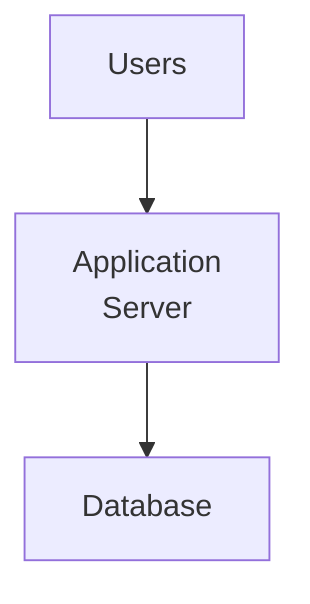

Everything is simple.

Now traffic increases.

You add another server:

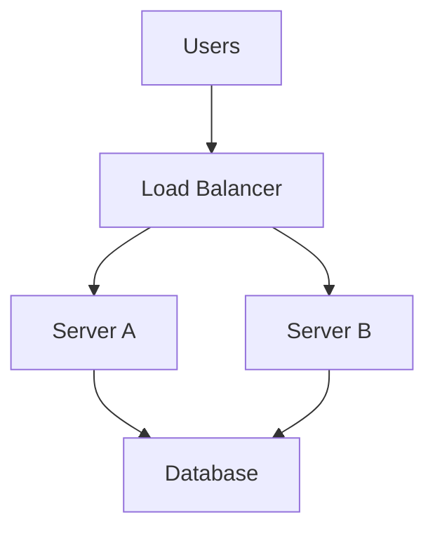

Now a new question appears:

> **What happens if information about a user's previous request exists only on Server A?**

This is where stateless application design becomes important.

---

# 2. What Does "State" Mean?

**State** is information about what has happened or what currently exists.

For example:

```text
User is logged in
Cart contains 3 products
Upload is 60% complete
Order is being processed
User selected dark mode
```

State can exist at many layers:

```text
Browser
Application
Cache
Database
Queue
External service
```

So when we say an application is "stateless", we need to be precise about **which state** we are talking about.

---

# 3. What Is a Stateless Application?

A **stateless application server** does not require important client-specific state to remain stored only in that particular server between requests.

Each request should contain, or allow the server to obtain, the information required to process it.

Conceptually:

```text
Request 1 ──► Server A
Request 2 ──► Server B
Request 3 ──► Server A
Request 4 ──► Server B
```

The application can process these requests regardless of which server receives them.

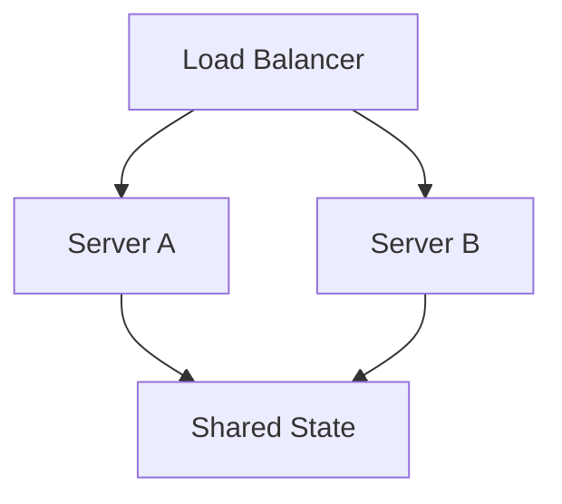

The application servers do not need to remember everything locally.

---

# 4. Stateless Does Not Mean "No State"

This is one of the most important concepts.

A stateless application does **not** mean:

```text
No state anywhere
```

Real systems have state.

For example:

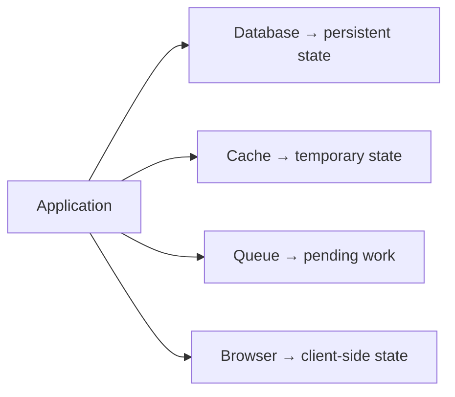

"Stateless" usually means:

> **The application server should not depend on important request state being stored only in its own local memory or local disk.**

---

# 5. Stateful vs Stateless

Consider two servers:

```text
Server A
└── User session
    └── User = Riya
```

If the next request goes to Server B:

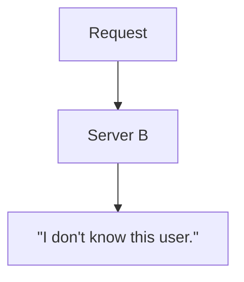

The application is dependent on Server A's local state.

That is a **stateful application-server design**.

A stateless design might instead use:

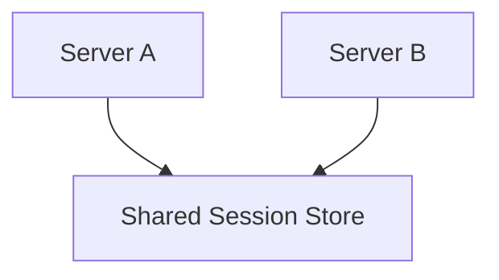

Now either server can retrieve the state.

---

# 6. A Simple Analogy

Imagine two reception desks in a hotel.

### Stateful design

Receptionist A keeps your information in a notebook.

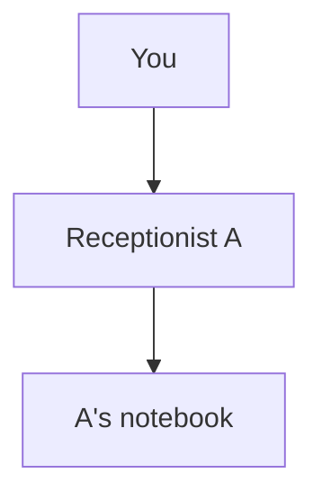

If you return and meet Receptionist B:

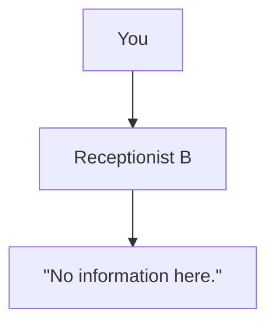

### Stateless server design

Both receptionists use a shared hotel system:

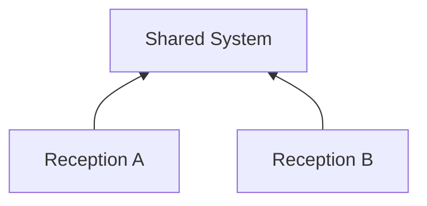

Either receptionist can help you.

The shared system contains the important state.

---

# 7. Why Statelessness Helps Scaling

Suppose you have:

```text
100 requests
```

and two application servers:

```text
Server A
Server B
```

The load balancer can distribute requests:

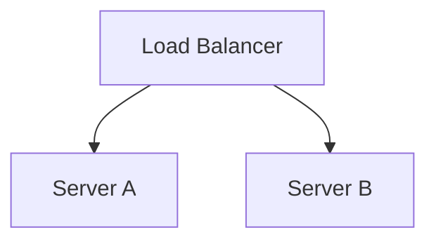

If the application servers are stateless, either server can handle a request.

This makes horizontal scaling easier:

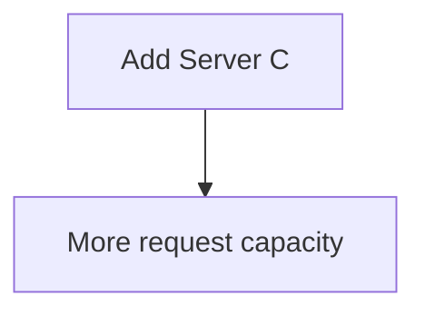

The new server does not need to copy hidden user state from existing servers.

---

# 8. Stateful Application Servers Create Affinity

Suppose a user's session lives only on Server A.

The load balancer may need to keep sending that user's requests to Server A.

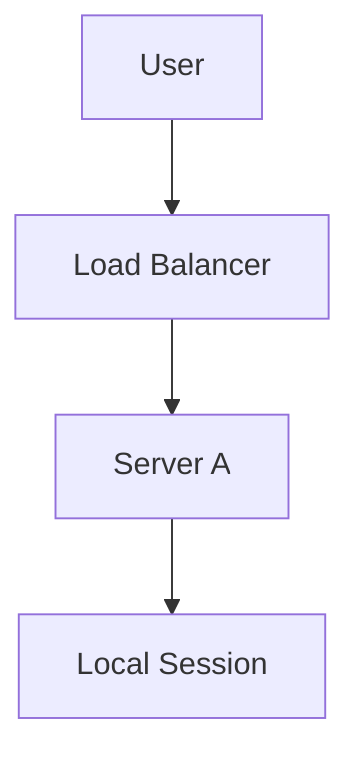

This is commonly called:

* session affinity
* sticky sessions

The load balancer tries to maintain:

```text
User → Server A
```

This can work.

But it creates architectural constraints.

---

# 9. The Problem with Sticky Sessions

Suppose:

```text
Server A → User's session
Server B → Other users
```

Now Server A fails:

```text
Server A
    X
```

The user's session may disappear with it.

The system may need to:

* recreate the session
* transfer state
* use replicated sessions
* redirect the user
* recover from shared storage

Sticky sessions can therefore make failure and scaling more complicated.

They are not inherently wrong, but they introduce a dependency on server affinity.

---

# 10. Shared Session Storage

A common solution is to move session state outside the application process.

For example:

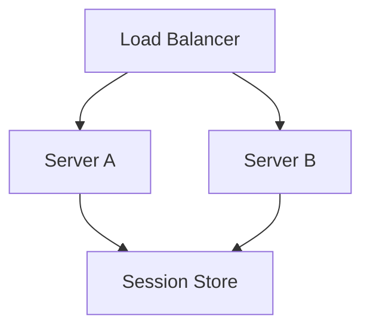

The session store could be backed by:

* a database
* a distributed cache
* another shared storage system

Now:

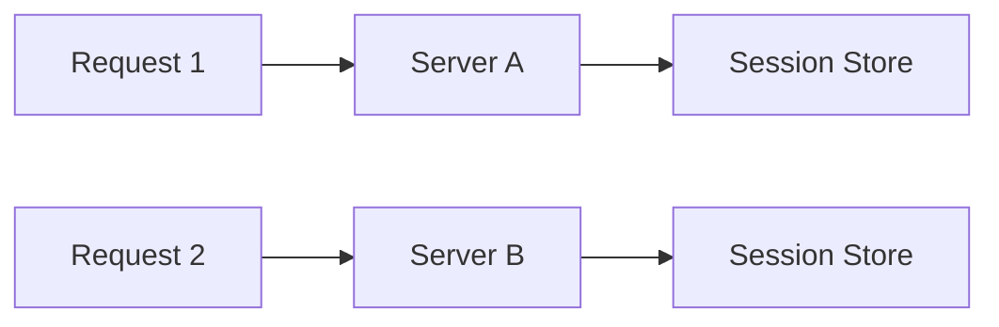

Both servers can access the same session state.

---

# 11. Cookies and Statelessness

Recall Chapter **01.07 — Sessions & Cookies**.

A browser may hold a session identifier:

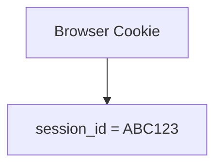

The actual session data may be stored elsewhere:

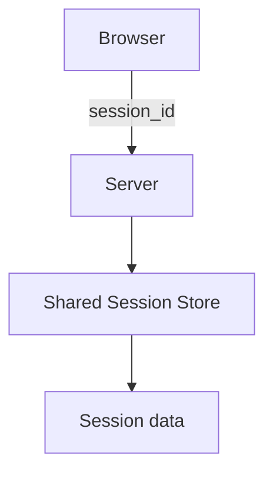

The application server does not need to permanently keep the session in its own memory.

---

# 12. Token-Based Authentication

Another common architecture uses a token.

Conceptually:

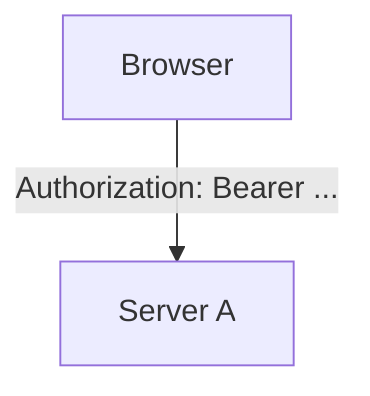

The server can validate the token and determine the user's identity.

Another request may go to Server B:

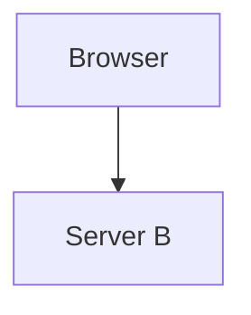

Server B can independently validate the authentication information.

This can reduce dependence on local server session state.

However:

> **Token-based authentication does not automatically make the entire system stateless.**

Other state may still exist.

---

# 13. Stateless Authentication ≠ Stateless System

Consider:

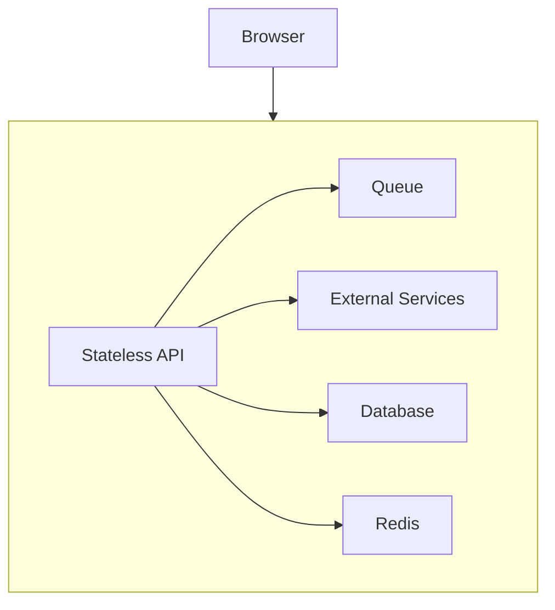

The API server may be stateless while the overall system contains significant state.

The database is stateful by design.

The queue contains state.

The cache contains state.

The browser contains state.

Therefore, a more precise statement is:

> **Statelessness usually describes how a particular application component handles requests, not whether the entire system contains state.**

---

# 14. Local Memory State

Consider:

```text
Server A
└── memory
    ├── User session
    ├── Shopping cart
    └── Temporary workflow
```

This is convenient and fast.

But when Server A disappears:

```text
Server A
   X
```

the state disappears with it.

This can create:

* failed requests
* lost sessions
* inconsistent behavior
* difficult failover

Local memory is not inherently bad.

The question is:

> **Is the state disposable, or is it required for correctness?**

---

# 15. Disposable Local State

Not every piece of local state needs to be moved elsewhere.

For example:

```text
Server A
└── cached calculation
```

If Server A fails:

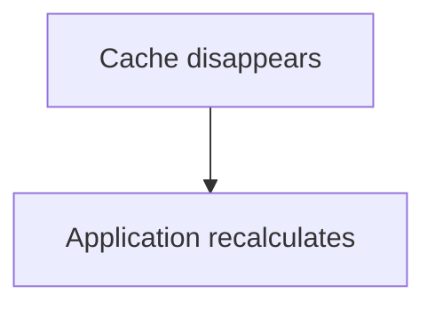

That may be perfectly acceptable.

This is different from:

```text
Server A
└── only copy of user's order
```

Losing that would be unacceptable.

Therefore:

> **Stateless design is primarily about identifying which state must survive server replacement or request routing.**

---

# 16. Local File Storage

A similar problem occurs with files.

Suppose:

```text
Server A
└── /uploads
    └── photo.jpg
```

A later request goes to Server B:

```mermaid
flowchart TD
  accTitle: A file on another server
  accDescr: The request reaches server B, where /uploads/photo.jpg is missing.
  N0["Request"] --> N1["Server B"] --> N2["/uploads/photo.jpg<br/>X"]
```

The file is not there.

The application has become dependent on local server storage.

A scalable design might use shared or external object storage:

```mermaid
flowchart TD
  accTitle: Shared object storage
  accDescr: Servers A, B and C all use object storage.
  A["Server A"] & B["Server B"] & C["Server C"] --> S["Object Storage"]
```

Now any server can access the file.

---

# 17. In-Memory Caches

The same principle applies to caches.

Local cache:

```text
Server A
└── Cache
```

Distributed/shared cache:

```mermaid
flowchart TD
  accTitle: A shared cache
  accDescr: Servers A, B and C all use a shared cache.
  A["Server A"] & B["Server B"] & C["Server C"] --> S["Shared Cache"]
```

A shared cache can allow multiple application instances to see the same cached information.

But remember:

> A cache is normally not the authoritative source of important persistent data.

The database may remain the source of truth.

---

# 18. Background Jobs

Stateless application design also matters when work is asynchronous.

Suppose a user uploads a file.

Instead of processing everything inside the request:

```mermaid
flowchart TD
  accTitle: Processing inside the request
  accDescr: The request reaches the application, which processes a huge file before the response.
  N0["Request"] --> N1["Application"] --> N2["Process huge file"] --> N3["Response"]
```

the application might create a job:

```mermaid
flowchart TD
  accTitle: Handing work to a queue
  accDescr: The request reaches the application, which puts a job on a queue for a worker.
  N0["Request"] --> N1["Application"] --> N2["Queue"] --> N3["Worker"]
```

Now the worker can process the job independently.

This allows workers to scale horizontally:

```mermaid
flowchart LR
  accTitle: Workers scaling horizontally
  accDescr: The queue feeds worker A, worker B and worker C.
  H["Queue"]
  I0["Worker A"]
  I1["Worker B"]
  I2["Worker C"]
  H --> I0
  H --> I1
  H --> I2
```

The queue holds the state of pending work.

---

# 19. Statelessness and Load Balancers

A stateless application fits naturally behind a load balancer.

```mermaid
flowchart TD
  accTitle: Stateless apps behind a load balancer
  accDescr: Users reach a load balancer, which sends requests to app A, app B and app C, all using shared state.
  U["Users"] --> L["Load Balancer"] --> A["App A"] & B["App B"] & C["App C"]
  A & B & C --> S["Shared State"]
```

A request can go to:

```text
A → B → C → A → C → B
```

without requiring the user's important state to remain inside one particular server.

---

# 20. Statelessness and Failure

Suppose Server B fails:

```mermaid
flowchart LR
  accTitle: Server B fails
  accDescr: The load balancer sends traffic to server A, which is up, server B, which has failed, and server C, which is up.
  H["Load Balancer"]
  I0["Server A ✓"]
  I1["Server B ✗"]
  I2["Server C ✓"]
  H --> I0
  H --> I1
  H --> I2
```

A stateless design allows traffic to continue going to A and C.

```mermaid
flowchart TD
  accTitle: Traffic continues
  accDescr: The user's requests go through the load balancer to A and C, which are both up.
  U["User"] --> L["Load Balancer"] --> A["A ✓"] & C["C ✓"]
```

If important state is stored externally, the failure of B does not necessarily destroy that state.

This improves the system's ability to recover from individual application-server failures.

---

# 21. Statelessness and Horizontal Scaling

Suppose traffic increases:

```mermaid
flowchart TD
  accTitle: Traffic outgrows capacity
  accDescr: Traffic increases and application capacity is insufficient.
  N0["Traffic"] --> N1["Application capacity insufficient"]
```

You add instances:

```text
App A
App B
App C
App D
```

If each server is independent and stateless:

```mermaid
flowchart TD
  accTitle: Adding instances
  accDescr: The load balancer sends requests to app A, app B and app C, with app D below app B.
  L["Load Balancer"] --> A["App A"] & B["App B"] & C["App C"]
  B --> D["App D"]
```

Scaling becomes largely a matter of adding capacity.

This is one of the major reasons stateless application design is common in horizontally scaled web systems.

---

# 22. Statelessness and Deployment

Stateless servers also make replacement easier.

Suppose you want to deploy a new version.

Instead of modifying one server in place:

```mermaid
flowchart TD
  accTitle: Modifying a server in place
  accDescr: Modifying the old server can cause potential disruption.
  N0["Old Server"] --> N1["Modify"] --> N2["Potential disruption"]
```

you can create new instances:

```mermaid
flowchart TD
  accTitle: Replacing instances
  accDescr: Old instances give way to new instances.
  N0["Old instances"] --> N1["New instances"]
```

Traffic can gradually move to the new instances.

This becomes easier when application servers do not contain irreplaceable local state.

---

# 23. Immutable Infrastructure Preview

This leads toward an infrastructure idea often called **immutable infrastructure**.

Instead of treating a server as a permanent machine that must be carefully maintained:

```mermaid
flowchart LR
  accTitle: A server kept forever
  accDescr: The server is modified, patched, configured and kept forever.
  H["Server"]
  I0["Modify"]
  I1["Patch"]
  I2["Configure"]
  I3["Keep forever"]
  H --> I0
  H --> I1
  H --> I2
  H --> I3
```

you can treat application instances as replaceable units:

```mermaid
flowchart TD
  accTitle: Replaceable instances
  accDescr: Create a new instance, deploy the application, send traffic, then remove the old instance.
  N0["Create new instance"] --> N1["Deploy application"] --> N2["Send traffic"] --> N3["Remove old instance"]
```

Stateless application design makes this model easier.

Cloud and container architectures commonly take advantage of this pattern.

---

# 24. What Makes an Application Stateful?

An application-server component becomes stateful when important information is tied to that specific running instance.

Examples:

```text
Server-local session
Server-local uploaded file
Server-local shopping cart
Server-local workflow state
Server-local authoritative data
```

For each one, ask:

```text
Can another instance continue the request
if this instance disappears?
```

If the answer is no, you have an instance-level state dependency.

---

# 25. Common Sources of Accidental State

### 1. In-memory sessions

```text
Server A memory
└── session
```

### 2. Local filesystem

```text
Server A
└── uploads/
```

### 3. Process-local cache

```text
Server A
└── cache
```

### 4. Global variables

```text
Application process
└── global state
```

### 5. In-memory queues

```text
Server A
└── pending jobs
```

### 6. Temporary workflow state

```text
Server A
└── multi-step process
```

None of these are automatically wrong.

They become architectural problems when the system expects another instance to continue the work but cannot access the state.

---

# 26. Moving State to the Right Place

The solution is not always:

> "Put everything in the database."

Different state belongs in different systems.

For example:

```mermaid
flowchart LR
  accTitle: State in the right place
  accDescr: User account data goes to the database; session data to a session store, cache or token; uploaded files to object storage; pending jobs to a queue; frequently accessed temporary data to a cache.
  R0N0["User account data"] --> R0N1["Database"]
  R1N0["Session data"] --> R1N1["Session store /<br/>cache / token"]
  R2N0["Uploaded files"] --> R2N1["Object storage"]
  R3N0["Pending jobs"] --> R3N1["Queue"]
  R4N0["Frequently accessed<br/>temporary data"] --> R4N1["Cache"]
```

The architecture should place state where its requirements fit.

---

# 27. Stateless Does Not Mean No Memory

An application server can use memory.

For example:

```text
Server
├── Current request data
├── Query results
├── Temporary calculations
└── Local cache
```

The important question is whether the application **depends on that memory surviving across requests or instance replacement**.

A request-local variable is normally not considered a problematic state dependency.

```mermaid
flowchart TD
  accTitle: Request-local state
  accDescr: A request holds a temporary variable; when the request ends, the state is gone.
  N0["Request"] --> N1["temporary variable"] --> N2["Request ends"] --> N3["State gone"]
```

That is generally fine.

---

# 28. Statelessness Is a Trade-off

Stateless design has advantages:

* easier horizontal scaling
* easier load balancing
* easier instance replacement
* simpler failover
* easier autoscaling

But moving state elsewhere introduces costs:

* network calls
* additional infrastructure
* shared-store latency
* consistency concerns
* operational complexity
* new failure modes

For example:

```mermaid
flowchart LR
  accTitle: Local memory vs a shared store
  accDescr: Local memory is very fast but instance-specific. A shared store is accessible by many instances but requires network communication.
  L["Local memory"] --> L0["Very fast"] & L1["Instance-specific"]
  S["Shared store"] --> S0["Accessible by many instances"] & S1["Requires network communication"]
```

There is no free architectural improvement.

You are moving a trade-off.

---

# 29. Statelessness vs Performance

Suppose a server can keep data locally:

```mermaid
flowchart TD
  accTitle: Local memory
  accDescr: The application reads local memory.
  N0["Application"] --> N1["Local memory"]
```

This may be faster than:

```mermaid
flowchart TD
  accTitle: A shared cache over the network
  accDescr: The application crosses the network to a shared cache.
  N0["Application"] --> N1["Network"] --> N2["Shared cache"]
```

But local state may reduce scalability and failover flexibility.

Therefore the decision is:

```mermaid
flowchart LR
  accTitle: Local vs shared state
  accDescr: Local state has lower access latency but more instance dependency. Shared state has better sharing and failover but more network and operational cost.
  L["Local state"] --> L0["Lower access latency"] & L1["More instance dependency"]
  S["Shared state"] --> S0["Better sharing/failover"] & S1["More network/operational cost"]
```

System design is about choosing according to requirements.

---

# 30. Statelessness and Security

Moving state outside the application process can also affect security.

For example, session data in a shared store needs:

* access control
* encryption where appropriate
* network protection
* expiration
* correct key handling

A stateless architecture does not automatically mean a more secure architecture.

Security requirements still apply to every state store.

---

# 31. Statelessness and Consistency

Suppose two application servers access shared state:

```mermaid
flowchart TD
  accTitle: Concurrent access to shared state
  accDescr: Server A and server B both update the shared store.
  A["Server A"] & B["Server B"] --> S["Shared Store"]
```

Now both can update that state.

You have introduced concurrent access.

That may require:

* transactions
* atomic operations
* locking
* version checks
* idempotency
* consistency rules

So moving state out of application memory can solve one problem while introducing another.

---

# 32. A Realistic E-Commerce Example

Consider a shopping cart.

### Stateful local design

```mermaid
flowchart TD
  accTitle: A cart on server A
  accDescr: The user reaches server A, which holds the local cart.
  N0["User"] --> N1["Server A"] --> N2["Local Cart"]
```

Next request:

```mermaid
flowchart TD
  accTitle: The next request
  accDescr: The user's next request reaches server B, where the cart is not found.
  N0["User"] --> N1["Server B"] --> N2["Cart not found"]
```

Problem.

### Shared cart design

```mermaid
flowchart TD
  accTitle: A shared cart
  accDescr: The user reaches the load balancer, which sends requests to server A or server B, and both use the cart store.
  U["User"] --> L["Load Balancer"] --> A["Server A"] & B["Server B"]
  A & B --> C["Cart Store"]
```

Now either server can access the cart.

The application servers remain replaceable.

---

# 33. Another Example: File Uploads

Bad scalable design:

```mermaid
flowchart TD
  accTitle: An upload on local disk
  accDescr: The user uploads to server A, which writes video.mp4 to its local disk.
  N0["User"] --> N1["Server A"] --> N2["Local disk"] --> N3["video.mp4"]
```

Later:

```mermaid
flowchart TD
  accTitle: Looking for the upload later
  accDescr: Later the user reaches server B, where video.mp4 may not exist.
  N0["User"] --> N1["Server B"] --> N2["video.mp4 ?"]
```

Not found.

Better:

```mermaid
flowchart TD
  accTitle: An upload in object storage
  accDescr: The user uploads through the application to object storage, which holds video.mp4.
  N0["User"] --> N1["Application"] --> N2["Object Storage"] --> N3["video.mp4"]
```

Any application instance can access the file.

---

# 34. Another Example: Authentication

Stateful:

```mermaid
flowchart TD
  accTitle: A session in server memory
  accDescr: Login on server A creates a memory session.
  N0["Login"] --> N1["Server A"] --> N2["Memory Session"]
```

Later:

```mermaid
flowchart TD
  accTitle: The session is missing
  accDescr: A later request reaches server B, where the session is missing.
  N0["Request"] --> N1["Server B"] --> N2["Session missing"]
```

Stateless application-server approach:

```mermaid
flowchart TD
  accTitle: A shared session or token
  accDescr: Login creates state in a session store or a token.
  N0["Login"] --> N1["Session Store / Token"]
```

Then:

```mermaid
flowchart TD
  accTitle: Authentication from any server
  accDescr: A request reaches server A or B, and the authentication state is available.
  N0["Request"] --> N1["Server A or B"] --> N2["Authentication state available"]
```

The exact authentication architecture depends on security and application requirements.

---

# 35. Statelessness and Database Connections

There is an important connection to our previous chapters.

A stateless application server should not depend on a specific database connection surviving between requests.

Instead:

```mermaid
flowchart TD
  accTitle: A connection per unit of work
  accDescr: The request reaches the application, which acquires a connection, performs database work and releases the connection.
  N0["Request"] --> N1["Application"] --> N2["Acquire connection"] --> N3["Perform database work"] --> N4["Release connection"]
```

The next request may use another connection.

This fits naturally with connection pooling.

```mermaid
flowchart TD
  accTitle: Pools per instance
  accDescr: App A and app B each use their own pool, and both pools connect to the database.
  A["App A"] --> PA["Pool"] --> D["Database"]
  B["App B"] --> PB["Pool"] --> D
```

The application should not think:

> "This user's next request must use this exact database connection."

That would create unnecessary state dependency.

---

# 36. Statelessness and Request Lifecycle

Recall the request lifecycle:

```mermaid
flowchart TD
  accTitle: The request lifecycle
  accDescr: A request goes through the load balancer to the application, which uses the cache, the database and external services before the response.
  R["Request"] --> L["Load Balancer"] --> G
  subgraph G[" "]
    direction LR
    A["Application"]
    %% Mermaid lays these out rotated, so they are declared out of order to keep the draft order.
    I1["Database"]
    I2["External Services"]
    I0["Cache"]
    A --> I1 & I2 & I0
  end
  G --> S["Response"]
```

A stateless application aims to make each request independently processable.

Conceptually:

```mermaid
flowchart LR
  accTitle: Any healthy instance
  accDescr: Requests A, B and C each go to any healthy instance and get a response.
  R0N0["Request A"] --> R0N1["Any healthy<br/>instance"] --> R0N2["Response"]
  R1N0["Request B"] --> R1N1["Any healthy<br/>instance"] --> R1N2["Response"]
  R2N0["Request C"] --> R2N1["Any healthy<br/>instance"] --> R2N2["Response"]
```

This is powerful when the system has many instances.

---

# 37. The Stateless Request Test

A useful design question is:

> **If this application server disappears immediately after responding to a request, can another healthy instance continue serving the user?**

If yes:

```mermaid
flowchart TD
  accTitle: Another instance continues
  accDescr: Server A disappears, server B takes over, and the user continues.
  N0["Server A<br/>X"] --> N1["Server B"] --> N2["Continue"]
```

If no:

```mermaid
flowchart TD
  accTitle: Important state lost
  accDescr: Server A disappears, important state is lost, and the user is affected.
  N0["Server A<br/>X"] --> N1["Important state lost"] --> N2["User affected"]
```

Then identify the state dependency.

---

# 38. What Should Remain Local?

Stateless does not mean every byte must leave the server.

Keep local:

* request-local variables
* temporary calculations
* ephemeral caches
* data that can safely be recreated
* process-specific runtime structures

Move or externalize:

* important user sessions
* persistent business data
* authoritative state
* files that must be available across instances
* durable background work

The distinction is **recoverability and importance**, not simply "local vs remote."

---

# 39. Common Mistakes

## Mistake 1: Thinking stateless means no state

Incorrect.

State can exist in databases, caches, queues, browsers, and external services.

---

## Mistake 2: Storing sessions only in application memory

This can make horizontal scaling and failover harder.

---

## Mistake 3: Treating local disk as shared storage

A file on Server A is not automatically available on Server B.

---

## Mistake 4: Using sticky sessions as the only scaling strategy

Sticky sessions can work, but they introduce server affinity.

---

## Mistake 5: Putting everything into one shared database

Not every kind of state belongs in a relational database.

Choose storage according to workload and requirements.

---

## Mistake 6: Assuming statelessness solves all scaling problems

A stateless application can still be bottlenecked by:

* database
* cache
* network
* external APIs
* CPU
* memory
* connection pools

Statelessness makes application-instance scaling easier; it does not remove system bottlenecks.

---

## Mistake 7: Forgetting the shared store becomes a dependency

Moving state from application memory to Redis, a database, or another service does not make the state disappear.

It creates a shared dependency that must itself be designed for:

* availability
* capacity
* performance
* failure
* security

---

# 40. Production Mental Model

When designing an application for horizontal scaling, ask:

```mermaid
flowchart TD
  accTitle: Questions for horizontal scaling
  accDescr: 1 what state the application needs, 2 where it lives, 3 whether it is persistent or temporary, 4 whether another instance can access it, 5 what happens if the current instance dies, 6 whether the load balancer needs sticky sessions, 7 whether the shared state store is itself scalable, 8 what consistency guarantees are required, 9 what new failure modes externalizing the state created.
  N0["1#46; What state does the application need?"] --> N1["2#46; Where does that state live?"] --> N2["3#46; Is it persistent or temporary?"] --> N3["4#46; Can another instance access it?"] --> N4["5#46; What happens if the current instance dies?"] --> N5["6#46; Does the load balancer need sticky sessions?"] --> N6["7#46; Is the shared state store itself scalable?"] --> N7["8#46; What consistency guarantees are required?"] --> N8["9#46; What new failure modes did externalizing the state create?"]
```

This is the system-design way of thinking about statelessness.

---

# 41. The Bigger Picture

Level 1 has now built the basic web application model:

```mermaid
flowchart TD
  accTitle: The Level 1 web application model
  accDescr: A user's HTTP request reaches the web server and the application, which handles authentication, authorization, business logic and the cache, and uses the database: its connection, connection pool and transactions.
  U["User"] --> R["HTTP Request"] --> W["Web Server"] --> G
  subgraph G[" "]
    direction LR
    A["Application"]
    %% Mermaid lays these out rotated, so they are declared out of order to keep the draft order.
    I2["Business Logic"]
    I3["Cache"]
    I0["Authentication"]
    I1["Authorization"]
    A --> I2 & I3 & I0 & I1
  end
  %% Database sits below the group: Mermaid cannot place a titled box last among the branches.
  G --> DB
  subgraph DB["Database"]
    direction TB
    D0["Connection"] ~~~ D1["Connection Pool"] ~~~ D2["Transaction"]
  end
```

And now:

```mermaid
flowchart TD
  accTitle: Instances over shared state
  accDescr: The application runs as instance A, instance B and instance C, which use shared or persistent state.
  A["Application"] --> I0["Instance A"] & I1["Instance B"] & I2["Instance C"]
  I0 & I1 & I2 --> S["Shared / Persistent State"]
```

This prepares us for Level 2:

> **How do we actually scale this application?**

---

# 42. Level 1 Mental Model

The complete progression is:

```mermaid
flowchart TD
  accTitle: The Level 1 chapters
  accDescr: Level 1 runs from 01.01 Anatomy of a Web Application through web server, application server, request lifecycle, APIs, REST, sessions and cookies, authentication, authorization, databases, database connections, connection pooling and transactions to 01.14 Stateless Application Design.
  N0["01.01 Anatomy of a Web Application"] --> N1["01.02 Web Server"] --> N2["01.03 Application Server"] --> N3["01.04 Request Lifecycle"] --> N4["01.05 APIs"] --> N5["01.06 REST"] --> N6["01.07 Sessions & Cookies"] --> N7["01.08 Authentication"] --> N8["01.09 Authorization"] --> N9["01.10 Databases"] --> N10["01.11 Database Connections"] --> N11["01.12 Connection Pooling"] --> N12["01.13 Transactions"] --> N13["01.14 Stateless Application Design"]
```

The concepts connect:

```mermaid
flowchart TD
  accTitle: How the concepts connect
  accDescr: A request reaches the application, which handles auth and business logic, and uses the database: its connection, pool and transactions.
  R["Request"] --> G
  subgraph G[" "]
    direction LR
    A["Application"] --> I0["Auth"] & I1["Business Logic"]
  end
  %% Database sits below the group: Mermaid cannot place a titled box last among the branches.
  G --> DB
  subgraph DB["Database"]
    direction TB
    D0["Connection"] ~~~ D1["Pool"] ~~~ D2["Transaction"]
  end
```

Then horizontal scaling can become:

```mermaid
flowchart TD
  accTitle: Horizontal scaling
  accDescr: The load balancer sends requests to app A, app B and app C, which all use shared state.
  T["Load Balancer"] --> M0["App A"] & M1["App B"] & M2["App C"]
  M0 & M1 & M2 --> B["Shared State"]
```

---

# 43. Key Principle

> **A stateless application server does not depend on important client or business state being trapped inside one particular application instance.**

This gives the system flexibility to:

* route requests to different instances
* add instances
* remove instances
* replace failed instances
* perform deployments
* recover from individual server failures

But remember:

> **Statelessness moves state; it does not eliminate state.**

And:

> **Every shared state store becomes another system component that must be designed for capacity, reliability, consistency, and security.**

---

# Quick Reference

| Concept                      | Simple Meaning                                                   |
| ---------------------------- | ---------------------------------------------------------------- |
| State                        | Information representing what exists or has happened             |
| Stateless application server | Does not depend on important state being trapped in one instance |
| Stateful application server  | Keeps important state tied to a particular instance              |
| Sticky session               | Routes a user's requests back to the same server                 |
| Shared state                 | State accessible by multiple instances                           |
| Session store                | External system holding user session information                 |
| Local memory                 | State held inside an application process                         |
| Horizontal scaling           | Adding more application instances                                |
| Failover                     | Continuing operation using another instance after failure        |
| Instance-local state         | State available only inside one application instance             |

---

# Knowledge Check

### 1. Does stateless mean the entire system has no state?

No.

It usually means the application server does not depend on important state being stored only in that specific instance.

### 2. Why is statelessness useful for horizontal scaling?

Because requests can be distributed across multiple application instances without requiring each user to remain attached to one particular server.

### 3. What problem can local sessions create?

A user's next request may reach another server that does not have the session data.

### 4. What is a sticky session?

A load-balancing strategy that attempts to keep a user's requests on the same application instance.

### 5. Is sticky session always wrong?

No.

It can be a valid design, but it introduces server affinity and can complicate scaling and failure handling.

### 6. Where can shared session state live?

Depending on the architecture, it may live in a database, distributed cache, or another shared state mechanism.

### 7. Does statelessness mean an application cannot use memory?

No.

Request-local and disposable memory are normal. The concern is important state that must survive across requests or instance replacement.

### 8. What happens when state is moved to an external store?

The application instances become less dependent on local state, but the external store becomes an important shared dependency.

### 9. What is the key question when deciding whether local state is acceptable?

Ask:

> **Can another healthy instance continue the work if this instance disappears?**

---

# Final Mental Model

Think of a scalable application server as a **replaceable worker**:

```mermaid
flowchart TD
  accTitle: Replaceable workers
  accDescr: The load balancer sends requests to workers A, B and C, which all use shared, durable state.
  T["Load Balancer"] --> M0["Worker A"] & M1["Worker B"] & M2["Worker C"]
  M0 & M1 & M2 --> B["Shared / Durable<br/>State"]
```

Any worker should be able to handle the next request.

If Worker B disappears:

```mermaid
flowchart TD
  accTitle: Losing a worker
  accDescr: Worker B disappears. The load balancer sends requests to worker A and worker C, and the state remains.
  X["Worker B<br/>X"] ~~~ L["Load Balancer"]
  L --> A["Worker A"] & C["Worker C"]
  A & C --> S["State remains"]
```

The worker is replaceable because important state is not trapped inside it.

That is the central idea behind **stateless application design**.

---

# Level 1 Complete

You have now completed the entire **Level 1 — The Web Application** foundation.

The next level begins with:

**02.01 — Why Systems Need to Scale**

There we move from:

> **"How does one web application work?"**

to:

> **"What changes when one application is no longer enough?"**
