# 02.01 — Why Systems Need to Scale

A system does not need to scale because **scaling is fashionable**.

It needs to scale when the system can no longer handle its growing workload while continuing to meet its requirements.

The core question is:

> **Can the system handle the workload it receives without breaking its requirements?**

If yes, the current capacity may be sufficient.

If no, something needs to change.

---

## Learning Objectives

By the end of this chapter, you should understand:

* What scaling actually means
* Why systems need to scale
* The difference between **demand** and **capacity**
* What can grow in a system
* What a bottleneck is
* Why a single server eventually reaches limits
* The basic difference between scaling up and scaling out
* Why scaling is not only about traffic
* Why you should scale the bottleneck rather than everything
* Why premature scaling can make a system unnecessarily complex

---

# 1. What Does "Scale" Mean?

In simple terms:

> **Scaling means changing a system so that it can handle more workload while continuing to meet its requirements.**

Suppose a web application currently handles:

```text
100 requests/second
```

and its infrastructure can comfortably handle:

```text
300 requests/second
```

There is no immediate scaling problem.

But suppose traffic grows to:

```text
500 requests/second
```

Now the system's demand is greater than its available capacity.

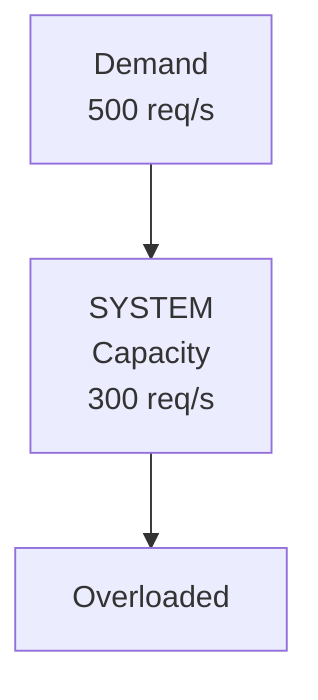

The system must either:

* increase capacity,
* reduce the workload,
* improve efficiency,
* or change the architecture.

That is a scaling problem.

---

# 2. Demand vs Capacity

One of the most important ideas in system design is the relationship between **demand** and **capacity**.

### Demand

Demand is the workload being placed on the system.

Examples:

* requests per second
* number of concurrent users
* database queries
* file uploads
* messages processed
* storage consumed
* network traffic

### Capacity

Capacity is how much workload the system can handle while still meeting its requirements.

For example:

```text
System capacity = 1,000 requests/second
Current demand  =   700 requests/second
```

The system currently has some headroom.

But:

```text
System capacity = 1,000 requests/second
Current demand  = 1,300 requests/second
```

The system is overloaded.

A useful mental model is:

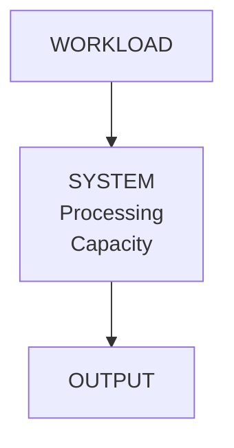

Scaling increases the amount of workload the system can handle.

---

# 3. What Exactly Is Growing?

People often say:

> "Our traffic is growing."

But traffic is only one type of growth.

A system can experience several kinds of growth.

## 3.1 More Users

A system might grow from:

```text
100 users
   ↓
10,000 users
   ↓
1,000,000 users
```

More users can generate more requests and more stored data.

---

## 3.2 More Requests

The number of requests may increase:

```text
10 req/s
   ↓
100 req/s
   ↓
1,000 req/s
   ↓
10,000 req/s
```

More requests require more processing capacity.

---

## 3.3 More Concurrent Work

A system may have many operations happening at the same time.

For example:

```text
User A → Upload file
User B → Search products
User C → Checkout
User D → Generate report
User E → Send message
```

Even if total daily traffic is moderate, high concurrency can exhaust resources.

---

## 3.4 More Data

A database may grow from:

```text
10 GB
 ↓
100 GB
 ↓
1 TB
 ↓
10 TB
```

The application may still receive the same number of requests, but queries, indexes, backups, storage, and maintenance can become more difficult.

Therefore:

> **Data growth can create scaling problems even when traffic does not grow significantly.**

---

## 3.5 More Geographic Reach

A system might initially serve users from one city:

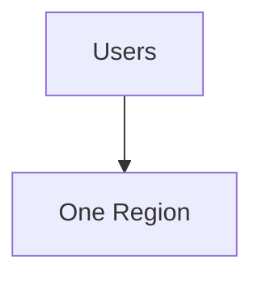

Later it may serve users across:

```text
India
Europe
USA
Asia
Australia
```

Now latency, availability, data placement, networking, and regional failures become additional concerns.

---

# 4. Why Does a System Eventually Need to Scale?

Every system has finite resources.

A server has limits on things such as:

* CPU
* memory
* disk/storage
* network bandwidth
* network connections
* database connections
* disk I/O
* application workers

A simplified server looks like this:

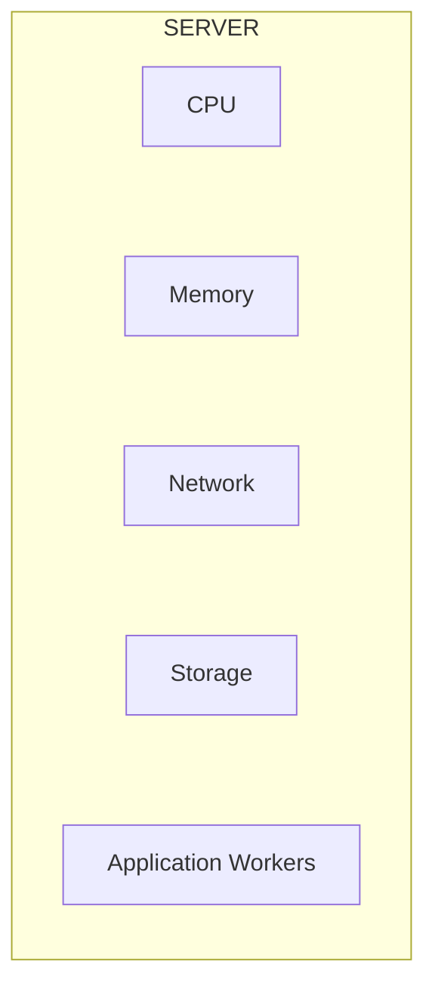

Each resource has a finite capacity.

For example:

```text
CPU capacity      → finite
Memory capacity   → finite
Network capacity  → finite
Storage capacity  → finite
Connections       → finite
```

When workload grows enough, one of these resources may become the limiting factor.

---

# 5. The Bottleneck

A **bottleneck** is the part of a system that limits the system's overall capacity.

Imagine a road:

```text
Wide Road
══════════════════════╗
                     ║
                     ║
                 ┌───┴───┐
                 │ NARROW│
                 │ BRIDGE│
                 └───┬───┘
                     │
                     ▼
══════════════════════
```

The entire road may be wide, but traffic is limited by the narrow bridge.

The same thing happens in software systems.

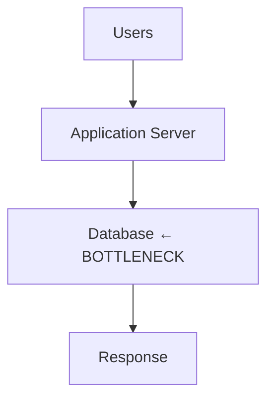

You could add more application servers:

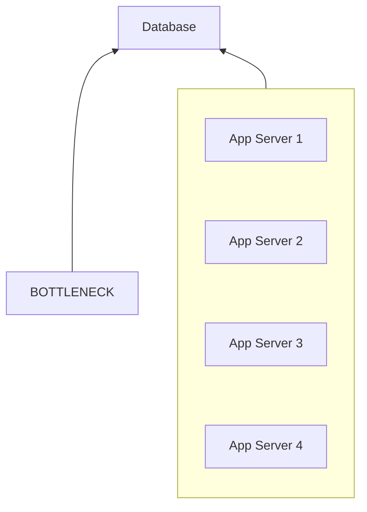

But if the database is already saturated, adding application servers may not solve the problem.

It could actually make it worse by generating even more database traffic.

This leads to one of the most important principles in system design:

> **Scale the bottleneck, not everything.**

---

# 6. The Single-Server Problem

Many applications start with a simple architecture:

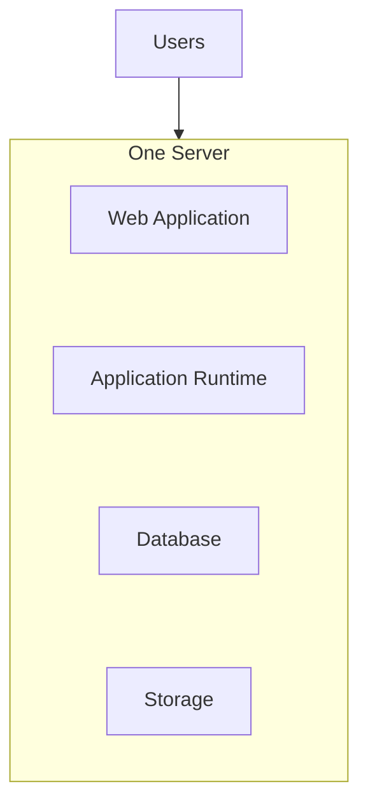

This can work very well for a small system.

It is simple.

It is inexpensive.

It is easy to understand.

But eventually resources may become constrained.

For example:

```text
CPU:       ████████████████████ 95%
Memory:    ██████████████████   90%
Storage:   ███████              35%
Network:   █████████            45%
```

CPU may be the bottleneck.

Adding more storage would not solve a CPU problem.

Adding memory might not solve it either.

The correct scaling decision depends on **what is actually limiting the system**.

---

# 7. Scaling Up

One way to increase capacity is to make an existing machine more powerful.

This is called:

> **Vertical scaling** or **scaling up**.

For example:

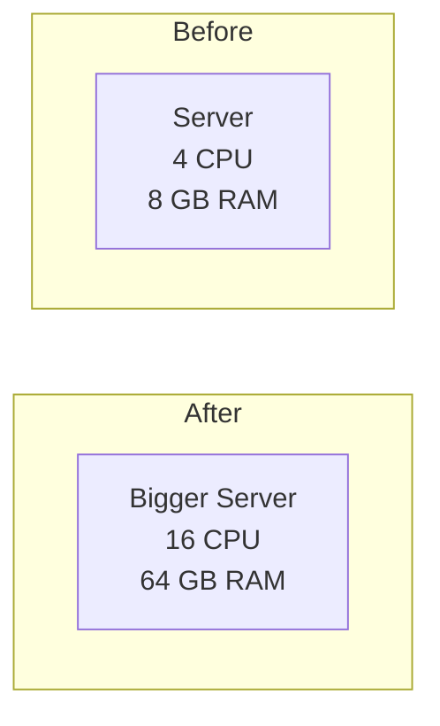

The application remains on one machine, but the machine has more resources.

The detailed mechanics and trade-offs of vertical scaling are covered in:

**02.02 — Vertical Scaling**

---

# 8. Scaling Out

Another approach is to add more machines.

This is called:

> **Horizontal scaling** or **scaling out**.

For example:

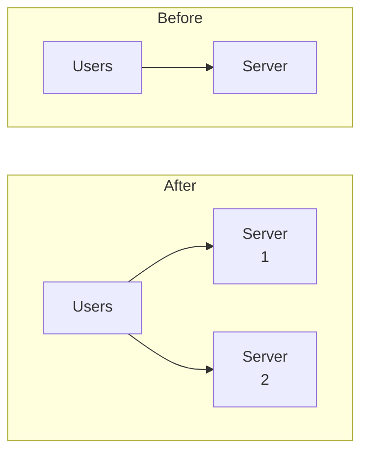

More servers provide more processing capacity.

But multiple servers introduce new problems:

* How are requests distributed?
* Where does shared state live?
* What happens if one server fails?
* How are deployments performed?
* How do servers communicate?
* How do connections to databases scale?

These questions lead into the rest of Level 2.

---

# 9. Scaling Is Not Only About Adding Servers

A common beginner assumption is:

> "If traffic increases, just add more servers."

Real systems are rarely that simple.

Consider:

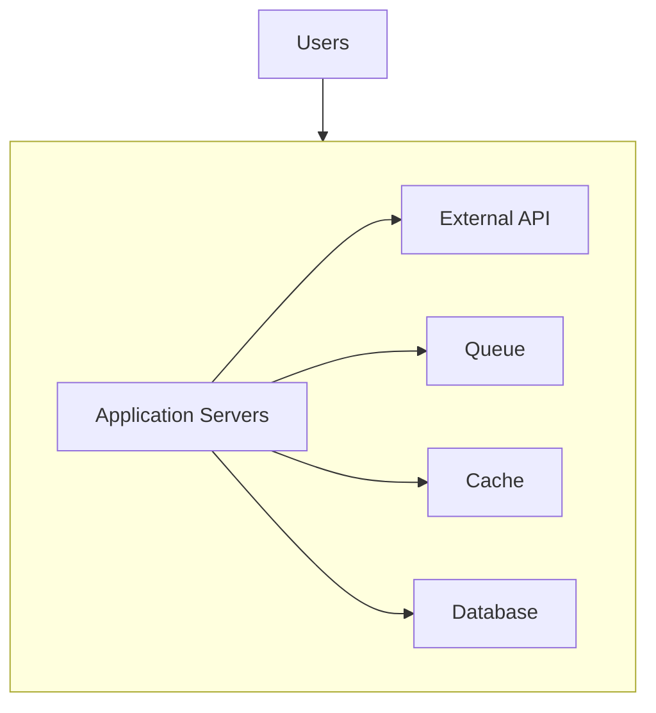

The application servers may have plenty of capacity.

But the database may be overloaded.

Or the external API may be slow.

Or the network may be saturated.

Or the application may be waiting on a limited number of database connections.

Therefore:

> **Scaling one component does not automatically scale the entire system.**

---

# 10. Application Scaling vs Database Scaling

This distinction is extremely important.

Suppose we have:

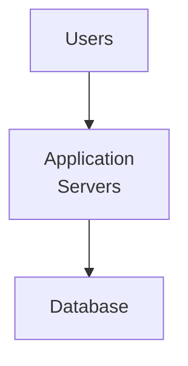

Application servers can often be replicated relatively easily:

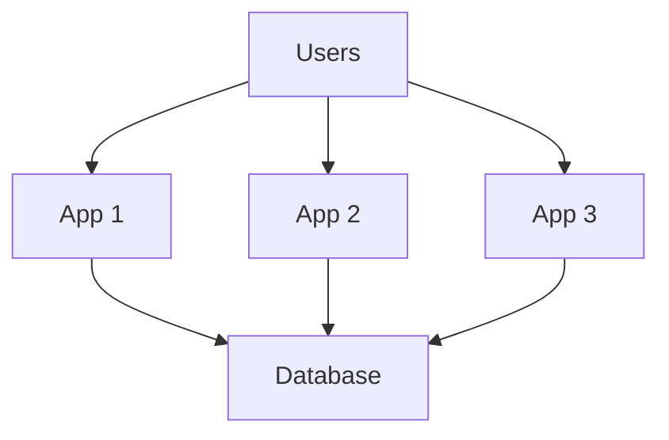

But the database is responsible for shared data.

You cannot assume that simply adding three more database servers will produce the same result.

Database scaling introduces questions about:

* reads and writes
* replication
* consistency
* transactions
* partitioning
* sharding
* connection limits
* data distribution

These topics are explored later in the curriculum.

---

# 11. A Simple Growth Example

Imagine an online store.

Initially:

```text
100 users
10 requests/sec
1 application server
1 database
```

The system works comfortably.

Traffic grows:

```text
1,000 users
100 requests/sec
```

The application server is now heavily loaded.

The team investigates and finds:

```text
CPU → 95%
Memory → 60%
Database → 50%
Network → 40%
```

CPU is currently the bottleneck.

Possible solution:

```text
Use a larger server
```

or:

```text
Run multiple application servers
```

Later the business grows again:

```text
100,000 users
5,000 requests/sec
```

Now the architecture may look more like:

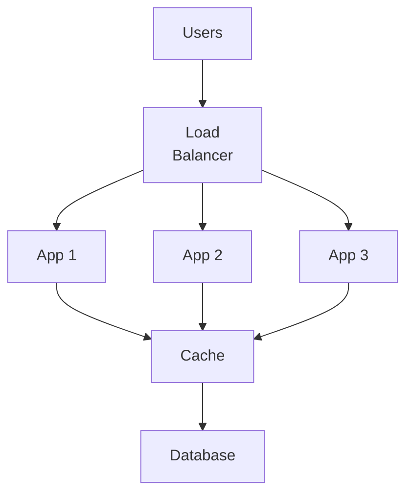

Later, the database itself may become the bottleneck.

At that point, the architecture must evolve again.

This is why system architecture is not a one-time diagram.

> **Architecture evolves as workload and constraints change.**

---

# 12. Scaling Has Multiple Dimensions

A system can scale in different dimensions.

### Compute

More CPU or more application workers.

### Memory

More RAM or better memory management.

### Storage

More capacity or better storage architecture.

### Network

More bandwidth or better distribution.

### Database

More database capacity or a different data architecture.

### Requests

Handle more requests per second.

### Data

Store and process larger datasets.

### Concurrency

Handle more simultaneous operations.

### Geography

Serve users across more locations.

### Reliability

Survive more types of failures.

Therefore:

> **"Scale" does not always mean "handle more users."**

---

# 13. Scaling and Performance Are Related, But Different

Performance asks:

> **How efficiently does the system perform a particular workload?**

Scaling asks:

> **How does the system continue to handle increasing workload?**

Suppose a request takes:

```text
100 ms
```

You optimize it to:

```text
20 ms
```

That improves performance.

But if traffic grows from:

```text
100 req/s → 10,000 req/s
```

the system may still need architectural changes.

Similarly, a system can scale horizontally while each individual request remains slow.

So:

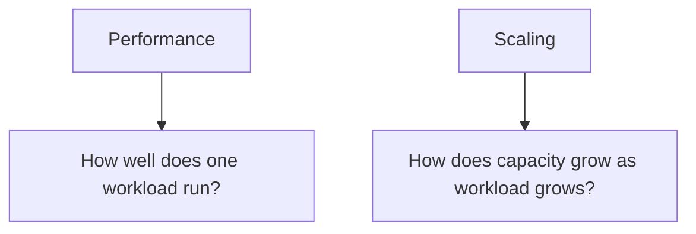

They are connected, but they are not the same problem.

---

# 14. Scaling and Reliability Are Also Connected

More machines can sometimes improve reliability.

For example:

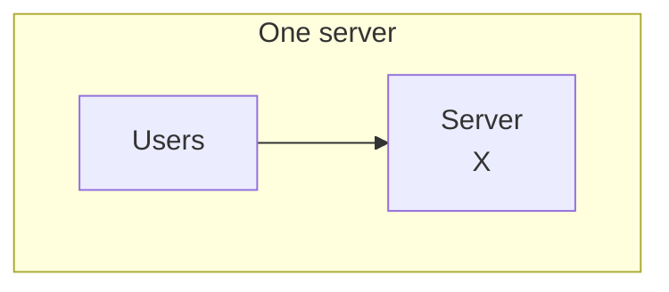

If that server fails, the application may become unavailable.

With multiple servers:

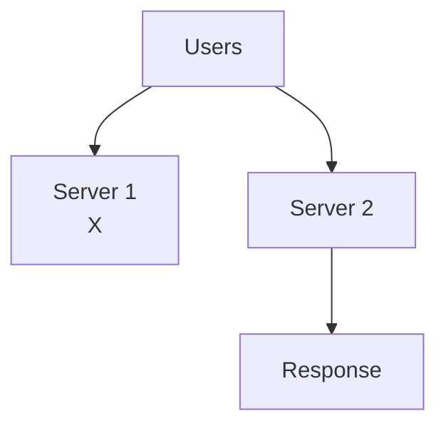

If one server fails, another may continue serving requests.

However:

> **Horizontal scaling does not automatically make a system highly available.**

The architecture must also handle:

* traffic routing
* health detection
* shared state
* database availability
* failure recovery

Those topics come later.

---

# 15. Why Premature Scaling Can Be Harmful

Suppose you have:

```text
500 users
```

but build an architecture designed for:

```text
500 million users
```

You may introduce:

* unnecessary servers
* distributed caches
* message queues
* multiple databases
* service discovery
* complex deployment systems
* complicated monitoring

before you actually need them.

The result can be:

```text
More infrastructure
        +
More complexity
        +
More operational work
        =
More places for problems
```

Scaling should therefore be based on evidence.

A useful approach is:

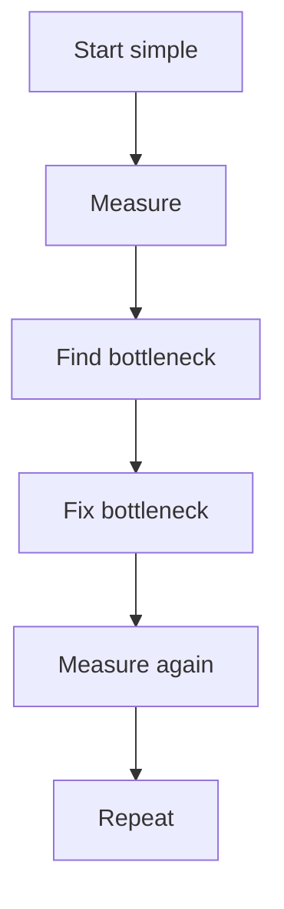

This is one of the central ideas of Systemly.

---

# 16. Scale the Bottleneck

Consider:

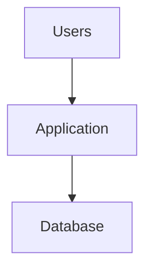

Suppose the application can process:

```text
10,000 req/s
```

but the database can safely support only:

```text
2,000 req/s
```

The effective system capacity may be constrained by the database.

Adding more application servers:

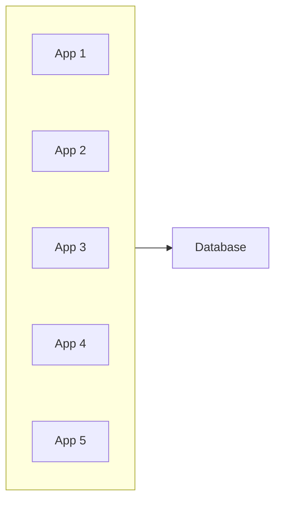

does not magically make the database capable of:

```text
10,000 req/s
```

Instead, you must understand the database bottleneck.

Possible future solutions could include:

* improving queries
* adding indexes
* caching
* read replicas
* partitioning
* sharding

Each solves different problems.

The correct solution depends on the actual bottleneck.

---

# 17. Scaling Is a Trade-off

Scaling almost always introduces trade-offs.

For example:

| Approach             | Possible Benefit                  | Possible Cost              |
| -------------------- | --------------------------------- | -------------------------- |
| Bigger server        | More capacity                     | Hardware/instance limit    |
| More servers         | More processing capacity          | Operational complexity     |
| Cache                | Fewer expensive operations        | Stale data / invalidation  |
| Queue                | Absorbs bursts                    | Asynchronous behavior      |
| Database replication | More read capacity / availability | Replication complexity     |
| Partitioning         | Distributes data/work             | More complex data access   |
| Multi-region         | Geographic resilience             | Higher complexity and cost |

There is rarely a single "best" scaling technique.

The decision depends on:

* workload
* bottleneck
* latency requirements
* availability requirements
* consistency requirements
* budget
* operational capability
* expected growth

---

# 18. Scaling Has a Cost

More capacity generally means more resources.

For example:

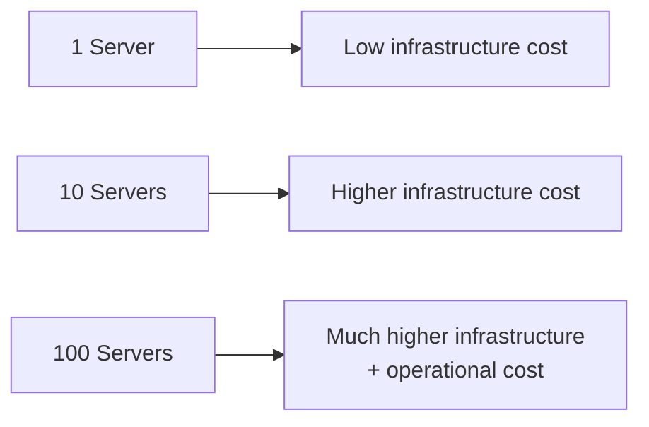

But cost is not only infrastructure.

There is also:

* engineering effort
* monitoring
* deployment complexity
* incident response
* testing
* maintenance
* operational knowledge

Therefore system design is not:

> "How can we build the biggest system?"

It is:

> **"How much capacity do we need, and what is the simplest architecture that provides it?"**

---

# 19. A Practical Scaling Path

A small web application might evolve approximately like this:

```mermaid
flowchart TD
  accTitle: A practical scaling path
  accDescr: Stage 1 single server, stage 2 bigger server, stage 3 multiple application servers, stage 4 caching and database improvements, stage 5 asynchronous processing, stage 6 database partitioning or replication, stage 7 distributed architecture.
  N0["Stage 1<br/>Single Server"] --> N1["Stage 2<br/>Bigger Server"] --> N2["Stage 3<br/>Multiple Application Servers"] --> N3["Stage 4<br/>Caching + Database Improvements"] --> N4["Stage 5<br/>Asynchronous Processing"] --> N5["Stage 6<br/>Database Partitioning / Replication"] --> N6["Stage 7<br/>Distributed Architecture"]
```

This is **not a mandatory progression**.

A real system may skip stages, combine them, or solve problems in a different order.

The point is that architecture should evolve in response to constraints.

---

# 20. What Should You Measure Before Scaling?

Before changing architecture, measure the system.

Useful signals include:

### Application

* requests per second
* response time
* error rate
* concurrent requests

### CPU

* utilization
* saturation
* load

### Memory

* utilization
* allocation
* garbage collection where applicable

### Database

* query latency
* query rate
* active connections
* CPU
* storage
* I/O

### Network

* bandwidth
* latency
* packet loss

The exact metrics depend on the system.

The important principle is:

> **Do not guess the bottleneck when you can measure it.**

---

# 21. A Simple Capacity Mental Model

A useful simplified model is:

```mermaid
flowchart TD
  accTitle: A simple capacity model
  accDescr: System capacity is shaped by resource limits (CPU, memory, network, storage, connections and the database), giving the effective capacity.
  C["System Capacity"] --> R
  subgraph R["Resource Limits"]
    direction TB
    R0["CPU"] ~~~ R1["Memory"] ~~~ R2["Network"] ~~~ R3["Storage"] ~~~ R4["Connections"] ~~~ R5["Database"]
  end
  R --> E["Effective Capacity"]
```

The system's effective capacity is constrained by whichever important resource or component reaches its limit first.

For example:

```text
CPU capacity       → 5,000 req/s
Database capacity  → 2,000 req/s
Network capacity   → 8,000 req/s
```

The application cannot safely operate at 5,000 requests/second if the database can support only 2,000 requests/second for that workload.

The bottleneck matters.

---

# 22. The Bigger Picture

Scaling is ultimately about managing growth and constraints.

The basic loop is:

```mermaid
flowchart TD
  accTitle: The scaling loop
  accDescr: Workload reaches the system; measure the load, find the bottleneck, change the architecture, gain more capacity, meet the new load, and repeat.
  N0["WORKLOAD"] --> N1["SYSTEM"] --> N2["MEASURE LOAD"] --> N3["FIND BOTTLENECK"] --> N4["CHANGE ARCHITECTURE"] --> N5["MORE CAPACITY"] --> N6["NEW LOAD"] --> N7["Repeat"]
```

This is why scaling is not one event.

It is an ongoing engineering process.

---

# Key Principle

> **Scale the bottleneck, not everything.**

And more broadly:

> **Start simple. Measure the system. Find the constraint. Solve that constraint. Repeat.**

---

# Quick Reference

| Concept             | Meaning                                            |
| ------------------- | -------------------------------------------------- |
| Scaling             | Increasing a system's ability to handle workload   |
| Demand              | Workload placed on the system                      |
| Capacity            | Workload the system can handle within requirements |
| Bottleneck          | Component limiting overall capacity                |
| Vertical scaling    | Increasing resources of an existing machine        |
| Horizontal scaling  | Adding more machines/instances                     |
| Compute scaling     | Increasing processing capacity                     |
| Data scaling        | Handling larger datasets                           |
| Concurrency scaling | Handling more simultaneous work                    |
| Premature scaling   | Adding complexity before it is needed              |

---

# Knowledge Check

### 1. What is scaling?

**Answer:**
Changing a system so it can handle increased workload while continuing to meet its requirements.

---

### 2. What is the difference between demand and capacity?

**Answer:**
Demand is the workload arriving at the system. Capacity is the workload the system can handle within its requirements.

---

### 3. If CPU is at 95% but storage is at 30%, which resource deserves investigation first?

**Answer:**
CPU, because it may be the current bottleneck.

---

### 4. Does adding more application servers automatically solve database overload?

**Answer:**
No. If the database is the bottleneck, adding application servers may not help and can increase database load.

---

### 5. What is vertical scaling?

**Answer:**
Increasing the resources of an existing machine, such as CPU or memory.

---

### 6. What is horizontal scaling?

**Answer:**
Adding more machines or application instances to distribute workload.

---

### 7. Is scaling only about handling more users?

**Answer:**
No. Data, concurrency, storage, geographic reach, reliability requirements, and other workload dimensions can also create scaling requirements.

---

### 8. Why can premature scaling be harmful?

**Answer:**
It can introduce unnecessary infrastructure, complexity, cost, and operational problems before those capabilities are actually required.

---

# Systemly Mental Model

```mermaid
flowchart TD
  accTitle: Systemly mental model
  accDescr: Growth brings more workload: check capacity, find the bottleneck, choose the smallest effective change, measure again, and repeat.
  N0["Growth"] --> N1["More Workload"] --> N2["Check Capacity"] --> N3["Find Bottleneck"] --> N4["Choose Smallest Effective Change"] --> N5["Measure Again"] --> N6["Repeat"]
```

**Scaling is not about building the biggest system.**

**Scaling is about evolving the system when its current capacity or architecture no longer satisfies its requirements.**
