# 02.02 — Vertical Scaling

Vertical scaling is one of the simplest ways to increase the capacity of a system:

> **Make the existing machine more powerful.**

Instead of adding more servers, you increase the resources available to the server you already have.

This is also called **scaling up**.

---

## Learning Objectives

By the end of this chapter, you should understand:

* What vertical scaling means
* How CPU, memory, storage, and network resources affect capacity
* How scaling up works in practice
* The benefits and limitations of vertical scaling
* Why a bigger server does not solve every bottleneck
* The relationship between vertical scaling and application architecture
* When vertical scaling is useful
* Why vertical scaling eventually reaches physical or platform limits
* The difference between scaling capacity and improving efficiency

---

# 1. What Is Vertical Scaling?

Suppose an application currently runs on:

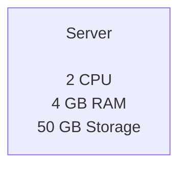

The application starts receiving more workload.

Instead of adding another server, we upgrade the existing machine:

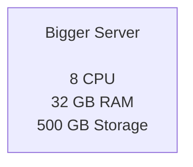

The machine became more capable.

That is **vertical scaling**.

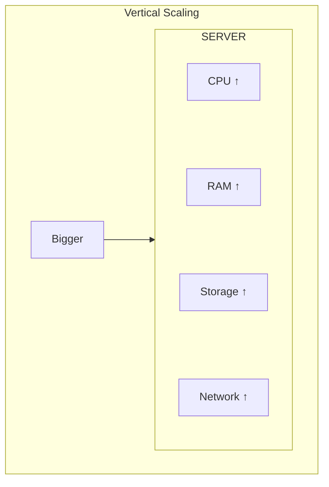

The number of machines does not necessarily increase.

---

# 2. Scaling Up vs Scaling Out

It helps to compare the two basic approaches.

### Scaling up

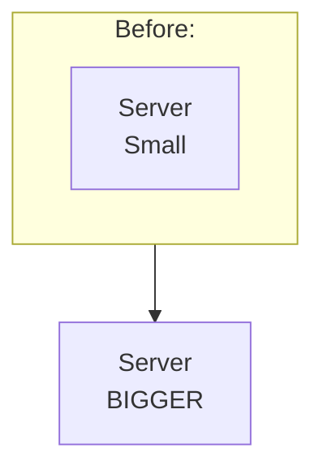

### Scaling out

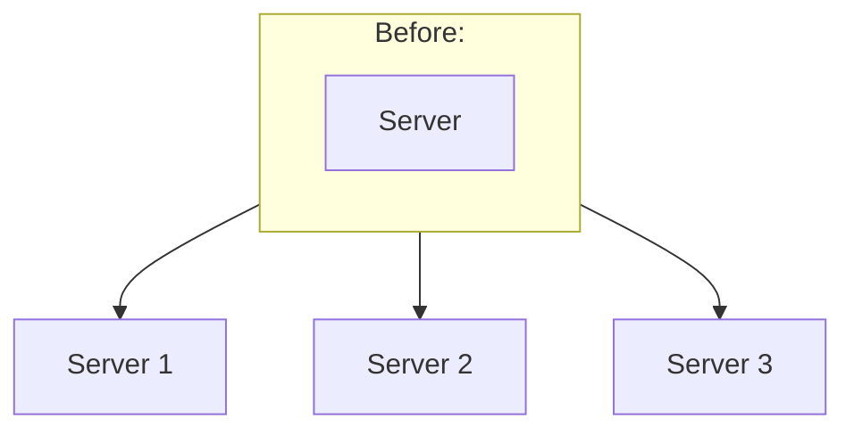

Vertical scaling changes the **size** of a machine.

Horizontal scaling changes the **number** of machines.

---

# 3. What Can Be Increased?

Vertical scaling can involve increasing different resources.

Common examples include:

* CPU
* memory
* storage capacity
* storage performance
* network capacity
* virtual machine size
* instance class

However, the exact resources available for scaling depend on the platform.

For example:

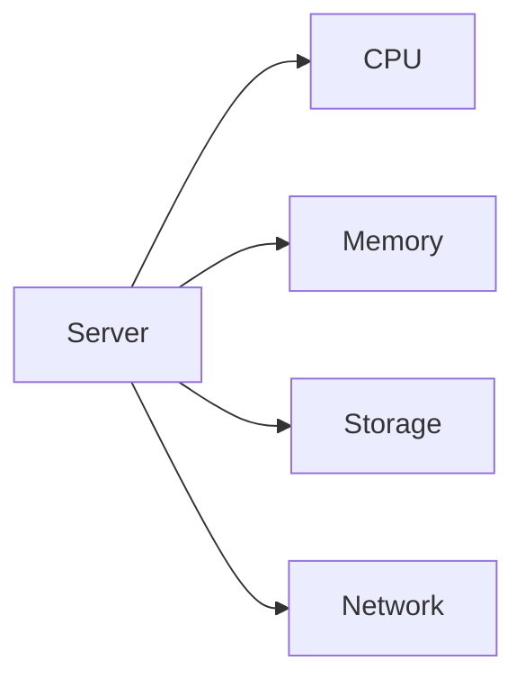

The important question is not:

> "Can I get a bigger server?"

It is:

> **"Which resource is limiting my workload?"**

---

# 4. CPU Scaling

CPU becomes important when the application performs substantial computation.

For example:

```text
Current server:

CPU → 95%
Memory → 45%
Storage → 30%
```

The application may be CPU-bound.

Increasing CPU capacity could help:

```text
Before:

4 CPU
███████████████████ 95%


After:

16 CPU
███████              35%
```

Potential workloads that may benefit include:

* image processing
* video processing
* report generation
* complex application logic
* compression
* encryption
* data transformation

But CPU utilization alone does not prove that CPU is the bottleneck.

A system can have high CPU utilization while being constrained elsewhere.

Measurement matters.

---

# 5. Memory Scaling

Memory is another common constraint.

Suppose:

```text
Memory
███████████████████ 95%
```

The application may be running out of available memory.

Insufficient memory can cause:

* application instability
* process termination
* swapping
* slower performance
* failed requests
* reduced concurrency

Increasing memory may provide more headroom:

```text
Before:
8 GB RAM

After:
32 GB RAM
```

But again, more memory is not automatically better.

If the application is actually waiting on the database, adding RAM to the application server may have little effect.

---

# 6. Storage Scaling

Storage has at least two different concerns:

### Capacity

How much data can be stored?

```text
100 GB → 1 TB → 5 TB
```

### Performance

How quickly can data be read or written?

For example:

```text
Storage A
Lower throughput

Storage B
Higher throughput
```

A system may have plenty of free storage but still suffer from storage I/O limitations.

Therefore:

> **Storage capacity and storage performance are different scaling concerns.**

---

# 7. Network Scaling

A server also has network limits.

Imagine:

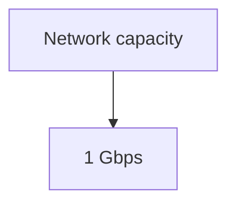

If the workload consistently requires more than the available network capacity, increasing CPU or RAM will not solve the problem.

You may need:

* higher network capacity
* better traffic distribution
* compression
* caching
* CDN usage
* architectural changes

This demonstrates a broader principle:

> **The resource you scale should match the bottleneck.**

---

# 8. A Server Is a Collection of Resources

It is useful to stop thinking about a server as one thing.

Think of it as:

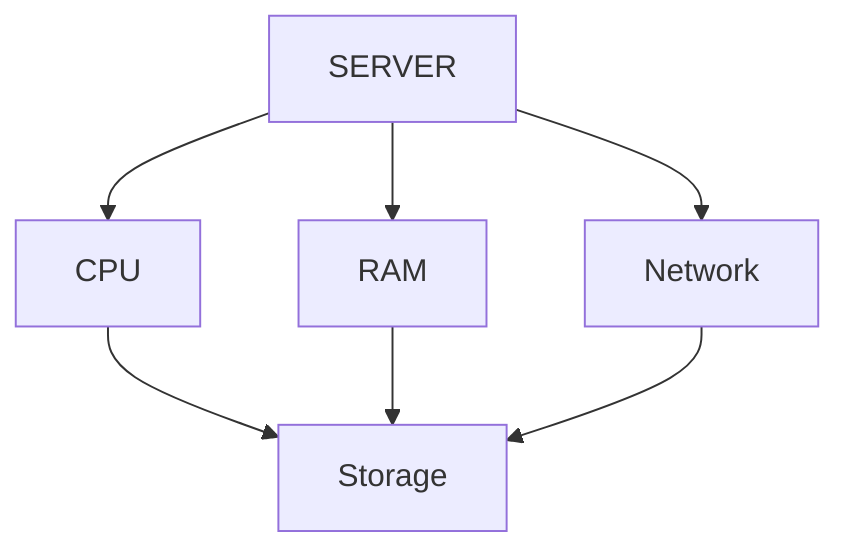

Different workloads consume different resources.

For example:

### CPU-heavy workload

```text
CPU ████████████████████
RAM █████
```

### Memory-heavy workload

```text
CPU ██████
RAM ████████████████████
```

### Storage-heavy workload

```text
CPU █████
RAM █████
Disk ████████████████████
```

Scaling should follow the actual resource constraint.

---

# 9. Vertical Scaling in Cloud Environments

Vertical scaling does not necessarily mean physically opening a server and installing more RAM.

In cloud environments, it often means changing the machine or instance size.

For example:

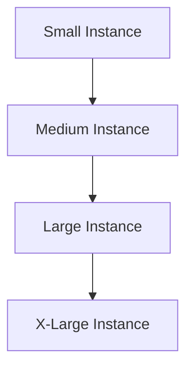

The exact names and specifications vary by cloud provider.

Conceptually, however, the operation is the same:

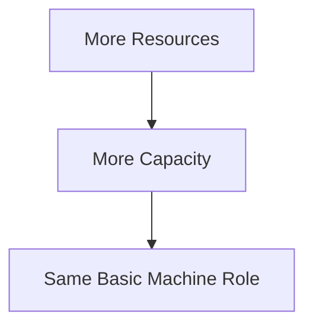

The application may continue running as a single instance.

---

# 10. Vertical Scaling Can Be Very Simple

Consider a small business application:

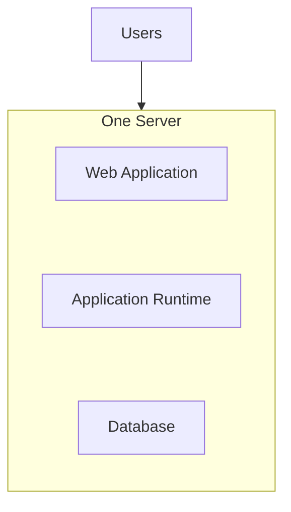

The application grows.

The server is upgraded:

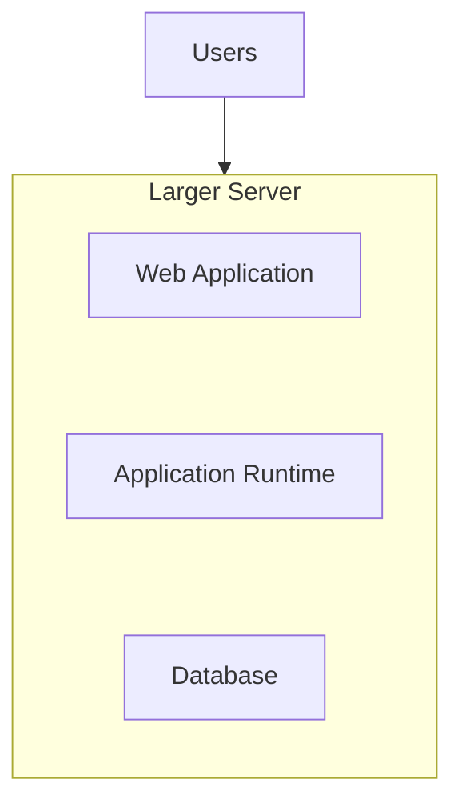

No load balancer is required.

No service discovery is required.

No request distribution logic is required.

No additional application server needs to communicate with another application server.

That simplicity can be valuable.

---

# 11. One Major Benefit: Simplicity

One of the biggest advantages of vertical scaling is architectural simplicity.

Compare:

### One larger server

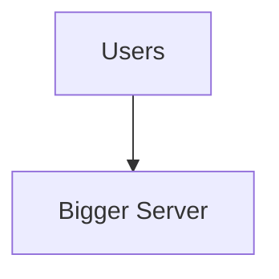

with:

### Multiple servers

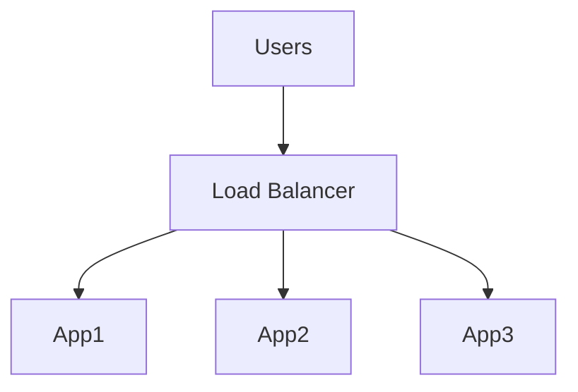

The second architecture introduces additional concerns.

You now need to consider:

* load balancing
* health checks
* server failures
* shared state
* deployments
* service discovery
* connection management

Vertical scaling can postpone some of that complexity.

---

# 12. Vertical Scaling and Stateful Applications

Vertical scaling can be particularly convenient when an application keeps local state.

For example:

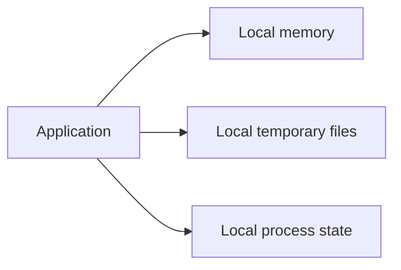

With one server, that state remains on the same machine.

When you move to multiple servers, you need to ask:

> Where should shared state live?

This is one reason why moving from one server to many servers is an architectural change, not simply a hardware change.

---

# 13. Vertical Scaling Does Not Automatically Make a System More Reliable

Suppose you have one extremely powerful server:

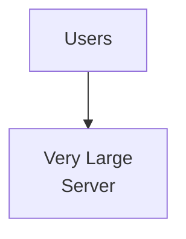

It may have:

```text
64 CPU
256 GB RAM
Large Storage
```

But if the server fails:

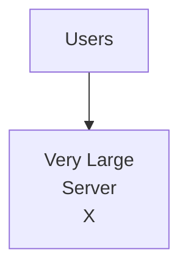

The application may still become unavailable.

A bigger machine can increase **capacity** without necessarily providing **redundancy**.

This distinction is important:

```text
More resources
      ≠
More redundancy
```

---

# 14. The Single-Machine Failure Domain

A vertically scaled architecture can create a large failure domain.

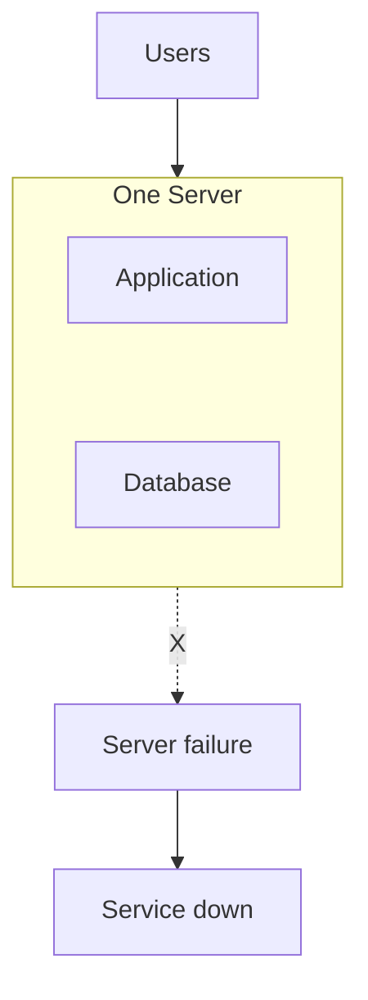

If critical components all depend on the same machine, that machine becomes a single point of failure.

Later chapters will examine redundancy, failover, and high availability.

For now, remember:

> **Capacity and availability are different properties.**

---

# 15. Vertical Scaling Has a Ceiling

A machine cannot grow forever.

There are physical, platform, and economic limits.

For example:

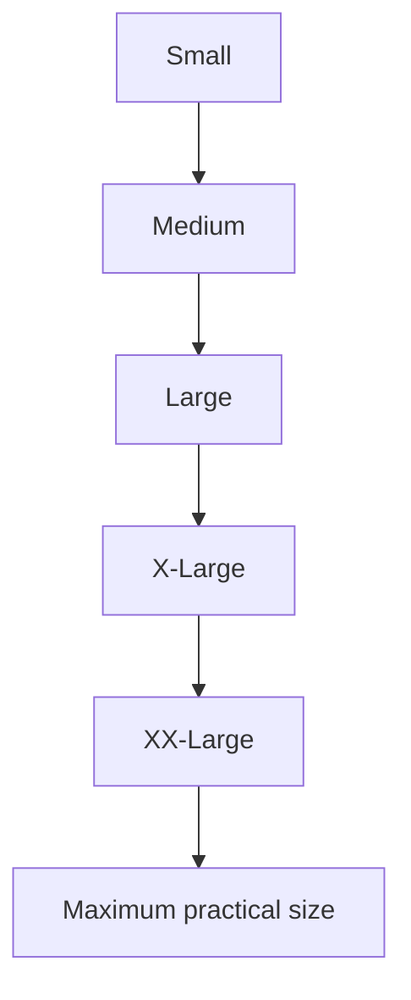

Eventually:

* the platform may not offer a larger machine
* the cost may become excessive
* the workload may require more parallelism
* a single machine may become a performance bottleneck
* the failure domain may become too large

At that point, horizontal scaling may become necessary.

---

# 16. Bigger Does Not Mean Infinitely Faster

Suppose an application has one CPU-bound task.

Moving from:

```text
4 CPU → 8 CPU
```

does not necessarily make that task exactly twice as fast.

Why?

Because applications have:

* sequential work
* synchronization
* I/O waits
* locks
* dependencies
* single-threaded portions

A simplified model might look like:

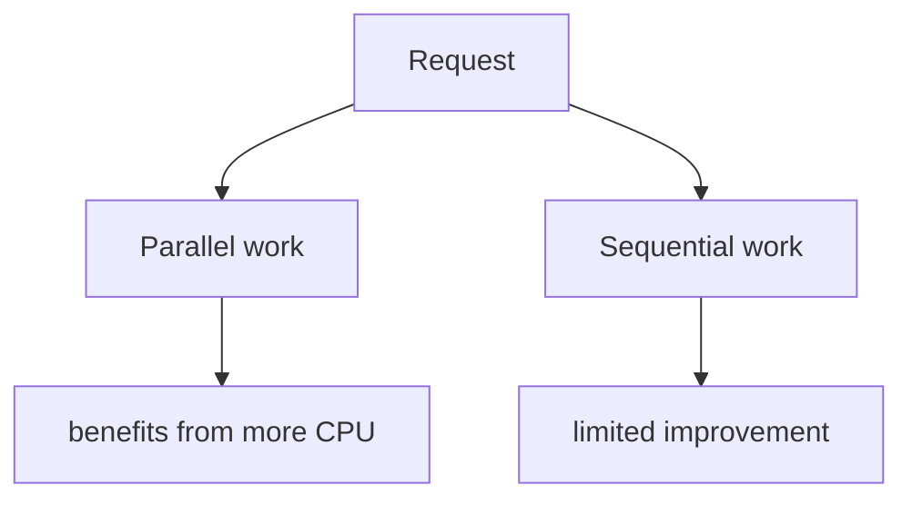

This is one reason simply adding resources may produce diminishing returns.

---

# 17. Vertical Scaling vs Optimization

Suppose your server is slow because a database query takes:

```text
2 seconds
```

You could buy a bigger server.

But perhaps the real issue is:

```sql
SELECT *
FROM orders
WHERE customer_id = 12345;
```

with an inefficient access path.

Adding CPU may not solve the underlying problem.

A better solution could be:

```mermaid
flowchart TD
  accTitle: Optimizing instead of scaling
  accDescr: Identify the slow query, inspect the query plan, improve the query or index, and measure again.
  N0["Identify slow query"] --> N1["Inspect query plan"] --> N2["Improve query/index"] --> N3["Measure again"]
```

This is an important distinction:

> **Scaling adds capacity. Optimization reduces the amount of resources required for the same workload.**

Sometimes you need one.

Sometimes you need the other.

Sometimes both.

---

# 18. Vertical Scaling vs Caching

Imagine:

```mermaid
flowchart TD
  accTitle: Application and database
  accDescr: The application queries the database.
  N0["Application"] --> N1["Database"]
```

The database is receiving the same expensive query repeatedly.

One approach is to make the application server bigger.

Another approach might be:

```mermaid
flowchart TD
  accTitle: A cache in front of the database
  accDescr: The application reads through a cache before the database.
  N0["Application"] --> N1["Cache"] --> N2["Database"]
```

If the data can safely be cached, many requests may avoid the database entirely.

That changes the workload rather than simply increasing machine capacity.

This is why system design is about understanding **why** the system is under pressure.

---

# 19. Vertical Scaling and Cost

A larger machine usually costs more.

For example:

```mermaid
flowchart TD
  accTitle: Cost grows with size
  accDescr: A small server costs $X per month; a large server costs $4X per month.
  N0["Small Server<br/>$X / month"] --> N1["Large Server<br/>$4X / month"]
```

The exact economics vary by provider and workload.

At first, scaling up may be economical because it avoids additional infrastructure.

But at larger sizes, the cost may grow significantly.

You may eventually reach a point where:

```text
One huge machine
        vs
Several smaller machines
```

requires an architectural and economic comparison.

There is no universal answer.

---

# 20. Vertical Scaling and Database Systems

Vertical scaling is often relevant to databases.

Suppose:

```mermaid
flowchart TD
  accTitle: Application and database
  accDescr: The application uses the database.
  N0["Application"] --> N1["Database"]
```

The database server is CPU-bound.

Increasing its CPU capacity may provide more processing capability.

Or perhaps:

```text
Database memory → constrained
```

Increasing memory may allow more useful data and indexes to remain in memory.

Or:

```text
Storage I/O → constrained
```

Faster storage may help.

But databases have their own scaling characteristics and limitations.

Database replication, read replicas, partitioning, and sharding are covered later in **Level 4 — Data Architecture**.

The key point here is:

> **Vertical scaling can be applied to databases as well as application servers.**

---

# 21. Vertical Scaling Can Be a Valid Long-Term Strategy

It is easy to assume:

> "Real systems must always scale horizontally."

That is not true.

If a system can satisfy its requirements with a powerful machine, vertical scaling may remain a reasonable architecture.

For example:

```mermaid
flowchart TD
  accTitle: When one machine is enough
  accDescr: Requirements set the current workload, one machine has sufficient capacity, so there is no need for distributed application servers.
  N0["Requirements"] --> N1["Current workload"] --> N2["One machine has sufficient capacity"] --> N3["No need for distributed application servers"]
```

There is no architectural requirement to distribute a system merely because distribution is possible.

The goal is to satisfy requirements with appropriate complexity.

---

# 22. When Vertical Scaling Makes Sense

Vertical scaling can be useful when:

* the workload fits comfortably on one machine
* simplicity is valuable
* the application is difficult to distribute
* the database benefits from additional CPU or memory
* the system is still relatively small
* horizontal scaling would add unnecessary complexity
* the platform provides convenient instance resizing
* the workload does not require multiple independent failure domains

The decision should still be based on measured requirements.

---

# 23. When Vertical Scaling Becomes Difficult

Vertical scaling becomes less attractive when:

* the machine reaches its maximum practical size
* cost becomes excessive
* one machine cannot provide enough capacity
* availability requires redundancy
* workload needs to be distributed
* geographic distribution is required
* different components need independent scaling

For example:

```text
Application workload → high
Database workload    → low
```

If everything runs on one large machine, you may be forced to scale both together.

With separate components, they can eventually scale independently.

This introduces another important concept:

> **Independent scaling can be more efficient than scaling everything together.**

---

# 24. Coupled Scaling

Imagine:

```mermaid
flowchart TD
  accTitle: Coupled resources
  accDescr: One server runs the application, the database and background jobs.
  subgraph S["One Server"]
    direction TB
    S0["Application"] ~~~ S1["Database"] ~~~ S2["Background Jobs"]
  end
```

Suppose only the application needs more CPU.

You may have to increase the capacity of the entire machine.

The resources are coupled.

Later the architecture may separate responsibilities:

```mermaid
flowchart TD
  accTitle: Separated responsibilities
  accDescr: App servers, then the database, then the worker system, each separate.
  N0["App Servers"] --> N1["Database"] --> N2["Worker System"]
```

Now each major component can potentially scale differently.

This can improve resource efficiency, but increases architectural complexity.

---

# 25. A Realistic Evolution

Consider an online store.

### Stage 1

```mermaid
flowchart TD
  accTitle: Stage 1
  accDescr: Users reach one server that runs the application and the database.
  U["Users"] --> S["One Server"] --> A["Application"] & D["Database"]
```

Traffic increases.

The team measures:

```text
CPU → 92%
Memory → 70%
Database → 40%
```

CPU is the current constraint.

### Stage 2

Upgrade the server:

```text
CPU → 16 cores
RAM → 32 GB
```

Now:

```text
CPU → 45%
```

The system is healthy again.

Later:

```text
CPU → 90%
Database → 85%
```

Now there are multiple constraints.

The next solution may not simply be:

```text
"Buy an even bigger server."
```

The architecture may need to evolve.

That is system thinking.

---

# 26. A Useful Decision Process

When considering vertical scaling:

```mermaid
flowchart TD
  accTitle: Deciding on vertical scaling
  accDescr: Measure the system and identify the bottleneck. If it is a machine resource, scale that resource and measure again; if not, investigate another layer.
  P["Problem"] --> M["Measure the system"] --> I["Identify bottleneck"] --> Q{"Is it a machine resource?"}
  Q -->|"Yes"| S["Scale resource"] --> A["Measure again"]
  Q -->|"No"| N["Investigate<br/>another layer"]
```

For example:

```mermaid
flowchart TD
  accTitle: A CPU bottleneck
  accDescr: A CPU bottleneck: increase CPU, then measure.
  N0["CPU bottleneck"] --> N1["Increase CPU"] --> N2["Measure"]
```

But:

```mermaid
flowchart TD
  accTitle: A database query bottleneck
  accDescr: A database query bottleneck calls for query optimization, an index, a cache or database scaling.
  N0["Database query bottleneck"] --> N1["Query optimization?<br/>Index?<br/>Cache?<br/>Database scaling?"]
```

The correct response depends on the bottleneck.

---

# 27. Common Mistakes

## Mistake 1: "Just Buy a Bigger Server"

A bigger server cannot fix every problem.

The bottleneck may be:

* database queries
* network latency
* external APIs
* inefficient algorithms
* storage I/O
* connection limits

---

## Mistake 2: Confusing More CPU With More Capacity Everywhere

Increasing CPU does not automatically increase:

* database capacity
* network bandwidth
* storage throughput
* external API limits

Each resource has its own constraints.

---

## Mistake 3: Ignoring Reliability

A huge single server may provide excellent capacity but still create a single point of failure.

---

## Mistake 4: Scaling Before Measuring

If you do not know what is limiting the system, you may spend money on resources that do not solve the problem.

---

## Mistake 5: Assuming Horizontal Scaling Is Always Better

Horizontal scaling provides useful capabilities, but it also introduces distributed-system complexity.

Use it when the requirements justify it.

---

# 28. Production Mental Model

Think of a machine like a container of finite resources:

```mermaid
flowchart TD
  accTitle: A machine as finite resources
  accDescr: The server's CPU, RAM, storage and network serve the workload.
  subgraph S["SERVER"]
    direction TB
    S0["CPU"] ~~~ S1["RAM"] ~~~ S2["Storage"] ~~~ S3["Network"]
  end
  S --> W["Workload"]
```

When workload increases:

```mermaid
flowchart TD
  accTitle: When workload increases
  accDescr: Workload rises, resource usage rises, one resource becomes constrained, measure the bottleneck, then scale or optimize that resource.
  N0["Workload ↑"] --> N1["Resource usage ↑"] --> N2["One resource becomes constrained"] --> N3["Measure bottleneck"] --> N4["Scale or optimize that resource"]
```

Vertical scaling is simply one possible response.

---

# Key Principles

1. **Vertical scaling means increasing the resources of an existing machine.**

2. **Scale the resource that limits the workload.**

3. **A bigger server does not automatically solve every performance problem.**

4. **Vertical scaling is often simpler than horizontal scaling.**

5. **A larger machine does not automatically provide redundancy or high availability.**

6. **Every machine has a practical capacity ceiling.**

7. **Scaling and optimization are different tools.**

8. **Independent scaling can improve efficiency, but usually adds architectural complexity.**

9. **Measure before scaling.**

10. **The simplest architecture that satisfies the requirements is often a good starting point.**

---

# Quick Reference

| Concept             | Meaning                                     |
| ------------------- | ------------------------------------------- |
| Vertical scaling    | Increasing resources of an existing machine |
| Scaling up          | Another name for vertical scaling           |
| CPU scaling         | Increasing processing capacity              |
| Memory scaling      | Increasing available RAM                    |
| Storage capacity    | Increasing how much data can be stored      |
| Storage performance | Increasing read/write capability            |
| Network scaling     | Increasing network capacity                 |
| Capacity ceiling    | Practical maximum capacity of a machine     |
| Coupled scaling     | Multiple workloads must scale together      |
| Independent scaling | Components can scale separately             |
| Bottleneck          | Resource or component limiting the workload |

---

# Knowledge Check

### 1. What is vertical scaling?

**Answer:**
Increasing the resources available to an existing machine instead of adding more machines.

---

### 2. Is adding more RAM always a solution to high CPU usage?

**Answer:**
No. The resource being scaled should correspond to the actual bottleneck.

---

### 3. Does a larger server automatically provide high availability?

**Answer:**
No. Capacity and redundancy are different properties.

---

### 4. Why can vertical scaling be simpler than horizontal scaling?

**Answer:**
The application can continue running on one machine, avoiding many distributed-system concerns such as request distribution and shared application state.

---

### 5. Does vertical scaling continue forever?

**Answer:**
No. Machines and platforms have practical, technical, and economic limits.

---

### 6. What is the difference between scaling and optimization?

**Answer:**
Scaling increases available capacity. Optimization reduces the resources required to perform the workload.

---

### 7. Why can a single large server become a concern?

**Answer:**
It can create a large failure domain, reach capacity limits, become expensive, and couple different workloads to the same resources.

---

### 8. Should every system eventually scale horizontally?

**Answer:**
No. Horizontal scaling is useful when requirements justify it. A sufficiently capable single machine can be an appropriate architecture.

---

# Systemly Mental Model

```mermaid
flowchart TD
  accTitle: Systemly mental model
  accDescr: Workload reaches the server. Find the constraint among CPU, RAM, disk and network, scale that resource and measure. If still constrained, investigate the next bottleneck; if not, continue.
  W["WORKLOAD"] --> S["SERVER"] -->|"Find constraint"| C["CPU / RAM /<br/>Disk / Network"] --> R["Scale resource"] --> M["Measure"] --> Q{"Still constrained?"}
  Q -->|"Yes"| I["Investigate<br/>next bottleneck"]
  Q -->|"No"| N["Continue"]
```

> **Vertical scaling is not "make the server huge."**

> **It is a deliberate decision to increase the capacity of an existing machine when that machine's resources are the actual constraint.**
