# 02.03 — Horizontal Scaling

In the previous chapter, we increased the capacity of a machine.

Now we take a different approach:

> **Instead of making one machine bigger, add more machines.**

This is called **horizontal scaling**, or **scaling out**.

Horizontal scaling is one of the most important ideas in modern system architecture because it changes the system from depending on one application instance to distributing workload across multiple instances.

But adding machines also introduces new problems.

Once there is more than one instance, the system must answer questions such as:

* Which server receives a request?
* Where does user state live?
* What happens when one server fails?
* How are deployments handled?
* How many database connections are created?
* How do servers share information?

So horizontal scaling is not simply:

> "Buy more servers."

It is an architectural change.

---

## Learning Objectives

By the end of this chapter, you should understand:

* What horizontal scaling means
* The difference between scaling up and scaling out
* How multiple application instances share workload
* Why horizontal scaling can increase capacity
* Why stateless application design makes scaling easier
* The role of a load balancer
* What happens when one instance fails
* Why local state becomes a problem
* How horizontal scaling affects database connections
* The benefits and trade-offs of scaling out
* Why adding more servers does not automatically solve every bottleneck

---

# 1. What Is Horizontal Scaling?

Suppose an application starts with one server:

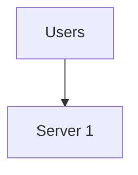

The server becomes heavily loaded.

Instead of replacing it with a much larger server, we add more application instances:

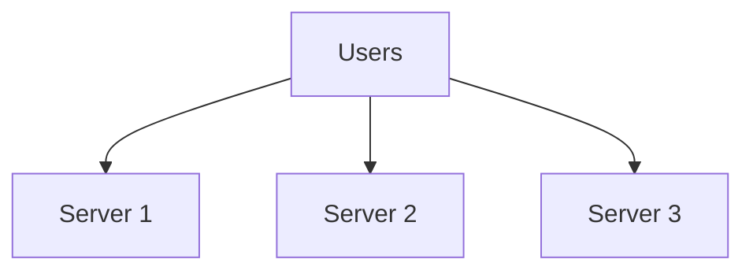

Now workload can be distributed across multiple machines or instances.

That is horizontal scaling.

---

# 2. Scaling Up vs Scaling Out

The distinction is simple.

### Vertical scaling

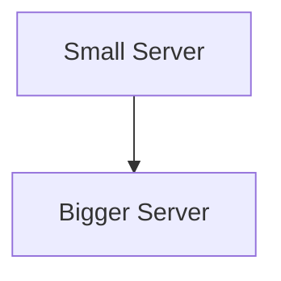

### Horizontal scaling

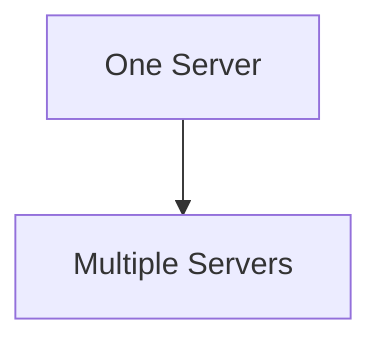

Or:

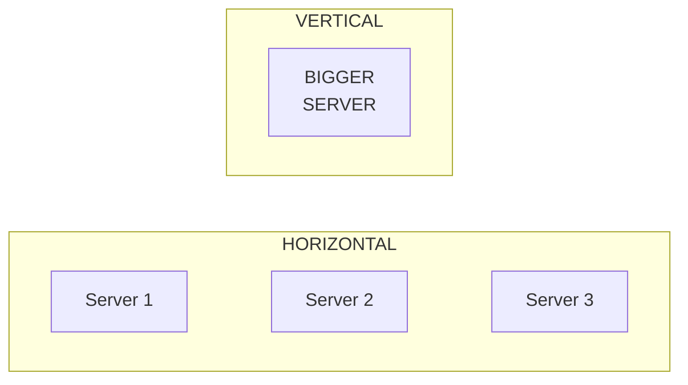

Vertical scaling increases the resources of a machine.

Horizontal scaling increases the number of machines or instances.

---

# 3. Why Add More Servers?

Suppose one application server can safely handle:

```text
1,000 requests/second
```

and the workload grows to:

```text
2,500 requests/second
```

If the workload can be distributed effectively, multiple servers can provide more total application capacity.

For example:

```text
Server 1 → 1,000 req/s
Server 2 → 1,000 req/s
Server 3 →   500 req/s

Total     → 2,500 req/s
```

This is a simplified example.

Real capacity depends on:

* workload characteristics
* application behavior
* database usage
* network limits
* coordination overhead
* resource contention

But the basic idea is:

> **Divide the workload across multiple instances.**

---

# 4. The Basic Architecture

A horizontally scaled application commonly looks like:

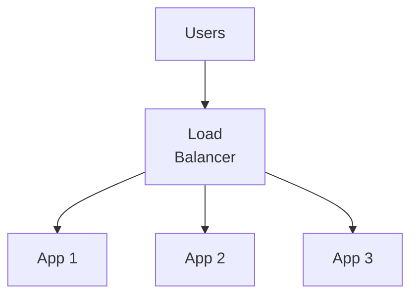

The load balancer receives incoming traffic and decides which application instance should handle each request.

The load balancer is introduced in detail in **02.06 — Load Balancer**.

For now, understand its basic role:

> **Distribute incoming workload across available instances.**

---

# 5. More Servers Do Not Automatically Mean More Capacity

This is an important correction.

Suppose:

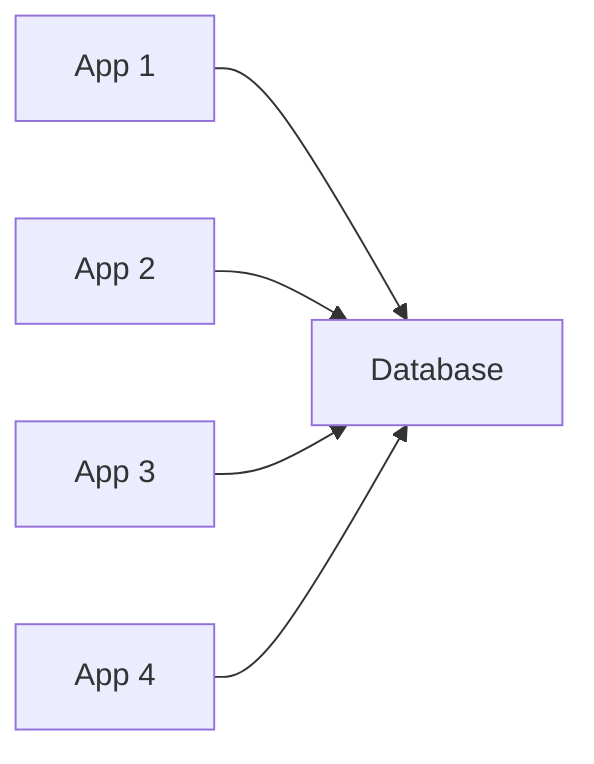

You added four application servers.

But the database can only handle the workload generated by two servers.

Then:

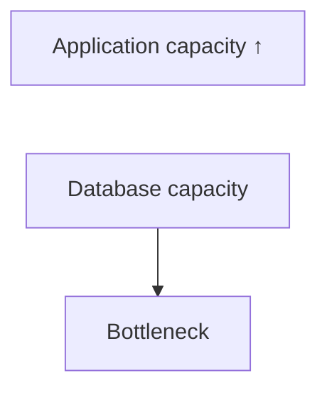

The database remains the limiting component.

In fact, more application servers may increase database pressure.

Therefore:

> **Horizontal scaling works only when the surrounding system can support the additional workload.**

---

# 6. The Idea of Shared Workload

Imagine four workers processing orders.

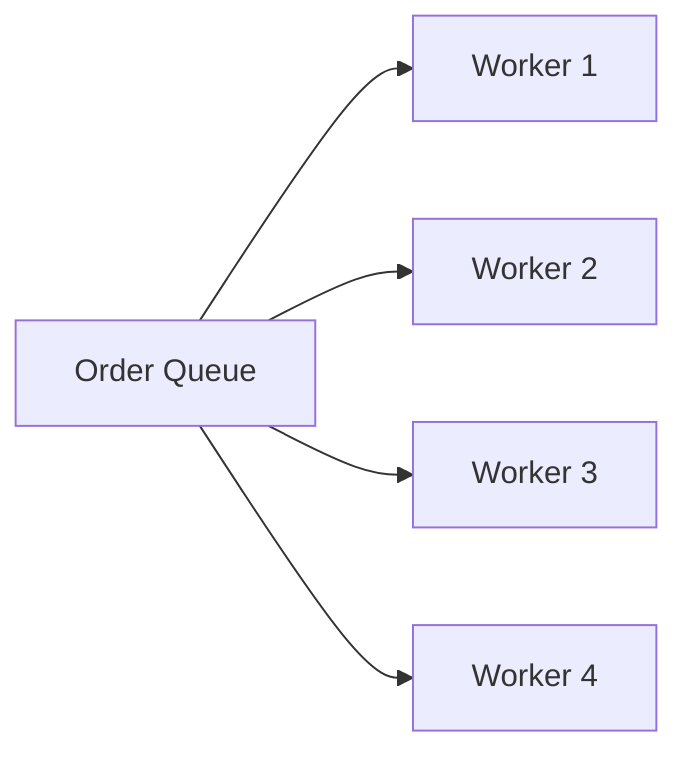

Instead of one worker doing everything:

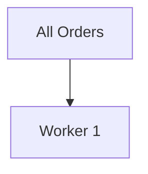

the workload is distributed.

This same principle applies to application servers.

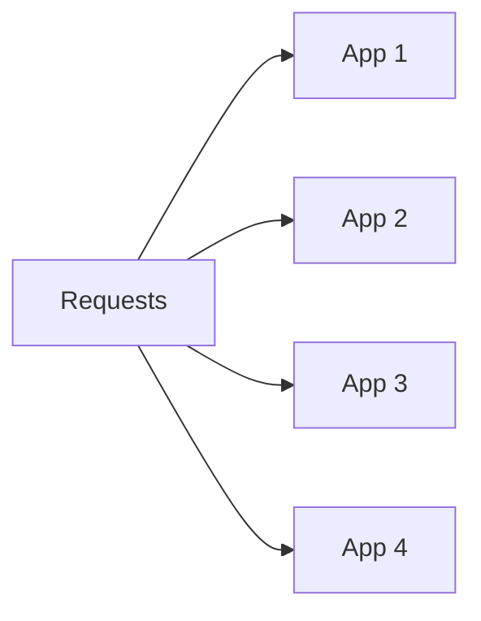

Each instance handles part of the workload.

---

# 7. Why Stateless Applications Help

Suppose a user sends two requests:

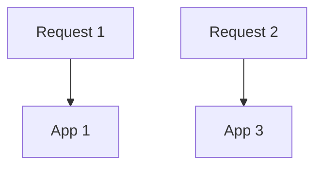

If App 3 can independently process Request 2, the system does not care which application server receives the request.

This is much easier when application instances are **stateless**.

For example:

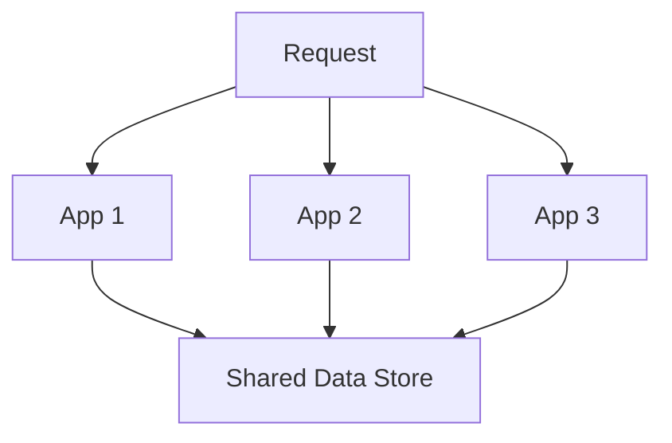

State can live in shared systems such as:

* databases
* shared caches
* object storage
* external session stores

The detailed relationship between statelessness and scaling is covered in **02.04 — Stateless Scaling**.

---

# 8. The Problem With Local State

Suppose a user logs into App 1.

App 1 stores information in its local memory:

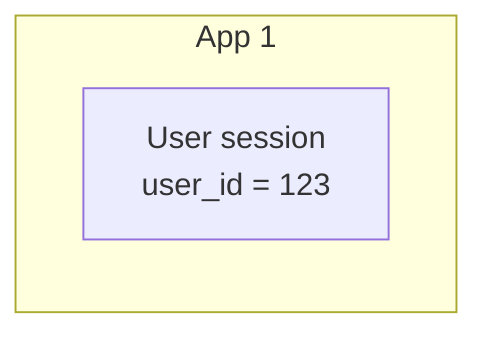

Then the next request reaches App 2:

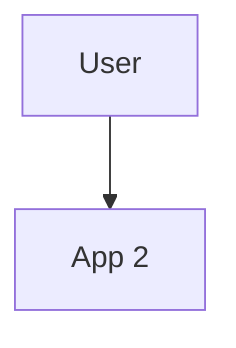

App 2 does not have App 1's memory.

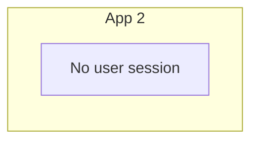

The application now has a state-sharing problem.

This is one reason horizontally scaled applications often move important state outside individual application instances.

---

# 9. Local Files Can Create the Same Problem

Imagine App 1 creates:

```text
/uploads/profile.jpg
```

The next request goes to App 2.

If App 2 has a different filesystem:

```text
App 1
└── profile.jpg

App 2
└── profile.jpg not found
```

This can cause failures.

Solutions may involve:

* object storage
* shared storage
* database storage for appropriate data
* other centralized/shared mechanisms

The correct solution depends on the workload.

The important lesson is:

> **A horizontally scaled system must account for state and data that were previously local.**

---

# 10. Failure Becomes More Manageable

One important benefit of horizontal scaling is that one application instance can fail without necessarily taking down the entire application.

Suppose:

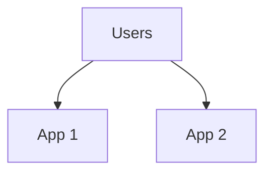

App 1 fails:

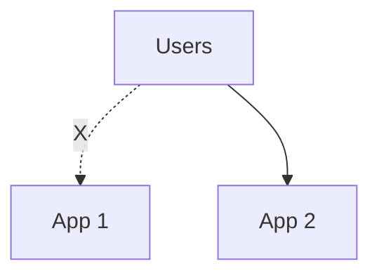

If traffic can be redirected to App 2:

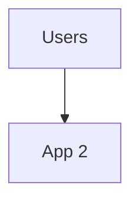

the service can continue operating.

This provides a path toward higher availability.

But simply having multiple servers does not automatically provide failover.

The system must detect unhealthy instances and stop sending traffic to them.

Health checks and failover are covered later in:

* **02.08 — Health Checks**
* **02.09 — Failover**

---

# 11. Capacity and Redundancy

Horizontal scaling can provide two different benefits:

### Capacity

More instances can process more workload.

### Redundancy

Multiple instances can provide alternatives when one instance fails.

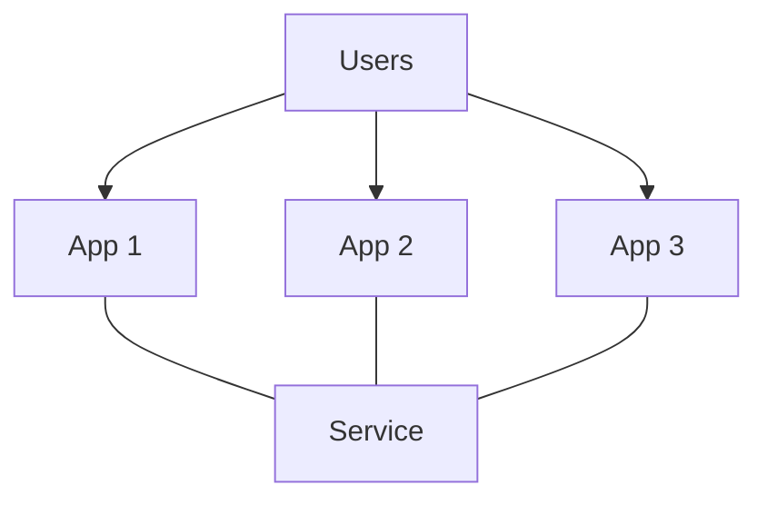

If App 2 fails:

```text
      App 1   App 2   App 3
        ✓       X       ✓
```

the remaining instances may continue serving traffic.

These are related benefits, but they should not be confused:

```mermaid
flowchart LR
  accTitle: What more instances give
  accDescr: More instances give more capacity and potential redundancy.
  H["More instances"]
  I0["More capacity"]
  I1["Potential redundancy"]
  H --> I0
  H --> I1
```

---

# 12. Horizontal Scaling and Load Distribution

If all users are sent to one instance, adding more instances provides little benefit.

For example:

```mermaid
flowchart LR
  accTitle: No load distribution
  accDescr: Users all reach App 1, which is overloaded, while App 2 and App 3 are idle.
  U["Users"] --> A1["App 1"] --> O["overloaded"]
  A2["App 2"] --> I2["idle"]
  A3["App 3"] --> I3["idle"]
```

The system needs a mechanism to distribute traffic.

That mechanism is commonly a load balancer.

```mermaid
flowchart TD
  accTitle: A load balancer distributes traffic
  accDescr: Users reach a load balancer, which sends requests to App 1, App 2 and App 3.
  U["Users"] --> L["Load Balancer"] --> A1["App 1"] & A2["App 2"] & A3["App 3"]
```

The load balancer becomes an important part of the architecture.

---

# 13. Load Distribution Is Not Always Equal

A common misconception is:

> "The load balancer gives exactly one-third of the traffic to each server."

Not necessarily.

Different instances may have:

* different capacities
* different current loads
* different health states
* different network conditions

Different load-balancing algorithms can make different decisions.

For example:

```text
App 1 → 50%
App 2 → 30%
App 3 → 20%
```

The exact distribution depends on the algorithm and system conditions.

Load-balancing algorithms are covered in **02.07**.

---

# 14. Horizontal Scaling and Database Connections

This is especially important given the previous chapter on connection pooling.

Suppose each application instance maintains a connection pool:

```text
App 1 → 20 DB connections
App 2 → 20 DB connections
App 3 → 20 DB connections
```

Total potential connections:

```text
20 + 20 + 20 = 60
```

Now add more instances:

```text
10 application instances
×
20 connections each
=
200 potential database connections
```

The application may scale horizontally faster than the database can handle connections.

This leads to an important rule:

> **Application scaling can multiply downstream resource consumption.**

The database must therefore be considered whenever application capacity is increased.

---

# 15. Horizontal Scaling Can Increase Database Pressure

Consider:

```mermaid
flowchart TD
  accTitle: More instances, one database
  accDescr: Users reach App 1, App 2 and App 3, which all use one database.
  T["Users"] --> A0["App 1"] & A1["App 2"] & A2["App 3"]
  A0 & A1 & A2 --> B["Database"]
```

If one application instance generates:

```text
500 database queries/sec
```

then three instances might generate approximately:

```text
1,500 queries/sec
```

if workload scales proportionally.

This is only a simplified model.

Real workloads may behave differently.

But the architectural lesson remains:

> **Every scaled component can place additional load on its dependencies.**

---

# 16. Horizontal Scaling and Stateless Design

Suppose application state remains inside the process:

```mermaid
flowchart TD
  accTitle: State inside one instance
  accDescr: App 1 holds the session, the cart and temporary data.
  subgraph A["App 1"]
    direction TB
    A0["session"] ~~~ A1["cart"] ~~~ A2["temporary data"]
  end
```

Scaling out creates multiple independent copies:

```mermaid
flowchart TD
  accTitle: State in every instance
  accDescr: App 1, App 2 and App 3 each hold their own state.
  subgraph A1["App 1"]
    S1["State"]
  end
  subgraph A2["App 2"]
    S2["State"]
  end
  subgraph A3["App 3"]
    S3["State"]
  end
  A1 ~~~ A2 ~~~ A3
```

Now the system must keep these states synchronized, or ensure that requests requiring the state reach the correct instance.

That creates complexity.

A stateless design instead aims for:

```mermaid
flowchart TD
  accTitle: Shared state
  accDescr: App 1, App 2 and App 3 all use shared state.
  A1["App 1"] & A2["App 2"] & A3["App 3"] --> S["Shared State"]
```

This is one reason stateless architecture is valuable for horizontal scaling.

---

# 17. Sticky Sessions

One possible approach to local session state is to keep a user connected to the same application instance.

For example:

```text
User A → App 1
User A → App 1
User A → App 1

User B → App 2
User B → App 2
User B → App 2
```

This is commonly called **session affinity** or **sticky sessions**.

It can make stateful applications easier to operate temporarily.

But it also creates trade-offs:

* uneven traffic
* weaker flexibility
* instance-specific state
* more difficult failover
* state loss when an instance disappears

Therefore:

> **Sticky sessions can help stateful applications scale out, but they do not remove the underlying state problem.**

Stateless scaling is covered in the next chapter.

---

# 18. Horizontal Scaling and Deployment

Multiple application instances also change deployment.

With one server:

```mermaid
flowchart TD
  accTitle: Deploying to one server
  accDescr: A deploy goes to one server.
  N0["Deploy"] --> N1["Server"]
```

With multiple servers:

```mermaid
flowchart LR
  accTitle: Deploying to many instances
  accDescr: A deploy goes to App 1, App 2, App 3 and App 4.
  H["Deploy"]
  I0["App 1"]
  I1["App 2"]
  I2["App 3"]
  I3["App 4"]
  H --> I0
  H --> I1
  H --> I2
  H --> I3
```

You now need to consider:

* how instances are updated
* whether old and new versions can coexist
* how traffic is moved
* what happens if deployment fails
* how rollback works

This eventually leads to deployment strategies such as rolling deployments and blue/green deployments.

Those are outside this chapter's scope, but the architectural implication is important:

> **More instances increase operational coordination.**

---

# 19. Horizontal Scaling and Configuration

Multiple instances need consistent configuration.

For example:

```text
App 1 → DB_HOST = db.example
App 2 → DB_HOST = db.example
App 3 → DB_HOST = db.example
```

If App 3 accidentally uses a different database:

```text
App 3 → DB_HOST = another-db
```

the system can behave unpredictably.

Therefore horizontally scaled systems need reliable configuration management.

Configuration management is covered later in the service architecture level.

---

# 20. Horizontal Scaling Is Not Only for Web Servers

The same concept can apply to background workers.

Suppose one worker processes:

```text
100 jobs/minute
```

and the system receives:

```text
500 jobs/minute
```

You could run:

```text
Worker 1
Worker 2
Worker 3
Worker 4
Worker 5
```

with work distributed among them.

```mermaid
flowchart TD
  accTitle: Scaling workers
  accDescr: The queue feeds worker 1, worker 2 and worker 3, which produce results.
  T["Queue"] --> A0["Worker 1"] & A1["Worker 2"] & A2["Worker 3"]
  A0 & A1 & A2 --> B["Results"]
```

This same principle appears later in **Level 5 — Asynchronous Systems**.

---

# 21. Horizontal Scaling and Workload Type

Not every workload is equally easy to distribute.

Consider:

```mermaid
flowchart LR
  accTitle: Independent requests
  accDescr: Request A goes to App 1, request B to App 2 and request C to App 3.
  RA["Request A"] --> A1["App 1"]
  RB["Request B"] --> A2["App 2"]
  RC["Request C"] --> A3["App 3"]
```

This works well when requests are relatively independent.

But some workloads require shared coordination:

```mermaid
flowchart LR
  accTitle: A shared resource needs coordination
  accDescr: App 1, App 2 and App 3 all reach a shared resource, and coordination is required.
  J@{ shape: sm-circ }
  A1["App 1"] & A2["App 2"] & A3["App 3"] --- J --> S["Shared<br/>Resource"] & C["Coordination required"]
```

Examples can include:

* shared counters
* unique identifiers
* distributed locks
* inventory updates
* coordination-sensitive workflows

These cases can make horizontal scaling more complicated.

---

# 22. Horizontal Scaling and Shared State

The core problem can be summarized as:

```mermaid
flowchart TD
  accTitle: Shared state across instances
  accDescr: Multiple instances, App 1, App 2 and App 3, all use shared state.
  T["Multiple Instances"] --> A0["App 1"] & A1["App 2"] & A2["App 3"]
  A0 & A1 & A2 --> B["Shared State"]
```

Shared state might live in:

* a database
* a distributed cache
* object storage
* a queue
* another dedicated service

But moving state out of an application process introduces its own:

* latency
* availability
* consistency
* capacity
* operational

considerations.

There is no free abstraction.

---

# 23. Horizontal Scaling Has a Coordination Cost

With one server:

```mermaid
flowchart TD
  accTitle: One process
  accDescr: The application runs as one process.
  N0["Application"] --> N1["One process"]
```

With many servers:

```mermaid
flowchart LR
  accTitle: A request among many instances
  accDescr: A request connects to App 1, App 2, App 3 and App 4.
  H["Request"]
  I0["App 1"]
  I1["App 2"]
  I2["App 3"]
  I3["App 4"]
  H --- I0
  H --- I1
  H --- I2
  H --- I3
```

The system now needs to coordinate:

* traffic
* state
* configuration
* deployments
* health
* connections
* observability

The more distributed the architecture becomes, the more failure modes must be considered.

This is one of the central trade-offs of horizontal scaling:

> **More capacity and redundancy can come with more distributed-system complexity.**

---

# 24. Horizontal Scaling Has a Practical Limit Too

Horizontal scaling is not infinite.

Adding servers introduces:

* network overhead
* coordination overhead
* database pressure
* infrastructure cost
* operational complexity

For example:

```mermaid
flowchart TD
  accTitle: Growing the instance count
  accDescr: 1 app server, 2 app servers, 10, 100, then 1000 app servers.
  N0["1 App Server"] --> N1["2 App Servers"] --> N2["10 App Servers"] --> N3["100 App Servers"] --> N4["1000 App Servers"]
```

The architecture does not automatically remain efficient at every scale.

At larger scales, other bottlenecks may appear.

For example:

```mermaid
flowchart TD
  accTitle: The database becomes the limit
  accDescr: Application capacity rises, database capacity becomes the bottleneck.
  N0["Application capacity ↑"] --> N1["Database capacity"] --> N2["Bottleneck"]
```

Scaling one layer can simply move the bottleneck somewhere else.

---

# 25. Amdahl's-Law-Like Thinking

Suppose a request consists of:

```text
70% parallelizable work
30% work that depends on a shared resource
```

Adding more application servers can help with the parallelizable part.

But the shared portion remains a constraint.

Conceptually:

```mermaid
flowchart TD
  accTitle: Parallel and shared work
  accDescr: Of the total workload, the parallel portion scales reasonably and the shared portion remains constrained.
  T["Total workload"] --> P["Parallel portion"] --> P2["scales reasonably"]
  T --> S["Shared portion"] --> S2["remains constrained"]
```

This is a useful general lesson:

> **A system can only benefit from distributed capacity where the workload can actually be distributed.**

---

# 26. A Simple E-Commerce Example

Suppose an online store starts with:

```text
100 requests/sec
```

One application server is enough.

Later:

```text
1,000 requests/sec
```

The team adds three application instances:

```mermaid
flowchart TD
  accTitle: The e-commerce architecture
  accDescr: Users reach a load balancer, which sends requests to App 1, App 2 and App 3, which all use one database.
  U["Users"] --> L["Load Balancer"] --> A0["App 1"] & A1["App 2"] & A2["App 3"]
  A0 & A1 & A2 --> B["Database"]
```

Application capacity improves.

But database workload also increases.

Suppose the database reaches:

```text
CPU → 90%
Connections → 95%
```

Now the database is the bottleneck.

The next architectural decision should focus on the database rather than simply adding more application servers.

This is why scaling is an iterative process.

---

# 27. Horizontal Scaling and Cost

Suppose:

```text
One large server
```

costs:

```text
$X
```

while:

```text
Four smaller servers
+
load balancing
+
monitoring
+
networking
```

cost:

```text
More than $X
```

The exact economics depend on the platform and workload.

Horizontal scaling may be justified by:

* capacity requirements
* availability requirements
* failure isolation
* independent scaling
* deployment flexibility

But it should not be introduced merely because multiple servers look more sophisticated.

---

# 28. Horizontal Scaling and Independent Scaling

One major architectural benefit is the ability to scale different components independently.

For example:

```mermaid
flowchart TD
  accTitle: Independent scaling
  accDescr: The application runs 3 instances, workers 10 instances and the database 1 instance.
  N0["Application<br/>3 instances"] --> N1["Workers<br/>10 instances"] --> N2["Database<br/>1 instance"]
```

The application, workers, and database have different workloads.

They may therefore require different scaling strategies.

This is one reason architectures often evolve from:

```text
One server
```

toward:

```text
Multiple independently scalable components
```

But every separation introduces new communication and operational concerns.

---

# 29. When Horizontal Scaling Makes Sense

Horizontal scaling becomes attractive when:

* workload exceeds one machine's practical capacity
* multiple application instances can process work independently
* availability requirements justify redundancy
* workload varies over time
* independent scaling is valuable
* the platform supports easy instance management
* the application can be made stateless or state can be shared appropriately

It is especially useful for workloads that can be divided across independent workers or requests.

---

# 30. When Horizontal Scaling Is Not the First Answer

Do not immediately scale out if the actual problem is:

```text
Slow database query
```

or:

```text
Missing database index
```

or:

```text
Inefficient algorithm
```

or:

```text
External API latency
```

or:

```text
Database connection exhaustion
```

In those cases, more application instances may increase the amount of work being sent toward the real bottleneck.

The better sequence is:

```mermaid
flowchart TD
  accTitle: Finding the real bottleneck
  accDescr: Measure, find the bottleneck, understand the cause, choose a solution and measure again.
  N0["Measure"] --> N1["Find bottleneck"] --> N2["Understand cause"] --> N3["Choose solution"] --> N4["Measure again"]
```

---

# 31. Common Mistakes

## Mistake 1: "Just Add More Servers"

More servers do not fix every bottleneck.

---

## Mistake 2: Ignoring the Database

Application instances may be easy to add, but they can multiply database workload and connections.

---

## Mistake 3: Keeping Important State in Local Memory

A request can reach a different instance.

Local state may therefore disappear from the request's perspective.

---

## Mistake 4: Assuming Multiple Servers Automatically Mean High Availability

You still need:

* health detection
* traffic routing
* failure handling
* dependency availability

---

## Mistake 5: Ignoring Deployment Complexity

Updating one server is simpler than safely updating many servers.

---

## Mistake 6: Assuming More Instances Always Improve Performance

More instances help only when the workload can be distributed and dependencies can handle the additional load.

---

# 32. Production Mental Model

Think of horizontal scaling as **duplicating a workload-processing unit**.

```mermaid
flowchart TD
  accTitle: Production mental model
  accDescr: Workload goes through distribution to three instances, which all rely on dependencies.
  W["Workload"] --> D["Distribution"] --> A0["Instance"] & A1["Instance"] & A2["Instance"]
  A0 & A1 & A2 --> B["Dependencies"]
```

When scaling horizontally, ask seven questions:

```text
1. Can the workload be distributed?

2. How is traffic/work assigned?

3. Where does shared state live?

4. Can dependencies handle the additional load?

5. What happens when one instance fails?

6. How are instances deployed and configured?

7. What is the new bottleneck?
```

These questions turn "add servers" into actual system design.

---

# Key Principles

1. **Horizontal scaling means adding more machines or instances.**

2. **The workload must be distributable for horizontal scaling to provide useful capacity.**

3. **A load-balancing mechanism is commonly used to distribute requests.**

4. **Stateless application design makes horizontal scaling much easier.**

5. **Local state becomes a problem when requests can reach different instances.**

6. **Adding application servers can multiply load on databases and other dependencies.**

7. **Multiple instances can provide potential redundancy, but redundancy requires proper failure handling.**

8. **Horizontal scaling introduces operational and distributed-system complexity.**

9. **More servers do not automatically solve the system's bottleneck.**

10. **Always consider the entire request path when scaling one component.**

---

# Quick Reference

| Concept               | Meaning                                                     |
| --------------------- | ----------------------------------------------------------- |
| Horizontal scaling    | Adding more machines/instances                              |
| Scaling out           | Another name for horizontal scaling                         |
| Instance              | One running copy of an application/component                |
| Load distribution     | Sending workload across multiple instances                  |
| Stateless application | Application instance does not depend on local request state |
| Shared state          | State accessible to multiple instances                      |
| Sticky session        | Routing a user's requests toward the same instance          |
| Redundancy            | Having alternatives when an instance fails                  |
| Independent scaling   | Scaling components separately                               |
| Downstream dependency | A service/resource used by another component                |
| Scaling bottleneck    | Component that limits the benefit of additional capacity    |

---

# Knowledge Check

### 1. What is horizontal scaling?

**Answer:**
Adding more machines or application instances so workload can be distributed across them.

---

### 2. What is the difference between vertical and horizontal scaling?

**Answer:**
Vertical scaling makes an existing machine more powerful. Horizontal scaling adds more machines or instances.

---

### 3. Why does statelessness help horizontal scaling?

**Answer:**
Any suitable application instance can handle a request without depending on state stored only inside another instance.

---

### 4. Why can adding application servers overload a database?

**Answer:**
Each additional application instance may generate more queries and database connections.

---

### 5. Does having three application servers automatically make the system highly available?

**Answer:**
No. Traffic routing, health checks, failure handling, and healthy dependencies are also required.

---

### 6. What problem does a load balancer help solve?

**Answer:**
It distributes incoming requests across available application instances.

---

### 7. Why is local application state problematic in a horizontally scaled system?

**Answer:**
A user's next request may reach a different instance that does not have the state stored by the previous instance.

---

### 8. Can horizontal scaling fix an inefficient database query?

**Answer:**
Not necessarily. It may actually increase the number of requests reaching the database. The query or database bottleneck should be investigated first.

---

# Systemly Mental Model

```mermaid
flowchart TD
  accTitle: Systemly mental model
  accDescr: A growing workload reaches one instance, which hits a capacity limit. Can the work be split? If not, optimize or scale another resource. If so, add instances, distribute work, check dependencies, find the new bottleneck and repeat.
  W["GROWING WORKLOAD"] --> O["One Instance"] --- L["Capacity Limit"] --> Q{"Can work be split?"}
  Q -->|"No"| N["Optimize or<br/>scale another<br/>resource"]
  Q -->|"Yes"| A["Add Instances"] --> D["Distribute Work"] --> C["Check Dependencies"] --> F["Find New Bottleneck"] --> R["Repeat"]
```

> **Horizontal scaling is not simply adding machines.**

> **It is distributing workload across multiple instances while managing the state, dependencies, failures, and operational complexity that come with having more than one instance.**
