# 02.04 — Stateless Scaling

In the previous chapter, we learned how adding application instances can increase capacity.

But adding more servers creates a problem:

**What happens when a user's next request reaches a different server?**

If the first server stores important information in its own memory or filesystem, the second server may not have that information.

Stateless scaling addresses this problem by designing application instances so they do not depend on locally stored state to handle requests.

The central idea is:

> **Any healthy application instance should be able to handle an eligible request without depending on another instance's private memory.**

This makes horizontal scaling easier, improves flexibility, and helps applications recover from instance failures.

---

## Learning Objectives

By the end of this chapter, you should understand:

* What stateless application design means
* The difference between application state and business data
* Why local state makes horizontal scaling difficult
* How shared state enables requests to reach different instances
* How sessions, cookies, tokens, caches, and databases fit into stateless scaling
* Why statelessness does not mean an application has no state
* The role and limitations of sticky sessions
* How stateless architecture supports deployments and failure recovery
* The trade-offs of moving state outside application instances

---

# 1. What Does Stateless Mean?

Let's start with a simple example.

Imagine a user logs into an online store.

The application receives a request:

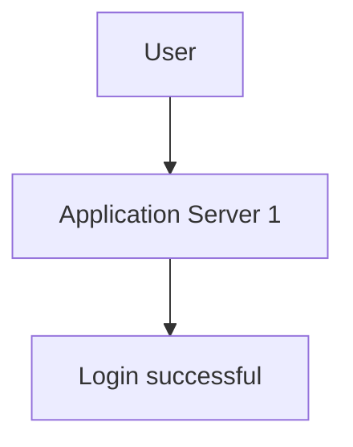

After login, Server 1 stores the user's information in its local memory.

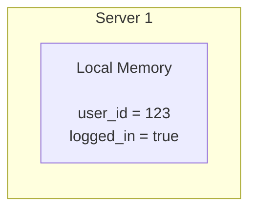

The next request reaches Server 2.

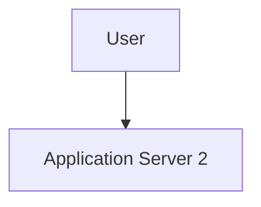

Server 2 has its own memory.

It does not automatically know what Server 1 stored.

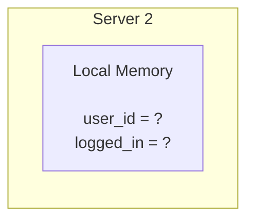

The user's login state is now a problem.

This happens because the application depends on information stored inside a particular application instance.

A stateless design avoids that dependency.

---

# 2. Stateful vs Stateless Application Instances

## Stateful instance

A stateful application instance relies on information held locally between requests.

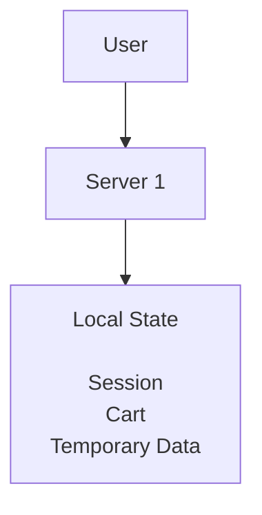

If another server receives the next request, that server may not have the required information.

## Stateless instance

A stateless application instance does not depend on private local state to process a request.

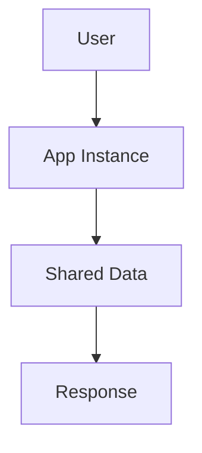

Multiple instances can use the same appropriate state store.

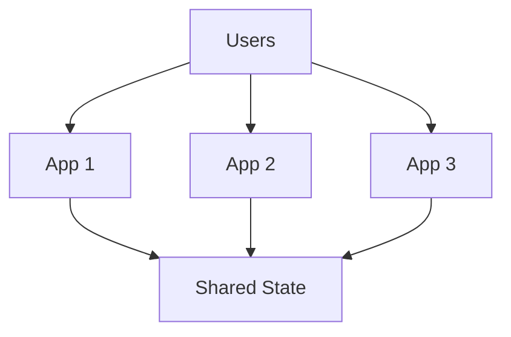

The application instances can be replaced, restarted, or scaled independently without losing essential shared application state.

---

# 3. Stateless Does Not Mean No State

This is the most important clarification.

A stateless application still works with state.

For example, an e-commerce application must remember:

* who the customer is
* which products are in the cart
* which orders have been placed
* which payment has been completed
* which products are in inventory

Without state, these business operations would not make sense.

The distinction is **where the state lives and whether an application instance depends on its own local copy**.

Consider:

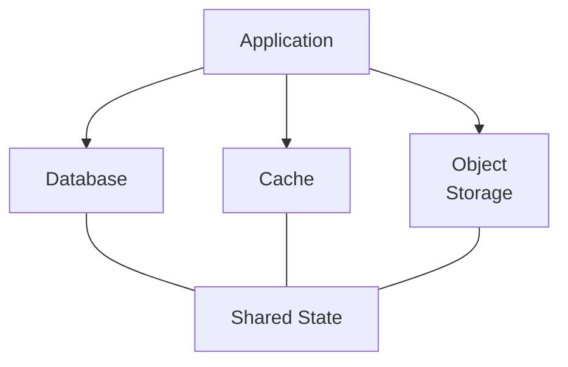

The application can remain stateless while the overall system stores substantial amounts of state.

A useful way to think about it:

| Concept                        | Meaning                                                                   |
| ------------------------------ | ------------------------------------------------------------------------- |
| Stateless application instance | Does not depend on private local state between requests                   |
| Stateful system                | Stores information about users, orders, sessions, and other business data |
| Shared state                   | State accessible to the instances that need it                            |
| Local state                    | State held inside a particular process or machine                         |

**Statelessness is a property of application-instance design, not a claim that the entire system contains no state.**

---

# 4. Why Statelessness Helps Horizontal Scaling

Suppose three application instances exist:

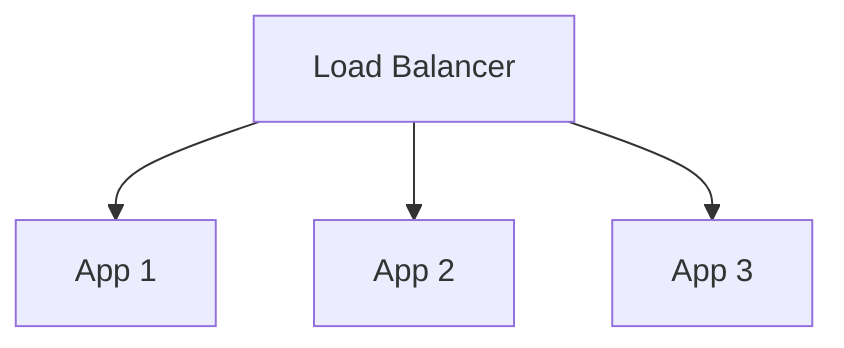

A user sends three requests:

```text
Request 1 → App 1
Request 2 → App 3
Request 3 → App 2
```

If each request contains or can retrieve the information needed to process it, any suitable instance can handle the request.

The system does not need to keep the user permanently attached to App 1.

This gives the load balancer more flexibility.

For example:

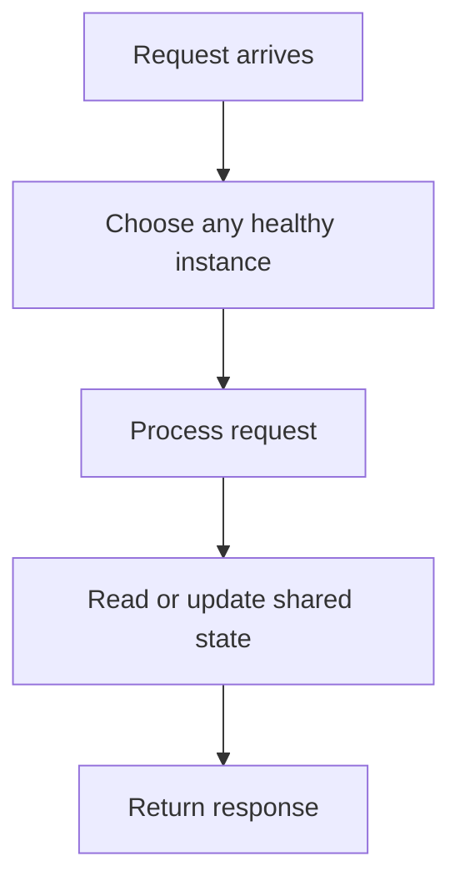

This is the basic relationship:

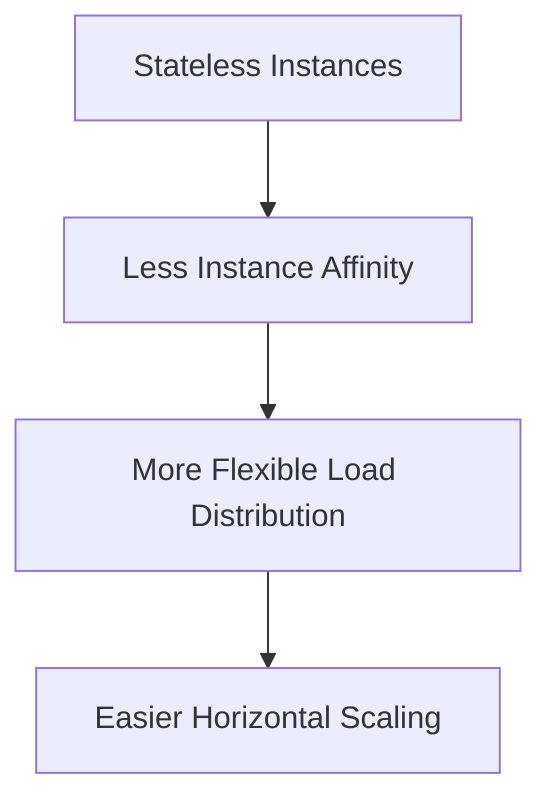

Statelessness does not itself distribute traffic. A load balancer or another request-distribution mechanism is still needed.

---

# 5. The Request Must Have Enough Information

A stateless application instance needs enough information to understand and process each request.

Consider an API request:

```http
GET /api/orders/5001
Authorization: Bearer <access-token>
```

The request identifies the resource being requested and provides authentication information.

The application can:

1. Validate the access token.
2. Identify the authenticated user.
3. Check whether the user may access order 5001.
4. Retrieve the order from the database.
5. Return the response.

The instance does not need to remember which server handled the user's previous request.

The required information comes from the request and the appropriate shared systems.

Important distinction:

**The request does not need to contain the entire application state.**

It only needs enough information for the server to identify the operation and retrieve or validate the relevant state.

---

# 6. Example: Stateless Authentication With Shared Sessions

Let's revisit sessions and cookies from Chapter 01.07.

A traditional session-based application might use:

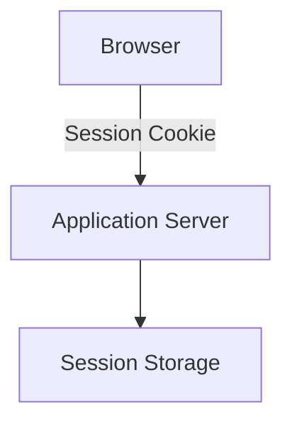

The browser stores a session identifier in a cookie.

The session data is stored on the server side.

For horizontal scaling, the session data can live in a shared session store.

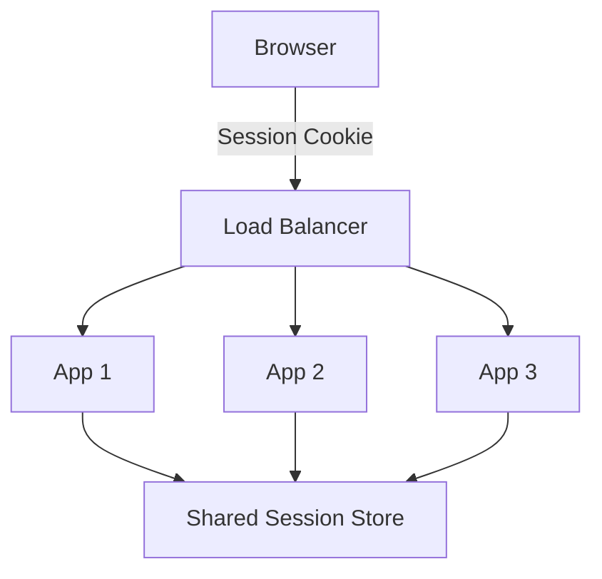

For example:

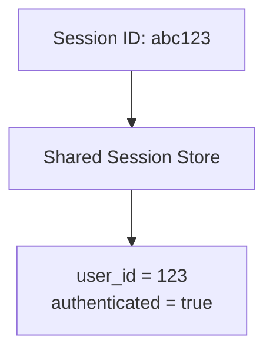

Any application instance can retrieve the session data.

The application instances do not need to keep the authoritative session data in their own memory.

This is a common way to combine server-side sessions with horizontally scaled applications.

The session store itself must be designed to handle the required capacity, availability, and security.

---

# 7. Does Using Cookies Make an Application Stateful?

Not necessarily.

A cookie is a mechanism for storing information in the browser and sending it with requests.

The important question is how the server uses that information.

For example:

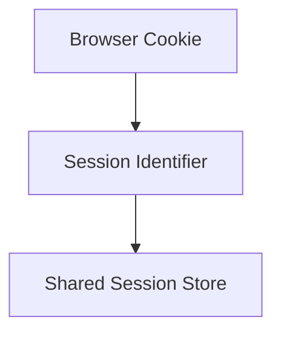

The application can use the session identifier to retrieve shared state.

The cookie does not force the application to store the session locally.

Similarly, a cookie might contain a signed authentication token that the server validates.

Cookies and application statelessness are different concepts.

| Mechanism                    | What it does                                                          |
| ---------------------------- | --------------------------------------------------------------------- |
| Cookie                       | Stores information in the browser and sends it with matching requests |
| Session                      | Represents server-side state associated with a session identifier     |
| Shared session store         | Makes session data accessible across application instances            |
| Stateless application design | Avoids dependence on instance-specific state                          |

---

# 8. Stateless Authentication With Tokens

Another approach uses access tokens.

For example:

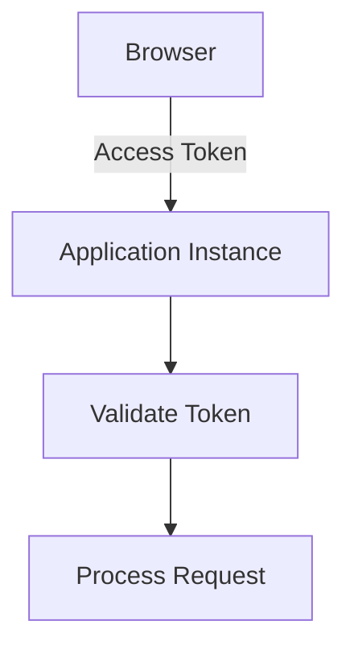

A token may contain or reference information needed to identify the user.

A signed JWT, for example, can carry claims such as:

```json
{
  "sub": "user-123",
  "role": "customer",
  "exp": 1900000000
}
```

This is an illustrative payload, not a complete production token.

An application instance can validate the token's signature and relevant claims without retrieving a server-side login session for every request.

However, several qualifications matter:

* A signed JWT is not automatically encrypted.
* Token validation must include appropriate issuer, audience, expiration, and signature checks.
* Authorization may still require database lookups.
* Revocation and logout can require additional mechanisms.
* A token does not make the entire application stateless.

For example, the application still needs to retrieve the customer's orders from a database.

**Token-based authentication can reduce dependence on shared session state, but it does not eliminate all shared state or security requirements.**

---

# 9. Stateless Authentication Is Not the Same as Stateless Architecture

Consider a token-based application:

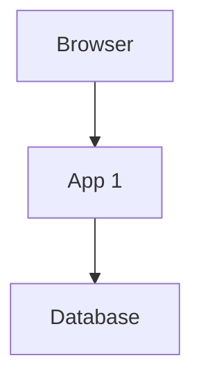

The user authenticates using a token.

But the application may still store:

* shopping carts
* user preferences
* orders
* inventory
* payment records
* job status

These remain stateful data.

The application instance can be stateless even though the system uses databases and other stateful services.

This distinction prevents a common architectural misunderstanding:

> **A stateless authentication mechanism does not automatically make the entire system stateless.**

---

# 10. Example: An E-Commerce Shopping Cart

A shopping cart is a useful example because it contains user-specific state.

Suppose a user adds a product to the cart.

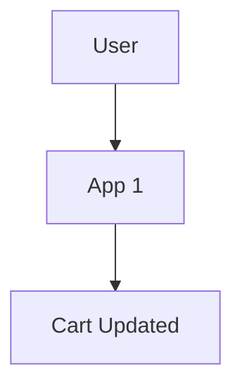

If the cart is stored only in App 1's local memory:

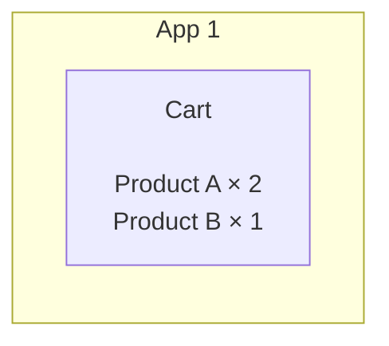

The next request reaches App 2.

App 2 cannot see that cart.

A better approach is to store the cart in a shared system.

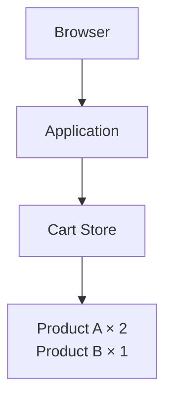

Now:

```text
Add Product → App 1 → Shared Cart Store

View Cart   → App 3 → Shared Cart Store

Checkout    → App 2 → Shared Cart Store
```

Any suitable application instance can process the operation.

The cart state remains available independently of the particular application server.

For a real checkout process, the application must also handle concurrency, price validation, inventory, and transaction boundaries. Sharing the cart alone does not guarantee a correct purchase.

---

# 11. Where Should State Live?

There is no single storage system for every kind of state.

Different types of state have different requirements.

| State                      | Possible Location                                       |
| -------------------------- | ------------------------------------------------------- |
| Customer orders            | Relational database                                     |
| User session               | Shared session store                                    |
| Product cache              | Distributed cache                                       |
| Uploaded images            | Object storage                                          |
| Background job status      | Database or suitable shared store                       |
| Temporary computation data | Local memory, if safe to lose                           |
| Authentication token       | Browser storage or cookie, depending on security design |

The right choice depends on:

* durability requirements
* access patterns
* consistency requirements
* latency
* cost
* security
* availability

For example, a temporary calculation result may not need durable storage.

A completed payment record generally does.

Stateless scaling requires placing state appropriately, not moving every variable into a database.

---

# 12. Local Memory Is Still Useful

Stateless application design does not mean local memory is forbidden.

An application instance can use local memory for:

* temporary calculations
* request-scoped variables
* reusable immutable configuration
* safe, disposable caches
* intermediate processing results

For example:

```mermaid
flowchart TD
  accTitle: Temporary memory within a request
  accDescr: A request reaches an app instance, which reads the request, calculates the result, uses temporary memory and returns a response.
  R["Request"] --> A
  subgraph A["App Instance"]
    direction TB
    A0["Read request"] ~~~ A1["Calculate result"] ~~~ A2["Use temporary memory"] ~~~ A3["Return response"]
  end
```

The problem arises when correctness depends on local memory surviving across requests or being available to another instance.

A useful test is:

> If this application instance disappears right now, will another instance be able to continue handling the user's next request correctly?

If the answer is yes, the design is more suitable for stateless scaling.

---

# 13. Local Caches and Statelessness

Suppose each application instance maintains a local cache.

```text
App 1 → Local Cache 1
App 2 → Local Cache 2
App 3 → Local Cache 3
```

This is not automatically a problem.

Local caches can improve performance.

But each cache may contain different data.

```text
App 1 → Product price = ₹500
App 2 → Product price = ₹550
```

If the data changes, local caches may become inconsistent.

This introduces a cache consistency and invalidation problem.

Possible approaches include:

* short-lived local caches
* shared caches
* invalidation mechanisms
* versioned data
* reading authoritative data when necessary

The appropriate approach depends on how stale the data can safely be.

**Statelessness does not require every cache to be shared. It requires that correctness not depend on an instance-specific cache being present or perfectly synchronized.**

---

# 14. What About Uploaded Files?

Consider a profile image upload.

The application receives:

```text
POST /profile/image
```

App 1 stores the file locally:

```text
App 1
└── uploads/
    └── profile.jpg
```

Later, a request reaches App 3.

App 3 does not have the file.

This creates a problem.

One common architecture is:

```mermaid
flowchart TD
  accTitle: Uploads in object storage
  accDescr: The browser reaches the application, which stores profile.jpg in object storage.
  N0["Browser"] --> N1["Application"] --> N2["Object Storage"] --> N3["profile.jpg"]
```

For example, object storage can hold uploaded images, documents, and other files.

All application instances can refer to the same stored object.

This also makes application instances easier to replace.

However, local storage can still be appropriate for temporary files that are safe to delete and recreate.

---

# 15. Stateless Scaling and Application Restarts

Imagine App 1 crashes.

```mermaid
flowchart TD
  accTitle: An instance fails
  accDescr: The load balancer sends requests to App 1, App 2 and App 3; App 1 has failed.
  L["Load Balancer"] --> A1["App 1<br/>X"] & A2["App 2"] & A3["App 3"]
```

If App 1 contained important session or business state only in its memory, that state may be lost.

If the important state is stored externally:

```mermaid
flowchart TD
  accTitle: Recovering from a crash
  accDescr: App 1 crashes, App 2 handles the next request, reads the required state from shared storage and continues processing.
  N0["App 1 crashes"] --> N1["App 2 handles the next request"] --> N2["Reads required state from shared storage"] --> N3["Continues processing"]
```

This makes instance replacement easier.

But there is an important limitation:

**Stateless application instances do not guarantee that the entire system survives a failure.**

The database, session store, object storage, or other dependencies can still fail.

Statelessness reduces one class of failure; it does not eliminate all failure modes.

---

# 16. Stateless Scaling and Deployment

Suppose a new version of the application must be deployed.

With state stored only inside a particular instance:

```mermaid
flowchart TD
  accTitle: State inside the instance
  accDescr: App 1 holds local state.
  N0["App 1"] --> N1["Local State"]
```

Replacing the instance may destroy information needed by users.

With state stored appropriately outside the instance:

```mermaid
flowchart TD
  accTitle: State outside the instance
  accDescr: The application instance uses shared state.
  N0["Application Instance"] --> N1["Shared State"]
```

the instance can be replaced while the shared data remains.

This supports deployment approaches such as:

* replacing instances
* rolling deployments
* autoscaling
* temporary instance shutdowns
* recovery after crashes

These techniques still require compatibility between application versions and shared data schemas.

For example, a new application version must not unexpectedly break the database schema used by an older version that is still running.

---

# 17. Autoscaling Becomes Easier

Autoscaling means automatically increasing or decreasing the number of instances based on demand or other signals.

A simplified example:

```mermaid
flowchart TD
  accTitle: Low traffic
  accDescr: Low traffic: 2 application instances.
  N0["Low Traffic"] --> N1["2 Application Instances"]
```

Traffic increases:

```mermaid
flowchart TD
  accTitle: High traffic
  accDescr: High traffic: 6 application instances.
  N0["High Traffic"] --> N1["6 Application Instances"]
```

Traffic decreases:

```mermaid
flowchart TD
  accTitle: Low traffic again
  accDescr: Low traffic: back to 2 application instances.
  N0["Low Traffic"] --> N1["2 Application Instances"]
```

Stateless instances are easier to add and remove because they do not depend on their own local state being preserved.

A simplified architecture:

```mermaid
flowchart TD
  accTitle: Autoscaling stateless instances
  accDescr: Traffic reaches a load balancer, which sends requests to App 1, App 2 and App 3, which all use shared state.
  T["Traffic"] --> L["Load Balancer"] --> A0["App 1"] & A1["App 2"] & A2["App 3"]
  A0 & A1 & A2 --> B["Shared State"]
```

When demand increases, new instances can join.

When demand decreases, instances can be removed.

The system still needs to account for graceful shutdown, in-flight requests, connection pools, and downstream capacity.

Autoscaling is not simply starting unlimited application servers.

---

# 18. The Shared Store Can Become the New Bottleneck

Moving state outside application instances solves some problems but creates another architectural dependency.

For example:

```mermaid
flowchart LR
  accTitle: Every instance uses the session store
  accDescr: App 1, App 2, App 3 and App 4 all use the shared session store.
  A1["App 1"] & A2["App 2"] & A3["App 3"] & A4["App 4"] --> S["Shared Session Store"]
```

Now all application instances depend on the session store.

If it becomes overloaded:

```mermaid
flowchart TD
  accTitle: The session store as a bottleneck
  accDescr: Application instances overload the session store, and authentication requests slow down.
  N0["Application instances"] --> N1["Session Store Overloaded"] --> N2["Authentication requests slow down"]
```

The same can happen with databases, caches, and object storage.

Therefore, stateless scaling does not remove the need to scale dependencies.

It changes where the constraints appear.

This is an important architectural principle:

> **Moving state out of application instances makes those instances easier to scale, but the shared state systems must still have sufficient capacity and availability.**

---

# 19. Statelessness and Database Connections

From Chapter 01.12, we know that application instances may maintain database connection pools.

Suppose:

```text
App 1 → Pool of 20 connections
App 2 → Pool of 20 connections
App 3 → Pool of 20 connections
```

If autoscaling increases the application from three instances to ten:

```text
10 instances × 20 connections
= 200 potential connections
```

The application may be stateless, but the database connection demand is not unlimited.

You must consider:

* maximum pool size
* number of instances
* database connection limits
* connection acquisition timeouts
* database capacity
* whether a connection proxy or pooler is appropriate

This is why stateless scaling must be designed across the entire request path.

---

# 20. Sticky Sessions: An Alternative With Trade-offs

A system can sometimes scale horizontally while keeping users attached to particular instances.

For example:

```text
User A → App 1
User B → App 2
User C → App 3
```

Subsequent requests from User A are routed to App 1.

This is called sticky sessions or session affinity.

It can be useful when:

* an existing application depends on local session state
* a migration to shared state is not yet complete
* the workload is relatively predictable

But it has limitations.

### Uneven distribution

Some instances may receive more traffic than others.

### Instance failure

If App 1 fails, its local session state may disappear.

### Reduced flexibility

The load balancer cannot freely route every request to any instance.

### Scaling complications

Removing or replacing an instance can disrupt users attached to it.

Sticky sessions are a possible transitional or workload-specific approach.

They do not provide the same flexibility as applications that do not depend on local session state.

---

# 21. Statelessness and Security

Moving state outside application instances does not automatically make a system secure.

The shared state store must be protected.

For example:

```mermaid
flowchart TD
  accTitle: Protecting the session store
  accDescr: The application uses the shared session store.
  N0["Application"] --> N1["Shared Session Store"]
```

The application must ensure:

* only authorized services can access session data
* session identifiers are sufficiently unpredictable
* cookies use appropriate security attributes
* authentication state is validated
* sensitive data is not exposed through logs
* tokens are validated correctly
* authorization checks occur for protected resources

A stateless application can still contain authentication and authorization vulnerabilities.

Security is a system property, not a consequence of statelessness.

---

# 22. Statelessness and Consistency

Suppose two application instances update the same cart.

```mermaid
flowchart LR
  accTitle: Two instances, one cart
  accDescr: App 1 and App 2 both update the shared cart.
  A1["App 1"] & A2["App 2"] --> S["Shared Cart"]
```

Both instances may read the cart at nearly the same time.

If they update it without appropriate concurrency control, one update may overwrite the other.

For example:

```text
Cart quantity = 1

App 1 reads quantity = 1
App 2 reads quantity = 1

App 1 writes quantity = 2
App 2 writes quantity = 2
```

The expected result might have been quantity 3, but the stored value becomes 2.

This is a race condition.

Possible solutions include:

* database transactions
* atomic updates
* optimistic concurrency control
* appropriate locking
* conflict detection

The specific mechanism depends on the storage system and business operation.

The important point:

> **Stateless application instances do not remove concurrency problems in shared data.**

---

# 23. Statelessness Is Not the Same as Microservices

A stateless application can be a monolith.

For example:

```mermaid
flowchart TD
  accTitle: A modular monolith scaled out
  accDescr: Users reach a load balancer, which sends requests to App 1, App 2 and App 3, which all use one database.
  U["Users"] --> L["Load Balancer"] --> A0["App 1"] & A1["App 2"] & A2["App 3"]
  A0 & A1 & A2 --> B["Database"]
```

Each instance runs the same application.

There is no requirement to split the application into microservices.

Similarly, a microservice can be stateful or stateless depending on its responsibilities and design.

These are separate architectural dimensions:

| Concept            | Question                                                 |
| ------------------ | -------------------------------------------------------- |
| Statelessness      | Does an instance depend on local state between requests? |
| Horizontal scaling | Can workload be distributed across instances?            |
| Microservices      | How is the application divided into services?            |
| Load balancing     | How is traffic distributed?                              |

Do not confuse them.

---

# 24. A Practical Example: Learn Computer Academy Website

Imagine a training institute website.

Initially, it runs on one application server.

```mermaid
flowchart TD
  accTitle: The academy website today
  accDescr: Visitors reach one application serving course pages, enquiry forms and student login.
  V["Visitors"] --> A
  subgraph A["One Application"]
    direction TB
    A0["Course Pages"] ~~~ A1["Enquiry Forms"] ~~~ A2["Student Login"]
  end
```

As traffic grows, the application is deployed to multiple instances.

```mermaid
flowchart TD
  accTitle: The academy website scaled out
  accDescr: Visitors reach a load balancer, which sends requests to App 1, App 2 and App 3, which all use one database.
  V["Visitors"] --> L["Load Balancer"] --> A0["App 1"] & A1["App 2"] & A2["App 3"]
  A0 & A1 & A2 --> B["Database"]
```

Course pages can be served by any application instance.

Enquiry submissions can be stored in the shared database.

Student sessions can use a shared session store or another appropriate authentication mechanism.

Uploaded documents can be placed in shared or object storage.

Now any healthy instance can process the next request without depending on private local state.

If App 2 is removed, the remaining instances can continue serving requests, assuming the load-distribution mechanism and dependencies remain healthy.

The architecture is more flexible.

But the database, session store, and file storage still require appropriate capacity, security, and availability.

---

# 25. How to Evaluate Whether an Application Is Stateless Enough

Ask these questions:

| Question                                              | What to Look For                                             |
| ----------------------------------------------------- | ------------------------------------------------------------ |
| Does login depend on one server's memory?             | If yes, local session state is a dependency                  |
| Are uploaded files stored only on one instance?       | If yes, other instances may not find them                    |
| Does a request require previous-request memory?       | If yes, the instance may be stateful                         |
| Can another instance retrieve the required data?      | If yes, the dependency may be shared appropriately           |
| Can an instance restart without losing business data? | Essential data should not exist only in local process memory |
| Can instances be added or removed independently?      | This is a useful sign of stateless scaling readiness         |

A useful practical test:

1. Start two application instances.
2. Send a request to the first instance.
3. Send the next request to the second instance.
4. Verify that the user workflow still works correctly.
5. Stop the first instance.
6. Verify that another healthy instance can continue handling eligible requests.

This does not prove the whole system is production-ready, but it helps expose hidden instance-specific dependencies.

---

# 26. The Trade-off: Local Simplicity vs Shared Infrastructure

Consider two approaches.

| Local State                                   | Shared State                                |
| --------------------------------------------- | ------------------------------------------- |
| Simple to access                              | Accessible across instances                 |
| Often very fast                               | May introduce network latency               |
| Tied to instance lifetime                     | Can survive instance replacement if durable |
| Easy to lose during restart                   | Requires its own availability design        |
| No shared-store infrastructure for that state | Adds infrastructure and operational cost    |

A good architecture does not move every variable into a remote database.

Instead:

* keep temporary computation local
* keep durable business data in appropriate durable storage
* keep shared session data in a suitable session store
* use caches where their consistency properties are acceptable
* use object storage for suitable files

The goal is to separate instance-specific computation from the state that must survive or be shared.

---

# Key Principles

1. **Stateless application instances do not depend on private local state between requests.**

2. **Statelessness does not mean the entire system has no state.**

3. **Shared databases, caches, session stores, and object storage can make state accessible across instances.**

4. **Statelessness allows requests to reach different healthy application instances.**

5. **Cookies and sessions do not automatically make an application stateful; the storage and validation design matters.**

6. **Token-based authentication does not automatically make the entire system stateless.**

7. **Local memory and temporary files are acceptable when correctness does not depend on their survival or availability to another instance.**

8. **Shared state systems become dependencies that must be designed for capacity, availability, security, and consistency.**

9. **Statelessness helps with autoscaling, deployment, and instance replacement, but does not guarantee high availability.**

10. **Stateless design is useful for monoliths as well as microservices.**

---

# Quick Reference

| Concept                        | Meaning                                                              |
| ------------------------------ | -------------------------------------------------------------------- |
| Stateless application instance | Can process eligible requests without relying on private local state |
| Stateful application instance  | Depends on locally maintained state across requests                  |
| Shared state                   | State accessible to multiple instances                               |
| Session store                  | Stores server-side session information                               |
| Token-based authentication     | Uses a token to convey or reference authentication information       |
| Sticky sessions                | Routes a user's requests toward the same instance                    |
| Local cache                    | Cache maintained inside an application instance                      |
| Object storage                 | Shared storage suitable for files and objects                        |
| Autoscaling                    | Automatically adjusts the number of instances                        |
| Instance affinity              | Dependence on a particular application instance                      |
| Race condition                 | Outcome depends on the timing of concurrent operations               |

---

# Knowledge Check

### 1. What does stateless application design mean?

**Answer:**
An application instance can handle eligible requests without depending on private local state from previous requests.

### 2. Does a stateless application have no state?

**Answer:**
No. Business data, sessions, orders, and other state can exist in shared storage.

### 3. Why does statelessness help horizontal scaling?

**Answer:**
Requests can be handled by different healthy instances without requiring the user's previous instance to retain private state.

### 4. Can a cookie-based application be stateless?

**Answer:**
Yes. For example, a cookie can carry a session identifier that any instance uses to retrieve session data from a shared store.

### 5. Does using JWT automatically make the entire system stateless?

**Answer:**
No. The application may still depend on databases, shared state, authorization lookups, and other services.

### 6. Why can local file uploads become a problem?

**Answer:**
A different instance may not have access to the file stored on the first instance's local filesystem.

### 7. What is the main limitation of sticky sessions?

**Answer:**
They tie requests to particular instances, reducing routing flexibility and potentially causing problems when an instance fails.

### 8. Can a stateless application still have race conditions?

**Answer:**
Yes. Multiple instances can concurrently modify shared data, requiring appropriate concurrency control.

### 9. Does statelessness guarantee high availability?

**Answer:**
No. Shared dependencies, traffic routing, health checks, and failure handling must also be designed.

### 10. Must a stateless application use microservices?

**Answer:**
No. A monolithic application can be stateless and horizontally scaled.

---

# Systemly Mental Model

```mermaid
flowchart TD
  accTitle: Production mental model
  accDescr: An incoming request reaches any healthy app, which identifies the operation, retrieves the required state, processes the request and returns a response.
  N0["Incoming Request"] --> N1["Any Healthy App"] --> N2["Identify Operation"] --> N3["Retrieve Required State"] --> N4["Process Request"] --> N5["Return Response"]
```

The complete scaling model:

```mermaid
flowchart TD
  accTitle: Systemly mental model
  accDescr: A growing workload: add application instances, distribute requests, keep essential state accessible, scale shared dependencies, measure new bottlenecks and repeat.
  N0["Growing Workload"] --> N1["Add Application Instances"] --> N2["Distribute Requests"] --> N3["Keep Essential State Accessible"] --> N4["Scale Shared Dependencies"] --> N5["Measure New Bottlenecks"] --> N6["Repeat"]
```

**The central lesson:**

A scalable application does not need every request to return to the same machine. It needs a design in which any suitable instance can process the request using the information and resources available to the system.

That is what makes stateless scaling such an important foundation for horizontally scaled applications.
