# 02.05 — Reverse Proxy

## Learning Objectives

By the end of this chapter, you will be able to:

* Explain what a proxy is and distinguish a forward proxy from a reverse proxy.
* Understand how a reverse proxy sits between clients and application servers.
* Trace an HTTP request through a reverse proxy.
* Explain TLS termination, request routing, forwarding headers, and backend protection.
* Distinguish a reverse proxy from a load balancer and an API gateway.
* Identify the benefits, limitations, and failure points of introducing a reverse proxy.

---

# 1. The Problem: Clients Need to Reach Your Application

Imagine you build an online store.

Your application runs on a server:

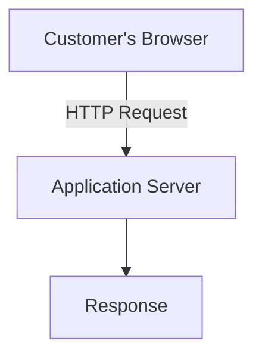

Initially, this is simple. The browser sends a request directly to your application server, and the server responds.

But as the application grows, several questions appear:

* Should customers connect directly to the application server?
* Who handles HTTPS certificates?
* How do you route `/api` requests differently from `/assets` requests?
* How can you hide internal server addresses?
* Where should common HTTP configuration live?
* How can you change backend servers without changing the public-facing address?

One solution is to introduce a **reverse proxy**.

# 2. What Is a Proxy?

A proxy is an intermediary that communicates on behalf of another party.

Instead of two systems communicating directly, a third system receives or forwards communication between them.

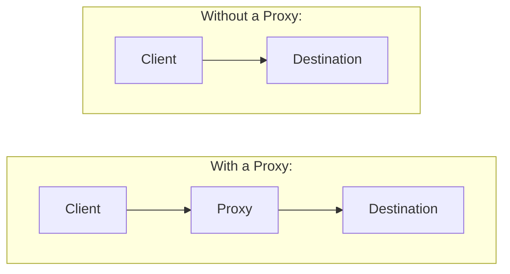

The proxy receives a request, performs its assigned work, and communicates with the destination.

There are two common types of HTTP proxies:

1. Forward proxy
2. Reverse proxy

They both act as intermediaries, but they represent different sides of the communication.

# 3. Forward Proxy vs Reverse Proxy

## 3.1 Forward Proxy

A forward proxy acts on behalf of the client.

For example, an organization may configure its employees' computers to access the internet through a company proxy.

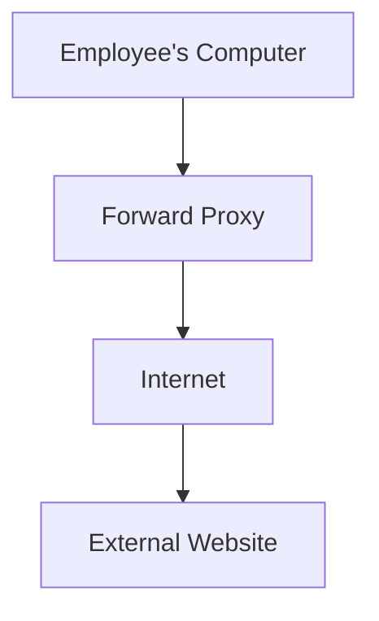

The external website receives the request from the proxy rather than connecting directly to the employee's computer.

A forward proxy may be used for:

* Centralized internet access.
* Filtering or restricting outbound requests.
* Applying organizational access policies.
* Caching certain responses.
* Controlling how internal clients access external resources.

The key idea is:

**A forward proxy represents the client.**

The client is aware of, or configured to use, the proxy.

## 3.2 Reverse Proxy

A reverse proxy acts on behalf of one or more backend servers.

Customers connect to the reverse proxy, which communicates with the appropriate backend.

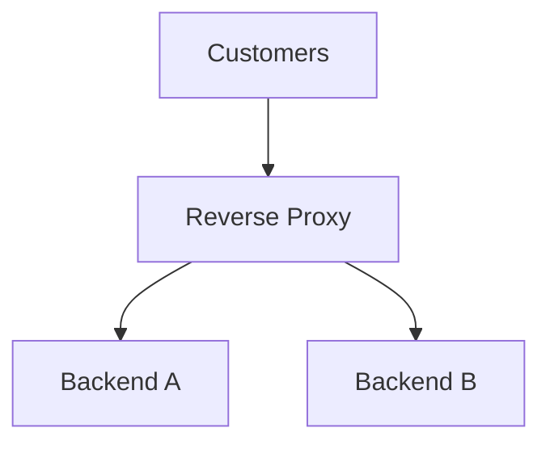

From the customer's perspective, the reverse proxy is the public-facing destination.

The backend servers do not need to be directly exposed to the public internet.

A reverse proxy can:

* Receive incoming HTTP requests.
* Decide which backend should receive each request.
* Forward requests to backend servers.
* Receive backend responses.
* Return those responses to clients.

**The key idea: A reverse proxy represents the server side.**

It accepts requests on behalf of the backend application.

## Quick Comparison

| Feature        | Forward Proxy           | Reverse Proxy                         |
| -------------- | ----------------------- | ------------------------------------- |
| Represents     | Client                  | Backend server                        |
| Main direction | Outbound client traffic | Incoming application traffic          |
| Common use     | Control client access   | Manage access to backend applications |
| Example        | Company internet proxy  | Nginx in front of an application      |

Remember: Both are proxies. The difference is whose communication they handle.

# 4. How a Reverse Proxy Works

Let's trace a request to an online store.

The public domain is:

`shop.example.com`

The application runs on an internal server.

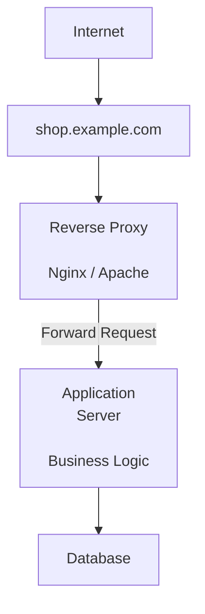

The browser communicates with the reverse proxy. The proxy forwards the request to the application server, which executes the business logic.

The application sends a response back through the proxy.

## Step-by-Step Request Flow

Suppose a customer opens:

`https://shop.example.com/products`

### Step 1: The browser resolves the domain

The browser uses DNS to find the IP address associated with `shop.example.com`.

The returned address points to the public-facing infrastructure, which may be a reverse proxy, a load balancer, or a managed edge service.

DNS does not normally need to expose the private address of the application server.

### Step 2: The browser establishes a connection

The browser connects to the public endpoint and establishes HTTPS according to the endpoint's configuration.

The reverse proxy receives the incoming connection.

### Step 3: The reverse proxy examines the request

The proxy can inspect information such as:

* The requested hostname.
* The URL path.
* The HTTP method.
* Selected request headers.

For example:

```http
GET /products HTTP/1.1
Host: shop.example.com
```

The proxy uses its configuration to determine how to handle the request.

### Step 4: The proxy forwards the request

The proxy sends the request to the appropriate backend application server.

For example:

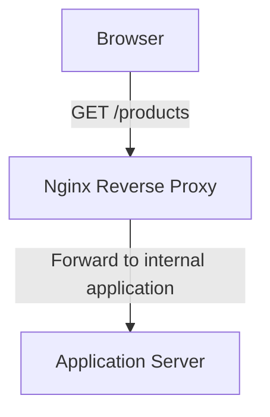

The backend processes the request and may query the database.

### Step 5: The backend returns a response

The application server generates an HTTP response:

```http
HTTP/1.1 200 OK
Content-Type: text/html
```

The response travels back to the reverse proxy.

### Step 6: The proxy responds to the browser

The reverse proxy sends the response to the client.

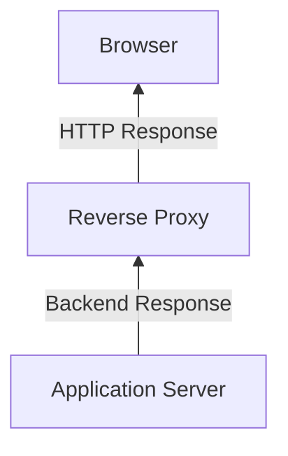

The browser receives the response without needing to know the internal topology of the application.

The proxy may also modify or process parts of the response, depending on its configuration.

# 5. What Can a Reverse Proxy Do?

A reverse proxy is not merely a pipe that forwards requests. It can perform several infrastructure responsibilities.

## 5.1 Hide Backend Servers

Suppose your application runs on:

```text
10.0.1.20:3000
```

This is a private internal address.

Instead of allowing customers to connect directly to that address, expose:

```text
https://shop.example.com
```

The reverse proxy forwards requests internally.

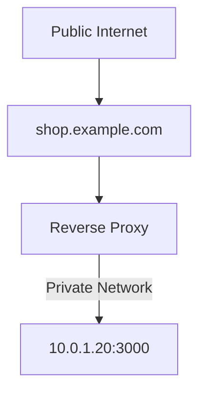

This provides an architectural boundary between public traffic and internal application infrastructure.

However, hiding an IP address is not a complete security solution. Backend servers should also use network restrictions, authentication where appropriate, and secure configurations.

## 5.2 Route Requests Based on Hostname or Path

A reverse proxy can send different requests to different backend services.

For example:

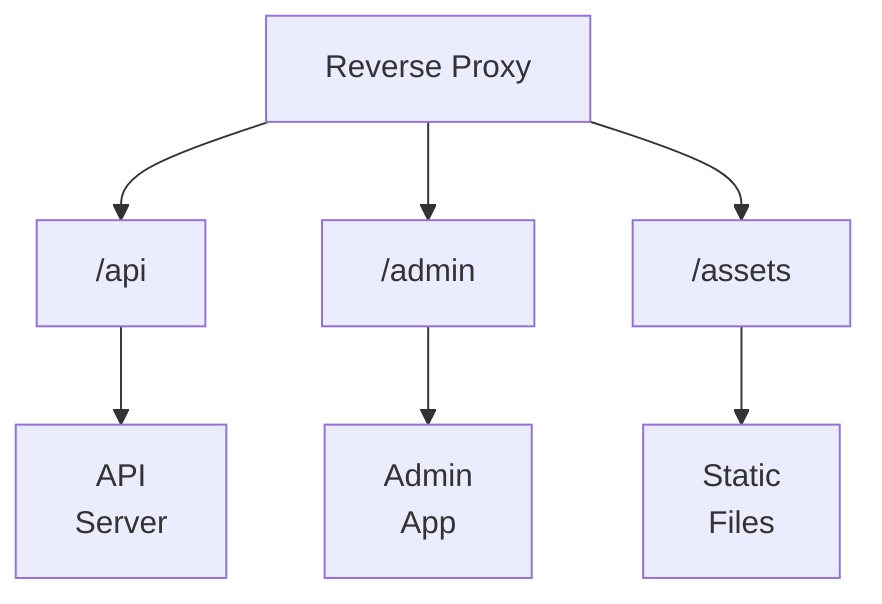

A hostname-based configuration might route:

```text
shop.example.com      -> Store Application
admin.example.com     -> Admin Application
api.example.com       -> API Application
```

A path-based configuration might route:

```text
shop.example.com/          -> Frontend
shop.example.com/api/      -> Backend API
shop.example.com/uploads/  -> File service
```

This is useful when several applications or services share one public endpoint.

The proxy makes routing decisions using its configured rules. It does not automatically understand the business meaning of every URL.

## 5.3 Serve Static Files

A web application often contains static resources:

* CSS files.
* JavaScript files.
* Images.
* Fonts.
* Public documents.

A reverse proxy such as Nginx can serve suitable static files directly instead of forwarding every request to the application runtime.

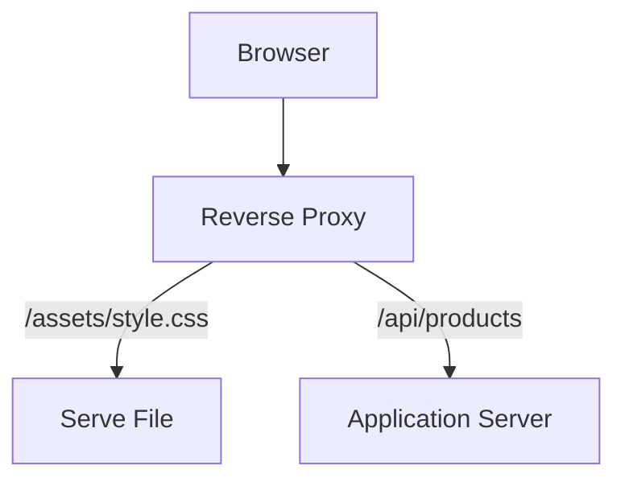

This can reduce application-server work.

It is especially useful when the application runtime is primarily responsible for dynamic business logic.

The reverse proxy must be configured carefully so that private files or application source code are not accidentally exposed.

## 5.4 Handle HTTPS and TLS Termination

TLS protects communication by providing encryption and integrity, with server authentication through certificates.

A reverse proxy can handle the public HTTPS connection.

This is commonly called **TLS termination**.

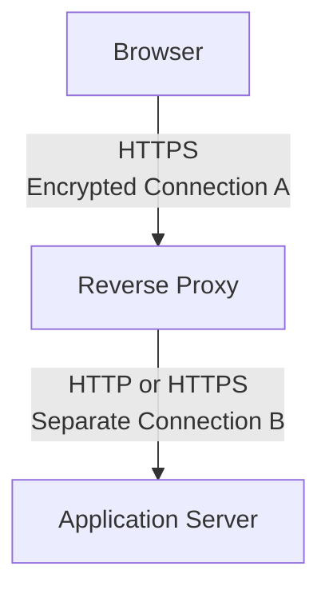

The reverse proxy decrypts the incoming HTTPS traffic so it can process the HTTP request.

The connection from the proxy to the backend is a separate connection.

There are two common arrangements:

| Arrangement                         | Client to Proxy | Proxy to Backend |
| ----------------------------------- | --------------- | ---------------- |
| TLS termination with HTTP upstream  | HTTPS           | HTTP             |
| TLS termination with HTTPS upstream | HTTPS           | HTTPS            |

In the second arrangement, the proxy establishes a separate encrypted connection to the backend.

This is often called TLS re-encryption or TLS bridging.

### Important Security Distinction

If the proxy forwards requests to the backend using plain HTTP, the proxy-to-backend traffic is not encrypted by TLS.

This may be acceptable in some tightly controlled environments, but it should be a deliberate decision based on network boundaries and security requirements.

For sensitive systems, encrypting traffic between infrastructure components may be necessary, even inside a private network.

TLS termination does not automatically mean that every connection in the architecture is encrypted.

## 5.5 Forward Client Information

When a reverse proxy forwards a request, the backend may see the proxy's IP address as the network peer.

But the application may need information about the original client.

For example:

* Logging the client IP.
* Generating absolute URLs.
* Understanding whether the original request used HTTPS.
* Applying security rules based on trusted client information.

The proxy can forward headers such as:

```http
Host: shop.example.com
X-Forwarded-For: 203.0.113.25
X-Forwarded-Proto: https
X-Forwarded-Host: shop.example.com
```

These headers communicate information about the original request.

`X-Forwarded-For` commonly carries the original client IP or a chain of proxy addresses.

`X-Forwarded-Proto` indicates the protocol used by the client-facing request.

`X-Forwarded-Host` carries the original host requested by the client.

The exact behavior depends on proxy configuration and the application's trusted-proxy settings.

### Security Warning: Do Not Trust Arbitrary Forwarded Headers

A client can send HTTP headers itself.

For example, a malicious client could attempt to send a fake `X-Forwarded-For` value.

If the backend blindly trusts that value, it may record an incorrect IP address or make incorrect security decisions.

A safer design is:

1. Accept forwarded client information only from known, trusted proxies.
2. Configure the trusted proxy chain explicitly.
3. Ensure the proxy overwrites or sanitizes untrusted incoming forwarding headers as appropriate.
4. Do not use an arbitrary client-supplied header as proof of identity or authorization.

Forwarded headers are metadata, not authentication credentials.

## 5.6 Apply Common HTTP Handling

A reverse proxy can also handle certain infrastructure-level tasks:

| Responsibility             | Purpose                                    |
| -------------------------- | ------------------------------------------ |
| Compression                | Reduce the size of suitable responses      |
| Buffering                  | Temporarily hold request or response data  |
| Request size limits        | Reject oversized requests                  |
| Timeouts                   | Limit how long certain operations may wait |
| Connection handling        | Manage client and upstream connections     |
| Basic traffic restrictions | Apply configured request rules             |

These capabilities depend on the proxy and its configuration.

A reverse proxy can be one place to apply common HTTP behavior instead of implementing every infrastructure concern independently in every application.

However, proxy-level controls do not replace application-level validation, authorization, or business rules.

# 6. Reverse Proxy vs Load Balancer

These terms are related, but they do not mean exactly the same thing.

A **reverse proxy** is an intermediary that receives requests on behalf of backend servers.

A **load balancer** distributes incoming work across multiple backend instances or destinations.

A reverse proxy can also perform load balancing.

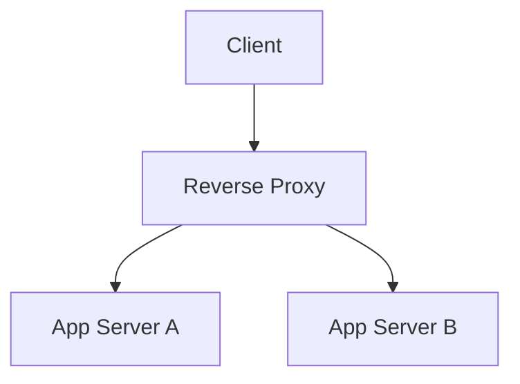

In this example, the reverse proxy forwards requests to different application instances.

If it selects backends according to a distribution policy, it is also performing a load-balancing function.

But a reverse proxy does not have to distribute traffic across multiple servers.

It can forward every request to one backend.

Likewise, load balancing is a function that can be implemented by a reverse proxy, a dedicated appliance, a cloud service, or another infrastructure component.

## Comparison

| Question                       | Reverse Proxy                     | Load Balancer                                                            |
| ------------------------------ | --------------------------------- | ------------------------------------------------------------------------ |
| Main role                      | Intermediary for backend services | Distribute traffic across destinations                                   |
| Can work with one backend?     | Yes                               | Yes, though distribution benefits require multiple eligible destinations |
| Can route by hostname or path? | Commonly                          | Depends on the load balancer's capabilities                              |
| Can terminate TLS?             | Commonly                          | Many can                                                                 |
| Must distribute traffic?       | No                                | Distribution is its defining purpose                                     |

### Mental Model

Think of reverse proxy as a role in the architecture and load balancing as a traffic-distribution function.

One product or service can perform both.

Detailed load-balancing algorithms are covered in Chapter 02.07.

# 7. Reverse Proxy vs API Gateway

An API gateway is an API-focused entry point that can manage how API requests reach backend services.

It may provide capabilities such as:

* API routing.
* Authentication and authorization integration.
* API-specific rate limits and quotas.
* Request and response transformation.
* API version management.
* API usage policies and analytics.

A reverse proxy can provide some of these capabilities, depending on its configuration and extensions.

An API gateway is generally a more API-policy-oriented architectural role.

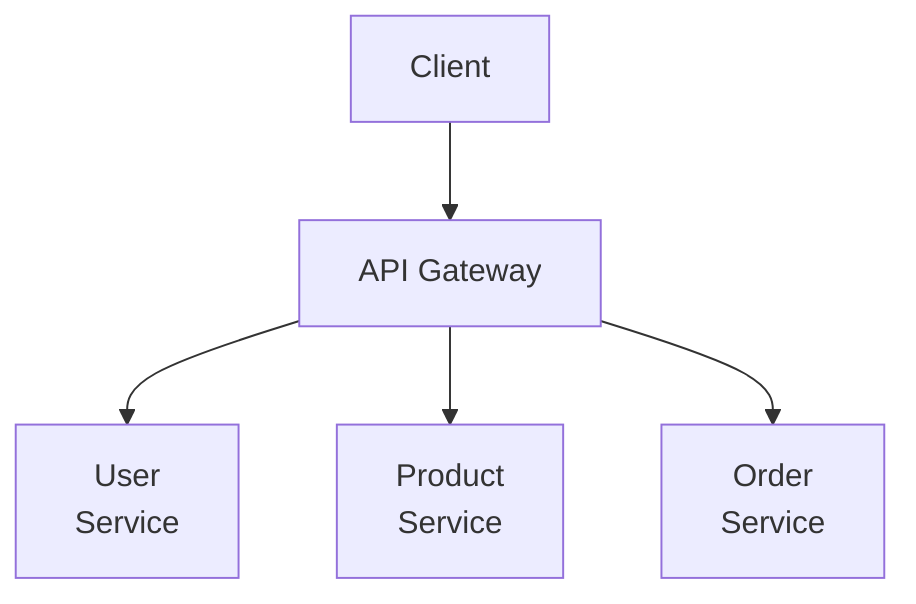

An API gateway is often implemented using reverse-proxy behavior, but not every reverse proxy is an API gateway.

For example, a simple Nginx configuration that forwards `/api` to a Node.js server is acting as a reverse proxy.

It does not automatically become a full API gateway simply because the backend exposes an API.

API gateways are discussed in Level 7.

# 8. Where Does the Reverse Proxy Fit?

Let's connect the concept to the application architecture you have already studied.

Consider a simple web application:

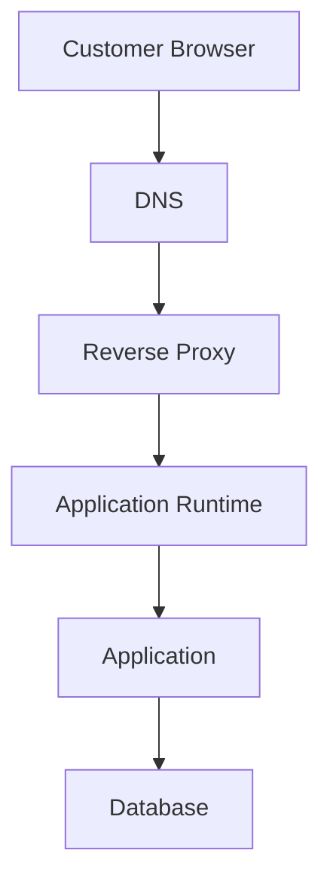

Each component has a different responsibility.

| Component           | Responsibility                                   |
| ------------------- | ------------------------------------------------ |
| DNS                 | Resolves the public domain to an IP address      |
| Reverse proxy       | Receives and forwards HTTP requests              |
| Application runtime | Provides the environment to execute backend code |
| Application         | Implements business logic                        |
| Database            | Stores persistent application data               |

These responsibilities can be implemented using separate machines, separate processes, managed services, or combinations of them.

They do not necessarily require one physical server per component.

For example, Nginx and a Node.js application may run on the same machine during development or in a small deployment.

In production, they may run on separate infrastructure.

**An architectural box represents a responsibility, not necessarily a separate machine.**

# 9. Reverse Proxy and Stateless Scaling

In Chapter 02.04, you learned that stateless application instances can handle requests independently.

A reverse proxy can provide a stable public entry point while backend instances change.

Consider this architecture:

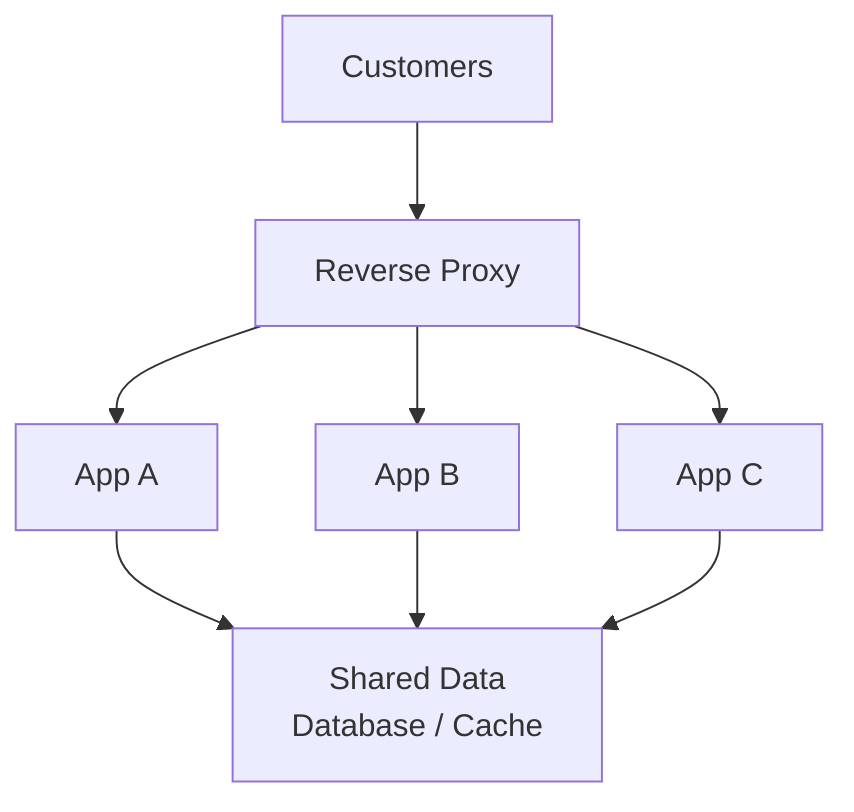

The reverse proxy forwards requests to available backend instances according to its configuration.

If application instances are stateless, a request can generally be handled by any suitable healthy instance, subject to the application's other dependencies and consistency requirements.

This makes the backend easier to scale horizontally.

However, introducing a reverse proxy does not itself make an application stateless.

If an application depends on local session memory or local files, the architecture still has state-management problems.

The reverse proxy cannot automatically solve those problems.

## What Happens When an Instance Fails?

Suppose App B becomes unavailable.

The reverse proxy or the infrastructure in front of it needs a way to avoid sending new requests to that failed instance.

This may involve health checks, connection errors, or integration with an external load balancer or orchestration platform.

A reverse proxy with suitable configuration can route traffic to other available instances.

But failover behavior is not automatic in every configuration. It depends on the proxy's capabilities and how health, timeouts, and upstream failures are handled.

Also, a request already being processed by a failed instance may still fail. Routing a later request to another server does not guarantee that the original operation completed successfully.

For example, if a payment request fails halfway through, the application may need idempotency and transaction handling to determine whether it is safe to retry.

# 10. The Reverse Proxy Can Become a Bottleneck

A reverse proxy sits on the request path.

That means traffic passing through it consumes its resources.

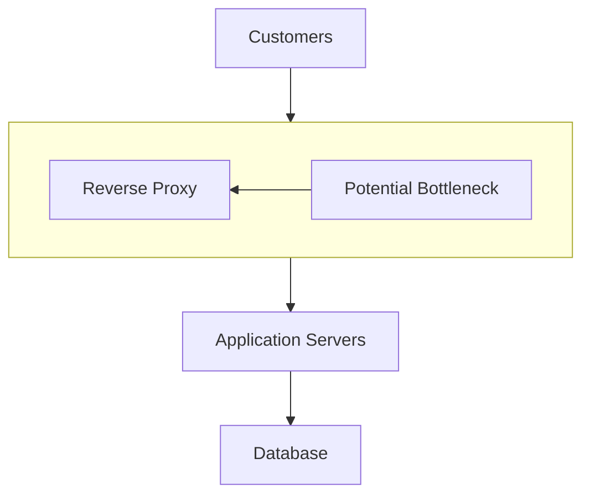

The proxy itself needs sufficient capacity for:

* Network throughput.
* Concurrent connections.
* TLS processing, if it terminates TLS.
* Request and response buffering.
* Memory and CPU usage.
* The number of connections to backend services.

If the proxy reaches its resource limits, requests may become slow or fail even when the application servers have spare capacity.

This is an example of a bottleneck moving through a system.

You may scale the application servers, only to discover that the proxy or database is now the limiting component.

## Is the Reverse Proxy a Single Point of Failure?

It can be.

If your architecture has only one reverse proxy and that proxy fails, customers may lose access to the application.

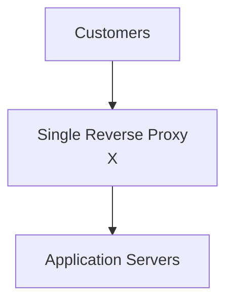

Even if the application servers are healthy, the public request path is broken.

Possible approaches include:

* Running redundant proxy instances.
* Using a managed reverse-proxy or load-balancing service.
* Deploying across appropriate failure domains.
* Monitoring proxy health and capacity.

The exact design depends on availability requirements, traffic, budget, and operational complexity.

Adding redundancy also introduces more infrastructure to configure and operate.

For a small application, a managed entry point may be simpler than operating a complex proxy cluster yourself.

# 11. Timeouts, Buffering, and Long Requests

A reverse proxy introduces another network and processing layer.

A request may involve several separate time limits:

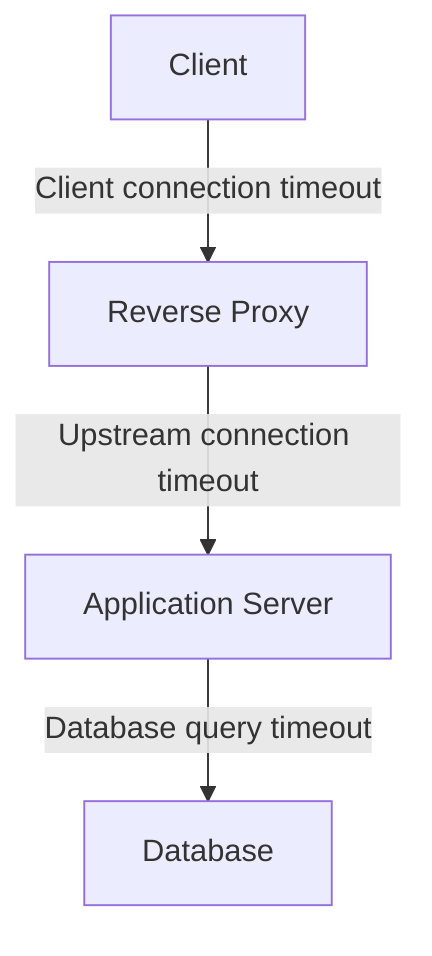

These timeouts have different meanings.

* Client-side timeout: how long the client waits for a response or connection.
* Proxy upstream connection timeout: how long the proxy waits to establish a backend connection.
* Proxy response/read timeout: how long the proxy waits for backend data, according to its configuration.
* Database query timeout: how long the database operation is allowed to run.

A proxy timeout does not necessarily cancel the underlying application or database operation immediately.

For example, the proxy might stop waiting for a slow backend while the backend continues executing a database query.

This can waste resources and increase load.

Timeouts should therefore be designed across the request path, not configured as unrelated numbers.

Buffering also matters.

A proxy may buffer some request or response data before forwarding it. This can improve connection handling, but it may consume memory or disk resources and affect streaming behavior.

For large uploads, downloads, or streaming responses, proxy buffering settings may change the application's behavior and resource usage.

These are configuration decisions that should reflect the workload.

# 12. Practical Example: Learn Computer Academy Website

Imagine Learn Computer Academy runs a website with:

```text
learncomputer.in/
learncomputer.in/courses/
learncomputer.in/api/enquiries/
learncomputer.in/uploads/
```

A possible architecture:

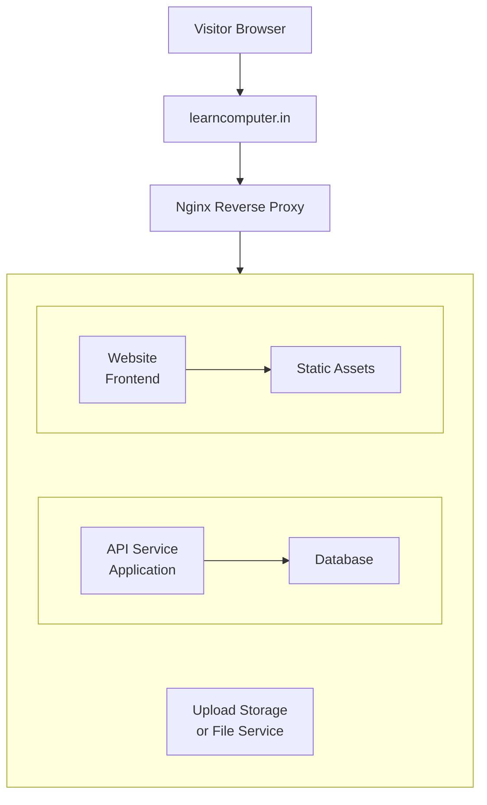

The proxy could be configured to:

* Serve public CSS, JavaScript, and image files.
* Forward enquiry API requests to the backend application.
* Forward website requests to the appropriate frontend or application.
* Handle public HTTPS.
* Pass trusted original-request information to the backend.

This is only one possible design. A WordPress website, for example, may use Nginx or Apache in front of PHP-FPM, with WordPress and its database behind that web-server layer.

The reverse proxy does not replace WordPress, PHP, or the database. It handles a different responsibility in the request path.

The appropriate setup depends on hosting, traffic, security requirements, and the capabilities of the hosting provider.

# 13. Common Mistakes

| Mistake                                                    | Why It Is a Problem                                                  |
| ---------------------------------------------------------- | -------------------------------------------------------------------- |
| Assuming every reverse proxy is a load balancer            | A proxy can forward everything to one backend                        |
| Assuming TLS termination encrypts proxy-to-backend traffic | The upstream connection may use plain HTTP                           |
| Trusting any `X-Forwarded-For` header                      | Clients can supply forged header values                              |
| Assuming a private backend is automatically secure         | Private networks still need access controls and secure communication |
| Assuming the proxy makes an application stateless          | Local sessions and files may still create instance dependencies      |
| Assuming adding a proxy always improves performance        | It adds processing, connections, and potential bottlenecks           |
| Assuming a failed request can always be retried safely     | The backend may have already performed the operation                 |

# 14. Key Principles

1. A reverse proxy receives requests on behalf of backend servers and forwards them according to its configuration.
2. A forward proxy represents clients; a reverse proxy represents backend services.
3. A reverse proxy can provide routing, TLS termination, static file serving, and common HTTP handling.
4. A reverse proxy can perform load balancing, but reverse proxy and load balancer describe different responsibilities.
5. TLS termination creates separate client-facing and backend-facing connection legs.
6. Forwarded headers must be trusted only when they come through correctly configured trusted proxies.
7. A reverse proxy can simplify backend exposure, but it does not replace application security.
8. A proxy is part of the request path and must be considered in capacity, availability, and timeout design.

# 15. Quick Reference

| Term              | Meaning                                                           |
| ----------------- | ----------------------------------------------------------------- |
| Proxy             | An intermediary communicating on behalf of another party          |
| Forward proxy     | Proxy that represents the client                                  |
| Reverse proxy     | Proxy that receives requests on behalf of backend servers         |
| Upstream          | A backend destination to which the proxy forwards requests        |
| TLS termination   | Ending the client-facing TLS connection at the proxy              |
| TLS re-encryption | Establishing a separate TLS connection from proxy to backend      |
| Forwarded headers | Headers carrying information about the original request or client |
| Load balancer     | Component or service that distributes traffic across destinations |
| API gateway       | API-focused entry point that applies API routing and policies     |

# 16. Knowledge Check

Try answering these before moving to the next chapter.

**1.** A company configures employee browsers to send internet traffic through a central proxy. Is this a forward proxy or a reverse proxy?

**2.** A reverse proxy forwards every request to a single Node.js application. Is it still a reverse proxy even though there are no multiple backend servers?

**3.** A reverse proxy terminates HTTPS and forwards requests to a backend using HTTP. Which connection is encrypted by TLS?

**4.** Why should an application not blindly trust `X-Forwarded-For` values supplied in requests?

**5.** Your application has four healthy backend instances, but customers cannot access the website because the only reverse proxy has failed. What architectural weakness does this demonstrate?

**6.** Does introducing a reverse proxy automatically make a stateful application safe to scale horizontally? Explain why or why not.

## Answers

1. Forward proxy. It represents the client when accessing external destinations.
2. Yes. A reverse proxy does not require multiple backends.
3. The client-to-proxy connection. The proxy-to-backend connection is separate and is not TLS-encrypted unless HTTPS is configured there too.
4. Because clients can forge the header unless a trusted proxy overwrites or sanitizes it and the application trusts only known proxies.
5. The reverse proxy is a single point of failure.
6. No. Application-local sessions, files, or other state can still create dependencies on a particular instance.

# Final Mental Model

A reverse proxy is the public-facing intermediary between clients and backend applications.

It provides a controlled entry point, forwards requests to appropriate destinations, and can handle common HTTP and connection responsibilities.

It can work with one backend or many. It can also perform load balancing, but it does not automatically solve application state, backend security, availability, or scaling.

**Understand the responsibility first. Then decide whether a reverse proxy, a load balancer, a managed service, or a combination belongs in your architecture.**
