# 02.06 — Load Balancer

## Learning Objectives

By the end of this chapter, you will be able to:

* Explain why load balancers exist and what problem they solve.
* Understand how a load balancer distributes requests across backend servers.
* Distinguish a load balancer from a reverse proxy.
* Understand Layer 4 and Layer 7 load balancing.
* Explain health checks, backend pools, and traffic distribution.
* Identify common load-balancing strategies and their trade-offs.
* Understand how load balancing affects scaling, availability, and system capacity.

---

# 1. The Problem: One Server Has Limits

Imagine you are building an online store.

Initially, one application server handles every customer request.

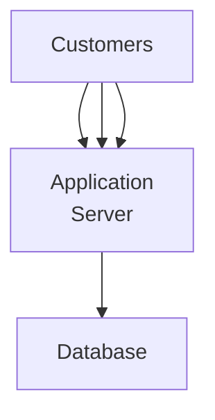
```mermaid
flowchart TD
  accTitle: One server has limits
  accDescr: All customers reach one application server, which uses the database.
  U["Customers"] --> S["Application<br/>Server"]
  U --> S
  U --> S
  S --> D["Database"]
```

This works while traffic is small.

But as more customers arrive, the server may run out of CPU, memory, network capacity, or available application workers.

You could increase the server's resources. That is vertical scaling, which you studied in Chapter 02.02.

However, one machine still has limits.

Another option is to run multiple application instances:

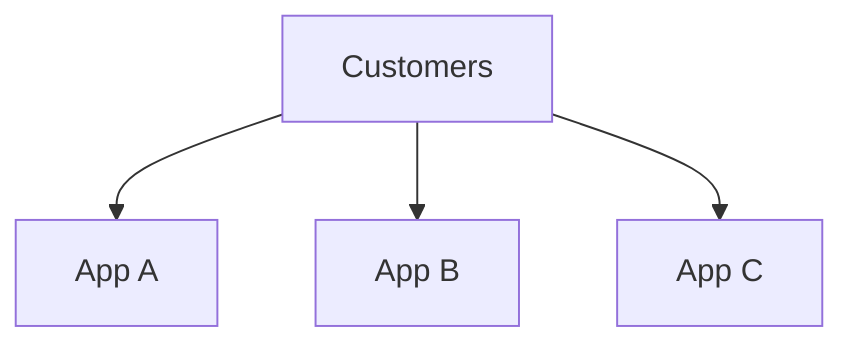
```mermaid
flowchart TD
  accTitle: More servers
  accDescr: Customers reach App A, App B and App C.
  U["Customers"] --> A["App A"] & B["App B"] & C["App C"]
```

Now you have more application capacity.

But a new problem appears:

**How does an incoming request know which application server should handle it?**

You need a component to distribute incoming traffic.

That is the role of a load balancer.

# 2. What Is a Load Balancer?

A **load balancer** distributes incoming requests or connections across multiple backend destinations according to a configured strategy.

Those destinations are often called:

* Backend servers.
* Backend instances.
* Targets.
* Upstream servers.

The collection of eligible destinations is commonly called a backend pool or target group.

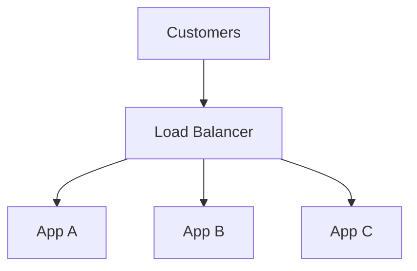
```mermaid
flowchart TD
  accTitle: A load balancer
  accDescr: Customers reach a load balancer, which sends requests to App A, App B and App C.
  U["Customers"] --> L["Load Balancer"] --> A["App A"] & B["App B"] & C["App C"]
```

Instead of every customer connecting directly to one application server, traffic enters through the load balancer.

The load balancer selects a suitable backend and forwards the traffic.

The application server processes the request and returns the response through the appropriate network path.

## Simple Analogy

Imagine a training institute with three reception counters.

Students arrive at the entrance. A coordinator directs each student to an available counter.

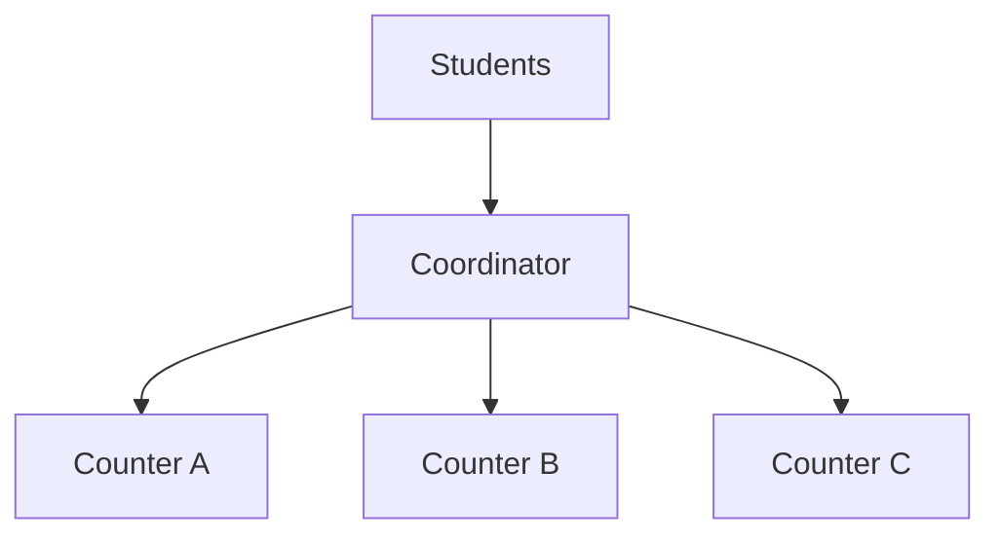
```mermaid
flowchart TD
  accTitle: A coordinator
  accDescr: Students go to a coordinator, who sends them to counter A, counter B or counter C.
  S["Students"] --> K["Coordinator"] --> A["Counter A"] & B["Counter B"] & C["Counter C"]
```

The coordinator does not perform the work of the receptionists. It distributes incoming work among them.

Similarly, a load balancer does not normally execute the application's business logic. It directs traffic to the application instances that do.

# 3. Why Do Systems Need Load Balancers?

Load balancing supports several important architectural goals.

## 3.1 Distribute Traffic

Suppose 900 requests arrive during a short period.

With three equally capable instances, a simple distribution strategy might send approximately 300 requests to each instance.

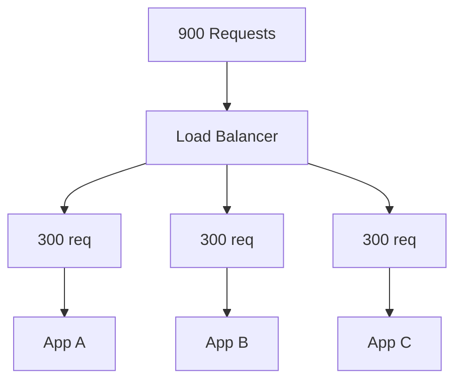
```mermaid
flowchart TD
  accTitle: Distributing traffic
  accDescr: 900 requests reach the load balancer, which sends 300 requests each to App A, App B and App C.
  R["900 Requests"] --> L["Load Balancer"] --> RA["300 req"] & RB["300 req"] & RC["300 req"]
  RA --> A["App A"]
  RB --> B["App B"]
  RC --> C["App C"]
```

This is an illustration, not a guarantee that every strategy will produce an exact one-third distribution.

Actual distribution depends on the algorithm, connection duration, request processing time, instance capacity, and traffic patterns.

The goal is to use available backend capacity more effectively.

## 3.2 Support Horizontal Scaling

In Chapter 02.03, you learned that horizontal scaling means adding more instances.

A load balancer gives clients a stable entry point while the number of backend instances changes.

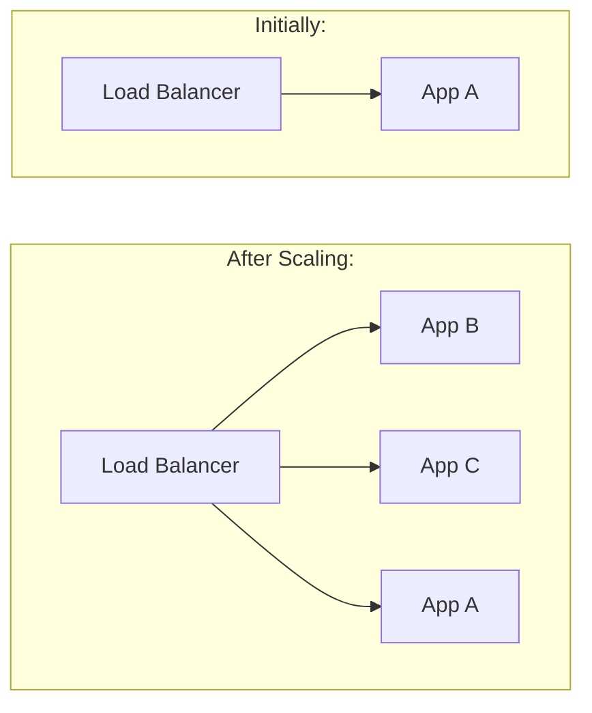
```mermaid
flowchart TD
  accTitle: Scaling behind a load balancer
  accDescr: Initially the load balancer sends traffic to App A. After scaling it sends traffic to App A, App B and App C.
  subgraph I["Initially:"]
    L1["Load Balancer"] --> A1["App A"]
  end
  subgraph S["After Scaling:"]
    L2["Load Balancer"] --> B2["App B"] & C2["App C"] & A2["App A"]
  end
  I ~~~ S
```

The public-facing endpoint can remain the same even when backend instances are added or removed.

This is useful for applications that need to grow without requiring customers to know individual server addresses.

However, adding instances does not guarantee proportional performance improvement. Shared databases, caches, network capacity, and other dependencies may become bottlenecks.

## 3.3 Improve Availability

Suppose App B becomes unhealthy.

A load balancer with appropriate health checks can stop sending new traffic to App B while continuing to route traffic to eligible instances.

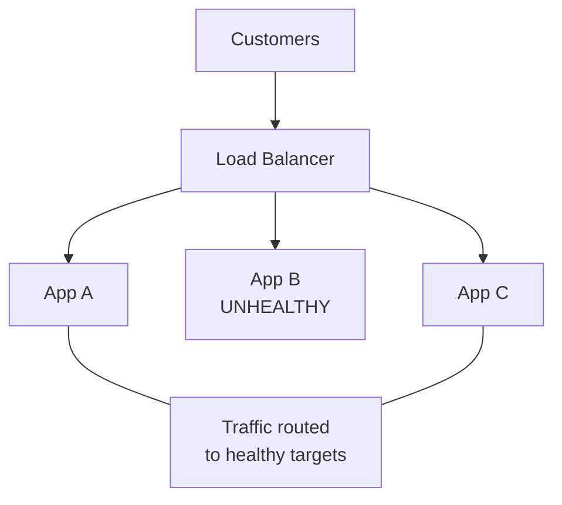
```mermaid
flowchart TD
  accTitle: Routing around an unhealthy instance
  accDescr: Customers reach the load balancer. App B is unhealthy, so traffic is routed to the healthy targets, App A and App C.
  U["Customers"] --> L["Load Balancer"] --> A["App A"] & B["App B<br/>UNHEALTHY"] & C["App C"]
  A & C --- T["Traffic routed<br/>to healthy targets"]
```

This can reduce the impact of an individual instance failure.

But load balancing does not guarantee that the entire application remains available.

If all application instances fail, or the database becomes unavailable, the load balancer cannot make the application function.

Availability depends on the entire request path and its dependencies.

## 3.4 Enable Controlled Traffic Distribution

A load balancer may also support:

* Sending traffic to different versions of an application.
* Distributing traffic across availability zones.
* Routing to different backend groups.
* Gradually introducing a new application version.

These capabilities depend on the load balancer and its configuration.

More advanced deployment strategies are discussed when studying service and cloud architecture.

# 4. Where Does a Load Balancer Fit?

Consider the architecture from the previous chapter.

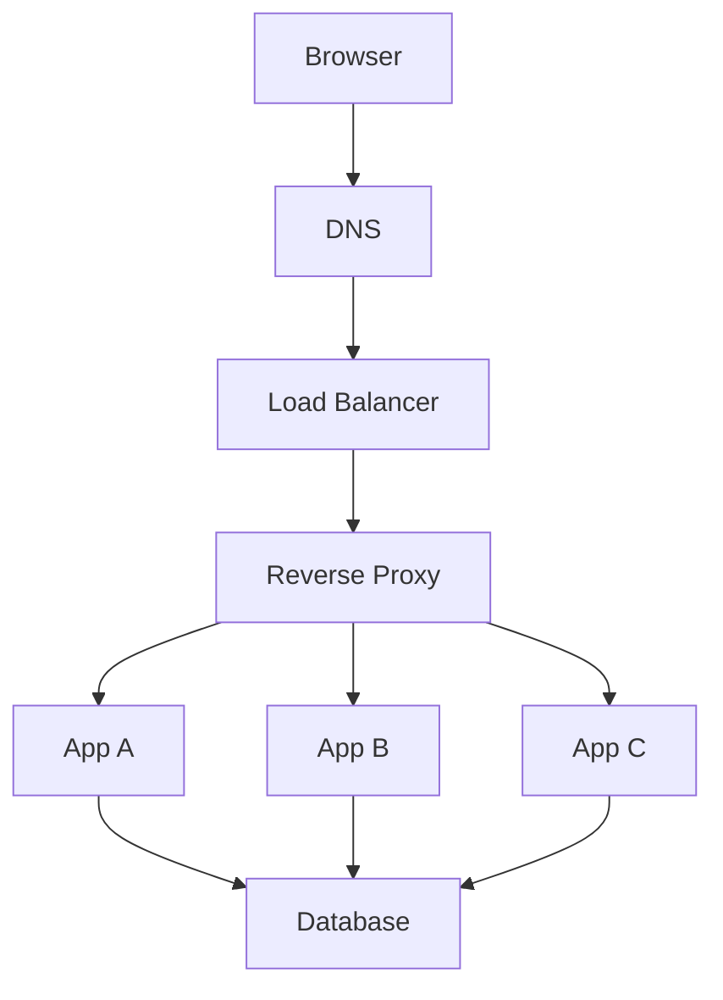
```mermaid
flowchart TD
  accTitle: Where a load balancer fits
  accDescr: The browser uses DNS, then reaches the load balancer and a reverse proxy, which sends requests to App A, App B and App C, which use the database.
  W["Browser"] --> N["DNS"] --> L["Load Balancer"] --> P["Reverse Proxy"] --> A["App A"] & B["App B"] & C["App C"]
  A & B & C --> D["Database"]
```

This is one possible arrangement, but it is not the only one.

A load balancer may itself perform reverse-proxy functions. In that case, a separate reverse proxy is not necessarily required.

For example:

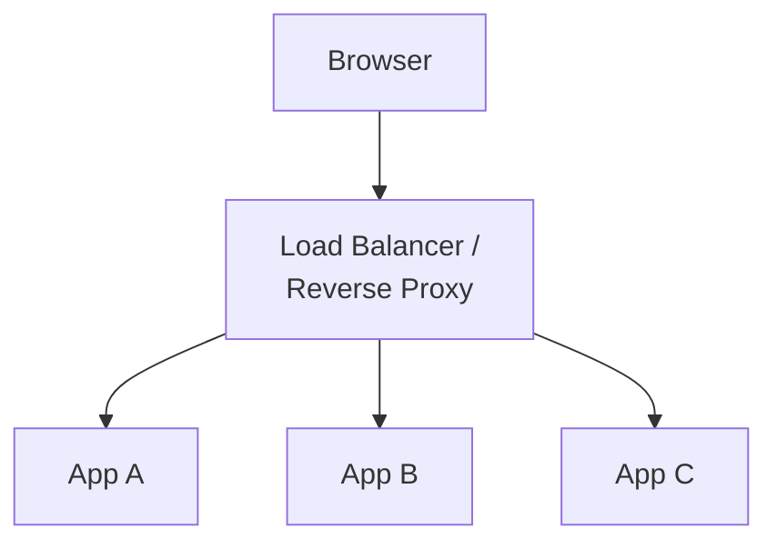
```mermaid
flowchart TD
  accTitle: One component, both roles
  accDescr: The browser reaches a combined load balancer / reverse proxy, which sends requests to App A, App B and App C.
  W["Browser"] --> L["Load Balancer /<br/>Reverse Proxy"] --> A["App A"] & B["App B"] & C["App C"]
```

The architecture depends on the responsibilities you need and the capabilities of your infrastructure.

## Load Balancer vs Reverse Proxy

| Question                              | Load Balancer                                                        | Reverse Proxy                                      |
| ------------------------------------- | -------------------------------------------------------------------- | -------------------------------------------------- |
| Primary responsibility                | Distribute traffic across destinations                               | Receive and forward requests on behalf of backends |
| Requires multiple backends?           | Distribution across multiple eligible backends is its common purpose | No                                                 |
| Can terminate TLS?                    | Many can                                                             | Many can                                           |
| Can route by hostname or path?        | Depends on implementation and layer                                  | Commonly supported                                 |
| Can one component perform both roles? | Yes                                                                  | Yes                                                |

A load balancer can be implemented as a reverse proxy, but the terms describe different responsibilities.

A reverse proxy that forwards every request to one backend is not performing meaningful load distribution.

A load balancer's defining function is to select among eligible destinations.

# 5. Backend Pools and Targets

A load balancer needs to know which destinations can receive traffic.

Suppose your application has three instances:

```text
App A: 10.0.1.11:3000
App B: 10.0.1.12:3000
App C: 10.0.1.13:3000
```

The load balancer can maintain a set of configured targets:

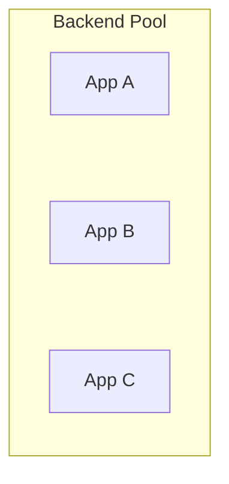
```mermaid
flowchart TD
  accTitle: A backend pool
  accDescr: The backend pool contains App A, App B and App C.
  subgraph P["Backend Pool"]
    direction TB
    P0["App A"] ~~~ P1["App B"] ~~~ P2["App C"]
  end
```

When a request arrives, the load balancer chooses a target from the eligible pool.

The exact way targets are registered depends on the deployment.

Targets may be:

* Configured manually.
* Registered by a cloud service.
* Discovered through service discovery.
* Added or removed by an orchestration platform.

In an autoscaling environment, the backend pool may change as instances are created or terminated.

The load balancer needs an accurate view of which destinations are eligible to receive new traffic.

# 6. Layer 4 vs Layer 7 Load Balancing

Load balancers can operate at different layers of the networking stack.

Two common approaches are Layer 4 and Layer 7 load balancing.

They differ in the information they use to make routing decisions.

## 6.1 Layer 4 Load Balancing

Layer 4 refers to the transport layer, commonly TCP or UDP.

A Layer 4 load balancer distributes connections or traffic using information such as:

* Source IP address.
* Destination IP address.
* Source port.
* Destination port.
* Transport protocol.

It generally does not need to inspect the HTTP URL path to distribute traffic.

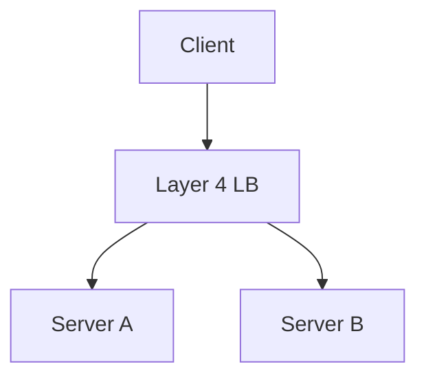
```mermaid
flowchart TD
  accTitle: Layer 4 load balancing
  accDescr: The client reaches a layer 4 load balancer, which sends connections to server A or server B.
  K["Client"] --> L["Layer 4 LB"] --> A["Server A"] & B["Server B"]
```

For example, a Layer 4 load balancer may distribute TCP connections arriving at a particular IP address and port across multiple backend servers.

### Advantages

* Can handle traffic without parsing HTTP requests.
* Useful for TCP or UDP workloads beyond HTTP.
* Can operate efficiently at high connection volumes.

### Limitations

* Cannot ordinarily make HTTP path-based decisions without additional application-layer functionality.
* May have less application-level request context.
* Connection distribution does not necessarily equal request distribution.

A single long-lived TCP connection may carry many HTTP requests, depending on the protocol.

Therefore, distributing connections is not always the same as distributing individual requests.

## 6.2 Layer 7 Load Balancing

Layer 7 refers to the application layer.

For web traffic, a Layer 7 load balancer can understand HTTP-level information.

It may inspect:

* HTTP hostname.
* URL path.
* HTTP method.
* Selected headers.
* Other supported request properties.

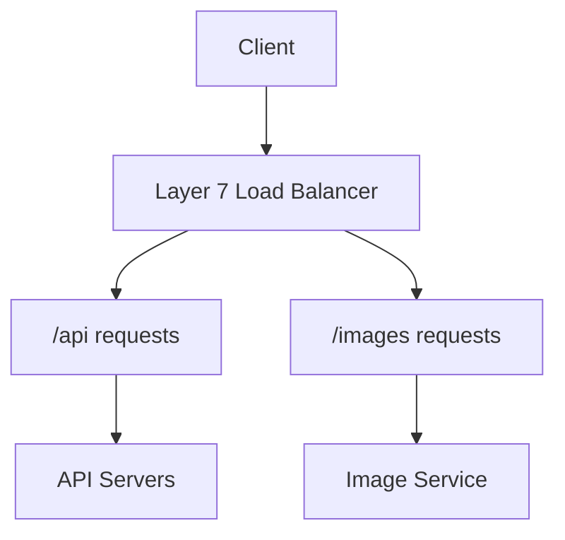
```mermaid
flowchart TD
  accTitle: Layer 7 load balancing
  accDescr: The client reaches a layer 7 load balancer, which sends /api requests to the API servers and /images requests to the image service.
  K["Client"] --> L["Layer 7 Load Balancer"] --> A["/api requests"] & I["/images requests"]
  A --> AS["API Servers"]
  I --> IS["Image Service"]
```

For example:

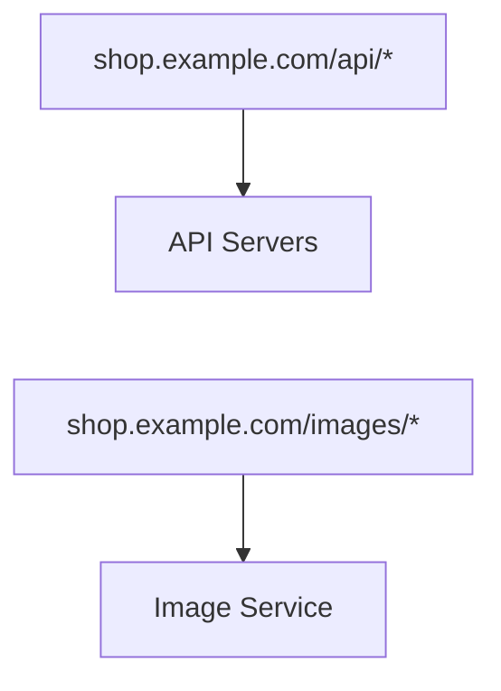
```mermaid
flowchart TD
  accTitle: Routing by path
  accDescr: shop.example.com/api/* goes to the API servers; shop.example.com/images/* goes to the image service.
  A["shop.example.com/api/*"] --> AS["API Servers"]
  I["shop.example.com/images/*"] --> IS["Image Service"]
  AS ~~~ I
```

This is useful when different requests need to reach different backend services.

### Advantages

* HTTP-aware routing.
* Hostname- and path-based rules.
* Can integrate with HTTP-level health checks and policies.
* May support TLS termination and request-level controls.

### Limitations

* Needs to process application-layer information.
* May require more CPU and memory for TLS and HTTP processing.
* Behavior depends on supported protocols and configuration.

## Comparison

| Feature                      | Layer 4                                 | Layer 7                                                               |
| ---------------------------- | --------------------------------------- | --------------------------------------------------------------------- |
| Common protocol layer        | TCP / UDP                               | HTTP / HTTPS and other application protocols supported by the product |
| Understands HTTP paths       | Not ordinarily                          | Yes, when supported                                                   |
| Routes based on HTTP headers | Not ordinarily                          | Often                                                                 |
| Distributes                  | Commonly connections or transport flows | Commonly HTTP requests or connections, depending on configuration     |
| Typical use                  | Transport-level traffic distribution    | Web and API traffic routing                                           |

Neither layer is universally appropriate for every workload.

The decision depends on the protocols, routing requirements, performance characteristics, and operational needs.

# 7. Common Load-Balancing Algorithms

A load balancer needs a strategy for selecting a backend.

Different algorithms make different assumptions about traffic and server capacity.

The following are common approaches.

## 7.1 Round Robin

Round robin selects targets in a repeating sequence.

Suppose three application instances are available.

```text
Request 1 -> App A
Request 2 -> App B
Request 3 -> App C
Request 4 -> App A
Request 5 -> App B
Request 6 -> App C
```

The pattern repeats.

### When It Fits

Round robin can work well when:

* Backend instances have similar capacity.
* Requests have broadly similar processing costs.
* A simple distribution strategy is sufficient.

### Limitation

Requests are not always equally expensive.

One request may return a cached product page, while another performs a complex report calculation.

Round robin does not inherently account for how busy each server currently is.

Also, with long-lived connections, equal connection counts do not necessarily mean equal request counts or resource usage.

## 7.2 Weighted Round Robin

Weighted round robin assigns different weights to backend instances.

Suppose:

| Server | Relative Weight |
| ------ | --------------: |
| App A  |               5 |
| App B  |               3 |
| App C  |               2 |

The configuration indicates that App A should receive a larger share of eligible traffic than App C, subject to the implementation.

The weights represent relative distribution preferences, not guaranteed exact request percentages over every short time interval.

### When It Fits

Weighted round robin can be useful when backend instances have different capacities.

For example, a larger server may be configured to receive more traffic than a smaller server.

### Limitation

Weights do not automatically reflect current CPU usage, database pressure, or request complexity.

Incorrect weights can cause uneven resource utilization.

## 7.3 Least Connections

Least connections selects the eligible backend with the fewest active connections, according to the load balancer's connection-counting behavior.

```text
App A: 20 active connections
App B:  8 active connections
App C: 13 active connections
```

The load balancer may choose App B for a new connection.

The idea is to avoid continually sending new connections to a server that already has many active connections.

### When It Fits

It can be useful when connections have different durations.

For example, one backend may have several long-running connections while another has mostly short-lived connections.

### Limitation

Connection count is only an approximation of workload.

A server with fewer connections might still be CPU-saturated, while another with more connections may be mostly idle.

Least connections does not automatically measure total application workload.

## 7.4 Weighted Least Connections

Weighted least connections combines connection-based selection with backend weights.

It considers both the configured capacity preference and active connection information.

The exact selection formula depends on the implementation.

It can be useful when servers differ in capacity and connection durations vary.

However, it still does not provide a perfect measurement of actual work.

## 7.5 IP Hash

IP hash uses a hash of the client's IP address or related connection information to select a backend.

The goal is to direct requests from the same client address to the same backend under a stable configuration.

```text
Client IP A ---> App A
Client IP B ---> App C
Client IP C ---> App B
```

This can provide a form of session affinity.

However, it has limitations:

* Many users may share one public IP address.
* A user's IP address may change.
* Backend membership changes may alter the mapping.
* A single heavily used IP can create uneven traffic distribution.

IP hash is not a replacement for correctly designed shared session storage.

## Algorithm Summary

| Algorithm                  | Selection Idea                             | Main Limitation                                      |
| -------------------------- | ------------------------------------------ | ---------------------------------------------------- |
| Round Robin                | Rotate through eligible targets            | Does not measure current workload                    |
| Weighted Round Robin       | Distribute according to configured weights | Weights may not reflect actual demand                |
| Least Connections          | Prefer fewer active connections            | Connections are not equal to workload                |
| Weighted Least Connections | Combine weights and connection counts      | Still an approximation                               |
| IP Hash                    | Map client IP information to a target      | Can create uneven distribution and affinity problems |

More advanced algorithms may use latency, measured load, locality, or other signals.

The algorithm name alone does not guarantee a particular performance outcome. Configuration, workload, and implementation matter.

# 8. Health Checks: How Does the Load Balancer Know a Server Is Healthy?

A backend instance may be running but unable to serve requests correctly.

For example:

* The application process has crashed.
* The application is responding too slowly.
* The instance cannot connect to a required dependency.
* The server has exhausted its available workers.
* The application is returning repeated errors.

A load balancer can use health checks to determine whether a backend should receive traffic.

## 8.1 Basic Health Check

A simple HTTP health check might request:

```http
GET /health HTTP/1.1
Host: app.internal
```

The application returns a response indicating its health.

For example:

```http
HTTP/1.1 200 OK
Content-Type: text/plain

OK
```

The load balancer evaluates the result according to its configured health-check rules.

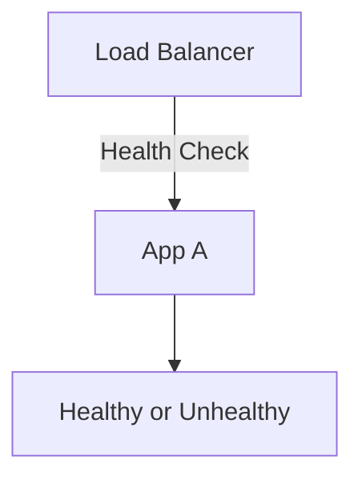
```mermaid
flowchart TD
  accTitle: A basic health check
  accDescr: The load balancer sends a health check to App A, which is found healthy or unhealthy.
  L["Load Balancer"] -->|"Health Check"| A["App A"] --> H["Healthy or Unhealthy"]
```

The endpoint and expected response depend on the system.

A TCP health check may only verify that a connection can be established.

An HTTP health check can verify that an HTTP endpoint responds as expected.

Neither necessarily proves that every business operation is functioning correctly.

## 8.2 Liveness vs Readiness

Two concepts are useful when designing application health endpoints.

**Liveness** asks:

"Is the application process alive and functioning enough to continue running?"

**Readiness** asks:

"Is this instance currently prepared to receive application traffic?"

An application might be alive but not ready.

For example, it may still be loading configuration or initializing required resources.

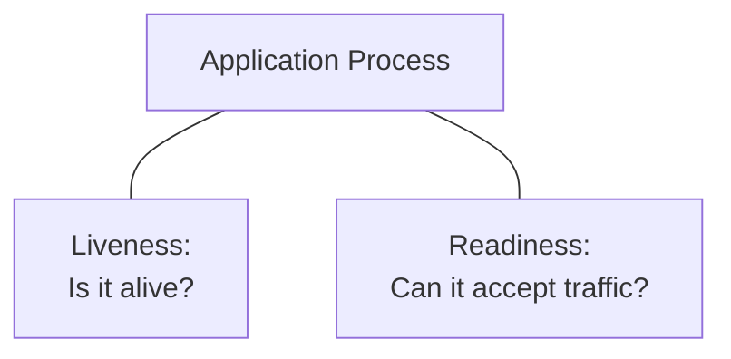
```mermaid
flowchart TD
  accTitle: Liveness and readiness
  accDescr: An application process has two checks: liveness, is it alive? and readiness, can it accept traffic?
  P["Application Process"] --- V["Liveness:<br/>Is it alive?"] & R["Readiness:<br/>Can it accept traffic?"]
```

A load balancer or orchestration platform may use readiness information to decide whether to send traffic to an instance.

Liveness and readiness checks should be designed according to the deployment environment. Not every load balancer supports both concepts as separate mechanisms.

## 8.3 Health Checks Have Trade-offs

Health checks are not free.

They generate traffic and can produce incorrect results if poorly designed.

For example, if every health check performs a complicated database query, a large fleet of instances may create unnecessary database load.

A useful health-check design should:

* Be fast.
* Return a meaningful status.
* Avoid unnecessary expensive work.
* Distinguish process health from traffic readiness where needed.
* Avoid marking every instance unhealthy because of a shared dependency without considering the recovery behavior.

The correct check depends on what the application needs to serve requests safely.

# 9. What Happens When a Server Becomes Unhealthy?

Suppose your backend pool contains three instances.

```text
App A: Healthy
App B: Unhealthy
App C: Healthy
```

The load balancer marks App B as ineligible for new traffic.

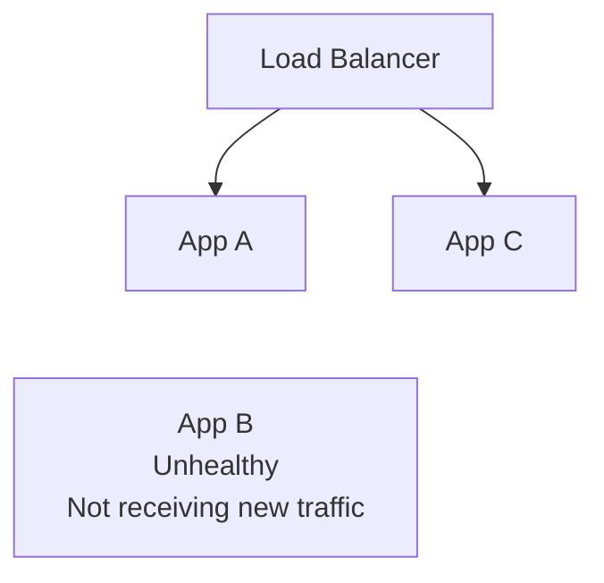
```mermaid
flowchart TD
  accTitle: An unhealthy instance is removed
  accDescr: The load balancer sends traffic to App A and App C. App B is unhealthy and not receiving new traffic.
  L["Load Balancer"] --> A["App A"] & C["App C"]
  B["App B<br/>Unhealthy<br/>Not receiving new traffic"]
  A ~~~ B
```

The load balancer continues routing new requests to eligible targets.

When App B recovers and passes the configured health checks, it may become eligible again.

The time required to detect a failure depends on:

* Health-check interval.
* Timeout.
* Failure threshold.
* Recovery threshold.
* Health-check implementation.

Aggressive health checks can detect failures faster but may create more false positives.

Slow checks can reduce unnecessary state changes but delay detection.

There is a trade-off between detection speed, stability, and overhead.

## Important Limitation

A health check does not guarantee that the next application request will succeed.

An instance can pass a health check and fail immediately afterward.

Health checks provide a useful signal, not certainty.

Also, a load balancer may stop sending new requests to an unhealthy server without terminating existing connections or ongoing operations.

The behavior depends on its configuration and protocol.

# 10. Load Balancing and Stateless Applications

In Chapter 02.04, you learned that stateless application instances can handle requests without depending on local session state.

This makes load balancing easier.

Consider a shopping application.

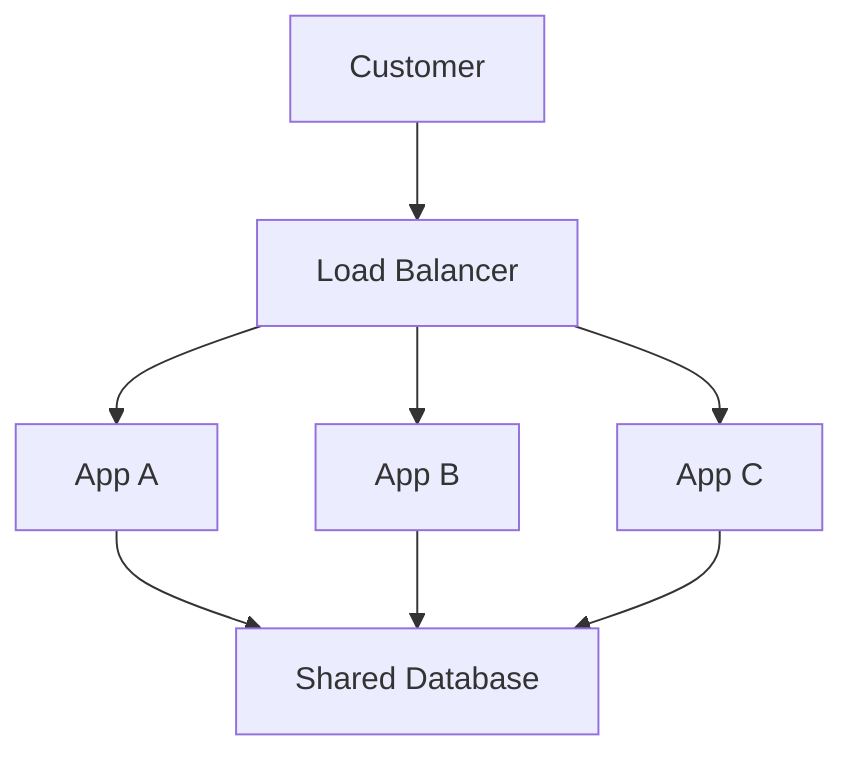
```mermaid
flowchart TD
  accTitle: Stateless instances behind a load balancer
  accDescr: The customer reaches the load balancer, which sends requests to App A, App B and App C, which all use a shared database.
  U["Customer"] --> L["Load Balancer"] --> A["App A"] & B["App B"] & C["App C"]
  A & B & C --> D["Shared Database"]
```

A customer sends a request to the application.

The load balancer may direct one request to App A and the next to App C.

If the application depends on shared session storage and shared persistent data, either instance can process the request, assuming all other requirements are met.

This improves flexibility when instances are added, removed, or replaced.

## What If Sessions Are Stored in Local Memory?

Suppose App A stores the customer's login session in its own memory.

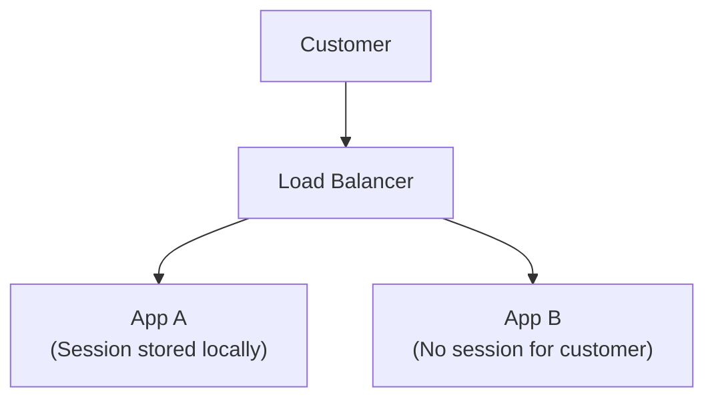
```mermaid
flowchart TD
  accTitle: Sessions in local memory
  accDescr: The customer reaches the load balancer, which may send them to App A, where the session is stored locally, or App B, which has no session for the customer.
  U["Customer"] --> L["Load Balancer"] --> A["App A<br/>(Session stored locally)"] & B["App B<br/>(No session for customer)"]
```

If a later request reaches App B, the application may not recognize the customer's session.

This is one reason shared session storage or another suitable authentication design is important for horizontally scaled applications.

## What About Sticky Sessions?

Some load balancers support session affinity, also called sticky sessions.

The load balancer tries to send a particular client or session to the same backend instance.

```text
Customer A ---> App A
Customer B ---> App B
Customer C ---> App C
```

This can help legacy applications that rely on local session state.

But it introduces trade-offs:

* Requests may become unevenly distributed.
* A failed instance may lose locally stored sessions.
* Scaling and deployments can change routing.
* Affinity does not remove the need for session recovery or shared state when required.

Sticky sessions can be a practical compatibility mechanism, but they are not equivalent to making the application stateless.

# 11. Load Balancing Does Not Eliminate Bottlenecks

Suppose you add four application servers.

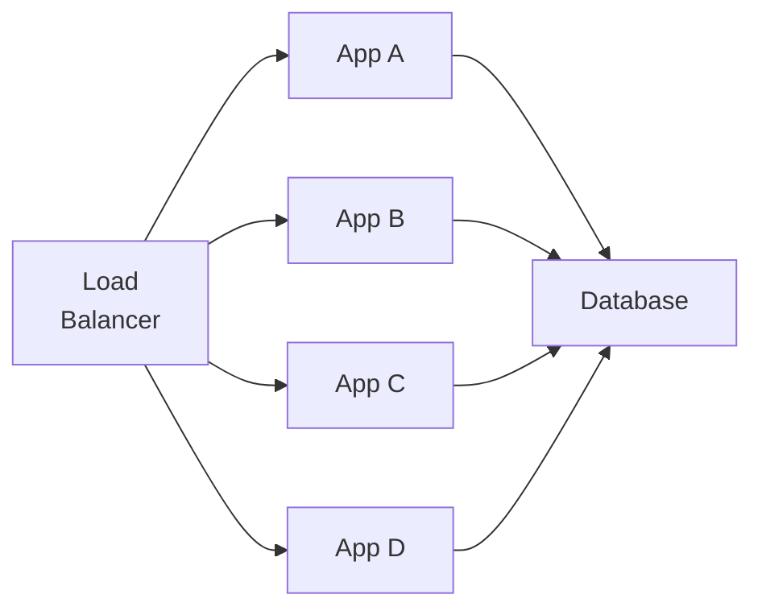
```mermaid
flowchart LR
  accTitle: The database is still shared
  accDescr: The load balancer sends requests to App A, App B, App C and App D, which all use one database.
  L["Load<br/>Balancer"] --> A["App A"] & B["App B"] & C["App C"] & E["App D"]
  A & B & C & E --> D["Database"]
```

The application tier now has more processing capacity.

But every instance still uses the same database.

If the database is already saturated, adding application servers may increase database pressure without improving overall throughput.

Other possible bottlenecks include:

* Database connection limits.
* Slow database queries.
* Shared cache capacity.
* External APIs.
* Network bandwidth.
* The load balancer itself.
* Background workers or message queues.

The end-to-end capacity of a system is constrained by its bottlenecks.

A load balancer distributes work. It does not automatically increase the capacity of every dependency.

## Connection Pool Multiplication

Recall Chapter 01.12 — Connection Pooling.

Suppose each application instance has a database connection pool of up to 40 connections.

With four instances:

```text
4 instances × 40 connections
= 160 possible application connections
```

If the application scales to ten instances:

```text
10 instances × 40 connections
= 400 possible application connections
```

This is a capacity illustration. Actual active connections depend on pool configuration and workload.

The database must be able to handle the aggregate connection demand.

Scaling the application tier can therefore expose database connection limits or resource contention.

**Always consider the total system, not just the number of application servers.**

# 12. Load Balancing and Autoscaling

Autoscaling changes the number of application instances according to configured policies or demand signals.

For example:

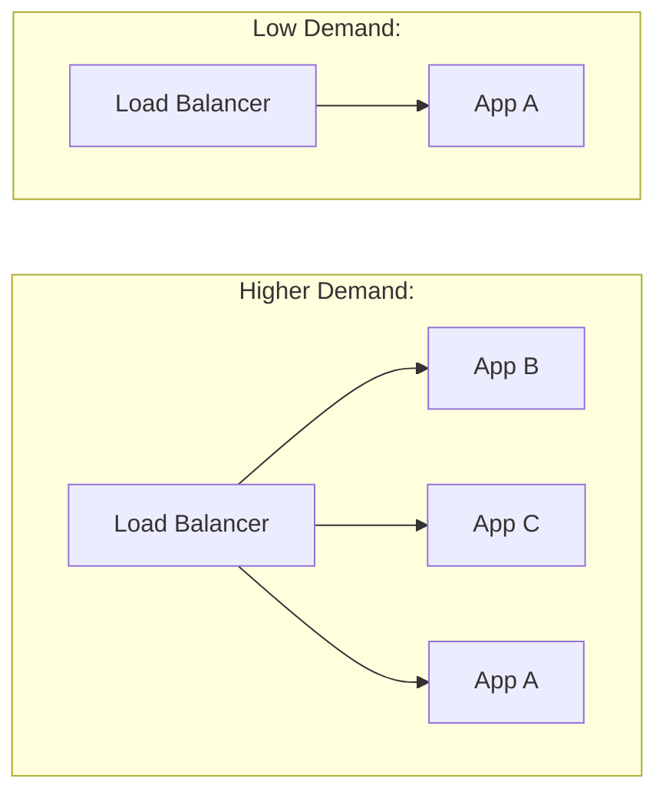
```mermaid
flowchart TD
  accTitle: Autoscaling
  accDescr: At low demand the load balancer sends traffic to App A. At higher demand it sends traffic to App A, App B and App C.
  subgraph W["Low Demand:"]
    L1["Load Balancer"] --> A1["App A"]
  end
  subgraph H["Higher Demand:"]
    L2["Load Balancer"] --> B2["App B"] & C2["App C"] & A2["App A"]
  end
  W ~~~ H
```

When new instances become available, the infrastructure needs to register them as eligible targets.

When instances are removed, they should stop receiving new traffic in a controlled manner.

This is sometimes called connection draining or deregistration delay.

The purpose is to give existing requests or connections an opportunity to finish before the instance is terminated, where supported.

Without careful handling, scaling events can interrupt requests.

Autoscaling and load balancing solve related but different problems:

| Component          | Responsibility                                              |
| ------------------ | ----------------------------------------------------------- |
| Autoscaling        | Adjust the number of running instances                      |
| Load balancing     | Distribute traffic among eligible instances                 |
| Health checks      | Provide signals about target health                         |
| Application design | Ensure requests and state behave correctly across instances |

A load balancer does not automatically decide how many servers your application needs.

That decision belongs to the autoscaling policy or operational process.

# 13. Load Balancer Availability

A load balancer can itself become a critical dependency.

```mermaid
flowchart TD
  accTitle: A single load balancer fails
  accDescr: Customers reach a single load balancer, which has failed, in front of App A and App B.
  U["Customers"] --> L["Load Balancer<br/>X"] --> A["App A"] & B["App B"]
```

If the only load balancer fails, customers may not be able to reach healthy application instances.

Production architectures often use managed or redundant load-balancing infrastructure.

However, redundancy introduces its own considerations:

* Multiple failure domains.
* Configuration consistency.
* Health monitoring.
* Network and DNS behavior.
* Cost.
* Operational complexity.

A managed load balancer may provide high availability as part of its service, but the exact guarantees depend on the provider, configuration, and service-level agreement.

Do not assume that the word "managed" means every failure scenario is automatically covered.

# 14. Practical Architecture Example

Imagine an online store serving product pages, account requests, and orders.

A simplified architecture might be:

```mermaid
flowchart TD
  accTitle: A practical architecture
  accDescr: Customers reach a public endpoint and the load balancer, which sends requests to App A, App B and App C, which use the database and the cache.
  J@{ shape: sm-circ }
  U["Customers"] --> E["Public Endpoint"] --> L["Load Balancer"] --> A["App A"] & B["App B"] & C["App C"]
  A & B & C --- J --> D["Database"] & K["Cache"]
```

The load balancer distributes incoming requests among healthy application instances.

The application instances execute business logic.

The database stores persistent business records.

The cache may reduce repeated database work.

If demand increases, additional application instances can be registered with the load balancer.

If one application instance fails, health-check-based routing can remove it from the eligible pool.

But the database and cache still need their own capacity and availability plans.

The architecture evolves by identifying and addressing actual constraints rather than assuming that adding servers solves every problem.

# 15. Common Mistakes

| Mistake                                                      | Why It Matters                                                                   |
| ------------------------------------------------------------ | -------------------------------------------------------------------------------- |
| Assuming equal traffic means equal workload                  | Requests can have very different processing costs                                |
| Assuming a healthy target will never fail                    | Health checks provide signals, not guarantees                                    |
| Assuming load balancing makes the application stateless      | Local sessions and files can still create instance dependencies                  |
| Assuming more application servers always increase throughput | Shared dependencies may be bottlenecks                                           |
| Ignoring database connection multiplication                  | More application instances can create more database connection demand            |
| Treating Layer 4 and Layer 7 as identical                    | They use different information and support different routing behavior            |
| Assuming a load balancer automatically provides autoscaling  | Traffic distribution and instance-count management are separate responsibilities |
| Assuming retries are always safe after a failed request      | The operation may have completed partially or fully                              |

# 16. Key Principles

1. A load balancer distributes incoming traffic across eligible backend destinations.
2. It provides a stable entry point while backend instances change.
3. Load balancing can support horizontal scaling and reduce the impact of individual instance failures.
4. Layer 4 and Layer 7 load balancers use different information to make routing decisions.
5. A load-balancing algorithm distributes traffic according to its rules, not necessarily according to actual server workload.
6. Health checks help identify unhealthy targets but cannot guarantee that every request will succeed.
7. Stateless application design makes distributing requests across instances easier.
8. Load balancing does not remove database, cache, network, or other system bottlenecks.
9. Autoscaling changes instance count; load balancing distributes traffic among eligible instances.
10. The load balancer itself must be considered in the system's availability and capacity design.

# 17. Quick Reference

| Term                 | Meaning                                                                           |
| -------------------- | --------------------------------------------------------------------------------- |
| Load balancer        | Distributes traffic across backend destinations                                   |
| Backend pool         | Collection of configured backend targets                                          |
| Target               | A server, instance, or destination eligible to receive traffic                    |
| Layer 4              | Transport-level traffic distribution, commonly TCP/UDP                            |
| Layer 7              | Application-level routing, such as HTTP hostname or path                          |
| Round robin          | Cycles through eligible targets                                                   |
| Weighted round robin | Distributes according to configured relative weights                              |
| Least connections    | Prefers a target with fewer active connections                                    |
| IP hash              | Uses client IP information to select a target                                     |
| Health check         | Mechanism for evaluating target health                                            |
| Readiness            | Whether an instance is prepared to receive traffic                                |
| Sticky session       | Attempts to keep a client or session on the same backend                          |
| Connection draining  | Allows existing connections or requests to finish during removal, where supported |
| Autoscaling          | Adjusts the number of running instances                                           |

# 18. Knowledge Check

**1.** Your application runs on five servers. What component can distribute incoming requests among them?

**2.** A Layer 7 load balancer routes `/api` to one backend and `/images` to another. What information is it using to make the decision?

**3.** Why might round robin distribute equal numbers of requests but still produce uneven server utilization?

**4.** An application instance is running but has not finished initializing. Which health concept is relevant to deciding whether it should receive traffic: liveness or readiness?

**5.** A load balancer distributes requests across six application instances, but all six depend on a saturated database. Why might adding more instances fail to improve throughput?

**6.** Why can sticky sessions cause problems when application instances are added or removed?

## Answers

1. A load balancer.
2. HTTP application-layer information, such as the URL path.
3. Requests can have different processing costs and durations.
4. Readiness, because the question is whether the instance is prepared to accept traffic.
5. The database is a shared bottleneck. More application instances may increase pressure without increasing database capacity.
6. Client-to-instance affinity can become uneven or change during scaling and failures, and local session state may be lost when an instance disappears.

# Final Mental Model

A load balancer is the traffic coordinator between a public entry point and multiple backend destinations.

It distributes work, provides a stable entry point, and can help remove unhealthy instances from new traffic.

But it does not create unlimited capacity, make stateful applications stateless, or guarantee that every dependency is available.

**Scale the application tier, observe the entire request path, and address the bottleneck that actually limits the system.**
