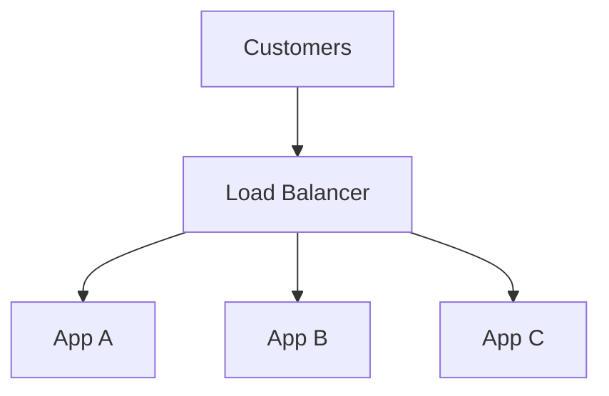
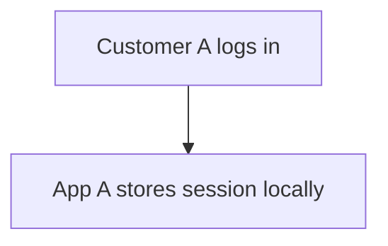
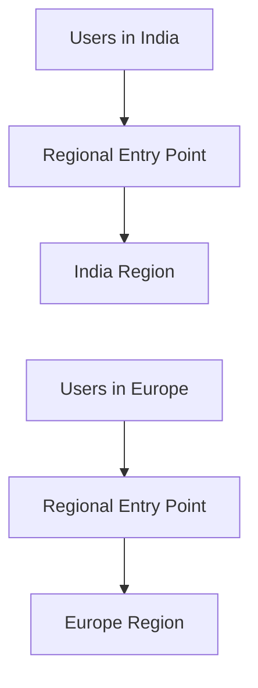
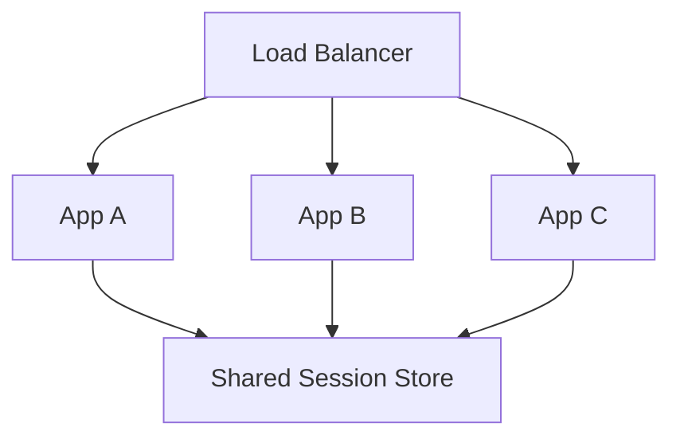
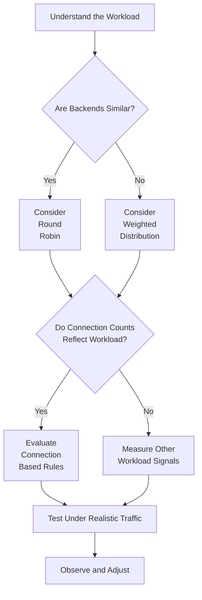

# 02.07 — Load Balancing Algorithms

## Learning Objectives

By the end of this chapter, you will be able to:

* Explain how a load balancer selects a backend for incoming traffic.
* Understand round robin, weighted round robin, least connections, and other common algorithms.
* Distinguish request distribution from workload distribution.
* Understand session affinity, consistent hashing, and their trade-offs.
* Identify how backend capacity, request duration, and health affect routing decisions.
* Choose an algorithm based on workload characteristics rather than assuming one algorithm fits every system.

---

# 1. The Problem: Which Server Should Handle This Request?

In Chapter 02.06, you learned that a load balancer distributes traffic across multiple backend instances.

Consider an online store with three application servers:



Now imagine 100 new requests arrive.

Which server should receive the first request?

Which server should receive the second?

Should every server receive approximately the same number of requests?

What if App A is twice as powerful as App B?

What if App C is already busy processing long-running requests?

What if a customer's session is stored in App A's local memory?

These are questions about traffic distribution.

A **load-balancing algorithm** is the rule a load balancer uses to select a backend destination for traffic.

Different algorithms use different information and make different assumptions.

The important principle is:

**Distributing traffic evenly does not necessarily distribute workload evenly.**

# 2. First Understand What Is Being Distributed

Before studying algorithms, distinguish three things.

## 2.1 Requests

An HTTP request is an application-level operation, such as:

```http
GET /products/101
```

A request might take 10 milliseconds or several seconds to complete.

Requests can have very different processing costs.

## 2.2 Connections

A connection is a communication relationship between endpoints.

A single HTTP connection may carry multiple requests, particularly when connection reuse or HTTP/2 is involved.

Therefore:

```text
100 Connections ≠ Necessarily 100 Requests
```

A load balancer distributing TCP connections is not necessarily distributing individual HTTP requests.

## 2.3 Workload

Workload is the actual work a backend performs.

It can involve:

* CPU processing.
* Memory consumption.
* Database queries.
* Network transfers.
* External API calls.
* Long-running application tasks.

For example:

| Request                    | Approximate Application Work                 |
| -------------------------- | -------------------------------------------- |
| Read a cached product page | Low                                          |
| Generate a complex report  | High                                         |
| Upload a large file        | High network and storage demand              |
| Submit an order            | Multiple application and database operations |

Two servers can receive the same number of requests but experience very different resource utilization.

This distinction will help you understand the limitations of every algorithm in this chapter.

# 3. Round Robin

Round robin distributes requests or connections by cycling through the eligible backend servers in sequence.

Suppose the backend pool contains three servers:

```text
App A
App B
App C
```

The selection order is:

```text
Request 1  → App A
Request 2  → App B
Request 3  → App C
Request 4  → App A
Request 5  → App B
Request 6  → App C
Request 7  → App A
```

The sequence repeats.

<AsyncImage query="round robin load balancing three backend servers simple educational architecture diagram" aspectRatio="16:9" width="100%"/>

## 3.1 How It Works

The load balancer maintains an ordering of eligible backend targets.

For each new selection, it advances to the next target.

When it reaches the end of the list, it returns to the beginning.

A simplified example:

```text
Eligible Targets:
[A, B, C]

Current Position:
A

Select A → Move to B
Select B → Move to C
Select C → Move to A
```

Actual implementations may handle concurrent requests, target health, and connection reuse differently.

## 3.2 When Round Robin Fits

Round robin is useful when:

* Backend instances have similar capacity.
* Requests have reasonably similar processing requirements.
* A simple and predictable distribution policy is sufficient.

For example, three identical application instances serving mostly lightweight product-page requests may work well with round robin.

## 3.3 Limitations

Suppose App A is processing a large report while App B and App C are idle.

Round robin does not inherently know that App A is busy.

It may continue assigning new traffic to App A according to the sequence.

```text
App A: CPU 95%
App B: CPU 30%
App C: CPU 25%
```

The algorithm does not automatically react to those CPU values.

Round robin is a selection rule, not a complete workload-measurement system.

Also, when used for connection distribution, the number of requests handled by each server may differ substantially.

**Mental model:** Round robin asks, "Which server comes next?"

# 4. Weighted Round Robin

What if the servers have different capacities?

Suppose your application has three instances:

| Server | Relative Capacity |
| ------ | ----------------: |
| App A  |              High |
| App B  |            Medium |
| App C  |               Low |

Sending exactly the same amount of traffic to every instance may not be appropriate.

Weighted round robin allows each server to have a configured weight.

For example:

| Server | Weight |
| ------ | -----: |
| App A  |      5 |
| App B  |      3 |
| App C  |      2 |

The weights establish relative distribution preferences.

The total weight is:

$$
5+3+2=10
$$

Under an idealized distribution over a sufficiently large number of independent selections, the intended shares are:

$$
P(A)=\frac{5}{10}=50\%
$$

$$
P(B)=\frac{3}{10}=30\%
$$

$$
P(C)=\frac{2}{10}=20\%
$$

This does not guarantee exact percentages over every short period. Actual behavior depends on the algorithm implementation, traffic pattern, and eligible targets.

## 4.1 Example

For 1,000 comparable selection events, the intended distribution would be approximately:

| Server | Weight | Illustrative Selections |
| ------ | -----: | ----------------------: |
| App A  |      5 |                     500 |
| App B  |      3 |                     300 |
| App C  |      2 |                     200 |

<AsyncImage query="weighted round robin load balancing servers weights 5 3 2 architecture diagram" aspectRatio="16:9" width="100%"/>

This can be useful when App A has more processing capacity than App C.

## 4.2 When It Fits

Weighted round robin can help when:

* Instances have different CPU or memory capacities.
* Some servers are intentionally assigned more traffic.
* You are gradually introducing a new backend version.
* The traffic pattern is relatively predictable.

For example, you might initially assign a smaller weight to a newly deployed version while checking its behavior.

## 4.3 Limitations

A configured weight is not a real-time measurement of workload.

Suppose App A has weight 5 because it is a larger server.

But App A is currently waiting on a slow database query.

App B might have spare capacity, yet weighted round robin may continue sending App A its configured share.

Weights can also become outdated when instance sizes or workloads change.

**Mental model:** Weighted round robin asks, "How much traffic should each server be preferred to receive?"

# 5. Least Connections

Round robin and weighted round robin primarily use configured ordering or weights.

Least connections uses a different signal: the number of active connections associated with each backend.

Suppose the current state is:

| Server | Active Connections |
| ------ | -----------------: |
| App A  |                 40 |
| App B  |                 12 |
| App C  |                 25 |

A least-connections algorithm would generally prefer App B for a new connection, assuming all three servers are eligible and other configured rules do not change the selection.

```text
App A: 40 connections
App B: 12 connections  ← Preferred
App C: 25 connections
```

The idea is to avoid continually sending new connections to a backend that already has many active connections.

## 5.1 Why Connections Can Be Useful

Imagine three application instances handling different types of work.

App A has many long-running requests.

App B has fewer active requests.

App C has several medium-duration requests.

A simple round-robin algorithm does not account for the existing connections.

Least connections uses connection count as a rough signal of how much ongoing work may be associated with each backend.

## 5.2 When It Fits

It can be useful when:

* Connection durations vary.
* Some backends have many long-lived connections.
* The number of active connections is a useful approximation of backend load.

For example, connection-based distribution may be useful for workloads involving long-lived TCP connections.

## 5.3 The Important Limitation

Connection count is not the same as resource utilization.

Consider:

```text
App A:
10 active connections
CPU: 95%

App B:
40 active connections
CPU: 25%
```

App A has fewer connections but is more heavily loaded.

Perhaps one of its requests is performing an expensive calculation.

A least-connections algorithm may still prefer App A because it has fewer active connections.

This is why connection count should be treated as a signal, not a perfect measurement of workload.

**Mental model:** Least connections asks, "Which server has fewer active connections?"

# 6. Weighted Least Connections

Weighted least connections combines two ideas:

* The configured relative capacity of each backend.
* The number of active connections associated with each backend.

Suppose:

| Server | Weight | Active Connections |
| ------ | -----: | -----------------: |
| App A  |      5 |                 20 |
| App B  |      3 |                 10 |
| App C  |      2 |                  8 |

A weighted least-connections implementation considers both the weights and the current connection counts.

A simplified conceptual comparison might examine the ratio:

$$
\frac{\text{Active Connections}}{\text{Weight}}
$$

For this illustration:

| Server | Connections / Weight |
| ------ | -------------------: |
| App A  |           20 / 5 = 4 |
| App B  |        10 / 3 ≈ 3.33 |
| App C  |            8 / 2 = 4 |

App B has the lowest ratio in this simplified model.

An implementation using this specific ratio might prefer App B.

Real products may use different formulas, tie-breaking rules, and connection accounting.

This calculation is intended to explain the concept, not specify a universal implementation.

## When It Fits

Weighted least connections can be useful when:

* Backend instances have different capacities.
* Active connection counts are meaningful workload signals.
* You want distribution to respond to connection counts while considering configured capacity.

It still cannot perfectly measure CPU, memory, database pressure, or the complexity of every request.

# 7. IP Hash and Session Affinity

Some applications store session information in local server memory.

For example:



If the next request reaches App B, App B may not recognize the session.

One possible compatibility mechanism is session affinity.

A load balancer attempts to route requests associated with a particular client or session to the same backend.

IP hash is one technique that can provide a form of affinity.

## 7.1 How IP Hash Works

The load balancer uses the client's IP address or related connection information as an input to a hash function.

A simplified conceptual model:

$$
\text{Backend}=\text{Hash}(\text{Client IP}) \bmod N
$$

Here, $N$ represents the number of backend destinations in a simplified, fixed-size pool.

Real implementations can use more sophisticated mappings and account for target membership and health.

For example:

```text
Client IP A → App A
Client IP B → App C
Client IP C → App B
```

Requests associated with the same IP may continue to map to the same backend while the configuration remains stable.

<AsyncImage query="IP hash load balancing session affinity client IP to backend servers educational diagram" aspectRatio="16:9" width="100%"/>

## 7.2 Why This Can Help

If an application depends on local session memory, directing a client's requests to the same instance may reduce session lookup failures.

It can also be useful for certain workloads that benefit from connection or client affinity.

## 7.3 Limitations

IP hash has several important limitations.

### Multiple users can share one IP address

Many users may access the internet through the same public IP address.

For example, users behind a corporate network or carrier-grade NAT may share an address.

They may all be mapped to the same backend, creating uneven distribution.

### A user's IP can change

A mobile user may switch networks.

The user's public IP address may change, potentially sending later requests to another instance.

### Backend membership can change

If the number of backends changes, the mapping may change depending on the algorithm.

A user who previously mapped to App A may be routed to App C after a scaling event.

### Affinity does not provide durable session storage

If App A fails and its local session disappears, sending the next request to App B does not restore that session.

The load balancer can select a backend. It cannot recreate lost application state.

**Mental model:** IP hash asks, "Which backend does this client address map to?"

# 8. Consistent Hashing

Consistent hashing is a technique for distributing keys across a changing set of nodes while limiting how many keys need to move when membership changes.

It is related to hashing but addresses a problem that occurs with simple modulo-based mappings.

## 8.1 The Problem with Simple Modulo Hashing

Suppose you distribute keys across three servers using:

$$
\text{Server}=\text{Hash}(\text{Key}) \bmod 3
$$

A key might map to App A, App B, or App C.

Now suppose you add a fourth server:

$$
\text{Server}=\text{Hash}(\text{Key}) \bmod 4
$$

Many keys may now map to a different server.

That can be undesirable when the mapping determines where cached or partitioned data is stored.

For example, a distributed cache may lose the benefit of existing cached values if too many keys are remapped.

## 8.2 The Consistent Hashing Idea

Consistent hashing arranges hash values in a logical circular space, often called a hash ring.

Both keys and backend nodes are mapped onto this ring.

A key is assigned to a node according to a defined traversal rule, commonly the next node encountered in one direction.

```text
                 Hash Ring

                    Node A
                       *
                 .-----------.
              .                 .
           *                       *
        Node C                   Node B
              .                 .
                 '-----------'
```

This diagram illustrates the circular arrangement, not the precise positions of hash values.

When a node is added or removed, a well-designed consistent-hashing scheme aims to remap only a portion of keys rather than remapping nearly all of them.

Virtual nodes are often used to improve distribution and reduce imbalance.

## 8.3 Where Consistent Hashing Is Useful

Consistent hashing is especially relevant to:

* Distributed caches.
* Distributed key-value storage.
* Partition assignment.
* Certain affinity and routing systems.

For example, a distributed cache may use a key derived from a product ID to determine which cache node should store or retrieve the value.

Consistent hashing can reduce the number of keys that need to move when cache nodes are added or removed.

## 8.4 Consistent Hashing Is Not a Universal Load-Balancing Solution

Consistent hashing does not automatically guarantee equal workload.

If one key receives enormous traffic, the node responsible for that key may become overloaded.

A balanced key distribution does not necessarily mean a balanced request distribution.

Also, consistent hashing does not automatically provide:

* Health checking.
* Application failover.
* Session durability.
* Data replication.
* Strong consistency.

These require additional design decisions.

**Mental model:** Consistent hashing asks, "How can keys remain mapped to a relatively stable set of nodes when membership changes?"

# 9. Random and Power of Two Choices

Some systems use randomized backend selection.

A basic random algorithm selects an eligible target at random.

Random selection is simple, but it does not necessarily account for the current load of each target.

A related technique is called **Power of Two Choices**.

Instead of examining every backend, the load balancer selects two candidates and chooses the one with a lower load according to a defined metric.

For example:

```text
Available Backends:
A, B, C, D, E, F

Step 1: Randomly select two candidates
        B and E

Step 2: Compare their selected load metric
        B = 70% utilization
        E = 35% utilization

Step 3: Select E
```

This can provide better distribution than choosing one random server, depending on the workload and load metric.

The metric might be active connections, measured load, or another supported signal.

However, it depends on the accuracy and freshness of the measurements.

The power-of-two approach is a selection strategy, not a guarantee that the globally least-loaded server will always be chosen.

# 10. Geographic and Latency-Based Routing

Some systems select a backend based on network location or observed latency.

For example:



The goal may be to reduce network latency or serve users from a suitable region.

However, geographic routing is not identical to ordinary per-request load balancing.

It may involve DNS policies, global traffic management, edge infrastructure, or application-level routing.

The nearest region is not always the fastest or most appropriate destination.

Other considerations include:

* Regional capacity.
* Data residency requirements.
* Availability.
* Network conditions.
* Data replication and consistency.
* Whether the user's data is available in that region.

A system should not route a request to a region that cannot safely serve the required data merely because that region is geographically closer.

This topic connects to CDN and multi-region architecture, covered later in the curriculum.

# 11. Sticky Sessions vs Shared Session Storage

Let's revisit session affinity from an architectural perspective.

Suppose your application stores session information locally:

```text
App A:
Session 123

App B:
No Session 123

App C:
No Session 123
```

A sticky-session policy may direct requests for Session 123 to App A.

This can support a legacy application, but it ties request handling to a particular instance.

Now compare that with shared session storage:



Any eligible instance can retrieve the session from the shared store.

This allows requests to move between instances without requiring the session to exist in each instance's local memory.

The shared store introduces its own capacity, availability, security, and consistency considerations.

Neither approach is free of trade-offs.

| Approach               | Benefit                                           | Trade-off                                                            |
| ---------------------- | ------------------------------------------------- | -------------------------------------------------------------------- |
| Sticky sessions        | Can support applications with local session state | Creates instance affinity and complicates failover                   |
| Shared session store   | Allows requests to reach different instances      | Adds a shared dependency and network access                          |
| Stateless token design | Can reduce server-side session lookups            | Token validation, revocation, expiry, and security still need design |

A load-balancing algorithm cannot replace sound application state management.

# 12. How to Choose an Algorithm

There is no single algorithm that is correct for every workload.

Start by understanding what the system needs.

| Workload or Requirement                                   | Algorithm or Approach to Evaluate     |
| --------------------------------------------------------- | ------------------------------------- |
| Similar instances and comparable short requests           | Round robin                           |
| Instances with known capacity differences                 | Weighted round robin                  |
| Long-lived connections with varying durations             | Least connections                     |
| Different server capacities and varying connection counts | Weighted least connections            |
| Client affinity is required for compatibility             | IP hash or supported session affinity |
| Stable key-to-node mapping as membership changes          | Consistent hashing                    |
| Lightweight selection with load-aware comparison          | Power of Two Choices                  |
| Regional routing and latency concerns                     | Geographic or latency-aware routing   |

This table is a starting point for evaluation, not a universal recommendation.

The appropriate choice depends on implementation details, traffic patterns, failure behavior, and operational requirements.

## A Practical Decision Process



The final step matters.

Load-balancing algorithms should be evaluated against realistic traffic and measured system behavior.

Useful measurements include:

* Request rate per backend.
* Active connections per backend.
* CPU and memory utilization.
* Request latency.
* Error rates.
* Backend health transitions.
* Queueing and connection wait time.
* Database connection usage.

Do not select an algorithm merely because its name sounds more intelligent.

# 13. Common Mistakes

| Mistake                                                      | Why It Matters                                            |
| ------------------------------------------------------------ | --------------------------------------------------------- |
| Assuming round robin guarantees equal workload               | Requests have different processing costs                  |
| Treating connections as equivalent to requests               | One connection may carry multiple requests or remain idle |
| Assuming least connections means least CPU usage             | Connection counts are only a workload signal              |
| Treating weights as real-time capacity measurements          | Configured weights may become outdated                    |
| Using IP hash as a durable session solution                  | IP addresses can change and backend state can disappear   |
| Assuming consistent hashing guarantees equal traffic         | Hot keys can still overload individual nodes              |
| Assuming a health check guarantees the next request succeeds | Backend state can change immediately after a check        |
| Choosing an algorithm without testing                        | Actual traffic may behave differently from assumptions    |

# 14. Key Principles

1. A load-balancing algorithm is a rule for selecting a backend.
2. Requests, connections, and workload are different things.
3. Round robin distributes selections cyclically, while weighted round robin uses configured relative preferences.
4. Least connections uses active connection counts as a rough workload signal.
5. IP hash can provide affinity, but it does not guarantee session durability.
6. Consistent hashing aims to limit remapping when the set of nodes changes.
7. No algorithm automatically solves backend failures, shared bottlenecks, or application-state problems.
8. The correct algorithm depends on workload characteristics and implementation details.
9. Measure actual system behavior and test realistic traffic before changing distribution policies.

# 15. Quick Reference

| Algorithm                  | Selection Basis                  | Main Use                                              |
| -------------------------- | -------------------------------- | ----------------------------------------------------- |
| Round Robin                | Cyclic order                     | Similar backends and comparable traffic               |
| Weighted Round Robin       | Configured weights               | Different backend capacities                          |
| Least Connections          | Active connections               | Workloads with varying connection durations           |
| Weighted Least Connections | Weights and active connections   | Unequal capacities with connection-based distribution |
| IP Hash                    | Client IP-derived mapping        | Client affinity                                       |
| Consistent Hashing         | Key-to-node hash mapping         | Stable key assignment across membership changes       |
| Power of Two Choices       | Compare two selected candidates  | Efficient load-aware selection                        |
| Geographic / Latency-Based | Location or network measurements | Regional routing                                      |

# 16. Knowledge Check

**1.** Three identical servers receive requests with similar processing costs. Which simple algorithm cycles through the servers in sequence?

**2.** App A has twice the configured weight of App B. What does weighted round robin attempt to do?

**3.** Why might least connections choose a server that has high CPU utilization?

**4.** What problem does consistent hashing aim to reduce when a node is added to a distributed cache?

**5.** Why can IP hash create uneven traffic distribution when many users share one public IP address?

**6.** Your application uses local memory for user sessions. Why might sticky sessions help, and why do they not completely solve the problem?

**7.** A load balancer distributes traffic evenly among four application servers, but all four depend on an overloaded database. What does this tell you about the limits of load balancing?

## Answers

1. Round robin.
2. It attempts to assign App A a greater share of eligible traffic relative to App B, according to their configured weights.
3. Because active connection count does not necessarily reflect CPU usage or actual processing cost.
4. It aims to limit how many keys are remapped when the set of nodes changes.
5. Those users may all map to the same backend, creating a hotspot.
6. Sticky sessions can direct a user's requests to the instance holding the session. But if that instance fails or the session is lost, affinity cannot restore the state.
7. The database remains a shared bottleneck. Load balancing distributes application traffic but does not increase the capacity of the database.

# Final Mental Model

A load-balancing algorithm decides where traffic goes, but the information it uses determines what it can optimize.

Round robin knows the sequence. Weighted round robin knows configured preferences. Least connections knows connection counts. Hashing knows key or client mappings.

None of these automatically knows the complete cost of every request or the health of every dependency.

**Understand what the algorithm measures, what it ignores, and what your workload actually needs.**
