# 02.08 — Health Checks

## Learning Objectives

By the end of this chapter, you will be able to:

* Explain why running does not necessarily mean healthy.
* Distinguish liveness, readiness, and startup checks.
* Understand how load balancers use health checks to manage backend traffic.
* Design basic health endpoints for web applications.
* Understand health-check intervals, timeouts, thresholds, and failure detection.
* Identify common health-check mistakes and their effects on system reliability.

---

# 1. The Problem: Is the Server Actually Healthy?

Imagine an online store running three application instances.

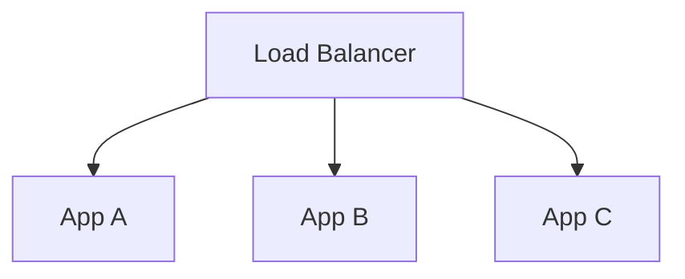

All three application processes are running.

But suppose App B has a problem:

* Its database connections are exhausted.
* Its application workers are stuck.
* It cannot access a required dependency.
* It is responding extremely slowly.
* It returns errors for most customer requests.

From the operating system's perspective, the process may still be running.

From the customer's perspective, the application may be broken.

This creates an important distinction:

**A running process is not necessarily a healthy application.**

A health check is a mechanism for collecting information about whether a component is functioning or ready for a particular responsibility.

Health checks help infrastructure make decisions about traffic, recovery, and operations.

# 2. What Is a Health Check?

A health check is a test used to evaluate the condition of a service, application instance, or infrastructure component.

For example, a load balancer may periodically send a request to an application:

```http
GET /health HTTP/1.1
Host: app.internal
```

The application responds:

```http
HTTP/1.1 200 OK
Content-Type: text/plain

OK
```

The load balancer evaluates the result according to its configuration.

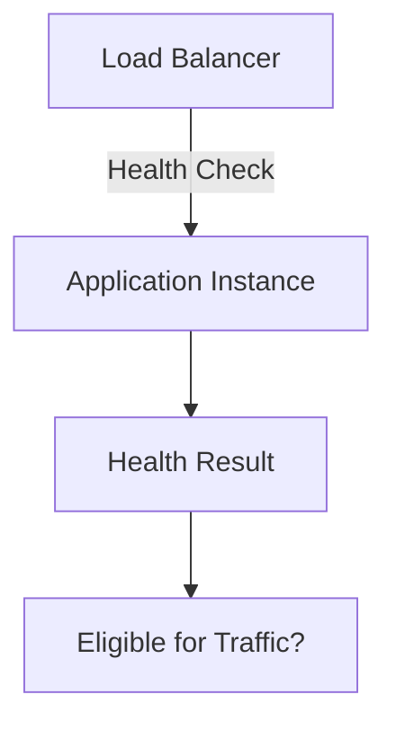

If the instance fails its configured health checks, the load balancer may stop sending it new traffic.

When the instance recovers and passes the required checks, it may become eligible again.

The exact behavior depends on the infrastructure and health-check configuration.

## Health Checks Are Signals, Not Guarantees

A health check does not prove that every request will succeed.

For example:

1. App A passes its health check.
2. A database connection fails immediately afterward.
3. A customer request reaches App A.
4. The customer request fails.

Health can change between checks.

A health check is therefore a useful observation at a particular time, not a guarantee about the future.

# 3. Three Important Types of Health Checks

Application platforms commonly distinguish three related concepts:

1. Liveness
2. Readiness
3. Startup

They answer different questions.

<AsyncImage query="Kubernetes liveness readiness startup probes comparison simple architecture diagram" aspectRatio="16:9" width="100%"/>

## 3.1 Liveness Check

A liveness check asks:

**"Is the application process functioning well enough to continue running?"**

Suppose your Node.js application becomes stuck in a deadlock or an unrecoverable internal state.

The process may still exist, but it cannot make useful progress.

A liveness check may detect that the application is no longer functioning properly.

Depending on the platform, a failed liveness check can trigger a restart.

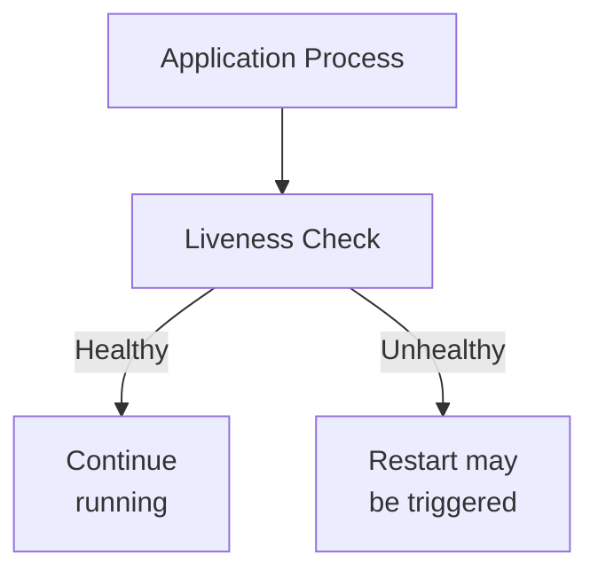

### When Is Liveness Useful?

Liveness is useful when an application can enter a state from which restarting is an appropriate recovery action.

Examples include:

* An unrecoverably stuck application process.
* A deadlocked worker.
* An internal failure that prevents the application from making progress.

### Important Caution

A liveness check should not automatically fail just because a shared database is temporarily unavailable.

Imagine ten application instances all depend on one database.

If the database goes down and every application's liveness check fails, the platform might restart all ten instances.

Those restarts may not fix the database problem and can make recovery more difficult.

**Liveness should primarily indicate whether restarting the application is appropriate, not whether every external dependency is healthy.**

## 3.2 Readiness Check

A readiness check asks:

**"Is this instance prepared to receive application traffic right now?"**

An application may be running but not ready.

For example:

* It is still loading configuration.
* It is initializing required components.
* It has not completed startup.
* It cannot safely serve the requests assigned to it.

A readiness check allows infrastructure to distinguish a running instance from one that is ready to serve.

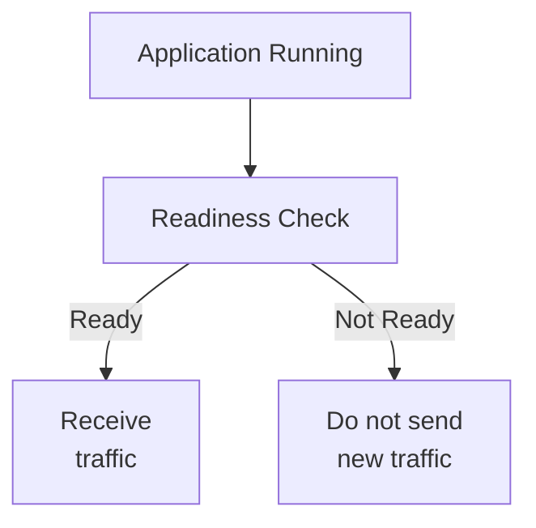

For example, a newly deployed application might need several seconds to initialize before it can serve requests.

During that period, it should not necessarily receive customer traffic.

### Readiness and Load Balancers

A load balancer may use a health endpoint or another signal to determine whether a backend should receive new requests.

Readiness is particularly relevant when application instances are being added, deployed, or removed.

However, not every load balancer directly understands a separate readiness probe. Some platforms use their own health-check mechanisms or integrate with orchestration systems.

## 3.3 Startup Check

A startup check asks:

**"Has the application completed its initial startup process?"**

Some applications take a long time to initialize.

For example, an application may need to:

* Load configuration.
* Initialize internal data structures.
* Establish required resources.
* Perform startup checks.
* Prepare its runtime.

If liveness checks begin too aggressively before startup is complete, the platform may repeatedly restart an application that is simply taking longer to initialize.

A startup check provides a way to account for this initial period.

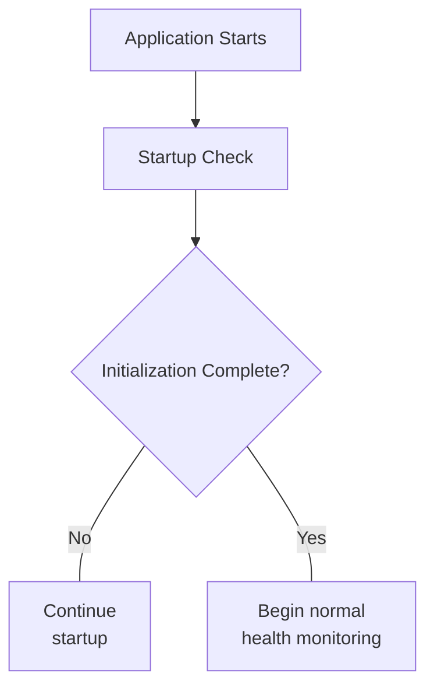

Some platforms suppress or delay other checks until the startup condition has been satisfied.

The exact interaction depends on the platform.

## Comparison

| Check     | Main Question                         | Typical Failure Response                         |
| --------- | ------------------------------------- | ------------------------------------------------ |
| Liveness  | Should this process continue running? | Restart may be triggered                         |
| Readiness | Should this instance receive traffic? | Remove from eligible traffic targets             |
| Startup   | Has initialization completed?         | Continue waiting or apply startup failure policy |

These checks are related, but they should not be treated as interchangeable.

# 4. Health Checks in a Load-Balanced Application

Let's connect health checks to the architecture from the previous chapters.

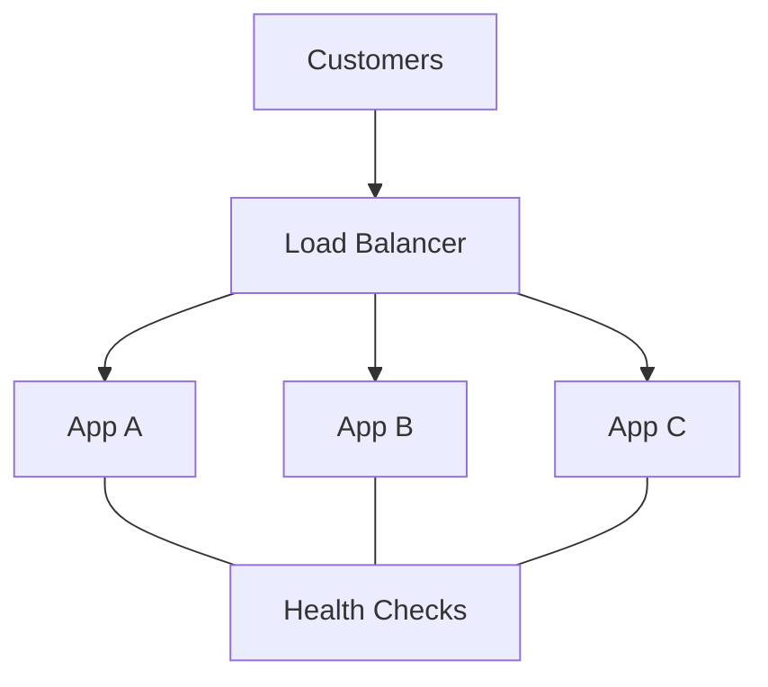

The load balancer evaluates each backend according to its configured health-check policy.

Suppose the results are:

| Instance | Health Result | Traffic Status |
| -------- | ------------- | -------------- |
| App A    | Healthy       | Eligible       |
| App B    | Unhealthy     | Ineligible     |
| App C    | Healthy       | Eligible       |

The load balancer can direct new requests to App A and App C while excluding App B.

This reduces the chance of sending new requests to a known-unhealthy instance.

However, it does not guarantee that every request will succeed.

The remaining instances may become overloaded, and a request already being processed by App B may still fail.

Health checks are one part of a broader reliability design.

# 5. Types of Health-Check Mechanisms

Health checks can operate at different levels.

The right mechanism depends on what you need to verify.

## 5.1 Process-Level Check

A process-level check verifies whether a process exists or responds to a local signal.

For example:

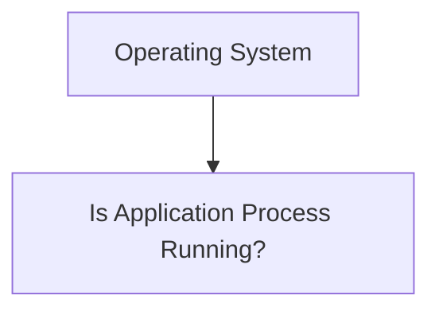

This can detect a process that has exited.

But it may not detect an application that is running and unable to process requests.

A process can exist while its worker threads are blocked or its dependencies are unavailable.

## 5.2 TCP Health Check

A TCP health check attempts to establish a TCP connection to a configured port.

For example:

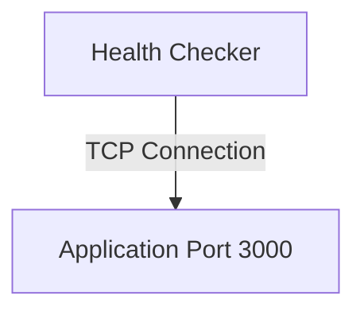

If the connection can be established, the check may be considered successful.

This is useful for verifying basic network reachability and whether a service is accepting connections.

However, a successful TCP connection does not prove that the application can correctly process an HTTP request or complete a business operation.

## 5.3 HTTP Health Check

An HTTP health check sends an HTTP request to a configured endpoint.

For example:

```http
GET /health HTTP/1.1
Host: app.internal
```

The checker evaluates the HTTP response.

It may consider:

* HTTP status code.
* Response time.
* Expected response content, if supported.
* Connection and protocol errors.

A simple endpoint might return:

```http
HTTP/1.1 200 OK
Content-Type: application/json

{"status":"ok"}
```

The exact success criteria depend on the health-check implementation.

## 5.4 Synthetic or Functional Checks

A synthetic check performs a more realistic operation to evaluate a service.

For example, an external monitoring system might:

1. Open the website.
2. Submit a test login.
3. Retrieve a product page.
4. Verify that the expected response is returned.

These checks can detect problems that a simple health endpoint misses.

But they may be more expensive, slower, or dependent on test data and external services.

A synthetic check is often useful for monitoring user-facing functionality, but it may not be suitable as a frequent low-level load-balancer health check.

# 6. Designing Health Endpoints

For a web application, you may expose endpoints such as:

```text
/health/live
/health/ready
```

The exact URL names are conventions, not universal standards.

Their purpose should be clearly defined.

## 6.1 Liveness Endpoint

A liveness endpoint should answer whether the application process can continue functioning.

A simple conceptual response:

```http
GET /health/live

200 OK
```

The endpoint should be lightweight.

It should not perform expensive work on every check.

For example, it generally should not run a complicated report query against the database just to prove that the application process is alive.

## 6.2 Readiness Endpoint

A readiness endpoint should answer whether the application can safely accept its expected traffic.

A simplified response:

```http
GET /health/ready

200 OK
```

Or, when the instance is not ready:

```http
GET /health/ready

503 Service Unavailable
```

The status code is illustrative; the platform's configured success criteria determine how the response is interpreted.

Readiness might consider whether required initialization is complete and whether critical resources are usable.

The definition must reflect the application's actual requirements.

For example, an application that can serve cached product pages during a temporary database outage may have different readiness requirements from a service that must access the database for every request.

## 6.3 Avoid Expensive Health Endpoints

Imagine a deployment with 100 application instances.

Each instance is checked every five seconds.

The approximate total check rate is:

$$
\frac{100}{5}=20
$$

That means approximately 20 health checks per second across the fleet, before accounting for multiple checkers or additional endpoints.

If each check executes several expensive database queries, the health-check system itself can add meaningful load to the database.

The health endpoint should therefore be designed with a clear purpose and appropriate cost.

# 7. Health-Check Intervals and Thresholds

Health checks are usually performed repeatedly rather than once.

A health-check policy may include:

* Interval.
* Timeout.
* Failure threshold.
* Success or recovery threshold.

These settings influence how quickly the system detects failures and how easily it reacts to temporary problems.

## 7.1 Interval

The interval determines how frequently the check is performed.

For example:

```text
10:00:00  Check
10:00:10  Check
10:00:20  Check
10:00:30  Check
```

This example uses a 10-second interval.

The actual timing may vary depending on the implementation.

A shorter interval can detect some failures sooner, but it generates more health-check traffic.

## 7.2 Timeout

The timeout determines how long the checker waits for a response or operation to complete.

Suppose:

```text
Health Check Timeout: 3 seconds
```

If the check does not complete within the configured period, it may be considered failed.

A timeout should reflect the expected behavior of the health endpoint.

A lightweight local endpoint should not normally need the same timeout as a complex external business operation.

## 7.3 Failure Threshold

A failure threshold specifies how many consecutive failed checks are required before a target is considered unhealthy.

For example:

```text
Failure Threshold: 3

Check 1: Fail
Check 2: Fail
Check 3: Fail

Result: Mark Unhealthy
```

This can reduce the effect of a single transient failure.

But it also delays detection compared with marking a target unhealthy after the first failure.

## 7.4 Recovery Threshold

Some systems require one or more successful checks before an unhealthy target becomes healthy again.

For example:

```text
Target: Unhealthy

Check 1: Success
Check 2: Success

Result: Mark Healthy
```

The number of required successful checks depends on configuration.

This helps avoid rapid state changes when an application is unstable.

## 7.5 The Trade-off

| Aggressive Checks                 | Conservative Checks                             |
| --------------------------------- | ----------------------------------------------- |
| May detect failures sooner        | May avoid reacting to brief disturbances        |
| Can generate more check traffic   | Can generate less check traffic                 |
| May cause false positives         | May delay removal of failed targets             |
| Can cause frequent target changes | Can leave unhealthy targets eligible for longer |

The goal is not simply to make checks as frequent as possible.

The goal is to choose settings appropriate to the failure modes and recovery behavior of the application.

# 8. Dependency Health: Should Every Dependency Be Checked?

Consider an application that depends on:

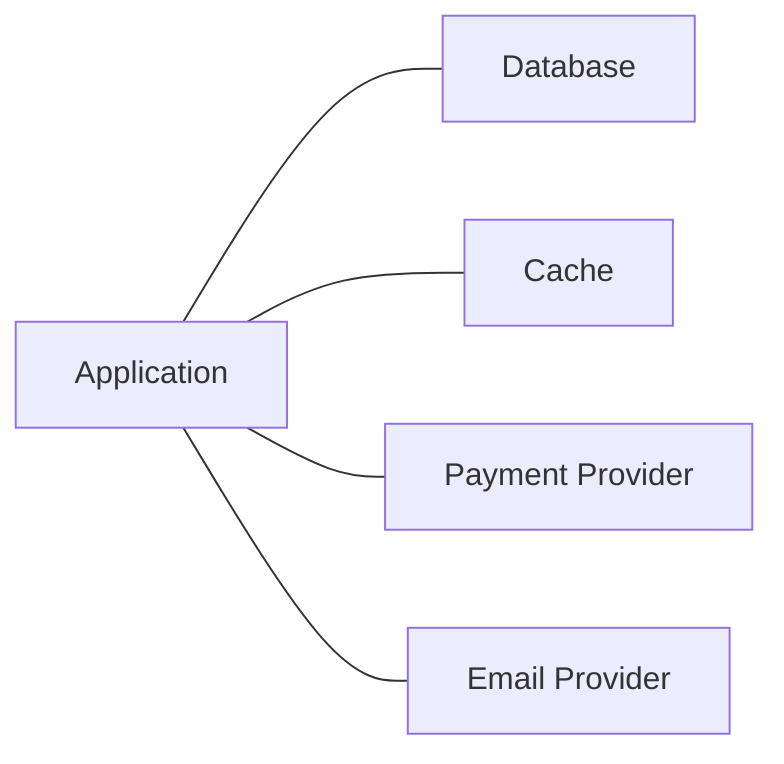

Should the application's readiness endpoint check every dependency?

Not necessarily.

The answer depends on which operations the application must be able to perform.

## 8.1 Required Dependencies

Suppose an order-processing service cannot accept any order without access to its primary database.

Database availability may be an important readiness condition for that service.

If the application cannot safely process orders, marking it ready may direct customers to an instance that cannot perform its primary responsibility.

## 8.2 Optional Dependencies

Now consider an email provider.

If email delivery is asynchronous, the application may still be able to accept an order while email delivery is temporarily unavailable.

The order can be stored and the email can be sent later through a queue.

In that architecture, email-provider availability may not need to determine whether the order API is ready.

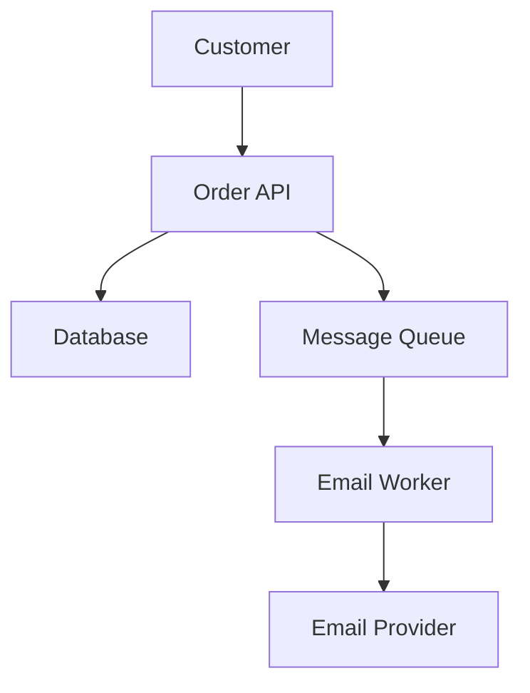

The order API can potentially accept work even when the email provider is temporarily unavailable, provided the database and queue are functioning and the application is designed for that behavior.

This illustrates why health checks should reflect the application's actual responsibilities.

## 8.3 Avoid Cascading Health Failures

Imagine 50 application instances all depend on one database.

The database becomes temporarily unavailable.

If every readiness check fails immediately, the load balancer may mark all 50 instances unhealthy.

When the database recovers, the system may also need to recover the application instances and restore their eligibility.

Poorly designed checks can amplify a shared dependency failure.

This does not mean readiness should ignore critical dependencies. It means the health policy should consider the failure mode, recovery process, and effect of removing all targets.

A health check should help the system recover, not merely report that something is wrong.

# 9. Health Checks and Graceful Shutdown

Health checks are important during deployments and instance removal, not just failures.

Suppose App A is being replaced with a new version.

The system should stop sending new requests to App A before terminating it, while allowing existing work to finish when possible.

A simplified sequence:

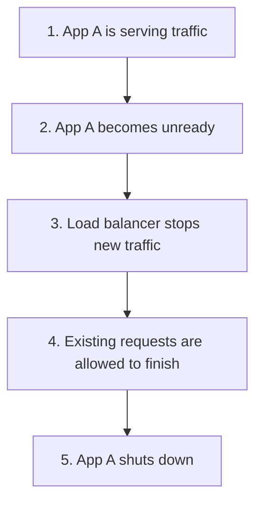

This is related to connection draining and graceful shutdown.

The exact sequence depends on the load balancer, application platform, and deployment system.

For example, a platform may deregister the instance from the load balancer before stopping the application process.

## Why This Matters

Without graceful shutdown, a deployment may interrupt:

* An order submission.
* A file upload.
* A long-running request.
* A request waiting for a database operation.

Removing an instance from new traffic does not automatically guarantee that every existing request finishes successfully.

The application needs appropriate shutdown handling, and the infrastructure needs suitable draining and timeout settings.

# 10. Health Checks and Failure Detection

A health check is one part of failure detection.

Consider this simplified process:

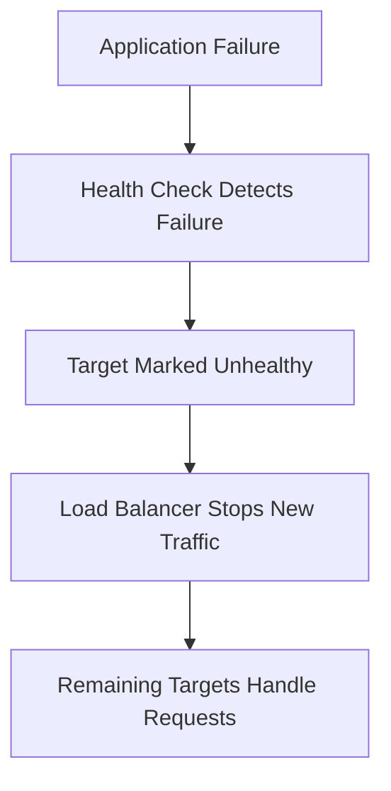

Several things can affect the outcome.

### Detection Delay

The failure may occur immediately after a successful check.

The next check may not happen until the following interval.

The timeout and failure threshold can add further delay.

### Remaining Capacity

If one of three instances fails, the remaining two must handle the incoming traffic.

If they do not have enough capacity, they may become overloaded.

### Shared Dependencies

If all instances depend on the same failed database, removing one instance may not help.

### In-Flight Requests

Requests already sent to the failed instance may fail.

The load balancer's handling of those requests depends on the protocol and configuration.

Retries may be possible, but they are not always safe.

For example, a payment request may have completed at the backend even if the response was lost.

The application must use suitable idempotency and transaction handling before retrying operations that can change data.

Health checks help route traffic around detected failures, but they are not a complete recovery system.

# 11. Common Health-Check Mistakes

| Mistake                                                           | Why It Matters                                                    |
| ----------------------------------------------------------------- | ----------------------------------------------------------------- |
| Treating process existence as application health                  | A running process may be unable to serve requests                 |
| Using one endpoint for every health purpose                       | Liveness, readiness, and startup answer different questions       |
| Checking every dependency on every liveness request               | Shared failures can trigger unnecessary restarts                  |
| Running expensive database queries during frequent checks         | Health monitoring can increase load on an already stressed system |
| Using overly aggressive failure thresholds                        | Temporary disturbances may remove healthy instances               |
| Using overly relaxed checks                                       | Failed instances may continue receiving traffic                   |
| Assuming a successful check guarantees the next request           | Application health can change between checks                      |
| Ignoring graceful shutdown                                        | Deployments can interrupt active requests                         |
| Treating readiness as a complete end-to-end reliability guarantee | Other services and dependencies can still fail                    |

# 12. Practical Example: Learn Computer Academy Website

Imagine Learn Computer Academy runs a website with a PHP application behind a load balancer.

The application uses:

* PHP application workers.
* A database for course enquiries.
* A cache for selected data.
* An external email service for enquiry notifications.

A simplified architecture:

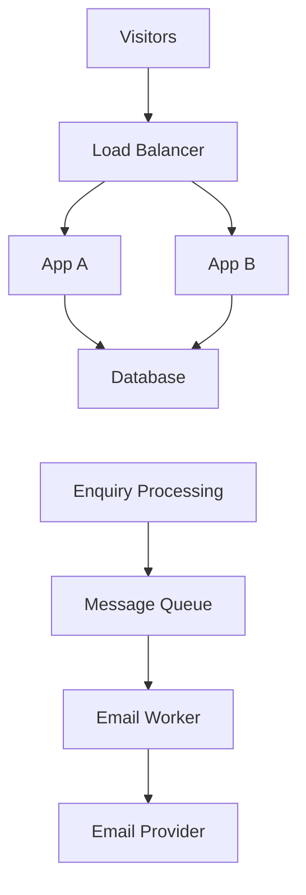

A reasonable health-check design would distinguish the responsibilities of each component.

| Component             | Example Health Question                                      |
| --------------------- | ------------------------------------------------------------ |
| Application liveness  | Is the application process functioning?                      |
| Application readiness | Can this instance safely accept website or enquiry requests? |
| Database              | Is the database accepting connections and responding?        |
| Email worker          | Is the worker running and able to process queued messages?   |
| Email provider        | Can the email integration currently deliver messages?        |

The website may still be able to accept an enquiry even if the email provider is temporarily unavailable, provided the enquiry is safely stored and the system supports later delivery.

The health-check design should reflect that architecture rather than marking the entire website unavailable for every external-service problem.

# 13. Key Principles

1. A running process is not necessarily a healthy application.
2. Liveness asks whether the process should continue running.
3. Readiness asks whether an instance should receive traffic.
4. Startup checks account for applications that need time to initialize.
5. TCP checks, HTTP checks, and functional checks verify different levels of behavior.
6. Health-check intervals, timeouts, and thresholds determine detection speed and sensitivity.
7. Health checks should reflect critical application responsibilities and failure behavior.
8. Avoid making liveness depend unnecessarily on shared external services.
9. Readiness can help manage deployments, scaling, and removal from traffic.
10. Health checks do not guarantee that requests will succeed or replace complete reliability engineering.

# 14. Quick Reference

| Term                | Meaning                                                                                      |
| ------------------- | -------------------------------------------------------------------------------------------- |
| Health check        | Test used to evaluate a component's condition                                                |
| Liveness            | Whether an application should continue running                                               |
| Readiness           | Whether an instance is prepared to receive traffic                                           |
| Startup check       | Whether initial application startup has completed                                            |
| TCP check           | Verifies basic transport connection behavior                                                 |
| HTTP check          | Evaluates an HTTP endpoint response                                                          |
| Synthetic check     | Simulates a user-facing operation                                                            |
| Interval            | How frequently a check runs                                                                  |
| Timeout             | How long a check waits for completion                                                        |
| Failure threshold   | Number of failures needed to mark a target unhealthy                                         |
| Recovery threshold  | Successful checks required to restore healthy status                                         |
| Graceful shutdown   | Controlled termination that attempts to finish existing work                                 |
| Connection draining | Stops new traffic while allowing existing connections or requests to finish, where supported |

# 15. Knowledge Check

**1.** A Node.js process is running, but its event loop is permanently blocked. Does process existence alone prove that the application is healthy?

**2.** An application is still loading configuration after startup. Which health concept determines whether it should receive customer traffic?

**3.** Why should a liveness check generally avoid failing just because a shared database is temporarily unavailable?

**4.** A TCP health check succeeds, but the application's HTTP endpoint returns errors. What does this tell you about the limits of TCP health checks?

**5.** Why can an excessively aggressive health-check policy make a system less stable?

**6.** Your order API stores orders in a database and sends email asynchronously through a queue. Why might a temporary email-provider failure not require marking the order API unready?

**7.** During deployment, why should an instance stop receiving new traffic before it is terminated?

## Answers

1. No. A process can exist while being unable to make useful progress.
2. Readiness. The instance is not yet prepared to receive traffic.
3. Because restarting every application instance may not fix the database failure and could make recovery more difficult.
4. TCP success only demonstrates basic transport-level connectivity. It does not prove that the application can correctly process HTTP requests.
5. Temporary failures may cause healthy instances to be marked unhealthy, leading to unnecessary traffic shifts or restarts.
6. Because the API may still safely store the order and allow the email worker to retry delivery later, assuming the architecture supports that behavior.
7. To reduce the chance of interrupting new or ongoing requests during shutdown and deployment.

# Final Mental Model

A health check is a signal about whether a component can perform a particular responsibility.

Liveness helps determine whether a process should continue running. Readiness helps determine whether it should receive traffic. Startup checks account for initialization.

The system must interpret those signals carefully. A poorly designed health check can trigger unnecessary restarts, remove too many instances, or amplify a shared dependency failure.

**Check the right thing, at the right level, for the right operational decision.**
