# 02.09 — Failover

## Learning Objectives

By the end of this chapter, you should be able to:

* Explain what **failover** means in a distributed application.
* Understand why failover is needed even when health checks and load balancing exist.
* Distinguish **active-passive** and **active-active** failover.
* Understand automatic vs manual failover.
* Explain what happens during a failover event.
* Understand why failover is easy for stateless components but harder for stateful systems.
* Understand the relationship between failover, replication, data loss, and service availability.
* Identify common failover problems and design safer failover mechanisms.

---

# 1. What Is Failover?

**Failover** is the process of switching work from a failed or unhealthy component to another healthy component.

In simple words:

> **If the primary component stops working, use another component instead.**

For example:

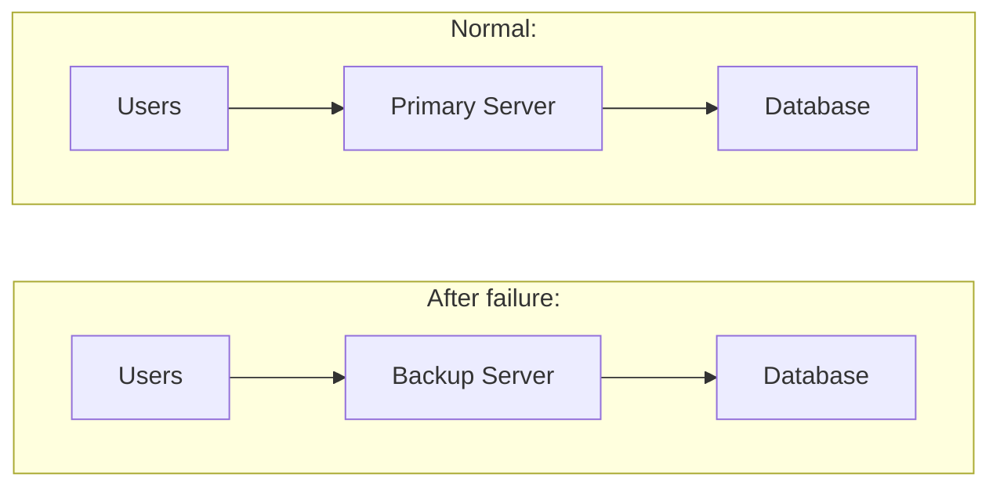

The goal is simple:

**Keep the system working even when something fails.**

---

# 2. Why Do We Need Failover?

Every production system has components that can fail.

A server can:

* crash
* lose network connectivity
* run out of resources
* become unhealthy
* lose access to a dependency
* suffer hardware failure
* become unavailable because an entire availability zone fails

If the system has only one component:

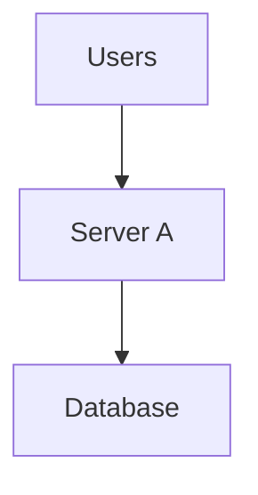

and Server A fails:

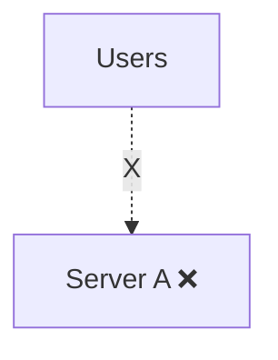

The service becomes unavailable.

With another server:

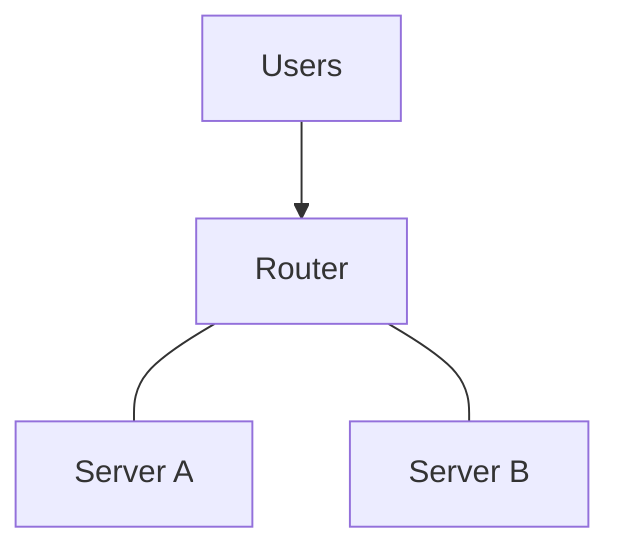

the system can switch traffic to Server B.

That switch is **failover**.

---

# 3. Failover Is Not the Same as Load Balancing

These concepts are related but different.

### Load balancing

Load balancing normally distributes traffic among multiple healthy components.

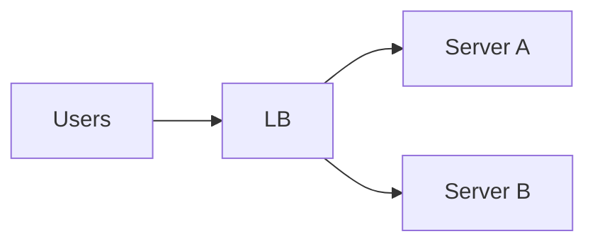

Both servers may actively handle traffic.

### Failover

Failover changes where traffic goes because the preferred component has failed.

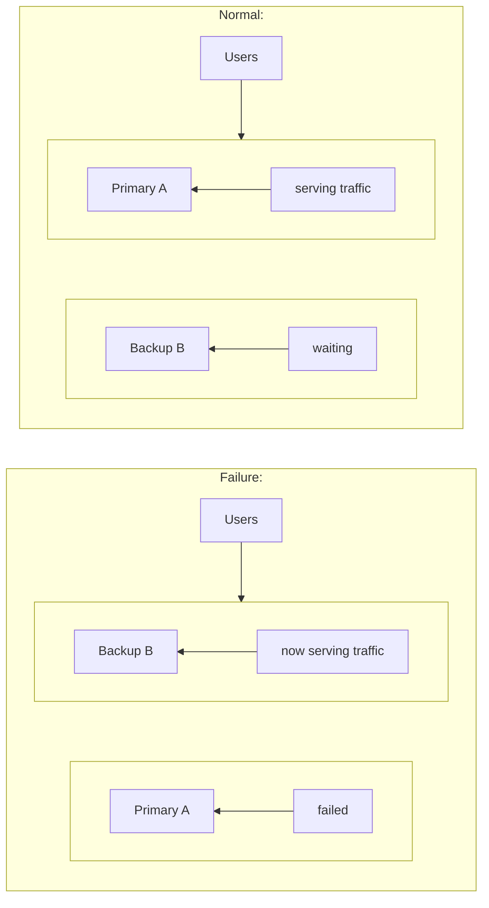

### Important distinction

> **Load balancing distributes work. Failover preserves service when a component becomes unavailable.**

A system can use both.

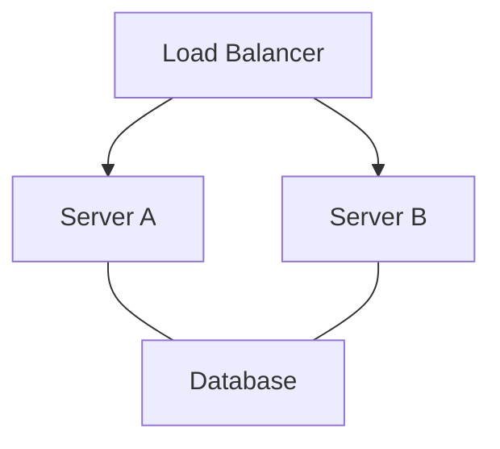

If Server A fails, the load balancer stops sending traffic to it and continues with Server B.

That is **load balancing combined with failover**.

---

# 4. Failover Depends on Redundancy

Failover requires an alternative.

If there is only one component, there is nowhere to fail over to.

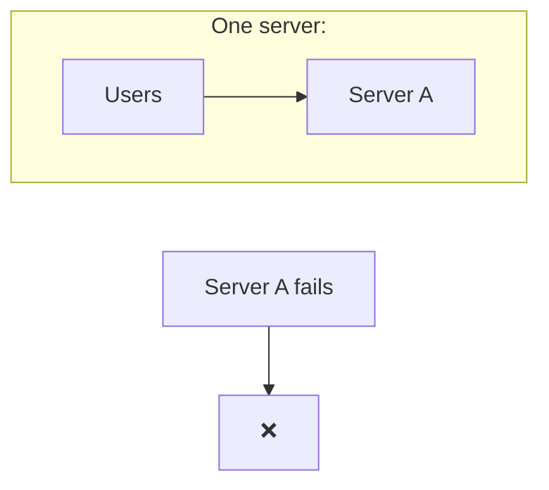

With redundancy:

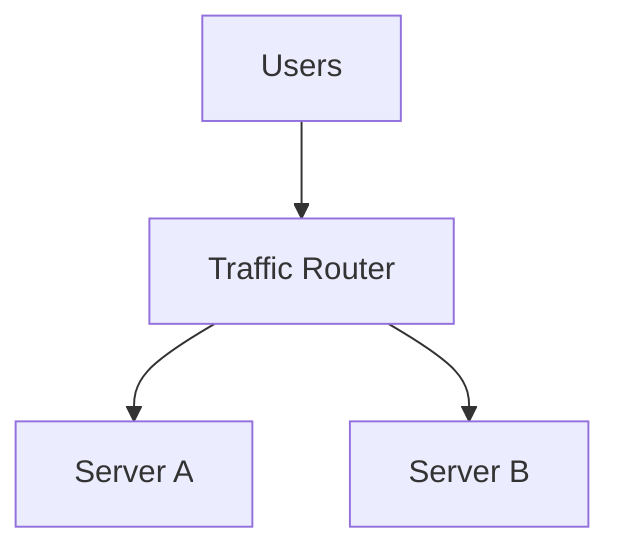

If Server A fails:

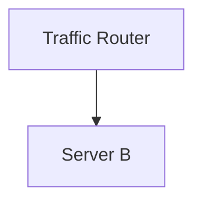

Therefore:

> **Redundancy creates the possibility of failover.**

---

# 5. Active-Passive Failover

One common model is **active-passive**.

One component actively serves traffic.

Another component waits as a standby.

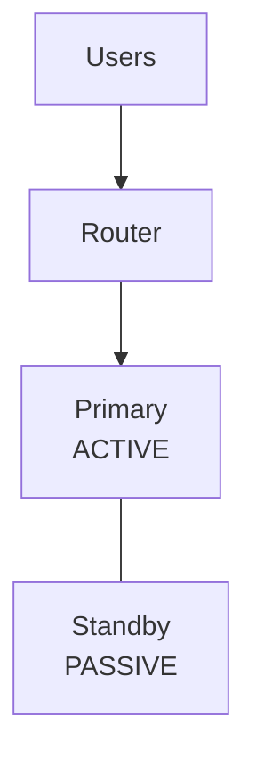

Normally:

```text
Primary -> handles traffic
Standby -> waits
```

If the primary fails:

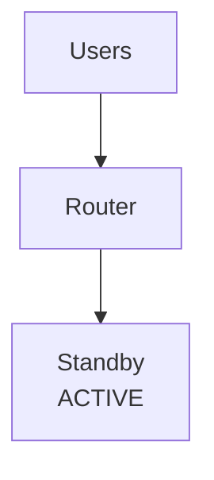

The standby takes over.

## Advantages

* Easier to reason about.
* Only one component may have write authority.
* Useful for stateful systems.
* Can simplify data consistency.

## Trade-off

The standby may sit partially or completely unused during normal operation.

You are paying for capacity that may primarily exist for failure scenarios.

---

# 6. Active-Active Failover

In an **active-active** architecture, multiple components actively serve traffic.

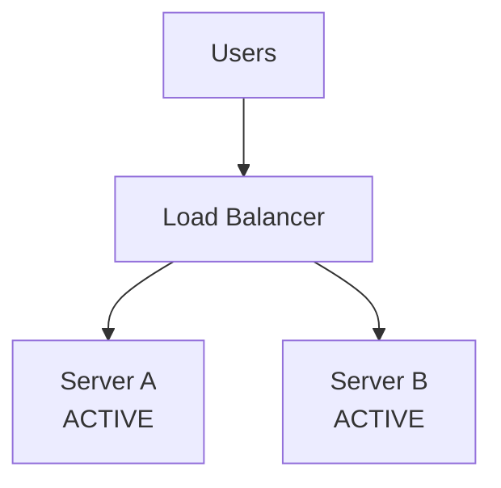

Both servers are doing useful work.

If Server A fails:

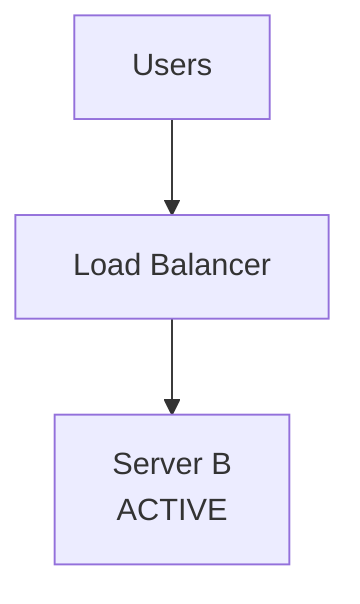

Server B continues serving requests.

## Advantages

* Resources are useful during normal operation.
* Traffic can be distributed.
* Failure of one instance does not necessarily require promotion of an idle standby.

## Challenge

Active-active systems require more coordination.

For example:

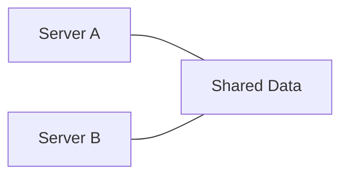

What happens if both servers modify the same data?

You need a clear strategy for:

* data consistency
* write ownership
* replication
* conflicts
* ordering
* concurrent updates

Simply running two copies of an application does **not** automatically make a stateful system active-active.

---

# 7. Automatic vs Manual Failover

Failover can be performed automatically or manually.

## Automatic Failover

The system detects failure and switches automatically.

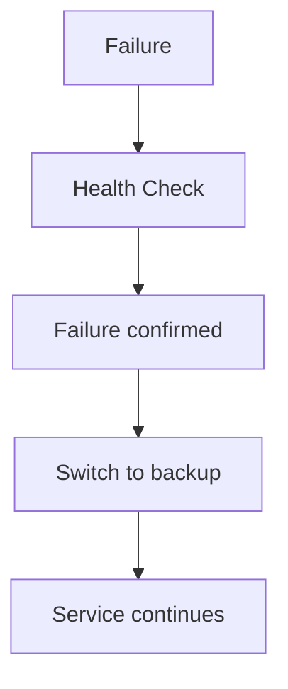

This can happen without a human operator.

### Benefit

Fast response.

### Risk

A bad failure detector can make the wrong decision.

For example:

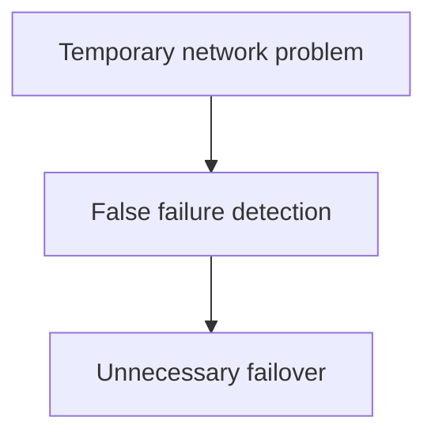

So automation must be designed carefully.

---

## Manual Failover

An operator makes the decision.

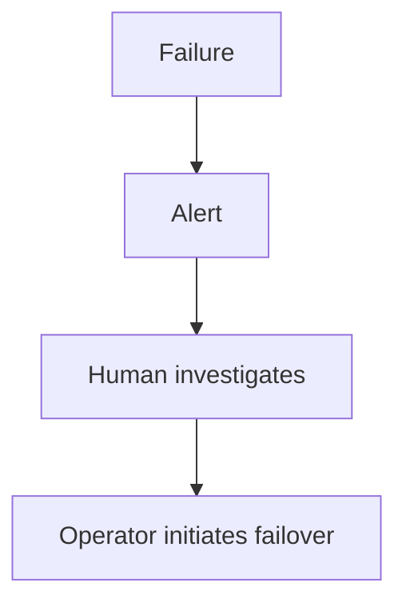

This can be safer for complicated systems where an automatic decision could make things worse.

But it is slower.

---

# 8. What Triggers a Failover?

A failover mechanism needs a way to determine whether a component should still receive work.

Possible signals include:

* failed health check
* unreachable network endpoint
* process failure
* repeated application failures
* loss of database connectivity
* infrastructure failure
* loss of an availability zone

A simplified decision:

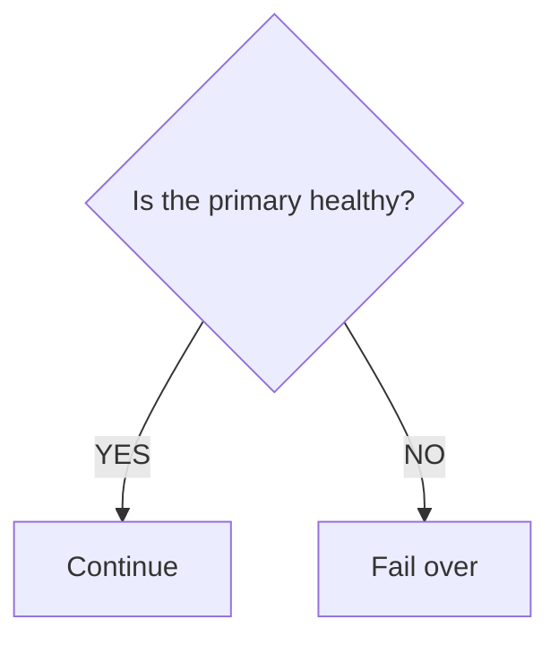

The important question is:

> **How confident are we that the primary is actually unavailable?**

This is harder than it first appears.

---

# 9. Failover Flow

A simplified failover process looks like this:

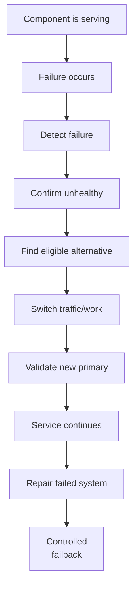

Each step matters.

Failover is not simply:

```mermaid
flowchart TD
  accTitle: Simple failover
  accDescr: A failed, so use B.
  N0["A failed"] --> N1["Use B"]
```

A production system needs to know:

* Is B healthy?
* Does B have enough capacity?
* Does B have the required state?
* Is B allowed to accept writes?
* Can clients reach B?
* Will switching cause duplicate operations?
* What happened to requests already in progress?

---

# 10. Stateless Failover Is Easier

Stateless application servers are relatively easy to fail over.

Suppose:

```mermaid
flowchart TD
  accTitle: Two stateless app servers
  accDescr: The load balancer sends traffic to app server A and app server B.
  L["Load Balancer"] --> A["App Server A"] & B["App Server B"]
```

If A fails:

```mermaid
flowchart TD
  accTitle: One stateless app server remains
  accDescr: The load balancer sends all traffic to app server B.
  N0["Load Balancer"] --> N1["App Server B"]
```

B can usually accept new requests without needing A's local memory.

This is one reason stateless application design is valuable.

---

# 11. Stateful Failover Is Harder

Now consider a system where important state exists inside Server A.

```mermaid
flowchart TD
  accTitle: State inside a server
  accDescr: Server A holds a user session, temporary state, in-memory data and an in-progress operation.
  subgraph S["Server A"]
    direction TB
    S0["User session"] ~~~ S1["Temporary state"] ~~~ S2["In-memory data"] ~~~ S3["In-progress operation"]
  end
```

If A suddenly disappears:

```mermaid
flowchart TD
  accTitle: State lost with the server
  accDescr: Server A fails and its state is lost.
  S["Server A"] -. "X" .- L["lost state"]
```

Server B may not know what A knew.

Therefore:

> **Failover is much easier when important state is stored somewhere that the replacement can access.**

For example:

```mermaid
flowchart LR
  accTitle: State in a shared database
  accDescr: App A, App B and App C all use a shared database.
  A["App A"] & B["App B"] & C["App C"] --- D["Shared Database"]
```

The application instances can be replaced without losing the primary source of application state.

---

# 12. Database Failover

Database failover is more complicated.

Consider:

```mermaid
flowchart TD
  accTitle: Database replication
  accDescr: The application uses the primary database, which replicates to a replica database.
  N0["Application"] --> N1["Primary Database"] --> N2["Replica Database"]
```

The primary accepts writes.

The replica receives replicated data.

If the primary fails:

```mermaid
flowchart TD
  accTitle: Database failover
  accDescr: The application loses the primary, which has failed. The replica is a potential new primary.
  A["Application"] -. "X" .-> P["Primary ❌"]
  P ~~~ R["Replica"] --> N["Potential new primary"]
```

The replica may need to be promoted.

But there is an important question:

> **Does the replica contain every write that the old primary had already accepted?**

Not necessarily.

---

# 13. Replication Lag Matters

Imagine:

```text
Primary:

Order #100
Order #101
Order #102
Order #103
```

The replica has received:

```text
Order #100
Order #101
Order #102
```

There is replication lag.

Then the primary fails.

```text
Primary:
#100 #101 #102 #103  ❌

Replica:
#100 #101 #102
```

If the replica becomes primary, information about `#103` may be unavailable.

This means:

> **Failover can preserve service while potentially losing some recently accepted data, depending on the replication design.**

The amount and nature of possible data loss depend on how replication and write acknowledgment are configured.

Detailed replication architecture comes later in Level 4.

---

# 14. Failover Has a Data Question

When designing failover for stateful systems, always ask:

```mermaid
flowchart TD
  accTitle: The data question
  accDescr: Where is the state? Is it replicated? How current is the copy? What happens to missing data?
  N0["Where is the state?"] --> N1["Is it replicated?"] --> N2["How current is the copy?"] --> N3["What happens to missing data?"]
```

This is more important than simply asking:

> "Do we have a backup server?"

A backup server that has stale state may keep the application running but may not have all the data.

---

# 15. In-Flight Requests

Failure can happen while a request is being processed.

For example:

```mermaid
flowchart TD
  accTitle: A request in flight
  accDescr: The user sends POST /checkout to server A, which is processing payment when server A fails.
  U["User"] -->|"POST /checkout"| S["Server A"] ---|"processing payment"| X["X Server A fails"]
```

Now what should happen?

The client may not know whether the operation succeeded.

```mermaid
flowchart TD
  accTitle: An unknown outcome
  accDescr: The client asks, did my order succeed? The answer is unknown.
  subgraph C["Client:"]
    Q["#quot;Did my order succeed?#quot;"] --> U["Unknown"]
  end
```

If the client sends the request again:

```mermaid
flowchart TD
  accTitle: A retried request
  accDescr: POST /checkout reaches server B.
  N0["POST /checkout"] --> N1["Server B"]
```

the operation could potentially happen twice unless the system is designed to prevent duplicates.

This is one reason **idempotency** becomes important in failover scenarios.

Detailed idempotency and retry behavior will be covered later in the curriculum.

---

# 16. Capacity After Failover

Another important question:

> **Can the surviving components handle the load after failure?**

Suppose normal traffic is:

```text
100 requests/sec
```

and two servers share it:

```text
Server A -> 50 RPS
Server B -> 50 RPS
```

If A fails, B may suddenly need to handle:

```text
Server B -> 100 RPS
```

If B can handle only 60 RPS, failover has occurred but the system is still overloaded.

```mermaid
flowchart TD
  accTitle: Overload after failover
  accDescr: Server A fails and server B receives 100 RPS with a capacity of 60 RPS, so it is overloaded.
  A["Server A ❌"] --> B["Server B"] --- G
  subgraph G[" "]
    direction TB
    G0["100 RPS"] ~~~ G1["Capacity: 60 RPS"]
  end
  G --> O["Overload"]
```

Therefore:

> **Failover capacity must be planned, not assumed.**

---

# 17. N+1 Capacity

A simple way to think about redundancy is **N+1 capacity**.

Suppose you normally need:

```text
N = 3 servers
```

You may provision:

```text
3 required
+
1 additional
=
4 servers
```

If one fails, the remaining three can continue serving the expected workload.

Conceptually:

```text
Normal:

A  B  C  D
|  |  |  |
Active Active Active Spare/extra


After A fails:

A  ❌
B  Active
C  Active
D  Active
```

The exact capacity strategy depends on traffic, cost, and failure scenarios.

The principle is:

> **A failover target must have enough capacity to be useful.**

---

# 18. Failover and Availability Zones

Failure does not always happen at the individual server level.

An entire infrastructure location can become unavailable.

For example:

```mermaid
flowchart TD
  accTitle: Failover across availability zones
  accDescr: The load balancer sends traffic to servers in AZ-A and servers in AZ-B.
  L["Load Balancer"] --> A["AZ-A"] & B["AZ-B"]
  A --- SA["Servers"]
  B --- SB["Servers"]
```

If AZ-A becomes unavailable:

```mermaid
flowchart TD
  accTitle: One zone remains
  accDescr: The load balancer sends all traffic to the servers in AZ-B.
  N0["Load Balancer"] --> N1["AZ-B<br/>Servers"]
```

This is stronger than simply putting two servers in the same physical failure domain.

The broader principle is:

> **Do not put all of your redundancy inside the same failure domain.**

Multi-AZ and multi-region designs are covered in greater detail later.

---

# 19. DNS Failover

Failover can also happen at the DNS level.

Conceptually:

```mermaid
flowchart TD
  accTitle: DNS failover
  accDescr: example.com resolves through DNS to A or B.
  E["example.com"] --> D["DNS"] --- A["A"] & B["B"]
```

If A becomes unavailable, DNS-based mechanisms can direct new clients toward B.

However, DNS is not an instant traffic switch.

Caching can cause clients and resolvers to continue using previously returned DNS information.

Therefore:

> **DNS failover has different timing and behavior from load-balancer failover.**

Never assume changing DNS means every client immediately switches.

---

# 20. Failover vs Failback

These two terms are often confused.

### Failover

Move from the failed primary to the alternate.

```mermaid
flowchart TD
  accTitle: Failover
  accDescr: Primary A fails and backup B takes over.
  A["Primary A"] -. "X" .-> B["Backup B"]
```

### Failback

After A has been repaired, deliberately move the workload back.

```mermaid
flowchart TD
  accTitle: Failback
  accDescr: B is active, A is repaired and resynchronized, a controlled switch follows, and A is active again.
  N0["B is active"] --> N1["A repaired"] --> N2["A resynchronized"] --> N3["Controlled switch"] --> N4["A active again"]
```

Failback should not necessarily happen immediately.

The repaired system may need to:

1. become healthy
2. synchronize state
3. pass validation
4. rejoin safely
5. receive traffic gradually

A sudden automatic switch-back can create another outage.

---

# 21. Failover Flapping

Consider this situation:

```mermaid
flowchart TD
  accTitle: Failover flapping
  accDescr: A is healthy, A fails, switch to B, A appears healthy, switch back to A, A fails again, switch to B.
  N0["A healthy"] --> N1["A fails"] --> N2["Switch to B"] --> N3["A appears healthy"] --> N4["Switch back to A"] --> N5["A fails again"] --> N6["Switch to B"]
```

The system repeatedly switches between components.

This is sometimes called **flapping**.

It can make an already unstable situation worse.

A failover system therefore often needs:

* failure thresholds
* recovery thresholds
* stabilization periods
* controlled re-entry
* monitoring

The goal is not:

> "Switch as quickly as possible."

The goal is:

> **"Switch when there is sufficient evidence that switching improves the situation."**

---

# 22. Split-Brain Awareness

Imagine an active-passive database:

```text
Normal:

A = Primary
B = Standby
```

Now a network partition occurs.

A cannot communicate with B.

Both sides might incorrectly believe the other has failed.

```mermaid
flowchart TD
  accTitle: Split brain
  accDescr: A network partition separates A and B. A thinks B failed and B thinks A failed, so both become primary.
  N["Network Partition<br/>X"]
  N ~~~ A["A<br/>#quot;B failed#quot;"] --- PA["PRIMARY"]
  N ~~~ B["B<br/>#quot;A failed#quot;"] --- PB["PRIMARY"]
```

Now both may attempt to become authoritative.

This situation is known as **split brain**.

Preventing split brain may require mechanisms such as:

* quorum
* fencing
* leader election
* clear write authority

These distributed-system concepts are explored in later chapters.

For now, remember:

> **Failover must not accidentally create two competing primaries.**

---

# 23. Failover Testing

A failover strategy that has never been tested is only a design assumption.

You should test scenarios such as:

```text
Server failure
Network failure
Database failure
Availability-zone failure
Dependency failure
High traffic during failure
Recovery of failed component
```

A simplified test:

```mermaid
flowchart TD
  accTitle: Failover testing
  accDescr: Start from a healthy system and simulate failure. Does failover happen? Does service continue? Is data correct? Can the failed component safely return?
  N0["Healthy system"] --> N1["Simulate failure"] --> N2["Does failover happen?"] --> N3["Does service continue?"] --> N4["Is data correct?"] --> N5["Can the failed component safely return?"]
```

Testing can reveal problems that diagrams cannot.

---

# 24. Common Failover Mistakes

## Mistake 1 — Assuming a backup automatically works

```text
Primary ❌
Backup ???

```

A standby may be:

* misconfigured
* outdated
* overloaded
* missing state
* unreachable

A backup is useful only if it is actually capable of taking over.

---

## Mistake 2 — Ignoring capacity

```text
Server A ❌
Server B overloaded
```

Having another server does not guarantee successful failover.

---

## Mistake 3 — Ignoring state

A replacement server may not have:

* current data
* sessions
* configuration
* required secrets
* queued work
* current database state

---

## Mistake 4 — Failing over on a temporary problem

A short network issue can be mistaken for complete failure.

```mermaid
flowchart TD
  accTitle: Failing over on a temporary problem
  accDescr: A temporary problem causes false failure detection and an unnecessary failover.
  N0["Temporary problem"] --> N1["False failure detection"] --> N2["Unnecessary failover"]
```

---

## Mistake 5 — Forgetting failback

The original system may remain:

```text
broken / isolated / unsynchronized
```

even after traffic has moved elsewhere.

---

## Mistake 6 — Testing only the happy path

You must test the actual failure.

Not:

```text
"Everything looks healthy."
```

but:

```text
"What happens if this component disappears right now?"
```

---

# 25. Real-World Example: E-Commerce Checkout

Imagine an online store.

```mermaid
flowchart TD
  accTitle: E-commerce checkout
  accDescr: The customer reaches the load balancer, which sends traffic to App A and App B, which use the database.
  U["Customer"] --> L["Load Balancer"] --> A["App A"] & B["App B"]
  A & B --> D["Database"]
```

Normally both application servers handle traffic.

Now App A fails.

```mermaid
flowchart TD
  accTitle: After App A fails
  accDescr: The customer reaches the load balancer, App B and the database.
  N0["Customer"] --> N1["Load Balancer"] --> N2["App B"] --> N3["Database"]
```

The load balancer detects that A is unhealthy and stops sending new requests to it.

This is failover at the application-instance level.

Now consider the database itself failing.

```mermaid
flowchart TD
  accTitle: Database failover in checkout
  accDescr: The app servers lose the primary database, which has failed, and move to the replica database.
  A["App Servers"] -. "X" .-> P["Primary DB ❌"] --> R["Replica DB"]
```

A database failover mechanism may promote an eligible replica and redirect database connections.

But now additional questions arise:

* Was the replica fully synchronized?
* Could recent writes be missing?
* Can the application reconnect?
* Is the new primary writable?
* What happens to transactions that were in progress?
* Is the recovered primary safe to rejoin?

This demonstrates an important point:

> **The more state a component owns, the more complicated failover becomes.**

---

# 26. Failover as a System Design Decision

When designing failover, ask these questions:

```mermaid
flowchart TD
  accTitle: Failover as a design decision
  accDescr: 1. What can fail? 2. What is the alternative? 3. How will failure be detected? 4. How will the system decide to switch? 5. Can the alternative handle the load? 6. Does it have the required state? 7. Could data be lost? 8. Could requests be duplicated? 9. How will we validate the new state? 10. How will the failed component return?
  N0["1#46; What can fail?"] --> N1["2#46; What is the alternative?"] --> N2["3#46; How will failure be detected?"] --> N3["4#46; How will the system decide to switch?"] --> N4["5#46; Can the alternative handle the load?"] --> N5["6#46; Does it have the required state?"] --> N6["7#46; Could data be lost?"] --> N7["8#46; Could requests be duplicated?"] --> N8["9#46; How will we validate the new state?"] --> N9["10#46; How will the failed component return?"]
```

These questions are often more valuable than simply saying:

> "We need high availability."

---

# 27. Failover vs Related Concepts

| Concept               | Main Purpose                                  |
| --------------------- | --------------------------------------------- |
| **Redundancy**        | Have additional components available          |
| **Health Check**      | Determine whether a component is healthy      |
| **Load Balancing**    | Distribute work among components              |
| **Failover**          | Switch work away from a failed component      |
| **Failback**          | Return to the recovered component             |
| **Recovery**          | Restore a failed component/system             |
| **Disaster Recovery** | Restore service after larger-scale disruption |

A useful mental model:

```mermaid
flowchart TD
  accTitle: Failover and related concepts
  accDescr: Redundancy means an alternative exists; a health check detects a problem; failover switches the workload; service continues; recovery repairs the failed component; failback may return the workload.
  N0["Redundancy"] --> N1["Alternative exists"] --> N2["Health Check detects problem"] --> N3["Failover switches workload"] --> N4["Service continues"] --> N5["Recovery repairs failed component"] --> N6["Failback may return workload"]
```

---

# 28. Key Principle

> **Failover is not simply having a backup. It is having a tested, healthy, sufficiently capable alternative and a safe mechanism for switching work to it.**

For stateless services, this can be relatively straightforward.

For stateful systems, failover becomes a problem of:

**state + synchronization + authority + capacity + correctness.**

---

# 29. Quick Reference

### Failover

Switch work from a failed/unhealthy component to an alternative.

### Active-Passive

One active component and one standby.

```text
A = Active
B = Standby

A fails → B becomes active
```

### Active-Active

Multiple components actively serve traffic.

```text
A = Active
B = Active

A fails → B continues
```

### Automatic Failover

System detects failure and switches automatically.

### Manual Failover

Operator initiates the switch.

### Failback

Return workload to a recovered component.

### Stateful Failover

Requires careful handling of shared or replicated state.

### Capacity

The surviving infrastructure must be able to handle the resulting workload.

---

# 30. Knowledge Check

### Question 1

What is the primary purpose of failover?

A. Make requests faster
B. Distribute requests evenly
C. Keep service available when a component fails
D. Reduce database size

**Answer: C**

---

### Question 2

What is the main difference between load balancing and failover?

**Answer:**

Load balancing distributes work among healthy components, while failover moves work away from a failed or unhealthy component to an alternative.

---

### Question 3

Why is stateful failover harder than stateless failover?

**Answer:**

Because the replacement component must have access to the correct state, and that state may be stale, partially replicated, or involved in an operation that was in progress when the failure occurred.

---

### Question 4

Why might database failover result in data loss?

**Answer:**

If the replacement database has not received the most recent writes before the primary fails, those writes may not exist on the replacement.

---

### Question 5

Why is capacity important during failover?

**Answer:**

Because the surviving components may suddenly need to handle traffic that was previously distributed across the failed components.

---

### Question 6

What is failback?

**Answer:**

The controlled process of returning workload to a recovered component after failover.

---

# Final Mental Model

Think of failover as a **controlled change of responsibility**.

```mermaid
flowchart TD
  accTitle: Final mental model
  accDescr: Normal: the primary is healthy and serves work. On failure, detect the failure, confirm the problem, select a healthy backup, switch responsibility, validate service, and service continues. Then repair the old primary, resynchronize safely, and optionally fail back.
  N["NORMAL"] --> H["Primary is healthy"] --> S["Primary serves work"] -->|"FAILURE"| D["Detect the failure"]
  D --> C["Confirm the problem"] --> B["Select healthy backup"] --> W["Switch responsibility"] --> V["Validate service"]
  V --> K["Service continues"] --> R["Repair old primary"] --> Y["Resynchronize safely"] --> O["Optional<br/>failback"]
```

The deeper lesson is:

> **A resilient system does not assume components will never fail. It designs what happens when they do.**
