# 02.10 — Timeouts

## Learning Objectives

By the end of this chapter, you should be able to:

* Explain what a timeout is and why distributed systems need them.
* Understand the difference between connection, request, read, write, and idle timeouts.
* Understand what happens when a timeout occurs.
* Distinguish a timeout from a failure.
* Understand why timeouts should exist at different layers.
* Understand how poorly chosen timeouts can create system problems.
* Understand the relationship between timeouts, retries, and cascading failures.
* Design a basic timeout strategy for a web application.

---

# 1. What Is a Timeout?

A **timeout** is a limit on how long a system is willing to wait for an operation.

In simple words:

> **"I will wait for this operation for a certain amount of time. If nothing useful happens, I will stop waiting."**

For example:

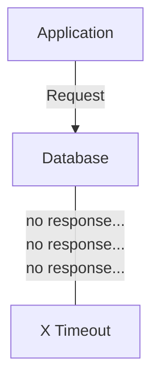

Instead of waiting forever:

```text
Wait forever ❌
```

the application might say:

```text
Wait up to 3 seconds.
If there is still no response → stop waiting.
```

---

# 2. Why Do Systems Need Timeouts?

Networks are not perfectly reliable.

A remote component can:

* become slow
* become overloaded
* crash
* become unreachable
* stop responding
* experience a network problem
* become stuck processing a request

Without a timeout:

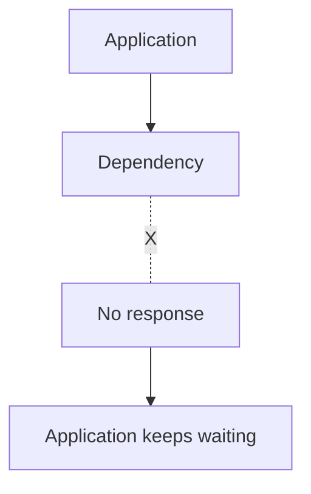

The waiting application may consume:

* a connection
* a thread
* a worker
* memory
* CPU
* a request slot

If many requests get stuck, the problem can spread.

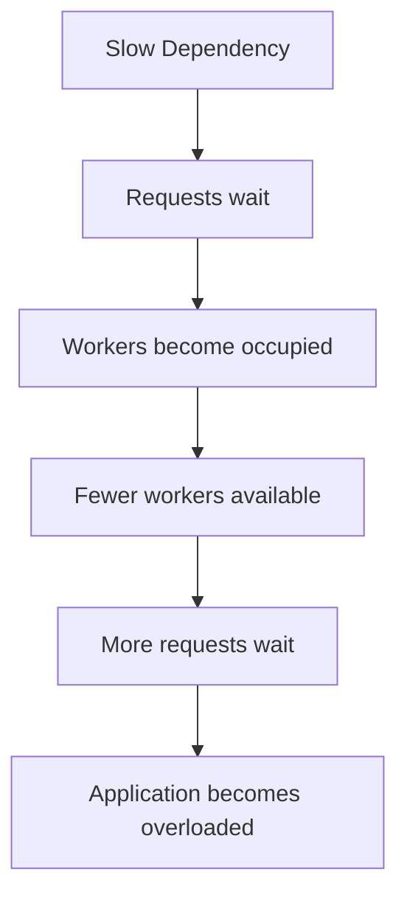

A timeout provides a boundary.

---

# 3. Timeout as a Boundary

Think of a timeout as a system saying:

> **"This operation is taking longer than I am willing to tolerate."**

For example:

```text
0 sec                    3 sec
 |------------------------|
          wait
                        timeout
```

At 3 seconds:

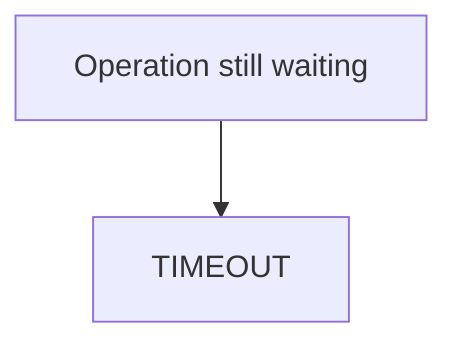

The application can then:

* return an error
* use a fallback
* cancel the operation
* retry later
* fail over
* continue without the optional dependency

The correct response depends on the operation.

---

# 4. Timeout Does Not Necessarily Mean Failure

This is a very important distinction.

Suppose:

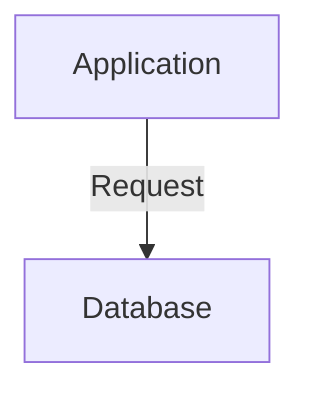

The application waits 3 seconds.

The database actually needs 5 seconds.

```text
Application waits
0s -------- 3s -------- 5s
             |
          timeout
                         |
                    database responds
```

The application has timed out.

But the database itself did not necessarily fail.

It was simply slower than the application's waiting limit.

Therefore:

> **A timeout tells you that you stopped waiting. It does not always prove that the remote operation failed.**

This distinction becomes especially important when retries are introduced.

---

# 5. A Timeout Creates Uncertainty

Consider a payment request:

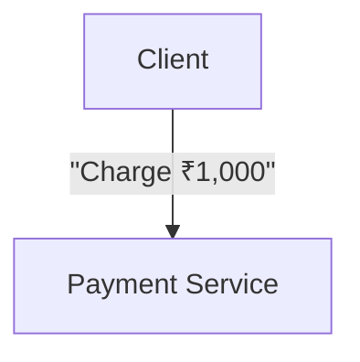

The payment service processes the request.

But the response gets delayed:

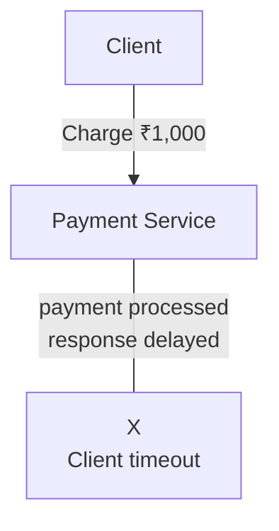

The client sees:

```text
"Request timed out."
```

But did the payment happen?

The client may not know.

```text
Result = UNKNOWN
```

This is one of the most important properties of timeouts:

> **A timeout can tell you that you don't have a result, not necessarily what happened to the operation.**

This is why operations with side effects need careful design.

Idempotency and retry behavior will be covered in later chapters.

---

# 6. Where Can Timeouts Exist?

Timeouts can exist at many layers.

For a typical web application:

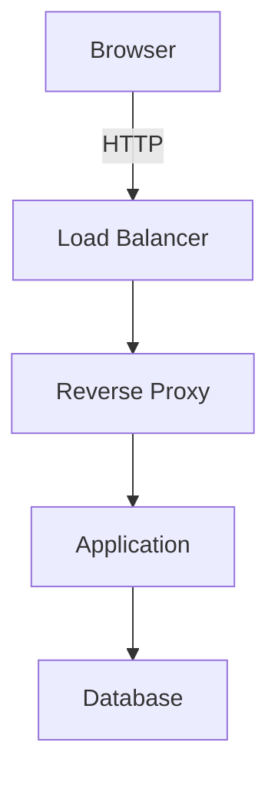

Each layer may have its own timeout.

For example:

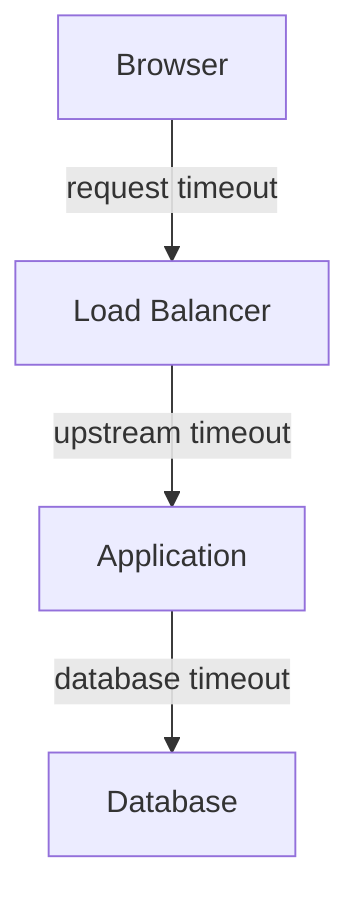

This creates an important design question:

> **How should these timeout values relate to one another?**

---

# 7. Common Types of Timeouts

There are many timeout names across different technologies.

The exact names vary, but the underlying ideas are similar.

Common categories include:

1. Connection timeout
2. Request timeout
3. Read timeout
4. Write timeout
5. Idle timeout
6. Keep-alive timeout
7. Database/query timeout

Let's understand them.

---

# 8. Connection Timeout

A **connection timeout** limits how long a client waits to establish a connection.

For example:

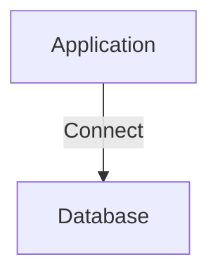

If the database cannot be reached:

```text
0s ---------------- 2s
        waiting
                    |
                 timeout
```

The connection attempt stops after the configured limit.

Without a reasonable connection timeout, a network problem could cause the application to wait too long.

---

# 9. Request Timeout

A **request timeout** limits how long the entire request operation can take.

For example:

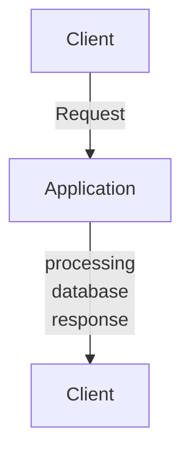

Suppose the allowed time is 5 seconds.

```text
Request starts
     |
     +---------------------+
     |                     |
     v                     v
   0 sec                  5 sec
                         timeout
```

If the operation has not completed within the allowed period, the request may be terminated.

---

# 10. Read Timeout

A **read timeout** limits how long a system waits to receive data from another component.

For example:

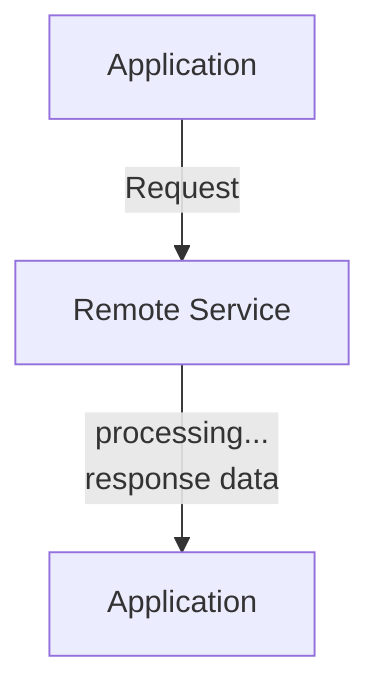

If the remote service stops sending data for too long, the read may time out.

This is especially relevant for:

* HTTP clients
* database clients
* sockets
* APIs
* streaming connections

---

# 11. Write Timeout

A **write timeout** limits how long a system is willing to wait while sending data.

For example:

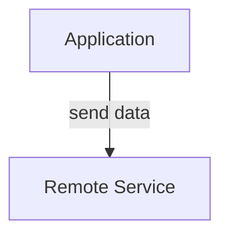

If the network or receiver is not accepting data as expected:

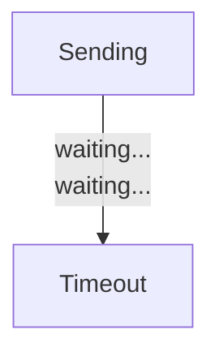

Write timeouts are particularly relevant when transferring larger amounts of data.

---

# 12. Idle Timeout

An **idle timeout** limits how long a connection can remain inactive.

For example:

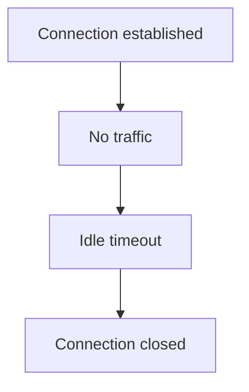

Idle timeouts are useful for preventing unused connections from remaining open indefinitely.

They are common in:

* load balancers
* reverse proxies
* firewalls
* connection pools
* network services

---

# 13. Keep-Alive Timeout

HTTP connections can sometimes be reused for multiple requests.

For example:

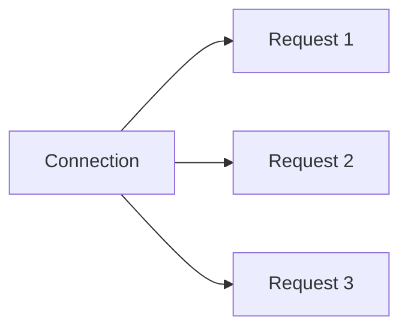

A keep-alive timeout controls how long an idle persistent connection is retained.

This is different from saying:

> "A request may take this long."

It is about:

> **"How long should this connection remain available while idle?"**

---

# 14. Database Query Timeout

An application may also limit how long a database operation is allowed to run.

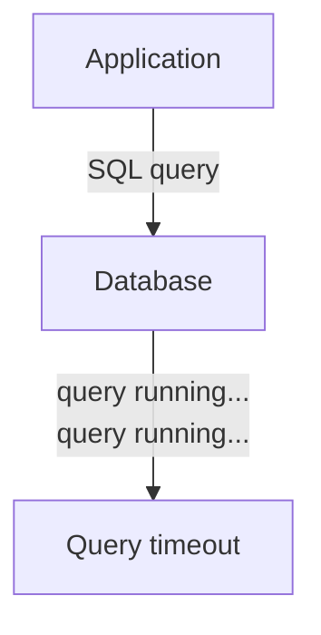

For example, an application may decide that a particular request should not wait indefinitely for a database query.

This protects the application from excessively long operations.

However, simply setting a short query timeout does not fix a badly designed query.

The underlying performance problem may still need investigation.

---

# 15. Timeout at Different Layers

Consider this architecture:

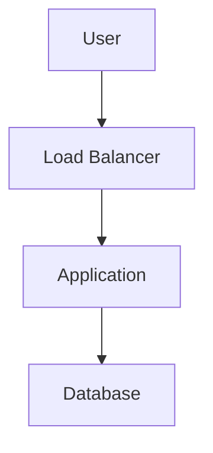

Imagine these limits:

```text
Load Balancer -> 30 sec
Application   -> 20 sec
Database      -> 5 sec
```

The application can wait up to 5 seconds for the database.

If the database takes longer:

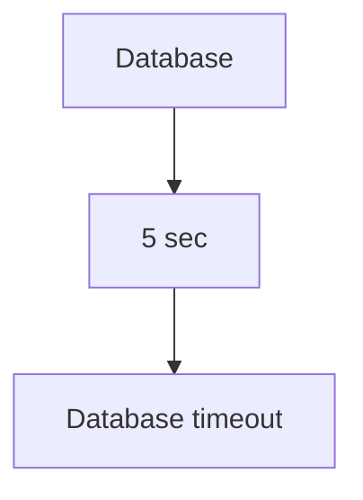

The application can then stop waiting and decide what to do.

The important principle is not that every system must use these exact numbers.

It is:

> **Timeouts should reflect the expected behavior and ownership of each layer.**

---

# 16. Timeout Budgets

A useful concept is a **timeout budget**.

Suppose the user-facing request has a maximum acceptable duration of:

```text
5 seconds
```

The application might need to spend that time across several operations:

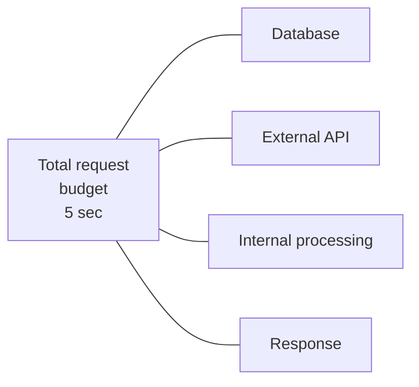

For example:

```mermaid
flowchart LR
  accTitle: Dividing the budget
  accDescr: 5 seconds in total: 2 seconds for the database, 1 second for the external service, 1 second for application processing and 1 second of remaining overhead.
  T["5 sec total"] --- D["2 sec database"] & E["1 sec external service"] & P["1 sec application processing"] & O["1 sec remaining overhead"]
```

These numbers are only illustrative.

The idea is:

> **A downstream operation should not casually consume the entire time available to the user-facing request.**

---

# 17. The Timeout Chain

Imagine:

```mermaid
flowchart TD
  accTitle: The timeout chain
  accDescr: The client waits 10 seconds for the application, the application 8 seconds for service B, service B 6 seconds for the database, and the database 4 seconds.
  C["Client"] -->|"timeout = 10s"| A["Application"] -->|"timeout = 8s"| S["Service B"] -->|"timeout = 6s"| D["Database"] -->|"timeout = 4s"| D2["Database"]
```

A request can move through several layers.

The available time shrinks as the request progresses.

```mermaid
flowchart TD
  accTitle: Nested deadlines
  accDescr: 10 seconds for the application, which gives 8 seconds to service B, which gives 6 seconds to the database, which gives 4 seconds.
  T10["10s"] --> A["Application"] --- T8["8s"] --> S["Service B"] --- T6["6s"] --> D["Database"] --- T4["4s"]
```

This helps prevent a downstream operation from waiting longer than the upstream request can survive.

---

# 18. What Happens When a Timeout Occurs?

There are several possible responses.

## Option 1 — Return an error

```mermaid
flowchart TD
  accTitle: Return an error
  accDescr: A dependency timeout makes the application return an error, and the client receives a failure.
  N0["Dependency timeout"] --> N1["Application returns error"] --> N2["Client receives failure"]
```

## Option 2 — Use a fallback

```mermaid
flowchart TD
  accTitle: Use a fallback
  accDescr: When the recommendation service times out, use cached recommendations.
  R["Recommendation service"] -->|"timeout"| C["Use cached recommendations"]
```

## Option 3 — Fail over

```mermaid
flowchart TD
  accTitle: Fail over
  accDescr: When the primary service times out, use the alternate service.
  P["Primary service"] -->|"timeout"| A["Alternate service"]
```

## Option 4 — Retry

```mermaid
flowchart TD
  accTitle: Retry
  accDescr: When the request times out, retry.
  R["Request"] ---|"timeout"| T["retry"]
```

Retries are covered in the next chapter.

## Option 5 — Continue without the dependency

Some dependencies are optional.

For example:

```mermaid
flowchart TD
  accTitle: Required and optional dependencies
  accDescr: The main page needs product data, which is required, and recommendations, which are optional.
  M["Main page"] --> P["Product data<br/>REQUIRED"] & R["Recommendations<br/>OPTIONAL"]
```

If recommendations time out:

```mermaid
flowchart TD
  accTitle: Continue without the dependency
  accDescr: The product page gets product data but not recommendations.
  P["Product page"] --> D["Product data ✓"] & R["Recommendations ✗"]
```

The page may still be shown without recommendations.

This is an example of **graceful degradation**.

---

# 19. Not Every Timeout Should Be Treated the Same

Consider two operations.

### Operation A

```text
GET /recommendations
```

A timeout may allow:

```text
Show page without recommendations
```

### Operation B

```text
POST /transfer-money
```

A timeout is much more complicated.

The system must consider:

```text
Did the transfer happen?
```

Therefore:

> **Timeout handling depends on the operation's importance and side effects.**

This is a system-design decision, not merely a configuration value.

---

# 20. Timeouts and Slow Dependencies

Suppose:

```mermaid
flowchart TD
  accTitle: A slow dependency
  accDescr: The application calls a slow service.
  N0["Application"] --> N1["Slow Service"]
```

The service takes 20 seconds.

But your timeout is:

```text
3 seconds
```

Every request may fail after 3 seconds.

Increasing the timeout to 30 seconds might make the errors disappear temporarily.

But now requests can remain active for a long time.

```mermaid
flowchart TD
  accTitle: A long timeout on a slow dependency
  accDescr: A 20-second dependency leaves many requests waiting, workers occupied, and capacity decreases.
  N0["20-second dependency"] --> N1["Many requests waiting"] --> N2["Workers occupied"] --> N3["Capacity decreases"]
```

So:

> **Increasing a timeout is not automatically a performance fix.**

You must understand why the dependency is slow.

---

# 21. Too-Long Timeouts

Suppose an application allows:

```text
Request timeout = 120 seconds
```

If a dependency becomes stuck:

```text
Request 1 -> waiting
Request 2 -> waiting
Request 3 -> waiting
...
Request 1000 -> waiting
```

A large number of resources can remain occupied.

This can cause:

```mermaid
flowchart TD
  accTitle: Too-long timeouts
  accDescr: A slow dependency causes long waits, resource exhaustion, application slowdown and application failure.
  N0["Slow dependency"] --> N1["Long waits"] --> N2["Resource exhaustion"] --> N3["Application slowdown"] --> N4["Application failure"]
```

A timeout protects against indefinite waiting.

---

# 22. Too-Short Timeouts

Very short timeouts can also be harmful.

Suppose normal latency is:

```text
Typical: 200 ms
Occasionally: 1.5 sec
```

But timeout is:

```text
500 ms
```

Some legitimate requests will fail.

```text
Normal request       ✓
Fast request         ✓
Slow-but-valid       ❌ timeout
```

This can create unnecessary failures.

Therefore:

> **A timeout should be short enough to protect resources but long enough to accommodate legitimate operation latency.**

---

# 23. Timeout Values Should Come From Evidence

Do not choose:

```text
"Let's use 5 seconds everywhere."
```

Different operations have different characteristics.

For example:

```text
Health check        -> very short
Internal API        -> relatively short
Database query      -> operation-dependent
File upload         -> potentially longer
Long-running job    -> should often be asynchronous
```

The right value depends on:

* expected latency
* workload
* dependency behavior
* user experience
* resource limits
* failure consequences
* measured production behavior

Observability later helps answer these questions.

---

# 24. Long-Running Work

Some operations legitimately take a long time.

Instead of:

```mermaid
flowchart TD
  accTitle: Holding a request open
  accDescr: An HTTP request waits 10 minutes for a response.
  H["HTTP request"] -->|"wait 10 minutes"| R["Response"]
```

a better architecture may be:

```mermaid
flowchart TD
  accTitle: Long-running work as a job
  accDescr: The client starts a job in the application, which puts it on a queue; a worker does the long-running work and produces the result.
  C["Client"] -->|"Start job"| A["Application"] --> Q["Queue"] --> W["Worker"] -->|"long-running work"| R["Result"]
```

The client receives something like:

```text
Job accepted.
```

It can then check the result later.

This separates:

> **request duration**

from:

> **job duration**

Queues and workers are covered in Level 5.

---

# 25. Timeouts and Load Balancers

Load balancers often have timeout settings.

Consider:

```mermaid
flowchart TD
  accTitle: Timeouts and load balancers
  accDescr: The client reaches the load balancer and the application.
  N0["Client"] --> N1["Load Balancer"] --> N2["Application"]
```

Suppose the load balancer gives the application only a limited amount of time.

If the application takes too long:

```mermaid
flowchart TD
  accTitle: The load balancer times out
  accDescr: The load balancer keeps waiting until its timeout.
  L["Load Balancer"] -->|"waiting..."| T["timeout<br/>X"]
```

The client may receive an error even if the application eventually finishes.

This creates an important design issue:

> **Upstream components must understand the timing behavior of downstream components.**

---

# 26. Timeout Mismatch

Suppose:

```text
Client timeout      = 10 sec
Load Balancer       = 5 sec
Application         = 8 sec
```

The load balancer may give up before the application does.

```text
0s ---------------- 5s -------- 8s -------- 10s
                     |
                  LB timeout
                                   |
                              App timeout
```

The application may still be working after the load balancer has already abandoned the request.

That can create wasted work.

Good system design therefore considers timeout relationships across the request path.

---

# 27. Cancellation

When possible, timing out upstream should be accompanied by cancellation downstream.

For example:

```mermaid
flowchart TD
  accTitle: A request in progress
  accDescr: The client reaches the application, which uses the database.
  N0["Client"] --> N1["Application"] --> N2["Database"]
```

If the client request is no longer needed:

```mermaid
flowchart TD
  accTitle: Cancellation
  accDescr: The client request is cancelled, the application knows, and it cancels unnecessary database work.
  N0["Client request cancelled"] --> N1["Application knows"] --> N2["Cancel unnecessary database work"]
```

If downstream work continues unnecessarily, the system may waste resources.

Cancellation behavior depends on the protocol, framework, database, and operation.

---

# 28. Timeout vs Health Check

These concepts are related but different.

### Health check

Asks:

> "Is this component healthy enough to receive work?"

```mermaid
flowchart TD
  accTitle: A health check
  accDescr: The load balancer sends a health check to the server.
  L["Load Balancer"] -->|"health check"| S["Server"]
```

### Timeout

Asks:

> "How long should I wait for this particular operation?"

```mermaid
flowchart TD
  accTitle: A request timeout
  accDescr: The application sends a request to the server and waits until the timeout.
  A["Application"] -->|"request"| S["Server"] -->|"waiting..."| T["timeout"]
```

A server can be:

```text
Healthy
but slow for one request
```

or:

```text
Unhealthy
and not responding at all
```

Health checks and request timeouts solve different problems.

---

# 29. Timeout vs Failover

Failover asks:

> **"Where should the work go if this component is unavailable?"**

Timeout asks:

> **"How long should I wait before giving up on this operation?"**

They can work together:

```mermaid
flowchart TD
  accTitle: Timeout before failover
  accDescr: The request reaches the primary, which gives no response; after the timeout, try the alternate.
  R["Request"] --> P["Primary"] -->|"no response<br/>timeout"| A["Try alternate"]
```

But a timeout alone does not mean failover is always appropriate.

For some operations, failing over may be unsafe or impossible.

---

# 30. Timeout and Resource Protection

One of the most important roles of a timeout is **resource protection**.

Imagine 100 application workers:

```text
100 workers
```

If each waits indefinitely for a broken dependency:

```text
Worker 1  -> waiting
Worker 2  -> waiting
Worker 3  -> waiting
...
Worker 100 -> waiting
```

Now:

```text
Available workers = 0
```

New requests cannot be processed.

With timeouts:

```mermaid
flowchart TD
  accTitle: Releasing resources
  accDescr: A request waits, times out and releases its resources.
  N0["Request"] --> N1["Wait"] --> N2["Timeout"] --> N3["Release resources"]
```

The application can recover capacity instead of waiting forever.

---

# 31. Timeouts Can Also Create Load

A timeout does not magically stop all work.

Consider:

```mermaid
flowchart TD
  accTitle: A slow service
  accDescr: The application sends a request to a slow service.
  A["Application"] -->|"request"| S["Slow Service"]
```

The application times out after 2 seconds.

But the remote service might continue processing.

```mermaid
flowchart TD
  accTitle: Timeouts can create load
  accDescr: The application sends a request to the slow service, which is still processing when the application times out.
  A["Application"] -->|"request"| S["Slow Service"] ---|"still processing"| A2["Application<br/>X timeout"]
```

If the application then sends another request, the remote service may now be processing both.

This becomes particularly dangerous when retries are introduced.

That is why the next chapters matter:

```mermaid
flowchart TD
  accTitle: What comes next
  accDescr: 02.10 Timeouts, 02.11 Retries, 02.12 Retry Storms, 02.13 Circuit Breaker.
  N0["02.10 Timeouts"] --> N1["02.11 Retries"] --> N2["02.12 Retry Storms"] --> N3["02.13 Circuit Breaker"]
```

These concepts should be understood together.

---

# 32. Practical Timeout Design

When adding a timeout, ask:

### 1. What operation am I protecting?

```text
HTTP request?
Database query?
Network connection?
File transfer?
```

### 2. What is a normal completion time?

Measure it.

### 3. What happens if it takes longer?

```text
Error?
Fallback?
Retry?
Failover?
Cancel?
```

### 4. Does the operation have side effects?

If yes, a timeout can produce uncertainty.

### 5. Does the downstream operation continue after timeout?

If yes, understand the consequences.

### 6. What resources are held while waiting?

For example:

```text
Worker
Connection
Memory
Thread
Socket
```

### 7. What happens under high concurrency?

One slow dependency can affect many requests.

---

# 33. A Simple Timeout Strategy

For a basic web application:

```mermaid
flowchart TD
  accTitle: A simple timeout strategy
  accDescr: A request reaches the application, which calls the database and an external API.
  R["Request"] --> A["Application"] --> D["Database"] & E["External API"]
```

A basic strategy might be:

```text
Connection timeout
        ↓
Don't wait indefinitely to establish connection

Request timeout
        ↓
Don't allow one request to occupy resources forever

Database timeout
        ↓
Don't allow database operations to run indefinitely

External API timeout
        ↓
Don't allow a slow external service to block the application forever
```

The exact values should come from the application's measured behavior and requirements.

---

# 34. Example: Product Page

Imagine a product page:

```mermaid
flowchart TD
  accTitle: The product page
  accDescr: The browser reaches the application, which uses the database, the recommendation API and the review API.
  B["Browser"] --> G
  subgraph G[" "]
    direction LR
    A["Application"] --- R["Recommendation API"] & V["Review API"] & D["Database"]
  end
```

Suppose:

```text
Database             -> required
Recommendation API   -> optional
Review API            -> useful but optional
```

A sensible failure strategy might be:

```mermaid
flowchart TD
  accTitle: Different timeouts, different outcomes
  accDescr: A database timeout means the page cannot be built, so return an error. A recommendation timeout means skip recommendations and continue the page. A review timeout means show the product without reviews.
  D1["Database timeout"] --> D2["Cannot build page"] --> D3["Return error"]
  D3 ~~~ R1["Recommendation timeout"] --> R2["Skip recommendations"] --> R3["Continue page"]
  R3 ~~~ V1["Review timeout"] --> V2["Show product without reviews"]
```

This is an example of designing timeout behavior based on **business importance**.

---

# 35. Common Mistakes

## Mistake 1 — No timeout

```text
Wait forever
```

This can consume resources indefinitely.

---

## Mistake 2 — Same timeout everywhere

```text
Database = 5 sec
API = 5 sec
File upload = 5 sec
Health check = 5 sec
```

Different operations have different characteristics.

---

## Mistake 3 — Arbitrary values

```text
"Everyone uses 30 seconds."
```

A timeout should have a reason.

---

## Mistake 4 — Treating timeout as proof of failure

```mermaid
flowchart TD
  accTitle: Treating timeout as proof of failure
  accDescr: A timeout is taken to mean the operation definitely failed.
  T["Timeout"] --> F["#quot;The operation definitely failed.#quot;"]
```

Not necessarily.

The operation may have succeeded but its response was not received in time.

---

## Mistake 5 — Ignoring downstream work

The caller times out, but the remote operation continues.

This can waste resources and complicate retries.

---

## Mistake 6 — Increasing timeout to hide performance problems

```mermaid
flowchart TD
  accTitle: Hiding a performance problem
  accDescr: A slow query, an increased timeout, and the problem hidden.
  N0["Slow query"] --> N1["Increase timeout"] --> N2["Problem hidden"]
```

The underlying slow operation may still need optimization.

---

## Mistake 7 — Forgetting the user-facing deadline

Individual downstream timeouts must make sense within the total request budget.

---

# 36. Key Principle

> **A timeout is a controlled limit on waiting. It protects resources, bounds latency, and forces the system to decide what to do when an operation takes too long.**

But remember:

> **Timeout ≠ confirmed failure.**

A timeout may mean:

```text
Success
   OR
Failure
   OR
Unknown
```

The system often cannot know immediately.

---

# 37. Quick Reference

| Timeout                | What it limits                                     |
| ---------------------- | -------------------------------------------------- |
| **Connection timeout** | Time to establish a connection                     |
| **Request timeout**    | Maximum time allowed for a request                 |
| **Read timeout**       | Waiting for incoming data                          |
| **Write timeout**      | Waiting while sending data                         |
| **Idle timeout**       | How long an inactive connection remains open       |
| **Keep-alive timeout** | How long an idle persistent connection is retained |
| **Query timeout**      | Maximum allowed database operation time            |

### Mental model

```mermaid
flowchart TD
  accTitle: Timeout mental model
  accDescr: An operation starts and waits. If it completes, success. If it takes too long, timeout, then decide what to do: error, fallback, retry or failover.
  O["Operation starts"] --> W["Wait"]
  W -->|"completes"| S["Success"]
  W -->|"too long"| T["Timeout"]
  T --> G
  subgraph G[" "]
    direction LR
    D["Decide what to do"] --- R["Retry"] & V["Failover"] & E["Error"] & F["Fallback"]
  end
```

---

# 38. One-Page Timeout Decision Table

Use this table as a practical design reference.

| Situation                         | What are you waiting for?   | Main risk                            | Timeout should be...                 | After timeout                                   | Important question                         |
| --------------------------------- | --------------------------- | ------------------------------------ | ------------------------------------ | ----------------------------------------------- | ------------------------------------------ |
| **Opening a connection**          | Network connection          | Connection resources remain blocked  | Relatively short                     | Abort connection attempt                        | Is the destination reachable?              |
| **Normal API request**            | Complete response           | Worker/request remains occupied      | Based on normal latency + margin     | Return error, fallback, or retry when safe      | Can the operation safely be retried?       |
| **Database query**                | Query result                | Connections/workers remain occupied  | Based on query characteristics       | Cancel/abort when supported; return error       | Is the query actually too slow?            |
| **External API**                  | Remote service response     | Dependency blocks your application   | Within the user/request budget       | Fallback, error, or retry when safe             | Is the dependency required?                |
| **Health check**                  | Health response             | Unhealthy instance receives traffic  | Short                                | Mark unhealthy after appropriate failure policy | Could this be a temporary network problem? |
| **File upload/download**          | Data transfer               | Connection remains open              | Based on expected transfer size/rate | Abort or resume when supported                  | Is this better handled asynchronously?     |
| **Idle connection**               | No activity                 | Connections consume resources        | Based on expected reuse              | Close connection                                | Will clients reconnect safely?             |
| **Long-running job**              | Job completion              | Request remains open too long        | Usually not a long HTTP timeout      | Move work to queue/worker                       | Should this be asynchronous?               |
| **Payment/order/write operation** | Confirmation of side effect | Result may be unknown                | Carefully bounded                    | Do not blindly retry                            | Did the operation possibly succeed?        |
| **Optional dependency**           | Extra data                  | Slow dependency delays main response | Short enough to protect main request | Use fallback/skip dependency                    | Can the main response continue without it? |

### Quick Decision Flow

```mermaid
flowchart TD
  accTitle: Quick decision flow
  accDescr: Start: what are you waiting for? A connection gets a short-ish boundary; a request is set within the request budget; long-running work prefers an async job. For a request: does it have side effects? If no, error or fallback. If yes, a timeout may mean unknown, so avoid blindly retrying.
  S["START"] --> Q{"What are you<br/>waiting for?"}
  Q -->|"Connection"| C["Short-ish<br/>boundary"]
  Q -->|"Request"| R["Set within<br/>request<br/>budget"]
  Q -->|"Long-running"| L["Prefer async<br/>job"]
  R --> E{"Does it have side<br/>effects?"}
  E -->|"NO"| N["Error /<br/>fallback"]
  E -->|"YES"| Y["Timeout may<br/>mean UNKNOWN"] --> B["Avoid blindly<br/>retrying"]
```

### Five Questions Before Setting a Timeout

```text
1. What operation am I protecting?
2. What is its normal measured latency?
3. What resources remain occupied while waiting?
4. What should happen when the timeout expires?
5. Could the operation have succeeded even though I timed out?
```

> **Choose a timeout to protect the system without rejecting legitimate work. Then explicitly decide what happens when the deadline is reached.**

---

# 39. Knowledge Check

### Question 1

What is a timeout?

**Answer:**

A limit on how long a system is willing to wait for an operation.

---

### Question 2

Does a timeout prove that the remote operation failed?

**Answer:**

No. The caller only knows that it did not receive the expected result within the allowed time. The remote operation may have failed, succeeded, or still be running.

---

### Question 3

Why are timeouts important for resource protection?

**Answer:**

Without timeouts, workers, connections, threads, and other resources can remain occupied while waiting for an unresponsive or slow dependency.

---

### Question 4

Why shouldn't every operation use the same timeout?

**Answer:**

Different operations have different expected durations and failure characteristics. A health check, database query, API request, and file transfer may require different limits.

---

### Question 5

What problem can occur when a caller times out but the remote service continues processing?

**Answer:**

The caller may send another request while the first operation is still running, potentially causing duplicate work or additional load.

---

### Question 6

Why is timeout design important in distributed systems?

**Answer:**

Because distributed components depend on networks and remote services that can become slow or unavailable. Timeouts prevent indefinite waiting and provide a boundary for deciding how the system should respond.

---

# Final Mental Model

Think of a timeout as a **deadline for waiting**.

```mermaid
flowchart TD
  accTitle: Final mental model
  accDescr: A request starts the operation and waits. If it completes, success. If it is too slow, timeout: make a decision between error, fallback, and retry or failover.
  Q["REQUEST"] --> S["Start operation"] --> W["WAITING"]
  W -->|"Completes"| OK["SUCCESS"]
  W -->|"Too slow"| T["TIMEOUT"] --> D["Make a decision"]
  D --- E["Error"] & F["Fallback"] & R["Retry/<br/>Failover"]
```

The deeper lesson is:

> **A distributed system cannot wait forever. It must define how long it is willing to wait, what resources are consumed while waiting, and what happens when the deadline is reached.**
