# 02.11 — Retries

## Learning Objectives

By the end of this chapter, you should be able to:

* Understand what a retry is and why systems use retries.
* Distinguish **transient failures** from failures that should not be retried.
* Understand how retries interact with **timeouts**.
* Understand why idempotency matters when retrying operations.
* Compare fixed delay, exponential backoff, and jitter.
* Set sensible retry limits and retry budgets.
* Understand the difference between client-side and server-side retries.
* Recognize how poorly designed retries can overload a system.

---

# 1. What Is a Retry?

A **retry** means attempting the same operation again after the first attempt fails or times out.

For example:

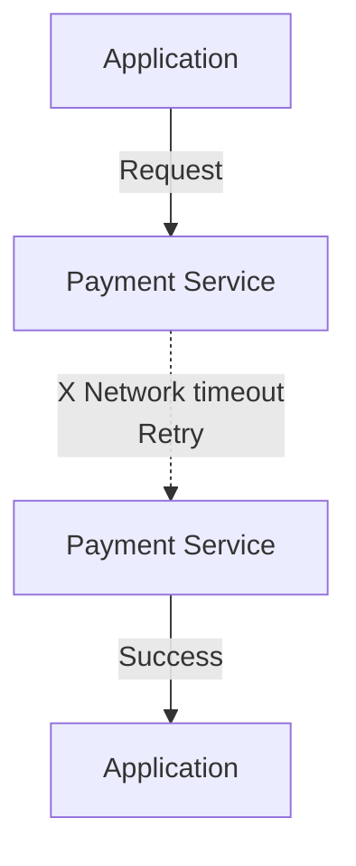

The important idea is:

> A retry assumes that the failure might be temporary.

If a service is temporarily unreachable, another attempt might succeed.

---

# 2. Why Do Systems Retry?

Distributed systems communicate over networks.

Networks and services can experience temporary problems:

* Packet loss
* Temporary network congestion
* Connection resets
* Short service overload
* Temporary DNS/network problems
* A server restarting
* A load balancer temporarily removing an unhealthy instance
* A dependency taking longer than expected

For example:

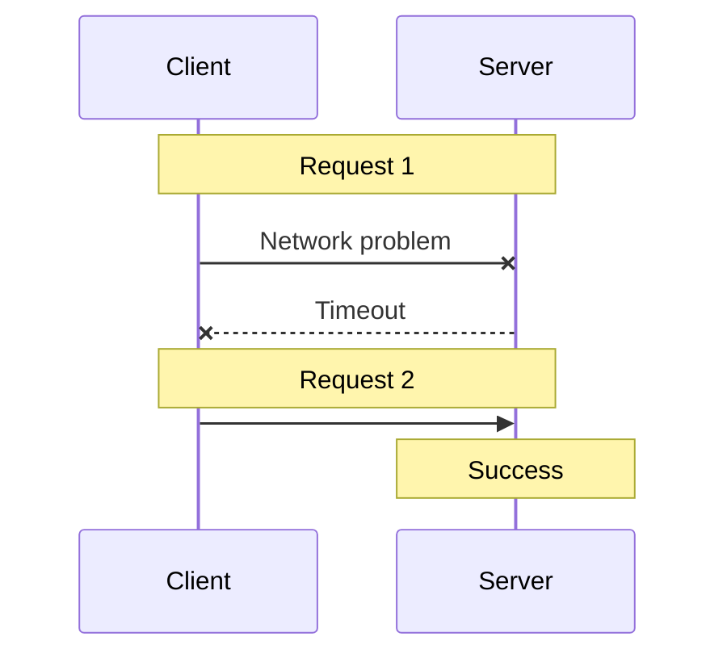

Without retries, a temporary failure immediately becomes a user-visible failure.

With a carefully designed retry, the system may recover automatically.

---

# 3. Not Every Failure Should Be Retried

This is one of the most important rules.

A retry is useful only when there is a reasonable possibility that another attempt can succeed.

Consider:

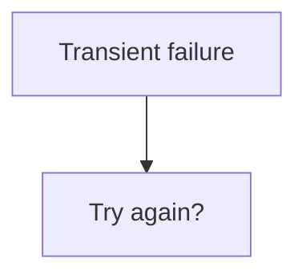

versus:

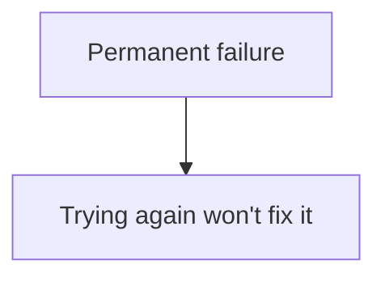

## Examples

| Failure                       | Usually Retry? | Why                                       |
| ----------------------------- | -------------: | ----------------------------------------- |
| Temporary network error       |            Yes | Network problem may disappear             |
| Connection reset              |          Often | Next connection may work                  |
| Temporary service unavailable |          Often | Service may recover                       |
| Timeout                       |      Sometimes | Operation may still be available          |
| Invalid authentication        |             No | Retrying same credentials changes nothing |
| Invalid request               |             No | Same request remains invalid              |
| Missing resource              |     Usually no | Repeating lookup doesn't create it        |
| Permission denied             |             No | Same permission problem remains           |
| Validation error              |             No | Input must be corrected                   |

The exact retry policy depends on the application and the error.

---

# 4. Retryable vs Non-Retryable Errors

A useful mental model is:

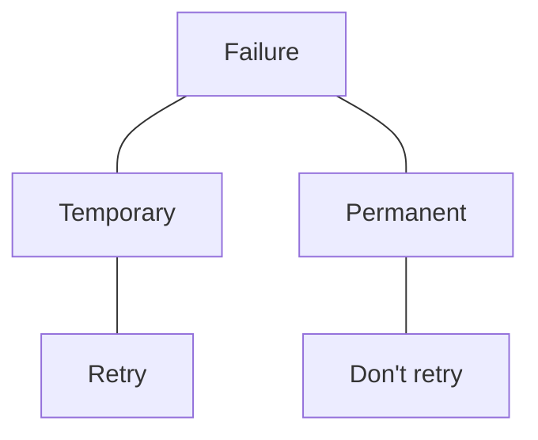

### Retryable

The condition might disappear.

Example:

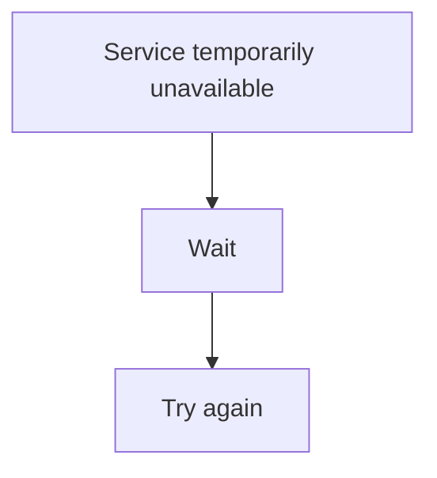

### Non-retryable

The request itself is wrong.

Example:

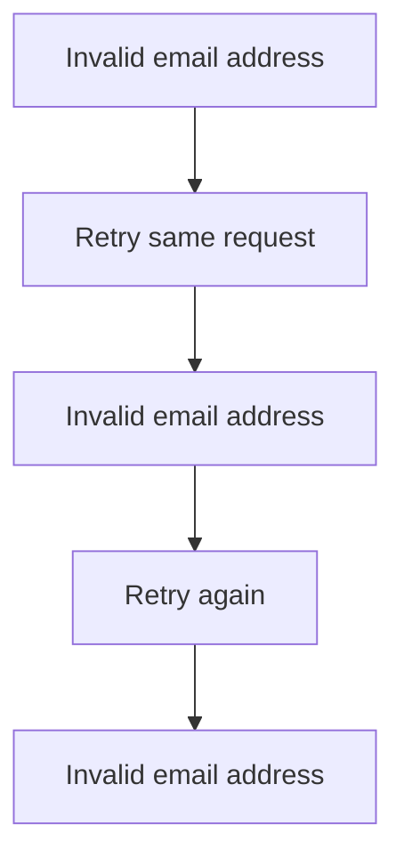

The retries provide no value.

---

# 5. Retry Is Not the Same as Failover

These concepts are related but different.

### Retry

Try the operation again.

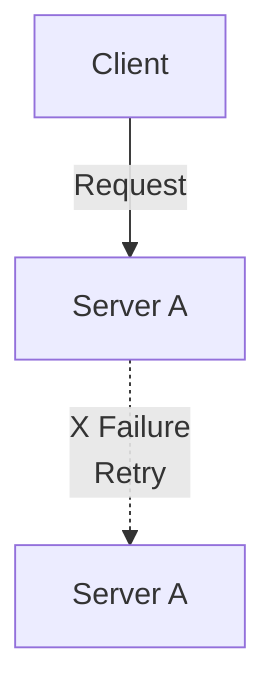

### Failover

Move the workload to another component.

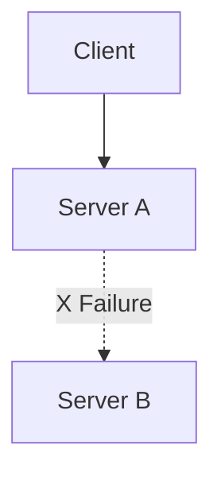

A system can use both:

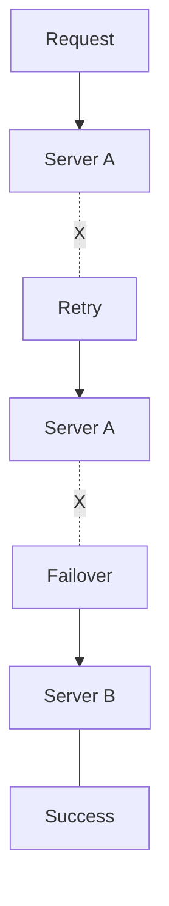

Retry asks:

> "Can I try the operation again?"

Failover asks:

> "Can another healthy component handle it?"

---

# 6. Retry and Timeout Work Together

Retries and timeouts are closely connected.

Suppose an API has:

```text
Timeout = 2 seconds
Retries = 3
```

A naive design might allow:

```text
Attempt 1 → 2 sec
Attempt 2 → 2 sec
Attempt 3 → 2 sec

Potential waiting time ≈ 6 seconds
```

But users may not be willing to wait that long.

Therefore, systems often need a **total request deadline**.

For example:

```text
Total request budget = 5 seconds

Attempt 1
   |
   |---- 2 sec ----X
   |
Backoff
   |
Attempt 2
   |
   |-- 2 sec --X
   |
Remaining budget
   |
   v
Stop
```

The system should think about:

> "How much total time am I allowed to spend?"

Not simply:

> "How many times can I retry?"

---

# 7. The Retry Budget

A **retry budget** limits how much additional work the system is willing to create through retries.

For example:

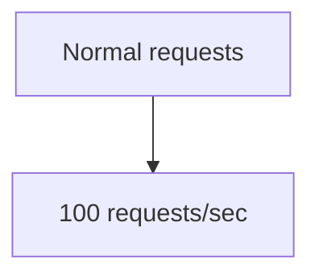

Now imagine every request gets retried twice:

```text
100 original requests
        +
200 retry attempts
        =
300 attempts/sec
```

The dependency may now receive **three times as many attempts**.

This becomes dangerous during an outage.

Retries can create additional load precisely when the dependency is already struggling.

This problem becomes especially important in the next chapter:

**02.12 — Retry Storms**

---

# 8. Fixed Retry Delay

The simplest retry strategy is a fixed delay.

Example:

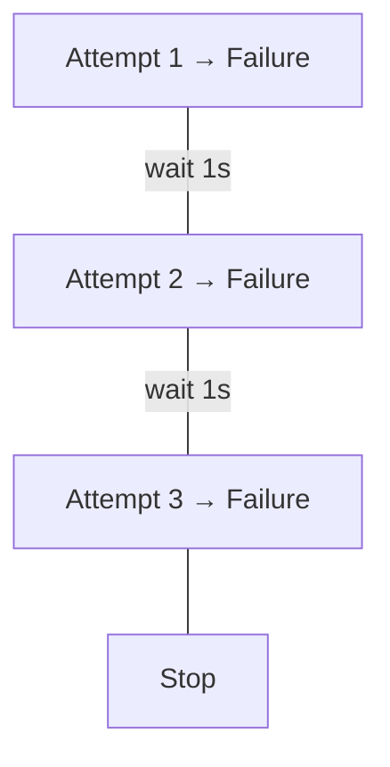

Configuration:

```text
Maximum attempts = 3
Delay = 1 second
```

### Advantages

* Very simple.
* Easy to understand.
* Predictable.

### Problem

Many clients may retry at the same time.

```text
Client A ──X
Client B ──X
Client C ──X
Client D ──X
     |
   wait 1s
     |
Client A ──> Server
Client B ──> Server
Client C ──> Server
Client D ──> Server
```

This synchronized behavior can produce bursts of traffic.

---

# 9. Exponential Backoff

**Exponential backoff** increases the waiting time after each failed attempt.

For example:

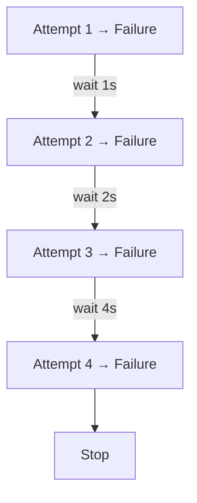

A simplified formula is:

```text
delay = base × 2^attempt
```

For example:

```text
Base delay = 1 second

Retry 1 → 1 second
Retry 2 → 2 seconds
Retry 3 → 4 seconds
Retry 4 → 8 seconds
```

The exact implementation can vary.

The important idea is:

> When the dependency is failing, don't immediately keep hitting it.

---

# 10. Why Backoff Helps

Imagine a service is overloaded.

Without backoff:

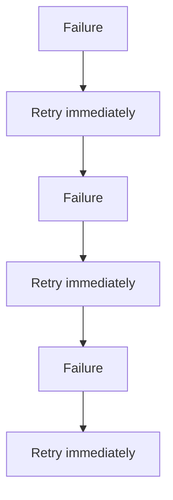

The failing service receives continuous additional traffic.

With backoff:

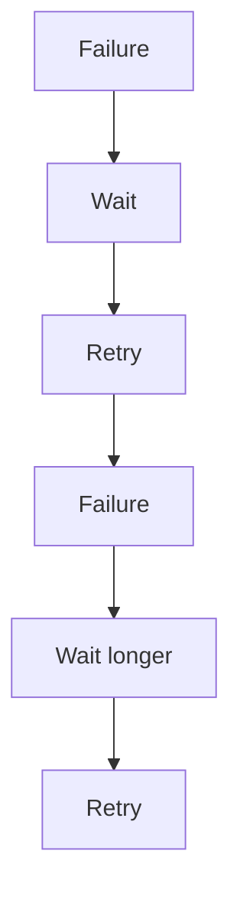

This gives the dependency some time to recover.

---

# 11. Jitter

Backoff alone does not completely solve synchronization.

Suppose thousands of clients all start at the same time:

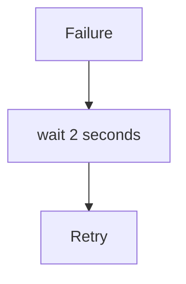

They may all retry together.

**Jitter** adds a small amount of randomness to the delay.

Instead of:

```text
2 seconds
2 seconds
2 seconds
2 seconds
```

clients might wait:

```text
1.7 seconds
2.2 seconds
1.9 seconds
2.4 seconds
```

Now the retries are spread out.

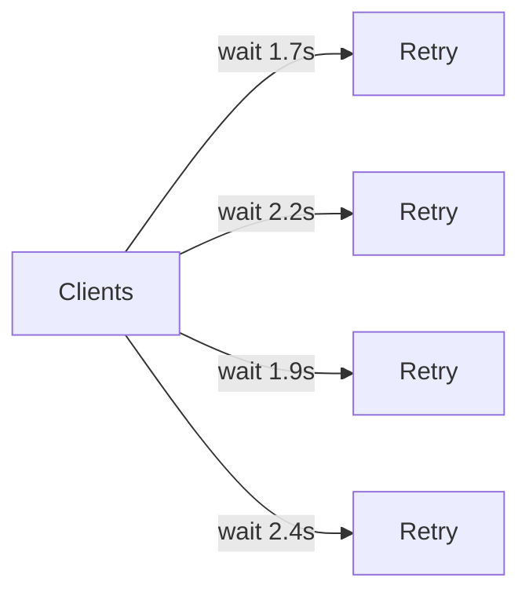

This reduces synchronized retry bursts.

---

# 12. Backoff + Jitter

A common production pattern is:

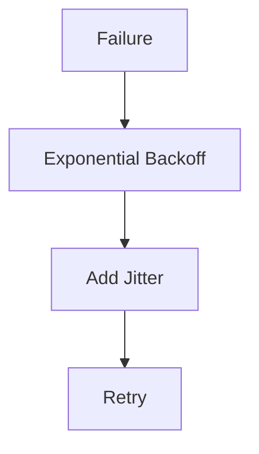

Conceptually:

```text
delay = exponential_backoff + randomness
```

Real implementations often use more carefully defined jitter algorithms, but the beginner-level principle is enough:

> Increase the waiting time and avoid having everyone retry at exactly the same moment.

---

# 13. Maximum Retry Attempts

Retries should have a limit.

Bad:

```text
while failure:
    retry()
```

This could continue indefinitely.

Better:

```text
Maximum attempts = 3

Attempt 1 → Failure
Attempt 2 → Failure
Attempt 3 → Failure
              ↓
           Give up
```

The system must eventually decide:

> "This operation is not succeeding within the allowed budget."

---

# 14. Retry Count vs Attempt Count

Be precise about terminology.

Suppose:

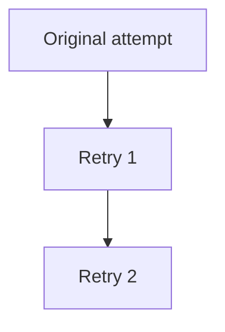

There were:

```text
3 total attempts
```

but:

```text
2 retries
```

Therefore, configuration names should be clear.

For example:

```text
Maximum attempts = 3
```

is less ambiguous than:

```text
Retries = 3
```

because different libraries interpret "retries" differently.

---

# 15. Idempotency: The Critical Retry Question

Retries become much more dangerous when an operation changes state.

Consider:

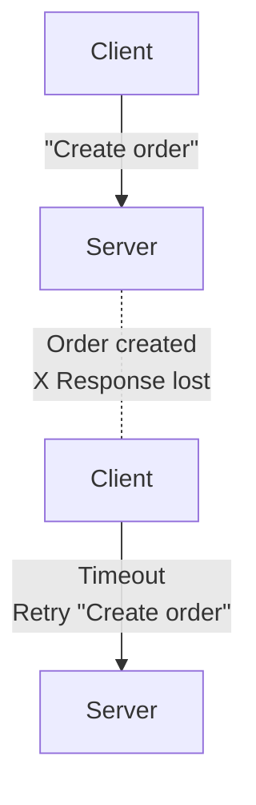

What happens now?

Potentially:

```text
Order #1001 created
Order #1002 created
```

The client intended to create **one order**, but the server may have received the request twice.

This is why retries and **idempotency** are closely connected.

---

# 16. Idempotent Operations

An operation is **idempotent** if repeating the same operation produces the same intended result.

A simple example:

```text
GET /users/123
```

Calling it once or several times normally does not create multiple users.

```text
GET
GET
GET
```

The operation is generally safe to retry, assuming the API's semantics support that.

---

# 17. Non-Idempotent Operations

Consider:

```text
POST /orders
```

If each request creates a new order:

```mermaid
flowchart TD
  accTitle: A non-idempotent operation
  accDescr: POST creates an order; POST again creates another order.
  P1["POST"] --> O1["Order created"]
  O1 ~~~ P2["POST again"] --> O2["Another order created"]
```

Blindly retrying can create duplicates.

Other examples include:

* Charging a payment
* Creating an account
* Sending an email
* Creating a shipment
* Transferring money
* Incrementing a counter

These operations require more care.

---

# 18. Idempotency Keys

A common solution is an **idempotency key**.

The client generates a unique key:

```text
Idempotency-Key: abc-123
```

Then:

```mermaid
flowchart TD
  accTitle: An idempotency key
  accDescr: Request 1 with key abc-123: the server processes the operation, but the response is lost. Request 2 with key abc-123: the server recognizes the key and returns the previous result.
  R1["Request 1<br/>Key: abc-123"] --> P["Server processes operation"] --- L["X Response lost"]
  L ~~~ R2["Request 2<br/>Key: abc-123"] --> K["Server recognizes the key"] --> V["Return previous result"]
```

Conceptually:

```mermaid
flowchart TD
  accTitle: What a key means
  accDescr: The same key means the same logical operation.
  N0["Same key"] --> N1["Same logical operation"]
```

This allows a client to safely retry certain operations without unintentionally performing them twice.

The exact implementation depends on the API and storage design.

---

# 19. The Dangerous Case: Unknown Outcome

A timeout does not always mean the operation failed.

Consider:

```mermaid
flowchart TD
  accTitle: An unknown outcome
  accDescr: The client asks the server to create an order. The order is created but the response is lost. The client times out: did it fail?
  C1["Client"] -->|"Create order"| S["Server"] -. "Order created<br/>X Response lost" .- C2["Client"]
  C2 -->|"Timeout"| D["#quot;Did it fail?#quot;"]
```

The client doesn't know.

The result is:

```text
UNKNOWN
```

not necessarily:

```text
FAILED
```

This distinction is critical.

For state-changing operations:

```mermaid
flowchart TD
  accTitle: Don't blindly repeat
  accDescr: After a timeout, could the operation have succeeded? If yes, don't blindly repeat it.
  T["Timeout"] --> Q{"Could operation have succeeded?"} -->|"YES"| D["Don't blindly repeat"]
```

Instead, the system may:

* Query the operation status.
* Use an idempotency key.
* Ask the server for the previous result.
* Reconcile the state.
* Mark the operation as pending.

---

# 20. Client-Side Retries

A client can perform retries.

For example:

```mermaid
flowchart TD
  accTitle: Client-side retries
  accDescr: The browser or mobile app sends a request to the API, which fails. The client retries the API.
  B["Browser / Mobile App"] -->|"Request"| A1["API"] -. "X" .- C["Client"] -->|"Retry"| A2["API"]
```

This is common for:

* API calls
* Network requests
* SDK operations

The client knows the user-facing deadline and can decide how much time remains.

---

# 21. Server-Side Retries

A server can also retry a dependency.

For example:

```mermaid
flowchart TD
  accTitle: Server-side retries
  accDescr: The client reaches the application, which sends a request to the database. It hits a temporary failure; the application retries and the database succeeds.
  C["Client"] --> A["Application"] -->|"Request"| D1["Database"] -. "X Temporary failure<br/>Retry" .-> D2["Database"] --- S["Success"]
```

This can hide temporary dependency failures from the client.

But server-side retries also consume resources.

---

# 22. The Layered Retry Problem

Imagine:

```mermaid
flowchart TD
  accTitle: The layered retry problem
  accDescr: The browser, the API server and the payment service each retry three times on the way to the database.
  B["Browser"] -->|"retry × 3"| A["API Server"] -->|"retry × 3"| P["Payment Service"] -->|"retry × 3"| D["Database"]
```

One user request could create:

```text
3 × 3 × 3 = 27 attempts
```

This is called **retry amplification**.

The exact number depends on how the layers implement retries, but the architectural lesson is important:

> Don't let every layer independently retry the same operation without understanding the combined effect.

A system needs a deliberate retry strategy.

---

# 23. Total Deadline

Instead of thinking only about retry count:

```text
Retry 1
Retry 2
Retry 3
```

also think about:

```text
Total time available
```

Example:

```text
Total deadline = 5 seconds

Attempt 1
   ↓
Timeout at 2s

Backoff
   ↓
Attempt 2
   ↓
Timeout at 2s

Remaining budget ≈ 1s
   ↓
Stop or make a final short attempt
```

The timeout for an individual attempt may need to respect the remaining overall deadline.

---

# 24. Retry-After

Sometimes the server can tell the client when to try again.

For example:

```mermaid
flowchart TD
  accTitle: Retry-After
  accDescr: The server says try again later, with Retry-After: 10. The client waits, then retries.
  S["Server"] -->|"#quot;Try again later#quot;<br/>Retry-After: 10"| C["Client"] -->|"wait"| R["Retry"]
```

This is especially useful when a server knows that immediate retries are undesirable.

The exact interpretation depends on the protocol/API.

---

# 25. Example: Product API

Suppose an application requests product information.

```mermaid
flowchart TD
  accTitle: A product API
  accDescr: The browser reaches the application, which calls the product API.
  N0["Browser"] --> N1["Application"] --> N2["Product API"]
```

The API temporarily fails.

A reasonable policy might be:

```mermaid
flowchart TD
  accTitle: A safe retry
  accDescr: Attempt 1 hits a temporary network error; wait with backoff and jitter; attempt 2 succeeds.
  N0["Attempt 1"] --> N1["Temporary network error"] --> N2["wait with backoff + jitter"] --> N3["Attempt 2"] --> N4["Success"]
```

The user sees:

```text
Product information loaded
```

rather than:

```text
Server error
```

The temporary failure was hidden from the user.

---

# 26. Example: Payment

Now consider:

```mermaid
flowchart TD
  accTitle: A payment
  accDescr: The customer reaches the application, which calls the payment service.
  N0["Customer"] --> N1["Application"] --> N2["Payment Service"]
```

Request:

```text
Charge ₹1,000
```

The payment service processes the request but the response is lost.

```mermaid
flowchart TD
  accTitle: A payment with a lost response
  accDescr: The application asks the payment service to charge ₹1,000. The payment succeeds but the response is lost, and the application times out.
  A1["Application"] -->|"Charge ₹1,000"| P["Payment Service"] -. "Payment succeeds<br/>X Response lost" .- A2["Application"] --- T["Timeout"]
```

Blind retry:

```mermaid
flowchart TD
  accTitle: A blind retry
  accDescr: Charge ₹1,000, then charge ₹1,000 again.
  N0["Charge ₹1,000"] --> N1["Charge ₹1,000 again"]
```

Potential result:

```text
₹1,000 charged twice
```

Therefore:

```mermaid
flowchart TD
  accTitle: Handling a payment timeout
  accDescr: A payment timeout means the operation may have succeeded: use idempotency, a status lookup or reconciliation, and avoid a blind retry.
  N0["Payment timeout"] --> N1["Operation may have succeeded"] --> N2["Use idempotency / status lookup / reconciliation"] --> N3["Avoid blind retry"]
```

---

# 27. Example: E-Commerce Order

Suppose a user clicks:

```text
Place Order
```

The application sends:

```text
POST /orders
```

The request times out.

The system should not automatically assume:

```text
Order failed
```

Instead:

```mermaid
flowchart TD
  accTitle: Checking before retrying an order
  accDescr: After a timeout, could the order have been created? If yes, check the order status: if found, show the order; if not found, safely determine the next action.
  T["Timeout"] --> Q{"Could order have been created?"} -->|"YES"| C["Check order status"]
  C --- F["Found → show order"]
  C --- N["Not found → safely<br/>determine next action"]
```

This is a system-design problem, not merely an HTTP retry problem.

---

# 28. Retry Policy

A practical retry policy usually defines:

```text
Retryable errors
       +
Maximum attempts
       +
Backoff strategy
       +
Jitter
       +
Total deadline
       +
Idempotency rules
       +
Final failure behavior
```

For example:

```text
Retry policy

Retryable:
- connection reset
- temporary unavailable
- selected transient errors

Maximum attempts:
- 3

Backoff:
- exponential

Jitter:
- enabled

Deadline:
- 5 seconds

State-changing operation:
- requires idempotency protection
```

The exact values must be based on the application's requirements and measured behavior.

---

# 29. Common Retry Mistakes

## Mistake 1: Retry Everything

```mermaid
flowchart TD
  accTitle: Retrying everything
  accDescr: 400 Bad Request, retried.
  N0["400 Bad Request"] --> N1["Retry"]
```

Usually pointless.

---

## Mistake 2: Retry Forever

```mermaid
flowchart TD
  accTitle: Retrying forever
  accDescr: Failure, retry, failure, retry, and so on.
  N0["Failure"] --> N1["Retry"] --> N2["Failure"] --> N3["Retry"] --> N4["..."]
```

This consumes resources indefinitely.

---

## Mistake 3: Retry Immediately

```mermaid
flowchart TD
  accTitle: Retrying immediately
  accDescr: Failure, retry immediately, failure, retry immediately.
  N0["Failure"] --> N1["Retry immediately"] --> N2["Failure"] --> N3["Retry immediately"]
```

This can increase pressure on an unhealthy dependency.

---

## Mistake 4: No Jitter

Thousands of clients can retry at the same time.

```mermaid
flowchart TD
  accTitle: No jitter
  accDescr: All fail, wait 2 seconds, all retry.
  N0["All fail"] --> N1["wait 2 seconds"] --> N2["ALL RETRY"]
```

---

## Mistake 5: Blindly Retry Writes

```mermaid
flowchart TD
  accTitle: Blindly retrying a write
  accDescr: Create order, timeout, create order again.
  N0["Create order"] --> N1["Timeout"] --> N2["Create order again"]
```

This can create duplicate side effects.

---

## Mistake 6: Ignore the Total Deadline

A system may technically perform only three retries but still make the user wait far too long.

---

## Mistake 7: Every Layer Retries

```text
Client retries
API retries
Service retries
Database driver retries
```

The combined load can become much larger than expected.

---

# 30. Retry vs Timeout vs Failover

These concepts solve different problems.

| Mechanism       | Main Question                                              |
| --------------- | ---------------------------------------------------------- |
| Timeout         | How long should I wait?                                    |
| Retry           | Should I attempt the operation again?                      |
| Failover        | Should another component handle the workload?              |
| Health Check    | Is this component currently usable?                        |
| Circuit Breaker | Should I temporarily stop calling this failing dependency? |

They often work together.

```mermaid
flowchart TD
  accTitle: Retry vs timeout vs failover
  accDescr: A request to a dependency fails and times out. Retry? Yes: back off with jitter and retry. It fails again. Should another component handle it? Yes: fail over.
  R["Request"] --> D["Dependency"] -. "X" .- T["Timeout"] --> Q1{"Retry?"} -->|"YES"| B["Backoff + Jitter"] --> R2["Retry"]
  R2 -. "X" .- Q2{"Should another component<br/>handle it?"} -->|"YES"| F["Failover"]
```

Circuit breakers become the focus of a later chapter.

---

# 31. A Simple Retry Decision Flow

```mermaid
flowchart TD
  accTitle: A simple retry decision flow
  accDescr: An operation fails. Is the failure transient? If no, stop. Could it retry safely? If no, stop. Is there time in the deadline? If no, stop. Wait using backoff and jitter, retry. Attempts exhausted? If yes, stop; if no, continue.
  O["Operation fails"] --> Q1{"Is failure<br/>transient?"}
  Q1 ---|"NO"| S1["Stop"]
  Q1 ---|"YES"| Q2{"Could retry<br/>safely?"}
  Q2 ---|"NO"| S2["Stop"]
  Q2 ---|"YES"| Q3{"Is there time<br/>in the deadline?"}
  Q3 ---|"NO"| S3["Stop"]
  Q3 ---|"YES"| W["Wait using<br/>backoff+jitter"] --> R["Retry"] --> Q4{"Attempts<br/>exhausted?"}
  Q4 ---|"YES"| S4["Stop"]
  Q4 ---|"NO"| C["Continue"]
```

---

# 32. The Most Important Retry Question

Before adding a retry, ask:

> **"If I perform this operation twice, what happens?"**

For a read:

```text
Read product
Read product
```

Usually harmless.

For a write:

```text
Create order
Create order
```

Potentially dangerous.

For a payment:

```text
Charge customer
Charge customer
```

Potentially very dangerous.

Therefore:

> **Retry safety depends on the semantics of the operation, not simply on the fact that an error occurred.**

---

# 33. Practical Retry Guidelines

When designing a retry policy:

1. Retry only failures that may be temporary.
2. Set a maximum attempt count.
3. Use a total time/deadline budget.
4. Use backoff instead of immediate repeated attempts.
5. Add jitter to avoid synchronized retries.
6. Never blindly retry important state-changing operations.
7. Use idempotency mechanisms where appropriate.
8. Avoid independent retries at every architectural layer.
9. Respect server retry hints when applicable.
10. Monitor retry volume separately from normal traffic.

---

# 34. Key Principle

> **A retry is not free.**

Every retry creates another piece of work.

A good retry policy tries to recover from temporary failure **without turning the failure into additional system load**.

Think:

```mermaid
flowchart TD
  accTitle: Key principle
  accDescr: A temporary failure: should it retry? Can it be retried safely? Is there enough time? Wait intelligently, then retry with limits.
  N0["Temporary failure"] --> N1["Should retry?"] --> N2["Can it be retried safely?"] --> N3["Do we have enough time?"] --> N4["Wait intelligently"] --> N5["Retry with limits"]
```

---

# 35. Quick Reference

| Concept               | Meaning                                                  |
| --------------------- | -------------------------------------------------------- |
| Retry                 | Attempt an operation again                               |
| Transient failure     | Failure that may disappear                               |
| Non-retryable failure | Failure unlikely to improve by repeating                 |
| Fixed delay           | Same wait between attempts                               |
| Exponential backoff   | Increasing wait between attempts                         |
| Jitter                | Random variation added to delay                          |
| Retry budget          | Limit on retry-generated work                            |
| Maximum attempts      | Maximum number of tries                                  |
| Deadline              | Maximum total time allowed                               |
| Idempotency           | Repeating operation has the same intended effect         |
| Idempotency key       | Identifier used to recognize repeated logical operations |
| Retry amplification   | One request causing many downstream attempts             |

---

# 36. Knowledge Check

### Q1. Why are retries useful?

Because some failures are temporary and another attempt may succeed.

### Q2. Should every HTTP error be retried?

No. Retryability depends on the type of failure and the operation.

### Q3. Why use exponential backoff?

To avoid immediately sending repeated requests to a struggling dependency.

### Q4. Why add jitter?

To prevent many clients from retrying at exactly the same time.

### Q5. Why is a payment request different from a product lookup?

A payment changes state and may have already succeeded even if the response was lost.

### Q6. What is a retry budget?

A limit on the additional work a system is willing to generate through retries.

### Q7. Why is retrying at every layer dangerous?

Because retries can multiply and create much more load than the original request.

### Q8. What is the most important question before retrying a write?

> Could the operation already have succeeded, and what happens if I perform it again?

---

# 38. Final Mental Model

A retry is a controlled second chance.

```mermaid
flowchart TD
  accTitle: Final mental model
  accDescr: A failure: is it potentially temporary? If no, stop. Can it retry safely? If no, stop. Check the deadline, back off with jitter and retry. On success, done. On failure, check attempts and deadline: if not exhausted, retry; if exhausted, stop.
  F["FAILURE"] --> Q1{"Is it potentially<br/>temporary?"}
  Q1 ---|"NO"| S1["STOP"]
  Q1 ---|"YES"| Q2{"Can it retry<br/>safely?"}
  Q2 ---|"NO"| S2["STOP"]
  Q2 ---|"YES"| D["Check deadline"] --> B["Backoff + Jitter"] --> R["Retry"]
  R --- OK["Success"] --- DN["DONE"]
  R --- FL["Failure"] --- Q3{"Attempts/<br/>deadline?"}
  Q3 ---|"NO"| R2["Retry"]
  Q3 ---|"YES"| S3["STOP"]
```

The goal is not:

> "Retry until it works."

The goal is:

> **Recover from temporary failures while controlling time, load, and side effects.**
