# 02.12 — Retry Storms

## Learning Objectives

By the end of this chapter, you should be able to:

* Understand what a retry storm is.
* Explain how retries can amplify system load.
* Understand why retry storms often happen during partial failures.
* Recognize retry amplification across multiple service layers.
* Understand the relationship between retries, timeouts, backoff, and jitter.
* Learn practical ways to prevent uncontrolled retry behavior.
* Understand retry budgets and coordinated retry policies.
* Distinguish a retry storm from an ordinary increase in traffic.

---

# 1. What Is a Retry Storm?

A **retry storm** happens when many failed requests are retried repeatedly, creating a large amount of additional traffic and load.

Instead of helping the system recover, the retries make the system even more overloaded.

A simple example:

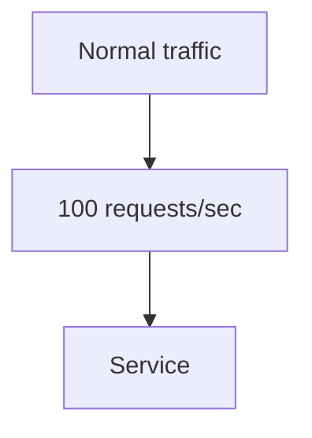

Now the service becomes temporarily slow.

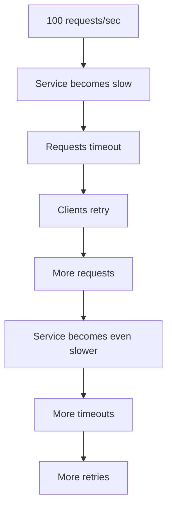

This creates a feedback loop:

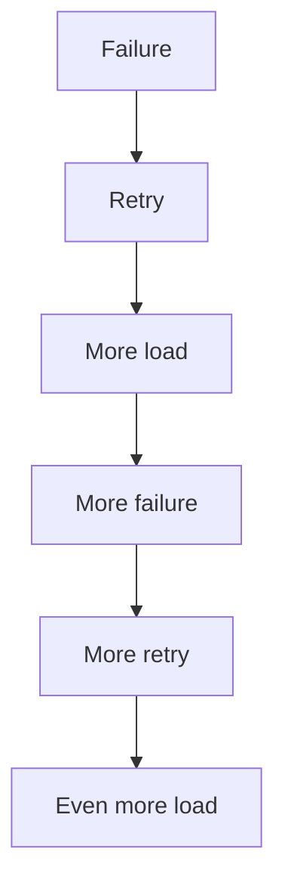

That is the core idea behind a retry storm.

---

# 2. Why Are Retry Storms Dangerous?

Retries create additional work.

Suppose an application normally receives:

```text
1,000 requests/sec
```

If every request is attempted once:

```text
1,000 attempts/sec
```

Now imagine every request is retried once:

```text
1,000 original
+
1,000 retries
=
2,000 attempts/sec
```

If requests are retried twice:

```text
1,000 original
+
1,000 retry #1
+
1,000 retry #2
=
3,000 attempts/sec
```

The dependency now sees **three times the original request attempts**.

The important lesson:

> **Retries can multiply traffic during exactly the period when a system has the least spare capacity.**

---

# 3. The Retry Feedback Loop

Consider a service that can normally handle:

```text
1,000 requests/sec
```

Traffic suddenly reaches:

```text
1,200 requests/sec
```

The service becomes overloaded.

Some requests start timing out.

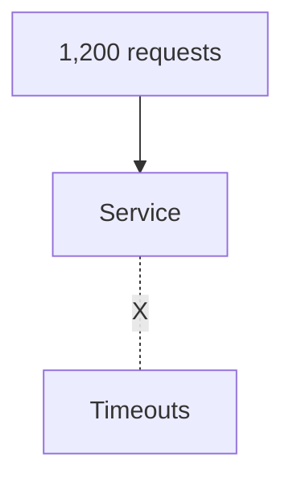

Clients retry.

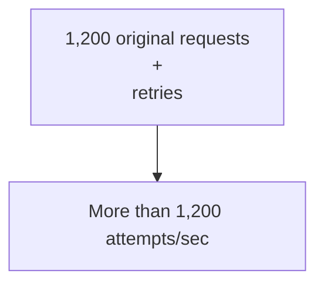

The service becomes even more overloaded.

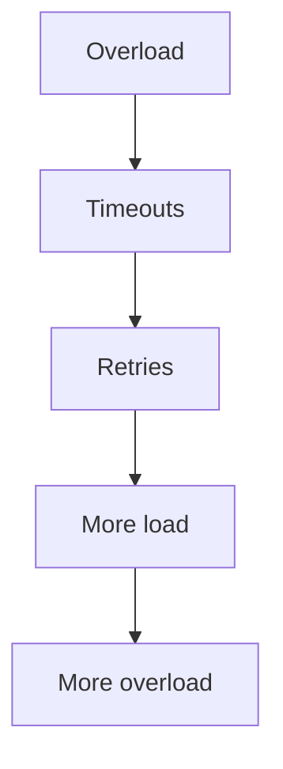

This is a positive feedback loop.

---

# 4. Retry Storm vs Traffic Spike

These are not the same thing.

### Traffic spike

More users or clients generate more original requests.

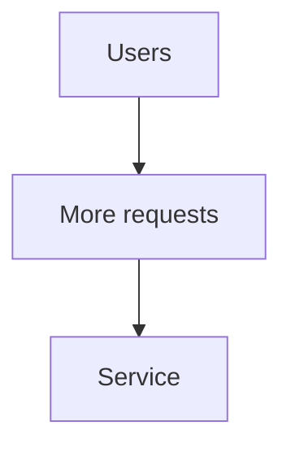

### Retry storm

Existing requests generate additional attempts.

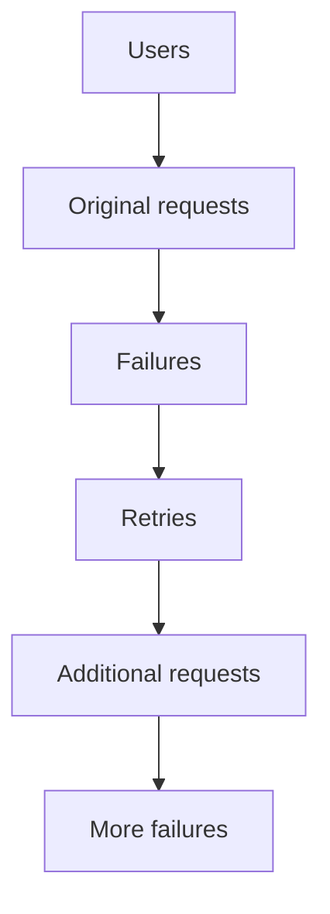

The second case is particularly dangerous because the system is generating additional work by itself.

---

# 5. A Simple Numerical Example

Suppose:

```text
Normal traffic = 500 requests/sec
```

A dependency starts failing.

Assume every request is retried twice.

Potential attempts:

```text
Original       = 500
Retry #1       = 500
Retry #2       = 500
-------------------
Total          = 1,500 attempts/sec
```

The dependency may now receive:

```text
3 × normal traffic
```

If the service was already overloaded, the retries make recovery harder.

---

# 6. Retry Amplification

Retry amplification describes how a relatively small amount of original traffic can produce much more downstream work.

For example:

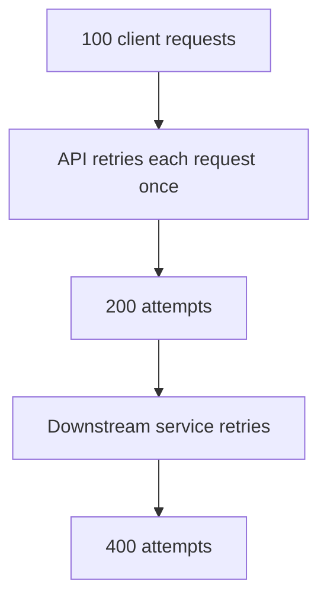

The exact multiplication depends on the architecture and retry rules.

The architectural danger is:

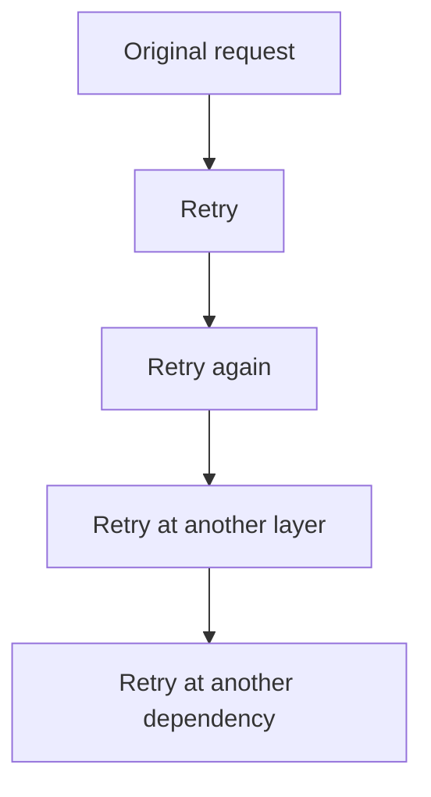

Every layer can increase the amount of work.

---

# 7. Layered Retry Amplification

Consider:

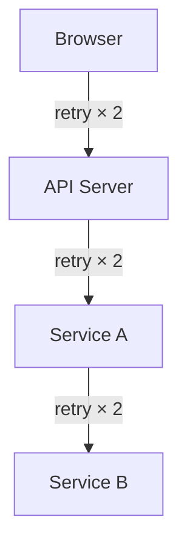

A single logical request can result in many physical attempts.

Conceptually:

```text
2 × 2 × 2 = 8
```

The actual behavior depends on whether failures propagate, whether attempts overlap, and how each layer handles deadlines.

But the lesson is simple:

> **Retries at multiple layers must be designed together.**

---

# 8. Why Timeouts Can Trigger Retry Storms

Timeouts and retries often form a chain.

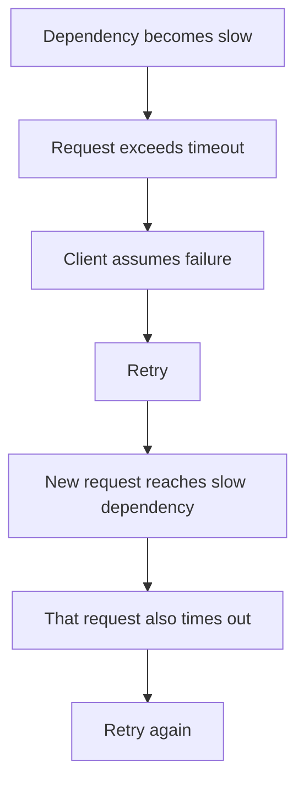

The dependency now has more work to process.

That extra work can increase latency.

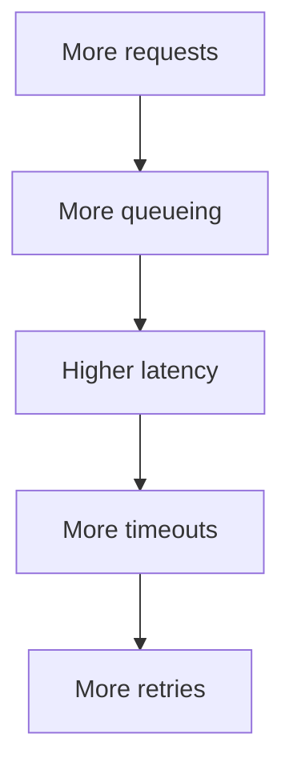

This is one of the most important system-design feedback loops.

---

# 9. The Queueing Effect

Suppose a server can process:

```text
1,000 requests/sec
```

But incoming attempts reach:

```text
1,200 attempts/sec
```

The extra requests begin waiting.

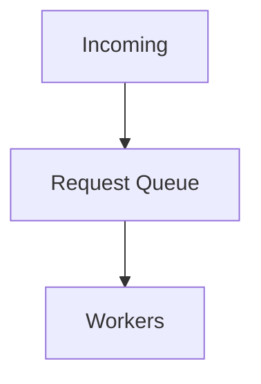

As the queue grows:

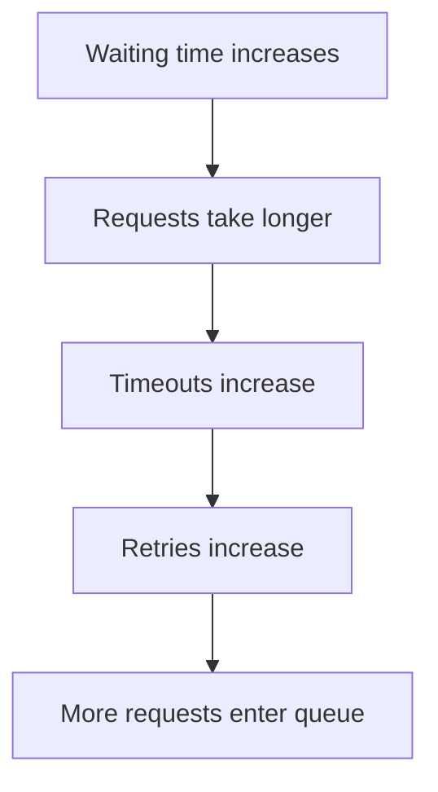

The system can move into a self-reinforcing failure state.

---

# 10. Why Partial Failure Is Especially Dangerous

A complete failure can sometimes be easier to reason about.

For example:

```text
Service = completely unavailable
```

Clients receive immediate failures.

But consider:

```text
Service = 80% healthy
Service = 20% slow/failing
```

Now:

```text
Some requests succeed
Some timeout
Some retry
```

The retry traffic can increase the pressure on the service.

This is a form of **partial failure**.

Distributed systems commonly experience partial failures because one component, instance, network path, or dependency may fail while the rest of the system continues working.

---

# 11. The Thundering Herd Connection

Imagine 10,000 clients all experience a failure at approximately the same time.

Without jitter:

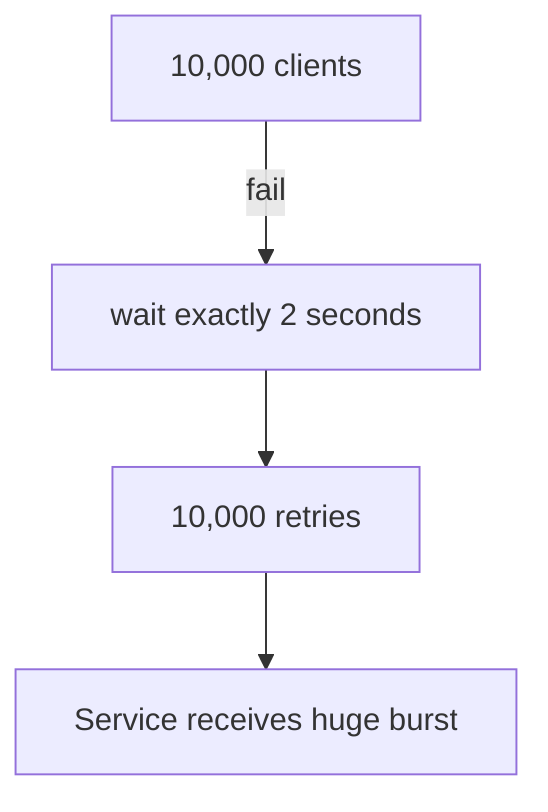

This resembles a herd of clients arriving simultaneously.

Backoff with jitter spreads those attempts over time.

```text
Client A → 1.8s → retry
Client B → 2.3s → retry
Client C → 2.0s → retry
Client D → 2.7s → retry
...
```

The system sees a more distributed pattern instead of one synchronized burst.

---

# 12. Why Jitter Matters

Without jitter:

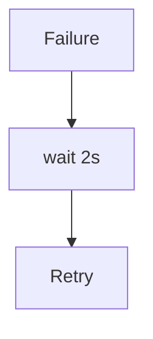

Many clients can follow the same schedule.

With jitter:

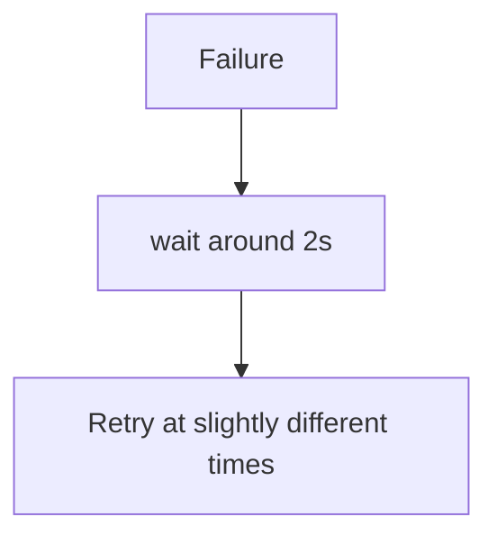

The purpose is not to make retries random for its own sake.

The purpose is:

> **Spread retry traffic over time.**

---

# 13. Backoff Helps, But Is Not Enough

Backoff reduces pressure.

But consider:

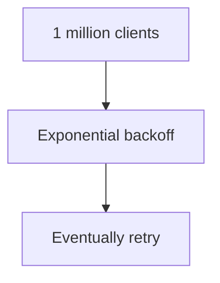

If every client is still allowed unlimited retries, the system can remain under pressure for a long time.

Therefore:

```text
Backoff
   +
Jitter
   +
Maximum attempts
   +
Deadline
   +
Retry budget
```

should be considered together.

---

# 14. Retry Budgets

A **retry budget** limits how much additional traffic retries are allowed to generate.

For example:

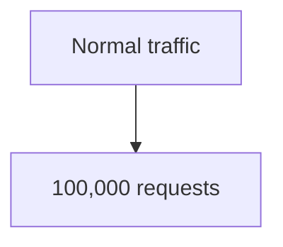

A system may decide that retry traffic should remain within a controlled portion of normal traffic.

Conceptually:

```text
Original traffic = 100%
Retry traffic    = limited
```

The exact budget depends on the system.

The important principle is:

> **Retries must not be allowed to consume unlimited capacity.**

---

# 15. Retry Budget vs Maximum Attempts

These are related but different.

### Maximum attempts

Controls one operation:

```mermaid
flowchart TD
  accTitle: Maximum attempts
  accDescr: A request makes attempt 1, retries, attempt 2, retries, attempt 3, then stops.
  N0["Request"] --> N1["Attempt 1"] --> N2["Retry"] --> N3["Attempt 2"] --> N4["Retry"] --> N5["Attempt 3"] --> N6["Stop"]
```

### Retry budget

Controls retry activity across many operations:

```text
Request A ── retry
Request B ── retry
Request C ── retry
Request D ── retry
       |
       v
Overall retry budget
```

You need both levels of control.

---

# 16. Retry Only When It Helps

During an outage, blindly retrying every error is dangerous.

A system should ask:

```mermaid
flowchart TD
  accTitle: Retry only when it helps
  accDescr: Is this failure likely temporary? Yes. Can the operation be retried safely? Yes. Is there enough time and retry budget? Yes. Retry.
  A["Is this failure likely temporary?"] ---|"YES"| B["Can the operation be retried safely?"] ---|"YES"| C["Is there enough time and retry budget?"] ---|"YES"| R["Retry"]
```

Otherwise:

```text
Stop
Return/fallback/reconcile
```

---

# 17. Don't Retry Permanent Errors

Suppose the server returns:

```text
Invalid request
```

Retrying doesn't fix the request.

```mermaid
flowchart TD
  accTitle: Retrying a permanent error
  accDescr: An invalid request stays invalid however often it is retried.
  N0["Invalid request"] --> N1["Retry"] --> N2["Invalid request"] --> N3["Retry"] --> N4["Invalid request"]
```

This only creates more unnecessary work.

The retry policy should distinguish between:

```text
Transient failure
```

and:

```text
Permanent failure
```

---

# 18. State-Changing Operations Are Special

A retry storm is not only about traffic.

It can also cause duplicate side effects.

Consider:

```mermaid
flowchart TD
  accTitle: Retrying a state-changing operation
  accDescr: Create order, timeout, retry, create order again.
  N0["Create Order"] --> N1["Timeout"] --> N2["Retry"] --> N3["Create Order again"]
```

Possible result:

```text
Order A
Order B
```

This is why idempotency matters.

For operations such as:

* Payments
* Orders
* Account creation
* Transfers
* Shipment creation

the system must determine whether repeating the operation is safe.

---

# 19. Unknown Outcome During an Outage

Consider:

```mermaid
flowchart TD
  accTitle: An unknown outcome during an outage
  accDescr: The client sends a payment to the payment service. The payment succeeds but the response is lost, and the client times out.
  C["Client"] -->|"Payment"| P["Payment Service"] -. "Payment succeeds<br/>X Response lost" .- T["Client times out"]
```

The client does not know whether the payment succeeded.

If it blindly retries:

```mermaid
flowchart TD
  accTitle: A duplicate payment
  accDescr: Payment, then payment again.
  N0["Payment"] --> N1["Payment again"]
```

the customer could potentially be charged twice.

Therefore:

```mermaid
flowchart TD
  accTitle: Resolving an unknown outcome
  accDescr: A timeout leaves the outcome unknown: check the status or use idempotency, then resolve the state.
  N0["Timeout"] --> N1["Outcome unknown"] --> N2["Check status / use idempotency"] --> N3["Resolve state"]
```

A retry policy must account for this.

---

# 20. Retry Storm Prevention

A robust system can combine several protections:

```mermaid
flowchart TD
  accTitle: Retry storm prevention
  accDescr: A retry policy combines backoff, jitter and maximum attempts, then a deadline, a retry budget and idempotency.
  P["Retry Policy"] --- B["Backoff"] & J["Jitter"] & M["Max Attempts"]
  B & J & M --- D["Deadline"] --- R["Retry Budget"] --- I["Idempotency"]
```

Each protects against a different problem.

---

# 21. Circuit Breaker Preview

Suppose a dependency is repeatedly failing.

Instead of continuing:

```mermaid
flowchart TD
  accTitle: Retrying a failing dependency
  accDescr: A request reaches the dependency, which fails; retry; the dependency fails again; retry.
  Q["Request"] --> D1["Dependency"] -. "X" .-> R1["Retry"] --> D2["Dependency"] -. "X" .-> R2["Retry"]
```

a system can temporarily stop sending requests:

```mermaid
flowchart TD
  accTitle: A circuit breaker
  accDescr: A dependency repeatedly failing opens the circuit; new requests don't call the dependency, and the dependency gets recovery time.
  N0["Dependency repeatedly failing"] --> N1["Circuit opens"] --> N2["New requests don't call dependency"] --> N3["Dependency gets recovery time"]
```

This is the idea behind a **circuit breaker**.

Circuit breakers are covered in:

**02.13 — Circuit Breaker**

---

# 22. Fail Fast During Severe Failure

Sometimes the correct response is not:

```text
Try harder
```

but:

```text
Stop quickly
```

For example:

```mermaid
flowchart TD
  accTitle: Fail fast on an optional dependency
  accDescr: The optional recommendation service fails. Don't keep retrying: show the page without recommendations.
  O["Optional Recommendation Service"] -. "X" .- D["Don't keep retrying"] --> S["Show page without<br/>recommendations"]
```

This is **graceful degradation**.

The main application can continue functioning even though an optional dependency is unavailable.

---

# 23. Required vs Optional Dependencies

This distinction matters.

### Required dependency

Example:

```mermaid
flowchart TD
  accTitle: A required dependency
  accDescr: Checkout needs payment.
  N0["Checkout"] --> N1["Payment"]
```

If payment cannot be confirmed, checkout may need to stop.

### Optional dependency

Example:

```mermaid
flowchart LR
  accTitle: Required and optional dependencies
  accDescr: The product page uses the product database and the recommendation service.
  P["Product Page"] --- D["Product database"] & R["Recommendation service"]
```

If recommendations fail:

```text
Product database → Success
Recommendation → Failure
```

The application might simply omit recommendations.

The retry policy should reflect the importance of the dependency.

---

# 24. A Practical Example

Suppose:

```text
Traffic = 10,000 requests/sec
```

A downstream service begins responding slowly.

Without controls:

```mermaid
flowchart TD
  accTitle: Without protection
  accDescr: 10,000 requests time out and are retried: 20,000 attempts, more latency, more timeouts, more retries, 30,000+ attempts.
  N0["10,000 requests"] --> N1["Timeouts"] --> N2["Retries"] --> N3["20,000 attempts"] --> N4["More latency"] --> N5["More timeouts"] --> N6["More retries"] --> N7["30,000+ attempts"]
```

With controlled retries:

```mermaid
flowchart TD
  accTitle: With protection
  accDescr: 10,000 requests, some timeouts, limited retries with backoff and jitter, a retry budget, excessive retries stopped, then fallback or failure.
  N0["10,000 requests"] --> N1["Some timeouts"] --> N2["Limited retries"] --> N3["Backoff + jitter"] --> N4["Retry budget"] --> N5["Stop excessive retries"] --> N6["Fallback / failure"]
```

The goal is not to guarantee success.

The goal is to prevent recovery mechanisms from becoming another source of failure.

---

# 25. Client Retry Coordination

Large systems often have many clients.

If every client independently chooses:

```text
Retry 3 times
Wait 2 seconds
```

the system may still experience synchronized load.

Therefore, clients should generally use:

```text
Backoff
+
Jitter
+
Deadline
+
Attempt limit
```

and, where appropriate, respect server-provided retry guidance.

---

# 26. Server Retry Coordination

Servers also need consistent policies.

For example:

```mermaid
flowchart LR
  accTitle: Server retry coordination
  accDescr: The API calls the database, the payment service and the email service.
  A["API"] --> D["Database"] & P["Payment Service"] & E["Email Service"]
```

If all dependencies have aggressive retries:

```text
API retries
Database retries
Payment retries
Email retries
```

the combined system may generate excessive work.

Retry behavior should be treated as an **architectural policy**, not just a library setting.

---

# 27. Observability During Retry Storms

You cannot control what you cannot see.

Useful metrics include:

* Request rate
* Retry rate
* Retry-to-original-request ratio
* Timeout rate
* Error rate
* Request latency
* Queue depth
* Dependency latency
* Circuit-breaker state
* Saturated worker/connection pools

A particularly useful metric is:

```text
Retry rate / Original request rate
```

For example:

```text
Original requests = 10,000/sec
Retries           = 2,000/sec

Retry ratio = 20%
```

A sudden increase can indicate dependency trouble.

---

# 28. Retry Rate Can Hide the Real Problem

Imagine monitoring only:

```text
HTTP request rate
```

You see:

```text
10,000 requests/sec
```

But internally:

```text
10,000 original requests
+
5,000 retries
=
15,000 attempts
```

If your monitoring doesn't distinguish them, you may underestimate the workload.

Therefore, systems should make retry activity visible.

---

# 29. Retry Storm Prevention Checklist

Before deploying retries, ask:

### Failure

* Which failures are retryable?
* Which failures are permanent?

### Time

* What is the per-attempt timeout?
* What is the total deadline?

### Attempts

* What is the maximum attempt count?

### Delay

* Is exponential backoff used?
* Is jitter used?

### Load

* What retry budget exists?
* What happens if thousands of clients retry simultaneously?

### Side Effects

* Is the operation idempotent?
* Can a timeout mean the operation already succeeded?

### Architecture

* Which layer owns the retry?
* Are multiple layers retrying the same operation?

### Recovery

* Is there a fallback?
* Should a circuit breaker stop calls?

---

# 30. Retry Storm Decision Flow

```mermaid
flowchart TD
  accTitle: Retry storm decision flow
  accDescr: A failure: is it transient? If no, stop. Is the operation safe to retry? If no, stop. Check the deadline and the retry budget. If the budget is exceeded, stop; if OK, back off with jitter and retry. Success? If yes, done. If no, check attempts and deadline: if exhausted, stop; if not, retry.
  F["Failure"] --> Q1{"Is failure<br/>transient?"}
  Q1 ---|"NO"| S1["STOP"]
  Q1 ---|"YES"| Q2{"Is operation safe<br/>to retry?"}
  Q2 ---|"NO"| S2["STOP"]
  Q2 ---|"YES"| D["Check deadline"] --> B["Check retry budget"]
  B -->|"Budget OK"| J["Backoff + Jitter"]
  B -->|"Budget exceeded"| S3["STOP"]
  J --> R["Retry"] --> Q3{"Success?"}
  Q3 ---|"YES"| DN["DONE"]
  Q3 ---|"NO"| Q4{"Attempts/<br/>deadline?"}
  Q4 ---|"YES"| S4["STOP"]
  Q4 ---|"NO"| R2["Retry"]
```

---

# 31. Key Principle

> **Retries are recovery mechanisms, not free extra capacity.**

A retry storm happens when the system's attempt to recover from failure creates so much additional work that it makes the original failure worse.

Think:

```mermaid
flowchart TD
  accTitle: Key principle
  accDescr: Failure, retry, additional load, more failure, more retry.
  N0["Failure"] --> N1["Retry"] --> N2["Additional load"] --> N3["More failure"] --> N4["More retry"]
```

The solution is controlled recovery:

```text
Retry
  +
Backoff
  +
Jitter
  +
Limits
  +
Deadline
  +
Retry Budget
  +
Idempotency
  +
Fallback / Circuit Breaking
```

---

# 32. Quick Reference

| Concept              | Meaning                                                            |
| -------------------- | ------------------------------------------------------------------ |
| Retry Storm          | Large amount of retry traffic caused by widespread failures        |
| Retry Amplification  | Additional work created by retries                                 |
| Retry Loop           | Failure → retry → failure → retry                                  |
| Backoff              | Increasing delay between attempts                                  |
| Jitter               | Variation added to retry delays                                    |
| Retry Budget         | Limit on retry-generated traffic/work                              |
| Maximum Attempts     | Maximum attempts for one operation                                 |
| Deadline             | Maximum total time for the operation                               |
| Partial Failure      | Some components/requests fail while others continue                |
| Graceful Degradation | Continue providing useful functionality despite dependency failure |
| Circuit Breaker      | Temporarily stop calls to a failing dependency                     |

---

# 33. Knowledge Check

### Q1. What is a retry storm?

A situation where widespread retries create excessive additional traffic and load, potentially making the original failure worse.

### Q2. Why can retries make an outage worse?

Because every retry creates additional work for an already struggling dependency.

### Q3. What is retry amplification?

The increase in total attempts caused by retries compared with the original request volume.

### Q4. Why is jitter useful?

It spreads retries over time so many clients do not retry simultaneously.

### Q5. Why is backoff useful?

It reduces the frequency of repeated attempts and gives the dependency time to recover.

### Q6. Why can layered retries be dangerous?

Because each architectural layer may generate additional attempts, multiplying downstream work.

### Q7. Why are retry budgets useful?

They prevent retries from consuming unlimited system capacity.

### Q8. What should happen when a state-changing operation times out?

Do not blindly retry. Determine whether the operation may already have succeeded and use mechanisms such as idempotency or status reconciliation when appropriate.

---

# 35. Final Mental Model

A healthy retry system looks like:

```mermaid
flowchart TD
  accTitle: Final mental model
  accDescr: A temporary failure: retry safely? If no, stop. Retry budget? If no, stop. Back off with jitter and retry. On success, done. On failure, a deadline or limit leads to stop.
  T["Temporary Failure"] --> Q1{"Retry Safely?"}
  Q1 ---|"NO"| S1["STOP"]
  Q1 ---|"YES"| Q2{"Retry Budget?"}
  Q2 ---|"NO"| S2["STOP"]
  Q2 ---|"YES"| B["Backoff<br/>+<br/>Jitter"] --> R["Retry"]
  R --- OK["Success"] --- DN["DONE"]
  R --- FL["Failure"] --- L["Deadline / Limit"] --> S3["STOP"]
```

The key system-design lesson is:

> **When a dependency is failing, the system must reduce pressure—not accidentally increase it.**
