# 02.13 — Circuit Breaker

## Learning Objectives

By the end of this chapter, you should be able to:

* Understand what a circuit breaker is and why systems use it.
* Understand the three main circuit-breaker states.
* Understand how a circuit breaker protects a failing dependency.
* Distinguish a circuit breaker from retries, timeouts, and failover.
* Understand how a circuit breaker can prevent retry storms.
* Understand when a circuit breaker should open and close.
* Understand common configuration and design mistakes.
* Build a practical mental model for using circuit breakers in distributed systems.

---

# 1. The Problem a Circuit Breaker Solves

Imagine an application depends on another service:

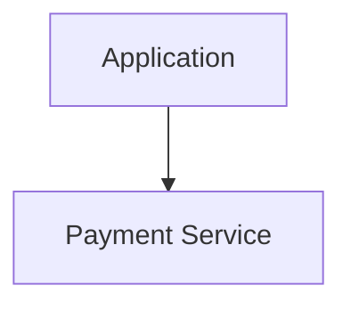

Normally:

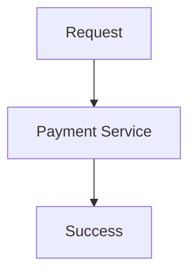

But the payment service starts failing.

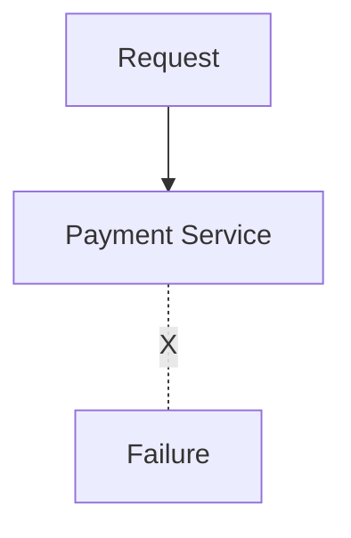

The application keeps trying:

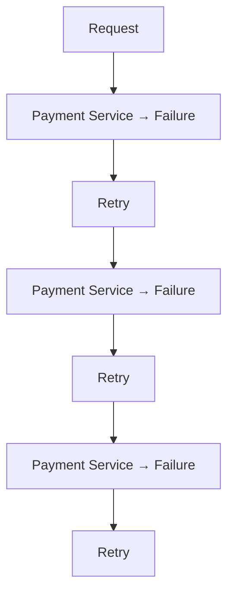

This creates unnecessary work.

A circuit breaker provides another behavior:

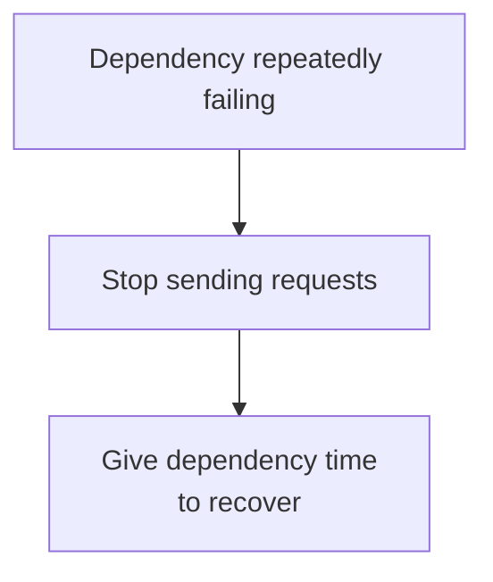

That is the core idea.

> **A circuit breaker temporarily stops calls to a failing dependency instead of repeatedly sending requests that are likely to fail.**

---

# 2. Why Is It Called a Circuit Breaker?

The name comes from an electrical circuit breaker.

An electrical circuit breaker can interrupt a circuit when dangerous conditions occur.

Conceptually:

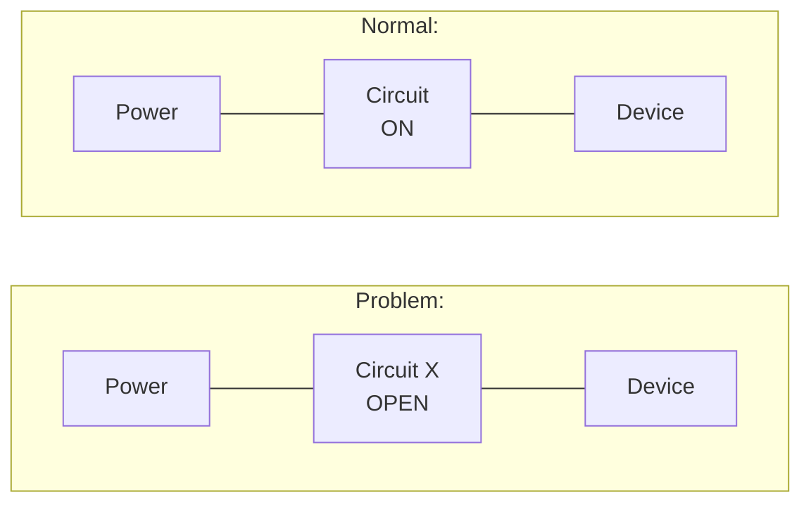

A software circuit breaker behaves similarly:

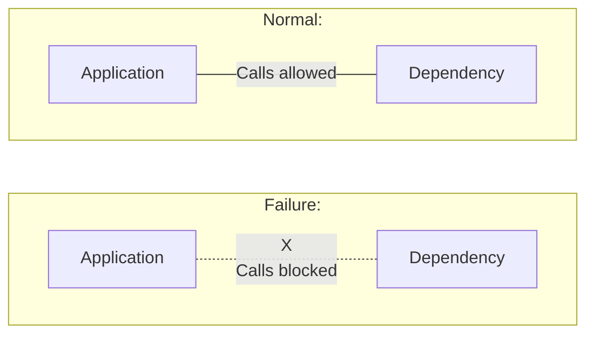

The software circuit breaker is not literally an electrical mechanism.

It is an analogy for:

> **Stop the flow temporarily when continuing would be harmful.**

---

# 3. Without a Circuit Breaker

Consider an application calling a recommendation service.

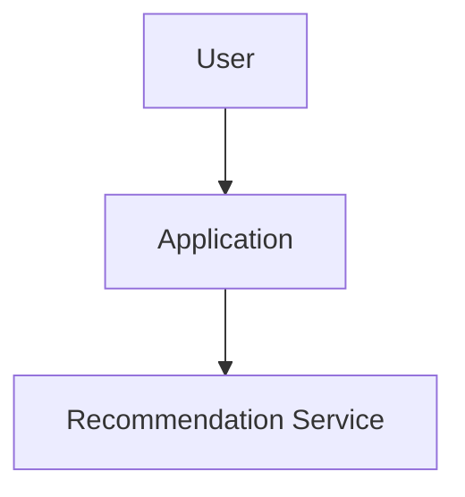

The recommendation service becomes unavailable.

Without a circuit breaker:

```text
Request 1 ──X
Request 2 ──X
Request 3 ──X
Request 4 ──X
Request 5 ──X
Request 6 ──X
...
```

If every request also retries:

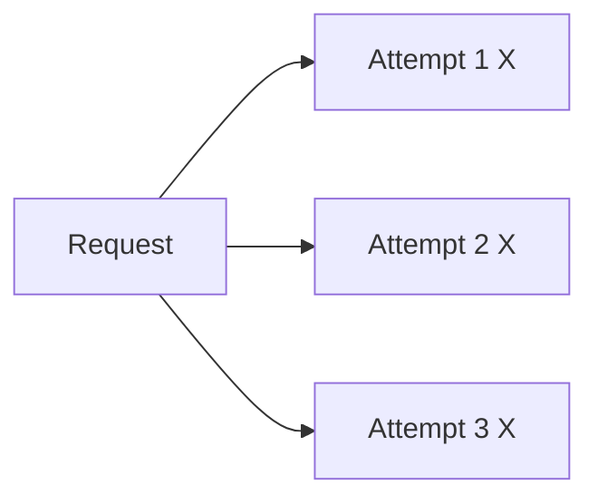

Thousands of users can generate a large number of failed calls.

---

# 4. With a Circuit Breaker

With a circuit breaker:

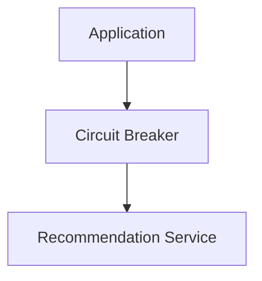

Initially:

```text
Circuit = CLOSED
```

Calls are allowed.

After repeated failures:

```text
Circuit = OPEN
```

Calls are blocked.

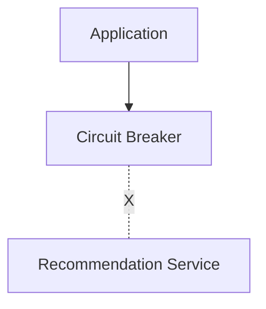

After some time, the circuit allows a limited test.

```text
Circuit = HALF-OPEN
```

If the dependency has recovered:

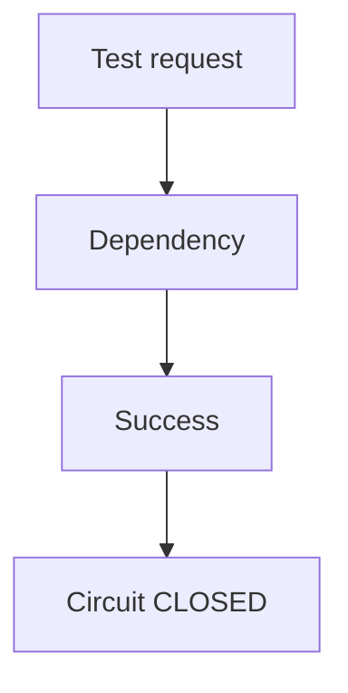

This gives us the three fundamental states:

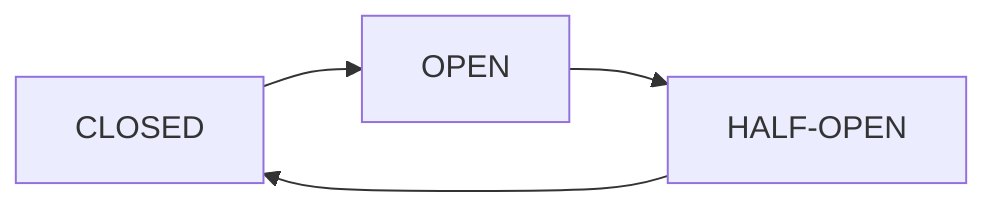

---

# 5. The Three Circuit Breaker States

A circuit breaker usually has three states:

| State         | Meaning                     |
| ------------- | --------------------------- |
| **Closed**    | Calls are allowed           |
| **Open**      | Calls are blocked           |
| **Half-Open** | Limited calls test recovery |

These names are extremely important.

---

# 6. CLOSED State

In the **CLOSED** state, the application can call the dependency normally.

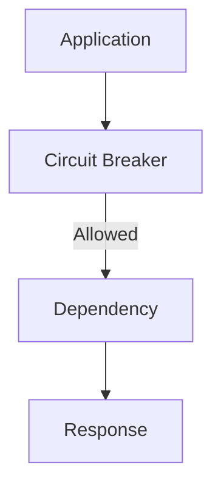

The circuit breaker observes the calls.

For example:

```text
Success
Success
Success
Success
Failure
Success
Success
```

The circuit remains closed if the failure level stays within the configured threshold.

Think:

> **Closed = normal operation.**

---

# 7. What Does the Circuit Monitor?

A circuit breaker needs evidence that a dependency is unhealthy.

It may monitor things such as:

* Failure count
* Failure rate
* Timeout rate
* Connection failures
* Response latency
* Selected error responses

For example:

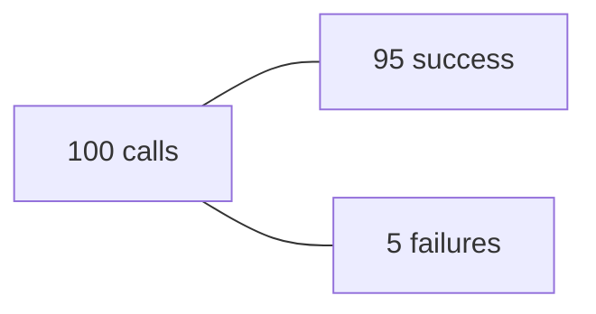

Failure rate:

```text
5 / 100 = 5%
```

A system might use a failure-rate threshold.

For example:

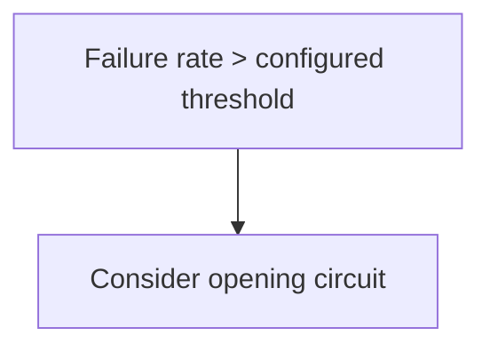

The exact threshold depends on the system.

There is no universal value that works everywhere.

---

# 8. OPEN State

When the circuit opens, calls to the dependency are blocked.

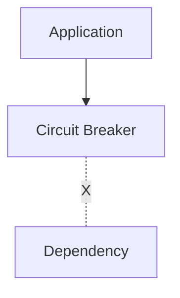

Instead of allowing the request to reach the failing service, the circuit breaker fails fast.

For example:

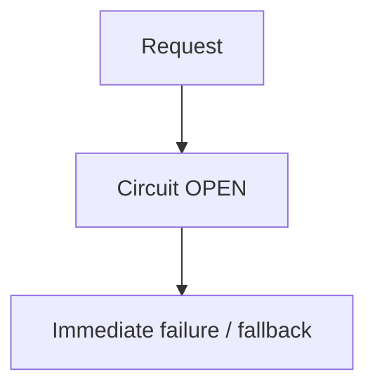

The application does not waste time waiting for a dependency that is currently considered unhealthy.

---

# 9. Why Fail Fast?

Suppose a dependency takes 10 seconds to fail.

Without a circuit breaker:

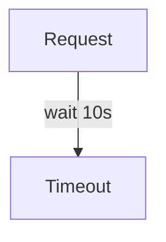

Now imagine 10,000 requests doing this.

Many application resources remain occupied:

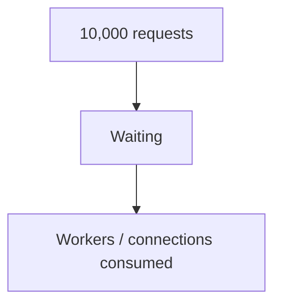

With an open circuit:

```mermaid
flowchart TD
  accTitle: Failing immediately
  accDescr: A request meets the open circuit and fails immediately.
  N0["Request"] --> N1["Circuit OPEN"] --> N2["Fail immediately"]
```

The application can release resources much sooner.

This is called **fail fast**.

---

# 10. Fail Fast Does Not Mean "Give Up Forever"

An open circuit should not remain open permanently.

The dependency might recover.

Therefore, the circuit breaker waits for a configured period before testing the dependency.

Conceptually:

```mermaid
flowchart TD
  accTitle: Open is temporary
  accDescr: The circuit goes from closed to open when failures exceed the threshold, and after a wait to half-open.
  C["CLOSED"] -->|"failures exceed threshold"| O["OPEN"] -->|"wait"| H["HALF-OPEN"]
```

The circuit breaker now asks:

> "Has the dependency recovered?"

---

# 11. HALF-OPEN State

In the **HALF-OPEN** state, the circuit allows a limited number of test calls.

For example:

```mermaid
flowchart TD
  accTitle: The HALF-OPEN state
  accDescr: With the circuit half-open, a test request reaches the dependency and succeeds.
  subgraph H["Circuit = HALF-OPEN"]
    T["Test request"] --> D["Dependency"] --> S["Success"]
  end
```

If the test succeeds, the circuit may close again.

```mermaid
flowchart TD
  accTitle: A successful test
  accDescr: From half-open, success closes the circuit.
  H["HALF-OPEN"] -->|"Success"| C["CLOSED"]
```

If the test fails:

```mermaid
flowchart TD
  accTitle: A failed test
  accDescr: From half-open, failure opens the circuit again.
  H["HALF-OPEN"] -->|"Failure"| O["OPEN"]
```

The dependency is still considered unhealthy.

---

# 12. Why Not Immediately Close the Circuit?

Suppose the dependency is still overloaded.

If the circuit immediately reopens all traffic:

```mermaid
flowchart TD
  accTitle: Closing too soon
  accDescr: The circuit opens, waits briefly and closes; 10,000 requests hit the dependency, and it fails again.
  N0["Circuit opens"] --> N1["Wait briefly"] --> N2["Circuit closes"] --> N3["10,000 requests hit dependency"] --> N4["Dependency fails again"]
```

This can create repeated cycles.

Instead:

```mermaid
flowchart TD
  accTitle: Testing carefully
  accDescr: From open to half-open, a small number of test requests, then evaluate the result.
  N0["OPEN"] --> N1["HALF-OPEN"] --> N2["Small number of test requests"] --> N3["Evaluate result"]
```

This is safer.

---

# 13. Complete State Flow

The basic state machine is:

```mermaid
flowchart TD
  accTitle: Complete state flow
  accDescr: Closed goes to open when failures exceed the threshold; open goes to half-open after a wait; half-open goes back to closed on success. From half-open, success leads to closed and failure to open.
  C["CLOSED"] -->|"failures exceed threshold"| O["OPEN"] -->|"wait"| H["HALF-OPEN"]
  H -->|"success"| C
  H --- S["Success"] --> C2["CLOSED"]
  H --- F["Failure"] --> O2["OPEN"]
```

This state machine is the heart of a circuit breaker.

---

# 14. Circuit Breaker vs Retry

These mechanisms solve different problems.

### Retry

```mermaid
flowchart TD
  accTitle: A retry
  accDescr: A request fails, is retried, and is sent again.
  R["Request"] -. "X" .- T["Retry"]
  T --> A["Request again"]
```

The question is:

> **"Should I try again?"**

### Circuit Breaker

```mermaid
flowchart TD
  accTitle: A circuit breaker
  accDescr: Repeated failures: stop sending requests.
  N0["Repeated failures"] --> N1["Stop sending requests"]
```

The question is:

> **"Should I stop calling this dependency for now?"**

They can work together:

```mermaid
flowchart TD
  accTitle: Retry and circuit breaker together
  accDescr: A request passes the circuit breaker to the dependency and fails. The retry policy retries and fails again; repeated failures open the circuit.
  R["Request"] --> C["Circuit Breaker"] --> D["Dependency"]
  D -. "X" .- F["Failure"]
  F --> P["Retry policy"]
  P -. "X" .- X["Repeated failures"]
  X --> O["Circuit opens"]
```

---

# 15. Circuit Breaker vs Timeout

A timeout controls **how long one attempt waits**.

```mermaid
flowchart TD
  accTitle: A timeout
  accDescr: A request waits on the dependency until it times out.
  R["Request"] --> D["Dependency"]
  D -. "wait<br/>X" .- T["Timeout"]
```

A circuit breaker controls **whether new attempts should be sent at all**.

```mermaid
flowchart TD
  accTitle: A circuit breaker blocks new requests
  accDescr: With the circuit open, a new request is blocked.
  C["Circuit OPEN"] -. "X" .- N["New request blocked"]
```

Therefore:

> **Timeout controls waiting. Circuit breaker controls continued calling.**

---

# 16. Circuit Breaker vs Failover

Failover moves traffic somewhere else.

```mermaid
flowchart TD
  accTitle: Failover
  accDescr: The primary fails and work moves to the secondary.
  P["Primary"] -. "X" .-> S["Secondary"]
```

A circuit breaker blocks calls to a failing dependency.

```mermaid
flowchart TD
  accTitle: A circuit breaker alone
  accDescr: The dependency fails, and the circuit breaker blocks calls.
  D["Dependency"] -. "X" .- C["Circuit Breaker"]
  C -. " " .- E["X"]
```

They can be combined.

For example:

```mermaid
flowchart TD
  accTitle: Circuit breaker with a fallback
  accDescr: The primary service fails; the circuit breaker sends calls to the fallback service.
  P["Primary Service"] -. "X" .- C["Circuit Breaker"]
  C --> F["Fallback Service"]
```

But a circuit breaker does not automatically mean failover exists.

---

# 17. Circuit Breaker and Retry Storms

This is where the previous chapter connects directly.

Without a circuit breaker:

```mermaid
flowchart TD
  accTitle: A retry storm
  accDescr: Failure, retry, failure, retry, more load, more failure.
  N0["Failure"] --> N1["Retry"] --> N2["Failure"] --> N3["Retry"] --> N4["More load"] --> N5["More failure"]
```

With a circuit breaker:

```mermaid
flowchart TD
  accTitle: A circuit breaker stops the storm
  accDescr: Failure, retry when appropriate, repeated failure, the circuit opens, new calls are blocked, and load is reduced.
  N0["Failure"] --> N1["Retry when appropriate"] --> N2["Repeated failure"] --> N3["Circuit opens"] --> N4["New calls blocked"] --> N5["Load reduced"]
```

Therefore:

> **A circuit breaker can stop repeated calls from continuing to amplify an outage.**

---

# 18. Circuit Breaker Does Not Fix the Dependency

This is an important distinction.

A circuit breaker does not repair:

* A broken database
* A crashed service
* A network failure
* A bad deployment
* An overloaded server

It only changes how the caller behaves.

```mermaid
flowchart TD
  accTitle: The circuit breaker protects the caller
  accDescr: The dependency is broken. The circuit breaker protects the caller.
  D["Dependency"] -. "X" .- B["Broken"]
  B ~~~ C["Circuit Breaker"] --> P["Protects caller"]
```

The underlying problem still needs to be resolved.

---

# 19. Protecting the Caller

Suppose:

```mermaid
flowchart TD
  accTitle: A slow service
  accDescr: The application calls a slow service.
  N0["Application"] --> N1["Slow Service"]
```

The slow service can consume resources in the application:

```mermaid
flowchart TD
  accTitle: Resources exhausted
  accDescr: Requests leave workers waiting and connections waiting, until application resources are exhausted.
  N0["Requests"] --> N1["Workers waiting"] --> N2["Connections waiting"] --> N3["Application resources exhausted"]
```

A circuit breaker can prevent new requests from entering that path.

```mermaid
flowchart TD
  accTitle: Protecting the caller
  accDescr: The circuit breaker blocks requests to the slow service.
  R["Requests"] --> C["Circuit Breaker"]
  C -. "X" .- S["Slow Service"]
```

The circuit breaker therefore provides **fault isolation**.

---

# 20. Fallback Behavior

Opening a circuit does not automatically tell the application what to show the user.

The application needs a response strategy.

For an optional recommendation service:

```mermaid
flowchart TD
  accTitle: A fallback for recommendations
  accDescr: The recommendation service fails, the circuit opens, and the fallback shows the product without recommendations.
  R["Recommendation Service"] -. "X" .- C["Circuit OPEN"]
  C --> F["Fallback"] --> S["Show product without recommendations"]
```

For a required payment service:

```mermaid
flowchart TD
  accTitle: No fallback for payment
  accDescr: The payment service fails, the circuit opens, and checkout cannot confirm payment.
  P["Payment Service"] -. "X" .- C["Circuit OPEN"]
  C --> K["Checkout cannot confirm payment"]
```

The user might receive:

```text
"Payment service is temporarily unavailable."
```

The correct fallback depends on the business operation.

---

# 21. Required vs Optional Dependencies

This distinction is useful when designing circuit breakers.

### Optional

```mermaid
flowchart LR
  accTitle: An optional dependency
  accDescr: The product page uses product data and recommendations.
  H["Product Page"]
  I0["Product Data"]
  I1["Recommendations"]
  H --- I0
  H --- I1
```

If recommendations fail:

```text
Product Data → Show page
Recommendations → Skip
```

### Required

```mermaid
flowchart LR
  accTitle: A required dependency
  accDescr: Checkout uses the order and the payment.
  H["Checkout"]
  I0["Order"]
  I1["Payment"]
  H --- I0
  H --- I1
```

If payment cannot be confirmed:

```mermaid
flowchart TD
  accTitle: When payment is unavailable
  accDescr: Payment unavailable: the payment cannot be safely completed.
  N0["Payment unavailable"] --> N1["Cannot safely complete payment"]
```

The circuit breaker can protect the system, but business logic determines what the user experiences.

---

# 22. What Should Trigger the Circuit?

Not every error should necessarily open the circuit.

Consider:

```text
400 Bad Request
```

This may mean:

```text
The caller sent invalid data.
```

Repeated calls with the same invalid request do not necessarily mean the dependency itself is unhealthy.

Compare:

```text
Connection failures
Timeouts
503 Service Unavailable
```

These may provide stronger evidence of dependency trouble.

Therefore:

> **Circuit-breaker failure rules should focus on failures that indicate dependency health problems.**

The exact classification depends on the protocol and application.

---

# 23. Failure Rate vs Failure Count

There are different ways to decide when a circuit should open.

### Failure count

Example:

```mermaid
flowchart TD
  accTitle: A failure count
  accDescr: 5 consecutive failures open the circuit.
  N0["5 consecutive failures"] --> N1["Open circuit"]
```

Simple, but potentially sensitive to traffic volume.

### Failure rate

Example:

```text
Last 100 calls

Success = 60
Failure = 40

Failure rate = 40%
```

If the configured threshold is exceeded:

```text
Open circuit
```

Failure rate can be more meaningful when traffic varies.

Some implementations use sliding windows or other statistical approaches.

---

# 24. Consecutive Failures

A simple circuit breaker might monitor:

```text
Success
Success
Failure
Failure
Failure
Failure
```

If the configured threshold is:

```text
4 consecutive failures
```

then:

```text
Circuit → OPEN
```

But consider:

```text
Failure
Success
Failure
Success
Failure
Success
```

There may not be a continuous failure sequence.

This illustrates why the choice of failure detection strategy matters.

---

# 25. Minimum Request Volume

Suppose only one request has been made:

```text
1 request
1 failure
```

Should the circuit immediately open?

Usually, there is not enough evidence to confidently conclude that the dependency is unhealthy.

A circuit-breaker design may therefore require:

```text
Minimum number of requests
```

before calculating a failure rate.

Conceptually:

```mermaid
flowchart TD
  accTitle: Minimum request volume
  accDescr: Too little data: don't make a strong health decision yet.
  N0["Too little data"] --> N1["Don't make a strong health decision yet"]
```

This helps avoid reacting too aggressively to isolated failures.

---

# 26. The Open-State Timer

Once the circuit opens, it usually stays open for some configured period.

Conceptually:

```mermaid
flowchart TD
  accTitle: The open-state timer
  accDescr: The open circuit waits N seconds, then becomes half-open.
  C["Circuit OPEN"] -->|"wait N seconds"| H["HALF-OPEN"]
```

The timer gives the dependency time to recover.

The duration should be appropriate for the dependency.

A very short period may cause repeated probing.

A very long period may unnecessarily delay recovery.

---

# 27. Half-Open Should Be Controlled

Suppose 100,000 requests arrive while the circuit is half-open.

You don't want all 100,000 requests to suddenly hit the recovering dependency.

Instead:

```mermaid
flowchart TD
  accTitle: Controlled half-open
  accDescr: Half-open allows a test request and limited test traffic; remaining calls are blocked.
  H["HALF-OPEN"] --- T["Test request"]
  H --- L["Limited test<br/>traffic"]
  H -. "X" .- B["Remaining calls<br/>blocked"]
```

If the dependency succeeds:

```mermaid
flowchart TD
  accTitle: A healthy test
  accDescr: Half-open, a healthy test, closed.
  N0["HALF-OPEN"] --> N1["Healthy test"] --> N2["CLOSED"]
```

If it fails:

```mermaid
flowchart TD
  accTitle: A failed test
  accDescr: Half-open, a failure, open.
  N0["HALF-OPEN"] --> N1["Failure"] --> N2["OPEN"]
```

---

# 28. Circuit Breaker Per Dependency

Consider:

```mermaid
flowchart LR
  accTitle: One circuit per dependency
  accDescr: The application uses the payment service, the email service and the recommendation service.
  H["Application"]
  I0["Payment Service"]
  I1["Email Service"]
  I2["Recommendation Service"]
  H --- I0
  H --- I1
  H --- I2
```

One dependency can fail while others remain healthy.

Ideally:

```text
Payment Circuit
Email Circuit
Recommendation Circuit
```

operate independently.

You don't necessarily want:

```mermaid
flowchart TD
  accTitle: Scope too broad
  accDescr: The recommendation service fails, and the entire application stops calling everything.
  N0["Recommendation Service fails"] --> N1["Entire application stops calling<br/>everything"]
```

Circuit breakers help isolate failures.

---

# 29. Circuit Breaker Scope Matters

A circuit breaker can be associated with:

* A particular dependency
* A particular endpoint
* A particular service instance
* A particular operation

The correct scope depends on what failure is being detected.

For example:

```mermaid
flowchart LR
  accTitle: Circuit scope
  accDescr: The application calls /recommendations and /products.
  H["Application"]
  I0["/recommendations"]
  I1["/products"]
  H --- I0
  H --- I1
```

If only `/recommendations` is failing, blocking `/products` would be unnecessarily broad.

Therefore:

> **The circuit should protect the failing path without unnecessarily blocking healthy paths.**

---

# 30. Circuit Breaker and Load Balancers

A load balancer may already perform health checks.

For example:

```mermaid
flowchart LR
  accTitle: Load balancer health
  accDescr: The load balancer sees server A healthy, server B failing and server C healthy.
  H["Load Balancer"]
  I0["Server A ✓"]
  I1["Server B X"]
  I2["Server C ✓"]
  H --- I0
  H --- I1
  H --- I2
```

The load balancer stops sending traffic to Server B.

A circuit breaker can operate at another level:

```mermaid
flowchart TD
  accTitle: A circuit breaker in the application
  accDescr: The application calls an external service through a circuit breaker.
  N0["Application"] --> N1["Circuit Breaker"] --> N2["External Service"]
```

The two mechanisms solve different problems.

Health checks answer:

> "Which instance is healthy?"

Circuit breakers answer:

> "Should I continue calling this dependency?"

---

# 31. Example: Recommendation Service

Consider an e-commerce system:

```mermaid
flowchart TD
  accTitle: The recommendation example
  accDescr: The browser reaches the web application, which uses the product database and the recommendation service.
  B["Browser"] --> W["Web Application"] --- D["Product Database"] & R["Recommendation Service"]
```

The recommendation service becomes slow.

Requests begin timing out.

```mermaid
flowchart TD
  accTitle: Recommendations time out
  accDescr: The recommendation call fails with a timeout.
  R["Recommendation"] -. "X" .- T["Timeout"]
```

Retrying every request makes things worse.

The circuit breaker observes repeated failures:

```mermaid
flowchart TD
  accTitle: The circuit opens
  accDescr: The failure rate increases and the circuit opens.
  N0["Failure rate increases"] --> N1["Circuit opens"]
```

Now:

```mermaid
flowchart TD
  accTitle: The page without recommendations
  accDescr: The web application gets the product database; the circuit to recommendations is open and blocks the call.
  W["Web Application"] --- D["Product Database → ✓"]
  W --- C["Circuit → OPEN"]
  C -. "X" .- R["Recommendation"]
```

The product page still works.

Recommendations are temporarily omitted.

This is a practical example of:

> **Failure isolation + graceful degradation.**

---

# 32. Example: Payment Service

Consider:

```mermaid
flowchart TD
  accTitle: The payment example
  accDescr: Checkout calls the payment service.
  N0["Checkout"] --> N1["Payment Service"]
```

Payment is a critical dependency.

If the payment service repeatedly fails:

```text
Circuit OPEN
```

The application should not pretend that payment succeeded.

Instead:

```mermaid
flowchart TD
  accTitle: When the payment circuit is open
  accDescr: Checkout meets the open circuit; payment cannot be confirmed, so inform the user and preserve the order state.
  N0["Checkout"] --> N1["Circuit OPEN"] --> N2["Payment cannot be confirmed"] --> N3["Inform user / preserve order state"]
```

The exact workflow depends on the payment system.

The key principle is:

> **A circuit breaker should prevent unsafe repeated calls; it should not hide critical business failures.**

---

# 33. Circuit Breaker and Idempotency

The previous chapters showed that retries can duplicate state-changing operations.

Circuit breakers do not automatically solve that problem.

For example:

```mermaid
flowchart TD
  accTitle: An unknown outcome
  accDescr: A payment request is processed by the dependency, but the response is lost and the client sees a timeout.
  P["Payment request"] --> D["Dependency processes payment"]
  D -. "X" .- L["Response lost"]
  L --> T["Client sees timeout"]
```

The circuit might later open.

But the original payment may already have succeeded.

Therefore:

```text
Circuit Breaker
      +
Idempotency
      +
Status reconciliation
```

may all be needed.

Different mechanisms solve different failure modes.

---

# 34. Circuit Breaker and Connection Pools

A failing dependency can also cause connection resources to remain occupied.

For example:

```text
Application
    |
Connection Pool
    |
    +-- Connection 1 → waiting
    +-- Connection 2 → waiting
    +-- Connection 3 → waiting
    +-- Connection 4 → waiting
```

If requests keep entering the dependency path, the pool may become exhausted.

A circuit breaker can prevent new dependency calls once the failure condition is detected.

This can help protect local resources.

However:

> **A circuit breaker does not replace sensible connection limits and timeouts.**

---

# 35. Circuit Breaker State Should Be Observable

Operators should know when a circuit opens.

Useful information includes:

```text
Dependency: Recommendation Service

State: OPEN
Failure rate: 68%
Timeout rate: 42%
Open since: ...
Requests blocked: ...
Half-open tests: ...
```

This helps distinguish:

```text
Application problem
```

from:

```text
Dependency problem
```

Observability becomes a dedicated topic later in the curriculum.

---

# 36. Common Circuit Breaker Mistakes

## Mistake 1: Opening on Every Error

```mermaid
flowchart TD
  accTitle: Opening on every error
  accDescr: Any error opens the circuit.
  N0["Any error"] --> N1["Circuit OPEN"]
```

A single client mistake may not indicate dependency failure.

---

## Mistake 2: No Half-Open State

If the circuit opens permanently:

```text
OPEN
OPEN
OPEN
...
```

the application may never automatically detect recovery.

---

## Mistake 3: Half-Open Lets Everyone Through

```mermaid
flowchart TD
  accTitle: Half-open lets everyone through
  accDescr: Half-open lets 100,000 requests through to the dependency.
  N0["HALF-OPEN"] --> N1["100,000 requests"] --> N2["Dependency"]
```

This can overwhelm a recovering dependency.

---

## Mistake 4: Circuit Scope Is Too Broad

One failing endpoint causes unrelated healthy operations to be blocked.

---

## Mistake 5: Circuit Scope Is Too Narrow

A widespread dependency failure affects many circuits independently and still generates excessive probing.

---

## Mistake 6: No Fallback Strategy

Opening the circuit is only half the design.

The application must decide:

```text
What should the caller do now?
```

---

## Mistake 7: Treating OPEN as Recovery

An open circuit protects the caller.

It does not repair the dependency.

---

# 37. Circuit Breaker vs All the Previous Concepts

At this point, several mechanisms work together:

| Mechanism       | Main Question                                        |
| --------------- | ---------------------------------------------------- |
| Health Check    | Is this component healthy enough to receive traffic? |
| Timeout         | How long should I wait?                              |
| Retry           | Should I attempt again?                              |
| Backoff         | How long should I wait before retrying?              |
| Jitter          | How do I avoid synchronized retries?                 |
| Failover        | Can another component handle the workload?           |
| Circuit Breaker | Should I temporarily stop calling this dependency?   |

A typical flow might look like:

```mermaid
flowchart TD
  accTitle: Circuit breaker and the previous concepts
  accDescr: A request passes the closed circuit breaker to the dependency, which times out. A retry fails with repeated failures, the circuit opens, calls fail fast or fall back, and after waiting the circuit goes half-open to test recovery.
  R["Request"] --> C["Circuit Breaker"] -->|"CLOSED"| D["Dependency"]
  D -. "X" .- T["Timeout"]
  T --> Y["Retry"]
  Y -. "X" .- X["Repeated failures"]
  X --> O["Circuit OPEN"] --> F["Fail fast / fallback"] -->|"after waiting"| H["HALF-OPEN"] --> V["Test recovery"]
```

---

# 38. Circuit Breaker Design Checklist

Before adding a circuit breaker, define:

### 1. What dependency is being protected?

```text
Database?
External API?
Microservice?
Third-party provider?
```

### 2. What counts as a failure?

```text
Timeout?
Connection failure?
Specific server errors?
Latency threshold?
```

### 3. When should the circuit open?

```text
Failure count?
Failure rate?
Sliding window?
```

### 4. How long should it remain open?

```text
Open-state wait period
```

### 5. How should recovery be tested?

```text
How many half-open requests?
```

### 6. What happens when the circuit is open?

```text
Fallback?
Error?
Cached response?
Queue?
```

### 7. How is the circuit monitored?

```text
Logs?
Metrics?
Alerts?
```

---

# 39. Simple Circuit Breaker Pseudocode

The following is conceptual pseudocode, not production code:

```text
if circuit == OPEN:
    if open_timeout_expired:
        circuit = HALF_OPEN
    else:
        return fallback_or_error

if circuit == HALF_OPEN:
    allow_limited_test_request

if request_succeeds:
    record_success

    if circuit == HALF_OPEN:
        circuit = CLOSED

if request_fails:
    record_failure

    if failure_threshold_reached:
        circuit = OPEN

    if circuit == HALF_OPEN:
        circuit = OPEN
```

The implementation details vary significantly between libraries and architectures.

The state transitions are the important concept.

---

# 40. A Complete Example

Imagine:

```mermaid
flowchart TD
  accTitle: A complete example
  accDescr: The user reaches the e-commerce application, which calls the recommendation service.
  N0["User"] --> N1["E-Commerce Application"] --> N2["Recommendation Service"]
```

### Normal

```mermaid
flowchart TD
  accTitle: Normal
  accDescr: With the circuit closed, a request to the recommendation service succeeds.
  subgraph C["Circuit = CLOSED"]
    R["Request"] --> S["Recommendation Service"] --> K["Success"]
  end
```

### Dependency becomes unhealthy

```mermaid
flowchart TD
  accTitle: The dependency becomes unhealthy
  accDescr: A request times out, another times out, and another fails.
  R1["Request"] --> T1["Timeout"]
  T1 ~~~ R2["Request"] --> T2["Timeout"]
  T2 ~~~ R3["Request"] --> F["Failure"]
```

Failure threshold is reached:

```text
Circuit = OPEN
```

Now:

```mermaid
flowchart TD
  accTitle: The circuit opens
  accDescr: A request meets the open circuit, and the fallback shows the product without recommendations.
  N0["Request"] --> N1["Circuit OPEN"] --> N2["Fallback"] --> N3["Show product without recommendations"]
```

After the open period:

```text
Circuit = HALF-OPEN
```

One controlled test:

```mermaid
flowchart TD
  accTitle: The circuit tests recovery
  accDescr: A test reaches the recommendation service and succeeds.
  N0["Test"] --> N1["Recommendation Service"] --> N2["Success"]
```

Circuit closes:

```text
Circuit = CLOSED
```

Normal traffic resumes.

---

# 41. The Bigger System Picture

Circuit breakers are one part of a larger resilience strategy.

```mermaid
flowchart TD
  accTitle: The bigger system picture
  accDescr: System resilience means prevent (health checks, rate limits, connection limits), control (timeouts, retries, backoff, circuit breaker) and recover (failover, backups, recovery).
  S["System Resilience"] --- P["Prevent"] & C["Control"] & R["Recover"]
  P --- P1["Health Checks<br/>Rate Limits<br/>Connection<br/>Limits"]
  C --- C1["Timeouts<br/>Retries<br/>Backoff<br/>Circuit<br/>Breaker"]
  R --- R1["Failover<br/>Backups<br/>Recovery"]
```

No single mechanism makes a distributed system reliable.

Each mechanism handles a particular failure mode.

---

# 42. Key Principle

> **When a dependency is repeatedly failing, continuing to call it is not always resilience. Sometimes resilience means stopping.**

A circuit breaker protects the calling system by:

```mermaid
flowchart TD
  accTitle: Key principle
  accDescr: Detect repeated failure, open the circuit, fail fast, reduce pressure, give the dependency time to recover, test carefully, and resume traffic if healthy.
  N0["Detect repeated failure"] --> N1["Open circuit"] --> N2["Fail fast"] --> N3["Reduce pressure"] --> N4["Give dependency time to recover"] --> N5["Test carefully"] --> N6["Resume traffic if healthy"]
```

The goal is not to hide failures forever.

The goal is to **contain the failure and prevent it from spreading through the system**.

---

# 43. Quick Reference

| Concept           | Meaning                                                                        |
| ----------------- | ------------------------------------------------------------------------------ |
| Circuit Breaker   | Mechanism that temporarily blocks calls to a failing dependency                |
| CLOSED            | Calls are allowed normally                                                     |
| OPEN              | Calls are blocked                                                              |
| HALF-OPEN         | Limited calls test whether recovery occurred                                   |
| Fail Fast         | Return quickly instead of waiting for a known-failing dependency               |
| Failure Threshold | Condition used to decide when to open the circuit                              |
| Recovery Test     | Controlled request used to check dependency health                             |
| Fallback          | Alternative behavior when dependency cannot be called                          |
| Fault Isolation   | Preventing one failing component from consuming resources or spreading failure |
| Circuit State     | Current operating mode of the circuit                                          |

---

# 44. Knowledge Check

### Q1. What problem does a circuit breaker solve?

It prevents an application from repeatedly calling a dependency that appears to be failing.

### Q2. What are the three main states?

**CLOSED, OPEN, and HALF-OPEN.**

### Q3. What happens in CLOSED?

Calls are allowed and the circuit monitors their results.

### Q4. What happens in OPEN?

Calls are blocked or failed fast according to the application's policy.

### Q5. Why is HALF-OPEN necessary?

It allows the system to test whether the dependency has recovered without immediately sending normal traffic.

### Q6. Is a circuit breaker the same as a retry?

No.

A retry attempts an operation again; a circuit breaker decides whether calls to a failing dependency should temporarily stop.

### Q7. Does a circuit breaker repair a broken service?

No. It protects the caller and helps contain the failure.

### Q8. Why shouldn't every error open the circuit?

Because some errors may be caused by invalid client requests rather than dependency health problems.

### Q9. What happens if a circuit is half-open and the test fails?

It normally returns to the OPEN state.

### Q10. Why is a fallback important?

Because blocking a dependency call does not by itself define what the application should do instead.

---

# 46. Final Mental Model

Remember the circuit breaker as a simple state machine:

```mermaid
flowchart TD
  accTitle: Final mental model
  accDescr: Normally the circuit is closed. Too many failures open it. After a wait or cooldown it goes half-open: success closes it, failure opens it again.
  N["NORMAL"] --- C["CLOSED"] -->|"Too many failures"| O["OPEN"] -->|"Wait / cooldown"| H["HALF-OPEN"]
  H --- S["Success"] --> C2["CLOSED"]
  H --- F["Failure"] --> O2["OPEN"]
```

And remember the purpose:

```mermaid
flowchart TD
  accTitle: The central lesson
  accDescr: A dependency is failing: don't keep hammering it. Open the circuit, fail fast or fall back, give the dependency time, test recovery, and resume carefully.
  N0["Dependency failing"] --> N1["Don't keep hammering it"] --> N2["Open circuit"] --> N3["Fail fast / fallback"] --> N4["Give dependency time"] --> N5["Test recovery"] --> N6["Resume carefully"]
```

> **A resilient system knows not only when to retry, but also when to stop trying.**
