# 02.14 — Rate Limiting

## Learning Objectives

By the end of this chapter, you should be able to:

* Understand what rate limiting is and why systems need it.
* Understand the difference between rate, concurrency, and total request volume.
* Understand common rate-limiting strategies.
* Understand fixed window, sliding window, and token bucket approaches.
* Understand where rate limiting can be applied.
* Understand what happens when a client exceeds its limit.
* Understand rate limiting for APIs, users, IP addresses, and services.
* Understand how rate limiting protects system capacity.
* Distinguish rate limiting from throttling, retries, circuit breakers, and connection limits.
* Recognize common rate-limiting mistakes.

---

# 1. What Is Rate Limiting?

**Rate limiting** controls how many operations can happen within a certain period.

For example:

```text
API

Maximum:
100 requests / minute / user
```

If a user sends:

```text
Request 1
Request 2
Request 3
...
Request 100
```

the requests are allowed.

If the user sends another request beyond the configured limit:

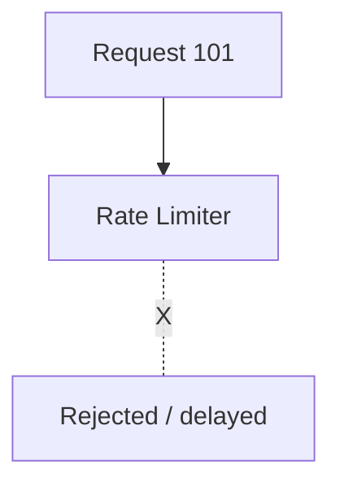

The basic idea is:

> **Don't allow one client or traffic source to consume unlimited system capacity.**

---

# 2. Why Do Systems Need Rate Limiting?

Imagine an API without a limit.

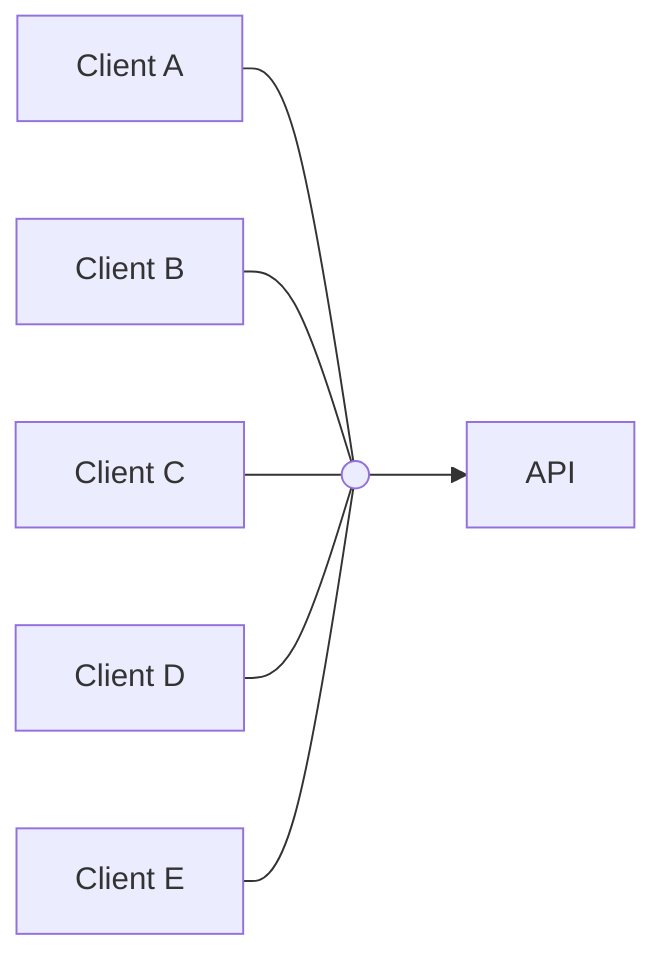

One client could send:

```text
1 request
10 requests
1,000 requests
100,000 requests
1,000,000 requests
```

This can create problems.

### Possible consequences

* Server overload
* Database overload
* Connection exhaustion
* Increased latency
* Higher infrastructure cost
* Reduced availability
* Abuse
* Accidental traffic bursts
* Resource starvation for other users

Rate limiting creates a boundary.

---

# 3. A Simple Example

Suppose an API allows:

```text
60 requests / minute / user
```

A user makes:

```text
0s   → Request
1s   → Request
2s   → Request
...
```

As long as the request rate stays within the policy:

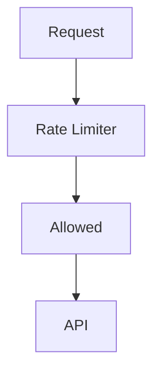

When the limit is exceeded:

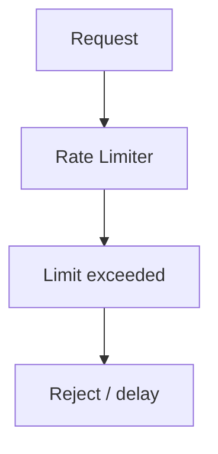

---

# 4. Rate Is Not the Same as Total Requests

This distinction is important.

Suppose:

```text
1,000 requests
```

That number alone doesn't tell us the rate.

If they happen over:

```text
1 hour
```

the rate is very different from:

```text
1 second
```

Rate means:

```text
Amount of work
----------------
     Time
```

For example:

```text
100 requests
--------------
    1 sec

= 100 requests/sec
```

---

# 5. Rate Limiting vs Capacity

Suppose a service can safely process approximately:

```text
1,000 requests/sec
```

You might configure a limit such as:

```text
800 requests/sec
```

Why not simply allow 1,000?

Because the system may need room for:

* Traffic variation
* Background work
* Expensive requests
* Failures
* Administrative operations
* Other users

The rate limit should therefore be designed around **real capacity and desired protection**, not chosen arbitrarily.

---

# 6. Rate Limiting Is a Control Mechanism

Think of rate limiting as a gate:

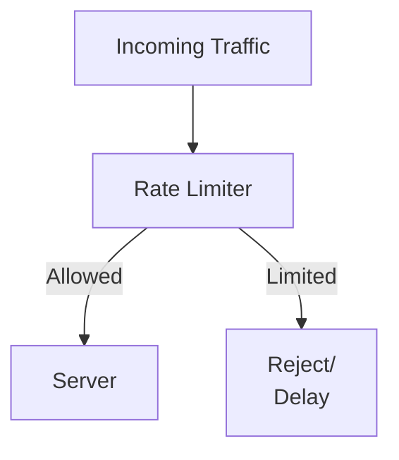

The limiter decides:

> **"Should this request be allowed right now?"**

---

# 7. Where Can Rate Limiting Be Applied?

Rate limiting can exist at different layers.

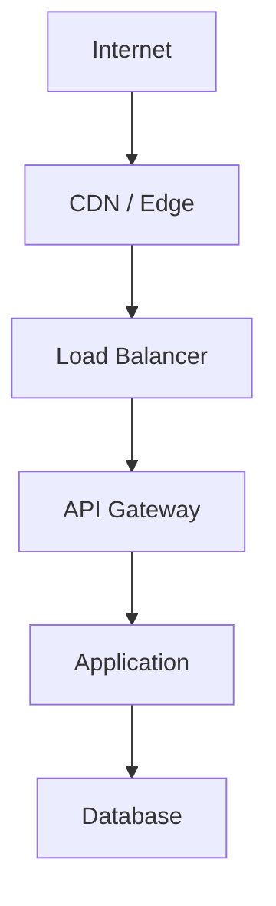

A system may use limits at one or more of these layers.

Examples:

### Edge

Protect the public entry point.

### API Gateway

Limit API consumers.

### Application

Apply business-specific limits.

### Internal service

Protect a downstream dependency.

---

# 8. Rate Limit by What?

The limiter needs to know **who or what** is being limited.

Possible keys include:

* IP address
* User ID
* API key
* Access token
* Client application
* Organization
* Endpoint
* Service
* Combination of multiple attributes

For example:

```text
User ID = 123

60 requests/minute
```

Or:

```text
API Key = ABC

10,000 requests/hour
```

---

# 9. IP-Based Rate Limiting

One simple approach is:

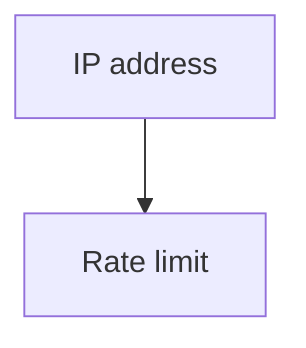

For example:

```text
203.0.113.10
    ↓
100 requests/minute
```

This is easy to implement.

But IP addresses are not always good representations of individual users.

For example:

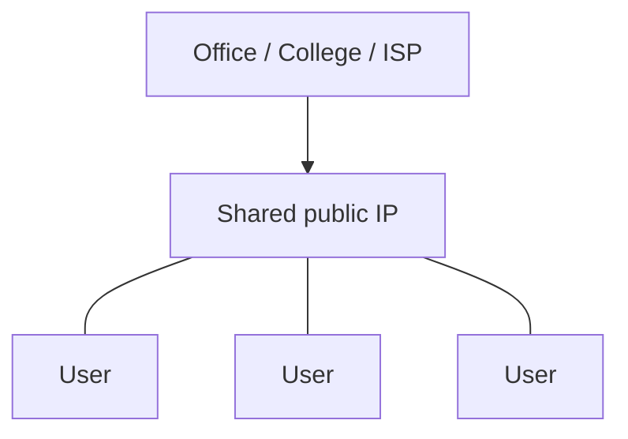

Many legitimate users may share one public IP.

Therefore, IP-based limiting must be used carefully.

---

# 10. User-Based Rate Limiting

If users are authenticated, a system can limit by user identity.

```text
User A → 100 req/min
User B → 100 req/min
User C → 100 req/min
```

This provides better isolation between users.

For example:

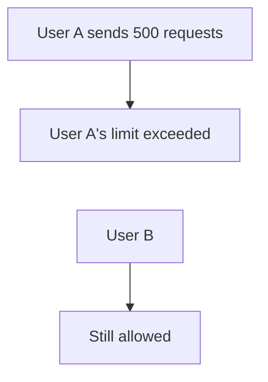

This prevents one authenticated user from consuming another user's quota.

---

# 11. API-Key-Based Rate Limiting

Public APIs often use API keys.

```text
API Key A → 1,000 requests/hour
API Key B → 1,000 requests/hour
```

The key becomes the rate-limit identity.

This is useful for:

* Developer APIs
* SaaS platforms
* Partner integrations
* Machine-to-machine access

---

# 12. Endpoint-Specific Limits

Not every API operation costs the same.

Consider:

```text
GET /products
```

versus:

```text
POST /generate-report
```

The second operation may consume significantly more CPU, memory, database resources, or time.

Therefore:

```text
GET /products
     ↓
1000 requests/minute

POST /generate-report
     ↓
10 requests/minute
```

A single global limit may not adequately protect a system.

---

# 13. Cost-Based Rate Limiting

A more advanced approach is to consider the **cost** of an operation.

For example:

```text
Simple read       → cost 1
Search            → cost 5
Large report      → cost 20
```

A client might receive:

```text
100 cost units / minute
```

Then:

```text
Simple read × 10
= 10 units

Report × 2
= 40 units

Total = 50 units
```

This can represent resource usage more accurately than simply counting requests.

The exact cost model must be designed around the application.

---

# 14. Fixed Window Rate Limiting

One of the simplest algorithms is the **fixed window**.

Suppose:

```text
Limit = 100 requests
Window = 1 minute
```

The system divides time into windows:

```text
12:00:00 ───────── 12:00:59
12:01:00 ───────── 12:01:59
12:02:00 ───────── 12:02:59
```

Each window gets its own counter.

```text
12:00 window
Requests = 73

12:01 window
Requests = 0
```

---

# 15. Fixed Window Example

Suppose the limit is:

```text
10 requests/minute
```

At:

```text
12:00:50
```

a client sends 10 requests.

The client reaches:

```text
10 / 10
```

Then the clock reaches:

```text
12:01:00
```

The counter resets.

The client can immediately send another 10 requests.

This creates a boundary effect.

---

# 16. Fixed Window Boundary Problem

Consider:

```text
12:00:59
10 requests
        ↓
12:01:00
10 requests
```

A client could send:

```text
20 requests
within approximately 2 seconds
```

even though the configured limit says:

```text
10 requests / minute
```

This is one weakness of fixed windows.

---

# 17. Sliding Window

A **sliding window** looks at a continuously moving period.

For example:

```text
Limit = 100 requests
Window = previous 60 seconds
```

At any moment, the system asks:

> "How many requests happened during the previous 60 seconds?"

Conceptually:

```text
             Current time
                  |
                  v
<------ 60 seconds ------>

Requests inside this period
are counted.
```

The boundary problem is reduced because there are no fixed reset points in the same way.

---

# 18. Sliding Window Example

Suppose:

```text
Limit = 10 requests / 60 seconds
```

At 12:01:30:

```text
Count requests from:

12:00:30 → 12:01:30
```

At 12:01:31:

```text
Count requests from:

12:00:31 → 12:01:31
```

The window continuously moves.

---

# 19. Token Bucket

Another important algorithm is the **token bucket**.

Imagine a bucket containing tokens.

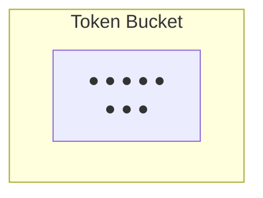

Each request consumes a token.

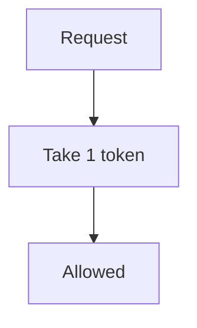

If no token is available:

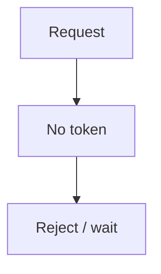

---

# 20. Token Refill

Tokens are added to the bucket at a controlled rate.

For example:

```text
Bucket capacity = 10 tokens

Refill rate = 5 tokens/sec
```

Conceptually:

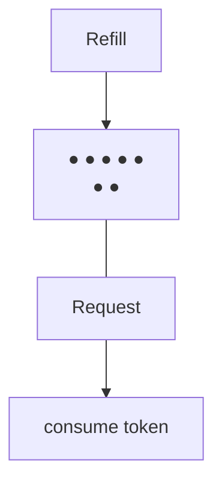

This allows controlled bursts.

---

# 21. Token Bucket and Bursts

Suppose the bucket contains:

```text
10 tokens
```

A client can potentially send:

```text
10 requests quickly
```

because there are 10 available tokens.

After that:

```text
No tokens
```

The client must wait for refill or be rejected.

This makes token bucket useful when a system wants:

> **A controlled average rate with some short-term burst capacity.**

---

# 22. Leaky Bucket

Another conceptual model is the **leaky bucket**.

Imagine requests entering a bucket and leaving at a controlled rate.

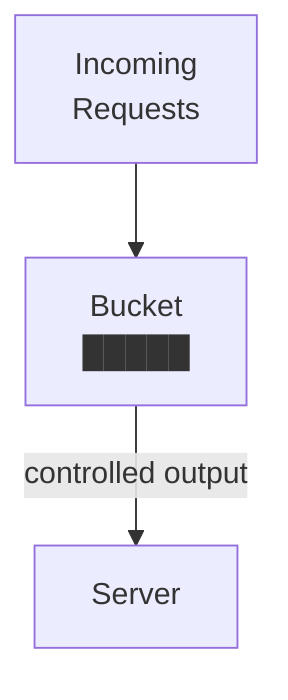

The bucket smooths bursts.

If the bucket becomes full:

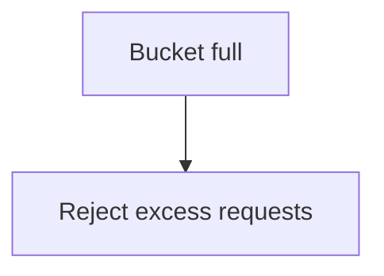

The exact behavior depends on the implementation.

---

# 23. Token Bucket vs Leaky Bucket

A simplified comparison:

| Algorithm      | Main Idea                                |
| -------------- | ---------------------------------------- |
| Fixed Window   | Count requests inside fixed time blocks  |
| Sliding Window | Count requests over a moving time period |
| Token Bucket   | Requests consume replenished tokens      |
| Leaky Bucket   | Requests leave at a controlled rate      |

Token bucket is particularly useful when controlled bursts are acceptable.

---

# 24. Rate Limiting Response

When a client exceeds a limit, the system can:

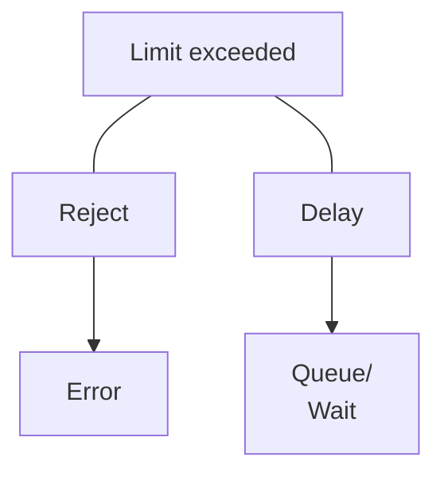

The correct behavior depends on the system.

For many APIs, rejecting the request is simpler and safer.

---

# 25. HTTP 429

HTTP APIs commonly use:

```text
429 Too Many Requests
```

This communicates:

> The client has sent too many requests in the relevant period or according to the server's rate policy.

A response might conceptually contain:

```text
HTTP/1.1 429 Too Many Requests

Retry-After: ...
```

`Retry-After` can provide guidance about when a client may try again.

The exact semantics depend on the API and protocol behavior.

---

# 26. Rate Limiting and Retry

These two mechanisms must be designed together.

Imagine:

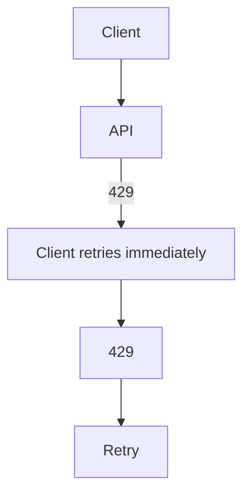

This is bad behavior.

A client receiving a rate-limit response should follow the server's guidance where provided and use an appropriate delay/backoff strategy.

Otherwise:

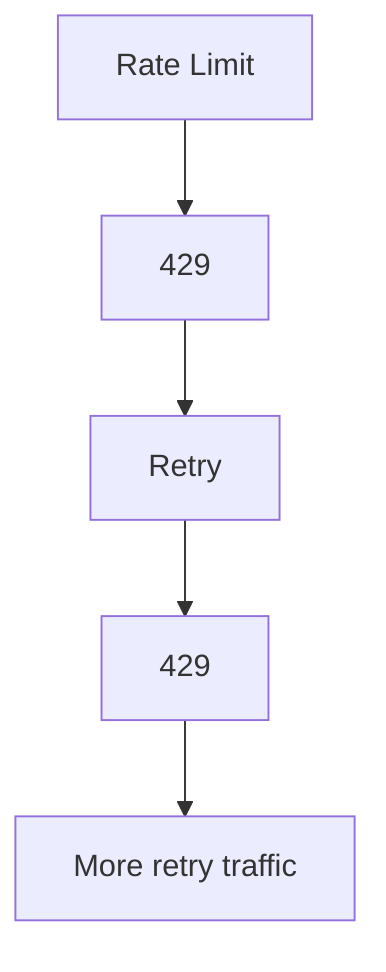

The retry mechanism can fight the rate limiter.

---

# 27. Rate Limiting and Retry Storms

The previous chapters showed:

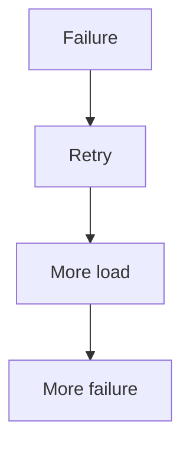

Rate limiting provides another control:

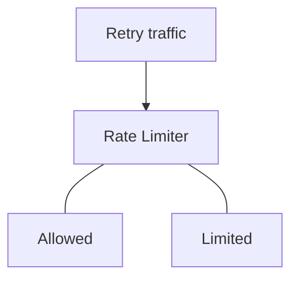

However, rate limiting alone does not solve every retry-storm problem.

It must be combined with:

* Backoff
* Jitter
* Retry limits
* Deadlines
* Circuit breakers
* Capacity planning

---

# 28. Rate Limiting vs Circuit Breaker

They operate differently.

### Rate limiting

Controls how much traffic is allowed.

```mermaid
flowchart TD
  accTitle: Rate limiting
  accDescr: Too much traffic reaches the rate limiter, which limits it.
  N0["Too much traffic"] --> N1["Rate Limiter"] --> N2["Limit"]
```

### Circuit breaker

Controls whether calls to a failing dependency should continue.

```mermaid
flowchart TD
  accTitle: Circuit breaker
  accDescr: A failing dependency trips the circuit breaker, which stops calls temporarily.
  N0["Dependency failing"] --> N1["Circuit Breaker"] --> N2["Stop calls temporarily"]
```

Think:

> Rate limiter protects **capacity**.

> Circuit breaker protects against **dependency failure**.

---

# 29. Rate Limiting vs Connection Limits

Rate limiting controls:

```text
Requests / operations over time
```

Connection limits control:

```text
How many connections can exist
```

For example:

```text
Rate limit
= 1,000 requests/sec

Connection limit
= 200 concurrent connections
```

Both can be necessary.

A system may have a low request rate but still exhaust connections if requests remain open for a long time.

---

# 30. Rate Limiting vs Concurrency Limiting

Rate:

```text
Requests per second
```

Concurrency:

```text
Requests being processed simultaneously
```

Example:

```text
100 requests/sec
```

does not tell us whether there are:

```text
5 concurrent requests
```

or:

```text
5,000 concurrent requests
```

The answer depends on how long each request takes.

Therefore:

> **Rate limiting and concurrency limiting solve different problems.**

---

# 31. Rate Limiting by User

Suppose:

```text
User limit = 100 requests/minute
```

Users:

```text
Alice → 100
Bob   → 100
Carol → 100
```

This creates fairer allocation than a single global counter:

```text
Entire API
   |
100 requests/minute total
```

But per-user limits do not automatically protect the whole system.

If there are 100,000 users:

```text
100,000 users × 100 requests
```

the aggregate allowed traffic could still be enormous.

---

# 32. Global Rate Limits

A system can also impose a global limit.

For example:

```text
Entire API
= 50,000 requests/sec maximum
```

Then:

```text
User limit
      +
Global limit
```

can work together.

For example:

```text
User A → 100 req/sec
User B → 100 req/sec
User C → 100 req/sec

Global API → 50,000 req/sec
```

This provides protection at both levels.

---

# 33. Hierarchical Rate Limiting

Large systems may have several levels:

```mermaid
flowchart TD
  accTitle: Hierarchical rate limiting
  accDescr: Global limits contain organization limits, which contain user limits, which contain endpoint limits.
  G["Global"] --- O["Organization"] --- U["User"] --- E["Endpoint"]
```

Example:

```text
Global API
   ↓
1,000,000 req/min

Organization
   ↓
100,000 req/min

User
   ↓
1,000 req/min

Expensive endpoint
   ↓
20 req/min
```

This allows different protection boundaries.

---

# 34. Distributed Rate Limiting

A major system-design problem appears when there are multiple application servers.

```mermaid
flowchart TD
  accTitle: Distributed rate limiting
  accDescr: The load balancer spreads requests across App A, App B and App C.
  L["Load Balancer"] --- A["App A"] & B["App B"] & C["App C"]
```

Suppose the limit is:

```text
100 requests/minute/user
```

Where should the counter live?

If each server has its own local counter:

```text
App A → 100
App B → 100
App C → 100
```

the user could potentially make:

```text
300 requests/minute
```

depending on routing.

The limit is no longer truly global.

---

# 35. Centralized Rate-Limit State

A distributed system can maintain shared rate-limit state.

Conceptually:

```mermaid
flowchart TD
  accTitle: Centralized rate-limit state
  accDescr: The load balancer spreads requests across App A, App B and App C, which share rate state.
  L["Load Balancer"] --- A["App A"] & B["App B"] & C["App C"]
  A & B & C --> S["Shared Rate State"]
```

A shared data store or dedicated rate-limiting infrastructure can coordinate counters/tokens.

The implementation must account for:

* Latency
* Atomicity
* Failure
* Consistency
* Storage overhead
* Network availability

---

# 36. The Rate Limiter Can Become a Bottleneck

The rate limiter itself consumes resources.

Imagine:

```mermaid
flowchart TD
  accTitle: The rate limiter in the path
  accDescr: 1 million requests per second pass through the rate limiter to the application.
  N0["1 million requests/sec"] --> N1["Rate Limiter"] --> N2["Application"]
```

If every request requires a slow remote operation to update rate-limit state:

```mermaid
flowchart TD
  accTitle: A remote rate-limit check
  accDescr: A request crosses the network to the rate-limit store and back across the network to the application.
  N0["Request"] --> N1["Network"] --> N2["Rate-limit store"] --> N3["Network"] --> N4["Application"]
```

the rate limiter can become a bottleneck.

Therefore:

> **The mechanism protecting the system must itself be scalable and reliable.**

---

# 37. What Happens if the Rate Limiter Fails?

This is a system-design decision.

Suppose:

```mermaid
flowchart TD
  accTitle: The rate limiter fails
  accDescr: The application's rate limiter fails.
  A["Application"] --- R["Rate Limiter"]
  R -. "X" .- F["Failure"]
```

Should requests be:

```text
Allowed?
```

or:

```text
Rejected?
```

These are different policies.

### Fail-open

If the limiter fails:

```text
Allow requests
```

Availability is prioritized, but protection may be lost.

### Fail-closed

If the limiter fails:

```text
Reject requests
```

Protection is prioritized, but availability may suffer.

There is no universal answer.

The correct choice depends on the system's risk and requirements.

---

# 38. Rate Limiting and Fairness

Rate limiting can also provide fairness.

Without limits:

```text
Client A → huge traffic
Client B → normal traffic
Client C → normal traffic
```

Client A may consume most of the available capacity.

With per-client limits:

```text
Client A → limited
Client B → allowed
Client C → allowed
```

This protects other clients from resource starvation.

---

# 39. Rate Limiting for Expensive Operations

Suppose an endpoint performs a large database query:

```text
POST /generate-report
```

A client might send:

```text
1,000 report requests
```

Even if the HTTP requests themselves are small, the backend work may be enormous.

Rate limiting can protect expensive operations:

```text
Generate Report
     ↓
5 requests/minute/user
```

The limit should reflect **resource cost**, not merely request size.

---

# 40. Rate Limiting and Abuse

Rate limiting is useful against some forms of excessive traffic.

For example:

```mermaid
flowchart TD
  accTitle: Rate limiting and abuse
  accDescr: An attacker or abusive client sends millions of requests; the rate limiter limits them.
  N0["Attacker / abusive client"] --> N1["Millions of requests"] --> N2["Rate Limiter"] --> N3["Limited"]
```

But rate limiting is not a complete security solution.

It does not replace:

* Authentication
* Authorization
* WAF
* DDoS protection
* Input validation
* Network controls

Those topics are covered elsewhere in the curriculum.

---

# 41. Rate Limits Should Be Communicated Clearly

API consumers need to know:

```text
What is the limit?
How is it calculated?
When does it reset?
What happens after the limit?
```

For example:

```text
Limit:
1,000 requests/hour

Exceeded:
HTTP 429

Retry:
Follow server guidance
```

Clear policies make client behavior more predictable.

---

# 42. Common Rate-Limiting Mistakes

## Mistake 1: One Global Limit for Everything

```text
Every endpoint
     ↓
100 requests/minute
```

A cheap read and an expensive report may have very different costs.

---

## Mistake 2: Using Only IP Addresses

Shared IP addresses can represent many legitimate users.

---

## Mistake 3: Ignoring Distributed Servers

Local counters on multiple application servers may not enforce a true global limit.

---

## Mistake 4: No Burst Consideration

A strict rate can unnecessarily block legitimate short bursts.

---

## Mistake 5: No Global Protection

Per-user limits alone may still allow enormous aggregate traffic.

---

## Mistake 6: Rate Limiter Becomes the Bottleneck

A centralized limiter can become a scalability problem if its own architecture is not designed carefully.

---

## Mistake 7: Retry Immediately After 429

This can create another traffic loop.

```text
429
 ↓
Immediate retry
 ↓
429
 ↓
Immediate retry
```

---

## Mistake 8: Choosing Limits Without Measuring Capacity

A rate limit should be connected to actual system capacity, workload characteristics, and desired protection.

---

# 43. A Practical Rate-Limit Design

Suppose an API serves an e-commerce application.

A possible conceptual policy:

```text
Global API
   ↓
Maximum sustainable traffic

Authenticated user
   ↓
Per-user limit

Expensive endpoint
   ↓
Lower endpoint-specific limit

Burst
   ↓
Controlled by token bucket

Exceeded
   ↓
HTTP 429
```

This is not a universal configuration.

The correct numbers must come from the system's requirements and measurements.

---

# 44. Rate Limiting Decision Flow

```mermaid
flowchart TD
  accTitle: Rate limiting decision flow
  accDescr: An incoming request: identify the client and check the rate policy. If allowed, process the request. If exceeded, either wait and retry later, or reject with HTTP 429.
  J@{ shape: sm-circ }
  I["Incoming Request"] --> C["Identify Client"] --> R["Check Rate Policy"]
  R -->|"Allowed"| P["Process<br/>request"]
  R -->|"Exceeded"| J
  J --- W["Wait"] --> L["Retry<br/>later"]
  J --- X["Reject"] --> H["HTTP 429"]
```

---

# 45. How Rate Limiting Fits the Scaling Story

The previous chapters focused on protecting systems from different problems.

```text
02.08 Health Checks
      ↓
Know which instances are healthy

02.09 Failover
      ↓
Move workload when a component fails

02.10 Timeouts
      ↓
Don't wait forever

02.11 Retries
      ↓
Recover from transient failures

02.12 Retry Storms
      ↓
Control retry-generated load

02.13 Circuit Breaker
      ↓
Stop calling failing dependencies

02.14 Rate Limiting
      ↓
Control incoming/request load
```

The pattern is becoming clear:

> **Scalable systems do not merely process more work. They actively control work.**

---

# 46. Key Principle

> **Rate limiting is a capacity-control mechanism.**

It establishes a boundary around how much work a client, service, endpoint, or system is allowed to generate.

Think:

```mermaid
flowchart TD
  accTitle: Key principle
  accDescr: Incoming traffic meets the rate limit: allowed traffic is processed, limited traffic is rejected or delayed.
  I["Incoming traffic"] --> R["Rate Limit"]
  R -->|"Allowed"| P["Process"]
  R -->|"Limited"| X["Reject/<br/>Delay"]
```

The goal is not necessarily to reject users.

The goal is to prevent uncontrolled demand from consuming the resources required to keep the system healthy.

---

# 47. Quick Reference

| Concept        | Meaning                                               |
| -------------- | ----------------------------------------------------- |
| Rate Limiting  | Restricting how much work can happen over time        |
| Rate           | Amount of work per unit of time                       |
| Fixed Window   | Count requests inside fixed time intervals            |
| Sliding Window | Count requests over a continuously moving time period |
| Token Bucket   | Requests consume replenished tokens                   |
| Leaky Bucket   | Requests leave at a controlled rate                   |
| Burst          | Short period of traffic above the average rate        |
| Global Limit   | Limit across the whole system                         |
| Per-User Limit | Limit associated with a user                          |
| API-Key Limit  | Limit associated with an API consumer                 |
| Endpoint Limit | Limit specific to an operation                        |
| Retry Budget   | Controls retry-generated work                         |
| HTTP 429       | Common HTTP response for too many requests            |
| Fail-Open      | Allow traffic if limiter fails                        |
| Fail-Closed    | Reject traffic if limiter fails                       |

---

# 48. Knowledge Check

### Q1. What is rate limiting?

A mechanism that controls how much work a client or system can generate within a given period.

### Q2. Why is rate limiting useful?

It protects system capacity and prevents excessive traffic from overwhelming shared resources.

### Q3. What is the difference between rate and total requests?

Rate includes the time dimension. 1,000 requests in one hour is very different from 1,000 requests in one second.

### Q4. What is a fixed-window limitation?

Traffic can concentrate around the boundary between two windows.

### Q5. What does a token bucket allow?

It allows requests to consume available tokens and can support controlled short-term bursts while maintaining a refill rate.

### Q6. What does HTTP 429 mean?

The client has exceeded the applicable request-rate policy.

### Q7. Why might IP-based rate limiting be unfair?

Many users can share the same public IP address.

### Q8. Why is distributed rate limiting difficult?

Multiple application servers need coordinated state if the limit is meant to be global.

### Q9. Is rate limiting the same as a circuit breaker?

No.

Rate limiting controls traffic volume; a circuit breaker temporarily stops calls to a dependency that is repeatedly failing.

### Q10. Is rate limiting the same as connection limiting?

No.

Rate limiting controls work over time; connection limiting controls how many connections can exist simultaneously.

---

# 50. Final Mental Model

Think of rate limiting as a gate that protects system capacity:

```mermaid
flowchart TD
  accTitle: Final mental model
  accDescr: Incoming traffic reaches the rate limiter. Allowed traffic is processed. Exceeded traffic is delayed until later or rejected with HTTP 429.
  J@{ shape: sm-circ }
  I["Incoming Traffic"] --> R["Rate Limiter"]
  R -->|"Allowed"| P["Process<br/>request"]
  R -->|"Exceeded"| J
  J --- D["Delay"] --> L["Later"]
  J --- X["Reject"] --> H["HTTP 429"]
```

And connect it to the previous chapters:

```text
Timeout
  ↓
Don't wait forever

Retry
  ↓
Try again when appropriate

Backoff + Jitter
  ↓
Don't retry aggressively

Circuit Breaker
  ↓
Stop calling a failing dependency

Rate Limiting
  ↓
Don't allow uncontrolled traffic
```

The deeper system-design lesson is:

> **A healthy system controls the amount, timing, and destination of work instead of blindly accepting every request.**
