# 02.15 — Connection Limits

## Learning Objectives

By the end of this chapter, you should be able to:

* Understand what a **connection limit** is and why systems need one.
* Distinguish between **connections, requests, concurrency, and rate**.
* Understand where connection limits exist in a system.
* See how too many connections can exhaust system resources.
* Understand the relationship between connection limits, connection pools, timeouts, and load balancing.
* Recognize why long-lived connections such as WebSockets need special consideration.
* Identify common connection-limit mistakes.

---

# 1. What Is a Connection Limit?

A **connection limit** is a maximum number of connections that a component is willing or able to keep open at the same time.

For example:

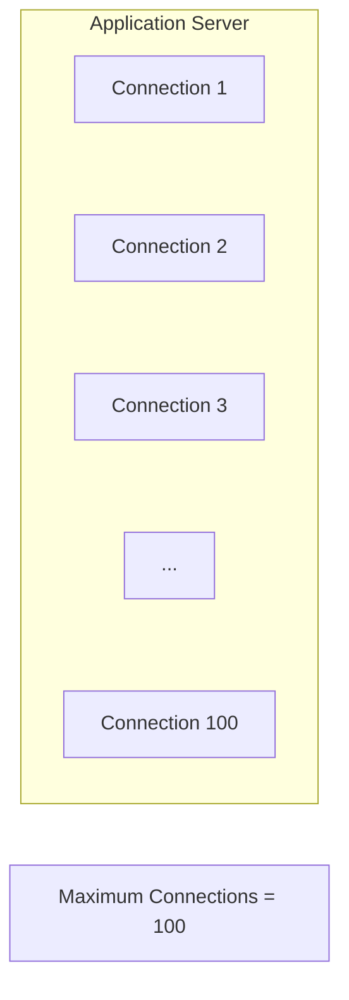

If the system has already reached 100 connections, a new connection may:

* wait,
* be queued,
* be rejected,
* or time out.

The exact behavior depends on the component and its configuration.

### Simple idea

> **A connection limit protects a system from having more simultaneous connections than it can safely handle.**

---

# 2. Why Does a Connection Consume Resources?

A connection is not free.

A server may need resources to maintain an open connection:

* memory
* file descriptors
* sockets
* network buffers
* CPU
* TLS state
* connection-tracking information
* application worker resources

Conceptually:

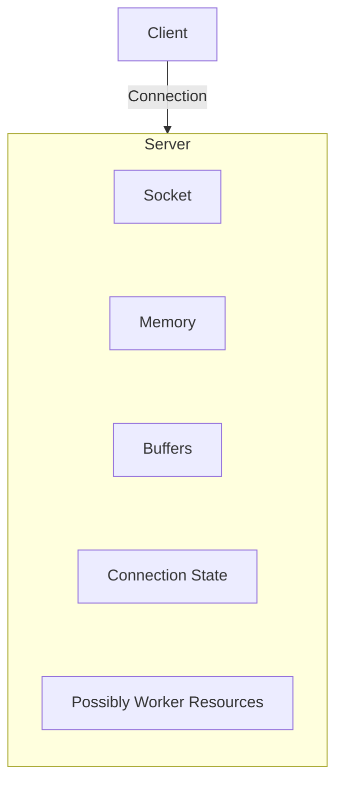

One connection may be cheap.

Thousands or millions of connections can become a significant resource problem.

---

# 3. Connection ≠ Request

This distinction is extremely important.

A **connection** is a communication channel.

A **request** is an operation sent through that channel.

With HTTP keep-alive, one connection can carry multiple requests:

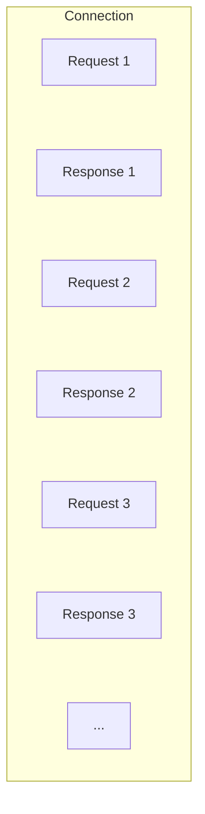

So:

```text
100 connections
```

does **not necessarily mean**

```text
100 requests
```

The same 100 connections might handle many more requests over time.

---

# 4. Connection vs Request vs Concurrency vs Rate

These concepts are related but different.

| Concept     | Meaning                                     |
| ----------- | ------------------------------------------- |
| Connection  | An established communication channel        |
| Request     | One operation sent through a connection     |
| Concurrency | Operations being processed at the same time |
| Rate        | Operations occurring per unit of time       |

Example:

```text
10 connections
100 requests/second
20 requests being processed simultaneously
```

All three numbers can be different.

### Important

A system might have:

```text
Many connections
but few active requests
```

because many connections are idle.

Or:

```text
Few connections
but many requests
```

because connections are being reused.

---

# 5. The Connection Lifecycle

A simplified connection lifecycle looks like this:

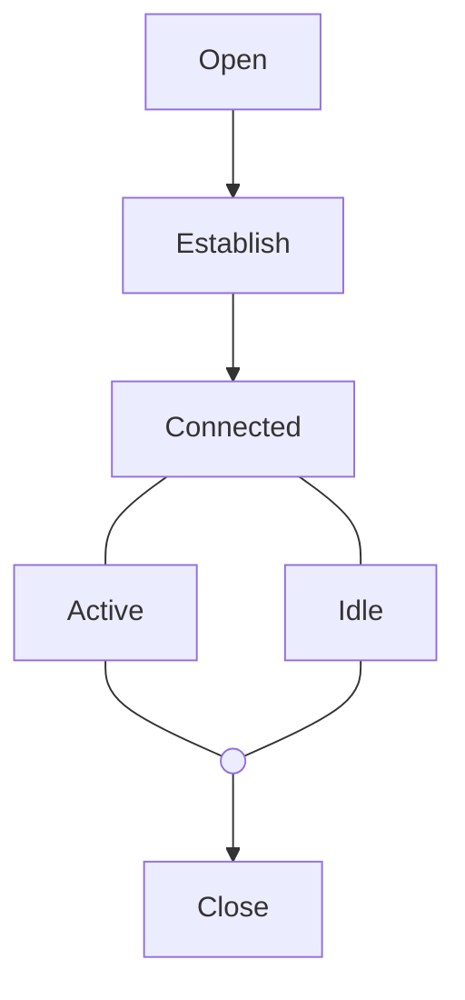

A connection may spend a significant amount of time in the **idle** state.

For example, a browser may keep a connection available so another request can reuse it.

This is why **idle connections** matter when setting limits.

---

# 6. TCP Connection Basics

For normal HTTP/HTTPS communication, TCP is commonly involved.

A simplified view:

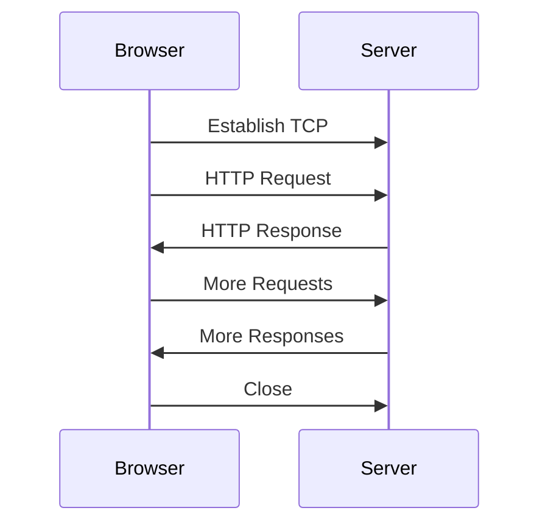

The important system-design point is not the low-level TCP mechanics.

It is this:

> **Keeping a connection open means the system must continue maintaining state for that connection.**

Therefore, systems need sensible limits and timeouts.

---

# 7. Where Do Connection Limits Exist?

Connection limits can exist at multiple layers.

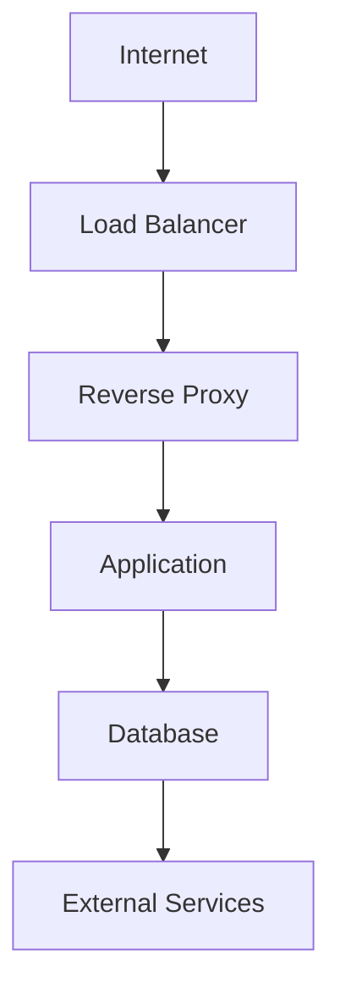

Each layer may have its own limit.

For example:

```text
Load Balancer
Max connections = 100,000

Reverse Proxy
Max connections = 50,000

Application
Max active connections = 10,000

Database
Max connections = 500
```

The numbers above are only examples.

The important lesson is:

> **The system is constrained by the limits of individual components and by the relationships between them.**

---

# 8. Operating-System-Level Limits

The operating system also manages resources associated with connections.

One important resource is the **file descriptor**.

On many Unix-like systems, sockets are represented using file descriptors.

Conceptually:

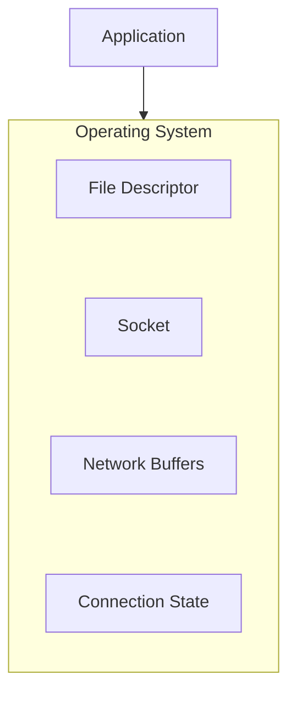

If a process or system reaches its file-descriptor limit, it may not be able to accept or create additional connections.

You do not need to memorize OS configuration details yet.

For system design, remember:

> **Connection capacity is ultimately constrained by finite operating-system and hardware resources.**

---

# 9. Reverse Proxy and Load Balancer Limits

A reverse proxy or load balancer can also limit connections.

For example:

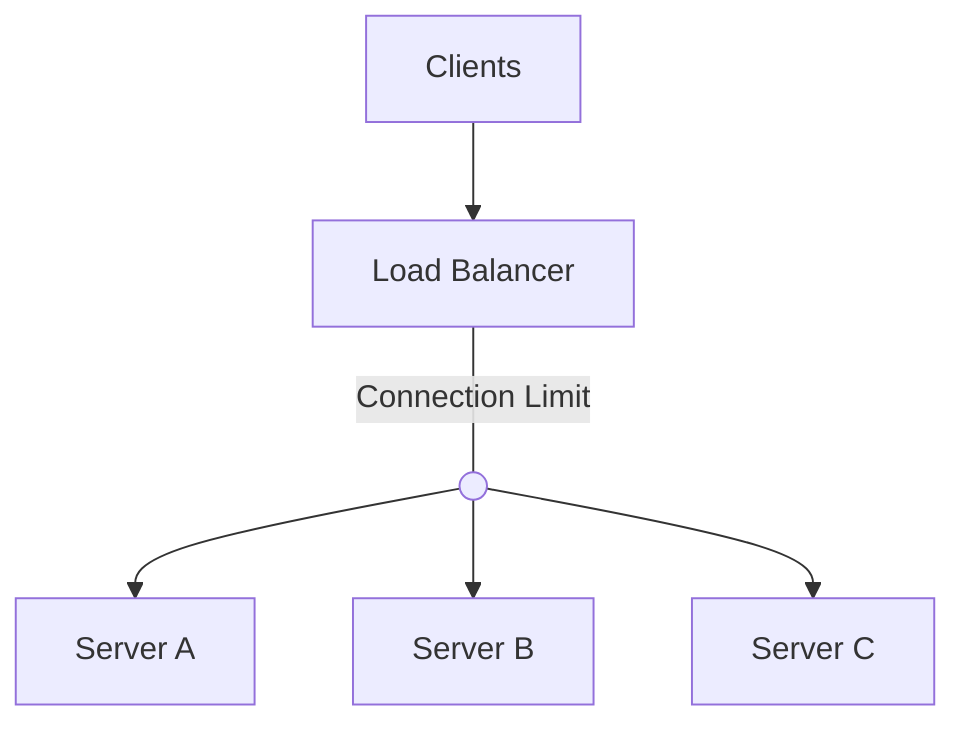

This protects the infrastructure behind it.

Without appropriate limits, an enormous number of connections could reach the backend.

But setting the limit too low can also create a bottleneck.

---

# 10. Application-Level Connection Limits

An application server or runtime may have limits related to:

* maximum connections
* worker processes
* threads
* event-loop capacity
* concurrent requests

Consider:

```text
Maximum Connections = 1,000

Worker Capacity = 100
```

Having 1,000 connections does not automatically mean the application can process 1,000 operations simultaneously.

Some connections may be idle.

Some requests may be waiting.

Some may be actively consuming application resources.

This is why connection limits should not be confused with worker or concurrency limits.

---

# 11. Database Connection Limits

Databases are especially important.

Suppose:

```text
Database
Maximum Connections = 200
```

Your application cannot safely create unlimited database connections.

A connection pool might therefore be configured:

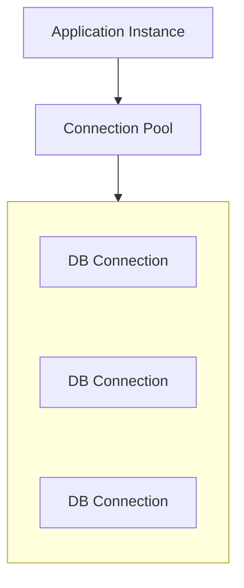

For example:

```text
Pool Size = 20
```

means one application instance may maintain up to approximately 20 database connections, depending on the pool's configuration and behavior.

---

# 12. The Connection Pool Multiplication Problem

This becomes very important when an application is horizontally scaled.

Suppose:

```text
Database maximum = 100 connections

Application instances = 5

Pool per instance = 20
```

Then:

```text
5 × 20 = 100
```

The entire database connection capacity is already consumed.

Now suppose you scale to:

```text
10 application instances
```

with the same pool:

```text
10 × 20 = 200
```

But the database only allows:

```text
100
```

Now the application fleet can collectively request more database connections than the database can provide.

### System-design lesson

> **A connection pool is local to an application instance, but the database connection limit is shared across the fleet.**

Horizontal scaling therefore multiplies connection demand.

---

# 13. Connection Limits and Worker Limits

Consider an application with:

```text
Maximum Connections = 1,000
Workers = 100
```

This does not mean 1,000 requests can execute simultaneously.

A simplified model might look like:

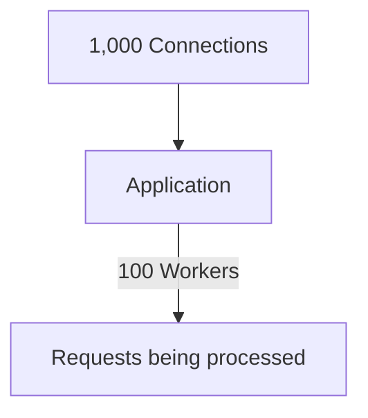

Many connections may be idle or waiting.

The exact behavior depends on the application architecture.

### Remember

**Connection capacity and processing capacity are different resources.**

---

# 14. What Happens When the Connection Limit Is Reached?

Suppose:

```text
Maximum connections = 1,000
Current connections = 1,000
```

A new client tries to connect.

Possible outcomes include:

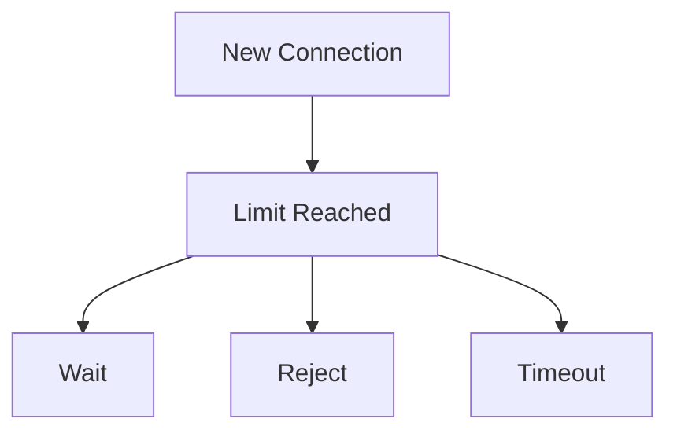

The behavior depends on the layer involved.

For example, a connection may be queued at one layer but eventually time out if capacity does not become available.

---

# 15. Connection Backlog

When a server is receiving new TCP connections, some connection attempts may wait before the application accepts them.

This waiting area is commonly associated with the **listen backlog**.

Conceptually:

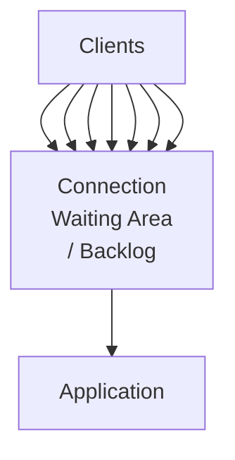

The backlog is not unlimited.

If connection attempts arrive faster than the server can accept them, the waiting queue can fill.

At that point, new connections may be delayed, rejected, or otherwise fail depending on the system and network stack.

---

# 16. Idle Connections

Not every connection is actively doing work.

For example:

```text
100 connections

20 active
80 idle
```

Those 80 idle connections still consume some resources.

Therefore, systems often use an **idle timeout** or keep-alive timeout.

Example:

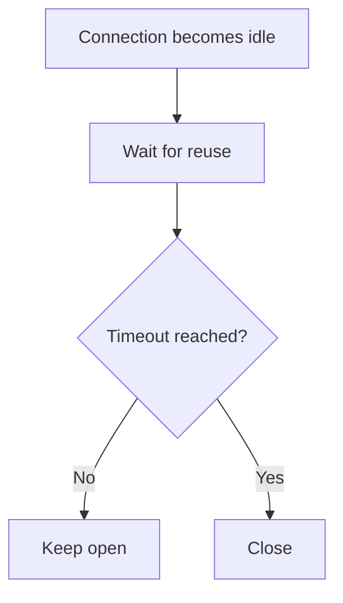

The goal is to balance:

```text
Connection reuse
        vs
Resource consumption
```

---

# 17. Why Keep-Alive Helps

Creating a new connection for every request can be expensive.

Without reuse:

```text
Request 1 → Open → Request → Close

Request 2 → Open → Request → Close

Request 3 → Open → Request → Close
```

With connection reuse:

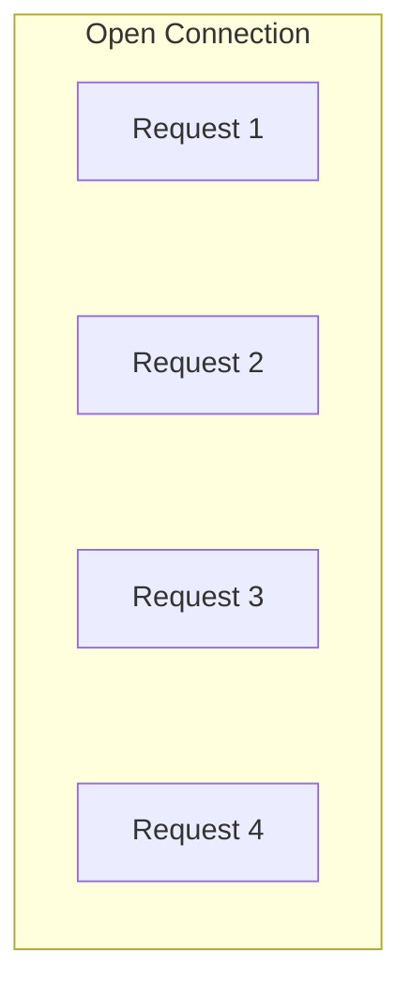

Connection reuse can reduce repeated connection-establishment work.

But keeping connections open forever is also undesirable.

So the system needs a balance.

---

# 18. TLS Makes Connection Reuse More Valuable

HTTPS adds TLS to the connection.

Establishing secure connections involves cryptographic work and negotiation.

Therefore:

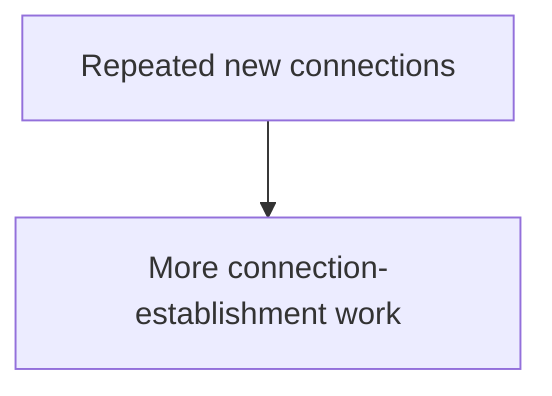

Whereas:

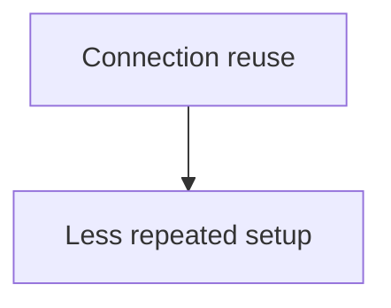

This is one reason connection reuse is important for performance.

But again:

> **Reuse does not mean unlimited connections.**

---

# 19. Connection Exhaustion

One of the most common connection-related failures is **connection exhaustion**.

Example:

```text
Normal
────────────────────────────
100 connections
100 connections
100 connections

Traffic increases
────────────────────────────
500 connections
800 connections
1,000 connections

Limit reached
────────────────────────────
1,000 / 1,000

New connections
        │
        ▼
    Waiting / Failing
```

The application may appear "down" even though:

* CPU is not at 100%
* memory is not completely exhausted
* the application process is still running

The actual bottleneck may simply be connection capacity.

---

# 20. Connection Leaks

A **connection leak** happens when connections are created but not properly released.

Conceptually:

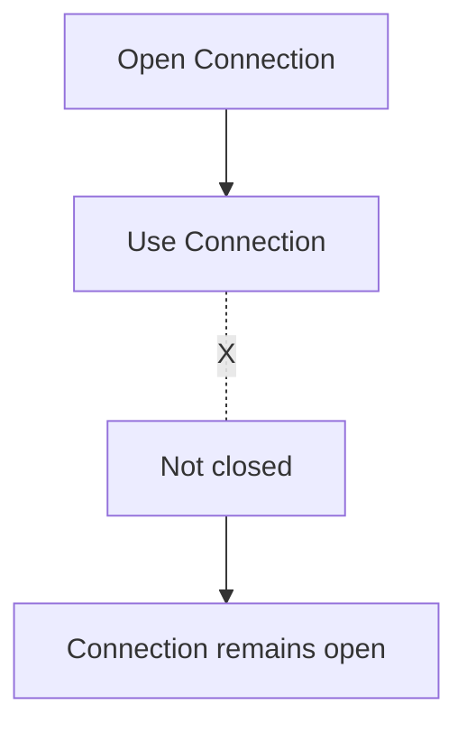

Repeated over time:

```text
10
20
40
60
80
100
...
```

Eventually:

```text
Connection Limit Reached
```

Connection leaks can occur with:

* database connections
* HTTP clients
* sockets
* file descriptors
* other connection-like resources

### Important

A connection pool can help manage connections, but it does not automatically fix badly managed resources in every architecture.

---

# 21. Per-Client Connection Limits

A system may also limit connections per client.

For example:

```text
Client A → Maximum 20 connections
Client B → Maximum 20 connections
Client C → Maximum 20 connections
```

This prevents one client from consuming all available connection capacity.

A system might identify clients using:

* IP address
* authenticated user
* API key
* organization
* device
* connection identity

However, IP-based limits can be imperfect because many users may share one public IP address.

---

# 22. Global vs Per-Client Limits

A system can combine both.

```text
Global maximum = 10,000

Per-client maximum = 100
```

This creates two protections:

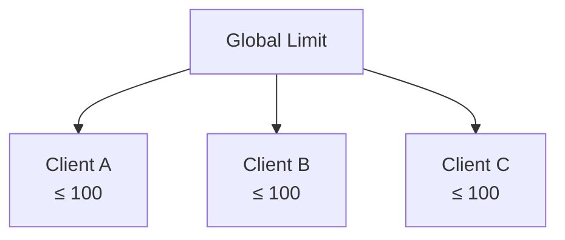

This is similar in spirit to rate limiting, but the controlled resource is different.

---

# 23. Connection Limit vs Rate Limit

These are easy to confuse.

### Rate limiting

Controls:

```text
How many operations happen over time?
```

Example:

```text
100 requests/second
```

### Connection limiting

Controls:

```text
How many connections remain open simultaneously?
```

Example:

```text
10,000 simultaneous connections
```

A system can have:

```text
10,000 connections
but only
1,000 requests/second
```

Both controls may be useful.

---

# 24. Connection Limit vs Concurrency Limit

A **concurrency limit** controls how many operations are actively processed at once.

For example:

```text
Maximum active requests = 100
```

A connection limit might be:

```text
Maximum connections = 10,000
```

So:

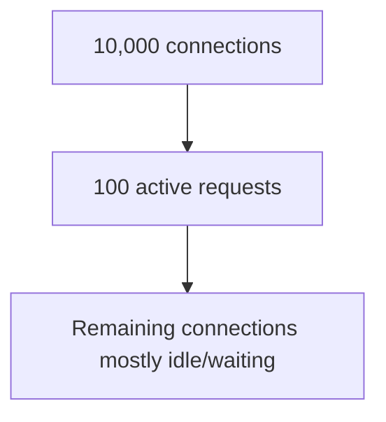

This distinction becomes especially important for systems with long-lived connections.

---

# 25. WebSockets and Long-Lived Connections

WebSockets are a good example of why connection limits matter.

A normal HTTP connection may be relatively short-lived or reused.

A WebSocket can remain open for a long time:

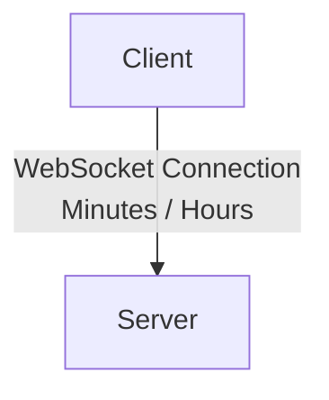

Imagine:

```text
100,000 connected users
```

If each user maintains a persistent connection, the system must be designed around **connection capacity**, not just requests per second.

This is a different scaling problem.

---

# 26. Long-Lived Connections Change the Bottleneck

For a normal API:

```mermaid
flowchart TD
  accTitle: Request-oriented capacity
  accDescr: Requests per second set the application capacity.
  N0["Requests/second"] --> N1["Application capacity"]
```

For a WebSocket-heavy system:

```mermaid
flowchart TD
  accTitle: Connection-oriented capacity
  accDescr: Concurrent connections set the connection capacity, and memory, socket and event-loop capacity.
  N0["Concurrent connections"] --> N1["Connection capacity"] --> N2["Memory / sockets / event-loop capacity"]
```

Therefore:

> **A system's primary bottleneck depends on its workload.**

This is one of the most important system-design habits to develop.

---

# 27. Connection Limits and Timeouts

Connection limits and timeouts work together.

Suppose clients open connections and then remain idle forever.

Eventually:

```mermaid
flowchart TD
  accTitle: Idle connections
  accDescr: Of the connections, one is active and four are idle.
  subgraph C["Connections"]
    direction TB
    C0["Active"] ~~~ C1["Idle"] ~~~ C2["Idle"] ~~~ C3["Idle"] ~~~ C4["Idle"]
  end
```

If idle connections are not controlled, they can consume capacity.

An idle timeout can reclaim that capacity:

```mermaid
flowchart TD
  accTitle: Closing idle connections
  accDescr: An idle connection times out and closes.
  I["Idle"] -->|"Timeout"| C["Close"]
```

So:

> **Limits define how much can exist; timeouts help prevent resources from being held unnecessarily.**

---

# 28. Connection Limits and Retries

Retries can create additional connections when existing connections fail.

Consider:

```mermaid
flowchart TD
  accTitle: Retries create connections
  accDescr: The client's request finds the connection failing; it retries on a new connection.
  C["Client"] --- R["Request"]
  C --> F["Connection fails"] --> T["Retry"] --> N["New connection"]
```

If many clients do this simultaneously:

```mermaid
flowchart TD
  accTitle: Retries add connection pressure
  accDescr: Failure, many retries, many new connections, connection pressure, more failures.
  N0["Failure"] --> N1["Many retries"] --> N2["Many new connections"] --> N3["Connection pressure"] --> N4["More failures"]
```

This is another reason retries must be controlled using:

* backoff
* jitter
* retry budgets
* deadlines

---

# 29. Connection Limits and Circuit Breakers

A circuit breaker protects a caller from repeatedly calling an unhealthy dependency.

Connection limits protect the system from excessive simultaneous connections.

They solve different problems.

```mermaid
flowchart TD
  accTitle: Two different questions
  accDescr: The circuit breaker asks: should we call the dependency? The connection limit asks: how many connections can exist?
  B["Circuit Breaker"] --> Q1["Should we call the dependency?"]
  Q1 ~~~ L["Connection Limit"] --> Q2["How many connections can exist?"]
```

They can work together.

For example:

```mermaid
flowchart TD
  accTitle: Connection limits and circuit breakers together
  accDescr: The application has a connection limit and a circuit breaker in front of the external API.
  A["Application"] --- L["Connection Limit"]
  A --- B["Circuit Breaker"] --> E["External API"]
```

---

# 30. Connection Limits and Load Balancing

Suppose there are three application servers:

```mermaid
flowchart TD
  accTitle: Per-server connection limits
  accDescr: The load balancer sends traffic to server A, server B and server C, each with a limit of 1,000.
  L["Load Balancer"] --> A["Server A<br/>1,000<br/>limit"] & B["Server B<br/>1,000<br/>limit"] & C["Server C<br/>1,000<br/>limit"]
```

The load balancer distributes connections among them.

If Server A reaches its connection limit:

```text
Server A → Full
Server B → Available
Server C → Available
```

A correctly designed system can route new connections toward eligible servers.

But this depends on the load balancer's health/capacity awareness and configuration.

---

# 31. The "Limit Everything" Trap

It may sound reasonable to put very low limits everywhere.

For example:

```text
Proxy → 100
Application → 50
Database → 20
```

But overly aggressive limits can become artificial bottlenecks.

You may see:

```text
Available CPU
Available Memory
Available Servers

        BUT

Connection limit reached
```

The system is underutilizing its resources because the configured limit is too restrictive.

---

# 32. The Opposite Trap: Unlimited Connections

The opposite is also dangerous.

Suppose:

```text
Maximum connections = Unlimited
```

A traffic spike could produce:

```mermaid
flowchart TD
  accTitle: Unlimited connections
  accDescr: A traffic spike brings more connections, more memory and socket usage, resource exhaustion and system failure.
  N0["Traffic spike"] --> N1["More connections"] --> N2["More memory/socket usage"] --> N3["Resource exhaustion"] --> N4["System failure"]
```

A limit provides a controlled boundary.

---

# 33. A Practical Connection-Limit Model

When designing a system, think about connection capacity at every important boundary.

```mermaid
flowchart TD
  accTitle: A practical connection-limit model
  accDescr: Users pass the load balancer's connection limit, the reverse proxy's connection limit, the application's connection or concurrency limit, the database pool limit and the database's maximum connections to reach data.
  U["Users"] --> L["Load Balancer"] -->|"Connection Limit"| R["Reverse Proxy"] -->|"Connection Limit"| A["Application"]
  A -->|"Connection / Concurrency Limit"| P["Database Pool"] -->|"Pool Limit"| D["Database"] -->|"Maximum Connections"| X["Data"]
```

Then ask:

> **Which limit becomes the bottleneck first?**

---

# 34. Example: E-Commerce Application

Imagine an e-commerce system:

```mermaid
flowchart TD
  accTitle: An e-commerce application
  accDescr: Users reach the load balancer, three application servers, their connection pools and the database.
  N0["Users"] --> N1["Load Balancer"] --> N2["3 Application Servers"] --> N3["Connection Pools"] --> N4["Database"]
```

Suppose:

```text
Application Servers = 3

DB pool per server = 20

Database max connections = 100
```

Potential application-side database connections:

```text
3 × 20 = 60
```

That leaves some database capacity for:

* administrative connections
* monitoring
* migrations
* other services
* operational headroom

Now scale to 6 servers:

```text
6 × 20 = 120
```

The database's 100-connection limit becomes a problem.

### Architectural consequence

Horizontal scaling of the application can create a **database connection bottleneck**.

Scaling one layer does not automatically scale every layer.

---

# 35. How to Choose a Connection Limit

Do not choose a connection limit simply because a tutorial says:

```text
Set it to 1,000.
```

Instead ask:

### 1. What resource does the connection consume?

```text
Memory?
Socket?
Worker?
Database connection?
TLS state?
```

### 2. How many connections can the component safely support?

Use:

* measurements
* load testing
* system limits
* documented component behavior

### 3. How long do connections remain open?

Short-lived connections and long-lived connections have very different capacity requirements.

### 4. Are connections reused?

Connection reuse can reduce repeated connection-establishment overhead.

### 5. What happens when the limit is reached?

Possible behavior:

```text
Queue
Reject
Wait
Timeout
```

### 6. What happens downstream?

Increasing application connections may increase:

```text
Database connections
External API connections
Memory usage
CPU usage
```

---

# 36. Connection Capacity Is a System-Wide Problem

A common mistake is to think:

> "My application server can handle 10,000 connections, so the system can handle 10,000 connections."

Not necessarily.

Consider:

```mermaid
flowchart TD
  accTitle: Connection capacity across the system
  accDescr: The load balancer accepts 10,000 connections, the application 10,000, and the database 500.
  N0["Load Balancer<br/>10,000 connections"] --> N1["Application<br/>10,000 connections"] --> N2["Database<br/>500 connections"]
```

The database may become the limiting resource.

The system's real capacity is determined by the constraints of the entire request path.

---

# 37. Connection Limits as Backpressure

Connection limits can also act as a form of **backpressure**.

Instead of allowing unlimited work to enter:

```mermaid
flowchart TD
  accTitle: Without backpressure
  accDescr: Unlimited incoming connections lead to resource exhaustion.
  N0["Unlimited Incoming Connections"] --> N1["Resource Exhaustion"]
```

the system establishes a boundary:

```mermaid
flowchart TD
  accTitle: Connection limits as backpressure
  accDescr: Incoming connections meet the connection limit: some are accepted, others rejected or queued.
  I["Incoming Connections"] --> L["Connection Limit"] --> A["Accepted"] & R["Rejected/Queued"]
```

This prevents one part of the system from overwhelming another.

Backpressure will be explored more deeply later in the curriculum.

---

# 38. Common Mistakes

### Mistake 1: Confusing connections with requests

```text
1,000 connections ≠ 1,000 requests/second
```

They measure different things.

---

### Mistake 2: Ignoring idle connections

Idle connections still consume resources.

---

### Mistake 3: Setting limits without measuring

A limit should reflect actual capacity and workload.

---

### Mistake 4: Forgetting horizontal scaling

A pool of 20 connections per instance becomes:

```text
20 × number of instances
```

---

### Mistake 5: Ignoring the database limit

Application scaling can overwhelm the database.

---

### Mistake 6: Allowing connections to remain open indefinitely

Idle timeouts and proper cleanup matter.

---

### Mistake 7: Treating connection limits as rate limits

These are different controls.

---

### Mistake 8: Ignoring long-lived connections

WebSockets and similar workloads can require very different capacity planning.

---

### Mistake 9: Setting every limit extremely low

You may accidentally create an unnecessary bottleneck.

---

### Mistake 10: Setting everything unlimited

Unlimited resources do not exist.

---

# 39. How Connection Limits Fit With Previous Topics

The concepts from this level are beginning to form a system.

```text
Health Checks
     │
     ▼
Know which instances are healthy

Load Balancer
     │
     ▼
Distribute traffic

Timeouts
     │
     ▼
Stop waiting forever

Retries
     │
     ▼
Recover from transient failures

Retry Storm Protection
     │
     ▼
Prevent retries from amplifying failure

Circuit Breaker
     │
     ▼
Stop repeatedly calling unhealthy dependencies

Rate Limiting
     │
     ▼
Control operation rate

Connection Limits
     │
     ▼
Control simultaneous connections
```

Each mechanism protects a different part of the system.

---

# 40. A Simple Failure Scenario

Imagine an API receiving a sudden traffic spike.

```mermaid
flowchart TD
  accTitle: A simple failure scenario
  accDescr: A traffic spike brings more clients and more connections to the connection limit; some connections wait or fail, clients retry, making more connection attempts and more pressure.
  N0["Traffic Spike"] --> N1["More Clients"] --> N2["More Connections"] --> N3["Connection Limit"] --> N4["Some Connections Wait/Fail"] --> N5["Clients Retry"] --> N6["More Connection Attempts"] --> N7["More Pressure"]
```

Now combine the mechanisms:

```mermaid
flowchart TD
  accTitle: Protecting the system
  accDescr: A traffic spike meets rate limiting, connection limits and timeouts, which together protect the system.
  T["Traffic Spike"] --> R["Rate<br/>Limiting"] & C["Connection<br/>Limits"] & O["Timeout"]
  R & C & O --> P["Protect System"]
```

The goal is not to prevent all traffic.

The goal is to keep the system operating within a safe boundary.

---

# 41. Connection-Limit Design Checklist

When designing a system, ask:

```text
□ What types of connections exist?

□ Where are connections created?

□ How many connections can each layer handle?

□ Are connections short-lived or long-lived?

□ Are connections reused?

□ How many connections can remain idle?

□ What happens when the limit is reached?

□ Is there an idle timeout?

□ Are connections cleaned up correctly?

□ Does horizontal scaling multiply connection demand?

□ What is the database connection limit?

□ What is the external service connection limit?

□ Are WebSockets or other persistent connections involved?

□ Can retries increase connection pressure?

□ Which component is the actual bottleneck?
```

---

# 42. Key Principle

> **A connection is a resource, not just a communication path.**

Every open connection consumes some amount of system capacity.

Therefore:

```mermaid
flowchart TD
  accTitle: Key principle
  accDescr: Connection capacity, a limit, controlled resource usage.
  N0["Connection Capacity"] --> N1["Limit"] --> N2["Controlled Resource Usage"]
```

Good system design does not simply ask:

> "How many requests can I handle?"

It also asks:

> **"How many connections can each part of my system safely maintain?"**

---

# 43. Quick Reference

| Concept               | Meaning                                                   |
| --------------------- | --------------------------------------------------------- |
| Connection            | Communication channel between endpoints                   |
| Connection Limit      | Maximum simultaneous connections allowed                  |
| Idle Connection       | Open connection currently doing little/no work            |
| Connection Reuse      | Using an existing connection for additional requests      |
| Connection Pool       | Managed collection of reusable connections                |
| Connection Exhaustion | More connections are requested than available capacity    |
| Connection Leak       | Connection remains open when it should have been released |
| Backlog               | Waiting area for connection attempts                      |
| Keep-Alive            | Keeping a connection available for reuse                  |
| Idle Timeout          | Closes connections after being idle too long              |
| Rate Limit            | Controls operations over time                             |
| Concurrency Limit     | Controls operations being processed simultaneously        |

---

# 44. Knowledge Check

### Question 1

Can 1,000 connections produce more than 1,000 requests?

**Yes.**

Connections can be reused for multiple requests.

---

### Question 2

Is a connection limit the same as a rate limit?

**No.**

A connection limit controls simultaneous open connections.

A rate limit controls operations over time.

---

### Question 3

Why can horizontal application scaling cause database connection problems?

Because connection pools are multiplied across application instances.

```text
Pool per instance × Number of instances
```

---

### Question 4

Why are idle connections important?

Because they may continue consuming resources even when they are not actively processing requests.

---

### Question 5

Why can unlimited connections be dangerous?

Because connection growth can eventually exhaust resources such as memory, sockets, file descriptors, or downstream connection capacity.

---

# Level 2 Complete

With **02.15 — Connection Limits**, the Scaling the Application level is complete.

You have now built the progression:

```mermaid
flowchart TD
  accTitle: Level 2 progression
  accDescr: Why scale, vertical scaling, horizontal scaling, stateless scaling, reverse proxy, load balancer, load balancing algorithms, health checks, failover, timeouts, retries, retry storms, circuit breaker, rate limiting, connection limits.
  N0["Why Scale"] --> N1["Vertical Scaling"] --> N2["Horizontal Scaling"] --> N3["Stateless Scaling"] --> N4["Reverse Proxy"] --> N5["Load Balancer"] --> N6["Load Balancing Algorithms"] --> N7["Health Checks"] --> N8["Failover"] --> N9["Timeouts"] --> N10["Retries"] --> N11["Retry Storms"] --> N12["Circuit Breaker"] --> N13["Rate Limiting"] --> N14["Connection Limits"]
```

The next level moves from **controlling system capacity and failure behavior** to **making systems faster**.

**Next: 03.01 — Where Does Performance Go?**
