# 03.01 — Where Does Performance Go?

## Learning Objectives

By the end of this chapter, you should be able to:

* Understand what **performance** means in a web system.
* Identify where time is spent during a request.
* Distinguish between **latency, throughput, concurrency, and resource utilization**.
* Understand why making one component faster does not necessarily make the whole system faster.
* Identify common performance bottlenecks.
* Understand the difference between **symptoms and bottlenecks**.
* Learn a systematic way to investigate performance problems before optimizing.

---

# 1. What Does "Performance" Mean?

When someone says:

> "The application is slow."

That statement is not specific enough.

Slow **where**?

Slow **for whom**?

Slow **during which operation**?

Slow **under what load**?

A system's performance can involve several different measurements:

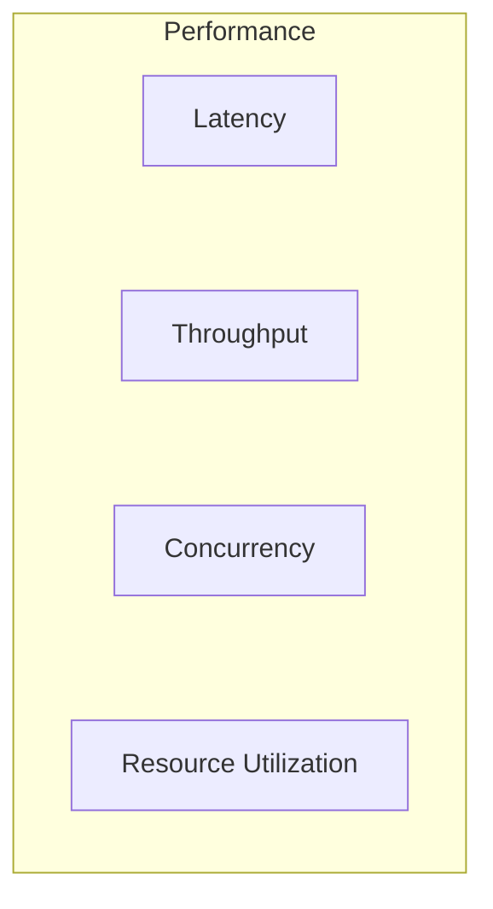

For a web application, users often care most about:

> **How long does it take to get a useful response?**

That is **latency**.

But system designers also care about:

* how many requests the system can handle,
* how much work happens simultaneously,
* how much CPU/memory/network/database capacity is being consumed.

---

# 2. Performance Is Not One Number

Consider two systems.

### System A

```text
Response time = 100 ms
Capacity = 100 requests/sec
```

### System B

```text
Response time = 50 ms
Capacity = 20 requests/sec
```

System B has lower latency for the requests it handles, but it has lower capacity.

So:

```text
Lower latency ≠ Higher throughput
```

A good performance investigation therefore starts by identifying **what we are trying to improve**.

---

# 3. The Journey of a Request

Before optimizing anything, follow the request.

A simplified web request might look like:

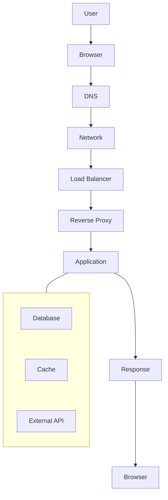

Time can be spent at many points.

For example:

```text
DNS       → 10 ms
Network   → 30 ms
Proxy     → 5 ms
Application → 40 ms
Database  → 100 ms
Response  → 15 ms
```

The total user-visible latency is influenced by the complete path.

---

# 4. Where Can Time Go?

A request can spend time in several broad categories:

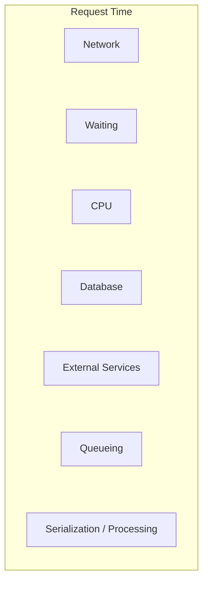

Some work happens **actively**.

Some time is simply spent **waiting**.

This distinction is critical.

---

# 5. Work vs Waiting

Suppose an application spends:

```text
CPU work = 20 ms
Database waiting = 150 ms
```

The developer might think:

> "The application needs more CPU."

But CPU is not necessarily the problem.

The request is mostly waiting for the database.

```text
Total
────────────────────────────────
CPU       ████
Database  ███████████████████████
```

The first question should therefore be:

> **Where is the request actually spending its time?**

---

# 6. A Simple Request Timeline

Imagine a request:

```text
0 ms
│
├── Network        20 ms
│
├── Application    30 ms
│
├── Database       120 ms
│
├── Application    10 ms
│
└── Response       20 ms
│
220 ms
```

Total latency:

```text
20 + 30 + 120 + 10 + 20 = 200 ms
```

**Correction:** The actual total is **200 ms**, not 220 ms.

The database operation still dominates the timeline.

Making application code 10 ms faster may have little effect.

But reducing the database operation from 120 ms to 30 ms could make a much larger difference.

### System-design principle

> **Optimize the dominant cost before optimizing small costs.**


---

# 7. What Is a Bottleneck?

A **bottleneck** is a constraint that significantly limits the performance or capacity of a system.

Imagine water flowing through pipes:

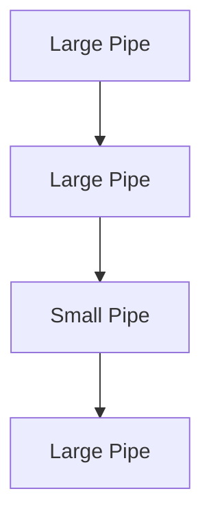

The small pipe restricts the overall flow.

That is the basic idea of a bottleneck.

In a software system:

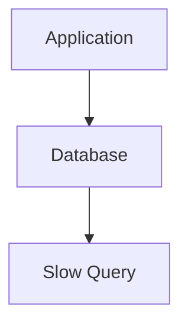

The slow query may become the bottleneck.

---

# 8. Bottleneck vs Symptom

This distinction is extremely important.

Suppose users report:

> "The website is slow."

That is a **symptom**.

You discover:

```text
CPU = 30%
Memory = 40%
Database CPU = 95%
```

The database may be the bottleneck.

But even that might be only an intermediate observation.

Further investigation may show:

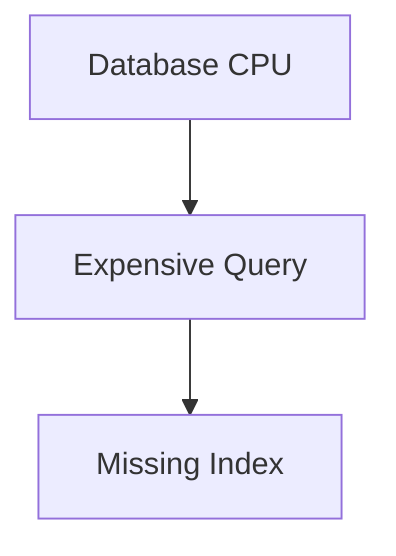

The missing index may be closer to the underlying cause.

So:

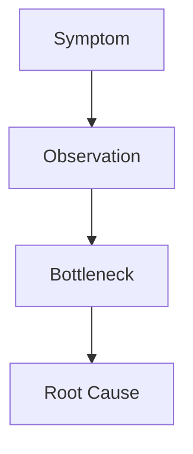

Do not stop at the first number that looks unusual.

---

# 9. Common Bottleneck Categories

Most application performance problems can often be investigated through a few broad categories.

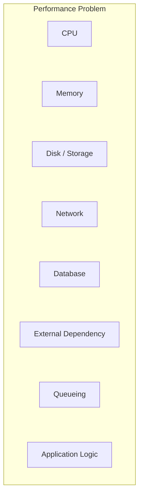

These categories can interact.

For example:

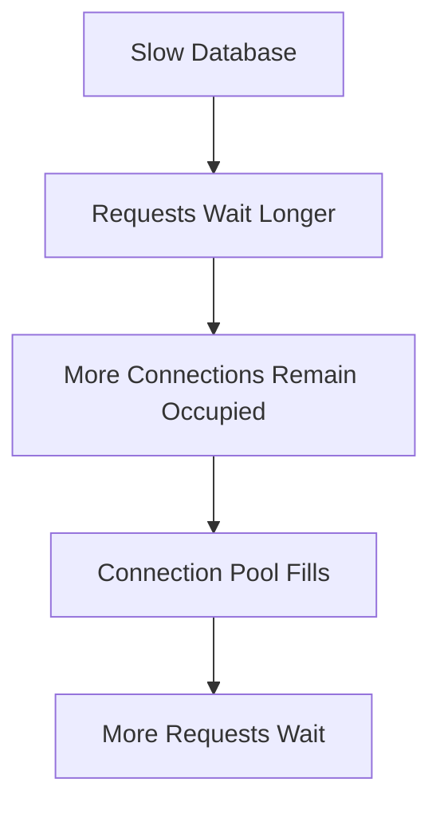

One bottleneck can therefore create secondary symptoms.

---

# 10. CPU-Bound Work

A workload is **CPU-bound** when CPU computation is a major part of its execution time.

Examples can include:

* complex calculations,
* image processing,
* video processing,
* compression,
* encryption,
* expensive data transformation.

Conceptually:

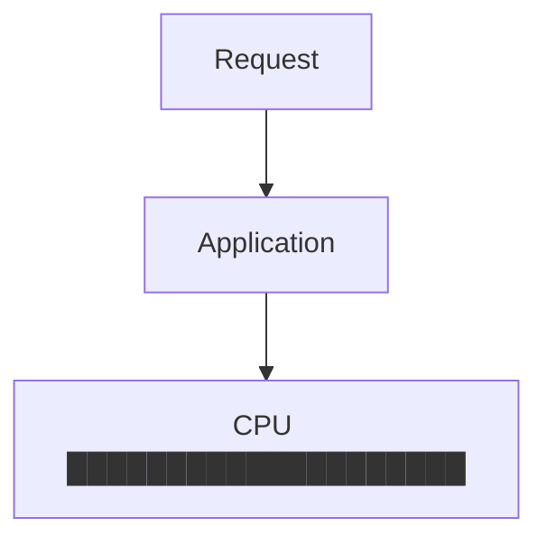

If CPU is genuinely the bottleneck, possible solutions may include:

* optimizing the algorithm,
* reducing unnecessary computation,
* caching expensive results,
* using more efficient processing,
* scaling CPU resources.

But:

> **High CPU does not automatically mean "buy a bigger server."**

First determine why the CPU is being consumed.

---

# 11. I/O-Bound Work

An application may spend much of its time waiting for I/O.

I/O includes operations such as:

* database access,
* disk access,
* network calls,
* external APIs.

Example:

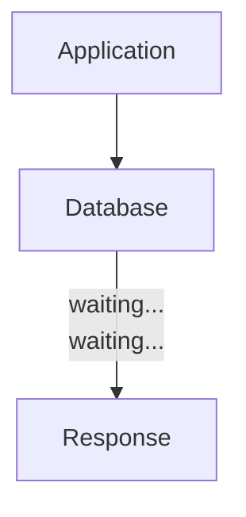

The application CPU might be relatively idle while waiting.

This is why CPU utilization alone is not enough to understand performance.

---

# 12. Database Bottlenecks

Databases are frequent performance bottlenecks.

For example:

```text
Application
    │
    ├── Query A → 5 ms
    ├── Query B → 8 ms
    └── Query C → 800 ms
```

One expensive query can dominate the request.

Potential causes include:

* missing indexes,
* inefficient queries,
* returning too much data,
* scanning large amounts of data,
* excessive joins,
* poor data access patterns,
* lock contention,
* too many queries per request.

Database optimization becomes a major focus later in this level.

---

# 13. Network Bottlenecks

A request can also spend substantial time on the network.

For example:

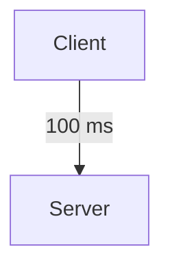

Or:

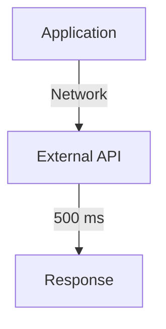

If your application depends on a slow remote service, optimizing your local code may have little effect.

The network also introduces:

* latency,
* bandwidth constraints,
* packet loss,
* connection establishment overhead,
* geographic distance.

---

# 14. External Dependency Bottlenecks

Modern applications frequently depend on external systems.

For example:

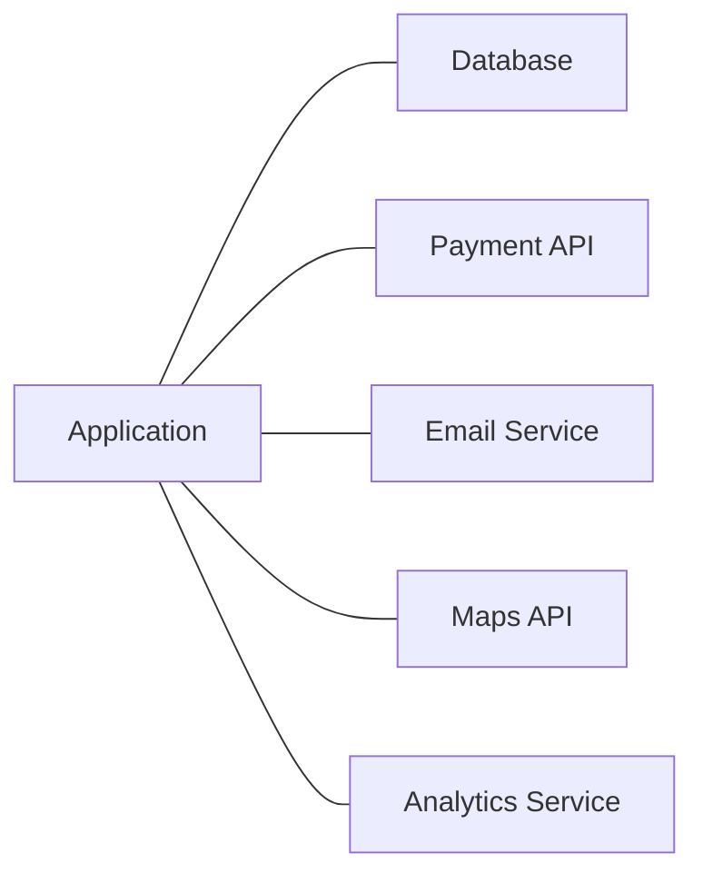

Suppose:

```text
Application logic = 30 ms
Payment API = 700 ms
```

The payment API dominates that part of the request.

This is why distributed systems need:

* timeouts,
* retries,
* circuit breakers,
* caching where appropriate,
* asynchronous processing.

You have already learned several of these in Level 2.

---

# 15. Queueing and Waiting

Sometimes the system is not slow because the actual work is slow.

The request may simply be waiting for its turn.

For example:

```text
Request 1 → Processing
Request 2 → Waiting
Request 3 → Waiting
Request 4 → Waiting
```

Possible causes include:

* all workers are busy,
* database connections are exhausted,
* connection limits are reached,
* a lock is held,
* a queue is full,
* downstream capacity is limited.

This is called **queueing** or waiting for available capacity.

---

# 16. Queueing Can Become the Bottleneck

Imagine:

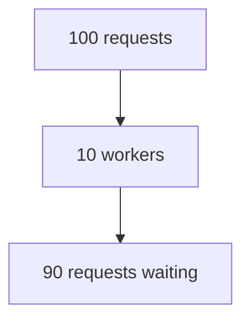

Even if each request only requires 20 ms of CPU time, users can experience high latency because they are waiting for workers.

So:

> **Latency is not only execution time. It can also include waiting time.**

---

# 17. Memory Pressure

Memory can affect performance in several ways.

If an application needs more memory than is comfortably available, the system may experience:

* memory allocation pressure,
* garbage-collection pressure,
* swapping in some environments,
* process termination,
* reduced cache effectiveness.

Conceptually:

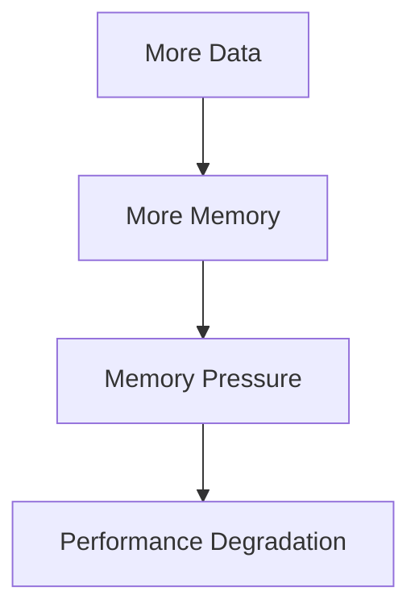

Again, the solution is not automatically "add RAM."

First determine what is consuming memory.

---

# 18. Storage Performance

Storage can also become a bottleneck.

Examples:

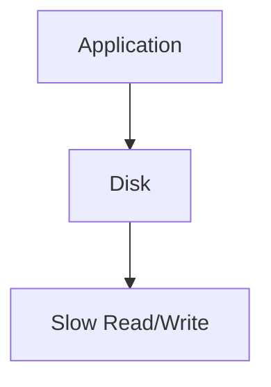

Potential causes include:

* heavy disk I/O,
* large files,
* slow storage,
* inefficient access patterns,
* insufficient caching.

Modern systems often reduce repeated storage access using caching.

Caching will be covered later in this level.

---

# 19. Too Much Data

Sometimes the system is slow simply because it is moving or processing too much data.

Example:

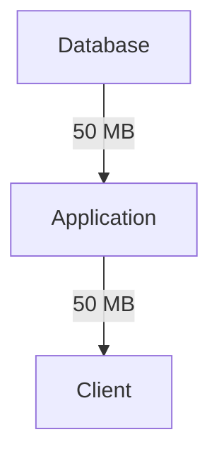

Maybe the user only needed:

```text
20 KB
```

Sending unnecessary data increases:

* database work,
* network transfer,
* serialization time,
* browser processing,
* memory usage.

### Performance principle

> **Do less unnecessary work.**

This is often more valuable than making existing work slightly faster.

---

# 20. Serialization and Deserialization

Applications frequently convert data between formats.

For example:

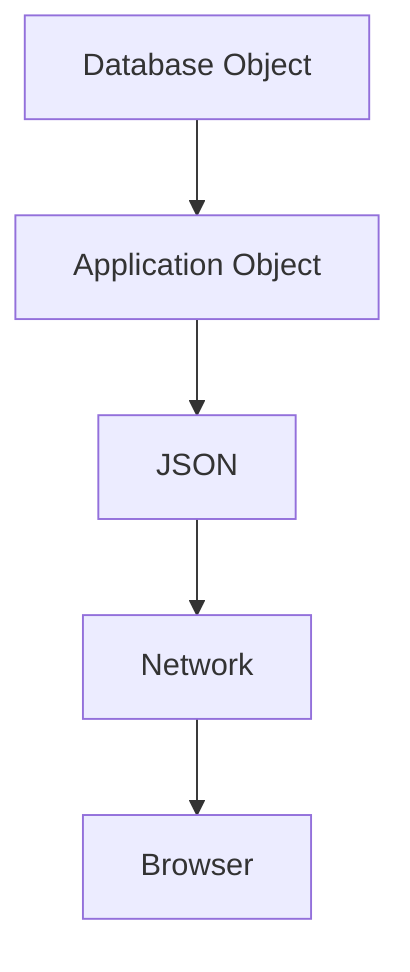

Large or complex payloads can consume:

* CPU,
* memory,
* network bandwidth,
* time.

Therefore, payload size can become part of the performance problem.

---

# 21. The N+1 Query Problem

A common application-level performance problem is the **N+1 query pattern**.

Suppose the application needs 100 products.

Instead of:

```text
1 query → fetch 100 products
```

it does:

```text
1 query → fetch products

100 queries → fetch related information
```

Total:

```text
101 database queries
```

Conceptually:

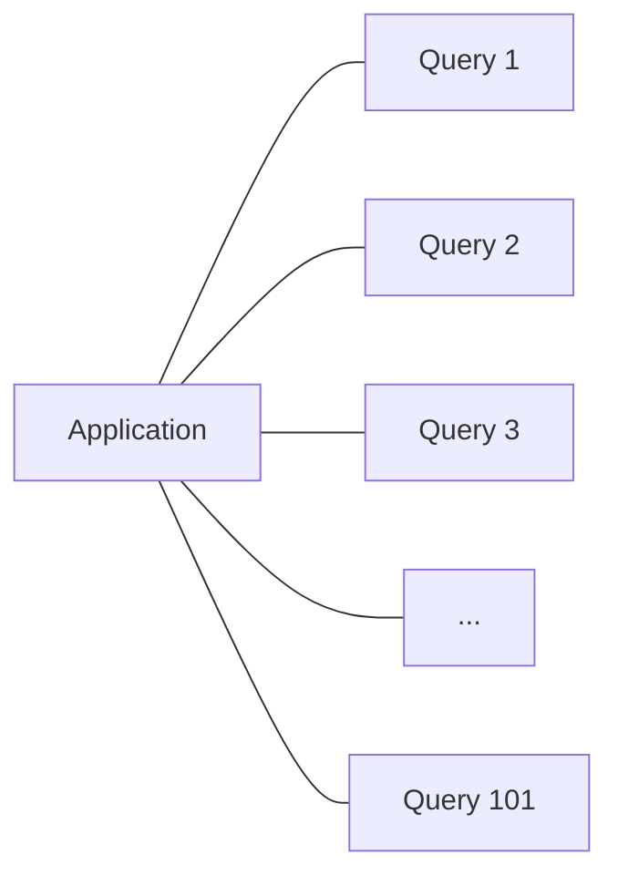

Even if each query is individually fast, the total overhead can become significant.

---

# 22. Too Many Small Operations

Performance problems do not always come from one huge operation.

Sometimes the problem is thousands of small operations.

Example:

```text
1,000 database queries × 5 ms
```

Even if each query takes only 5 ms, the total work can become substantial.

This leads to an important question:

> **How many operations are being performed, not just how long does each operation take?**

---

# 23. Sequential vs Parallel Work

Suppose an application calls three independent services.

Sequential:

```text
Service A → 100 ms
     │
     ▼
Service B → 100 ms
     │
     ▼
Service C → 100 ms

Total ≈ 300 ms
```

If the calls can safely happen concurrently:

```text
          ┌→ Service A → 100 ms
Application├→ Service B → 100 ms
          └→ Service C → 100 ms

Total ≈ 100 ms + overhead
```

Parallelism can reduce latency.

But it can also increase:

* connection usage,
* CPU usage,
* downstream load,
* failure complexity.

So:

> **Parallelism is a trade-off, not a free performance improvement.**

---

# 24. The Critical Path

The **critical path** is the sequence of work that determines how quickly a result can be produced.

Consider:

```mermaid
flowchart TD
  accTitle: The critical path
  accDescr: A request loads the user, the products and the recommendations; recommendations wait for the user and the products, then the response is sent.
  R["Request"] --- U["Load User"] & P["Load Products"] & C["Load Recommendations"]
  U & P --> C
  C --> S["Response"]
```

If several operations happen independently, they may run concurrently.

But if one operation depends on another:

```mermaid
flowchart TD
  accTitle: A dependency chain
  accDescr: A, then B, then C.
  N0["A"] --> N1["B"] --> N2["C"]
```

the total time includes them sequentially.

Finding the critical path helps identify where latency is actually coming from.

---

# 25. Why Faster Hardware Does Not Always Fix Performance

Suppose:

```text
CPU = 20%
Database = 900 ms
```

You double the CPU.

Maybe the request is still:

```text
Database = 900 ms
```

The user sees little improvement.

This illustrates:

> **Improving a non-bottleneck resource may produce little system-level benefit.**

---

# 26. Amdahl's Law — The Basic Idea

A useful way to think about optimization is:

> **The maximum benefit of optimizing one part is limited by how much of the total work that part represents.**

Suppose a request takes:

```text
Database = 80%
Application = 20%
```

Even if application processing became infinitely fast, the database portion would still dominate.

Conceptually:

```text
Before
Database      ████████████████ 80%
Application   ████             20%

After application optimization
Database      ████████████████ 80%
Application   █                  5%*
```

*The exact resulting percentage changes because the total time changes.

The broader lesson is more important than the formula:

> **Optimize the part that matters most to the total.**

---

# 27. Measurement Before Optimization

A common engineering mistake is:

```mermaid
flowchart TD
  accTitle: Optimizing by guesswork
  accDescr: A problem, a guess, an optimization.
  N0["Problem"] --> N1["Guess"] --> N2["Optimize"]
```

A better process is:

```mermaid
flowchart TD
  accTitle: Measurement before optimization
  accDescr: A problem: measure, find the bottleneck, form a hypothesis, change one thing, measure again.
  N0["Problem"] --> N1["Measure"] --> N2["Find Bottleneck"] --> N3["Form Hypothesis"] --> N4["Change One Thing"] --> N5["Measure Again"]
```

This is the foundation of performance engineering.

---

# 28. What Should We Measure?

Useful measurements can include:

### Latency

```text
How long does a request take?
```

### Throughput

```text
How much work is completed per unit of time?
```

### CPU utilization

```text
How much CPU is being consumed?
```

### Memory utilization

```text
How much memory is being consumed?
```

### Database latency

```text
How long do queries take?
```

### Query count

```text
How many database operations happen per request?
```

### Network usage

```text
How much data is being transferred?
```

### Queue depth

```text
How much work is waiting?
```

### Connection usage

```text
How many connections are active?
```

These measurements help turn:

> "The application feels slow"

into something actionable.

---

# 29. Percentiles Matter

Average latency can hide important behavior.

Suppose:

```text
Requests = 100

99 requests = 50 ms
1 request = 5,000 ms
```

Average latency is affected by the slow request, but it does not tell the full story.

Instead, systems often look at percentiles such as:

```text
p50
p95
p99
```

You will study these in detail later in **Level 10 — Observability**.

For now, remember:

> **Averages can hide slow requests.**

---

# 30. Performance Under Load

A system may perform well with:

```text
10 users
```

but poorly with:

```text
10,000 users
```

Why?

Because increasing load can create:

```mermaid
flowchart TD
  accTitle: Performance under load
  accDescr: More requests mean more CPU, more database queries, more connections, more queueing and more network traffic, and so higher latency.
  R["More Requests"] --> G
  subgraph G[" "]
    direction TB
    G0["More CPU"] ~~~ G1["More DB Queries"] ~~~ G2["More Connections"] ~~~ G3["More Queueing"] ~~~ G4["More Network Traffic"]
  end
  G --> L["Higher Latency"]
```

Performance must therefore be evaluated under realistic workloads.

---

# 31. Performance Can Degrade Nonlinearly

A system does not always become gradually slower.

Consider:

```text
Load
 │
 │        /
 │       /
 │      /
 │     /
 │____/____________
      Capacity
```

As a resource approaches saturation, waiting and queueing can increase sharply.

For example:

```text
CPU = 50% → Healthy
CPU = 70% → More pressure
CPU = 85% → Increasing queueing
CPU = 95% → Significant latency
CPU = 100% → Saturated
```

The exact behavior depends on the system.

The important idea:

> **Near saturation, small increases in load can cause disproportionately large latency increases.**

---

# 32. The Bottleneck Can Move

A very important system-design concept:

> **After you fix one bottleneck, another bottleneck may become visible.**

Example:

### Before

```mermaid
flowchart TD
  accTitle: The bottleneck is the database
  accDescr: The application waits on the database, the bottleneck.
  N0["Application"] --> N1["Database ← Bottleneck"]
```

Optimize the database.

Now:

```mermaid
flowchart TD
  accTitle: The bottleneck moves to the network
  accDescr: The application waits on the network, now the bottleneck.
  N0["Application"] --> N1["Network ← Bottleneck"]
```

Optimize the network.

Now:

```text
Application ← Bottleneck
```

Performance optimization can therefore be iterative:

```mermaid
flowchart TD
  accTitle: The bottleneck can move
  accDescr: Measure, find the bottleneck, improve, measure again, find the new bottleneck, repeat.
  N0["Measure"] --> N1["Find Bottleneck"] --> N2["Improve"] --> N3["Measure Again"] --> N4["Find New Bottleneck"] --> N5["Repeat"]
```

This is normal.

---

# 33. Do Not Optimize Everything

Optimization has a cost.

It may introduce:

* complexity,
* maintenance work,
* operational overhead,
* additional infrastructure,
* new failure modes,
* harder debugging.

For example:

```mermaid
flowchart TD
  accTitle: Every optimization has a cost
  accDescr: A simple application adds a cache and gets faster reads, along with cache invalidation, cache failures, extra infrastructure and consistency questions.
  S["Simple Application"] --> C["Add Cache"] --> F["Faster Reads"] --- G
  subgraph G[" "]
    direction TB
    G0["Cache Invalidation"] ~~~ G1["Cache Failures"] ~~~ G2["Extra Infrastructure"] ~~~ G3["Consistency Questions"]
  end
```

Therefore:

> **Performance improvements should solve real problems, not imaginary ones.**

---

# 34. A Practical Performance Investigation

Suppose users report:

> "The product page is slow."

Do not immediately add Redis.

Start with:

### Step 1 — Measure

```text
Current latency?
```

### Step 2 — Break down the request

```text
Network
Application
Database
External APIs
```

### Step 3 — Find the dominant cost

```text
Database = 700 ms
```

### Step 4 — Investigate the database

```text
Which query?
How many queries?
How much data?
Is an index missing?
```

### Step 5 — Change one thing

For example:

```text
Add appropriate index
```

### Step 6 — Measure again

```text
700 ms → 100 ms
```

### Step 7 — Look for the next bottleneck

```mermaid
flowchart TD
  accTitle: The next bottleneck
  accDescr: The database improved; the external API now dominates.
  N0["Database improved"] --> N1["External API now dominates"]
```

Then investigate that.

---

# 35. Performance Optimization Decision Flow

```mermaid
flowchart TD
  accTitle: Performance optimization decision flow
  accDescr: A user reports slowness. Measure: where is time spent? Network, application or database. Find the bottleneck and its root cause, apply a small change, measure. Did performance improve? If yes, find the next issue; if no, reconsider.
  U["User Reports Slowness"] --> M["Measure"] --> W["Where is time spent?"] --> N["Network"] & A["Application"] & D["Database"]
  N & A & D --> B["Find Bottleneck"] --> R["Find Root Cause"] --> S["Apply Small Change"] --> M2["Measure"] --> Q{"Did performance improve?"}
  Q ---|"Yes"| X["Find next issue"]
  Q ---|"No"| Y["Reconsider"]
```

---

# 36. Performance and System Design

Performance is not something you add at the end.

Architecture affects performance from the beginning.

For example:

```mermaid
flowchart TD
  accTitle: Performance and system design
  accDescr: Architecture decides network distance, database design, the data access pattern, the caching strategy, service communication, the storage choice and the processing model.
  subgraph G["Architecture"]
    direction TB
    G0["Network Distance"] ~~~ G1["Database Design"] ~~~ G2["Data Access Pattern"] ~~~ G3["Caching Strategy"] ~~~ G4["Service Communication"] ~~~ G5["Storage Choice"] ~~~ G6["Processing Model"]
  end
```

But this does **not** mean:

> "Design the most optimized architecture from day one."

Instead:

> **Start simple, measure real behavior, then optimize the actual bottleneck.**

That principle connects directly to Systemly's core philosophy.

---

# 37. A Real-World Example

Imagine an online store.

A product page takes:

```text
1,000 ms
```

Breakdown:

```text
Network             50 ms
Application         100 ms
Database            600 ms
Image processing    150 ms
Other                100 ms
────────────────────────
Total              1,000 ms
```

Suppose you optimize application code and save:

```text
100 ms → 50 ms
```

New total:

```text
950 ms
```

The application became **50% faster**, but the user experience improved by only about **5% of the original total latency**.

Why?

Because the application was not the dominant cost.

Now imagine reducing the database time:

```text
600 ms → 150 ms
```

The total becomes approximately:

```text
550 ms
```

That is a much larger system-level improvement.

### Lesson

> **Local improvement and system-level improvement are not the same thing.**

---

# 38. Performance Optimization Hierarchy

When investigating a slow system, think in this order:

```mermaid
flowchart TD
  accTitle: Performance optimization hierarchy
  accDescr: 1. Is the system doing unnecessary work? 2. Is the work being done efficiently? 3. Is the system waiting unnecessarily? 4. Is a resource saturated? 5. Can the bottleneck be removed or reduced? 6. If necessary, can the workload be distributed?
  N0["1#46; Is the system doing unnecessary work?"] --> N1["2#46; Is the work being done efficiently?"] --> N2["3#46; Is the system waiting unnecessarily?"] --> N3["4#46; Is a resource saturated?"] --> N4["5#46; Can the bottleneck be removed or reduced?"] --> N5["6#46; If necessary, can the workload be distributed?"]
```

This helps prevent premature architectural complexity.

---

# 39. The Golden Rule of Performance

A useful rule to remember:

> **Measure → Find the bottleneck → Optimize the bottleneck → Measure again.**

Not:

```mermaid
flowchart TD
  accTitle: Adding technology first
  accDescr: Slow: add a cache, add Redis, add a CDN, add microservices, add more servers.
  N0["Slow"] --> N1["Add Cache"] --> N2["Add Redis"] --> N3["Add CDN"] --> N4["Add Microservices"] --> N5["Add More Servers"]
```

Those technologies may be useful.

But they should be responses to actual constraints.

---

# 40. Key Principle

> **Performance optimization is not about making everything faster. It is about finding the part that limits the system and improving that part.**

The complete mindset is:

```mermaid
flowchart TD
  accTitle: Key principle
  accDescr: A user complaint leads to measurement, a request breakdown, the bottleneck, the root cause, a targeted improvement, measurement, and the next bottleneck.
  N0["User Complaint"] --> N1["Measurement"] --> N2["Request Breakdown"] --> N3["Bottleneck"] --> N4["Root Cause"] --> N5["Targeted Improvement"] --> N6["Measurement"] --> N7["Next Bottleneck"]
```

A good system designer does not ask:

> "What performance technology should I add?"

They first ask:

> **"Where is the time actually going?"**

---

# 41. Quick Reference

| Concept             | Meaning                                                       |
| ------------------- | ------------------------------------------------------------- |
| Latency             | Time taken to complete an operation                           |
| Throughput          | Amount of work completed per unit time                        |
| Concurrency         | Work happening at the same time                               |
| Bottleneck          | Constraint limiting system performance/capacity               |
| CPU-bound           | Performance primarily constrained by computation              |
| I/O-bound           | Performance primarily constrained by waiting for I/O          |
| Queueing            | Waiting for available capacity                                |
| Critical Path       | Work sequence determining completion time                     |
| Resource Saturation | A resource approaching or reaching its useful capacity        |
| Optimization        | Changing a system to improve a measured property              |
| Root Cause          | Underlying reason for a problem                               |
| N+1 Query           | One initial query followed by many additional related queries |

---

# 42. Knowledge Check

### Question 1

If CPU usage is only 20%, can an application still be slow?

**Yes.**

It might be waiting on:

* a database,
* network,
* external API,
* disk,
* connection availability,
* another resource.

---

### Question 2

Why should you measure before optimizing?

Because otherwise you may optimize a component that is not actually limiting the system.

---

### Question 3

If a database query takes 800 ms and application processing takes 20 ms, which deserves investigation first?

The database operation, because it dominates the request's time.

---

### Question 4

Can fixing one bottleneck expose another?

**Yes.**

Once the original bottleneck is removed, another constraint may become the dominant one.

---

### Question 5

Is lower latency always equivalent to higher throughput?

**No.**

Latency and throughput measure different aspects of system behavior.

---

### Question 6

Why can a system become dramatically slower near saturation?

Because queueing and waiting can increase rapidly as available capacity becomes scarce.

---

# Remember

When a system feels slow, resist the temptation to immediately add technology.

Start here:

```mermaid
flowchart TD
  accTitle: Remember
  accDescr: Where is the time going? What is waiting? What is consuming resources? What is the bottleneck? Why is it the bottleneck? What is the smallest useful change? Did it actually improve?
  N0["Where is the time going?"] --> N1["What is waiting?"] --> N2["What is consuming resources?"] --> N3["What is the bottleneck?"] --> N4["Why is it the bottleneck?"] --> N5["What is the smallest useful change?"] --> N6["Did it actually improve?"]
```

**Next: 03.02 — Database Indexes**
