# 03.02 — Database Indexes

## Learning Objectives

By the end of this chapter, you should be able to:

* Understand what a **database index** is.
* Understand why indexes can make queries faster.
* Understand the trade-off between read performance and write/storage cost.
* Understand how a database uses an index to locate rows.
* Distinguish between a table scan and an index-based lookup.
* Understand single-column and composite indexes.
* Understand why **column order** matters in composite indexes.
* Recognize situations where an index may not help.
* Identify common indexing mistakes.

---

# 1. The Problem an Index Solves

Imagine a table containing 10 million users:

```text
users

id       name        email
────────────────────────────────
1        Rahul       ...
2        Priya       ...
3        Arjun       ...
...
10,000,000 rows
```

Now someone searches:

```sql
SELECT *
FROM users
WHERE email = 'arjun@example.com';
```

How does the database find the correct row?

Without a useful index, it may need to inspect many rows.

```text
Row 1       → No
Row 2       → No
Row 3       → No
...
Row 8,421,392 → YES
```

That can become expensive as the table grows.

An **index** gives the database an additional structure that can help locate matching rows more efficiently.

---

# 2. A Simple Analogy: Book Index

Think about a physical book.

Suppose you want to find information about:

> "Database Indexes"

Without an index:

```text
Page 1
Page 2
Page 3
...
Page 500
```

You may have to search page by page.

With an index:

```text
Database Indexes → Page 347
```

You can jump much closer to the information you need.

A database index works on a similar principle.

> **An index is an additional data structure designed to help the database find rows without examining the entire table unnecessarily.**

---

# 3. Table Without an Index

Suppose:

```text
users
────────────────────────
id | name | email
────────────────────────
1  | A    | a@example
2  | B    | b@example
3  | C    | c@example
4  | D    | d@example
5  | E    | e@example
```

Query:

```sql
SELECT *
FROM users
WHERE email = 'd@example';
```

Without an appropriate index, the database may perform a **table scan**.

Conceptually:

```text
Table
 │
 ├── Row 1 → Check
 ├── Row 2 → Check
 ├── Row 3 → Check
 ├── Row 4 → Match
 └── ...
```

The database examines rows to determine which ones satisfy the condition.

---

# 4. Table Scan

A **table scan** means the database reads through a large portion of the table to find qualifying rows.

Conceptually:

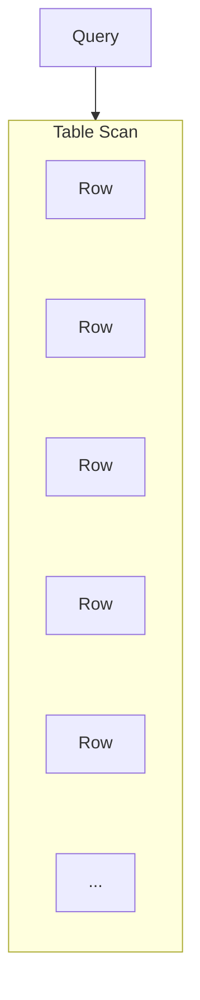

For a small table, this may be perfectly acceptable.

For a huge table, repeatedly scanning millions of rows can become expensive.

This is one reason indexes exist.

---

# 5. Adding an Index

Suppose we create:

```sql
CREATE INDEX idx_users_email
ON users(email);
```

The database now maintains an additional structure based on `email`.

Conceptually:

```text
Index
────────────────────────
a@example  → Row 1
b@example  → Row 2
c@example  → Row 3
d@example  → Row 4
e@example  → Row 5
```

The exact internal structure depends on the database system and index type.

For common relational database indexes, tree-based structures are widely used.

For now, focus on the architectural idea:

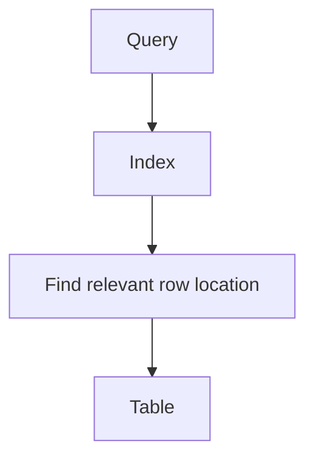

---

# 6. Index Lookup

With an appropriate index, the database may be able to locate matching rows much more efficiently.

Conceptually:

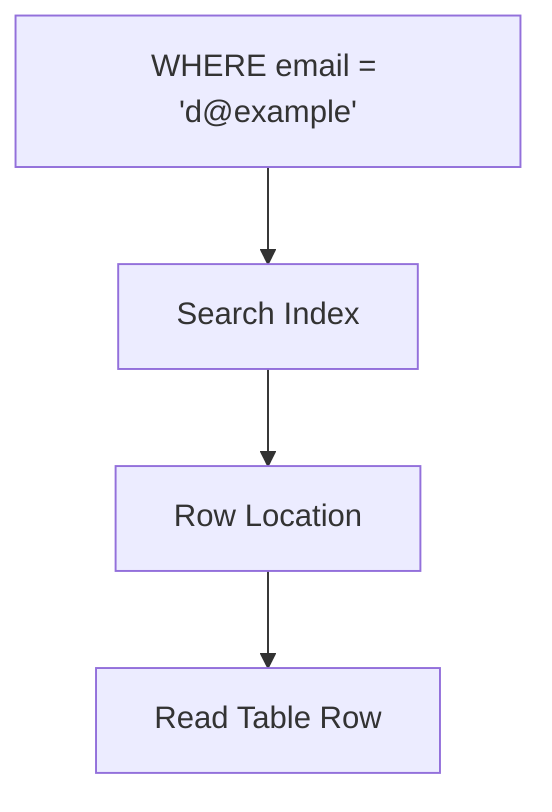

Instead of:

```text
Check Row 1
Check Row 2
Check Row 3
Check Row 4
...
```

the database can use the index to narrow the search.

---

# 7. What Is Actually Stored in an Index?

An index generally contains information that helps the database locate table data.

Conceptually:

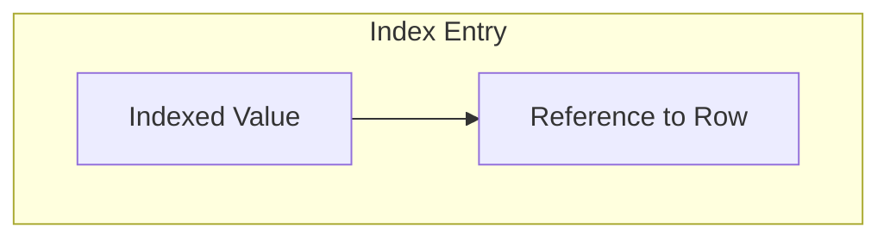

For example:

```text
email                 Row Reference
────────────────────────────────────
a@example.com         → Row A
b@example.com         → Row B
c@example.com         → Row C
```

The exact representation depends on the database engine.

An important point is:

> **An index is not simply a second copy of the entire table.**

It is a separate data structure maintained by the database.

---

# 8. Why Is the Index Faster?

A useful index is organized so the database can search it efficiently.

For example, a simplified tree might look like:

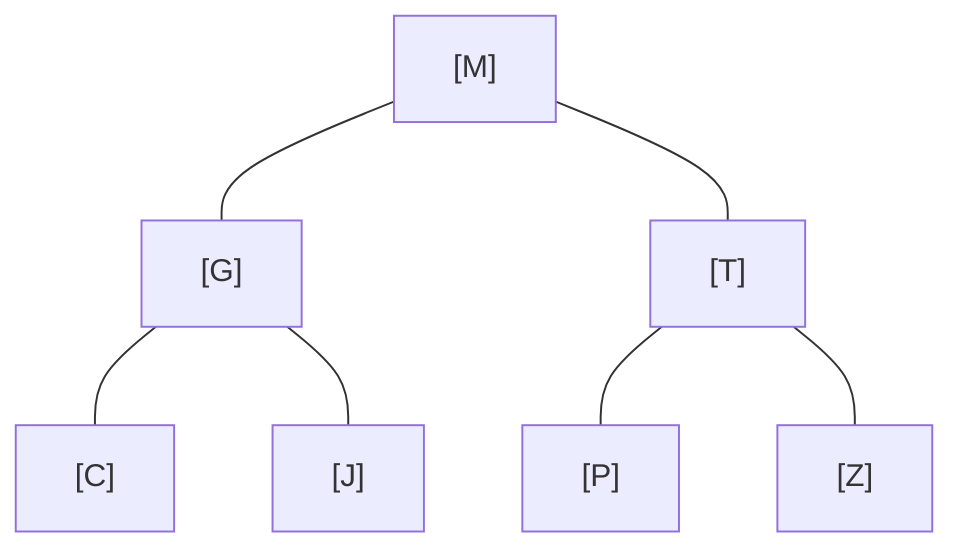

The database can use comparisons to move through the structure rather than checking every entry.

The exact implementation varies by database system.

The important idea is:

```text
Unstructured search
       ↓
Potentially inspect many rows

Organized index
       ↓
Narrow the search efficiently
```

---

# 9. Indexes Improve Reads — But Have a Cost

It is tempting to think:

> "More indexes = faster database."

Not necessarily.

Indexes have costs.

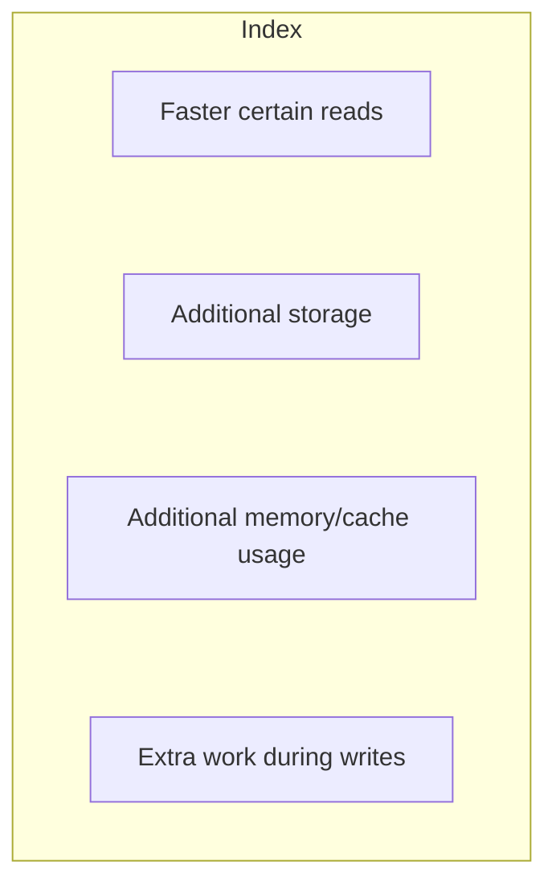

When a row changes, relevant indexes may also need to be updated.

So:

> **An index is a trade-off between read efficiency and maintenance cost.**

---

# 10. What Happens During INSERT?

Suppose we have:

```sql
CREATE INDEX idx_users_email
ON users(email);
```

Now:

```sql
INSERT INTO users (name, email)
VALUES ('Riya', 'riya@example.com');
```

The database must:

1. Insert the row into the table.
2. Update the relevant index.

Conceptually:

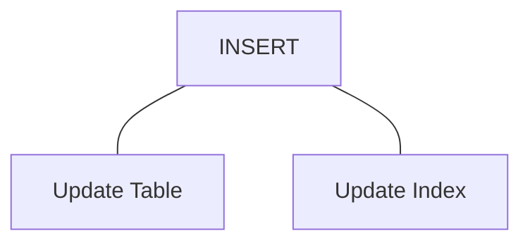

Therefore, indexes can increase write work.

---

# 11. What Happens During UPDATE?

Suppose:

```sql
UPDATE users
SET email = 'new@example.com'
WHERE id = 10;
```

If `email` is indexed, the database may need to update the corresponding index entry.

Conceptually:

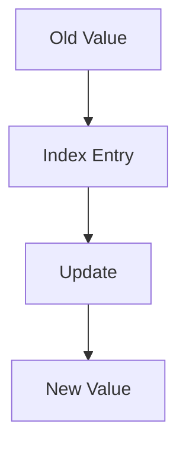

Again:

> **Indexes must stay consistent with the data they represent.**

---

# 12. What Happens During DELETE?

If a row is deleted:

```sql
DELETE FROM users
WHERE id = 10;
```

The database must also maintain relevant index structures.

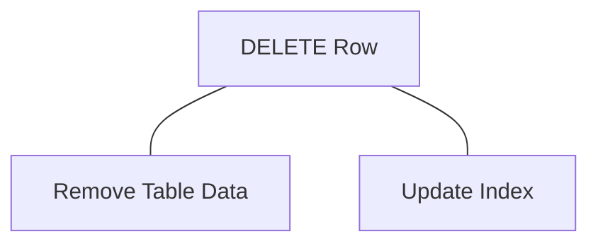

So indexes affect:

* INSERT
* UPDATE
* DELETE

not just SELECT.

---

# 13. The Basic Index Trade-Off

Think of the trade-off like this:

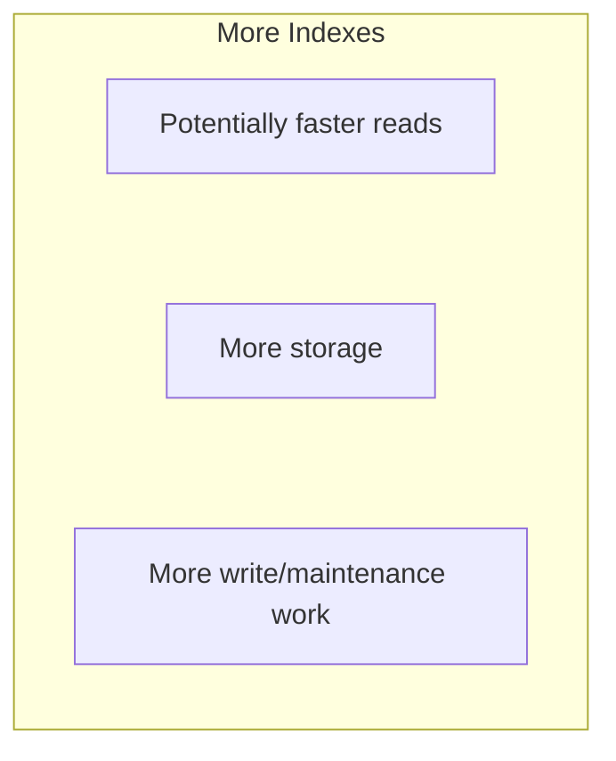

Fewer indexes:

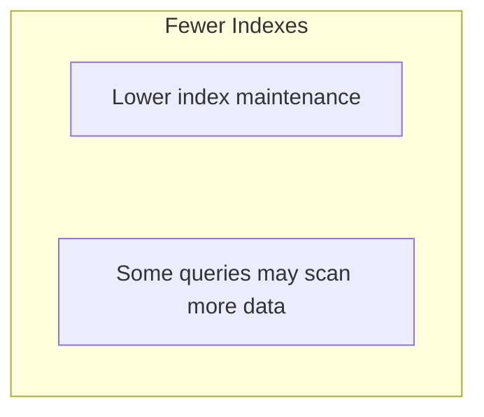

Good indexing tries to find a useful balance.

---

# 14. Not Every Column Needs an Index

Suppose a table has:

```text
users
────────────────────────
id
name
email
age
country
created_at
bio
profile_picture
```

It does not automatically make sense to index every column.

The right question is:

> **Which queries need efficient access paths?**

For example, if the application frequently searches:

```sql
WHERE email = ?
```

an index on `email` may be useful.

But if `bio` is rarely used for filtering, indexing it may provide little benefit.

---

# 15. Index Based on Query Patterns

Index design should start with actual access patterns.

Suppose the application frequently runs:

```sql
SELECT *
FROM orders
WHERE user_id = 42;
```

An index on:

```text
user_id
```

may help.

If it frequently runs:

```sql
SELECT *
FROM orders
WHERE status = 'pending';
```

an index involving `status` may be considered.

The key idea is:

> **Indexes should support important query patterns, not simply mirror the table schema.**

---

# 16. Selectivity

A useful concept when thinking about indexes is **selectivity**.

Suppose:

```text
10 million users
```

and you search:

```text
email = 'someone@example.com'
```

Usually, an email value identifies a very small number of rows.

That is highly selective.

Now consider:

```text
status = 'active'
```

If:

```text
9.5 million rows = active
500,000 rows = inactive
```

the condition matches a large portion of the table.

The usefulness of an index depends partly on how effectively it can narrow the result set.

---

# 17. High-Selectivity vs Low-Selectivity

Conceptually:

```text
High Selectivity
────────────────────
email = ?
→ very few matching rows

Low Selectivity
────────────────────
status = 'active'
→ millions of matching rows
```

An index can still be useful for low-cardinality columns in some query patterns and database engines.

But:

> **A column having an index does not guarantee that the database will use it.**

The optimizer decides whether an index is beneficial for a particular query.

---

# 18. The Query Optimizer

When you execute:

```sql
SELECT *
FROM users
WHERE email = 'a@example.com';
```

the database does not blindly follow a rule:

> "If an index exists, always use it."

Instead, the database's **query optimizer** evaluates possible execution strategies.

Conceptually:

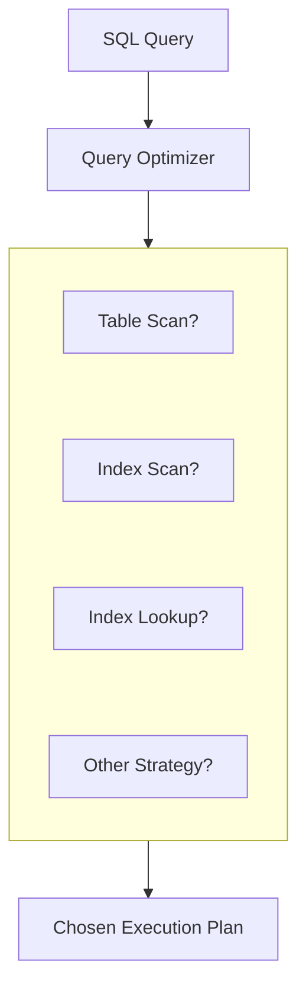

The optimizer considers factors such as:

* estimated number of matching rows,
* available indexes,
* table statistics,
* query structure,
* cost of reading data.

---

# 19. Index Does Not Mean "Always Used"

Suppose a table contains only:

```text
20 rows
```

and there is an index.

A table scan may actually be cheaper than using the index.

Conceptually:

```text
20-row table
     │
     ├── Scan 20 rows → Cheap
     │
     └── Use index → Additional overhead
```

So the optimizer may choose a scan.

This is not necessarily a problem.

> **The goal is not to maximize index usage. The goal is to choose an efficient execution plan.**

---

# 20. Primary Keys and Indexes

Primary keys commonly have an associated index in relational database systems.

For example:

```sql
CREATE TABLE users (
    id BIGINT PRIMARY KEY,
    name VARCHAR(100)
);
```

The primary key provides uniqueness and row identity.

The database commonly maintains an index to support efficient primary-key access.

Then:

```sql
SELECT *
FROM users
WHERE id = 5000000;
```

can be efficiently supported.

The exact implementation depends on the database engine.

---

# 21. Unique Indexes

A **unique index** enforces uniqueness while providing an index structure.

For example:

```sql
CREATE UNIQUE INDEX idx_users_email
ON users(email);
```

This means the database does not allow duplicate indexed values, subject to the database's handling of `NULL` and other engine-specific rules.

Conceptually:

```text
a@example.com → allowed
b@example.com → allowed
a@example.com → duplicate → rejected
```

This is useful when a value must be unique, such as:

* email address,
* username,
* external identifier.

---

# 22. Single-Column Index

The simplest index covers one column.

Example:

```sql
CREATE INDEX idx_orders_user_id
ON orders(user_id);
```

This can help queries such as:

```sql
SELECT *
FROM orders
WHERE user_id = 42;
```

Conceptually:

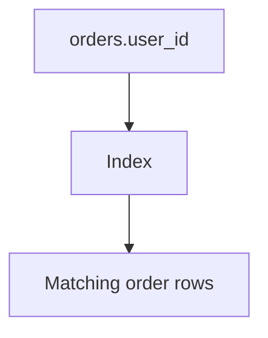

---

# 23. Composite Index

A **composite index** contains multiple columns.

Example:

```sql
CREATE INDEX idx_orders_user_status
ON orders(user_id, status);
```

The index is based on:

```text
(user_id, status)
```

This can support queries involving those columns.

For example:

```sql
SELECT *
FROM orders
WHERE user_id = 42
  AND status = 'pending';
```

But composite indexes introduce an important concept:

> **Column order matters.**

---

# 24. Why Column Order Matters

Consider:

```text
INDEX (user_id, status)
```

Conceptually, the index is organized first by:

```text
user_id
```

and then by:

```text
status
```

So it can naturally support access patterns beginning with `user_id`.

For example:

```sql
WHERE user_id = 42
```

and:

```sql
WHERE user_id = 42
AND status = 'pending'
```

may benefit.

But a query using only:

```sql
WHERE status = 'pending'
```

cannot generally use that composite index in the same efficient way as one beginning with `user_id`.

This is related to the **leftmost-prefix** idea for many B-tree composite indexes.

---

# 25. Composite Index Example

Suppose:

```text
INDEX (country, city)
```

Think conceptually:

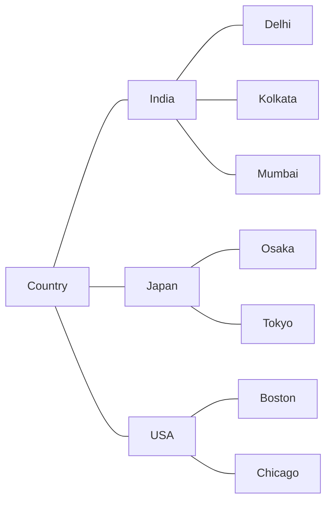

A query such as:

```sql
WHERE country = 'India'
```

can naturally use the index.

And:

```sql
WHERE country = 'India'
AND city = 'Kolkata'
```

can also use it.

But:

```sql
WHERE city = 'Kolkata'
```

does not have the same direct access path because the index is primarily organized by `country`.

---

# 26. Choosing Composite Index Order

Suppose you frequently query:

```sql
SELECT *
FROM orders
WHERE user_id = ?
  AND status = ?
```

You might consider:

```text
INDEX (user_id, status)
```

But index design should be based on actual workload.

You should consider:

* which columns are commonly filtered,
* equality vs range conditions,
* sorting requirements,
* grouping,
* query frequency,
* selectivity,
* write cost.

There is no universal rule such as:

> "Always put the most selective column first."

Real index design depends on the database engine and query workload.

---

# 27. Indexes and ORDER BY

Indexes can sometimes help with sorting as well as filtering.

Suppose:

```sql
SELECT *
FROM orders
WHERE user_id = 42
ORDER BY created_at DESC;
```

An index such as:

```text
(user_id, created_at)
```

may help the database efficiently locate the user's rows in the required order.

Conceptually:

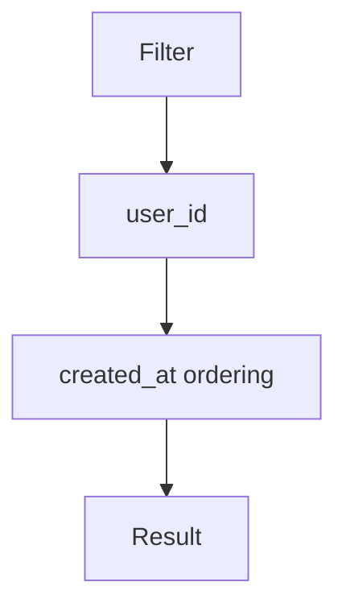

This can reduce the need for separate sorting work in suitable cases.

---

# 28. Indexes and Range Queries

Indexes can also be useful for range conditions.

For example:

```sql
SELECT *
FROM orders
WHERE created_at >= '2026-09-01';
```

Or:

```sql
SELECT *
FROM products
WHERE price BETWEEN 500 AND 1000;
```

Conceptually:

```text
Index
──────────────────────────
100
200
300
400
500 ← Start
600
700
800
900
1000 ← End
1100
```

The database can potentially locate the relevant range and traverse it.

---

# 29. Indexes and LIKE

Index usefulness with text searches depends heavily on the pattern and database engine.

For example:

```sql
WHERE name LIKE 'Rah%'
```

may be able to use an appropriate index in many systems.

But:

```sql
WHERE name LIKE '%Rah%'
```

is much harder for a normal B-tree index to support efficiently because the pattern begins with a wildcard.

The broader lesson:

> **How a column is queried matters as much as whether an index exists.**

---

# 30. Indexes and Functions

Consider:

```sql
WHERE LOWER(email) = 'arjun@example.com'
```

If you have only:

```text
INDEX(email)
```

the normal index may not be usable in the desired way because the query applies a function to the column.

Some database systems support:

* expression indexes,
* functional indexes,
* generated/computed columns.

The exact solution depends on the database.

For system design, remember:

> **Transforming an indexed column inside a query can change how effectively its index can be used.**

---

# 31. Covering Indexes — The Basic Idea

Sometimes an index contains all the information needed to answer a query.

For example:

```sql
SELECT user_id, status
FROM orders
WHERE user_id = 42;
```

An index containing the required columns may allow the database to obtain the result largely from the index itself.

This is often called a **covering index** or an **index-only access path**, depending on the database.

Conceptually:

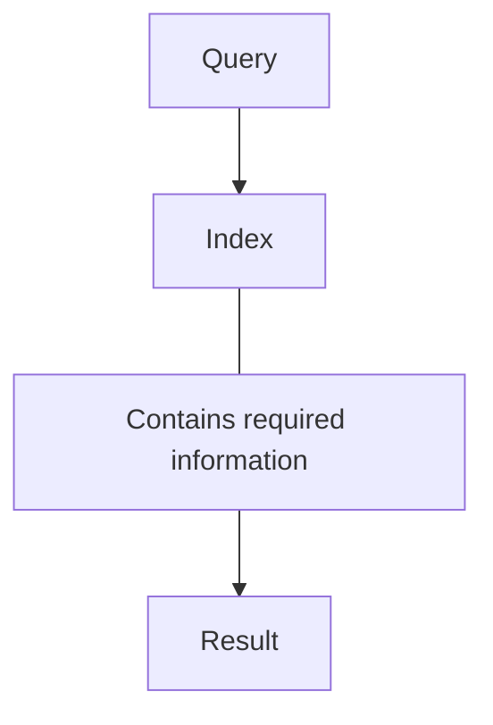

This can reduce additional table-data reads.

However, covering indexes also increase index size and maintenance cost.

---

# 32. Index Size Matters

Suppose a table contains:

```text
10 million rows
```

and you create several large indexes.

The database now has to maintain:

```text
Table
 +
Index A
 +
Index B
 +
Index C
 +
Index D
```

Large indexes consume:

* disk space,
* memory/cache capacity,
* maintenance work.

A large index may also affect write performance.

Therefore:

> **Indexes are data structures with real infrastructure cost.**

---

# 33. Indexes and Memory

Frequently accessed index pages may be kept in database memory/cache.

If the index is reasonably sized and frequently used:

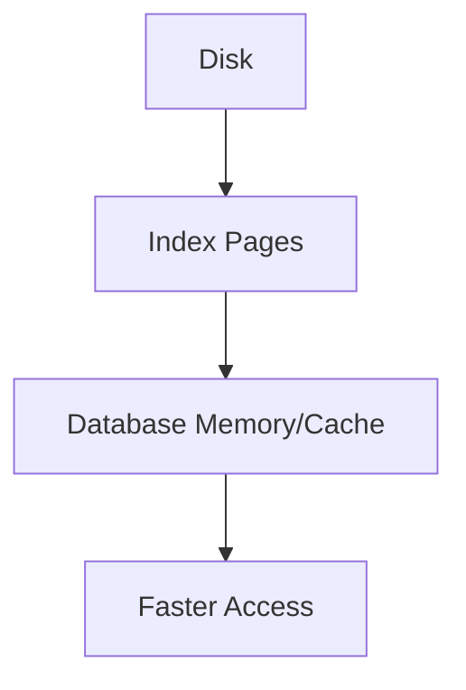

But if indexes become very large, keeping useful portions in memory becomes harder.

This is one reason unnecessary indexes are not free.

---

# 34. Index Fragmentation and Maintenance

Indexes are constantly affected by data changes.

Depending on the database engine and storage architecture, indexes may require maintenance or may develop internal inefficiencies over time.

Modern database engines handle much of this automatically.

For Systemly, the key concept is:

> **Indexes are maintained structures, not static files created once and forgotten.**

Operational details differ significantly between database systems.

---

# 35. Indexes Do Not Fix Every Query

Consider:

```sql
SELECT *
FROM orders
WHERE status = 'pending';
```

Suppose:

```text
90% of orders are pending
```

An index on `status` may not provide a dramatic benefit because the query still needs a huge portion of the table.

The optimizer may decide a scan is cheaper.

So:

```text
Index exists
      ≠
Query becomes fast
```

---

# 36. Indexes Do Not Fix Bad Query Design

Suppose the application performs:

```text
1,000 queries
```

and you add an index to make each query slightly faster.

You may still have a serious problem.

Sometimes the better solution is to reduce the number of queries.

For example:

```text
Before:
101 database queries

After:
2 database queries
```

This can be more significant than simply optimizing individual queries.

This connects directly to the **N+1 Query Problem** discussed in the previous chapter.

---

# 37. Indexes vs Caching

Indexes and caches solve different problems.

### Index

Helps the database **find data efficiently**.

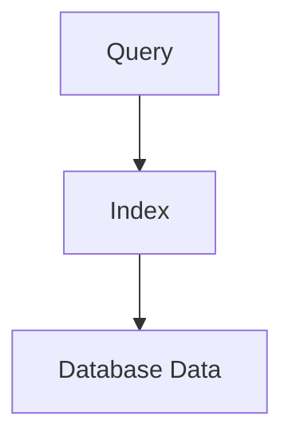

### Cache

Can avoid going to the database entirely for repeated data.

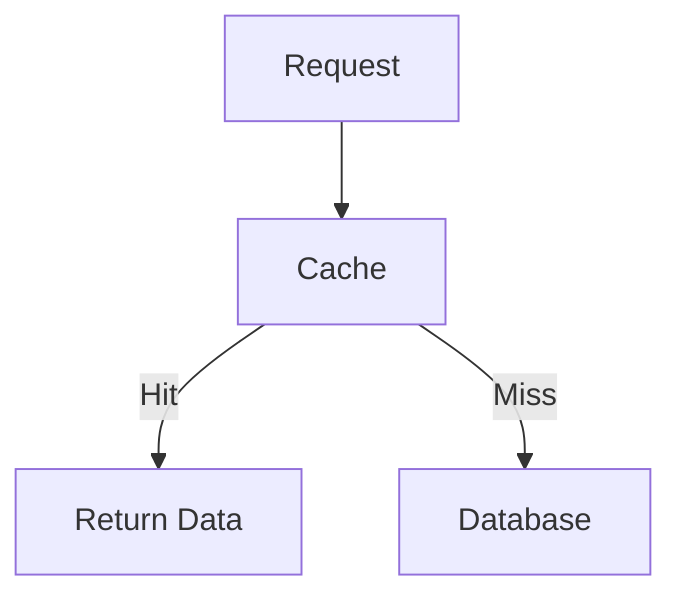

Therefore:

```text
Index ≠ Cache
```

A cache does not make an inefficient database query efficient.

An index does not eliminate repeated database work when caching would be appropriate.

Both can be useful.

---

# 38. Indexes and Transactions

Indexes participate in database operations and therefore interact with transaction behavior.

For example:

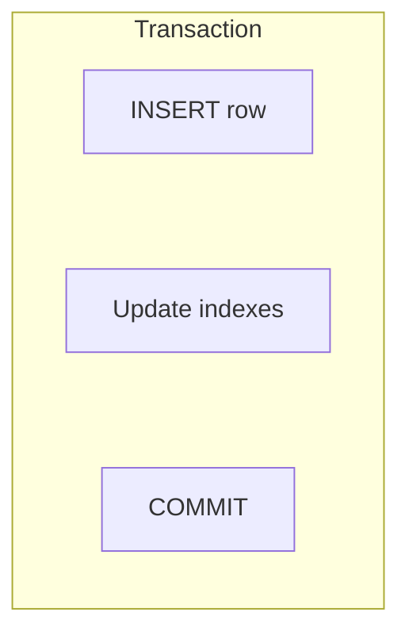

The database must maintain the correctness of both table data and index structures according to its transaction and concurrency rules.

You already learned about transactions in **01.13**.

The important system-design connection is:

> **Indexes improve access paths, but they are part of the database's transactional data-management work.**

---

# 39. Indexes and Write-Heavy Systems

Suppose an application performs:

```text
10,000 reads/sec
```

and:

```text
100 writes/sec
```

Additional indexes may be attractive because the workload is read-heavy.

Now imagine:

```text
100 reads/sec
10,000 writes/sec
```

Many indexes could become more expensive because every write may require additional index maintenance.

Therefore:

> **Index strategy should reflect workload shape.**

Read-heavy and write-heavy systems can have different indexing priorities.

---

# 40. A Simple Example: Orders

Suppose:

```text
orders

id
user_id
status
created_at
total
```

The application frequently asks:

```sql
SELECT *
FROM orders
WHERE user_id = 42
ORDER BY created_at DESC;
```

A possible index is:

```text
(user_id, created_at)
```

Conceptually:

```mermaid
flowchart TD
  accTitle: Using the orders index
  accDescr: The query for user_id = 42 goes to the relevant index section, reads in created_at order, and returns the orders.
  N0["Query"] --> N1["user_id = 42"] --> N2["Relevant index section"] --> N3["created_at order"] --> N4["Orders"]
```

The index is designed around the actual query pattern.

---

# 41. How to Think About Index Design

Use this sequence:

```mermaid
flowchart TD
  accTitle: How to think about index design
  accDescr: Start from the query pattern: what rows are searched, what columns are filtered, what ranges are used, what ordering is required, can an index support this access path, and what will the index cost?
  N0["Query Pattern"] --> N1["What rows are being searched?"] --> N2["What columns are filtered?"] --> N3["What ranges are used?"] --> N4["What ordering is required?"] --> N5["Can an index support this access path?"] --> N6["What will the index cost?"]
```

This is better than:

```text
Create indexes on every column
```

---

# 42. A Practical Index Investigation

Suppose:

```text
Product search = 900 ms
```

Do not immediately create an index.

Start with:

### Step 1 — Find the actual query

```sql
SELECT ...
FROM products
WHERE ...
```

### Step 2 — Inspect the execution plan

Ask:

```text
Is the database scanning the table?

Is it using an index?

How many rows are estimated?

How many rows are actually processed?

Where is the time going?
```

### Step 3 — Identify the access pattern

For example:

```text
WHERE category_id = ?
ORDER BY created_at DESC
```

### Step 4 — Consider an appropriate index

Potentially:

```text
(category_id, created_at)
```

### Step 5 — Measure again

```text
900 ms → 120 ms
```

### Step 6 — Check write impact

Make sure the new index does not create unacceptable costs elsewhere.

---

# 43. Execution Plans

An **execution plan** shows how the database intends to execute a query.

Conceptually:

```mermaid
flowchart TD
  accTitle: Execution plans
  accDescr: The optimizer turns the SQL query into an execution plan made of index scans, table scans, joins, sorts and other operations.
  S["SQL Query"] --> O["Optimizer"] --> P["Execution Plan"] --- G
  subgraph G[" "]
    direction TB
    G0["Index Scan"] ~~~ G1["Table Scan"] ~~~ G2["Join"] ~~~ G3["Sort"] ~~~ G4["Other Operations"]
  end
```

Tools such as:

```sql
EXPLAIN
```

or database-specific variants can help developers inspect these plans.

Execution plans will become especially important in **03.03 — Query Optimization**.

---

# 44. Common Indexing Mistakes

### Mistake 1: Index every column

More indexes mean more storage and write maintenance.

---

### Mistake 2: Assume every index will be used

The optimizer chooses the execution strategy.

---

### Mistake 3: Ignore query patterns

Indexes should support actual workload.

---

### Mistake 4: Ignore composite index order

```text
(user_id, status)
```

and:

```text
(status, user_id)
```

are not equivalent access paths.

---

### Mistake 5: Ignore writes

Every relevant write may require index maintenance.

---

### Mistake 6: Add an index without measuring

The index may provide little benefit.

---

### Mistake 7: Use an index to hide an N+1 problem

Reducing 101 queries to 2 may be more valuable than making 101 queries individually faster.

---

### Mistake 8: Ignore index size

Large indexes consume storage and memory resources.

---

### Mistake 9: Assume an index fixes all performance problems

The bottleneck may be elsewhere.

---

# 45. The System-Design View

At the application level:

```mermaid
flowchart TD
  accTitle: The system-design view
  accDescr: The application's database query uses the index to reach the data.
  N0["Application"] --> N1["Database Query"] --> N2["Index"] --> N3["Data"]
```

The index is an **access-path optimization**.

It does not change the application's business requirement.

It changes how the database can find the required data.

This is a useful system-design distinction:

> **Optimize the path to the data before changing the architecture around the data.**

---

# 46. Key Principle

> **An index is a trade-off: spend additional storage and write-maintenance work to make important data-access patterns faster.**

Do not ask:

> "Which columns should I index?"

Start with:

> **"Which important queries are slow, and what access path would help the database find their data efficiently?"**

---

# 47. Quick Reference

| Concept           | Meaning                                                                                            |
| ----------------- | -------------------------------------------------------------------------------------------------- |
| Index             | Additional data structure used to improve data access                                              |
| Table Scan        | Reading a large portion of a table to find matching rows                                           |
| Index Lookup      | Using an index to locate relevant data                                                             |
| Selectivity       | How effectively a condition narrows the result set                                                 |
| Composite Index   | Index containing multiple columns                                                                  |
| Covering Index    | Index capable of supplying the needed query data without additional table access in suitable cases |
| Unique Index      | Index that also enforces uniqueness                                                                |
| Query Optimizer   | Database component that chooses an execution strategy                                              |
| Execution Plan    | Planned operations used to execute a query                                                         |
| Index Maintenance | Work required to keep indexes synchronized with table changes                                      |
| Index Scan        | Reading relevant portions of an index                                                              |
| Range Query       | Query selecting values within a range                                                              |

---

# 48. Knowledge Check

### Question 1

What problem does an index primarily solve?

It helps the database find relevant data more efficiently without unnecessarily scanning the entire table.

---

### Question 2

Does an index make every query faster?

**No.**

The database may choose a table scan or another strategy when that is cheaper.

---

### Question 3

Why don't we index every column?

Indexes consume storage and require maintenance during writes.

---

### Question 4

Why does composite index order matter?

Because the index is organized according to its column order, which affects which query patterns can efficiently use it.

---

### Question 5

Is an index the same as a cache?

**No.**

An index helps the database locate data efficiently. A cache can avoid the database lookup altogether for cached data.

---

### Question 6

Can an index fix an N+1 query problem?

Not fundamentally.

It may make individual queries faster, but the larger problem may be the excessive number of queries.

---

### Question 7

What should you inspect before adding an index to a slow query?

At minimum:

```mermaid
flowchart TD
  accTitle: Key principle
  accDescr: The actual query, its execution plan, the access pattern, the data distribution, a potential index, and the measured result.
  N0["The actual query"] --> N1["Execution plan"] --> N2["Access pattern"] --> N3["Data distribution"] --> N4["Potential index"] --> N5["Measured result"]
```

---

# 50. Hands-On Lab — See an Index in Action

This lab lets you create a table, load data, run a query without an index, add an index, and compare the execution plans.

The goal is not to memorize SQL syntax.

The goal is to observe:

```mermaid
flowchart TD
  accTitle: What the lab shows
  accDescr: No index means more rows examined; adding an index gives a different execution plan and less work for the database.
  N0["No Index"] --> N1["More rows examined"] --> N2["Add Index"] --> N3["Different execution plan"] --> N4["Less work for the database"]
```

## Lab Setup

You can use PostgreSQL, MySQL, or another relational database.

The exact `EXPLAIN` output will differ between databases, but the concept is the same.

For PostgreSQL:

```sql
CREATE TABLE users (
    id BIGSERIAL PRIMARY KEY,
    name TEXT NOT NULL,
    email TEXT NOT NULL,
    country TEXT NOT NULL,
    created_at TIMESTAMP NOT NULL
);
```

---

## Step 1 — Insert Test Data

We want enough rows for the difference to become observable.

```sql
INSERT INTO users (name, email, country, created_at)
SELECT
    'User ' || n,
    'user' || n || '@example.com',
    CASE
        WHEN n % 4 = 0 THEN 'India'
        WHEN n % 4 = 1 THEN 'USA'
        WHEN n % 4 = 2 THEN 'UK'
        ELSE 'Japan'
    END,
    NOW() - (n || ' minutes')::interval
FROM generate_series(1, 1000000) AS n;
```

This creates approximately **1 million users**.

You can verify:

```sql
SELECT COUNT(*)
FROM users;
```

Expected result:

```text
1000000
```

---

## Step 2 — Run a Query Without an Email Index

Let's search for one user:

```sql
SELECT *
FROM users
WHERE email = 'user750000@example.com';
```

Now inspect the execution plan:

```sql
EXPLAIN ANALYZE
SELECT *
FROM users
WHERE email = 'user750000@example.com';
```

You may see something conceptually similar to:

```text
Seq Scan on users
    Filter: (email = 'user750000@example.com')
    Rows Removed by Filter: ...
```

`Seq Scan` means PostgreSQL is performing a **sequential scan** of the table.

Conceptually:

```mermaid
flowchart TD
  accTitle: A sequential scan
  accDescr: The database checks row after row in users until it finds the matching row.
  subgraph G["users"]
    direction TB
    G0["Check row"] ~~~ G1["Check row"] ~~~ G2["Check row"] ~~~ G3["Check row"] ~~~ G4["..."] ~~~ G5["Find matching row"]
  end
```

The database has no useful index on `email`, so it may need to inspect a large portion of the table.

---

## Step 3 — Create an Index

Now create an index:

```sql
CREATE INDEX idx_users_email
ON users(email);
```

The database must now build and store the new index.

Conceptually:

```mermaid
flowchart TD
  accTitle: A table and its index
  accDescr: The users table has its table data and an email index.
  U["users table"] --> T["Table Data"] & E["Email Index"]
```

---

## Step 4 — Run the Same Query Again

Run:

```sql
EXPLAIN ANALYZE
SELECT *
FROM users
WHERE email = 'user750000@example.com';
```

You may now see an execution plan involving an index, such as:

```text
Index Scan using idx_users_email on users
    Index Cond: (email = 'user750000@example.com')
```

The exact output depends on the PostgreSQL version, configuration, and data distribution.

Conceptually, the path has changed:

```mermaid
flowchart TD
  accTitle: Comparing the plans
  accDescr: Before: the query does a sequential scan of many rows to find the matching row. After: the query uses the email index to reach the matching row.
  subgraph B["Before:"]
    Q1["Query"] --> S["Sequential Scan"] --> M1["Many Rows"] --> R1["Matching Row"]
  end
  subgraph A["After:"]
    Q2["Query"] --> E["Email Index"] --> R2["Matching Row"]
  end
  B ~~~ A
```

---

## Step 5 — Compare the Plans

Look at the output from both queries.

Pay attention to:

* scan type,
* rows examined,
* execution time,
* whether the index is used,
* estimated cost,
* actual execution statistics.

Create your own small comparison:

| Before Index                    | After Index               |
| ------------------------------- | ------------------------- |
| Sequential scan may be used     | Index access may be used  |
| More table rows may be examined | Search can be narrowed    |
| More work for this lookup       | Less work may be required |

Do not focus only on the execution-time number.

Execution time can vary because of:

* database cache state,
* hardware,
* database configuration,
* concurrent activity,
* operating system state.

The **execution plan** is often more useful for understanding *why* the query changed.

---

## Step 6 — Try a Different Query

Now search by `country`:

```sql
EXPLAIN ANALYZE
SELECT *
FROM users
WHERE country = 'India';
```

Notice that there is no index on `country`.

Also notice something important:

```text
country = 'India'
```

matches a large portion of the table.

This is different from:

```text
email = 'user750000@example.com'
```

which identifies approximately one row.

This demonstrates why **selectivity matters**.

---

## Step 7 — Add a Country Index

Try:

```sql
CREATE INDEX idx_users_country
ON users(country);
```

Then:

```sql
EXPLAIN ANALYZE
SELECT *
FROM users
WHERE country = 'India';
```

You may find that the optimizer still chooses a sequential scan.

Why?

Because a large percentage of the table matches the condition.

The database optimizer may decide:

```mermaid
flowchart TD
  accTitle: When a scan wins
  accDescr: Using the index finds many rows and reads many table rows, with potential random access cost, versus a sequential scan that reads the table efficiently.
  U["Use Index"] --> F["Find many rows"] --> R["Read many table rows"] --> P["Potential random access cost"]
  P ~~~ V["vs."] ~~~ S["Sequential Scan"] --> E["Read table efficiently"]
```

The optimizer chooses the strategy it estimates to be cheaper.

This demonstrates an important lesson:

> **Creating an index does not guarantee that the database will use it.**

---

## Step 8 — Drop the Experimental Index

To keep the lab environment clean:

```sql
DROP INDEX idx_users_country;
```

You can keep:

```text
idx_users_email
```

because it supports the highly selective email lookup used in the lab.

---

## Step 9 — Experiment With a Composite Index

Now create:

```sql
CREATE INDEX idx_users_country_created
ON users(country, created_at);
```

Try:

```sql
EXPLAIN ANALYZE
SELECT *
FROM users
WHERE country = 'India'
ORDER BY created_at DESC;
```

This gives you a practical example of an index supporting both:

```text
Filtering
   +
Ordering
```

The exact execution plan depends on the database optimizer.

---

## Step 10 — Test the Column Order

Now compare the index:

```text
(country, created_at)
```

with a different index:

```text
(created_at, country)
```

The order matters because the index is organized according to its leading columns.

For example:

```text
(country, created_at)
```

naturally begins with:

```text
country
```

while:

```text
(created_at, country)
```

naturally begins with:

```text
created_at
```

This is why composite indexes should be designed around real query patterns.

---

## Step 11 — Observe the Write Cost

Indexes are not free.

Check the table size:

```sql
SELECT pg_size_pretty(pg_table_size('users'));
```

Then check the index size:

```sql
SELECT
    indexrelname,
    pg_size_pretty(pg_relation_size(indexrelid))
FROM pg_stat_user_indexes
WHERE relname = 'users';
```

You should see that the index consumes storage.

Now remember:

```mermaid
flowchart TD
  accTitle: Observe the write cost
  accDescr: An insert updates the table and the relevant indexes.
  H["INSERT"] --- A["Update table"] & B["Update relevant indexes"]
```

So adding indexes can improve reads while increasing write and storage costs.

---

# Lab Challenge

Try answering these before reading the answers.

### Challenge 1

Why might this query benefit from an email index?

```sql
SELECT *
FROM users
WHERE email = 'user500000@example.com';
```

### Challenge 2

Why might an index on `country` be less useful for:

```sql
WHERE country = 'India'
```

when a large percentage of users are from India?

### Challenge 3

Which index better matches this query?

```sql
SELECT *
FROM users
WHERE country = 'India'
ORDER BY created_at DESC;
```

A:

```text
(country, created_at)
```

or B:

```text
(created_at, country)
```

### Challenge 4

Does adding an index guarantee that the optimizer will use it?

### Challenge 5

Why does adding many indexes have a cost?

---

# Lab Answers

### Answer 1

An email lookup is usually highly selective: one email generally identifies a very small number of rows.

```mermaid
flowchart TD
  accTitle: A good index candidate
  accDescr: email gives a very small result set, so it is a good candidate for an index.
  N0["email"] --> N1["Very small result set"] --> N2["Good candidate for an index"]
```

### Answer 2

If a large percentage of rows match, using the index may not provide enough benefit compared with scanning the table.

The optimizer decides based on its cost estimates.

### Answer 3

For this particular query pattern:

```text
(country, created_at)
```

naturally matches the filtering column first and then the ordering column.

### Answer 4

**No.**

The optimizer may choose a sequential scan or another strategy if it estimates that to be cheaper.

### Answer 5

Indexes consume:

* storage,
* memory/cache capacity,
* write-maintenance work.

Every relevant insert, update, or delete may require index maintenance.

---

# What You Should Learn From This Lab

Do not memorize:

```text
CREATE INDEX ...
```

Memorize the investigation process:

```mermaid
flowchart TD
  accTitle: What you should learn from this lab
  accDescr: Slow query, EXPLAIN or EXPLAIN ANALYZE, understand the current plan, identify the access pattern, design an appropriate index, measure again, compare plan and cost, consider write and storage cost.
  N0["Slow Query"] --> N1["EXPLAIN / EXPLAIN ANALYZE"] --> N2["Understand Current Plan"] --> N3["Identify Access Pattern"] --> N4["Design Appropriate Index"] --> N5["Measure Again"] --> N6["Compare Plan + Cost"] --> N7["Consider Write/Storage Cost"]
```

The important skill is not **creating indexes**.

It is **knowing when an index is actually useful**.

---

# Remember

When a database query is slow:

```mermaid
flowchart TD
  accTitle: Remember
  accDescr: Slow query: measure, inspect the execution plan, understand the access pattern, consider an index, measure again, and check read and write trade-offs.
  N0["Slow Query"] --> N1["Measure"] --> N2["Inspect Execution Plan"] --> N3["Understand Access Pattern"] --> N4["Consider Index"] --> N5["Measure Again"] --> N6["Check Read + Write Trade-offs"]
```

An index is not magic.

It is a carefully chosen data structure that gives the database a better way to reach the data.

**Next: 03.03 — Query Optimization**
