# 03.03 — Query Optimization

## Learning Objectives

By the end of this chapter, you should be able to:

* Understand what **query optimization** means.
* Understand how a database turns SQL into an execution plan.
* Read the basic idea behind `EXPLAIN` and `EXPLAIN ANALYZE`.
* Recognize common causes of slow queries.
* Understand how filtering, joins, sorting, and pagination affect performance.
* Recognize the **N+1 query problem**.
* Understand why `SELECT *` can be unnecessarily expensive.
* Understand the basic idea of **sargability**.
* Understand why statistics and data distribution matter.
* Recognize how locking and long transactions can affect query performance.
* Optimize queries based on measurement rather than guesswork.

---

# 1. What Is Query Optimization?

Suppose an application runs:

```sql
SELECT *
FROM orders
WHERE user_id = 42;
```

The SQL expresses **what data you want**.

It does not necessarily tell the database exactly **how to find that data**.

The database must determine an efficient way to execute the request.

That process is closely related to **query optimization**.

> **Query optimization is the process of improving how a database executes a query while preserving the query's intended result.**

Conceptually:

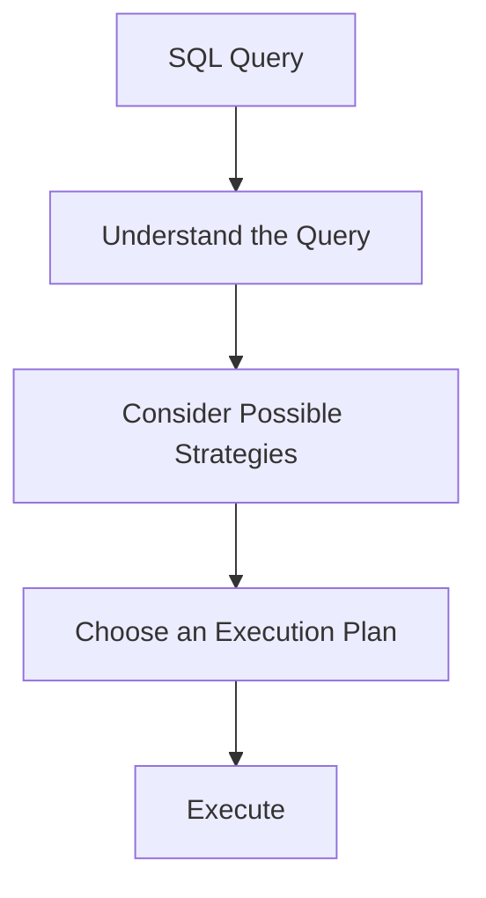

---

# 2. SQL Says What — The Plan Says How

Consider:

```sql
SELECT name
FROM users
WHERE email = 'arjun@example.com';
```

You have described:

> "Give me the name of the user whose email is this."

You have not explicitly said:

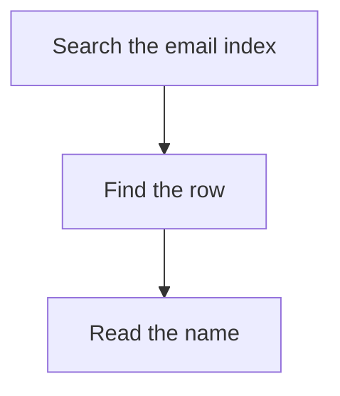

The database decides how to execute the request.

This is one of the most important ideas in relational databases:

> **Declarative SQL describes the desired result; the database optimizer chooses an execution strategy.**

---

# 3. The Query Lifecycle

At a high level:

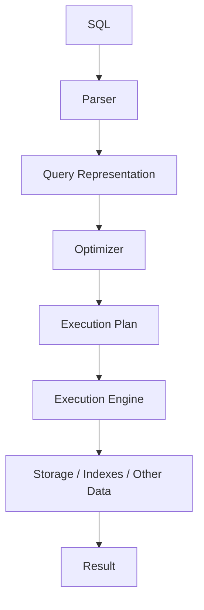

Let's simplify the roles.

### Parser

Checks the SQL structure and understands its syntax.

### Optimizer

Considers possible ways to execute the query.

### Execution Plan

Describes the operations the database intends to perform.

### Execution Engine

Actually performs those operations.

The exact internal architecture varies between database systems.

---

# 4. What Is an Execution Plan?

An **execution plan** is the database's chosen strategy for executing a query.

For example, conceptually:

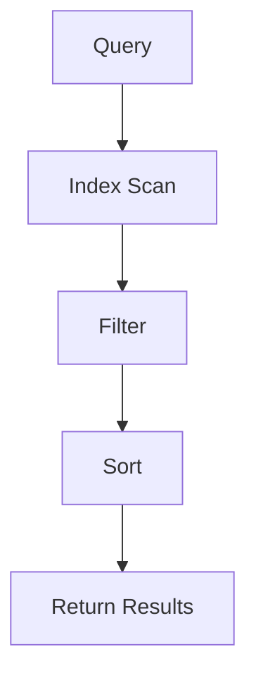

Another query might produce:

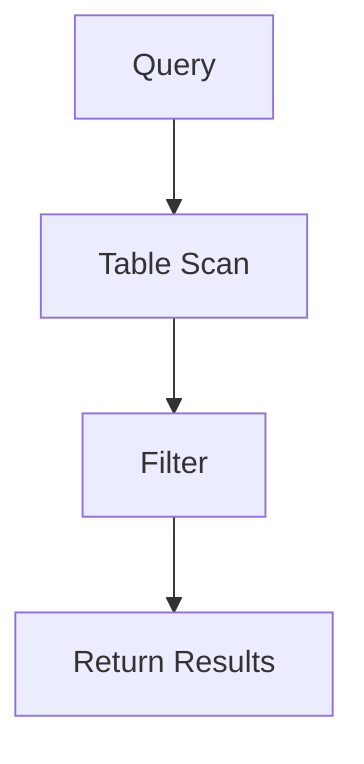

The database chooses a plan based on factors such as:

* available indexes,
* estimated number of rows,
* table statistics,
* filtering conditions,
* joins,
* sorting,
* grouping,
* data distribution,
* estimated resource cost.

---

# 5. Why Execution Plans Matter

Suppose someone tells you:

> "This query is slow."

That information alone is not enough.

You need to investigate.

A useful starting point is:

```sql
EXPLAIN
SELECT *
FROM orders
WHERE user_id = 42;
```

Many databases provide an `EXPLAIN`-style feature, although syntax and output differ.

Conceptually:

```text
EXPLAIN
   ↓
Show me how the database plans to execute this query.
```

---

# 6. EXPLAIN vs EXPLAIN ANALYZE

Two commonly encountered ideas are:

```sql
EXPLAIN
```

and:

```sql
EXPLAIN ANALYZE
```

### EXPLAIN

Generally shows the **planned execution strategy**.

It helps answer:

> "What does the optimizer intend to do?"

### EXPLAIN ANALYZE

In systems that support it, actually executes the query and reports information about what happened.

It helps answer:

> "What actually happened when this query ran?"

Conceptually:

```text
EXPLAIN
   ↓
Estimated / planned behavior


EXPLAIN ANALYZE
   ↓
Actual execution + measured behavior
```

Be careful:

> **An ANALYZE-style command may actually execute the query.**

That matters especially for `INSERT`, `UPDATE`, `DELETE`, or other operations with side effects.

Database-specific behavior and options vary.

---

# 6A. Reading an Execution Plan — A Step-by-Step Walkthrough

Execution plans can look intimidating at first.

Do not try to understand every field.

Start by answering five questions:

```text
1. What operations is the database performing?
2. How much data is each operation touching?
3. Is it using an index or scanning?
4. Is it sorting, joining, or doing other expensive work?
5. Where does most of the work happen?
```

---

## Step 1 — Start at the Bottom

Consider this simplified plan:

```text
Limit
  │
  └── Sort
        │
        └── Index Scan on orders
```

Read it from the **bottom upward**:

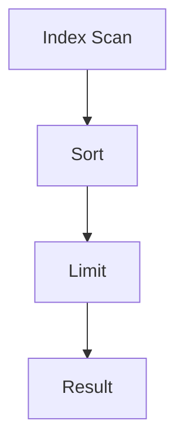

Think of the plan as a pipeline.

The lower operation produces data for the operation above it.

So:

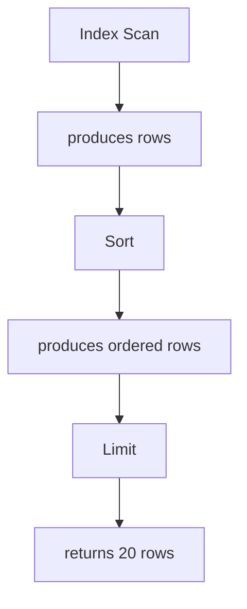

This is often the easiest way for a beginner to understand a plan.

> **Read the plan from the data source upward toward the final result.**

---

## Step 2 — Find Where the Data Comes From

Look for operations such as:

```text
Seq Scan
Index Scan
Index Only Scan
Table Scan
```

The exact names depend on the database.

For example:

```text
Seq Scan on orders
```

means the database is scanning the table sequentially.

Conceptually:

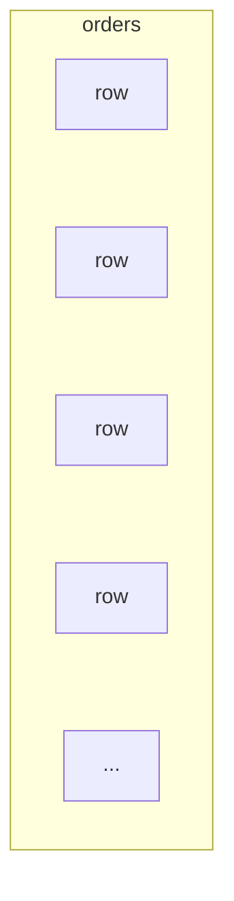

An index-based operation might look like:

```text
Index Scan using idx_orders_user_id on orders
```

Conceptually:

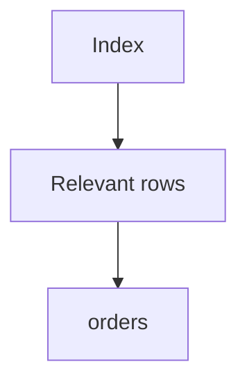

The first question is therefore:

> **How is the database getting the data?**

---

## Step 3 — Look at How Many Rows Are Being Processed

Suppose you see:

```text
Seq Scan on orders
  rows=1000000
```

while the query ultimately returns:

```text
20 rows
```

That should make you curious.

Conceptually:

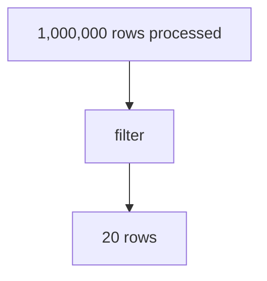

The database may be doing a lot of work to produce a small result.

That does not automatically mean the plan is bad, but it is an important investigation point.

---

## Step 4 — Look for Filtering

You may see something conceptually like:

```text
Seq Scan on orders
  Filter: (status = 'pending')
```

This tells you that the database is reading rows and applying the condition.

Think:

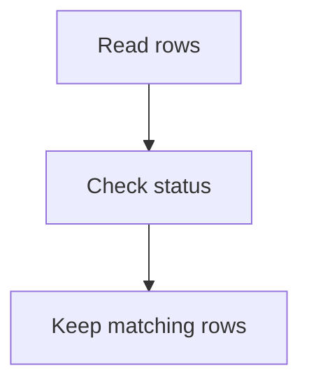

Now ask:

> **Could the database narrow the rows earlier?**

An appropriate index may help, depending on the data distribution and query.

---

## Step 5 — Look for Sorting

A plan may contain:

```text
Sort
  ↓
Index Scan
```

or:

```text
Sort
  ↓
Seq Scan
```

A `Sort` means the database is performing sorting work.

For example:

```sql
SELECT *
FROM orders
WHERE user_id = 42
ORDER BY created_at DESC;
```

Conceptually:

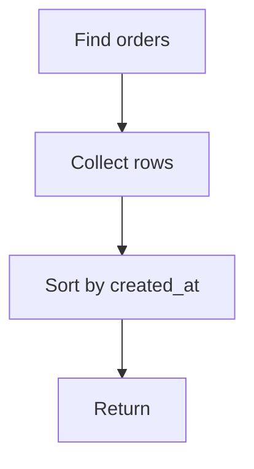

If the query only needs the newest 20 rows, ask:

> **Can the access path provide the required order so the database does less sorting?**

This is where an index such as:

```text
(user_id, created_at)
```

may become relevant.

---

## Step 6 — Look for LIMIT

Suppose the plan is:

```text
Limit
  ↓
Sort
  ↓
Index Scan
```

The application may only need:

```text
20 rows
```

but the database may still need to process many rows before it can determine the correct 20.

This is why you should look at the operations **below** `Limit`.

The important question is:

> **How much work happens before the database can return the limited result?**

---

## Step 7 — Understand Estimated vs Actual Rows

A plan may show information conceptually like:

```text
estimated rows: 100
actual rows:    50,000
```

That is important.

The optimizer expected:

```text
100 rows
```

but reality was:

```text
50,000 rows
```

Visualize it:

```text
Optimizer's expectation
        ↓
     100 rows

Actual execution
        ↓
   50,000 rows
```

A large mismatch can indicate that the optimizer's assumptions about the data were inaccurate.

This can affect which execution plan it chooses.

Do not immediately conclude that statistics are the problem.

First investigate:

* data distribution,
* filters,
* statistics,
* parameter values,
* query structure,
* database behavior.

---

## Step 8 — Understand Estimated vs Actual Time

You may also see timing information.

Conceptually:

```text
estimated cost
actual execution time
```

Do not treat the estimated cost as milliseconds.

For example:

```text
cost=0.00..500.00
actual time=2.1..45.7
```

The `cost` value is an internal optimizer estimate, not a direct measurement in milliseconds.

Actual timing tells you what happened during that execution.

So ask:

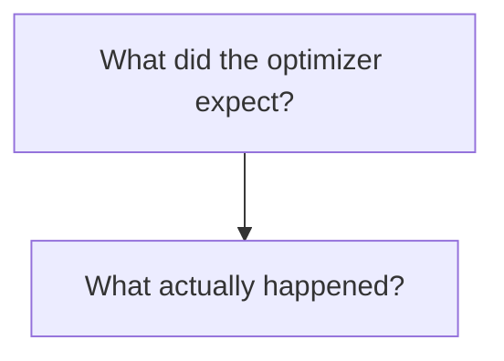

---

## Step 9 — Follow the Largest Work

Suppose a simplified plan looks like:

```text
Hash Join
├── Seq Scan on users
│      10,000 rows
│
└── Seq Scan on orders
       50,000,000 rows
```

You should immediately investigate the large side:

```text
orders
50 million rows
```

The goal is not to memorize that `Hash Join` is bad.

The goal is to identify:

> **Where is the database doing the most work?**

That is the same bottleneck-first thinking you learned in **03.01 — Where Does Performance Go?**

---

## 6A.1 — Understanding Parent and Child Nodes

An execution plan is usually shown as a **tree**.

For example:

```text
Limit
└── Sort
    └── Index Scan
```

The important rule is:

> **A parent node consumes the output produced by its child node.**

So in this example:

```text
Limit          ← parent
  │
  ▼
Sort           ← child of Limit
  │
  ▼
Index Scan     ← child of Sort
```

The data flows **from the child toward the parent**:

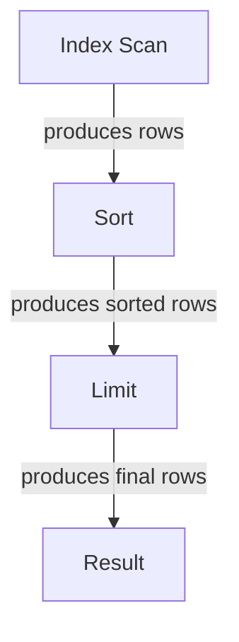

### What "parent" means

`Limit` is the **parent** of `Sort` because `Limit` consumes the rows produced by `Sort`.

### What "child" means

`Sort` is the **child** of `Limit` because `Sort` produces the input that `Limit` consumes.

So:

```text
Limit
└── Sort
    └── Index Scan
```

means:

```text
Limit
  └─ consumes output from ─ Sort
                              └─ consumes output from ─ Index Scan
```

---

## How to Read the Tree

There are two useful ways to look at a plan.

### 1. Tree relationship

Read **parent → child** to understand the structure:

```text
Limit
└── Sort
    └── Index Scan
```

This tells you:

```text
Limit
  has a child called Sort
      which has a child called Index Scan
```

### 2. Execution/data flow

Read **child → parent** to understand how rows move through the plan:


This distinction is important:

> **Parent/child describes the tree relationship. Data flows from child nodes toward their parent nodes.**

---

## A More Complex Example

Consider:

```text
Hash Join
├── Seq Scan on users
└── Index Scan on orders
```

Here:

```text
Hash Join
├── Seq Scan on users
└── Index Scan on orders
```

means:

* `Hash Join` is the **parent**.
* `Seq Scan on users` is a **child** of `Hash Join`.
* `Index Scan on orders` is another **child** of `Hash Join`.

Conceptually:

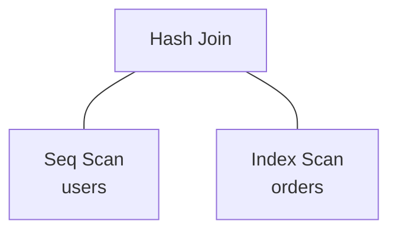

The two child operations produce data that the parent `Hash Join` uses.

Conceptually:

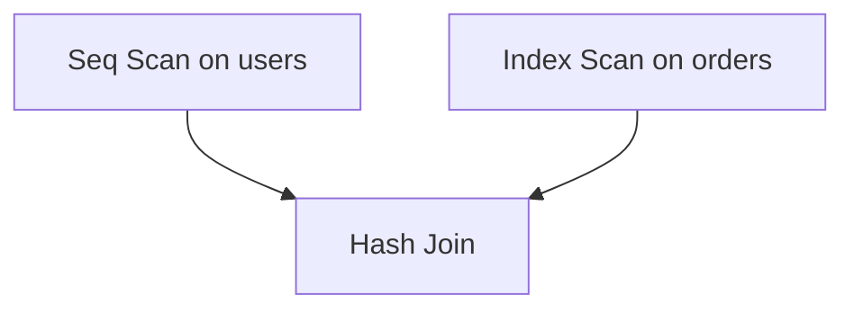

The exact internal execution behavior of a database join can be more complicated, but this parent/child relationship is the useful starting point.

---

## The Simple Rule to Remember

When looking at an execution-plan tree:

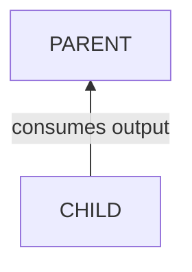

So:

```text
Parent
└── Child
```

means:

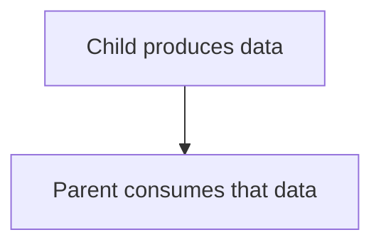

For a complete plan:

```text
Limit
└── Sort
    └── Index Scan
```

think:

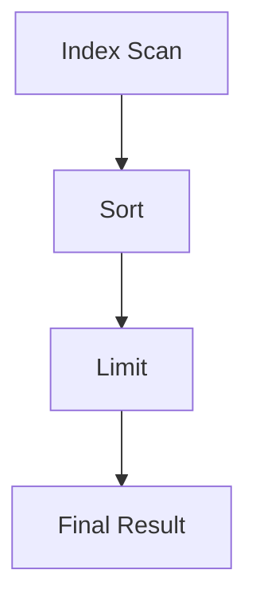

**Tree relationship:** parent → child
**Data flow:** child → parent

That distinction will make the rest of execution-plan reading much easier.

---

# 6B. A Complete Mini Walkthrough

Let's use a realistic query:

```sql
SELECT id, total, created_at
FROM orders
WHERE user_id = 42
ORDER BY created_at DESC
LIMIT 20;
```

Imagine the database produces this simplified plan:

```text
Limit
  └── Sort
        └── Seq Scan on orders
```

Now read it step by step.

### 1. Data source

```text
Seq Scan on orders
```

The database is scanning the orders table.

### 2. Filtering

The query contains:

```text
user_id = 42
```

So the database must identify rows belonging to that user.

### 3. Sorting

After finding the relevant rows:

```text
Sort
```

means the database is sorting them by:

```text
created_at DESC
```

### 4. Limiting

Finally:

```text
Limit
```

returns only:

```text
20 rows
```

So the conceptual flow is:

```mermaid
flowchart TD
  accTitle: What the slow plan does
  accDescr: orders table, then scan rows, then filter user_id = 42, then sort by created_at DESC, then keep 20, then return result.
  N0["orders table"] --> N1["scan rows"] --> N2["filter user_id = 42"] --> N3["sort by created_at DESC"] --> N4["keep 20"] --> N5["return result"]
```

Now ask:

> **Can we give the database a better access path?**

Potentially:

```text
(user_id, created_at)
```

After creating an appropriate index, the plan might conceptually become:

```text
Limit
  └── Index Scan
        using idx_orders_user_created
```

Now the flow could be closer to:

```mermaid
flowchart TD
  accTitle: What the improved plan does
  accDescr: Index, then user_id = 42, then created_at already ordered, then take first 20, then return.
  N0["Index"] --> N1["user_id = 42"] --> N2["created_at already ordered"] --> N3["take first 20"] --> N4["return"]
```

The exact plan may differ.

The important thing is that the index potentially allows the database to do **less work**.

---

# 6C. The Five-Question Plan Reading Method

When you first see an execution plan, use this checklist:

### 1. Where does the data come from?

```text
Seq Scan?
Index Scan?
Table Scan?
```

### 2. How many rows are being processed?

```text
Estimated rows?
Actual rows?
```

### 3. What filtering happens?

```text
WHERE?
Filter?
Index condition?
```

### 4. What expensive operations happen afterward?

Look for:

```text
Sort
Join
Aggregate
Large scan
```

### 5. Where is the bottleneck?

Ask:

```text
Which operation is doing the most work?
```

Do not start by memorizing every plan keyword.

Start by following the **data flow**.

---

# 6D. A Beginner's Plan-Reading Mental Model

Think of every plan as:

```mermaid
flowchart TD
  accTitle: A plan-reading mental model
  accDescr: WHERE DOES DATA COME FROM?, then HOW MUCH DATA?, then HOW IS IT FILTERED?, then IS IT JOINED?, then IS IT SORTED/GROUPED?, then HOW MUCH DATA IS FINALLY RETURNED?.
  N0["WHERE DOES DATA COME FROM?"] --> N1["HOW MUCH DATA?"] --> N2["HOW IS IT FILTERED?"] --> N3["IS IT JOINED?"] --> N4["IS IT SORTED/GROUPED?"] --> N5["HOW MUCH DATA IS FINALLY RETURNED?"]
```

For example:

```mermaid
flowchart TD
  accTitle: Follow the rows
  accDescr: Table Scan, then 1,000,000 rows, then Filter, then 100,000 rows, then Sort, then 20 rows, then Application.
  N0["Table Scan"] --> N1["1,000,000 rows"] --> N2["Filter"] --> N3["100,000 rows"] --> N4["Sort"] --> N5["20 rows"] --> N6["Application"]
```

Your job is to find the places where unnecessary work can be removed.

---

# 6E. Do Not Judge a Plan by One Keyword

A common beginner mistake is:

> "I see `Seq Scan`, so the query is bad."

Not necessarily.

A sequential scan can be the correct plan when:

* the table is small,
* the query needs a large percentage of the table,
* an index would not provide enough benefit,
* sequential access is cheaper.

Similarly:

> "I see `Index Scan`, so the query must be fast."

Not necessarily.

An index can still lead to:

* many row lookups,
* expensive sorting,
* large joins,
* excessive result processing,
* other bottlenecks.

Always evaluate the **whole plan**.

---

# 6G. The Plan-Reading Rule

When reading an execution plan, remember:

> **Don't ask "Does this plan contain an index?" Ask "How much work is the database doing to produce the result?"**

That question scales much better from beginner queries to large distributed database workloads.

---

# 7. Estimated vs Actual Rows

Execution plans often contain concepts such as:

```text
Estimated Rows
Actual Rows
```

Suppose the optimizer expects:

```text
Estimated: 100 rows
```

but execution produces:

```text
Actual: 500,000 rows
```

That is a major difference.

Conceptually:

```text
Optimizer expects
      ↓
100 rows

Reality
      ↓
500,000 rows
```

The optimizer may therefore make a poor decision.

This is one reason **statistics and data distribution** matter.

---

# 8. A Simple Example

Consider:

```sql
SELECT *
FROM orders
WHERE user_id = 42;
```

Suppose there is an index:

```text
INDEX(user_id)
```

A possible plan might be:

```mermaid
flowchart TD
  accTitle: With an index
  accDescr: Index Scan, then Matching rows, then Return result.
  N0["Index Scan"] --> N1["Matching rows"] --> N2["Return result"]
```

Without a useful index, the plan might instead be:

```mermaid
flowchart TD
  accTitle: Without an index
  accDescr: Sequential/Table Scan, then Check many rows, then Keep matching rows.
  N0["Sequential/Table Scan"] --> N1["Check many rows"] --> N2["Keep matching rows"]
```

Which plan is better depends on the actual data and query.

The important skill is learning to **inspect the plan rather than assume**.

---

# 9. Filtering Early

Suppose a table contains:

```text
10 million orders
```

You need:

```text
Orders from user 42
```

A good query expresses the restriction clearly:

```sql
SELECT id, total, created_at
FROM orders
WHERE user_id = 42;
```

Instead of retrieving everything and filtering in application code:

```mermaid
flowchart TD
  accTitle: Filtering in the application
  accDescr: Database, then 10 million rows, then Application, then Filter.
  N0["Database"] --> N1["10 million rows"] --> N2["Application"] --> N3["Filter"]
```

Prefer, when appropriate:

```mermaid
flowchart TD
  accTitle: Filtering in the database
  accDescr: Database, then Filter, then Small result, then Application.
  N0["Database"] --> N1["Filter"] --> N2["Small result"] --> N3["Application"]
```

The general principle is:

> **Avoid moving data that you do not need.**

---

# 10. Select Only What You Need

Consider:

```sql
SELECT *
FROM users
WHERE id = 42;
```

Maybe the application only needs:

```text
name
email
```

Then:

```sql
SELECT name, email
FROM users
WHERE id = 42;
```

can be preferable.

Why?

`SELECT *` may retrieve:

* unnecessary columns,
* large text fields,
* JSON data,
* binary data,
* other values the application never uses.

This can increase:

* database work,
* memory usage,
* network transfer,
* application processing.

Therefore:

> **Ask the database for the data the application actually needs.**

`SELECT *` is not automatically bad. It can be perfectly reasonable in some contexts. The problem is using it without considering what it retrieves.

---

# 11. Filtering in the Database vs Application

Imagine:

```text
1,000,000 orders
```

and you need:

```text
20 orders
```

Poor pattern:

```mermaid
flowchart TD
  accTitle: Filtering late
  accDescr: Database, then 1,000,000 rows, then Network, then Application, then Filter to 20.
  N0["Database"] --> N1["1,000,000 rows"] --> N2["Network"] --> N3["Application"] --> N4["Filter to 20"]
```

Better:

```mermaid
flowchart TD
  accTitle: Filtering early
  accDescr: Database, then WHERE condition, then 20 rows, then Network, then Application.
  N0["Database"] --> N1["WHERE condition"] --> N2["20 rows"] --> N3["Network"] --> N4["Application"]
```

This reduces unnecessary data movement.

---

# 12. Sargability — A Useful Concept

**Sargability** is a term used to describe whether a query condition can effectively use an available index or access path.

Consider:

```sql
WHERE email = 'arjun@example.com'
```

Suppose:

```text
INDEX(email)
```

exists.

The database has a straightforward condition involving the indexed column.

Now consider:

```sql
WHERE LOWER(email) = 'arjun@example.com'
```

The query applies a function to the column.

Depending on the database and index design, the ordinary:

```text
INDEX(email)
```

may not be usable in the same way.

Conceptually:

```mermaid
flowchart TD
  accTitle: A sargable condition
  accDescr: Indexed Column, then Direct comparison, then Good candidate for index access.
  N0["Indexed Column"] --> N1["Direct comparison"] --> N2["Good candidate for index access"]
```

versus:

```mermaid
flowchart TD
  accTitle: A condition with a function
  accDescr: Indexed Column, then Apply function, then Compare result, then May complicate index usage.
  N0["Indexed Column"] --> N1["Apply function"] --> N2["Compare result"] --> N3["May complicate index usage"]
```

Possible solutions in some databases include:

* expression/functional indexes,
* generated columns,
* changing the query,
* storing normalized values.

The exact solution depends on the database system.

For Systemly, remember the principle:

> **Write predicates in ways that allow the database to use efficient access paths when possible.**

---

# 13. Avoid Unnecessary Data Transformations

Consider:

```sql
WHERE CAST(user_id AS TEXT) = '42'
```

when `user_id` is already numeric.

Or:

```sql
WHERE DATE(created_at) = '2026-09-29'
```

instead of a range.

A range-based query might be:

```sql
WHERE created_at >= '2026-09-29 00:00:00'
  AND created_at <  '2026-09-30 00:00:00'
```

The second form can provide a more direct range condition on `created_at`.

The exact behavior depends on the database and data types, but the general idea is:

```text
Prefer conditions that preserve useful access paths.
```

---

# 14. Avoid Returning Unnecessary Rows

Suppose:

```sql
SELECT *
FROM products
WHERE category_id = 10;
```

returns:

```text
500,000 rows
```

but the page only displays:

```text
20 products
```

You may need:

```sql
SELECT id, name, price
FROM products
WHERE category_id = 10
ORDER BY created_at DESC
LIMIT 20;
```

Now the database has a much clearer requirement:

```mermaid
flowchart TD
  accTitle: Returning only what is needed
  accDescr: Filter, then Order, then Return only 20.
  N0["Filter"] --> N1["Order"] --> N2["Return only 20"]
```

This can reduce unnecessary work and data transfer.

---

# 15. ORDER BY Can Cost Work

Consider:

```sql
SELECT *
FROM orders
WHERE user_id = 42
ORDER BY created_at DESC;
```

The database may need to sort the matching rows.

Conceptually:

```mermaid
flowchart TD
  accTitle: ORDER BY can cost work
  accDescr: Find rows, then Collect rows, then Sort rows, then Return.
  N0["Find rows"] --> N1["Collect rows"] --> N2["Sort rows"] --> N3["Return"]
```

Sorting can become expensive when the result set is large.

An appropriate index may sometimes help:

```text
(user_id, created_at)
```

because the index can provide data in a useful order.

But again:

> **Inspect the execution plan rather than assuming the index will eliminate the sort.**

---

# 16. ORDER BY + LIMIT

Consider:

```sql
SELECT id, total, created_at
FROM orders
WHERE user_id = 42
ORDER BY created_at DESC
LIMIT 20;
```

The application only wants the newest 20 orders.

If the database can use an appropriate access path, it may avoid processing a huge number of older rows.

Conceptually:

```mermaid
flowchart TD
  accTitle: ORDER BY with LIMIT and an index
  accDescr: user_id = 42, then Already ordered by created_at, then Take first 20, then Stop.
  N0["user_id = 42"] --> N1["Already ordered by created_at"] --> N2["Take first 20"] --> N3["Stop"]
```

This is one reason **filtering, ordering, indexes, and limits must be considered together**.

---

# 17. JOINs

Real applications rarely use only one table.

Consider:

```text
users
orders
```

with:

```text
users.id
orders.user_id
```

A query might be:

```sql
SELECT
    users.name,
    orders.total
FROM users
JOIN orders
    ON orders.user_id = users.id
WHERE users.id = 42;
```

The database must determine how to join the tables.

Conceptually:

```mermaid
flowchart TD
  accTitle: A join
  accDescr: users joins on user.id and orders joins on orders.user_id.
  U["users"] -->|"user.id"| J["JOIN"]
  O["orders"] -->|"orders.user_id"| J
```

The optimizer may choose different join strategies depending on:

* table sizes,
* indexes,
* filtering,
* statistics,
* expected result size.

---

# 18. Join Order Matters

Suppose:

```text
Table A → 10 million rows
Table B → 10 million rows
```

but your filter reduces Table A to:

```text
20 rows
```

It can be advantageous to reduce the data early before performing expensive work.

Conceptually:

```mermaid
flowchart TD
  accTitle: Filter before joining
  accDescr: 10 million A, then Filter, then 20 A, then Join, then Result.
  N0["10 million A"] --> N1["Filter"] --> N2["20 A"] --> N3["Join"] --> N4["Result"]
```

rather than unnecessarily carrying millions of rows into later operations.

Modern optimizers can reorder joins and operations when appropriate.

The important lesson is:

> **The optimizer tries to reduce unnecessary work throughout the query plan.**

---

# 19. N+1 Queries

One of the most common application-level database performance problems is the **N+1 query problem**.

Suppose you retrieve:

```text
100 users
```

with one query:

```sql
SELECT *
FROM users
LIMIT 100;
```

Then your application runs another query for each user:

```sql
SELECT *
FROM orders
WHERE user_id = 1;
```

```sql
SELECT *
FROM orders
WHERE user_id = 2;
```

and so on.

You now have:

```text
1 query
+
100 queries
=
101 queries
```

Conceptually:

```mermaid
flowchart LR
  accTitle: The N+1 pattern
  accDescr: Get users, then get orders for user 1, user 2, user 3 and so on up to user 100.
  H["Get Users"] --- I0["Get Orders for User 1"] & I1["Get Orders for User 2"] & I2["Get Orders for User 3"] & I3["..."] & I4["Get Orders for User 100"]
```

---

# 20. Reducing N+1

Instead of repeatedly querying the database, you might retrieve the required data using a suitable join or batch query.

For example:

```sql
SELECT
    users.id,
    users.name,
    orders.id AS order_id,
    orders.total
FROM users
LEFT JOIN orders
    ON orders.user_id = users.id
WHERE users.id IN (1, 2, 3, 4, 5);
```

Or use a batch query:

```sql
SELECT *
FROM orders
WHERE user_id IN (1, 2, 3, 4, 5);
```

The exact solution depends on what the application needs.

The key principle:

> **Reducing the number of database round trips can be more valuable than optimizing each individual query.**

---

# 21. Query Count Matters

Suppose:

```text
Query A = 5 ms
```

If the application executes it:

```text
1 time
```

that is:

```text
5 ms
```

But if it executes:

```text
1,000 times
```

you now have potentially:

```text
5,000 ms
```

of database work, ignoring concurrency and other effects.

Therefore, database performance is not only about:

```text
"How fast is this query?"
```

It is also:

```text
"How many times do we execute it?"
```

---

# 22. Subqueries, JOINs, and CTEs

You may encounter different ways to express a query:

```text
JOIN
Subquery
CTE
```

For example:

```sql
SELECT *
FROM users
WHERE id IN (
    SELECT user_id
    FROM orders
);
```

versus:

```sql
SELECT DISTINCT users.*
FROM users
JOIN orders
    ON orders.user_id = users.id;
```

Or a CTE:

```sql
WITH active_users AS (
    SELECT *
    FROM users
    WHERE status = 'active'
)
SELECT *
FROM active_users;
```

Do not memorize:

```text
JOIN = always faster
CTE = always slower
Subquery = always bad
```

Those are unreliable rules.

Modern database optimizers can transform queries in different ways.

The actual execution plan and database engine matter.

---

# 23. The Right Question

Instead of asking:

> "Which syntax is fastest?"

ask:

> "What execution plan does my database choose for this workload?"

Then inspect:

```text
EXPLAIN
EXPLAIN ANALYZE
```

where appropriate.

This keeps optimization evidence-based.

---

# 24. Aggregation and GROUP BY

Consider:

```sql
SELECT
    user_id,
    COUNT(*)
FROM orders
GROUP BY user_id;
```

The database must process the relevant rows and group them.

Conceptually:

```mermaid
flowchart TD
  accTitle: Aggregation
  accDescr: Orders, then Read Rows, then Group by user_id, then Count, then Return Results.
  N0["Orders"] --> N1["Read Rows"] --> N2["Group by user_id"] --> N3["Count"] --> N4["Return Results"]
```

Aggregation can become expensive when processing large datasets.

Potential factors include:

* number of rows,
* grouping cardinality,
* filtering,
* indexes,
* memory,
* sorting or hashing,
* concurrent workload.

The correct optimization depends on the execution plan.

---

# 25. Filter Before Expensive Work

Suppose you need:

```text
Count orders for active users.
```

You generally want the database to avoid processing irrelevant data where possible.

Conceptually:

```mermaid
flowchart TD
  accTitle: Filter before expensive work
  accDescr: All Data, then Filter Relevant Rows, then Group / Aggregate, then Result.
  N0["All Data"] --> N1["Filter Relevant Rows"] --> N2["Group / Aggregate"] --> N3["Result"]
```

rather than:

```mermaid
flowchart TD
  accTitle: Expensive work before filtering
  accDescr: All Data, then Expensive Processing, then Filter.
  N0["All Data"] --> N1["Expensive Processing"] --> N2["Filter"]
```

The optimizer may automatically rearrange operations where it is safe to do so.

Your job is to understand the query and inspect the resulting plan.

---

# 26. Pagination

Suppose an application displays:

```text
20 products per page
```

A common approach is:

```sql
SELECT *
FROM products
ORDER BY id
LIMIT 20 OFFSET 0;
```

Next page:

```sql
LIMIT 20 OFFSET 20;
```

Then:

```sql
LIMIT 20 OFFSET 40;
```

This is easy to understand.

But large offsets can become increasingly expensive.

---

# 27. The Large OFFSET Problem

Imagine:

```sql
LIMIT 20 OFFSET 900000;
```

Conceptually, the database may need to work through a large number of rows before reaching the requested page.

```text
Rows
──────────────────────────────────
1 ... 900,000 ... 900,020
          ↑
        OFFSET
```

The application only wants:

```text
20 rows
```

but the database may still need to process or skip many preceding rows.

---

# 28. Keyset / Cursor Pagination

An alternative is **keyset pagination**, also called cursor-based pagination in many systems.

Suppose the previous page ended at:

```text
id = 900000
```

Instead of:

```sql
LIMIT 20 OFFSET 900000;
```

you can conceptually request:

```sql
SELECT *
FROM products
WHERE id > 900000
ORDER BY id
LIMIT 20;
```

Now the database can use the key as the starting point.

Conceptually:

```mermaid
flowchart TD
  accTitle: Keyset pagination
  accDescr: Previous Page, then Last Seen ID = 900000, then Find IDs > 900000, then Return next 20.
  N0["Previous Page"] --> N1["Last Seen ID = 900000"] --> N2["Find IDs > 900000"] --> N3["Return next 20"]
```

This can scale better for deep pagination when the ordering key and query pattern are appropriate.

---

# 29. Keyset Pagination Trade-Off

Keyset pagination is not universally better.

It can be more complicated when users need:

```text
Jump directly to page 57
```

or arbitrary page navigation.

It is particularly useful for patterns such as:

```text
Load more
Infinite scrolling
Next page
Activity feeds
Large ordered datasets
```

Again:

> **Choose the pagination strategy based on the product requirement and data access pattern.**

---

# 30. Data Volume Changes Query Performance

A query that is fast with:

```text
1,000 rows
```

may behave very differently with:

```text
100 million rows
```

This is why system design asks:

```text
How much data?
How quickly is it growing?
How often is it queried?
```

Query optimization is not independent of scale.

```mermaid
flowchart TD
  accTitle: Data volume changes performance
  accDescr: Data Volume, then Rows Processed, then Resource Usage, then Latency.
  N0["Data Volume"] --> N1["Rows Processed"] --> N2["Resource Usage"] --> N3["Latency"]
```

---

# 31. Cardinality

**Cardinality** describes how many distinct values or, depending on context, how many rows are associated with a particular operation.

For example:

```text
country
```

might have:

```text
200 distinct values
```

while:

```text
email
```

might have:

```text
10 million distinct values
```

The distribution of values matters to the optimizer.

For example:

```text
status = 'active'
```

might match:

```text
90% of rows
```

while:

```text
email = 'x@example.com'
```

might match:

```text
1 row
```

The optimizer needs information about this distribution to make good decisions.

---

# 32. Statistics

Databases maintain statistics about tables and columns.

Conceptually:

```mermaid
flowchart TD
  accTitle: Statistics
  accDescr: The table's statistics hold estimated row counts, value distribution and other optimizer information, which feed the query optimizer.
  T["Table"] --> S["Statistics"] --- G
  subgraph G[" "]
    direction TB
    G0["Estimated row counts"] ~~~ G1["Value distribution"] ~~~ G2["Other optimizer information"]
  end
  G --> O["Query Optimizer"]
```

If statistics become inaccurate or stale, the optimizer may estimate incorrectly.

For example:

```text
Expected: 100 rows
Actual:   1,000,000 rows
```

That can lead to a poor execution strategy.

Statistics maintenance is database-specific, so operational commands differ between systems.

---

# 33. Query Optimization and Locks

Not all database slowness comes from inefficient data access.

A query can also be waiting for another transaction.

For example:

```mermaid
flowchart TD
  accTitle: Locks
  accDescr: Transaction A locks data and is still running. Transaction B wants the same data, and waits.
  A["Transaction A"] --- L["Locks data"] & R["Still running"]
  L ~~~ B["Transaction B"] --- D["Wants same data"] --> W["WAIT"]
```

The SQL itself may be efficient.

The problem is **contention**.

Therefore:

> **When a query is slow, determine whether it is doing work or waiting.**

This connects directly to the performance concepts from **03.01**.

---

# 34. Long Transactions

Suppose a transaction stays open for a long time:

```mermaid
flowchart TD
  accTitle: A long transaction
  accDescr: Between BEGIN and COMMIT: a query, application work, a network call and more work.
  subgraph G["BEGIN"]
    direction TB
    G0["Query"] ~~~ G1["Application work"] ~~~ G2["Network call"] ~~~ G3["More work"] ~~~ G4["COMMIT"]
  end
```

Keeping transactions open unnecessarily can increase:

* lock contention,
* resource usage,
* waiting,
* impact on other transactions.

A good general principle is:

> **Keep transactions only as long as necessary to maintain the required consistency.**

The exact consequences depend on the database's transaction and isolation model.

---

# 35. Query Timeout

You learned about timeouts in **02.10**.

That concept applies directly to database queries.

Suppose:

```mermaid
flowchart TD
  accTitle: A query timeout
  accDescr: Application, then Database Query, then Waiting....
  N0["Application"] --> N1["Database Query"] --> N2["Waiting..."]
```

Without a sensible timeout, resources can remain occupied for too long.

A timeout can protect the application from waiting indefinitely.

But remember:

> **A database timeout does not necessarily mean the database did nothing.**

The operation may have:

* completed,
* failed,
* remained in progress,
* or produced an outcome unknown to the caller.

This is especially important for write operations.

---

# 36. Query Optimization and Retries

Now connect this to **02.11 — Retries**.

Suppose:

```mermaid
flowchart TD
  accTitle: Retries on a slow query
  accDescr: Slow Query, then Timeout, then Application Retries, then Another Query, then Database More Loaded, then Slower Queries, then More Timeouts.
  N0["Slow Query"] --> N1["Timeout"] --> N2["Application Retries"] --> N3["Another Query"] --> N4["Database More Loaded"] --> N5["Slower Queries"] --> N6["More Timeouts"]
```

You can accidentally create a feedback loop.

```mermaid
flowchart TD
  accTitle: A retry feedback loop
  accDescr: Slow Database, then Timeouts, then Retries, then More Load, then Even Slower Database.
  N0["Slow Database"] --> N1["Timeouts"] --> N2["Retries"] --> N3["More Load"] --> N4["Even Slower Database"]
```

This is why query optimization cannot be considered in isolation.

It is part of the larger system.

---

# 37. Query Optimization and Connection Limits

Suppose every slow query occupies a database connection for:

```text
2 seconds
```

and you have:

```text
100 database connections
```

Long-running queries can consume the available connection capacity.

Conceptually:

```mermaid
flowchart TD
  accTitle: Slow queries and connection limits
  accDescr: Slow Queries, then Connections remain occupied, then Pool fills, then New requests wait, then Application latency increases.
  N0["Slow Queries"] --> N1["Connections remain occupied"] --> N2["Pool fills"] --> N3["New requests wait"] --> N4["Application latency increases"]
```

This connects directly to:

* **01.12 — Connection Pooling**
* **02.15 — Connection Limits**
* **03.01 — Where Does Performance Go?**

A slow query can therefore become a **system-wide capacity problem**, not merely a database problem.

---

# 38. Before and After Example

Suppose the application needs the latest 20 orders for a user.

### Version A

```sql
SELECT *
FROM orders
WHERE user_id = 42;
```

The application then:

```mermaid
flowchart TD
  accTitle: Before
  accDescr: Receives many rows, then Sorts them, then Keeps 20.
  N0["Receives many rows"] --> N1["Sorts them"] --> N2["Keeps 20"]
```

Potentially unnecessary work.

### Version B

```sql
SELECT id, total, created_at
FROM orders
WHERE user_id = 42
ORDER BY created_at DESC
LIMIT 20;
```

Now the database receives a much clearer request:

```mermaid
flowchart TD
  accTitle: After
  accDescr: Filter, then Order, then Limit, then Return only required columns.
  N0["Filter"] --> N1["Order"] --> N2["Limit"] --> N3["Return only required columns"]
```

With an appropriate index such as:

```text
(user_id, created_at)
```

the database may have an efficient access path.

The exact improvement should be measured.

---

# 39. A Practical Optimization Workflow

When you encounter a slow query, use this process:

```mermaid
flowchart TD
  accTitle: A practical optimization workflow
  accDescr: Twelve steps: identify the actual query, measure, inspect the plan, find the work or waiting, check estimated vs actual rows, check indexes, reduce rows and columns, check joins and sorting, check query count, check pagination, change one thing, measure again.
  N0["1#46; Identify the actual query"] --> N1["2#46; Measure the problem"] --> N2["3#46; Inspect the execution plan"] --> N3["4#46; Find where the work or waiting occurs"] --> N4["5#46; Check rows estimated vs actual"] --> N5["6#46; Check indexes and access paths"] --> N6["7#46; Reduce unnecessary rows/columns"] --> N7["8#46; Check joins, sorting, grouping"] --> N8["9#46; Check query count / N+1"] --> N9["10#46; Check pagination"] --> N10["11#46; Change one thing"] --> N11["12#46; Measure again"]
```

This is far better than randomly changing SQL.

---

# 40. Measure Before Optimizing

Suppose you think:

> "This query must be slow because it has a JOIN."

That is a hypothesis.

It is not yet evidence.

The actual problem might be:

```text
Missing index
```

or:

```text
Poor cardinality estimate
```

or:

```text
Large sort
```

or:

```text
Lock contention
```

or:

```text
N+1 queries
```

or:

```text
Network transfer
```

or:

```text
Connection pool exhaustion
```

Always investigate the actual bottleneck.

---

# 41. Do Not Optimize Only for One Query

Imagine you create five indexes to make one query extremely fast.

You may have improved:

```text
Query A
```

but increased:

```text
INSERT cost
UPDATE cost
DELETE cost
Storage
Memory pressure
```

The system must be evaluated as a whole.

This is a core system-design principle:

> **Local optimization can create global costs.**

---

# 42. Query Optimization Is a Feedback Loop

Optimization is not:

```mermaid
flowchart TD
  accTitle: Optimization as a one-off
  accDescr: Find problem, then Make change, then Done.
  N0["Find problem"] --> N1["Make change"] --> N2["Done"]
```

It is:

```mermaid
flowchart TD
  accTitle: Optimization as a feedback loop
  accDescr: Measure, then Understand, then Change, then Measure, then Compare, then Keep / Revert, then Repeat.
  N0["Measure"] --> N1["Understand"] --> N2["Change"] --> N3["Measure"] --> N4["Compare"] --> N5["Keep / Revert"] --> N6["Repeat"]
```

This is especially important in production systems.

---

# 43. Common Query Optimization Mistakes

### Mistake 1: Guessing the bottleneck

```text
"Probably the JOIN."
```

Measure first.

---

### Mistake 2: Adding indexes blindly

An index may not be used and still creates maintenance cost.

---

### Mistake 3: Selecting everything

```sql
SELECT *
```

can transfer data the application does not need.

---

### Mistake 4: Returning too many rows

The application may need 20 rows while the query retrieves 100,000.

---

### Mistake 5: Ignoring query count

One query taking 10 ms may be fine.

Executing it 10,000 times is a different problem.

---

### Mistake 6: Assuming JOINs are bad

JOINs are a fundamental database operation.

The question is whether the resulting execution plan is appropriate.

---

### Mistake 7: Assuming subqueries are always bad

The optimizer and actual workload matter.

---

### Mistake 8: Ignoring pagination strategy

Large `OFFSET` values can become expensive.

---

### Mistake 9: Ignoring locks

A query can be waiting rather than computing.

---

### Mistake 10: Optimizing without measuring again

A change is not an improvement until evidence shows that it helped without unacceptable side effects.

---

# 44. Query Optimization in the Bigger System

Consider a request:

```mermaid
flowchart TD
  accTitle: Query optimization in the bigger system
  accDescr: The user reaches the application, whose database query involves an index, a join, a sort, a filter and storage before returning the result.
  U["User"] --> A["Application"] --> Q["Database Query"] --- G
  subgraph G[" "]
    direction TB
    G0["Index"] ~~~ G1["Join"] ~~~ G2["Sort"] ~~~ G3["Filter"] ~~~ G4["Storage"]
  end
  Q --> R["Result"]
```

The database is only one part of the request path.

A query can be optimized while the real bottleneck remains:

```text
Network
Application CPU
Serialization
Connection pool
Lock contention
External service
```

This connects query optimization directly to:

**03.01 — Where Does Performance Go?**

---

# 45. Query Optimization Decision Flow

When a query is slow:

```mermaid
flowchart TD
  accTitle: Query optimization decision flow
  accDescr: Is the query actually slow? If no, don't optimize unnecessarily. If yes, inspect the plan: where is the work? A scan raises the index question, a sort the order question, a join the join plan. Then measure the change and check side effects.
  Q{"Is the query<br/>actually slow?"} -->|"No"| N["Don't optimize<br/>unnecessarily"]
  Q -->|"Yes"| I["Inspect the plan"] --> W["Where is the work?"] --> S["Scan"] & O["Sort"] & J["Join"]
  S --> S2["Index?"]
  O --> O2["Order?"]
  J --> J2["Join plan?"]
  S2 & O2 & J2 --> M["Measure change"] --> C["Check side effects"]
```

---

# 46. Hands-On Query Optimization Lab

This lab builds directly on the **03.02 Database Indexes** lab.

We will investigate a slow query rather than simply creating an index.

## Step 1 — Start With a Query

Using the `orders` table, imagine:

```sql
SELECT *
FROM orders
WHERE user_id = 42
ORDER BY created_at DESC;
```

Ask:

```text
How many rows does this return?

Does it scan the table?

Does it sort?

Is there an appropriate index?
```

---

## Step 2 — Inspect the Plan

Run your database's appropriate `EXPLAIN` command.

For PostgreSQL:

```sql
EXPLAIN ANALYZE
SELECT *
FROM orders
WHERE user_id = 42
ORDER BY created_at DESC;
```

Look for concepts such as:

```text
Seq Scan
Index Scan
Sort
Rows
Actual Time
```

Do not worry about understanding every field yet.

Focus on:

```text
What data is being read?
How much data?
Is sorting required?
How many rows are produced?
```

---

## Step 3 — Reduce the Columns

Change:

```sql
SELECT *
```

to:

```sql
SELECT id, total, created_at
```

Then compare the plan and measured behavior.

The difference may be small or large depending on the table structure.

The lesson is:

> **Do not transfer data you do not need.**

---

## Step 4 — Add a Limit

Try:

```sql
SELECT id, total, created_at
FROM orders
WHERE user_id = 42
ORDER BY created_at DESC
LIMIT 20;
```

Compare it with the previous query.

Now the database knows that only:

```text
20 rows
```

are required.

---

## Step 5 — Try an Appropriate Index

Consider:

```sql
CREATE INDEX idx_orders_user_created
ON orders(user_id, created_at);
```

Run the query again:

```sql
EXPLAIN ANALYZE
SELECT id, total, created_at
FROM orders
WHERE user_id = 42
ORDER BY created_at DESC
LIMIT 20;
```

Compare:

```text
Before
──────
Filter
Sort
Return

After
─────
Potential index access
Filter/access
Return 20
```

The exact plan depends on your database and data.

---

## Step 6 — Think Like a System Designer

Ask:

```text
Did latency improve?

Did rows processed decrease?

Did sorting disappear or become cheaper?

Did the index increase storage?

What happens to INSERT/UPDATE performance?

Would this still work with 100 million orders?

Would a different query need a different index?
```

This is the real purpose of the lab.

---

# 47. Optimization Checklist

Before declaring a query optimized, ask:

### Query

* Is this the actual query being executed?
* Does it retrieve only required columns?
* Does it retrieve only required rows?

### Filtering

* Can filtering happen in the database?
* Are predicates written in an index-friendly way?
* Is the filter selective?

### Indexes

* Is an appropriate index available?
* Is the optimizer actually using it?
* Is the index order appropriate?
* What is the write/storage cost?

### Joins

* Are join conditions correct?
* Are the relevant columns indexed where appropriate?
* How many rows are involved?

### Sorting

* Is `ORDER BY` necessary?
* Can an access path support the ordering?
* Is a large sort occurring?

### Pagination

* Is `OFFSET` becoming large?
* Would keyset/cursor pagination fit the requirement?

### Query Count

* Is there an N+1 problem?
* Can queries be batched?

### Runtime

* Is the query computing or waiting?
* Are locks involved?
* Is a connection occupied for too long?

### Measurement

* What did `EXPLAIN` show?
* What actually happened?
* Did the change improve the measured bottleneck?

---

# 48. Key Principle

> **Query optimization is not about writing clever SQL. It is about reducing unnecessary work while preserving correctness.**

The process is:

```mermaid
flowchart TD
  accTitle: Key principle
  accDescr: Measure, then Inspect, then Understand, then Change, then Measure Again.
  N0["Measure"] --> N1["Inspect"] --> N2["Understand"] --> N3["Change"] --> N4["Measure Again"]
```

A good query is not merely syntactically correct.

It should also make sense for:

* the amount of data,
* the access pattern,
* the available indexes,
* the workload,
* the concurrency level,
* and the system's performance requirements.

---

# 49. Quick Reference

| Concept               | Meaning                                                        |
| --------------------- | -------------------------------------------------------------- |
| Query Optimization    | Improving query execution while preserving correctness         |
| Query Optimizer       | Chooses an execution strategy                                  |
| Execution Plan        | Operations used to execute a query                             |
| `EXPLAIN`             | Inspects a planned execution strategy                          |
| `EXPLAIN ANALYZE`     | In supporting systems, executes and reports actual behavior    |
| Sequential/Table Scan | Reads a large portion of a table                               |
| Index Access          | Uses an index to locate relevant data                          |
| Sargability           | Ability of a predicate to make effective use of an access path |
| Cardinality           | Number/distribution of values or rows relevant to an operation |
| Statistics            | Information used by the optimizer to estimate query costs      |
| N+1 Query             | One query followed by many related queries                     |
| Keyset Pagination     | Pagination based on a known ordering key/cursor                |
| Query Contention      | Waiting caused by concurrent database activity                 |
| Query Timeout         | Maximum allowed waiting/execution boundary                     |

---

# 50. Knowledge Check

### Question 1

What is query optimization?

Improving how a database executes a query while preserving the intended result.

---

### Question 2

What does `EXPLAIN` help you understand?

The database's planned execution strategy.

---

### Question 3

Why can `SELECT *` be undesirable?

It may retrieve columns the application does not need, increasing database work, data transfer, and processing.

---

### Question 4

What is an N+1 query problem?

One query retrieves a collection, followed by another query for each individual item.

```text
1 + N queries
```

instead of a more efficient batched or combined approach where appropriate.

---

### Question 5

Why can large `OFFSET` values become problematic?

The database may need to process or skip many preceding rows before returning the requested page.

---

### Question 6

Is a JOIN automatically bad for performance?

**No.**

JOINs are fundamental database operations. Their performance depends on the query, data, indexes, optimizer, and execution plan.

---

### Question 7

Can a query be slow even when its SQL looks simple?

**Yes.**

It may be:

* scanning a huge table,
* sorting many rows,
* waiting for locks,
* using a poor access path,
* returning too much data,
* or being executed thousands of times.

---

### Question 8

What should you do after changing a query?

**Measure again.**

Never assume that a change improved the system.

---

# Remember

When you encounter a slow query, don't immediately ask:

> "Which index should I create?"

Ask:

```mermaid
flowchart TD
  accTitle: Remember
  accDescr: What is the query doing?, then How many rows is it processing?, then Where is the time going?, then Is it scanning, sorting, joining, or waiting?, then Can unnecessary work be removed?, then Can an appropriate access path help?, then Did measurement prove the change worked?.
  N0["What is the query doing?"] --> N1["How many rows is it processing?"] --> N2["Where is the time going?"] --> N3["Is it scanning, sorting, joining, or waiting?"] --> N4["Can unnecessary work be removed?"] --> N5["Can an appropriate access path help?"] --> N6["Did measurement prove the change worked?"]
```

That mindset is the foundation of practical database performance engineering.

**Next: 03.04 — Caching**
