# 03.04 — Caching

## Learning Objectives

By the end of this chapter, you should be able to:

* Understand what caching is and why systems use it.
* Understand cache hits, misses, freshness, and staleness.
* Identify good and poor candidates for caching.
* Understand where caches can exist in a system.
* Understand how cache keys determine what data is stored and retrieved.
* Understand cache hit ratio and miss ratio.
* Understand the basic trade-off between speed, memory, freshness, and complexity.
* Distinguish local caching from distributed caching.
* Understand why caching can reduce database and application load.
* Recognize common caching problems such as stale data, hot keys, and cache stampedes.
* Understand why a cache should not automatically be treated as the source of truth.
* Understand how caching fits into the larger system-design picture.

---

# 1. What Is Caching?

Imagine an application repeatedly receives this request:

```text
"Show me product #42."
```

The application asks the database:

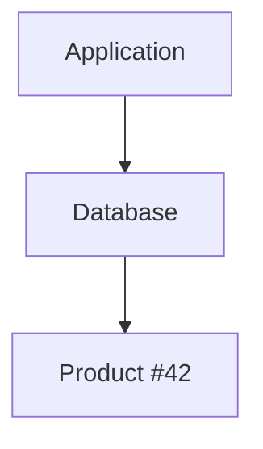

The next user asks for the same product.

The application asks the database again.

Then another user asks.

Again:


The system is repeatedly doing the same work.

Caching introduces a place where the result can be temporarily stored.

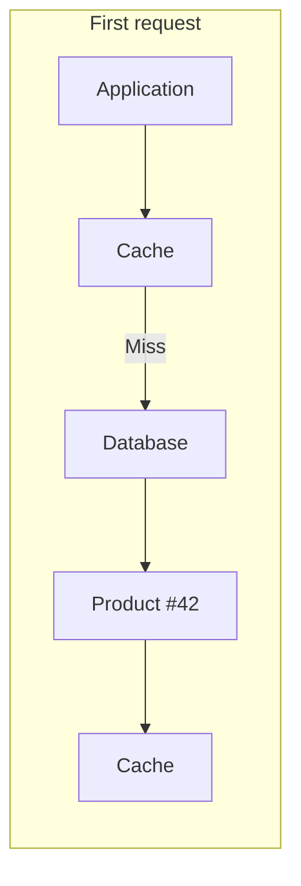

Later:

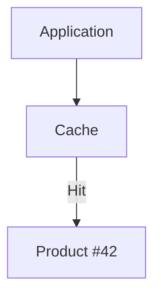

The database does not need to be contacted for every repeated request.

---

# 2. Simple Definition

> **Caching is storing reusable data closer to where it is needed so that future requests can retrieve it faster or with less expensive work.**

The key word is:

**reusable**

If the same result is useful to many future requests, caching may help.

---

# 3. The Basic Cache Flow

A simple cache looks like this:

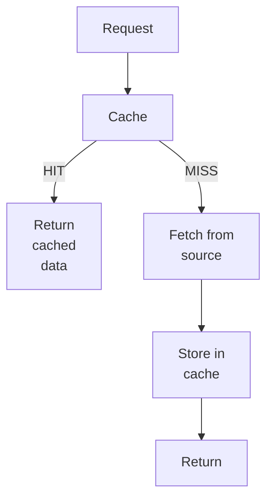

This creates two paths:

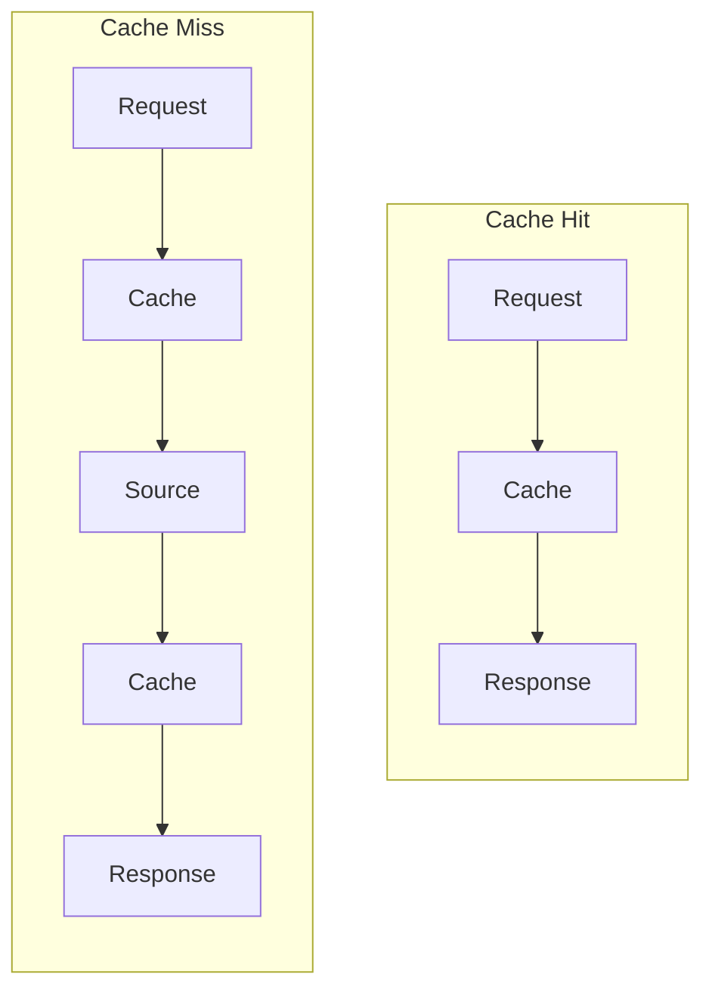

---

# 4. Cache Hit

A **cache hit** happens when the requested data already exists in the cache and can be returned.

Example:

```text
Request:
product:42

Cache:
product:42 → found
```

Flow:

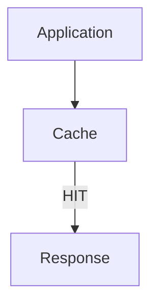

This is the fast path.

---

# 5. Cache Miss

A **cache miss** happens when the requested data is not available in the cache.

Example:

```text
Request:
product:42

Cache:
product:42 → not found
```

The application must obtain the data from another source.

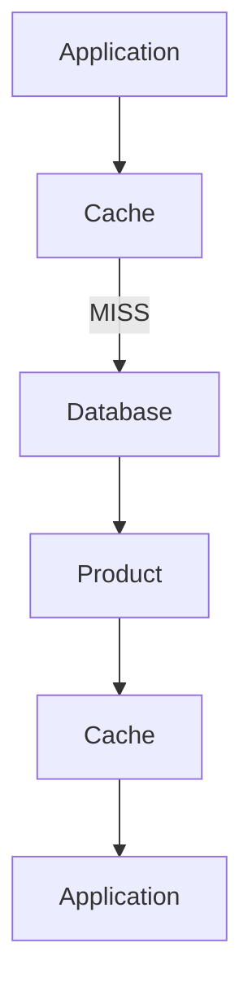

The next request may then become a cache hit.

---

# 6. Why Does Caching Help?

Caching can provide several benefits.

## 6.1 Lower Latency

Reading from a nearby cache can be faster than repeatedly performing expensive work.

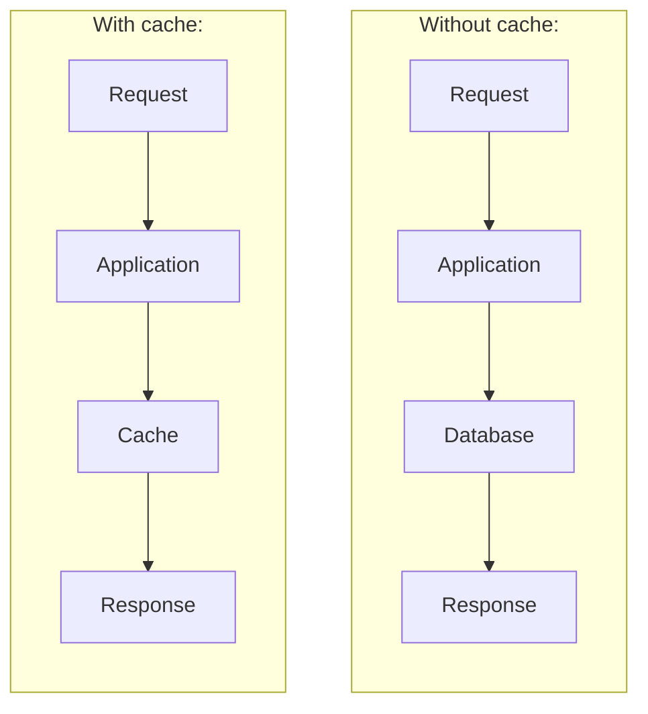

Fewer steps can mean lower latency.

---

## 6.2 Reduce Database Load

Suppose:

```text
10,000 requests
```

all ask for the same product.

Without caching:

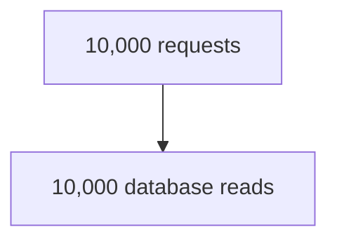

With effective caching:

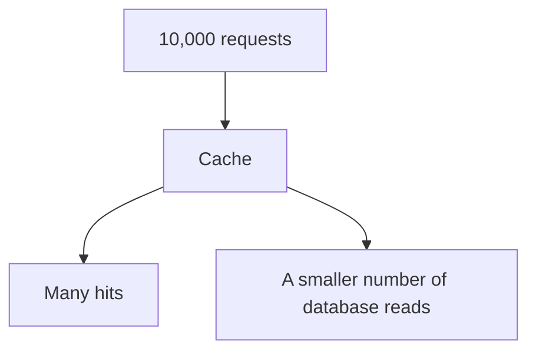

The exact reduction depends on the workload and cache behavior.

---

## 6.3 Reduce Application Work

Sometimes the expensive operation is not the database itself.

It could be:

```text
Complex calculation
API call
Template rendering
Serialization
Recommendation calculation
Report generation
```

Caching the result can avoid repeating that work.

---

## 6.4 Improve Scalability

Suppose the database can comfortably handle:

```text
5,000 reads/second
```

but the application receives:

```text
20,000 requests/second
```

If many requests can be served from a cache, fewer requests reach the database.

Conceptually:

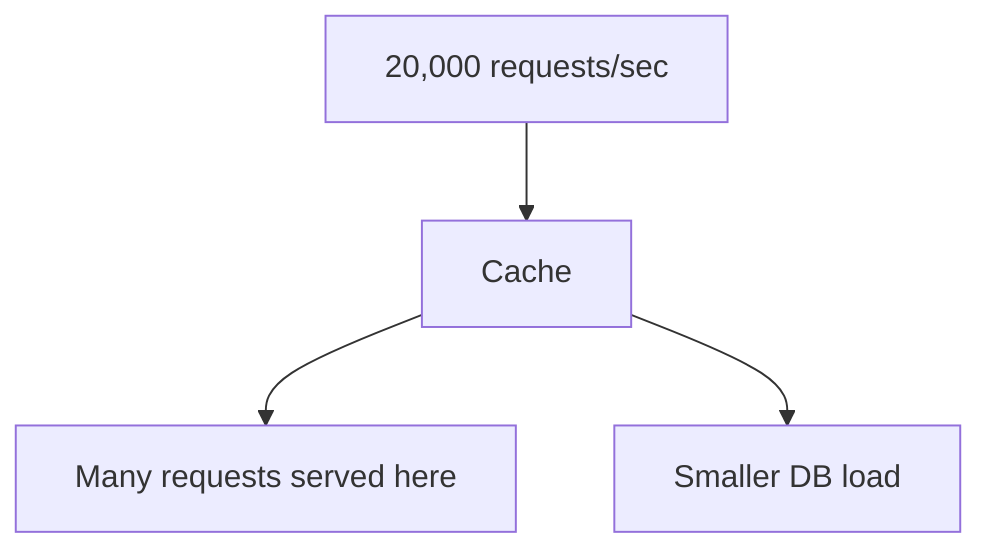

Caching does not magically increase the database's capacity.

Instead, it can **reduce the amount of work reaching the database**.

---

# 7. Caching Is Usually an Optimization

A useful mental model is:

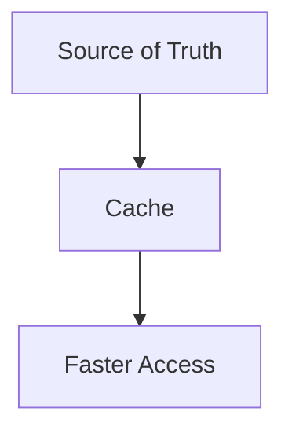

The cache often exists to avoid repeatedly accessing the source.

For example:

```text
Database = source of truth

Cache = temporary reusable copy
```

This is not a universal rule. Some systems intentionally use caches as part of their primary data architecture.

But for beginners, this is a useful starting point:

> **A cache is usually an optimization layer, not the authoritative source of data.**

---

# 8. What Makes Good Cache Data?

Not every piece of data is a good candidate for caching.

A good candidate often has several of these properties:

```text
Frequently read
      +
Repeated requests
      +
Expensive to produce
      +
Doesn't change constantly
      +
Staleness is acceptable
```

Examples:

* Product catalog data
* Public articles
* Configuration
* Frequently viewed profiles
* Search results
* Computed statistics
* API responses
* Popular content

---

# 9. Example — Product Catalog

Imagine an e-commerce site has:

```text
1 million products
```

A popular product:

```text
Product #42
```

might be requested thousands of times.

The product information might change only occasionally.

This is a strong caching candidate.

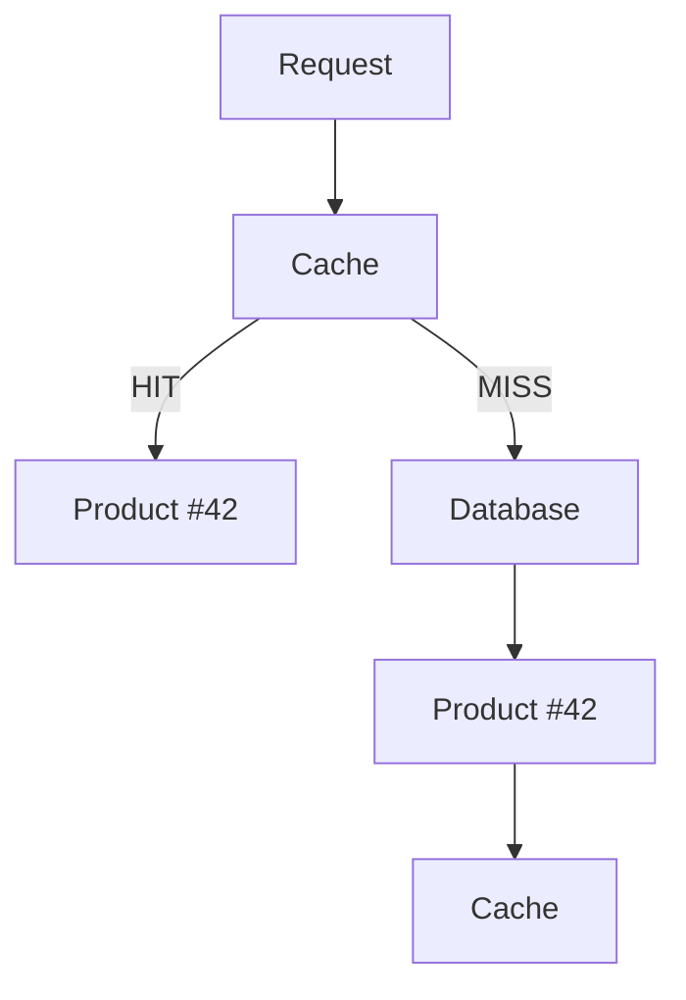

The database does not need to repeatedly perform the same read when the cached value is usable.

---

# 10. What Should Not Be Cached Carelessly?

Some data requires much more caution.

Examples include:

* Highly personalized information
* Sensitive information
* Rapidly changing values
* Data where stale results could cause serious problems
* Data with very low reuse
* Extremely large objects
* Data with difficult invalidation requirements

For example:

```text
Current bank account balance
```

may require much stricter freshness guarantees than:

```text
Product description
```

The question is not simply:

> "Can we cache this?"

Ask:

> **"What happens if the cached value is old?"**

---

# 11. Freshness and Staleness

Suppose the database contains:

```text
Product price = ₹999
```

The cache contains:

```text
Product price = ₹999
```

The database changes:

```text
₹999 → ₹899
```

But the cache still contains:

```text
₹999
```

The cache is now **stale**.

```text
Database
   ↓
₹899

Cache
   ↓
₹999
```

This creates one of the fundamental caching trade-offs:

```text
Speed
  ↕
Freshness
```

The faster and longer you reuse cached data, the greater the possibility that it is no longer current.

---

# 12. How Fresh Is "Fresh Enough"?

There is no universal answer.

Consider different examples:

| Data                | Possible freshness requirement              |
| ------------------- | ------------------------------------------- |
| News article        | Seconds/minutes may be acceptable           |
| Product description | Minutes/hours may be acceptable             |
| User profile        | Depends on the application                  |
| Weather information | Depends on the product                      |
| Stock market data   | Potentially very strict                     |
| Security permission | Often requires careful freshness            |
| Bank balance        | Usually requires authoritative current data |

These are examples, not universal rules.

The correct caching policy depends on the application's requirements.

---

# 13. TTL — Time to Live

A common way to control freshness is **TTL**, or **Time to Live**.

Suppose:

```text
Product #42
TTL = 5 minutes
```

The cache stores the value temporarily.

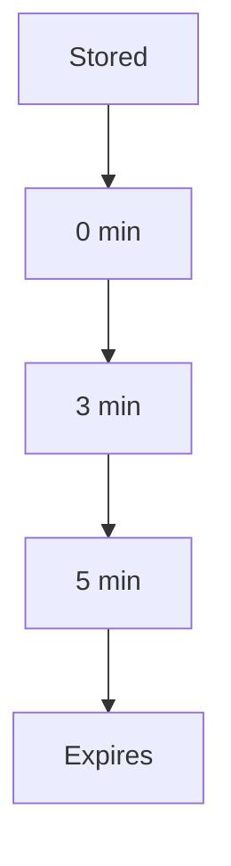

After expiration, the cached value is no longer considered usable according to that TTL policy.

TTL will be covered in greater depth in:

**03.08 — TTL & Expiration**

For now, remember:

> **TTL puts a time boundary on how long cached data may be reused.**

---

# 14. Cache Keys

A cache needs to know **what data you are asking for**.

It does this using a **cache key**.

For example:

```text
product:42
```

could identify:

```text
Product #42
```

Another key:

```text
product:99
```

identifies:

```text
Product #99
```

Conceptually:

```text
Key                  Value

product:42     →     Product #42
product:99     →     Product #99
product:125    →     Product #125
```

The cache key is extremely important.

---

# 15. Cache Key Design

Suppose a page depends on:

```text
product
language
currency
```

A poor key might be:

```text
product:42
```

because the result may differ by language or currency.

A more specific key could be:

```text
product:42:en:INR
```

Now the cache can distinguish:

```text
product:42:en:INR
product:42:bn:INR
product:42:en:USD
```

The general principle is:

> **A cache key must contain enough information to uniquely identify the cached result.**

A bad key can cause more than a cache miss.

It can cause **incorrect data to be returned**.

---

# 16. Cache Key Collision

Imagine:

```text
user:42
```

is used for two different things:

```text
User profile
User permissions
```

The cache could return the wrong type of data.

A safer design might distinguish them:

```text
user:42:profile
user:42:permissions
```

Cache-key design is therefore part of **correctness**, not merely performance.

---

# 17. Where Can Caching Exist?

Caching can exist at several layers of a system.

The important question is not only:

> **"Where is the cache?"**

but:

> **"What responsibility does this cache have?"**

Different cache layers solve different problems.

A useful model is:

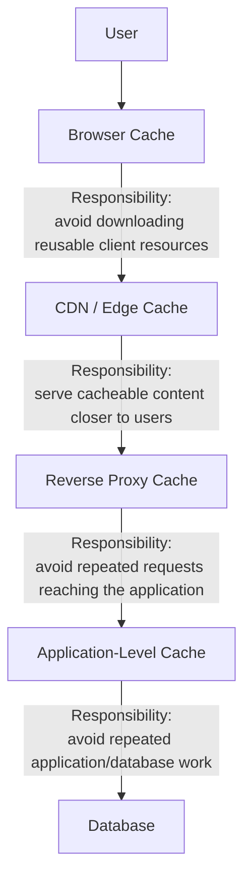

These layers can coexist.

They are **not interchangeable**.

---

# 18. Browser Cache — Client-Side Resource Reuse

The browser cache is primarily responsible for avoiding repeated downloads to the client.

It can store resources such as:

```text
CSS
JavaScript
Images
Fonts
```

Conceptually:

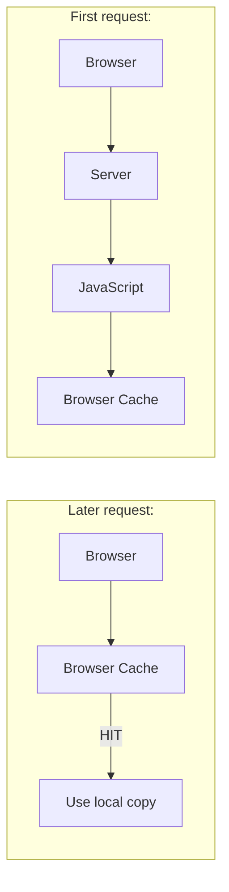

### Responsibility

> **Reuse resources already available on the user's device.**

This can reduce:

* network traffic,
* bandwidth,
* download latency,
* repeated requests to the server.

The browser cache is especially useful for static assets.

HTTP caching controls much of this behavior and will be covered in:

**03.12 — HTTP Caching**

---

# 19. CDN / Edge Cache — Geographic Delivery

A CDN cache is primarily responsible for serving cacheable content closer to users.

Conceptually:

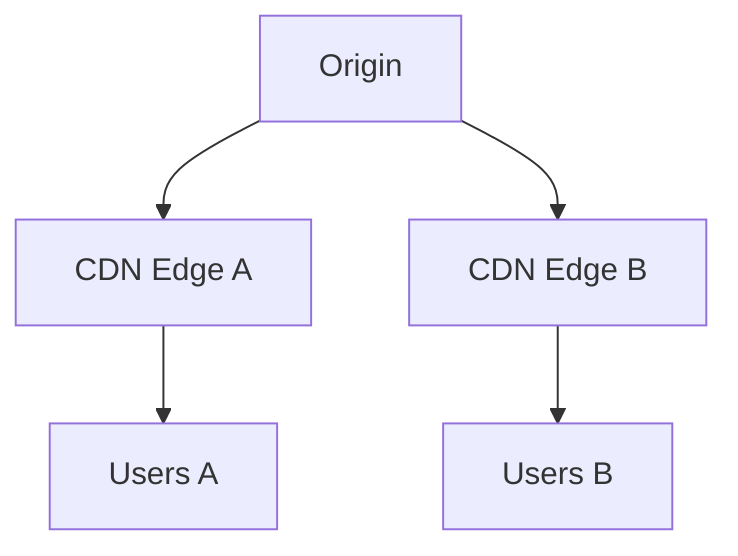

Without a CDN:

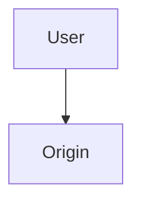

With a CDN:

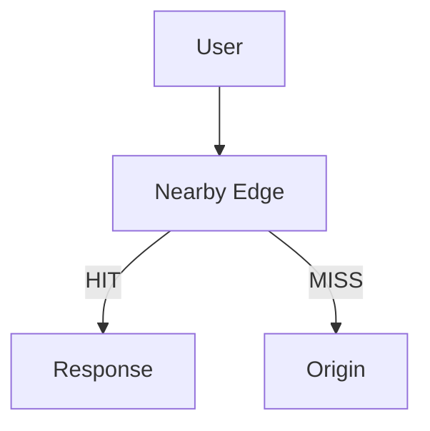

### Responsibility

> **Reduce the distance and load involved in delivering cacheable content to users.**

A CDN is particularly useful for:

* images,
* JavaScript,
* CSS,
* videos,
* downloadable files,
* other cacheable HTTP responses.

The CDN does not primarily exist to cache arbitrary internal application objects.

CDNs will be covered in:

**03.13 — CDN**

---

# 20. Reverse Proxy Cache — Protect the Application

A reverse proxy cache sits in front of application servers.

```mermaid
flowchart TD
  accTitle: A reverse proxy cache
  accDescr: The client reaches the reverse proxy. A cache hit returns the response; a cache miss goes to the application.
  C["Client"] --> P["Reverse Proxy"]
  P -->|"Cache Hit"| R["Response"]
  P -->|"Cache Miss"| A["Application"]
```

Suppose many users request the same cacheable response:

```text
GET /products/42
```

Without a reverse-proxy cache:

```mermaid
flowchart TD
  accTitle: Without a reverse proxy cache
  accDescr: 100 requests, then Application, then Database.
  N0["100 requests"] --> N1["Application"] --> N2["Database"]
```

With a reverse-proxy cache:

```mermaid
flowchart TD
  accTitle: With a reverse proxy cache
  accDescr: 100 requests reach the reverse proxy: many requests are served there, and misses are forwarded to the application.
  R["100 requests"] --> P["Reverse Proxy"]
  P --> S["Many requests served here"]
  P --> M["Misses forwarded to Application"]
```

### Responsibility

> **Prevent repeated cacheable requests from unnecessarily reaching the application layer.**

This can reduce:

* application CPU,
* application concurrency,
* database traffic,
* network traffic between proxy and application.

This cache is concerned primarily with **HTTP/request-response reuse**, not arbitrary application objects.

---

# 21. Application-Level Cache — Avoid Repeated Work

An application-level cache is controlled by application logic.

For example:

```mermaid
flowchart TD
  accTitle: An application-level cache
  accDescr: The application checks the cache. On a HIT, return the product; on a MISS, go to the database.
  A["Application"] --> C["Cache"]
  C -->|"HIT"| H["Return product"]
  C -->|"MISS"| D["Database"]
```

The application may cache:

```text
product:42
user:123:profile
config:feature_flags
homepage:popular_products
```

### Responsibility

> **Avoid repeating expensive application or data-access work when the result can be safely reused.**

This cache can store:

* database results,
* computed values,
* API responses,
* configuration,
* frequently accessed objects,
* application-specific aggregates.

This is the cache layer most directly connected to the upcoming:

**03.05 — Cache-Aside**

---

# 22. Local Application Cache vs Distributed Application Cache

Application-level caching can itself be implemented in two ways.

## Local Application Cache

```mermaid
flowchart TD
  accTitle: Local application caches
  accDescr: Application A has Memory Cache A; Application B has Memory Cache B.
  A["Application A"] --> CA["Memory Cache A"]
  B["Application B"] --> CB["Memory Cache B"]
```

Each application instance owns its own cache.

### Responsibility

> **Provide very fast reusable data to one application instance.**

Advantages:

* Extremely low latency
* No network hop
* Simple for small, local data

Trade-offs:

* Copies are not shared
* Each instance consumes its own memory
* Values can differ between instances
* Restarting an instance usually removes its cache

---

## Distributed Application Cache

```mermaid
flowchart LR
  accTitle: A distributed application cache
  accDescr: Applications A, B and C share one distributed cache.
  A["Application A"] & B["Application B"] & C["Application C"] --> D["Distributed Cache"]
```

### Responsibility

> **Provide shared cached application data across multiple application instances.**

This becomes useful when the application is horizontally scaled.

Advantages:

* Shared cache
* Consistent cache location across instances
* Larger shared capacity

Trade-offs:

* Network hop
* Serialization/deserialization
* Additional infrastructure
* Additional failure mode
* Operational complexity

Redis is one example of technology commonly used for this purpose and will be covered later.

---

# 23. The Layers Are Not Duplicates

It may look wasteful to have several caches:

```mermaid
flowchart TD
  accTitle: The layers together
  accDescr: Browser, then CDN, then Reverse Proxy, then Application Cache, then Database.
  N0["Browser"] --> N1["CDN"] --> N2["Reverse Proxy"] --> N3["Application Cache"] --> N4["Database"]
```

But each layer answers a different question.

| Layer                         | Primary responsibility                                   |
| ----------------------------- | -------------------------------------------------------- |
| Browser cache                 | Avoid downloading reusable resources again               |
| CDN / Edge cache              | Serve cacheable content closer to users                  |
| Reverse proxy cache           | Prevent cacheable requests from reaching the application |
| Local application cache       | Avoid repeated work inside one application instance      |
| Distributed application cache | Share reusable application data across instances         |

The same underlying data might appear at multiple layers, but the **ownership and purpose are different**.

---

# 24. One Request Can Pass Through Multiple Cache Layers

Consider:

```text
User requests:
GET /products/42
```

The request might encounter:

```mermaid
flowchart TD
  accTitle: One request through several cache layers
  accDescr: The browser, CDN, reverse proxy and application cache each can end the request on a HIT; otherwise it continues down to the database.
  subgraph R1[" "]
    direction LR
    B["Browser"] -->|"HIT"| X1["done"]
  end
  subgraph R2[" "]
    direction LR
    C["CDN"] -->|"HIT"| X2["done"]
  end
  subgraph R3[" "]
    direction LR
    P["Reverse Proxy"] -->|"HIT"| X3["done"]
  end
  subgraph R4[" "]
    direction LR
    AC["Application Cache"] -->|"HIT"| X4["done"]
  end
  R1 --> R2 --> R3 --> A["Application"] --> R4 --> D["Database"]
```

The request stops at the first layer that can safely provide the required result.

This creates a **hierarchy of reuse**.

---

# 25. Why Responsibility Matters

Suppose the application team says:

> "The CDN should cache this."

That does not necessarily mean the application cache should also store it.

The CDN may be responsible for:

```text
HTTP response delivery
```

while the application cache may be responsible for:

```text
database query results
```

For example:

```text
CDN:
GET /images/product-42.jpg
```

Application cache:

```text
product:42
```

These are different cached representations serving different purposes.

---

# 26. A Useful Mental Model

Think of the layers as progressively closer to the operation they optimize:

```text
                 Responsibility
                       │
                       ▼

Browser ───────── Client resource reuse

CDN ───────────── Geographic content delivery

Reverse Proxy ─── HTTP request/response reuse

Application ───── Application/data reuse

Database ───────── Source of truth
```

The closer the cache is to the client, the more it is generally concerned with **delivery**.

The closer the cache is to the application, the more it is generally concerned with **application work and data reuse**.

This is a mental model, not an absolute architectural rule.

---

# 27. Cache Layer Decision

When deciding where to cache something, ask:

```text
What exactly are we trying to avoid?
```

### Avoid downloading a static resource?

Consider:

```text
Browser cache
```

### Avoid serving the same content from the origin?

Consider:

```text
CDN
```

### Avoid repeated HTTP requests reaching the application?

Consider:

```text
Reverse proxy cache
```

### Avoid repeated database queries or expensive computation?

Consider:

```text
Application-level cache
```

### Need that cached application data shared across many instances?

Consider:

```text
Distributed application cache
```

This gives you a responsibility-first way to choose the cache layer.

---

# 28. Important Trade-Off

More cache layers can mean:

```text
More performance opportunities
        +
More complexity
```

For example:

```mermaid
flowchart TD
  accTitle: More layers to reason about
  accDescr: Browser, then CDN, then Reverse Proxy, then Application Cache, then Database.
  N0["Browser"] --> N1["CDN"] --> N2["Reverse Proxy"] --> N3["Application Cache"] --> N4["Database"]
```

Now you must reason about:

* freshness,
* invalidation,
* TTLs,
* cache keys,
* security,
* observability,
* failures,
* which layer served the response.

Therefore:

> **Do not add cache layers simply because they exist. Add them when their specific responsibility solves a real problem.**

---

# 29. Summary

The key distinction is:

```text
Browser
→ "Can the client reuse this?"

CDN
→ "Can a nearby edge serve this?"

Reverse Proxy
→ "Can we avoid reaching the application?"

Application Cache
→ "Can we avoid repeating application/data work?"

Distributed Application Cache
→ "Can multiple application instances share that reusable result?"
```

This responsibility-based view makes caching architecture much easier to reason about.

> **A cache layer should have a clear responsibility: identify what expensive work it prevents and where it prevents that work.**
---

---

# 30. Cache Hit Ratio

One important caching metric is the **cache hit ratio**.

Suppose:

```text
1,000 cache requests
```

and:

```text
900 hits
100 misses
```

Then:

```text
Hit Ratio = 900 / 1000
          = 90%
```

The **cache hit ratio** tells you how often the requested data was found in the cache.

---

# 31. Cache Miss Ratio

The **cache miss ratio** is the proportion of requests that were not served from the cache.

In the previous example:

```text
100 misses
out of
1,000 requests
```

Therefore:

```text
Miss Ratio = 10%
```

Generally:

```text
Hit Ratio + Miss Ratio = 100%
```

assuming both metrics are measured over the same request population.

---

# 32. Why Hit Ratio Matters

Suppose your cache hit ratio is:

```text
99%
```

For:

```text
1,000,000 requests
```

approximately:

```text
990,000 → cache hits
10,000  → cache misses
```

That means the underlying source may only need to handle a much smaller portion of the requests.

But don't assume:

```text
99% hit ratio = automatically excellent
```

The importance depends on:

* cost of a miss,
* latency requirements,
* source capacity,
* data freshness,
* workload.

A 90% hit ratio may be excellent for one workload and insufficient for another.

---

# 33. Cache Capacity

A cache has limited resources.

For example:

```text
Cache memory = 10 GB
```

but the application wants to cache:

```text
100 GB
```

Something has to happen.

The cache must decide which entries remain and which entries are removed.

This is called **eviction**.

Common eviction strategies include concepts such as:

```text
LRU
LFU
FIFO
TTL-based expiration
```

You do not need to memorize these yet.

The important idea is:

> **A cache is a finite resource.**

Eviction will become more relevant as caching becomes more advanced.

---

# 34. Cache Eviction

Suppose the cache contains:

```text
A
B
C
D
```

and has no room for:

```text
E
```

The cache may remove an existing entry:

```text
A
B
C
D
 ↓
Evict one
 ↓
A
C
D
E
```

The removed data is not necessarily lost permanently.

It can often be fetched again from the source.

This is another reason caches are commonly treated as an optimization layer.

---

# 35. Cache Invalidation

Suppose the database contains:

```text
Product #42 = ₹999
```

The cache also contains:

```text
Product #42 = ₹999
```

Now the product price changes:

```text
Database = ₹899
```

What should happen to the cache?

One option is to remove or update the cached value.

This is called **cache invalidation**.

Conceptually:

```mermaid
flowchart TD
  accTitle: Why invalidation is needed
  accDescr: Data changes, then Cached copy may become invalid, then Invalidate / update cache.
  N0["Data changes"] --> N1["Cached copy may become invalid"] --> N2["Invalidate / update cache"]
```

Cache invalidation is one of the most important and difficult parts of caching.

It will be covered in:

**03.09 — Cache Invalidation**

---

# 36. Cache Invalidation Is a Correctness Problem

Caching is not just about speed.

Suppose:

```text
Database:
balance = ₹5,000

Cache:
balance = ₹7,000
```

Returning the cached value could be incorrect.

Therefore, before caching something, ask:

```text
How stale can this data be?
What happens when it changes?
How will the cache know?
What happens if invalidation fails?
```

The answers determine whether caching is appropriate.

---

# 37. Cache-Aside — Preview

One common caching pattern is **cache-aside**.

The application checks the cache first.

```mermaid
flowchart TD
  accTitle: Cache-aside
  accDescr: The application checks the cache. On a HIT, return. On a MISS, read the database, store in the cache, then return.
  A["Application"] --> C["Cache"]
  C -->|"HIT"| H["Return"]
  C -->|"MISS"| D["Database"] --> C2["Cache"] --> R["Return"]
```

The application itself manages the interaction with the cache.

A full discussion comes in:

**03.05 — Cache-Aside**

For now, remember the flow.

---

# 38. Write-Through — Preview

Another strategy is **write-through caching**.

Conceptually:

```mermaid
flowchart TD
  accTitle: Write-through
  accDescr: Application, then Cache, then Database.
  N0["Application"] --> N1["Cache"] --> N2["Database"]
```

A write updates the cache and underlying data store according to the strategy.

The advantage is that the cache can remain closely synchronized with writes.

The cost is additional write-path complexity and behavior that depends on the specific implementation.

You will study this in:

**03.06 — Write-Through Cache**

---

# 39. Write-Back — Preview

With **write-back caching**, a write may first be accepted by the cache and persisted to the underlying storage later.

Conceptually:

```mermaid
flowchart TD
  accTitle: Write-back
  accDescr: The application writes to the cache; the cache writes to the database later.
  A["Application"] --> C["Cache"] -->|"later"| D["Database"]
```

This can reduce immediate write pressure on the underlying store.

But it introduces significant concerns around:

* durability,
* failure,
* ordering,
* data loss,
* recovery.

This will be covered in:

**03.07 — Write-Back Cache**

---

# 40. Caching and the Database

You have just learned:

**03.02 — Database Indexes**

and:

**03.03 — Query Optimization**

These techniques reduce database work.

Caching takes a different approach.

### Index

```mermaid
flowchart TD
  accTitle: What an index does
  accDescr: Need the data, then Database, then Use a better access path.
  N0["Need the data"] --> N1["Database"] --> N2["Use a better access path"]
```

### Query Optimization

```mermaid
flowchart TD
  accTitle: What query optimization does
  accDescr: Need the data, then Database, then Reduce unnecessary work.
  N0["Need the data"] --> N1["Database"] --> N2["Reduce unnecessary work"]
```

### Cache

```mermaid
flowchart TD
  accTitle: What a cache does
  accDescr: Need the same data again, then Cache, then Avoid the database entirely.
  N0["Need the same data again"] --> N1["Cache"] --> N2["Avoid the database entirely"]
```

This distinction is important.

> **Indexes and query optimization make database work more efficient. Caching can avoid that database work altogether for repeated requests.**

---

# 41. Caching Does Not Fix Every Performance Problem

Suppose the problem is:

```text
Complex calculation
```

Caching its result might help.

But suppose the problem is:

```text
Every request performs unique work
```

Caching may provide little benefit.

For example:

```text
Request 1 → unique result
Request 2 → unique result
Request 3 → unique result
```

There may be little reusable data.

Caching works best when there is **reuse**.

---

# 42. Cacheability Depends on Reuse

Imagine these two workloads.

### Workload A

```text
1,000,000 requests

Product #42 → 800,000 requests
Product #43 → 100,000 requests
Other → 100,000 requests
```

High reuse.

Caching can potentially help significantly.

### Workload B

```text
1,000,000 requests

Each request asks for unique data.
```

Low reuse.

Caching may consume memory without producing many hits.

Therefore:

> **A cache is valuable when the cost of storing and retrieving cached data is justified by reuse.**

---

# 43. Hot Data and Hot Keys

Sometimes a tiny portion of the data receives a huge percentage of traffic.

For example:

```text
Product #42
```

might receive:

```text
80% of requests
```

while thousands of other products receive very little traffic.

This creates a **hot key**.

```mermaid
flowchart TD
  accTitle: A hot key
  accDescr: Requests go to product:42, which receives huge traffic.
  R["Requests"] --> P["product:42"]
  H["Huge traffic"] --> P
```

Hot keys can create:

* concentrated load,
* contention,
* uneven resource usage.

They become especially important in distributed caches.

---

# 44. Cache Stampede

Imagine a popular cached value expires.

Before expiration:

```mermaid
flowchart TD
  accTitle: Requests served from a hot entry
  accDescr: 1,000 requests, then Cache Hit.
  N0["1,000 requests"] --> N1["Cache Hit"]
```

Then the value expires:

```mermaid
flowchart TD
  accTitle: The hot entry expires
  accDescr: Cache, then MISS.
  N0["Cache"] --> N1["MISS"]
```

Now many requests arrive simultaneously:

```mermaid
flowchart TD
  accTitle: A cache stampede
  accDescr: 1,000 requests miss the cache and all go to the database.
  R["1,000 requests"] --> G
  subgraph G[" "]
    direction LR
    C["Cache MISS"] --> D4["Database"] & E["..."] & D1["Database"] & D2["Database"] & D3["Database"]
  end
```

The database suddenly receives a large burst of work.

This is commonly called a **cache stampede**.

It can create:

```mermaid
flowchart TD
  accTitle: How a stampede escalates
  accDescr: Cache expiration, then Many misses, then Database surge, then Higher latency, then Possible overload.
  N0["Cache expiration"] --> N1["Many misses"] --> N2["Database surge"] --> N3["Higher latency"] --> N4["Possible overload"]
```

This topic will be covered in:

**03.10 — Cache Stampede**

---

# 45. Cache Failure

What happens if the cache itself becomes unavailable?

For example:

```mermaid
flowchart TD
  accTitle: The cache is unavailable
  accDescr: The application cannot reach the cache: it is unavailable.
  A["Application"] --> C["Cache"] -. "X" .- U["unavailable"]
```

A well-designed system may be able to fall back to the underlying source:

```mermaid
flowchart TD
  accTitle: Falling back to the database
  accDescr: The cache fails, so the application goes to the database.
  A["Application"] --> C["Cache"] -. "X" .- D["Database"]
```

But this creates another problem:

```mermaid
flowchart TD
  accTitle: What cache failure does to the database
  accDescr: Cache failure, then All traffic reaches database, then Database load increases.
  N0["Cache failure"] --> N1["All traffic reaches database"] --> N2["Database load increases"]
```

Therefore, cache failure can become a **capacity event**.

---

# 46. Cache Failure Is Not Always Harmless

It is tempting to say:

> "The cache is only an optimization, so if it fails, nothing happens."

That is too simplistic.

The cache may be optional from a **data correctness** perspective but critical from a **capacity** perspective.

For example:

```mermaid
flowchart TD
  accTitle: Normal traffic and cache failure
  accDescr: Normal: of 1,000 requests/sec, 900 are served by cache and 100 reach the database. Cache failure: all 1,000 reach the database.
  subgraph N["Normal:"]
    direction TB
    N0["1,000 requests/sec"] --> N1["900 served<br/>by cache"] & N2["100 reach<br/>database"]
  end
  subgraph F["Cache failure:"]
    direction TB
    F0["1,000 requests/sec"] --> F1["1,000 reach database"]
  end
  N ~~~ F
```

The database may not have enough capacity for the second scenario.

Therefore:

> **A cache can be optional for correctness but essential for maintaining normal system capacity.**

This distinction is extremely important in system design.

---

# 47. Serialization and Network Cost

A distributed cache is not free.

Consider:

```mermaid
flowchart TD
  accTitle: A distributed cache is across the network
  accDescr: The application reaches the distributed cache over the network.
  A["Application"] -->|"network"| D["Distributed Cache"]
```

The application must:

```mermaid
flowchart TD
  accTitle: The cost of a remote cache call
  accDescr: Serialize data, then Send data, then Cache processes request, then Receive data, then Deserialize data.
  N0["Serialize data"] --> N1["Send data"] --> N2["Cache processes request"] --> N3["Receive data"] --> N4["Deserialize data"]
```

For very small values, this overhead may still be tiny.

For large objects, it can become significant.

Therefore:

> **Caching adds a layer of work of its own.**

The cache should reduce more work than it introduces.

---

# 48. Cache Memory and Object Size

Suppose you cache:

```text
1 KB objects
```

and:

```text
1 million objects
```

That is roughly:

```text
1 GB
```

before considering metadata and implementation overhead.

Now imagine:

```text
100 KB objects
```

for:

```text
1 million objects
```

The memory requirement becomes much larger.

Therefore:

```mermaid
flowchart TD
  accTitle: Large objects add pressure
  accDescr: Cache size, then Memory cost, then Eviction pressure.
  N0["Cache size"] --> N1["Memory cost"] --> N2["Eviction pressure"]
```

Caching everything is not a strategy.

---

# 49. Security and Privacy

Caching can accidentally expose data if the cache key or cache boundary is designed incorrectly.

Imagine:

```text
User A requests:
profile for user A
```

and the response is cached incorrectly.

Then:

```text
User B requests the same URL
```

and receives User A's cached response.

This is a serious data-isolation problem.

Therefore, when caching personalized or sensitive data, consider:

* user identity,
* authorization,
* cache keys,
* cache scope,
* shared vs private caches,
* response headers,
* invalidation.

A useful rule:

> **Never let a shared cache return data to a user who is not authorized to see it.**

---

# 50. Cache Consistency

Suppose the system contains:

```mermaid
flowchart TD
  accTitle: Where the application reads from
  accDescr: Database, then Cache, then Application.
  N0["Database"] --> N1["Cache"] --> N2["Application"]
```

Now the database changes.

There may be a short period where:

```text
Database = New Value
Cache    = Old Value
```

This is a consistency gap.

Different systems accept different levels of this gap.

Therefore, caching introduces a design question:

> **How much inconsistency is acceptable?**

This connects caching to later topics such as:

* data consistency,
* replication,
* eventual consistency,
* distributed systems.

---

# 51. Cache and System Evolution

Consider a simple application:

```mermaid
flowchart TD
  accTitle: A simple system
  accDescr: Application, then Database.
  N0["Application"] --> N1["Database"]
```

As traffic grows:

```mermaid
flowchart TD
  accTitle: A cache is added
  accDescr: Application, then Cache, then Database.
  N0["Application"] --> N1["Cache"] --> N2["Database"]
```

Later:

```mermaid
flowchart TD
  accTitle: Horizontally scaled with a distributed cache
  accDescr: Users reach a load balancer that spreads requests over applications A, B and C, which share a distributed cache in front of the database.
  U["Users"] --> L["Load Balancer"] --> G
  subgraph G[" "]
    direction TB
    A["Application A"] ~~~ B["Application B"] ~~~ C["Application C"]
  end
  G --> D["Distributed Cache"] --> DB["Database"]
```

Caching can therefore be part of the system's evolution.

But don't add it simply because:

> "Large systems use Redis."

Add it when measurement shows repeated expensive work that caching can meaningfully reduce.

---

# 52. When Should You Consider a Cache?

A useful decision process:

```mermaid
flowchart TD
  accTitle: Should you consider a cache?
  accDescr: Is the operation expensive? No: a cache may not be necessary. Yes: is the result reused? No: low value. Yes: continue — is some staleness acceptable? No: cache carefully. Yes: good candidate.
  Q1{"Is the operation<br/>expensive?"} -->|"No"| N1["Cache may not<br/>be necessary"]
  Q1 -->|"Yes"| Q2{"Is the result<br/>reused?"}
  Q2 -->|"No"| N2["Low value"]
  Q2 -->|"Yes"| C["Continue"] --> Q3{"Is some staleness<br/>acceptable?"}
  Q3 -->|"No"| N3["Cache<br/>carefully"]
  Q3 -->|"Yes"| G["Good<br/>candidate"]
```

Then consider:

```text
Memory cost
Invalidation
Security
Failure behavior
Consistency
Operational complexity
```

---

# 53. A Before-and-After Architecture

### Without caching

```mermaid
flowchart TD
  accTitle: Without caching
  accDescr: Users, then Application, then Database.
  N0["Users"] --> N1["Application"] --> N2["Database"]
```

Every repeated read reaches the database.

---

### With caching

```mermaid
flowchart TD
  accTitle: With caching
  accDescr: Users reach the application, which reads the cache; only misses go to the database.
  U["Users"] --> A["Application"] --> C["Cache"] -->|"Miss only"| D["Database"]
```

Many repeated reads can terminate at the cache.

---

# 54. Caching Trade-Offs

Caching gives benefits, but it also introduces costs.

| Benefit                     | Cost / Trade-off               |
| --------------------------- | ------------------------------ |
| Lower latency               | Additional infrastructure      |
| Lower database load         | Memory cost                    |
| Better scalability          | Cache invalidation             |
| Reduced repeated work       | Stale data                     |
| Fewer database requests     | Cache-key complexity           |
| Faster responses            | Serialization/network overhead |
| Can absorb repeated traffic | Failure/fallback complexity    |
| Useful for hot data         | Hot-key problems               |

The important lesson is:

> **Caching trades memory and complexity for reduced repeated work.**

---

# 55. Caching Is Not Free

A common beginner mistake is:

```mermaid
flowchart TD
  accTitle: The oversimplified view
  accDescr: Application slow, then Add cache, then Problem solved.
  N0["Application slow"] --> N1["Add cache"] --> N2["Problem solved"]
```

Real systems are more complicated.

Adding a cache creates:

```text
New dependency
New failure mode
New data lifecycle
New invalidation problem
New monitoring requirements
New memory cost
New consistency questions
```

Therefore:

> **Caching should solve a measured problem, not become an automatic architectural decoration.**

---

# 56. Practical Investigation

Suppose a product page is slow.

Before adding a cache, investigate:

```mermaid
flowchart TD
  accTitle: The current request path
  accDescr: Request, then Application, then Database.
  N0["Request"] --> N1["Application"] --> N2["Database"]
```

Ask:

```text
Is the database query slow?
Is the query repeated?
Is the result reusable?
How frequently does the data change?
How many requests ask for the same data?
How expensive is producing the result?
How much memory would caching require?
How stale can the result be?
```

If the answers support caching, then introduce it deliberately.

---

# 57. Caching and the Performance Feedback Loop

From **03.01**, the basic performance loop was:

```mermaid
flowchart TD
  accTitle: The performance feedback loop
  accDescr: Measure, then Find bottleneck, then Optimize, then Measure again.
  N0["Measure"] --> N1["Find bottleneck"] --> N2["Optimize"] --> N3["Measure again"]
```

Caching fits directly into this loop.

```mermaid
flowchart TD
  accTitle: The feedback loop for caching
  accDescr: Measure, then Find repeated expensive work, then Determine whether result is reusable, then Add cache, then Measure hit ratio and latency, then Measure source load, then Check correctness/freshness.
  N0["Measure"] --> N1["Find repeated expensive work"] --> N2["Determine whether result is reusable"] --> N3["Add cache"] --> N4["Measure hit ratio and latency"] --> N5["Measure source load"] --> N6["Check correctness/freshness"]
```

Do not measure only latency.

Also consider:

* cache hit ratio,
* cache miss ratio,
* database load,
* application load,
* memory usage,
* eviction rate,
* error rate.

---

# 58. Hands-On Caching Lab

This lab demonstrates the basic difference between:

```text
Repeated database access
```

and:

```text
Cache-assisted access
```

The goal is understanding the flow, not building a production cache.

---

## Step 1 — Create a Simple Data Source

Imagine a product lookup:

```sql
SELECT id, name, price
FROM products
WHERE id = 42;
```

Run it repeatedly.

Ask:

```text
How many times does the database execute the same logical lookup?
```

---

## Step 2 — Introduce a Cache

Use a simple conceptual cache:

```text
product:42 → {
    id: 42,
    name: "...",
    price: 999
}
```

The application flow becomes:

```mermaid
flowchart TD
  accTitle: The lab cache flow
  accDescr: Request product 42, then check the cache. On a HIT, return. On a MISS, read the database, store in the cache, then return.
  R["Request product 42"] --> C["Check cache"]
  C -->|"HIT"| H["Return"]
  C -->|"MISS"| D["Database"] --> C2["Cache"] --> T["Return"]
```

---

## Step 3 — Count Hits and Misses

Suppose you make:

```text
10 requests
```

and observe:

```text
First request → MISS
Next 9        → HIT
```

Then:

```text
Hits   = 9
Misses = 1
Total  = 10
```

Hit ratio:

```text
9 / 10 = 90%
```

Miss ratio:

```text
1 / 10 = 10%
```

---

## Step 4 — Change the Workload

Now simulate:

```text
100 different products
100 requests
```

where every request asks for a different product.

You may see:

```text
Hits = 0
Misses = 100
```

The cache provides little benefit.

This demonstrates:

> **Caching depends heavily on reuse.**

---

## Step 5 — Simulate Expiration

Suppose:

```text
TTL = 5 minutes
```

After the entry expires:

```mermaid
flowchart TD
  accTitle: An expired entry
  accDescr: product:42, then expired, then MISS, then Database, then New cached value.
  N0["product:42"] --> N1["expired"] --> N2["MISS"] --> N3["Database"] --> N4["New cached value"]
```

Think about:

```text
What if 1,000 users request it at the same time?
```

This leads directly to the cache-stampede problem covered later.

---

## Step 6 — Think Like a System Designer

Answer these questions:

```text
What data should be cached?

What should the cache key be?

How long can the value remain cached?

What happens when the value changes?

What happens when the cache is unavailable?

How much memory will the cache require?

What happens if the hit ratio is low?

Can stale data cause a correctness problem?
```

There is no single answer to all of these.

The architecture depends on the requirements.

---

# 59. Common Caching Mistakes

### Mistake 1: Caching Everything

More cache does not automatically mean more performance.

---

### Mistake 2: Ignoring Stale Data

A cached value may no longer represent the current source value.

---

### Mistake 3: Poor Cache Keys

An incorrect key can return incorrect data.

---

### Mistake 4: Ignoring Memory Cost

Caches consume finite resources.

---

### Mistake 5: Treating the Cache as the Database

A cache is often a reusable copy, not the authoritative source.

---

### Mistake 6: Ignoring Cache Failure

The underlying database may suddenly receive much more traffic if the cache disappears.

---

### Mistake 7: Ignoring Security

Shared caching can accidentally expose another user's data.

---

### Mistake 8: Adding a Distributed Cache Too Early

A separate cache service introduces:

```text
Network
Operations
Monitoring
Failure modes
Serialization
Consistency concerns
```

Use it when the problem justifies it.

---

### Mistake 9: Measuring Only Latency

A faster response is useful, but also inspect:

```text
Hit ratio
Database load
Memory usage
Error rate
Evictions
```

---

### Mistake 10: Ignoring the Cache Miss Path

The miss path often determines what happens during:

```text
Traffic spikes
Cache expiration
Cache failure
Cold starts
```

A cache architecture must be designed around both:

```text
Hit path
```

and:

```text
Miss path
```

---

# 60. System Design View

Caching is one of the clearest examples of the Systemly principle:

> **Find the expensive repeated work, then avoid doing it repeatedly when the requirements allow it.**

The evolution might look like:

```mermaid
flowchart TD
  accTitle: Simple System
  accDescr: User, then Application, then Database.
  subgraph G["Simple System"]
    direction TB
    N0["User"] --> N1["Application"] --> N2["Database"]
  end
```

Then:

```mermaid
flowchart TD
  accTitle: Repeated Reads
  accDescr: User, then Application, then Cache, then Database.
  subgraph G["Repeated Reads"]
    direction TB
    N0["User"] --> N1["Application"] --> N2["Cache"] --> N3["Database"]
  end
```

Then:

```mermaid
flowchart TD
  accTitle: Horizontal Scale
  accDescr: Users reach a load balancer that spreads requests over applications A and B, which share a cache in front of the database.
  subgraph G["Horizontal Scale"]
    direction TB
    U["Users"] --> L["Load Balancer"] --> A["Application A"] & B["Application B"]
    A & B --> C["Cache"] --> D["Database"]
  end
```

The architecture became more complex because the workload justified it.

Not because:

> "Caching is always good."

---

# 61. A Simple Caching Decision Framework

Before introducing a cache, ask:

```mermaid
flowchart TD
  accTitle: A simple caching decision framework
  accDescr: 1. What work are we trying to avoid? Then 2. Is that work repeated? Then 3. Can the result be reused safely? Then 4. How stale can it be? Then 5. What should the cache key contain? Then 6. How long should it remain usable? Then 7. What happens when it misses? Then 8. What happens when it fails? Then 9. How much memory will it consume? Then 10. How will we measure whether it helped?
  N0["1#46; What work are we trying to avoid?"] --> N1["2#46; Is that work repeated?"] --> N2["3#46; Can the result be reused safely?"] --> N3["4#46; How stale can it be?"] --> N4["5#46; What should the cache key contain?"] --> N5["6#46; How long should it remain usable?"] --> N6["7#46; What happens when it misses?"] --> N7["8#46; What happens when it fails?"] --> N8["9#46; How much memory will it consume?"] --> N9["10#46; How will we measure whether it helped?"]
```

This is a much stronger approach than simply saying:

```text
"Let's add Redis."
```

---

# 62. Key Principle

> **Caching reduces repeated work by keeping reusable results closer to where they are needed.**

But caching introduces trade-offs:

```text
Speed
  ↕
Freshness

Lower source load
  ↕
Memory cost

Simpler reads
  ↕
More architectural complexity
```

The correct question is not:

> "Should every system use caching?"

It is:

> **"Is there repeated work that can be safely avoided by reusing cached data?"**

---

# 63. Quick Reference

| Concept            | Meaning                                                            |
| ------------------ | ------------------------------------------------------------------ |
| Cache              | Temporary/reusable storage for frequently needed data or results   |
| Cache Hit          | Requested data is found in the cache                               |
| Cache Miss         | Requested data is not found in the cache                           |
| Hit Ratio          | Percentage of requests served from cache                           |
| Miss Ratio         | Percentage of requests not served from cache                       |
| Cache Key          | Identifier used to locate cached data                              |
| Freshness          | How current the cached value is                                    |
| Stale Data         | Cached data that is older than the desired/current source value    |
| TTL                | Time-to-live; limits how long cached data remains usable           |
| Eviction           | Removing cached entries to free capacity                           |
| Local Cache        | Cache stored within an application/server                          |
| Distributed Cache  | Shared cache service used by multiple application instances        |
| Hot Key            | Cache key receiving unusually high traffic                         |
| Cache Stampede     | Large burst of source requests caused by simultaneous cache misses |
| Cache Invalidation | Removing or updating cached data when it is no longer valid        |
| Cache-Aside        | Application checks cache and loads the source on a miss            |
| Write-Through      | Writes are propagated through the cache to the underlying store    |
| Write-Back         | Writes may be accepted by the cache and persisted later            |

---

# 64. Knowledge Check

### Question 1

What is caching?

Storing reusable data or results so future requests can retrieve them with less expensive work.

---

### Question 2

What is a cache hit?

The requested value is found in the cache.

---

### Question 3

What is a cache miss?

The requested value is not found in the cache, so the system must obtain it elsewhere.

---

### Question 4

Why can caching reduce database load?

Repeated requests can be served from the cache instead of reaching the database.

---

### Question 5

Why isn't every piece of data a good cache candidate?

Because some data changes too frequently, has little reuse, is sensitive, requires strict freshness, or is too expensive to store.

---

### Question 6

What is a cache key?

An identifier used to locate a particular cached value.

---

### Question 7

Why is cache-key design important?

A poor key can cause unnecessary misses or, worse, return the wrong data.

---

### Question 8

What is the difference between a local and distributed cache?

A local cache belongs to an application instance or server; a distributed cache is shared by multiple application instances through a separate service.

---

### Question 9

Can a cache failure affect the database even if the cache is not the source of truth?

**Yes.**

If the cache fails, requests may fall through to the database and create a sudden increase in database load.

---

### Question 10

What is the main trade-off introduced by caching?

Caching can improve speed and reduce repeated work, but it introduces memory cost, complexity, freshness/invalidation concerns, and additional failure modes.

---

# Remember

When thinking about caching, don't start with:

> "Which caching technology should I use?"

Start with:

```mermaid
flowchart TD
  accTitle: Remember
  accDescr: What work is expensive?, then Is it repeated?, then Can the result be reused?, then How stale can it be?, then What should the cache key be?, then What happens on a miss?, then What happens if the cache fails?, then Did caching actually improve the system?.
  N0["What work is expensive?"] --> N1["Is it repeated?"] --> N2["Can the result be reused?"] --> N3["How stale can it be?"] --> N4["What should the cache key be?"] --> N5["What happens on a miss?"] --> N6["What happens if the cache fails?"] --> N7["Did caching actually improve the system?"]
```

The technology comes **after** understanding the problem.

**Next: 03.05 — Cache-Aside**
