# 03.05 — Cache-Aside

## Learning Objectives

By the end of this chapter, you should be able to:

* Explain what **Cache-Aside** means.
* Explain why Cache-Aside is sometimes described as **lazy cache population**.
* Distinguish the broader software concept of **lazy loading** from the specific Cache-Aside caching pattern.
* Trace a cache hit and cache miss.
* Understand who is responsible for reading and writing the cache.
* Design a basic Cache-Aside read path.
* Understand the role of cache keys and TTL.
* Understand what happens when multiple requests miss the cache at the same time.
* Understand how Cache-Aside interacts with cache invalidation and consistency.
* Know what happens when the cache is unavailable.
* Know when Cache-Aside is useful and when another caching strategy may be more appropriate.

---

# 1. What Is Cache-Aside?

**Cache-Aside** is a caching pattern where the **application is responsible for managing the cache**.

The application:

1. Checks the cache first.
2. If the data exists, uses it.
3. If the data does not exist, reads it from the source of truth.
4. Stores the result in the cache.
5. Returns the result to the user.

The basic idea is:

> **Check the cache first. If the data is missing, load it from the source and populate the cache.**

This pattern is commonly associated with **lazy cache population** because the application does not populate the cache until the data is actually requested.

---

# 2. Cache-Aside Is Not the Same Thing as Lazy Loading

The terms are related, but they are **not exact synonyms**.

### Lazy loading

**Lazy loading** is a general software technique:

> **Do not load something until it is actually needed.**

It can apply to many things:

```text
Load an image only when it becomes visible.

Load a large module only when a feature uses it.

Load a database relationship only when the application accesses it.

Load cached data only when a request needs it.
```

So lazy loading is a **general timing strategy**.

---

### Cache-Aside

**Cache-Aside** is a specific **caching pattern**:

> **The application explicitly checks the cache and, on a miss, loads data from the source and populates the cache.**

So:

```text
Lazy loading
    =
"When should something be loaded?"

Cache-Aside
    =
"How does the application manage a cache around a source of truth?"
```

Cache-Aside can use lazy loading behavior, but the two concepts describe different things.

---

# 3. Why Cache-Aside Is Sometimes Called "Lazy Loading"

Consider an empty cache:

```text
Cache:
[ empty ]

Database:
[A] [B] [C] [D] [E]
```

Nothing is proactively copied into the cache.

A user requests `C`:

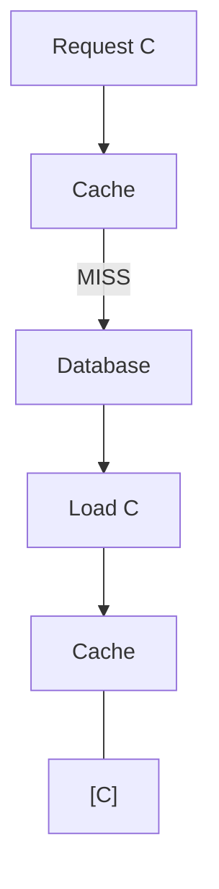

Only now is `C` loaded into the cache.

Later, another request for `C` can use the cached value:

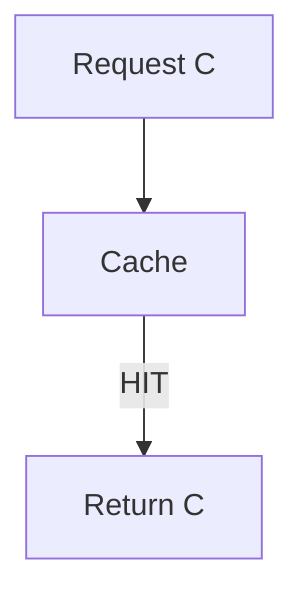

This is why Cache-Aside is often described as **lazy cache population**.

The cache is populated **on demand**, rather than being filled in advance.

---

# 4. The More Precise Term: Lazy Cache Population

For Systemly, prefer the phrase:

> **lazy cache population**

rather than saying:

> **Cache-Aside = Lazy Loading**

This avoids teaching an overly broad equivalence.

A useful definition is:

> **Cache-Aside commonly uses lazy cache population: the application populates a cache entry only after a request misses the cache and successfully loads the data from the source.**

That statement is more precise.

---

# 5. Lazy vs Proactive Cache Population

The distinction becomes clearer when we compare two approaches.

### Lazy cache population

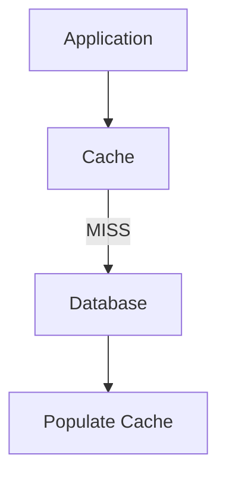

The cache gets populated because someone requested the data.

### Proactive cache population

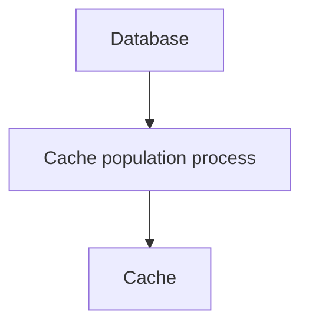

The system may populate the cache before users request the data.

For example:

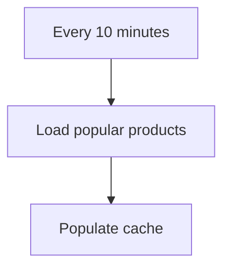

This is **not the typical Cache-Aside read flow**.

---

# 6. The Important Terminology

Keep these concepts separate:

| Term                      | Meaning                                                                           |
| ------------------------- | --------------------------------------------------------------------------------- |
| **Cache-Aside**           | A caching pattern where the application explicitly manages cache reads and writes |
| **Lazy loading**          | A general technique of delaying loading until something is needed                 |
| **Lazy cache population** | Populating a cache entry when a request actually needs it                         |
| **Cache hit**             | Requested data exists in the cache                                                |
| **Cache miss**            | Requested data does not exist in the cache                                        |
| **Write-Through**         | A caching strategy where writes go through the cache to the underlying store      |

The relationship is:

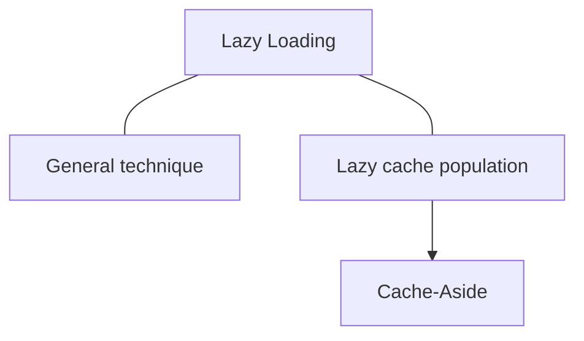

More accurately, Cache-Aside **commonly implements** lazy cache population; it is not defined solely by the word "lazy."

---

# 7. What Actually Defines Cache-Aside?

The defining characteristic is **responsibility**.

In Cache-Aside:

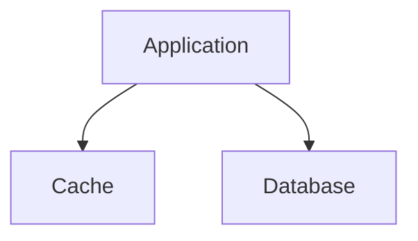

The application explicitly manages both sides.

For a read:

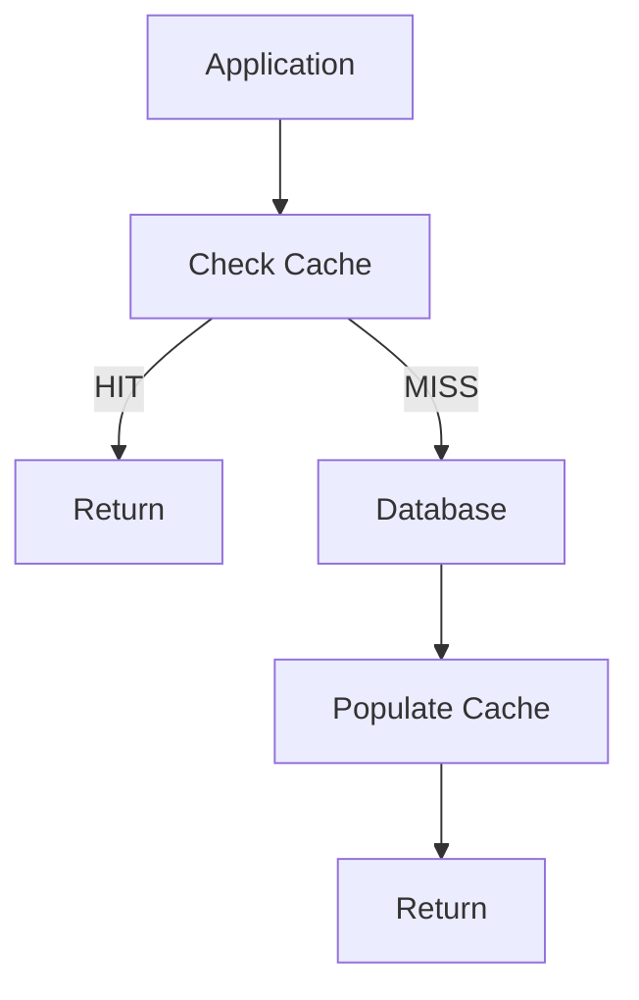

That application-managed relationship is what makes this **Cache-Aside**.

The fact that population happens on demand is a common characteristic, not the complete definition.

---

# 8. A Simple Mental Model

Use these two questions:

### Lazy loading asks:

> **"When should I load this?"**

Answer:

```text
When it is actually needed.
```

### Cache-Aside asks:

> **"Who manages the cache, and what happens on a cache miss?"**

Answer:

```text
The application manages it.

On a miss:
Source → Cache → Return
```

This distinction will remain useful when we study other caching strategies.

---

# 9. Why This Distinction Matters

Suppose an application proactively fills a cache every morning:

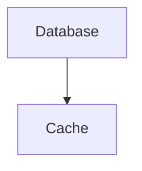

That is cache population, but it is not necessarily Cache-Aside.

Likewise, another application might lazily load some data without using a cache at all:

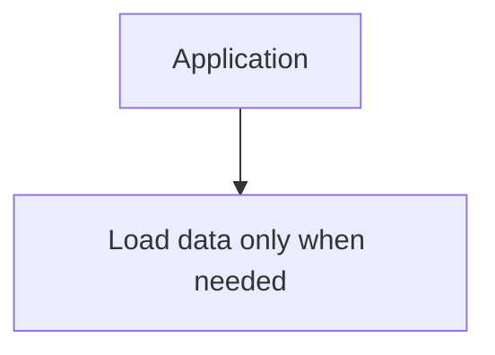

That is lazy loading, but it is not Cache-Aside.

Therefore:

```text
Lazy loading ≠ Cache-Aside
```

Instead:

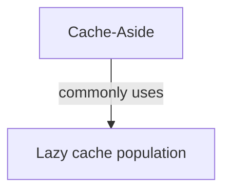

---

# 10. Updated Key Principle

> **Cache-Aside is an application-managed caching pattern. It commonly uses lazy cache population: load from the source and populate the cache only when a request needs data that is not already cached.**

Remember:

```text
Lazy loading:
"When do we load it?"

Cache-Aside:
"How does the application manage the cache?"
```

This terminology will also make the transition to **03.06 — Write-Through Cache** clearer.

---

# 11. The Basic Architecture

Without caching:

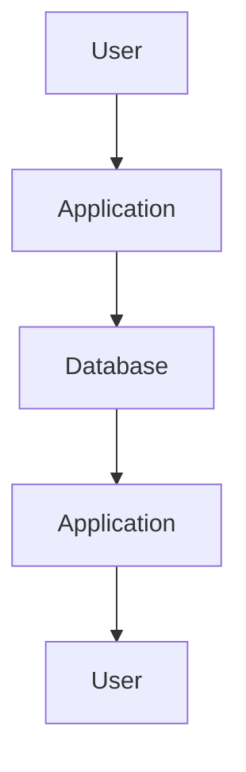

With Cache-Aside:

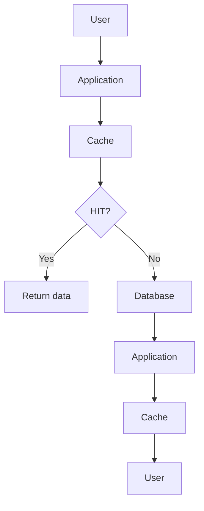

The important point is:

> **The application decides when to use the cache.**

The database does not know that the cache exists.

---

# 12. Why Is It Called "Cache-Aside"?

The cache sits **aside** from the primary data store.

The application interacts with both:

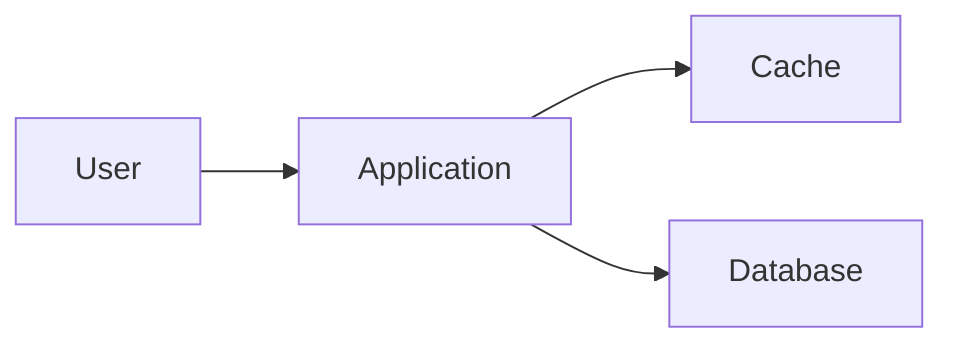

The application does not simply send every request through the cache.

Instead, it explicitly performs operations such as:

```text
cache.get()
cache.set()
database.query()
```

This is why the application is said to manage the cache **aside** from the database.

---

# 13. The Core Read Flow

The most important Cache-Aside flow is:

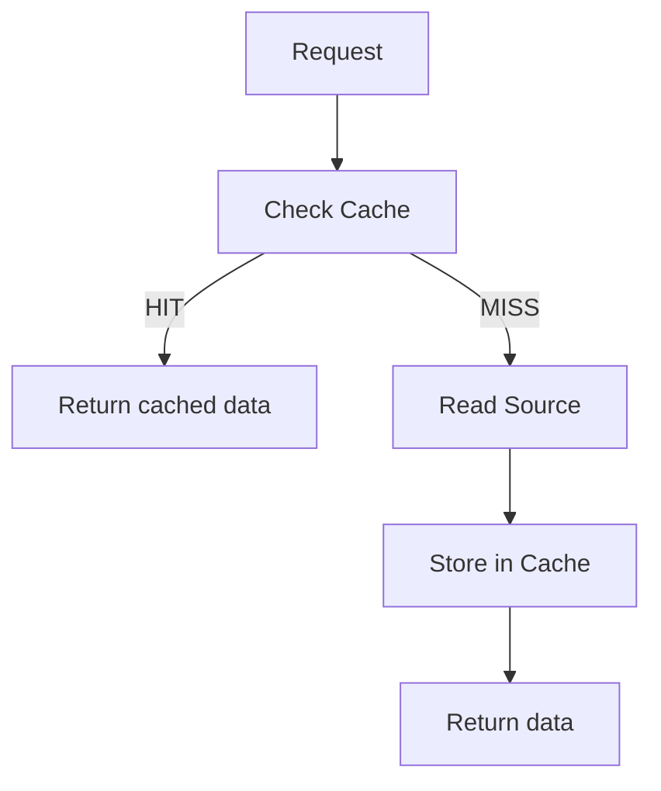

There are two possible paths:

### Cache Hit

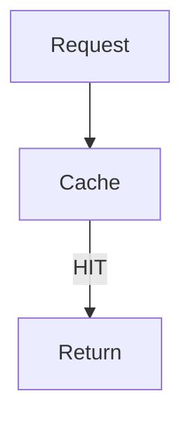

### Cache Miss

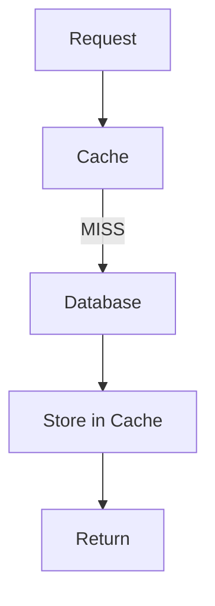

Understanding these two paths is the foundation of Cache-Aside.

---

# 14. Cache Hit

Suppose a user requests:

```text
GET /products/101
```

The application creates a cache key:

```text
product:101
```

It checks the cache:

```text
GET product:101
```

Suppose the cache contains:

```text
product:101
{
    "id": 101,
    "name": "Laptop",
    "price": 65000
}
```

This is a **cache hit**.

The application returns the cached value.

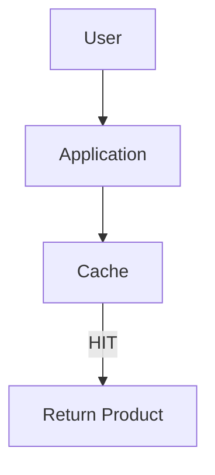

The database is not contacted.

This is where Cache-Aside saves work.

---

# 15. Cache Miss

Now suppose:

```text
GET product:202
```

The application checks:

```text
product:202
```

But the cache does not contain it.

This is a **cache miss**.

The application then reads from the database:

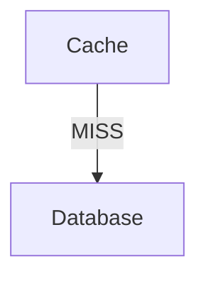

Suppose the database returns:

```json
{
    "id": 202,
    "name": "Keyboard",
    "price": 1500
}
```

The application then stores that result in the cache:

```text
SET product:202
```

Then it returns the result to the user.

Complete flow:

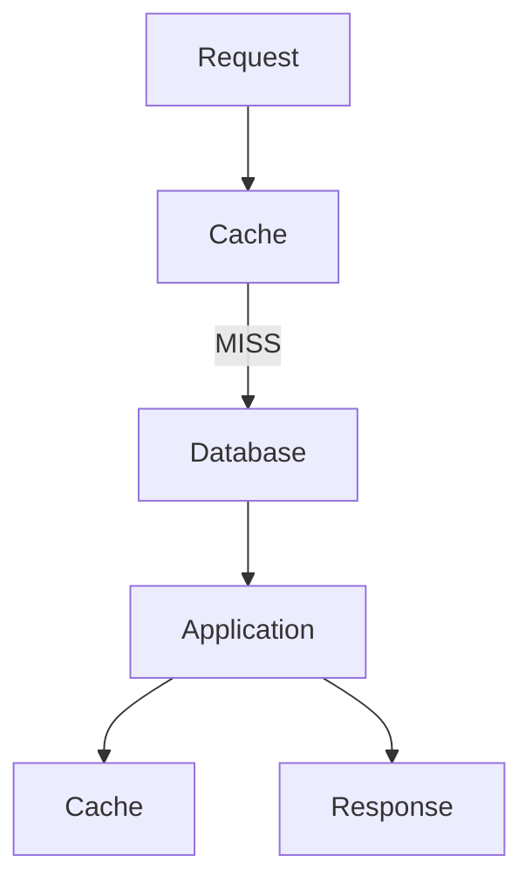

The next request for the same product may now be served from the cache.

---

# 16. The Application Owns the Cache Logic

One of the most important ideas in Cache-Aside is **responsibility**.

The application decides:

* what to cache
* when to read the cache
* when to populate the cache
* what cache key to use
* how long the value should live
* when to invalidate it
* what to do when the cache fails

The database generally remains unaware of these decisions.

Conceptually:

```mermaid
flowchart TD
  accTitle: The application owns the cache logic
  accDescr: The application talks to the cache and to the database.
  A["Application"] --> C["Cache"]
  A --> D["Database"]
```

The application is coordinating both systems.

---

# 17. Why Cache-Aside Is So Common

Cache-Aside is popular because it is relatively simple and gives the application direct control.

It can be added to an existing application without fundamentally changing the database.

For example:

Before:

```mermaid
flowchart LR
  accTitle: Without a cache
  accDescr: The application reads the database.
  A["Application"] --> D["Database"]
```

After:

```mermaid
flowchart LR
  accTitle: Cache-Aside adds one dependency
  accDescr: The application talks to the cache and to the database.
  A["Application"] --> C["Cache"]
  A --> D["Database"]
```

The database can remain the source of truth.

The cache becomes an optimization layer.

This separation can make the architecture easier to reason about:

```text
Database = authoritative data

Cache = reusable copy
```

---

# 18. The Read Path in Detail

Let's examine the complete read operation.

Suppose the application needs user `42`.

### Step 1 — Build the key

```text
user:42
```

### Step 2 — Check cache

```text
cache.get("user:42")
```

### Step 3 — If found

Return the cached value.

```mermaid
flowchart TD
  accTitle: Step 3 — If found
  accDescr: HIT, then Return.
  N0["HIT"] --> N1["Return"]
```

### Step 4 — If not found

Read from the database.

```mermaid
flowchart TD
  accTitle: Step 4 — If not found
  accDescr: MISS, then Database query.
  N0["MISS"] --> N1["Database query"]
```

### Step 5 — Populate cache

```text
cache.set(
    "user:42",
    userData,
    TTL
)
```

### Step 6 — Return data

```mermaid
flowchart TD
  accTitle: Step 6 — Return data
  accDescr: The database result reaches the application, which stores it in the cache and returns it to the user.
  D["Database"] --> A["Application"]
  A --> C["Cache"]
  A --> U["User"]
```

This is the standard Cache-Aside read pattern.

---

# 19. Pseudocode

A simplified implementation looks like this:

```text
function getUser(userId):

    key = "user:" + userId

    data = cache.get(key)

    if data exists:
        return data

    data = database.getUser(userId)

    if data exists:
        cache.set(key, data, TTL)

    return data
```

The important sequence is:

```mermaid
flowchart TD
  accTitle: The pseudocode as a flow
  accDescr: cache.get(). HIT: return. MISS: database.get(), cache.set(), return.
  C["cache.get()"] -->|"HIT"| H["return"]
  C -->|"MISS"| M0["database.get()"] --> M1["cache.set()"] --> M2["return"]
```

This pattern can be implemented using many different cache technologies.

The pattern is architectural; it is not tied to one specific product.

---

# 20. The Write Path

The read path is straightforward.

The write path requires more thought.

Suppose the user changes a product price:

```text
Product 101
Old price: ₹65,000
New price: ₹62,000
```

The application updates the database.

But what happens to:

```text
product:101
```

in the cache?

The old cached value may still exist.

This creates a consistency problem.

A common approach is:

```mermaid
flowchart LR
  accTitle: Update, then invalidate
  accDescr: The application updates the database and invalidates the cache.
  A["Application"] --> D["Update Database"]
  A --> I["Invalidate Cache"]
```

For example:

```text
UPDATE products
SET price = 62000
WHERE id = 101;

DELETE product:101 from cache;
```

The next read causes a cache miss:

```mermaid
flowchart TD
  accTitle: The next read reloads
  accDescr: The cache misses, the database returns the new value, and it is stored in the cache.
  C["Cache"] -->|"MISS"| D["Database"] --> V["New value"] --> C2["Cache"]
```

This is one common Cache-Aside write strategy.

---

# 21. Write → Invalidate → Lazy Reload

The complete pattern can be represented as:

```mermaid
flowchart TD
  accTitle: Write, invalidate, lazy reload
  accDescr: WRITE, then Update Database, then Invalidate Cache, then Next READ, then Cache MISS, then Read Database, then Populate Cache, then Return.
  N0["WRITE"] --> N1["Update Database"] --> N2["Invalidate Cache"] --> N3["Next READ"] --> N4["Cache MISS"] --> N5["Read Database"] --> N6["Populate Cache"] --> N7["Return"]
```

Notice something important:

The application does **not** immediately have to put the new value into the cache.

It can simply remove the old value.

The next request loads the current value.

This is another reason the pattern is called **Lazy Loading**.

---

# 22. Why Invalidation Matters

Suppose:

```text
Database:
price = 62000

Cache:
price = 65000
```

If the application keeps returning the cache value, users see:

```text
₹65,000
```

even though the database contains:

```text
₹62,000
```

The cache has become stale.

Therefore:

> **Adding data to a cache is only half of the problem. Keeping cached data reasonably correct is the other half.**

Cache-Aside does not automatically solve invalidation.

The application must define the behavior.

---

# 23. Cache Keys

A Cache-Aside design depends heavily on good cache keys.

For example:

```text
user:42
product:101
order:9001
```

A key should identify exactly what the cached value represents.

Poor key design can cause:

* collisions
* incorrect data
* difficult invalidation
* accidental sharing between users
* unnecessary cache misses

For example, this is ambiguous:

```text
42
```

These are clearer:

```text
user:42
order:42
product:42
```

The key becomes part of the application's caching contract.

---

# 24. Cache Keys and Request Parameters

Consider:

```text
GET /products?category=laptop
```

and:

```text
GET /products?category=phone
```

They cannot use the same cache key.

Possible keys:

```text
products:category:laptop
products:category:phone
```

If pagination is involved:

```text
products:category:laptop:page:1
products:category:laptop:page:2
```

The cache key must represent the inputs that affect the result.

A useful question is:

> **If these two requests can return different data, should they have different cache keys?**

Usually, yes.

---

# 25. TTL

Cache-Aside commonly uses a **TTL — Time To Live**.

TTL defines how long a cached value can remain before it expires.

Example:

```text
product:101
TTL = 300 seconds
```

After five minutes, the entry may expire.

The next request:

```mermaid
flowchart TD
  accTitle: Expiry leads to a reload
  accDescr: The cache misses or the entry has expired, so the database is read and the cache repopulated.
  C["Cache"] -->|"MISS / expired"| D["Database"] --> C2["Cache"]
```

TTL helps prevent cached data from remaining stale forever.

But TTL is not a universal consistency solution.

A shorter TTL generally means:

```text
Less stale time
More cache misses
More source reads
```

A longer TTL can mean:

```text
Fewer cache misses
More potential staleness
```

The appropriate value depends on the data and business requirements.

---

# 26. Cache-Aside and Consistency

Suppose:

```text
Database = ₹62,000
Cache    = ₹65,000
```

The cache is stale.

There are several ways this can happen:

* the database changed
* invalidation failed
* the application forgot to invalidate
* another service changed the data
* the cache entry has not expired yet

Therefore, Cache-Aside systems often operate with **some degree of eventual consistency** for cached data.

The important question is not:

> "Is the cache always perfectly current?"

Instead ask:

> **"How much staleness can this particular piece of data tolerate?"**

For example:

### Product description

A few seconds of staleness may be acceptable.

### Bank account balance

Stale cached data may be unacceptable for an authoritative balance display.

The data's correctness requirements should influence whether and how it is cached.

---

# 27. Cache-Aside With a Distributed Cache

A local in-memory cache belongs to one application instance.

For example:

```mermaid
flowchart TD
  accTitle: Local caches per server
  accDescr: The user reaches App Server A with Local Cache A, or App Server B with Local Cache B.
  U["User"] --> A["App Server A"] --> CA["Local Cache A"]
  U --> B["App Server B"] --> CB["Local Cache B"]
```

The two application instances do not automatically share their local caches.

With a distributed cache:

```mermaid
flowchart TD
  accTitle: A shared distributed cache
  accDescr: App A and App B both use the distributed cache.
  A["App A"] & B["App B"] --> D["Distributed Cache"]
```

Both instances can access the same cached data.

This is particularly useful when the application is horizontally scaled.

Example:

```mermaid
flowchart TD
  accTitle: Many instances, one cache
  accDescr: 10 application instances, then Shared Cache, then Database.
  N0["10 application instances"] --> N1["Shared Cache"] --> N2["Database"]
```

Cache-Aside still works the same way.

The location of the cache has changed, but the application responsibility remains.

---

# 28. Cache-Aside With Multiple Application Instances

Suppose two requests arrive at different application servers.

```mermaid
flowchart LR
  accTitle: Requests land on different instances
  accDescr: Request 1 goes to App A; Request 2 goes to App B.
  R1["Request 1"] --> A["App A"]
  R2["Request 2"] --> B["App B"]
```

Both need:

```text
product:101
```

With a shared distributed cache:

```mermaid
flowchart TD
  accTitle: Both instances see the same entry
  accDescr: The distributed cache holds product:101, which App A and App B both use.
  D["Distributed Cache"] --- P["product:101"]
  P --> A["App A"]
  P --> B["App B"]
```

Both can reuse the same cached result.

Without a shared cache:

```mermaid
flowchart LR
  accTitle: Separate local caches
  accDescr: App A uses Local Cache A; App B uses Local Cache B.
  A["App A"] --> CA["Local Cache A"]
  B["App B"] --> CB["Local Cache B"]
```

The same product may be cached twice.

Neither approach is automatically correct or incorrect.

The system's scaling and consistency requirements determine the appropriate design.

---

# 29. What Happens When the Cache Is Down?

A cache is usually an optimization layer.

That means the application may be able to continue operating if the cache becomes unavailable.

For example:

```mermaid
flowchart TD
  accTitle: The cache is down
  accDescr: The application cannot reach the cache; the database is behind it.
  A["Application"] -. "X" .- C["Cache"] --> D["Database"]
```

The application can potentially fall back to the database.

Conceptually:

```mermaid
flowchart TD
  accTitle: Falling back
  accDescr: Try the cache. Available: use cache. Unavailable: use the database.
  T["Try Cache"] -->|"Available"| U["use cache"]
  T -->|"Unavailable"| D["Use Database"]
```

However, this creates a serious load consideration.

Suppose:

```text
Normal:
80% cache hits
20% database requests
```

Then the cache fails.

Suddenly:

```text
100% database requests
```

The database may become overloaded.

So:

> **A cache failure can turn a performance problem into a capacity problem.**

This is why cache failure behavior must be part of system design.

---

# 30. Cache Failure vs Cache Miss

These are not exactly the same thing.

### Cache Miss

The cache is working but does not contain the requested value.

```mermaid
flowchart TD
  accTitle: A cache miss
  accDescr: Cache, then MISS.
  N0["Cache"] --> N1["MISS"]
```

The application normally reads from the source.

### Cache Failure

The cache itself cannot be used.

```mermaid
flowchart TD
  accTitle: A cache failure
  accDescr: Cache, then ERROR / TIMEOUT.
  N0["Cache"] --> N1["ERROR / TIMEOUT"]
```

The application must decide whether to:

* fall back to the source
* fail the request
* use another cache
* return a degraded response

A cache miss is normal.

A cache outage is a system failure scenario.

---

# 31. The Concurrent Cache Miss Problem

Consider this situation:

```text
Cache is empty
```

Now 1,000 requests for the same product arrive almost simultaneously.

```mermaid
flowchart LR
  accTitle: Many requests miss at once
  accDescr: Requests 1 to 1000 all miss the empty cache.
  R1["Request 1"] & R2["Request 2"] & R3["Request 3"] & R4["Request 4"] & E["..."] & R1000["Request 1000"] --> M["Cache MISS"]
```

If every request independently queries the database:

```mermaid
flowchart TD
  accTitle: Every miss queries the database
  accDescr: 1000 requests, then 1000 database queries.
  N0["1000 requests"] --> N1["1000 database queries"]
```

The cache was supposed to protect the database.

Instead, the cache miss caused a burst of database work.

This is an important distributed-system problem.

---

# 32. Cache Stampede

A large number of simultaneous requests all missing the same cache entry can create a **cache stampede**.

Example:

```mermaid
flowchart TD
  accTitle: Concurrent misses
  accDescr: The cache misses for Req1, Req2 and Req3, and all three go to the database.
  C["Cache"] --> M["MISS"] --> Q1["Req1"] & Q2["Req2"] & Q3["Req3"]
  Q1 & Q2 & Q3 --> D["Database"]
```

The database receives many duplicate requests for the same data.

This can happen when:

* a popular key expires
* a cache is flushed
* a cache node fails
* many requests arrive for a newly popular item

The deeper lesson is:

> **Caching changes load patterns; it does not simply remove load.**

Cache stampede is covered more deeply in **03.10 — Cache Stampede**.

---

# 33. Preventing Concurrent Misses

There are several techniques systems may use.

One is to allow only one request to load a particular key while others wait.

Conceptually:

```mermaid
flowchart TD
  accTitle: One request loads, the others wait
  accDescr: On a cache miss, the first request reads the database and sets the cache; the other requests wait for that cache SET; then all get responses.
  M["Cache MISS"] --> F["First request"] --> D["Database"] --> S["Cache SET"] --> R["Responses"]
  M --> O["Other requests"] --> S
```

This is sometimes called **request coalescing**, **single-flight**, or using a lock around cache population.

The exact implementation depends on the architecture and cache technology.

Do not introduce such mechanisms automatically.

They add complexity and must be justified by the workload.

---

# 34. Cache Stampede Preview

Cache-Aside makes cache misses explicit.

That is useful because the application can control what happens on a miss.

But it also means the application must think about:

```text
What happens if:
100 requests miss?
10,000 requests miss?
1 million requests miss?
```

Later:

**03.10 — Cache Stampede**

will examine this problem in depth.

---

# 35. Cache-Aside and Cache Population

An important characteristic of Cache-Aside is:

> **The cache only contains data that has actually been requested and successfully loaded.**

Suppose the database contains:

```text
10 million products
```

But users frequently request only:

```text
50,000 products
```

Cache-Aside does not necessarily require loading all 10 million products.

Instead:

```mermaid
flowchart TD
  accTitle: Populated on demand
  accDescr: Requesting product A populates A; requesting product B populates B.
  A["Request product A"] --> PA["Populate A"]
  B["Request product B"] --> PB["Populate B"]
```

The cache grows according to actual access patterns.

This can be efficient when only a subset of data is frequently accessed.

---

# 36. Cache-Aside Is Lazy

The "lazy" behavior can be visualized as:

```text
Before request:

Cache:
[ empty ]

Database:
[A] [B] [C] [D] [E]
```

User requests `C`:

```text
Database:
[A] [B] [C] [D] [E]
          |
          v
        Cache
          C
```

User requests `A`:

```text
Cache:
[C] [A]
```

The cache gradually becomes populated based on demand.

This is different from a strategy that proactively writes every database update into the cache.

---

# 37. Cache-Aside vs No Cache

Without caching:

```mermaid
flowchart TD
  accTitle: No cache
  accDescr: Request, then Database.
  N0["Request"] --> N1["Database"]
```

Every request that needs the data may reach the database.

With Cache-Aside:

```mermaid
flowchart TD
  accTitle: Cache-Aside
  accDescr: Request, cache. HIT: return. MISS: database, then cache.
  R["Request"] --> C["Cache"]
  C -->|"HIT"| H["Return"]
  C -->|"MISS"| D["Database"] --> C2["Cache"]
```

If the same data is requested repeatedly, Cache-Aside can substantially reduce repeated source reads.

But if requests rarely repeat, the cache may provide little benefit.

---

# 38. Cache-Aside vs Database Index

Cache-Aside and database indexes solve different problems.

An index helps the database **find data more efficiently**.

```mermaid
flowchart TD
  accTitle: What an index does
  accDescr: Database, then Index, then Required rows.
  N0["Database"] --> N1["Index"] --> N2["Required rows"]
```

Cache-Aside tries to **avoid the database operation altogether** for repeated requests.

```mermaid
flowchart TD
  accTitle: What a cache does
  accDescr: Application, cache, HIT, return.
  A["Application"] --> C["Cache"] -->|"HIT"| R["Return"]
```

A useful distinction:

```text
Index:
"Make the database lookup faster."

Cache:
"Avoid the lookup when the result can be reused."
```

Both may exist in the same system.

---

# 39. Cache-Aside vs Query Optimization

Suppose a database query takes:

```text
150 ms
```

You could optimize the query to:

```text
30 ms
```

Or, for frequently repeated data, a cache hit might avoid the query entirely:

```text
Cache hit:
5 ms
```

But caching the result does not mean the query should remain badly designed.

A healthy progression can be:

```mermaid
flowchart TD
  accTitle: Optimize first, then cache
  accDescr: Optimize the database operation, then Then cache repeated expensive results when useful.
  N0["Optimize the database operation"] --> N1["Then cache repeated expensive results when useful"]
```

Caching should not be used to hide fundamentally broken data access.

---

# 40. Cache-Aside and Serialization

Cached values must usually be represented in a format that can be stored and retrieved.

For example:

```json
{
    "id": 101,
    "name": "Laptop",
    "price": 62000
}
```

The application may need to:

```mermaid
flowchart TD
  accTitle: Writing to the cache
  accDescr: Object, then Serialize, then Cache.
  N0["Object"] --> N1["Serialize"] --> N2["Cache"]
```

and later:

```mermaid
flowchart TD
  accTitle: Reading from the cache
  accDescr: Cache, then Deserialize, then Object.
  N0["Cache"] --> N1["Deserialize"] --> N2["Object"]
```

Serialization and deserialization also consume CPU and memory.

For very large cached objects, this cost can become relevant.

---

# 41. Cache-Aside and Security

Not every piece of data should be cached.

Be careful with:

* private user data
* authorization-sensitive responses
* personal information
* temporary authentication information
* tenant-specific data
* data whose access permissions change frequently

For example, suppose:

```text
user:42:profile
```

contains private information.

The cache key and cache-access logic must ensure that another user cannot accidentally receive it.

A cache bug can become a security bug.

---

# 42. Cache-Aside and Authorization

Consider:

```text
GET /orders/9001
```

The application must determine whether the current user is allowed to see order `9001`.

A dangerous design would be:

```mermaid
flowchart TD
  accTitle: Returning a cached order without checks
  accDescr: Request, then Cache, then Return cached order.
  N0["Request"] --> N1["Cache"] --> N2["Return cached order"]
```

without checking authorization.

A safer conceptual flow may be:

```mermaid
flowchart TD
  accTitle: Check access before the cache
  accDescr: Request, then Authenticate, then Authorize, then Check Cache, then Return appropriate data.
  N0["Request"] --> N1["Authenticate"] --> N2["Authorize"] --> N3["Check Cache"] --> N4["Return appropriate data"]
```

The exact placement depends on the application's data and security model.

The important principle is:

> **Caching must not bypass access-control decisions.**

---

# 43. What Should Be Cached?

Good Cache-Aside candidates often have:

* frequent reads
* repeated requests
* relatively expensive source computation
* relatively stable data
* acceptable staleness
* predictable cache keys

Examples:

```text
Product catalog
User profile
Application configuration
Popular articles
Exchange-rate information
Computed reports
Frequently requested API responses
```

But suitability depends on the specific requirements.

---

# 44. What Should Usually Not Be Cached?

Be cautious with data that is:

* extremely dynamic
* rarely requested
* highly sensitive
* difficult to invalidate correctly
* too large relative to its reuse
* strongly dependent on rapidly changing state

For example:

```text
Real-time inventory count
```

may require different treatment from:

```text
Product description
```

The key question is:

> **Can the application safely reuse this value for some period of time?**

---

# 45. Cache-Aside and Hot Data

Suppose:

```text
Product A = 50 requests/sec
Product B = 2 requests/sec
Product C = 1 request/sec
```

Product A is much hotter.

If:

```text
product:A
```

is cached successfully, many requests can be served without repeatedly reaching the database.

This is where caching often produces significant value:

```text
High reuse
   +
Expensive source operation
   =
Strong cache candidate
```

But hot keys can also create concentrated load and require careful handling at larger scale.

---

# 46. Before Cache-Aside

Imagine:

```mermaid
flowchart TD
  accTitle: Before Cache-Aside
  accDescr: 1,000 req/s reach the application and the database: 1,000 reads/s.
  R["1,000 req/s"] --> A["Application"] --> D["Database"] --- L["1,000 reads/s"]
```

If the database cannot handle that workload efficiently, performance becomes a problem.

---

# 47. After Cache-Aside

Suppose 800 requests are cache hits:

```mermaid
flowchart TD
  accTitle: After Cache-Aside
  accDescr: 1,000 req/s reach the application, which uses the cache (800 hits) and the database (200 reads/s).
  R["1,000 req/s"] --> A["Application"]
  A --> C["Cache"] --- H["800 hits"]
  A --> D["Database"] --- L["200 reads/s"]
```

The database receives fewer reads.

The exact numbers are only an example.

The important relationship is:

```text
Database load
≈ requests that cannot be served by cache
```

assuming the cached operation maps directly to the source read.

---

# 48. Cache Hit Ratio

A useful metric is:

```text
Cache Hit Ratio =
Cache Hits / Total Cache Requests
```

For example:

```text
Cache requests = 10,000
Cache hits     = 8,000
```

Then:

```text
Hit ratio = 8,000 / 10,000
          = 80%
```

The remaining:

```text
20%
```

are misses.

A high hit ratio can indicate that caching is helping, but **hit ratio alone is not enough**.

You should also consider:

* latency
* cache cost
* database load
* memory usage
* stale data
* error rates
* eviction rate

---

# 49. Cache-Aside Is Not "Always Faster"

Caching adds work.

A cache lookup might involve:

```mermaid
flowchart TD
  accTitle: A remote cache call
  accDescr: Application, then Network, then Distributed Cache, then Network, then Application.
  N0["Application"] --> N1["Network"] --> N2["Distributed Cache"] --> N3["Network"] --> N4["Application"]
```

If the original database query is already extremely fast, the cache may not provide enough benefit to justify its complexity.

There may also be:

* serialization cost
* memory cost
* network cost
* invalidation complexity
* monitoring requirements
* operational cost

Therefore:

> **Use caching when the avoided work is worth the cost and complexity of caching.**

---

# 50. Cache-Aside Decision Flow

A simple decision process:

```mermaid
flowchart TD
  accTitle: Cache-Aside decision flow
  accDescr: Is the data requested repeatedly? No: maybe no cache. Yes: is the source operation expensive? No: measure first. Yes: can the data tolerate some staleness? No: consider another design. Yes: can the result be safely identified by a key? No: reconsider caching. Yes: Cache-Aside.
  subgraph R1[" "]
    direction TB
    Q1{"Is the data requested<br/>repeatedly?"} -->|"No"| N1["Maybe no cache"]
  end
  subgraph R2[" "]
    direction TB
    Q2{"Is the source operation<br/>expensive?"} -->|"No"| N2["Measure first"]
  end
  subgraph R3[" "]
    direction TB
    Q3{"Can the data tolerate<br/>some staleness?"} -->|"No"| N3["Consider<br/>another design"]
  end
  subgraph R4[" "]
    direction TB
    Q4{"Can the result be safely<br/>identified by a key?"} -->|"No"| N4["Reconsider<br/>caching"]
  end
  R1 -->|"Yes"| R2 -->|"Yes"| R3 -->|"Yes"| R4 -->|"Yes"| Y["Cache-Aside"]
```

This is a reasoning framework, not a rigid rule.

---

# 51. Common Mistake: Caching Everything

A common beginner approach is:

```text
"Cache everything!"
```

This creates problems.

More cached data means:

* more memory usage
* more invalidation
* more stale data
* more operational complexity
* more difficult debugging

A better approach:

```mermaid
flowchart TD
  accTitle: Cache deliberately
  accDescr: Find expensive repeated work, then Measure it, then Cache where reuse justifies the complexity.
  N0["Find expensive repeated work"] --> N1["Measure it"] --> N2["Cache where reuse justifies the complexity"]
```

---

# 52. Common Mistake: Forgetting Invalidation

This is one of the most important Cache-Aside mistakes.

The application adds:

```text
cache.set()
```

but forgets:

```text
cache.delete()
```

when the underlying data changes.

The result can be:

```text
Database = NEW
Cache    = OLD
```

The system may appear fast while returning incorrect information.

Performance without correctness is not a successful design.

---

# 53. Common Mistake: Treating Cache as the Source of Truth

Usually, in a Cache-Aside design:

```text
Database = source of truth
Cache    = reusable copy
```

If the cache disappears:

```mermaid
flowchart TD
  accTitle: The cache can be rebuilt
  accDescr: Cache lost, then Data can be reconstructed, then Database.
  N0["Cache lost"] --> N1["Data can be reconstructed"] --> N2["Database"]
```

This is a useful architectural property.

The cache should not automatically become the authoritative store unless the overall architecture explicitly makes it one.

---

# 54. Common Mistake: Ignoring Cache Failure

A developer may think:

```text
"If Redis goes down, users will just hit the database."
```

That may be true technically.

But consider:

```text
Normal:
10,000 req/s
80% cache hits
2,000 DB reads/s
```

After cache failure:

```text
10,000 DB reads/s
```

The database may not be able to handle that sudden increase.

Therefore, cache failure should be tested as a capacity scenario.

---

# 55. Common Mistake: Poor Cache Keys

Consider:

```text
product:101
```

versus:

```text
product:101:en:mobile
```

If language, device, permissions, tenant, or other parameters affect the result, the key may need to represent them.

Otherwise, one request may receive another request's cached representation.

Cache-key design is therefore a correctness concern, not merely a naming preference.

---

# 56. Common Mistake: Ignoring Concurrent Misses

This pattern:

```mermaid
flowchart TD
  accTitle: One miss
  accDescr: MISS, then Database, then SET.
  N0["MISS"] --> N1["Database"] --> N2["SET"]
```

looks safe when there is one request.

At high concurrency:

```mermaid
flowchart LR
  accTitle: Many misses at once
  accDescr: Five misses all reach the database.
  A["MISS"] & B["MISS"] & C["MISS"] & D["MISS"] & E["MISS"] --> DB["Database"]
```

can create a large burst of duplicate work.

This is why cache stampede prevention becomes important for highly popular keys.

---

# 57. Hands-On Lab — Build Cache-Aside

This lab demonstrates Cache-Aside using a small application and PostgreSQL.

The goal is not to build a production cache.

The goal is to observe:

```text
Cache Hit
Cache Miss
Database fallback
Cache population
Cache invalidation
```

---

## 48.1 Lab Architecture

Use:

```mermaid
flowchart LR
  accTitle: Lab architecture
  accDescr: The application uses Redis and PostgreSQL.
  A["Application"] --> R["Redis"]
  A --> P["PostgreSQL"]
```

The application will implement Cache-Aside.

---

## 48.2 Example Data

Create a simple table:

```sql
CREATE TABLE products (
    id SERIAL PRIMARY KEY,
    name TEXT NOT NULL,
    price NUMERIC(10,2) NOT NULL
);
```

Insert sample data:

```sql
INSERT INTO products (name, price)
VALUES
('Laptop', 65000),
('Keyboard', 1500),
('Mouse', 800);
```

---

## 48.3 Initial Read Without Cache

First run a database query:

```sql
SELECT *
FROM products
WHERE id = 1;
```

Observe the database operation.

---

## 48.4 Implement the Cache Key

For product ID `1`:

```text
product:1
```

For product ID `2`:

```text
product:2
```

The key should uniquely identify the product.

---

## 48.5 First Request

Start with an empty cache.

Request:

```text
GET /products/1
```

Expected flow:

```mermaid
flowchart TD
  accTitle: First request
  accDescr: The application checks Redis and misses, reads PostgreSQL, then sets product:1 in Redis and sends the response.
  A["Application"] --> R["Redis"] -->|"MISS"| P["PostgreSQL"] --> A2["Application"]
  A2 --> S["Redis SET product:1"]
  A2 --> O["Response"]
```

Record:

```text
Cache: MISS
Database: YES
```

---

## 48.6 Second Request

Send the same request again:

```text
GET /products/1
```

Expected flow:

```mermaid
flowchart TD
  accTitle: Second request
  accDescr: The application checks Redis, hits, and sends the response.
  A["Application"] --> R["Redis"] -->|"HIT"| O["Response"]
```

Record:

```text
Cache: HIT
Database: NO
```

This is the core Cache-Aside behavior.

---

## 48.7 Observe the Cache

Inspect Redis and find:

```text
product:1
```

The cached value should represent the database result.

Conceptually:

```mermaid
flowchart TD
  accTitle: Where the data comes from
  accDescr: The database fills the cache on the first request; later requests are served from the cache.
  D["Database"] -->|"first request"| C["Cache"] -->|"later requests"| A["Application"]
```

---

## 48.8 Test Cache Invalidation

Change the product price:

```sql
UPDATE products
SET price = 62000
WHERE id = 1;
```

Now imagine the cache still contains:

```text
65000
```

If you request the product immediately and the application still uses that cache entry, you may receive the old value.

This demonstrates stale cache data.

Now delete the cache entry:

```text
DEL product:1
```

Request the product again.

Expected:

```mermaid
flowchart TD
  accTitle: Reload after invalidation
  accDescr: The cache misses, the database returns the new value 62000, and it is stored in the cache.
  C["Cache"] -->|"MISS"| D["Database"] --> V["New value: 62000"] --> C2["Cache"]
```

The new value is now cached.

---

## 48.9 Test TTL

Store the cache entry with a short TTL.

For example:

```text
TTL = 30 seconds
```

Request the product.

Observe:

```text
HIT
```

Wait for expiration.

Request again.

Expected:

```mermaid
flowchart TD
  accTitle: After expiry
  accDescr: MISS, then Database, then Cache.
  N0["MISS"] --> N1["Database"] --> N2["Cache"]
```

This demonstrates lazy cache repopulation after expiration.

---

## 48.10 Test a Missing Product

Request:

```text
GET /products/999999
```

The cache misses.

The database returns no product.

The application should decide whether to cache that "not found" result.

One possible strategy is **negative caching**, where the application temporarily caches the absence.

For example:

```text
product:999999 = NOT_FOUND
```

This can prevent repeated database queries for a nonexistent popular key.

However, negative caching introduces its own freshness considerations.

---

## 48.11 Observe Cache Failure

Stop or disconnect the cache.

Send:

```text
GET /products/1
```

Observe what the application does.

A resilient application may:

```mermaid
flowchart TD
  accTitle: Cache failure fallback
  accDescr: Cache unavailable, then Fallback to Database.
  N0["Cache unavailable"] --> N1["Fallback to Database"]
```

But measure the effect on database load.

This is an important system-design experiment.

---

# 58. Lab Challenge

Modify the application so that it records:

```text
cache_hits
cache_misses
database_reads
cache_errors
```

Then generate repeated requests.

For example:

```text
100 requests
```

Measure:

```text
Cache hits:
Cache misses:
Database reads:
Cache errors:
```

Calculate:

```text
Hit Ratio =
Hits / Total Cache Requests
```

Then remove the cache and compare database load.

---

# 59. Lab Challenge — Concurrent Misses

Create a test where many requests arrive for the same uncached product at nearly the same time.

Observe whether you get:

```text
1 database query
```

or:

```text
100 database queries
```

depending on your implementation.

This experiment prepares you for:

**03.10 — Cache Stampede**

---

# 60. Cache-Aside Trade-Offs

| Benefit                             | Cost / Risk                          |
| ----------------------------------- | ------------------------------------ |
| Simple mental model                 | Application manages cache logic      |
| Reduces repeated source reads       | Cache invalidation required          |
| Lazy population                     | First request can be slower          |
| Works with distributed caches       | Cache failure can overload source    |
| Database can remain source of truth | Possible stale data                  |
| Only requested data needs caching   | Cache misses still reach source      |
| Easy to add incrementally           | Concurrent misses need consideration |

There is no free performance.

Cache-Aside trades additional system complexity for reduced repeated work.

---

# 61. When Cache-Aside Fits Well

Cache-Aside is often a good fit when:

* data is read frequently
* the same data is requested repeatedly
* source access is expensive
* some staleness is acceptable
* the application can define reliable cache keys
* the application can manage invalidation
* the source remains authoritative

Examples:

```text
Product catalog
Article content
User profiles
Popular content
Computed results
Configuration
Frequently requested API data
```

---

# 62. When to Be Careful

Be careful when:

* data changes extremely frequently
* stale values are unacceptable
* invalidation is difficult
* authorization varies significantly by request
* cache failures could overwhelm the source
* values are rarely reused
* cache entries are extremely large

In these cases, caching may still be possible, but the design needs stronger guarantees or a different strategy.

---

# 63. Cache-Aside in the Larger System

Cache-Aside is not an isolated component.

It interacts with many other system concepts:

```mermaid
flowchart TD
  accTitle: Cache-Aside in the larger system
  accDescr: Cache-Aside connects to the database (invalidation, then consistency), scaling (shared cache) and failure (fallback).
  C["Cache-Aside"] --> D["Database"] & S["Scaling"] & F["Failure"]
  D --> I["Invalidation"] --> K["Consistency"]
  S --> SC["Shared Cache"]
  F --> FB["Fallback"]
```

It also interacts with:

```text
TTL
Cache Eviction
Cache Stampede
Retries
Timeouts
Rate Limiting
Database Capacity
Observability
```

This is why caching is a system-design concern, not simply a "put Redis in front of the database" exercise.

---

# 64. The Complete Mental Model

When designing Cache-Aside, ask:

### 1. What am I caching?

```text
Product?
User?
Query result?
Computed value?
API response?
```

### 2. What is the source of truth?

```text
Database?
Another service?
External API?
```

### 3. What is the cache key?

```text
product:101
```

### 4. What happens on a hit?

```text
Return cached value
```

### 5. What happens on a miss?

```text
Read source → populate cache → return
```

### 6. How long can the value live?

```text
TTL
```

### 7. What happens when the source changes?

```text
Invalidate?
Update cache?
Wait for TTL?
```

### 8. What happens if the cache fails?

```text
Fallback?
Fail?
Degrade?
```

### 9. What happens if many requests miss simultaneously?

```text
Stampede?
Single-flight?
Lock?
```

### 10. Can the cached value safely be reused?

```text
Fresh enough?
Correct for this user?
Correct for this tenant?
Secure?
```

This is the Cache-Aside design checklist.

---

# 65. Cache-Aside vs Write-Through — Preview

Cache-Aside:

```mermaid
flowchart LR
  accTitle: Cache-Aside
  accDescr: The application manages the database and the cache separately.
  A["Application"] --> D["Database"]
  A --> C["Cache"]
```

The application explicitly manages cache reads and population.

Write-Through:

```mermaid
flowchart TD
  accTitle: Write-Through
  accDescr: Application, then Cache, then Database.
  N0["Application"] --> N1["Cache"] --> N2["Database"]
```

The cache participates directly in the write path.

The two patterns have different responsibilities and trade-offs.

We will study **Write-Through Cache** in:

**03.06 — Write-Through Cache**

---

# 66. Key Principle

> **Cache-Aside means the application checks the cache first, reads the source on a miss, stores the result in the cache, and returns it.**

Remember the core flow:

```mermaid
flowchart TD
  accTitle: The read flow
  accDescr: READ, cache. HIT: return. MISS: source, cache, return.
  S["READ"] --> C["Cache"]
  C -->|"HIT"| H["Return"]
  C -->|"MISS"| M0["Source"] --> M1["Cache"] --> M2["Return"]
```

And for a common write approach:

```mermaid
flowchart TD
  accTitle: The write flow
  accDescr: WRITE, then Database, then Invalidate Cache.
  N0["WRITE"] --> N1["Database"] --> N2["Invalidate Cache"]
```

The pattern is simple.

The system-design work begins when you ask:

```text
How stale can data be?
What happens when cache fails?
What happens during a cache miss storm?
How do we invalidate safely?
```

---

# Quick Reference

| Concept           | Meaning                                              |
| ----------------- | ---------------------------------------------------- |
| Cache-Aside       | Application explicitly manages cache                 |
| Lazy Loading      | Populate cache only when data is requested           |
| Cache Hit         | Requested value exists in cache                      |
| Cache Miss        | Requested value is not in cache                      |
| Cache Key         | Identifier for cached data                           |
| TTL               | Maximum configured lifetime of a cache entry         |
| Invalidation      | Removing or otherwise making cached data unusable    |
| Source of Truth   | Authoritative data store                             |
| Distributed Cache | Cache shared by multiple application instances       |
| Cache Stampede    | Many requests miss and hit the source simultaneously |
| Negative Caching  | Temporarily caching "not found" results              |

---

# Knowledge Check

### 1. What does Cache-Aside mean?

A. The database manages the cache automatically
B. The application manages cache reads and population
C. Every database write automatically updates the cache
D. The cache becomes the source of truth

**Answer:** B

---

### 2. What happens during a cache hit?

A. The application must query the database
B. The cache entry is deleted
C. The cached value can be returned
D. The application must rebuild the value

**Answer:** C

---

### 3. What normally happens during a cache miss?

A. Return an empty response immediately
B. Read from the source and potentially populate the cache
C. Delete the database record
D. Restart the application

**Answer:** B

---

### 4. Why is Cache-Aside called lazy loading?

A. It delays every request
B. Data is added to the cache only when requested
C. The database runs slowly
D. Cache lookups are asynchronous

**Answer:** B

---

### 5. Why is invalidation important?

A. It increases database size
B. It prevents old cached data from being reused indefinitely
C. It disables the cache
D. It removes database indexes

**Answer:** B

---

### 6. What is a cache stampede?

A. Cache storage increasing permanently
B. Many requests simultaneously missing the cache and hitting the source
C. A database index becoming corrupted
D. A cache key becoming shorter

**Answer:** B

---

### 7. Why can cache failure overload a database?

A. The database stops accepting writes
B. Requests that normally hit the cache may suddenly reach the database
C. Cache failure deletes all database indexes
D. Cache failure increases disk capacity

**Answer:** B

---

# Remember

```mermaid
flowchart TD
  accTitle: Cache-Aside
  accDescr: The application checks the cache. HIT: return. MISS: source, cache SET, return.
  subgraph G["Cache-Aside"]
    direction TB
    A["Application"] --> C["Check Cache"]
    C -->|"HIT"| H["Return"]
    C -->|"MISS"| S["Source"] --> T["Cache SET"] --> R["Return"]
  end
```

The cache is a reusable copy.

The application manages it.

The source remains authoritative.

And every cache decision should consider:

```text
Performance
+
Correctness
+
Freshness
+
Failure
+
Cost
```

---

# Next Chapter

**03.06 — Write-Through Cache**

Next, we will examine a different caching responsibility:

> **Instead of the application separately managing the database and cache during writes, what happens when the cache becomes part of the write path?**
