# 03.06 — Write-Through Cache

## Learning Objectives

By the end of this chapter, you should be able to:

* Explain what **Write-Through Cache** means.
* Understand how Write-Through changes the write path.
* Distinguish Write-Through from Cache-Aside.
* Understand the roles of the application, cache, and database.
* Trace a Write-Through write operation.
* Understand what happens when a write succeeds or fails.
* Understand the relationship between cache and source-of-truth data.
* Understand consistency and failure considerations.
* Identify situations where Write-Through can be useful.
* Understand the trade-offs introduced by Write-Through caching.

---

# 1. What Is Write-Through Cache?

**Write-Through Cache** is a caching strategy where a write to cached data is passed through the cache, and the cache ensures that the underlying data store is also updated.

Conceptually:

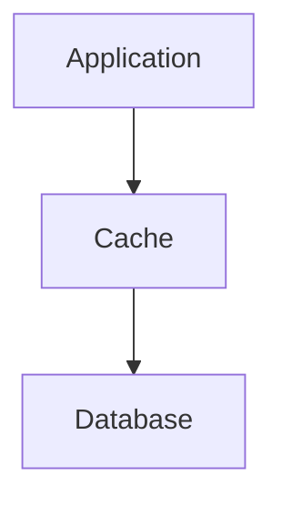

Instead of the application independently deciding:

```text
Update Database
Update/Invalidate Cache
```

the cache participates directly in the write path.

The basic idea is:

> **Write to the cache, and the write is propagated to the underlying data store before the operation is considered successful.**

The exact behavior depends on the cache technology and implementation, but the architectural idea is that the cache and underlying store are kept coordinated during writes.

---

# 2. Why Do We Need Another Caching Strategy?

In Cache-Aside, the application manages the cache.

For example:

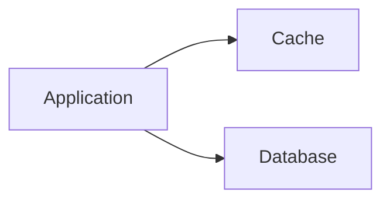

A write might look like:

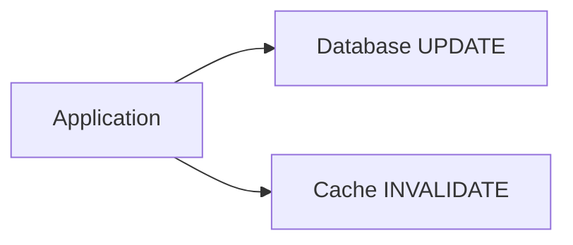

The application is responsible for making sure the two operations happen correctly.

Write-Through changes this responsibility.

Conceptually:


The cache becomes part of the write path.

---

# 3. Cache-Aside vs Write-Through

This distinction is important.

### Cache-Aside


The application directly manages both.

For a write:

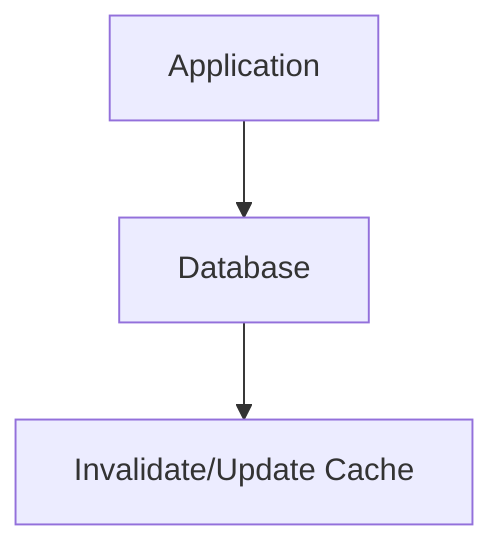

### Write-Through


The application writes through the cache.

A simplified comparison:

| Concept              | Cache-Aside                 | Write-Through                                |
| -------------------- | --------------------------- | -------------------------------------------- |
| Cache read           | Application manages         | Cache participates                           |
| Cache population     | Usually on read miss        | Often coordinated with writes                |
| Write path           | Application manages         | Goes through cache                           |
| Cache responsibility | Mostly application          | Cache participates directly                  |
| Main goal            | Avoid repeated source reads | Keep cache updated as writes occur           |
| Invalidation concern | Important                   | Reduced for writes handled through the cache |
| Complexity           | Application-side            | Cache/write-path infrastructure              |

Neither pattern is universally better.

They solve different problems and create different trade-offs.

---

# 4. The Basic Write-Through Flow

Suppose the application needs to update:

```text
Product 101
Price = ₹62,000
```

The application sends:

```text
UPDATE product:101
price = 62000
```

to the cache layer.

The cache then writes the change to the underlying database.


After the operation succeeds:

```text
Cache = ₹62,000
Database = ₹62,000
```

The important idea is that the cache participates in the write.

---

# 5. A Complete Write Operation

Consider:

```text
PUT /products/101
price = 62000
```

Conceptually:

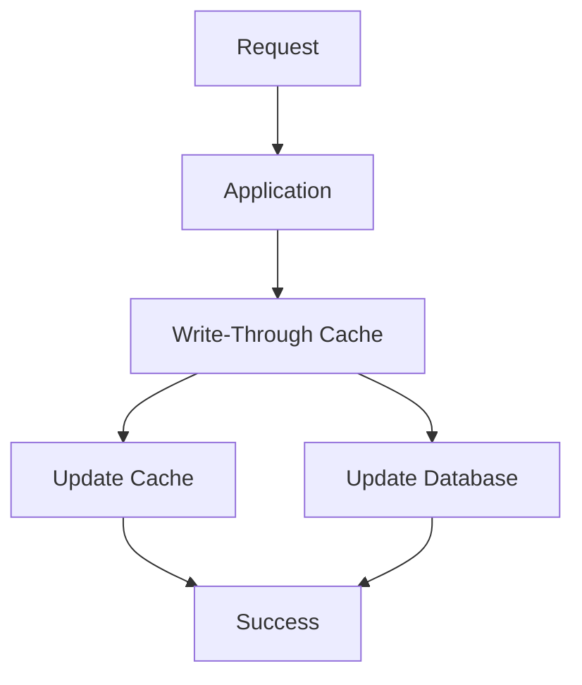

The exact internal ordering can vary by implementation.

The important property is:

> **The write operation is coordinated through the caching layer rather than requiring the application to separately update the cache after updating the database.**

---

# 6. Why Is It Called "Write-Through"?

The name describes the direction of the write.


The write goes **through the cache** to reach the underlying store.

Compare this with Cache-Aside:

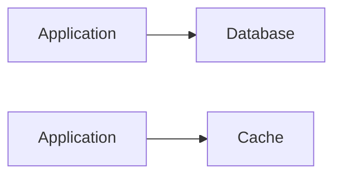

The application manages the two operations separately.

Write-Through puts the cache in the middle of the write path.

---

# 7. Read Behavior

Write-Through primarily describes the **write path**.

Reads can still be served from the cache:

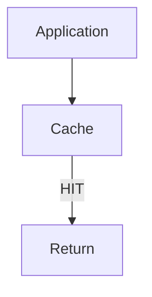

So a typical system may look like:

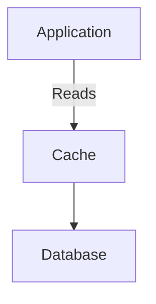

The cache can therefore provide fast reads while also participating in writes.

---

# 8. Example: Product Catalog

Suppose:

```text
Product 101
Name: Laptop
Price: ₹65,000
```

The cache contains:

```text
product:101
{
    "name": "Laptop",
    "price": 65000
}
```

The user changes the price:

```text
₹65,000 → ₹62,000
```

With a Write-Through design:

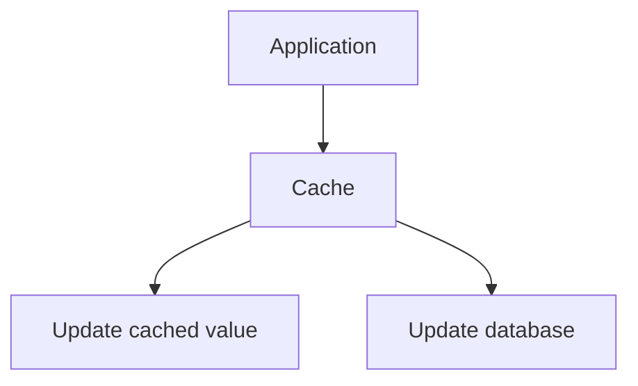

After a successful write:

```text
Cache:
₹62,000

Database:
₹62,000
```

A subsequent read can immediately use the updated cache value.

---

# 9. The Key Difference From Cache-Aside

With Cache-Aside, imagine:

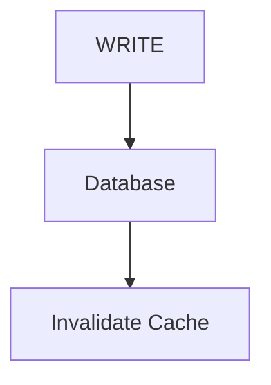

The cache becomes empty for that key.

Then the next read does:

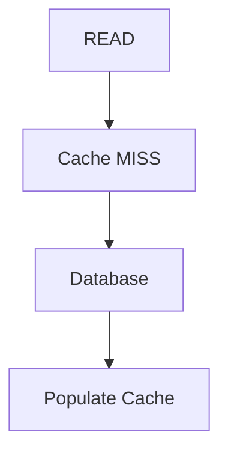

With Write-Through:

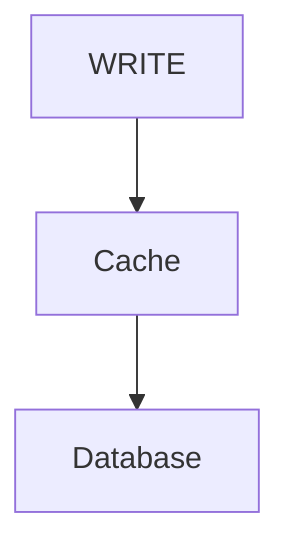

The cache can remain populated with the new value.

Therefore, after the write:

### Cache-Aside

```text
Cache:
[entry removed]
```

### Write-Through

```text
Cache:
[new value]
```

This difference can matter for workloads where data is frequently read immediately after being updated.

---

# 10. Read-After-Write

Consider this sequence:

```text
1. Update product price
2. Immediately read product price
```

With Cache-Aside using invalidation:

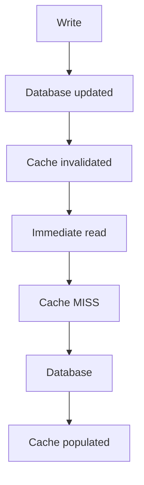

The first read after the write may require another database operation.

With Write-Through:

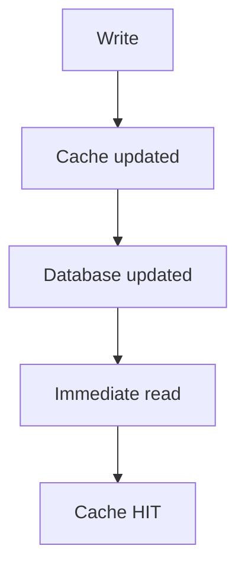

This can reduce the extra read.

Again, this is not automatically a reason to choose Write-Through.

The workload and implementation details matter.

---

# 11. Write-Through and Source of Truth

A common architectural model is:

```text
Database = Source of Truth
Cache    = Fast Representation
```

Write-Through does **not automatically mean that the cache becomes the source of truth**.

The cache may still be a performance layer.

Conceptually:

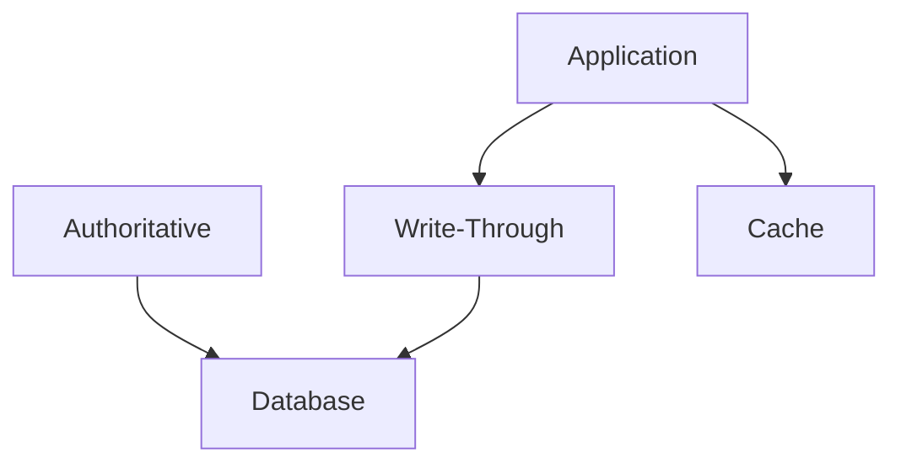

The exact architecture depends on the caching technology.

The important distinction is:

> **A component being on the write path does not automatically make it authoritative.**

---

# 12. What Happens During a Successful Write?

Suppose:

```mermaid
flowchart TD
  accTitle: A successful write
  accDescr: Application, then Cache, then Database.
  N0["Application"] --> N1["Cache"] --> N2["Database"]
```

The database successfully stores:

```text
price = 62000
```

The cache also contains:

```text
price = 62000
```

The system is now aligned for that item:

```text
Cache    = New Value
Database = New Value
```

A subsequent read can be served from the cache.

---

# 13. What If the Database Write Fails?

This is where the design becomes more interesting.

Suppose:

```mermaid
flowchart TD
  accTitle: The database write fails
  accDescr: The application writes to the cache, but the write to the database fails.
  A["Application"] --> C["Cache"] -. "X" .- D["Database"]
```

The database update fails.

The system must avoid returning a successful write if the authoritative data was not successfully changed.

Depending on the implementation, the cache may:

* reject the write
* roll back the cache change
* mark the entry as invalid
* retry the database operation
* use another failure mechanism

The exact behavior depends on the cache implementation.

The important principle is:

> **A cache update must not falsely represent a successful authoritative write.**

---

# 14. Why Write Failure Is Difficult

Suppose the cache is updated first:

```text
Cache = ₹62,000
```

Then the database update fails:

```text
Database = ₹65,000
```

Now:

```text
Cache    = ₹62,000
Database = ₹65,000
```

The cache is ahead of the source of truth.

If users read from the cache, they may see a value that was never successfully committed to the database.

Therefore, a real Write-Through system needs carefully defined write semantics.

---

# 15. Atomicity Is Not Automatic

It may look like this:

```text
Cache Update
      +
Database Update
```

should behave like one atomic operation.

But cache and database are often separate systems.

For example:

```mermaid
flowchart TD
  accTitle: Two separate systems
  accDescr: Application, then Cache Server, then Database Server.
  N0["Application"] --> N1["Cache Server"] --> N2["Database Server"]
```

A normal database transaction does not automatically span both systems.

Therefore:

> **Write-Through does not automatically give distributed transaction guarantees.**

This is an important system-design distinction.

---

# 16. Failure Between Two Systems

Consider:

```mermaid
flowchart TD
  accTitle: A failure between two systems
  accDescr: Step 1: Cache accepts write, then Step 2: Database update begins, then Step 3: Network failure.
  N0["Step 1: Cache accepts write"] --> N1["Step 2: Database update begins"] --> N2["Step 3: Network failure"]
```

What is the final state?

Possibilities include:

```text
Cache = new
Database = old
```

or:

```text
Cache = old
Database = new
```

or:

```text
Both = new
```

depending on where the failure occurred.

This is why Write-Through implementations need explicit failure handling.

---

# 17. Write-Through Does Not Eliminate Consistency Problems

It is tempting to think:

```text
Write-Through
     =
Perfect consistency
```

That is incorrect.

Write-Through can make cache updates more coordinated, but the system can still experience:

* failures
* timeouts
* retries
* partial operations
* concurrent writes
* stale replicas
* network partitions
* race conditions

The consistency model still needs to be understood.

---

# 18. Concurrent Writes

Suppose two users update the same product:

```text
Request A:
price = 62000

Request B:
price = 61000
```

They arrive close together:

```mermaid
flowchart LR
  accTitle: Concurrent writes
  accDescr: Request A and Request B both write through the cache to the database.
  A["Request A"] & B["Request B"] --> C["Cache"] --> D["Database"]
```

Which value should win?

Possible behavior depends on:

* ordering
* database transaction semantics
* optimistic locking
* version numbers
* timestamps
* application rules

Caching does not automatically solve concurrent-write conflicts.

---

# 19. Versioning

One way systems reason about concurrent updates is by using versions.

Example:

```text
Product 101
Version 10
Price = 65000
```

Update A:

```text
Version 11
Price = 62000
```

Update B tries to modify:

```text
Expected Version = 10
```

The database can reject it because the data has already changed.

This is primarily a data-consistency/concurrency-control concern.

Write-Through does not replace those mechanisms.

---

# 20. Write-Through and TTL

Write-Through can still use TTL.

For example:

```text
product:101
TTL = 10 minutes
```

A successful write updates the cached value.

But after the TTL expires:

```mermaid
flowchart TD
  accTitle: TTL still applies
  accDescr: The cache entry has expired, so the source is read.
  C["Cache"] -->|"EXPIRED"| S["Source"]
```

The application or caching layer may need to reload the value.

TTL remains useful for controlling how long cached data stays resident.

---

# 21. Write-Through and Cache Invalidation

Write-Through can reduce some invalidation work because writes can update the cached value directly.

Instead of:

```mermaid
flowchart TD
  accTitle: Cache-Aside: update, then delete
  accDescr: Database UPDATE, then DELETE CACHE.
  N0["Database UPDATE"] --> N1["DELETE CACHE"]
```

the system may perform:

```mermaid
flowchart TD
  accTitle: Write-Through: update the cache on the way
  accDescr: Cache UPDATE, then Database UPDATE.
  N0["Cache UPDATE"] --> N1["Database UPDATE"]
```

However, invalidation may still be necessary when:

* data changes outside the cache
* another service updates the database
* multiple caches exist
* related cache entries depend on the changed data
* the cached representation becomes invalid for another reason

Therefore:

> **Write-Through reduces some invalidation problems; it does not eliminate invalidation as a system concern.**

---

# 22. What About Multiple Services?

Suppose:

```mermaid
flowchart TD
  accTitle: Service A writes through the cache
  accDescr: Service A, then Write-Through Cache, then Database.
  N0["Service A"] --> N1["Write-Through Cache"] --> N2["Database"]
```

But another service does:

```mermaid
flowchart TD
  accTitle: Service B writes the database directly
  accDescr: Service B, then Database.
  N0["Service B"] --> N1["Database"]
```

Service B changed the database without going through the Write-Through cache.

Now:

```text
Database = NEW
Cache    = OLD
```

The Write-Through mechanism cannot automatically know about every external database write unless the architecture provides a mechanism for synchronization.

This is an important limitation.

---

# 23. Write Ownership Matters

A Write-Through design works more predictably when the cache has a clearly defined write path.

For example:

```mermaid
flowchart TD
  accTitle: One owner of writes
  accDescr: All writes, then Application, then Write-Through Cache, then Database.
  N0["All writes"] --> N1["Application"] --> N2["Write-Through Cache"] --> N3["Database"]
```

Compare:

```mermaid
flowchart LR
  accTitle: Many writers
  accDescr: Service A writes through the cache to the database; Service B, Service C and the admin tool write the database directly.
  SA["Service A"] --> C["Cache"] --> D["Database"]
  SB["Service B"] & SC["Service C"] & AT["Admin Tool"] --> D
```

Now the cache may not know about all changes.

The more independent writers you have, the more carefully synchronization must be designed.

---

# 24. Write-Through and Read Performance

Write-Through is often used when you want:

```text
Fast reads
+
Cache updated during writes
```

Example:

```text
1000 reads/sec
100 writes/sec
```

If data is frequently read immediately after being updated, keeping the cache populated can be useful.

The read path can remain:

```mermaid
flowchart TD
  accTitle: Fast reads
  accDescr: Application, cache, HIT, return.
  A["Application"] --> C["Cache"] -->|"HIT"| R["Return"]
```

---

# 25. Write Performance

There is also a cost.

A write may now involve:

```mermaid
flowchart TD
  accTitle: A Write-Through write
  accDescr: Application, then Cache, then Database.
  N0["Application"] --> N1["Cache"] --> N2["Database"]
```

instead of simply:

```mermaid
flowchart TD
  accTitle: A direct database write
  accDescr: Application, then Database.
  N0["Application"] --> N1["Database"]
```

The cache becomes another component in the write path.

That means:

* more network communication
* another failure point
* additional operational complexity
* potentially higher write latency

Therefore:

> **Write-Through can improve cache freshness and simplify some write coordination, but it can make writes more dependent on the cache layer.**

---

# 26. Cache Failure During a Write

Consider:

```mermaid
flowchart TD
  accTitle: The cache is unavailable
  accDescr: The application cannot reach the cache.
  A["Application"] -. "X" .- C["Cache"]
```

If the application cannot reach the cache, what happens to the write?

Possible strategies include:

### Fail the write

```mermaid
flowchart TD
  accTitle: Fail the write
  accDescr: Cache unavailable, then Reject write.
  N0["Cache unavailable"] --> N1["Reject write"]
```

### Bypass the cache

```mermaid
flowchart TD
  accTitle: Bypass the cache
  accDescr: Cache unavailable, then Write directly to database.
  N0["Cache unavailable"] --> N1["Write directly to database"]
```

### Queue the operation

```mermaid
flowchart TD
  accTitle: Queue the operation
  accDescr: Cache unavailable, then Queue write, then Process later.
  N0["Cache unavailable"] --> N1["Queue write"] --> N2["Process later"]
```

Each strategy has different consistency and reliability implications.

There is no universal answer.

---

# 27. Why Bypassing the Cache Can Be Dangerous

Suppose the normal architecture is:

```mermaid
flowchart TD
  accTitle: The intended path
  accDescr: Application, then Write-Through Cache, then Database.
  N0["Application"] --> N1["Write-Through Cache"] --> N2["Database"]
```

But during a cache outage:

```mermaid
flowchart TD
  accTitle: The bypass path
  accDescr: Application, then Database.
  N0["Application"] --> N1["Database"]
```

The database is updated.

The cache is not.

When the cache comes back:

```text
Database = NEW
Cache = OLD
```

Now synchronization is required.

So fallback behavior must be designed carefully.

---

# 28. Write-Through vs Cache-Aside: A Concrete Example

Suppose:

```text
Product 101
Price = ₹65,000
```

A user changes it to:

```text
₹62,000
```

### Cache-Aside

```mermaid
flowchart LR
  accTitle: Cache-Aside update
  accDescr: The application sets the database to ₹62,000 and deletes the cache entry.
  A["Application"]
  A --> K0["Database = ₹62,000"]
  A --> K1["Delete cache entry"]
```

Next read:

```mermaid
flowchart TD
  accTitle: The next read
  accDescr: Cache MISS, then Database = ₹62,000, then Populate Cache.
  N0["Cache MISS"] --> N1["Database = ₹62,000"] --> N2["Populate Cache"]
```

### Write-Through

```mermaid
flowchart TD
  accTitle: Write-Through update
  accDescr: Application, then Cache, then Database = ₹62,000.
  N0["Application"] --> N1["Cache"] --> N2["Database = ₹62,000"]
```

The cache can contain:

```text
₹62,000
```

immediately after the successful write.

---

# 29. A Responsibility Comparison

Think about the responsibility of each pattern.

### Cache-Aside

```text
Application responsibility:
"Manage the cache around the database."
```

### Write-Through

```text
Cache/write layer responsibility:
"Participate in writes and propagate them to the underlying store."
```

This difference becomes more important as systems become larger.

---

# 30. When Write-Through Can Be Useful

Write-Through can be useful when:

* data is frequently read after being written
* keeping cache entries current during writes is valuable
* the caching infrastructure can reliably coordinate writes
* the application benefits from a consistent cache population strategy
* the cache and underlying store have a well-defined relationship

For example:

```text
Frequently read configuration
Frequently accessed catalog data
Application-managed state with predictable write ownership
```

The specific workload matters more than the pattern name.

---

# 31. When to Be Careful

Be careful when:

* the cache is unreliable
* the database has many independent writers
* writes must be extremely low latency
* cache and database cannot be coordinated reliably
* distributed transaction guarantees are required
* data is rarely read after being written
* bypassing the cache is common

In such systems, the additional write-path dependency may not justify the benefits.

---

# 32. Write-Through and High Availability

Adding a cache to the write path means:

```mermaid
flowchart TD
  accTitle: The cache is in the write path
  accDescr: Application, then Cache, then Database.
  N0["Application"] --> N1["Cache"] --> N2["Database"]
```

The cache is now not merely an optimization for reads.

It is part of a critical operation.

Therefore, its availability requirements may become higher.

You may need:

```text
Multiple cache nodes
Replication
Failover
Health checks
Connection management
Monitoring
```

This increases architectural complexity.

---

# 33. Cache as an Optimization vs Cache as a Dependency

This is a very important system-design distinction.

### Cache-Aside

A cache may often be treated as an optimization:

```mermaid
flowchart TD
  accTitle: Cache-Aside: the cache is optional
  accDescr: Cache unavailable, then Potential fallback, then Database.
  N0["Cache unavailable"] --> N1["Potential fallback"] --> N2["Database"]
```

### Write-Through

The cache may become part of the write path:

```mermaid
flowchart TD
  accTitle: Write-Through: the cache is a dependency
  accDescr: Cache unavailable, then Write may be affected.
  N0["Cache unavailable"] --> N1["Write may be affected"]
```

Therefore:

> **Putting a cache on the write path changes its role from "performance helper" toward "system dependency."**

This should be an intentional architectural decision.

---

# 34. Hands-On Lab — Write-Through Simulation

The goal of this lab is to compare:

```text
Cache-Aside write
```

with:

```text
Write-Through write
```

Use:

```mermaid
flowchart LR
  accTitle: Lab architecture
  accDescr: The application uses Redis and PostgreSQL.
  A["Application"]
  A --> K0["Redis"]
  A --> K1["PostgreSQL"]
```

---

## 34.1 Prepare the Database

Use the same `products` table from the previous chapter:

```sql
CREATE TABLE products (
    id SERIAL PRIMARY KEY,
    name TEXT NOT NULL,
    price NUMERIC(10,2) NOT NULL
);
```

Insert:

```sql
INSERT INTO products (name, price)
VALUES
('Laptop', 65000),
('Keyboard', 1500),
('Mouse', 800);
```

---

## 34.2 Start With Cache-Aside

Load product `1`.

First request:

```mermaid
flowchart TD
  accTitle: Cache-Aside read
  accDescr: Cache MISS, then Database, then Cache SET.
  N0["Cache MISS"] --> N1["Database"] --> N2["Cache SET"]
```

Now update the product:

```sql
UPDATE products
SET price = 62000
WHERE id = 1;
```

Then invalidate:

```text
DEL product:1
```

Read again.

Observe:

```mermaid
flowchart TD
  accTitle: The next read
  accDescr: MISS, then Database, then Cache.
  N0["MISS"] --> N1["Database"] --> N2["Cache"]
```

---

## 34.3 Simulate Write-Through

Now change your application logic conceptually to:

```text
updateProduct(id, newPrice)

    ↓

cache.write(
    product:id,
    newValue
)

    ↓

database.update(...)
```

After a successful write, inspect:

```text
Cache:
product:1 = 62000

Database:
product 1 = 62000
```

Then immediately read the product.

Expected:

```text
Cache HIT
```

---

# 35. Lab Challenge — Simulate Failure

Modify the application so that the database update can intentionally fail.

Test:

```mermaid
flowchart TD
  accTitle: A failure after the cache update
  accDescr: The cache is updated, then the database update fails.
  C["Cache update"] --> D["Database update"] -. "X" .- F["Failure"]
```

Then inspect both systems.

Ask:

```text
Did the cache change?
Did the database change?
Are they now inconsistent?
What should the application do?
```

This is more valuable than simply making the happy path work.

---

# 36. Lab Challenge — Multiple Writers

Create two paths:

```text
Path A:
Application → Write-Through Cache → Database

Path B:
Application → Database
```

Update the same product using Path B.

Then read through the cache.

Observe whether the cache contains the old value.

This demonstrates why **write ownership** matters.

---

# 37. Lab Challenge — Read After Write

Measure:

```mermaid
flowchart TD
  accTitle: Write, then read
  accDescr: WRITE, then READ.
  N0["WRITE"] --> N1["READ"]
```

Compare:

### Cache-Aside

```mermaid
flowchart TD
  accTitle: Cache-Aside read after write
  accDescr: Write, then Invalidate, then Read, then MISS, then Database.
  N0["Write"] --> N1["Invalidate"] --> N2["Read"] --> N3["MISS"] --> N4["Database"]
```

### Write-Through

```mermaid
flowchart TD
  accTitle: Write-Through read after write
  accDescr: Write, then Cache updated, then Read, then HIT.
  N0["Write"] --> N1["Cache updated"] --> N2["Read"] --> N3["HIT"]
```

Measure:

* write latency
* immediate read latency
* database reads
* cache hits
* cache misses

The goal is to understand the trade-off rather than declare one strategy universally better.

---

# 38. Common Mistake: "Write-Through Means Strong Consistency"

It does not.

Write-Through can coordinate cache and source updates, but failures and concurrent operations can still produce inconsistencies.

Remember:

```text
Write-Through
    ≠
Distributed transaction
```

---

# 39. Common Mistake: "The Cache Is Now the Database"

Not necessarily.

A Write-Through cache can still be:

```text
Cache = fast copy
Database = authoritative store
```

Its position in the write path does not automatically change its data ownership.

---

# 40. Common Mistake: Ignoring External Writers

If another service changes the database directly:

```text
Service B
   |
   v
Database
```

the Write-Through cache may not automatically know.

Always ask:

> **Who can modify the underlying data?**

---

# 41. Common Mistake: Ignoring Cache Availability

In Cache-Aside, cache failure may sometimes be handled as:

```text
Cache failure
     |
     v
Database fallback
```

In Write-Through, cache failure may affect writes:

```text
Cache failure
     |
     v
Write path affected
```

Therefore, cache availability becomes more important.

---

# 42. Common Mistake: Assuming Two Writes Are One Transaction

This:

```text
Cache update
+
Database update
```

does not automatically mean:

```text
One atomic transaction
```

When two separate systems participate, distributed failure handling becomes part of the architecture.

---

# 43. System Design View

The key architectural change is:

```mermaid
flowchart TD
  accTitle: Cache-Aside
  accDescr: The application manages the cache and the database separately.
  subgraph G["Cache-Aside:"]
    direction TB
    A["Application"] --> C["Cache"]
    A --> D["Database"]
  end
```

versus:

```mermaid
flowchart TD
  accTitle: Write-Through
  accDescr: Application, then Cache, then Database.
  subgraph G["Write-Through:"]
    direction TB
    N0["Application"] --> N1["Cache"] --> N2["Database"]
  end
```

That one change has consequences.

### Cache-Aside

Cache can often remain an optional optimization.

### Write-Through

Cache becomes part of the write path.

Therefore:

```text
More coordinated cache updates
        +
Potentially fresher cache after writes
        +
Potentially faster read-after-write
        -
More write-path dependency
        -
More failure handling
        -
More infrastructure complexity
```

---

# 44. Decision Framework

Before choosing Write-Through, ask:

### Question 1

Do writes need to keep the cache populated?

```text
Yes → Write-Through may be useful
No  → Cache-Aside may be simpler
```

### Question 2

Are reads frequent immediately after writes?

```text
Yes → Keeping the cache updated may help
No  → Cache invalidation may be sufficient
```

### Question 3

Can all important writes go through the same path?

```text
Yes → Coordination is easier
No  → Synchronization becomes harder
```

### Question 4

Can the cache reliably participate in writes?

```text
Yes → Continue evaluating
No  → Cache-Aside may be safer
```

### Question 5

Can the system tolerate cache failure affecting writes?

```text
No → Carefully reconsider the dependency
Yes → Design explicit failure handling
```

The goal is not to choose a pattern because it sounds advanced.

Choose based on workload, ownership, consistency, and failure requirements.

---

# 45. The Bigger Picture

Write-Through connects caching with several system-design concepts:

```mermaid
flowchart TD
  accTitle: Write-Through in the bigger picture
  accDescr: Write-Through connects to consistency (concurrency, then data ownership), failure (cache outage) and scaling (cache HA).
  W["Write-Through"] --> C["Consistency"] & F["Failure"] & S["Scaling"]
  C --> CC["Concurrency"] --> O["Data<br/>ownership"]
  F --> CO["Cache<br/>outage"]
  S --> HA["Cache HA"]
```

It also connects to:

```text
Transactions
Retries
Timeouts
Replication
Invalidation
Observability
Failover
```

As the system grows, these interactions become more important than the cache pattern itself.

---

# 46. Cache-Aside vs Write-Through — Final Comparison

| Aspect                          | Cache-Aside            | Write-Through                             |
| ------------------------------- | ---------------------- | ----------------------------------------- |
| Application reads cache         | Yes                    | Usually                                   |
| Application loads cache on miss | Yes                    | Depends on read strategy                  |
| Application directly updates DB | Yes                    | Typically not directly for managed writes |
| Cache participates in write     | No                     | Yes                                       |
| Cache populated on read         | Common                 | May already be populated by write         |
| Cache invalidation after write  | Common                 | Often reduced for managed writes          |
| Read-after-write cache hit      | Not guaranteed         | More naturally supported                  |
| Cache is critical to writes     | Usually no             | Potentially yes                           |
| Failure handling                | Often simpler          | More important                            |
| External database writers       | Easier to reason about | Can create synchronization issues         |

---

# 47. Key Principle

> **Write-Through Cache puts the cache on the write path so that writes can update the cache and underlying data store together as part of the caching strategy.**

The most important architectural distinction is:

```text
Cache-Aside:

Application manages
Cache + Database separately
```

versus:

```mermaid
flowchart TD
  accTitle: Write-Through
  accDescr: Application, then Cache, then Database.
  subgraph G["Write-Through:"]
    direction TB
    N0["Application"] --> N1["Cache"] --> N2["Database"]
  end
```

And remember:

> **Write-Through can reduce stale-cache problems caused by application writes, but it does not automatically provide atomicity, strong consistency, or protection from external writers.**

---

# Quick Reference

| Concept                 | Meaning                                                  |
| ----------------------- | -------------------------------------------------------- |
| Write-Through           | Writes pass through the cache to the underlying store    |
| Write Path              | The sequence followed when changing data                 |
| Read-After-Write        | Reading data immediately after changing it               |
| Source of Truth         | Authoritative data store                                 |
| Cache Invalidation      | Removing or making an old cache entry unusable           |
| Write Ownership         | Which component is responsible for modifying data        |
| Cache Dependency        | A cache becoming necessary for an operation to succeed   |
| Distributed Transaction | Coordinating an atomic operation across multiple systems |

### Core Flow

```mermaid
flowchart TD
  accTitle: WRITE
  accDescr: Write: application, then cache, then database.
  subgraph G["WRITE"]
    direction TB
    N0["Application"] --> N1["Cache"] --> N2["Database"]
  end
```

### Read

```mermaid
flowchart TD
  accTitle: READ
  accDescr: Read: application, cache, HIT, return.
  subgraph G["READ"]
    direction TB
    A["Application"] --> C["Cache"] -->|"HIT"| R["Return"]
  end
```

### Important Warning

```text
Write-Through
      ≠
Automatic atomicity
      ≠
Automatic strong consistency
```

---

# Knowledge Check

### 1. What is the defining characteristic of Write-Through?

A. The database writes to the cache
B. The cache participates in the write path to the underlying store
C. The cache is always the source of truth
D. The application never uses the cache for reads

**Answer:** B

---

### 2. What is the main difference between Cache-Aside and Write-Through?

A. Cache-Aside cannot cache data
B. Write-Through puts the cache on the write path
C. Cache-Aside requires two databases
D. Write-Through removes the database

**Answer:** B

---

### 3. Does Write-Through automatically provide a distributed transaction?

A. Yes
B. No

**Answer:** B

---

### 4. Why can Write-Through improve read-after-write behavior?

A. It deletes the database
B. The cache can already contain the updated value after the write
C. It disables TTL
D. It prevents all concurrent writes

**Answer:** B

---

### 5. What happens if another service updates the database directly?

A. The Write-Through cache automatically knows in every architecture
B. The cache may become stale
C. The database automatically updates every cache
D. Nothing can happen

**Answer:** B

---

### 6. Why does cache availability become more important with Write-Through?

A. The cache may participate in the write path
B. The database disappears
C. TTL stops working
D. Indexes are removed

**Answer:** A

---

### 7. Does Write-Through automatically make the cache the source of truth?

A. Yes
B. No

**Answer:** B

---

# Remember

```mermaid
flowchart TD
  accTitle: Remember
  accDescr: Cache-Aside: the application uses the cache and the database separately. Write-Through: application, then cache, then database.
  subgraph CA["Cache-Aside:"]
    direction TB
    A["Application"] --> C["Cache"]
    A --> D["Database"]
  end
  subgraph WT["Write-Through:"]
    direction TB
    W0["Application"] --> W1["Cache"] --> W2["Database"]
  end
  CA ~~~ WT
```

Cache-Aside asks:

> **"How can the application use the cache to avoid repeated source reads?"**

Write-Through asks:

> **"How can writes pass through the cache so the cached representation is updated as part of the write path?"**

The deeper system-design lesson is:

> **Every time you move a component into a critical path, you gain some behavior and also create a new dependency.**

---

# Next Chapter

**03.07 — Write-Back Cache**

Next, we will examine an even more aggressive write strategy:

> **What if the application can consider the cache write complete before the underlying database has received the data?**

That can reduce write latency and absorb bursts—but it also introduces much more complex durability, ordering, and failure considerations.
