# 03.07 — Write-Back Cache

## Learning Objectives

By the end of this chapter, you should understand:

* What a **Write-Back Cache** is
* How it differs from **Cache-Aside** and **Write-Through Cache**
* Why Write-Back can make writes faster
* How buffering and asynchronous persistence work
* What happens when the database cannot keep up
* Why Write-Back introduces data-loss and durability risks
* How ordering, retries, duplicate writes, and idempotency matter
* What happens when the cache fails before data reaches the database
* When Write-Back makes sense and when it does not
* How to reason about Write-Back from a system-design perspective

---

# 1. What Is Write-Back Cache?

A **Write-Back Cache** is a caching strategy where the application first writes data to the cache and considers the write successful before the underlying database has necessarily been updated.

The cache later writes the data to the database **asynchronously**.

In simple terms:

> **Write now in the cache. Persist to the database later.**

Basic flow:

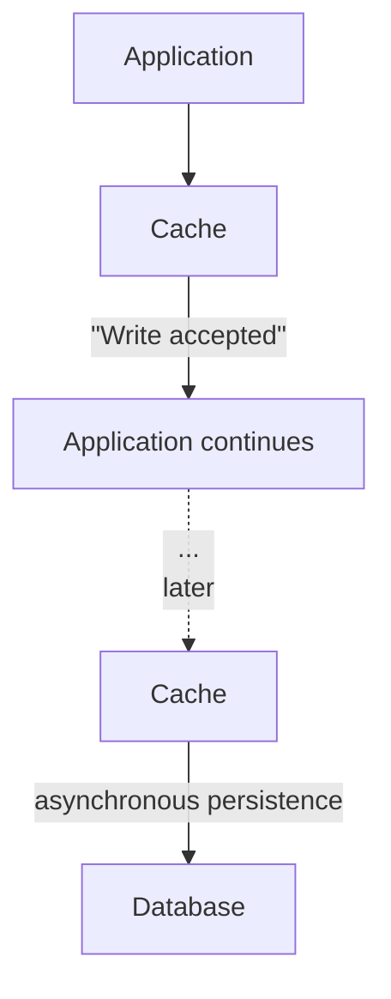

The important difference is that the database is **not on the immediate write path**.

---

# 2. Why Would We Do This?

Imagine an application receiving a large number of writes.

For example:

```text
10,000 updates arrive
within a short period
```

If every request must synchronously update the database:

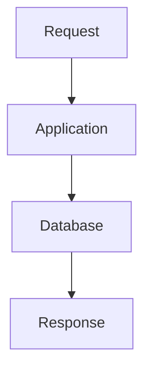

The database must handle all those writes immediately.

With Write-Back:

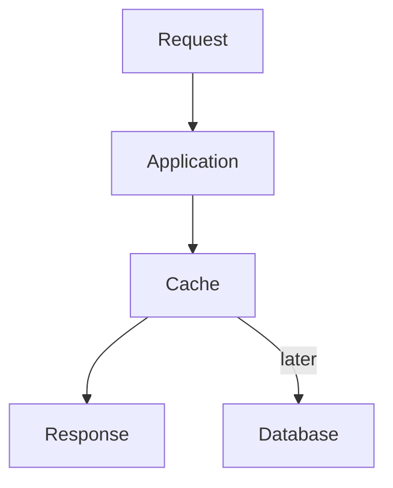

The application can acknowledge the write sooner.

The cache temporarily absorbs the write load.

This can provide:

* lower write latency
* burst absorption
* batching opportunities
* reduced immediate database pressure
* smoother write workloads

But these benefits come with significant responsibilities.

---

# 3. Write-Back Is an Asynchronous Write Strategy

The key idea is **asynchronous persistence**.

### Synchronous write

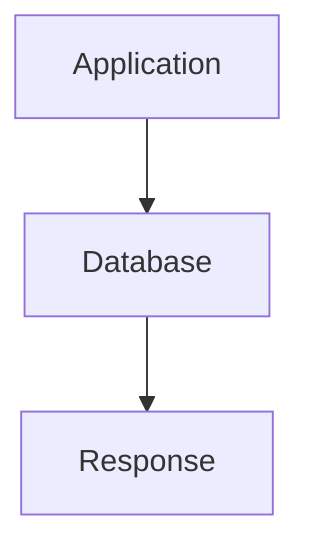

The application waits for the database.

### Write-Back

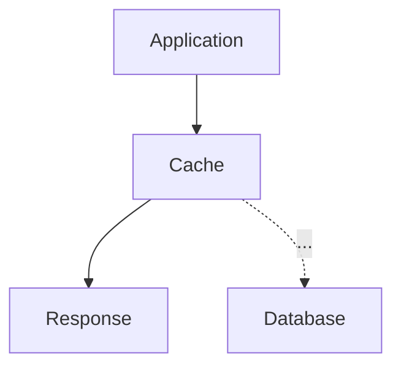

The application does not necessarily wait for the database persistence step.

This is why Write-Back can reduce the latency visible to the user.

---

# 4. The Core Write-Back Flow

Consider a user changing their profile name.

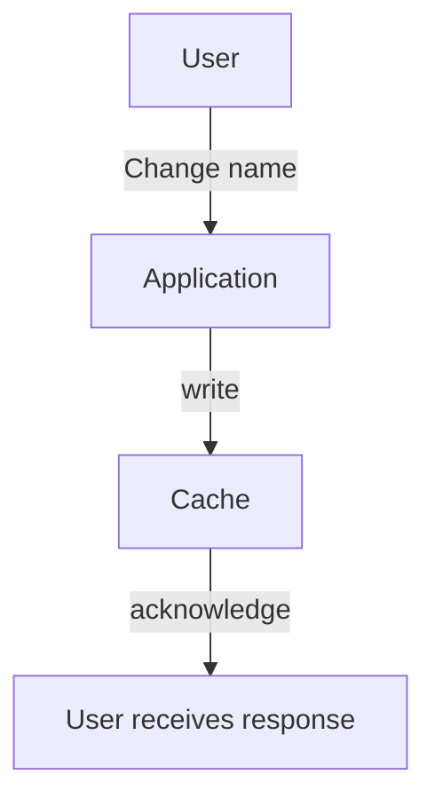

At this point:

```text
Cache:
name = "Alex"

Database:
name = "Old Name"
```

The cache contains the newer value.

Later:

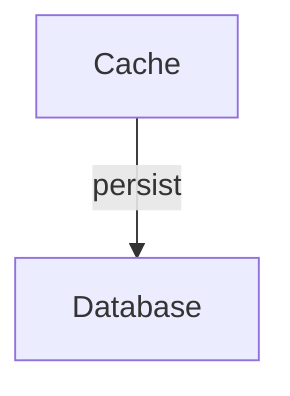

Now:

```text
Cache:
name = "Alex"

Database:
name = "Alex"
```

The important period between these two states is the **persistence window**.

---

# 5. The Persistence Window

A Write-Back system can temporarily have:

```text
Cache = newer state
Database = older state
```

This is normal for the pattern.

For example:

```text
Time
 |
 | T1
 | Cache: $100
 | DB:    $100
 |
 | T2
 | Cache: $120
 | DB:    $100
 |
 | T3
 | Cache: $120
 | DB:    $120
 v
```

Between T2 and T3, the database is behind the cache.

This creates an important system-design question:

> **What does the system consider the current state while the database is catching up?**

---

# 6. Write-Back vs Write-Through

These two strategies are easy to confuse.

## Write-Through

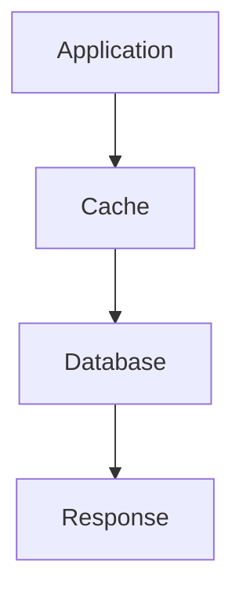

The database is updated as part of the write operation.

## Write-Back


The database update happens later.

### Simple distinction

| Strategy      |  Database updated immediately? |   Write latency | Failure complexity |
| ------------- | -----------------------------: | --------------: | -----------------: |
| Cache-Aside   | Usually application-controlled | Depends on path |             Medium |
| Write-Through |          Yes, as part of write |          Higher |             Medium |
| Write-Back    |             No, can be delayed |           Lower |               High |

The lower latency of Write-Back is not free.

You are moving work and risk from the immediate request path into an asynchronous persistence process.

---

# 7. Write-Back vs Cache-Aside

Cache-Aside usually focuses on **reads**.

Typical flow:

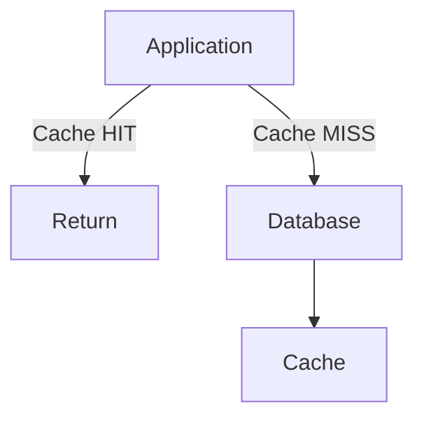

The application decides when to read from the database and populate the cache.

Write-Back changes the write path:

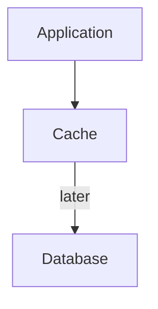

So the key distinction is:

```text
Cache-Aside
→ commonly used to avoid repeated reads

Write-Back
→ commonly used to delay database persistence
```

They can also be used together.

For example:

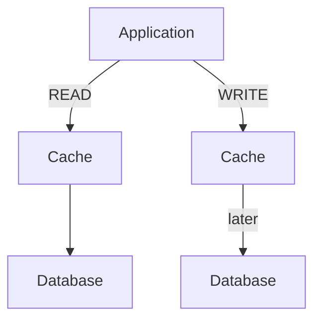

---

# 8. Why Is Write-Back Faster?

Suppose writing to the cache takes:

```text
5 ms
```

and writing to the database takes:

```text
50 ms
```

A synchronous write might expose roughly the database latency to the user:

```text
Application → Database
       ~50 ms
```

Write-Back can acknowledge after the cache operation:

```text
Application → Cache
       ~5 ms
```

The database work still exists.

It has simply moved out of the immediate request path.

This distinction is critical:

> **Write-Back does not remove database work. It delays and reorganizes it.**

---

# 9. Write-Back as a Buffer

One of the most useful ways to understand Write-Back is to think of the cache as a **buffer**.

Imagine:

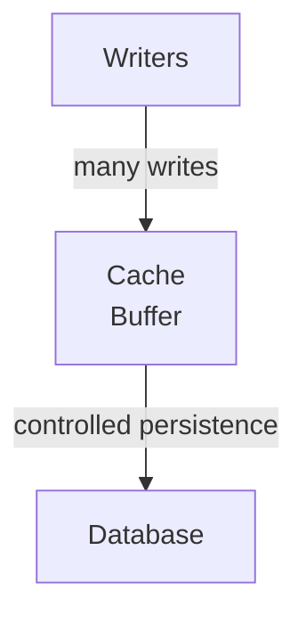

The cache can temporarily absorb a burst.

For example:

```text
Incoming writes:

████████████████████
████████████████████
████████████████████

Cache
████████████████████
      ↓
      ↓ controlled rate
      ↓

Database
████
████
████
```

The database does not necessarily need to process every write at exactly the same moment it arrives.

---

# 10. Burst Absorption

Suppose a system normally receives:

```text
100 writes/second
```

but suddenly receives:

```text
5,000 writes/second
```

The database may not be able to sustain that rate.

A Write-Back layer can temporarily absorb the burst:

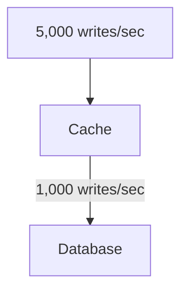

The remaining writes become pending work.

This can protect the database from an immediate traffic spike.

But now another problem appears:

> **What happens if incoming writes continue faster than the database can persist them?**

---

# 11. The Pending Write Backlog

Suppose:

```text
Incoming:
5,000 writes/sec

Database persistence:
1,000 writes/sec
```

Then:

```text
Backlog growth:

+4,000 writes/sec
```

The cache begins accumulating pending data.

Conceptually:

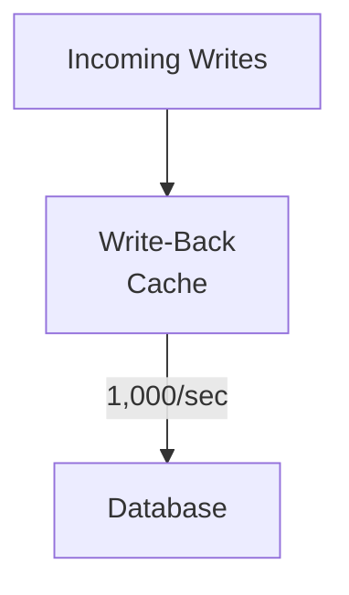

The cache is now acting like a queue.

This creates a critical metric:

> **How much unpersisted data is currently waiting to reach the database?**

---

# 12. Write-Back Can Create Backpressure

If the database cannot keep up, the system eventually needs to slow down or reject new work.

Otherwise:

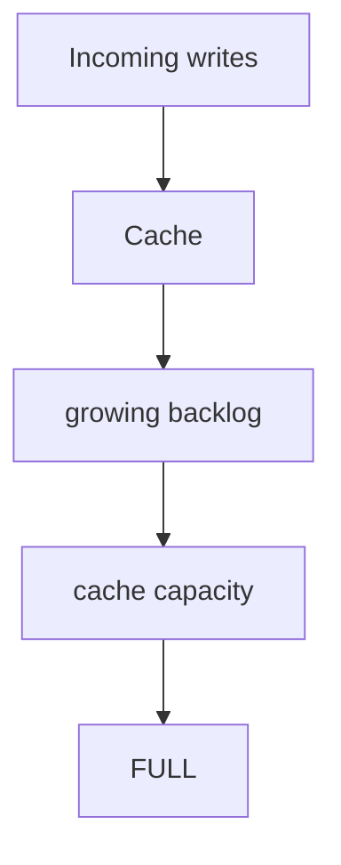

Possible responses include:

* slow down writers
* reject some writes
* prioritize important writes
* increase database capacity
* increase persistence workers
* batch writes
* scale the persistence pipeline
* temporarily degrade non-critical features

This is **backpressure**.

Write-Back does not eliminate backpressure.

It can simply move where the pressure becomes visible.

---

# 13. Buffering Is Not Infinite

A cache has finite resources.

Suppose:

```text
Available memory:
10 GB
```

and pending writes require:

```text
12 GB
```

The system has a problem.

A normal cache eviction policy might remove old entries.

But unpersisted Write-Back data is different.

You cannot safely say:

```text
"This entry is old.
Let's evict it."
```

if that entry has not yet reached the database.

Therefore:

> **Unpersisted data cannot be treated like ordinary disposable cache data.**

This is one of the most important Write-Back design considerations.

---

# 14. Dirty Data

A Write-Back cache often needs to distinguish between:

```text
Clean entry
```

and:

```text
Dirty entry
```

A simplified model:

```text
Product 101

Cache value:
price = 120

Database value:
price = 100

Status:
DIRTY
```

The cache knows:

> "My value has not yet been persisted."

After successful database persistence:

```text
Cache value:
price = 120

Database value:
price = 120

Status:
CLEAN
```

Conceptually:

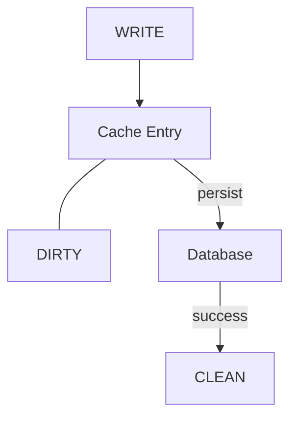

The exact implementation varies by technology.

---

# 15. Flush

The process of sending pending changes from the cache to the database is often described as a **flush**.

For example:

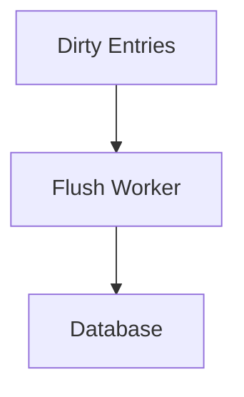

A system might flush:

* continuously
* every few milliseconds
* in batches
* when a threshold is reached
* during controlled background processing

The correct strategy depends on the workload and durability requirements.

---

# 16. Batching

Write-Back can create opportunities for batching.

Instead of:

```text
UPDATE product 1
UPDATE product 2
UPDATE product 3
UPDATE product 4
```

individually, the persistence layer may be able to group work.

Conceptually:

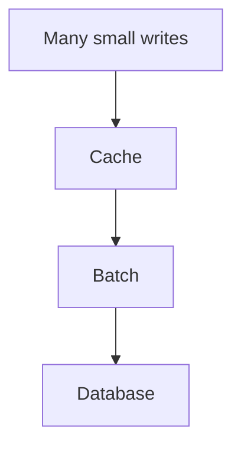

Batching can reduce:

* network round trips
* transaction overhead
* database scheduling overhead

But batching can also increase:

* persistence delay
* batch size
* failure scope
* retry complexity

Again, there is a trade-off.

---

# 17. Data Loss Risk

This is the biggest concern with Write-Back.

Imagine:

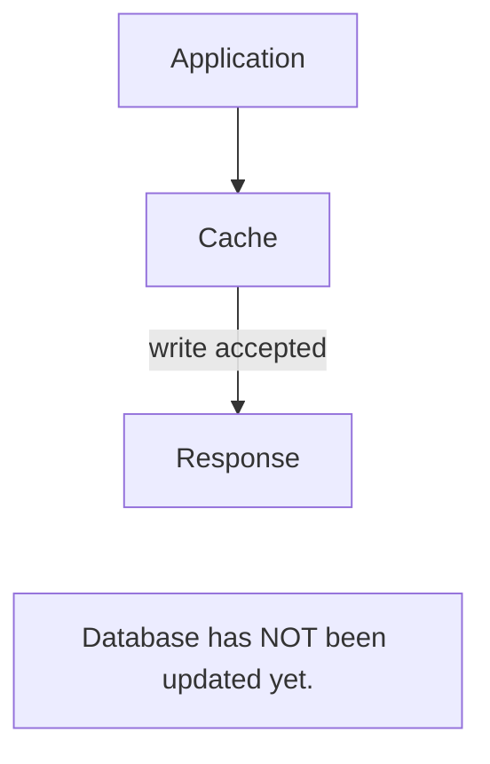

Then the cache crashes.

If the pending data was stored only in volatile memory:

```mermaid
flowchart TD
  accTitle: Data loss
  accDescr: Cache failure, then Pending writes lost.
  N0["Cache failure"] --> N1["Pending writes lost"]
```

The database still contains the old state.

This means:

> **Write-Back can expose acknowledged data to loss unless the cache/persistence design provides sufficient durability.**

This is why Write-Back should not be treated as simply:

> "A faster cache."

It changes the durability model of the system.

---

# 18. The Failure Timeline

Consider:

```text
T1
Application writes:
balance = 500

T2
Cache accepts:
balance = 500

T3
Application responds:
"Success"

T4
Database still contains:
balance = 400

T5
Cache crashes

T6
Pending write is lost
```

The user was told:

```text
Success
```

but the database never received the change.

This is a serious correctness problem for many applications.

---

# 19. Write-Back and Durability

Before using Write-Back, ask:

> **How durable is the cache?**

Possible designs may include:

* persistent cache storage
* replication
* append-only logs
* durable queues
* write journals
* replicated persistence workers
* recovery mechanisms

The exact mechanism depends on the technology.

But the architectural question remains the same:

```text
Where does acknowledged data live
before database persistence?
```

If the answer is:

```text
Only in volatile memory
```

then the potential data-loss risk is much higher.

---

# 20. Cache Failure vs Database Failure

These failures are different.

### Database failure

```mermaid
flowchart TD
  accTitle: Database failure
  accDescr: The cache cannot reach the database: it is unavailable.
  C["Cache"] -. "X" .- D["Database unavailable"]
```

Pending writes may remain in the cache.

The system might retry later.

### Cache failure

```mermaid
flowchart TD
  accTitle: Cache failure
  accDescr: The application cannot reach the cache.
  A["Application"] -. "X" .- C["Cache"]
```

If the cache contained unpersisted writes, those writes may be lost unless the system has another durable copy.

Therefore:

> **In Write-Back architecture, cache availability can become part of data durability.**

This is a major architectural consequence.

---

# 21. Retry Failed Persistence

Suppose:

```mermaid
flowchart TD
  accTitle: Persistence fails
  accDescr: The cache writes to the database, and the write fails.
  C["Cache"] -->|"write"| D["Database"] -. "X" .- F["failure"]
```

The persistence worker may retry:

```text
Retry 1 → failure
Retry 2 → failure
Retry 3 → success
```

But retries create another problem.

What if the first database operation actually succeeded, but the response was lost?

The worker may not know whether the operation succeeded.

It retries.

Now the same logical write may be applied twice.

This leads to **idempotency**.

---

# 22. Idempotency Matters

An operation is **idempotent** when repeating the same logical operation does not produce an incorrect additional effect.

For example:

```sql
UPDATE products
SET price = 120
WHERE id = 101;
```

Repeating it generally produces the same final price:

```text
120 → 120
```

But consider:

```sql
UPDATE accounts
SET balance = balance + 100
WHERE id = 10;
```

If the same write is accidentally executed twice:

```text
1000
 ↓ +100
1100
 ↓ +100
1200
```

The intended result may have been:

```text
1100
```

Therefore, Write-Back persistence often needs:

* unique operation IDs
* deduplication
* idempotent operations
* transaction design
* careful retry handling

---

# 23. Ordering Problems

Consider two writes:

```text
Write A:
price = 100

Write B:
price = 120
```

Correct order:

```text
A → B

Database:
120
```

But what if asynchronous workers persist:

```text
B → A
```

The database ends up with:

```text
100
```

The latest update has been overwritten by an older one.

Therefore:

> **Asynchronous persistence must consider write ordering.**

Possible approaches include:

* per-key ordering
* sequence numbers
* version numbers
* timestamps, where appropriate
* optimistic concurrency control
* partitioned workers

The correct approach depends on the data model.

---

# 24. Versioning

A system may attach a version to each update.

For example:

```text
User 42

Version 10:
name = "Alex"

Version 11:
name = "Sam"

Version 12:
name = "Jordan"
```

The persistence layer can use the version to detect stale updates.

Conceptually:

```mermaid
flowchart TD
  accTitle: Ignoring a stale update
  accDescr: The cache sends version 12; the database already has version 12, so it accepts or ignores the stale update.
  C["Cache"] -->|"version 12"| D["Database"] -->|"already has version 12"| R["Accept / ignore stale update"]
```

Versioning can help protect against out-of-order asynchronous writes.

---

# 25. Read-After-Write

Another important question:

> What should a user see immediately after writing?

Suppose:

```text
User changes:
theme = dark
```

Write-Back stores:

```text
Cache:
theme = dark

Database:
theme = light
```

The user immediately reads the value.

If the read comes from the cache:

```text
theme = dark
```

Everything looks correct.

But if another service reads directly from the database:

```text
theme = light
```

Now different parts of the system see different states.

This is a **consistency boundary** created by asynchronous persistence.

---

# 26. External Writers

Imagine:

```mermaid
flowchart TD
  accTitle: An external writer
  accDescr: Application A writes through the cache to the database; Application B writes the database directly.
  A["Application A"] --> C["Cache"] --> D["Database"]
  B["Application B"] --> D
```

Application A uses Write-Back.

Application B writes directly to the database.

Now consider:

```text
A writes:
price = 120
```

The cache has:

```text
120
```

The database still has:

```text
100
```

Then B writes:

```text
price = 110
```

Later A's pending write reaches the database:

```text
price = 120
```

The database may now contain a value that conflicts with B's newer decision.

Therefore:

> **Write ownership must be clearly defined.**

If multiple systems can modify the same data, asynchronous persistence becomes much harder to reason about.

---

# 27. Write-Back and Source of Truth

Traditionally, the database may be considered the source of truth.

But during the persistence window:

```text
Cache:
newer value

Database:
older value
```

So the cache temporarily contains state that the database does not yet know about.

This leads to an important distinction:

```text
Long-term source of truth:
Database

Current pending state:
Cache
```

The architecture must define how these states interact.

Do not casually say:

> "The cache is the source of truth."

unless the architecture is actually designed that way.

---

# 28. Write-Back Is More Than a Cache

At this point, notice what the cache is doing.

It is:

* storing data
* buffering writes
* tracking pending changes
* managing persistence
* handling retries
* potentially ordering operations
* protecting against failures
* possibly tracking versions

That means the component is doing much more than ordinary caching.

It has started behaving partly like a **write buffer or asynchronous persistence layer**.

This is an important system-design insight.

---

# 29. Write-Back and Queues

Write-Back often has queue-like behavior:

```mermaid
flowchart TD
  accTitle: Write-back looks like a queue
  accDescr: Producers, then Buffer, then Consumers, then Database.
  N0["Producers"] --> N1["Buffer"] --> N2["Consumers"] --> N3["Database"]
```

The conceptual similarity to a message queue is strong.

But they are not automatically the same thing.

A dedicated message queue may provide features such as:

* explicit message durability
* delivery semantics
* acknowledgements
* consumer management
* replay
* partitioning
* dead-letter handling

A cache is primarily designed for fast data access.

Therefore:

> **Do not automatically turn a cache into a message queue just because it can buffer data.**

If durable asynchronous processing is a core requirement, a dedicated messaging architecture may be more appropriate.

---

# 30. What Happens During a Restart?

Suppose:

```text
Cache contains:

100,000 pending writes
```

Then the cache restarts.

The system must answer:

> What happens to those 100,000 writes?

Possible designs include:

```mermaid
flowchart TD
  accTitle: Recovering from a persistent cache
  accDescr: Persistent cache, then Recover pending writes, then Resume persistence.
  N0["Persistent cache"] --> N1["Recover pending writes"] --> N2["Resume persistence"]
```

or:

```mermaid
flowchart TD
  accTitle: Recovering from a write log
  accDescr: Durable write log, then Recover, then Replay pending operations.
  N0["Durable write log"] --> N1["Recover"] --> N2["Replay pending operations"]
```

Without a recovery strategy:

```mermaid
flowchart TD
  accTitle: No durability
  accDescr: Restart, then Pending writes disappear.
  N0["Restart"] --> N1["Pending writes disappear"]
```

Recovery is therefore part of the Write-Back design.

---

# 31. Write-Back and High Availability

Adding replicas to a cache can improve availability.

For example:

```mermaid
flowchart TD
  accTitle: A cache cluster
  accDescr: The application writes to a cache cluster of Node A and Node B.
  A["Application"] --> C["Cache Cluster"]
  C --- NA["Node A"]
  C --- NB["Node B"]
```

But replication alone does not automatically guarantee that every acknowledged write is durable.

You still need to ask:

* When is a write acknowledged?
* Is it stored on one node or multiple nodes?
* Is replication synchronous or asynchronous?
* Can both copies fail?
* How are pending writes recovered?
* When is database persistence considered complete?

High availability and durability are related, but they are not the same property.

---

# 32. A Simple Failure Matrix

| Failure                          | Possible consequence                    |
| -------------------------------- | --------------------------------------- |
| Database temporarily unavailable | Pending writes accumulate               |
| Persistence worker crashes       | Backlog grows                           |
| Cache node crashes               | Pending writes may be lost              |
| Network failure                  | Persistence retries may occur           |
| Duplicate retry                  | Same logical write may be applied twice |
| Out-of-order persistence         | Older value may overwrite newer value   |
| Cache fills up                   | Backpressure or rejected writes         |
| Application restarts             | Pending work must be recovered          |
| External writer changes DB       | Conflicts with pending cache state      |

This is why Write-Back requires careful failure design.

---

# 33. When Is Write-Back Useful?

Write-Back can be useful when:

### 1. Write latency is important

The application needs to acknowledge writes quickly.

### 2. The workload contains bursts

The database cannot efficiently process every burst immediately.

### 3. Temporary persistence delay is acceptable

The business does not require every write to reach the database before the request completes.

### 4. Writes can be safely reordered or batched

The data model allows asynchronous processing.

### 5. The system has strong recovery mechanisms

Pending writes can survive failures or be reconstructed.

### 6. The database benefits from batching

Many small writes can be combined into fewer efficient operations.

---

# 34. When Is Write-Back a Poor Fit?

Be cautious when every acknowledged write must be durable immediately.

Examples can include operations where losing or delaying a write has serious business consequences.

Ask:

```text
Can we safely tell the user "success"
before the database has stored the change?
```

If the answer is:

```text
No
```

then Write-Back may not be appropriate for that operation.

Other warning signs:

* strict durability requirements
* strict ordering requirements
* frequent external database writers
* difficult conflict resolution
* inability to tolerate stale database state
* no reliable recovery mechanism
* cache capacity too small for possible backlog
* persistence rate consistently lower than incoming write rate

---

# 35. Write-Back Does Not Magically Increase Capacity

Suppose:

```text
Incoming:
10,000 writes/sec

Database:
2,000 writes/sec
```

Write-Back can temporarily absorb the difference.

But over a long period:

```text
10,000 incoming
- 2,000 persisted
-----------------
8,000 pending
```

The backlog keeps growing.

Eventually:

```mermaid
flowchart TD
  accTitle: Eventually full
  accDescr: Cache capacity, then FULL.
  N0["Cache capacity"] --> N1["FULL"]
```

Therefore:

> **Write-Back can absorb a burst, but it cannot permanently compensate for an undersized persistence system.**

This is an important system-design principle.

---

# 36. The Right Mental Model

Think of Write-Back as:

> **A fast front door in front of a slower persistence system.**

```mermaid
flowchart TD
  accTitle: The right mental model
  accDescr: Writes reach the cache fast; the cache persists to the database asynchronously, which is slower.
  F["FAST"] --> C["Cache"]
  W["Writes"] --> C
  C -->|"asynchronous"| D["Database"] --- S["SLOWER"]
```

The cache absorbs work.

The database eventually catches up.

The system must manage the gap safely.

---

# 37. Write-Back Trade-Off

The central trade-off is:

```text
Lower write latency
        +
Burst absorption
        +
Batching opportunities
        |
        v
More asynchronous complexity
        +
Potential data loss
        +
Ordering problems
        +
Retry complexity
        +
Backpressure
        +
Recovery requirements
```

You are exchanging **simplicity and immediate durability** for **latency and buffering advantages**.

---

# 38. A Practical Decision Framework

Before choosing Write-Back, ask these questions.

### Question 1 — Can the write be delayed?

```text
YES → continue evaluating
NO  → Write-Back may not fit
```

### Question 2 — Can acknowledged data temporarily exist only in the cache?

```text
YES → continue evaluating
NO  → need stronger durability
```

### Question 3 — Can writes be safely retried?

```text
YES → easier
NO  → need careful idempotency design
```

### Question 4 — Does ordering matter?

```text
YES → design ordering/versioning
NO  → simpler
```

### Question 5 — Can the database catch up?

```text
YES → buffering can help
NO  → backlog becomes a long-term problem
```

### Question 6 — What happens if the cache fails?

```text
Define recovery before production.
```

### Question 7 — Can multiple systems modify the same data?

```text
YES → carefully define write ownership
NO  → simpler consistency model
```

---

# 39. Comparing the Three Main Strategies

| Property            | Cache-Aside            | Write-Through               | Write-Back         |
| ------------------- | ---------------------- | --------------------------- | ------------------ |
| Primary focus       | Cache reads            | Immediate cache + DB writes | Delayed DB writes  |
| Read path           | Cache → DB on miss     | Usually cache               | Usually cache      |
| Write path          | Application decides    | Cache + DB                  | Cache first        |
| DB write timing     | Application-controlled | Immediate                   | Asynchronous       |
| Write latency       | Depends                | Higher                      | Lower              |
| Burst absorption    | Limited                | Limited                     | Stronger           |
| Data-loss risk      | Usually lower          | Usually lower               | Potentially higher |
| Ordering complexity | Lower                  | Lower                       | Higher             |
| Retry complexity    | Moderate               | Moderate                    | Higher             |
| Recovery complexity | Moderate               | Moderate                    | High               |
| Backlog possible    | Not inherent           | Usually not                 | Yes                |
| Best mental model   | Read optimization      | Synchronized write path     | Write buffer       |

The table is a mental model, not a universal rule.

Real implementations vary.

---

# 40. Hands-On Lab — Simulating Write-Back

This lab uses:

* PostgreSQL
* Redis
* a small backend application

The goal is not to build a production Write-Back system.

The goal is to **observe the trade-offs directly**.

---

## 40.1 Create the Database

Create a simple table:

```sql
CREATE TABLE products (
    id SERIAL PRIMARY KEY,
    name TEXT NOT NULL,
    price NUMERIC(10,2) NOT NULL,
    updated_at TIMESTAMP DEFAULT CURRENT_TIMESTAMP
);
```

Insert one product:

```sql
INSERT INTO products (name, price)
VALUES ('Keyboard', 100.00);
```

---

## 40.2 Establish the Baseline

First implement a normal synchronous update:

```mermaid
flowchart TD
  accTitle: Baseline: direct write
  accDescr: Application, then PostgreSQL, then Response.
  N0["Application"] --> N1["PostgreSQL"] --> N2["Response"]
```

Measure:

```text
write latency
```

This gives you a baseline.

---

# 41. Simulate Write-Through

Next:

```mermaid
flowchart TD
  accTitle: Write-Through simulation
  accDescr: Application, then Redis, then PostgreSQL, then Response.
  N0["Application"] --> N1["Redis"] --> N2["PostgreSQL"] --> N3["Response"]
```

The application waits for the database operation.

Measure:

```text
write latency
```

Compare it with the baseline.

---

# 42. Simulate Write-Back

Now change the flow:

```mermaid
flowchart TD
  accTitle: Write-Back simulation
  accDescr: The application writes to Redis and responds; afterwards a background worker writes to PostgreSQL.
  A["Application"] --> R["Redis"] --> P["Response"]
  P -. "..." .-> W["Background Worker"] --> D["PostgreSQL"]
```

When the application receives:

```text
price = 120
```

store it in Redis first.

Then immediately return the response.

The worker persists the change later.

---

# 43. Observe the Persistence Window

Immediately after the application responds, inspect both systems.

For example:

```text
Redis:
price = 120

PostgreSQL:
price = 100
```

Wait for the worker.

Then:

```text
Redis:
price = 120

PostgreSQL:
price = 120
```

You have now observed the Write-Back persistence window.

---

# 44. Measure Write Latency

Run many writes.

Measure:

```text
Synchronous DB write:
___ ms

Write-Through:
___ ms

Write-Back acknowledgement:
___ ms
```

Do not focus only on the numbers.

Ask:

> Where did the remaining database work go?

Answer:

```text
It moved to the background persistence path.
```

---

# 45. Simulate a Slow Database

Artificially delay the database persistence worker.

For example:

```text
Incoming:
1,000 writes/sec

Persistence:
200 writes/sec
```

Track:

```text
Pending writes
```

You should see:

```text
Backlog
100
200
300
400
...
```

This demonstrates that Write-Back is a buffer, not infinite capacity.

---

# 46. Simulate Cache Failure

Create a pending write:

```text
Cache:
price = 150

Database:
price = 120
```

Before the worker persists the update:

```text
Stop Redis
```

Then inspect PostgreSQL.

Ask:

> Did the database receive the write?

If not, you have demonstrated the core durability risk of Write-Back.

---

# 47. Simulate a Retry

Make the persistence worker fail once.

Flow:

```mermaid
flowchart TD
  accTitle: A retry
  accDescr: The write goes to the cache and a worker; the database write fails, is retried, and succeeds.
  W["Write"] --> C["Cache"] --> K["Worker"] -. "X" .- D["Database"] --> R["Retry"] --> D2["Database"] --- OK["✓"]
```

Track the operation ID.

Verify that the retry does not accidentally create duplicate effects.

---

# 48. Challenge — Ordering

Create two updates:

```text
Update A:
price = 100

Update B:
price = 120
```

Make the worker process them in reverse order:

```text
B → A
```

Observe the final database value.

Then design a solution using:

* version numbers
* sequence numbers
* per-key ordering

The goal is to understand why asynchronous writes require explicit ordering decisions.

---

# 49. Challenge — Backpressure

Create a workload where:

```text
Incoming writes:
1,000/sec

Database persistence:
100/sec
```

Determine:

1. How quickly the backlog grows
2. How much memory/storage the backlog requires
3. When the system should apply backpressure
4. What writes should be prioritized
5. What happens if the database remains unavailable for 10 minutes

This turns Write-Back from a caching concept into a system-capacity problem.

---

# 50. Common Mistakes

### Mistake 1 — Thinking Write-Back removes database work

It does not.

It delays the work.

---

### Mistake 2 — Treating the cache as disposable

Unpersisted Write-Back data may be important data.

---

### Mistake 3 — Ignoring cache failure

If acknowledged writes exist only in the cache, cache failure can become data loss.

---

### Mistake 4 — Ignoring ordering

Asynchronous workers can process updates in an unexpected order.

---

### Mistake 5 — Retrying without idempotency

Retries can create duplicate effects.

---

### Mistake 6 — Assuming the backlog is temporary

If:

```text
incoming rate > persistence rate
```

for long enough, the backlog keeps growing.

---

### Mistake 7 — Using Write-Back everywhere

Not every write can safely be delayed.

---

### Mistake 8 — Confusing availability with durability

A replicated cache may survive some failures while still having an incomplete durability guarantee for pending writes.

---

### Mistake 9 — Ignoring external writers

Another service writing directly to the database can conflict with pending cache changes.

---

# 51. System Design View

At a small scale:

```mermaid
flowchart TD
  accTitle: Before
  accDescr: Application, then Database.
  N0["Application"] --> N1["Database"]
```

may be completely sufficient.

As write volume grows:

```mermaid
flowchart TD
  accTitle: After
  accDescr: Application, then Write Path, then Database.
  N0["Application"] --> N1["Write Path"] --> N2["Database"]
```

may become a bottleneck.

A Write-Back architecture can evolve toward:

```mermaid
flowchart TD
  accTitle: Write-back as a write pipeline
  accDescr: Applications write to the write-back layer, which holds a buffer and persistence workers that write to the database.
  A["Applications"] --> L["Write-Back Layer"]
  L --> B["Buffer"]
  L --> P["Persistence<br/>Workers"] --> D["Database"]
```

Now you must operate more components and more state.

The system gains performance flexibility but loses simplicity.

---

# 52. The Architectural Question

Do not ask:

> "Is Write-Back better?"

Instead ask:

> **"What problem are we trying to solve, and can we safely delay persistence to solve it?"**

For example:

```text
Problem:
Database cannot absorb short write bursts.

Constraint:
Writes can be delayed by a few seconds.

Requirement:
No acknowledged data may be lost.

Possible direction:
Durable asynchronous write pipeline.
```

That is system design thinking.

The technology comes after understanding the constraint.

---

# 53. Write-Back and the Core Systemly Principle

Write-Back demonstrates a broader system-design lesson:

```mermaid
flowchart TD
  accTitle: The core Systemly principle
  accDescr: Performance improvement, then Move work out of critical path, then Work becomes asynchronous, then New failure modes appear, then Need durability + ordering + retry + recovery.
  N0["Performance improvement"] --> N1["Move work out of critical path"] --> N2["Work becomes asynchronous"] --> N3["New failure modes appear"] --> N4["Need durability + ordering + retry + recovery"]
```

Optimizing one part of a system often creates new responsibilities elsewhere.

---

# 54. Decision Flow

```mermaid
flowchart TD
  accTitle: Decision flow
  accDescr: Need faster writes? Can persistence happen later? No: use synchronous path. Yes: can data be safely buffered? No: stronger immediate persistence. Yes: can pending writes survive cache failure? No: add durable persistence mechanism. Yes: evaluate Write-Back.
  S["Need faster writes?"] --> R1
  subgraph R1[" "]
    direction TB
    Q1{"Can persistence<br/>happen later?"} -->|"NO"| N1["Use<br/>synchronous<br/>path"]
  end
  subgraph R2[" "]
    direction TB
    Q2{"Can data<br/>be safely buffered?"} -->|"NO"| N2["Stronger<br/>immediate<br/>persistence"]
  end
  subgraph R3[" "]
    direction TB
    Q3{"Can pending<br/>writes survive<br/>cache failure?"} -->|"NO"| N3["Add durable<br/>persistence<br/>mechanism"]
  end
  R1 -->|"YES"| R2 -->|"YES"| R3 -->|"YES"| Y["Evaluate<br/>Write-Back"]
```

The final decision depends on:

* latency requirements
* durability requirements
* ordering
* consistency
* write volume
* burst patterns
* database capacity
* recovery requirements
* operational complexity

---

# 55. Key Principle

> **Write-Back Cache reduces write-path latency by allowing the cache to accept changes before the database persists them, but the system must then explicitly handle durability, ordering, retries, backlog, backpressure, and recovery.**

The most important mental model is:

```text
Write-Back
=
Fast acknowledgement
+
Delayed persistence
+
New failure responsibilities
```

---

# 56. Quick Reference

| Concept                  | Meaning                                                        |
| ------------------------ | -------------------------------------------------------------- |
| Write-Back               | Cache accepts write before DB persistence                      |
| Asynchronous persistence | DB update happens later                                        |
| Persistence window       | Time during which cache is newer than DB                       |
| Dirty entry              | Cached change not yet persisted                                |
| Flush                    | Persist pending changes                                        |
| Backlog                  | Pending writes waiting for persistence                         |
| Backpressure             | Slowing/rejecting incoming work when downstream cannot keep up |
| Idempotency              | Safe retry without incorrect duplicate effects                 |
| Ordering                 | Ensuring writes reach storage in a valid sequence              |
| Durability               | Ability to preserve acknowledged data through failures         |
| Burst absorption         | Temporarily handling traffic above database capacity           |
| Recovery                 | Reconstructing/resuming pending writes after failure           |

---

# 57. Knowledge Check

### Question 1

What is the defining characteristic of Write-Back?

<details>
<summary>Answer</summary>

The cache can accept a write and acknowledge it before the underlying database has persisted the change.

</details>

---

### Question 2

Why can Write-Back reduce write latency?

<details>
<summary>Answer</summary>

The application does not need to wait for the database persistence operation before responding.

</details>

---

### Question 3

Does Write-Back eliminate database work?

<details>
<summary>Answer</summary>

No. It moves the database work to an asynchronous persistence path.

</details>

---

### Question 4

What happens if incoming writes permanently exceed database persistence capacity?

<details>
<summary>Answer</summary>

The pending backlog continues to grow until the system applies backpressure, increases capacity, or otherwise reduces the imbalance.

</details>

---

### Question 5

Why is cache failure especially important in Write-Back?

<details>
<summary>Answer</summary>

Because the cache may contain acknowledged writes that have not yet reached the database.

</details>

---

### Question 6

Why is idempotency important?

<details>
<summary>Answer</summary>

Persistence failures can cause retries. Without idempotent handling, the same logical write may produce duplicate effects.

</details>

---

### Question 7

Why does ordering matter?

<details>
<summary>Answer</summary>

An older update processed after a newer update can overwrite the newer state.

</details>

---

### Question 8

Can Write-Back permanently compensate for an undersized database?

<details>
<summary>Answer</summary>

No. It can absorb temporary bursts, but if incoming writes consistently exceed persistence capacity, the backlog will continue growing.

</details>

---

# 59. Remember

A Write-Back Cache is not simply:

```text
"Write faster."
```

It is:

```mermaid
flowchart TD
  accTitle: Remember
  accDescr: Write quickly, then Hold pending state, then Persist asynchronously, then Manage the gap safely.
  N0["Write quickly"] --> N1["Hold pending state"] --> N2["Persist asynchronously"] --> N3["Manage the gap safely"]
```

Whenever you see Write-Back in a system architecture, immediately ask:

```text
Where is the unpersisted data?

How durable is it?

What happens if the cache fails?

How are retries handled?

How is ordering preserved?

What happens when the database falls behind?

When does backpressure start?

How is pending work recovered?
```

Those questions are more important than the cache product itself.

---

# 60. Next Chapter

## 03.08 — TTL & Expiration

We now know how caches can manage both **reads and writes**.

The next question is:

> **How long should cached data remain valid?**

We will study:

* TTL
* expiration
* absolute vs sliding expiration
* stale data
* eviction vs expiration
* cache freshness
* expiration storms
* jitter
* cleanup strategies
* how expiration affects system behavior
* choosing an appropriate TTL
