# 03.08 — TTL & Expiration

## Learning Objectives

By the end of this chapter, you should understand:

* What TTL means
* Why cached data needs a lifetime
* How expiration works
* The difference between **expiration** and **eviction**
* Absolute vs sliding expiration
* Fresh, stale, and expired data
* How TTL affects consistency
* Why choosing a TTL is a system-design decision
* What happens when many keys expire together
* Why expiration can create traffic spikes
* What TTL jitter is
* How TTL interacts with Cache-Aside, Write-Through, and Write-Back
* How to reason about TTL in a real system

---

# 1. Why Does Cached Data Need a Lifetime?

A cache stores data so that it can be reused.

But cached data can become outdated.

For example:

```text
Database:
Product price = ₹1,000

Cache:
Product price = ₹1,000
```

Later:

```text
Database:
Product price = ₹900

Cache:
Product price = ₹1,000
```

The cache is now holding an older value.

This creates a basic question:

> **How long should the cached value be considered usable?**

One common answer is:

> Give the cached entry a **TTL**.

---

# 2. What Is TTL?

**TTL** means **Time To Live**.

It specifies how long a cached entry should remain valid after it is stored.

For example:

```text
TTL = 60 seconds
```

means:

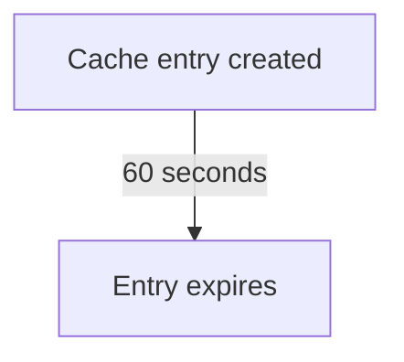

Conceptually:

```text
Time
 |
 | 0s
 |  ┌───────────────┐
 |  │ Cached Value  │
 |  └───────────────┘
 |
 | 30s
 |
 | 60s
 |      EXPIRED
 v
```

TTL is therefore a mechanism for controlling **cache freshness**.

---

# 3. A Simple Example

Suppose an application caches a product:

```text
Key:
product:101

Value:
{
    "name": "Keyboard",
    "price": 1200
}

TTL:
300 seconds
```

The entry can be used for approximately five minutes according to the cache's expiration semantics.

After expiration:

```text
Cache:
MISS / expired
```

The application can retrieve fresh data from the source.

For a Cache-Aside system:

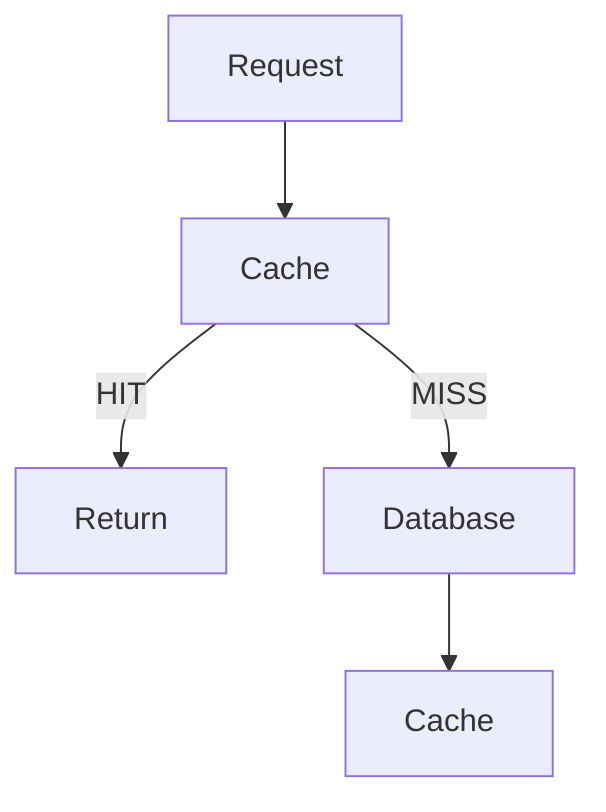

TTL controls how long the cached value remains eligible for the HIT path.

---

# 4. TTL Is About Freshness, Not Just Memory

It is tempting to think:

> "TTL is just a way to delete old cache entries."

That is incomplete.

TTL also represents a **freshness policy**.

For example:

```text
Product catalog:
TTL = 10 minutes
```

means the system is accepting some bounded period during which cached information may be older than the current database state.

Compare that with:

```text
Exchange rate:
TTL = 10 seconds
```

The system may require fresher information.

And:

```text
Static versioned asset:
TTL = days or longer
```

may be acceptable because the resource can be versioned.

Therefore:

> **TTL is partly a business and correctness decision, not merely a cache configuration value.**

---

# 5. Fresh, Stale, and Expired

These concepts should be separated.

### Fresh

The cached value is within its allowed lifetime.

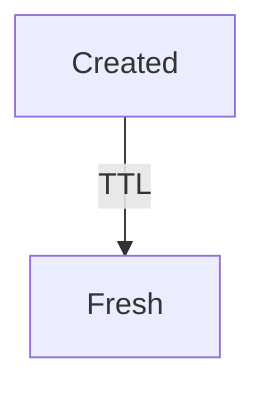

### Expired

The TTL has elapsed.

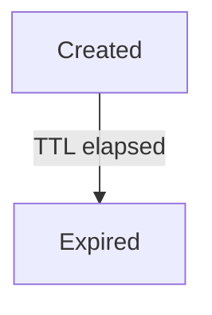

### Stale

"Stale" means the cached value is older than the desired current state.

An entry can potentially be considered stale **before or independently of the cache's expiration mechanism**, depending on the system's freshness policy.

For example:

```text
Database:
price = 900

Cache:
price = 1000
```

The cached value is stale relative to the database.

If its TTL has not yet elapsed, the cache may still consider it usable.

This creates an important distinction:

```text
TTL expiration
≠
All forms of staleness
```

---

# 6. TTL Does Not Guarantee Fresh Data

Suppose:

```text
TTL = 10 minutes
```

At minute 5:

```text
Database:
price = 900

Cache:
price = 1000
```

The cache entry has not expired.

Therefore:

```text
Cache:
HIT
```

The user may still receive:

```text
₹1,000
```

even though the database contains:

```text
₹900
```

So TTL does not mean:

> "The data is definitely correct for this amount of time."

It means:

> **"The cache is allowed to consider this entry usable for this amount of time, according to the configured expiration policy."**

That distinction is important.

---

# 7. TTL and Consistency

TTL creates a controlled period during which cached state can differ from the underlying source.

Consider:

```text
T0
Database = A
Cache    = A

T1
Database = B
Cache    = A

T2
TTL expires

T3
Cache miss
     ↓
Database = B
     ↓
Cache = B
```

During:

```text
T1 → T2
```

the cache may return the older value.

TTL limits how long the entry remains cached, but it does not automatically make the cache instantly consistent after a database change.

---

# 8. Why Not Set TTL to Zero?

If the goal is freshness, one might think:

```text
TTL = 0
```

would solve everything.

But then the cache provides little or no useful reuse.

Conceptually:

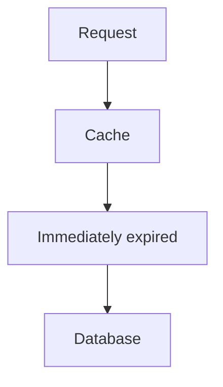

You have added cache infrastructure without receiving much caching benefit.

This demonstrates a fundamental trade-off:

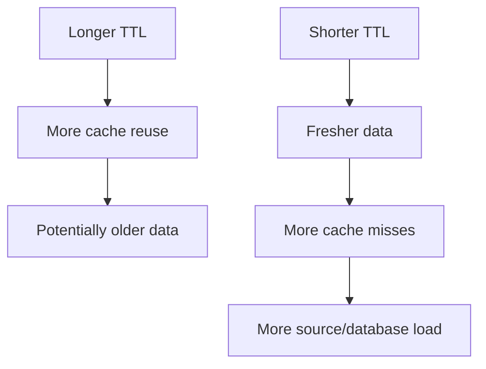

---

# 9. The TTL Trade-Off

Think of TTL as a balancing point.

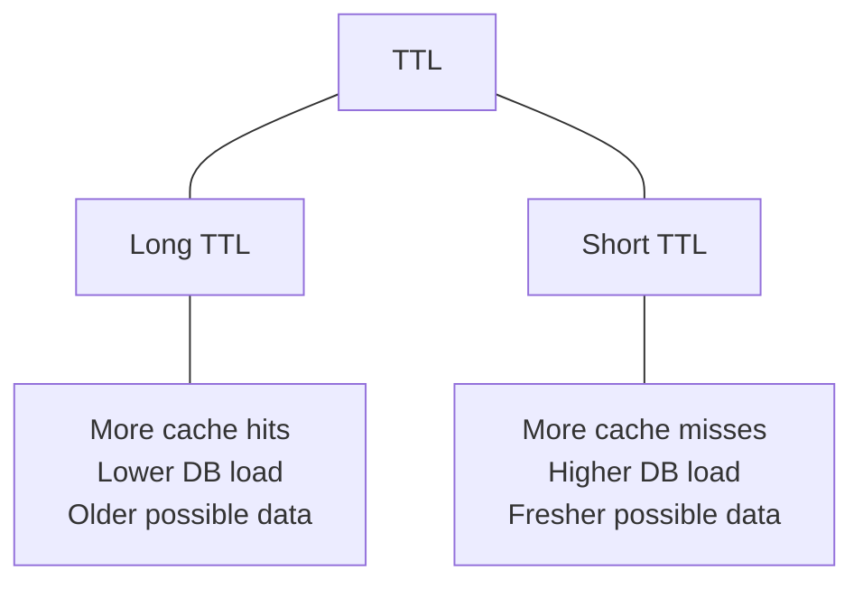

There is no universal perfect TTL.

The right value depends on:

* how frequently data changes
* how expensive the source is
* how fresh the data must be
* how much traffic exists
* how much cache capacity is available
* whether invalidation exists
* business requirements

---

# 10. Different Data Needs Different TTLs

Consider an application with:

```text
Product catalog
User profile
Weather
Exchange rate
Static configuration
```

They may have completely different freshness requirements.

For example:

| Data                      | Possible TTL direction | Reason                       |
| ------------------------- | ---------------------- | ---------------------------- |
| Product catalog           | Minutes                | Changes periodically         |
| User profile              | Minutes to hours       | Often changes infrequently   |
| Weather                   | Short                  | Conditions change frequently |
| Exchange rate             | Very short             | Values can change frequently |
| Static versioned asset    | Long                   | Content can be versioned     |
| Application configuration | Depends                | Correctness may be important |

These are examples, not universal values.

The important lesson is:

> **TTL should follow the data's freshness requirement.**

---

# 11. TTL Is Not the Same as Eviction

This distinction is extremely important.

### Expiration

The entry reaches the end of its configured lifetime.

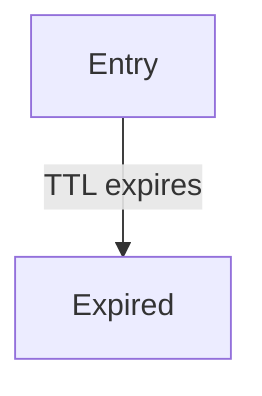

### Eviction

The cache removes an entry because it needs to free resources or because an eviction policy selected it.

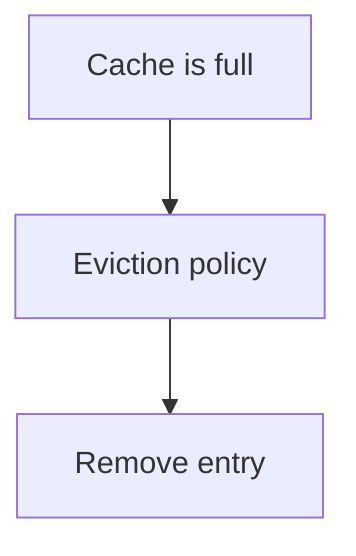

For example:

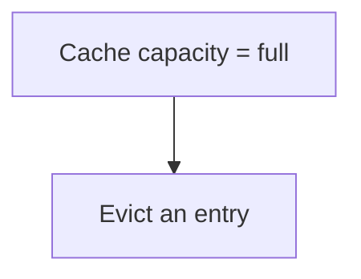

The entry might still have had:

```text
TTL remaining = 300 seconds
```

but it can still be evicted.

Therefore:

> **TTL determines lifetime eligibility; eviction determines whether an entry is removed to manage cache resources.**

The exact behavior depends on the cache implementation.

---

# 12. TTL vs Eviction

| Property               | Expiration                          | Eviction                        |
| ---------------------- | ----------------------------------- | ------------------------------- |
| Main purpose           | Control lifetime/freshness          | Manage capacity                 |
| Trigger                | TTL/policy deadline                 | Capacity/resource policy        |
| Requires TTL?          | Yes                                 | No                              |
| Can happen before TTL? | Not normally due to TTL itself      | Yes                             |
| Main question          | "Is this entry still valid to use?" | "Which entry should we remove?" |

A cache can use both.

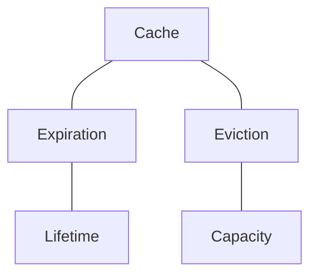

---

# 13. Absolute Expiration

An **absolute TTL** gives an entry a fixed lifetime from the time it is created or refreshed.

For example:

```text
TTL = 60 seconds
```

The timer begins:

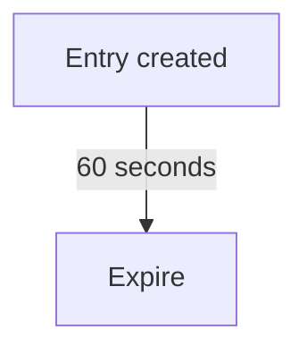

If the entry is accessed repeatedly, simply reading it does not necessarily extend its lifetime.

Example:

```text
T0 → created
T10 → read
T20 → read
T30 → read
T60 → expires
```

This is useful when you want a maximum lifetime regardless of access frequency.

---

# 14. Sliding Expiration

A **sliding expiration** extends the lifetime when the entry is accessed.

For example:

```text
TTL = 60 seconds
```

Suppose:

```text
T0 → created
T40 → accessed
```

The expiration deadline may move forward:

```text
T40 + 60 seconds
```

Then:

```text
T80 → accessed
```

and the deadline moves again.

Conceptually:

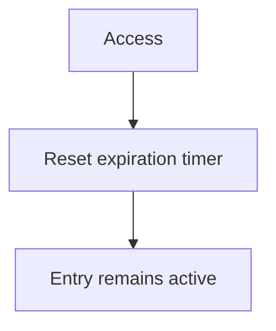

This is useful when frequently accessed data should remain available.

---

# 15. Absolute vs Sliding Expiration

| Property       | Absolute                      | Sliding                           |
| -------------- | ----------------------------- | --------------------------------- |
| Lifetime       | Fixed from creation/refresh   | Extended by access                |
| Frequent reads | Do not necessarily extend TTL | Can keep entry alive              |
| Maximum age    | Easier to bound               | Can become very long-lived        |
| Useful for     | Predictable freshness         | Frequently accessed reusable data |

Neither is universally better.

The correct choice depends on the freshness requirement.

---

# 16. Sliding TTL Can Create a Hidden Problem

Suppose:

```text
TTL = 60 seconds
```

and a very popular key is accessed continuously.

With sliding expiration:

```text
Request → refresh TTL
Request → refresh TTL
Request → refresh TTL
Request → refresh TTL
...
```

The entry may remain in the cache indefinitely.

If the underlying data changes and nothing else invalidates the entry, the cached value may remain stale for much longer than expected.

Therefore:

> **Sliding expiration should not be used without understanding its maximum freshness implications.**

---

# 17. Refreshing TTL Is a Policy Decision

When an entry is read, several behaviors are possible:

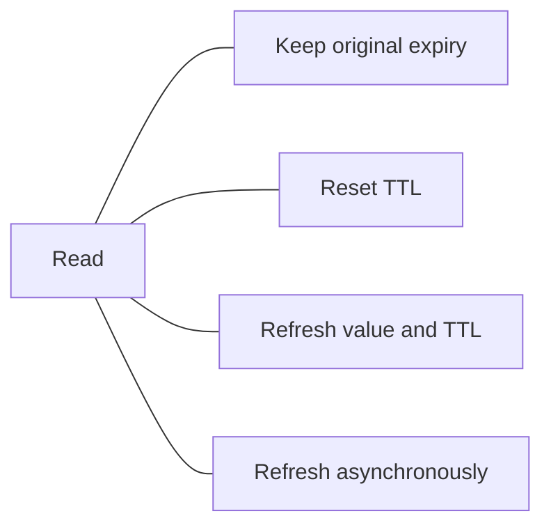

These are different policies.

Do not assume:

```text
"Every cache read automatically resets TTL."
```

That depends on the cache implementation and how the application uses it.

---

# 18. TTL and Cache-Aside

TTL works naturally with Cache-Aside.

Typical flow:

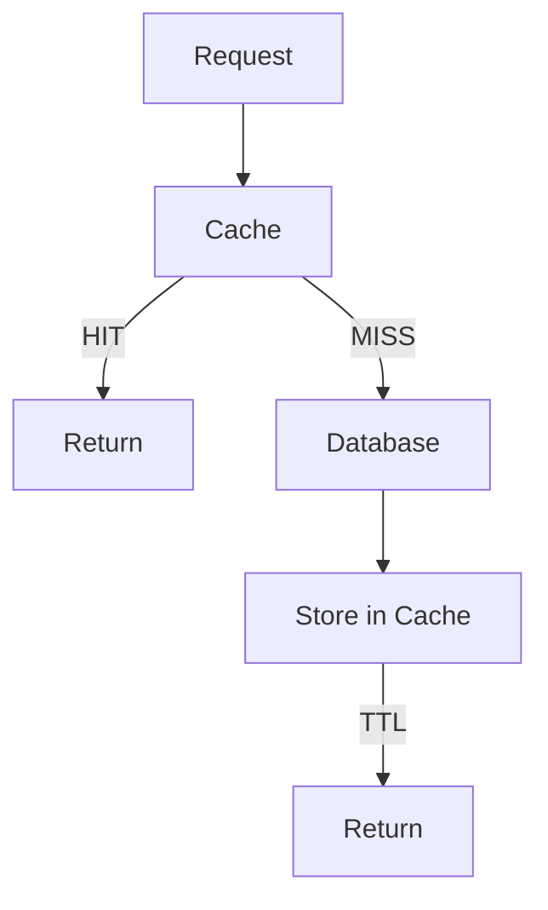

The application usually chooses the TTL when populating the cache.

For example:

```text
SET product:101 {...} EX 300
```

Conceptually:

```text
Store product
+
Give it a 300-second lifetime
```

When the entry expires:

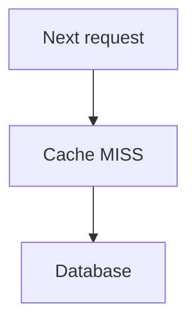

The cache can then be repopulated.

---

# 19. TTL and Write-Through

Write-Through can also use TTL.

Suppose:

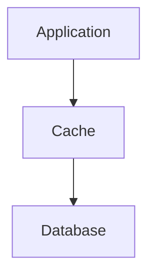

After the write:

```text
Cache:
new value
TTL:
300 seconds
```

The value can remain cached for the configured period.

When it expires:

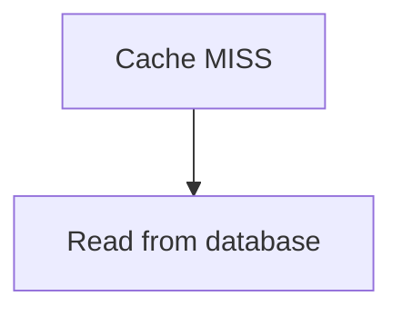

TTL therefore remains primarily a **cache-lifetime policy**, regardless of whether the cache uses Cache-Aside or Write-Through.

---

# 20. TTL and Write-Back

Write-Back requires extra care.

Remember:

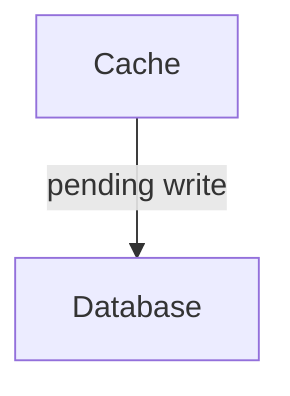

Suppose:

```text
TTL = 60 seconds
```

and the cache contains:

```text
dirty / unpersisted data
```

If the entry expires after 60 seconds, the system must not accidentally discard data that has not yet been persisted.

Therefore:

> **Ordinary cache expiration rules cannot blindly be applied to unpersisted Write-Back data.**

This is one reason Write-Back is more complex.

The system may need to distinguish:

```text
Clean cached data
```

from:

```text
Dirty unpersisted data
```

and protect the latter until persistence is safely completed.

---

# 21. TTL and Cache Invalidation

TTL is one way to remove stale data.

Explicit invalidation is another.

For example:

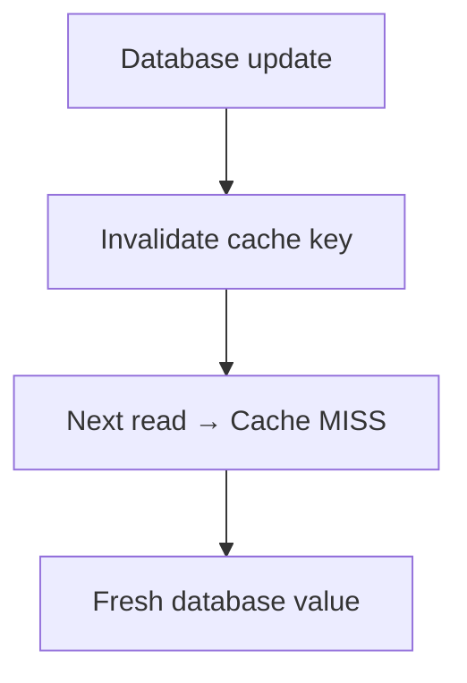

This can make changes visible sooner than waiting for TTL expiration.

Therefore, systems often combine:

```text
Explicit invalidation
        +
TTL
```

Why use both?

Because invalidation can handle known changes, while TTL provides a fallback if an invalidation is missed.

---

# 22. TTL Is Often a Safety Net

Consider:

```mermaid
flowchart TD
  accTitle: Invalidation fails
  accDescr: The database is updated, but cache invalidation failed.
  D["Database updated"] -. "X" .- F["Cache invalidation failed"]
```

Without TTL:

```mermaid
flowchart TD
  accTitle: Without TTL
  accDescr: The old value stays forever.
  O["Old value"] --- F["forever"]
```

With TTL:

```mermaid
flowchart TD
  accTitle: With TTL
  accDescr: The old value expires after its TTL and is refreshed.
  O["Old value"] -->|"TTL"| E["Expired"] --> R["Refresh"]
```

TTL can therefore limit the maximum intended lifetime of a cached value.

But remember:

> **TTL is not a substitute for correct invalidation when the application requires faster consistency.**

---

# 23. What Happens on Expiration?

A simplified flow is:

```mermaid
flowchart TD
  accTitle: What happens on expiration
  accDescr: Request, cache. Valid entry: HIT. Expired or missing: MISS, source, cache, response.
  R["Request"] --> C["Cache"]
  C -->|"Valid entry"| H["HIT"]
  C -->|"Expired/missing"| M["MISS"] --> S["Source"] --> C2["Cache"] --> P["Response"]
```

From the application's perspective, an expired entry often behaves like a cache miss.

The exact implementation may differ.

Some systems may remove expired entries lazily, proactively, or through a combination of mechanisms.

---

# 24. Lazy Expiration

One approach is to detect expiration when an entry is accessed.

For example:

```text
Entry:
expires at 12:00

Request at 11:59
→ usable

Request at 12:01
→ expired
→ treat as miss
```

The system discovers the expiration when the key is accessed.

This is sometimes called **lazy expiration**.

---

# 25. Active Expiration

A cache can also have background mechanisms that periodically inspect entries and remove expired data.

Conceptually:

```mermaid
flowchart TD
  accTitle: Active expiration
  accDescr: An active expiration process in the cache finds expired entries and removes them.
  C["Cache"] --- P["Active expiration process"] --> F["Find expired entries"] --> R["Remove"]
```

This can help reclaim resources without waiting for requests.

The exact strategy depends on the cache implementation.

---

# 26. Expiration Does Not Always Mean Immediate Physical Deletion

An important implementation detail:

```text
TTL reached
```

does not necessarily mean:

```text
The bytes disappear at exactly that nanosecond.
```

A cache may use:

* lazy checks
* background cleanup
* expiration sampling
* internal scheduling

What matters from the application's perspective is whether the entry is still considered usable.

Therefore:

> **Logical expiration and physical memory cleanup are related but not always identical events.**

---

# 27. The Expiration Storm Problem

Now consider a system with:

```text
1,000,000 cache entries
```

Suppose they were all created at nearly the same time with:

```text
TTL = 10 minutes
```

They may also expire around the same time.

Then:

```mermaid
flowchart TD
  accTitle: An expiration storm
  accDescr: 1,000,000 entries expire, then Many cache misses, then Many database requests, then Database load spike.
  N0["1,000,000 entries expire"] --> N1["Many cache misses"] --> N2["Many database requests"] --> N3["Database load spike"]
```

This is an **expiration storm**.

The cache successfully expired the entries.

But the resulting misses created a new bottleneck.

---

# 28. Why Expiration Storms Are Dangerous

Before expiration:

```mermaid
flowchart TD
  accTitle: Normal operation
  accDescr: Requests reach the cache; mostly hits, so little reaches the database.
  R["Requests"] --> C["Cache"] -->|"mostly HIT"| D["Database"]
```

After a mass expiration:

```mermaid
flowchart TD
  accTitle: During an expiration storm
  accDescr: Requests reach the cache; many miss, and the database is heavily loaded.
  R["Requests"] --> C["Cache"] -->|"many MISS"| D["Database<br/>████████████████████"]
```

The database suddenly receives a large amount of traffic.

This can cause:

* high database CPU
* connection pool exhaustion
* increased latency
* timeouts
* cascading failures

This connects directly to earlier topics:

```mermaid
flowchart TD
  accTitle: How a storm spreads
  accDescr: Cache expiration, then Cache misses, then Database load, then Connection pressure, then Latency, then Timeouts.
  N0["Cache expiration"] --> N1["Cache misses"] --> N2["Database load"] --> N3["Connection pressure"] --> N4["Latency"] --> N5["Timeouts"]
```

Caching can therefore move bottlenecks rather than permanently eliminate them.

---

# 29. TTL Jitter

One technique for reducing synchronized expiration is **TTL jitter**.

Instead of:

```text
Every key:
TTL = 300 seconds
```

use slightly different expiration times:

```text
Key A → 287 sec
Key B → 304 sec
Key C → 293 sec
Key D → 311 sec
```

Conceptually:

```text
Without jitter:

| | | | | | | | |
          ↓
       EXPIRATION
       SPIKE


With jitter:

|   | |    |  | |   |
 ↓     ↓     ↓   ↓
More distributed expirations
```

The idea is simple:

> **Do not let a large number of entries expire at exactly the same time if you can safely spread the expirations out.**

---

# 30. Choosing Jitter

A simple conceptual model:

```text
Base TTL = 300 seconds

Actual TTL =
300 + small random variation
```

For example:

```text
270–330 seconds
```

The exact range depends on the workload.

Jitter should not violate the freshness requirement.

If data must not be older than a strict maximum, adding arbitrary extra lifetime could be unsafe.

So:

> **Jitter is useful only within the application's acceptable freshness boundary.**

---

# 31. Cache Stampede

Expiration storms and cache stampedes are related but not identical.

A **cache stampede** occurs when many requests simultaneously discover that a popular key is missing or expired and all attempt to rebuild it.

Example:

```mermaid
flowchart TD
  accTitle: A stampede on a popular key
  accDescr: A popular product expires from the cache, and 1,000 requests all go to the database.
  P["Popular product"] --> E["Cache expires"] --> G
  subgraph G[" "]
    direction LR
    R["1,000 requests"] --> D4["Database"] & X["..."] & D1["Database"] & D2["Database"] & D3["Database"]
  end
```

Instead of one database request:

```text
1 cache miss → 1 database request
```

you may get:

```text
1 cache miss → 1,000 database requests
```

This connects directly to:

* 03.10 — Cache Stampede
* request concurrency
* database connection limits
* rate limiting
* backpressure

The detailed mitigation strategies belong in the dedicated Cache Stampede chapter.

---

# 32. TTL and Popular Keys

TTL behavior becomes especially important for **hot keys**.

Suppose:

```text
product:popular
```

receives:

```text
50,000 requests/minute
```

If it expires:

```mermaid
flowchart TD
  accTitle: A popular key expires
  accDescr: 50,000 requests, then Cache MISS, then Database.
  N0["50,000 requests"] --> N1["Cache MISS"] --> N2["Database"]
```

Even a short expiration event can produce significant load.

This is why popular keys deserve special attention.

---

# 33. TTL and Negative Caching

TTL can also be used for data that does not exist.

Suppose:

```text
User ID = 999999
```

does not exist.

Without negative caching:

```mermaid
flowchart TD
  accTitle: Repeated lookups for a missing record
  accDescr: Request, then Cache MISS, then Database, then "Not found".
  N0["Request"] --> N1["Cache MISS"] --> N2["Database"] --> N3["#quot;Not found#quot;"]
```

Repeated requests can repeatedly hit the database.

With negative caching:

```text
Cache:
user:999999 = NOT_FOUND

TTL:
30 seconds
```

Repeated requests can be answered from the cache.

A shorter TTL may be appropriate because the object could be created later.

This is another example of TTL reflecting the data's expected change behavior.

---

# 34. TTL and Memory Management

TTL can also help prevent entries from remaining in the cache indefinitely.

Suppose:

```text
Application generates
unique cache keys continuously.
```

Without expiration:

```text
Key 1
Key 2
Key 3
...
Key 1,000,000
...
```

The cache may consume increasing amounts of memory.

TTL allows unused entries to eventually become eligible for removal.

But remember:

```text
TTL ≠ guaranteed capacity protection
```

A cache may still need an eviction policy.

The two mechanisms solve different problems.

---

# 35. TTL and Cache Capacity

Think of cache management as two independent questions.

### Question 1

How long should this data remain usable?

```text
TTL
```

### Question 2

What happens when the cache does not have enough space?

```text
Eviction policy
```

Therefore:

```mermaid
flowchart TD
  accTitle: TTL and capacity
  accDescr: Cache management covers freshness, handled by TTL, and capacity, handled by eviction.
  C["Cache Management"] --- F["Freshness"] --- T["TTL"]
  C --- K["Capacity"] --- E["Eviction"]
```

This separation makes cache behavior easier to reason about.

---

# 36. TTL and Cache Hit Ratio

TTL affects the cache hit ratio.

Suppose:

```text
10,000 requests
```

With a long enough TTL:

```text
9,500 hits
500 misses

Hit ratio = 95%
```

With a much shorter TTL:

```text
7,000 hits
3,000 misses

Hit ratio = 70%
```

A lower hit ratio means more requests reach the source.

But:

> **A higher hit ratio is not automatically better.**

A stale cached value might produce a high hit ratio while violating freshness requirements.

The goal is not:

```text
Maximum hit ratio
```

The goal is:

```text
Acceptable freshness
+
Acceptable source load
+
Acceptable latency
+
Acceptable cost
```

---

# 37. TTL and Source Load

A useful relationship is:

```mermaid
flowchart TD
  accTitle: Shorter TTL
  accDescr: Shorter TTL, then More expirations, then More cache misses, then More source requests.
  N0["Shorter TTL"] --> N1["More expirations"] --> N2["More cache misses"] --> N3["More source requests"]
```

And:

```mermaid
flowchart TD
  accTitle: Longer TTL
  accDescr: Longer TTL, then Fewer expirations, then More cache hits, then Lower source load.
  N0["Longer TTL"] --> N1["Fewer expirations"] --> N2["More cache hits"] --> N3["Lower source load"]
```

But:

```mermaid
flowchart TD
  accTitle: The cost of a longer TTL
  accDescr: Longer TTL, then Potentially older data.
  N0["Longer TTL"] --> N1["Potentially older data"]
```

This is the central TTL trade-off.

---

# 38. TTL Should Be Based on Data Behavior

Do not start with:

> "Let's use 5 minutes because that's common."

Instead ask:

### How often does the data change?

```text
Rarely → longer TTL may be acceptable
Frequently → shorter TTL may be needed
```

### How expensive is the source?

```text
Very expensive → longer TTL may reduce load
```

### How fresh must the data be?

```text
Strict freshness → shorter TTL / invalidation
```

### Can stale data cause harm?

```text
High consequence → be more conservative
```

### Can the application explicitly invalidate?

```text
Yes → TTL can act as a fallback
```

---

# 39. TTL Is a Product Requirement Too

Consider a food-delivery application.

Restaurant availability changes frequently.

Suppose:

```text
Restaurant:
"Open"
```

is cached for:

```text
TTL = 30 minutes
```

But the restaurant closes after 5 minutes.

For the next 25 minutes, the system may still display:

```text
Open
```

The problem is not simply a technical caching mistake.

The real question is:

> **How stale can restaurant availability be before the user experience or business process becomes incorrect?**

That is a product/business requirement translated into a technical caching policy.

---

# 40. TTL Is a System Constraint

We can express the decision like this:

```mermaid
flowchart TD
  accTitle: TTL is a system constraint
  accDescr: Business requirement, then Acceptable staleness, then Freshness policy, then TTL / invalidation strategy, then Cache behavior, then Database load.
  N0["Business requirement"] --> N1["Acceptable staleness"] --> N2["Freshness policy"] --> N3["TTL / invalidation strategy"] --> N4["Cache behavior"] --> N5["Database load"]
```

This is system design thinking.

The TTL should emerge from the requirement, not from a random number.

---

# 41. TTL and Versioned Resources

Some resources can use very long TTLs if their identity changes when their content changes.

For example:

```text
app.css?v=101
```

Later:

```text
app.css?v=102
```

The resource URL changes.

Therefore:

```text
Old cached resource:
app.css?v=101

New resource:
app.css?v=102
```

The application can safely cache each version for a long time because the new version has a different identity.

This technique is commonly known as **cache busting through versioned assets**.

It demonstrates an important principle:

> **Sometimes changing the cache key is easier than trying to invalidate every existing cached copy.**

---

# 42. TTL and Cache Keys

Remember the earlier cache-key principle.

Suppose:

```text
product:101
```

has:

```text
TTL = 300 seconds
```

If the key is incorrect or too broad, TTL cannot fix the correctness problem.

For example:

```text
user:profile
```

might accidentally serve one user's data to another user if user identity is missing from the key.

The correct key might need to be:

```text
user:42:profile
```

TTL controls **lifetime**.

It does not fix **key correctness**.

---

# 43. TTL and Security

Cached data can contain sensitive information.

Suppose:

```text
Cache:
user:42:private-profile
```

A long TTL means the data remains available in the cache for longer.

Security questions include:

* Who can access the cache?
* Is the key scoped correctly?
* Can one user receive another user's cached data?
* Should sensitive data be cached at all?
* How quickly should revoked information disappear?
* Does logout invalidate cached user-specific data?

Again:

> **TTL is part of the data-lifecycle policy, not merely a performance setting.**

---

# 44. TTL and Authorization Changes

Consider:

```text
User 42
Role = Admin
```

Cached authorization-related data might say:

```text
is_admin = true
```

Then the user's role changes:

```text
is_admin = false
```

If the cached authorization information remains usable for too long, the application could make decisions based on outdated state.

This is why security-sensitive data often needs stronger freshness and invalidation rules than ordinary content.

---

# 45. A Practical TTL Investigation

When deciding on a TTL, collect evidence.

### Step 1 — Measure data-change frequency

How often does the underlying data change?

### Step 2 — Measure request frequency

How often is the data requested?

### Step 3 — Measure source cost

How expensive is rebuilding the value?

### Step 4 — Define acceptable staleness

How old can the cached value safely be?

### Step 5 — Check invalidation

Can changes trigger immediate invalidation?

### Step 6 — Check cache capacity

How much memory will the chosen TTL require?

### Step 7 — Observe hit ratio

How does TTL affect:

```text
hits
misses
source load
```

### Step 8 — Test expiration behavior

Look for:

```text
expiration spikes
stampedes
database load
```

Then adjust.

---

# 46. A Simple TTL Decision Flow

```mermaid
flowchart TD
  accTitle: A simple TTL decision flow
  accDescr: How fresh must this data be? Define max acceptable staleness. Can changes be explicitly invalidated? Yes: use invalidation plus a TTL fallback. No: TTL becomes more important. Then check source load, check cache capacity, test hit/miss, and test expiration behavior.
  F["How fresh must this data be?"] --> S["Define max acceptable<br/>staleness"] --> Q{"Can changes be explicitly<br/>invalidated?"}
  Q -->|"YES"| I["Use invalidation<br/>+ TTL fallback"]
  Q -->|"NO"| T["TTL becomes<br/>more important"]
  I & T --> L["Check source<br/>load"] --> K["Check cache<br/>capacity"] --> H["Test hit/miss"] --> E["Test expiration<br/>behavior"]
```

There is no universal TTL number.

---

# 47. Common Mistakes

### Mistake 1 — One TTL for everything

Different data has different freshness requirements.

---

### Mistake 2 — Thinking TTL guarantees correctness

TTL limits cache lifetime; it does not automatically synchronize cache and database.

---

### Mistake 3 — Confusing expiration with eviction

Expiration concerns lifetime.

Eviction concerns capacity.

---

### Mistake 4 — Using extremely short TTLs everywhere

This can turn the cache into a frequent source of misses and increase database load.

---

### Mistake 5 — Using extremely long TTLs everywhere

This can allow data to become stale for too long.

---

### Mistake 6 — Ignoring expiration storms

Millions of keys can expire around the same time.

---

### Mistake 7 — Ignoring hot keys

Expiration of a heavily requested key can trigger a cache stampede.

---

### Mistake 8 — Applying ordinary TTL blindly to Write-Back data

Unpersisted writes must not be discarded like ordinary disposable cache entries.

---

### Mistake 9 — Resetting TTL on every read without understanding why

Sliding expiration can keep stale data alive indefinitely.

---

### Mistake 10 — Choosing TTL without measuring

A TTL should be based on freshness, workload, capacity, and source cost.

---

# 48. System Design View

At a small scale:

```mermaid
flowchart TD
  accTitle: No cache
  accDescr: Application, then Database.
  N0["Application"] --> N1["Database"]
```

may be enough.

As the system grows:

```mermaid
flowchart TD
  accTitle: With a cache
  accDescr: Application, then Cache, then Database.
  N0["Application"] --> N1["Cache"] --> N2["Database"]
```

reduces repeated database work.

But now the system must decide:

```text
How long should data stay cached?
```

That decision affects:

```mermaid
flowchart LR
  accTitle: What TTL affects
  accDescr: TTL affects cache hit ratio, database load, data freshness, memory usage, expiration patterns and failure behavior.
  T["TTL"] --- A["Cache hit ratio"]
  T --- B["Database load"]
  T --- C["Data freshness"]
  T --- D["Memory usage"]
  T --- E["Expiration patterns"]
  T --- F["Failure behavior"]
```

A single configuration value can therefore influence several parts of the architecture.

---

# 49. The Bigger Performance Loop

Caching optimization should follow the same principle used throughout Systemly:

```mermaid
flowchart TD
  accTitle: The bigger performance loop
  accDescr: Measure, then Understand workload, then Define freshness requirement, then Choose initial TTL, then Observe hit/miss behavior, then Observe source load, then Observe stale-data incidents, then Adjust, then Measure again.
  N0["Measure"] --> N1["Understand workload"] --> N2["Define freshness requirement"] --> N3["Choose initial TTL"] --> N4["Observe hit/miss behavior"] --> N5["Observe source load"] --> N6["Observe stale-data incidents"] --> N7["Adjust"] --> N8["Measure again"]
```

Do not optimize TTL in isolation.

---

# 50. Example — Product Catalog

Suppose:

```text
Products:
1 million

Requests:
100,000/minute

Database:
Expensive product queries
```

Product prices typically change occasionally.

A cache may use:

```text
TTL = several minutes
```

and explicit invalidation when an administrator changes a product.

Flow:

```mermaid
flowchart TD
  accTitle: Invalidation plus TTL
  accDescr: Admin updates product, then Database updated, then Invalidate product:101, then Next user request, then Cache MISS, then Database, then Cache with TTL.
  N0["Admin updates product"] --> N1["Database updated"] --> N2["Invalidate product:101"] --> N3["Next user request"] --> N4["Cache MISS"] --> N5["Database"] --> N6["Cache with TTL"]
```

Here:

```text
Invalidation
→ fast freshness after known changes

TTL
→ fallback protection if invalidation is missed
```

This is often more robust than relying on TTL alone.

---

# 51. Example — Weather Data

Weather data changes frequently.

Suppose:

```mermaid
flowchart TD
  accTitle: Weather data
  accDescr: Requests go to a cache with a short TTL in front of the external weather service.
  R["Request"] --> C["Cache"] -->|"TTL = short"| W["External weather service"]
```

A long TTL could reduce API usage but increase staleness.

A short TTL improves freshness but increases external requests.

The right TTL depends on:

* how frequently the provider updates
* how fresh the application needs to be
* provider rate limits
* API cost
* user expectations

Again:

> **TTL is a trade-off, not a magic number.**

---

# 52. Example — Static Assets

Consider:

```text
main.abc123.css
```

If the filename contains a content/version identifier, the application can often cache it for a long time.

When the file changes:

```text
main.xyz789.css
```

is generated.

Now users request a different cache key.

This allows:

```text
Long TTL
+
Versioned identity
```

to provide both:

```text
High cache reuse
+
Reliable updates
```

This is a powerful example of changing the system design rather than simply shortening TTL.

---

# 53. TTL and Architecture Evolution

At small scale:

```text
Database
```

may be sufficient.

Later:

```mermaid
flowchart TD
  accTitle: Adding Redis
  accDescr: Application, then Redis, then Database.
  N0["Application"] --> N1["Redis"] --> N2["Database"]
```

Then:

```mermaid
flowchart TD
  accTitle: A distributed cache
  accDescr: Application, then Distributed Cache, then Database.
  N0["Application"] --> N1["Distributed Cache"] --> N2["Database"]
```

As traffic grows further:

```mermaid
flowchart TD
  accTitle: Many cache layers
  accDescr: Browser, then CDN, then Reverse Proxy, then Application Cache, then Database.
  N0["Browser"] --> N1["CDN"] --> N2["Reverse Proxy"] --> N3["Application Cache"] --> N4["Database"]
```

Each layer may have a different freshness policy.

This reinforces the earlier principle:

> **Cache layers exist for different responsibilities, and TTL is part of the policy for each cached representation.**

---

# 54. Cache Lifetime Is a Contract

A useful mental model is to treat TTL as a contract:

```text
"This cached representation may be used
for approximately this long before it must
no longer be considered valid."
```

That contract should be meaningful.

For example:

```text
Product recommendation:
TTL = 10 minutes
```

may be reasonable.

But:

```text
User authorization:
TTL = 24 hours
```

may require much stronger justification.

The number itself is not the design.

The reasoning behind the number is the design.

---

# 55. Key Principle

> **TTL controls how long cached data may remain usable, balancing freshness against cache reuse, source load, and memory usage.**

Remember:

```mermaid
flowchart TD
  accTitle: The key principle
  accDescr: Long TTL: more reuse, potentially stale data. Short TTL: fresher data, more misses, more source load.
  A0["Long TTL"] --> A1["More reuse"] --> A2["Potentially stale data"]
  B0["Short TTL"] --> B1["Fresher data"] --> B2["More misses"] --> B3["More source load"]
```

And:

```text
TTL
≠
Eviction

TTL
≠
Invalidation

TTL
≠
Guaranteed correctness
```

---

# 56. Quick Reference

| Concept             | Meaning                                              |
| ------------------- | ---------------------------------------------------- |
| TTL                 | Time To Live                                         |
| Expiration          | Entry reaches its configured lifetime                |
| Stale               | Cached value is older than the desired current state |
| Eviction            | Entry removed to manage cache capacity               |
| Absolute expiration | Fixed lifetime                                       |
| Sliding expiration  | Access can extend lifetime                           |
| Cache miss          | Requested value is unavailable/expired               |
| TTL jitter          | Small variation in expiration times                  |
| Expiration storm    | Many entries expire around the same time             |
| Cache stampede      | Many requests rebuild the same missing/expired data  |
| Negative caching    | Temporarily caching "not found" results              |
| Freshness           | How current cached data is relative to the source    |

---

# 57. Knowledge Check

### Question 1

What does TTL stand for?

<details>
<summary>Answer</summary>

Time To Live. It defines how long a cached entry is allowed to remain usable according to the cache's expiration policy.

</details>

---

### Question 2

Does TTL guarantee that the cached data is identical to the database?

<details>
<summary>Answer</summary>

No. The database can change while the cached entry is still within its TTL.

</details>

---

### Question 3

What is the difference between expiration and eviction?

<details>
<summary>Answer</summary>

Expiration is related to an entry reaching its configured lifetime. Eviction is related to removing entries to manage cache capacity or according to an eviction policy.

</details>

---

### Question 4

What is the main trade-off of a longer TTL?

<details>
<summary>Answer</summary>

A longer TTL can increase cache reuse and reduce source load, but it can also allow cached data to remain stale for longer.

</details>

---

### Question 5

Why can a very short TTL increase database load?

<details>
<summary>Answer</summary>

Entries expire more frequently, causing more cache misses and more requests to reach the underlying source.

</details>

---

### Question 6

What is TTL jitter?

<details>
<summary>Answer</summary>

TTL jitter introduces small variations in expiration times so that large numbers of entries do not all expire simultaneously.

</details>

---

### Question 7

Why can sliding expiration be risky?

<details>
<summary>Answer</summary>

Frequently accessed entries can keep extending their lifetime, potentially allowing stale data to remain cached much longer than intended.

</details>

---

### Question 8

Why must Write-Back caches treat unpersisted data differently?

<details>
<summary>Answer</summary>

Because an unpersisted write may be important data rather than disposable cached data. Expiring or evicting it before persistence could cause data loss.

</details>

---

### Question 9

Is a higher cache hit ratio always better?

<details>
<summary>Answer</summary>

No. A high hit ratio is useful only when the cached data is fresh enough and the resulting system behavior satisfies correctness and business requirements.

</details>

---

# 59. Remember

When deciding a TTL, do not start with:

```text
"What TTL should I use?"
```

Start with:

```mermaid
flowchart TD
  accTitle: Remember
  accDescr: How fresh must this data be?, then How often does it change?, then How expensive is the source?, then Can we invalidate it?, then How much cache capacity do we have?, then What happens when it expires?.
  N0["How fresh must this data be?"] --> N1["How often does it change?"] --> N2["How expensive is the source?"] --> N3["Can we invalidate it?"] --> N4["How much cache capacity do we have?"] --> N5["What happens when it expires?"]
```

Then choose and measure.

The goal is not:

```text
Longest TTL
```

or:

```text
Shortest TTL
```

The goal is:

```text
Acceptable freshness
+
Acceptable performance
+
Acceptable source load
+
Acceptable cost
```

---

# 60. Next Chapter

## 03.09 — Cache Invalidation

TTL provides one way to deal with old cached data.

But waiting for expiration is not always enough.

The next chapter asks:

> **What should happen when we know the underlying data has changed right now?**

We will study:

* explicit cache invalidation
* delete-on-write
* update-on-write
* invalidation timing
* stale cache windows
* invalidation failures
* multiple cache layers
* invalidation across distributed systems
* race conditions
* versioned cache keys
* why cache invalidation is difficult
* practical invalidation strategies
