# 03.09 — Cache Invalidation

## Learning Objectives

By the end of this chapter, you should understand:

* What cache invalidation means
* Why invalidation is necessary
* The difference between **expiration, eviction, and invalidation**
* Delete-on-write and update-on-write strategies
* When invalidation should happen
* Why invalidation can fail
* How race conditions create stale data
* How multiple cache layers complicate invalidation
* How versioned keys can simplify cache invalidation
* Why distributed cache invalidation is difficult
* How invalidation interacts with Cache-Aside, Write-Through, and Write-Back
* How to design and test an invalidation strategy

---

# 1. What Is Cache Invalidation?

**Cache invalidation** means making a cached representation no longer usable because the underlying data has changed or should no longer be served from that cache entry.

In simple terms:

> **The data changed, so the old cached copy should not be used.**

Example:

```text
Database:
Product 101
price = ₹100

Cache:
product:101
price = ₹100
```

An administrator changes the price:

```text
Database:
Product 101
price = ₹120
```

The cache still contains:

```text
Cache:
product:101
price = ₹100
```

The application can invalidate the old cache entry:

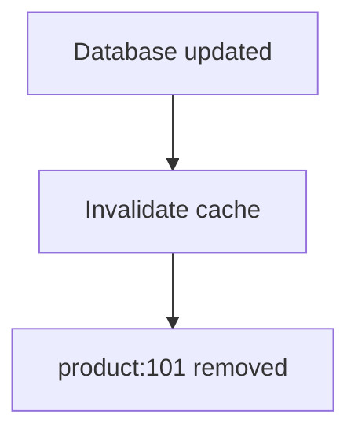

The next read can fetch the new value.

---

# 2. Why Do We Need Invalidation?

Without invalidation, the system may have to wait for TTL expiration.

Suppose:

```text
TTL = 1 hour
```

The database changes immediately:

```text
T0:
Database = ₹120
Cache    = ₹100
```

If the cache continues serving the old value until TTL expires:

```text
T0 -------------------------- T60
     stale value available
```

Users may see:

```text
₹100
```

even though the database already contains:

```text
₹120
```

If the application needs the change to become visible sooner, it needs another mechanism.

That mechanism can be **cache invalidation**.

---

# 3. Invalidation vs Expiration

These concepts are related but different.

### Expiration

The entry reaches the end of its configured lifetime.

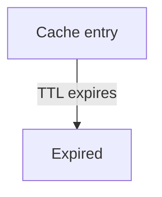

### Invalidation

The system decides that the entry should no longer be used because the underlying state changed.

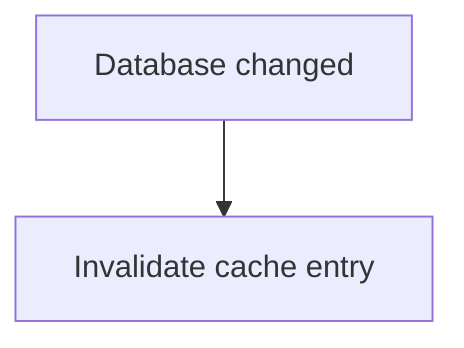

The difference is **why** the cached entry stops being usable.

---

# 4. Invalidation vs Eviction

Eviction solves a different problem.

### Invalidation

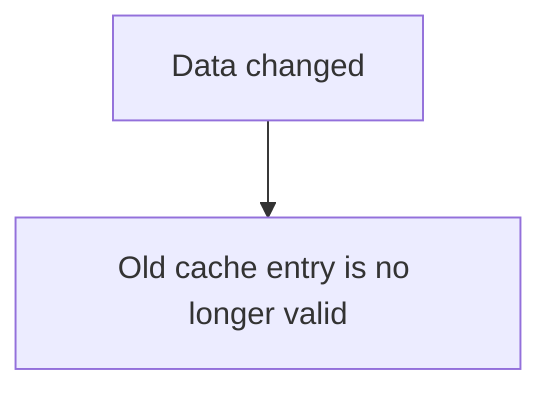

### Eviction

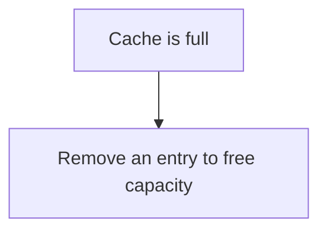

Therefore:

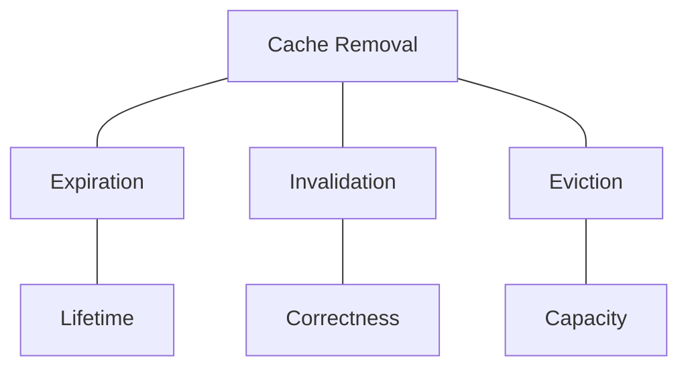

A cache entry can be:

* invalidated while it still has TTL remaining
* evicted before TTL expires
* expired naturally

These are different mechanisms.

---

# 5. The Basic Invalidation Flow

A simple system might use:

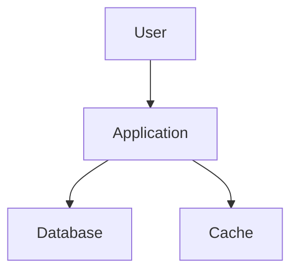

When data changes:

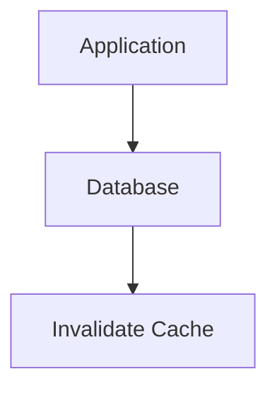

Then:

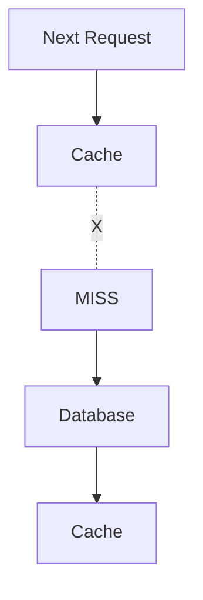

The cache is rebuilt with the new value.

---

# 6. Cache-Aside and Invalidation

Cache-Aside commonly uses invalidation.

Recall:

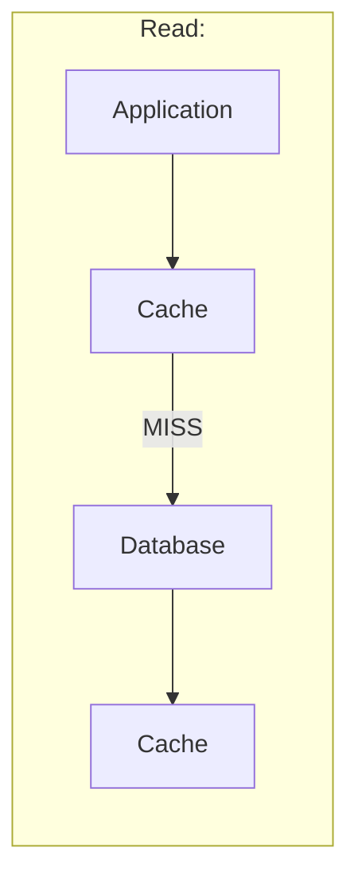

For a write:


Then the next read repopulates the cache.

This is often called:

> **Delete-on-write**

because the application deletes or invalidates the cached representation after changing the source.

---

# 7. Delete-on-Write

Suppose:

```text
Cache:
product:101 = ₹100

Database:
product:101 = ₹100
```

The application receives:

```text
Update price → ₹120
```

Flow:

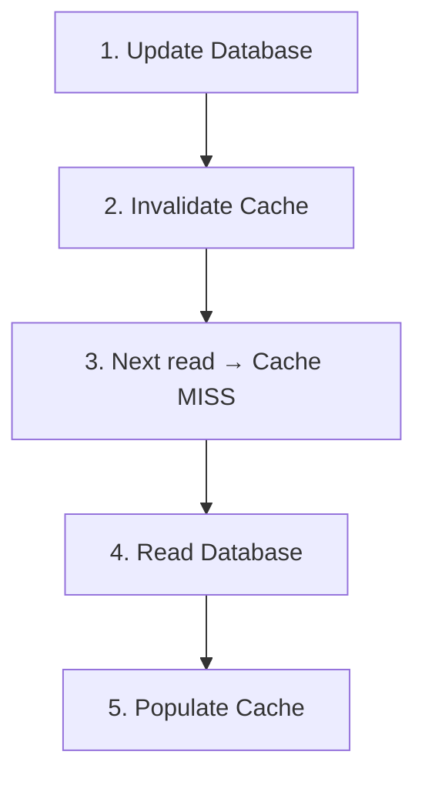

Result:

```text
Database:
₹120

Cache:
₹120
```

This is a simple and widely useful pattern.

---

# 8. Why Delete Instead of Update?

You might ask:

> Why not simply update the cache with the new value?

That is another valid strategy.

But deleting the cache entry has an important advantage:

> **The database remains the source of truth, and the next read rebuilds the cache from the source.**

For example:

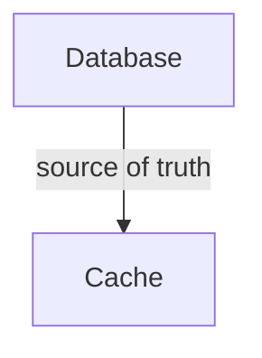

The application does not need to duplicate all cache-building logic during the write.

Instead:

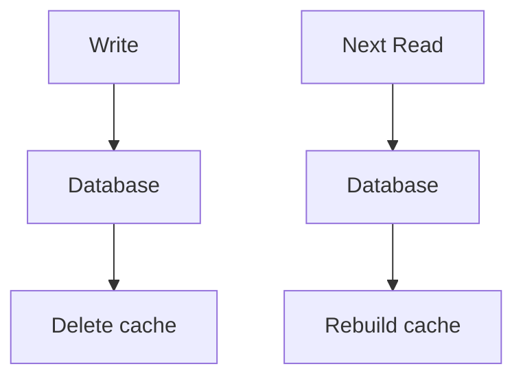

This can reduce some consistency problems.

It does not eliminate them.

---

# 9. Update-on-Write

Another strategy is to update the cache after updating the database.

Example:

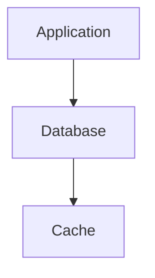

Suppose:

```text
Old:
price = 100

New:
price = 120
```

The application performs:

```text
1. Update database
2. Update cache
```

Now both contain:

```text
price = 120
```

This can avoid the next cache miss.

But it introduces another failure point.

---

# 10. Delete-on-Write vs Update-on-Write

| Strategy        | Write action                 | Next read            | Main concern                       |
| --------------- | ---------------------------- | -------------------- | ---------------------------------- |
| Delete-on-write | Update DB + invalidate cache | Cache miss → rebuild | Temporary miss                     |
| Update-on-write | Update DB + update cache     | Cache hit            | Keeping both operations consistent |

Neither strategy is universally correct.

The decision depends on:

* write frequency
* read frequency
* cache population cost
* consistency requirements
* failure handling
* application complexity

---

# 11. The Invalidation Ordering Problem

Consider:

```text
Database update
Cache invalidation
```

Which should happen first?

A common approach is:

```text
1. Update database
2. Invalidate cache
```

Why?

Because the source should be updated before the old cached representation is removed.

Flow:

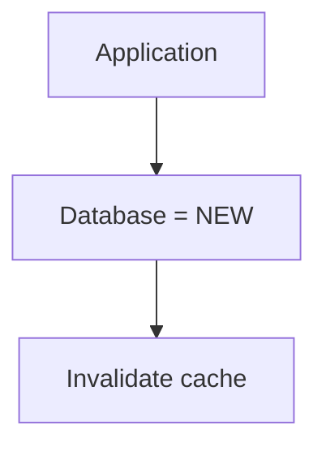

Then:

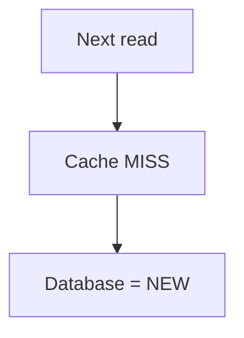

This is conceptually simple.

But it still has race conditions.

---

# 12. A Dangerous Ordering

Consider:

```text
1. Invalidate cache
2. Update database
```

Now another request can arrive between those operations.

Timeline:

```text
T1:
Invalidate cache

T2:
Another request
    |
    v
Cache MISS
    |
    v
Database
    |
    v
Reads OLD value

T3:
Original request
    |
    v
Updates database
```

The old value may now be placed back into the cache.

Result:

```text
Database:
NEW

Cache:
OLD
```

The cache has become stale again.

Therefore:

> **The order and concurrency of database writes and cache invalidation matter.**

---

# 13. The Classic Race Condition

Consider two operations.

### Writer

```text
W:
Update DB
Invalidate cache
```

### Reader

```text
R:
Read cache
If MISS → Read DB → Populate cache
```

Now interleave them:

```text
T1  W: Update DB → NEW

T2  R: Cache MISS

T3  R: Read DB → NEW

T4  W: Invalidate cache

T5  R: Put NEW into cache
```

This happens to be fine.

But a different interleaving can cause trouble.

For example:

```text
T1  R: Cache MISS

T2  W: Update DB → NEW

T3  W: Invalidate cache

T4  R: Read DB
```

Depending on transaction visibility and timing, the reader may observe an older state and populate the cache after invalidation.

Now:

```text
Database:
NEW

Cache:
OLD
```

This is why cache invalidation becomes harder as concurrency increases.

---

# 14. Invalidation Is Not a Single Event

It is tempting to think:

```text
Invalidate!
```

and assume the problem is solved.

In a distributed system, invalidation may involve:

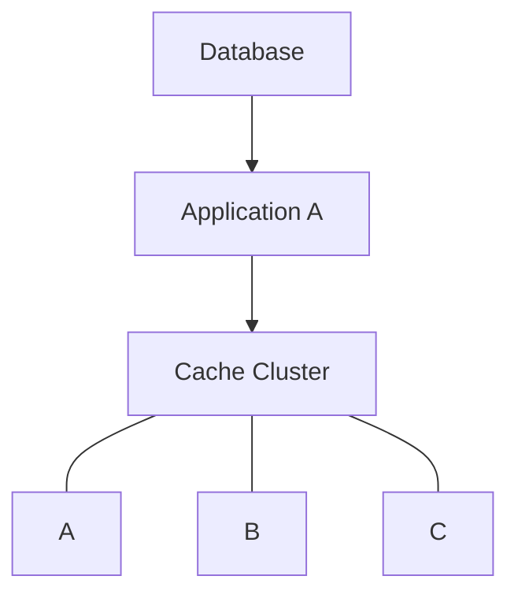

There may be:

* multiple application instances
* multiple cache nodes
* local in-memory caches
* distributed caches
* CDN caches
* reverse proxy caches
* browser caches

Now ask:

> **Which cached copies must be invalidated?**

This is where the problem becomes significantly harder.

---

# 15. Multiple Cache Layers

Recall the cache-layer model:

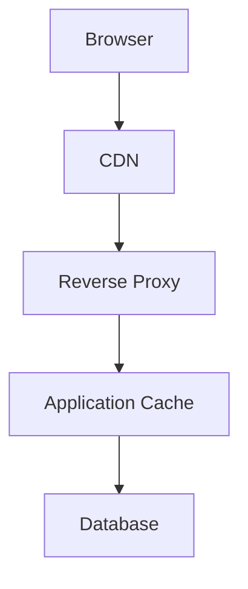

Suppose the database changes.

Invalidating only the application cache may not be enough.

For example:

```text
Database:
NEW

Application Cache:
NEW

CDN:
OLD
```

The CDN can still serve the old response.

Similarly:

```text
Browser:
OLD
```

may continue displaying an older resource.

Therefore:

> **Invalidation must consider every cache layer that can serve the affected representation.**

---

# 16. Different Representations

The same underlying data may appear in different forms.

For example:

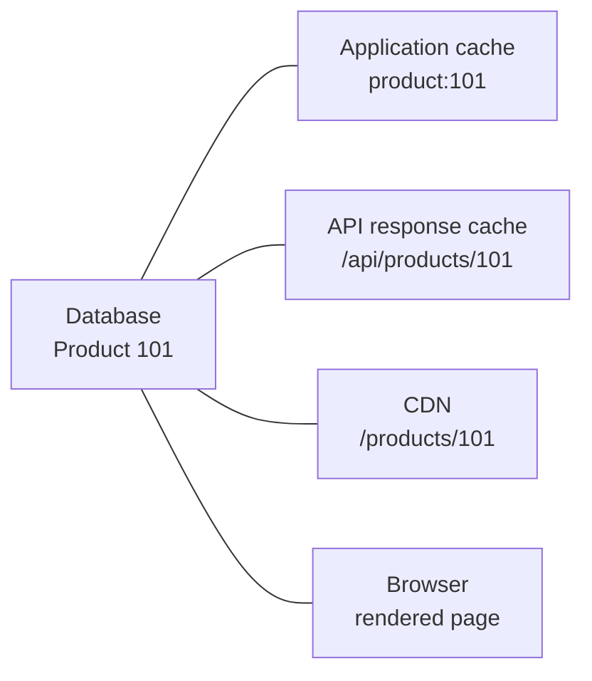

Changing:

```text
price = 100 → 120
```

may require invalidating several representations.

This creates a dependency problem:

```mermaid
flowchart LR
  accTitle: One change, many caches
  accDescr: One data change affects caches A, B, C and D.
  R["One data change"]
  R --- K0["Cache A"]
  R --- K1["Cache B"]
  R --- K2["Cache C"]
  R --- K3["Cache D"]
```

The more representations you cache, the more invalidation relationships you must manage.

---

# 17. Invalidation Dependency

A useful mental model is:

```mermaid
flowchart LR
  accTitle: Invalidation dependency
  accDescr: Source data has representations A, B and C.
  R["Source Data"]
  R --- K0["Representation A"]
  R --- K1["Representation B"]
  R --- K2["Representation C"]
```

If the source changes:

```mermaid
flowchart TD
  accTitle: The real question
  accDescr: Source Data changes, then Which representations are now invalid?.
  N0["Source Data changes"] --> N1["Which representations are now invalid?"]
```

This is why cache invalidation is often described as difficult.

The difficult part is not:

```text
DELETE cache:key
```

The difficult part is knowing:

> **Which keys and representations are affected by the change?**

---

# 18. Cache Key Dependencies

Suppose:

```text
Product 101
```

appears in:

```text
product:101

category:5:products

homepage:featured

search:keyboard

recommendations:user:42
```

Changing Product 101 may affect all of them.

You now have:

```mermaid
flowchart LR
  accTitle: Keys that depend on one product
  accDescr: Product 101 affects product:101, category:5:products, homepage:featured, search:keyboard and recommendations:user:42.
  R["Product 101"]
  R --- K0["product:101"]
  R --- K1["category:5:products"]
  R --- K2["homepage:featured"]
  R --- K3["search:keyboard"]
  R --- K4["recommendations:user:42"]
```

Invalidating only:

```text
product:101
```

may leave other representations stale.

This is a classic cache invalidation challenge.

---

# 19. Broad vs Precise Invalidation

There are two general approaches.

### Precise invalidation

Invalidate only keys known to be affected.

```mermaid
flowchart TD
  accTitle: Precise invalidation
  accDescr: Updating Product 101 invalidates product:101, category:5:products and so on.
  U["Update Product 101"] --> I["Invalidate:<br/>product:101<br/>category:5:products<br/>..."]
```

Advantages:

* fewer unnecessary cache misses
* better cache efficiency

Disadvantages:

* harder dependency tracking
* easier to miss a key
* more complex code

### Broad invalidation

Invalidate a larger group.

For example:

```mermaid
flowchart TD
  accTitle: Broad invalidation
  accDescr: Update Product, then Invalidate entire product-list cache.
  N0["Update Product"] --> N1["Invalidate entire product-list cache"]
```

Advantages:

* simpler
* lower risk of leaving related entries stale

Disadvantages:

* more cache misses
* more database/application work
* can create traffic spikes

Again:

> **Precision reduces unnecessary invalidation but increases complexity.**

---

# 20. Namespace or Group Invalidation

One way to simplify broad invalidation is to group related keys.

For example:

```text
products:v1:101
products:v1:102
products:v1:103
```

A system may use a namespace/version mechanism rather than individually deleting every key.

Conceptually:

```text
Namespace:
products:v1

Change namespace
       ↓
products:v2
```

Old entries become unreachable to new requests.

This leads directly to **versioned cache keys**.

---

# 21. Versioned Cache Keys

Instead of:

```text
product:101
```

use:

```text
product:v1:101
```

When the cached representation needs to be invalidated globally:

```text
product:v1:101
```

becomes:

```text
product:v2:101
```

New requests use:

```text
product:v2:101
```

The old cache entry can become irrelevant without immediately deleting every old key.

Conceptually:

```text
Old:
product:v1:101
       |
       X no longer requested

New:
product:v2:101
       |
       v
New representation
```

This is sometimes called **cache versioning**.

---

# 22. Why Versioned Keys Help

Suppose a dataset has thousands of derived cache entries.

Deleting every entry individually could be difficult.

Instead:

```text
Current version:
42
```

Cache key:

```text
product:v42:101
```

After a major data change:

```text
Current version:
43
```

Now new requests use:

```text
product:v43:101
```

The old version is naturally abandoned.

This can simplify invalidation.

However, old entries may still occupy memory until their TTL expires or they are evicted.

So:

> **Versioning can avoid immediate deletion work, but it does not make old data physically disappear instantly.**

---

# 23. TTL + Invalidation

TTL and invalidation are often used together.

Think of them as:

```text
Invalidation
→ active response to a known change

TTL
→ automatic maximum cache lifetime
```

Example:

```text
Cache entry
TTL = 1 hour

Database changes after 10 minutes
       |
       v
Invalidate immediately
```

The cache does not need to wait another 50 minutes.

But if invalidation fails:

```mermaid
flowchart TD
  accTitle: TTL as a safety net
  accDescr: Invalidation failed, then TTL eventually expires, then Cache refresh.
  N0["Invalidation failed"] --> N1["TTL eventually expires"] --> N2["Cache refresh"]
```

This gives the system a fallback.

---

# 24. TTL Is Not a Replacement for Invalidation

Suppose:

```text
TTL = 24 hours
```

and product price changes immediately.

If the application requires the new price to appear within seconds, waiting 24 hours is not acceptable.

Therefore:

```text
TTL
+
Invalidation
```

may be needed.

The correct relationship is:

```mermaid
flowchart TD
  accTitle: Invalidate now, keep TTL
  accDescr: Known change, then Invalidate now, then TTL remains as safety net.
  N0["Known change"] --> N1["Invalidate now"] --> N2["TTL remains as safety net"]
```

---

# 25. Invalidation Failure

What happens if the database update succeeds but cache invalidation fails?

Example:

```text
1. Database update → SUCCESS
2. Cache invalidation → FAILURE
```

Now:

```text
Database:
NEW

Cache:
OLD
```

This is one of the most common consistency problems.

Possible responses include:

* retry invalidation
* publish an invalidation event
* use a durable event mechanism
* use a shorter TTL
* rebuild the cache
* monitor invalidation failures

The correct approach depends on the system's consistency requirements.

---

# 26. The Dangerous Assumption

Do not assume:

```text
Database updated
+
Application sent DELETE
=
Cache definitely invalidated
```

There may be:

```text
Network failure
Cache unavailable
Timeout
Process crash
Message loss
Permission failure
Partial outage
```

Any of these can interrupt invalidation.

Therefore:

> **Cache invalidation is itself a distributed operation that can fail.**

---

# 27. Retrying Invalidation

Suppose:

```mermaid
flowchart TD
  accTitle: Invalidation fails
  accDescr: The database is updated, but invalidating the cache fails.
  D["Database update"] --> I["Invalidate cache"] -. "X" .- F["failure"]
```

The application can retry:

```text
Retry 1
   |
   X

Retry 2
   |
   X

Retry 3
   |
   ✓
```

Invalidation operations such as deleting a cache key are often naturally repeatable:

```text
DELETE key
DELETE key
DELETE key
```

After the first successful deletion, subsequent deletion attempts can still result in the desired state: the key is absent.

But the broader invalidation workflow may still need careful handling if multiple operations or side effects are involved.

---

# 28. Event-Based Invalidation

Instead of having every application instance directly manage every cache, a system can publish a data-change event.

For example:

```mermaid
flowchart TD
  accTitle: Event-based invalidation
  accDescr: A database change produces the event "Product 101 changed"; the event reaches Cache A and Cache B, and each invalidates.
  D["Database Change"] --> P["#quot;Product 101 changed#quot;"] --> E["Event / Message"]
  E --> A["Cache A"] --> IA["Invalidate"]
  E --> B["Cache B"] --> IB["Invalidate"]
```

This allows multiple consumers to react to the same change.

It is especially useful when:

* multiple services cache the same data
* multiple cache layers need coordination
* changes must be propagated across instances

But now the system has introduced another distributed component.

---

# 29. Invalidation and Eventual Consistency

Suppose:

```mermaid
flowchart TD
  accTitle: Invalidation through a change event
  accDescr: Database, then Change Event, then Cache.
  N0["Database"] --> N1["Change Event"] --> N2["Cache"]
```

The event may take time to reach the cache.

During that period:

```text
Database:
NEW

Cache:
OLD
```

Therefore, event-based invalidation can still produce a temporary stale window.

This is a form of **eventual consistency**.

The system eventually converges:

```mermaid
flowchart TD
  accTitle: Eventually consistent
  accDescr: OLD, then invalidation event, then cache removed, then new value loaded, then NEW.
  N0["OLD"] --> N1["invalidation event"] --> N2["cache removed"] --> N3["new value loaded"] --> N4["NEW"]
```

The important question becomes:

> **How much temporary inconsistency is acceptable?**

---

# 30. Invalidation Latency

A useful metric is:

> **How long does it take for a source change to stop being served from the cache?**

For example:

```text
T0:
Database changes

T1:
Invalidation event published

T2:
Cache receives event

T3:
Old cache entry removed
```

Then:

```text
Invalidation latency = T3 - T0
```

Monitoring this can be more meaningful than simply monitoring cache hit ratio.

---

# 31. Write-Through and Invalidation

Write-Through can reduce some invalidation work because the cache is already involved in the write.

Conceptually:

```mermaid
flowchart TD
  accTitle: Write-Through
  accDescr: Application, then Cache, then Database.
  N0["Application"] --> N1["Cache"] --> N2["Database"]
```

A successful write updates the cache with the new value.

But consistency is still not automatic.

Failures can occur:

```mermaid
flowchart TD
  accTitle: The database update fails
  accDescr: The cache is updated, but the database update fails.
  A["Cache updated"] -. "X" .- B["Database update fails"]
```

or:

```mermaid
flowchart TD
  accTitle: The cache update fails
  accDescr: The database is updated, but the cache update fails.
  A["Database updated"] -. "X" .- B["Cache update fails"]
```

The exact behavior depends on the implementation.

Therefore:

> **Write-Through does not magically eliminate cache consistency problems.**

---

# 32. Write-Back and Invalidation

Write-Back is even more complicated.

Recall:

```mermaid
flowchart TD
  accTitle: Write-Back
  accDescr: The application writes to the cache; the cache writes to the database later.
  A["Application"] --> C["Cache"] -->|"later"| D["Database"]
```

Suppose the cache contains:

```text
NEW value
```

while the database still contains:

```text
OLD value
```

If another process attempts to invalidate the cache before persistence completes, the system must know what the invalidation means.

It cannot blindly treat the cache as disposable because it may contain the only pending copy of the write.

Therefore:

> **Write-Back requires invalidation and persistence state to be coordinated carefully.**

---

# 33. Invalidation and Transactions

Consider:

```text
BEGIN TRANSACTION

Update database
Invalidate cache

COMMIT
```

What happens if the transaction rolls back?

The cache may already have been invalidated.

That may be acceptable:

```mermaid
flowchart TD
  accTitle: Delete, then roll back
  accDescr: Transaction rollback, then Cache miss, then Read unchanged database state.
  N0["Transaction rollback"] --> N1["Cache miss"] --> N2["Read unchanged database state"]
```

But if the cache was updated with uncommitted data, that could be dangerous.

Therefore:

> **Cache operations should be designed with transaction boundaries in mind.**

A common conceptual pattern is:

```mermaid
flowchart TD
  accTitle: Act on the cache after commit
  accDescr: Database transaction, then Commit, then Cache action.
  N0["Database transaction"] --> N1["Commit"] --> N2["Cache action"]
```

But the exact implementation depends on the application's consistency requirements.

---

# 34. The Commit Timing Problem

Imagine:

```text
T1:
Database update begins

T2:
Cache invalidated

T3:
Database transaction rolls back
```

Now:

```text
Database:
OLD

Cache:
empty
```

This is not necessarily incorrect.

The next read simply rebuilds:

```text
Cache:
OLD
```

But now consider the opposite:

```text
T1:
Database update begins

T2:
Cache updated to NEW

T3:
Database transaction rolls back
```

Now:

```text
Database:
OLD

Cache:
NEW
```

This is a consistency problem.

Therefore, blindly updating a cache before a database transaction is committed can be dangerous.

---

# 35. Invalidation vs Update: Failure Comparison

Consider:

| Operation                          | Database | Cache | Result             |
| ---------------------------------- | -------- | ----- | ------------------ |
| DB succeeds, invalidate succeeds   | New      | Empty | Next read rebuilds |
| DB succeeds, invalidate fails      | New      | Old   | Stale cache        |
| DB fails, invalidate succeeds      | Old      | Empty | Next read rebuilds |
| DB fails, cache updated            | Old      | New   | Incorrect cache    |
| DB succeeds, cache update succeeds | New      | New   | Consistent         |
| DB succeeds, cache update fails    | New      | Old   | Stale cache        |

This illustrates why **delete-on-write** is often easier to reason about than blindly updating cached data.

---

# 36. Why "Just Delete the Cache" Is Not Enough

A beginner may learn:

```text
Update DB
Delete cache
```

and think the problem is solved.

But production systems must also consider:

```text
Which key?

Which representations?

Which cache layers?

Which application instances?

What if deletion fails?

What if a concurrent reader repopulates old data?

What if another service changes the same data?

What if the database transaction rolls back?

What if invalidation events are delayed?

What is the fallback TTL?
```

The delete operation is simple.

The **system around the delete** is the difficult part.

---

# 37. A Practical Invalidation Pattern

A common conceptual pattern is:

```mermaid
flowchart TD
  accTitle: A practical write path
  accDescr: WRITE, then Begin DB transaction, then Update Database, then COMMIT, then Invalidate Cache, then Return.
  N0["WRITE"] --> N1["Begin DB transaction"] --> N2["Update Database"] --> N3["COMMIT"] --> N4["Invalidate Cache"] --> N5["Return"]
```

Read path:

```mermaid
flowchart TD
  accTitle: A practical read path
  accDescr: Read the cache. HIT: return. MISS: database, cache, return.
  R["READ"] --> C["Cache"]
  C -->|"HIT"| H["Return"]
  C -->|"MISS"| D["Database"] --> C2["Cache"] --> T["Return"]
```

This pattern is simple and often a good starting point.

But concurrency and distributed invalidation still require testing.

---

# 38. Cache Invalidation Through Events

For a larger system:

```mermaid
flowchart TD
  accTitle: Invalidation through events
  accDescr: A database change event goes to a message system, which delivers it to Cache A, Cache B and the CDN.
  D["Database"] --> E["Change Event"] --> M["Message System"]
  M --> A["Cache A"] & B["Cache B"] & C["CDN"]
```

Each consumer receives:

```text
Product 101 changed
```

and performs the appropriate invalidation.

This separates:

```text
"Data changed"
```

from:

```text
"How should each cache respond?"
```

It can improve scalability, but introduces:

* message delivery concerns
* ordering concerns
* duplicate events
* retry handling
* dead-letter handling
* monitoring

These concepts will connect to Level 5.

---

# 39. Invalidation and Idempotency

Suppose the same invalidation event is delivered twice:

```text
Product 101 changed
Product 101 changed
```

A robust invalidation operation should ideally tolerate repetition:

```text
DELETE product:101
DELETE product:101
```

The desired final state remains:

```text
product:101 → absent
```

This is another reason idempotent operations are valuable in distributed systems.

---

# 40. Invalidation and Ordering

Suppose events arrive:

```text
Event A:
price = 100

Event B:
price = 120
```

but are delivered:

```text
B
A
```

If the cache update mechanism applies them directly, an older state could overwrite a newer state.

This is another reason systems may use:

* versions
* sequence numbers
* timestamps where appropriate
* ordered event streams
* compare-and-set logic

The right mechanism depends on the data and architecture.

---

# 41. Version Numbers for Cache Correctness

Consider:

```text
Product 101

Version 10:
price = 100

Version 11:
price = 120
```

If an invalidation/update message contains:

```text
version = 10
```

while the cache already knows:

```text
version = 11
```

the cache can recognize that the incoming information is older.

Conceptually:

```mermaid
flowchart TD
  accTitle: Ignoring an old event
  accDescr: Incoming version 10, then Cache version 11, then Ignore stale update.
  N0["Incoming version 10"] --> N1["Cache version 11"] --> N2["Ignore stale update"]
```

Versioning can make distributed cache updates easier to reason about.

---

# 42. Invalidation and Local Caches

Suppose there are three application instances:

```mermaid
flowchart TD
  accTitle: Local caches per instance
  accDescr: The load balancer spreads requests over App A, App B and App C, each with its own local cache.
  L["Load Balancer"] --> A["App A"] & B["App B"] & C["App C"]
  A --- LA["Local<br/>Cache"]
  B --- LB["Local<br/>Cache"]
  C --- LC["Local<br/>Cache"]
```

Product 101 changes.

If App A invalidates only its own local cache:

```text
App A → NEW
App B → OLD
App C → OLD
```

Different users may see different values depending on which application instance handles their request.

Therefore:

> **Local caches require a strategy for propagating invalidation across instances.**

Possible approaches include:

* shared distributed cache
* invalidation events
* pub/sub
* short TTL
* versioned keys

Each introduces its own trade-offs.

---

# 43. Invalidation and CDN

Suppose:

```mermaid
flowchart TD
  accTitle: Cache layers
  accDescr: Browser, then CDN, then Application, then Database.
  N0["Browser"] --> N1["CDN"] --> N2["Application"] --> N3["Database"]
```

The database changes.

Deleting:

```text
application-cache:product:101
```

does not necessarily remove:

```text
CDN:
/products/101
```

The CDN may still serve the old representation.

Therefore, CDN invalidation must be considered separately.

This is one reason versioned URLs are powerful for static resources.

---

# 44. Versioned URLs vs Invalidation

For static assets:

```text
app.css?v=101
```

can become:

```text
app.css?v=102
```

Instead of:

```mermaid
flowchart TD
  accTitle: Invalidation
  accDescr: Find every cached copy of app.css, then Invalidate all of them.
  N0["Find every cached copy of app.css"] --> N1["Invalidate all of them"]
```

the application changes the identity:

```text
Old key → no longer requested
New key → new resource
```

This approach is often called **cache busting**.

It shifts the problem from:

```text
"Delete the old copy everywhere."
```

to:

```text
"Start requesting a new version."
```

---

# 45. The Cost of Invalidation

Every invalidation can cause future cache misses.

Suppose:

```text
Cache:
product:101
product:102
product:103
...
```

Invalidate all product entries:

```mermaid
flowchart TD
  accTitle: The cost of invalidation
  accDescr: Cache misses, then Database queries, then Database load increases.
  N0["Cache misses"] --> N1["Database queries"] --> N2["Database load increases"]
```

So invalidating too aggressively can hurt performance.

This creates another trade-off:

```mermaid
flowchart TD
  accTitle: More vs less invalidation
  accDescr: More invalidation: fresher cache, more misses. Less invalidation: better cache reuse, potentially stale data.
  A0["More invalidation"] --> A1["Fresher cache"] --> A2["More misses"]
  B0["Less invalidation"] --> B1["Better cache reuse"] --> B2["Potentially stale data"]
```

---

# 46. Invalidation and Hot Keys

Suppose:

```text
product:popular
```

receives:

```text
100,000 requests/minute
```

Invalidate it:

```text
product:popular → removed
```

Immediately:

```mermaid
flowchart TD
  accTitle: Invalidating a hot key
  accDescr: Many requests, then Cache MISS, then Database.
  N0["Many requests"] --> N1["Cache MISS"] --> N2["Database"]
```

This can create a cache stampede.

Therefore:

> **Invalidation itself can trigger a traffic spike.**

The detailed mitigation strategies are covered in:

**03.10 — Cache Stampede**

---

# 47. Invalidation Does Not Always Mean Delete

"Invalidate" is a broader concept than:

```text
DELETE key
```

Possible strategies include:

```mermaid
flowchart LR
  accTitle: What invalidation can mean
  accDescr: Invalidating can mean deleting the entry, replacing it with a new value, changing the version, marking it stale, shortening the remaining TTL or purging a downstream representation.
  R["Invalidate"]
  R --- K0["Delete entry"]
  R --- K1["Replace with new value"]
  R --- K2["Change version"]
  R --- K3["Mark stale"]
  R --- K4["Shorten remaining TTL"]
  R --- K5["Purge downstream representation"]
```

The right approach depends on the architecture.

Therefore:

> **Think in terms of making an old representation unusable, not merely deleting a key.**

---

# 48. A Useful Invalidation Mental Model

Think of cached data as a **derived representation**.

```mermaid
flowchart TD
  accTitle: A useful mental model
  accDescr: Source of truth, then Transformation, then Cached representation.
  N0["Source of truth"] --> N1["Transformation"] --> N2["Cached representation"]
```

When the source changes:

```text
Source changed
      |
      v
Is cached representation still valid?
      |
     / \
   YES  NO
        |
        v
   Invalidate /
   update / version
```

This framing is more useful than memorizing individual cache commands.

---

# 49. Practical Investigation Workflow

When implementing cache invalidation:

### Step 1 — Identify the source of truth

```text
Database?
API?
File?
Another service?
```

### Step 2 — Identify every cached representation

```text
Local cache
Distributed cache
CDN
Reverse proxy
Browser
```

### Step 3 — Identify affected keys

```text
Direct key
Derived lists
Aggregations
Search results
Recommendations
```

### Step 4 — Define the write sequence

For example:

```mermaid
flowchart TD
  accTitle: The write sequence
  accDescr: DB transaction, then Commit, then Invalidate.
  N0["DB transaction"] --> N1["Commit"] --> N2["Invalidate"]
```

### Step 5 — Define failure handling

Ask:

```text
What if invalidation fails?
```

### Step 6 — Define retry behavior

```text
Retry?
Event?
Queue?
Background worker?
```

### Step 7 — Define fallback TTL

If invalidation fails:

```text
How long can stale data survive?
```

### Step 8 — Test concurrent access

Simulate:

```text
Readers + writers
```

at the same time.

---

# 50. Hands-On Lab — Cache Invalidation

This lab builds on the PostgreSQL + Redis setup from the previous caching chapters.

We will use:

* PostgreSQL
* Redis
* a small backend application

---

## 50.1 Start With Cache-Aside

Use:

```text
Read:
Cache → Database on miss

Write:
Database → Invalidate Cache
```

Create:

```text
products
```

with:

```text
id
name
price
updated_at
```

---

# 51. Populate the Cache

Read:

```text
product:101
```

The first request:

```mermaid
flowchart TD
  accTitle: The first read
  accDescr: Cache MISS, then PostgreSQL, then Redis, then Response.
  N0["Cache MISS"] --> N1["PostgreSQL"] --> N2["Redis"] --> N3["Response"]
```

The second request:

```mermaid
flowchart TD
  accTitle: The second read
  accDescr: Cache HIT, then Response.
  N0["Cache HIT"] --> N1["Response"]
```

---

# 52. Test Delete-on-Write

Initial state:

```text
Database:
price = 100

Redis:
price = 100
```

Update the database:

```text
price = 120
```

Then invalidate:

```text
DEL product:101
```

Now:

```text
Database:
120

Redis:
missing
```

Next request:

```mermaid
flowchart TD
  accTitle: The next read
  accDescr: Redis MISS, then Database = 120, then Redis = 120.
  N0["Redis MISS"] --> N1["Database = 120"] --> N2["Redis = 120"]
```

Observe the complete flow.

---

# 53. Test Update-on-Write

Reset the system.

Initial:

```text
Database:
100

Redis:
100
```

Perform:

```text
Database → 120
Redis → 120
```

Then immediately read.

Compare:

```text
Delete-on-write:
Next read may be a MISS

Update-on-write:
Next read can be a HIT
```

Now simulate a cache update failure.

Ask:

> What state does the system have if the database update succeeds but the cache update fails?

Answer:

```text
Database:
NEW

Cache:
OLD
```

The cache is stale.

---

# 54. Test Invalidation Failure

Simulate:

```text
Database update → SUCCESS
Redis DELETE → FAILURE
```

Verify:

```text
Database:
NEW

Redis:
OLD
```

Then implement a retry.

Observe how long the stale value remains available.

This gives you a measurable:

```text
invalidation latency
```

---

# 55. Test a Race Condition

Create two concurrent operations.

### Writer

```text
Update DB
Invalidate cache
```

### Reader

```text
Read cache
If MISS:
    Read DB
    Populate cache
```

Run them concurrently.

Try to reproduce:

```text
Database:
NEW

Cache:
OLD
```

The exact result depends on timing and transaction behavior.

The goal is not merely to "fix the bug."

The goal is to understand:

> **Why can two individually reasonable operations produce an unexpected system state when interleaved?**

---

# 56. Test Multiple Cache Keys

Create:

```text
product:101
category:5:products
homepage:featured
```

Make all of them contain information derived from Product 101.

Change:

```text
product:101 price
```

Invalidate only:

```text
product:101
```

Then inspect the other keys.

You should observe that:

```text
category:5:products
homepage:featured
```

can still contain old information.

Now design a dependency strategy.

---

# 57. Test Versioned Keys

Use:

```text
products:v1:101
```

Then change the version:

```text
products:v2:101
```

Make the application request only the latest version.

Observe:

```text
v1 → no longer requested
v2 → current
```

Then let TTL/eviction eventually remove the old version.

This demonstrates how versioning can reduce the need for immediate physical deletion.

---

# 58. Challenge — Invalidation Event

Create a simple event:

```text
ProductUpdated
{
    "product_id": 101,
    "version": 12
}
```

Send the event to a worker.

The worker:

```mermaid
flowchart TD
  accTitle: Each subscriber
  accDescr: receives event, then invalidates product cache.
  N0["receives event"] --> N1["invalidates product cache"]
```

Now send the same event twice.

Verify that the final state remains correct.

This demonstrates why idempotent invalidation is useful.

---

# 59. Challenge — Multiple Application Instances

Simulate:

```text
App A → local cache
App B → local cache
App C → local cache
```

Populate the same product in all three.

Update the database.

Invalidate only App A.

Now:

```text
App A → NEW
App B → OLD
App C → OLD
```

Design a mechanism to propagate invalidation.

Possible directions:

```text
Pub/Sub
Shared Cache
Event Stream
Versioned Keys
Short TTL
```

Compare the complexity of each.

---

# 60. Common Mistakes

### Mistake 1 — Assuming TTL solves every stale-data problem

TTL may be too slow for the required freshness.

---

### Mistake 2 — Invalidating before the database change is safely committed

A concurrent reader may repopulate an outdated value.

---

### Mistake 3 — Updating the cache before a database transaction commits

If the transaction rolls back, the cache may contain data that never became real database state.

---

### Mistake 4 — Invalidating only the obvious key

Derived lists, aggregates, search results, and recommendations may also be affected.

---

### Mistake 5 — Ignoring other cache layers

Browser, CDN, reverse proxy, and application caches can all hold different representations.

---

### Mistake 6 — Ignoring invalidation failure

The database can succeed while cache invalidation fails.

---

### Mistake 7 — Invalidating too aggressively

Large-scale invalidation can cause many cache misses and overload the source.

---

### Mistake 8 — Ignoring hot keys

Invalidating a popular key can trigger a cache stampede.

---

### Mistake 9 — Assuming distributed invalidation is instant

Events and network operations can be delayed.

---

### Mistake 10 — Treating invalidation as only a DELETE command

The real design problem is determining **which representation is no longer valid and how all relevant consumers learn that fact**.

---

# 61. System Design View

At small scale:

```mermaid
flowchart TD
  accTitle: A simple system
  accDescr: Application, then Database.
  N0["Application"] --> N1["Database"]
```

Caching may not even be necessary.

Later:

```mermaid
flowchart TD
  accTitle: A cache is added
  accDescr: Application, then Cache, then Database.
  N0["Application"] --> N1["Cache"] --> N2["Database"]
```

Now stale data becomes a consideration.

At larger scale:

```mermaid
flowchart TD
  accTitle: An invalidation layer
  accDescr: A database change event goes to an invalidation layer, which invalidates Cache A, Cache B and the CDN.
  D["Database"] --> E["Change Event"] --> I["Invalidation Layer"]
  I --> A["Cache<br/>A"] & B["Cache<br/>B"] & C["CDN"]
```

Now invalidation becomes a distributed coordination problem.

As the system grows:

```mermaid
flowchart TD
  accTitle: Complexity grows with layers
  accDescr: More cache layers, then More cached representations, then More dependencies, then More invalidation paths, then More failure possibilities.
  N0["More cache layers"] --> N1["More cached representations"] --> N2["More dependencies"] --> N3["More invalidation paths"] --> N4["More failure possibilities"]
```

This is why cache invalidation becomes difficult at scale.

---

# 62. The Cache Invalidation Trade-Off

The fundamental trade-off is:

```mermaid
flowchart LR
  accTitle: The cache invalidation trade-off
  accDescr: Aggressive invalidation: fresher data, more cache misses, more source load. Relaxed invalidation: better cache reuse, less source load, longer stale windows.
  A["Aggressive invalidation"] --- A1["Fresher data"]
  A --- A2["More cache misses"]
  A --- A3["More source load"]
  R["Relaxed invalidation"] --- R1["Better cache reuse"]
  R --- R2["Less source load"]
  R --- R3["Longer stale windows"]
```

The correct point depends on the system's requirements.

---

# 63. Decision Framework

Before designing invalidation, ask:

### 1. What is the source of truth?

```text
Database?
Service?
External API?
```

### 2. What representations are cached?

```text
Objects?
Lists?
Aggregations?
Pages?
API responses?
```

### 3. How fresh must they be?

```text
Milliseconds?
Seconds?
Minutes?
Hours?
```

### 4. Can the application identify affected keys?

```text
YES → precise invalidation possible

NO → consider broader invalidation/versioning
```

### 5. Can invalidation fail?

```text
YES → design retries/fallbacks
```

### 6. Are there multiple application instances?

```text
YES → coordinate invalidation
```

### 7. Are there multiple cache layers?

```text
YES → define each layer's invalidation strategy
```

### 8. Can invalidation trigger a stampede?

```text
YES → protect hot keys
```

### 9. Is the data security-sensitive?

```text
YES → use stronger freshness and access controls
```

---

# 64. A Practical Decision Flow

```mermaid
flowchart TD
  accTitle: A practical decision flow
  accDescr: Does cached data change? Yes: must changes appear quickly? No: TTL may be enough. Yes: explicit invalidation — can affected keys be identified? Yes: precise invalidation; no: broad invalidation. Then, with multiple cache layers, coordinate invalidation, and plan for invalidation failing: retry, event or TTL fallback.
  Q1{"Does cached<br/>data change?"} -->|"YES"| Q2{"Must changes<br/>appear quickly?"}
  Q2 -->|"NO"| T["TTL may<br/>be enough"]
  Q2 -->|"YES"| X["Explicit<br/>invalidation"] --> Q3{"Can affected keys<br/>be identified?"}
  Q3 -->|"YES"| P["Precise<br/>invalidation"]
  Q3 -->|"NO"| B["Broad<br/>invalidation"]
  P & B --> Q4{"Multiple cache<br/>layers?"} -->|"YES"| C["Coordinate invalidation"] --> F["What if invalidation<br/>fails?"] --> R["Retry / event /<br/>TTL fallback"]
```

---

# 65. Key Principle

> **Cache invalidation is the process of making a cached representation unusable when the underlying state changes; the difficult part is not deleting a key, but correctly identifying every affected representation and handling concurrency, failure, and distribution.**

Remember:

```mermaid
flowchart TD
  accTitle: Key principle
  accDescr: Database changes, then Cached representation may become invalid, then Invalidate / update / version it, then Future reads obtain current data.
  N0["Database changes"] --> N1["Cached representation may become invalid"] --> N2["Invalidate / update / version it"] --> N3["Future reads obtain current data"]
```

And:

```text
TTL
→ automatic lifetime boundary

Invalidation
→ active response to a known change

Eviction
→ capacity management
```

---

# 66. Quick Reference

| Concept              | Meaning                                                           |
| -------------------- | ----------------------------------------------------------------- |
| Cache invalidation   | Make an outdated cached representation unusable                   |
| Delete-on-write      | Update source, then invalidate/delete cache                       |
| Update-on-write      | Update source and cached representation                           |
| Stale data           | Cache contains an older state                                     |
| Expiration           | Entry reaches its TTL                                             |
| Eviction             | Entry removed for capacity/resource reasons                       |
| Precise invalidation | Remove only known affected keys                                   |
| Broad invalidation   | Remove a larger group of related entries                          |
| Versioned key        | Include a version in the cache identity                           |
| Cache dependency     | Relationship between source data and cached representations       |
| Invalidation latency | Time between source change and cache no longer serving old data   |
| Invalidation event   | Message notifying caches that data changed                        |
| Invalidation failure | Source changed but cache was not successfully updated/removed     |
| Cache stampede       | Many requests rebuild an invalidated/missing entry simultaneously |

---

# 67. Knowledge Check

### Question 1

What is cache invalidation?

<details>
<summary>Answer</summary>

Making a cached representation no longer usable because the underlying data has changed or the cached representation should no longer be served.

</details>

---

### Question 2

What is the difference between expiration and invalidation?

<details>
<summary>Answer</summary>

Expiration happens because the entry reaches its configured lifetime. Invalidation happens because the system knows or determines that the cached representation is no longer valid.

</details>

---

### Question 3

What is delete-on-write?

<details>
<summary>Answer</summary>

The application updates the source of truth and then removes or invalidates the corresponding cache entry. A later read can rebuild the cache.

</details>

---

### Question 4

Why can update-on-write be more complicated than delete-on-write?

<details>
<summary>Answer</summary>

The application must keep the database and cache updates consistent. If one succeeds and the other fails, the cache and database can temporarily disagree.

</details>

---

### Question 5

Why can invalidating before a database update be dangerous?

<details>
<summary>Answer</summary>

A concurrent reader may see the cache miss, read the old database value, and repopulate the cache before the database update occurs.

</details>

---

### Question 6

Why can invalidating one cache key be insufficient?

<details>
<summary>Answer</summary>

The same underlying data may be included in other cached representations such as lists, search results, aggregates, API responses, or pages.

</details>

---

### Question 7

Why is TTL still useful when explicit invalidation exists?

<details>
<summary>Answer</summary>

TTL provides an automatic lifetime boundary and can act as a fallback if an invalidation is missed or fails.

</details>

---

### Question 8

Why can invalidation cause a performance problem?

<details>
<summary>Answer</summary>

Invalidating many entries can create many cache misses, causing a large amount of work to reach the application or database.

</details>

---

### Question 9

Why is invalidation harder in a distributed system?

<details>
<summary>Answer</summary>

Multiple application instances, cache nodes, cache layers, and derived representations may need to learn about the same data change, and those communication paths can fail or be delayed.

</details>

---

### Question 10

What is one benefit of versioned cache keys?

<details>
<summary>Answer</summary>

They can make an old representation unreachable by changing the cache identity, reducing the need to immediately delete every old entry individually.

</details>

---

# 69. Remember

When designing cache invalidation, don't stop at:

```text
DELETE cache:key
```

Ask:

```text
What changed?

Which cached representations depend on it?

Which cache layers can serve those representations?

When should invalidation happen?

What if invalidation fails?

What if a reader races with a writer?

What if events arrive late?

What if events arrive twice?

Can invalidation overload the database?

What is the TTL fallback?
```

The central lesson is:

```text
Caching creates derived state.
Derived state can become outdated.
Invalidation is how the system tells that
derived state to stop being trusted.
```

---

# 70. Next Chapter

## 03.10 — Cache Stampede

We now know that invalidation and expiration can create cache misses.

But what happens when **thousands of requests discover the same cache miss at the same time?**

The next chapter will study:

* cache stampede
* thundering herd
* hot keys
* concurrent cache misses
* database overload
* request coalescing
* locking
* stale-while-revalidate
* probabilistic early refresh
* TTL jitter
* protection strategies
* failure scenarios
* designing cache refresh safely
