# 03.10 — Cache Stampede

## Learning Objectives

By the end of this chapter, you should understand:

* What a **cache stampede** is
* Why cache misses can overload a database
* How TTL expiration can trigger a stampede
* Why **hot keys** are especially dangerous
* How concurrent requests create duplicate work
* The difference between a normal cache miss and a cache stampede
* How request coalescing, locking, stale-while-revalidate, TTL jitter, and early refresh help
* Why protection mechanisms themselves introduce trade-offs
* How to design cache refresh safely in a distributed system

---

# 1. What Is a Cache Stampede?

A **cache stampede** happens when many requests simultaneously discover that the same cached data is unavailable and all of them try to rebuild it from the underlying data source.

For example:

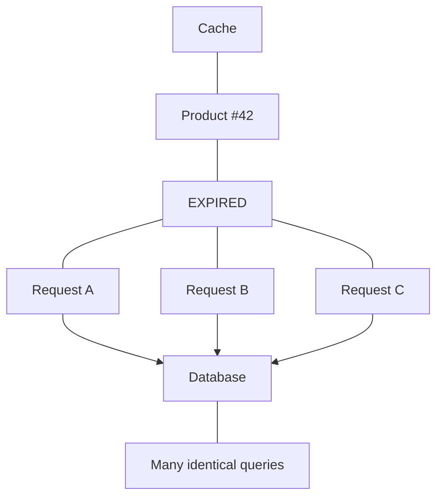

Instead of one request doing the expensive work, many requests do it at the same time.

The result can be:

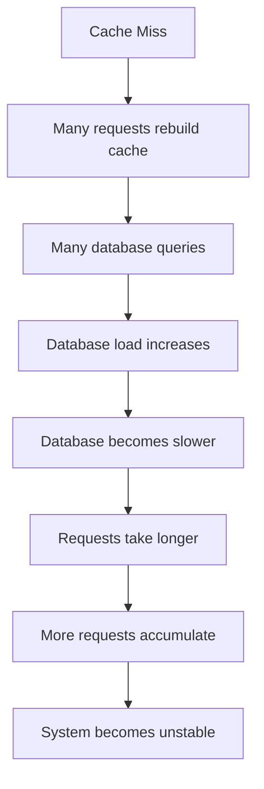

This is why a cache stampede can turn a seemingly small cache problem into a system-wide performance problem.

---

# 2. A Normal Cache Miss vs a Cache Stampede

A cache miss is not automatically a problem.

### Normal cache miss

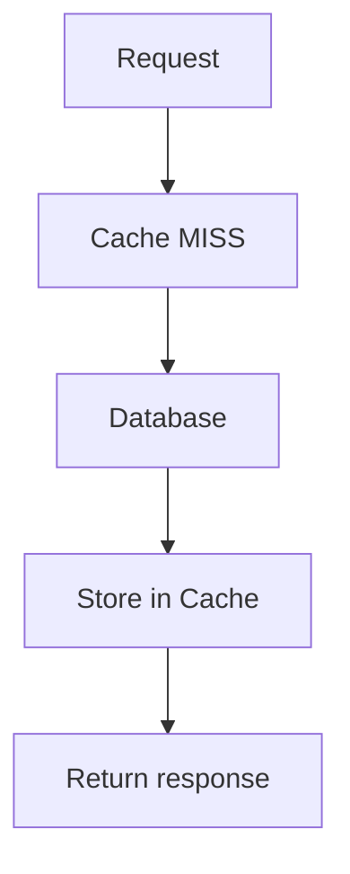

One request performs the expensive work.

### Cache stampede

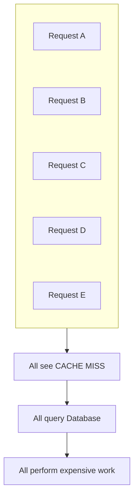

The important difference is **concurrency**.

> A cache miss becomes dangerous when many requests independently perform the same expensive regeneration work at the same time.

---

# 3. Why Does a Cache Stampede Happen?

Several conditions can create a stampede.

Common causes include:

1. Many requests access the same key
2. The key expires
3. The key is explicitly invalidated
4. The cache is restarted or lost
5. A popular item is evicted
6. Cache infrastructure temporarily fails
7. Many keys expire at approximately the same time
8. Cache warming fails
9. A newly deployed application starts with an empty cache

The common pattern is:

```text
Many consumers
      +
Same cached resource
      +
Cache unavailable
      +
Expensive regeneration
      =
Stampede risk
```

---

# 4. The Classic TTL Stampede

TTL is useful because it prevents cached data from living forever.

But TTL creates an important event:

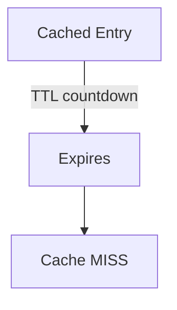

Suppose a popular product page has:

```text
Key: product:42
TTL: 60 seconds
```

At `12:00:00`:

```text
product:42 → cached
```

At `12:01:00`:

```text
product:42 → expired
```

Now 5,000 users request that product at approximately the same time.

If every request sees a miss:

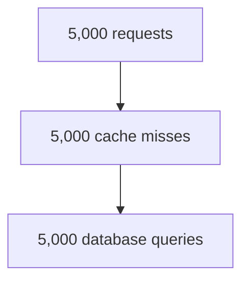

The cache was supposed to **protect the database**.

Instead, expiration caused a sudden database workload spike.

---

# 5. The Timeline of a Stampede

Consider a cache entry that expires at `10:00:00`.

```text
09:59:59.900
    |
    | Cache HIT
    |
10:00:00.000
    |
    | Entry expires
    |
10:00:00.010
    |
    +---- Request A → MISS → DB
    +---- Request B → MISS → DB
    +---- Request C → MISS → DB
    +---- Request D → MISS → DB
    +---- Request E → MISS → DB
    |
    v
Database receives repeated work
    |
    v
Cache gets rebuilt
```

The critical window is the period between:

```text
cache becomes unavailable
```

and

```text
new cached value becomes available
```

If many requests arrive during that window, they may all perform the expensive work.

---

# 6. Hot Keys

A **hot key** is a cache key accessed much more frequently than other keys.

For example:

```text
product:1001 → 500,000 requests
product:1002 → 1,000 requests
product:1003 → 800 requests
```

`product:1001` is a hot key.

Hot keys are particularly dangerous because:

```text
High request frequency
        +
Cache expiration
        ↓
Large number of simultaneous misses
```

A stampede does not require millions of users.

Even a single very popular resource can create significant pressure.

Examples of potentially hot data:

* Homepage
* Trending product
* Popular news article
* Current sports score
* Popular configuration
* Frequently requested API response
* Feature configuration
* Public profile
* Popular search result

---

# 7. Cache Stampede and the Thundering Herd

You may also hear the term **thundering herd**.

The basic idea is similar:

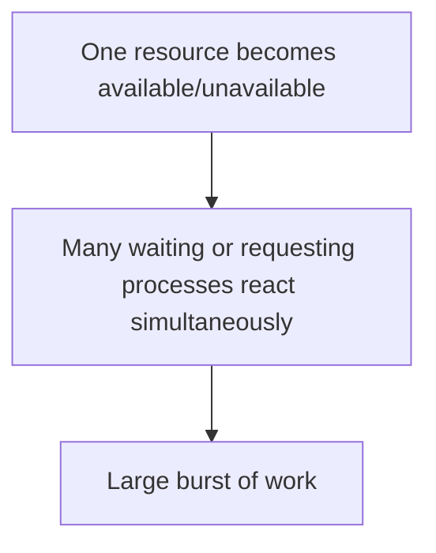

In caching, a cache stampede is specifically associated with many requests trying to regenerate missing or expired cached data.

The terms are related, but they are not always exact synonyms.

A useful mental model is:

```text
Cache Stampede
    =
Many requests regenerate the same cached data simultaneously
```

---

# 8. Why Is It Dangerous?

The obvious problem is increased database traffic.

But the effects can spread.

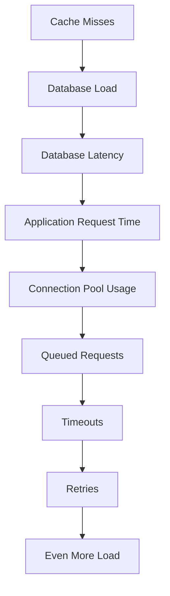

This can create a feedback loop.

### Example

Suppose:

```text
Normal DB traffic:     2,000 queries/sec
Stampede traffic:     20,000 queries/sec
```

The database may not be able to process the additional workload.

Now requests become slower.

Some clients or services may retry.

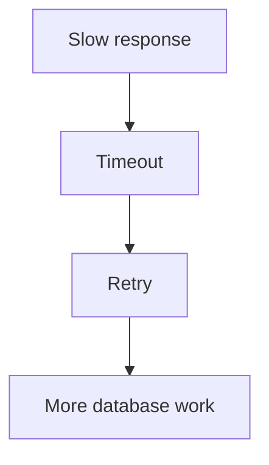

This connects cache stampedes to topics already covered:

* Timeouts
* Retries
* Connection limits
* Retry storms
* Database performance
* Queueing

A cache stampede can therefore become part of a larger failure chain.

---

# 9. The Core Problem: Duplicate Work

The fundamental inefficiency is this:

```text
Request A ──→ calculate X
Request B ──→ calculate X
Request C ──→ calculate X
Request D ──→ calculate X
```

But the system only needs:

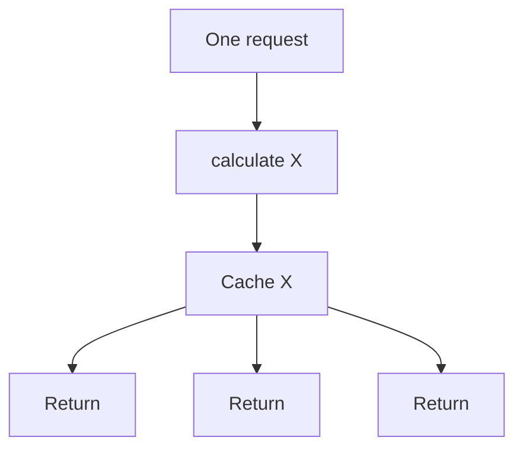

This leads to the central question:

> **When many requests need the same missing value, can one request perform the expensive work while the others wait for or reuse that result?**

This is the core idea behind several stampede-protection techniques.

---

# 10. Request Coalescing

**Request coalescing** means combining multiple requests for the same missing resource so that only one regeneration operation happens.

Without coalescing:

```text
A → MISS → DB
B → MISS → DB
C → MISS → DB
D → MISS → DB
```

With coalescing:

```text
A → MISS → DB
B → MISS ─┐
C → MISS ─┼→ Wait for A
D → MISS ─┘
             ↓
          Cache filled
             ↓
        A, B, C, D
        receive result
```

The key idea is:

> **One producer, many consumers.**

The exact implementation depends on the application architecture.

---

# 11. Locking

Another common approach is to use a lock.

Suppose the key is:

```text
product:42
```

The first request obtains a lock:

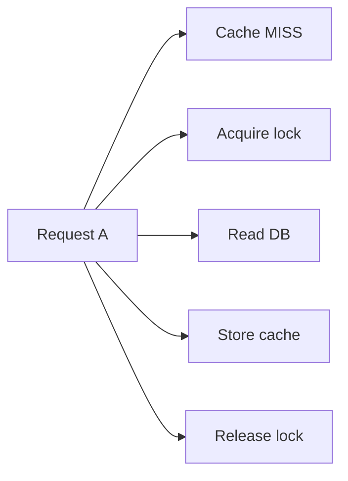

Other requests see the lock:

```text
Request B → MISS → Lock exists → Wait
Request C → MISS → Lock exists → Wait
Request D → MISS → Lock exists → Wait
```

After the cache is populated:

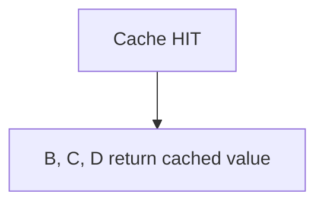

Conceptually:

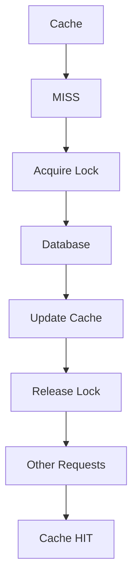

---

# 12. Locks Introduce Their Own Problems

A lock is not free.

Consider:

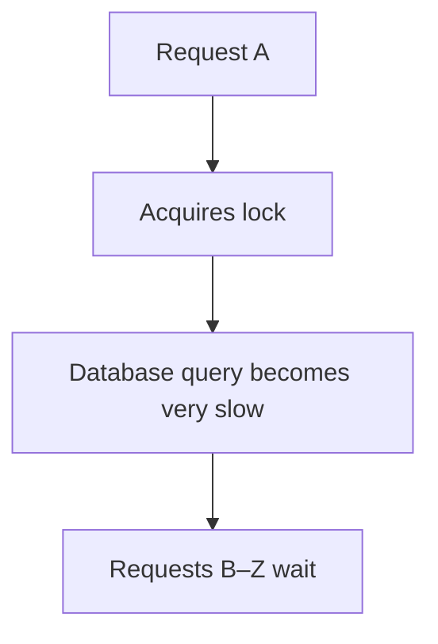

Now the cache stampede may have been prevented, but many requests are blocked.

Other problems include:

* Lock acquisition failure
* Lock timeout
* Lock holder crashes
* Stale locks
* Lock contention
* Incorrect lock ownership
* Distributed locking complexity

A lock should therefore be treated as a system design mechanism, not simply as a magic solution.

---

# 13. Double-Check After Acquiring the Lock

There is an important race condition.

Consider:

```text
A → MISS
B → MISS

A acquires lock
B waits

A rebuilds cache
A releases lock

B gets lock
```

If B immediately queries the database again without checking the cache, it may perform unnecessary work.

A safer pattern is:

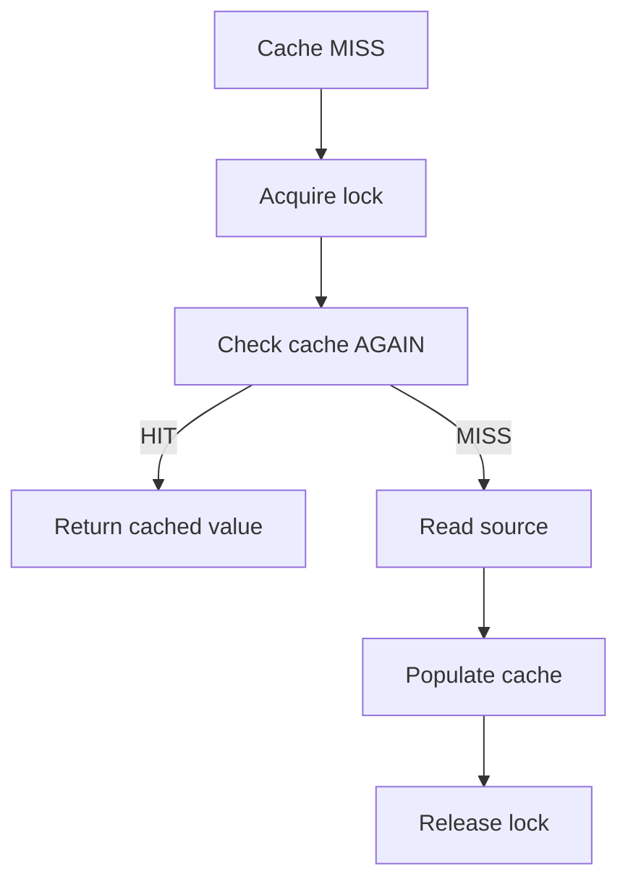

Why check twice?

Because another request may have populated the cache while this request was waiting for the lock.

This is commonly called **double-checked caching** or **double-checked locking** in relevant implementations.

---

# 14. Stale-While-Revalidate

Another strategy is:

> **Serve slightly stale data while refreshing the cache in the background.**

Instead of:

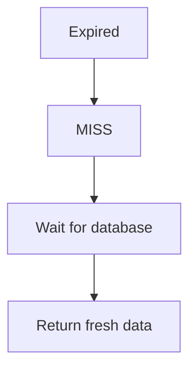

the system can do:

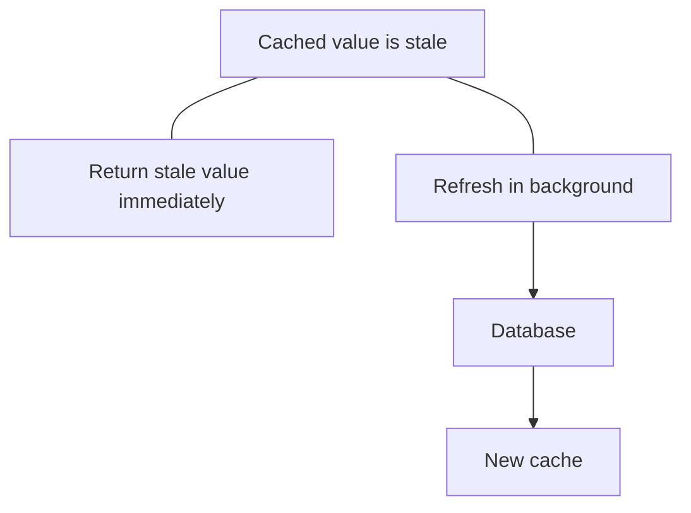

Example:

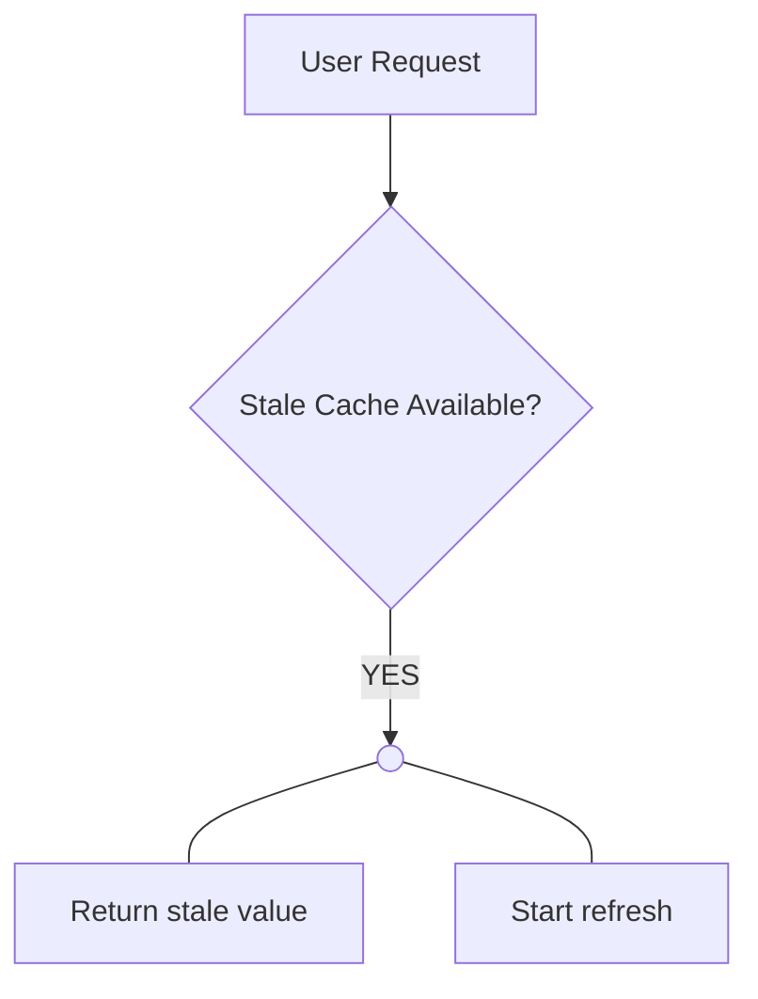

This can keep user-facing latency low.

But it introduces a deliberate period where users may receive stale data.

Therefore:

> Stale-while-revalidate is useful only when the application can tolerate some staleness.

---

# 15. Hard Expiration vs Soft Expiration

It is useful to distinguish two ideas.

### Hard expiration

After TTL:

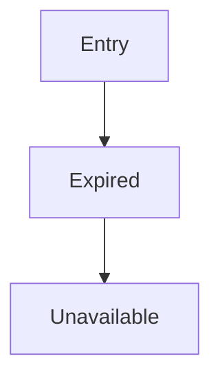

The next request must regenerate it.

### Soft expiration

The cached value may be considered stale, but still usable for a limited period.

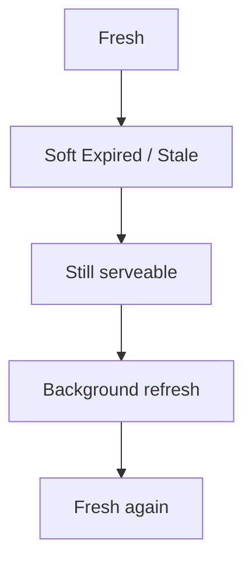

This can reduce the number of requests forced into synchronous regeneration.

---

# 16. TTL Jitter

Suppose an application stores 100,000 cache entries.

If all are created at approximately the same time with:

```text
TTL = 60 seconds
```

many may expire together.

That creates synchronized expiration:

```mermaid
flowchart TD
  accTitle: Same TTL, same moment
  accDescr: 60 seconds, then Many entries expire, then Many cache misses, then Large regeneration spike.
  N0["60 seconds"] --> N1["Many entries expire"] --> N2["Many cache misses"] --> N3["Large regeneration spike"]
```

**TTL jitter** adds a small random variation to expiration time.

Instead of:

```text
TTL = 60 seconds
TTL = 60 seconds
TTL = 60 seconds
TTL = 60 seconds
```

the system may use values such as:

```text
TTL = 57 seconds
TTL = 61 seconds
TTL = 64 seconds
TTL = 59 seconds
```

Now expiration is spread over time.

```text
Without jitter:

|████████████████|
                 ↑
          expiration spike


With jitter:

|██|████|███|████|██|
```

TTL jitter does not solve a hot-key stampede by itself.

It mainly helps prevent **large groups of keys from expiring simultaneously**.

---

# 17. Early Refresh

Instead of waiting until a cache entry expires, the application can refresh it before expiration.

For example:

```text
TTL = 60 seconds

At 0s  → Fresh
At 30s → Fresh
At 50s → Begin refresh
At 60s → New value already available
```

This reduces the chance that requests encounter an empty cache.

Conceptually:

```text
Cache Age
0s ─────────────── 45s ─────── 60s
                    |
                    v
               Refresh early
                    |
                    v
                New value
```

Early refresh is particularly useful for frequently accessed data where the cost of regeneration is high.

---

# 18. Probabilistic Early Refresh

A more advanced approach is to refresh entries probabilistically as they approach expiration.

Instead of:

```text
At exactly 60 seconds → everyone tries to refresh
```

requests approaching expiration may have increasing probability of triggering a refresh.

Conceptually:

```text
Entry age

0s        30s        45s        55s        60s
 |---------|----------|----------|----------|
 low refresh chance             high chance
```

This spreads refresh work across time.

The exact algorithm depends on the caching system and workload.

The system-design principle is more important than memorizing an implementation:

> **Avoid synchronizing expensive refresh work around one exact expiration moment.**

---

# 19. Cache Warming

Another technique is **cache warming**.

Instead of waiting for users to create cache entries, the system proactively populates important entries.

For example:

```mermaid
flowchart TD
  accTitle: Cache warming
  accDescr: Deployment, then Identify important resources, then Preload cache, then Application receives traffic.
  N0["Deployment"] --> N1["Identify important resources"] --> N2["Preload cache"] --> N3["Application receives traffic"]
```

This can be useful for:

* Popular products
* Homepage data
* Configuration
* Frequently requested API responses
* Known high-traffic resources

But cache warming has a cost.

If you warm everything:

```mermaid
flowchart TD
  accTitle: Warming too much
  accDescr: Too much data, then More cache memory, then More startup work, then More database load.
  N0["Too much data"] --> N1["More cache memory"] --> N2["More startup work"] --> N3["More database load"]
```

So warming should usually target data where the benefit justifies the cost.

---

# 20. Negative Caching

Cache stampedes are not limited to successful results.

Suppose a user requests:

```text
/product/999999
```

and the product does not exist.

Without negative caching:

```mermaid
flowchart TD
  accTitle: A request for missing data
  accDescr: Request, then Cache MISS, then Database, then Not Found.
  N0["Request"] --> N1["Cache MISS"] --> N2["Database"] --> N3["Not Found"]
```

If thousands of requests repeatedly ask for the same nonexistent object:

```text
Request A → DB → NOT FOUND
Request B → DB → NOT FOUND
Request C → DB → NOT FOUND
Request D → DB → NOT FOUND
```

The database repeatedly performs work for the same answer.

A system may temporarily cache the negative result:

```text
product:999999 → NOT_FOUND
```

with an appropriate TTL.

Then:

```mermaid
flowchart TD
  accTitle: Negative caching
  accDescr: Request, then Cache HIT, then NOT_FOUND.
  N0["Request"] --> N1["Cache HIT"] --> N2["NOT_FOUND"]
```

Negative caching must be designed carefully because a resource that does not exist now might be created later.

---

# 21. Cache Stampede vs Cache Penetration

These concepts can be confused.

### Cache stampede

A cached item becomes unavailable and many requests simultaneously regenerate it.

```mermaid
flowchart TD
  accTitle: Cache stampede
  accDescr: Existing popular key, then Cache unavailable, then Many requests, then Repeated regeneration.
  N0["Existing popular key"] --> N1["Cache unavailable"] --> N2["Many requests"] --> N3["Repeated regeneration"]
```

### Cache penetration

Requests repeatedly ask for data that does not exist in the source.

```mermaid
flowchart TD
  accTitle: Cache penetration
  accDescr: Request for nonexistent data, then Cache MISS, then Database, then NOT FOUND.
  N0["Request for nonexistent data"] --> N1["Cache MISS"] --> N2["Database"] --> N3["NOT FOUND"]
```

If the nonexistent result is not cached, the database may receive the same unnecessary query repeatedly.

Negative caching can help with this case.

---

# 22. Cache Stampede vs Cache Avalanche

Another related term is **cache avalanche**.

A cache avalanche generally refers to a large-scale surge in backend traffic caused by many cached entries becoming unavailable around the same time.

For example:

```mermaid
flowchart TD
  accTitle: Cache avalanche
  accDescr: Thousands of cache entries, then Expire together, then Thousands of misses, then Backend traffic spikes.
  N0["Thousands of cache entries"] --> N1["Expire together"] --> N2["Thousands of misses"] --> N3["Backend traffic spikes"]
```

A simplified distinction:

| Situation         | Main idea                                                           |
| ----------------- | ------------------------------------------------------------------- |
| Cache miss        | One requested item is not cached                                    |
| Cache stampede    | Many requests regenerate the same missing item                      |
| Cache penetration | Repeated requests target data that does not exist                   |
| Cache avalanche   | Many cached items become unavailable, causing a large backend surge |

Terminology can vary between systems and authors, so focus on the underlying failure mechanism.

---

# 23. The Importance of the Refresh Window

Consider:

```text
Cache expires at 12:00:00
```

Now imagine database regeneration takes:

```text
500 ms
```

If 10,000 requests arrive during those 500 ms:

```mermaid
flowchart TD
  accTitle: During the refresh window
  accDescr: 10,000 requests, then 10,000 misses, then Potentially 10,000 DB operations.
  N0["10,000 requests"] --> N1["10,000 misses"] --> N2["Potentially 10,000 DB operations"]
```

The shorter the cache regeneration process, the smaller the vulnerable window.

This gives us another optimization:

> **Reducing regeneration cost reduces the duration and impact of a cache stampede.**

For example:

```mermaid
flowchart TD
  accTitle: A long refresh window
  accDescr: Slow query, then 500 ms regeneration.
  N0["Slow query"] --> N1["500 ms regeneration"]
```

might become:

```mermaid
flowchart TD
  accTitle: A short refresh window
  accDescr: Optimized query, then 50 ms regeneration.
  N0["Optimized query"] --> N1["50 ms regeneration"]
```

Cache protection and underlying performance optimization therefore complement each other.

---

# 24. Cache Stampede Protection Is Not One Technique

A production system may combine several strategies.

For example:

```mermaid
flowchart TD
  accTitle: Combining protections
  accDescr: A request checks the cache. Fresh: return. Stale: serve stale, and refresh from the database in the background.
  R["Request"] --> C["Cache"]
  C -->|"Fresh"| F["Return"]
  C -->|"Stale"| S["Serve stale"] --> B["Background refresh"] --> D["DB"]
```

Alongside:

```text
TTL jitter
     +
Request coalescing
     +
Early refresh
     +
Appropriate TTL
     +
Database protection
```

The correct combination depends on the workload.

---

# 25. Protecting the Database

Cache stampede protection should not only protect the cache.

It should also protect the underlying system.

Consider a database that can safely process:

```text
5,000 expensive queries/sec
```

If a cache failure causes:

```text
30,000 queries/sec
```

the database becomes the new bottleneck.

Therefore, the system may need additional controls:

* Query limits
* Connection pool limits
* Rate limiting
* Request coalescing
* Backpressure
* Timeouts
* Circuit breakers
* Load shedding
* Read replicas
* Precomputed data

The cache is one layer of protection, not the entire protection strategy.

---

# 26. What Happens When the Cache Itself Fails?

A cache stampede can also happen after a cache outage.

Suppose:

```mermaid
flowchart TD
  accTitle: Normal
  accDescr: Normal: application, then cache, then database.
  subgraph G["Normal:"]
    direction TB
    N0["Application"] --> N1["Cache"] --> N2["Database"]
  end
```

The cache goes down:

```mermaid
flowchart TD
  accTitle: The cache is unavailable
  accDescr: Application, then Cache unavailable, then Database.
  N0["Application"] --> N1["Cache unavailable"] --> N2["Database"]
```

If the application immediately sends every request to the database:

```mermaid
flowchart TD
  accTitle: All traffic reaches the database
  accDescr: 10,000 requests/sec, then 10,000 DB requests/sec.
  N0["10,000 requests/sec"] --> N1["10,000 DB requests/sec"]
```

The database may suddenly receive traffic it was never designed to handle.

This is why a cache should not automatically be treated as a harmless optional component.

Its failure behavior must be designed.

---

# 27. Fail-Open vs Fail-Closed

When a cache fails, an application has to decide what to do.

### Fail open

Continue to the underlying source.

```mermaid
flowchart TD
  accTitle: Fail open
  accDescr: Cache failure, then Database, then Return result.
  N0["Cache failure"] --> N1["Database"] --> N2["Return result"]
```

This preserves functionality but can overload the source.

### Fail closed

Do not allow the request to continue normally.

```mermaid
flowchart TD
  accTitle: Fail closed
  accDescr: Cache failure, then Reject / degrade request.
  N0["Cache failure"] --> N1["Reject / degrade request"]
```

This protects the source but reduces availability or functionality.

There is no universal answer.

The decision depends on:

* Importance of the data
* Database capacity
* Request volume
* Availability requirements
* Whether stale data is acceptable
* Whether a degraded response is possible

---

# 28. Serving Stale Data as a Safety Mechanism

Sometimes stale data is safer than no data.

For example:

```text
Cache has old product catalog
Database is overloaded
```

Instead of forcing every request to the database:

```text
Serve slightly stale catalog
```

This can reduce load while preserving some functionality.

But it is appropriate only when the business requirement allows it.

For security-sensitive or correctness-sensitive data, stale data may be unacceptable.

Examples where stale data may be more tolerable:

* Public content
* Product descriptions
* News lists
* Recommendations
* Static configuration

Examples where stale data may be dangerous:

* Account balance
* Authorization state
* Payment status
* Inventory availability at checkout

The acceptable staleness window is a **business and system requirement**, not merely a cache setting.

---

# 29. Distributed Systems Make This Harder

Consider three application instances:

```mermaid
flowchart TD
  accTitle: Many instances, one cache
  accDescr: The load balancer spreads requests over App A, App B and App C, which share one cache in front of the database.
  L["Load Balancer"] --- A["App A"] & B["App B"] & C["App C"]
  A & B & C --- K["Cache"] --- D["DB"]
```

Suppose all three applications see:

```text
product:42 → MISS
```

If they independently regenerate:

```text
App A → DB
App B → DB
App C → DB
```

The same work is duplicated.

A distributed cache can help share the cached result, but coordination still matters.

Possible mechanisms include:

* Distributed locks
* Shared cache state
* Request coalescing
* Background refresh
* Refresh ownership
* Versioning

Distributed coordination introduces its own failure modes.

---

# 30. Local Cache Makes the Problem Different

Suppose each application instance has its own local memory cache:

```text
App A → Local Cache A
App B → Local Cache B
App C → Local Cache C
```

A key may expire independently on each instance.

That means:

```text
Cache A → MISS
Cache B → MISS
Cache C → MISS
```

all at approximately the same time.

If traffic is distributed across instances, the database may receive repeated regeneration work.

This is one reason shared caching and coordinated refresh can become important at scale.

---

# 31. Lock Scope Matters

A poorly designed lock can block unrelated requests.

Bad design:

```text
Lock: "all products"
```

Then:

```text
product:1
product:2
product:3
product:4
```

may all compete for the same lock.

A more precise design may use:

```text
lock:product:1
lock:product:2
lock:product:3
```

Now only requests rebuilding the same resource compete.

This illustrates a broader system-design principle:

> **Coordination should be as narrow as correctness allows.**

Too broad:

```mermaid
flowchart TD
  accTitle: A coarse lock
  accDescr: High contention, then Poor concurrency.
  N0["High contention"] --> N1["Poor concurrency"]
```

Too narrow:

```mermaid
flowchart TD
  accTitle: Fine-grained locks
  accDescr: More coordination objects, then More management complexity.
  N0["More coordination objects"] --> N1["More management complexity"]
```

---

# 32. What If the Regeneration Work Is Expensive?

Suppose a cache value requires:

```text
Database query
    +
Multiple joins
    +
Aggregation
    +
External API
    +
Serialization
```

Regeneration may be expensive.

A stampede can therefore multiply a large amount of work.

For example:

```mermaid
flowchart TD
  accTitle: Expensive regeneration
  accDescr: Normal: 1 request, 1 expensive calculation. Stampede: 1,000 requests, 1,000 expensive calculations.
  subgraph N["Normal:"]
    direction TB
    A0["1 request"] --> A1["1 expensive calculation"]
  end
  subgraph S["Stampede:"]
    direction TB
    B0["1,000 requests"] --> B1["1,000 expensive calculations"]
  end
  N ~~~ S
```

In such cases, request coalescing or background refresh can have a large impact.

---

# 33. Cache Stampede and External APIs

The underlying source does not have to be a database.

It could be:

```mermaid
flowchart TD
  accTitle: A cache in front of a payment service
  accDescr: Cache, then Payment service.
  N0["Cache"] --> N1["Payment service"]
```

or:

```mermaid
flowchart TD
  accTitle: A cache in front of a search service
  accDescr: Cache, then Search service.
  N0["Cache"] --> N1["Search service"]
```

or:

```mermaid
flowchart TD
  accTitle: A cache in front of a third-party API
  accDescr: Cache, then Third-party API.
  N0["Cache"] --> N1["Third-party API"]
```

If the cache disappears and thousands of requests hit the external dependency:

```mermaid
flowchart BT
  accTitle: A stampede on an external API
  accDescr: Thousands of requests hit the third-party API.
  T["Thousands of requests"] --> A["Third-party API"]
```

you may encounter:

* API rate limits
* Increased latency
* Higher costs
* Dependency failures
* Retry storms

Therefore, cache stampede protection should consider **all underlying dependencies**, not just databases.

---

# 34. Choosing a Protection Strategy

A useful decision flow is:

```mermaid
flowchart TD
  accTitle: Choosing a protection strategy
  accDescr: Is the data expensive to regenerate? Yes: is some staleness acceptable? Yes: serve stale, with a background refresh. No: coordinate, with locking, request coalescing or controlled refresh.
  Q1{"Is the data expensive<br/>to regenerate?"} -->|"YES"| Q2{"Is some staleness<br/>acceptable?"}
  Q2 -->|"YES"| S["Serve stale?"] --> B["Background<br/>refresh"]
  Q2 -->|"NO"| C["Coordinate"] --> G
  subgraph G[" "]
    direction TB
    L["Locking"] ~~~ R["Request coalescing"] ~~~ K["Controlled refresh"]
  end
```

Then ask:

```mermaid
flowchart TD
  accTitle: A hot key
  accDescr: Is the key extremely hot? Yes: consider request coalescing, single-flight/locking, early refresh and stale-while-revalidate.
  Q{"Is the key<br/>extremely hot?"} -->|"YES"| G
  subgraph G["Consider:"]
    direction TB
    A["request coalescing"] ~~~ B["single-flight/locking"] ~~~ C["early refresh"] ~~~ D["stale-while-revalidate"]
  end
```

If many keys expire together:

```text
Consider TTL jitter
```

If important keys are predictable:

```text
Consider cache warming
```

---

# 35. A Practical Example: Product Catalog

Imagine an e-commerce system.

```mermaid
flowchart TD
  accTitle: The product catalog
  accDescr: User, then Load Balancer, then Application, then Redis, then PostgreSQL.
  N0["User"] --> N1["Load Balancer"] --> N2["Application"] --> N3["Redis"] --> N4["PostgreSQL"]
```

The application caches:

```text
product:42
```

with:

```text
TTL = 10 minutes
```

Product 42 becomes extremely popular.

At expiration:

```text
product:42 → MISS
```

10,000 users request it.

### Without protection

```mermaid
flowchart TD
  accTitle: Without protection
  accDescr: 10,000 requests, then 10,000 cache misses, then 10,000 PostgreSQL queries.
  N0["10,000 requests"] --> N1["10,000 cache misses"] --> N2["10,000 PostgreSQL queries"]
```

### With request coalescing

```mermaid
flowchart TD
  accTitle: With request coalescing
  accDescr: 10,000 requests, then 10,000 cache misses, then 1 request regenerates, then 9,999 requests wait/reuse, then Cache populated, then 10,000 responses.
  N0["10,000 requests"] --> N1["10,000 cache misses"] --> N2["1 request regenerates"] --> N3["9,999 requests wait/reuse"] --> N4["Cache populated"] --> N5["10,000 responses"]
```

### With stale-while-revalidate

```mermaid
flowchart TD
  accTitle: With stale-while-revalidate
  accDescr: 10,000 requests, then Stale value available, then Serve stale value, then One background refresh, then Cache updated.
  N0["10,000 requests"] --> N1["Stale value available"] --> N2["Serve stale value"] --> N3["One background refresh"] --> N4["Cache updated"]
```

The user experience and backend load can be very different even though the same cache exists.

---

# 36. Cache Stampede and Correctness

Performance is not the only concern.

Suppose:

```text
Request A → starts refresh
Request B → starts refresh
```

Both may calculate different versions of the data.

For example:

```text
A reads version 10
B reads version 11
```

If A finishes later:

```text
B writes version 11
A writes version 10
```

The cache may now contain older data.

This is an **ordering problem**.

Possible solutions include:

* Version numbers
* Timestamps where appropriate
* Compare-and-set mechanisms
* Coordinated refresh
* Conditional updates

The exact mechanism depends on the cache and application.

The important lesson:

> Preventing duplicate work is not enough; concurrent refreshes must also preserve correct state.

---

# 37. Refresh Ownership

Another design is to assign responsibility for refreshing a key.

Conceptually:

```mermaid
flowchart LR
  accTitle: Refresh ownership
  accDescr: A cache entry has normal readers and one refresh owner.
  C["Cache Entry"] --- R["Normal readers"]
  C --- O["One refresh owner"]
```

The owner performs:

```mermaid
flowchart TD
  accTitle: What the refresh owner does
  accDescr: Read source, then Build value, then Update cache.
  N0["Read source"] --> N1["Build value"] --> N2["Update cache"]
```

Other requests continue reading the existing value when possible.

This is particularly useful with background refresh systems.

The ownership mechanism must handle failure:

```mermaid
flowchart TD
  accTitle: When the owner fails
  accDescr: Refresh owner crashes, then Who takes over?.
  N0["Refresh owner crashes"] --> N1["Who takes over?"]
```

This is another distributed-systems problem.

---

# 38. Observability

You cannot manage cache stampedes effectively without measuring them.

Useful metrics include:

### Cache hit ratio

```text
hits / total requests
```

### Miss rate

```text
misses / total requests
```

### Regeneration count

How many times an entry was rebuilt.

### Regeneration duration

How long rebuilding takes.

### Concurrent regenerations

How many requests are rebuilding the same key.

### Hot-key frequency

Which keys receive unusually high traffic.

### Cache age

How old cached values are.

### Backend load during misses

For example:

```text
Cache miss rate ↑
DB QPS ↑
DB latency ↑
```

These relationships can reveal a stampede.

---

# 39. A Useful Investigation Pattern

If you suspect a cache stampede:

### Step 1 — Find the cache event

Ask:

```text
Did a key expire?
Was it invalidated?
Was the cache restarted?
Was data evicted?
```

### Step 2 — Find the affected keys

```text
Which keys had high traffic?
```

### Step 3 — Measure concurrency

```text
How many requests missed simultaneously?
```

### Step 4 — Measure regeneration

```text
How many DB/API calls were triggered?
```

### Step 5 — Check dependency load

```text
DB CPU
DB QPS
DB latency
Connection pool usage
External API rate
```

### Step 6 — Check secondary effects

```text
Timeouts?
Retries?
Queue growth?
Error rate?
```

### Step 7 — Choose protection

Possible options:

```text
Request coalescing
Locking
Stale-while-revalidate
Early refresh
TTL jitter
Cache warming
Negative caching
```

---

# 40. Hands-On Lab — Simulating a Cache Stampede

You can reproduce the concept using **PostgreSQL + Redis**.

## Step 1 — Create a table

```sql
CREATE TABLE products (
    id SERIAL PRIMARY KEY,
    name VARCHAR(100),
    price NUMERIC(10, 2)
);
```

Insert one popular product:

```sql
INSERT INTO products (name, price)
VALUES ('Popular Product', 999.00);
```

---

## Step 2 — Start With Cache-Aside

Use:

```mermaid
flowchart TD
  accTitle: Lab architecture
  accDescr: Application, then Redis, then PostgreSQL.
  N0["Application"] --> N1["Redis"] --> N2["PostgreSQL"]
```

The logic is:

```text
GET product:1

if cache hit:
    return cache

if cache miss:
    query PostgreSQL
    store result in Redis
    return result
```

---

## Step 3 — Add a Short TTL

For example:

```text
TTL = 5 seconds
```

Request the product once.

Observe:

```mermaid
flowchart TD
  accTitle: On a miss
  accDescr: MISS, then DB, then Redis.
  N0["MISS"] --> N1["DB"] --> N2["Redis"]
```

Request it again:

```mermaid
flowchart TD
  accTitle: On a hit
  accDescr: HIT, then Redis.
  N0["HIT"] --> N1["Redis"]
```

---

## Step 4 — Create Concurrent Requests

Before the entry expires, prepare multiple concurrent requests.

Then allow:

```text
product:1
```

to expire.

Immediately send many requests.

Observe whether you get:

```text
Request A → DB
Request B → DB
Request C → DB
Request D → DB
```

instead of:

```text
Request A → DB
Request B → wait
Request C → wait
Request D → wait
```

---

## Step 5 — Measure the Database

Track:

```text
Number of DB queries
Query duration
Concurrent connections
```

Compare:

```text
Normal cache miss
```

with:

```text
Concurrent cache miss
```

---

## Step 6 — Add Request Coalescing

Implement a mechanism where only one request regenerates:

```text
product:1
```

while others wait for the result.

Run the same test.

Compare:

```text
Before:

100 requests
→ 100 DB queries
```

with:

```text
After:

100 requests
→ 1 DB query
→ 100 responses
```

---

## Step 7 — Test Stale-While-Revalidate

Allow the application to retain a stale value temporarily.

When the value becomes stale:

```mermaid
flowchart TD
  accTitle: Stale-while-revalidate
  accDescr: Request, then Return stale value, then Background refresh.
  N0["Request"] --> N1["Return stale value"] --> N2["Background refresh"]
```

Measure:

```text
User latency
Database queries
Cache freshness
```

---

## Step 8 — Add TTL Jitter

Instead of:

```text
TTL = 60 seconds
```

use a randomized TTL around the target:

```text
55–65 seconds
```

Create many entries and observe expiration patterns.

Compare:

```text
Fixed TTL
```

against:

```text
Jittered TTL
```

The goal is to observe whether expiration becomes more distributed.

---

## Challenge

Create a test where:

```text
1,000 requests
```

arrive for the same expired cache key.

Compare three strategies:

### Strategy A

```text
Plain Cache-Aside
```

### Strategy B

```text
Cache-Aside + Lock
```

### Strategy C

```text
Stale-While-Revalidate
```

Record:

```text
DB queries
Average latency
p95 latency
Maximum concurrent DB requests
Cache freshness
```

Then answer:

> Which strategy reduces duplicate regeneration work?

And:

> What new trade-off does each strategy introduce?

---

# 41. Common Mistakes

## Mistake 1 — Assuming cache misses are always harmless

A single miss may be harmless.

Thousands of simultaneous misses can be very expensive.

---

## Mistake 2 — Using TTL without considering expiration patterns

A TTL controls lifetime.

It does not automatically prevent synchronized expiration.

---

## Mistake 3 — Treating locking as a complete solution

Locks introduce:

* Waiting
* Contention
* Failure handling
* Expiration problems
* Distributed coordination complexity

---

## Mistake 4 — Refreshing every request

This defeats the purpose of the cache.

The goal is:

```mermaid
flowchart TD
  accTitle: A cache miss can be harmless
  accDescr: Many requests, then Reusable result.
  N0["Many requests"] --> N1["Reusable result"]
```

not:

```mermaid
flowchart TD
  accTitle: A stampede
  accDescr: Many requests, then Many regenerations.
  N0["Many requests"] --> N1["Many regenerations"]
```

---

## Mistake 5 — Ignoring hot keys

Average cache traffic can look healthy while one key receives enormous traffic.

Always look for concentration.

---

## Mistake 6 — Forgetting the underlying dependency

The database is not always the source.

The dependency might be:

```text
External API
Search service
Another microservice
Object storage
```

---

## Mistake 7 — Ignoring stale data requirements

Serving stale data may be an excellent performance technique for one workload and unacceptable for another.

Freshness is a requirement.

---

## Mistake 8 — Ignoring retries

A stampede can trigger slow requests.

Slow requests can trigger retries.

Retries can multiply the load.

```mermaid
flowchart TD
  accTitle: Retries amplify a stampede
  accDescr: Stampede, then Slow backend, then Timeout, then Retry, then More load.
  N0["Stampede"] --> N1["Slow backend"] --> N2["Timeout"] --> N3["Retry"] --> N4["More load"]
```

---

# 42. Cache Stampede in the Larger System

Cache stampede is not isolated to the cache layer.

It interacts with many parts of the architecture:

```mermaid
flowchart TD
  accTitle: A stampede in the larger system
  accDescr: Users reach the load balancer and the application, which checks the cache. A hit returns directly; a miss goes to the database for the query or work, and both paths return.
  U["Users"] --> L["Load Balancer"] --> A["Application"] --> C["Cache"]
  C ---|"HIT"| J@{ shape: sm-circ }
  C -->|"MISS"| D["Database"] --> W["Query / Work"] --> J
```

When many requests take the MISS path:

```mermaid
flowchart TD
  accTitle: The feedback loop
  accDescr: Many Requests, then Cache MISS, then Database, then Saturation, then Slow Requests, then Timeouts, then Retries, then More Requests.
  N0["Many Requests"] --> N1["Cache MISS"] --> N2["Database"] --> N3["Saturation"] --> N4["Slow Requests"] --> N5["Timeouts"] --> N6["Retries"] --> N7["More Requests"]
```

This is why cache stampede is a **system behavior**, not merely a cache configuration problem.

---

# 43. Performance vs Freshness vs Complexity

Cache stampede protection usually trades among three things:

```text
Performance
Freshness
Complexity
```

For example:

### Serve stale data

```text
Performance: High
Freshness: Lower
Complexity: Moderate
```

### Lock regeneration

```text
Duplicate work: Low
Freshness: High
Coordination: Higher
```

### Early refresh

```text
Latency: Lower
Freshness: High
Background work: Higher
```

### TTL jitter

```text
Expiration spikes: Lower
Freshness: Similar
Implementation complexity: Low
```

These are not universal ratings; the actual outcome depends on workload and implementation.

The system designer must understand what trade-off is being made.

---

# 44. A Practical Decision Framework

When designing a cache for an important resource, ask:

### Question 1

How expensive is regeneration?

```text
Cheap → stampede impact may be small
Expensive → stronger protection may be justified
```

### Question 2

How popular is the key?

```text
Low traffic → less coordination may be needed
Hot key → stampede risk is higher
```

### Question 3

Can stale data be served?

```text
YES → stale-while-revalidate may help
NO  → coordinated refresh may be necessary
```

### Question 4

Can expiration happen in groups?

```text
YES → consider TTL jitter
```

### Question 5

Can the source survive a cache outage?

```text
YES → fail-open may be acceptable
NO  → stronger protection/degradation may be required
```

### Question 6

Is the system distributed?

```text
YES → consider coordination across instances
```

### Question 7

What happens when refresh fails?

Design this explicitly.

```mermaid
flowchart LR
  accTitle: When refresh fails
  accDescr: On refresh failure: keep the stale value? retry? back off? serve a degraded response? fail the request?
  F["Refresh failure"] --> A["Keep stale value?"]
  F --> B["Retry?"]
  F --> C["Back off?"]
  F --> D["Serve degraded response?"]
  F --> E["Fail request?"]
```

---

# 45. Key Principle

> **A cache stampede occurs when many requests simultaneously try to regenerate the same unavailable cached data, turning the cache miss into a burst of duplicate backend work.**

The goal is not simply to prevent cache misses.

The goal is to control **how regeneration happens when many requests need the same data at the same time**.

A strong mental model is:

```mermaid
flowchart TD
  accTitle: Key principle
  accDescr: Cache miss, then How many requests will regenerate?, then How expensive is regeneration?, then Can we reuse one regeneration?, then Can we serve stale data?, then Can we refresh before expiration?, then What happens if the cache or source fails?.
  N0["Cache miss"] --> N1["How many requests will regenerate?"] --> N2["How expensive is regeneration?"] --> N3["Can we reuse one regeneration?"] --> N4["Can we serve stale data?"] --> N5["Can we refresh before expiration?"] --> N6["What happens if the cache or source fails?"]
```

---

# Quick Reference

| Concept                | Meaning                                                               |
| ---------------------- | --------------------------------------------------------------------- |
| Cache miss             | Requested data is not available in cache                              |
| Cache stampede         | Many requests regenerate the same missing data simultaneously         |
| Hot key                | Cache key receiving unusually high traffic                            |
| Request coalescing     | Combine concurrent regeneration into one operation                    |
| Locking                | Allow one request to regenerate while others wait                     |
| Double-check           | Check cache again after acquiring a lock                              |
| Stale-while-revalidate | Serve stale data while refreshing in background                       |
| TTL jitter             | Add variation to TTL to spread expiration                             |
| Early refresh          | Refresh before expiration                                             |
| Cache warming          | Populate important entries proactively                                |
| Negative caching       | Temporarily cache “not found” results                                 |
| Cache avalanche        | Large backend surge caused by many cache entries becoming unavailable |
| Refresh window         | Time during which regeneration is required                            |

---

# Knowledge Check

### 1. Is every cache miss a cache stampede?

No.

A stampede requires many requests performing duplicate regeneration work around the same missing resource.

---

### 2. Why can TTL contribute to a stampede?

Because many requests may encounter the same entry immediately after it expires.

---

### 3. What is a hot key?

A cache key accessed much more frequently than other keys.

---

### 4. What does request coalescing try to achieve?

It tries to ensure that one regeneration operation serves many concurrent requests.

---

### 5. Why might stale-while-revalidate help?

It allows requests to receive an existing stale value while a fresh value is generated in the background.

---

### 6. What problem does TTL jitter address?

It reduces synchronized expiration of many cache entries.

---

### 7. Can locking introduce problems?

Yes.

Locks can introduce contention, waiting, failure handling, stale locks, and distributed coordination complexity.

---

### 8. Why should you monitor database load during cache misses?

Because cache misses can shift work from the cache to the underlying dependency and potentially overload it.

---

# Remember

```mermaid
flowchart TD
  accTitle: A cache usually protects the backend
  accDescr: Cache, then Usually protects the backend.
  N0["Cache"] --> N1["Usually protects the backend"]
```

But:

```mermaid
flowchart TD
  accTitle: But at the wrong moment
  accDescr: Cache expires, then Many requests miss, then Many requests regenerate, then Backend gets overloaded.
  N0["Cache expires"] --> N1["Many requests miss"] --> N2["Many requests regenerate"] --> N3["Backend gets overloaded"]
```

The solution is not necessarily “increase the TTL.”

Instead, ask:

```text
Can we coordinate regeneration?
Can we refresh early?
Can we serve stale data?
Can we spread expiration?
Can we protect the backend?
```

The deeper system-design lesson is:

> **Caching is not only about storing data. It is also about controlling when expensive work is allowed to happen.**

---

# Next Chapter

## 03.11 — Browser Cache

The next chapter moves one level closer to the user.

We will examine how browsers cache resources such as:

```text
HTML
CSS
JavaScript
Images
Fonts
API responses
```

and how browser caching can reduce:

* Network requests
* Latency
* Server load
* Bandwidth usage

We will also examine:

* Cache-Control
* `max-age`
* `Expires`
* Validators
* ETag
* Last-Modified
* Conditional requests
* Fresh vs stale browser cache
* Cache revalidation
* Cache invalidation through URLs
* Private vs shared caches
* Security and sensitive data
* How browser caching differs from CDN and application-level caching

The key question will be:

> **What work can the user's own browser avoid doing because it already has the resource?**
