# 03.11 — Browser Cache

## Learning Objectives

By the end of this chapter, you should understand:

* What browser caching is
* Why browsers cache resources
* What happens when a browser requests a cached resource
* Fresh vs stale cached responses
* `Cache-Control`
* `max-age`
* `Expires`
* ETag
* `Last-Modified`
* Conditional requests
* Cache revalidation
* Private vs shared caches
* How cache invalidation works in browsers
* Why static asset filenames often contain hashes
* Why browser caching improves performance
* When browser caching should and should not be used
* How browser caching differs from CDN, reverse-proxy, and application-level caching
* The security implications of browser caching

---

# 1. What Is Browser Cache?

A **browser cache** is storage maintained by a web browser for resources that it has downloaded before.

For example:

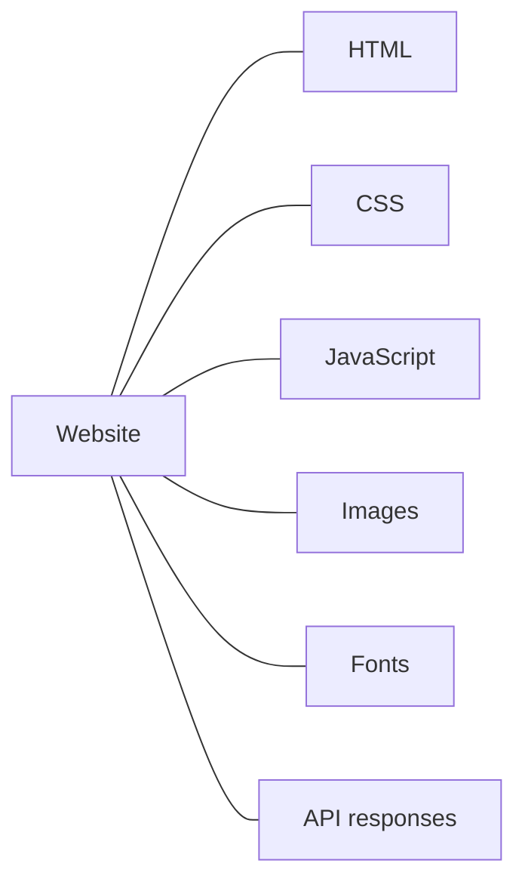

The browser may store some of these resources locally.

When the same resource is needed again, the browser may be able to use its local copy instead of downloading it again.

Without browser caching:

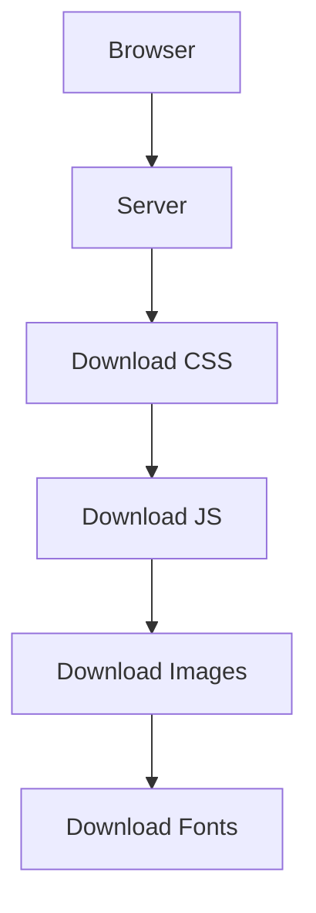

With browser caching:

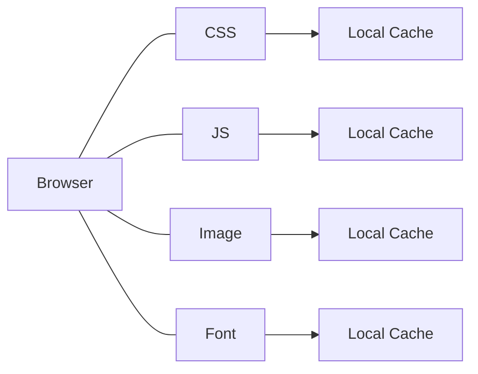

The browser can therefore avoid unnecessary network transfers.

---

# 2. Why Does Browser Caching Exist?

Every network request has a cost.

A request may involve:

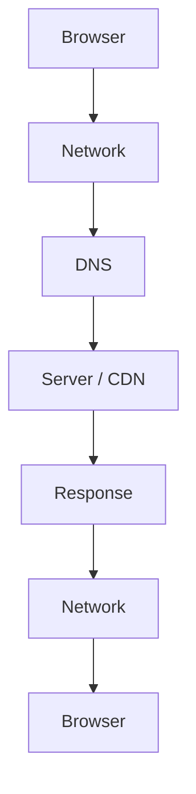

Even when the server responds quickly, the network still introduces latency.

If a browser already has a valid copy:

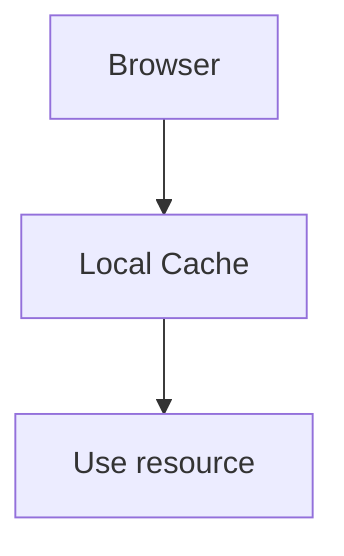

The network may not need to be involved at all.

This can reduce:

* Latency
* Network traffic
* Bandwidth consumption
* Server requests
* CDN requests
* Battery and device work in some situations

---

# 3. Browser Cache Is a Client-Side Cache

This is an important distinction.

In previous chapters we discussed:

```text
Application Cache
```

which primarily helps the application avoid repeated backend work.

Browser cache is different:

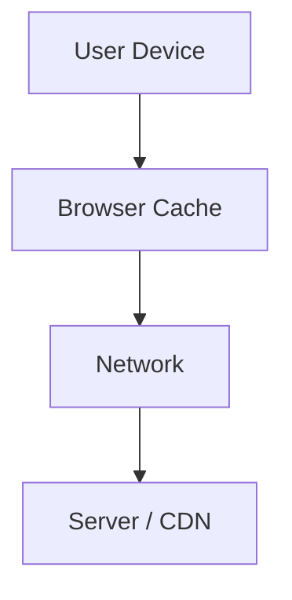

The browser cache exists **on the user's device**.

A simplified responsibility model is:

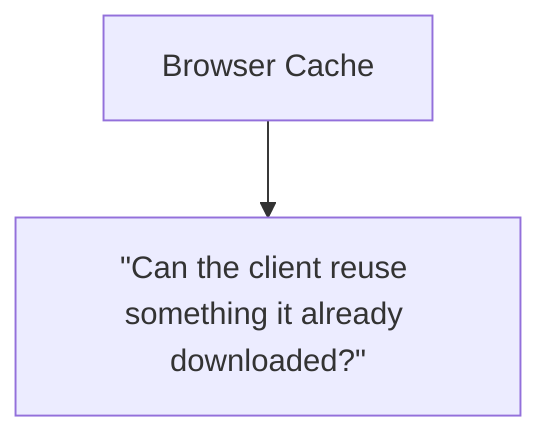

Compare this with:

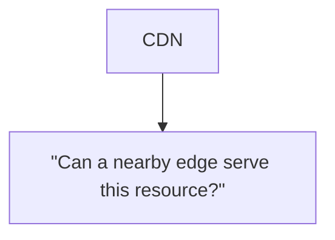

and:

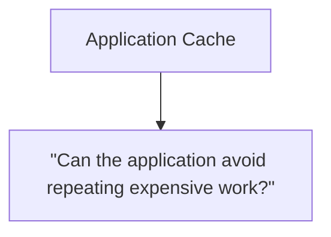

---

# 4. What Can a Browser Cache?

Browsers can cache many types of HTTP resources, depending on response headers and browser behavior.

Common examples include:

* HTML
* CSS
* JavaScript
* Images
* Fonts
* Videos
* API responses
* JSON
* Other HTTP resources

However, **not every response should be cached**.

For example:

```text
Public CSS
    → Often cacheable

Logo image
    → Often cacheable

Private account information
    → Requires careful caching policy
```

Cacheability is a property that must be deliberately considered.

---

# 5. The Basic Browser Cache Flow

Suppose the browser requests:

```text
/style.css
```

The first time:

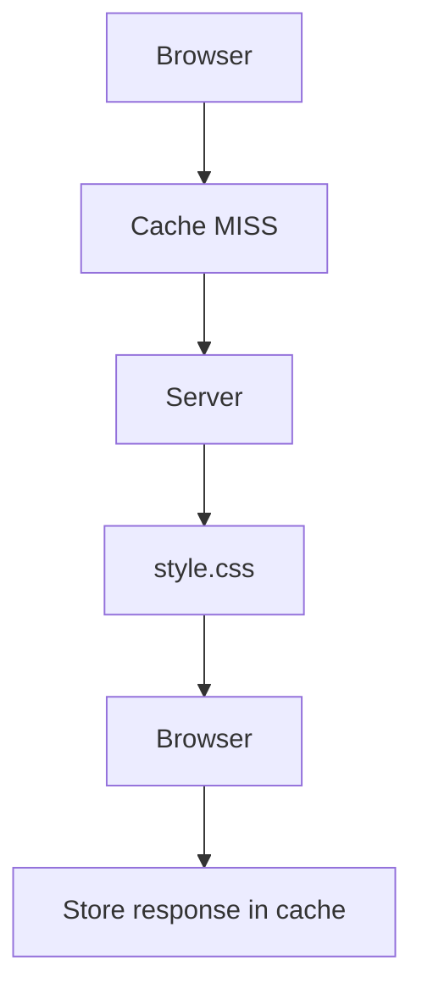

Later:

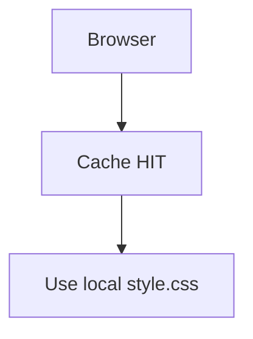

The second request may not need a network request at all.

This is one of the simplest ways caching improves web performance.

---

# 6. Fresh vs Stale

A cached response has a freshness policy.

Conceptually:

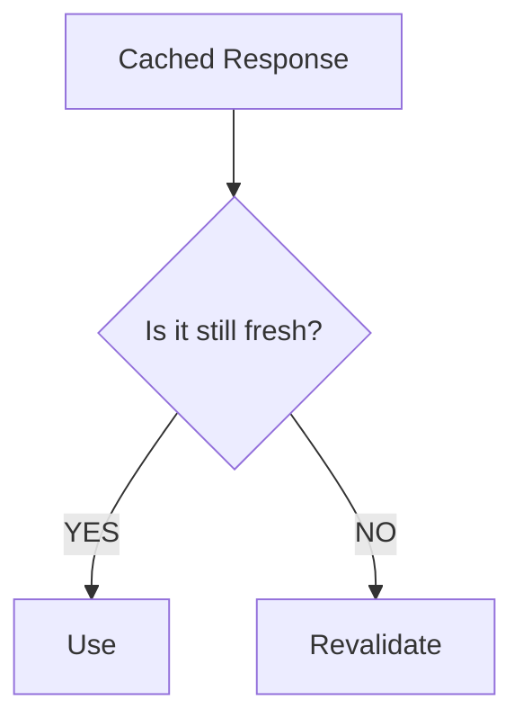

### Fresh

The browser can reuse the cached response according to its caching rules.

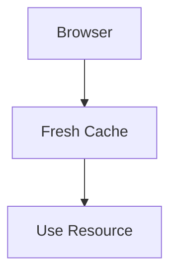

### Stale

The cached response has passed its freshness lifetime.

That does **not necessarily mean the browser immediately throws it away**.

It may need to check with the server whether the cached copy is still valid.

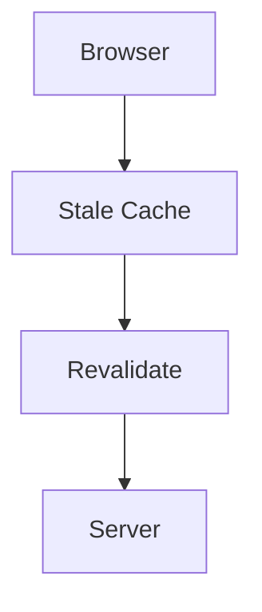

This distinction is important:

> **Stale does not simply mean deleted.**

---

# 7. Cache-Control

The HTTP `Cache-Control` response header is one of the primary mechanisms used to control caching behavior.

Example:

```http
Cache-Control: max-age=3600
```

This tells caches that the response can be considered fresh for the specified period.

Conceptually:

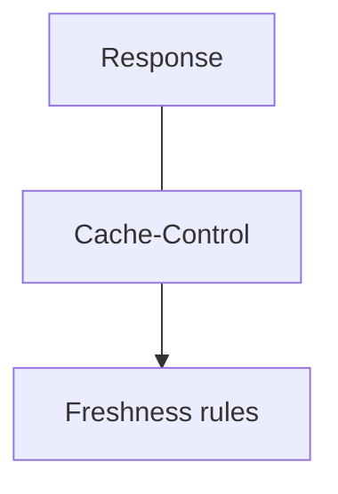

For one hour:

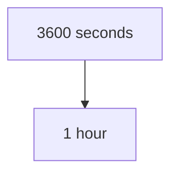

During the applicable freshness period, the browser may reuse the cached response without revalidating it.

---

# 8. `max-age`

A common directive is:

```http
Cache-Control: max-age=3600
```

`max-age` specifies a freshness lifetime in seconds.

Examples:

```text
max-age=60
    → 60 seconds

max-age=3600
    → 1 hour

max-age=86400
    → 1 day
```

The important idea is:

> `max-age` defines how long a cached response can generally be considered fresh under the applicable caching rules.

It is not a command saying:

```text
"Delete this file after 3600 seconds."
```

It is primarily about **freshness**, not physical storage lifetime.

---

# 9. Freshness vs Storage

This distinction is easy to miss.

Suppose:

```http
Cache-Control: max-age=3600
```

After one hour, the response becomes stale.

That does not necessarily mean:

```text
Browser deletes file
```

Instead:

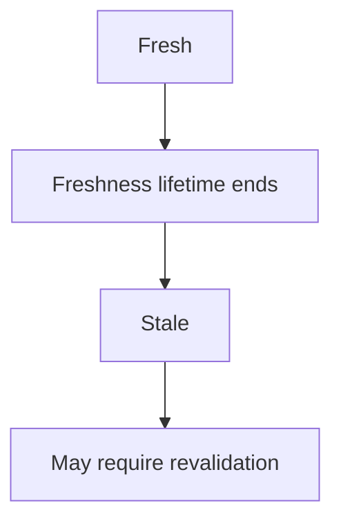

So:

```text
Freshness ≠ Physical existence
```

A stale response may still be present in the browser's cache.

---

# 10. `Expires`

Another HTTP mechanism is:

```http
Expires: Wed, 30 Sep 2026 16:00:00 GMT
```

It specifies an expiration time using an HTTP date.

Historically, `Expires` was widely used.

Modern applications commonly rely more heavily on `Cache-Control`, but `Expires` still exists for compatibility and legacy behavior.

A simplified mental model:

```text
Cache-Control
    → modern freshness control

Expires
    → older HTTP expiration mechanism
```

When both are present, modern cache-control directives generally take precedence where applicable.

---

# 11. Why Not Just Use a Long Cache Time?

Suppose:

```text
app.css
```

is cached for one year.

That's excellent for performance.

But now you change the CSS.

The browser may continue using its cached copy because it is still considered fresh.

You have a problem:

```text
Server:
app.css → Version 2

Browser:
app.css → Version 1
```

This creates a **cache invalidation problem**.

The browser is doing exactly what you told it to do.

So the system needs a way to safely release new versions.

---

# 12. Cache Busting With Versioned Filenames

A common solution is to change the resource URL when the content changes.

Instead of:

```text
app.css
```

you might use:

```text
app.a81f42.css
```

After a new build:

```text
app.39c7d1.css
```

Now the browser sees a completely different URL.

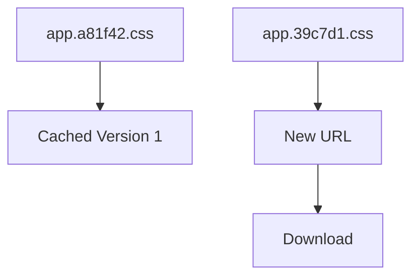

The old resource can remain cached without preventing the new resource from being downloaded.

This is commonly called **content hashing** or **fingerprinting**.

---

# 13. Why Content Hashes Work So Well

Imagine:

```text
app.css
```

contains a hash derived from its contents.

If the contents change:

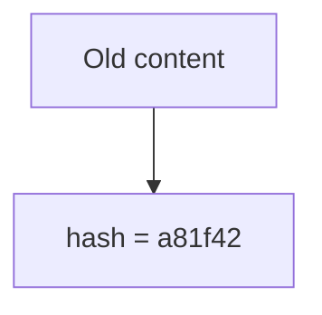

After modification:

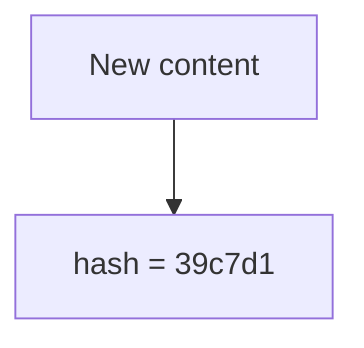

Therefore:

```text
app.a81f42.css
```

and:

```text
app.39c7d1.css
```

are different URLs.

The browser can safely cache each version for a long time.

This creates a useful deployment model:

```mermaid
flowchart TD
  accTitle: Immutable assets
  accDescr: Immutable Asset, then Long Browser Cache, then New Content, then New Filename, then New Cache Entry.
  N0["Immutable Asset"] --> N1["Long Browser Cache"] --> N2["New Content"] --> N3["New Filename"] --> N4["New Cache Entry"]
```

---

# 14. Immutable Static Assets

If a filename changes whenever the content changes, the resource can effectively be treated as immutable.

For example:

```text
app.a81f42.js
vendor.2f8d91.js
logo.71c3e8.svg
```

A deployment can use a long freshness period for these assets.

Conceptually:

```mermaid
flowchart TD
  accTitle: Hashed assets across deployments
  accDescr: Static hashed asset, then Long max-age, then Browser stores it, then New deployment, then New filename.
  N0["Static hashed asset"] --> N1["Long max-age"] --> N2["Browser stores it"] --> N3["New deployment"] --> N4["New filename"]
```

This is one of the most effective browser-caching strategies for modern web applications.

---

# 15. Revalidation

What happens when a cached response is stale?

The browser may perform a **conditional request**.

Instead of downloading the entire resource immediately:

```mermaid
flowchart TD
  accTitle: Revalidation
  accDescr: Browser, then "Is my cached copy still valid?", then Server.
  N0["Browser"] --> N1["#quot;Is my cached copy still valid?#quot;"] --> N2["Server"]
```

If the resource has not changed, the server can tell the browser to keep using its existing copy.

This can avoid transferring the full response again.

Two important validators are:

* ETag
* Last-Modified

---

# 16. ETag

An **ETag** is a validator associated with a particular representation of a resource.

Example:

```http
ETag: "abc123"
```

The browser stores the response and its ETag.

Later, when revalidation is required, the browser can send:

```http
If-None-Match: "abc123"
```

The server checks whether the representation still matches.

If it has not changed, the server can respond:

```http
304 Not Modified
```

Conceptually:

```mermaid
flowchart TD
  accTitle: Revalidating with an ETag
  accDescr: The browser keeps the cached response and its ETag. When it becomes stale, it sends GET /app.js with If-None-Match: "abc123". If unchanged, the server answers 304; if changed, a new response.
  B["Browser"] -->|"Cached response + ETag"| S["Resource becomes stale"] --> G["GET /app.js<br/>If-None-Match: #quot;abc123#quot;"] --> V["Server"]
  V -->|"unchanged"| N["304"]
  V -->|"changed"| R["New response"]
```

---

# 17. What Does 304 Not Modified Mean?

A `304 Not Modified` response tells the client that its cached representation can still be used.

The browser can then use the copy it already has.

Conceptually:

```text
Browser has:
app.js version A

Server says:
"Your version is still valid."

Browser:
"Use local version."
```

This is different from sending the entire JavaScript file again.

So revalidation can save bandwidth while still checking freshness.

---

# 18. Last-Modified

Another validator is:

```http
Last-Modified: Wed, 30 Sep 2026 14:00:00 GMT
```

The browser may later send:

```http
If-Modified-Since: Wed, 30 Sep 2026 14:00:00 GMT
```

The server can determine whether the resource has changed since that time.

If it has not changed:

```http
304 Not Modified
```

If it has changed:

```http
200 OK
```

with the new representation.

---

# 19. ETag vs Last-Modified

Both mechanisms help with conditional requests.

| Mechanism     | Identifies resource state using |
| ------------- | ------------------------------- |
| ETag          | Entity/representation validator |
| Last-Modified | Modification time               |

A system may use one or both.

The important system-design idea is:

```mermaid
flowchart TD
  accTitle: Fresh vs stale
  accDescr: A fresh cache is used directly. A stale cache is revalidated: 304 means reuse the existing copy; 200 means download a new copy.
  A["Fresh cache"] --> U["Use directly"]
  S["Stale cache"] --> R["Revalidate"]
  R -->|"304"| X["reuse existing copy"]
  R -->|"200"| Y["download new copy"]
```

---

# 20. Full Browser Cache Lifecycle

A simplified lifecycle looks like this:

```mermaid
flowchart TD
  accTitle: The full browser cache lifecycle
  accDescr: Is the resource cached? No: use the resource. Yes: is it fresh? Yes: use it. No: revalidate — 304 reuses the cache, 200 stores the new response — then use the resource.
  B["Browser Request"] --> Q1{"Is resource<br/>cached?"}
  Q1 -->|"YES"| Q2{"Is it fresh?"}
  Q2 -->|"NO"| R["Revalidate"]
  R -->|"304"| C["Reuse<br/>cache"]
  R -->|"200"| S["Store new<br/>response"]
  Q1 -->|"NO"| U["Use Resource"]
  Q2 -->|"YES"| U
  C --> U
  S --> U
```

This is the core mental model for browser caching.

---

# 21. Browser Cache vs CDN Cache

Both cache HTTP resources, but they have different responsibilities.

### Browser cache

```mermaid
flowchart TD
  accTitle: The browser cache is on the device
  accDescr: User Device, then Browser Cache.
  N0["User Device"] --> N1["Browser Cache"]
```

Responsibility:

> Avoid downloading something the user's browser already has.

### CDN

```mermaid
flowchart TD
  accTitle: A CDN is near the user
  accDescr: User, then CDN Edge, then Origin.
  N0["User"] --> N1["CDN Edge"] --> N2["Origin"]
```

Responsibility:

> Serve cacheable content from a location closer to the user and reduce origin traffic.

Together:

```mermaid
flowchart TD
  accTitle: Browser cache and CDN together
  accDescr: The browser hits its cache and uses the local resource, or misses and asks the CDN; the CDN hits, or misses and asks the origin; the response reaches the browser.
  B["Browser"] -->|"HIT"| L["local resource"]
  B -->|"MISS"| C["CDN"]
  C -->|"HIT"| B2["Browser"]
  C -->|"MISS"| O["Origin"] --> B2
```

A browser hit can prevent the request from reaching the CDN at all.

---

# 22. Browser Cache vs Reverse Proxy Cache

A reverse proxy cache sits on the server side.

```mermaid
flowchart TD
  accTitle: A reverse proxy sits near the application
  accDescr: Browser, then Internet, then Reverse Proxy, then Application.
  N0["Browser"] --> N1["Internet"] --> N2["Reverse Proxy"] --> N3["Application"]
```

Browser cache:

```text
Client-side
```

Reverse proxy cache:

```text
Server-side
```

Their responsibilities differ.

| Layer             | Main responsibility                                          |
| ----------------- | ------------------------------------------------------------ |
| Browser           | Reuse resources already downloaded by the client             |
| Reverse proxy     | Avoid sending repeated cacheable requests to the application |
| CDN               | Serve cacheable content closer to users                      |
| Application cache | Avoid repeated application/data work                         |

A single resource may pass through multiple caching layers.

---

# 23. Browser Cache vs Application Cache

Consider an API:

```text
GET /api/products/42
```

The browser may cache the HTTP response.

Separately, the backend application may cache the product data.

```mermaid
flowchart TD
  accTitle: Browser cache and application cache
  accDescr: User Browser, then Browser Cache, then CDN / Proxy, then Application, then Application Cache, then Database.
  N0["User Browser"] --> N1["Browser Cache"] --> N2["CDN / Proxy"] --> N3["Application"] --> N4["Application Cache"] --> N5["Database"]
```

These layers solve different problems.

### Browser cache

Prevents the request from traveling through the network when the local response is reusable.

### Application cache

Prevents the backend from repeating expensive work.

Therefore:

```mermaid
flowchart TD
  accTitle: What each cache avoids
  accDescr: The browser cache avoids network work; the application cache avoids backend work.
  A0["Browser Cache"] --> A1["Network work avoided"]
  B0["Application Cache"] --> B1["Backend work avoided"]
```

---

# 24. Private vs Shared Caches

Not all caches are allowed to safely share the same response between users.

Consider:

```text
User A
GET /account
```

The response might contain:

```text
Alice's account information
```

It would be dangerous for a shared cache to serve that response to User B.

This is why HTTP caching distinguishes between **private** and **shared** caching behavior.

### Private cache

Typically associated with a single user/client, such as a browser cache.

```mermaid
flowchart TD
  accTitle: A private cache
  accDescr: User A, then Private Cache.
  N0["User A"] --> N1["Private Cache"]
```

### Shared cache

Can serve responses to multiple users.

Examples include:

```text
CDN
Reverse Proxy
Shared HTTP Cache
```

For user-specific responses, cache directives must be designed carefully.

---

# 25. `private`

A response may use:

```http
Cache-Control: private
```

This indicates that the response is intended for a private cache and should not be stored by a shared cache under the applicable HTTP caching rules.

Example:

```text
/account/profile
```

might contain user-specific information.

Conceptually:

```mermaid
flowchart TD
  accTitle: A private response
  accDescr: Private Response, then Browser Cache, then User-specific.
  N0["Private Response"] --> N1["Browser Cache"] --> N2["User-specific"]
```

But:

```mermaid
flowchart TD
  accTitle: A shared cache
  accDescr: Shared CDN Cache, then Potentially serves many users.
  N0["Shared CDN Cache"] --> N1["Potentially serves many users"]
```

requires different safety considerations.

---

# 26. `public`

A response may also be explicitly marked:

```http
Cache-Control: public
```

This indicates that the response can be stored by shared caches when other requirements allow it.

This can be appropriate for genuinely public content.

For example:

```text
/logo.svg
/public.css
/public-image.jpg
```

But `public` does not mean:

```text
"Cache everything everywhere forever."
```

Other caching rules, freshness, authorization, and response semantics still matter.

---

# 27. Sensitive Data and Browser Caching

Browser caching creates a security consideration because cached data may remain on a user's device.

Potentially sensitive examples include:

* Account information
* Private documents
* Personal data
* Financial information
* Authentication-related responses

For sensitive responses, caching policy should be deliberately designed.

For example:

```http
Cache-Control: no-store
```

is used when a response should not be stored in caches under the applicable HTTP semantics.

This is different from simply saying:

```text
"Don't use the cached response."
```

`no-store` addresses storage.

Security requirements should determine the appropriate policy.

---

# 28. `no-cache` vs `no-store`

These directives are frequently confused.

### `no-store`

Conceptually:

```text
Do not store this response in a cache.
```

### `no-cache`

The name is misleading.

It does **not** simply mean:

```text
"Never cache this."
```

It indicates that a stored response must be revalidated before reuse under the applicable caching rules.

Conceptually:

```text
no-cache

Can store
   ↓
Must revalidate before reuse
```

Whereas:

```text
no-store

Do not store
```

This distinction is extremely important.

---

# 29. `must-revalidate`

Another directive is:

```http
Cache-Control: must-revalidate
```

It indicates that once a response is stale, the cache must follow the required revalidation behavior rather than simply using the stale response when the normal rules would otherwise permit such use.

The exact behavior depends on the complete cache-control policy and HTTP semantics.

The important idea is:

```mermaid
flowchart TD
  accTitle: must-revalidate
  accDescr: Fresh: use normally. Stale: revalidation required.
  A0["Fresh"] --> A1["Use normally"]
  B0["Stale"] --> B1["Revalidation required"]
```

---

# 30. Browser Cache and Cookies

Cookies are related to HTTP state but are not the same thing as the browser's general HTTP cache.

A cookie might contain:

```text
session_id=abc123
```

while the browser cache may contain:

```text
app.js
logo.svg
/api/products
```

They have different purposes.

```mermaid
flowchart TD
  accTitle: Cookies vs HTTP cache
  accDescr: A cookie is client-side state sent with requests; the HTTP cache holds stored HTTP responses and resources.
  A0["Cookie"] --> A1["Client-side state sent with requests"]
  B0["HTTP Cache"] --> B1["Stored HTTP responses/resources"]
```

Do not think of browser cache as simply "where the browser stores cookies."

They are separate mechanisms.

---

# 31. Browser Cache and Authentication

Authenticated requests require special care.

Consider:

```text
GET /dashboard
```

User A receives:

```text
Alice's dashboard
```

If that response is incorrectly shared through a public/shared cache:

```mermaid
flowchart TD
  accTitle: A private page in a shared cache
  accDescr: User B, then Shared Cache HIT, then Alice's dashboard.
  N0["User B"] --> N1["Shared Cache HIT"] --> N2["Alice's dashboard"]
```

This is a serious data-isolation problem.

Therefore, authentication and caching must be designed together.

Questions to ask:

```text
Is this response user-specific?
Can it be shared?
Should it be private?
Should it be stored at all?
How should it be revalidated?
```

---

# 32. Cache Invalidation in the Browser

The browser-cache problem can be expressed simply:

```mermaid
flowchart TD
  accTitle: The browser keeps its copy
  accDescr: Server data changed, then Browser still has old copy.
  N0["Server data changed"] --> N1["Browser still has old copy"]
```

There are several ways to handle this.

### Short freshness lifetime

```text
max-age = short
```

The browser rechecks more frequently.

### Revalidation

Use:

```text
ETag
Last-Modified
```

### Versioned URLs

Use:

```text
app.v2.js
```

or preferably content-based hashes:

```text
app.39c7d1.js
```

Each approach has different trade-offs.

---

# 33. Versioned URLs vs Short TTL

Suppose JavaScript changes frequently.

### Short TTL

```text
app.js
max-age=60
```

Advantages:

* Changes become visible relatively quickly

Costs:

* More revalidation/network traffic
* More requests

### Versioned asset

```text
app.39c7d1.js
```

with a long freshness period.

Advantages:

* Excellent cache reuse
* New version gets a new URL
* Old cached version does not block the new version

Costs:

* Build/deployment pipeline becomes responsible for asset versioning
* Old assets may remain cached until evicted

Modern frontend build systems commonly use this versioned-asset approach.

---

# 34. HTML and Static Assets Often Have Different Policies

Consider a web application:

```text
index.html
app.a81f42.js
styles.39c7d1.css
logo.71c3e8.svg
```

The static assets may be fingerprinted.

Therefore:

```mermaid
flowchart TD
  accTitle: Static assets
  accDescr: JS/CSS/images, then Long cache lifetime.
  N0["JS/CSS/images"] --> N1["Long cache lifetime"]
```

But HTML may be treated differently because it points to the current asset versions.

Conceptually:

```mermaid
flowchart TD
  accTitle: HTML points to the current assets
  accDescr: HTML, then References current asset hashes, then app.39c7d1.js.
  N0["HTML"] --> N1["References current asset hashes"] --> N2["app.39c7d1.js"]
```

A new deployment can produce:

```text
HTML → app.8f23ab.js
```

while the old JavaScript remains safely cached.

This architecture is one reason asset fingerprinting works so well.

---

# 35. Cache-Control and Deployment Strategy

Caching cannot be separated completely from deployment.

Imagine:

```text
Deployment 1
HTML → app.A.js

Deployment 2
HTML → app.B.js
```

If:

```text
app.A.js
```

is immutable and long-lived:

```text
Old users → may still have A
New HTML → points to B
```

Both can safely exist.

This allows gradual transition.

The important requirement is that the new HTML references an asset that is actually available.

This connects caching to:

* Build systems
* Asset pipelines
* CDNs
* Deployment strategy
* Rollbacks

---

# 36. What If You Delete Old Assets Too Quickly?

Suppose:

```mermaid
flowchart TD
  accTitle: Old HTML still needs old assets
  accDescr: Old HTML, then app.A.js.
  N0["Old HTML"] --> N1["app.A.js"]
```

A user still has old HTML cached.

You deploy:

```text
app.B.js
```

and immediately delete:

```text
app.A.js
```

The old browser may request:

```text
app.A.js
```

and receive:

```text
404
```

Therefore, long-lived assets often need to remain available for some period.

This illustrates a broader principle:

> **Long-lived cached references require compatible availability on the server side.**

---

# 37. Cache Storage Is Not Infinite

The browser has limited storage.

Therefore:

```mermaid
flowchart LR
  accTitle: The browser cache is limited
  accDescr: The browser cache holds resources A, B, C and more.
  R["Browser Cache"]
  R --- K0["Resource A"]
  R --- K1["Resource B"]
  R --- K2["Resource C"]
  R --- K3["..."]
```

The browser may remove cached entries to manage storage.

This is **eviction**.

Remember the distinction from previous chapters:

```mermaid
flowchart TD
  accTitle: Three ways a cached copy stops being used
  accDescr: Expiration: the freshness lifetime ended. Invalidation: the application or system says the cached representation should no longer be used. Eviction: the cache removes data for storage or resource reasons.
  A0["Expiration"] --> A1["Freshness lifetime ended"]
  B0["Invalidation"] --> B1["Application/system says cached representation should no longer be used"]
  C0["Eviction"] --> C1["Cache removes data for storage/resource reasons"]
  A1 ~~~ B0
  B1 ~~~ C0
```

A cached response can therefore disappear even before or after its freshness lifetime.

Applications should not assume browser cache storage is permanent.

---

# 38. Browser Cache Is an Optimization

This is an important architectural principle.

Your application should generally not depend on the browser cache as the only place where required data exists.

For example:

```text
Bad assumption:

"Users will always have app.js cached."
```

A browser can:

* Clear its cache
* Evict resources
* Use private browsing behavior
* Have storage constraints
* Be used for the first time
* Request a new URL

Therefore:

```text
Cache
   ↓
Optimization

Not:
Cache
   ↓
Permanent storage
```

---

# 39. First Visit vs Repeat Visit

Browser caching is especially useful for repeat visits.

### First visit

```mermaid
flowchart TD
  accTitle: First visit
  accDescr: Browser, then No local cache, then Network, then Download resources, then Store cache.
  N0["Browser"] --> N1["No local cache"] --> N2["Network"] --> N3["Download resources"] --> N4["Store cache"]
```

### Repeat visit

```mermaid
flowchart TD
  accTitle: Repeat visit
  accDescr: Browser, then Cache, then Reuse resources.
  N0["Browser"] --> N1["Cache"] --> N2["Reuse resources"]
```

This creates a significant difference:

```text
First visit
    → network-heavy

Repeat visit
    → potentially cache-heavy
```

This is one reason performance measurements should distinguish between cold and warm cache scenarios.

---

# 40. Cold Cache vs Warm Cache

### Cold cache

The browser has little or none of the required resources.

```mermaid
flowchart TD
  accTitle: Cold cache
  accDescr: Cold Cache, then Many network requests.
  N0["Cold Cache"] --> N1["Many network requests"]
```

### Warm cache

The browser already has reusable resources.

```mermaid
flowchart TD
  accTitle: Warm cache
  accDescr: Warm Cache, then Fewer network requests.
  N0["Warm Cache"] --> N1["Fewer network requests"]
```

Performance testing should consider both.

Otherwise, you may measure a system that does not represent a first-time visitor or a returning user.

---

# 41. Browser Cache and Performance

Suppose a page requires:

```text
10 CSS/JS/images/fonts
```

Without reusable browser caching:

```mermaid
flowchart TD
  accTitle: Without the cache
  accDescr: Browser, then 10 network transfers.
  N0["Browser"] --> N1["10 network transfers"]
```

With reusable caching:

```mermaid
flowchart TD
  accTitle: With the cache
  accDescr: Browser, then Cache, then Reuse many resources locally.
  N0["Browser"] --> N1["Cache"] --> N2["Reuse many resources locally"]
```

The browser can reduce:

* Request count
* Bytes transferred
* Network latency
* Server-side request volume

This can significantly improve repeat-page performance.

---

# 42. But Browser Cache Does Not Fix Everything

Caching does not solve:

```text
Slow JavaScript execution
Slow database queries
Slow server rendering
Poor network connectivity
Large uncached resources
```

For example:

```text
app.js
```

may be cached perfectly.

But if it contains:

```text
10 MB of inefficient JavaScript
```

the browser still has to execute it.

Therefore:

> **Avoiding a network transfer does not mean the resource has zero cost.**

The resource still consumes:

* Storage
* Memory
* CPU
* Parsing time
* Execution time

---

# 43. Cache Headers Are Part of System Design

Caching headers may look like a small web-development detail.

At scale, they become architecture.

Consider:

```mermaid
flowchart TD
  accTitle: Browser caching at scale
  accDescr: Millions of users, then Browser Cache, then Fewer network requests, then Lower CDN/origin traffic, then Lower bandwidth usage, then Lower backend pressure.
  N0["Millions of users"] --> N1["Browser Cache"] --> N2["Fewer network requests"] --> N3["Lower CDN/origin traffic"] --> N4["Lower bandwidth usage"] --> N5["Lower backend pressure"]
```

A good browser-caching policy can therefore reduce work across multiple layers.

The effect compounds:

```mermaid
flowchart TD
  accTitle: Cache layers
  accDescr: Browser, then CDN, then Reverse Proxy, then Application, then Database.
  N0["Browser"] --> N1["CDN"] --> N2["Reverse Proxy"] --> N3["Application"] --> N4["Database"]
```

If the browser can answer the request locally, everything below it can avoid that request.

---

# 44. A Full Multi-Layer Example

Consider:

```mermaid
flowchart TD
  accTitle: Missing every layer
  accDescr: The user misses the browser cache, the CDN, the reverse proxy, the application and the application cache, and reaches the database.
  N0["User"] -->|"MISS"| N1["Browser Cache"] -->|"MISS"| N2["CDN"] -->|"MISS"| N3["Reverse Proxy"] -->|"MISS"| N4["Application"] -->|"MISS"| N5["Application Cache"] -->|"MISS"| N6["Database"]
```

Now imagine the browser cache contains a fresh response.

```mermaid
flowchart TD
  accTitle: A browser cache hit
  accDescr: The user hits the browser cache and gets the response locally.
  U["User"] --> B["Browser Cache"] -->|"HIT"| R["Response"]
```

Nothing below the browser needs to do work.

This illustrates the power of caching at the layer closest to the requester.

---

# 45. Browser Cache and HTTP Caching Are Closely Related

Browser caching is one implementation of HTTP caching behavior on the client.

The browser interprets HTTP response metadata such as:

```http
Cache-Control
ETag
Last-Modified
Expires
```

and uses those rules when deciding whether a stored response can be reused or needs validation.

This is why understanding browser caching requires understanding HTTP.

The browser is not simply storing arbitrary files.

It is participating in the HTTP caching model.

---

# 46. Practical Investigation

When a website appears to load an asset repeatedly, investigate:

### Step 1 — Open browser developer tools

Inspect:

```text
Network
```

### Step 2 — Reload the page

Look at:

```text
Request
Status
Size
Time
Cache-related headers
```

### Step 3 — Inspect response headers

Look for:

```http
Cache-Control
ETag
Last-Modified
Expires
```

### Step 4 — Compare first and repeat loads

Ask:

```text
Was the resource downloaded again?
Was it served from cache?
Was it revalidated?
```

### Step 5 — Inspect the URL

Ask:

```text
Does the filename contain a content hash?
```

For example:

```text
app.39c7d1.js
```

### Step 6 — Check sensitive responses

Ask:

```text
Could this response contain private information?
```

Caching behavior should then be reviewed carefully.

---

# 47. Hands-On Lab — Browser Cache

You can investigate browser caching using a simple web server.

## Step 1 — Create a CSS file

```text
styles.css
```

Add:

```css
body {
    font-family: sans-serif;
}
```

---

## Step 2 — Serve It From a Web Server

Create an HTML page:

```html
<!DOCTYPE html>
<html>
<head>
    <link rel="stylesheet" href="/styles.css">
</head>
<body>
    <h1>Browser Cache Lab</h1>
</body>
</html>
```

---

## Step 3 — Inspect the Network Request

Open browser developer tools.

Go to:

```text
Network
```

Load the page.

Inspect:

```text
styles.css
```

Record:

```text
Status
Size
Time
Response Headers
```

---

## Step 4 — Add Cache-Control

Configure the server to return:

```http
Cache-Control: max-age=60
```

Reload the page.

Observe whether the browser can reuse the resource.

---

## Step 5 — Modify the CSS

Change:

```css
body {
    font-family: sans-serif;
}
```

to something visibly different.

Reload while the cached response is still fresh.

Ask:

> Why might the browser continue using the old CSS?

The answer is:

```text
The cached response is still considered fresh.
```

---

## Step 6 — Force Revalidation

Configure a policy that requires revalidation.

Observe the network request.

Look for:

```text
ETag
If-None-Match
304 Not Modified
```

if your server/browser setup uses ETags.

---

## Step 7 — Test Versioned URLs

Rename:

```text
styles.css
```

to:

```text
styles.v2.css
```

Update HTML:

```html
<link rel="stylesheet" href="/styles.v2.css">
```

Observe:

```mermaid
flowchart TD
  accTitle: A new URL is a new cache entry
  accDescr: New URL, then New cache entry.
  N0["New URL"] --> N1["New cache entry"]
```

---

## Step 8 — Content Hash Challenge

Rename the file to:

```text
styles.abc123.css
```

Then modify its contents and rename it again:

```text
styles.def456.css
```

Design the deployment so that every content change produces a new asset filename.

Think about:

> Why can these files safely use long cache lifetimes?

---

## Challenge

Build a small page containing:

```text
HTML
CSS
JavaScript
Image
Font
```

Configure different caching policies.

For example:

```text
CSS → long-lived versioned asset
JS  → long-lived versioned asset
Image → long-lived versioned asset
HTML → shorter freshness policy
Private API response → private/no-store as appropriate
```

Then inspect the browser's Network panel and explain:

1. Which resources were loaded from cache?
2. Which required revalidation?
3. Which were downloaded again?
4. Why were their policies different?
5. What would happen after a new deployment?

---

# 48. Common Mistakes

## Mistake 1 — Thinking `no-cache` means "do not cache"

It generally means the stored response must be revalidated before reuse.

```text
no-cache
    ≠
no storage
```

`no-store` is the directive associated with not storing the response.

---

## Mistake 2 — Using long TTL for changing unversioned assets

If:

```text
app.js
```

changes frequently but has a very long freshness lifetime, users may continue receiving an older version.

Use an appropriate invalidation/versioning strategy.

---

## Mistake 3 — Assuming stale means deleted

A stale response may still exist in the cache.

```text
Stale
    ≠
Deleted
```

---

## Mistake 4 — Caching private data publicly

A user-specific response should not accidentally become reusable by unrelated users through a shared cache.

---

## Mistake 5 — Treating browser cache as permanent storage

Browsers can evict or clear cached resources.

Your application must work when the cache is empty.

---

## Mistake 6 — Forgetting deployment compatibility

If HTML references:

```text
app.A.js
```

and the server deletes it immediately after deploying:

```text
app.B.js
```

older clients may fail to load their required asset.

---

## Mistake 7 — Optimizing only the server

A slow page is not always caused by the backend.

Repeatedly downloading the same resources can also create unnecessary work.

---

# 49. System Design View

Browser caching sits at the very edge of the system.

```mermaid
flowchart TD
  accTitle: Browser cache in the system design view
  accDescr: From the internet, a request misses the browser cache, the CDN, the reverse proxy, the application and the app cache, and reaches the database.
  N0["Internet"] --> N1["Browser<br/>Cache"] -->|"MISS"| N2["CDN"] -->|"MISS"| N3["Reverse<br/>Proxy"] -->|"MISS"| N4["Application"] -->|"MISS"| N5["App Cache"] -->|"MISS"| N6["Database"]
```

The closer a cache is to the user, the more downstream work it can potentially prevent.

Browser caching is therefore an important part of the overall performance architecture.

---

# 50. The Cache Responsibility Model

Remember the responsibility of each layer:

| Cache Layer           | Main Responsibility                               |
| --------------------- | ------------------------------------------------- |
| Browser               | Reuse resources already downloaded by this client |
| CDN                   | Serve cacheable content closer to users           |
| Reverse Proxy         | Avoid repeatedly reaching the application         |
| Application Cache     | Avoid repeated application/data work              |
| Database Buffer/Cache | Reduce physical storage access                    |

These layers are related but not interchangeable.

A browser cache cannot replace an application cache.

An application cache cannot replace browser caching.

A CDN cannot solve every database performance problem.

Each layer prevents different work.

---

# 51. Choosing a Browser Cache Strategy

A practical decision flow:

```mermaid
flowchart TD
  accTitle: Public, reusable resources
  accDescr: Is the resource public and reusable? Yes: can its URL change when its content changes? Yes: versioned URL, long freshness. No: shorter TTL / revalidation.
  Q1{"Is the resource public<br/>and reusable?"} -->|"YES"| Q2{"Can its URL change when<br/>its content changes?"}
  Q2 -->|"YES"| V["Versioned URL"] --> L["Long freshness"]
  Q2 -->|"NO"| S["Shorter TTL /<br/>revalidation"]
```

For private data:

```mermaid
flowchart TD
  accTitle: User-specific responses
  accDescr: Is the response user-specific? Yes: can it safely be stored? Yes: private policy. No: no-store.
  Q1{"Is the response<br/>user-specific?"} -->|"YES"| Q2{"Can it safely<br/>be stored?"}
  Q2 -->|"YES"| P["Private policy"]
  Q2 -->|"NO"| N["no-store"]
```

For frequently changing resources:

```mermaid
flowchart TD
  accTitle: Frequently changing resources
  accDescr: Changing often, then Revalidation / shorter freshness.
  N0["Changing often"] --> N1["Revalidation / shorter freshness"]
```

For immutable versioned assets:

```mermaid
flowchart TD
  accTitle: Hashed assets
  accDescr: Content hash, then Long freshness.
  N0["Content hash"] --> N1["Long freshness"]
```

---

# 52. Browser Cache and User Experience

A browser cache can make repeat visits feel dramatically faster.

Imagine:

```mermaid
flowchart TD
  accTitle: First visit
  accDescr: On the first visit, download HTML, CSS, JS, fonts and images.
  H["First Visit"] --> G
  subgraph G["Download:"]
    direction TB
    I0["HTML"] ~~~ I1["CSS"] ~~~ I2["JS"] ~~~ I3["Fonts"] ~~~ I4["Images"]
  end
```

Then:

```mermaid
flowchart TD
  accTitle: Second visit
  accDescr: On the second visit, reuse CSS, JS, fonts and images.
  H["Second Visit"] --> G
  subgraph G["Reuse:"]
    direction TB
    I0["CSS"] ~~~ I1["JS"] ~~~ I2["Fonts"] ~~~ I3["Images"]
  end
```

The browser may only need to fetch the resources that actually changed.

This means caching is not merely a backend optimization.

It directly affects perceived application performance.

---

# 53. The Deeper System-Design Lesson

Browser caching demonstrates an important architectural principle:

> **The cheapest request is often the request that does not need to leave the client.**

Compare:

```mermaid
flowchart TD
  accTitle: A hit stays local
  accDescr: Browser Cache HIT, then Local reuse.
  N0["Browser Cache HIT"] --> N1["Local reuse"]
```

with:

```mermaid
flowchart TD
  accTitle: A miss travels the whole path
  accDescr: Browser MISS, then Network, then CDN, then Proxy, then Application, then Database.
  N0["Browser MISS"] --> N1["Network"] --> N2["CDN"] --> N3["Proxy"] --> N4["Application"] --> N5["Database"]
```

Every avoided layer represents potentially avoided work.

This is why caching should be considered from the edge inward.

---

# 54. Key Principle

> **Browser caching allows a user's browser to reuse previously downloaded HTTP resources according to their caching rules, reducing unnecessary network transfers and downstream work.**

The important design questions are:

```text
What can the browser safely reuse?
How long can it remain fresh?
What happens when it becomes stale?
How does the browser learn that content changed?
Can the URL change when the content changes?
Is the response public or user-specific?
What happens during deployment?
```

A powerful mental model is:

```mermaid
flowchart TD
  accTitle: The deeper lesson
  accDescr: Can the browser reuse the resource? Yes: avoid a network request. Stale: revalidate. Changed: download the new version.
  R["Resource"] --> Q["Can the browser<br/>reuse it?"]
  Q -->|"YES"| A["Avoid network<br/>request"]
  Q -->|"STALE"| V["Revalidate"]
  Q -->|"Changed"| D["Download new<br/>version"]
```

---

# Quick Reference

| Concept             | Meaning                                                                          |
| ------------------- | -------------------------------------------------------------------------------- |
| Browser cache       | Client-side storage of reusable HTTP responses/resources                         |
| Fresh               | Response can generally be reused according to its freshness policy               |
| Stale               | Freshness lifetime has ended                                                     |
| `Cache-Control`     | Primary HTTP mechanism for controlling caching behavior                          |
| `max-age`           | Freshness lifetime in seconds                                                    |
| `Expires`           | Older HTTP expiration mechanism                                                  |
| ETag                | Validator identifying a representation                                           |
| `If-None-Match`     | Conditional request using ETag                                                   |
| Last-Modified       | Modification-time validator                                                      |
| `If-Modified-Since` | Conditional request using modification time                                      |
| `304 Not Modified`  | Cached representation can be reused                                              |
| `private`           | Response intended for private caching, not shared caching under applicable rules |
| `public`            | Response may be stored by shared caches when otherwise permitted                 |
| `no-cache`          | Stored response must be revalidated before reuse                                 |
| `no-store`          | Do not store the response                                                        |
| Content hashing     | Put a content-derived identifier in an asset URL                                 |
| Cache busting       | Make changed resources use a new URL                                             |
| Eviction            | Cache removes stored data for storage/resource reasons                           |
| Cold cache          | Little or no reusable cached data                                                |
| Warm cache          | Reusable cached data already exists                                              |

---

# Knowledge Check

### 1. What is the primary responsibility of a browser cache?

To allow the browser to reuse resources it has already downloaded, avoiding unnecessary network transfers.

---

### 2. Does a stale cached response necessarily disappear?

No.

Stale means its freshness lifetime has ended. The response may still exist and may be revalidated.

---

### 3. What does `max-age=3600` mean?

The response can generally be considered fresh for 3,600 seconds under the applicable caching rules.

---

### 4. What is the difference between `no-cache` and `no-store`?

`no-cache` allows storage but requires revalidation before reuse.

`no-store` tells caches not to store the response.

---

### 5. What is ETag used for?

It provides a validator that can be used during conditional requests to determine whether the cached representation is still valid.

---

### 6. What does `304 Not Modified` mean?

The cached representation can still be used, so the server does not need to send the full representation again.

---

### 7. Why are hashed filenames useful?

A changed resource receives a new URL, allowing old versions to remain cached while the new version is downloaded.

---

### 8. Why must private responses be handled carefully?

Because accidentally sharing user-specific cached responses through shared caches can expose one user's data to another user.

---

### 9. Can the application depend on the browser cache always existing?

No.

Browser caches can be empty, cleared, or evicted.

---

# Remember

```mermaid
flowchart TD
  accTitle: Reuse locally
  accDescr: Does the browser cache already have the resource? Yes: reuse it locally.
  B["Browser Cache"] --> Q["Already have the resource?"] -->|"YES"| R["Reuse locally"]
```

If the response is stale:

```mermaid
flowchart TD
  accTitle: Revalidate when stale
  accDescr: A stale copy is revalidated: 304 reuses the cached copy, 200 downloads a new copy.
  S["Stale"] --> R["Revalidate"]
  R -->|"304"| C["Reuse cached copy"]
  R -->|"200"| D["Download new copy"]
```

For static assets that change during deployment:

```mermaid
flowchart TD
  accTitle: Versioned URLs
  accDescr: content changes, then new filename / content hash, then new URL, then new cache entry.
  N0["content changes"] --> N1["new filename / content hash"] --> N2["new URL"] --> N3["new cache entry"]
```

And for private information:

```mermaid
flowchart TD
  accTitle: User-specific responses
  accDescr: User-specific, then Think carefully about private caching / no-store.
  N0["User-specific"] --> N1["Think carefully about<br/>private caching / no-store"]
```

The deeper lesson is:

> **Browser caching moves optimization all the way to the client. Instead of asking the server, CDN, application, and database to repeat work, the browser can sometimes reuse the answer it already has.**

---

# Next Chapter

## 03.12 — HTTP Caching

Browser caching is only one participant in the larger HTTP caching model.

The next chapter will step back from the browser and examine **HTTP caching as a system-wide protocol mechanism**.

We will connect:

```mermaid
flowchart TD
  accTitle: Next: HTTP caching across layers
  accDescr: Browser, then Shared Cache, then CDN, then Reverse Proxy, then Origin.
  N0["Browser"] --> N1["Shared Cache"] --> N2["CDN"] --> N3["Reverse Proxy"] --> N4["Origin"]
```

and study:

* HTTP caching semantics
* Cacheability
* Freshness
* Revalidation
* Validators
* Cache-Control directives
* Shared vs private caches
* Authorization and caching
* Vary
* Request/response interaction
* Conditional requests
* 304 responses
* Cache keys
* Cache poisoning considerations
* CDN/proxy behavior
* Cache hierarchy
* HTTP caching and application architecture

The key question will be:

> **How does HTTP define the rules that allow different caching layers to safely reuse the same response?**
