# 03.12 — HTTP Caching

## Learning Objectives

By the end of this chapter, you should understand:

* What HTTP caching is
* Why HTTP defines caching rules
* The difference between private and shared HTTP caches
* Cacheable vs non-cacheable responses
* Freshness and staleness
* Cache-Control directives
* Revalidation
* Conditional requests
* ETag and Last-Modified
* `304 Not Modified`
* The `Vary` header
* How HTTP cache keys work
* Request and response interaction
* How authorization affects caching
* How browsers, CDNs, and reverse proxies participate in HTTP caching
* How cache hierarchies work
* Why cache configuration is part of system design
* Common HTTP caching mistakes and security concerns

---

# 1. What Is HTTP Caching?

**HTTP caching** is a mechanism that allows an HTTP response to be stored and reused instead of repeatedly requesting the same representation from the origin server.

The basic idea is:

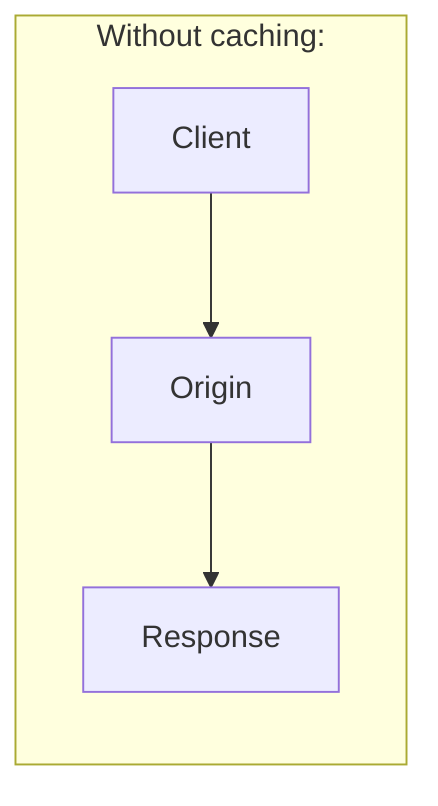

Repeated request:

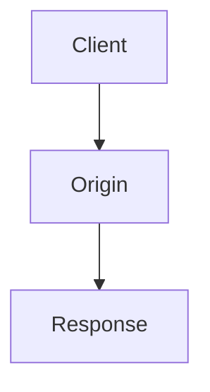

With caching:


If the cache already has a usable response, the origin may not need to be contacted.

---

# 2. HTTP Caching Is Bigger Than Browser Caching

In the previous chapter, we focused on the browser.

HTTP caching can happen at several places:

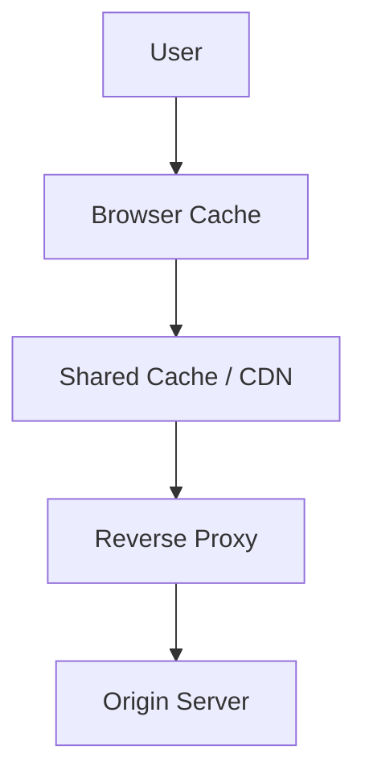

The HTTP protocol provides rules that help these different components understand:

* Whether a response can be cached
* How long it is fresh
* When it must be revalidated
* Whether it can be shared
* Which request properties affect the response

Therefore:

> **Browser caching is one participant in the larger HTTP caching system.**

---

# 3. Why Does HTTP Need Caching Rules?

Imagine a CDN receives:

```http
GET /products/42
```

and gets:

```http
200 OK
Content-Type: application/json

{
  "id": 42,
  "name": "Laptop",
  "price": 75000
}
```

The CDN needs to know:

```text
Can I store this?
Can I serve it again?
For how long?
Does the response depend on the user?
When should I check the origin again?
```

Without standardized rules, different caches would have difficulty deciding what is safe.

HTTP caching provides a common protocol-level vocabulary.

---

# 4. The Basic HTTP Cache Flow

A simplified flow:

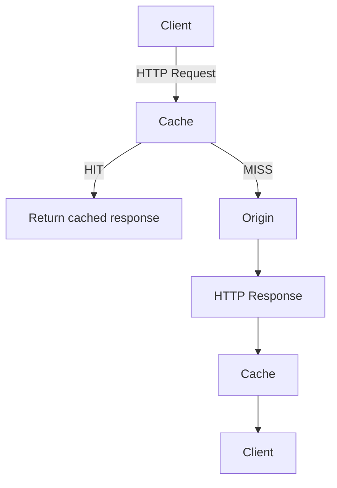

The cache becomes an intermediary.

Instead of:

```text
Client → Origin
```

we now have:

```text
Client → Cache → Origin
```

---

# 5. Cache Hit and Cache Miss

### Cache hit

The cache has a response that can be reused.

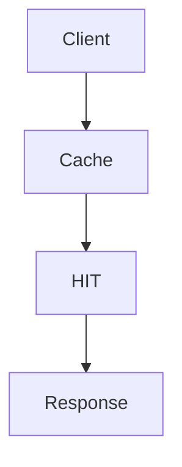

The origin does not need to generate the response.

### Cache miss

The cache cannot use a stored response.

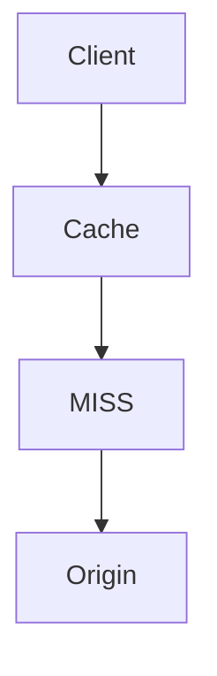

The origin generates or provides the response.

The cache may then store it for future requests if allowed.

---

# 6. HTTP Cache vs Application Cache

These two concepts should not be confused.

### HTTP cache

Works with HTTP requests and responses:

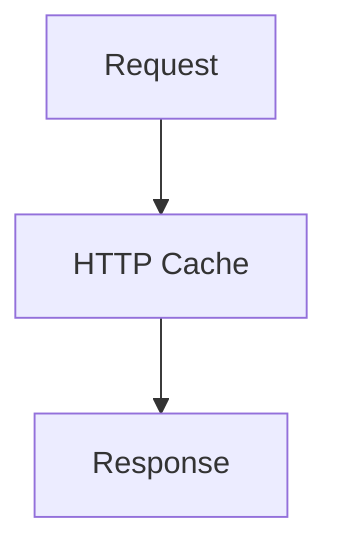

Examples:

* Browser cache
* CDN cache
* Reverse proxy cache

### Application cache

Usually stores application-level data:

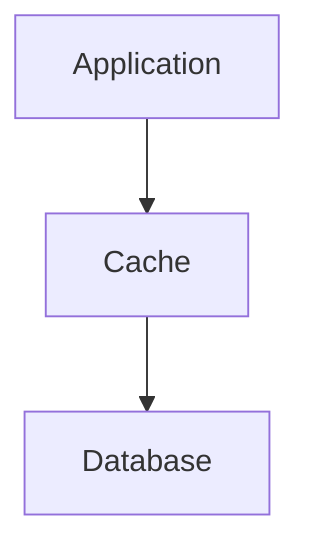

Examples:

* Redis
* In-memory cache
* Computed object cache
* Database query result cache

The difference can be summarized as:

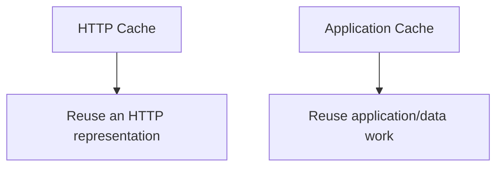

---

# 7. What Is a Representation?

HTTP caching often talks about a **representation**.

A representation is the response representation of a resource.

For example:

```http
GET /products/42
```

could produce:

```json
{
  "id": 42,
  "name": "Laptop",
  "price": 75000
}
```

The resource is conceptually:

```text
/products/42
```

The representation is the HTTP response describing that resource.

A cache stores the response representation, not the abstract resource itself.

This distinction becomes important when different requests can produce different representations.

---

# 8. The Cache Key

A cache needs a way to determine:

> "Does this incoming request correspond to something I already stored?"

It therefore uses a **cache key**.

At the simplest level:

```text
GET /products/42
```

might map to:

```text
/products/42
```

But real HTTP caching can be more complicated.

The response may depend on:

* URL
* HTTP method
* Request headers
* Content negotiation
* Cookies
* Authorization
* Other request properties

Therefore:

```text
Cache Key
   =
request identity + relevant variation
```

The exact cache-key construction depends on the cache implementation and HTTP rules.

---

# 9. Why the URL Alone Is Not Always Enough

Consider:

```http
GET /products
Accept-Language: en
```

and:

```http
GET /products
Accept-Language: fr
```

The server might return:

```text
English response
```

for the first request and:

```text
French response
```

for the second.

If a cache used only:

```text
/products
```

as the key, it could accidentally serve the English representation to a French request.

HTTP therefore provides mechanisms for communicating when the response varies based on request information.

One important mechanism is:

```http
Vary
```

---

# 10. The `Vary` Header

Suppose the server returns:

```http
Vary: Accept-Language
```

This tells a cache that the response representation varies based on the `Accept-Language` request header.

Conceptually:

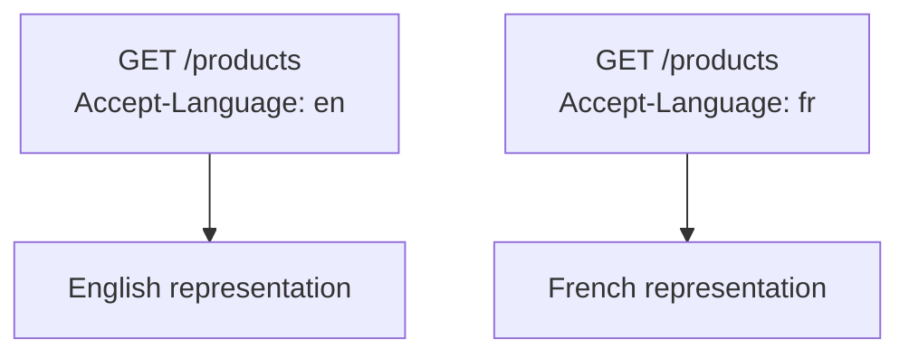

The cache must account for that variation.

Conceptually:

```text
/products + Accept-Language=en
/products + Accept-Language=fr
```

represent different cache variants.

---

# 11. Another `Vary` Example

Suppose an image server returns different formats based on:

```http
Accept: image/avif,image/webp,image/*
```

The response may include:

```http
Vary: Accept
```

Now the cache knows that the response depends on the `Accept` request header.

Conceptually:

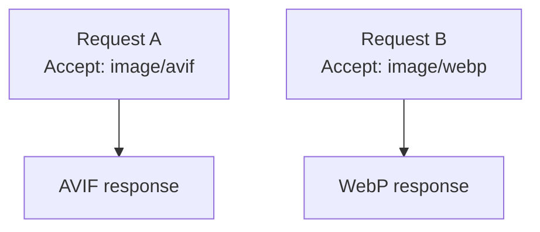

Without accounting for the variation, a cache could return the wrong representation.

---

# 12. Cacheability

Not every HTTP response should automatically be reused.

The cache needs to determine whether a response is cacheable under the applicable rules.

Factors can include:

* HTTP method
* Response status
* Cache-Control directives
* Request headers
* Authorization
* Shared/private cache rules
* Explicit application policy
* Cache implementation behavior

The important principle is:

> **Caching is a protocol decision, not simply "store every response."**

---

# 13. Safe and Unsafe Methods

HTTP methods have different semantics.

A common example:

```http
GET /products/42
```

is a retrieval operation.

Whereas:

```http
POST /orders
```

usually creates or triggers a state-changing operation.

HTTP caching is primarily associated with responses to methods whose semantics allow safe reuse, especially `GET` and `HEAD`.

Do not assume:

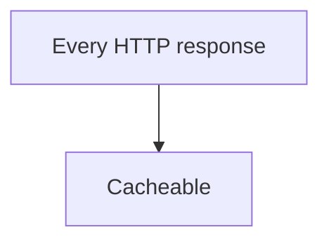

The method and response semantics matter.

---

# 14. Freshness

A stored HTTP response may be considered **fresh** for a certain period.

For example:

```http
Cache-Control: max-age=3600
```

Conceptually:

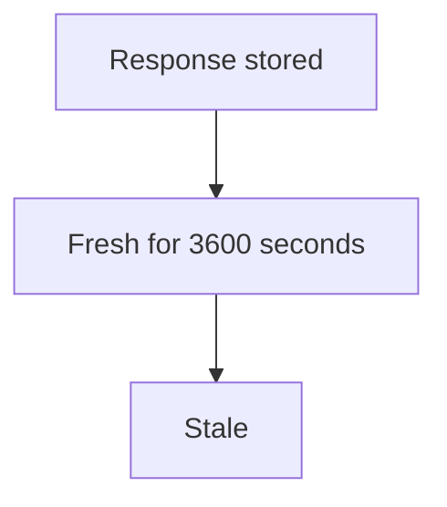

While fresh, a cache may be able to serve the stored response without contacting the origin.

This is one of the biggest performance benefits of HTTP caching.

---

# 15. Freshness Is Not the Same as Existence

This distinction is critical.

Suppose:

```http
Cache-Control: max-age=600
```

After 600 seconds:

```text
Fresh → Stale
```

It does not necessarily mean:

```text
Stale → Deleted
```

The cached response may still exist.

It may be revalidated.

Therefore:

```text
Freshness
    ≠
Storage lifetime
```

This is the same conceptual distinction we saw with browser caching.

---

# 16. `Cache-Control`

`Cache-Control` is the primary mechanism for communicating caching directives.

Examples:

```http
Cache-Control: max-age=3600
```

```http
Cache-Control: no-cache
```

```http
Cache-Control: no-store
```

```http
Cache-Control: private
```

```http
Cache-Control: public
```

```http
Cache-Control: must-revalidate
```

Multiple directives can be combined:

```http
Cache-Control: public, max-age=3600
```

Each directive communicates a different aspect of caching behavior.

---

# 17. `max-age`

Example:

```http
Cache-Control: max-age=300
```

The response can generally be considered fresh for:

```text
300 seconds
```

or:

```text
5 minutes
```

Conceptually:

```text
0s                 300s
|--------------------|
      Fresh
                       ↓
                     Stale
```

While fresh, a cache may be able to serve it without revalidation.

---

# 18. `s-maxage`

Shared caches may also use:

```http
Cache-Control: s-maxage=600
```

This is particularly relevant to shared caches such as CDNs and proxies.

Conceptually:

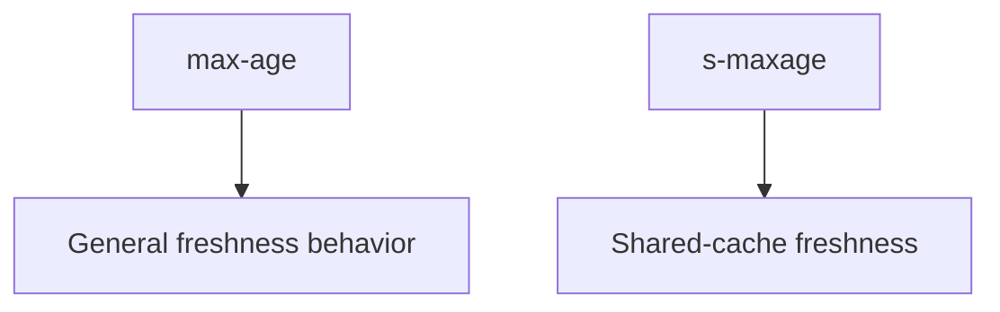

This allows an application to design different freshness behavior for private and shared caching contexts.

For example:

```http
Cache-Control: private, max-age=60
```

would be conceptually different from:

```http
Cache-Control: public, s-maxage=600
```

The exact combination must match the intended cache architecture.

---

# 19. `private`

A response can be marked:

```http
Cache-Control: private
```

This indicates that it is intended for a private cache rather than a shared cache under the applicable caching rules.

Typical example:

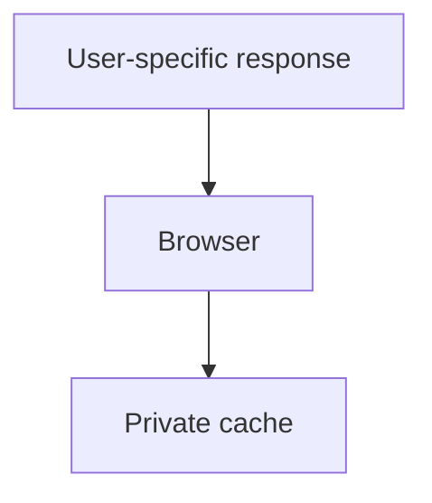

For example:

```http
GET /account/profile
```

might return user-specific information.

A shared CDN should not blindly reuse that representation for other users.

---

# 20. `public`

A response can be explicitly marked:

```http
Cache-Control: public
```

This indicates that the response may be stored by shared caches when the other caching requirements permit it.

Examples might include genuinely public:

```text
CSS
JavaScript
Images
Public API responses
```

But `public` should not be interpreted as:

```text
"Store forever."
```

Freshness and other directives still matter.

---

# 21. `no-store`

Example:

```http
Cache-Control: no-store
```

Conceptually:

```text
Do not store this response in a cache.
```

This can be appropriate when caching the response would be undesirable or unsafe.

For example:

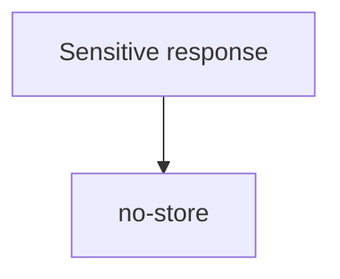

The exact policy should be based on the sensitivity and requirements of the application.

---

# 22. `no-cache`

This is one of the most commonly misunderstood directives.

```http
Cache-Control: no-cache
```

does **not** simply mean:

```text
"Never store this response."
```

It generally means that the stored response must be revalidated before reuse.

Conceptually:

```text
no-cache

Store?
   ↓
Potentially yes

Reuse directly?
   ↓
No — revalidate first
```

Compare:

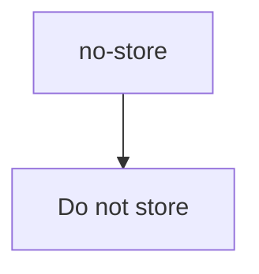

with:

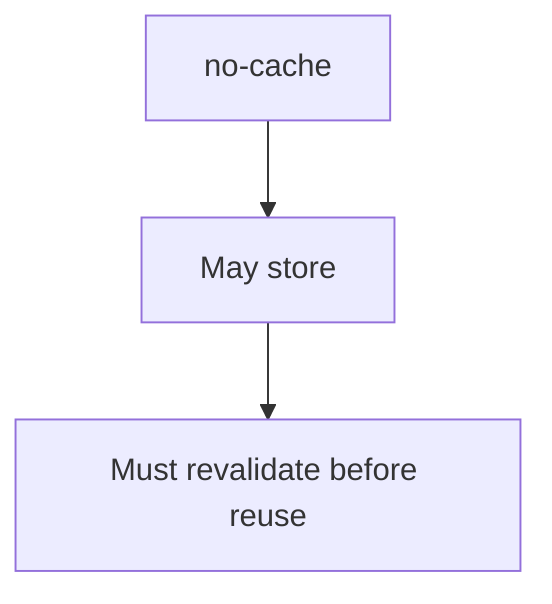

---

# 23. `must-revalidate`

A response may contain:

```http
Cache-Control: must-revalidate
```

This tells caches that once the response becomes stale, the cache must follow the required revalidation behavior rather than simply reusing stale content where the normal rules would otherwise allow it.

Mental model:

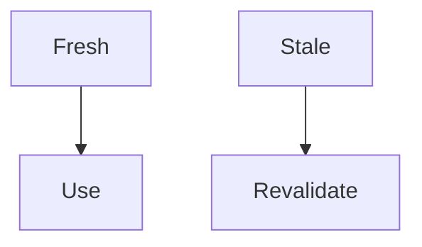

This can be useful when serving stale data would violate the application's requirements.

---

# 24. Revalidation

When a cached response becomes stale, the cache may ask the origin:

> "Has this representation changed?"

Instead of downloading the complete resource immediately, it can make a conditional request.

Two common validators are:

```text
ETag
Last-Modified
```

---

# 25. ETag

Suppose the origin responds:

```http
HTTP/1.1 200 OK
ETag: "abc123"
```

The cache stores:

```text
Response
+
ETag
```

Later:

```http
If-None-Match: "abc123"
```

The origin checks whether the representation is still the same.

If unchanged:

```http
HTTP/1.1 304 Not Modified
```

The cache can reuse the stored representation.

---

# 26. `304 Not Modified`

A `304` response is not a new full representation.

It means, conceptually:

```text
"Your cached representation is still valid."
```

Flow:

```mermaid
flowchart TD
  accTitle: 304 Not Modified
  accDescr: The cache sends a conditional request with If-None-Match: "abc123"; the origin answers 304 Not Modified, and the cache uses its existing stored response.
  N0["Cache"] -->|"Conditional Request<br/>If-None-Match: #quot;abc123#quot;"| N1["Origin"] -->|"304 Not Modified"| N2["Cache"] --> N3["Use existing stored response"]
```

This can save substantial bandwidth for large resources.

---

# 27. Last-Modified

Another validator is:

```http
Last-Modified: Wed, 30 Sep 2026 14:00:00 GMT
```

The cache may later send:

```http
If-Modified-Since: Wed, 30 Sep 2026 14:00:00 GMT
```

If the resource has not changed:

```http
304 Not Modified
```

Otherwise:

```http
200 OK
```

with the new representation.

---

# 28. ETag vs Last-Modified

| Validator     | Based on                 |
| ------------- | ------------------------ |
| ETag          | Representation validator |
| Last-Modified | Modification time        |

ETags can provide more precise validation because they can identify a representation without relying solely on modification timestamps.

A server may provide both.

The important concept is:

```mermaid
flowchart TD
  accTitle: Conditional requests
  accDescr: Cached representation, then Validator, then Conditional request, then Has it changed?.
  N0["Cached representation"] --> N1["Validator"] --> N2["Conditional request"] --> N3["Has it changed?"]
```

---

# 29. Conditional Requests

A conditional request asks the server to evaluate a condition before sending the complete response.

Example:

```http
GET /app.js
If-None-Match: "abc123"
```

Possible outcomes:

```mermaid
flowchart TD
  accTitle: Not changed
  accDescr: Not changed, then 304 Not Modified.
  N0["Not changed"] --> N1["304 Not Modified"]
```

or:

```mermaid
flowchart TD
  accTitle: Changed
  accDescr: Changed, then 200 OK + new representation.
  N0["Changed"] --> N1["200 OK<br/>+ new representation"]
```

This is a major HTTP caching optimization.

---

# 30. The Complete Revalidation Flow

```mermaid
flowchart TD
  accTitle: The complete revalidation flow
  accDescr: The client requests from the cache. No cached response: the origin returns 200 and the cache stores it. Cached and fresh: return it. Cached but stale: send a conditional request to the origin; 304 reuses the cached response, 200 stores the new one.
  C["Client"] -->|"Request"| K["Cache"] --> R1
  subgraph R1[" "]
    direction TB
    Q1{"Has cached<br/>response?"} -->|"NO"| O["Origin"] --> R["200 Response"] --> K2["Cache"]
  end
  subgraph R2[" "]
    direction TB
    Q2{"Fresh?"} -->|"YES"| H["Return cached<br/>response"]
  end
  R1 -->|"YES"| R2 -->|"NO"| CR["Conditional Request"] --> O2["Origin"]
  O2 -->|"304"| U["Reuse<br/>cached"]
  O2 -->|"200"| S["Store new<br/>response"]
```

This is one of the most important HTTP caching flows to understand.

---

# 31. Shared Caches

A **shared cache** can serve responses to multiple users.

Examples:

* CDN
* Reverse proxy
* Shared HTTP cache

Architecture:

```mermaid
flowchart LR
  accTitle: A shared cache
  accDescr: Users A, B and C share one cache in front of the origin.
  A["User A"] & B["User B"] & C["User C"] --> S["Shared Cache"] --> O["Origin"]
```

If the response is safely shareable:

```mermaid
flowchart TD
  accTitle: Reuse across users
  accDescr: User A misses, the origin responds and the cache stores it; User B then hits the same cached representation.
  A0["User A"] --> A1["Cache MISS"] --> A2["Origin"] --> A3["Cache stores response"]
  B0["User B"] --> B1["Cache HIT"] --> B2["Same cached representation"]
```

The origin avoids repeating the same work.

---

# 32. Private Caches

A private cache is associated with a single user/client context.

The most common example is the browser cache.

```mermaid
flowchart TD
  accTitle: Private cache A
  accDescr: User A, then Private Cache A.
  N0["User A"] --> N1["Private Cache A"]
```

User B has:

```mermaid
flowchart TD
  accTitle: Private cache B
  accDescr: User B, then Private Cache B.
  N0["User B"] --> N1["Private Cache B"]
```

The cached response is not automatically shared between them.

---

# 33. Cache Hierarchy

A real web request may encounter multiple cache layers.

```mermaid
flowchart TD
  accTitle: A cache hierarchy
  accDescr: A request misses the browser, the CDN and the reverse proxy before reaching the origin.
  N0["Browser"] -->|"MISS"| N1["CDN"] -->|"MISS"| N2["Reverse Proxy"] -->|"MISS"| N3["Origin"]
```

Each layer can potentially answer the request.

Example:

```mermaid
flowchart TD
  accTitle: A browser hit
  accDescr: Browser HIT, then No CDN request.
  N0["Browser HIT"] --> N1["No CDN request"]
```

If browser misses:

```mermaid
flowchart TD
  accTitle: A CDN hit
  accDescr: Browser MISS, then CDN HIT, then No origin request.
  N0["Browser MISS"] --> N1["CDN HIT"] --> N2["No origin request"]
```

If CDN misses:

```mermaid
flowchart TD
  accTitle: A reverse proxy hit
  accDescr: CDN MISS, then Reverse Proxy HIT, then No application request.
  N0["CDN MISS"] --> N1["Reverse Proxy HIT"] --> N2["No application request"]
```

If all caches miss:

```text
Origin
```

This creates a hierarchy:

```mermaid
flowchart TD
  accTitle: Closest first
  accDescr: Closest cache, then Next cache, then Next cache, then Origin.
  N0["Closest cache"] --> N1["Next cache"] --> N2["Next cache"] --> N3["Origin"]
```

---

# 34. Why Cache Hierarchies Matter

Suppose an origin receives:

```text
1,000,000 requests/sec
```

If browser and CDN caching eliminate most requests:

```mermaid
flowchart TD
  accTitle: Each layer stops some requests
  accDescr: The browser stops many requests, the CDN stops more, and a small fraction reaches the origin.
  A0["Browser"] --> A1["many requests stopped"]
  B0["CDN"] --> B1["more requests stopped"]
  C0["Origin"] --> C1["small fraction remains"]
  A1 ~~~ B0
  B1 ~~~ C0
```

Caching therefore reduces pressure progressively.

This is why HTTP caching can have system-wide effects.

---

# 35. Request Headers Can Affect the Response

A response may depend on request headers.

Examples:

```text
Accept
Accept-Language
Accept-Encoding
User-Agent
```

For example:

```http
Accept-Language: en
```

could produce English.

While:

```http
Accept-Language: fr
```

could produce French.

A cache must know about such variation.

This is one reason the `Vary` header exists.

---

# 36. `Vary`

Example:

```http
Vary: Accept-Language
```

This tells caches:

> The representation depends on `Accept-Language`.

Conceptually:

```mermaid
flowchart TD
  accTitle: Request headers change the response
  accDescr: The same request with Accept-Language: en gets an English response; with Accept-Language: fr, a French response.
  R["Request"] --- E["Accept-Language: en"] --> ER["English response"]
  R --- F["Accept-Language: fr"] --> FR["French response"]
```

The cache must keep these variants logically separate.

---

# 37. Why `Vary` Can Increase Cache Complexity

Suppose a response varies on:

```http
Vary: Accept-Language, Accept-Encoding
```

Now the cache may need multiple variants:

```text
English + gzip
English + br
French + gzip
French + br
...
```

As the number of variation dimensions grows:

```mermaid
flowchart TD
  accTitle: Variants cost reuse
  accDescr: More variants, then Lower cache reuse, then More storage, then More cache complexity.
  N0["More variants"] --> N1["Lower cache reuse"] --> N2["More storage"] --> N3["More cache complexity"]
```

Therefore:

> **Only vary on request properties that genuinely affect the representation.**

---

# 38. `Accept-Encoding`

Content compression is a common example.

A client might advertise:

```http
Accept-Encoding: br, gzip
```

The server may return compressed content:

```http
Content-Encoding: br
```

Another client may support:

```http
Accept-Encoding: gzip
```

The representation transferred may differ.

A cache therefore needs to account for encoding variation.

HTTP caching infrastructure commonly handles this through `Vary: Accept-Encoding` or equivalent cache behavior.

---

# 39. Authorization and Shared Caching

Consider:

```http
GET /api/profile
Authorization: Bearer ...
```

The response may contain user-specific data.

A shared cache must not blindly treat all requests to:

```text
/api/profile
```

as equivalent.

Otherwise:

```mermaid
flowchart TD
  accTitle: Alice's response is stored
  accDescr: User A, then Shared Cache, then Alice's response.
  N0["User A"] --> N1["Shared Cache"] --> N2["Alice's response"]
```

could potentially become:

```mermaid
flowchart TD
  accTitle: User B gets it
  accDescr: User B, then Shared Cache HIT, then Alice's response.
  N0["User B"] --> N1["Shared Cache HIT"] --> N2["Alice's response"]
```

This is a data-isolation failure.

Therefore, authorization and cache behavior must be designed together.

---

# 40. Authentication Does Not Automatically Mean "Never Cache"

It is too simplistic to say:

```mermaid
flowchart TD
  accTitle: An oversimplification
  accDescr: Authenticated, then Never cache.
  N0["Authenticated"] --> N1["Never cache"]
```

The real question is:

```text
Who is allowed to reuse this response?
```

A user-specific response might be safely cached in a private browser cache under an appropriate policy.

A public response might also be cacheable even when the request is authenticated in some architectures, but this requires deliberate HTTP and application design.

The correct rule is:

> **Determine whether the response representation is safely reusable by the intended cache population.**

---

# 41. Cache Invalidation at the HTTP Layer

Suppose:

```text
GET /products/42
```

is cached.

Then:

```http
PUT /products/42
```

changes the product.

Now the cached GET representation may be outdated.

Conceptually:

```mermaid
flowchart TD
  accTitle: Writes make cached reads stale
  accDescr: GET /products/42 is cached; PUT /products/42 changes the data; the cached GET is potentially stale.
  A0["GET /products/42"] --> A1["Cached"]
  B0["PUT /products/42"] --> B1["Data changes"]
  C0["Cached GET"] --> C1["Potentially stale"]
  A1 ~~~ B0
  B1 ~~~ C0
```

The system must have an appropriate strategy for invalidation or freshness.

Possible approaches include:

* Short freshness lifetime
* Revalidation
* Explicit cache invalidation
* CDN purge
* Versioned URLs
* Cache-key changes
* Application-controlled caching

The exact mechanism depends on the cache architecture.

---

# 42. Why HTTP Cache Invalidation Is Difficult

Consider:

```text
/products/42
```

may have multiple representations:

```text
JSON
HTML
Mobile-specific response
Language-specific response
Compressed representation
```

There may also be multiple cache layers:

```text
Browser
CDN
Reverse Proxy
```

When the product changes:

```text
Which cached representations are affected?
Which cache layers contain them?
Which variants need invalidation?
How quickly must the change become visible?
```

This is why invalidation becomes increasingly difficult at scale.

---

# 43. HTTP Caching and Content Versioning

For static assets, URL versioning can avoid complicated invalidation.

Instead of:

```text
/app.js
```

use:

```text
/app.a81f42.js
```

When content changes:

```text
/app.39c7d1.js
```

Now the cache does not need to understand:

```text
"Old app.js changed."
```

The URL itself identifies the new representation.

This is a powerful architectural technique:

```mermaid
flowchart TD
  accTitle: Content versioning
  accDescr: Content changes, then URL changes, then New cache key.
  N0["Content changes"] --> N1["URL changes"] --> N2["New cache key"]
```

---

# 44. Cache-Control and Versioned Assets

A common strategy for immutable assets is:

```http
Cache-Control: public, max-age=31536000, immutable
```

The important architectural idea is:

```text
Content-hashed URL
        +
Long freshness
        ↓
Very strong cache reuse
```

The `immutable` directive communicates that the representation is not expected to change while that URL is being used.

The exact policy should still fit the deployment strategy.

---

# 45. HTTP Cache Key and Query Parameters

Consider:

```text
/products?page=1
/products?page=2
```

These are different URLs.

A cache will generally distinguish them.

Similarly:

```text
/products?category=laptop
/products?category=phone
```

represent different requests.

This means query parameters can naturally create separate cache entries.

However, applications and CDNs sometimes normalize or ignore certain query parameters.

That can improve cache hit rates but introduces correctness risks if the ignored parameter actually changes the response.

Therefore:

> **A cache key must contain every request component that can change the response representation.**

---

# 46. Cache-Key Mistakes

Suppose:

```text
/products?currency=INR
/products?currency=USD
```

return different prices.

If a cache ignores:

```text
currency
```

both could map to:

```text
/products
```

That would be incorrect.

Correct conceptual keys:

```text
/products?currency=INR
/products?currency=USD
```

The general rule:

```mermaid
flowchart TD
  accTitle: The cache-key rule
  accDescr: If input affects response, then It must be represented in cache identity.
  N0["If input affects response"] --> N1["It must be represented in cache identity"]
```

---

# 47. Cache-Key Explosion

The opposite problem can also happen.

Suppose a URL contains many irrelevant or unique query parameters:

```text
/products?
utm_source=...
utm_campaign=...
tracking_id=...
random=...
```

If every parameter creates a different cache key:

```mermaid
flowchart TD
  accTitle: Cache-key explosion
  accDescr: Thousands of URLs, then Thousands of cache entries, then Lower hit ratio.
  N0["Thousands of URLs"] --> N1["Thousands of cache entries"] --> N2["Lower hit ratio"]
```

This is called a cache-key cardinality problem.

A cache may need controlled normalization.

But normalization must never remove a parameter that changes the response.

---

# 48. Cache Hit Ratio

One useful metric is:

```text
Cache Hit Ratio =
Cache Hits / Total Cacheable Requests
```

For example:

```text
Hits = 900
Requests = 1,000

Hit Ratio = 90%
```

A high hit ratio often means the cache is successfully reusing responses.

But:

> **A high hit ratio is not automatically proof that the cache is well designed.**

A cache could have:

```text
99% hit ratio
```

while serving stale or incorrect data.

Correctness and freshness still matter.

---

# 49. Cache Miss Rate

The complementary metric is:

```text
Miss Rate =
Cache Misses / Total Requests
```

For example:

```text
100 misses
1,000 requests

Miss Rate = 10%
```

Monitoring both can help identify changes in cache behavior.

A sudden change:

```text
Hit Ratio
90% → 50%
```

could indicate:

* Deployment change
* Cache-key change
* TTL change
* CDN configuration problem
* Increased request variation
* Cache eviction
* Origin behavior change

---

# 50. Cache Efficiency Is About More Than Hit Ratio

Suppose two cache designs both have:

```text
90% hit ratio
```

Design A:

```text
Cache hits save 1 ms
```

Design B:

```text
Cache hits save 500 ms
```

Their system impact is very different.

Therefore, measure:

* Hit ratio
* Miss cost
* Response latency
* Backend load
* Bandwidth
* Cache size
* Freshness
* Error rate

The real question is:

> **How much expensive work does caching actually prevent?**

---

# 51. HTTP Caching and Latency

Suppose origin latency is:

```text
300 ms
```

A nearby CDN cache might respond in:

```text
20 ms
```

A browser cache might avoid the network entirely.

Conceptually:

```mermaid
flowchart TD
  accTitle: Where the hit happens
  accDescr: A browser hit is a local response; a CDN hit is a short network path; an origin hit is the full request path.
  A0["Browser HIT"] --> A1["Local response"]
  B0["CDN HIT"] --> B1["Short network path"]
  C0["Origin HIT"] --> C1["Full request path"]
  A1 ~~~ B0
  B1 ~~~ C0
```

This illustrates another important principle:

> **Cache location affects the amount of latency and work that can be avoided.**

---

# 52. HTTP Caching and Bandwidth

Suppose a JavaScript file is:

```text
5 MB
```

If one million clients download it:

```text
5 MB × 1,000,000
```

The total transferred volume is enormous.

With browser and CDN caching:

```text
Browser reuse
+
CDN reuse
```

many clients may not require a fresh transfer from the origin.

Caching therefore reduces network bandwidth as well as computation.

---

# 53. HTTP Caching and Origin Protection

Caching can protect the origin:

```mermaid
flowchart TD
  accTitle: With a shared cache
  accDescr: Many Clients, then Shared Cache, then Small number of origin requests.
  N0["Many Clients"] --> N1["Shared Cache"] --> N2["Small number of origin requests"]
```

Without caching:

```mermaid
flowchart TD
  accTitle: Without a shared cache
  accDescr: Many Clients, then Origin.
  N0["Many Clients"] --> N1["Origin"]
```

This is particularly useful for:

* Static assets
* Public API responses
* Public pages
* Images
* Downloads
* Documentation
* Frequently requested content

But caching should not be used merely to hide an inefficient origin.

Application/database performance still matters.

---

# 54. What Happens During a Cache Failure?

Suppose:

```mermaid
flowchart TD
  accTitle: Normally
  accDescr: Client, then CDN.
  N0["Client"] --> N1["CDN"]
```

and the CDN fails.

Traffic may move toward:

```text
Origin
```

If the origin was sized assuming the CDN would absorb most requests:

```mermaid
flowchart TD
  accTitle: When the cache fails
  accDescr: CDN failure, then Origin traffic spike, then Origin saturation.
  N0["CDN failure"] --> N1["Origin traffic spike"] --> N2["Origin saturation"]
```

This is another example of a dependency becoming a protection layer.

Therefore:

> **Caching changes traffic distribution, which changes capacity requirements.**

This is an important system-design consequence.

---

# 55. Cache as a Capacity Multiplier

Imagine:

```text
Origin capacity = 10,000 requests/sec
```

If a CDN handles:

```text
90% of requests
```

the origin might see only:

```text
1,000 requests/sec
```

But if the CDN stops serving cached content:

```text
10,000 requests/sec
```

may reach the origin.

Therefore, cache capacity and cache behavior become part of the architecture's capacity model.

This connects caching to:

* Capacity planning
* Load balancing
* Failure handling
* Rate limiting
* Autoscaling

---

# 56. HTTP Cache and Stale Content

Freshness is a business decision as much as a technical one.

For a blog article:

```text
5-minute-old content
```

may be acceptable.

For a payment status:

```text
5-minute-old content
```

may be unacceptable.

Therefore:

```mermaid
flowchart TD
  accTitle: The right order
  accDescr: Freshness requirement, then Cache policy.
  N0["Freshness requirement"] --> N1["Cache policy"]
```

not:

```mermaid
flowchart TD
  accTitle: The wrong order
  accDescr: Cache policy, then Whatever freshness happens.
  N0["Cache policy"] --> N1["Whatever freshness happens"]
```

The application should decide how stale data can safely become.

---

# 57. Cache-Control as a Contract

It is useful to think of HTTP caching headers as a contract between the origin and caches.

For example:

```http
Cache-Control: public, max-age=600
```

communicates:

```text
This response is intended to be publicly reusable
and can generally be considered fresh for 10 minutes.
```

Similarly:

```http
Cache-Control: private, no-store
```

communicates a very different intent.

The headers are therefore part of the application's delivery architecture.

---

# 58. Security: Cache Poisoning

Caching also creates security risks.

A simplified cache-poisoning scenario occurs when:

```mermaid
flowchart TD
  accTitle: Cache poisoning
  accDescr: Attacker, then Sends specially crafted request, then Cache stores an unintended response, then Other users receive it.
  N0["Attacker"] --> N1["Sends specially crafted request"] --> N2["Cache stores an unintended response"] --> N3["Other users receive it"]
```

The exact attack depends on:

* Cache-key construction
* Request-header handling
* Host/header normalization
* Proxy behavior
* Application assumptions
* Cache configuration

The core lesson is:

> **A shared cache must never treat two requests as equivalent when their responses can differ in a security-relevant way.**

---

# 59. Security: Sensitive Response Leakage

Another risk is accidentally caching:

```text
User A's private response
```

in a shared cache.

Then:

```mermaid
flowchart TD
  accTitle: Sensitive response leakage
  accDescr: User B, then Shared cache HIT, then User A's data.
  N0["User B"] --> N1["Shared cache HIT"] --> N2["User A's data"]
```

This is why:

* Authentication
* Authorization
* Cookies
* Cache-Control
* `Vary`
* Cache keys

must be considered together.

Caching is therefore part of the security architecture.

---

# 60. HTTP Caching and Cookies

Cookies can affect the response.

For example:

```http
Cookie: theme=dark
```

may change the HTML.

Or:

```http
Cookie: user_id=42
```

may identify the user.

If a response depends on a cookie, a shared cache must not blindly reuse one user's representation for another.

The application should determine whether:

```text
Cookie affects representation
```

and configure caching accordingly.

---

# 61. Avoiding Unnecessary Variation

Suppose a page contains:

```text
User-specific recommendation
```

embedded into otherwise public HTML.

One option is to make the entire page user-specific:

```mermaid
flowchart TD
  accTitle: Everything private
  accDescr: Entire page, then Private.
  N0["Entire page"] --> N1["Private"]
```

Another architecture might separate:

```mermaid
flowchart TD
  accTitle: Separating public and personal
  accDescr: A public page goes to the shared cache; a personalized API request gets private handling.
  A0["Public page"] --> A1["Shared cache"]
  B0["Personalized API request"] --> B1["Private handling"]
```

This can allow more of the response to benefit from shared caching.

This is an important architectural pattern:

> **Separate highly cacheable public content from highly personalized content when practical.**

---

# 62. HTTP Caching and API Design

Suppose an API provides:

```http
GET /products
```

with public product data.

HTTP caching may be a natural fit.

But:

```http
GET /my-account
```

may be highly personalized.

The API design should consider:

```text
Who consumes this response?
Does the response vary by user?
How frequently does it change?
How stale can it be?
Can it be shared?
```

Caching is therefore partly an API design decision.

---

# 63. A Practical HTTP Caching Decision Framework

For every endpoint or resource, ask:

### 1. Is the response reusable?

```text
YES → continue
NO  → avoid caching
```

### 2. Is it user-specific?

```text
YES → private/cache carefully
NO  → shared caching may be possible
```

### 3. How quickly can it become stale?

```text
Seconds?
Minutes?
Hours?
Days?
```

### 4. What happens when it becomes stale?

```text
Revalidate?
Serve stale?
Fetch fresh?
```

### 5. What request properties change the response?

```text
Language?
Encoding?
Device?
Authentication?
Query parameters?
```

### 6. Can the URL change when the content changes?

```text
YES → versioning may simplify invalidation
NO  → revalidation/invalidation becomes more important
```

---

# 64. A Complete Example

Imagine a public product API:

```http
GET /api/products/42
```

Response:

```http
HTTP/1.1 200 OK
Content-Type: application/json
Cache-Control: public, max-age=60
ETag: "product-42-v17"
```

The first request:

```mermaid
flowchart TD
  accTitle: First request
  accDescr: Client, then CDN MISS, then Origin, then 200 OK, then CDN stores response, then Client.
  N0["Client"] --> N1["CDN MISS"] --> N2["Origin"] --> N3["200 OK"] --> N4["CDN stores response"] --> N5["Client"]
```

Second request within freshness period:

```mermaid
flowchart TD
  accTitle: Next request
  accDescr: Client, then CDN HIT, then 200 OK.
  N0["Client"] --> N1["CDN HIT"] --> N2["200 OK"]
```

After becoming stale:

```mermaid
flowchart TD
  accTitle: After the entry becomes stale
  accDescr: Client, then CDN, then Conditional request If-None-Match: "product-42-v17", then Origin.
  N0["Client"] --> N1["CDN"] --> N2["Conditional request<br/>If-None-Match: #quot;product-42-v17#quot;"] --> N3["Origin"]
```

If unchanged:

```text
304 Not Modified
```

The CDN can continue using its cached representation.

If changed:

```text
200 OK
ETag: "product-42-v18"
```

The CDN stores the new representation.

---

# 65. HTTP Caching vs Cache-Aside

These concepts are often mixed together.

### HTTP caching

```mermaid
flowchart TD
  accTitle: HTTP caching
  accDescr: HTTP response, then Cache, then Reuse response.
  N0["HTTP response"] --> N1["Cache"] --> N2["Reuse response"]
```

The caching behavior is driven largely by HTTP semantics and cache infrastructure.

### Cache-Aside

```mermaid
flowchart TD
  accTitle: Cache-Aside
  accDescr: Application, then Check application cache, then Database.
  N0["Application"] --> N1["Check application cache"] --> N2["Database"]
```

The application explicitly manages the cache.

The difference:

```mermaid
flowchart TD
  accTitle: Two levels of caching
  accDescr: HTTP caching works at the response level; Cache-Aside at the application/data level.
  A0["HTTP Cache"] --> A1["Response-level caching"]
  B0["Cache-Aside"] --> B1["Application/data-level caching"]
```

They can coexist.

---

# 66. HTTP Caching vs Write-Through

Write-through caching is primarily an application/data caching strategy.

HTTP caching is primarily about reusable HTTP representations.

For example:

```mermaid
flowchart TD
  accTitle: Application cache
  accDescr: Application cache: a product object in Redis.
  subgraph G["Application Cache:"]
    direction TB
    N0["Product Object"] --> N1["Redis"]
  end
```

while:

```mermaid
flowchart TD
  accTitle: HTTP cache
  accDescr: HTTP cache: GET /products/42 at the CDN.
  subgraph G["HTTP Cache:"]
    direction TB
    N0["GET /products/42"] --> N1["CDN"]
  end
```

Both may cache related information, but at different layers and with different responsibilities.

---

# 67. HTTP Caching and Cache Stampede

HTTP caches can also experience stampede-like behavior.

Suppose:

```text
Popular API response
```

expires from a CDN.

Many requests arrive:

```text
Request A → MISS
Request B → MISS
Request C → MISS
Request D → MISS
```

If all requests reach the origin simultaneously:

```mermaid
flowchart BT
  accTitle: A stampede on the origin
  accDescr: Many simultaneous refreshes hit the origin.
  R["Many simultaneous refreshes"] --> O["Origin"]
```

This is the same fundamental problem discussed in **03.10 — Cache Stampede**.

HTTP caches and CDNs may use mechanisms such as:

* Request collapsing
* Background refresh
* Stale serving
* Shielding
* Controlled revalidation

The exact features vary by implementation.

---

# 68. HTTP Caching and CDN

A CDN is one of the most important practical applications of shared HTTP caching.

```mermaid
flowchart TD
  accTitle: CDN edges
  accDescr: Users are served by edges A, B and C, which fetch from the origin.
  U["Users"] --- A["Edge A"] & B["Edge B"] & C["Edge C"]
  A & B & C --> O["Origin"]
```

Each edge can cache HTTP responses.

A user in one region may receive:

```mermaid
flowchart TD
  accTitle: A nearby edge
  accDescr: User, then Nearby Edge, then Cached Response.
  N0["User"] --> N1["Nearby Edge"] --> N2["Cached Response"]
```

rather than:

```mermaid
flowchart TD
  accTitle: Without a CDN
  accDescr: User, then Long-distance network, then Origin.
  N0["User"] --> N1["Long-distance network"] --> N2["Origin"]
```

The next chapter will explore this architecture in detail.

---

# 69. Hands-On Lab — HTTP Caching

Use a simple web server that lets you control HTTP response headers.

## Step 1 — Create a Resource

Create:

```text
/data.json
```

with:

```json
{
  "message": "Hello HTTP Cache"
}
```

---

## Step 2 — Start Without Explicit Caching

Request:

```http
GET /data.json
```

Inspect the response headers.

Record:

```text
Cache-Control
ETag
Last-Modified
Expires
```

---

## Step 3 — Add `Cache-Control`

Configure:

```http
Cache-Control: public, max-age=60
```

Request the resource again.

Observe:

```mermaid
flowchart TD
  accTitle: First vs second request
  accDescr: The first request goes to the origin; the second is served by the cache.
  A0["First request"] --> A1["Origin"]
  B0["Second request"] --> B1["Cache"]
```

---

## Step 4 — Add an ETag

Configure:

```http
ETag: "v1"
```

After the response becomes stale, send:

```http
If-None-Match: "v1"
```

If the resource has not changed, observe:

```http
304 Not Modified
```

---

## Step 5 — Change the Resource

Change:

```json
{
  "message": "Hello HTTP Cache"
}
```

to:

```json
{
  "message": "Hello HTTP Cache v2"
}
```

Change the ETag:

```http
ETag: "v2"
```

Now revalidate.

Observe:

```mermaid
flowchart TD
  accTitle: A changed resource
  accDescr: ETag v1, then Resource changed, then 200 OK, then New representation, then ETag v2.
  N0["ETag v1"] --> N1["Resource changed"] --> N2["200 OK"] --> N3["New representation"] --> N4["ETag v2"]
```

---

## Step 6 — Test `Vary`

Create a response that changes based on:

```http
Accept-Language
```

For example:

```text
en → Hello
fr → Bonjour
```

Return:

```http
Vary: Accept-Language
```

Now test:

```http
Accept-Language: en
```

and:

```http
Accept-Language: fr
```

Observe that the cache must distinguish the representations.

---

## Step 7 — Test Private Data

Create:

```http
GET /profile
```

that returns user-specific information.

Experiment with:

```http
Cache-Control: private
```

and:

```http
Cache-Control: no-store
```

Discuss:

> Why would the second policy be more restrictive?

---

## Challenge

Create the following endpoints:

```text
/public-data
/private-data
/language-data
/versioned.js
```

Design an HTTP caching policy for each.

Your goal is to decide:

```text
Cacheable?
Private or shared?
Freshness lifetime?
Revalidation?
Variation?
Versioning?
```

Do not begin with headers.

Begin with:

> **What is the response, who can reuse it, and how fresh must it be?**

Then choose the headers.

---

# 70. Common Mistakes

## Mistake 1 — Treating HTTP caching as browser caching only

HTTP caching also applies to shared caches such as CDNs and reverse proxies.

---

## Mistake 2 — Assuming every GET response should be cached

A GET response may still be:

* User-specific
* Sensitive
* Frequently changing
* Explicitly non-cacheable
* Dependent on request context

---

## Mistake 3 — Confusing `no-cache` with `no-store`

Remember:

```mermaid
flowchart TD
  accTitle: no-cache vs no-store
  accDescr: no-cache: may store, must revalidate. no-store: do not store.
  A0["no-cache"] --> A1["May store, must revalidate"]
  B0["no-store"] --> B1["Do not store"]
```

---

## Mistake 4 — Ignoring `Vary`

If a response changes based on:

```text
Accept-Language
Accept-Encoding
```

or another relevant request property, the cache must correctly account for that variation.

---

## Mistake 5 — Ignoring query parameters

If:

```text
?currency=INR
```

changes the response, it must be represented in cache identity.

---

## Mistake 6 — Ignoring authentication

User-specific responses can leak through incorrectly configured shared caches.

---

## Mistake 7 — Optimizing only for hit ratio

A high hit ratio does not guarantee:

* Correctness
* Freshness
* Security
* Low latency
* Good cache utilization

---

## Mistake 8 — Forgetting cache failure

If a CDN normally absorbs 90% of traffic, the origin must still have a plan for CDN failure or reduced cache effectiveness.

---

# 71. System Design View

HTTP caching creates a chain of reusable work:

```mermaid
flowchart TD
  accTitle: HTTP caching in the system design view
  accDescr: A user request misses the browser cache, the CDN shared cache and the reverse proxy, reaches the application, misses the application cache, and reaches the database.
  N0["User"] --> N1["Browser<br/>Cache"] -->|"MISS"| N2["CDN<br/>Shared Cache"] -->|"MISS"| N3["Reverse<br/>Proxy"] -->|"MISS"| N4["Application"] --> N5["Application<br/>Cache"] -->|"MISS"| N6["Database"]
```

Each layer asks a similar question:

> **Can I safely reuse a representation or result that I already have?**

But each layer has a different responsibility.

---

# 72. The HTTP Cache Decision Chain

A useful mental model is:

```mermaid
flowchart TD
  accTitle: The HTTP cache decision chain
  accDescr: Is there a matching cached representation? No: go to the origin. Yes: is it fresh? Yes: use it. No: revalidate; 304 or 200 then use or update.
  I["Incoming Request"] --> Q1{"Is there a matching<br/>cached representation?"}
  Q1 -->|"NO"| O["Origin"]
  Q1 -->|"YES"| Q2{"Is it fresh?"}
  Q2 -->|"NO"| R["Revalidate"]
  R -->|"304"| U["Use/<br/>update"]
  R -->|"200"| U
  Q2 -->|"YES"| U
```

But before reuse, the cache also needs to answer:

```text
Is this response actually safe to share?
Does the cache key correctly identify the representation?
Do request headers create variants?
Are authentication or cookies involved?
```

---

# 73. A Better Mental Model for HTTP Caching

Think in four questions:

### 1. Identity

```text
What representation is this?
```

### 2. Permission

```text
Am I allowed to reuse/share it?
```

### 3. Freshness

```text
Can I use it without checking?
```

### 4. Validation

```text
If stale, can I confirm that it is still valid?
```

So:

```mermaid
flowchart LR
  accTitle: A better mental model
  accDescr: HTTP caching is about identity, permission, freshness and validation.
  R["HTTP Caching"]
  R --- K0["Identity"]
  R --- K1["Permission"]
  R --- K2["Freshness"]
  R --- K3["Validation"]
```

This is more useful than memorizing individual headers in isolation.

---

# 74. Key Principle

> **HTTP caching is a protocol-level system for safely reusing HTTP representations across requests, while controlling identity, freshness, sharing, and revalidation.**

The most important questions are:

```text
What response are we caching?
Who is allowed to reuse it?
What makes two requests equivalent?
How long is it fresh?
What happens when it becomes stale?
How do we know whether it changed?
```

The deeper system-design lesson is:

> **Caching is correct only when the cache knows when two requests can safely share the same response.**

Performance comes from reuse.

Correctness comes from knowing **when reuse is safe**.

---

# Quick Reference

| Concept             | Meaning                                                 |
| ------------------- | ------------------------------------------------------- |
| HTTP caching        | Reuse of HTTP responses/representations                 |
| Cache hit           | Cache can reuse a stored response                       |
| Cache miss          | Cache cannot reuse a stored response                    |
| Fresh               | Response can generally be reused without revalidation   |
| Stale               | Freshness lifetime has ended                            |
| `Cache-Control`     | Primary HTTP caching directive mechanism                |
| `max-age`           | General freshness lifetime                              |
| `s-maxage`          | Freshness lifetime for shared caches                    |
| `public`            | Response may be shared when applicable                  |
| `private`           | Intended for private caching rather than shared caching |
| `no-store`          | Do not store response                                   |
| `no-cache`          | May store, but revalidate before reuse                  |
| `must-revalidate`   | Requires revalidation behavior once stale               |
| ETag                | Representation validator                                |
| `If-None-Match`     | Conditional request using ETag                          |
| Last-Modified       | Modification-time validator                             |
| `If-Modified-Since` | Conditional request using modification time             |
| `304 Not Modified`  | Cached representation remains valid                     |
| `Vary`              | Identifies request headers that affect representation   |
| Cache key           | Identity used to find a cached response                 |
| Shared cache        | Cache reusable by multiple clients                      |
| Private cache       | Cache associated with one client/user context           |
| Revalidation        | Checking whether a cached response remains valid        |
| Cache hit ratio     | Hits divided by total cacheable requests                |

---

# Knowledge Check

### 1. What is HTTP caching?

A mechanism for storing and reusing HTTP response representations instead of repeatedly obtaining them from the origin.

### 2. Is browser caching the same as HTTP caching?

No. Browser caching is one form of HTTP caching. HTTP caching also includes shared caches such as CDNs and reverse proxies.

### 3. What does `max-age` control?

It specifies a freshness lifetime for the response.

### 4. Does stale mean deleted?

No. A stale response may still exist and may be revalidated.

### 5. What does `no-store` mean?

The response should not be stored in caches under the applicable HTTP semantics.

### 6. What does `no-cache` mean?

A stored response generally must be revalidated before reuse.

### 7. Why is `Vary` important?

It tells caches that the response representation depends on particular request headers, allowing different variants to be handled correctly.

### 8. What is the purpose of an ETag?

It provides a validator that can be used to determine whether a cached representation has changed.

### 9. What does `304 Not Modified` mean?

The cached representation can still be reused, so the full response body does not need to be sent again.

### 10. Why can authentication complicate shared caching?

Because a response may contain user-specific data that must not be reused by another user.

### 11. Why is cache-key design important?

Because every request component that can change the response must be represented correctly in cache identity.

### 12. Why is cache hit ratio alone insufficient?

Because a cache can have a high hit ratio while still producing stale, incorrect, insecure, or otherwise undesirable behavior.

---

# Remember

```mermaid
flowchart LR
  accTitle: What an HTTP cache asks
  accDescr: An HTTP cache asks: is there a matching response? Can it be shared? Is it fresh? If stale, can it be revalidated? Does the request vary the representation?
  R["HTTP Cache"]
  R --- K0["Is there a matching response?"]
  R --- K1["Can it be shared?"]
  R --- K2["Is it fresh?"]
  R --- K3["If stale, can it be revalidated?"]
  R --- K4["Does the request vary the representation?"]
```

The core flow:

```mermaid
flowchart TD
  accTitle: Remember
  accDescr: A request reaches the cache. Hit and fresh: return. Hit and stale: revalidate; 304 reuses, 200 updates. Miss: go to the origin, then store and return.
  R["Request"] --> C["Cache"]
  C -->|"HIT + FRESH"| F["Return"]
  C -->|"HIT + STALE"| V["Revalidate"]
  V -->|"304"| U["Reuse"]
  V -->|"200"| P["Update"]
  C -->|"MISS"| O["Origin"] --> S["Store/Return"]
```

And the deepest lesson:

> **HTTP caching is not simply about keeping copies of responses. It is a set of rules for deciding when a cached response is safe to reuse, who can reuse it, and how the cache discovers that the response has changed.**

---

# Next Chapter

## 03.13 — CDN

The next chapter moves from the **HTTP caching rules** to one of their most important large-scale applications: the **Content Delivery Network**.

We will examine:

```mermaid
flowchart TD
  accTitle: Next: CDN
  accDescr: User, then Nearest Edge Location, then Cache, then Origin.
  N0["User"] --> N1["Nearest Edge Location"] --> N2["Cache"] --> N3["Origin"]
```

and understand:

* What a CDN actually is
* Edge locations
* Origin servers
* CDN cache hits and misses
* How a CDN reduces latency
* How a CDN reduces origin traffic
* Static vs dynamic content
* Pull vs push models
* Cache keys
* TTL and CDN caching
* Cache invalidation and purging
* Cache warming
* Origin shielding
* Multi-region delivery
* CDN failure scenarios
* CDN vs reverse proxy
* CDN vs browser cache
* CDN and security
* CDN and DDoS protection
* CDN architecture at scale

The key question will be:

> **How can the same HTTP response be served from a location physically closer to millions of users without repeatedly asking the origin to generate it?**
