# 03.13 — CDN

## Learning Objectives

By the end of this chapter, you should understand:

* What a CDN actually is
* Why CDNs exist
* What an edge location is
* The difference between an **origin server** and an **edge server**
* How a CDN cache hit and cache miss work
* How CDNs reduce latency and origin traffic
* Static vs dynamic content at the CDN
* Pull vs push CDN models
* CDN cache keys
* TTL and freshness
* CDN invalidation and purging
* Cache warming
* Origin shielding
* CDN and multi-region delivery
* CDN vs browser cache
* CDN vs reverse proxy
* CDN and security
* Common CDN failure scenarios
* How a CDN fits into a larger system

---

# 1. What Is a CDN?

**CDN** stands for **Content Delivery Network**.

A CDN is a distributed network of servers placed in different geographic locations that can store and deliver cacheable content closer to users.

Instead of every user requesting content directly from your origin server:

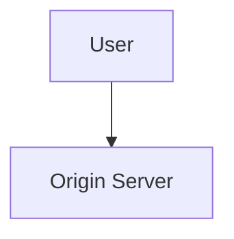

a CDN introduces distributed edge locations:

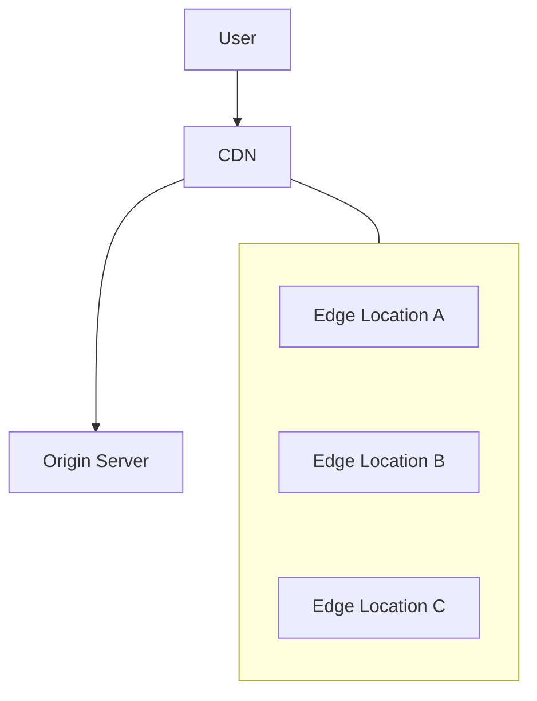

The basic idea is simple:

> **Serve reusable content from a location closer to the user instead of repeatedly sending every request to the origin.**

This can reduce:

* Network latency
* Origin server load
* Bandwidth usage at the origin
* Repeated computation
* Database-related work for cacheable responses

---

# 2. Why Do We Need a CDN?

Imagine your application is hosted in one region.

For example:

```text
Origin
India
```

Now users access it from:

```text
India
Singapore
London
New York
Sydney
```

Without a CDN, requests may travel long distances:

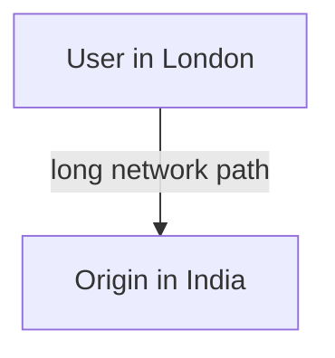

The farther the user is from the origin, the more network distance may contribute to latency.

A CDN can place edge servers in many locations:

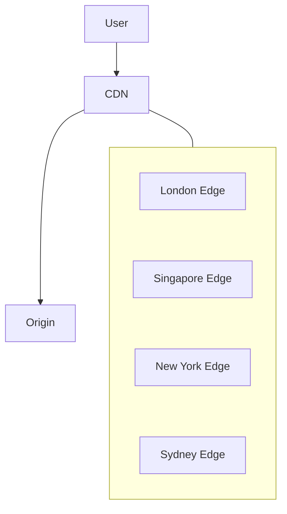

A user may then receive cacheable content from a nearby edge location.

---

# 3. The Core Problem a CDN Solves

A CDN primarily solves a **content delivery problem**.

Suppose your application repeatedly serves:

```text
logo.png
app.js
styles.css
product-image.jpg
video-segment.mp4
public-api-response
```

If millions of users request the same content, sending every request to the origin is wasteful.

Without CDN:

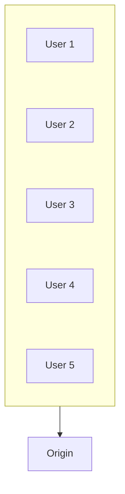

With CDN:

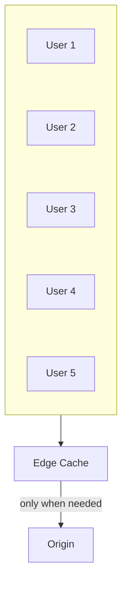

The CDN absorbs many repeated requests.

---

# 4. Origin Server

The **origin** is the authoritative source from which the CDN obtains content.

It might be:

* A web server
* An application server
* Object storage
* A media server
* Another HTTP service
* A load-balanced application

Example:

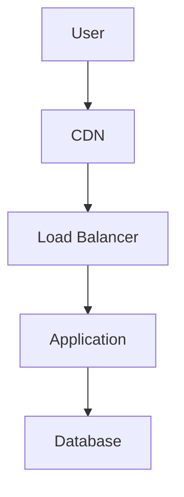

The CDN does not replace the origin.

Instead:

> **The origin produces or provides the content; the CDN distributes reusable content closer to users.**

---

# 5. Edge Location

An **edge location** is a geographically distributed location where CDN infrastructure can serve content to users.

A simplified model:

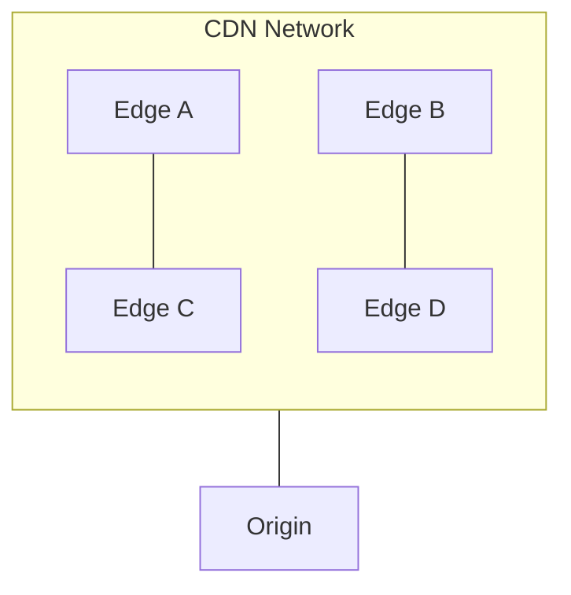

Users are generally directed toward an appropriate CDN edge based on the CDN's routing system and network conditions.

The goal is not simply:

> "Find the physically closest server."

The actual routing decision can involve many factors, including network topology, availability, performance, and provider infrastructure.

So think:

> **Closer and better-connected delivery point**, not simply "nearest building."

---

# 6. CDN Request Flow

Let's follow a simple request.

Suppose a user requests:

```text
https://example.com/images/product.jpg
```

The request reaches the CDN.

### First request

If the edge does not have the object:

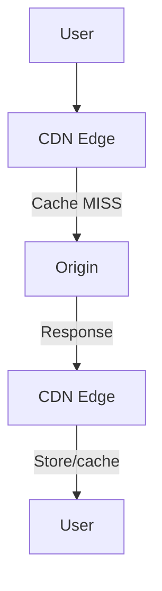

The CDN obtains the content from the origin and may store it at the edge.

---

# 7. CDN Cache Hit

Now another user requests the same resource.

If the edge already has a valid cached copy:

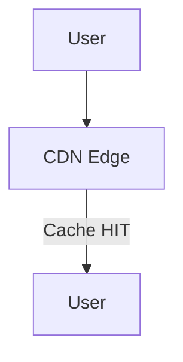

The origin is not required for that request.

This is the major performance benefit.

---

# 8. CDN Cache Miss

A **cache miss** occurs when the requested representation is not available as a usable cached entry at the relevant edge.

For example:

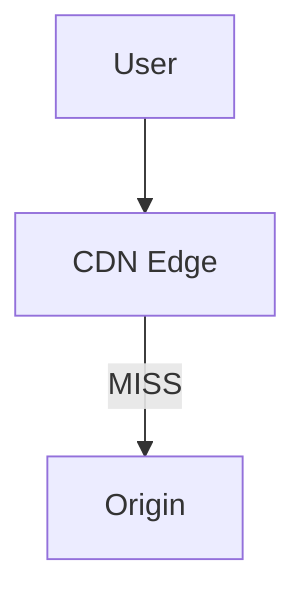

The CDN may then:

1. Request the content from the origin
2. Receive the response
3. Determine whether it can cache it
4. Store it if appropriate
5. Return the response to the user

Conceptually:

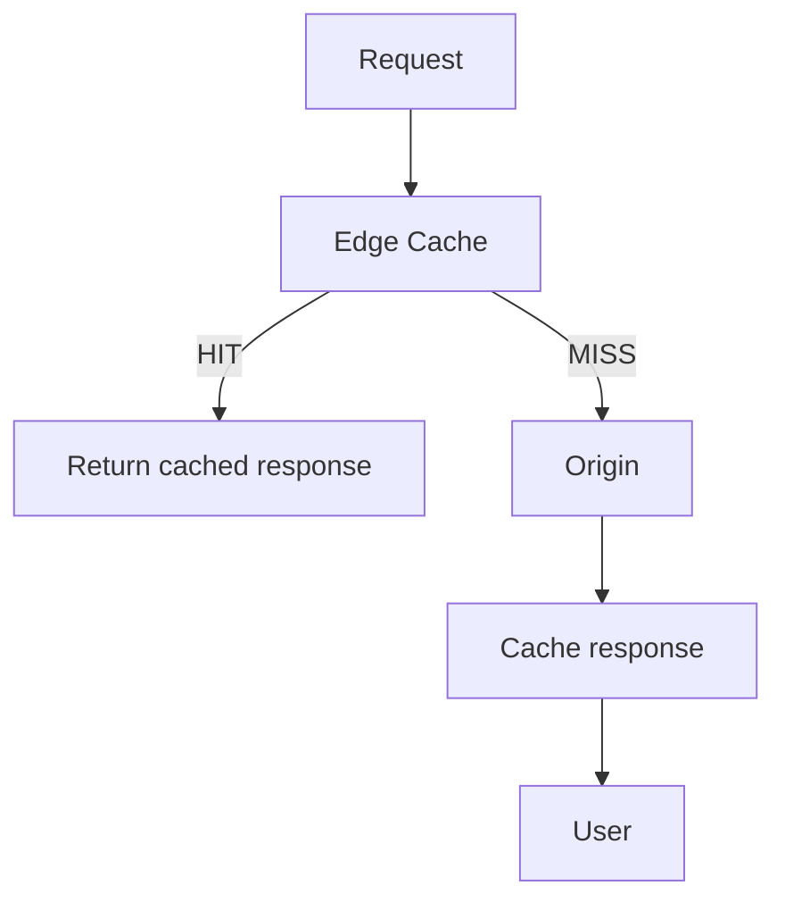

---

# 9. Why CDN Cache Hits Matter

Suppose an image is requested one million times.

Without CDN caching:

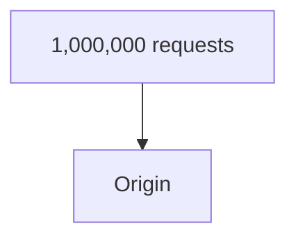

With CDN caching:

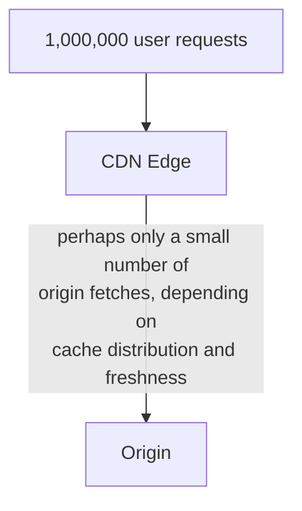

The exact reduction depends on:

* Number of edge locations
* Cache TTL
* Cache key
* Request distribution
* Cache capacity
* Content popularity
* Cacheability rules
* Invalidation frequency

So:

> **A CDN does not magically eliminate origin traffic. It reduces origin traffic when content can be effectively cached and reused.**

---

# 10. CDN and Latency

Suppose the origin is far away.

Without CDN:

```text
User
 |
 |------------------------------|
 |                              |
 v                              v
User                         Origin
```

With CDN:

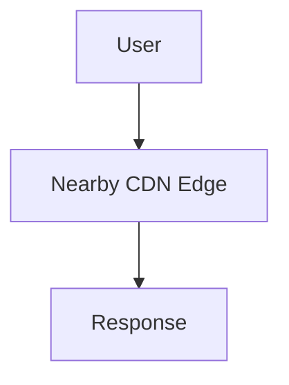

The CDN can reduce the network distance involved in delivering cached content.

However, remember:

> **A CDN mainly improves delivery of content that can be served from the CDN.**

If every request must travel to the origin because the response cannot be cached, the CDN may provide less latency benefit for that request.

---

# 11. Static Content

CDNs are particularly useful for static content.

Examples:

* JavaScript files
* CSS files
* Images
* Fonts
* Videos
* Downloads
* Public documents

For example:

```text
app.js
logo.svg
product.webp
font.woff2
```

These files often have high reuse.

A typical architecture:

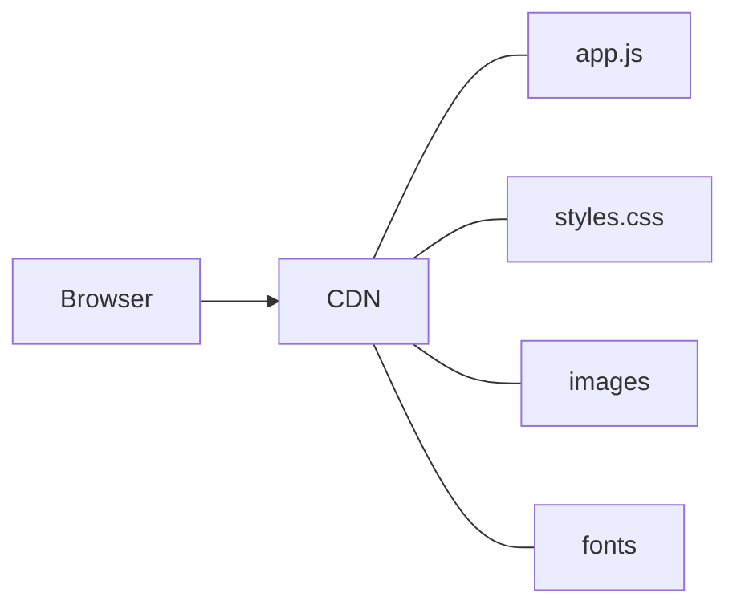

The origin does not need to repeatedly serve every copy.

---

# 12. Dynamic Content

CDNs can also participate in delivering dynamic HTTP responses.

For example:

```text
GET /products
GET /news
GET /public-api
```

But dynamic content requires more careful caching rules.

Consider:

```text
GET /profile
```

The response may depend on:

```text
Logged-in user
Authorization
Cookies
Permissions
```

Caching it incorrectly could expose one user's data to another user.

Therefore:

> **The important question is not "Is this an API?" but "Can this representation be safely reused for another request?"**

---

# 13. Public vs Personalized Content

Compare:

### Public content

```text
GET /products/123
```

Response:

```text
Product 123
Name: Laptop
Price: ₹50,000
```

If the response is identical for many users, CDN caching may be appropriate.

### Personalized content

```text
GET /account
```

Response:

```text
Welcome, Ranjit
Orders: ...
Balance: ...
```

This is user-specific.

A shared CDN cache must not accidentally serve one user's representation to another user.

Therefore, personalized responses require careful cache-control and cache-key design.

---

# 14. Pull CDN Model

One common CDN model is often described as **pull**.

The CDN retrieves content from the origin when needed.

Example:

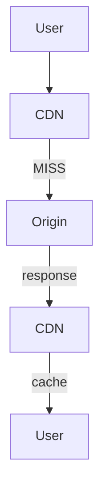

The CDN "pulls" the content from the origin.

This is convenient because the application does not necessarily need to manually upload every object to every CDN location.

---

# 15. Push CDN Model

A **push** model involves explicitly distributing content to CDN infrastructure.

Conceptually:

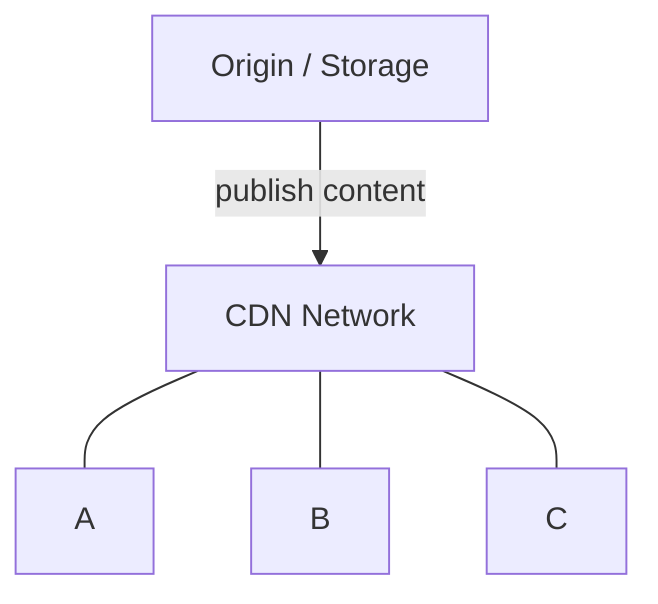

The content is proactively distributed.

This can make sense when:

* Content is known in advance
* Large files need controlled distribution
* Cache warming is important
* Predictable delivery is required

The exact behavior depends on the CDN provider and product.

---

# 16. Pull vs Push

| Model | Basic Idea                                     |
| ----- | ---------------------------------------------- |
| Pull  | CDN fetches content when needed                |
| Push  | Content is proactively distributed             |
| Pull  | Simpler for many web applications              |
| Push  | Useful when proactive distribution is valuable |

Neither model is universally better.

The choice depends on:

* Content size
* Traffic pattern
* Update frequency
* Distribution requirements
* CDN capabilities

---

# 17. CDN Cache Key

A CDN needs to determine:

> **Are these two requests asking for the same cacheable representation?**

This is where the **cache key** matters.

A simplified key might be:

```text
GET + URL
```

For example:

```text
GET /images/logo.png
```

But real HTTP responses may vary based on request properties.

For example:

```text
Accept-Encoding
Accept-Language
Authorization
Cookie
```

The cache key therefore cannot always be thought of as simply:

```text
URL = representation
```

---

# 18. Example of a Cache-Key Problem

Suppose:

```text
GET /page
```

returns different content depending on:

```text
Accept-Language
```

For example:

```text
English user → English page
French user  → French page
```

If the CDN incorrectly treats every request as the same cached representation:

```text
/page
```

it could return the wrong representation.

HTTP provides mechanisms such as `Vary` to communicate relevant request dimensions.

Conceptually:

```text
/page + English
/page + French
```

may represent different cacheable variants.

---

# 19. CDN and `Vary`

Suppose the origin responds:

```http
Vary: Accept-Language
```

This tells a cache that the response varies according to the `Accept-Language` request header.

Conceptually:

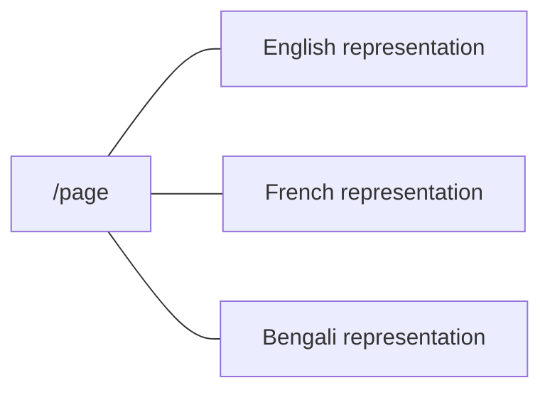

More variation can improve correctness but can also reduce cache reuse.

This is an important system-design trade-off:

> **More cache-key variation can improve representation correctness while reducing cache efficiency.**

---

# 20. TTL at the CDN

A CDN usually needs to know:

> **How long can this cached representation be considered fresh?**

This is where TTL becomes important.

Example:

```text
product.jpg
TTL = 1 hour
```

For the next hour, the edge may serve the cached representation according to the caching rules.

After expiration:

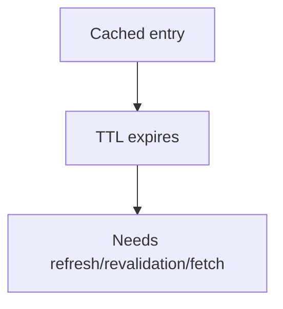

TTL is a **freshness policy**, not a guarantee that the underlying content can never change during that period.

---

# 21. Long TTL vs Short TTL

### Long TTL

```text
TTL = 7 days
```

Advantages:

* More cache reuse
* Lower origin traffic
* Fewer origin requests

Risk:

* Content may remain stale longer if not otherwise invalidated.

### Short TTL

```text
TTL = 30 seconds
```

Advantages:

* Faster natural refresh

Costs:

* More origin requests
* Lower cache efficiency
* More bandwidth and processing

Therefore:

> **TTL is a product and system-design decision about acceptable freshness versus origin efficiency.**

---

# 22. Cache Invalidation at the CDN

Sometimes waiting for TTL is not acceptable.

Suppose:

```text
homepage.html
```

contains an incorrect price.

You may need the old cached representation removed or replaced immediately.

This can involve:

```mermaid
flowchart TD
  accTitle: Purging
  accDescr: Purge / Invalidate, then CDN Edge Caches, then Old representation becomes unusable.
  N0["Purge / Invalidate"] --> N1["CDN Edge Caches"] --> N2["Old representation becomes unusable"]
```

The exact mechanism depends on the CDN.

Common concepts include:

* Purging an object
* Purging by URL
* Purging a group/tag
* Versioning
* Cache invalidation APIs

---

# 23. Versioned Assets

One of the simplest CDN-friendly strategies is **content versioning**.

Instead of:

```text
app.js
```

use:

```text
app.a81f92.js
```

When the file changes:

```mermaid
flowchart TD
  accTitle: A new version, a new URL
  accDescr: app.a81f92.js, then app.b92c71.js.
  N0["app.a81f92.js"] --> N1["app.b92c71.js"]
```

The URL changes.

The CDN sees:

```text
Different URL
      =
Different cache key
```

This can allow a long TTL for immutable assets.

Example:

```text
app.a81f92.js
Cache-Control: max-age=31536000
```

The application can safely reference a new filename when the content changes.

This approach is often called **cache busting** or **content fingerprinting**.

---

# 24. Why Versioning Is Powerful

Consider:

```text
app.js
```

with:

```text
TTL = 1 year
```

If the file changes, users may still have the old cached version.

Instead:

```text
app.v1.js
app.v2.js
```

Each version has a different identity.

The old version can naturally disappear from caches over time.

This reduces dependence on immediate global invalidation.

Mental model:

> **Change the identity of the content instead of trying to find and delete every old copy.**

---

# 25. Cache Warming

Suppose you know that a large event starts at:

```text
8:00 PM
```

and millions of users will request:

```text
/event/home
```

At 8:00 PM, many users may arrive simultaneously.

If the CDN has no cached copy:

```mermaid
flowchart TD
  accTitle: A cold cache at a big event
  accDescr: Millions of requests miss the CDN and reach the origin.
  N0["Millions of requests"] --> N1["CDN"] -->|"MISS"| N2["Origin"]
```

This can create a sudden origin load.

**Cache warming** means proactively getting important content into caches before demand arrives.

Conceptually:

```mermaid
flowchart TD
  accTitle: Cache warming
  accDescr: Before event, then Populate CDN, then Event starts, then Users receive cached content.
  N0["Before event"] --> N1["Populate CDN"] --> N2["Event starts"] --> N3["Users receive cached content"]
```

Cache warming can be useful for predictable traffic spikes.

---

# 26. Cache Warming Trade-Off

Cache warming is not free.

It can:

* Generate network traffic
* Consume cache capacity
* Fetch content before it is actually needed
* Waste resources if predictions are wrong

Therefore:

> **Warm caches when the expected demand justifies the cost.**

---

# 27. Origin Shielding

Consider a large CDN with many edge locations.

Multiple edges may need the same content.

Without additional protection:

```mermaid
flowchart TD
  accTitle: Every edge fetches from the origin
  accDescr: Edges A to E all fetch from the origin.
  subgraph G[" "]
    direction TB
    S0["Edge A"] ~~~ S1["Edge B"] ~~~ S2["Edge C"] ~~~ S3["Edge D"] ~~~ S4["Edge E"]
  end
  G --> T["Origin"]
```

The origin may receive many similar fetches.

An **origin shield** or intermediate caching layer can reduce this.

Conceptually:

```mermaid
flowchart TD
  accTitle: Origin shielding
  accDescr: Edges A to E fetch from a shield cache, which fetches from the origin.
  subgraph G[" "]
    direction TB
    S0["Edge A"] ~~~ S1["Edge B"] ~~~ S2["Edge C"] ~~~ S3["Edge D"] ~~~ S4["Edge E"]
  end
  G --> T["Shield Cache"]
  T --> O["Origin"]
```

The shield acts as an additional cache layer between edge locations and the origin.

---

# 28. Why Origin Shielding Helps

Suppose:

```text
100 edge locations
```

request the same object.

Without shielding:

```mermaid
flowchart TD
  accTitle: Without a shield
  accDescr: 100 edges, then Origin.
  N0["100 edges"] --> N1["Origin"]
```

With shielding:

```mermaid
flowchart TD
  accTitle: With a shield
  accDescr: 100 edges fetch from the shield, so the origin sees fewer fetches.
  E["100 edges"] --> S["Shield"] -->|"fewer origin fetches"| O["Origin"]
```

This can reduce:

* Origin request volume
* Repeated origin fetches
* Origin bandwidth
* Origin load

But it adds another layer of infrastructure and configuration.

---

# 29. CDN Cache Hierarchy

CDN architecture can contain multiple layers.

For example:

```mermaid
flowchart TD
  accTitle: CDN cache hierarchy
  accDescr: User, then Browser Cache, then CDN Edge, then CDN Shield, then Origin.
  N0["User"] --> N1["Browser Cache"] --> N2["CDN Edge"] --> N3["CDN Shield"] --> N4["Origin"]
```

Each layer has a different responsibility.

### Browser

Reuse content already stored on the user's device.

### CDN Edge

Serve content close to the user.

### CDN Shield

Reduce repeated requests reaching the origin.

### Origin

Provide authoritative content.

This is another example of an important system-design principle:

> **Multiple cache layers are useful when each layer has a clear responsibility.**

---

# 30. CDN vs Browser Cache

These are related but different.

### Browser cache

```mermaid
flowchart TD
  accTitle: Browser cache
  accDescr: The user device holds cached resources.
  U["User Device"] --- C["cached resources"]
```

The browser stores resources locally.

### CDN

```mermaid
flowchart TD
  accTitle: CDN
  accDescr: Many Users, then CDN Edge, then Origin.
  N0["Many Users"] --> N1["CDN Edge"] --> N2["Origin"]
```

The CDN provides shared infrastructure for many users.

Comparison:

| Browser Cache                         | CDN                                     |
| ------------------------------------- | --------------------------------------- |
| Located on user's device              | Located in CDN infrastructure           |
| Private to the user/browser context   | Can serve many users                    |
| Avoids network request                | Avoids origin request                   |
| Controlled through HTTP caching rules | Also governed by HTTP/CDN caching rules |
| Very close to user                    | Close to groups of users                |

A request may benefit from both:

```mermaid
flowchart TD
  accTitle: Browser miss, CDN hit
  accDescr: The browser misses its cache, and the CDN edge hits and returns the resource.
  N0["Browser"] -->|"browser miss"| N1["CDN Edge"] -->|"CDN hit"| N2["Browser"]
```

---

# 31. CDN vs Reverse Proxy

A reverse proxy sits in front of application servers.

A simplified architecture:

```mermaid
flowchart TD
  accTitle: A reverse proxy
  accDescr: Client, then Reverse Proxy, then Application.
  N0["Client"] --> N1["Reverse Proxy"] --> N2["Application"]
```

A CDN is a geographically distributed delivery network.

```mermaid
flowchart TD
  accTitle: A CDN
  accDescr: The client is served by several edges, with the origin behind them.
  C["Client"]
  C --- G
  subgraph G[" "]
    direction TB
    E0["Edge"] ~~~ E1["Edge"] ~~~ E2["Edge"]
  end
  C --> O["Origin"]
```

There can be overlap in functionality.

A reverse proxy may cache responses.

A CDN edge also behaves as a reverse proxy/cache in many architectures.

The important distinction is architectural responsibility:

> **A reverse proxy primarily represents the origin infrastructure; a CDN additionally provides geographically distributed content delivery.**

---

# 32. CDN and Load Balancers

A CDN and load balancer solve different problems.

### CDN

Primarily helps with:

* Content delivery
* Edge caching
* Geographic distribution
* Origin offloading

### Load balancer

Primarily helps with:

* Distributing requests among backend instances
* Health-aware routing
* Backend availability
* Horizontal scaling

They can work together:

```mermaid
flowchart TD
  accTitle: CDN in front of a load balancer
  accDescr: Users reach the CDN, then a load balancer that spreads requests over App 1, App 2 and App 3.
  U["Users"] --> C["CDN"] --> L["Load Balancer"]
  L --- A["App 1"]
  L --- B["App 2"]
  L --- D["App 3"]
```

---

# 33. CDN and Application Caching

Application cache:

```mermaid
flowchart TD
  accTitle: Application cache
  accDescr: Application, then Redis, then Database.
  N0["Application"] --> N1["Redis"] --> N2["Database"]
```

CDN:

```mermaid
flowchart TD
  accTitle: CDN in front of the application
  accDescr: User, then CDN, then Application.
  N0["User"] --> N1["CDN"] --> N2["Application"]
```

They prevent different kinds of work.

### CDN

Prevents requests from reaching the origin.

### Application cache

Prevents the application from repeatedly performing expensive data-access or computation work.

They can coexist:

```mermaid
flowchart TD
  accTitle: Both caches
  accDescr: The user misses the CDN, reaches the application, misses Redis and reaches the database.
  N0["User"] --> N1["CDN"] -->|"MISS"| N2["Application"] --> N3["Redis"] -->|"MISS"| N4["Database"]
```

A single request can encounter multiple caching layers.

---

# 34. CDN and HTTP Caching

CDNs rely heavily on HTTP caching semantics.

Important concepts include:

```text
Cache-Control
ETag
Last-Modified
Vary
Expires
```

For example:

```http
Cache-Control: public, max-age=3600
```

The CDN can use the response's caching rules to determine how it may reuse the representation.

This connects directly to the previous chapter:

> **HTTP caching defines the protocol-level rules; a CDN provides distributed infrastructure that applies those rules at the edge.**

---

# 35. CDN and Security

A CDN can also sit at the edge of the security boundary.

Example:

```mermaid
flowchart TD
  accTitle: Edge security
  accDescr: Internet, then CDN / Edge Security, then Origin.
  N0["Internet"] --> N1["CDN / Edge Security"] --> N2["Origin"]
```

Depending on the service, edge infrastructure may provide features such as:

* TLS termination
* Request filtering
* Web application firewall capabilities
* DDoS mitigation
* Rate limiting
* Bot management
* Access controls

The exact security capabilities depend on the CDN provider and configuration.

Important principle:

> **A CDN can be part of the security architecture, but CDN caching and security are separate responsibilities that must be configured correctly.**

---

# 36. CDN and DDoS Protection

A CDN can absorb traffic across a distributed network rather than forcing all traffic directly onto one origin.

Conceptually:

```mermaid
flowchart TD
  accTitle: Absorbing large traffic
  accDescr: Large traffic volume is spread across the edges of a distributed CDN in front of the origin.
  T["Large traffic volume"] --> D["Distributed CDN"]
  D --- A["Edge"] & B["Edge"] & C["Edge"]
  A & B & C --- J@{ shape: sm-circ }
  J --> O["Origin"]
```

This can protect the origin from some forms of traffic overload.

However:

> **A CDN does not make an application automatically protected from every denial-of-service attack.**

Protection depends on:

* CDN configuration
* Capacity
* DDoS protection mechanisms
* Application behavior
* Origin protection
* Rate limiting
* Security controls

---

# 37. CDN Failure Scenario: Origin Is Down

Suppose:

```text
CDN
 |
 v
Origin
 X
```

If the CDN has a valid cached representation, it may still be able to serve that content depending on its configured behavior.

```mermaid
flowchart TD
  accTitle: Serving while the origin is down
  accDescr: The CDN serves cached content to the user.
  N0["User"] --> N1["CDN"] -->|"cached content"| N2["User"]
```

This can provide a degree of resilience for cacheable content.

But dynamic requests that require the origin may still fail.

Therefore:

> **Caching can provide limited resilience, but a CDN is not a replacement for origin reliability.**

---

# 38. CDN Failure Scenario: Cache Miss Storm

Suppose a highly popular object expires.

Millions of users request it around the same time:

```mermaid
flowchart TD
  accTitle: A cache miss storm
  accDescr: Millions of requests miss the CDN and reach the origin.
  N0["Millions of requests"] --> N1["CDN"] -->|"MISS"| N2["Origin"]
```

This can create a sudden origin load.

This connects directly to **cache stampede**.

Possible protections include:

* Request coalescing
* Cache locking
* Origin shielding
* Stale serving
* Background refresh
* Cache warming
* Appropriate TTLs

The correct strategy depends on the workload.

---

# 39. CDN Failure Scenario: Incorrect Cache

A dangerous scenario is not simply:

```text
Cache unavailable
```

but:

```text
Cache works incorrectly
```

For example:

```mermaid
flowchart TD
  accTitle: Caching a personalized page
  accDescr: User A requests /profile, then CDN caches personalized response, then User B requests /profile, then User A's response returned.
  N0["User A requests /profile"] --> N1["CDN caches personalized response"] --> N2["User B requests /profile"] --> N3["User A's response returned"]
```

This is a security problem.

Therefore:

> **Cache correctness is more important than cache hit ratio.**

A cache that serves the wrong representation is not a successful cache.

---

# 40. CDN Failure Scenario: Stale Content

Suppose:

```text
Origin = new version
CDN    = old version
```

This can happen because:

* TTL has not expired
* Invalidation has not completed
* A cache layer was missed
* Different edges have different states
* Revalidation has not occurred

The system must decide:

> **How much stale content is acceptable?**

That is a product and architecture decision.

---

# 41. CDN and Multi-Region Architecture

A CDN can distribute content globally without requiring the entire application to run in every region.

For example:

```mermaid
flowchart TD
  accTitle: Regional edges, one origin
  accDescr: The CDN has India, EU and US edges, all in front of one origin.
  C["CDN"] --- I["India Edge"] & E["EU Edge"] & U["US Edge"]
  I & E & U --- O["Origin"]
```

For cacheable content, users can receive content from nearby edges.

A more complex architecture might use multiple origins:

```mermaid
flowchart TD
  accTitle: Multi-region origins
  accDescr: The CDN fronts origins in India and the US.
  C["CDN"] --- I["Origin India"]
  C --- U["Origin US"]
```

This introduces additional concerns:

* Origin selection
* Data consistency
* Failover
* DNS/routing
* Replication
* Deployment coordination

A CDN does not automatically solve these problems.

---

# 42. CDN Does Not Mean "Everything Is Cached"

A common beginner misconception is:

> "If I use a CDN, all requests are cached."

Not true.

A CDN can cache only when:

* The response is cacheable
* Cache policy allows it
* The request/response identity is understood
* Security requirements allow sharing
* The CDN configuration permits it

For example:

```text
Public image
    → highly cacheable

Private account data
    → usually requires private/non-shared handling

Real-time transaction
    → often not appropriate for shared caching
```

---

# 43. CDN Does Not Replace the Database

Another misconception:

```mermaid
flowchart TD
  accTitle: A wrong assumption
  accDescr: CDN, then No database needed.
  N0["CDN"] --> N1["No database needed"]
```

A CDN is not a database.

The architecture is more like:

```mermaid
flowchart TD
  accTitle: The database is still there
  accDescr: On a cache miss, the request goes past the CDN to the application and the database.
  N0["User"] --> N1["CDN"] -->|"cache miss"| N2["Application"] --> N3["Database"]
```

The CDN reduces repeated work.

It does not become the authoritative system of record.

---

# 44. CDN Does Not Fix Slow Application Logic

Suppose:

```text
GET /recommendations
```

requires:

* Complex computation
* User-specific data
* Real-time database queries

If it cannot be safely shared and cached, every request may still reach the application.

A CDN cannot magically optimize:

```mermaid
flowchart TD
  accTitle: Slow application logic
  accDescr: Application, then Slow algorithm, then Slow database query.
  N0["Application"] --> N1["Slow algorithm"] --> N2["Slow database query"]
```

For those problems, you may need:

* Query optimization
* Database indexes
* Application caching
* Better algorithms
* Asynchronous processing
* Horizontal scaling

The CDN is only one layer.

---

# 45. CDN Cache Efficiency

Important metrics include:

### Cache hit ratio

```text
Cache Hits
-------------------------
Total Cacheable Requests
```

Higher can mean more requests are being served from cache.

But it is not enough.

Also consider:

* Origin request rate
* Origin bandwidth
* Cache miss rate
* Latency
* Cache eviction
* Cache capacity
* Error rate
* Stale responses
* Security correctness

A high hit ratio with incorrect responses is still a bad system.

---

# 46. A Simple CDN Performance Example

Imagine:

```text
10 million requests/day
```

Suppose:

```text
80% CDN cache hit
20% CDN cache miss
```

Approximately:

```text
10,000,000 × 80%
= 8,000,000 cache hits
```

and:

```text
10,000,000 × 20%
= 2,000,000 origin-reaching requests
```

The CDN has prevented a large number of requests from reaching the origin.

But this is only a simplified calculation.

Real systems must also consider:

* Different URLs
* Different edge locations
* Cache expiration
* Request variation
* Cacheability
* Revalidation
* Traffic distribution

---

# 47. CDN and Content Popularity

Not all content is equally useful to cache.

Consider:

```text
Popular:
product/123
product/456
homepage
```

and:

```text
Rare:
user-generated-file-9834721
```

Popular content is more likely to be reused before eviction.

This is one reason **access patterns** matter.

A CDN works best when content has enough reuse to justify caching.

---

# 48. CDN Cache Capacity

CDN edge locations have finite storage.

If too many objects compete for cache space:

```text
Cache
+--------------------+
| A B C D E F G H I |
+--------------------+
          |
          v
       Full
```

Some objects may be evicted.

A frequently requested object is more likely to remain useful than a rarely requested object, depending on the CDN's caching and eviction policies.

Therefore:

> **Caching is a resource-allocation problem.**

---

# 49. CDN and Large Files

CDNs are particularly useful for large files.

Examples:

```text
Videos
Software downloads
Game updates
Large images
Documents
```

Without a CDN:

```mermaid
flowchart TD
  accTitle: Large files without a CDN
  accDescr: Millions of users, then Large origin bandwidth demand.
  N0["Millions of users"] --> N1["Large origin bandwidth demand"]
```

With a CDN:

```mermaid
flowchart TD
  accTitle: Large files with a CDN
  accDescr: Millions of users, then Distributed CDN edges, then Reduced repeated origin delivery.
  N0["Millions of users"] --> N1["Distributed CDN edges"] --> N2["Reduced repeated origin delivery"]
```

The CDN can distribute the content across its infrastructure.

---

# 50. CDN for Video

Video platforms commonly divide media into smaller segments.

Conceptually:

```mermaid
flowchart LR
  accTitle: Video segments
  accDescr: A video is split into segments 001 to 004.
  R["video"]
  R --- K0["segment-001"]
  R --- K1["segment-002"]
  R --- K2["segment-003"]
  R --- K3["segment-004"]
```

These segments can be distributed through CDN infrastructure.

A user may retrieve:

```text
segment-001
segment-002
segment-003
...
```

from CDN locations.

This can dramatically reduce the amount of repeated media delivery that must originate from the central application infrastructure.

---

# 51. CDN and Request Routing

The user does not normally need to know which edge server to contact.

The CDN handles routing.

Conceptually:

```mermaid
flowchart TD
  accTitle: Request routing
  accDescr: The user request goes to CDN routing, which picks Edge A, B or C.
  U["User"] -->|"request"| R["CDN Routing"]
  R --- A["Edge A"]
  R --- B["Edge B"]
  R --- C["Edge C"]
```

The actual mechanisms can involve:

* DNS
* Anycast
* Network routing
* Provider-specific routing systems

The important system-design idea is:

> **The CDN hides the complexity of selecting an appropriate edge from the application user.**

---

# 52. A Complete CDN Architecture

A common web architecture might look like:

```mermaid
flowchart TD
  accTitle: A complete CDN architecture
  accDescr: From the internet, the CDN serves from two edge caches, backed by an origin shield, then a load balancer over App 1, App 2 and App 3, an app cache and the database.
  I["Internet"] --> C["CDN"]
  C --- E1["Edge Cache"] & E2["Edge Cache"]
  E1 & E2 --> S["Origin Shield"] --> L["Load Balancer"]
  L --> A1["App 1"] & A2["App 2"] & A3["App 3"]
  A1 & A2 & A3 --> K["App Cache"] --> D["Database"]
```

Notice that each layer has a different responsibility.

---

# 53. Request Walkthrough

Let's trace:

```text
GET /images/product-123.webp
```

### Step 1 — Browser

Browser checks its cache.

```text
Browser HIT?
```

If yes:

```text
Return locally
```

No network request is required.

---

### Step 2 — CDN

If browser misses:

```text
Request → CDN
```

CDN checks its edge cache.

```text
CDN HIT?
```

If yes:

```text
Return from edge
```

---

### Step 3 — Shield

If edge misses:

```text
Edge → Shield
```

Shield checks its cache.

---

### Step 4 — Origin

If shield misses:

```text
Shield → Origin
```

The origin provides the content.

---

### Step 5 — Response

The response can travel back:

```mermaid
flowchart TD
  accTitle: The response travels back
  accDescr: Origin, then Shield, then Edge, then User.
  N0["Origin"] --> N1["Shield"] --> N2["Edge"] --> N3["User"]
```

Relevant layers may store the representation according to their caching rules.

---

# 54. CDN Decision Framework

When deciding whether to use CDN caching, ask:

### Question 1

Can the content be safely reused?

```text
YES → continue
NO  → do not shared-cache it
```

### Question 2

Is the content requested repeatedly?

```text
YES → caching may help
NO  → benefit may be small
```

### Question 3

How fresh must it be?

```text
Very fresh → short TTL / revalidation
Less sensitive → longer TTL
```

### Question 4

Can the content be versioned?

```text
YES → long-lived immutable caching may be possible
NO  → invalidation/revalidation becomes more important
```

### Question 5

What happens if the origin is unavailable?

Consider:

* Serve stale?
* Fail request?
* Use another origin?
* Retry?

---

# 55. When Should You Use a CDN?

A CDN is especially useful when you have:

* Geographically distributed users
* High traffic
* Large static assets
* Public content
* Video/media delivery
* Downloadable files
* Cacheable API responses
* High origin bandwidth
* Latency-sensitive content

---

# 56. When Might a CDN Provide Limited Benefit?

A CDN may provide less benefit when:

* Traffic is very small
* Users are concentrated near the origin
* Content changes constantly
* Responses are highly personalized
* Requests cannot safely be shared
* Cache hit rates are extremely low
* The application is dominated by database work

The correct answer depends on actual workload.

---

# 57. CDN Trade-Offs

| Benefit                             | Cost / Risk                    |
| ----------------------------------- | ------------------------------ |
| Lower latency for cacheable content | Additional infrastructure      |
| Reduced origin traffic              | Cache configuration complexity |
| Geographic distribution             | Invalidation complexity        |
| Reduced origin bandwidth            | Stale content risk             |
| Better large-file delivery          | Cache-key mistakes             |
| Edge security capabilities          | Vendor dependency              |
| Origin protection                   | More layers to debug           |

A CDN is therefore not simply:

```text
Add CDN → everything becomes faster
```

Instead:

```mermaid
flowchart TD
  accTitle: Design from the workload
  accDescr: Workload, then Cacheability, then Traffic pattern, then Freshness requirements, then CDN design.
  N0["Workload"] --> N1["Cacheability"] --> N2["Traffic pattern"] --> N3["Freshness requirements"] --> N4["CDN design"]
```

---

# 58. CDN and Vendor Lock-In

CDNs can become deeply integrated into a system.

Applications may depend on:

* Provider-specific cache rules
* Purge APIs
* Edge functions
* Security rules
* Routing
* Custom configuration
* Monitoring
* Deployment workflows

Therefore, ask:

> **If we had to replace the CDN, how much application logic would need to change?**

A useful architecture keeps the application relatively independent of CDN-specific behavior where practical.

---

# 59. Practical Investigation Workflow

If an application has slow global delivery:

### Step 1 — Identify the content

```text
Static?
Dynamic?
Personalized?
Large?
Frequently requested?
```

### Step 2 — Measure geography

```text
Where are users?
Where is the origin?
```

### Step 3 — Measure cacheability

```text
Can the response safely be reused?
```

### Step 4 — Check cache behavior

Measure:

* Cache hit ratio
* Cache miss rate
* TTL
* Revalidation
* Cache key variation

### Step 5 — Check origin impact

Measure:

* Origin request rate
* Origin bandwidth
* Application load
* Database load

### Step 6 — Check correctness

Verify:

* No private-data leakage
* Correct content variation
* Correct invalidation
* Correct freshness

### Step 7 — Optimize

Possible actions:

```mermaid
flowchart TD
  accTitle: Optimizing a CDN
  accDescr: Better cache headers, then Versioned assets, then Longer safe TTL, then Better cache key, then Origin shielding, then Cache warming.
  N0["Better cache headers"] --> N1["Versioned assets"] --> N2["Longer safe TTL"] --> N3["Better cache key"] --> N4["Origin shielding"] --> N5["Cache warming"]
```

Only apply changes justified by measurements.

---

# 60. Hands-On Lab — Build a Simple CDN Simulation

This lab demonstrates the core idea without requiring a commercial CDN.

## Goal

Simulate:

```mermaid
flowchart TD
  accTitle: The lab architecture
  accDescr: The client reaches the CDN cache: a hit, or a miss that goes to the origin.
  C["Client"] --> K["CDN Cache"]
  K --- H["HIT"]
  K --- M["MISS"] --> O["Origin"]
```

---

## Step 1 — Create an Origin

Create a simple HTTP server.

For example:

```text
GET /data.json
```

returns:

```json
{
  "message": "Hello from origin",
  "version": 1
}
```

---

## Step 2 — Create a Simple CDN Layer

The CDN simulation should:

1. Receive the request
2. Generate a cache key
3. Check local cache
4. Return a hit if valid
5. Fetch from origin on miss
6. Store the response
7. Return the response

Pseudo-flow:

```mermaid
flowchart TD
  accTitle: The simulated CDN layer
  accDescr: Generate a cache key and check the cache. HIT: return. MISS: fetch from the origin, store in the cache and return.
  R["Request"] --> G["Generate Cache Key"] --> C["Check Cache"]
  C -->|"HIT"| H["Return"]
  C -->|"MISS"| O["Origin"] --> S["Store Cache"] --> T["Return"]
```

---

## Step 3 — Add TTL

Store:

```text
value
created_at
expires_at
```

Example:

```text
TTL = 10 seconds
```

Then:

```text
if current_time < expires_at:
    CACHE HIT
else:
    CACHE MISS
```

---

## Step 4 — Add Metrics

Track:

```text
cache_hits
cache_misses
origin_requests
```

Display:

```text
Cache Hits:       80
Cache Misses:     20
Origin Requests:  20
```

Calculate:

```text
Hit Ratio =
Hits / (Hits + Misses)
```

---

## Step 5 — Test Different TTLs

Try:

```text
TTL = 5 seconds
TTL = 30 seconds
TTL = 300 seconds
```

Observe:

* Cache hits
* Origin requests
* Freshness
* Response behavior

---

## Step 6 — Add Versioned Assets

Test:

```text
/app.v1.js
```

Then deploy:

```text
/app.v2.js
```

Observe that the CDN treats them as different cache keys.

---

## Step 7 — Simulate Invalidation

Add:

```text
PURGE /data.json
```

The cache entry should become unusable.

Then:

```text
GET /data.json
```

should fetch fresh data from the origin.

---

## Step 8 — Simulate Multiple Users

Generate requests from:

```text
User A
User B
User C
...
User N
```

Request the same resource repeatedly.

Observe:

```mermaid
flowchart TD
  accTitle: Many users, few origin requests
  accDescr: Many user requests, then CDN cache, then Few origin requests.
  N0["Many user requests"] --> N1["CDN cache"] --> N2["Few origin requests"]
```

---

## Challenge

Modify the simulation so that:

```text
GET /profile
```

contains user-specific data.

Then answer:

> Should the CDN share this response between users?

Explain why or why not.

---

# 61. Common CDN Mistakes

## Mistake 1 — Caching Everything

Not every response should be shared.

---

## Mistake 2 — Ignoring Cache Keys

Different representations may require different cache identities.

---

## Mistake 3 — Using Long TTL Without a Freshness Strategy

Long TTL can create stale content.

---

## Mistake 4 — Treating Invalidation as Instant Everywhere

Distributed caches may take time to converge depending on the mechanism.

---

## Mistake 5 — Forgetting Personalized Data

Incorrect shared caching can become a security issue.

---

## Mistake 6 — Assuming CDN Fixes Backend Performance

A CDN does not optimize:

```text
slow SQL
slow algorithms
database contention
application CPU
```

for requests that still reach the origin.

---

## Mistake 7 — Measuring Only Hit Ratio

A high hit ratio does not guarantee:

* Correctness
* Low latency
* Fresh content
* Low origin load
* Good cache efficiency

---

## Mistake 8 — Adding Too Many Cache Layers

Every layer adds:

* Complexity
* Configuration
* Debugging difficulty
* Invalidation concerns

Add layers because they solve a real problem.

---

# 62. CDN in the Bigger System

The CDN is one part of a larger performance architecture.

A request may travel through:

```mermaid
flowchart TD
  accTitle: CDN in the bigger system
  accDescr: User, then Browser Cache, then CDN, then Reverse Proxy, then Load Balancer, then Application, then Application Cache, then Database.
  N0["User"] --> N1["Browser Cache"] --> N2["CDN"] --> N3["Reverse Proxy"] --> N4["Load Balancer"] --> N5["Application"] --> N6["Application Cache"] --> N7["Database"]
```

Each layer can reduce a different type of work.

The key is not to memorize the diagram.

Ask:

> **What work does each layer prevent?**

---

# 63. The System Design View

CDN design is fundamentally about **placing reusable work closer to demand**.

Instead of:

```mermaid
flowchart TD
  accTitle: Without a CDN
  accDescr: Every user, then Central origin.
  N0["Every user"] --> N1["Central origin"]
```

we move reusable content outward:

```mermaid
flowchart TD
  accTitle: With a CDN
  accDescr: CDN edges serve the users, with the origin behind them.
  E["CDN Edge"] --- A["Users"] & B["Users"] & C["Users"]
  A & B & C --- O["Origin"]
```

This is a recurring system-design pattern:

> **Move frequently reused data or computation closer to where it is needed.**

The same idea appears in:

* Browser caches
* Application caches
* Database replicas
* Read replicas
* Edge computing
* Materialized views

The implementation differs, but the underlying reasoning is similar.

---

# 64. CDN and the Evolution of a System

A small application may start with:

```mermaid
flowchart TD
  accTitle: Early system
  accDescr: Users, then Application, then Database.
  N0["Users"] --> N1["Application"] --> N2["Database"]
```

As traffic grows:

```mermaid
flowchart TD
  accTitle: Growing system
  accDescr: Users reach the CDN and a load balancer over two apps, in front of the database.
  U["Users"] --> C["CDN"] --> L["Load Balancer"]
  L --- A["App"] & B["App"]
  A & B --> D["Database"]
```

Later:

```mermaid
flowchart TD
  accTitle: Large system
  accDescr: The CDN serves from two edge caches in front of a load balancer over App 1 and App 2; App 1 uses an app cache in front of the database.
  C["CDN"] --- E1["Edge Cache"] & E2["Edge Cache"]
  E1 & E2 --- L["Load Balancer"]
  L --- A1["App 1"] & A2["App 2"]
  A1 --> K["App Cache"] --> D["Database"]
```

The architecture evolves because the bottlenecks evolve.

Do not add every component from the beginning.

---

# 65. CDN Decision Checklist

Before adding CDN caching, ask:

```text
1. What content are we serving?
2. Can it be safely shared?
3. How frequently is it requested?
4. How geographically distributed are users?
5. How fresh must it be?
6. What should the cache key contain?
7. What is the TTL?
8. How will invalidation work?
9. What happens during origin failure?
10. What happens during cache miss spikes?
11. What metrics will we monitor?
12. How difficult will CDN replacement be?
```

These questions are more valuable than simply knowing the definition of a CDN.

---

# 66. Key Principle

> **A CDN is a geographically distributed caching and delivery layer that serves reusable content closer to users, reducing latency and origin load while introducing additional decisions around cacheability, freshness, invalidation, routing, and correctness.**

Remember:

```mermaid
flowchart LR
  accTitle: Key principle
  accDescr: A CDN combines edge locations, a cache, origin fetch, TTL, cache key, invalidation, geographic delivery and origin protection.
  R["CDN"]
  R --- K0["Edge locations"]
  R --- K1["Cache"]
  R --- K2["Origin fetch"]
  R --- K3["TTL"]
  R --- K4["Cache key"]
  R --- K5["Invalidation"]
  R --- K6["Geographic delivery"]
  R --- K7["Origin protection"]
```

But the most important question is:

> **What expensive work can safely be avoided by serving this representation from the edge?**

---

# 67. Quick Reference

| Concept         | Meaning                                             |
| --------------- | --------------------------------------------------- |
| CDN             | Distributed content delivery infrastructure         |
| Edge            | CDN location serving users                          |
| Origin          | Source of content                                   |
| Cache Hit       | Content served from cache                           |
| Cache Miss      | Content must be obtained/revalidated                |
| TTL             | Freshness lifetime                                  |
| Purge           | Remove/invalidate cached content                    |
| Cache Key       | Identity used to find cached representation         |
| Pull            | CDN fetches content when needed                     |
| Push            | Content proactively distributed                     |
| Cache Warming   | Populate cache before demand                        |
| Origin Shield   | Intermediate cache protecting origin                |
| Hit Ratio       | Percentage of requests served from cache            |
| Versioned Asset | Resource with changed identity when content changes |

---

# 68. Knowledge Check

### 1. What is the main purpose of a CDN?

A. Replace the database
B. Execute business logic
C. Deliver reusable content closer to users
D. Replace the application server

**Answer:** C

---

### 2. What happens during a CDN cache hit?

A. The database must always be queried
B. The origin must always generate the response
C. The cached representation can be served from the CDN
D. The request must be rejected

**Answer:** C

---

### 3. What is the origin?

A. The user's browser
B. The authoritative source from which the CDN obtains content
C. A database index
D. A DNS record

**Answer:** B

---

### 4. Why is cache-key design important?

Because different requests may represent different cacheable representations.

---

### 5. Why can long TTL be dangerous?

Because cached content may remain stale for longer unless another freshness or invalidation mechanism changes that behavior.

---

### 6. Why is versioning useful for static assets?

Because changing the URL creates a new cache identity:

```mermaid
flowchart TD
  accTitle: Versioned assets
  accDescr: app.v1.js, then app.v2.js.
  N0["app.v1.js"] --> N1["app.v2.js"]
```

This allows aggressive caching while avoiding ambiguity about which version is being requested.

---

### 7. Does a CDN automatically make every API response cacheable?

No.

Cacheability depends on the request, response, security requirements, and caching policy.

---

### 8. What is origin shielding?

An intermediate caching layer that can reduce repeated requests from many edge locations reaching the origin.

---

### 9. Can a CDN replace a load balancer?

Not conceptually.

A CDN primarily addresses distributed content delivery and caching; a load balancer primarily distributes backend traffic across application instances.

They can work together.

---

### 10. What is the most dangerous CDN caching mistake?

Serving an incorrect representation to a request, especially exposing personalized or private data through shared caching.

---

# Next Chapter

**03.14 — Application-Level Caching**

The next chapter moves one layer inward.

A CDN can prevent requests from reaching the application, but many requests will still reach it.

We will examine how the **application itself** can avoid repeatedly performing expensive work.

The key question will be:

> **What if the request has already reached our application, but the application is about to repeat work it has already done before?**

---

# 70. Remember

```mermaid
flowchart TD
  accTitle: Remember
  accDescr: Browser cache: can the client reuse it? CDN: can an edge serve it? Reverse proxy: can we avoid reaching the application? Application cache: can we avoid repeating application/data work? Database: where is the authoritative data?
  A0["Browser Cache"] --> A1["#quot;Can the client reuse it?#quot;"]
  B0["CDN"] --> B1["#quot;Can an edge serve it?#quot;"]
  C0["Reverse Proxy"] --> C1["#quot;Can we avoid reaching the application?#quot;"]
  D0["Application Cache"] --> D1["#quot;Can we avoid repeating application/data work?#quot;"]
  E0["Database"] --> E1["#quot;Where is the authoritative data?#quot;"]
  A1 ~~~ B0
  B1 ~~~ C0
  C1 ~~~ D0
  D1 ~~~ E0
```

A CDN is therefore not simply a faster server.

It is a **distributed caching layer that changes where reusable content is served from**.

The system-design lesson is:

> **When the same work is repeatedly requested from geographically distributed users, consider whether that reusable result can be safely moved closer to the users.**
